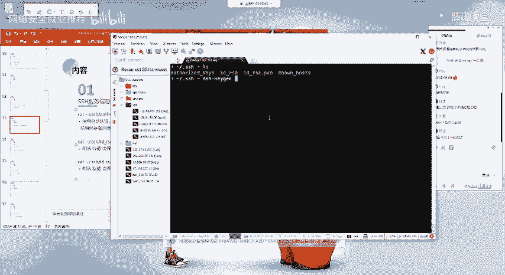
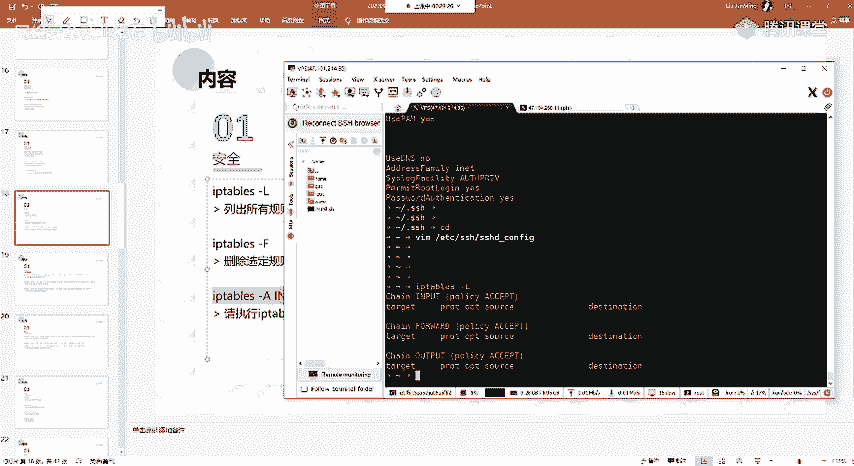

# P58：第24天：Linux主机信息收集 - 网络安全就业推荐 - BV1Zu411s79i

没有什么问题啊，好那么正式开始我们今天的一个课程内容，我们今天的话课程内容的话呃比较少啊，今天的一个课程热的话，就是linux的一个主机信息收集，就是说呃前面的话都是啊给大家说的多的一点。

说的多的一个系统的话，就是信息收集方面的话，都是在windows下面的一个主机信息收集对吧好，但是的话我们的一个linux的一个系统，也是大家常用的，也是常见的这样子的一个系统，而且的话就是说全球的话。

大部分的一个服务器的话，它都是使用的一个linux的一个系统，当然的话在内网的话，它同样的也会有这样的linux的一个主机对吧，啊我们本节课的话主要的话就是给大家介绍。

linux的linux系统下面的一些信息收集的一些命令，然后呃这里的话呃主要的话就是给大家介绍，就是说我们在linux系统下面的话呃，呃可以这么说嘛，但是的话呃就是说linux是呃在企业当中。

其实在内网的话，大多用的都是就是说你个人的一个组件啊，什么的，大多都是用的windows的一个系统嘛对吧，然后因为linux的一个系统的话可以这么说，就是说他的一个学习以及使用的话，是有一定的门槛的。

好哦，本节课的话主要就是带大家一起来了解一下，linux系统下面的一些，我们如何去收集他的一些信息，就是说收集一些对我们有用的一些信息，当然的话其实呃这一部分的一个内容的话，应该就是说我先问一下。

就咨询一下大家，就是说对linux的一个系统的一个了解程度，就大家呃有linux方面的一些基础吗，以及对相关的这样子的一些命令，有自己独立的去使用linux系统的一个经验。

没有就熟悉linux的在讨论区扣一啊，就是了解的扣二，不知道的扣三，了解co，呃大多都是了解的吧，就了解的一个程度是什么呢，就是只会一些简单的命令吗，还是做一些简单的命令，嗯好的，那么本节课的内容的话。

对呃对大家的话应该是没有什么难度，就是呃考虑到就是呃就只有这几位同学吗，其他同学呢就是还在的，其他同学就没有回的，都是了解是吧，没有说不知道的吗，就呃我这边的话就是有了解。

就是就大家不是填那个问卷调查吗，呃呃有有1/3吧，应该是有1/3左右的一个同学是呃，就是没有相应的这样子的一个，linux的一个基础的啊，其实啊前面在讲那个环境搭建的时候。

也要给大家介绍linux的一些基本的一个，呃结构对吧，好其他的也不多说了，应该大多是了解，那么本节课的一个内容的话就比较轻松了，就是大家呃听我介绍，然后的话我觉得就是啊，比较需要给大家介绍的话。

就重点介绍的话，我会给大家重点的书啊，然后首先第一部分的话就是啊，linux系统的一个架构，相关的一些信息的收集，就其实一些主要的一个命令，我p p t里面的话，内容的话都已经呃比较详细的列出来了。

就是相关的一个命令以及它的一个意思，好，就是便于大家在课后的话自己去进行一个巩固，然后在课上的话可能会比较简略的一个，给大家介绍，首先第一个的话就是your name杠a这个命令的话。

大家应该用的比较多吧，p s。

哦your name ga的话它是呃打印系统相关的一个信息，就是我们要去查看一个linux系统，它的一个呃信息的话，我们通常都会使用这个命令，your name，your name。

你直接输your name的话，他会只是输出一个linux，然后you name杠a的话，他会输出啊，就是说相关的系统的一个信息，然后这里列这里列出来的，它相关的一些信息的话。

其实我们通过your name盖h这个呃，看看help这个命令能够知道，就说它对应的是哪一个呃，哪一部分的一个内容，就是说他其实就有这么一些的一些选项，每一个选项的话。

它对应的查询的一个内容的话都是不一样的，然后在这边的话，首先第一个的话，就是刚才就是列出所有的这样的一个信息啊，然后下面这一部分的话，就是分别的对应上面的一个部，分的一个选项的一个输出。

比如说我们用name杠s，你可以看到你用name干s，他输的话输出的话就是linux对吧，也就是对应的我们这边的第一个，他这边干s y就是corner name，也就是你的一个内核名。

就是你当前的一个系统，是一个linux的一个系统是吧，它是一个linux的内核，好啊，杠n杠n的话就是输出你的一个node name，也就是你的一个节点，就其实啊我这边的话。

我这边的话我这边的话是使用了一个g s h啊，所以的话它没有显示全国的一个主机名，然后这边的话这一部分其实就是我的一个node name，也就是一个节点名，就是我的一个啊主机的一个名字。

然后这边杠杆的话，就是输出这边的一个内容对吧，其实就是对应的我这边，然后同理，后面的话都是一一的去进行一个对应的，然后杠a的话就是输出所有的嘛，就不你当然你要去查询你指定的一个信息的话。

你不需要输出所有的对吧，然后第二个的话就是cat啊，就是etc的issue嗯，这个这个的话它是一个文本文件，就主要是包含要在登录提示之前打印的消息，还有系统标识啊，这个的话，先给大家介绍一下吧。

就呃这边的话可以看到你这边输出的话，他是输出的这样子的一个内容，也就是你在啊去进行一个登录的时候，其实我这边的话，就我这边的话，原本的话输出的应该就是这一部分的一个诶，因为这边的话我是用的这个工具。

所以的话它会有加这样子的一些东西啊，就你实际去登录这样子的一个机器的话，它输出的话会是这样子的一个东西，就是告诉你当前的一个系统的一个版本，当然的话这边的这个内容的话，其实我们是可以改的。

就我们可以改成我们自己想要的，也就是在登录的时候，你可以去加相应的一个东西对吧，你也可以把它改成，就是像这样子的一个内容对吧，然后呃还有的话就是呃看，这个etc下面的有这样子的一个文件。

这个啊默认的话就是在比如说低变异系的，像我们的一个乌班图啊，还有那个呃那个卡里对吧，他们都是低变系的这样子的一个系统，所以所以的话这种系统的话，他他的一个他有这样子的一个文件，就etc下面有一个lsb。

点release的这样子的一个文件，我们想要去查看系统的它的一个信息，我们通常会去cat这个lsb，release，然后在这边的话，它会显示就是你当前的一个系统啊对吧，你的一个版本版本。

然而对应的就是说还有就是像red hat，也就是红帽系的，比如说centos的这样子的一个系统，比如说圣特20的这样子的一个系统的话，他是，它是会有一个这样子的一个呃red hat干release。

就你可以通过就是说在这个etc下面的一个文件，对吧，你不知道它是什么系统，你可以通过去cat这个系统下面的，这样子的一个文件，如果说有这个文件的话，那么它就是一个红帽系的。

就red hat系的这样子的一个linux的一个系统，你说的是什么什么工具啊，就我现在用的这个吗，还是什么，呃我现在用的话是这个工具啊，就，打开服务器显示的那个，就这个这个是一个希尔工具嘛。

你说的应该就是这个，这个是一个呃免费的一个工具，就是你在嗯他支持这个系统，就windows linux，还有mac os上面都可以使用这个工具，就我觉得这个工具的话是比较好用的。

然后下面的话就是这一个啊，查看linux内核的一个指定的一个版本，就是啊查看这里这边的话我就不一的去敲了呀，然后以及还有就是它编译的，像内核的这种gcc的一个版本，以及它编译的一个时间等等的。

一个详细的一个信息，以及同理，下面的这个也是啊啊类似的，呃呃第二个的话就是进程进程的话，其实是我们就是操作电池的时候，经常会去使用到的这样子的一些命令，就是说啊我们想要去查看我的一个程序。

我启动之后对吧，启动之后的话，它是启动的一个状态，以及它的一个啊启动的一个啊，它是否有没有启动对吧，比如说我们去今天一个端口，我们今天一个端口的话，他也会有这样子的一个啊进程对吧，就是说你的这个端口。

它是由什么样的一个程序去啊，今天的我们通常会去使用这样子的一个啊，p的一个命令，就常用的话是p杠e l f，还有啊p杠a ux，就我们可以列出当前的一个进程，但话啊你直接输入ps的话，它是会显示。

就是说你当前的这样子的一些可以使用的，一个shell。

啊啊ps杠e l f，然后在这的话它就会输出你当前系统下面的，就是啊一个进程，然后他分别比如说这边，比如说我找一个就是，比如说我当前就是我当前执行的这个，ps杠1f的这个命令对吧。

他同样的有这样子的进程，就这个的话是它的一个id，就进程id就是我们主要的话就关注这个p i d，以及这边的一个sam d是吧，就我们想要去查找对应的一个程序，它的一个p i d。

因为我们要去比如说我们要去结束这个进程。

我们需要通过这个pad来进行一个结束，以及呃，就是说可能就是你直接ps干e r f这样去打，打印的话，他输出的一个信息过多对吧，我只想要去就说查看，就是查看我指定的一个信息。

所以的话这个时候要配合我们的一个group，的一个命令，配合一个group的一个命令，就关于这个group的一个命令的话，它的功能很多啊，就很强大的一个呃工具，就是我们用用来做一个过滤筛选的。

当然的话你也不一定说去刻意学，你可以去学的话，也可以，就是你想要对linux更了解对吧，就是方便自己的一个使用的话，你可以去具体的去学一下这个命令，而我们常用的话就是用这个grp。

比如说我要去查看这里的一个啊s h d对吧，我只想要去列出，就是说包含有s h d这样子的一个字符的，这样子的一些进程对吧，然后在这边的话就列出来了，他会去我们这边列出来的一些信息当中去匹配。

是否有没有这样子的一个s hd的一个啊字符，如果有的话，它就会输出来对吧，这样子的话就便于我们找，我们就是针对性的去寻找，我们想要的这样子的一些信息是吧，以及ps干ps干ax。

其实呃输出的一个内容的话啊，都是一样的，就是你可以去看的话，它输出的一个内容的话对吧，都是没有太大区别的，呃呃第二个的话就是这个plc的这个文件，就这个pll c的这个目录的话。

其实前面讲进史的目录结构的话应该有说的吧，它是一个比较特殊的一个啊目录这个目录的话，它是一个虚拟的一个文件系统，呃在这个目录下面的话，我们其实经常的话，我们可以看一下，在这个目录下面的话。

你ios去查看的话，你会发现有这样子的一些数字对吧，这里的这些数字的话，其实对应的就是我们上面的有相应的一个进程，然后我们可以去这样子的一个进程当中，去查看它里面的这样子的一个，这这个进程。

所运行的相关的一些文件的一个信息，然后其实呃，像比如说，比如说我这边的话呃。

我今天搞的一个就是，就是啊我今天搞的这个就是啊，我们用来做作业的那个主机啊，我今天上去看的话，因为他一直发短信给我，我之前的话没去管，然后我今天的话就看了一下，看了一下他的这一个。

就是他说有一个低多少的一个木马是吧，要让我去处理，然后我今天呃因为给祖国庆生嘛对吧，就就就就摸会鱼，然后就研究一下，然后就没有去弄其他的一些东西，就看看这个，然后其实在这边的话他就有就发现了。

有这样子的一个进程，其实就是利用的那个给大家做作业的那个多克，然后被别人中了马，就是中了挖矿的，他用的就是多可的一个虚拟机的一个逃逸，然后呃在这边的话，如果大家有去看那个的话，他会有这样子。

像比如说你在阿里云上面对吧，阿里云上面的话有这样子的一个原安全中心，他抱着这样子的一个木马文件的一个路径对吧，你会发现有这样子的一个东西，我去讲这个好像不太好呃，就有这样子的一个东西。

就呃它会提示有这样子的一个路径对吧，这个路径，然后p l o c就是这个目录下面，然后有这样的1509对吧，这个1509的话，其实就是你的这个程序它的一个id，就是你的一个pid进程id。

然后的话在这个进程id下面的话，你可以去查看到对应的一个信息，在这边的话它就是通过那个tom cat的那个呃，管理员的一个后台的入口令对吧，他传了这样子的一个码，我以这个例子为例。

嗯就是呃大家再去做这做，做这种的话去查找你的这个进程，下面下面所运行的这样子的一个好文件的话，因为它是一个虚拟的一个文件系统，它每一个id他每一个进程id，它它里面会存有相应的这样子的一些文件。

就是他系统就是进程运行时候所需要的，这样子的一些信息的一个文件，像比如说配置啊，呃设备啊，系统的一些内存等等的这样子的一些东西，我们可以去这个目录下面，对应的一个进程id当中去查找，去查看。

好像ios杠l p l c，这边的话就是查看这个pad 99的一个信息对吧，就我们可以通过这样子的一个命令，来去查看对应的这样子的一个进程，比如说这边随便找一个进程，比如说呃其实就是查看这一个进程id。

它的里面的一个文件嘛，就是详细的一个信息是吧，哦哦还有一个就是这个top命令top的话，就是我们如果就是就大家搞运维啊什么的，就是linux主机的相关的这样子的一些，去看去监控进程等等的。

呃大家有能看到吗，我这边它提示就是是断了吗，还是怎么的，没有问题是吧，好的，就是呃经常会去使用这样子的一个top命令，来去显示我们的一个linux机器的，它的一个就活动对吧，因为他我们前面的话什么呀。

我们前面的话是通过大家能听到我声音吧，应该能能好，那应该是没有问题啊，他这怎么报这个呢，就是啊我们前面的话直接ps对吧，查看ps杠e r f查看的这些信息的话，它是就是你查看的这一会对吧。

他的这样子的一些信息，然后我们使用top命令的话，他能够去实时的去就是显示你当前的呃。

这里的所运行的，你当前系统下面，所运行的这样子的一些任务对吧，他会去实时的去啊更新，以及我们可以根据，就是比如说根据他的一个啊，运行的一个内存对吧，就是说它运行的一个内存的cpu的一个大小。

来进行一个排序是吧，就是我们能够去找到呃，当前系统下面有哪一些哪一个程序，它所占的一个cpu是最大的，以及它的一个存储啊对吧，然后在这边我这边的话，因为是一个阿里云的一个机器啊，阿里云机器的话。

他有这样子的一个阿里云盾啊。

他是占的最多的，啊关于这一个命令，他的一个详细的这样子的一个就是。

把它孵出来，关于这个命令他的一个详细的一个输出，我这边的话呃大概的说一下，就我们其实主要的话就关注啊，其实如果大家不搞运维的话对吧，其实也比较少用这个，当然的话这个命令也是常用的。

就我们只需要去关注这样子的一些信息，像比如说你的一个进程id对吧，以及还有cpu对吧，你cpu的一个占用的百分比，我们可以去查看，然后这边的话我就不一一的去说了，以及还有你的这个进程的一个优者。

也就是你当前的进程的一个所有者是吧。

然后第三个的话就是用户和组就是呃用户信息，还有主信息，我们可以通过这样子的一些命令，就常用的一个id i d的话，就是我们能够去查看到，当前的一个用户的一个ui d，还有g d，嗯这，啥呀。

我就不全屏了，我就这样吧，有时候我输入一个id对吧，然后在这边的话它会显示这样子的一个信息，这里的一个信息的话，它分别的对应的就是uid，也就是我们的一个用户id，就是为note。

也就是我当前的一个使用的一个用户的话，就是root ji的话就是啊组组啊，就是表示你当前的一个用户，它是处在处于什么组内，就是这里的一个root这边的一个group，也是啊表示你当前所处于的一个组。

也就是root组，因为我是一个root用户嘛，当然的话如果说你是一个普通用户，像比如说你通过web share，嗯对吧，你通过web share你得到的一个用户的一个权限，你可能是啊3w对吧。

相当有干贝，还有像阿帕奇这样子的一个，就是说这样子的一个普通的用户，像这一些用户的一个权限的话，就是你得到的，因为你是通过web share，其实你得到了一个权限的话，就是那个web服务器的一个啊权限。

这它的一个权限的话是比较低的一个权限，好哦，w的话就是显示登录到linux服务器的一个人人员，就比如说你当前的一个啊，你当前的这个啊机器它是由多个，就说有多个人去登录的对吧，那么你可以通过w来去查看到。

有哪一哪一些用户，就哪有哪哪几个登录的一个呃连接，然后在这边的话，我们可以查看到它的安全所登录的用户，以及它是从哪一个ip登录过来的，他登录的一个时间对吧，我们都能够去查看到，然后换mi的话。

这个的话应该不用多说对吧，windows linux下面都都都可以去使用这样的一个命令，来查看当前的一个用户啊。

t t y的话它是一个呃，怎么说呢，这个我百度1下吧，这个叫虚拟虚拟什么。

虚拟控制台，而关于详细的这个的话，你啊你想要去了解的话，你去百度1下吧，好吧，因为这个东西的话，说实话我没有说很去很关注，啊配置空出口就是你t t y的话，就是说大家都知道吧，就linux系统下面的话。

它有多个这样子的一个t t y的一个终端对吧。

然后的话他有每一个控制台的话，它有这样子的一个优先级吧，还是呃什么呢，说实话我比较我有点忘了，就是之前学linux的时候，然后的话你比如说你在，呃比如说我这边的一个卡里的一个机器对吧，它是有图形界面的。

然后是t t y g的话。

它是一个图形图形界面，然后的话t t y01 的话，像这种的话，它是一个它是一个就是没有图形界面的，然后我们切的话是ctrl加f几吧，锁掉了，然后可以看到我这边的话，就嵌入到了一个t t y5 。

就是ctrl加f5 的话对吧，我control加f4 的话就切入到了t t y4 ，就他这个的话它的每一个它是不同的一个啊，一个控制终端，然后的话呃他具体的一个区别的话，我我这边有点忘了呀。

你要去具体的去那个了解的话，你百度1下吧，好吧啊，呃就ctrl alt f8 的话，就是啊t t y f8 的话，就能够去切换到我们这边的一个图形界面，大家可以用自己的一个看你机器自己尝试一下。

就如果说你不想要这样子的一个图形界面对吧，你可以直接切换切换到其他的这种t t y，然后的话你登录进去就直接就是没有图形界面，直接是一个终端的一个形式。

好我们继续，呃刚才的话讲到了换麦，换麦，这个面的话就是输出你当前的一个用户嘛对吧，然后windows linux下面的话都是比较通用的啊，赶紧外卖诶，我这边，然后呃还有last nas的话。

就是显示最后一次登录的一个用户。

就说我们通过nas的话能够去查看到，当前的这样子的一个，就是说当前这一个系统下面，所最后登录的一个用户，在这边它会显示就是说啊登录的一个记录啊，我们通过nas的话能够查看到，就是呃比如说比如说啊。

因为我这边的话是只有我一个人在用，就是使用的一个root的一个用户登录的，然后在这的话我们可以看到，就是这个root用户他是在什么时候去登录的，以及它是从什么样子的一个ip登录的对吧。

他我们都能够去查看到以及在这边的一个时间。

就他是什么时候登录的对吧，就我们可以通过nas的命令来去查看，就说这个系统它的一个note用户，它是啊什么时候登录的，或者说它是就能够去确定这个系统，它的一个管理员对吧，他是是不是有在登录。

以及他最后登录的一个时间，呃呃last log，log的话就是打印我们上次登录的一个日子，我们直接执行之后的话，他会在这边的话，它会输出就是这样子的一个一些信息啊。

这边的一个信息的话应该啊比较好理解对吧，在这里的话，因为只有一个root用户啊，然后我们可以看到，在这里就是他登录的一个呃信息对吧，然后在这的话，我们可以看到是我这边是从这个ip过来的，登录过来的。

然后登录的一个时间。

然后呃还有其他的这样子的一些，就这边的话是其他的一些用户啊，对吧，我们通过就是c a t下面的一个password，在这个文件的话，我们能够去找到，查找到就是对应的有哪些用户嘛，这些系统的一些用户是吧。

然后如果说比如说你有一个普通的一个用户，然后的话你用普通的一个用户，你去进行一个登录，登录之后的话，他同样的会在这边有记录，就说你这个用户他是什么时候登录的，他从哪里登录过来的对吧，好像在这边的。

因为我只登录了一个root用户，其他用户其他的这些是一个内置的一些用户啊，它其实也是它是不允许去登录的是吧，他是low log，就这边的一个bh的话，它是一个no no log的话，就是说表示这个用户。

他是无法去进行一个登录的，但是的话因为他这种内置用户的话，它有它有相应的一个作用对吧，如果大家看自己的一个机器，有这种普通用户的话。

也会有这样你有登录过的话，他会有这样子的一个登录的一个记录，我们可以通过这个命令去查看哦。

呃还有的话就是这个etc password刚刚也说了对吧，这个文这个password这个文件的话，它里面的是存储的，当前系统下面的所有的一个用户的一个信息，呃，关于这个的话，我大概的说一下吧。

就这个文件就在后面应该也会讲，就这个etc password这个文件里面的话，它存储的当前系统所有的用户，我们这边的话以这个root用户为例，这首先第一个的话注意的话，它是每一个每一个就每一部分的内容。

它都是以这个冒号去做一个风格的，然后在这边的话是露腿这个任务，第二个的话就是一个x这边的一个x的话，其实是一个就是占位符，就它这边表示的话，就是说它原本的一个意思的话，其实就是说在之前的话。

在之前没有采用这样的一个模式的话，在这边它是一个用户密码的一个哈希值，就这边的话是保存的一个用户的密码，然后在这边用x去代替的话，就是我们后面的新的这样子的一个系统的话，它是他的一个用户名。

用户的一个密码的话，它不是存储在这样子的一个etc password的一个目录，下面的，就为什么它不存在这个目录下面呢，我们可以通过l s杠l来查看一下这个文件，这个文件它的一个权限。

其实我们在这边的话可以看到这个文件，它的一个权限的话，它是呃，主要的话看这两这边的r r的话就是表示读嘛，读取嘛就这边的这一串的一个权限的意思的话，就表示其他的任何用户。

就除了root用户的其他任何用户，它都有一个读的权限对吧，那么就是说如果说你是一个普通的用户，你是一个最低权限的用户，只要你是个用户的话，他都能够去读取读取这个文件的一个内容，那么如果说我们的一个密码。

哈希存储在这一个文件当中的话，普通用户，它同样的也能够去查看到它的一个哈希值对吧，那么如果说他的一个哈希值能够去，能够去被解密的话，那么那么我们就能够去得到相应的一个用户的，一个呃权限。

第二部分是同组用户的一个权限吗，你是说到这里吗，对吧，呃，前面在讲linux的时候不是有给大家讲吗，讲讲那个环境的时候呃，讲那个linux环境的一个搭建，对吧啊，你进来问的话，我再说一下吧。

就是这个的话这个权限的这里的这个权限的话，应该其实大部分学linux的话都，可能都刚开始接触的话都会比较迷啊对吧，就是对这里的这一串东西它是什么对吧，这边的话我再给大家就是既然有人问的话。

我就给大家再解释一下吧，好吧，那你你知道就是77770075，他是什么意思吗，对吧，你首先你需要知道吗，好吧，好哦，在这边我以这个为例对吧，我们诶这边不对，还有个r，前面还有个干我这边的话，我们看一下。

应该看得到这边的这个群，这边的话就是我们去查看我们的一个文件的话，它都会有这样子的一个东西对吧，就都有前面这样子的一串，那这一串表示什么意思呢，就是表示我们的一个权限，然而在这边话。

比如说我们是一个root root root对吧，是一个test的文件，那么这一个test的文件，我们怎么知道它是一个文件呢，我们看的话就是看到他的第一位，就这边的第一位的话，就是表示我们当前的这个呃。

当前的这个东西它是什么样子的，它是一个什么东西，对吧，它可能是一个文件对吧，它可能是一个目录，还有它可能是一些啊设备文件对吧，那么在这边的话，我们通过查看这里的这一个就是第一。

第一部分的这个东西来去判断，这边前面这里一个干的话，就是表示它是一个文件，也就是表示我们这边test是一个文件，如果是常用的，像比如说有个d对吧，那么就表示我们这个是一个目录。

我们找一个目录来看一下好吧，比如说就etc这个目录对吧，可以看到这边的话它就是一个d开头的啊，我们要去查看目录的话，在这里也提一下，就我们要去查看目录的话，就是你ios你要去查看目录的一个信息。

要加这个干d的一个参数，其实d的话就大家学linux不要去死学，就是要活活学，其实这些命令的话，其实命令的一些参数的话都是很容易记的，就是你要当的话，你需要有相应的一个linux的啊，不啊。

英文的一个基础啊，一些基本的一个英文的话，大家都是就是9年义务教育的话都能够懂的啊，然后这边的一个d的话，其实就是表示我们的一个目录就是electory，就是目录的一个意思。

以及di其实也是就是directory的前面的，就是目录的一个那个，那个那个前面的三个字母嘛对吧，然后这边的话就是d的话就是表示啊表示目录，就我们这边指定一个干爹的话，就是表示我们要查看的一个信息。

就是一个目录的一个信息，不然的话你l os杠l的话，你查看的是啊，这个etc这个目录下面的一个文件对吧。

它的一个信息，好啊，我们讲了第一位，那么第二后面的这里后面的这一部分的话，我们把它分成三部分，这三部分的话就分别对应的就是，首先第一部分就是我们的一个用户啊，应该是说所有者吧。

所有者就是说表示我们这一个文件，它的一个所有者是哪一个，就说我们创建一个文件，我们以什么样子的一个用户去创建一个文件的，话，他这边的一个所有者的话，就是你的这个当前的一个用户。

然后后面这个的话就是所有组，就是就是说你的啊这里的这个文件，它是这里的这个文件，它是属于什么样组的，属于哪一个组的一个用户，然后在这边讲到所有组的话，就是说好，等会再讲吧。

这边的话就是其他就是阿泽o t h e r，就是阿泽其他用户，啊啊所有者的话就是u嘛对吧，就是user就是表示user，然后所有组的话就是主的话就是grow up，就是表示g对吧。

所以其实我们再去用chmod来去进行一个呃，就是权限的一个呃，修改的话会有这样子的一个u加x对吧，或者是u减x这个话就是表示你的一个所有者，他会去给一个x的一个权限，也就是执行的一个权限嘛是吧。

减的话就是把他的执行权限去除掉，然后分别对应的这边的一个，比如说这边的一个所有者，就是表示你当前的一个文件所有者，它的一个权限，然后这边的话rw就是完整的一个权限的话，就是和rw x嘛对吧。

就是读取写入执行的一个权限，读取就是就是read，写的话就是right x的话就是sq是吧，应该是执行，然而对应的在这边的话，就是你有有这一个位的话，就是有一个r位的话，就表示你这边的啊。

所有的也就是这个root用户，它有一个读取的权限，有w的话就是有一个写的权限，而在这边一个横杠的话，就是表示他没有这个权限，也就是相对应的，这边它是没有一个写的一个权限，然后呃同理所有组的话。

就所有组的话，就我们每一个用户的话，它都有相对应的一个组，就是这里的一个组的话，就表示比如说我是一个root组，然后我有一个用户，我是一个，tom用户，然后的话这个tom用户的话。

他我把他这个tom用户它加到一个root组当中对吧，那么在这个root组当中，如果说比如说这个文件这个文件的话，他的一个root组的一个权限啊，这个这个它的一个root组的一个权限是r对吧。

那么这个文件就是说在这一个，本来他是一个普通用户对吧，他一个普通用户，他在root组的话，他这个普通用户，他同样的可以对这个文件有一个读的一个权限，因为它是属于一个root组。

如果说在这个note组当中有w的选项，就是可以对它进行一个写入，而在其他用户的话，这边话就是o嘛，o的话表示阿泽，其他用户的话就是表示除了note对一个用户的话。

像比如说我你自己创建了一个用户的普通用户，看你你这个普通用户的话，它不在root组当中，他也不是root用户，它属于一个其他的一个用户，那么这个其他用户的话，他在这边的话就是对应的这边的一个权限。

像比如说这边他其他用户的话，只可以对这个文件有一个写的一个啊，我有一个读的一个权限对吧，那么就是说你不是root用户，它同样的能够去对这个用户，对这个文件去进行一个读取。

以及还有的话就是这位同学，他说的这样子的一个数字的表示，就如果你刚接触电定时的话，你可能不明白，像这种777对吧，你看你穿mod啊，七五对吧，开始这样子这个文件，你给这个文件要付一个七五的一个权限。

那么这个七五的一个权限，对应的，它的一个就是说对应的这样子的一个权限，它是什么呢，就是我们知道这边的一个rw x对吧，rw 0 x的话，它对应的这样子的一个权限的一个数字的话，就是42421。

2424421吧，442424421吧，我没记错吧，啊没错没错，就是呃对应的就是421，然后的话如果说我们这边比如说我们这边对吧，我们要去表示这边它的一个权限，用数字的话去怎么表示呢。

就r的话对应的是四嘛对吧，就是四嘛，然后w他对应的二就是4+2嘛，也是也就是表示这边的话是六嘛，这边的这一个就是六嘛，然后同理这边rw也是六嘛，然后这边r的话就是四嘛对吧，加法应该能算吧。

所以的话这边的他的一个权限的话，就是一个664的一个权限，如果说我们想要给这个文件，附一个这样子的一个权限，那么我们就可以通过小帽子加这个664，然后指定这个test文件，就能够给到赋予这样的一个权限。

就同理，比如说这边755对吧，我知道他是一个七五，那么它对应的一个权限是什么呢对吧，七的话就是表示所有的所有他rw x，它都有这样的权限，因为我们rw x加起来421加起来就是七嘛，最大的话就是七对吧。

其实也就是说这边的话就是rw x的一个权限，五的话就是五的话就是4+1嘛对吧，其实总共的话就这样子的组合嘛，就是呃一对吧，4+24+12+1这样子的一个加码，还有的话就是124嘛，当然的话。

其实我们常用的就是这样子的一些组合，这边五的话就表示r杠x对吧，就是有读取也行，执行的一个权限，同理这边的话也是r杠x是吧，就是对应的，我这样讲应该能清楚啊，能理解吧，如果这样讲还有问题的话。

那那不应该啊，我个人觉得是讲的很详细了，就是关于这个权限的话啊，这一块就大家在这里的话，这种东西的话自己用多了就很熟了就会好了。

那么我们休息一会吧，现在已经中间休息五分钟吧，就53分钟，50的时候的话，我再开好吧，好先下下下会下，这位同学，你你说要上，你说国庆节要上课吗，你这个要求说实话有点过分。

我觉得我觉得你还是好好考虑一下好吧，国庆这为祖国庆生的大好日子，怎么能怎么能就是放在上课上面了对吧，上课没有没有这个呃，给祖国庆生这么重要嘛是吧，这个还是得放一放，而且我这边上课是吧。

就国庆节上课谁给我发工资呀啊，虽然法定是吧，国庆节法定法定工资是三倍对吧，带两瓶好酒，这个不用了不用了，你，开小灶，这个没有什么开小灶的，就是就反正就课上讲的东西，其实大家都能学对吧。

然后就是然后大家自己课后碰到，课后碰到什么问题，你你可以在群里问，也可以，就是私下跟我问嘛对吧，其实我是挺挺欢迎大家问的，虽然其实回答回答大家问题是挺挺费时间的，就是这个东西的话。

毕竟我自己也有相应的一些事情对吧，但是的话呃你问的话，我肯定会抽抽时间就回答嘛，其实你就是你问问问题的话，因为你碰到的问题对吧，然后的话我这你问我这边我帮你解决的话，你其实你学到的会更多一点。

当然话如果说你自己，你能够直接在课上就能够去，你配给我打钱，谁谁说的，嗯这个你们私私下聊好吧，现在啊上课啊，不扯这些了，好好我们继续呃，其实这里的话这些东西的话，其实这节课的这些命令。

我觉得我个人觉得是挺枯燥的呀，这个可能大家也不知道大家怎么样，就这边的一个内容的话，其实因为就是一些命令，一些命令的一个使用呃，然后主要是考虑到考虑到有挺多同学，就是对这些东西不是很了解是吧。

就考虑到大家刚接触这一块，可能你前面玩的，你前面前面十几年都是玩的windows的一个系统是吧，然后因为linux系统的话都是啊，都是就是说我们在后面，尤其是我们自己去做相应的一些东西的话。

都会去使用到linux的系统，就是你用习惯了的话，你会发现，linux系统就是很多时候确实会比windows系统会很用，很用好多就好用，很多会。

好啊，我们前面的话讲到这个etc需要的这个文件对吧，这里的这个文件的话，pc password这个文件，然后呃，后面这边的话就是表示的你的一个ui d g d，就root用户的话，它默认的话是零啊。

就默认的话他是零，然后的话就是我们其实可以就是说，我们如果说你是一个普通用户，然后这边的一个ui d g d，它其实是就是表示的，就是你的一个所对应的一些权限啊，如果说你把一个普通用户。

比如说你创了一个com的一个用户对吧，你把这个用户你在这个etc password这个文件当中，你把它这个tom用户的一个ui d以及gd，把它改成零，那么那么你的这个tom用户的话。

其实就具备了这样子的一个root用户的一个权限，你可以去试一下，然而对应的这边的话就是你的一个root的一个，这个是这个是啥呢，啊这一部分我有点弯了呀，大家自己去那个吧好吧。

因为我不是记得人的记忆力是有限的是吧，这边的话大家尽量好哦，后面这边的话就是干root的话，就表示你的这个用户他的一个加目录就是root，用户的话，它的一个加入的话就是干root嘛对吧。

你一个普通用户的话，普通用户的话，一般你创一个用户的话，他会在这个home目录下面对吧，我这边的话没有其他的一个用户。

这在这个机器上面。

比如说我这边的一个卡里用户对吧，它的一个，home目录就是这个home ki对吧，我们可以在这个home目录下面能够去找到，有这样子的一个啊目录好，这边的这个卡里目录的话，就是这个卡用户的一个加目录。

然后如果说你是使用的这个卡，你用户去进行一个登录的话，那么你是你的这些文件啊什么的，它都是会在这个卡里的一个，就默认的话它是会在这个home，看你这一个目录下面，然后以及最后的这个这个的话。

就是表示你的一个你登录的这样子的一个啊share，我这边的话是使用的一个z s h，默认的话它是一个bash对吧，还有的话就是，呃，卡里还有疾病啊，这样子的一些系统的话，他那个shell的话。

它默认的话是bbh，当的话你也可以就把它改成bs来取嘛，还有其他的这样子的一些shell，然后呃主要的话就是我们会发现，还有其他的一些用户，有这样子的一个干u的spin low rog是吧。

如果说你指定的是这样子的一个啊路径的话，就表示这个用户的话，它是没有一个登录的，一个就不能够去允许登录的，这个不能去登录是什么意思呢，就比如说我s c h对吧，我s h我要去登录这个机器。

那么如果说他是这样子的，user low log这样子的一个东西的话，那么我们去s h去登录这个机器的话，用这样子的一个用户，比如说我用这个3w的gdate这个用户对吧，我要去登录这个机器的话。

你会发现你是登不上去的，因为他无法去登录，它，没有相应的一个这样子的一个需要的一个环境，这个话是password这个文件，然后呃大家只需要知道，就是它里面存的是这样子的一个用户信息。

以及啊普通的一个用户，就是其他的普通的这种用户，都有一个权限去读取去查看，然后下面他就是这个etc的一个shader这个文件，这个文件的话其实就是对应的，我们上面刚刚讲到这边有个x对吧。

这个这个x的话就表示是存储的一个密码的，一个哈希，那么这边的一个x的一个值的话，它其实是放到了这个etc需要的这个文件当中，然后我们在这边的话，可以看到我这边的一个root用户，它的一个哈希的话。

就是这一串就这这边的一部分对吧，它是一个加密的哈希值。

哈希值它存储在这个shader的一个文件当中，然后其他的一个用户的话。

因为没有无法去登录对吧，他没有密码，所以的话他没有这样子的一个哈希，然后为什么就是说这一个shell的这个文件的话，我们同样的来查看一下它的一个选项，就他的一个权限的话。

它是只有root用户以及root组的一个用户他才有，而不是root组，是这个sha组，就只有用root用户，他才能够去读写，以及这个魈的组，它才能够去读，然后其他用户的话。

它是没有任何权限去进行一个读取的，也就是说你如果说你是一个普通用户的话，他是没有权限去查看这个文件的。

也就是查看不到它的这边的一个哈希值，边敲边看呃对的就是我这边说的话，你就边敲嘛对吧，然后还有其他的这样子的啊，这个soldiers这个文件。

soldiers这个文件的话，也是比较重要的一个文件，我们可以cat来查看一下这个etc的一个，sodas的这一个文件，因为这个文件的话，我们主要去关注的一个内容的话，就是在这边这边的这个内容。

就这边的话我们可以看到这边是一个root用户，然后or等于or等于or对吧，就表示说只有root用户，它是有一个特殊的一个权限，就是因为我们root用户的话，将近时。

它是一个最高的一个最高权限的用户嘛对吧，然后的话这个文件的话，它我们可以在这里一个文件当中去添加一个，特权的一个用户，这个特权用户是什么意思呢，就是说我们可以通过收do这个命令。

来把一个添加到这个用户啊，添加到这个文件当中的这个用户，来把它暂时的提，提升到我们的一个root的一个权限，比如说我们可以通过收do啊，so do su，root来去，如果说你当前的一个用户。

比如说我当前的这个需要，它是一个看你的一个月后，他把我把它添加到了这里对吧，我把它卡里，然后或等于我也就是这个卡，你用户它拥有root的一个权限，那么我就可以通过so do su root来去切换到来。

去切换到这样的一个root的一个用户，然后你执行之后的话，他会因为我这边的话是一个root用户，你执行之后的话，它会它会让你输入卡里的一个用户名的。

一个密码，在这边的话我看一下，这边也是这样的，这里的话是这个文件，就我们可以通过收do这个命令来去进行一个，临时的去把它提升到一个note的一个权限，就我们可以在执行，就比如说有一些命令对吧。

它需要root用户才他才能够去执行，那么我们可以如果是你是一个普通用户，你可以去执行收入的话，有收入执行收入这个命令的一个权限的话，那么你可以用so do这个命令来去执行。

原本只有root用户它才能够去执行的一个命令，然后收入干预的话就是查看你收到一个版本，这这个的话不用多说了，好下面的话就是s区的一个服务信息，就s取的话我们就去登录一个linux系统的话。

通常会去使用这样子的一个s h是吧，然后s h的话相关的一些东西的话，我们主要的话看这一些，首先第一个的话就是这一个authories kiss这个文件夹，这个文件夹的话。

它是存放在我们的一个这样子的一个用户下面，这样子这个目录下面，我们cd干root到root用户下面的话，你ios你查看的话，它是只有这样子的一些文件以及目录对吧，然后的话有其实有一些隐藏的一个文件。

这些隐藏的文件以及目录的话，它是以引开头的，我们可以通过ios杠l a来去查看到，所有的这样子的一些文件，就包括这样子，你点开头的这样子的一些隐藏的一些文件对吧，然后在这的话我们就能够去查看到。

有这样的一个点s h的一个文件，这个文件不是文件，这个是一个目录，我们可以cd到这个目录下面，然后在这个目录下面的话，你就会发现有这样子的一个文件。

authorize the key kiss这样一个文件，这个文件里面的话它是保存着我们的一个公钥，就我们再去进行一个登录的时候，它会有在呃，就是说呃我们大家知道s h的一个名密登录，就是免密登录。

就是可以通过配置这样子的一个啊，设置杠l也可以去查看到，就是你就是可以去使用深度，这一个全新的一个用户啊，好吧，就是当前用户可以去使用收do的，这样子的一些命令，我们可以通过收do gl后来查看。

大家知道s h名密登录吗，就是可以去呃，通过配置这样子这个公钥以及私钥，来去进行一个不需要去输入密码，来登录一个服务器，因为我们有时候的话有这样子的一个需求对吧，因为你的一个密码你不设置弱密码。

那么你的一个密码的话是比较复杂的，那这个密码的话你可能难记就比较难记对吧，然后的话你要经常去访问去登录这个服务器，所以的话我们可以通过这样子的设置一个公钥，公钥的一个方式来去进行一个免密的登录。

下午干配，然后这边的话我就大概的介绍一下吧，好就是这个文件里面的话就存放着一个公钥，这个公钥的话呃，首先你需要去生成一个私钥，也就是这边有一个i d r s a呃，以及有这样子的一个po b。

这个的话都是通过这样子的一个命令s h这，p点这个命令来去建一个生成的，我们可以通过这个命令来去生成这样子的一个，私钥以及公钥。

然后我这边的这个机器的话，是要去登录其他机器的对吧，就比如说我要去登录其他的一个机器，那么我去通过这样的一个命令，生成一个私钥以及公钥，然后的话我当前的这个机器要机器的话，它是存储着公钥的。

然后我要把我这边的一个啊不是不是公钥，是私钥，我要把我这边的一个公钥。

把它放到我要去名利登陆的那个机器上面，就是把它放到那个机器上面的这个文件里面，然后这边的话我没有去配置这个，所以的话没有，我找另外找一个机器啊。

这个机器吧，然后这个机器的话，我们可以查看一下这里的一个also with the kiss，在这边的话它就有这样子的一个这一串对吧，这一串的话其实就是我们这边的一个。

这边的一个公钥对。

就是我这边生成的这个公，要把它放到这个文件当中。

我当中去，然后的话我在这边去进行一个登录，这个机器有点卡，我s h我去登录这一个17。104点。

860，好可以看到啊，我在这边的话，我去进行一个登录，这个机器的话，你会发现我这边他其实没有输入密码对吧，直接就进行了一个登录。

然后的话登录到了这边的这个机器，这个的话就是通过这里的啊。

一个公钥以及私钥，不一定卡位来进行了一个免密登，然后的话在这边的话就是呃，其实这边的话就已经讲了呀对吧，就是这边的话就是s rsa的一个公钥，它会保存到这个目录下面，以及一个私钥。

私钥的话，它是保存在你自己的一个服务器上面的，一个机器上面的，就公钥的话，你可以你可以放到其他的任何的一个机器上面，是要的话，只保存在你的自己的一个服务器上面是吧，因为你要你需要通过这个私钥。

来去与这个公要去进行一个认证，来表明你的一个身份是吧，然后的话你可以把你的一个公钥放到任何一个，其他机器的这个文件当中，那么你就可以在这在这个机器上面，不需不需要密码的，去登录任何的其他的一个机器。

呃呃这个no known host，我突然有点卡了，好没，忘记充电了呀，我这边的话电脑要没电了，所以的话有点卡，我说怎么了，然后呃这边的一个no host的话，就表示你sc你访问过的一个机器的话。

它的一个功用它都会记录在这个文件当中，就是说比如说我这边对吧，我这边的话就有这样子的一个文件还不行，然后的话在这里的话，它就存放着我登录过的这样的一个机器，它的一个公钥啊。

好我这边的话是有两个，第一个，第二个，哦还有其他的这两个这两个文件的话，呃我就不一的去查看了呀，就啊这两个文件就是分别对应的就包含公钥，其实像这种p u b对吧，还有这个他就是私钥是吧。

有这种顶pob的话，这种文件的话，它里面的话都是存放的，像这种公钥的，就p o p的话就public嘛，就是公开的这种，就是给你重复的，然后还有的话就是s h的一个配置文件，就配置文件的话。

就是在这里有etc下面的一个s n h，s h confei config，这边的话是一个控制端，也将有服务端的一个配置文件。

就我们一般的话是就查看这一个，服务端对吧，然后的话我们像我们要去配置我们的，就我们一般的你这个，机器我们那个机器，你刚创建，你刚创建的话，你要去开启你的，你想要去ssc去登，去登录的话。

你都需要去这个文件当中去配置对吧，然后配置的话点配置的东西的话，其实就是呃要去配置这个，有一个就是诶我这边怎么没拍着呢，有一个这样子的一个拍拍拍，met road log。

就是这个我们需要把这个改成为yes对吧，就是表示允许root用户去进去进行一个登录，然后的话如果你不改的话，就是说你的一个root用户的话，它是无法去进行一个登录的。

像我们那个卡里的话，我们要去要想去s h去登录的话，都需要首先要去更改一下这样子这个配置，以及我们想要去更改，就是说我们s h的一个开放的一个端口，因为默认的一个端口的话是22嘛对吧，好。

我们可以在这边去更改这边今天的一个端口，然后其实在这边的话，我的这个g的话，我把它改成了这样子的，就是啊大家这种vp的话，其实也建议大家可以改一下是吧，就是有很多的这样子的一些批量的。

就别人搞的这样子的批量的落口令，跑好你的这种s车取的一个端口，得这样的一个工具是吧，就默认的话是22嘛对吧，那么你把它改一个其他的一个端口的话，就能够有比较有效的去避免它的这样子的一种。

一种批量的去爆破，然后呃还有的话就是查看服务的一个状态，就是使用service的这样子一个命令，查看所有服务的一个状态，就通过这个面的话，我们能够去了解到，就是你的这个机器上面开启了哪一个。

开启了哪些服务是吧，然后呃还有就是用这个s y s system ctrl，就是在呃其实用service这个命令的话就可以了，当然当然的话就是像我们的一个相机并对吧，呃d变以及那个啊乌班图对吧。

都是低频系的这样子的一个系统的话啊，是使用，就现在的话都是统一的去使用system这个ctrl了啊，就这个命的话也是前几年才那个，就之前的话，之前的话都是使用这个service meli。

来去进行一个服务的这样子的一个控制，就查看它的一个状态，以及对它做一个就是启动，停止重启等等的相应的一个操作，然后比如说我们这边要去启动一个服务对吧，我们可以通过service加我们的一个服务名。

然后的话加一个start来进行一个启动，以及如果说我们用这个s y s system ctrl的话，就使用这就是在这边啊，命令后面的话接的是我们要去控制的一个命令，就是比如说你要开启对吧。

就是start，然后后面的话再去接我们的一个service service name，这个的话你使用这两个命令要区分一下，要注意区分，以及停止，还有查看它的一个状态啊，以及可以就是restart。

就是miss a的话，就是就是手心会stop停止掉，然后的话再start就是启动嘛，就是先停止掉再启动，呃然后的话就是安全的话，就是关于我们的一个防火墙，就是linux下面的话。

他同他同样的有这样子的一个防火墙，就是ip tables，但是呃系统自带的有这样子的一个ip tables，然后我们要去对这样子的一个练习系统，做相应的一个安全的一个性质的话。

我们可以去使用这样子的一个ip tables，来去适应设置相应的一个规则，好，这边的话就介绍一下这样子的一个基本，这个命令，它的一个基本的一个啊，这个使用了就我们使用这个ip tables这个命令。

然后按l来去列出所有的规则链，gf的话就是删除指删除选定的一个规则令，中的所有规则，我们可以ip tables杠l，然后的话就能够有这样子的就input啊。

forward output这样子的三条命对吧，然后这边的话因为没有配置，所以的话哦它没有没有内容对吧，然后干f2 就是删除，然后iptables是杠a的话，就是添加。

就我们添加这样子的一个name的话，就指定input，就我们添加一个input name，也就是这边，然后呃干p的话就是指定我们的一个协议，就是p的话就是pro啊，那那个英文吧。

就协议的那个英文我忘了怎么读了，就这边的话就是指定s m p的一个协议，s m p的话就是其实就是我们的一个ping嘛，我们的一个ping的话，就是使用的这个sm p的一个协议是吧，然而在这边的话。

这里的一个整个的一个这个ip table，添加了这个规则的一个意思的话，就是呃我们主要的话看这边就是干ja的话，就是呃我们的一个规则就是except的话就是允许，也就是说我们通过设置这样子的规则。

能够去允许我们的一个呃p，我们来看一下。

有点卡呀，怎么回事，怎么这么卡，我服了，好在这边的话我们可以看到，在这的话就已经添加了这样子的一个规则对吧，就他表示来自任何的这样子的一个pin，就是s m p的这样子个协议，它都是cept。

也就是允许的啊，这是可开启开启啊。

一个ping就开启sm sm p协议的一个访问，然后还有的话我们可以就是更具体的这样子的，一个就是你想要去啊设置更具体的一个规则呃，在这边的话我就大概的说一下，就是关于更详细的这样子的一个东西啊。

因为这里的这个防火墙它的一个规则，这种令这种配置的话其实是比较复杂的了，是吧，那这样的话就是让大家能够去基本的看懂啊，关于具体的一个使用的话，大家自己课后再去呃更多的学习吧，嗯啊也不是说专门去讲这个了。

我们这边的话就以这样子的一个例子，来给大家介绍，首先第一句话就是允许来自s r c端口，八零的一个tcp连接，src的话就是来自远程的一个，就是目标的一个呃端口吗，然后呃他在这边的话。

我们可以看到就是呃，它同样都是添加了这样的一个input，input的话就是表示是啊，零件嘛就是表示从外部来的对吧，从外部来的一个这样子的一个连接，它是允许的，就添加到这个input里。

然后的话还有就是我们要出去对吧，我们要去去其他的去目标，也就是我们要去目标的这dt的这样子，一个端端口，也就是我们要出去对吧，我们要从某一个端口出去，那么就是output，然后在这的话我们要允许的话。

是这个tcp的一个连接对吧，就是干p tcp，然后我们要去啊连接的一个端口，它就是这个port，也就是云端口，就s port指定这一个八零，然后呃主要的话就是在这边就是干j。

就adject except，就是允许就表示是允许，也就是我们这边去配置这样子这个规则的话，就是能够去允许来自啊src端的，也就是来自远程的这样子的一个端口，来去迎接我们的一个八零好吧。

来自远程的一个主机，来去连接我们八零的一个端口。

这才，啊，这边的话大家就是如果要复制我的一个ppt的话，因为你的因为p p t上面的，这样子的一个内容的话，这个没错，就说这样子的一个符号，像比如这种逗号，还有这种杠杆要注意啊，就是对吧。

你看的话你看起来的话，明显就是看起来的话挺像的，但其实你看这边的话它明显长了，这个的话就不是一个英文的这样子的一个干，它是一个啊中文的对吧。

英文还是像这样子的，所以的话你就是你在复制的时候。

你复制这个命令的话，你我建议大家还是直接手敲好吧，就不要不要去复制，你这边打你还错了，那啥就穿啥，哦这边的话，有点问题啊，这边的话设置的话是设置的有点问题啊，这个的话我课后我再看一下吧，好吧。

我不知道是这边复制的一个原因还是怎么的，好呃，大概的一个意思的话是这样，啊啊其他的话我就不一的说了，其实也是就是对应的，就是你相对应的这样子的一个，就是你的一个协议以及协议，以及你对应的一个端口。

以及呃这边except，还有的话就是呃接受，还有就是拒绝，还有其他的这样子那些我就不一一说了，然后下面的话就是网络相关的，网络相关的话其实也是啊，常用的这样子的一些面料，像比如说i if config。

就linux下面的话就是用这个if config是吧，然后windows下面的话是用的ip configure，这个的话也是要大家要区分一下，有可能挺容易搞混对吧，然后我们再比如说还挺清。

我们比如说要查看我的这样子的一个linux机器，上面的一个这个网卡对吧，就有有哪一些网卡，它对应的一个i p，我们可以通过这样的一个命令来查看，以及杠a的话，就是查看其实它的一个输出的话都是一样的。

该的话就是查看所有的一个信息嘛是吧，然后host name的话就是查看我们的一个主机名，然后我这边的一个主机名的话，就是这个嘛，以及还有显示系统的一个dns的一个域名，就呃这边的话电dma name。

这边的一个电的一个域名的话，其实是在我们的一个，可以看到在这边有一个这样子的对吧，就有一个host文件，这边的话就是因为这边的话是本地啊，就是local domin，然后其实可以看到。

在这边有这样子的一个记录啊，就表示我当前的本地的，就是本地的一个地址是幺七点点0101嘛，对吧，然后我的一个主机名，我的一个域名，啊这个是主界面，就表示locos的话。

就表示的其实就是我们的一个本地的这个，回环地址了，然后呃netstat这个nestle这个命令的话，是我们经常会去使用到的这个命令。

然后呃我们比如说我们要去查看，我当前的就是端口，我当前开放的一个端口对吧，我们通过net sega l来去lp来去查看它，它的一个详细的一个信息，就在这边的话我们能够输出之后的啊。

执行之后的话能够输出这样子的一些信息对吧，这边的一些信息的话，我们着重的话看这边，首先在这边的话就是呃我们可以看到本地的，就是local address对吧，就是本地的一个ip以及它对应的一个端口是吧。

也就是说在这边的话，就是我表示我们本地所开放的这样子的，一个端口是吧，然后可以看到在这边，我这有808的一个端口对吧，这个808的话是我的一个cs，服务器的一个端口，然后的话呃还有其他的像22对吧。

还有53这样子的一些端口的一个开放，然后在在这边的话，fortunate js的话就是外部的一个i p，也就是他就是说有外部的哪一些ip，通过某一个端口来去连接了我这一个端口是吧。

然后这地方我们就能够去查看到，相对应的一个连接，就在这个话我们可以看到有对应的一个连接，来去连接了我这边的一个8081端口，在这边的话其实就是啊，因为我cs服务器上面的话有对应的一个啊。

有对应的一个主机对吧，来去连接我这个端口进去的一个零件，所以的话在这边可以查看到，有这样子的一些零件，好哦，还有的话就下面这边的话，就是表示你的这样子的一个能够去查看到，所对应的一个程序的一个呃进程。

然后呃，我以一个例子来表示吧，我们比如说我们要去查看我的一个s区对吧，我s h取的话是22号的一个呃，这边的话是22号的一个端口对吧，我要去查看我这个s区的一个服务是否开放的，也就是22号端口对吧。

那我可以通过杠a lp来指定，就是通过grp来去过滤，只显示22这端口的一个信息对吧，然后在这边的话我们可以看到这个的话，就是它是属于一个今天的一个状态，也就是listen，然后他他的一个服务的话。

就是这个s h d嘛，也就是我们那个s h的一个服务，以及在这个话31719的话，就表示我们的一个呃这个这个服务，它的一个pid，也就是我的一个进程id，我如果说想要我，我想要去结束这样子的一个。

就是结束这样子的一个进程，也就是我这边今天的这个端口把它给关闭掉，那么我可以通过这边的一个pad，也就是我指定这个p i d，我通过kel这个命令就把这个进程给杀掉，那么我这边的一个端口的话。

它就就关闭了嘛对吧，他就不是处于个今天的状态了，因它处于一个今天状态，是因为我这边的一个s h服务开放了对吧，就同理还有其他的，就是说如果你比如说你通过nc对吧，你今天的一个7890的。

这样子的一个端口是吧，今天的一个这样子的一个端口，那么我可以通过next st，来去查看这一个端口，它是否是一个今天的状态对吧，我们可以看到在这边，他是一个今天的一个状态对吧。

那么我要把这个端口给关闭掉，就可以通过key来直接指定这一个p i d对吧，来把这一个进程给杀掉，也就是我这边的话再去看的话，你会发现他没有这个端口的开放了是吧，好这一个面的话就我们再去使用。

就是说去这种今天的一个端口，以及查找指定的开放的端口，它对应的一个服务对吧，我们会经常会去使用这个命令，然后的话我们可以结合我们的一个ps的一个，p e r f的这样的一个命令来去查看。

比如说我要去找到这个进程id对吧，它的一个运行的一个程序是哪个，就说是什么样子的一个程序，它是怎么运行的，k group查找这个p i d对吧，然后在这的话我们就能够去查看到这个p i d。

所运行的这样子的一个程序，以及它对应的一个服务对吧，然后在这边可以看到它是执行的是这一个。

哦还有其他的话，我这边的话我就不111讲了呀，还有同学在听吗，哦对了，忘记看大家的一个问题了，if you configure，你你你在你本，你在你本地的一个机器的话。

你config你肯定你只能是看你本地的一个i p，你还能看你还能看其他的一个ip吗，因为你if config，你查看的话，是你其实就是你这边开放的一个网卡对吧，你可以看到我这边的话是有两张网卡。

两张网卡，然后在这边的话，eh 0这边的话就是这个网卡，它那个ip是这个对吧，还有e t h e这个网卡的话是没有分配到ip嗯，你这个是你这个是查查看，就说你当前的你单纯的就是你连接的网络对吧。

你的一个外部的一个外网的一个ip嘛对吧，对你也可以通过这一个通过这一个服务，或者你可以直接就是你直接浏览器嘛，浏览器你输了一个ip，你这边你就能查看到了对吧，啊这边我再看一下，看还有哪些着重给大家讲吧。

我就不一一的去讲了，就我这边我自己讲，这些这些命令其实也挺枯燥的，但是这些东西的话也是大家呃要去知道的好吧。

而还有的话就是网络相关的以及，然后这个就大家再去配置网络的时候，也会通常会用到这样子的一个文件，这样子的一些文件对吧，像比如说你要去配置您的一个电配置dns的话，我们可以通过这样的方式来去配置一个。

临时的一个dns，就是这个这个文件，就resolved in config。

这样子的一个这样子的一个文件，因为呃你可能有时候的话，你去就说你ping不通外网对吧，你ping不通外网，然后的话你这个时候你去就可以尝试去检查，你的这样子的一个电啊，不是啊，不是说ping不通外网。

是你有时候你去骗对吧，你去骗一个公网ip，你骗ip的话，你是能够ping通的对吧，但是的话你拼域名的话，你会发现你这边的话你ping不通，就是他解析不了，那么这个这种关于这样子的一个域名。

的一个解析的话，你就可以尝试通过这样子的一个配置电，就配置一个临时的一个dns来推进一个解决，然后我们配置的话，就是通过这一个通过添加一个name server，这边的这个我们不用管它这种内网的这种。

然后这边的话我们可以通过添加一个公网的，一个dns的一个服务器啊，比如说我就以这个114的这个纹理好的话，你再去拼，你会发现的话，现在的话就已经拼通了是吧，因为你这边的话是没有一个dns的一个解析。

就是说你去拼这个域名，他解析不到对应的一个ip地址。

也就是没有配置dns的一个服务器，因为d服务器上面的话，它就是记录着这样子的一个域名，以及ip的一个对应的一个关系，呃还有就是这个host文件刚刚也说了，就是我们呃加ip地址与主机名去进行一个关联。

然后的话还有就是在哪做一个network interface，这个配置网网络的一个文件，这个文件的话，应该也是大家就是经常会去用到的，就有这样子的一个文件对吧，有这样一个interface的一个文件。

这个文件的话，我们如果说要去配置，我们的一个静态的一个ip对吧。

我要去配置我们的一个静态ip，因为我们这边用这个的话，可能。

那么这一个吧，比如说我这边我要去配置一个，静态的一个ip对吧，那么我可以在这个文件当中去进行一个配置，可以看到我这边我在这边的话是有配置的，这样子的一个e t h e对吧，然后这边的话呃。

上面的这个l0 的话，就是我们的一个本地回环的地址嘛，local back这个的话我们不用管它，然后我们在后面另外加一个就alt e t h e，也就是它的一个网卡名的话，就是e t h一嘛对吧。

然而这边i net的话指定为static，也就是静态的一个意思，就表示我们这边是配置的一个静态的一个i p，然后address指定我们的一个ip地址，然后get way指定我们的网关。

get max的话指定我们的一个子网掩码，我们这样子的话就能够去进行一个这样子的，一个网络的一个配置，啊这边，好配置完之后的话，我们可以通过service network，那是working。

来去重启我们的一个网络，我这边重启之后的话，你会发现对吧，刚刚没有这个ip的话就已经有了，就这边的话，我这边的话是我配置了一个内呃，一个呃内网的一个静态ip，就是这个还有的话就是我们这边的话是低变啊。

像乌班图，还有看你这种低变系的话是这样子的一个文件，然后还有这样子的话是这个的话，s y s config的话是像红帽的这种心态，20这种机器的话是在这样子的一个目录下面，它会有对应的一个网卡。

以对应的一个网卡名为名的，这样的一个配置文件，还有的话，还有的话就是这一个，就我们的一个啊，当前用户的一个半血命令的一个历史记录，这个的话我们通过输入history能够去查看到，当前的。

就是你执行的一个命令的一个历史记录对吧，然后这里的这个历史记录的话，它其实是存放在这个，就是当前我这里这里是log用户对吧，有这样子的一个dbh in history的一个文件。

然后其实这里的这个文件它就是存放的，我们的啊输入的这样子一个历史的一个记录，然后这边你会如果说没有对吧，没有记录，最新的话，是因为呃他这边他要把它写不进去的话，他有是有一个机制吧，是有多少的一个时间吧。

我们也可以手动的，history按w，对吧，我们可以手动的把它更新进去，现在的话就是跟我们直接输入history的一个内容，是一样的，对吧，呃还有的话就是，这些，还有就是这一个文件就是日志文件。

这个日志文件的话，就是这个目录也是我们经常会用到的一个目标，就是我们再去做查看日志的时候，就在这个目录vlog这个目录的话，它里面的话是存放着，我们就是啊系统当中的这种程序，还有相应的一个服务。

它所呃运行的这种日志，它都会保存在这个目录下面，像比如说我这边ngx my cycle对吧，等等的这样子的一些日志，它以及p t，然后还有其他的这样子的一些服务，它的一个日志它都记录在这这个这里面。

我们以这个n gx为例对吧，我们cd到这个ngx目录下面的话，它这边有一个cess以及l的一个bug，这就是它记录着我们记录者，就是访问nginx这个服务的这样子的一些记录。

比如说你访问的ngx的这个web服务，下面的某一个目录，某一个文件，它都会在记录在这个里面，l的话，就是说你的这种访问错误的这样子的一些日志，它会记录在这个文件当中，然后这边的话没有内容的话。

是因为我这边这个话是没有访问过的，应该是没有开过，都没有，这边的话就是像这个a p t的话，就是说我们a p t安装的这样子的，一些软件的话，它会记录啊，它会记录在这样子的一个日志文件当中是吧。

他什么时候呃安装了，比如说这边我安装了一个gcc对吧，以及它对应的一些扩展，它都会记录在这边，然后这边的日志的话，这种日志的话我们后面再讲，就是像比如说痕迹清除的时候是吧，就我们需要知道。

就是说我们在这个linux系统上面执行的这些命令，以及我们进行一些登录的这种操作对吧，这种日志文件它是存放在哪里了，然后我们就是操作完成之后的话，这些日志的话因为保存着我们的一个操作嘛。

那么官员的话他会知道你执行了哪些操作，可以的话我们需要去找到对应的这种录制文件，去做相应的一个清除，会清除我们的这样子的一些敏感的一些操作，好啊，下面的话就是fund这个命令的使用。

就我们通过fund命令来去查找，所对应的这样子的一些线性呃，在这边的话，这里的话我先不细讲，因为呃涉及到这样子的一些东西啊，这些东西的话，我们啊后面再讲那个反弹shell的时候。

讲linux的时候再给大家提，因为现在的话讲这个的话，大家可能不是很理解，就是这个二是什么意思对吧，就在后面讲，还有的话就是在讲linux下面反弹器是吧，大家看到了常见的那种，法兰西尔的一个命令。

比如说这样子的一个反弹，需要的一个大写的一个命令是吧。

他是什么意思，他他的这样子的一个表示是什么，在后面的话我会给大家详细的讲解，就是说我们就是说，他为什么通过这样子的一个啊命令，就能够去反弹，一个需要到这边指定的一个ip及端口，在这边的话。

它就会涉及到这样子的一个这些符号。

以及012所表示的一个意思，在这边的话，大家只需要知道它的用它的一个用法就ok了，这边的话其实主要的就是这个fd命令，find命令的一个使用，然后我这边的话就以这个为例吧，这边的这一个命令的话。

我们执行呃，首先这个放的命令的话，就是放的之后的话，接我们要去查找的一个目录，这边指定干的话就是表示是从根目录开始查找，也就是它会病历系统上面，所有的一个文件以及目录，然后的话去查找我们这边指定的。

去查找我们这边指定的这样子的一个，比如说干p i m就表示我们这边的一个呃pi呃，这个是，这个是那个什么权限来着，这，这边有点慢了呀，他写错了吧，啊没写错，这边的干pm的话，就表示是我们前面。

其实就是表示我们前面所讲的那个数字，然后这边的话它这个1000的话，就是表示的是我们这边的一个脏字位，这个张志伟的话呃，我们后面会讲，后面会讲就是一些特殊的一个权限，以及利用这些在linux上面。

利用这些特殊的一个权限，去进行相应相应的一个提权，那这边的话就是这种特殊的一个权限的话，我们可以通过这个啊指定来进行一个查找，然后在这边干pm的话，就是我们这边用数字的一个表示的一个方法。

就是表示的这种单字位，然后的话如果说你想要去查看，像比如说777这样子的一个权限的一个目录，对吧，这边刚刚刚tape的话，就是表示的是一个这边d就是表示目录嘛是吧，f的话就是file就是文件的一个意思。

就这边的话是查找对应的一个目录，然后这边二杠d v none的话，就表示它的一个就是报错的一个信息，错误的信息的话，把它置为空，这边的话大家先不理解的话，没关系啊，先知道他什么意思即可，后面会讲。

然后还有就是干机等于s的话，呃，这边的s gd啊，还有的话这个s s g i d i以及s u i d，后面也会讲，就这种特殊的一个权限，在这边的话，我们通过干机来去指定，就等于s s的话。

就是表示这个呃特殊的这个s g d啊，以及杠u等于s的话，就是s u d，还有的话就是像这种可写的一个文件，以及文件夹，我们也可以通过这样子的一个方法，就是像比如说嗯。

其实在这边的话就是放的命令的一个使用了，关于更多的一个东西的话，我建议大家还是看他的一个帮助信息吧，看着看，看到了一个帮助信息，然后呃在这边的话，像比如说execudi r对吧，以及还有像。

这种radiable writable executable对吧，就是干radio吧，他就是可以只可以读取的对吧，然后还有像我们这边的干writable，就是可以写的啊。

一executable的话就是可可执行的嘛，就是表示所对应的这样子的一个东西，嗯就是right的话就是找出可写的一个文件夹，所以干type它指定对应的一个类型，然后可写的这种文件夹。

因为呃可以看到在这边指定杠二，杠二的意思的话，就是我们的一个权限的话是就是有w嘛对吧，因为w所对应的话就是二嘛，对应的话就是二，所以的话我们找有这样子的，就权限是二二的这样子的一个呃文件夹。

以及我们可以通过这样子的一个形式干扰，就是干o的话就是呃杠o杠优杠g对吧，就是指定干o的话，就是表示呃其他的这样一种用户，如果说杠u的话，就是表示你的一个文件所有者，有这种w r x的这样子的一个权限。

这边同样这边直接都是干d就是文件夹，如果直接干f那就是文件啊，这个话应该比较好理解对吧，后面这边的话就稍微复杂了一点，其实它的一个原理的话都是一样的，就是它通过这样子的一个表达的一个形式。

像这种干大家只需要理解了，就是干pm后面指定的就是这样子的一个权限，在这边的话其实就是指定多个嘛，指定多个权限嘛对吧，就是要同时满足两个这样子的一个多个，这样子的一个条件。

然后的话来去筛选出这样子的一个文件夹，啊以及最后的这一个就是ltp，ltp就是定时任务，关于这个的话，其实应该啊后面的话也都会讲到，就是定时任务的，像比如说用定时任务去提权。

以及用电池任务去执行我们的一个shell是吧，前面在讲radio的时候，应该要给大家讲吧对吧，就是利用啊通过radio时候写定时任务来写，通过radise写定时任务，然后的话来反弹shell是吧。

这边的话就是用的这个chrome table好，以及它对应的这样的一个一些文件，就是我们可以在这些文件当中去查看到，比如说它对应的一个定时任务的一个信息，比如说我们c a t e t c下面的。

有一个conttable的这个文件，在这边的话，就是我们的一个定时任务的一个信息，我们可以在这个目录下面去写，我们那个啊定时任务啊，然后还有的话就是还有这个cd，有一个vs ph。

from table时的这样子一个文件夹，在这个文件夹下面的话，就是说如果说是你会你发现有其他的，你就说你这个系统上面有，比如说有一个卡里的一个用户对吧，然后的话有以这个卡里用户为，就是在这个卡里。

用户上面有添加这样子一个定时任务的话，那么他会在这个目录下面，它会有这样子的卡里的一个文件，然后在这个文件当中的话，它就是写的，他记录的是这个卡，你用户上面所所添加的这样的一个定时任务。

如果说是root用户的话，它就会有这样子一个root的一个文件，这个的话应该能理解啊，啊呃还有的话就是像这种clanding aoa。delay啊，就是aoa的话就是允许嘛，delay的话就是拒绝。

就是你更加细致的这种电池动物的一个配置，这这边的话，我就不细讲了啊，就是这个就打印root用户的一个，chrome table的这样子的一个记录，就定时任务的一个记录，我们可以在这个文件下面去查看。

以及还有相对应的一个用户的话，我们改改成为对应用户的一个用户名即可，呃，以上的话就是我们本节课的一个，所有的一个内容啊，大家有在还有在听吗，大家有没有什么问题啊，这节课呢，这节课的内容的话。

应该是是最是最近最简单的呀，因为都是一些命令相关的呀，大家听着是不是感觉会有点枯燥，就是枯燥的话是对的，就是因为这些命令的话，其实我也在想要不要给大家讲这些，但是不讲的话，就可能后面的话有一些东西的话。

呃大家也不如果不熟悉这些linux的话，就会碰到这些相应的一些问题对吧，然后的话呃就是我这边计划的内容的话，其实就是在前面的话，就把这样的一些东西就是给大家先讲一下，先过一下。

当然的话主要的话其实因为linux的话，本来就是用命令来进行操作的嘛，所以的话就大多的话都是相关的一些命令，我们都是通过命令，通过命令的一个方式来去获取对应的一个信息，所以的话主要就是一些命令。

然后这些命令的话其实也不，大家也不用去死记，也不用去去执着于就是要记住这些命令啊，就你你自己都去敲一遍，去敲一遍的话，你对它有一个基本的一个印象就可以了是吧，然后你在后面你要去用到的时候。

你再去百度1下对吧，这个时候你首先其实现在的话，就是让大家有一个这样子的一个印象，因为你没有这个印象的话，你碰到的对对应的这样子的，你要去用到这个东西的时候，你可能你会没有，你都不知道怎么去搜索对吧。

这个的话是最大的一个问题，就其实很多东西的话，你通过搜索都能够去解决的，就也包括我们的一个课程内容，其实，就课程就其实这些内容的话，其实说实话，如果你已对了，你对这些东西有一个基本的一个认识的话。

你通过搜索引擎是完全能够去找到，所有的一些内容的，当然的话你的一个前提其实是，就是你要对这个东西有一个对应的一个认识的，你要认识到他这个东西我要去怎么去找他，你你才能够是说能够去学到这样子的一些东西。

吧是吧，其实，其实我们这边呃怎么说呢，这些东西的话，其实我要说的话其实就是告诉大家，就是要培养培养自己的这样子的一个呃，培养自己去学这些东西的一个习惯吧，应该可以这么说啊，就是你不要去去去去死记硬背。

你要你要你首先你对他有一个认知，你有了这个认知之后的话，你再去你再去再用到的时候，你再去你再去学他，去了解他，那个时候的话，你会发现你其实这些东西都不是都不是问题，都是很很很很很简单。

而且你会会让你对这些东西会有一个，很深刻的一个印象，对linux其实没必要没必要去系统学，你就是你有一个基础就ok了，我我其实我自己也是，因为你很多的命令也记不住的，而且你这些命令的话。

你的一个使用其实我我也不会说去刻意的记啊，就我我都是也都是直接去百度的去查，就是你像权定值的话，你就找一个随便找一个像菜鸟教程对吧，像这种东西你只要过一遍，你过一遍它的一个基本的像这种结构啊。

其实前面的这些东西都都是废话，都都没有什么，你只要了解这个linux是什么就可以了啊，像这种目录的一个结构，这个的话还是很有必要的，就是你要了解这个linux系统它的一个结构。

它是这样子的一个啊树状的一个结构对吧，它是从根目录开始，然后开枝散叶，以及的话，还有就是像其他的这样子的一些文件啊，目录啊，这样子的一些管理命令的话，你过一遍，大概过一遍就可以了，知道怎么用就ok了。

大家有什么其他的问题吗，都可以，就是就包括前面的就是内网，就信息收集，内网信息收集这一块的话，就是到这边的话就已经结束了，后面的话就是其他的一个内容了，看一下课表，后面的话就是给大家讲那个通道构建。

也就是，通道构建的话也就是通过各种方法来去反弹性，以及来去构构造，构建一个就是我们从外网去通道，内网的这样子的一个通道，就是包涉及到了socks代理，htp代理等等的相关的一些东西。

然后大家对内网信息收集这一块，就是这边所涉及到一些东西，你自己课后去做了之后的话，有没有什么疑问什么的，所以现在提好吧。

都都没有什么问题吗，还是我看现在还有23位同学，是不是大家都都都是挂着，就呃有问题的扣一，没问题的扣二吧，还是老样子，有问题的扣一，没问题的扣二，开机自启动，开机自启动的话，有这样子的一个文件啊。

就是啊，我们就是在linx系统上面的话去设置这样的，开机自启动的话，有这样的etc，下面有一个20点local，r 10，啊没有这样的东西，有一个这样子的一个init顶d的一个目录，在这个目录下面的话。

就是我们的一个开机自启的。

这样子的一些东西啊，像比如说我这边的话有加阿帕奇二对吧，还有s h，然后这边的话是开机自启的，相应对应的一个服务啊对吧，就是我在这边这些服务的话，它是可以开机自启的。

那么那么就是说我们想要去自己去配置一个，开机自启的话，我们可以用到这个init d d，就是说你可以把你自己的一个，比如说你一个程序，你可以通过，就是网上有相对应的一个就是写法呀。

就是可以把它写成一个服务，就以一个服务的一个形式来去进行一个启动，就把它放到这样子的一个，就你可以看一下它的这样子的一个内容啊，当然话这个的话就比较复杂，我自己也不会去写这样的一个东西。

说实话没有去研究这样子的，当然的话在碰到的时候，我都是去百度，就百度百度的话就是因为有别人的一个例子嘛，就我不用说我要从头去学一遍这个东西，这个的话太说实话，太费时间了。

然后还有的话就是用这样子这个r c。local，就你可以，有一个用这样子的一个文件，这样子这个文件的话，我们也需要去进行一个配置，我们可以把我们开机自启的一个程序写到这个，写到这个文件当中了。

就比如说这里这个的话是我一个，我部的一个题目，一个题目的一个自启动的一个脚本，还有的话就是这个的话是我关于这个，自启动的一个比较，我可以分享给你吧，好吧，就这些的话你百度的话也能够去查看到，就是通过。

比如说在这边的话，因为它默认它没有这样子的一个文件对吧，我们需要创建一个这个，然后给他一个执行权限，给他执行权限的话，我们在这个四点local文件里面的话，写我们的这样子的一个内容，像比如说在这边呃。

比如说这一个对吧，这个它就是r cd roco的这样的一个文件，好比如说我要去启动一个tom cat，然后我直接借我们启动的一个脚本，以及对应的一个选项，就把它放到这边就ok了，以及还有其他的一些。

你要去自启动的这样子的一些操作对吧，你把它放到这里面，比如说启动ngx，以及启动一个java的一个程序等等的。

就都是通过这样子的一个，通过这样子的一个方法，张三你还有什么问题吗，还还在吗，呃我可以把我这个笔记发给你吧，我发到那个，我分享到那个那个那个那个预习内容里面吧，好吧，没事不用客气，然后还有其他的问题吗。

没有的话，我们下课了吧，好吧，啊应该没有问题了，那么呃下课吧。