# 🐧 课程P58：Linux主机信息收集教程

在本节课中，我们将学习如何在Linux系统上进行主机信息收集。信息收集是网络安全评估和渗透测试中的关键步骤，它能帮助我们了解目标系统的配置、运行的服务、用户信息以及潜在的安全风险。与Windows系统不同，Linux系统在全球服务器中占据主导地位，掌握其信息收集方法至关重要。

## 🖥️ 系统架构与版本信息

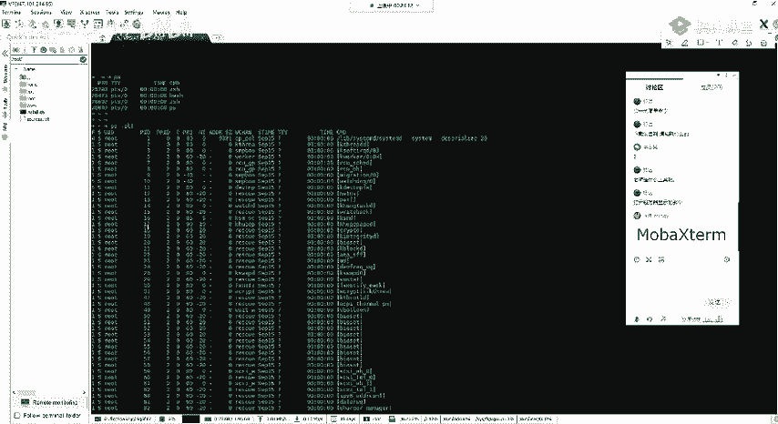

上一节我们概述了课程目标，本节中我们来看看如何收集Linux系统的基本架构和版本信息。

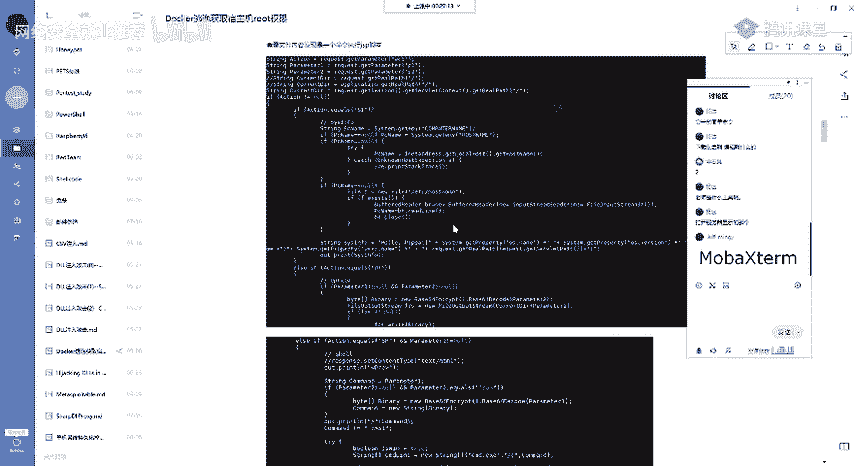

以下是用于收集系统信息的核心命令：

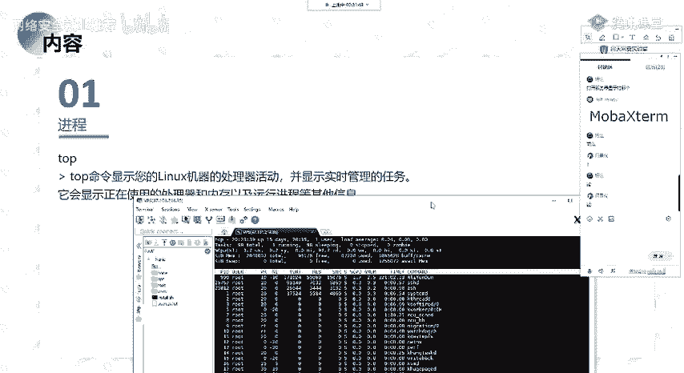

*   **`uname -a`**: 打印所有系统相关信息。`-a`参数表示输出全部信息。其他常用参数包括：
    *   `-s`: 输出内核名称（如 Linux）。
    *   `-n`: 输出网络节点主机名。
    *   `-r`: 输出内核发行版本。
    *   `-v`: 输出内核版本信息。
    *   `-m`: 输出机器硬件名称。
    *   `-o`: 输出操作系统名称。
*   **`cat /etc/issue`**: 查看包含系统标识和登录提示信息的文本文件。此文件内容可在登录前自定义。
*   **`cat /etc/*-release`**: 查看系统发行版本信息。不同Linux发行版的文件名不同：
    *   Debian系（如Ubuntu, Kali）: `cat /etc/lsb-release`
    *   Red Hat系（如CentOS）: `cat /etc/redhat-release` 或 `cat /etc/centos-release`
*   **`cat /proc/version`**: 查看Linux内核的详细版本、编译所用的GCC版本以及编译时间等信息。

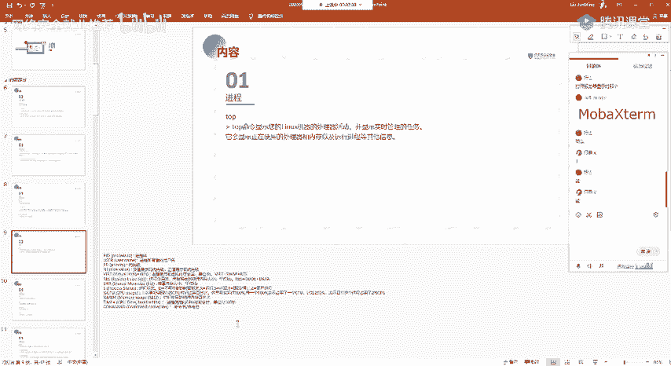

## 🔄 进程信息收集

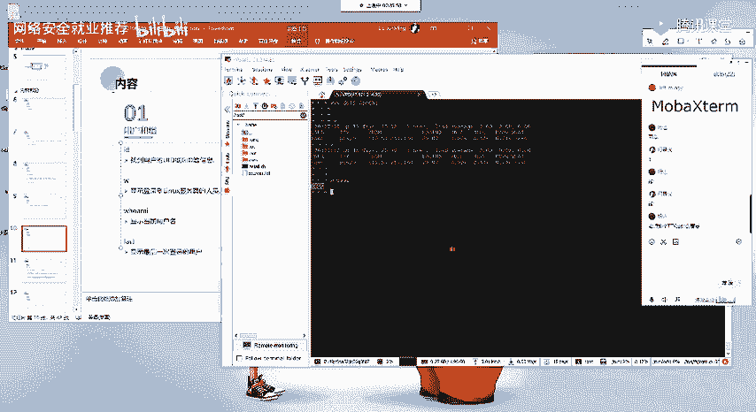

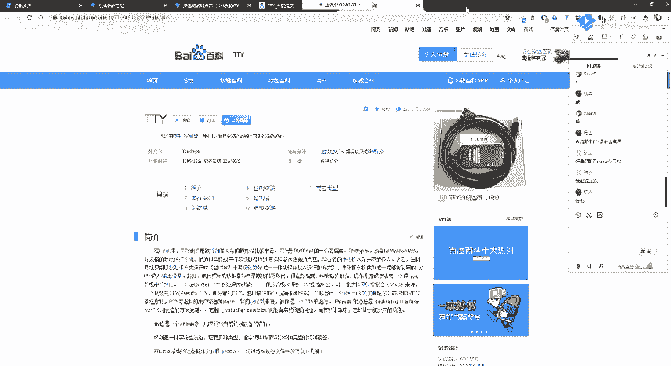

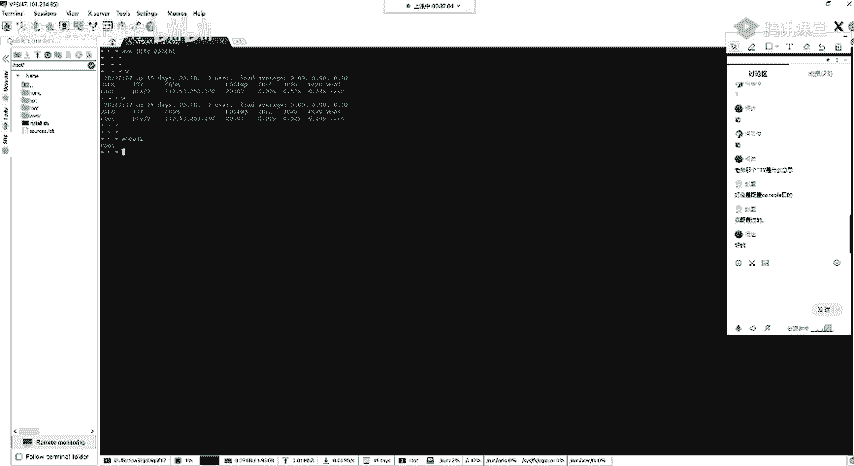

了解了系统基本信息后，我们来看看如何查看和管理系统上运行的进程。

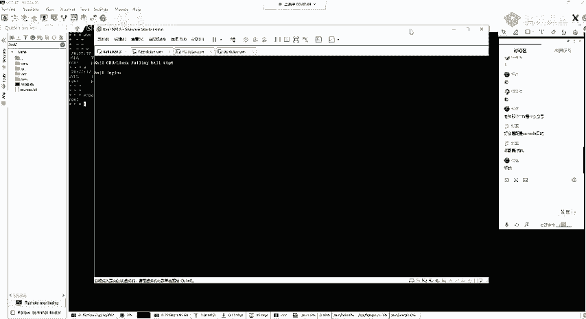

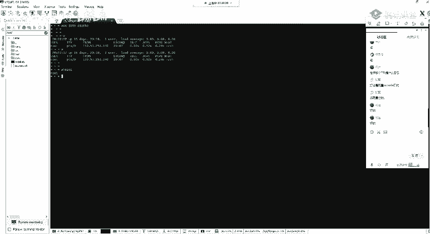

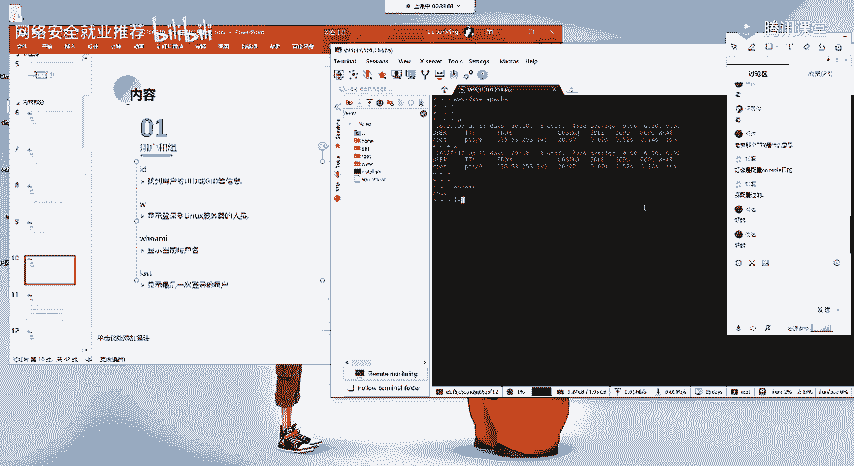

以下是用于查看和管理进程的命令：

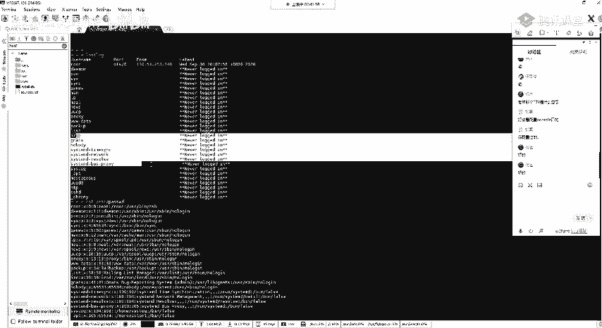

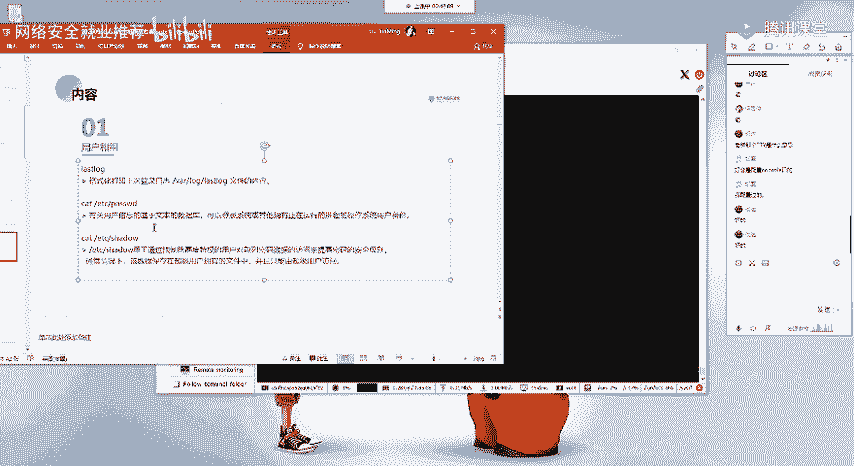

*   **`ps -elf` 或 `ps -aux`**: 列出当前系统所有进程的详细信息。常用组合是 `ps -elf | grep [进程名]` 来过滤查找特定进程。
    *   **PID**: 进程ID，用于唯一标识进程。
    *   **CMD**: 进程对应的命令或程序名。
*   **`/proc/[PID]/` 目录**: `/proc` 是一个虚拟文件系统，每个运行进程的PID对应一个目录，其中包含了该进程的运行时信息（如内存映射、环境变量等）。例如，`ls -l /proc/1234/` 可以查看PID为1234的进程相关信息。
*   **`top` 命令**: 实时动态显示系统中各个进程的资源占用状况（如CPU、内存），并可按资源使用率排序。这对于监控系统性能和发现异常高资源占用的进程非常有用。

## 👥 用户与组信息

进程由用户运行，因此了解系统用户和组信息是信息收集的重要一环。

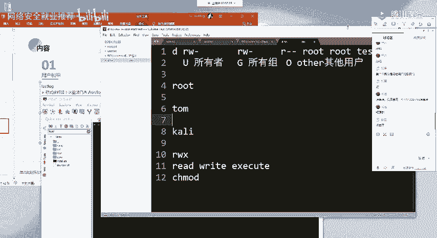

以下是用于收集用户和组信息的命令：

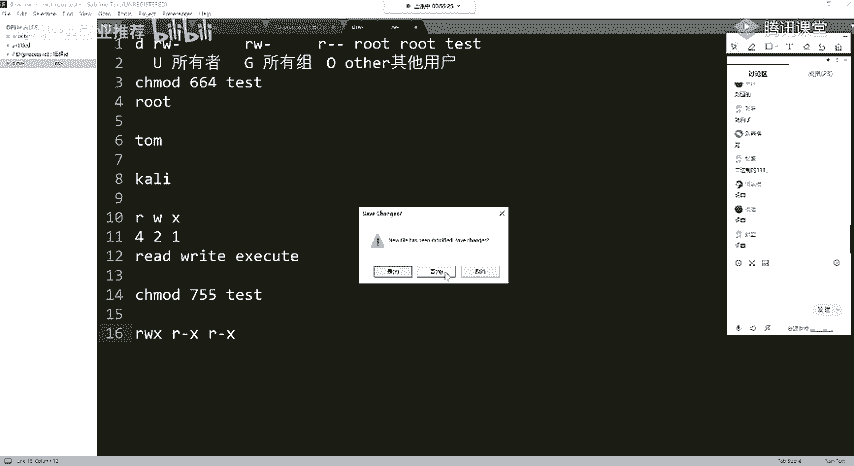

*   **`id`**: 显示当前用户的UID（用户ID）、GID（组ID）以及所属的组。
*   **`w`**: 显示当前登录到系统的用户信息，包括用户名、登录来源IP、登录时间等。
*   **`whoami`**: 显示当前登录用户的用户名。
*   **`last`**: 显示系统最近的用户登录记录，包括用户名、登录终端、来源IP和登录/登出时间。
*   **`lastlog`**: 显示所有用户最后一次登录的信息。
*   **`cat /etc/passwd`**: 查看系统所有用户账户信息。每行格式为 `username:x:UID:GID:comment:home_directory:shell`。
    *   `x` 表示密码哈希已移至 `/etc/shadow` 文件。
    *   `UID` 为0表示root用户。
    *   最后字段指定了用户登录后使用的默认shell（如 `/bin/bash`），若为 `/usr/sbin/nologin` 则表示该用户不允许登录。
*   **`cat /etc/shadow`**: 查看用户的加密密码哈希（仅root用户可读）。此文件权限通常为 `-r--------`，即只有root可读。
*   **`cat /etc/sudoers`**: 查看哪些用户被授予了 `sudo` 权限，可以临时以root身份执行命令。**注意：** 请使用 `visudo` 命令安全编辑此文件，不要直接使用文本编辑器。

## 🔐 SSH服务信息

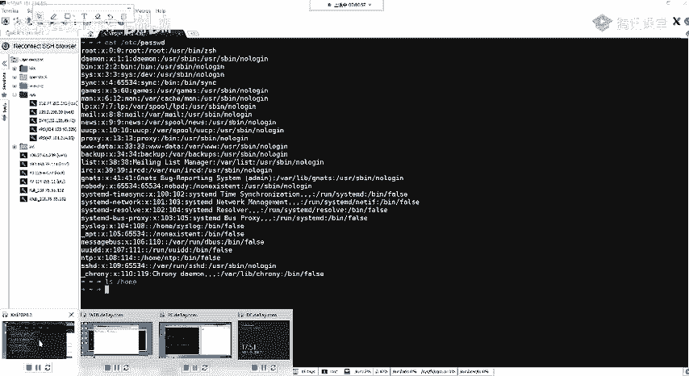

SSH是远程管理Linux服务器的标准协议，其配置信息至关重要。

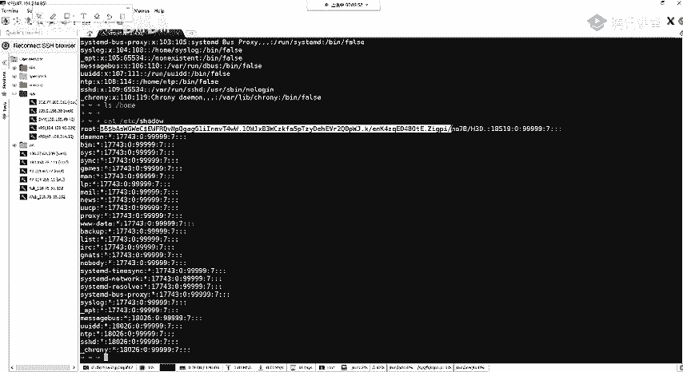

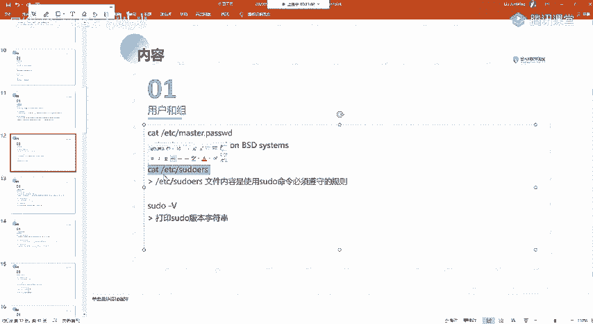

以下是SSH相关的关键文件和目录：

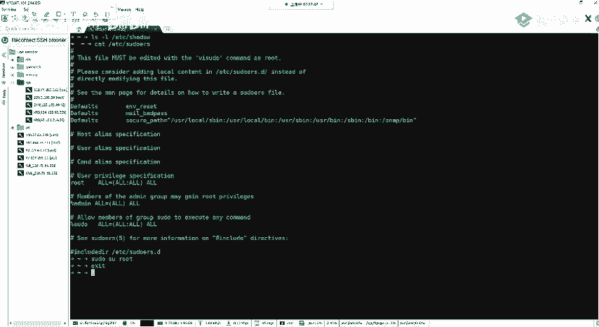

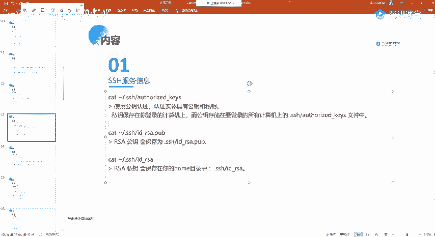

*   **`~/.ssh/authorized_keys`**: 存放用于公钥认证的授权公钥。配置后可以实现免密码登录。
    *   生成密钥对：`ssh-keygen -t rsa`
    *   将公钥（`id_rsa.pub`）内容追加到目标服务器的 `~/.ssh/authorized_keys` 文件中。
*   **`~/.ssh/known_hosts`**: 存储本机通过SSH连接过的远程主机公钥，用于主机验证。
*   **`/etc/ssh/sshd_config`**: SSH服务端的主配置文件。重要配置项包括：
    *   `PermitRootLogin`: 是否允许root用户通过SSH登录。
    *   `Port`: SSH服务监听的端口（默认为22）。
*   **服务管理命令**:
    *   查看服务状态：`service ssh status` 或 `systemctl status ssh`
    *   启动/停止/重启服务：`service ssh start/stop/restart` 或 `systemctl start/stop/restart ssh`

## 🛡️ 防火墙与网络配置

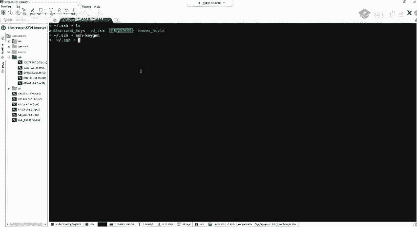

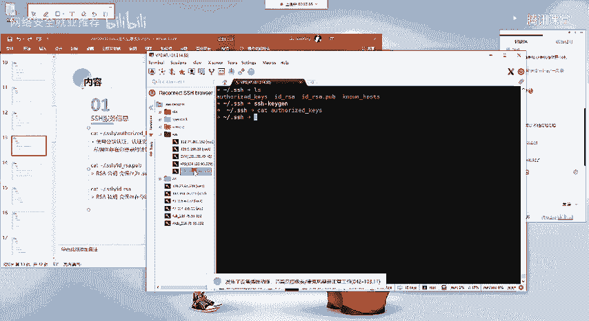

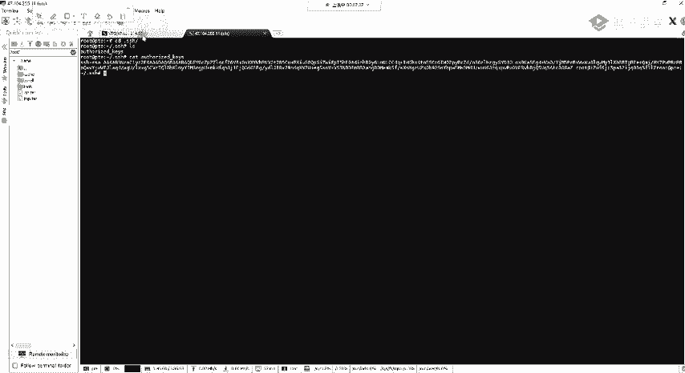

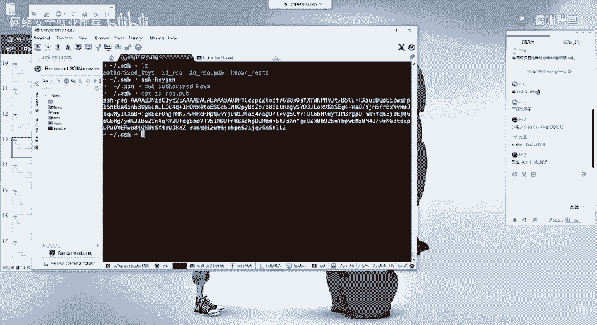

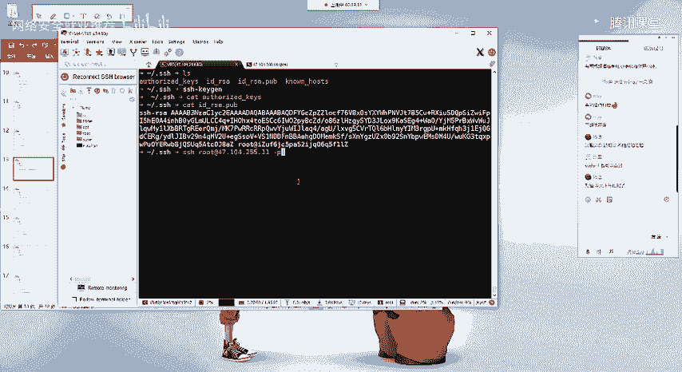

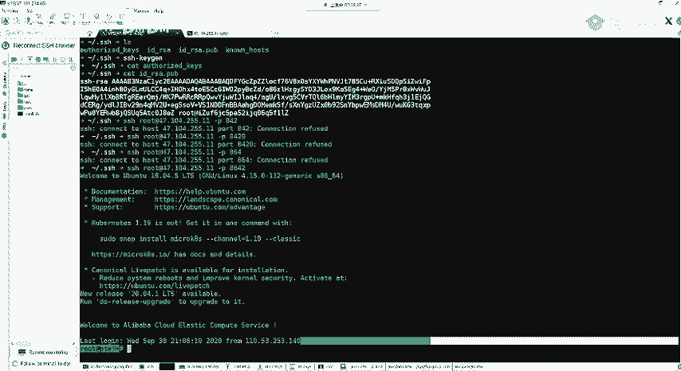

系统安全与网络配置紧密相关，了解防火墙规则和网络设置是信息收集的一部分。

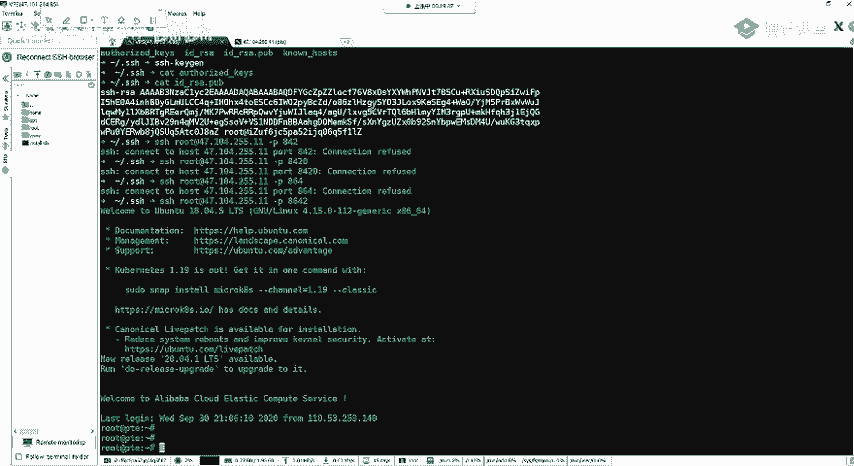

以下是网络和防火墙相关命令：

*   **`ifconfig` 或 `ip addr`**: 查看网络接口配置信息，如IP地址、MAC地址等。
*   **`hostname`**: 查看系统主机名。
*   **`netstat -tulpn`**: 查看网络连接、路由表和网络接口统计信息。常用参数组合：
    *   `-t`: TCP协议
    *   `-u`: UDP协议
    *   `-l`: 仅显示监听套接字
    *   `-p`: 显示进程标识符和程序名称
    *   `-n`: 以数字形式显示地址和端口号
    *   例如，`netstat -tulpn | grep :22` 查找监听22端口（SSH）的进程。
*   **`iptables`**: Linux系统自带的防火墙工具。
    *   查看规则：`iptables -L`
    *   清空规则链：`iptables -F`
    *   添加规则示例（允许ICMP/ping）：`iptables -A INPUT -p icmp -j ACCEPT`
    *   添加规则示例（允许访问80端口）：`iptables -A INPUT -p tcp --dport 80 -j ACCEPT`
*   **网络配置文件**:
    *   `/etc/resolv.conf`: DNS解析器配置文件，可临时添加 `nameserver 8.8.8.8`。
    *   `/etc/hosts`: 静态主机名与IP地址映射文件。
    *   `/etc/network/interfaces` (Debian/Ubuntu) 或 `/etc/sysconfig/network-scripts/ifcfg-eth0` (RHEL/CentOS): 网络接口配置文件，用于配置静态IP等。

## 📝 历史记录与日志文件

系统日志和历史命令记录了用户和系统的活动痕迹，是事后分析和取证的关键。

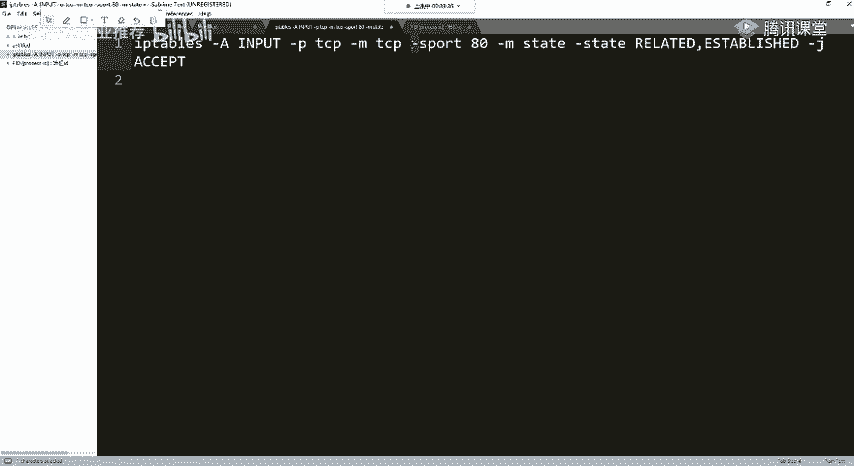

以下是相关文件和命令：

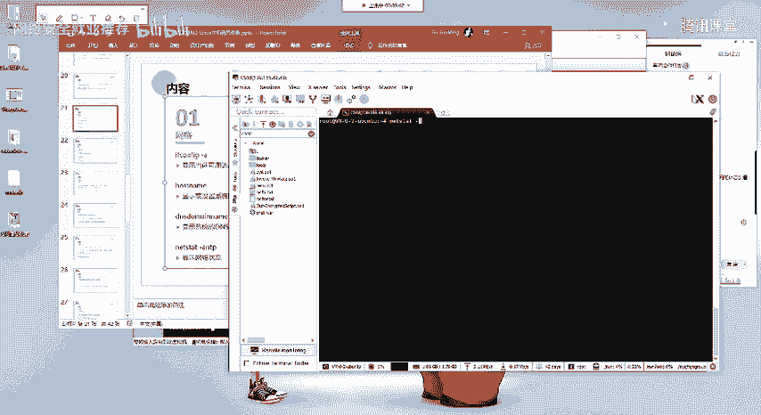

*   **`history`**: 显示当前用户执行过的命令历史记录。这些记录通常保存在 `~/.bash_history` 文件中。
*   **`/var/log/` 目录**: 系统日志文件集中存放的目录。
    *   `/var/log/auth.log` 或 `/var/log/secure`: 认证相关日志（如SSH登录成功/失败）。
    *   `/var/log/syslog` 或 `/var/log/messages`: 系统通用日志。
    *   `/var/log/apache2/access.log` 或 `/var/log/nginx/access.log`: Web服务器访问日志。
    *   `/var/log/apt/history.log`: 软件包安装卸载历史（Debian系）。

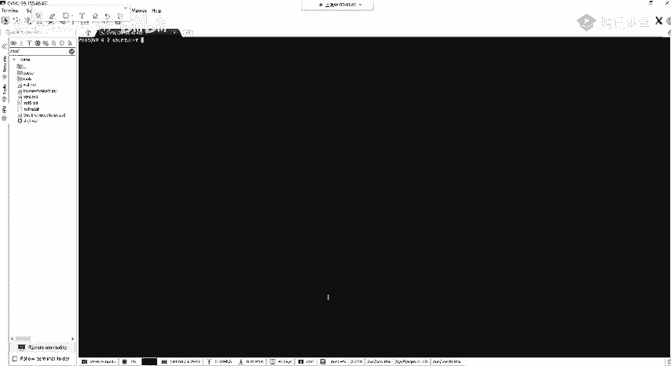

## 🔍 文件与目录查找

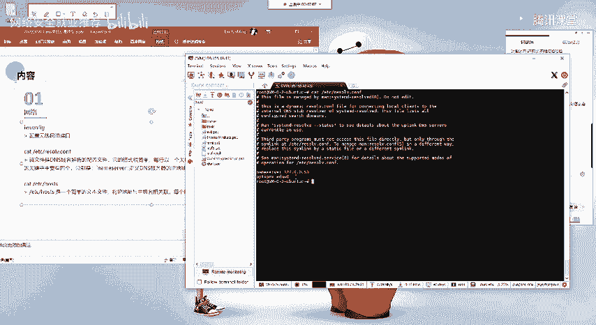

在Linux中，快速定位特定文件或目录是常见需求。

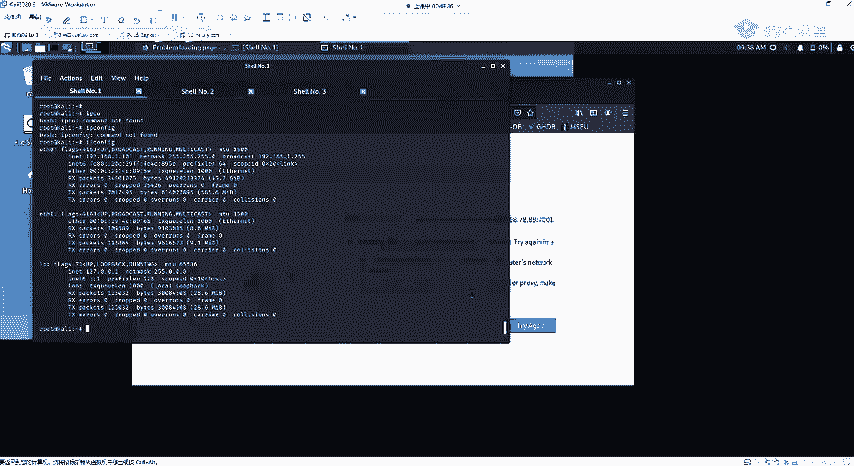

以下是 `find` 命令的常用示例：

*   **查找具有SUID权限的文件**：`find / -perm -u=s -type f 2>/dev/null`
    *   `-perm -u=s`: 查找文件所有者权限中包含SUID位（`s`）的文件。
    *   `-type f`: 指定查找对象为文件。
    *   `2>/dev/null`: 将错误信息（如权限不足）重定向到空设备，使输出更清晰。
*   **查找全局可写目录**：`find / -type d -perm -o=w 2>/dev/null`
    *   `-type d`: 指定查找对象为目录。
    *   `-perm -o=w`: 查找其他用户（others）有写权限（`w`）的目录。
*   **查找特定扩展名的文件**：`find / -name "*.txt" 2>/dev/null`

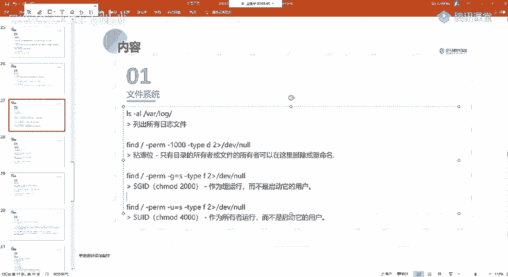

## ⏰ 计划任务

计划任务（cron）用于定时执行任务，了解现有任务有助于发现潜在的后门或自动化脚本。

以下是计划任务相关文件：

*   **`crontab -l`**: 列出当前用户的计划任务。
*   **`cat /etc/crontab`**: 查看系统级的计划任务配置文件。
*   **`ls -la /etc/cron.*/`**: 查看 `/etc/cron.hourly/`, `/etc/cron.daily/` 等目录下的定时任务脚本。
*   **`ls -la /var/spool/cron/crontabs/`**: 查看各用户的个人计划任务文件（如 `root` 文件对应root用户的任务）。

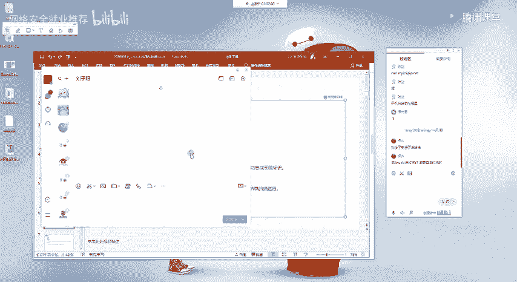

---

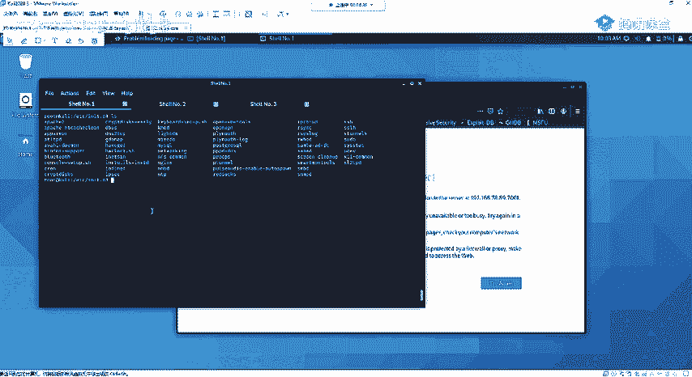

本节课中我们一起学习了Linux系统信息收集的各个方面，从系统版本、进程、用户到网络配置、日志和计划任务。掌握这些命令和文件位置，是进行Linux系统安全评估、故障排查和日常管理的基础。请务必在授权环境下进行练习，并理解每个命令的作用。课后建议在自己的Linux虚拟机中逐一尝试这些命令，以加深理解。