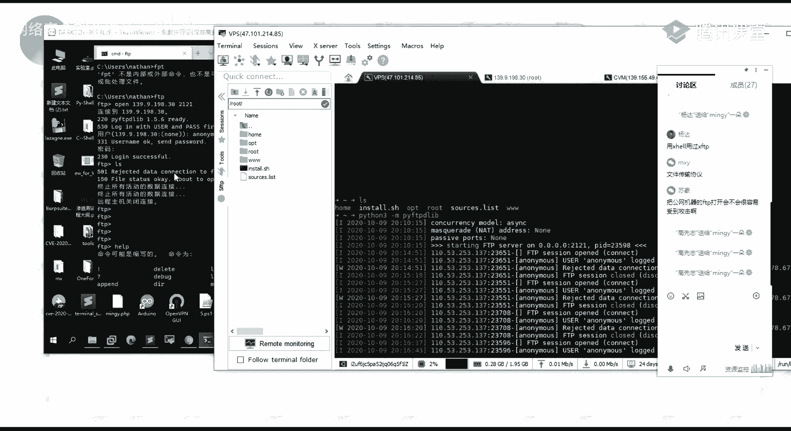
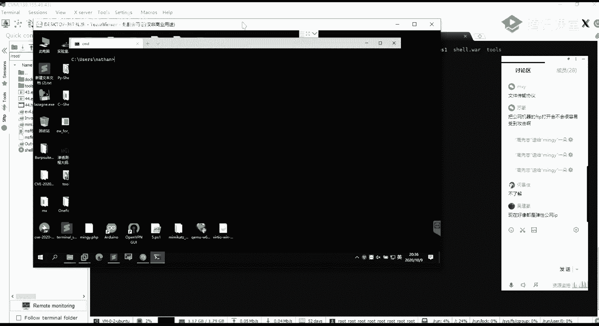
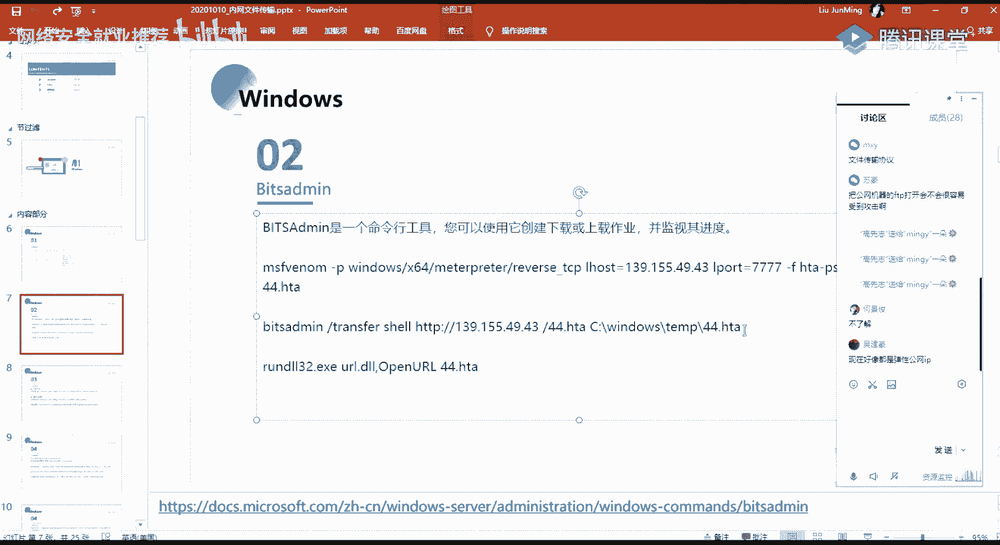

# P59：第25天：Windows系统下的文件传输 - 网络安全就业推荐 - BV1Zu411s79i

好，呃能听到我声音的，已经能够看得清我呃，画面的同学在讨论区扣个一，好的呃，应该都能都能够听清，都能够看到好嗯，那么其他的也不多说，我们正式开始我们今天的一个课程内容。

今天的话给大家介绍的是一个内网文件传输，然后主要的话介绍这三块内容呃，分别的话就是第一块的话就是在windows系统下面的，一个内网文件的一个传输的，一些方法的一个介绍。

第二块的话就是linux系统下面的，然后以及第三块的话，就是一些脚本语言相关的一个呃，文件的一个下载，首先我们先来了解一下第一块的一个windows系统，下面的内网文件传输，第一个就是ftp啊。

不知道大家对ftp有没有了解，我不知道大家对ftd有没有了解，就是有知道这个东西它是什么，以及怎么去进行一个使用吗，呃知道的扣一，不知道扣二，因为xxl用过xftp呃。

这个的话呃也算就是x f tp的话，它其实也是一个呃就是ftp的这样子的一个协议，就是说它是一个啊文件传输协议，然后在这边的话它是一个就是我们这边的话啊，对就是文件传输协议，我们在这边的话。

我们就使用这个ftp，因为我们要做的要达到了一个目的的话，就是进行一个文件的一个传输对吧，那么我们在这边的话就可以利用呃，这边的一个ftp的一个文件传输协议，然后在windows系统下面的话。

大家其实可以打开cmd，而在windows系统，windows系统下面的话，应该是呃自带的，有这样子的一个ftp的一个客户端的，就是。

就是你打开一个cmd的话，你输入ftp，对吧你就能够有这样子的一个客户端，然后在这边的话，这个ftp的这个命令的话，它其实是一个命令，这个命令的话它是windows系统里面的话都自带有的，就默认有的。

它是它的一个作用，就是将文件传送到运行ftp服务器的，一个服务计算机上面。

把官网机械f tp打开呃，你的f t p的话，因为，比较容易受到攻击，就说你的一个mtp的话，如果说你没有去设置你的一个就是认证，就是账号密码的，你允许他去进行一个匿名匿名登录的话。

那么就是啊攻击者他只要知道了，你这个机器的话，开放了ftp的这样子的一个协议的话，他可以直接去登录到你的一个机器嘛，然后的话还有就是你的一个ftp的一个目录的话，需要做一个比较好的一个权限控制。

就是说如果说你虽然你设置了密码对吧，你设置了你的一个用户名密码，但是攻击者它可以通过ftp的一个爆破对吧，对你的一个机器上面的一个ftp的一个呃协议，去进行一个爆破，如果爆破成功之后的话。

他可以直接就是访问到你的一个，ftp的一个目录对吧，那么这个时候的话，如果你的这个呃ftp的这个目录的话，它是能够去进行一个有读取写入的一个权限，或者说执行的一个权限的话。

那么他可以把自己的一个呃恶意文件对吧，上传到你的一个机器上面，然后去执行来访谈线，然而在这边的话我们就是使用的呃，我在这边的话是首先的话是这样子的一个流程，就首先第一步的话。

我们在攻击机上面用python的话，快速开启一个ftp的一个服务器，然后呃使用到的所使用到的话是这个p y f t，p d的lib的这样子的一个啊库，这个库的话默认的话它是没有安装的。

我们可以通过pip去进行一个安装，然后的话使用python 3杠m，指定这样子的一个呃模块，然后的话就能够去开启一个ftp的一个服务器，然后店铺的话就是在目标机上面，我们需要去写入这样子的一个脚本。

这里的一个脚本的话，我们来看一下，首先第一行的话就是通过这边的一个copy啊，copy的这一个命令，把我们下面要写入的这样子的一些语句，把它给写入到这个ftp。tt的这个文件当中。

然后我们写入到这个ftp。test文件之后的话，我们就是它会保存为这样的一个，ftp。text的文件嘛，然后的话我们就可以去通过ftp杠a杠s，指定这个text文件。

也就是保存着这边这一个脚本内容的这个文件，然后的话就能够去自动的去下载，我们这边所指定的一个呃文件，然后我在这边的话是呃，随便的写了这样子的一个点pk的一个文件是吧。

然后的话实际的话我们实际实际去使用的话，就说我们已经得到了，就说他的我们要去进行这样子的一个，操作的一个前提对吧，就是说我已经得到了有一个某一个机器，它的一个啊sh，然后的话我想要去反弹一个shell。

就说我需要去上传我的一个，木马的一个文件是吧，或者说上传我的一个码，然后的话我要上传码的话，我需要把我的一个文件，把它给上传到我的一个目标机器上面去对吧，好在这边的话。

我们就可以通过ftp的这里的电子来获取，我们在攻击机上面啊，f ftp服务器上面所存放的，这样子的一个木马文件，好的话，下载到这个啊目标机器上面去进行一个执行，好而这边的话我们来看一下。

呃首先的话就是说呃我这边的话我就不去，就是说做前面的那个拿希尔的那一个操作，就是说我们拿到这个shell之后的话，我们就可以去执行相应的一些命令对吧，好的话，我在这边的话。

首先我的我在我自己的一个机器上面，也就是，我在我这边的一个呃不是的，我在我这边的这个机器上面，嗯我先通过python的一个这个模块，来去进行一个快速的开启一个ftp的一个服务，好。

我这边的话是已经安装了这样子的一个py，f t p1 viper的这样子的一个库，诶，没装，没装到我这边抓一下吧，啊我用这边的这个机器，我这边的这个机器的话，已经安装了这个样子的一个模块。

然后直接通过这样的一个命令，就开启了这样一个ftp的一个server，然后这里的一个手的话，它默认是开放在2121的这一个端口上面，我在这边的话，我以就说我以这个in store s h的。

这个文件为例对吧，当然的话我们可以把这边的这个文件，就是说我们想要去啊，上传到目标机上面的这个文件的话，呃，改成任意的一个啊。

码字对吧，任意的一个嘛，好我在我的一个目标基因上面，也就是说我们已经得到了这个shell的这个g上面，我们写入这样子的一个，太子的一个就是脚本，然后这个脚本的一个内容的话。

就是去连接我们这边的一个ftp的一个server。

我这边的话是。

这个17。1，然后端口的话是2121，这边的话已经有了一个，把这个删掉，我这边要重新写一下，好呃我写的一个脚本的一个内容的话，就是这样子，我给大家来解释一下，就是说我这边的这个脚本它的意思。

首先在这边的话呃呃我先从这边开始说吧，这边的话刚刚有说了对吧，就是用的这个copy的一个命令，然后这边的一个c o n的意思的话，他表示我们的一个控制台，就是说这边整体的一个意思的话。

就是把我们从控制台的一个输入，把它给复制到我们这边的一个文件当中，然后这边控制台的一个输入的话，其实就是我们后面所输入的一个内容，然后首先第一个就是open，就是你啊ftp的话。

你首先你要去迎接我们的一个ftp的一个服务，所使用的一个命令的话，就是这个open，然的话指定我们f tv的一个服务ip以及端口，然后的话下一行的话就是回车，回车之后的话。

下一行我们写的是我们的一个用户名以及密码，然后我这边的话是使用的一个匿名登录，匿名登录的话就是用的这个anonymous，也就是匿名者吗，然后呃下下下一行的话，这边的话是一个密码，我这边留空的话。

就是说因为我匿名登录的话，我可以就是说啊可以不输入密码，我直接输入一个这样子的一个，anonymous的一个用户名就能进行一个登录，当然的话你也可以输入，就是说密码是为这个anonymous。

也就是用户名密码都为这一个，你也可以去进行一个登录，然后我这边留空的话，就表示就是直接回车，然后下面的话就是说我们连接成功之后的话，我们通过get这一个命令。

get的话就是去从我们这边的一个ftp的一个，服务器上面去下载我们想要的一个呃文件，也就是我这边的话是以这个install。s h为例对吧，然后的话get完毕之后的话，我们cut退出好。

这边我们把我们的脚本写完之后的话，我们想要去把这个内容把那个写入到这边的话，我们直接ctrl z，注意是ctrl z1 ，然后的话回车这边的话就已经复制了一个文件，然后我们可以通过太苦。

来查看一下它的一个内容，对吧，这边的话就是我们所写入的一个内容，然后的话我们通过ftp的这样子的一个命令。

这边的话呃出了一点问题啊，这样的话我们可以看一下，在这边我的一个ftp的一个server的话，可以看到，在这边是已经就是说提示，我这边的一个onymous的这个用户，已经是登录了对吧，登录之后的话。

他呃在这边的话。

他拒绝了我的这边的一个就是请求啊。

好像是零。

稍等一下。

这怎么回事呢。

呃这边的话碰到了一点问题啊，嗯我今天试的话是没有问题的，怎么突然就。

你看是不是服务器的问题啊。

呃这边的话先先跳过吧，好吧，大家大家试一下，应该是没有问题的，我这边不知道怎么的，就我今天还试了。

就是说是没有问题的，就是说我这边ftp 0上去之后的话，就是说我这边ftp连上去之后的话对吧，我这边的话已经low跟successful是吧，就是说登录成功，登录成功之后的话。

我可以通过输入l s的一个命令的话，就能够去查看到当前的一个，就说这个ftp的这个服务。

这边的我这边的这个ftp的这个server，就说我当前的话是这个server，它是在当前的这个目录下面对吧，那么我连接上去之后的话，我就能够去查看到当前目录下面的，所有的这种文件以及文件夹，好的话。

我可以通过，通过get的这个命令来去接收指定的一个文件，而我这边的话就是说接收的话，就是这边的这个install。s h的一个文件对吧，那我就可以通过get install。s取点s h来去下载的。

下载这个文件，当然他这边他报了一个这样的不错啊，就是说他这边不允许去这边的服务端。

它不允许我这边的这个ip去连接啊，我不知道是不是被禁了。

我这边的话呃，我课后的话再去看一下好吧，大家可以试一下，我不知道是我这边的一个问题还是怎么的好吧。

然后第二个的话就是这个bas admin，bas admin的话它是一个命令行的一个工具，我们可以用它来去进行一个创建，还有下载呃，创建下载，还有上载的这样子的一个作业，然后的话近视其进度。

这其实说白了这这个的话就是beat admin的话，它是windows下面的一个自带的一个工具，然后这个工具它的一个作用的话，就是说我们可以用它来去进行一个呃，文件的一个下载。

然后使用它的一个具体的一个步骤的话呃，首先的话在这边呃，我通过marenown去生成这样子的，像比如说一个这样子的一个h，ta的这样子的一个呃木马，好的话，我通过这个bs的命来去把我们来去。

把放在我远程服务器，结束vp s上面的这个试试点，ta的这个文件把它下载到我本地，然后的话下载之后的话，我再通过这样子的一个方法来去进行一个加载，来去get share。

好在这边的话嗯直接演示吧，我们直接来看一下，嗯我这句话用我的这边的这个机器，我首先。

洗一下我的一个msf。

然后的话呃通过这样子的一个命令，通过master you know，来去生成一个这样子的一个hta的一个文件，这个文件它就是一个呃木马文件。

然后我们可以来查看一下，这个四四点hta的一个内容啊，可以看到它的一个量的话，其实就是像这样子啊，hta的话和大家了解它什么东西吗，大家有了解，就是说hta的这种文件它是什么啊。

我这边的话我直接就是百度来查看一下，就大概的了解一下它的一个意思，j ht a的话呢是一个htmi p可选的一个缩写，其实就是一个httm的一个应用程序，然后呃，他是直接将我们那个htm保存成这样子的。

一个格式，可以把它当成一个独立的这种应用软件，好我们看一下它的这一个例子，它其实就是一个html的一个代码对吧，然后的话我们的这样子的一个代码的话，我们可以去啊，就是把它作为一个应用程序。

然后具体的一个实现的话，我们来看一下这表，前面这边的话，它其实就是一个呃，指定了一个我们使用的一个脚本，就是一个vbscript，也就是一个vb的一个脚本对吧，好在这边的话后面的这里的一部分内容的话。

其实我们主要的话就知道，在这里，它主要的话就使用了这个cross object，来创建了这样子的一个对象，主要的话就是用的这个w script deshare，来去执行我们的一个命令，关于这一个的话。

大家可以百度1下，他是一个就是一个对象，然后的话我们可以通过创建这样子的一个对象，来去运行程序，比如说操作注册表啊，创建快捷方式。

还有访问文件夹等等是吧，然后在这边的话，我们就是创建这样子的一个对象，然后的话来去执行我们这边的一个，pasha的一个代码对吧，其实我们可以看到就是第二问的，就是我们这边创建一个对象。

赋给了这一串值对吧，然后的话它调用了这样子的一个乱的一个方法，然后的话来去执行我们这边的一个，泡的一个脚本，这边的一个泡脚本的话，它是就是后面的这一场的话，他是做了一个base 64的一个兵嘛对吧。

我们可以通过呃，相应的一个代码去把它做一个解码，tt这个是这边的话有有啊，咋回事，这边的话呃其实就是一个这样子的一个角表。

我们可以通过把就说把我们这边的一个base，64的这样子的一个编码的一个代码的话。

把它做一个解码，我们其实可以看一下它里面的一个内容了，就是这样子的一个东西啊，然后我们可以通过嗯，可能显示。

啊不是搞错了，是这个方法搞错，这个。

好我在这边的话就是解密之后的话，就是这样子的一串啊，我们可以看一下，就是这边的这一串内容，就这边的这一串内容，然后这边呢这一串内容的话，它其实也是就是一个pasha的一个这样子的，一个脚本对吧。

然后我们可以看到他在这边的话，就是他会去调用啊，你系统里面的一个posure，得这样子的一个ex一的一个程序对吧，然后的话再去执行我们后面的这边的，这一个内容，然后其实我们可以看到。

在这边后面的这些内容的话，像比如说gun op以及干w high的对吧，这个话都是我们常见的这样子的一个参数，然后后面这边的话它是同样的，他又做了一个base，64的这样子的一个这个兵马对吧。

然后其实在这边，他同样的就是他会把这边的一个6s，64的一个内容做一个解码。

解码之后的话去进行一个执行，我这边的话我就不再去做一个解码了，就他通过这样子的方法做了一个，就是呃兵马的一个混响对吧，然而实际的话在这边的话，它其实就是会去执行这样子的一个脚本。

在这边的一个抛弃的一个脚本，这边执行之后的话，它是一个反弹shell的一个呃目的，啊我们这边的话生成生成之后，生成之后的话，我这边先通过阿玛三图建立一个精听，啵啵啵，好我设置了pad之后的话。

设置我们要去今天的一个our host，在这的话我再去说一遍，再说一遍，今天又有两位同学又问我，这问我这个就是我已经说了很多遍了，就是你的一个vps对吧，像比如说这边我这边呢这个vp嗯。

我这边那个ups我的一个公网ip是这一个对吧，然后的话你的一个你的这个v p s，你不是独享的一个i p，也就是说你的这个机器的话，就是有一个专门的一个ip能够直接访问到对吧，就是独享ip。

那么你如果说你是一个独享ip的话，那么你的一个公网ip就是这个对吧，以及在这边有一个e t h0 的这个网卡。

你的这个ip它也是一个公网ip是吧。

那么像这种的话，像这种v p s，像阿里云，腾讯云的这种v p s的话，它其实是相当于就有一个做了一个这样子的，一个映射对吧，就是说通过这样子的一个公网ip，来去映射到了这边的。

就是说把我们这边的v p s的这个ip，就说这个机器映射到了这样这样子的，一个公网ip，那么我们要去进行一个端口的话，我们是我们在本地这边的话，只有这几个ip对吧，我们要去监听一个端口的话。

我们不是使用我们的一个公网的一个ip啊，你去用公网的ip去，今天的话你是精听不了的，它会它会有一个报错对吧，就是northern就是mhandle什么什么那个对吧，然后你要去今天一个端口的话对吧。

你去指定的一个ip的话，你就就是你要去精听你本地的一个端口，你指定的一个ip，就指定这个e t h0 的一个i p，好吃，uh uh exploit去建立一个监听对吧，在这边的话就没有任何报错了。

然后如果说如果说就是说呃，有同学有同学是一个就是独享的一个i p对吧，就说你那个公网ip跟你的这边你去查看呢，就说一天去年那个网卡它其实是同样的，也是一个公网ip，那么你去今天的话。

他你就去今天你的公网ip就可以了，就在这边l host指定你的一个公网ip，它就能够去访问到这样子的一个端口啊，我这边精听之后的话，今天之后的话，我这边有这样子的一个40点hta对吧。

那么我要怎么去把我这边的一个生成的这个，hta的这样子的一个啊木马文件。

把它给就是上传到，或者说下载到我这边的这个机器上面去，进行一个直行的，在这个时候的话，我们因为我们前期的话是已经得到了，这个机器的一个就是有一个基本的一个权限。

我们能够去执行命令对吧，那么我想要把我的这一个文件放上去，它是一个windows机器，我们可以通过bt s addin这个命令，这一个命令行的一个工具，来去进行一个文件的一个下载。

然后在这边的话我们看一下，看我的ppt。

具体的一个面的话，就是像这样子，我这边的话我就不敲了，我直接复制。

然后我这边的话，我把这个hta文件放到了我的一个，就是阿帕奇的一个绘本目录下面，然后的话我去进行一个执行，执行之后的话，我在这边的话，可以看到他在这边会有这样子的一个进度啊，我这边执行执行的一个面的话。

就是像这样子在这边的话，我先啊我们先来看一下，就是说，这边的这个目录下面是否有这样子的一个文件，我们来验证一下，就是说这个我的这个命令，它是否就执行成功了对吧，可以看到在这边。

我是把我这边的一个v p s上面的，这个hta的这个文件，把它给下载到了这个目录下面是吧，可以看到已经成功的下载下来，然后我们回过头来去了解一下，去理解一下这一条命令，它的一个大概的一个意思。

在这里的话主要的话就是用的这一个transer，呃这边的话大家记一下就行了好吧，你要想要去就是了解他其他的，更多的这样子的一些功能命令的话，你可以通过刚问号来去了解，这边的话。

我们使用的就是这个transfer这个这个参数，然后在这边的话，我们可以看一下这个transform参数，后面它所要去进行，去所要去加的这样的一些参数是吧，可以看到在这边有一个job name。

job name的话，就是我们可以进行一个随意的一个指定，就指定我们自己想要的一个作业的一个名称，好的话，后面的话接我们的这样子的，像我们那个remote url，也就是我们要去进行一个远程的一个。

文件的一个下载，对吧，我们需要去加我们的一个文件的一个url，然后的话local name的话，就是把它保存到我们指定的一个本地的一个，文件名以及以及路径，然后我们回到这这条命令的话。

就是说这边通过transfer，然后的话指定我们的一个jb name，我这边它是指定的一个shell，当然你也可以指定为其他的，就是随意的是吧，然后的话后面接我们的一个要去下载的，一个资源的一个url。

然后的话接我们把我们的这一个资源，下载到哪个路径下面，以及它的一个呃，下载之后的存放在本地的一个文件名，好我们这边就是下载完之后对吧，我们如何去进行一个反弹shell呢，就是如何去执行这样子的。

一个四四点ht的一个文件，在这边的话我们要使用到这个run deal 32，这个程序的话，在后面再讲去进行，再讲windows下面的一个反弹shell的时候，会去讲到怎么去进行一个啊使用了。

然后这个rudel 32的一个作用的话，它其实就是去就是去注册调用我们的一个调，然后在这边的话我们要去使用到的话，就是使用到这个url 2点掉，这个的话它在windows里面的话，它是一个呃。

就是一个我们知道调的话，它是一个共享链接库嘛对吧，我们可以通过这个rudel 32来去调用，就是来去注册这样子的一个120d，然后这个u2 d l的话，它有这样子的一个open，open url。

都这样子的一个呃，什么来着，有点弯了，呃其实具体的一个东西的话，你可以去看一下我这边的一个预习内容，就是这边预习内容的话已经有写了，就是这个利用这个乱掉上次二来去执行程序好。

它的一个这个run del 32的话，它主要的一个作用就是去加载del，然后我们这边所要去加载的就是这个要二点掉，里面的这个open your的这个这个函数，它是一个包含导出函数。

然后这边的话就如果你懂这些东西的话，你可以去进行一个研究，不懂的话，你就知道你就知道他怎么去用就ok了。

好吧，好我们在这边的话，我们指定这个open ur，然后alt换指定我们这边的一个hta的一个文件。

40。87好，我们这边执行执行之后的话，在这边我们可以看到，就我这边刚刚的这个今天的话已经反弹完了，这样子的一个筛选一是吧。

然后这边的一个，可以看到得到了一个三需要的话。

就是我这边的这个机器的一个需要。

这个的话是使用这个beers admin，这样子的一个命令行工具，以及通过这样子的一个实例，就是说去进行一个反弹shell的一个实例，然后第三个的话就是这个cr t u t l。

这个的话它是一个它同样的，也是windows下面的一个自带的这样的一个程序，这个关于这个东西的话，它是什么，它是一个什么东西的话，大家看这个预习内容，就是看这个官方的一个文档，它是一个命令行程序。

就是作为证书服务的一部分进行一个安装，它它的一个作用其实就是去来存储啊，就是来去操作我们的这种证书啊，它的一个就是通过命令行的一个方式来去操作，我们这样子的一个证书，来去对这种证书去进行一个呃操作。

像备份还原啊，配置等等对吧，然后在这边的话我们实际实际去用到，去使用的话，就我们在我们这边渗透测试的话，我们可以用这个命令行的一个程序，来去进行一个文件的一个下载，具体的一个使用的话就是像这样子就cr。

然后的话指定这个纲要cake好，杠split杠f指定我们的一个远程的一个资源，然后的话把它下载到，就是下载到我们本地之后的一个文件名。

好我们先来看一下大概的一个效果吧，我这边的话，同样的就是以下载这个四四点hta，这个文件为例，然后的话呃下载到本地，下载到当前目录，然后的话保存为h40 点hta啊，好我们回撤，回撤之后的话。

我们来看一下当前的一个目录，下面它是否有这样一个贴的一个文件，可以看到在这边的话，在这边的话我们通过这个命令成功的去下载了，到下载了这个40点htl，然而就是正确的就是说他你执行之后的话。

它会有这样子的一个回响，就是像这样子的一个回血，就是你看到这一串的话，就说明你的这个命令的话是执行成功了，然后呃我这边的话是下载到了正点，可以看一下里面的一个内容的话，就是这一期对吧。

就是我们刚刚的那个文件的一个内容。

这是呃第三个，然后呃这个命令的话，就是说这个c i t o t i l这个命令的话，有一个点需要我们去进行一个注意，就是说我们通过它的这一个命令，去进行一个文件的一个下载，下载之后的话，它会有一个缓存。

就是说通过这个命令下载之后的话，它会有一个缓存，是存放在这样子的一个目录当中，就是在这样子的一个目录当中啊，我这边的话先把它给删了，我把这边的这个缓存全部清掉了，然后的话我再重新去执行一下。

这样子的一个命令，执行之后的话，可以看到，就是说我这边之前下载完了，我这边的这个文件对吧，然后的话在这个目录下面，它同样的它会留存有这样子的一个缓存，这个缓存的一个内容我们也可以来查看一下。

可以看到我的这边的这个缓存，它的一个内容，其实就是我们所下载的这个文件是吧，所以说的话我们去用这个命令去下载，去下载了我们这边的这样子的一个木马脚本。

之后的话，它会在这一个路下面，它会有留下这样子的一个缓存。