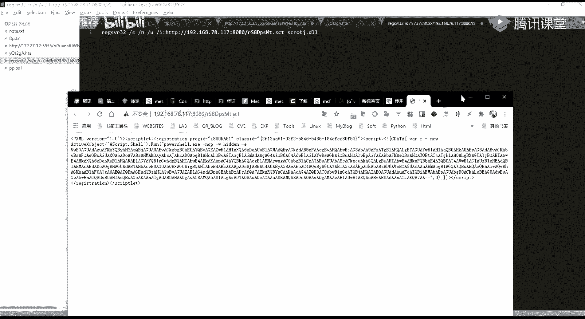
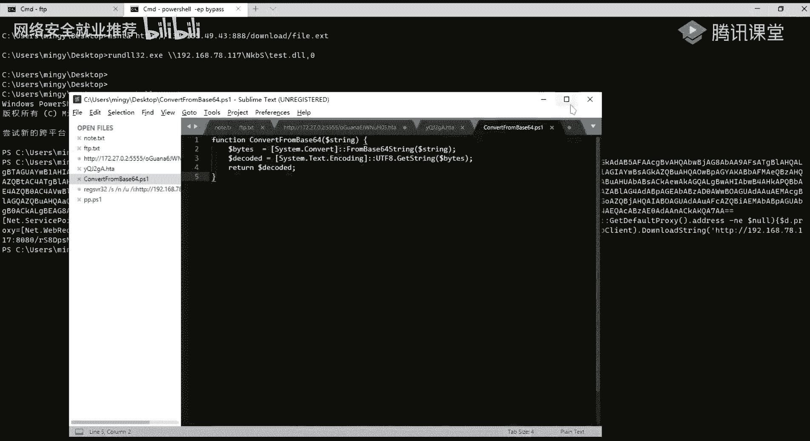

# P61：第27天：Windows反弹Shell方法大全 - 网络安全就业推荐 - BV1Zu411s79i

能听到我声音的，以及能够看到我画面的同学在讨论里扣个一，嗯能能听，能听到我声音吗，呃就是声音以及画面没有问题的，在讨论区扣个一，好的应该没有什么问题啊，那么呃我们正式开始我们今天的一个课程内容。

然后呃在开始之前的话，就是上节课的话不是有遗留一个问题吗，就是那个呃稍等一下。

就是上节课再去再讲那个内网络进传输的时候，使用f tp的一个方式的话，碰到一个问题对吧。

然后那个的话那会儿的话没有解决，因为呃就是看了一下的话，暂时没没那个，所以的话我把他在这一节课的话做一个补充好，我们上节课的话是讲了，使用的这个我们写一个这样子的ftp。

点text的这样子的一个脚本对吧，然后把这个脚本的话，我们把它通过copy的命令，把它写入到我们的一个呃目标机器上面去，好我们写入进去之后的话，我们再使用这样子的一个语句，就是这个ftp杠a杠s。

然后的话指定我们的这个呃ftp的这个脚本是吧，然后的话执行之后的话，它就会自动的去下载，我们呃想要的这样子的一个文件，对吧啊，其实最终的一个效果的话就是像这样子的，就呃其实它的这一个脚本的话。

它对应的其实就是我们ftp的一个命令，就是可以看到在这边，首先的话执行这样子的一个，连接ftp服务器的这样子的一个命令，然后的话连接成功之后的话，我们需要啊这边的话是一个匿名登录。

所以的话我们需要输入这样子的一个anonymous，也就是匿名匿名的这样子的一个用户名以及密，码，密码的话可以为空，也可以为这个anonymous，然后为空的话，我们这边的话就呃就留空行。

等于就是相当于就是说在我们这边的话，就等于是一个回车，然后的话我们连接成功对吧，login successful，连接成功之后的话，我们通过这个get命令来去获取这样子的一个。

6789都这样子的一个文件，这边就是我们获取我们自己想要的呃，任意的这样子的一个文件对吧，然后get之后的话它就会下载到我们的一个本地，我们这边的话来执行一下，我这边的话。

同样的是get这个6789的这一个点x1 ，我当前的桌面的话是没有这样一个文件的，我们这边执行执行之后的话，可以看到在这边的话已经有了对吧，然后的话我们就可以去进行一个执行。

成功地进行了这样子的一个文件的一个下载啊。

呃其实这边的话同样是用的这样子的一个，就是ftp的一个server，我不知道昨天为什么没成功嘛，我这边的话就是后面我课后的话，我去试的话是没有问题的。

就通过这个python 3 gm指定这个p y f t p d lil，然后他，然后他默认它会进行在21212的一个端口，然后后面这边的话就是我们的一个，我们ftp的一个客户端。

去连接的时候的一些消息是吧，首先的话就是说这一个啊，匿名的用户已经登录进来了，登录进来之后的话，他呃请求了这样子的一个文件对吧啊，因为我当前的话是在这一个root目录下面，所以的话呃我ftp连接连。

连接到我这边的一个服务端之后的话，它就会在我的一个root目录下面，也就能够去查看到root目录下面的一个文件呃。

我这边通过命令来查看一下吧，对，七，然后这边的话已经连接成功了对吧，连接成功了，而我们可以通过l s，我们可以通过l s的命令对吧，我这边上直线l s之后的话，他这边他返回了，就是说呃。

我当前这个root目录下面的所有的文件，以及文件夹是吧，然后以及嗯就说啊，还有其他的一些嗯，还有其他的一些命令，就是我们常用的话就是像呃dr对吧，dr的话，它其实也是查看当前的这样子的一个用户嘛，好吧。

不是用户当前目录下面的一个文件对吧，然后ios也是一样的，还有我们常用的话就是像那个啊get以及put，get的话就是下载，就是把我们的一个文件从f tp的一个server端啊，下载下来。

然后put的话就上传了，就是我们可以把我们本地的这样子的，一个本地的一个文件上传到ftp的一个server上面去。

哈哈哈呃，呃这边的话是对上节课的。

就是一留下来的一个问题做一个补充，然后下面的话正式开始，我们今天的一个主要的一个内容，我们今天的话主要给大家介绍一下，windows下面的一个反弹shell的一个方法，本节课的话会介绍这三块内容啊。

主要就是前面两块，第一块的话就是呃带大家一起来了解一下，什么是反航线，以及对反弹shell的一个警戒，以及啊让大家区分正向系以及反向系统，就在后面的一个呃内容的话，我们经常会去呃使用到或者说去啊。

你必须要去理解这样子的一个概念，你才能够去比如说你去呃得到一个希尔，就说我们的一个正向线耳机反向吸，它在不同的一个情况下面的话，我们是呃有不同的一个用法。

然后第二个的话就是windows下面的反弹效果的，一些方法给大家做一个详细的一个介绍，第三个的话就是呃反纳西尔的一个实验啊，你要给大家作为一个课后的一个作用好。

首先的话我们先来一起来了解一下反弹shell，在了解法上shell之前的话，我们先来看一下什么是正向的一个shell，正向写，有的话我这边用这样子的一句话做了一个概括，就控制端主动发起连接请求。

去连接我们的一个被控制端，然后的话中间的一个网络内容它不存在阻碍，好我从从我们这边的这个图，我这边的话画了一个草图啊，就这边的话是一个控制端，也就是我们的一个attack tac的话。

就是攻击者被控的话就是target，也就是我们要去控制的一个目标，也就是我们要去攻击的一个目标是吧，然后我们的一个正向系，有的话就是控制端，我们的一个攻击者，主动的去向我们的一个被控的。

也就是我们要去攻击的一个而目标，去发起这样子的一个请求，发起一个临界的一个请求，然后的话他发起这样子的一个请求，来去经历这样子的一个连接，来进行一个呃控制，然后的话这项shell。

它是就是说在中间的一个网络链路，它是不存在阻碍的，就是说我们比如说我们的一个被控端对吧，我们的一个控制端它是在公网的一个服务器，因为他在公网的一个服务器的话，我们是能够去直接的去访问到的是吧。

我们只要我们只要能够去领网，我们就能够去访问到他公网的这个服务器，然后的话我们就可以通过啊，就是就是说我们攻击者与啊，我们的一个目标服务器中间，它是没有这样子的一个阻碍的，也就是说它是能够直接访问到的。

那么什么是反向线的反向线啊，我们也经常会常称之为就是反弹线，就是呃我们的一个被控端主动发起连接请求，去迎接我们的一个控制吧，就其实而从字面意思，我们也能够大概能理解对吧，就是跟正向系统它是相反的。

就是正向系统，它是要我们攻击者主动的去发起请求，之间的零件对吧，那么反向下的话就是我们等待着，就是我们的一个啊攻击者，等待被控端，也就是我们的一个目标机器，来主动的去迎接我们我们的一个呃控制吧。

然后的话这这种反向需要的话，主通常的话就是用于，就是说我们的一个被控端，是在有防火墙的一个性质或者等等的一些权限，端口占用等等的一些问题，就导致我们的一个被控端，它无法去，正常的就是啊。

不能正常的接收发送过来的一个数据包，这这句话怎么理解呢，我们看一下这个图啊，就是说我们的一个控制端与我们的一个被控端，它中间是有相应的一个阻碍的，这个阻碍的话就来自于像防火墙对吧。

因为它中间有这样的一个防火墙的话，我们的一个控制端是无法去直接的去访问到，我们的一个被控端的，就大家可以就是大家应该都知道对吧，就比如说我们的一个控制端的话，也就是说我们攻击者是在外网是吧。

然后的话我们想要去控制的一个机器，它是处于一个内网当中，然后的话我们在外网是无法去直接去访问到，没某一个内网的对吧，但是的话在内网当中，你比如说你在公司，你的一个内网当中，你是可以去领网吧。

去领外网去访问外网的对吧，那么这个时候我们就无法去通过正向性来去控，制这样子的一个被控端，去被控端去进行连接对吧，那么这个时候的话，我们可以尝试使用这样的一个反向器，也就是说让控制端。

还不让被控端来去主动的去连接，我们的一个控制端，也就是连接我们攻击者的一个服务器对吧，那么这样子的话，它中间它是因为它是能够去正常的去访问到的，所以所以的话是能够去正常的去进行连接。

呃这里的话大家大家能理解吗，呃应该能理解吧，就是啊反向器以及正向切尔应该没什么问题吧，27个会玩什么，27个绘画能理解的扣一啊，有问题的扣二，呃f tp啊，上节课这边的f tp报错的话。

呃我尝试了，就是说它是有这样子的一个问题，就是ftp的它的一个在命令行当中的话，他要去尽力要与我们的一个服务端去建立接，有这样子的一个呃，被动以及就是passive及cos的这样子的两种模式。

就主动模式。

还有被动模式，然后的话在在命令行下面的话，在项目b下面的话呃，你需要去启用这样子的一个pass，也就是被动模式，但是的话在面对台下面，我尝试使用这样子的一个模式的话，是有失败了，就这边的话。

我这边的话我查了资料的话，我暂时也还没有说没有去解决，看就是别人的一个呃，就是回答的话，就是说他这个的话就是在命令行下面，不能够去使用这样的一个被动模式，但是的话像我们这样子的ftp的一个工具。

其实我们就我们的一个ftp的一个工具是吧。

我们的ftp的一个工具，你看现在这边的话，默认的话它是勾选了一个passive mode，也就是我们的一个被动模式，关于这个主动模式以及被动模式的话，我这边不多做介绍，你去你想要去那个的话。

想要了解的话，自己去了解一下好吧。

好这边的话应该没有问题啊，那么我们继续好，下面的话就是我们的第二部分内容，也就是我们今天的一个主要的一个内容，就windows下面的法向shell的一个方法，首先第一个的话就是我们经常会去用到的。

也是经常会听到的这样子的一个nc这个工具，我们经常会去使用nc来去建立，这样子的一个正向线以及反向线，然后在这边的话我就列了这样子的两个，就是说带大家一起来理解一下nc，它的一个正向系统以及反向器。

它的一个基本的一个使用，以及它基本的一个原理，首先的话我们nc和nc这个工具大家应该熟吧，然后呃我之前的话不是如果不熟的话，我之前不是已经给了一篇笔记嘛，大家自己去尝试，un c。

这一个这一篇笔记大家自己去，自己去尝试一下，然后的话去使用一下n c j啊这样子的工具，然后的话可以尝试，就是照着我这边的一个笔记对吧，自己去做一个尝试去理解一下好吧。

这个工具的话是我们经常会去使用到的好，我在这边的话我们来看一下，就是首先的话我们的一个被控端以及控制的，同样的我这边的话有标注啊，就是啊跟这边是对应的，应该能理解对吧，首先的话我们要去建立一个正向性。

我们前面已经说了，就是说需要我们的一个控制端，主动的去迎接我们的一个被控端对吧，而去向被控端发起请求，然后的话所以的话我们的一个控制端，我们的一个命令的话，就是nc去连接我们的一个目标。

的一个就是我们的一个target，也就是被控端的指定的一个端口，然后的话我们的一个被控端的话，就需要去通过nc去监听一个端口，来等待我们的一个控制端去进行一个连接。

然后在这边我们能够去建立一个share的话，重点的话在在于nc的这样子的一个参数，这个杠一的一个参数呃，在这边的话，我们可以啊，通过nc杠help来查看这个工具。

它的一个帮助的一个信息，然后在这边的话就能够去啊列出来了，他能够去使用的一些选项是吧，好我们主要的话关注这几个就是我们常用的，首先的话第一个就是这个杠一，这个杠一的一个参数的话。

后面接一个program，也就是说我们可以通过这个干一参数来去执行，一个，就说在建立连接之后的话，能够去执行一个程序，然后其实他在这边有标注dangerous，也就是说这个选项的话。

是一个很危险的一个选项，而恰恰是这个选项的话，就用就我们可以用这个nc工具来去建立一个啊，shell正向线以及反向线，然后第二个的话就是这个gl gl gl，这个参数的话就是进入一个监听的一个模式。

也就是去进行一个端口的一个监听，就我们经常的话会这样子去进行一个使用n c，gl对吧，然后的话去进行一个端口，比如说8888的这样子的一个端口，然后呃在这边的话我们还还还要介绍一个常数。

这边干扰的话就是进入精听模式，也就是表示我们要去监听一个端口对吧，今天一个呃端口，然后的话我们要去指监听某一个端口的话，我们需要用这个杠p的一个参数，去进行一个指定，也就是说我们还需要去用gp来去指定。

我们要去今天的一个端口，然后现在在这边的话，我们就能够去呃，现在的话已经进行了这样子的，一个8888的一个端口，我们可以通过，通过我们前面给大家介绍的，let's start这样子的一个命令对吧。

来查看一下我们的这个888的一个端口，是否处于一个今天的一个状态对吧，我们可以看到在这的话，它是处于一个今天的一个状态，listening 888的一个端口，所以的话我们在这边的话。

其实是已经今天了一个端口，就只需要这两个参数即可，然后还有第三个的话就是这个杠v，杠v的一个参数的话，就是显示我们的一个详细的一个信息，就说我们的这样子的一些零件。

我们呃控制端以及被控端之间的这样子的一个，连接信息我们能够去查看到，当然在这边的话啊，指定杠v的话，它就显示的就是说今天在了，我们本地的这样子的一个888的一个端口，然后的话如果有啊，有客户端好吧。

有控制端来去进行一个连接的话，他在这边话它可以显示相应的一个信息。

以及我们呃，就是说控制端以及被控端资金的一个信息，的一个交互呃，我们也能够通过这样子的。

就是说在这边能够去查看到，然后我们再回过头来，回过头来理解一下它的一个原理，就和原理的话，其实就是我这边概括的这一句话应该很好理解，就说我们的一个被控端，将我们的一个sm d一点1x1 。

从电向到本地的这样子的，一个6666的一个端口，也就是我们这边被控端今天的一个端口，然后的话我们控制端去啊，连接被控端的这个端口之后的话，他会去建立一个连接，建立连接之后的话，它会在这边它会去连接到呃。

这一个六六的一个端口，然后的话在这边666端口上面的话，已经有运行了这样的一个samd。x1 ，就是说它是在被控端上面去重建向到这个端口，然后的话我们建立连接之后的话。

就能够去得到这边被控端的一个cmd的一个shell，呃，在这边的话我们。

来具体的看一下吧。

都可以，我这边是78027好啊，我这边的话就以这一个以这个作为我的一个，就是说一个控制端，然后这边的话作为我的一个被控端，嗯啊换一下吧，就是我这边的一个卡里机，作为我们的一个控制端吧，就说这样子的话。

可能大家会更更更好理解一点对吧，我们经通常的话会使用卡里这个机器，去做相应的一些攻击对吧，就作为一个我们的一个控制端，然后我这边的话作为我的一个目标机器，也就是我的一个被控端，然后的话我这边的话通过。

通过nc，首先的话我们呃要去等待我们的一个控制端，来主动的去进行一个连接，所以的话我们需要去监听一个端口对吧，看到vv p，然后指定的一个端口的话就12345吧，然后的话我们要把我们这边的一个。

就是目标机器上面的一个cmd。x1 ，从电向到我这边的12345的。

这样子的一个端口对吧，然后这边的话今天今天成功，然后我这边的一个机器的话，我再去主动的去连接。

78022444，144，然后的话呃，连接这边的一个12345的一个端口是吧，写错了78=2，对啊，这边没写，嗯怎么放了，这个的话是，啥。

我换个机器。

这边的话应该是被我的防火墙一个蓝。

78。67。

这边的话可以看到我们已经建立了一个连接。

然后在这边的话，在这边的话我们呃我们的一个控制端对吧，也就是我的卡米机器，我这边主动的去连接了这边的一个，12345的一个端口，然后的话得到了这边的一个sd的一个选是吧。

可以看到我当前的话是在这边的一个目录下面，然后我可以执行下，比如说崩二是吧，然后我当前的一个用户的话，就是这个nice这样，然后在这里的话就得到了，得到了一个这样子的一个呃sm d的一个share。

这是这就是呃正向性，然后的话反向线反向线的话呃，你理解的正向线啊，其实反向线啊也也就是也会很好理解对吧对啊，我们的一个反向需要的话，就是说我们的一个被控端，主动的来去理解我们的一个控制吧。

也就是说我们要去等待着。

等待着控被控端来去主动的我连接我们对吧，那么我们我要去做什么呢，也就是说嗯，也就是说我们的一个攻击者要怎么才能够去呢，呃我们的一个目标机器来连接到我们的对吧，所以的话我们需要去监听一个端口。

比如说我这边的话，54321，我去我们的一个控制端。

去今天一个端口来等待我们的一个被控端，主动的去进行一个零件对吧，所以的话同理我们的一个控制端的话啊，我们的一个被控端，也就是我们的一个目标机器的话。

要去连接我们的这样子的一个呃控制了，也就是我这边的一个堪比机器，呃呃这个54354321，然后的话把我们的这样子的一个呃，控制端的这样子的一个cm d一点1x1 ，要从向到从定向到我们这边的一个。

就是说我们这边是主动的去连接，控制端的这个5431的这个端口对吧，所以的话我们这边连接成功之后的话，我们再把我们的一个cmd，重定向到这个5431的这个端口，也就是说我们在这边用的一个控制端。

精听之后的话，就能够去得到这边的一个呃，被控端的这样子的一个cmd，我们可以来试一下，对吧，可以看到在这边的话就得到了这个呃。

这个机器的这个线，这就是呃反反向线啊，呃它那个原理的话其实跟前面也是类似的是吧，就是我们的一个被控端，将我们的一个这个cmd，从电线到控制端的这个呃这个端口，当然的话在我这边的话是这里是吧。

就我实际的例子的话是那个54321对吧，也就是我们那个呃控制端所今天这个端口，然后的话控制端只需要今天这个端口，就能够去获得这个cmd的一个线，这就是反向线，呃这里的话能大家能理解吗，有没有什么问题。

应该没有什么问题吧，我这样讲应该很好理解吧，好没有问题的话，那么，我们继续看第二个，第二个的话就是呃，我们windows下面的反弹shell的另外的一个方法。

就是这个m s h t a这个mh ta的话，它主要的话是就是说它是windows里面，它自带有一个这样子的一个解释程序，这个程序主要是用来用来解释，运行我们的这样的一个hta。

也就是说我们其实上节课的话已经有讲了对吧，就这一个htm的一个应用程序文件，我们上节课有去讲，就是说在讲那个beat me以及那个文件，就其他的那些文件的一个呃下载的时候对吧。

其他的一些内置工具文件下载的时候啊，都是以下载这个hta这个应用程序的一个木马，维密的是吧，然后我们这里的这个m h ta这个程序的话，就是用来去解释执行这样子的一个程序，好的话。

我下面的话我们通过具体的一个例子来解释啊，来去给大家介绍，就是说我们如何去进行一个利用，如何去实际的去进行一个使用，首先第一个它就是通过啊，我们msf的这样子的一个ht的一个。

web server的模块，来去发起这样子的一个ht的一个攻击，呃，呃msf的话，大家其实前面啊就前面已经讲了对吧，最基本的一个使用对吧，但是可能就是具体的就是说可能没有具体到。

就是说相应的怎么去使用里面的一些啊，已经存在的这样子的一些模块对吧，就没有说有去通过msf来去啊，实际的去应用的啊，其实我们这边以及后面的一个课程内容的话，是都会有去涉及到的，就我们前面的一个呃。

我这边的一个课程安排的话，其实就是说前面的一个msf以及cs的话，就是告诉了告诉你们，就是就是一个基本的，就你基本上能够去使用就ok了，然后的话后面具体的一个使用方法的话，就是以及实际的一个利用的话。

利用的一些方法的话，都会在后面的一个内容当中，都会去给大家一一的去体现，然后呃在这边的话呃，在这的话我其实已经写的很详细了，我这边的话我就呃先过一遍吧，先过一遍的话，然后的话我再给大家呃实际的操作一下。

然后在这的话主要的话是用到了这个，hta server的这个模块，然后的话呃使用这个模块之后的话，我们可以去就是说它会有返回，他会主动自动的去生成，有这样子的一个hta的一个木马文件。

然后的话我们可以通过mhta这个，而windows里面它自带的这样子的一个应用程序，来去解析，执行远程的这样子的一个hta的一个文件，来去访谈一个shell，然后呃具体的一个我们可以看一下，就在这边。

我这边的话用这个模块啊执行之后的话对吧，他在这边他会有返回给这样子的一个url，这个url的话就是我们的一个这个呃，它自动生成的hta的这个木马文件，的一个链接地址，然后生成了这个链接地址的话。

我们可以通过这个m s h ta，来去在目标机上面去解析执行，执行之后的话，在我们这边的一个msf的话，它就会去得到这样子的一个系，啊这边的话我们实际来看一下效果。

尽量吧。

我这边的话直接复制吧，就不敲了，节省一点时间，首先呢我们先柚子一下这样子的一个模块对吧，然后柚子之后的话，我们通常会去首先的话就是要去做一个配置吗，是吧，是。

所以的话第一步我们会通过options的一个命令，来去查看呃，这个模块它的一个需要去配置的一些信息，配置的一个信息的话，我们主要就是去查看这边，你require它标明的这种yes对吧。

就说他yes的这一个选项的话，就是说是我们必须要去配置的，如果他这边为空的话，也是啊，就说你不配置的话，你是无法去执行的，然后在这边的话我们需要去做相应的一个配置，主要的话就是s r v host对吧。

这边呢s r v host的话，其实就是我们的一个m s f的一个啊，服务器所在的一个ip，因为我这边的话是呃，是在就是就在内网的一个机器对吧，所以的话我这边的话就是一个内网的一个ip。

也就是我这边的这个看你机器的一个ip，然后这边的一个端口的话，默认的话是8080，也可以改成其他的一个端口啊，其实这边的这边的这个配置的话，其实就是对应的我们这边的这边。

我们会他会去自动的去生成这样子的一个pload，对生成这样子的一个码，然后生成的这个码的话，它需要一个服务，需要一个外围服务才能够去访问到对吧，所以的话他m3 f里面它自带的。

他自己就会去呃生成这样子的一个服务，也就是在这边的一个配置，其实就是对应的，然后我们这边要配置的话，就是说我们要配置的一个这个访问这个码的，这个server的这个ip以及端口。

这边我们可以自己去进行一个自定义是吧，然后下面的话就是我们的一个payload，payload的一个options，也就是我们要去配置我们的一个payload，它的一个信息。

这边的一个payload信息的话，就是我们生成的这个马，它的就是说呃我这边的话。

我这边的话是使用的一个reverse tcp，也就是一个g tcp的一个反弹的。

一个线的反弹的一个max price的一个sh，然后的话我们在这边的话。

就前面在讲msf 2其实有都有假的对吧，就是说反弹这个反弹就是reverse的tcb，还有半个t cd的这样子的一个配置对吧，在我们那个revisor的一个tcp的一个配置的话。

其实都是通都是就是通用的，应该算时装，就是主要的话就是配置这个l host以及airport，就是我们用去反弹的这种呃，payload的话，那么你要配置它就是alpl cos这边的airpost的话。

就是我们的一个要去。

这边的话这边的话还是要先理解一下，就是说其实就跟我们今天的一个反弹shell是吧，反弹shell的一个内容是一致的，就说我们这边的话是用的一个反弹下的。

一个po的对，那么我们要反弹shell的话，我们的一个这边生成的一个码对吧，生成的一个码的话，就相当于是我们的一个。

就是说在被控端上面的一个呃，我们怎么才能让大家好理解的，就以，呃以以以以这个nc吧对吧，你就相当于就是说相当于，就是说我们这边生成的一个码，它是呃在控制端啊。

不在被控端上面的一个nc的这个mini是吧，然后的话我们生成的这个码，在被控端上面去执行之后的话。

它会它会去主动的来去迎接我们的一个控制端，因为我们的一个反向系统的话，就是说就是说我们需要我们的一个被控端，来主动的去连接我们的一个控制端，对吧啊，这边这个对吧。

所以的话对应的就是说对应的，我们在这边msf当中，我们要去使用这样子的一个反弹的一个反向的，这样子的一个tcp的一个shell的话，那么我们这边配置的就说l host的一个，i p及端口的话。

就是说我们控制端。

我们控制端的一个ip以及端口，就是我们控制端的一个ip，以及今天的一个端口对吧，就呃其实跟这边的话一样的是吧，我们的一个被控端需要知道，需要知道我们的一个控制端的。

一个ip及端口是吧，然后我们的一个控制端的话，只需要去监听他的这样子的一个端口就可以了。

然后的话只需要去等待我们的这边的一个payload，来主动的去连接我们的一个控制端对吧。

就能够去反弹一个shell啊，这边的话就是给大家说，让大家就说能够去更好的去理解，m s f它的这样子的一个这些模块啊，这些模块它的个啊使用吧对吧，就你你可能就是说，你刚你刚开始用这个工具的话。

你可能会很迷，就是说你不知道的呃，你不知道该怎么去配置，或者说你不知道该怎么去用这样子的一个payload，就说这一个模块，这个模块它它的一个配置，以及你这个模块它所对应的。

我们要去使用什么样的一个payload是吧，以及这个payload，我们这边配置的ip及端口是什么对吧，这个的话就我上，我刚刚的话已经就是给大家应该比较应该，应该比较直接的给大家讲讲了。

就不知道大家明白了没有，这边的话大家能理解吗，有问题的话，现在赶紧提好吧，没问题的话，扣一，就一位同学吗，或者说呃我那里还没有讲明白什么的，你都可以。

你都可以提exist function参数哪个这个嘛，呃这个的话，这个的话就是说我们在这边所使用的这样子的，一个exist方啊。

不是啊，这个翻译一下。

这边呃退出技术是吧，然后呃在这边的话，其实他这边有提供了有process，还有s1 h，还有threat的性能是吧。

还有n这边的话。

我查一下，好，黑出奇数，我这边的话有没有去深究，但是在这边按我的一个理解的话，就是我们知道process的话就是进程对吧，然后three的话就是幸存。

哈哈他说这个问题问到我了呀。

我去，这个没没人给出解释，呃这个的话我课后我去研究一下好吧，在这边我这边的话我没有去关注这个。

说实话，因为呃没有有没有去有用到这个，一般的话就是默认的就可以了，这边的一个payload的话，而且它一般呢就是yes，虽然是yes。

但是它的默认的话就是这个proxy好吧。

他这边他这边也没有。

这也没有讲到这一点啊。

我课后去研究一下吧，然后的话我下节课再跟跟你说好吧，这边的话是呃算是知识盲区了吧，他的官方文档竟然也没有写这一个，然后我们呃先继续看后面的一个内容吧。

呃下面的话呃就是呃大概的话也演示到了，这边的这个利用这个htcl的这个模块对吧，然后的话嗯我们这边的话需要去进行一个配置，配置，payload，以及这个呃modern options。

这边的话我这边的话已经配置了，我这边已经配置了我当前的这个卡里的一个ip，集装多ip的，就是这个780117啊，我这边要去今天的一个端口，那就这个呃这个五五的这个端口，我这边的话已经今天了。

所以的话我这边把它先杀掉，这边这边你要去就是kill掉一个job的话，就说kl调这边已经今天的这个端口，就是说呃啊我这边我先不p掉吧，就呃其实之前也有就是也有同学问对吧，问这个就是说端口占用的一个问题。

我这边正好借这个给大家解释一下好吧，就我这边的话是要去今天的一个端口，是五五的一个端口是吧，我这边配置好了，那么我expose干j respect执行执行之后呃，干机的话就是说把我们这边的一个。

就是说把我们的这边的一个任务，把它放到后台，也就是把它变成一个job，如果你啊如果就说不不加干机的话，就是说你exploit的话，它它会在这边，他会是在呃平台的对吧，然后他在这边他会一直有那个。

因为这边的话是报错，所以终止掉了，如果说那个的话，就是说如果不加干接的话，它就会是在前台这边，它会一直的去等待连接，等待连接成功之后的话，他就会去得到一个筛选的一个绘画对吧，然后其实在这边的话。

你会发现在这边就有这样子的一个报错对吧，就说这个报错其实像这种报错的话，嗯嗯大家懂一点，基本的一个英文的话，其实这种报错应该很很就很好理解对吧，主要就是看这边的嘛，就是a failty band。

也就是说他这边的话就是呃，我们这边应该ha的一个继电器模块的话，它就是绑定这边的这个五五的一个端口的话，是失败了对吧，就绑定这个本机的五五的一个端口是失败了，然后的话在这边他给出了这个就是原因对吧。

就the dress is already in js or i'm arrivable，这个什么意思呢，就是说这个ip地址就我们本期的这一个ip地址，它已经被使用，或者说不可达，也就是访问不到对吧。

但是的话我们这边的话是在本地，其实在这边的话，就说的是我们这边的一个五五的这个端口，它是已经被使用了，这个端口already in use，那么这边的端口被使用了，那么就就是一个端口占用嘛对吧。

那么这个时候的话，我们可以通过就是说有两种方法，你可以去查看你的一个jobs，看是否有这样子的一个已经有了这样的一个job，这个job它是一个啊今天的一个五五的一个端口，也就是被占用了嘛对吧。

然后还有一种方法的话，就是你可以通过嗯那start对吧，来查看一下这一个端口吗，看它是否有是否有进程在占用它，是我们在这边的话，我们可以通过nset这个命令来去查看。

然后在这的话可以看到这这边确实有被占用了，对吧，就是这边是有一个监听的，今天呢是在本地的这个芜湖的一个端口是吧，然后今天那个程序呢是这个reb，然后其实rebi的话，我们其实前面有介绍吧。

有介绍就是这个rebuy的话，他我们的一个msf的话，它其实就是用rebi的这个脚本语言所编写的，所以的话我们的如果你在看你上面的话，你看到这个revi的话，里面运行其他多种revive程序的话。

就一般的话都是你的一个msf，然后在这边我们因为你知道它占用了，我们可以通过，就是呃把通过ql命令把这个进程给杀掉嘛，对吧，然后的话，其实我们在这边也知道他的这个job是哪个。

我们可以通过job打开小写的k2 ，注意设小写的k指定我们这边的一个id，我这边的话是16对吧，然后的话这边的话就已经删掉了，然后我这边exported干j，按j就执行成功了是吧，好哦，52了。

我们先呃我们休息一会儿吧，我这边的话先，就第一节课的话已经到这边结束了。

先挂一下。

啊。

因为时间的关系的话，我这边的话就就不休息了，应该不需要休息吧。

哦哦对你，你的问题我刚刚我刚刚看到了。

刚刚呃，我这边的话就是说你问的是这个payload对吧，这边的一个payload的话嗯，我先把这个讲完吧好吧，先把这个讲完，我这边的话呃，这个hta的这个server呃，执行之后对吧，执行之后的话。

他这边会返回给这样子的一个ul，就是这个hta的这个脚本的一个路径。

然后的话我们这边。

我们这边的话，在我以这个机器啊，制作组，我在我这边的这个机器上面的话，用m s m s h ta来去执行。

来去解释执行。

我这边的就是说呃，msf msf服务器上面的这个远程，上面这个hta的一个脚本是吧，好我这边的话已经今天了。

我这边执行执行之后的话。

执行之后的话，你会在这边你会发现，就是说我这边的话就已经反弹回来，一个这样子的一个shell，就是这个筛选12 18对吧，然后我们可以通过筛选加这个id，就切入到这个切，就是切换到这个筛选。

然后的话我们能够去进入这个max price，执行相应的一个命令是吧，我这边的话就是可以看到当前的，我这个机器的话是这个呃，我的一个用户名的话是这个m n g y。

这是啊这个mh ta利用这个mh ta的这个解释。

hta应用程序的这样子的一个呃命令，来去进行一个远程的一个反弹shell。

好呃，刚刚刚刚这位同学有问，就说这边的一个payload，回过头来看一下，我这边options查看的话，在这边，我这边的话其实是就是说你使用这个模块的话，它会有这样子的一个呃。

就刚开始他是没有payload，没有payload的对吧，呃我这边重新开一个吧，差不因为我这边的话是已经有配置了，所以的话我这边已经有了一个pro的，就默认的话你右子这个模块的话。

它没有下面没有这个pro的对吧，然后的话你其实你呃你exploit之后的话，它会配置你的一个默认的一个配合的，他的话你默认那个pdd不一定是你想要的，所以的话我们一般的话再去配置的时候。

我们会通过sk load来去进行一个配对吧，然后其实你要去配置payload的话，就我前面应该有讲吧，就呃前面r一这一期啊，好像这一期没讲啊，就是呃我们通过set payload能够去设置。

我们能够去配置我们这边那个payload对吧，然后就是我们这边set payload的话，我们通过table 0按两下table，就是按一下table，它就会去能够去列出来，我们在当前的这个模块下面。

你会去使用哪一些keynote，然后这边的这些payload的话，前面有讲吗，就前面在讲，前面在讲那个讲msf的时候呃，没有讲这个payload吗，应该有讲吧，就模块还有po的这些基本的应该都是假的的。

这边还要我再介绍一下吗，啊我这边再说一下吧，就是这边的一个payload对吧，其实payload的话它的这个组成它其实是有，就我们看他这样子的话，其实是从他的这样子的一个组成。

能够就是知道相关的一些信息啊，我们就能够去知道去使用哪一个，首先我我们就以这一个我们常用的，比如说这个这个我们常用的windows x6 是max pressure，i e v啊。

revenger tcp对吧，以这个为例，这个pao的话是我们常用的，这个我们从这个po的能够知道哪些信息呢，就是说首先第一个这个pad，它是用于windows系统下面的。

就其实第一行的这个就payload的第一个关键字，它是指定的，就是说你的一个系统，你的就适用于哪一个系统上面，像比如说linux windows 12，还有啊mac呀对吧。

还有一些就是unix的一些系统，然后的话第二个的话x64 ，还有的话就是没有这样子的x64 的，就是说它有标明这个x64 的话，那么表示你的这个payo就说你生成的配偶的。

它是适用于那个又是思维的一个系统的，一个架构，如果没有x64 的话，那么就是说你使用的是一个那个啊，就是x86 嘛，x86 的一个架构是吧，然后后面的这个matter por的话。

就是表示我们这边的反弹，就是我们得到的一个shell，我们最后最后得到了一个shell，其实就是一个matt price的一个shell，就为什么我们得到的是这个medical的一个选呢。

因为我们这边生成了一个payload，它的一个生成了这个payload，它是呃，有就是它是生成的，是一个包含有这个magic or的一个功能的，这样子的一个配偶，然后的话而有了，这有这一个。

就是说这个pad在目标机器上面去执行之后的话，它反弹回来，一个，需要的话就是呃，能够去进入到这样子的一个max por，我们上面这边对吧，然后还有的话，还有就是说还有像那个像你的这个payload的话。

有像呃就是有shell的对吧，也有shell i e v这样子的是吧，还有那个就是有power shell的对，就是对应的话，对应的，就是说在这边他返回来的一个那个shell的话。

就一比如说你是在你是使用的一个shell的话，那么你得到的这个shell的话，它是会不会是像这样子，我也是像这样子的一个match part，这样子有这样子的一个东西。

就是你可能你得到了这个shell的话，它是你这边执行之后的话，它返回一个shell呃，返回一个sha对吧，然后他会一直在这边卡在这边他就不动了，就卡在这边不动，你不要就不要以为是那个就是说你的这个呃。

就执行失败了对吧，或者说你这一个零件没有经济成功，其实是你选了一个需要的话，也是比如说你是使用的是一个默认的，就是它是一个shell的这样子的一个呃shell，那么他在这边的话，他在这边的话。

它就是会返回，就是说你直接在这边，他其实是已经进入到进入到了他这个血，我们可以在这边去执行相应的一个命令，来去印证，像比如说你是windows的话，你可以执行一下冠脉嘛对吧，d i r等等这种这种命令。

你家有power shell的话，就说你反他那个shell的话。

他直接会去进入到，就是直接是进入到power share，vc vc的话就是说呃这个vn c injector，就是说，这个是，vc是那个什么来着，那个那个程序叫啥来着，vc是v，wc view是吧。

嗯怎么没有吧，看一下，呃就是对嗯，那个vn c vn c其实大家应该都知道，就是那个你你要去，你可以通过vnc能够去查查看他的个桌面对吧，但是在这边的话，这个我知道，但是在这边的一个vc inject。

这个，这个它是呃，就是说对应的这边的一个vn c ject，它跟那个max rate它其实都是这样子的一个pload，它的一个类型呃，在这边的话，我课后我再去研究一下好吗，这个我我记得我之前是有笔记的。

有点弯，然后，嗯这个vs ject，我这边暂时不知道它具体的一个作用，就是呃它具体的一个作用，但是我猜的话应该就是，因为它其实也是跟macpra share，它是一样的一个。

就是啊这个stages配套的这样子的一个类型，我猜的话，他这边应该是就是它会注入这样子的一个vc，就vc jector嘛，就是输入一个vc这个进程吧，然后的话我们可以通过这个vc能够去进行。

这样子的一个就是能够去查看到他的这种桌面，对能够远程桌面连接，这样的话我这边不是很确定啊，我这边我课后我去我再去研究一下好吧，在这边他们这边也没给，像他们这种都是就给了这样子的一些。

没有去给具体的这种具体的一个作用，而这个的话说实话我也没有没我没有去用过，因为其实msf里面的话东西很多，它里面的东西其实相当多，我我没有，我没有说把所有的东西都有去用过，像这种payload的话。

因为你每一个payload，你要记得这种具体的一个作用，呃这个的话说实话我也没有没有我没有去用过，因为其实msf里面的话东西很多，它里面的东西其实相当多，我我没有，我没有说把所有的东西都有去用过。

像这种payload的话，因为你每一个payload，你要你不可能说你一个一个的去尝试，但是的话就是这种常用的这些像shell这种，imac pro的这种话是我们经常去使用到的，所以的话我就都知道了。

好吧，这个我课后我去研究一下，我再给大家解答好吧，我大概知道他是什么意思。

但是我不是很确定，就不能误导误导大家是吧，我们继续我们后面的内容。

好好我们前面的话讲了这个m s h t l l，然后呃下上面的话是第一种的一个方法，然后呃第二种的话，第二种的话就是呃通过mv norm，我们可以自己去生成，我们这样子的一个ht的文件。

就其实呃在这边的话，而在前面他这边他是使用的这个模块对吧，就hta web server的这样子的一个模块，然后的话它生成的是这样子的hta的一个文件，其实这个hta的一个文件我们可以自己去就说。

能够去查看到它里面的一个内容的，就直接去访问这样子的一个链接，我们就能够去查看到它里面的一个内容。

对啊访问到的话，它其实就是这个内容，其实我们上节课也讲的对吧，就是它是执行了一个抛sh pasha的一个代码，然后其实这边的一个posher的一个代码的话，我再补充一下吧。

就是说这边的一个part需要代码，其实他这边为什么，它是生成了这样子的一个代码呢，嗯那这里就我们这边回过头呃。

来看一下这边的options，就我们这边的option其实有这样子的，exploit the target对吧，这样子的一个呃选项，然后在这边他也列出了这样子的一个id之内。

然后其实我们可以通过show targets，来查看到就是说我们能够去选择的这样子的呃，目标这边的一个target它是什么意思呢，就是说我们这边生成的这样子的一个代码。

像他在这边他给的是porsha x y6 ，还有x64 对吧，就说它是针对这样子的啊，两个系统架构生成的一个代码，它其实是有差异的，所以的话你如果说你是64位的话，那么你就选择插件式对吧。

然后其实在这边你设置payload的话，你设置参数式的话，那么对应的这个target，那你就使用的这样子的话，就是power share参数式嘛对吧，然后我们如果想要去更改这个tt的话。

我们可以通过3d tack来去进行一个设置，就设设设置为零对吧，就是x86 了，然后我们可以三个一的话，就是x8 x64 是吧。

这是一个，然后的话我们其实可以自己就说，我们自己可以用m3 vlog，来去生成这样的一个文件，生成这样子的一个，我这边一点hta的一个文件对吧，生成之后的话，我可以通过就是进行一个精听，用handle。

handle这个监听器模块来建立一个监听，监听监听之后的话，我在呃自己去经历这样子的一个web server对吧，然后的话同样的能够去达到一样的一个效果啊，其实这边的一个模块的话，就是把我们这边的。

相当于就是说把我们这边的一个步骤，它把它给集成到了这样子的一个模块是吧，这个的话其实就是这个啊模块，它的一个实现的一个思路嘛，相当于是对吧，这句话我就不演示了，就是一模一样的啊。

我们看一下我这边的一个截图吧，就我这边生成这样子应该去贴，然后我通过就是呃python的应该是变成一个server吧，然后来再通过m s m s h ta，来去远程的去加载我这边的这个一点h ta。

然后的话来得到这样的一个筛选，啊呃还有的话就是前面的话我们讲的是cs啊，其实好msf就我们的一个cs的话，我们也同样的可以去生成这样子的一个，hta的一个文件对吧，在这边的话。

我生成了他的一个具体的一个步骤的话，我这边的话是都给他截图，主要的话就放pp里面，他就是大家自己p p t发给大家吧，就是大家自己如果忘了对吧，你可以看一下ppt，能够知道具体的操作步骤。

步骤的话就是首先的话啊，我这边的话就实际的就不看ppt了。

我这边实际的在这边操作啊，首先的话我们就选择攻击这边来，去生成一个后门，现在后门的话我们这边啊是这个，这个h t h t m application，其实就是我们的ht a嘛对吧，然后在这边的话。

我们选择我们可以选择就是exploit power share，还有vba，我们一般的话就是呃ht ht a的话，我们一般使用这一个power shell的，然后在这边选择一个监听器。

就选择你自己的一个继电器，然后顶着这一个ja，也就是生成了，他就会去生成这样的vid，hta的这样的一个文件是吧，在这边的话，因为我这边是在windows这个机器上面，就客户端它会保存在客户端。

我这边的话呃就保存在桌面。

然而在这边的话可以看到生成了这样子，大家去贴的一个文件对吧，其实这个hta的文件，其实也是跟我们前面类似的是吧，它这个结构的话，然后我们再在这边攻击，选择这一个就是呃钓鱼攻击，钓鱼攻击这边有个文件下载。

然后选择之后的话，我们在这边选择我们刚刚的这样子的一个文件，这个，选择选择之后的话，在这边好这边的一个logo local urr i的话，这个的话其实就是我们就等会生成的话，它会生成一个这样子的呃。

它会生成一个像这样子的，像这样子的一个呃，我们可以copy一下吧，我这边copy一下对吧，它会生成一个这样子的一个链接，就是我们这边服务器的一个ip，以及这边的一个ui对吧。

那么这边的ui其实我们可以自己自定义，就是我们可以改改成我们自己想要的嘛对吧，然后呃在这的话我就默认了，你也可以就是把它改掉吧，改成其他的都是可以的，然后这边主机地址的话。

就是你的一个就是你cs服务器的一个地址，这边端口的话，你可以呃这边随便设置一个端口，8088的一个端口，然后这边的一个mi型的话就是我们呃htp头嘛，htp头的一个这个map类型。

我们这边的话就自动就可以了，好开始开始之后的话，他在这边它会生成这样子的一个链接，就这个，我们可以就是保存一下，然后其实在这边我们在这个攻击就钓鱼，攻击，这个web服务管理这边。

能够去查看到你这边生成的这样子的一个，形成了这一些呃这个什么网站吧，应该是说就是网站嘛，就我们这边的一个链接，我们可以在这边去进行一个copy，因为其实相当于在这边的话。

它其实就是呃创就是创建了这样一个web服务嘛，对吧，然后它的一个端口是在这边像8088对吧，888的这样一个端口，然后在里面我们可以其实copy，就copy这样子的一个url。

然后copy之后的话，我们在这边可以通过m h p a。

来去执行。

诶这边怎么，弹回来的。

怪。

这边的话谈了一个诶。

怎么在这边可以呢。

今天今天有点问题啊，所以我又哪里错了。

之前本来是谁哪里都可以谈的。

就是说呃，我通常我通常就是说谈一个这样子的一个呃，cs的一个shell弹的话，就是我自己做测试嘛对吧。

谈的话我通常会去用这个，就这个的话，因为你不需要说你去生成一个，像生成一个windows这种可执行程序的，你生成之后的话，你还要去执行对吧，然后还要保存到本地就挺麻烦的。

然后你每次那个的话都要去生成一下，有的话我通常我会就是使用这个。

就用这个message ta的方式去进行一个加长。

然后因为只需要去执行这样子的一条命令嘛。

就只需要把这个copy下来，然后的话加m x spa去执行，我们这边的话就能够去得到这样子的一个shell。

这个的话是。

得到了，但是今天我在我本机怎么弹不回来呢，没有问题，啊这边的话是呃，可以看到这边是已经就成功的弹回来，这个是吧，弹弹的话是弹到我这边的这个机器。

就这一个，这个号不等了，就是啊在cs上上面用生成这样子，该去贴文件来去进行这样子的一个攻击，好，第三个的话就是这个rudel 32，乱点32的话，他呃与我们的一个windows操作系统它是相关的。

就是它能够去允许调用，我们的一个dl的一个导出函数，其实呃我们前面的话就上一节课的话，其实有讲就是有讲一个对吧，就用这个软掉32的那个呃，用那个ur dl的那个导数函数来去进行一个。

就是啊加载我们那个hta的一个文件是吧，其实就是，这个就是这个他就是我们上节课的那个，就利用这个30run掉32来去加长们，大家去ta来反弹，需要对吧，就我们上节课的话演示了这个。

然后隐私的一个那个的话就是用beat me嘛，然后其他的那些下载的也是同理嘛对吧，我们把它下载到本地，然后的话用他本地的这个radio 32，来去调用它的这个ur dl的这个导出函数。

这个open ur的一个导出函数来去加载这个htr，hta的一个文件来去进行一个访谈系，好在这边的话，我们通过这个sumer deliver的这个模块，来去进行这样子的一个尝试，使用的话。

这边的话使用的是这个这个模块，然后呃其实可以看到我在这边的话对吧，我在这边我又指了这样子的一个模块对吧，然后他在这边呃，它会有提示，就是using configurpyload。

就是他在这边他会用这个默认的这个payload，就是这个windows much better，然后我们option查看一下的话，其实可以看到对吧，就是这个啊，当然他在这边我是呃之前的话已经有配置过了。

配置过了，然后在这边的话同跟前面的话其实一样的，就是配置这样子的一个模块，还有配套的对吧，以及还有呃这边的一个pbs，然后这边target值的话可以看到就是有dl的，还有p s h的是吧。

就我们可以通过这个300deliver，来去进行一个p s h的这样子的一个那个，当然的话在这边的话，我们我们使用的话就是用的这个dl，因为我们要去使用这个run del 32，来去进行一个这种调函数。

调的文件的一个加载，然后在这边的话，在这边我们好配置完之后的话，我们执行，我这边的话先把这个转给放下来，我这边执行之后对吧，执行之后的话，他在这边他会给出这样子的一条命令，就这个我们直接复制过来。

复制过来的话就是这个，就这一条命令是吧，然后这条命令的话就这一条命的话，就是用的这个run掉上司来去执行，我们这边生成的这个test 0 dl，好在这边的话这个调生成的这个调文件的话。

其实就是我们的一个呃木马是我们执行，我们用它加载之后的话，就能够去反他一个需要好，在这边注意的话，其实我们这边的话，因为是使用的是这个seer deliver，就三本的话。

其实前面我们讲有讲这个三本三本服务对吧，三本协议，然后我们其实我们的一个nt use net use的话，其实就是用的sm服务嘛，来自柚子来去进行一个，就是远程主机的一个映射对吧，然后其实在这边的话。

在这边我们使用的就是这个三本，三本的这个协议啊，所以的话在这边在这边它的这个，他的这个右耳的一个格式啊，注意它是我们的，就是说我们用的，我们去连接这个三本服务的一个呃，地址的一个格式啊。

要注意就我们单身要只去连接一个，凭借一个主机对吧，我们就是通过这样子的一个方式嘛，来一和2。16，8。7，8。117，然后的话比如说我们要去连接它的一个c盘，对吧，默认的这样子的。

我们通过这样的命令就能够去进行连接，而且在这边的话，同理就是说他其实会创建这样的一个三本服务，路径的话，就是这个就是在这个主机上面的这个目录下面，然后的话我们通过这个关掉32来去加载。

我们这边放到这个木下面的这个test点点调文件，就其实这边就利用到了，我们前面再讲那个文件上传啊，不文件传输的时候对吧，我们可以用net ut来去进行一个文件的传输嘛，对吧，就在这边的话。

就是通过就msf，他这边他建立了这样子的一个三本服务是吧，三本服务，然后的话我们目标机器，再通过这个三本服务来去呃，加载我们这边msf上面的这样子的一个，远程的这个dio文件是吧，这个话就是这个的理解。

然后呃在这边的话这个要注意啊，就是它是有局限的，就说用它的这个方法呢是有局限性的，就是说他这边生成的这个del文件的话，呃就是比如说我们在我这边win 10上面执行。

执行之后的话，他在这边因为它生成的这个300服务，它其实是比较低的，然后像高版本，就它使用的是一个310的一个协议，所以的话不安全，我们在win 10啊这种系统上面的话，之前的话它是会报这个的。

然后的话他不会去进行一个正常的一个连接。

但是像win 7的这种系统的话是没有问题的，有win 7的话，他还是使用了300 310 320，我这边的话以这个为例吗，你看到我这边执行之后的话，这边就得到了这样子的一个筛选，这个的话就是呃告诉大家。

就这个的话它是有一定的局限性，就你碰到这样子一个报错的话，就是说呃你的一个三本协议的话。

是就是太高了吧，版本而且d版本的一个协议的话。

它会有就是有那个报错吗。

这是一个，一下下大家的问题啊。

符号远程pc的vc绘画，嗯我猜也是这样。

就是啊对就vn c嘛，然后其实我们的就cs里面其实也有这样子的，一个也有这样子的功能，然后远程编辑嘛，等下执行不了，这边的话应该是有点慢了，就我们可以通过它的，通过这边的来去进一个vn c的一个零件。

就其实msf当中也可以去进行一个，vn c的一个访问，我们可以通过vc来去进行一个呃，就是远程的去控制我们的一个目标机器嘛是吧，这边没有，这个不太行啊，这个，这发言违规呀，这个链接是这个链接吗。

我发到群里吧，感谢各位同学的分享，好啊，我们继续啊，没有其他问题的话，呃，前面的话是介绍了使用的这样子的一个模块，是吧啊，我们其实也可以自己去用msf redom，来去生成这样子的一个dl文件是吧。

我们来再来取利用他的这个rudel 32，来去进行一个加载啊，因为他的这个那么他的这个程序的话，他可以去加载我们的一个调文件嘛是吧，所以的话我们可以去生成对应的这样的，一个d文件。

然后的话来去用这样子的一个方式来去加载它，而在这边的话，通过这样子的一个命令，去生成这样子的一个调文件。

我这边的话已经生成了，我就不重新生成了，嗯嗯能节省一点时间，13，我这边的话先监听一下，鉴定一下这个53的一个端口，来建立这样子的一个监听器，然而这边的话因为是我这边指定端速度三嘛。

你也可以指定其他的嘛，要同理，然后呃我生成的那个del的话。

我已经提前放到了这个机器上面，就怎么去把它放上去的话，就用用到我们上节课的知识嘛对吧，然后这里放到了这里对吧，然后的话我们再通过这样子的一个方法，来去进行一个加载，哎我不打了。

我，我就不手写了，我直接复制了手写。

有点浪费时间。

嗯能上名，啊这个不是在这。

是我放到了这边，我是用的我本机的这个机器去进行的一个加载，放在了这个这里，mi就y点掉对吧，我这边的话我在本机这边去进行一个执行。

执行之后的话，在这里我们msf这边对吧。

可以看到这这边就经历了这样的一个筛选，筛选30，筛选30的话，这里面这个的话其实就是我的这个机器嘛对吧，然后呃在这边要注意的话，就是呃你在用这个rubio 32，用这种方法来去加载。

你自己生成的这种del文件的话，你这边要注意一点，就是你这边加的这个路径，你是要是一个绝对的路径啊，不然的话你会死活的去加载不出来，就是你要加绝对路径，就是加一个完整的一个路径，对啊。

可以看到我这边的话，我这边的话通过这样子的话去执行的话，他弹不回了，然后我用这样子这个方法执行的话对吧，所以这边要注意的话，在这边是要加你的一个绝对的一个绝对部件，就完整的一个路径，你才能够去弹回来。

就是啊用m3 和windom生成的这个，反弹shell的一个点来去进行这样子的一个反弹shell，啊啊还有的话就是刚刚已经有提到了这一段，这里这边的话因为上节课已经讲了对吧，讲给你介绍了。

我就不我就不重复的去说了呀，好下面我们看一下第四个，第四个的话就是这个r e g server 32 it 4 sel，32的话，它也是一个命令行的一个应用程序，就呃其实我们我这边讲的这些的话。

其实都是一些自带的这样子的一些程序啊，当然话除了这个储存c n c的话，就是说我们需要呃，把它上传到我们的目标机器上面去啊，像我们的windows机器上面的话，它默认它是没有的是吧。

而且呃有线linux系统上面看一眼，就说也不会有这样子的一个npc的一个工具，就，同样的话我们就是需要多种的一个方法吗，需要去了解多种的一个方法，然后这边的话这个ig server 32的话呃。

它主要作用的话就是用来去注册，还有注销我们的这种空境，然后他是在那个他的这个程序的话，他是在这样子的一个目录下面，就这个我们那个系统安装目录，下面的一个system 32目录，下面就有这样子的一个程序。

然后这边是它的一个具体的一个用法，这边用法的话我就不多说了，好啊，我们来看一下实际的一个使用呃，首先同样的第一个我们就通过，我们可以通过msf的这个web deliver的这个模块。

就是这个web d d liver这个模块的话，它的它有它能够去很多的那个攻击。

我们其实可以在这边options啊，不是这个。

我们可以在这options对吧，然后的话在这边有一个target，这边target的话我们可以通过修target来查看，就是说我们可以去执行哪样子的一些攻击对吧，然后在这边有这样子的八种是吧。

就python r p h p i p h，然后这个ig cl 32也是我们现在讲的这个，还有其他的这一些对吧，它都能够去进行一个，就生成对应的这样子的一个呃pao的，所以的话呃在这里的话。

我们就是要使用的是这个i n g server 32对吧，所以我们在这里要cue set我们的一个target，为这个三这头发给头上，好的话，我们在这边要去做一些配置。

首先的话配置我们那个payload啊啊po的话，我习惯是用64的，而不是习惯，就是我的一个机器的话都是64的，然后呃设置我们的一个s r v host，当然我这边的话已经就是我前面已经配置过了。

所以的话就其实差不多都已经配置好了吧，然后我们只需要去更改一下，我这边的一个今天的一个端口的话是五五吗，有没有，24，我先把这个五五的这个也切掉好，that despite。

然后export执行之后的话，在这边可以看到有这样子的一个命令对吧，这个命令的话。

我们直接复制粘贴来去进行一个执行，在这边的话碰到一个问题啊，就这个他包的是一个power shell的，就停止运行了对吧，在这边的话，应该是power share的一个版本的一个问题。

然后其实在这边我们执行之后的话，执行之后的话，在这边，他有这样子的一个请求对吧。

他会他我们在这边执行，执行之后的话，他去请求我们这边的这个要地址，也就是其实就是这个s c t的这个地址啊。

其实这个s c t它是什么东西呢，就是我们呃，我们不能说只会去用这个对吧。

我们需要去大概的去了解他的这种东西。

它是干嘛的啊。

我们可以来访问一下对吧，访问一下这边的这个地址吗，这个文件嘛，然后在这个文件当中的话。

我们就能够去发现它的这个代码。

他这个代码的话我们看一下，其实你发现的话你会会有很眼熟的一部分对吧，就是后面的这一部分，后面的这一部分的话，这一部分其实我们可以看一下，在这边他呃new了这样子的active object对吧。

然后他new的是这个w是script deshare，看大家看到这个应该比较熟悉吧对吧，我们上节课的话，其实讲以及这节课所使用的像这种hta对吧，文件他都会去创建这样的一个w script。

deshare这样的一个对象，然后的话用这个对象来去执行，我们的这样子的一个命令，然后在这边他执行了一个命令的话，其实就是执行了一个pasha的一个这个脚本，然后呃这边的一个pasha的这个脚本的话。

他执行他这边其实他有做有做了，这样子的一个加密对吧，我们可以把它做一个解密，就解密出来之后的话，你会发现，嗯等一下。

我用这样子的一个脚本把它做一个简历啊。

解密之后的话，就是呃这边这边的这一部分内容对吧。

把它复制出来。

复制出来的话就是这一部分是这一部分的话，它其实同样的它其实是呃，我们主要的话看这边在这边，其实前面的话，这边它其实也是一个pasha的一个代码，然后在这边可以看到有这样的一个i e x是吧。

这边的一个i e x就呃，怎么怎么说它是一个pasha的一个代码呢，我们看一下从这边开始的话，前面这些我们先不管是吧，我们从这边看这边的new object。

neither deweb client是吧，这个我们熟悉吧，然后给到这个d的变量，然后的话在这边的话，然后呃这个的话其实就是创建了这样子的一个，下载的一个对象嘛对吧。

然后在这边i e x这个话就去就是去执行嘛，是吧，执行我们这边用这个对象所下载的这个代码，然后他会去下载这一个这一串，然后的话把它加载到内存当中去执行，其实这边的这一串的话，其实我们可以下载下来。

这个的话它其实就是一个我们的一个木马文件。

就是这个其实最终我们执行的这个的话，其实就是我们的那个呃payload，是这个就这这里的话，像这里的话就是那个呃stages啊，是stage还是stages的，就是那个plow的。

就是我们通过这样子的一个这样子的一个东西，对吧，来去下载，就他的这个东西的话，就呃他它的一个主要作用就是作为一个下载嘛。

对吧，就作为一个中间的一个传输体来去下载，我们这边这个比较大的这个文件，比较大的这个payload啊。

然后的话再去进行一个直行，其实实际的话执行的是这里。

他后面下载了这一个，呃大家自己去啊尝试一下。

然后其实现在抛弃的这种代码解密的话。

可以把这个代码给你吧，其实你大家自己网上找一下，网上找一下就可以了，就是它的一个解密的一个脚本。

那个解密的脚本，啊。

好像扯远了呀，好然后这个的话就是我们这边的这个i t server，三二的32，它的这样子的一个呃反弹需要的一个方法呃，关于这里的这些参数的话，其实就是上面的这些吧对吧，你只要知道就可以了。

主要的话去就是他你要去理解，就是说他后面的这边这个内容对吧，呃这边的话就是反弹下来的一个过程吧，好啊，以及第五个的话就是这个searchers s e r t o i l。

这个的话我们前面在讲那个文件传输，文件传输的时候其实已经讲了对吧，然后呃它的一个使用的话，就是来确定一个反弹器吧，有啊因为它是能够去下载去下载的对吧，去下载我们的这边的一个e x e的文件。

然后的话我们可以通过这样的方法来去，就去执行这个ex一嘛，这边的话我就不多说了，前面也讲过了，然后第六个的话就是抛share poshare的话，在这边的话呃，这边的话内容比较多。

这个而且pc的话也是我们常用的这样子的，一个方法，首先第一个呢就是呃通过party来去发动这个power cat，攻击，这个podcast的话。

就是呃我们的就是power shell脚本的一个nc就net cat，然后他是这个他的这个脚本这个抛弃的脚本，它所实现的一个功能的话，其实就是跟我们的一个nc就是ncat，它其实是类似的。

但是的话它是通过发现的一个方法，去进行一个加载，然后，呃这里的话项目地址的话是这个，这边的话我就不看了，然后我们把这个把这个脚本把那个下下来，然后的话我们通过自己的一个呃hp server。

而在这边的话呃在pp里面我是用的python 2呃，python的一个方法去开启一个hp的一个cel，它是通过这样的一个方法，python 3的话就是，python比python要好写一点，就http。

seven这样，然后默认的话是80808 8000的一个端口吗，然后我们可以在后面接我们想要的一个端口，然后我们在这边的话，我们这个脚本就是下载之后对吧，下载之后的话，我们搭建这样一个简单的一个算法啊。

htp的一个服务，然后我们通过pasha的一个远程加载的一个方法，来去加载我们这边的一个pasha脚本，然后的话再去再去执行它的一个呃功能，去调用它的一个功能，这里的话是具体的一个方法。

我们呃看一下，一起来看一下我具体的一个操作吧。

我这边的话是把它放在了这里，和power cat等p一是吧，然后我通过开始三，看一个这样的一个server。

然。

然后我在这边的话，我在这边的话，今天一个端口，因为它其实它的一个功能的话，就是使用的n c嘛对吧，然后的话我们反弹需要的话，我们在控制的话，我们只需要去监听一个端口即可，我这边的话就12345啊啊呃。

我们再通过pasha，远程加载的一个方法来去进行一个加载。

哦我这边的话是啊，直接在这个远程的机器上面，那我直接在我这个u p s上面吧，along the guy，我直接在我这个机器上面进行一个端口呃，你的话是1234，对，然后的话呃。

我的一个脚本的话是在这个地址对吧。

然后我们进行一个加载。

然后在这边执行之后的话，你会发你会看到就在这里的话，这边htp的这个服务的话，已经get了这个脚本对吧，就说明的话他在这边的话已经在下载了。

然后下载之后的话，它它会去进行把它加载到内存当中，然后的话调用这个power cat这个方法，然后去进行一个执行，在这边的话他执行的话就是他的一个命令。

就是像这样子的一个格式，关于他的一个命令的一个具体的一个使用的话，嗯你说他没，服务器没了吗，我，58了，到期了吗，没有吧。

我这边的话换一个机器啊，这个机器，不会是到期了吧，我突然就连不上了，然后可以看到，对吧，在这边的话，它远程的加载了我这边的一个pop cat的这个脚本，然后的话成功的来主动的去连接到了。

我这边的这个端口，然后的话把他的一个cmd的一个shell。

也反弹了对吧，然后在这边的话，其实呃在这边的话主要的话就是一个power cat，它的一个用法对吧，关于这个podcast的一个用法的话呃。

我们可以打开他的这个脚本，我呃大概的跟大家说一下，就是抛这种抛弃的脚本，大家怎么去看呃，嗯就这种抛弃的一个脚本的话。

你去写就说你自己去写，或者说别人写的这个它其实都是有格式的，它是遵循着这样子的一个格式的，首先呃刚开头的话就是方选这个，当然话也有，就是刚开头就是注释嘛，呃就是function。

然后呃function是function，它是打头的，也就是定义了我们这边的这一个抛弃脚本，它是它的一个啊，就声明了这个功能吧，声明了它的一个函数，你可以把它理解成一个函数啊。

就是这个power cat，然后的话我们再去要去加载这一个。

抛弃这个脚本的时候。

其实，嗯我们在power share当中去加载这个脚本。

对吧，去加载这个脚本的时候，是通过import干model，就是这个import mode的话，它是导入我们这边的，就是把这个脚本里面的这个呃功能给导入进去，导入进去之后的话。

我们就可以直接在这边来去调用它的这个函数，或者说它的这个方法这个podcast，然后在这的话，我们就可以直接去进行一个执行了是吧，我们可以poket杠h查看帮助信息。

然后在这边的话，这个脚本它前面这里的话就是呃定义了这个嘛，对吧，我们直接就是我们再去使用的时候，其实就是使用的就是这个function，这个就包括我这一个对吧，我刚刚其实导入进去之后的话。

调用的是这个方法对吧，convinced from base 64，然后后面的话再传一个，传一个strain嘛，字符串嘛，也就是我们vs 64的那个加密的那个串，传进去之后的话，他就呃到了这边对吧。

然后的话做一个简历，做一个encoder，然后然后的话再输出来，然后再到这边的话，啊这边到这边的话，我们继续往下走，往下走，这边的话就是像在这边的话，就是他的一个帮助的一个信息对吧，help帮助信息。

这边帮助信息的话，我们可以通过杠h这个参数能够去输出来啊，好然后下面这边的话一个example，就是它的一个使用的一个示例，就是释放，就我们从这边的话就能够知道这个脚本，它是怎么用的，对。

像干活l杠p88 8000，也就是今天8000的一个端口对吧，其实跟我们ac的一个使用其实是一样的吧，然后不同的的话就是你要去只监听一个，就是连接一个ip对吧，然后以及它的一个端口的话。

你需要就适用的是gc来去连接一个ip，杠p连接一个端口以及杠一的话，参数也是一样的，指定我们的一个啊sm b是吧。

然后下面的话就是它的一个实现的一个代码。

这边的话就是呃给大家又呃大概的介绍了一下，就是这种pc的一个脚本，它的一个基本的格式。

就我们再去使用的时候，我们可以先查看一下吧对吧，如果你不知道他怎么去用。

你就直接你直接打开它的那个文件，然后的话去里面去找那个一个这款，有他的一个事例是吧，虽然是英文的，但是你可以去翻译一下嘛，就是它有有一个解释对吧，就是每一条命令它都有解释。

这个的话就是呃通过party来去进行这个，podcast的攻击，呃具体的过程的话就是我这边的一个截图啊，截图所示，好然后第二个的话就是通过web deliver，就同样的。

我们前面其实在讲这个web deliver的时候，也有说对吧，它也可以通过ph，也就是抛shell的一个方法来去进行一个反弹shell，就他一个使用的话，跟前面其实是同理啊。

同样的就我们这边我们这边配置好之后对吧，注意要set target为二。

因为我们这边的一个target 2的话就是表示的是呃，抛shi的嘛对吧，对我们这边的一个他给二的话就是ph吗。

有一次power share，然后的话我们exploit干机之后的话，他就会去，他会去生成这样子的一个project的一个代码，你可以看到就这个就这一串，这一串的一个pasha的一个代码。

然后的话我们只需要复制这一串代码，然后的话在目标机上面执行，执行之后的话就能够去得到这样子的一个筛选，呃这边的话我就不操作了，就呃这个截图的话就啊很详细了，已经。

然而还有的话就是进行一个cs script，就是我们通过抛share来去调用这样子的一个cs script，这个程序的话，它啊其实然后他跟前面的一样啊，也是一个解释解释执行的一个程序啊。

就一个一个应用程序，也是windows里面有自带的，它呃可以用来去解释执行这样子的一个js，还有vbs啊，还有w sf的这样子的一个脚本文件，然后我们在这边的话，我们就可以通过party啊。

通过party来去呃，执行这样子的一个cs secret，来去加载我们这边的这样子的一些脚本，然后具体的一个方法的话是这样子，具体的一个流程，就我们可以首先新生成一个这样的一个，ub s的一个脚本啊。

通过msf v now生成之后的话，同样的因为我们通过框线加载的话，就远程加载的话需要一个hp的服务嘛对吧，所以的话我们建立这个hp服务，然后的话才能够去访问到这个3。1b s。

然后呃主要的话就是这两不应该我在这边也有。

就是这一串，就是这一套啊，实际的就具体的一个代码，就是这样子，通过抛shi的一个方法来去加载，我们这边的这个三，生成了这个三等于bs的一个呃脚本，然后可以看具体的一个实现方法。

就是呃首先创建这样的一个下载对象对吧，然后的话加入这个doload file的一个方法，来下载这个我们在bp上面的这个啊，不是在msf服务器上面的，这一个bbs的一个脚本对吧。

然后的话下载到这样子的一个temp目录下面，就windows下面的一个tap目录嘛，然后保存为这个test 0 vbs，然后我们再通过这个start process，这个start process。

starts就是相当于就呃它会去就在power 当中，我们可以用这个spress来去执行相应的一个程序，就是你啊就是我们的cm d对吧，我们的cm d一当中，我们不是可以通过star的star。

来去调用相应的一个程序吗，比如说star clc对吧，那这样的话就启动了这样子的一个呃，启动了这样的一个计算器对吧，然后在这边发泄当中的话，有这样一个star process的这样子的一个呃命令。

我们可以通过它来去调用系统自带的，这样子的一个程序，然后的话去进行一个相应的一个执行，在这边的话就是调用的这个在这个目录下面的，这个seascript这个程序。

然后的话来去执行我们这边保存到的这个test，等于bs的一个文件对吧，然后呃还有的话就是在这边要注意啊，要注意的一点就是大家可能会发现，就是说在脚本当中，就大家可能经常会碰到的一个问题的一点。

就是而我们知道就是你的一个双引号，中间的话，如果你再出现这种双引号的话，你需要去做一个转移对吧，不然的话就是说如果你中间，比如说你这边双引号，然后的话你没转移的话，这边也是一个双引号。

那么就是说他会把前面的这一部分是当，当成一部分是吧，但是实际的话是中间的这一部分，才是完整的一部分是吧，所以的话我们在这边要去双引号当中，要去再加双引号的话，那么我们需要去加一个反斜杠，做一个转移。

这边的话大家要注意啊，不然的话会出错啊，这边的话都有加，当然话你双引号当中使用单引号的话，是会影响的是吧，然而实际的一个效果的话。

我这边看一下，我这边还是提前已经生成了一个三角一bs的，然后呃，今天。

今天的是777啊。

这个777我先把原来的这个贴掉，17。

直接复制吧。

首先让他先监听一下。

啊关于啊对了，关于这个今天的一个命令，这个这个大家好，忘记看大家的问题了，那应该没什么问题啊，关于这个今天的命令。

大家应该没什么问题吧，前面有讲吗。

要不要我这边说一下，其实这边的话我们在呃我们要去建立这样子，这个就是今天器这个handler，今天器对吧，我们可以不需要说，你又知道这个magic handle的这个模块下面。

然后的话去进行这样子的一个配置，其实我们可以直接通过handle，就你熟悉了对吧，你熟悉了之后的话，你可以直接ha，然后干p指定我们的一个payload。

然后干h的话指定我们的一个就是这边的l host，p2 就指定我们的port，然后的话就能够去建立这样子的一个，这样子的一个期，今天的在七七的这样子的一个端口对吧，然后这边的一个配合的是这个。

啊下面的话我们在这边。

执行一下那个脚本。

执行之后的话，在这边他会有这样子的一个窗口，这个窗口的话其实就是这个cs script执行。

执行这个vbs脚本之后的话，他有这样的一个窗口，然后在这边的话。

其实你就已经收到了这个筛选，就这一个筛选上市了对吧，然后我就不一一看了。

这个的话是呃通过这个six seascript，我们通过发射的一个方法来去加载它，来去执行我们的一个b b s的一个脚本，然后同理啊，ba 7的这样子的一个文件也是类似的，然后我这边的话我就不演示了呃。

步骤的话跟前面也是一样的啊，然后我们可以通过pasha的一个方法呃，在这边的话，我们可以直接把bt的这样的一个文件，直接加载到内存当中，然后的话去进行一个执行，就我们可以通过doload strike。

把我们的这边的bt的一个文件加载到内存当中，然后执行这边的一个bat文件的话，就是呃一个反弹线嘛对吧，我们只需要执行之后，然后的话今天今天完成之后，执行的话就能够去得到它的一个选，这边的话我就不演示了。

然后呃，以及第七个就是通过这个max rate，来去启动这个ms i e x e c的一个工具，这一个的话就是利用的是windows系统下面的这个windows，安装引擎，就这个msi包。

就安装这个msi包的时候的话，他会去使用这个msi，等于x一来去进行一个解散安装，然后我们在这边的话，我们就可以利用它来去进行一个反弹sh呃，具体的一个方法呢，就是首先我们先生成。

新生成一个这样子的一个msi呃，我们通过msf vlog就能够去生产，生成这样子的一个文件，生成之后的话，我们直接可以通过m s i e s1 ，来去进行一个远程的一个和加载执行，呃在这边的话呃。

还少了一个，就是今天啊，如果这边的话特意把步骤写详细一点啊，就是主要的话给大家看嘛，对啊这边p的话是，嗯然后呃在这边要注意的话。

我这边使用的是这个sam b windows上面的这个power share，这个那个这个payload。

然后在这边的话，我先今天一个这个好999已经有了，然后今天之后的话呃，再执行，我这边的话，因为已经生成了呀，哎这些我都已经提前生成了，就我这边我要再重新生成的话，太浪费时间了，我这边他就只给大家演示。

就是看一下效果好。

就这个1。2m m si的这个文件，我已经提前用m s f v dom已经生成了，然后在这边的话，我。

在这边去进行一个执行。

执行之后的话，在这里我们返回一，不是999吗，789067。

是什么，对啊，是是power shell的hero的呀，我哪里写错了吗，没有吧。

我这里是用的party parler，707。99再改一下。

啊不是啊，确实是这边搞错了，我这边的话是复制的前面的这里的一个，这里的一个po的，所以的话不对呀。

我这边监听的话，不是今天这个是嗯，有的话复制的时候一定要注意，真的就是包括你复制呃，你从pp上面复制，这一个都要注意啊，要不然的话很容易会报错。

你看到在这边的话呃，今天之后的话，因为我前面的话已经执行了呀，执行了之后的话。

他在这边，我这边之前之后，他立马就弹回了一个，诶不对呀，不是，上面都在修蓝烟的。

这个ip错了。

然后呃在这边的话再重新执行一下，可以看到在这边他直接就跑回来是吧，没有问题的，只要选35对吧。

这个也是没有问题的啊，呃以及第八个就是通过生成这样的2e的一个，e x e文件，这个的话就都是很常用的，然后的话我们可以结合就是power shell，这个包包share的方法去进行一个呃加载是吧。

就在这边的话嗯，主要的话就是呃介绍这个start。process，其实我们用star也是可以的，就直接start，就我们这边好用，dont fire下载下载，下载之后对吧，下载到当前目之后的话。

我们用start，然后它直接执行，然后再抛下来的话，我们也可以通过start start process来去执行，就是上面这两个话都是一样的，没有没有太大区别，效果都是一样的，没有没有区别。

我这边就特意列出来嘛，就其实就告诉你这两个都可以用，然后呃当然他在这边的话就是参数嘛，这边我把它复制上去也是一样的嘛，这几个参数大家应该都很熟了吧对吧，应该都熟悉了吧，前面已经也强调过很多次了。

这个话我就不演示了啊，啊以及就是第九个，我们最后的最后的一部分内容，最后一部分的话就是呃给大家介绍一下，就是一个pasha的一个代码混淆，就是呃pasha的代码的一个呃基本的一个名杀吧。

然后我主要的话就是用到这样子的一个invoke，obfussy这个这个脚本这个工具呃，这个的话在pcl混淆的呃，工具当中的话是很有名的一个工具，然后呃也是一个很强大的一个工具，这句话我就给大家介绍一下。

怎么去使用它来去进行一个代码混淆，当然它和它的一个就是那个混淆的一个方法，它是很多的，然而在这边的一个预习内容当中，就是我这边呢也已经都给出来了是吧。

windows反弹shell就是呃关于这这一些这些程序，它的一个具体的一个呃使用的话你想了解的话，你可以去这边给个链接，就是直接是微软的一个官方文档，的一个使用方法啊，呃相对应的，然后在这边的话。

我最近有给给这个笔记啊，就这一个利用这个来去进行了一个代码混淆，以及就是他这边的话有给有给给出了，就是嗯很多的这样子的，就多种的这样子的一个分享的一个方法对吧，然而我这一段是使用的。

就是以这个token的这个为例啊，就以这个第一个这个token的为例，他这个作用的话，就是在这边就每一个每一个方法它的一个作用，我这边话都写清楚了对吧，然而在这边的话我就就使用了这个token或一。

就是随机的，就是从上面随便选一种方法，然后的话生成一个混淆的一个代码，然后实际的一个使用方法，我们首先的话先启动我们的这个脚本。

启动这个脚本的话，在这边呃，这个的话是呃。

这个话就是我今天尝试的这个。

首先你要启动的话。

你要去加载这样子的一个脚本，这个脚本的话，关于这个脚本的话。

你首先需要去github上面去下载，呃，我这边的话是在放在这边，放在了这边，就是在这里。

然后主要的话是你首先你需要去import model，导入这个模块，所以的话是这个p s d e p s d，然后导入这个你才能够去调用它的这个方法，不然的话它会有一个报错，大家可以去自己尝试一下。

然后我在这边要注意的话，就是呃我这边的话是干一批啊，bpss啊，就是因为默认的话，它是不允许你去加载你的一个脚本嘛对吧，这边的话就要提一下是吧，然后的话执行执行这个invocal之后的话。

到这边到这边的话，它就。

看我这边我重新再操作一下吧，可能这样大家不是很好。

大家也不是很好理解，会随便我再给大家操作一下吧，首先呃bypass是吧，然后的话呃importer就现在还是进入了power share对吧，import model来去打ud s的一个模块。

所以的话是p s d1 ，这个p s d如果你不打的话，你去执行，你去执行，你看会有一个报错啊，他说找不到这个啊，当然它是保密的，你如果你只你是导的这个的话，然后你去执行这个，他也是找不到这个的对吧。

你需要去导入这一个，嗯这也是能导，这边的话是导入的是p1 ，所以的话他在这边他会有一个报错啊，就是你你的这个模块它没有导入，你必须要去乱，这个就是导入当前的这一个目录，下面的这个p s d其实直接。

就直接导这个kd一就可以了，然后执行执行之后的话，它会有一个这个，就是到这边进入到这里，然后在这边的话它其实就是它这个帮助信息啊，以及它的一个，在这边就是可以去进行一个选择了。

这样子的一些混淆的一个方法，这边都已经列出来了，然后这边的话就用token，啊再去用混淆方法之前的话。

你首先需要啊设置。

你首先需要去设置混淆脚本代码的一个位置，我这边的一个混淆脚本代码的话，就是用的。

嗯这个这个的话就是我前面就是前面在讲那个。

的时候生成的啊。

用的是那个wag deliver的那个看一下ppt，就是，用的这种方法生成的，这个这里的这一串框架代码，就我们可以直接执行这一串框下代码对吧。

然后我这边的话是把它就是用它的这一串，我把它保存成了这个ps一的一个文件，然后的话把它的这个代码来去做一个混响，嗯请看一下。

这边他今天的端口是不是。

4444啊。

然后就是。

罗德的话是这个分的14，这个，然后他呃我们设置一下平衡端的话是44，好我这边已经生成了，我直接精听就行了哦，不用再生成的呀，傻了，好这边的话，今天的这一个端口。

今天之后的话，我首先先执行一下这个吧，看一下，我需。

这边执行之后的话，这个不是是是是短口。

哎我重新生成一个吧。

我这端口又忘记了。

又我不知道是设的是哪个端口的，我这边直接重新生成一个吧。

麻烦，你可能这一套呢对吧，好我们在这边，咨询一下。

执行之后的话可以看到这边是能够成功的反弹，需要的是吧，是能够成功的反弹，需要的这个36，然后的话呃在这边的话，因为我们因为我这边的话，这个机器是没有开纱网的，就没有开三轮的，我这边的话把360打开了。

打开之后的话，我再去执行执行这个文件。

怎么不蓝呢，没蓝呢。

a，甲对吧，不是假的呀，真的呀，这个是12的，生死吧，啊。

实际的一个情况的话是这样子的，就实际的你去执行之后的话是这样子的，他会就三点，他会玩的，就是你去直接去执行这个换线的一个脚本。

它会阻止你是弹会弹到这个框，是唉这边没谈呢。

那现在就有了对吧，现在他这个反应有点慢哦，应该还没有，就是完全启动吧，你可以看到现在的话就已经拦截掉了对吧，就你执行之后的话，他直接把你给管理带给拦了。

就不让你执行，然后下面的话我们用这个来去混淆一下，右键的话查不出来的。

你们可以去试一下嗯，我把我杀了，先恢复一下，然后就不信任了，就是这个吧，查的话哦，查的出来呀，查的出来，但是我今天上午查的话没有啊，那也查不出来呀，然后的话呃。

我这边的话把这个放到这边来吧。

我这边的话已经换掉了，内容换掉了，我这边把内容去换一下，保存一下。

保存之后的话，我在这边执行，我这个号已经进来了对吧，已经启动了，然后的话我需要set这个，secret test为我这边的，就是我要去混淆的这个文件是吧，然后我设置，写错了cp，然后的话呃设置完成之后。

设置完成之后的话，我们选择我们的一个共享方法，这样的话我这边的话就只是以这个为例啊，你可以就是token选择token对吧，然后他在这边还有选项，是我这边的话就选择or选择all的话。

就是他会随机的去选择上面的一种了，然后的话在这边就选择一的话就是去执行，也就是确定确定你的一个选择嘛，啊然后确定之后的话。

在这边它就生成了这样子的一个，混淆的一个代码是吧，然后我们可以通过out嗯。

我这边把这个文件删掉吧，alt t t t一点71啊，就他输出输出到这里保存到这个文件当中，也就是这个，然后我们这边的话。

啊空过来，换过来之后的话，我们来再来执行一下，应该查查不了吧。

看一下这边的今天有没有。

今天我咨询了一下，执行之后的话，那个窗口已经隐藏了呀，因为它里面的话它有那一个参数嘛。

然后在这边的话，其实你可以看到在这边已经弹回了。

这个小已经弹回了，这个是熊39了，也就这一个机器，但是在这边的话没有没有蓝了对吧，36年他没有蓝，没有像刚刚那样子，你执行这一个的话，他直接就阻止你去执行了，然后这边的话就已经嗯就是一个呃可以秒杀的。

这样子的一个抛弃的一个脚本，来去进行一个反弹线。

这句话我们也可以查杀一下对吧。

查不出来。

查不了啊，刚刚应该看到了。

因为他在这边，他其实他做了混响吧，然后其实呃我这边他在再大概的说一下吧。

对要拓展一下吧。

就是啊我们可以看一下他这个脚本的内容嘛。

其实来大概的了解一下。

它的一个就是混淆的一个方方法，还有还有啊还有其他的呀。

就是他这边我这边你看我的这个嘛，他有这么多的这种方法吗，当然的话你要你要搞清楚，就是它的这个混淆，你可以去研究一下吗。

然后呃在这边的话我们可以看一下这个。

看一下这个他的这个脚本，其实他这边的话，它我们从他的这个就是talking他这个方法是吧，他的这种方式就是混淆嘛。

就混淆字符串命令参数，乘员变量类型等等这一种是吧，然后其实在这边他其实就是做了这样一个混响，就我们可以看到在这边，他把比如说这个power系对吧。

他把这个power share p o w0 压s h对吧，一然后1x一他做了这样子的一个分割，然后的话他在以这样子的一个方法，做了一个组合，就是拼成拼拼接成了这样一个抛弃吗。

然后在干燥环杠w同样在这里high的对吧，他同样的做了这样子的，就是把这边的这里的分开的这两个字符，把它通过这样的一个方法组合成了一个high的，同理的话后面的质量，后面的杠一后面直行的这种代码。

它同样都把它做了一个分块对吧，它分成了每一小段，每一小段的话它有这样子的对应的一个编号，按对应的这个编号做了这样子的一个排序，然后的话再去执行的时候，他就会把它组合成一个内容。

就做了这样子的混淆，呃什么还有别的方法吗，不是抛绣，这个你说的是哪一个。

而以上的话就是我们本节课的所有内容啊，然后呃以及最后的话法兰西尔的一个实验，实验的话，这个话大家作为一个课后作业去做吧，前面的那些的话呃，ex一秒杀的话，有那个免费的一个框架，我后面的话跳一节课吧。

就是看什么时候有时间就搞个小课什么的吧，但是我感觉我后面后面的话内容比较多啊，就是呃有那个免杀的话，有需要cod的免杀，然后的话还有就是有别人有的那种，就是比较好的这样子的一个免杀的一个框架。

可以直接去建一个生成呃，这边的话看，你们看一下吧，大概，那比如说，像比如说一个简单，就是这种简单的这种消扣的一个注入，就是呃用那个就是，我们可以用这样子的一个show code的一个注入。

就生成这样的一个加载器嘛，就是用加载器加载我们的一个show code，就是进行一个分离免杀，然的话这种的话就是适合于，就是说你已经得到了希尔，刚到shell之后的话，然后再去进行一个。

当心进行一个这样子的一个反弹shell，来进行一个进行一个呃杀软的一个logo，这边的话紫色的话是火龙啊，360都是就是杀毒啊，也查不出来的，还有的话就是其实别号上面有，别人已经有写好的这种项目嘛。

这样的话呃可能的话就随着时间的推移的话，他们这种项目的话，免杀的话，效果可能会有相应的折扣嘛，呃明杀ex一的话，关于敏杀的内容的话，其实你们去看那个看那个那个那个有人总结啊。

有人总结的那个你自己去尝试这个东西的话，这个东西的话你自己去尝试之后，你才能够知道啊，是哪个，那个他的皮肤，就是他这边的话不是有一系列的一个网，有一系列的这样子的一个文章吗。

就是他把免杀相关的这样子的一些方法呀，然后像cc加加show code 03是吧，就是我刚刚那个的话，就是呃就是用c语言写的一个加载器，然后的话拿去加载需code来达到一个免杀，当然话这种就是前提。

就是你首先你需要有已经得到了一个shell对吧，然后你像单就是单一的这种ex一的话，这种的话因为你的一个小号的这种代码的，这种特征其实在里面，然后的话三轮，它可以根据这种特征来去进行一个查杀。

所以的话像你单一的生成的这种ex一的话，就是你的这个敏杀其实是就是难度比较高的，还是你需要花花时间去研究它的这种，绕过他的这种查杀，对这边的话你你从头到尾，你把它的这种像msf里面他的这种点杀对吧。

还有一些就是呃黑猫大会上面有出来的这种，就比一件和以前的这种免伤的这种框架啊，其实你用有些东西你用的好的话，也能够它的一个效果还是可以的吧，以及如果你自己懂代码的话，你自己懂代码。

比如说懂c c加加这种的话，你可以去参考他们的，就是get up，上面，他们有别人已经有写好的，这种加载的加载器的这种代码，你可以去研究，其实那个代码的话其实不是很难啊。

也就是当然的话你前提需要去像这个的话，就这个的话它这个的话就比较简单，就是那个用，但是的话你首先需要你要呃，懂懂一点的c语言了，c1 c加加的这种编程语言，msf有就是进程迁移嘛，也也是就是也可以啊。

但是的话msf的话，其实他的那个就是你用他的那种配肉的话，就是个大撒网，对他的那种配肉的这种特征啊，查杀已经很严格了，其实msf的话在有过杀了这方面的话，它的那个效果的话不是很好。

不是e x一是呃我们比如说我们后面会讲，后面会讲讲像进程迁移啊这种以及权限维持啊，用msf等等的这种后面都会讲了，好吧，以上呢就是我们本节课的内容，还有有又超超时间了呀，就是讲着讲着就总是。

想着给你想着讲其他的，去了又给大家扩展一下东西什么的，呃，会被封吗，具体的话我不是很清楚啊，说实话我的我我有个msf 4的，腾讯上面好像没有什么问题，反正我我我是有一个我这个服务器，就是在腾讯上面。

大家有什么问题吗，没有什么问题的话，我们本节课的内容的话就到这里了，就下课了，还有11点钟了，我的天哪不能讲这么懂，应该他是，嗯就你们觉得讲的东西是不是太多了，其实我觉得我讲的这种东西其实挺多的。

就是怎么说呢，就是主要就是力求给大家就是讲清楚吧，因为不然的话就讲了，你们都不懂的话，我这等于就是白讲的，你们能接受就好了，只是我这边的话就可能会有点有点累了，每天加班到11点钟，对。

肯定肯定是要让你们搞懂的，所以的话我我这边跟你们就是交流的时候，你们一定要给我反馈啊，真的我的我每次说问你们有没有问题什么的，你们都不回，我都不知道你们懂没懂是吧，你们要没懂。

我可以再再给你们讲个遍嘛对吧，你们懂了的话，我就可以直接跳过，就就可以就呃就可以少少花点时间在这一方面，是不是，所以的话就我问问题的时候，大家及时的给我反馈的吧，就是有这种交流是吧，就能节省大家的时间。

也，现在还有17个人没有其他的，下课吧，下课吧好吧，有问题的话再问吧。

大家早点休息啊。