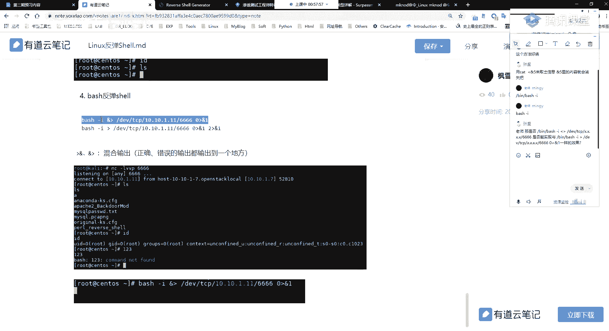

# P62：第29天：Linux反弹Shell方法大全 - 网络安全就业推荐 - BV1Zu411s79i

呃大家晚上好，然后呃能听得到我声音的，看得到我画面的，在讨论去扣个一，有没有问题的话，我们就正式开始我们今天的一个讲课，啊应该是没有问题的，好没有问题的，那么我们呃其他不多说。

直接开始我们今天的的一个内容，我们今天的话主要给大家介绍一下，linux下面的反弹shell的方法，好同样的就是先大概的过一过一遍，我们上节课已经讲过的，已经给大家就是比较详细的介绍的。

这样子的一个反弹性的一个简介啊，上节课的话有就是给大家介绍，就是说什么是正向的一个小，以及什么是反向的一个小，大家对这里的正向西有机反向西，有的这样子的一个概念，应该和有杂音吗，呃现在有吗，电流声。

看一下，还有吗，呃现在还有吗，有还有杂音吗，就呃就就一位同学有吗，其他同学呢，ps问一下什么什么意思，还好是就是是有杂音吗，问题不大呃，有杂音的话还是有点问题了，而且之前的话是没有问题的，对吧哦好吧。

奇了怪了，之前应该是没有问题的是吧，没有没有杂音啊啊问题不大，那么那么我们继续啊，就是呃大家对这一个正向需要，以及反向希尔的一个这样子的一个概念，现在现在心里应该有底了吧。

就是都知道他是什么样子的一个东西了吧对吧，以及就是说我们在说到反向shell的时候对吧，我们的一个反向shell的，就是说我们是它的一个请求，他是什么样子的一个方向，它是从哪边发送到哪边对吧。

然后的话有哪边是主动的去发起一个请求的，这个应该没有问题吧，应该应该都都理解了吧，理解的扣个一，嗯好的，那么呃这边的话我就不多说了，我们继续我们的一个主要的一个内容，就是linux下面的反弹效，呃。

首先的话在讲，反正需要之前的话，我们同样的先给大家介绍一下，就是说nc下面的一个正向线耳机，反向线，最主要的话还是就是说通过这里的一个，就nc的这个工具，我们经常用到的这样的一个工具对吧。

以及这个工具的话呃，它的一个使用的话，就是能够比较好的让大家去理解正向吸耳机，反向吸有的一个概念是吧啊，我这边的话呃，这个linux下面的这个nc跟windows下面的话，其实都是一样的。

其他的一个用法的话，以及它的就是说正向希尔以及反向希尔的，这样子的一个呃操作，以及它的一个原理都是一样的，然后他这边的一个不同的一个点的话，就是说在于我们是在linux下面的话。

我们这边的一个杠一这个参数所指定的，这样子的一个呃，就是绑定的这样子的一个环境变量，就说在linux下面的话，我们是有常见的这种像bs h是吧，bs h还有这种bbh对吧啊写错了，in batch。

以及还有其他的这种像啊zs h的对吧，就是像我这边的这里，我这边呢，这一个的话就是使用的就是一个zs h的，一个zs h的这样子的一个线，当然还有其他的就是呃linux系统下面的话。

有默认的这样子的一个，就bs c h以及bh的这样子的一个share，然后所以的话我们在啊linux下面的话，杠一这边指定的这样子的一个，就是要绑定的这样一个shell的话。

就需要指定我们linux下面的这样子的一个shell，然后的话大家应该还记得，就是说在windows下面的话，我们干一的话是指定sam d是吧，因为我们要得到的话，就是说我们在windows下面要呃。

得到了这样子的一个就是说命令的，命令执行的一个环境的话，就是这个sam一点x一对吧，呃呃关于这里的nc的话，应该不用我再多讲吧，应该都应该都没有问题吧，然后呃其实呃今天的话有同学。

我看在群里问那个问那个nc的，那个我我那个好看的，但是我没有回对啊，这个的话怎么说呢，这个的话如果你有看我的，就是有听我讲课以及看那个视频的话，应该是没有问题的，然后的话呃就是要注意的话。

就是你用nc去进行一个连接的时候，正向效以及反向需要连接的时候，就是防火墙，嗯嗯是啊，防火墙，你的防火墙的话要注意，就是要把它就是要关关掉呃，呃防火墙的话，他会对这样子的一个。

就是说这种端口的这种连接的话，它会去做一个拦截，你主要的话如果你碰到这种问题的话，你就是去呃查看一下你的一个防火墙，然后的话当然的话前提是你两个机器对吧，你要能够直接访问了，就说像我们啊正向希尔对吧。

我们正向需要的话，它中间是没有这种内部的一个阻碍的，也就是说这两个机器都是能够，互相去访问到的对吧，然后的话反向下的话，就是说我们的一个被控端，是要能够去访问到我们的一个控制端的。

这个应该都能理解吧对吧，好呃，然后的话下面的话还有一种，就是前面我们介绍的都是说使用的这样子的，一个杠一的这样子的一个参数对吧，就我们的这边的一个干预参数的话，其实是我们这边反弹shell的一个呃。

就是主要的一个点，就主要的话就是有这一个选项，这个概念的一个选项，我们能够去绑定我们这边的一个需要环境，然后呃就是说在我们的一个linux下面，以及某一些环境下面的话，我们的这样子一个nc命令。

它没有这样子的一个杠一参数，是有这样子的一个情况的，就说他的这样子的一个程序，让它去除了这个杠一的一个选项，那么这个时候我们的这个nc的话，那么就无法去直接使用这个干一参数。

去绑定我们的一个shell来去反弹，来去反弹一个小，所以在这边的话呃，给大家介绍一个这样子的一个方法，就是说在没有杠一这个参数的一个情况下，我们可以通过这样子的一个啊形式，来去进行一个反弹性呃。

当然的话在讲这一个的时候，其实就是要讲到我们今天的一个主要的一个内，容，在讲这个之前的话，大家先呃打开这个打开我这边给的这个文档，打开我这边的这个文档啊，我在预习内容里面的话，如果大家有去预习的话。

应该就是我这边给的链接对吧，应该都有看吧，就第一个就是，然而这边的话就是我的一个一个笔记吧，这是linux下面反弹shell的一个笔记，以及啊重点的这样子的一个。

就是我们在linux下面反弹shell的一个本质，首先的话在讲呃反弹shell的，在讲ppt里面的这样子的一个反弹，这种反弹shell的它的一个写法之前的话，我们首先需要去了解到。

就是说一些前提的一个知识，首先第一个的话就是呃，linux下面的一个标准的一个文件描述符，在这边的话会给大家介绍一个，这样子的一个概念，就这一个呃linux的一个标准文件描述符，的这样子的一个概念。

这个概念的话就是说我们都知道linux系统，它是一切皆文件的对吧，就是说它的所有的这种啊，linux系统下面的所有的这种东西，它都是以文件的一个形式存在的是吧，就呃它会将所有的设备都当做文件来处理。

然后的话在linux当中，他会用一个这样子的一个文件描述符，来去标识每一个文件对象，而且在linux启动的时候，它会默认的打开这样子的三个文件描述符，也就是我这边列举了这，这里这三个分别的话就是012。

这个话应该很好记啊对吧，就012这三个文件描述符，然后的话这三个文件描述符，一的对应的就是说您的话，它表示的就是我们的一个study in staying in stay in的话，就是标准的一个输入。

就这里的话理解的话就是啊，s t d的话就是stay啊，就是标准的意思，steam是sten哦，我那个没读标准啊，然后的话in的话就是input吗，就是输入嘛对吧，s t d的话就是标准的一个输出。

就是s t d out out的话就是output，然后的话s t d error就是标准的一个错误输出，这边e r r的话就是表示error，也就是英文当中当中的一个错误，这个的话应该啊比较好记对吧。

然后的话这边的一个文件描述符的话，分别的就是有对应的，有这样子的一个默认的一个设备，就是说我们的一个标准的一个输入，默认的话这边默认的是零，就是它的一个文件描述符的话，就是表示零对吧。

然后的话我们的一个文件描述符，您所指向的这样子的一个文件的话，或者说指定的这样子的一个设备的话，就是这个我们的一个键盘对吧，就像我在这边我去进行一个输入，我这边的一个输入的话是通过键盘过来的对吧。

我这边键盘输入之后才能够去在这边显示是吧，然后的话呃文件描述符一的话，它所指向的话就是它的一个默认设备的话，就是我们的一个显示器，以及我们的一个就是标准的一个错误输出的话，它也是指示的一个显示器。

而这边的话怎么去理解呢，就是说我这边，你这里的有我这边的这一个啊系统，就我我这边它是一个linux的一个系统，然后的话我在这边去进行一个输入对吧，我比如说我输入一个l s，我输了一个ios。

这一个l跟s的话，就是从我键盘上面去进行一个输入的对吧，所以的话这边的话就是我们的一个标准输入，就是输入的是一个ios的一个值，而我这边ios执行之后对，不执行之后的话，它会输出一个结果。

也就是这个l s命令，它在我这边的一个shell环境下面去解释，执行之后的话，它会返回这样子的一个内容，这个结果对吧，然后这边的这个结果的话，就是输出的一个标准的一个输出，也就是我们对应的。

就是我们这边的一个文件描述符，一，然后我们这边的一个输出大家可以看到对吧，就是输出在我们的一个显示器嘛是吧，或者说具体具体点到我这边的话，就是输出在我这边的一个控制台是吧，因为你只有通过显示器。

你才能够去看得到这边了，然后的话而标准的一个错误输出的话，就是说我这边l s是执行的一个命令对吧，这个命令它是有的是正确的，能够去执行的，那么我随便输入一个，比如说随便输入一个字符。

那么我这边随便输入一个字符的话，这边它的这个小环境，它解释不了这样子的一个啊这一串字符，他不知道他什么意思，所以的话他会有这样子的一个报错，对吧，现在这里的话它是报错的，是就说他我们的一个命令。

就说这一个命令它是无法去找到的，然后这边的这个报错的一个信息的话，就是我们的一个标准的一个错误输出，然后它同样的是显示在我们的一个显示器，也就是我们的这边的一个控制台，好呃。

然后的话就是呃下面的话就是这边的话是呃，文字的一个理解，大家看一下呃，我这篇文字的话应该写的很详细啊是吧，然后呃前面的话有就是有说对吧，有说这样子的一个呃，就是我们与计算机之间的一个交互。

就什么是一个交互呢，就其其实前面也有九有讲对吧，就像这种shell，我们得得到一个shell，是这种交可交互式的一个shell对吧，就这种可交交互式的一个需要的话，就是相相当于就是比如说我在这边的话。

我这个的话其实就是相当于就是一个，可交互式的一个系是吧，当然的话我这边是因为我这边是直接呃，连接上去的，然后可交互式的话，就是说我们去输入一些指令之后对吧，我这边在这个shell下面输入一个指一些指令。

之后的话，他会给我一些输出对吧，然后的话我输入指令他就给我输出对吧，这样子的话就是说我跟计算机之间的话，是有这样子的一个交互的一个过程的是吧，这就是呃与计算机之间的一个交互。

然后的话就是把这样子的一个交互的话，再把它就是带入的到我们这边的这一个，这样子的一个文件描述符来去理解，就我们的一个文件描述符，零的话，就可以理解为我和计算机交互时的一个输入。

也就是我这边输入ios对吧，然后这个s这个输入的话是默认是指向键盘的，然后一的话就是与计算机交互时的一个输出嘛，对吧，然后指向显示器二的话就是我们再去执行命令，或者说计算的时候出现错误的一个输出。

就是啊指向二好啊，这一个就是文件描述符二，它的这样子的一个输出，它默认是跟我们文件描述符一，它指向一个位置，就是我们标准的输出，以及输错误的一个输出的话，它一般的话默认它是显示在显示器当中的，显示器。

然后的话下面我们通过就是一些呃，实际的一个例子吧，来给大家介绍一下呃，这边的就是标准的一个输出以及输入，以及呃还有的话就是呃重定向，再讲这边的一个10年的时候的话，先来介绍一下，就是说什么是重定向。

就这边的一个重定向的这样子的一个符号，就从电项的话，它是把输出的定向到，把我们的一个输出定向到文件，或者说一个标准流好，我们这边的一个从电向输入输出的一个本质，其实就是从电项文件描述符这一个的话。

大家心啊这样子去理解，然后的话在后面我在后面给大家讲，或者说介绍linux下面反弹，需要在一个本质的时候会给大家，就是说去进行一个实际的一个解释理解好，在这边重建项的话，我们这边的话分为两种。

有就是第一种的话就是输入重定向，第二种的话就是输出的一个重建项，而输入重定向的话就是像这样子的一个小于号，就这样子的一个小于号，或者说呃左进括号吧，啊呃反就是这样子的一个符号嘛。

也是大家常经常用到的对吧，大于小于号呃，这个的话输入重定向下，就表示从文件当中去读取我们的一个输入，然后输出重定向的话，就是将我们的一个输出保存到文件，以及呃还有一个概念的话，就是这个管道广道服的话。

就是前面的话我们也经常会去用对吧，就是它是将一个程序的一个输出，作为一个输入发送到另一个程序，就比如说我们之前对吧，我们通过netst on that set，来去查看我们的一个网络状态对吧。

然后我们通常会用这样子的一个广告服来去，就是把我们这边net set查询的这样子的一个结果，对吧，作为一个输入，就他这边执行之后，它会有输出嘛，有输出结果，我这边给大家执行一下ua n o。

呃我这边的话是我的一个w sl的一个机器，我这边我用我这个linux机器的，我们这边对吧，我通过输入netstat看像这种a l p对吧，我们常用的这样子的去查看，你的这样子的一个呃。

你的这样子的一个一些信息是吧，一些进程信息，然后在这边的话，我们这边的话，可以看到它这边有输出这么多一个信息是吧，但是我们想要去精确的去找到，我们自己想要的一个内容对吧。

那么我们通常会用这样子的一个方法，就是把这边执行之后的一个输出，作为group这一个过滤命令的一个输入对吧，就我们这边输出的这些内容的话，它会通过这个group命令去做一个过滤。

然后后面的话接我们的一个过滤条件，像比如说903呃，说二零，比如说八零对吧，然后在这边的话他就会去过滤出呃，这边的一个输出当中，含有这样子的一个八零这个字符，创的这样子的一些啊数据对吧。

然后其实在这边的话，就是用到了这样子的一个管道服，好啊，理解了从电项之后的话，我们再回过头来来去看一下，就是说我们这边更改标准的一个输出，以及标准输入位置，然后通过这边的话来去更加呃深刻的去理解。

这样子的一个就是啊文件描述符，它的这样子的一个啊输入输出，好啊，我们前面的话讲了对吧，就是我这边的一个，我这边默认的一个标准的一个输入，它是文件描述符一对吧，然后的话它默认的话是指向我们的一个设备。

键盘啊，以及我们的一个标准输出的话，它是一默认的话指向显示器，那么我想要把我的一个输出，就是更改到其他的一个地方，就是不让他输出在我的一个显示器上上面，我要怎么去做呢，大家看我这边的一个操作。

就嗯在这边的话，我这边给了这样子的一个例子，在这边主要的话这个命令，主要就是这一个e x e c，这个e x e c的话就是呃我们去，创建我们自己的一个就是说去呃，指定我们的一个文件描述符。

就把我们的一个文件描述符，只从定向到某一个文件，我们需要去使用这样子的一个ex一的一个命令，以及在后面的话会讲，就是我们要想要创建自己的一个文件描述符，那上面的话012。

这种的话是默认的一个文件描述符对吧，它有默认的这样的一个设备，那么我想要创建我自己的一个文件描述符，我同样的需要使用这个ex ec的，这样子的一个命令，然后这个ex ec这个命令的话。

我这边想要达到一个目的，就是更改我的一个标准的一个输出对吧，那么我通过这个ex ec可以去做一个，这样子的一个更改啊，呃我要更改我的一个标准输出的话，大家就是就是脑子里面一定要记住。

这个就是012所对应的一个这样子的一个，关系输入输出和标准的错误输出对吧，那么我要改标准的一个输出，那么我所对应的一个文件描述符的话，就是一对吧，默认的话就是唯一嘛，然后的话我要把我这边的一个呃。

默认为文件描述符一，它所指向的这样子的一个默认的一个设备，做一个更改对吧，我们前面的话我们知道默认的文件描述符一，它所指向的一个设备，这个设备的话就是显示器，也就是输出在我们的控制台。

就其实啊这边的这样子的一个这种设备，其实你也可以把它当，就是它是当做一个文件来去处理的，是正经时系统当中的话，它所有的都是文件，我们的一个设备案例，在linux系统当中，它同样的是一个文件的一个形式。

我这边要更改这一个标准输出，它所指向的一个位置，我这边的话把它就改到这一个test文件，然后回车好，这个时候的话会发生什么呢，就是说我这边更改了我的一个标准的一个输出，对吧。

那么我在这边再去重新执行一个命令对吧，比如说执行ios以及执行外卖，你会发现就是说他在这边，我这边执行命令之后的话，他没有了输出对吧，它的一个输出我这边的话看不到了，那么这边的这个输出它到哪里去了呢。

就到了我们这边的一个test的文件，因为我这边我们刚刚有介绍，就是我这边直线ios，这么它会执行，执行之后的话，他会有这样子的一个输出，这个输出啊就是标准输出，但是它原本的话默认是指向我们的一个显示器。

对吧，我这边做了一个更改的话，就指向到了这个test文件当中，所以的话我这边执行了一个命令，它的一个输出，结果其实是跑到了这个test的文件当中去了，那我们怎么去判断他是不是到了这个文件呢。

我这边另外去开一个开一个shell对吧，我可以cut一下这个test文件，那么在这这个文件当中的话，就存储了，这边我刚刚所执行的一个命令的一个结果对吧，呃这个的话就是更改我们的一个，标准输出的一个位置。

然后然后的话就是把我们的当前的一个，标准输出重定向到我们的一个test文件当中，而其实从电线的话在这边呃，在这边其实我们也用到了这样子的一个，重叠下对吧，这边的话就是把我这边的一个呃。

就是标准输出的这样子的一个文件描述符一，把它重定向到了这样子的一个test文件对吧，然后的话呃，我这边的话，因为我这边的话，我是把我的一个输出重定向到这个test文件，所以的话我在这边做任何的一个。

这样子的一个输出啊，就让他这样子一个执行它的一个标准输出，我们在这边都看不到对吧，然后的话我只是想把我当前的这样的一个标注，标准输出重进下到特斯文件当中，那么我们可以通过这样子的一个就是我这边。

比如说我这边先echo一个a3 对吧，echo echo一个这样子的一个字符这一串数字，然后我这边直接echo之后的话，他会在这边就是标准输出对吧，好的话，我想把我这边的一个执行的这样子的一个结果。

也就是我的一个输出，我要把它从电箱到其他的一个文件当中，好可以通过这样子的一个方式，就我们知道这边的话它执行之后的话，它会有这样的一个标准输出对吧，那么这一个标准输出的话，就是一个文件描述符一嘛。

然后的话我需要把这样子的一个标准输出，重定向到这个test文件啊，或者是说啊123这样子的一个文件当中对吧，然后的话我在这边可以catch一下这个123，你就可以查看到它的一个文件啊。

其实一般的话我们去做这样子的一个，重定向的时候对吧，去做这样子一个重定向的时候，其实大家常用的就是，直接用这样子的一个重定向符是吧，对吧，然后在这边的话，它其实就是呃省略了这样子的一个一啊。

就是把我们的一个标准的一个输出，这边执行之后的一个输出，把它重定向到了这个文件当中，这个话其实就是呃实际是这样子的一个，它的一个原理，呃，呃前面的话，在这边的话是讲了一个标准的一个输出。

然后下面的话我们来看一下，就是标准的一个输入，因为我们知道标准的一个输入的话，前面介绍了，就是我们那个输入，是通过我们的一个键盘去进行一个输入的是吧，就它的一个输入，它是从我这边键盘啊输入之后得得到的。

那么我想要，我想要就是我不从键盘去进行一个输入呢，那么我们就是通过从文件当中去进行一个读取，把文件当中一个内容读读入到一个变量当中，然后的话我们的这一个变量的话。

我们可以通过就是echo命令去进行一个啊输出，在这边的话我们需要使用到这样子的一个read，在这个命令，这个read命令的话，我们read user好，我们执行之后的话，在这边其实大家可以这样理解。

就我这边read之后的话，其实在这边他会有这样子的一个变量，这个变量的话就是我这边指定的这个user，这一个变量，然后的话我的这个变量的话，呃，我在这边去进行一个输入，我随便输入一个这样子的一个值对吧。

然后的话我的这个值的话，就保存到了这样子的一个变量当中，然而还有的话就是，其实啊在这边的话其实是这一个例子，是按那就是理解，就是说我这边的一个通过read这个mini。

就是把我的一个就是从这边的一个输入，把它读取到了这样子的一个标准变量当中对吧，然后实际的话我们就是把我的一个，比如说我要从这一个文件当中，从这一个123这个文件当中，去读取它里面的一个内容对吧。

来作为一个输入去进行一个呃呃输出，那么我们通常的话通过这样子的一个read，然后我这边user user这一个变量，然后嗯，零的话就是表示我们的那个标准的一个输入的，一个啊文件描述符对吧。

然后的话后面接我们想要去读取的，这样子的一个文件，比如说123好，我这边可以通过echo这个user这个变量，能够去获取到，这边从这个文件当中所读取到的，这样子的一个内容对吧，就是这边的一个内容。

然后这边的话怎么去理解呢，就是说这边我们通过啊read user之后的话，我们其实上面的话我这边read user它的一个输入，它其实是我的一个就是标准的一个输入对吧，就是说我这边的话它同样的一个内容。

它是需要我啊，就是如果我不从文件去进行一个读取的话，同样的需要我从键盘进行一个输入，然后的话它才能够去有数据，写入到这个变量当中对吧，然后的话在这边的话，我使用的就是通过从这一个验三这个文件当中。

去读取它里面的一个内容好，然后的话我这边的一个呃执行的一个结果的话，它其实是会会有一个这样子的一个输入对吧，因为你需要有这样的一个输入，你才能够保存保存这个内容到这个变量当中，那么这个输入从哪里来呢。

就从我们这边的一个123的这个文件当中，然后这边的一个123这个文件的话，我们这边使用了这样子的一个输入，的一个重定向，就是从这个123这个文件当中的，去进行一个读取，读取它的一个内容。

然后的话把它重定向到了我们的一个，标准的一个输入，然后我这边的一个标准输入的话，其实就是相当于就是我这边的，从这个文件当中读取到的一个内容，其实就输入到了这里对吧，然后的话我啊不是不是这边是。

然后我这边read要走的话，就把这边的一个内容把它写入到这个变量，然后的话我可以通过echo来去进行一个输出，这个的话就是呃从把当前的一个标准输入，就从定向到，好这边的话写错了。

我这边我这边呢这边写错了，应该是说呃，把我的就把我这边的一个test文件当中的一个内，容把它写重定，就是通过输入重定向写入到这样子的一个啊，悠着这一个变量当中，就是我这边的一个输入的话。

它不是从我的一个键盘确定一个输入的对吧，而是从我这边的一个test的文件当中去做的，一个输入，好标准的一个错误输出，还有标准的一个就是输出它的一个区别，其实我刚刚的话已经有讲了对吧。

就在前面讲012012的时候的话有讲啊，就是呃我们的一个标准的一个输出，我这边执行之后，这一个是标准的一个输出对吧，我随便执行一个命令，这边的一个输出，就是错误标准的一个错误输出对吧。

因为这边的一个值的话是是就是它的一个，我这边执行这个命令之后的，一个返回的一个错误信息对吧，然后呃，我们这边的一个标准的一个错误输出的话，我们同样的可以通过e x e c。

把这个错误的一个输出去做些做一个重建项，就把它指把它指向到其他的一个文件，像比如说我这边要去把我的一个当前的这个啊，shell下面的这样子的一个错误的一个输出，把它指向到啊一一这个文件好。

那么我这边我直线l s是没有问题的对吧，有正正确的一个这样子的一个标准输出，而我执行一个随便执行一个输入一个字符，然后我这边输入一个字符之后的话，他在这边的话它没有任何一个输出对吧，我在在显示器这边。

是没有看到有任何的输出的对吧，然后这边的一个输出的话，其实原本的话他如果没有去重定向的话，他会把我的一个错误的一个输出，输出到显示器啊，我这边做了这样子的一个就是呃，标准错误输出的一个重定向的话。

把它重定向到这个文件当中，那么我这边的一个错误的一个输出，它其实是保存在这个文件当中对吧，呃，我上面讲的这些内容的话呃，大家能理解吗，就是大家有没有什么疑问，有疑问的话，大家呃直接提，嗯能理解是吧。

其他同学呢能能理解的，能理解的，给我送朵花吧，你这个你这个123123，这个是什么呀，你这个不是文件吗，你这个只是书的一个，你看你没看到吗，你这边的一个报错吗，就no such。

no such file or directory，那你这边的一个你要输入的话，你是需要从一个文件当中去进行一个读取，因为我们的一个文件描述符，它所指向的是一个文件对吧，嗯键盘输入的话。

你这边你那你这边你直接read user呀，就不需要去不需要去，您去重建向你的这样子的一个输入重定向了呀，那你直接read优质的话，你直接read user的话。

你这边的话就是已经是一个标准的一个输入了，对吧，因为零的话就是表示的是一个标准的一个输入，嘛对吧，然后你这边你你加了这样子的一个重定向的话，那么你需要从一个文件当中去进行一个啊输入。

就把他把我的一个这一个文件指向，这样子的一个文件描述符，零其实就是从面相到了标准标准的一个输入，对啊我这边的话刚刚不是有讲吗，就是输入重定向的话，就是从文件当中去读取输入嘛对吧，就是我的一个输入。

不是说从我的一个标准的这种键盘当中，就默认的是键盘输入嘛对吧，然后我做做这样的一个输入重定向的话，那么我可以从文件当中去读取它的一个内容，然后的话作为一个输入，好没有问题，那么我们继续呃。

下面的话就是分配自己的一个文件描述符，我们同样的使用这个e x e c这一个啊，这边的话直接看例子吧，这边直接看实际的一个例子，退掉，重新开一个，呃我这边的话我们前面有介绍了，就是0012对吧。

0102，这三个就是默认的这样子的一个文件描述符，那么我想要就是说呃，自己去创建一个文件描述符，然后的话去进行一个这样子的一个，就是文件的这样子的一个输入输出对吧，文件内容的一个输入输出。

那么我在这边的话，我可以通过e x e c来去进行一个分配，文件描述符的一个操作哦，在这边的话我就以这边的这一个例子为例吧，我分配一个五的一个文件描述符，然后我ex 15，然后我要把这个文件描述符的话。

要指向一个文件，这个能理解吧，就是我默认的，像比如说您它其实默认的它就是指向的，就是我们那个键盘的那个设备文件是吧，那么我自己要去创建一个文件描述符的话，那么你这个文件描述符要去指向一个文件。

比如说我这边的话指向这个看一下钢琴路，就就这一个test文件吧，指向这个test文件是吧。

然后我这边的话就有了这样子的一个文件，描述服服务，那么我就可以去进行上面的这样子的一些操作。

对吧，比如说我要想，我想要向这个test的文件当中去进行一个写入，去输入一输入一串数据对吧，那么我可以通过echo，比如说我要输入一个啊，就12345吧，然后我要输入到这样子的一个。

test的文件当中对吧，那么我要输入到这个test的文件当中的话，我其实可以去，就就不需要说直接去使用这样子的一个test文件，这样子的文件名啊，因为我们在这边创建了这样的一，个文件描述服务。

这个文件描述服务它是指定的一个test是吧，然后我这边echo的这样子的一个输出，我这边echo执行之后这一个命令嗯，对执行之后的话，这个的话它是输出在标准的一个输出的是吧，也就是说我这边执行之后。

它其实是会到我的一个标准输出，那么其实我要做的话，其实就是把我这边的一个标准输出的一个，默认的一个文件描述符，一的里面的一个内容对吧，把它重定向到我这边的一个文件描述符。

五的这样子的一个呃所对应的这一个文件，其实就是这一个test文件，然后在这边要注意的一点的话，就是我们要去找到这样子的一个。

就是文件描述服务，所对应的这样子的一个文件的话，我们需要用这个and符号来去做一个引用，就是在这边的一个n的符号的话，它是去呃起的是一个引用文件描述符的一个重，其实际的话就是呃n5 的话。

就是他会去找到五文件描述符，它所指向的一个文件啊，其实就是我们这边所创建的这个文件描述符，它所指向的文件的话，就是我这边的一个test对吧，然后我这边的话执行执行之后的话，其实你会发现的话。

你cat这个test文件这边的一个test文件的内容的话，就变成了我这边的一个呃，执行这边的echo的一个内容对吧，就是我没有说直接重定向到这个，直接的一个文件，而是通过这样子的一个文件描述符。

来把我的一个内容，把它给重定向到了这个文件当中，这个的话就是啊自己去分配一个文件描述符。

然后去啊进行一个这样子的一个输入输出。

好呃其实在这边的话呃，我们在这边的话是一个输入对吧，就说我通过文件描述服务，然后的话通过把我的这边的一个结果，把我的这边的一个一串数字，把它给输入到了这个文件当中对吧。

那么我如何去从这一个文件当中去读取呢对吧，呃不是固定的五啊。

就是说我这边是，你再看我这一个操作吧，好吧，我这边我再随便，我比如说我111，我创建一个111的这样子一个文件描述符，我指向这一个探索啊，test的文件嗯，在这里推一点，诶，啊我这边重新弄一个文件。

有时候就是一一这，嗯不能大于十吗，他这边不能大于十啊，超过十的话，就这边我找不到这个命令，啊就是比如说我以这个为例对吧，我这边的话是为九文件描述符为九，我创建了这样子的一个文件描述符对吧。

然后的话我再去啊，我这边先看一下123，这个文件里面没有内容对吧，r的话我白口一个随便一串字符，然后的话我把它从内向到这个，从逆向输入到这个文件描述符，九所对应的这个文件当中，就是123对吧。

然后我可以cat一下这个123对吧，就是我这边的一个内容。

就这个的话不是固定的，是你可以自定义的，然后的话在这边应该是呃，不能大于十，不能大于十，应该是不能够是两个数字，还是这个，这一点的话，我倒是没有去注意啊，可以不赢打野，我这边，呃这个的话先留做一个问题。

这个的话就是你在自己去操作的时候，你不要去就是多位数，你就就嗯，就0~9吧，我看一下这个他是不是。

我查一下，非负整数就可以了呀，这边你怎么会报错呢，呃这边的话先留做一个疑问吧，我研究区确定一下。

他那个描述的话，他说只是只要是一个非负整数就可以了，就你只要不是负数，然后我们继续，呃刚刚的话讲到了这边，就是呃讲到了这边，我通过自己创建了这样子的一个，文件描述服务物对吧。

然后的话去进行这样子的一个输入，输入到这样子的一个文件描述服务，所对应的这样子的一个文件，啊这个的话是这个的话是没问题的，这个等会儿会跟大家说啊，等会跟大家说，啊先休息一会吧，先休息三分钟。

然后呃50的话再再开啊，好吧。

好啊，我们继续啊，然后呃我刚刚试了一下，确实是呃，应该是我这边的这一个这个需要的一个问题，因为我这边的话是windows下面的这个w s l，就一个临时的子系统，然后他在这边执行。

不知道为什么执行就是ex 1 c，比如说要三执行之后，他在这边他直接就退出去了。

啊，其实实际的话，你只要你这你的这个文件描述符是一个，就是非负整数啊，就可以了，大家可以看我在这边，我这边看你，你看你系统上面对吧，我指定一个123那个文件描述符指向test文件。

然后的话我通过就是呃这样子的一个操作的话，是没有问题的对吧，而这边的话报错的话是因为呃这边注意的话，你的这个重定向符跟你的这个符号要挨着呀，要挨着，呃讲到这边，讲到了这里，然后的话我们继续。

我们刚刚的就是所提到的那个问题啊，提到的那一点就是我这边的话，我ex 1 c5 对吧，我只向着一个探索文件，真的对吧，然后我cat这个探索文件，对，我现在的话是把我的。

就是通过这一个文件描述服务来去做一个输入，把我这边的一个啊值，把它给写入到了这边的一个test文件当中对吧，那么我想要去从这一个test文件当中，去读取它的一个内容，那么我们怎么去进行一个操作呢。

就是说在这边的话就会去涉及到，就是刚刚有同学说的这个这个就是两个呃，就是我们说的就是中文里面的中括号嘛啊，不经括号对吧，这样子的一个啊，其实在这边的话，就是我们知道我们这边单一的一个，就大于号对吧。

大于号的话是一个输出的一个重点项对吧，然后小于的话就是输入的一个重定向，那么我这边e x e c，然后的话创建一个比如说六，就是这样子的一个这样子的一个文件描述符，我们来看一下，比如说12345嗯。

6666对吧，我创建了这样子的一个文件描述符，那么创建了这个文件描述符，我们呃它有什么就是什么样的一个意义呢，或者有什么样子的一个特点，就它这边相比于上面这边的话，唉我们在这边的话。

只是做了一个输入的一个重定向对吧，也就是说他可以去接收我们的一个输入，然后的话重定向到这个文件当中对，但是的话我想要去从他这边去读的话，是读不了的，我们可以通过，就是比如说我想要通过cat来去读取。

这边的一个文件描述服务，它里面的所指向的这个test文件的一个内容，你的五吧，你会发现他在这边的话，它是呃报这样子的一个错误，然后我如果说我在这边对吧，我echo一个随便一串字符。

然后的话把它给输入到这一个文件描述符六，然后的话我可以来cut一下，cut一下这个呃666对吧，来查看一下我们我这边的一个内容的话，已经输入进去了对吧，好的话，我想要去读取呢。

那么我可以通过cat加这个文件描述符六，为什么读取它呢，诶这边怎么。

等一下我看一下。

不要搞错了吗。

再试一下。

诶没有问题的呀，我这边怎么不行呢。

嗯我这个我感觉应该是我这边的这个shell，有问题啊，然后其实，大家在看你上面去操作吧，或者是说呃一个完整的这样子的一个linux系统嘛，然后其实在这边的话大家可以看啊对吧。

就我这边的话是创建了一个66的这样子的，一个文件描述符指向的test是吧，这个test文件里面的话有这样子的一个值，然后的话我通过cat，然后的话呃，就是从这一个啊，66这个文件描述服务当中去做一个。

就是啊输入对吧，然后读取这个文件描述符，所对应的这个文件当中的一个内容，把它作为一个就是输入到，输入到这个cat命令对吧，我们知道cat的话就是查看嘛，所以的话它其实就是会啊，输出到这个文件描述符。

66所对应的这个test文件里面的一个内容。

就是这一串对吧，是没有问题的，我这边应该是我这边的这一个，它这个需要有问题啊，在这边读不出来的，大家在自己的就是完整的运输系统上面去操作，呃呃这个windows下面的这个，应该是有相应的一个问题啊。

因为它不，它其实也不是说一个很完整的这样子的，一个linux的一个系统，呃呃以上的话就是这一部分的一个内容啊，还有的话就是介绍一个这样子的一个特殊的，这样子的一个文件，就这个dv nn这个文件。

就这个特殊文件的话，我们在后面也经常会去用的，就这个文件的话，它是就写入的任何东西它都会被清空，就是他这个很比较特殊，就我们如何去利用这个文件呢，就是比如说我们要去把我们的一个错误对吧。

把我们那个标准的一个错误，就是我想要去执行命令，我之前的一个命令的话，它有各种的一个错误对吧，那么这种错误的一个东西的话，我们是不需要的，就这种报错的一个信息对吧，呃这种报错的一个星期我们是不需要的。

那么我们如何去，就说把这样子的一个报错的一个信息，就是把它就是不显示在我们的一个呃，控制台或者说显示器上面的，那么我们可以通过就是这样子的一个方式，就把这样子的一个标准的一个错误输出。

就是文件描述符二所指，就指向这样子的一个文件，就这一个dv now这个文件，那么所有的这样子的一个错误输出，它都不会显示到显示器当中，然后还有一种的话就是我们可以通过就是啊，这样子的一个方式啊。

就是可以就不移除文件，就是我们想要去删除文件里面的一个内容对吧，那么我们可d就第一种方法，就是我们直接把这个文件删除掉，然后再创建一个对吧啊，其实我们可以通过这样子的一个方法。

就通过cat这个dvn这个文件，然后的话把它从定向到你要去，就是清除这一个文件的这样子的，数据的这个文件，然后的话就可以把这个文件里面的一个内容群，做一个清空，比如说嗯。

我说我这边easy test的这个文件是吧，我可以啊，cut一下这个dv，那应该有吧，然后重定向到这个test文件，然后的话可以看到这个test文件里面的内容的话，就被清空了对吧。

嗯这是一个，好呃，你理解完了上面的这些，就是一些情志的这样子的一些知识点，以及概念的话，那么我们再去来看一下我们的一个ppt的一个内，容，就大家呃大家理解了吗，就是我上面讲的这些概念，以及就是说。

其实主要的话就是理解那个文件描述符，就是标准的文件描述符，以及我们自己去创建这样子的一个文件描述符，以及对他的这样子的一个输入输出的一个操作，是好理解，那么我们再回过头来去看一下。

在这边我ppt上面的这样子的一些这个反弹，shell的这一个啊写法以及命令，其实在这边的话，我ppt上面已经给了，就是一个呃解释好，在这边的话我们一起来看一下，首先这一个命令的话呃，我这边把它抠出来。

放到。

编辑器当中给大家讲吧。

用这个吧，呃呃首先的话就是第一个命令是arm杠temple gf，这个的话就是删除这个tap目录下面的，这个f的这个文件啊，这一个的话就是啊，你要就是其实就是保证这个temple目录下面。

没有这样子的一个f文件，因为我们待会的话需要去创建这样子的一个，f文件来作为我们这边的这样子的一个呃，就是呃，在这边它是一个那个匿名管道的一个文件。

然后在这边的话我们需要去使用这个mk fire four，m k f i f o这样子的一个命令。

这个命令的一个意识的话，我们看一下，呃这边我这边的话就预习内容的话，有给给这样子的一个链接对吧，这个链接的话就是这个linux mk f i f o，这个命令的一个基础用法，然后前面这边的话。

这边的话大家自己去看一下吧好吧，然后的话主要的话就是这边就是我们通过这个，mk f fo来去创建一个这样子的一个匿名管道，然后他在这边的话有解释就是什么是命名管道，就这个命名管道的话。

是两个进程之间的通信的一个通道，然后的话我们可以通过这个命令来去创建，这样子的一个通道，呃呃这里的话是这个是这个呃竖划线，这个竖线是啊，管道的应该是这边的话是广道的意思啊。

然后下面的话这个的话就是一个命名管道啊，命名管道它的一个作用的话是呃，就说在我们这边创建的这个命名管道的话，它其实是一个文件，这也是一个文件的一个形式存在，然后然后的话这个文件的话。

我们可以就是说对它去进行一个输入，已经能够去从这个文件当中去进行一个读取。

它的一个内容，呃，具体的话我们以实际的一个例子来给大家理解。

就比如说我这边的话呃，我创建一个通过mk，f i f o这个命令来创建一个，像比如说创建一个啊p的这样子，一个命名管道是吧，然后我在这边我ios，然后的话查看这个文件，这个p这个文件。

然后你会发现的话他的这个p的这个文件的话，它这边的一个文件类型它是一个p对吧。

然而在这边的话这个p的这个文件类型的话，就是表示的这个文件，它是一个命名管道的一个文件呃。

呃关于这个文件类型的话，大家可以看一下这篇文章，就这这这边的话它列出来就是常见的这样子的，linux下面常见的这种七种文件类型，然后主要的话我们在这边的话，就前面其实也有介绍的吧，就是像这种横杠的话。

就表示常规那种文件嘛，就file d的话就是目录是，而p的话就是表示我们这边的一个pip的一个，命名管道文件，也就是我们这边通过这个命令所创建的。

这个它的这一个的话是p。

那么这个文件的话我这边创建好了对吧，然后的话我可以通过。

就是说通过重定向，向这个文件当中去进行一个写入，就是输入我们的一个内容对吧，比如说我这边还玩死的话，内容的话是这些对吧，那么我ios把ios输出的一个内容，把它给重定向到这个p，然后的话呃我在这边的话。

我重新再开一个，是还有一个终端，然后的话在这边我们这边ios的话，因为我们知道我们这边l s执行之后的话，就是把我这边的一个输出对吧，把它重新下到这个文件当中，那么我们如何去确定我这边的一个就是输入。

就是正确的输入到保存到的这个文件当中呢，我们可以通过cat，在这边cp来去进行一个查看对吧，然后其实在这边的话，你会发现这边我们cp的这个文件内容的话，其实就是我们在这边ios之后所执行的一个。

内容对吧，没有错吧。

呃然后的话，我们既然可以进行一个输入，那么也可以进行一个输出嘛对吧，那么我们可以通过cat进行一个读取啊。

其实呃当然的话我这边的话是直接通过就是cat，直接去读取的这个文件对吧，然后其实我们也可以就是你这样子的一个方法，就是我们用我们的一个输入重定向对吧，我们可以把这边的，我这边p的这个文件里面的一个内容。

把它给通过输入重定向输，就是输入给这样子的一个cat命令，去进行一个输出对吧，然后得到的是这样子的一个结果其实是一样的。

然后在这边的话要注意的一个点的话。

就是说就这一个命名管道这个文件它是一个呃，就是像是一个临时存储的一个地方，就是说这一个文件的话，它是可以去临时的去存储。

我们的这样子的一个输入对吧，然后的话我们这边你存储进去之后的话。

如果你通过cat，或者说你通过而输出的一个重定向好吧，输入的一个重定向，把里面的一个内容把它给呃读取出来了，那么这个文件当中的一个，就是说我们读取了一次之后的话。

我们就呃里面的内容的话已经被读取出来了嘛，对吧，那么我们就第二次我们再去进行一个cat的话，你会你就里面的一个内容的话就看不到了对吧，这里面的话内容的话已经没有了，然后然后其实我们就是这边。

我们再去进行一个输入，一次的话，我这边cat的话还是能够去获取到。

但是我这边cat一次之后的话，第二次的话就没有了。

我们还需要去再去做一个输入，这个的话是需要去注意的一个点呃，好说完了这一个创建这个命名管道的话，我们再来回过头来继续看这个命令啊，这边。

这边呃我们创建了这样子的一个命名管道呃，文件为f在这边的话是f，然后的话我通过cat这个文件，就cat这个文件的话就是就是获得对吧，就是获取里面这个命名管道，文件当中所存储的一个内容嘛对吧。

然后的话这边的一个管道服，就是把这边cat之后的一个值作为一个输入对吧，输入输入到了这边，输入到了这边的话，那么我们在这边的话，需要了解的就是这边这个bs h杠i。

这个bs h杠i的话呃，我们来看一下，就是这边这个bs h杠i是什么意思呢，就我这边我这边ban，我当前的话是一个就是cs h的一个需要啊，然后我通过b杠h杠i的话，我能够去就是说进入到这样子的一个。

s h的一个线，然后你ps可以看到的话，他在这边的话又创建了这样子的一个，s h的一个需要对吧，所以说在这边的话，其实就是我输入这个命令的话，我们就能够去进入到这样子的一个。

就是说或者说得到这样子的一个s h的一个shell。

也就是s h的一个环境。

然后我这边执行之后的话，执行之后，然后在这边这个的话应该也熟了吧对吧，就是二大于n1 ，这里的这个操作的话，我们知道二的话就是标准的一个错误输出对吧，也就是说他在这边。

他会把我们的一个标准的一个错误输出，重定向到这个n1 ，我们知道end就是说话就是引用嘛对吧，引用这个文件描述符一，所对应的这样子的一个文件，那么文件描述符一的话，它是一个标准的一个输出。

也就是呃我这边的一个错误的一个输出。

它会输出到我们的一个文件描述符一，也就是其实就是我们的一个显示器。

也就是我们的一个标准的一个输出嘛对吧，然后的话在这边输出之后的话，因为我们在这边的话，它其实就是我们cat之后的话，他如果说在这里面有内容的话，它就会在这边的一个s h环境里面去执行对吧。

如果说执行有报错，就说他是不认识的这样子的一个命令，那么他执行之后的话，他错误的一个输出，他也会输出到就进行一个显示，显示在我们的一个显示器上面对吧，来作为一个标准的一个输出。

然后的话在这边输出之后的话，输出之后的这一个内容对吧，然后的话再作为这边的一个输入，这边的话就是我们比较熟悉了对吧，就是nc这个命令，就利用的就是nc的一个建立的一个连接。

这边的话是nc我这边的一个ip以及端口对吧，呃在这边的话，其实大家如果nc用的熟的话，应该会比较好理解对吧，其实我们的一个我们可以通过这样子是吧，我这边呃nmc，我这边今天一个666的一个端口对吧。

然后我在这边的话，我另外的一个机器啊，我再通关n c去进行一个连接。

然后去连接这样子的一个六六的一个端口对吧。

在这边的话就已经建立了一个临界是吧，好在这边建立了一个连接的话，其实这边nc去建立的一个连接，其实我们就可以去进行一个输入以及输出，比如说我在这边他们建议你离去之后，我在这边我去输了一个l s对吧。

输入一个l s，那么我这边的一个l s值的话，它就会呃同样的它会输出在这边，我在这边去输入的一个一些值对吧，它同样的能够在这边去进行一个显示，也就是说他在这边的话，它其实是建立了一个临界，能够去传输。

我们在这边输入的这样子的一个数据对吧，那么再回到这边的话再去再去看对吧，我在这边我执行之后的这样子的一个结果，然后的话我通过作为这边的一个输入，其实就是说我这边去连接，我这边nc连接到了这边对吧。

也就是说我在这边连接之后的话，我在这边就是可以去进行一个输入，输入的一个内容的话，就是前面这边所执行的一个结果，然后的话输入到这边的话，其实就会显示到这边了对吧，在最后这边的话。

同样的有了这样子的一个重定向，就是啊一个输出重定向，就是这边的一个结果，就建立连接之后的话，他这个结果重新向到这个temp gf的这个。

文件当中。

然后其实在这里的话，你会发现他在这边的话有了一个回环了，就是说我这边的一个temp杠f这个文件的话，里面呃。

里面的话就是说存储的就是我们从呃。

怎么说呢，就存储的其实就是我们在这边，我们在这边所输入的这样子的一个数据，以及我在这边输入对吧，在这边输出的这样子的一个数据，以及我在这边输入的话，他会在这边有输出，然后其实我们这边的这一个连接。

nc的连接的这样子的一个内容的话，它都会存储在这一个文件当中，那么也就是说在这里，呃，找到那个了，我在这边的话啊，我先就以这样子的一个条面量，演示给大家看一下好吧，然后我这边这个机器这边的话。

我监听了这一个666的一个端口，然后我在这边我去执行，执行之后的话，在这边他又建立了一个零件，然后得到了这样的一个shell对吧，然后其实在这边的话有这样子的一个temp，gf的一个文件对吧。

其实这个文件的话就是我们刚刚所说的那个，命名广告的一个文件，我们在这个tap下面，有这样子的一个f文件是吧，它是一个命名管道的一个文件，然后其实在这边我们可以就是cf cf的话。

我们可以去查看里面的一个内容，好我在这边我去进行一个输入ios，我输入的l s的这个值的话，它其实是会就说我在这边，首先的话是建立了一个连接对吧，现在连接其实在这边对吧。

然后的话从这个连接当中获取到的一个值，它会输入到这个tap gf这个文件当中，就是就是在这边对吧，你会发现我这边我cat这个值的话，这边的这个文件里面的话就是存储的。

其实是我在这边输入的这个ios的一个值。

然后然后的话这一个ios的一个值的话，它其实我们再从这边。

对吧，然后的话其实在这边的话呃，就首先的话它是会i m这个嘛，然后呃其实怎么说呢，他在这边他存到了这个文件当中，它其实会到这边来，就是说我们这边的一个值它会传递过去。

传递到我的，我的这个机器这边来哎对吧，但是的话因为我这边的话我cat了这个文件，所以其实我这边传递了一个值，因为我们知道刚刚也有介绍，就是那个命名广告，我这边如果开了之后的话。

它里面就已经没有内容了对吧，这个文件当中没有内容，没有内容的话，那么我们在这边的话。

它其实他会有这样的一个操作嘛对吧，就他会去读取这个文件里面的一个内一个内容，但是这边它没有内容的话，所以在这边它其实是没有显示的。

就没有获取到从这边的一个内容。

也就是他在这边去执行的一个内容，呃可能这样讲大家不是很好理解，就其实这边的一个ios啊，我直接就通过命令的那个就这边ios在这里对吧，然后的话它cat这个东西的话。

其实就是cat的ios的一个命令嘛对吧，然后的话ios命令的话，把它在这个bshell这个环境当中去执行，那么其实就是相当于就是在呃，这边的这个机器上面对吧，这边的这个机器上面只写了一个l s。

实现了一个l s l s的一个命令对吧。

然后这边的一个命令的一个输出的话，它就会输出到了这边，然后的话再通过这一个连接来返，就是返回到我的这边的这个机器。

也就是我在这边l s之后的话，输出的一个结果，在这边执行之后的话，又返回到了我这边对吧，就实现了一个，呃实现了这样子的一个命令控制，好了我去执行，我们来看一下具体的一个效果对吧。

我s之后的话执行执行的一个结果就是这边，然后其实在这边的话，其实相当于就是在这边执行的这个，ios的一个内容啊，这样然后那个内容对吧，没错吧。

好这里的话大家能理解吗。

这个方法好绕啊，绕的话其实是因为你可能还没有呃理解吧，就是他在这边的话，其实就是利用到了这样子的一个nc，这个吧经历的一个通道，然后的话在中间的话，在这边需要通过这样子的一个输入输出对吧。

因为我们需要我们要与这样子的一个需要，去进行一个交互的话，我们需要把我们输入的这样子的一个命令，把它通过这个通道传到我们的一个目标机器上，面对吧，来去执行，执行之后，它的一个结果。

我们还需要再通过这个建立的一个连接来显示。

所以的话它需要有一个这样子的一个过程。

你才能够去进行这样子的一个命令的一个控制，来去达到这样子的一个反弹稀有的一个效果，其实呃大家自己去好好的理解一下吧，好吧，然后其他的其实其他的方法原理都是类似的，啊，以及下面的这个。

下面的这个也是就是也是类似的，但是的话他在这边用的是这个make node，就是创建的是一个设备快的一个文件，就创建了一个快设备文件，其实这个文件的话，它同样的就是跟我们前面这个命名管道。

我们可以就是说对这个快设备文件去进行一个，输入输出的这样子的一个呃操作，就是像这个文件去写入，然后的话从这个文件当中去读取内容，呃这边的话我就不多说了，然后那个大家可以去看一下，这里的一个预习内容。

就是我们的一个应用程序可以打开关闭，还有读写这样子的一个设备文件，就是我们用这个make node所创建的这个文件，呃然后的话就是bash啊，其实呃你理解了前面的这边的话。

那么就是在bash下面的这样子的一个，反弹shell的话，其实呃就更加好理解了，就呃首先的话我们先就是来看一下，就是说这边现有的这样子的一个batch下面，反弹shell的这样子的一些命令。

比如说这边的第一个，这个的话是大家经常用到的这样子的一个命令，就经常会去使用到这样子的一个bh杠i，然后的话通过这样子的一个方法，去连接这边的一个ip以及端口对吧。

然后的话我们只需要在我们的一个控制端上面，去，今天这个端口就能够去反弹一个效，而具体的一个效果的话，我们来看一下。

可以看到我在这边执行之后对吧，执行之后的话，在这边我就得到了这样子的一个半血的一个小，可以看到对吧，在这边他就得到的是这个，然后我在这边的话，就能够去执行相应的一个命令是吧。

就相当于是在它的一个机器上面去进行的，一个执行。

对吧，没有没有任何的一个区别啊，这是啊一个，然后的话呃，第二个的话就是这样子的一个方式啊，这这边的这个方式的话，其实就是相当于就是啊一个就是一个病种啊，就是一个变化，然后在这边的一个变化的话。

其实就是要结合我们前面的前面给大家讲的，就重点讲的那一那些内容，就是涉及到文件描述符的一个创建，以及我们的这样子的一个输入，输出的一个重定向符，以及我们对这样子的一个文件描述符的。

这样子的一个啊输出的一个重定向，输入的一个重定向，要涉及到的要就是结合前面的所有的一个内容，然后在这边的话，我大概的又给大家就是讲一下这个吧。

呃其实前面的这一部分的话，我们呃刚刚的话已经有讲了，有介绍了对吧，就是创建了这样的一个文件描述服务对吧，然后这里的这个话，其实就是能够去对这边的这一个呃连接，做一个输入以及输出。

也就是能够像这个呃通道去写入文件，已经能够从这个通道当中去读取，所传递过来的一个数据，然后的话在这边的话是cat cat的话，其实就是呃一个输出的一个重定向好吧，一个输入的一个重建项对吧。

就是从我们的这个文件描述服务当中去啊，获取啊，获取内容，其实就是说从这个通道当中去获取，所传递过来的一个数据，然后cat的话就是显示出来了，然后这边显示出来之后的话，这边有一个while的一个循环。

这边的while循环的话呃，我们可以看到有这样子一个read line，就这边的一个read lion的话，其实我们前面也有介绍对吧，有介绍了这个read line，它的一个意思。

就如果就说我们在我们的一个命令行当中，去执行这个read line对吧，然后的话我们就它会创建一个这样子的，一个变量，这个lion的一个变量，而这个变量的话他会去。

就是说它会从我们那个标准的一个输入输入，就把标把来自标准的标准输入的一个数据，把它给写入到这个变量当中对吧，然后的话写入写入了写入到这个变量当中的话，在这边有一个do就是while循环啊。

这边的话是一个需要脚本的一个写法，就是当读取到了它的它的一个数据对吧，它就会做这样子的一个事，做的这个事的话，就是把这边的一个变量里面的一个值，做一个执行，就是它会它会呃执行吧。

就比如说我这边是输入的是一个变量，好不好，不是一个变量，是一个命令，比如说就一个l r s的一个命令对吧，然后的话他do这个l s的命令，他就会去执行这个l s的一个命令，他执行之后的话，在这边的话。

其实就是啊一个呃标准的一个错误的，一个标准错误输出的一个重定向，重定向到这个文件描述服务啊，其实这个文件描述服务的话，其实就是这边的这个通道对吧，那么他这边的一个操作的话。

其实就是把这边l s执行的一个结果，把它给输出到了，把它给输出到了这样子的一个通道，啊这边的话其实是省略了一个一啊，就是标准的一个输出啊，还有错误的一个输出，然后动的话就是啊这个循环结束嘛。

对吧啊，其实是呃实际的一个效果。

我们来看一下吧，同样的这边我的一个控制端，我只需要去今天这样一个端口，然后的话我在这边，被控端去执行这样子的一个命令，执行之后的话，在这边就得到了这样子的一个需要，然后我在这边可以去执行命令对吧。

然后其实在这边执行了一个命令的话，就是我这边ios执行的一个ios的一个输入啊，它其实是会通过这边的这个dv t cp经理的，这个连接来，就是把它放到了这个文件描述服务当中。

然后的话cat的话就是输出的一个结果，其实就是我els的一个mini嘛对吧，然后的话把它的一个输出的一个结果，再通过这个通道传递到了我这边的这个终端，其实就是输出的就是这一部分是吧。

这个的话其实就是一个我输入一个命令，然后的话他在给我返回一个结果。

就是一个交互式的一个shell对吧，就这样子的话就实现了一个交互式的一个需要，啊呃，还有下面的这个话，就是一个base 64的一个兵马的一个，就是一个技巧吧，就我们可以在linux里面。

我们可以通过base 64 gd来去做一个就是解码，就是把这边的一个base 64的一个编码的，一个值做一个解码，解码之后的话，我再把它输输啊，就是传递给这个bh杠i，也就是进入到这个bh环境当中，去。

执行这边的一个啊，basse 64编码的一个啊内容，这边的话其实就是一个这样子的一个反弹，需要的一个内容，然后的话还有一个就是这个batch，这边的话刚刚的话讲了这一个对吧。

然后还有一个就是这一个这一个命令，这个命令的话没有还没给大家讲对吧好，关于这一个就是命令它是怎么来的，我们同样的就是看一下我这篇笔记吧，就其实就是这边的第三部分，就是你理解了这边的第三部分的话。

你就能够去理解这边的一个bh，它反弹shell的一个啊原理，以及它的一个本质，就我们通过这样子的啊，一个命令，来去建立了这样子的一个可交互式的一个系统，好呃，这边的话。

首先第一部分呢就是呃什么是反弹器啊，这个的话其实已经有说过了对吧，讲过了，我这边的话就不多说了，我这边的话就是呃挑重点给大家介绍一下，首先这个半血杠a的话，就是打开一个交互式的一个bh shell啊。

当然的话在这边的话其实是就是啊没有写，那个就是这个batch的一个绝对路径，就其实一般的像这种需要环境的话，会在这个bin batch下面啊，我们ban batch杠i，如果说你没有那个pass的话。

没有那个pass的一个环境变量的话，我们最好的话是加这样子的一个，绝对的一个路径，如果说有的话，就你pass环境变量里面有的话，那么我们可以直接batch gui，就能够去进入到这样子的一个。

交互式的这个bash性，然后的话就是这个dv的这个目录，下面的就是特殊的一个文件，特殊的一个设备，就这个d v tcp，这个的话它是linux系统当中的一个特殊设备，其实也是一个文件嘛对吧，因为呃就是。

linux系统的话，它会将这种设备它都是当做文件来处理啊，这个的话大家一定要就是要有这样子的一个呃，呃印象，然后的话其实这个的话就是一个文件，然后这一个文件的话，我们可以对对它去进行一个呃打开。

那么打开这个文件的话，它就会相当于是发起了这样子的一个，socket的一个调用，然后的话他会去建立一个socket连接，然后我们也可以对这个文件去进行一个读写，就是能够去从这个文件当中去读取内容。

以及写入内容，然后读写这个文件的一个操作的话，就相当于是在这个socket连接当中去进行一个，数据的一个传递，然后我们使用这个dv t c p的一个方法，那就是像这样子就d v t cp。

然后后面j i p接我们的一个端口，然后的话在这边我们打开这个文件的话，那么它就会像这边的这一个ip以及端口，去建立这样的一个socket连接，然后的话呃我们接下来再看一下，就是说我这边的话。

把这边的一个实现这一个半血的这一个命令，把它分成了下面的这几个步骤，分成了下面的这几步，就是1234步，四步好嗯，首先第一步的话就是把被控端的这样子的一个，交互式的一个需要输出重定向到控制端。

就是就是像这样子啊，其实我这边的话就是把这边的，把我们前面讲的这一个把它做了一个拆分了，就是在讲这个字之前的话。

大家就是捋一下思路对吧。

就捋清一下思路，就是说我们想要去实现控制端与被控。

被控制端之间的一个交互的话对吧，我们就是实际的我们不管它中间的一个东西，我们先不管我们去要得到这样一个需要的话，我们要实现的一个功能对吧，就我得到这个线，我执行命令，我执行命令之后的话。

它的执行命令之后的一个结果，它是需要返回给我们的对吧，这样子的话，我们才有个说才是一个完整的一个交互，我执行我这边输入命令，你返回结果给我们对吧，那么这边的这一个命令的话。

我们怎么去输入到，就是怎么传递到我们的一个控制啊。

被控端呢对吧，以及我们的一个被控端，在被控端上面去执行的这样子的一个命令，它返回的一个结果。

怎么返回给我们的一个控制端啊，就是中间的这个实现的话，就是我们需要去考虑的，其实也是就是说一个交互式shell，所要去具备的这样子的一个呃功能是吧，然后的话我们首先的话就需要去实现第一步。

就是把我们的一个被控端的一个交互式shell，它的一个输出重定向到控制板，在这里的第一部分，这一部分是什么意思呢，就是说我们在被控端上面的执行的这样子的，一个命令对吧，执行的命令它的一个结果。

它需要输出到我们的一个控制吧，然后所实现的一个方法，那就是通过这样子的一个bash杠i，然后的话从定向到这一个，然后其实这边的一个重定向的话，其实就是打开打开了这样子的一个文件对吧。

就我这边bgi之后的话呃，不洗干i的话，它会打开这样的一个需要环境对吧，然后的话在这个需要环境所执行的，一个命令的话，他命令的一个结果，它就会输出到这样子的一个呃，这样子的一个通道对吧。

这样子的一个socket的一个零件。

这边通过实际的一个操作啊，大家带大家理解一下，首先我这边的话先执行这个就是bh杠i，好的话，我这边先建贴一个端口，回车，执行之后的话，在这边的话就尽力了啊，不是这边ip写错了，这边执行之后的话。

他在这边的话就建立了这样的一个连接对吧，就连接到了我这边，然后的话连接到了这边的话，我们在这边因为是我们是要把我们的一个输出，就是说在这边的这边是我们的一个控制端啊，我们的一个控制端。

也就是我们攻击的一个服务器嘛，这边的话是我们的一个被控端，也就是我们的一个目标机器，我在目标机器上面执行这个命令，然后的话我在这个机器上面执行，比如说我执行这个ios的一个命令。

那么它其实就是说我这边bgi的话，进入到这个bh其实就是这一个bh，我当前所在的这个bh，然后我这边在这个半血下面，所执行的一个命令的话，它会输出对吧，然后他的这个输出的话，他就输出到了这边的这一个呃。

socket的一个连接通道对吧，然后其实这个的话其实就是我们的跟我们在，这边对吧，呃，ios然后的话输出到一个文件当中是一样的对吧，呃指示的话，这个文件的话，它是这样子的一个socks的一个通道。

我们向他这个通道当中去写，去输入内容的话，那么它就会在这边显示出来，就传递给了我们这边的这个控制端对吧，以及我在这边我再去执行这一个，比如说t w m d d对吧，关麦在这边。

我们都能够去接受到它的这样子的一个结果。

但是的话呃这这里的话是解决了一部分对吧。

因为我们在这边的话，我们想要实现的话是我在我控制端上面，我去输入指令，然后的话来在这边执行之后返回结果，我现在的话只是实现了，就是说我在这边在他的这边，我输入的这样子的一个结果。

能够去重建向到我这边的一个控制端对吧。

这是第一部分，然后的话我们还需要去实现第二部分，就是把控制端的一个输入，重定向到被控端的一个交互式的一个需要，也就是说我们把我们在控制端上面的一个输入，就是执行的一个命令嘛对吧，然后通过这边的这个通道。

这边的这个socket连接，来重定向到我们这边的一个bash杠i。

也就是这一个半环境嘛，然后的话在在这一个半环境上面去执行。

同样的我们执行一下这个，看一下效果，首先的话我这边建立一个监听对吧，然后的话我这边执行执行之后的话，其实在这边啊，这边ip又写错了，我在这边执行之后对吧，执行之后的话建立了一个临界。

也就是建立了这个socket的一个零件对吧，建立这一个连接之后的话，我们在这边去执行一个命令，比如说我这边执行l s对之前这个ios之后的话，我在控制端执行ios之后的话，它会把它的一个ios的一个。

直通过这边的这个通道对吧，然后的话重定向到了我这边的这个被控，这个被控端上面的这个bash杠i，然后的话在这个bash杠i下面，就是在这边执行对吧，执行之后的话返回了这样子的一个结果是。

然后在这里的话这个命令的话就实现了，我通过我在控制端的一个输入，把它重定向到了我的一个被控端上面去。

进行一个执行的一个功能对吧，那么这是第二步，第三步的话，其实我们这边这两步的话，其实就是把我们的一个功能就已经实现了对吧，我实现了这样子的一个交互式的一个需要的，一个功能。

那么我们只需要把这两条命令做一个整合，就是把它整合成我们的一个语句，就是因为我们知道我们有说了，就是说这边的这一个socket的一个连接，其实是我们可以通过啊，通过对这个零件去进行一个输入。

以及输出的对吧，我们可以从这个临界当中去传输，我们的一个命令传输到这边，然后的话给到控制端的这个bash share杠，来给到被控端的一个batch去执行，之后的话把结果通过这个链接。

通过这个sol的连接，在啊传递给我们的一个控制端对吧，然后我们结合这两条语句的话，就是像这样子这样子的这一条语句的话呃，跟前面的话有什么区别呢，就这一条语句的话。

就是和把从这边的这个socket连接的一个数据，作为我们这边的一个bash，刚才的一个输入就是，啊这边应该是先从这边来，就是我这边的这个连接，从这个连接当中的话，我能够去得到它的这样子的一个书啊。

从我的一个控制端啊。

就是这边。

就我这边我输入的这个l s的话，l s的话他会到这边来对吧。

到这边来的话，它其实是会在我们的一个被控端上面的话，就是作为一个标准的一个输入对吧，就是表这边的一个零的话。

就是表示我们的一个标准的一个输入嘛，我们可以在这边看到对吧。

他在这边的话作为了一个标准的一个输入，就是l s嘛，那然后的话在这边的一个标准的一个输入的话。

它重定向到了我们这边的一个呃，标准的一个输出，也就是说把这边的啊ios这个命令它执行之后，执行之后的一个结果的话，它会呃输出到我们这边的这样子的一个呃连接。

我们来实际看一下吧。

圆形resist，你看到我在这边执行之后对吧，执行之后的话，我在这边执行l s对吧，执行l s之后的话，他在这边的一个结果就返回给了，返回到了我这边对吧，这其实等于就是把我这边上面的这两个。

上面的这两条命令做了一个整合，我在这边输入输入之后的话，他在这边的这个bgi执行对吧，在这个bh杠i执行之后的话，他把执行之后的一个结果，再通过这个所有的零件来进行一个输出，对吧，其实在这边的话。

就是把这边的这一个标准的一个输入，其实他在这边有两层啊，就是相当于就是你在这边，你把我的一个命令传给了他对吧，然后在这边执行执行之后的一个结果的话，其实就是在这边这个零件，它同样的会通过这个零件吗。

然后的话输出来说出来的话，其实就是这边的一个标准的一个输入嘛，然后的话标准的一个输入的话，把它从地下到标准的一个输出，那么其其实就是在这边的话，就是这边的这一个输出，然后呃我们在这边话。

就实现了这样子的一个效果。

但是在这边的话，这边的话不是还不是一个完整的一个命令。

就是它还是它会有这样子的一个小问题。

就是我在这边对吧，我在这边我执行的，比如说我执行关麦，我执行关麦之后的话，他在这边他在一个被控端上面，它同样的会有这样子的一个换麦的一个输出啊，就是因为我们这边的话是通过这一个连接。

把我这边的这个连接当中的这个命令，作为了他的这边的一个标准的一个输入对吧，就输入之后的话，他在这边执行之后的一个结果的话，在作为一个标准的一个输出，通过这个链接传递给了我们这边的这里，传到了这里对吧。

然后在这边的话，我们可以通过这样子的一个方法，就是最后的一个最后的一个那个完成，完全的一个完整的一个命令，就是在这边的话，我们需要去了解到这这边的这两个呃，符号的一个表示就是大于n的1n的。

大于这个符号的表示的话，它的一个意思都是这一个都是混合输出，也就是正确还是错误的，一个输出都输出到一个地方，就我们在这边的话，可以通过，就是就把这边bgi之后的这样子的一个，或正确的以及错误的一个输出。

他都输出到了这边，输出到这一个链接当中。

然后这一个的话其实就是我们最终的这样子的，一个反弹shell的一个命令。

我这边命令没没复制成功了。

执行执行之后的话，就得到了这样子的一个bash的一个系对吧，然后其实就相当于就是我在比如说我这边的话，是一个，这边是一个正确的一个标准的一个输出啊，不输入对吧，然后的话标准的输出。

以及在这边我的一个就是随便输入的一个，错误的一个命令对吧，所以这边的话他就返回了他的一个，标准的一个错误输出，也就是错误的一个结构，它同样的呃也返回给了我们，就是一个完整的这样子的一个交互式的一个线。

以及还有的话还有一种写法的，就像这样子就这样子的，这种的话就可能会更加好理解一点，就在这边的话呃，我们就是把其实就是要去做一个，混合的一个输出嘛，就是把正确的，错误的一个输出。

都输出到我们的一个标准的一个啊输出嘛对吧，有的话在这边我们的一个就是错误的一个输出，也同样的输出到了一个标准的一个输出，就是加了这个嘛，然后就是实现了我们最最终的这样子的一个bt。

下面的一个反弹需要的一个命令，就是这一个我们常用的这样子，一个仿生系列的一个命令，啊这个的话你试一下吧，好吧，你自己去试一下吧，我这边的话，我这个号我就不试了，因为像这种的话，你自己拿两台机器。

你自己这样子尝试就可以了嘛，但是你要去我这边给大家讲，这个的话，其实就是要让你去理解我们，首先第一点，首先第一点就是，首先第一点的话就是呃，一个就是一个交互式的一个需要，交互式的。

一个交互式的需要是怎样的，啊我这边发权利吧，呃一个交互式的shell它是怎样的，就是我们一个交互式的一个shell，它是我们要把我们自己的一个输入对吧，把我们自己的一个输入，在我们的一个被控端上面执行。

然后的话返回结果输入，然后返回结果是吧，然后第二个的话就是我们如何去实现这样子的，一个交互式的一个shell，就是如何去把我们的一个输入就实现交互式，需要就是把我首先第一步就是把我们的。

输入就是从面相到，标准的从面相到我们的一个呃呃被控端，the rush，对吧，然后第三个的话就是就把就是被控端，把被控端下执行的结果，重定向到我们的一个控制板，其实就是这样子的一个流程。

然后具体的一个实现的话，我在这边的话应该给大家讲的很清楚了吧，就是其实今天的一个主要的一个内容，也是这边就就是大家把我这边的这个笔记，自己好好的去看一下，理解一下，就是呃在这边的话，我花了挺多的时间。

就是力求给大家讲细，然后让大家能够理解，呃然后其实主要的话就是linux上面的话就常用的，其实就这一些命令嘛对吧，这些命令，然后的话像在这边的话，这边有一个这样子的一个网站。

这个网站下面的话有比如说nc啊，不算像半席对吧，半洗的这种，像第一个第一个话，这个话就是其实就是我们这边讲的嘛，然后第二个的话，这种这种的话其实就是一个病体嘛，就是他并了一下。

然后的话他同样的就是有用到我们这边的一个，文件描述符对吧，也就是我们你理解了我们这边的，我本节课所讲的这个文件描述符的话，那么你就能够去理解到他这个语句，它的一个它是怎么去写的，以及它的一个作用。

呃还有看一下嗯，啊他这边的话就就就这个就这一些，啊其实啊还有我ppt里面的对吧，ppt里面的这个这个也给大家详细讲了，其实也是就是重定向，然后的话文件描述符对吧，以及这边的一个reader。

的一个就是输入的一个重定向，然后后面的话还有一部分的一个内容，其实后面的这一部分内容的话，其实，大家看一下应该就会了，就是都是比较怎么说呢，都是就是一些脚本脚本，脚本方面的这样子的一些东西啊。

这就是不比我们在这边讲的bbc，这边的话你需要就是了解，就是了解你linux下面的这样子的一个，就这种呃输入输出重定向的这样子的一个概念，以及它的一个操作是吧，好然后后面的这一些的话。

像peer python，还有啊p h p i这些rebi这样子的一个，脚本语言的这样子的一个呃，方法的话就是你需要去了解，就是说他的这个脚本语言的一个一个一些，就是写法吧。

啊其实这些的话你也不也不需要说，你要去死记硬背什么的，你直接就是你知道这个东西，然后你直接用就ok了是吧，而其实像这种像这种脚本的这种写法的话，其实我们也能够从从中找到，就是说跟我们前面讲的一些共性呃。

我这边的话大概的说一下吧，就是就比如说你这个p是吧，这个pr这边杠一的话，杠一的话应该其实前面有讲对吧，杠一后面的话我们可以执行pr的一个代码，就是其实就是这一串就执行我们的一个pr这个，脚本的代码。

然后user socken的话就是使用这样子的一个socket，socket的一个这样子的一个啊模块或者说库啊，就其实跟python也是比较像的嘛，因为其实都是这样子的一个脚本语言。

然后这边的话就是一个变量负的一个值的话，就是这边的一个i p以及一个端口对吧，然后的话调用这样子的一个socket的，这样子的一个方法，当然关于具体的这样子的一个实现的话，这边的话我就不多说了。

就是这个的话，因为你每个语言的话，他的这样子的sort的一个实现的话，就是写法的话有相应的一个区别，但是它的一个原理的话，都是建立这样一个shot的一个零件对吧，经历了这样的收割者连接之后的话。

就是在这边连接到了我们这边的一个ip及端口，对吧，然后的话他在这边他会有，我们可以看到在这边有standing in，然后standing out，还有standing error对吧。

这个这个的话我们就我前面讲了的话，大家看到这个应该就比较眼熟了吧对吧，然后像在这边的话就是呃，这个s，and s这个是呃，在这边就这边我们这边建立了一个socket，连接的话，其实是这个s对吧，我们。

这里这里我们您尽力就connect，连接了这边的一个ip及端口对吧，连接之后的话它会有给给你这样子的一个s，这个s的话，其实我们可以看到n s，就其实也类似于我们linux下面的这样子的一个。

文件描述符对吧，我们可以通过这样子的一个方法去调用它，然后的话重定向嘛对吧，就把我们的一个标准的一个输入，以及标准的输出以及标准的错误输出，都重定向到了这样子的一个连接当中对吧。

然后的话我们的就是说我们的这样子的一个，输入输出以及执行的一个结果，都是在这个连接当中去进行一个传递对吧，然后以及最后的这边的ex e c bs h的话。

就是进入到这样子的一个b s h的一个shell，的一个环境嘛对吧，因为我们要去把我们的一个输入，把我们的一个输入，我们输入的一个命令通过这个链接对吧，传递过来之后的话。

它需要在这样一个需要环境下面执行，执行之后它的一个标准的一个输出，然后再然后的话再传递，再通过这个零soc连接传递给我们的一个呃，控制端对吧，以及标准的一个错误输出，然而还有的话python的话。

python的话也其实也是类似的对吧，它同样的是调用的这样说库这个sol的库，然后的话呃尽量这样子socket的一个零件是吧，然后在这边的话，我们可以看到有这样子的012对吧，我们的一个文件描述符嘛。

以及在这边的话，用sub process就算经历了这样子的一个shell吗，bh的一个shell是吧，呃还有的话就是，呃python这边的话，就是我这边pp的话也给了一个这个。

就是这个web deliver，就其实呃前面讲温的下面的反弹效的时候也有，就使用这个嘛对吧，web d liver去反弹效，然后在这边的话，我们可以也可以通过它的这个来去生成一个。

这样子的一个python的一个代码，其实就是也是一个反弹shell的一个代码是吧，然后他这边的话不一样的一个地方，就是他这边用啊用u2112 open嘛来去请求，这边他的就我们的一个v p s上面。

我这边msf服务器上面，它会有这样子的一个web服务的这一个文件，他会去请求这个文件，然后的话请求他这个文件里面的一个内容，还要去执行嘛对吧，就是二点read的话，就是就是这边获取到的它的一个内容。

它把它读取出来，然后的话执行执行它对吧，然后呃p h p的话，p h p的话也是啊也是一样的对吧，p h p的话就更加简单一点，就是就是呃用的他的一个也是用的socket的一个，open嘛对吧。

就建立socket连接，以及通过web deliver来去生成这样子的一个，菲律宾的一个代码啊，这个的话也是一个反弹需要的一个代码呃，还有rebi这个的话revi这个的话呃。

其实我这边的话都有给这样子的一个命令，这边的话应该是太长了，所以的话我没没我没有贴在这边，所以的话我就只贴了这样子的一个命令，就是我们可以通过，就是在这边我都有给这样这样子的一个命令，对吧。

我们都可以通过这样子的一个方法，就是首先这一个这一个命令的话，msf v norm呃，实际来看一下吧，所以这边，arm windom gl的话就是显示我们的。

就是比如说我们想要去查看我们的一个payload，是吧，我们可以通过呃，我这边过滤下巴还是，嗯是plog，pload，写错了，我这边的话就是过滤呃，过滤了是n net cat。

也就是我们的nc的这样子的一个payload，然后的话这边a w0 k的话，就是用它做了这样子的，就是只取只输出第一行嘛，啊不是啊啊对，就第一行吗，因为我们如果你直接呃直接显示配偶的话。

他会还会去显示这一个就是这个po的，它相关的，像比如说它的一个使用的一个频率对吧，以及它的一个描述等等这种多余的一个信息，我这边的话我不需要，有的话，可以通过这样子awk只输出它的第一行。

也就是它的一个payload的一个名字，然后我这边的话以这一个啊，revise的net cat的这个po的为例，我们可以通过msf voma，去生成相应的这样子的一个，把它需要的一个代码嗯。

这边指定这个payload，然后的话，然后呃在这边的话杠f r a w的话，就是就是输出它的一个，就是呃输出它的一个payload，然后在这边的话就是输出的是使用的nc的，这样子的一个po的。

其实我们看到这个的话，应该就大家听了我今天讲的一个内容的话，看到这种东西的话，应该就了然于胸了吧，就像这种配料的。

就像这种payload是吧，哦复制出来，复制出来的话，你看到这里的话，其实跟我们前面讲的都都一样了对吧，没有什么太大区别，它同样都是用的一个make a f f o，创建了这样子的一个呃命名管道对吧。

然后的话建立了一个连接，进行连接之后的话，他从这一个命名管道当中，他从这个命名管道当中去读取，去作为一个输入对吧，输入作为它的一个输出，然后其实就是它会输出到这边吗，这边建立的这个零件。

然后的话把它里面的一个内容的话，做一个执行呃，呃，然后执行之后的话，它就呃从列向到这一个命名管道这个文件对吧，以及把错误的一个输出也做一个啊，就是标准的一个输出。

然后其实跟前面的话，稍微就是写法稍微有点不一样，但是原理都是一样的，同理的话还有其他的这些像pr这种，你都可以通过这个查找到相应的一个payload，然后的话你再通过这样子的一个方法，来去进行一个生成。

这边生成的话就是杠l f的话，直接的话i1 w的话就是roll，就是原始的这样子的一个代码吧对吧，就是你这边呃，因为这边的话就是一个nc的一个反弹，shell的一个代码嘛对吧，如果说就说我们指定这一个。

反正需要的一个n c的代码，如果说我们指定生成ex一这种对吧，那么他就会把这样子的，就是说它会是以这样子的一个nc的一个反弹，需要的一个方式，他会去生成这样子的一个可执行文件。

就是这种声这种的话都是呃原理都是类似的，然后这边的话直接输出i w的话，就是输出它的反弹需要的一个源码，就原始的这样子的一个那个嘛，然后还有就是还有其他的这些，我就不一一不一一的展示了，好吧。

大家呃自己课后去尝试吧，就是主要的话重点还是去理解它的一个，原理是吧，就然后的话你看到这种东西，你这你就知道他知道他大概是什么，什么意思嘛是吧，这至少这一点，啊还有第八个的话就是这个tnt。

呃tnet这个的话，其实也是比较类似的呀，就通过这样子的一个方法，就呃这边的话在攻击上面，去今天这样子的两个端口，然后的话啊在目标机器上面执行这个执行的，这个的话，其实就是他首先去连接。

我们这边的五五的一个端口，然后的话从这个端口当中，其实，大家只需要就是记住，就是说你的这样子的一个交互式的一个，需要的话，你需要去处理，我们的一个就是处理我们的一个输入，以及啊输入之后的话。

在目标机上面去执行的一个结果的话，它需要能够返回给我们的一个控控制端，然后呃，还有的话另外的这样子的一些一些形式，就通过make node这样子的一个方式，当然的话在这边它同样的也有，也有使用这样子的。

就make node的这个的话其实就跟前面是一样的，就他同他这边make note的话，创建了这样子的两个呃快设备的一个文件嘛，就这一个a，然后的话同样的有去使用这样子的一个，重定向是吧。

就零一的这种标准的一个输入，标准的一个输出这种文件描述符，所以在这的话我就不多说了呃，第九个的话就是这个open s sl，open s s l的话就是我们可以用它。

因为我们的这open s s l的话，在link里面的话，你有这种s h的话，一般都会有这样子的一个这样子的一个mini，然后的话这个我们可以通过这个opp s，来去生成这样子的一个密钥。

然后的话再去做这样子的一个反弹器，用open cs呃，得到了这个需要的话，因为我们知道s s r的话，它是一个就是呃加密的，它的一个它的这种流量的话，它都是一个加密的一个形式对吧。

然后的话他这种加密的一个形式的话，那么就我们的数据的一个传递，以及命令的一个交互对吧，它都是它的这种流量，它都是一个加密的一个形式，所以的话能够达到一个隐蔽的一个效果，然后具体的一个方法。

那就是像这样子呃，这边的话我就不一一的操作，应该应该不用我多做操作吧，不用我再操作了吧，这个的话呃把ppt发给大家，大家自己课后的话就照着我这边呃敲就可以了，关于这个命令的话。

其实就是这open s s这个命令的一个使用，这个的话也没什么好说的吧，呃以及最后的话就是呃这个实验这套啊，这个实验的话还是就是上节课的那个课后作业，然后的话呃我们这节课的一个课后作业的话。

就是把大家自己呃好好的去理解一下，我这边的我本节课所讲的一个内容，其实重点的话，我花了挺大大半的一个时间给大家介绍，就是说呃这边的呃，linux下面的一个文件描述符对吧。

一切皆文件以及我们的一个重定向管道，以及我们的一个输入输出的这样子的，一个重定向，因为呃这一些就是他的这样子的一个反弹，shell的它的一个就是原理以及本质的话，你需要去了解到。

我上面刚刚所讲的那些东西是吧，其实你了解的那些东西的话，你再去看这些的话，你会你就会能够去呃，就是一目了然吧，或者说了然于胸对吧，我知道我知道他的这个命令，他有他的这样子的一个数据。

他是怎么去进行一个传递的是吧，以及我的一个交互式的一个需要，它是怎么去实现的对吧，好吧以上的话就是我们本节课的一个内容啊，呃大家有没有什么问题，有问题的话，大家呃直接提，或者说呃我哪里没有讲明白啊。

以及嗯讲的哪里有有问题什么的，大家都可以直接指出吧，呃有问题的啊，没问题的给我送的花，有问题的直接提，有问题的扣一，没问题的送花吧，你再发个表情是什么意思呢，这没问题吗，就就就三位同学吗，四位。

这现在还有20位呃，怎么怎么现在听课的是因为讲的时间太长了吗，因为有事还是怎么的，不是有20多位同学吗，怎么现在听课的越来越少了呀，是因为我讲的讲的不太好还是怎么的。

就是如果大家觉得我讲的哪里不好什么的，你可以提呀，你可以你可以给我提意见嘛是吧，或者你直接说你直接说也行，你私聊我也行吗，原理有点糊吗，那我建议你呃你在你就是你看我的回放，你看我的回放。

然后的话你再实际的去进行一个操作好吧，然后如果你还是还是不太理解的话，以及其实我这边的这一个文章，其实应该写的很详细了呀，然后你自己你再去做相应的一个操作，应该应该会能够去理解的呀，应该是说当然的话。

你就是你因为你刚开始刚开始了解这个的话，其实呃怎么说呢，就是印象不是很清楚的话，其实正常，因为这个东西的话，其实因为你要去理解，你要去理解，比如说我这边讲的这种文件描述符对吧，这种东西的话。

你自己你不去，你自己不去在linux系统上面，你去操作的话，你你只看这一个命令，你你是完全感受不到的，它的这种效果的，也其实也包括我前面前面ppt里面的一个内容。

这些内容其实都是就是应该也算是干货吧对吧，就是但是这种东西的话，你自己你不去实际的去操作，去敲的话，你永远感受不到它的这样子的一个效果，以及你不会对他有一个呃直观的一个印象，就是你看我讲完之后的话。

你你过过一会你又忘了，真的，原理的话看一下，我看我这个吧，看我这个，然后的话自己操作一下好吧，以及我回放的话好不好，我的那个就直播回放的话，你认真去看一下，听一下吧好吧，就跟着我的那个思路走一走一下。

然后呃有问题的话，私聊或者群里群里问嘛，好呃，应该应该都没有什么问题吧，但是这21 21个人，只有这几个人那个吗，其他的没没表态的，是不是有问题啊，反正还是那还是那句话吧，你有问题的话。

你还是就直接说出来，你直接问对吧，你直接问出来的话，你多问点问题，其实对你自己学这种东西会很好吧，当然的话你问的问题就可可能有时候，因为怎么说呢，这东西的话每个人都有，就是怎么说呢。

有这种知识的一个盲区吧，就是你可能没有说去会关注到这一点，就像呃就是上节课上节课的那个那个东西，其实呃那个我还没去看啊，就是那个确实是呃我没有去关注那个东西，所以的话你可能问我这个问题。

我一时半会可能没有给你解答，这个的话呃，我只能说我就是在课后对吧，我课后的话我尽力去，就是说去把这个东西是一个什么东西，然后的话把它呃搞懂之后的话，我再跟你说好吧，因为呃不可能说什么人。

就不可能说所有的东西都懂吧是吧，总有没有去关注的，或者说不知道的一个点好吧，啊没有其他的话呃，也不跟大家多说了，就不跟不有点，就是后面的话又跟大家闲聊了一下是吧，没其他的问题的话。

那么我们下课吧。