# P63：第31天：Metasploit Socks代理 - 网络安全就业推荐 - BV1Zu411s79i

呃大家晚上好啊，能听到我声音，以及能看看到我屏幕的呃，同学的话在讨论区扣个一，然后以及我的一个麦克风应该没有杂音吧，没有杂音对吧，嗯好的，那么呃现在已经八点多了，我们正式开始我们今天的一个课程内容好吧。

好，我们今天的话主要给大家就是介绍一下，socks的一个代理，然后的话会一个就是一个靶场的一个实战，来给大家演示，就具体的我们如何去通过一个这样子的一个，说辞代理来去进行一个内网的一个穿透。

其实我们呃这边的这个内容的话，其实主要的话就是告诉大家，内网穿透的一个一些方法，而我们在这边的话就是使用的是这样子的一个，sos代理的一个方式来去进行一个内网穿透。

好本节课主要给大家介绍的就是这三块内容，第一块的话就是对所指代理的一个简介，就带大家一起来了解什么是sos的代理，以及我们为什么要去使用到这样子的一个，sos的一个代理。

然后第二个的话就是sos代理的一个工具，就是给大家大概的介绍一下，就是说有哪些socks代理的常用的一个工具，然后第三个的话就是说代理的一个呃实战，我们本节课的话主要是通过msf好。

下一节课的话会给大家就是说在具体的剧使用，就是说在我们无法去使用msf的一个情况下面，我们如何去通过其他的一样的，其他的这样子的一些代理工具来去进行一个呃，内网的一个穿透，呃，好的。

我们正式开始我们今天的呃，第一部分的一个内容就是sx代理的一个简介，啊我这边的话把ppt先发给大家，请把ppt发ppt发给大家，不然的话呃等会的话又容易忘记，呃本节课的一个ppt的话已经发到了群里。

大家可以就是呃打开我的一个ppt来跟我一起，就是来过一下今天的一个内容，好我在这边的话，我们先来先来一起看一下什么是socks，呃，socks的话它是一个网络的传输协议啊，主要的话适用于客户端。

还有外网服务器之间通讯的一个中间传递，也就是做一个这样子的一个啊客户端，我们内网的这种客户端，与我们的一个外网服务器之间的一个，这样子的一个数据传输的一个通道，然后的话我们在这边可以使用这样子的。

excece的一个协议，然后呃根据我们的就是说，大家应该网络的话应该有相应的一个基础对吧，就关于网络的这样子的o s i的一个模型，应该呃以及这个tcp ip的五层模型，应该有一定的了解对吧。

我们呃应该大部分都是学计算机专业的，这一块的对吧，然后的话呃根据我们这样子的一个模型啊，我们的一个sos的这个绘画协议的话，它是位于我们的一个表示层以及传输层制定，也就是在这边表示层以及传输层之间。

它是一个绘画层的一个协议，要注意，然后的话呃，我们再去使用tcp的一个协议传输数据，要注意的话，就是说我们的一个socks的一个企业的话，它是呃使用的是一个tcp的一个协议，去传传输我们的一个数据。

然后在这边啊特意提到这一点的话，就是说我们在这边要注意的一个地方，就是我们而不提供，就说说他是不提供去传递这种sm p信息类的，这种网络成网关的一个服务，我们知道s m p的话就是我们常用的一个pp。

我们的一个ping命令的话，我们通过p命令来去发现呃，来去通过发送这样的s m p的这种数据包，来去呃，探测主机的一个存活对吧，然后的话在我们的一个，我们可以通过这边的这个图能够看到的。

我们那个sp的一个协议的话，它是处于一个网络层的，而我们的一个socks的一个传输的一个协议的话，它是处于一个绘画者，他是通过tcp ip的一个协议去传输数据，因此的话它是不支持去传递我们的这样子的。

一个sm p的这样子的一些数据的，所以的话我们的一个sos，它是就是说我们在后面去使用我们的一个，手指通道的时候，我们无法去使用这样子的一个ping命令来去啊，通过手指通道来去呃，探测呃。

内网的其他的一个主机的一个存活，这边的话要给大家要注意一下，好的话呃，这边的话就是给大家介绍一下，我们为什么要去使用这样的一个，sos的一个通道，就是说我们使用这个设置通道，有什么样子的一个优势。

就是说在现今的这样子的一个网络架构的话，我们通常的话就说内部网络与外部网络，中间的话会有相应的一个呃阻隔阻隔离对吧，我们通常会使用呃，防火墙等等这这样子的一些设备。

把我们的一个内网与外网之间做一个隔离对吧，就是说不让外部的一个网络能够，去直接的去访问到内部网络对吧，以及去限制内部网络呃，去访问外部网络的相应的这样子的一些呃，呃方法协议，所以的话呃我们再去啊。

我们再去内网与外部网络之间，去进行这样子的一个通信的时候，它会有这样子的一个阻碍是吧，然后的话这样子的一个防火墙系统的话，它通常是以这样子的一个应用层的一个，网关形式去工作，在我们的一个网络中间。

他可以去对我们的这样子的一个tnt ftp，还有sm tp等等这样子的一些呃，呃访问这样子的一些协议的一个访问的话，能够去做一些控制对吧，就提供了这样子的一个框架，来使我们这边去受限制的。

这样子的一些协议的话，我们可以通过我们的一个收拾通道来去，和安全的透明的去穿过我们的一个防火墙，啊呃下面的话就是介绍一下什么是socks代，在这边的话我列了这样子的一个嗯，我列在这边的话。

我列举了就是说socks 4以及socks 5这两个版本，它的一些特点以及它的一个啊一些区别，其主要的就是让大家去了解，就是说socks协议它的一个一些特性，然后的话呃这边我们一起来看一下。

被代理短语代理服务器的话，通过我们的一个socks 4，socks 5代理协议去进行这样的一个通讯，然后呃宋四的话，它是对htp的一个代理协议的一个加成，就，它不仅仅它不仅代理htp协议。

它会对所有的这种向外的一个连接，去进行一个代理，他没有一个协议的协议的一个性质，然而sos 5的话它是对呃，说成是的话，这个版本做了一个扩展，就增加了我们能够去支持udp的一个代码，还有身份验证。

然后说不是呃，说不出五的话，它采用了一个这样子的一个地址解析方案，能够去支持域名啊，还有我们那个ipv 6地址的一个解析，这边的话就是带大家大概的了解一下啊，呃在这边的话我们还要注意的一个的话。

就是我们在使用socks代理的时候，需要有下面的需要去了解下面的这三点，第一点的话就是说是服务器的一个ip地址，也就是说我们的一个客户端，我们就说我们要去通过我们的一个这样子的，一个代理去啊去啊。

就是我们的一个被代理端，与我们的一个代理服务器，我们想要去间接这样子那个收视通道对吧，然后的话进去送出通道之后的话，我们想要在代理在我们的一个客户端，通过这样子的一个代理服务器。

也就是通过建立的搜索通道来去进行一个呃访，问和另外的这样子的一个呃网络的话，我们需要去知道这样子的一个代理，服务器的ip地址以及它的一个端口，然后呃一般的话就是呃。

一般的代理服务器的一个端口的话是1080，就是呃如果你不去做特异的一个设置的话，就是1080的一个端口，而第三点的话就是说服务的话，你需要去确定它是否需要去进行这样的，一个身份验证。

就我们呃在这边的话有提到，就是sos的话，它增加这样子的一个身份验证功能，也就是说你需要去呃，有有一个这样子的一个账号密码，你才能够去通过这样子的一个数字通道，来去进行一个呃数据的一个传输以及访问。

然而第二部分内容的话，就是介绍一下sos代理的相关的一些工具呃，这边的话，首先第一个就是这个s one xy，我们这个工具的话，而是一个比较老就比较老的一个工具，但是这个工具的话，它它的一个使用的话。

还是呃它的一个功能什么的，是呃挺强大的一个呃工具，然后的话它是一个便携式的一个，网络穿透工具啊，它的一个主要作用，其实就是呃去进行一个内网穿透，然后它具有socks 5的一个服务器的一个假设。

还有端口转发，也就是说我们可以通过这个ew工具来去进行，一个啊今年双15的一个服务器，以及能够去建立socks 5的一个呃，代理的一个通道，还有的话能够通过这样一个这样子的一个1w。

来去进行一个端口的一个转换，呃这边的话就是它的一个官网的话。

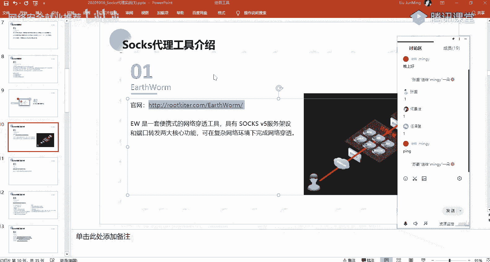

是这个大家自己去看一下，然后呃这个的话下载的话是在这边的话。

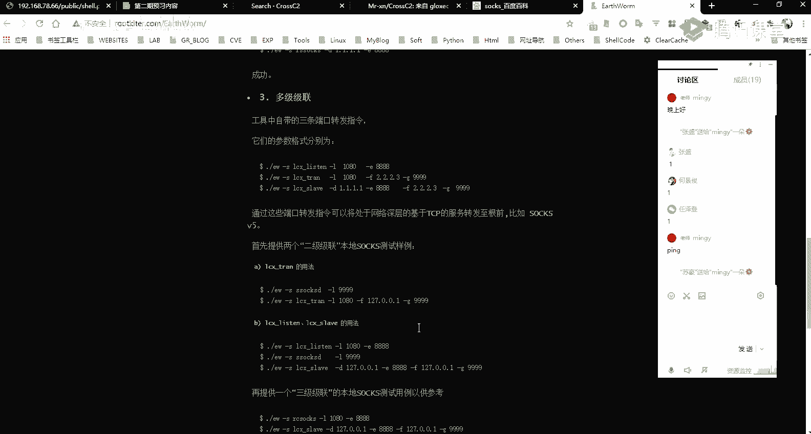

它是已经没有提供下载了呀。

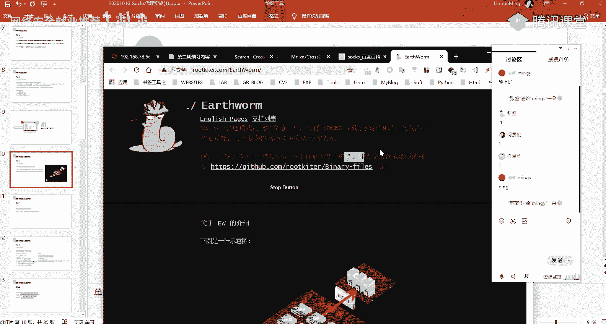

已经停止更新了，然后的话呃在那个工具包当中应该是有的，就发给大家的那个工具吧，如果没有的话，大家呃找我要吧，就在群里说一下，我发发出来，或者大家可以自己去网上去找一下啊。

呃第二个的话就是这个frp f i p的话，它是一个用于内网穿透的，一个高线的反向代理应用，然后我们下节课的话会给大家去介绍，就是说我们在在不去使用msf，或者说msf的一个使用的话不太适用的时候。

我们给大家介绍，就是说用f2 p，还有像ew等等的这样子的一些代理的一个，内网穿透的一个工具，来去进行一个内网的一个呃穿透，呃然后的话这个工具的话是呃，我个人是比较喜欢使用的。

然后的话它的一个功能配置什么的，也是比较好用的，然后的话呃第三个的话就是一个boss chance，process，chance的话呃，大家在那个cannyx里面的话，应该也去使用过吧。

然后这个工具的话也是我们经常去使用到的。

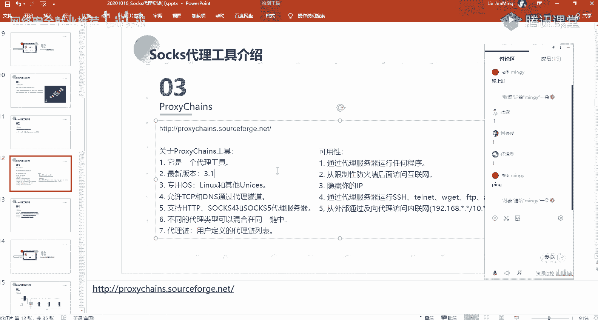

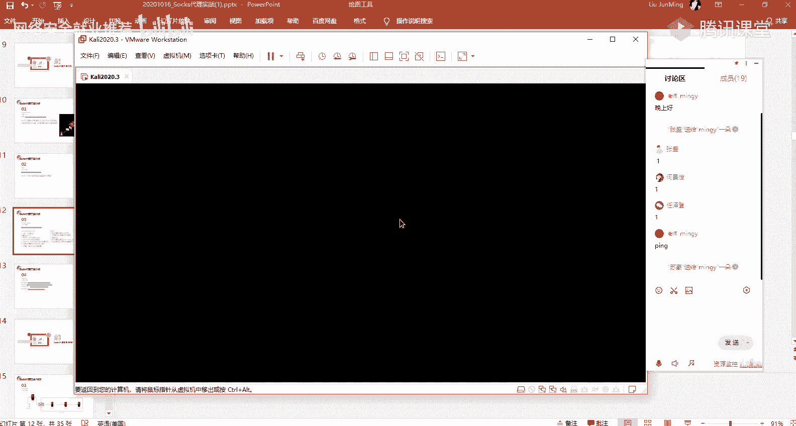

以及其实我们呃就我们在linux系统里面啊。

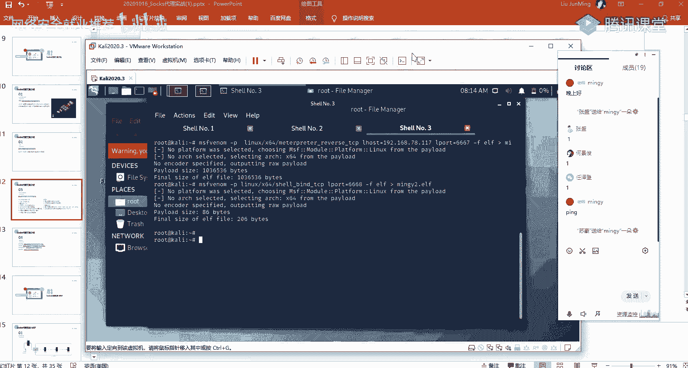

我也会通常会去使用这样子的一个prop trains，来去做这样子的一个代理。

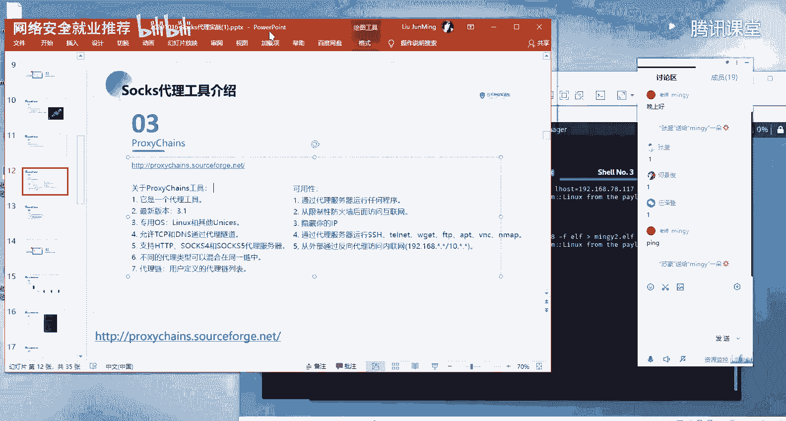

就是说比如说我这边对吧，我这边的这一个linux机器，我这边的一个看你机器我想要去就说我想要，因为我现在的话是在啊国内对吧，我想要去访问国外的一个网站，那么你想要去访问国外的一个网站的话。

你就需要做一个代理对吧，你需要有你自己的一个呃这样子的一个就是bp，然后的话你想要你要去做做这样子的一个，一个代言的话，我们就通常的话会去使用这样子的一些呃，就是这样子的一些工具对吧。

就这样子的一些工具，然后这里的这样子的，我在这边的话是使用的是一个s s r l，然后的话呃如果大家也是跟我使用使用的一杆，而使用的是同样的的话，你可以在这边去做这样子的一个配置。

就是你右键那个小飞机嘛，然后有一个选项设置也在这里，然后勾选这个允许来自局域网的一个零件，然后改一个代理的一个端口，我这地方是10800是吧，然后的话我在这边我是无法去直接的去。

比如说我去访问一个谷歌是吧，我这边先去访问的话，是无法直接去访问到的哦，哦我在这边的话就可以通过配置这样子的一，个protech，配置这样子的一个代理，然后呃我配置这边的一个单元的话，就是这样子。

首先的话是sop 5，然后的话如果说你是使用的是一个双14的话，你就是写这样的一个sox 4对吧，然后的话中间的话就是你的一个代理，服务器的一个ip，然后在这边的话就是你的一个端口，我在这边的话。

因为呃看一下，我在这边的话，因为是我在我当前的这个windows机器上面对吧，呃我的这个windows机器的话，我的一个本地ip看一下，是这个192。168。78。114，额账号密码的话。

账号密码的话是呃对，就是说在这边的话，在这边就是说在msf当中的话，是没有支持这样子的一个账号密码的一个配置。

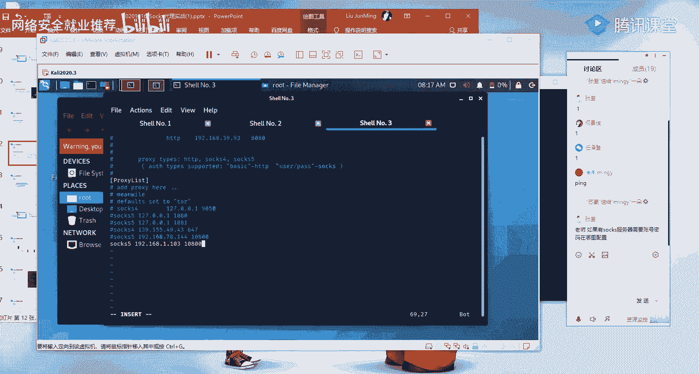

在这个分啊，prox train 10应该也是不支持的吧，我看一下，应该是不支持的，然后如果说你是要去使用这样子的一个，你需要去账号密码的一个配置的话，我在这边的话就windows上面的话。

我推荐给大家一个这样子的一个工具，就是其实我在这边有给啊，这边就这一个一个全局代理的一个工具，然而其实等会也会去用到这个，就说我去代理我自己本地的这样子的一个一些，比如说远程桌面对吧。

m s t s c以及其他的这样子的一些工具，那挺好啊，就是这一个就在预期内容这边也给了好，等会的话给大家介绍会去使用，这个就是在这边的话呃，去做一个相应的一个配置，我们可以把我们自己应用。

自己本机上面的一个应用程序，把它给就是放入到这样子的一个代理工具当中，然后的话我们在使用这样的代理工具的时候，我们的一个流量的话。

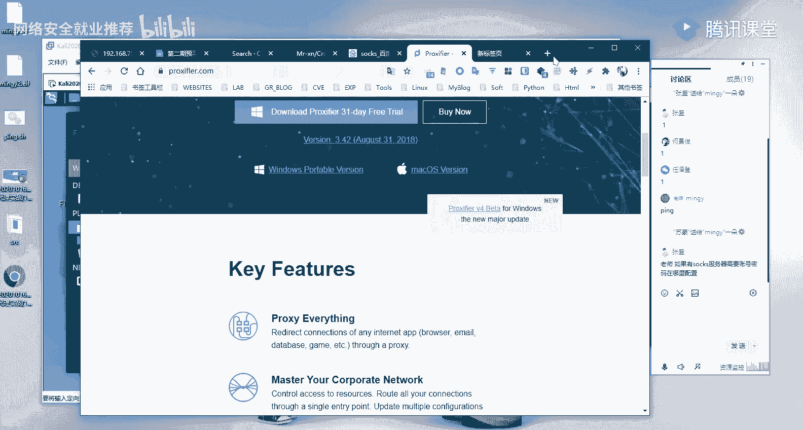

它是会走我们所配置的一个啊通道，呃我这边的话是，挺好的，然后的话我再通过这个protechance这一个工具，我们去请求一下这样子一个谷歌点com，防不防，780144，不好意思，我说怎么不行。

这里我这里ip说错了呀，可以各位同学看的相当认真啊，比我都看得认真啊，现在的话没有问题啊，就是我们可以看到在这边的话已经连接了对吧，就是在这边看到这些，ok的话就说明已经连接成功了啊。

好像在上面这边太慢，开帽子的话就是你需要去检查一下，就是你要去检查一下你的一个带有的一个配置，就是，你说的是这个吗，哪呀，啊这两那应该就是可以的，就在后面直接加账号密码应该可以啊，好那可以啊。

就直接在你的一个端口号后面，加你的一个账号密码，当然的话呃我没有我没有试过，我没有这样试过，一般的话呃，我不会去设置一个这样子的一个密码，然后是到哪来的，这边应该有访问到了，哦哦现在的话是没问题的对吧。

就你直接去cl的话，他会有这样的301的一个跳转，就是他你直接去访问他这个域名，它会去跳转，然后它是跳转到了这一个，这边的话就说明我们是已经访问到了，然后的话是走的我这边的这样子的一个呃概念。

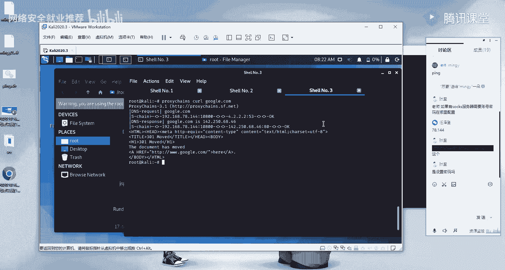

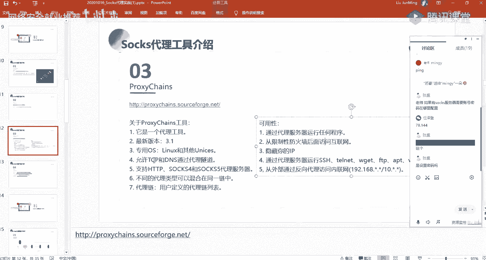

这边的话就是这个prox chains的一个，工具的使用，然后我们之后的话会使用这样子的一个工具，就是说用用protection，因为我们的一个卡里里面对吧，有很多的这样的一些工具。

比如说你想要去把我们的一个imac，把我们那个map的一个工具，把它带领到我们的一个目标的一个内网当中去，进行一个端口的一个扫描对吧，然后的话我们就需要用这个工具好。

那我们的mp的这样的一个请求的一个流量。

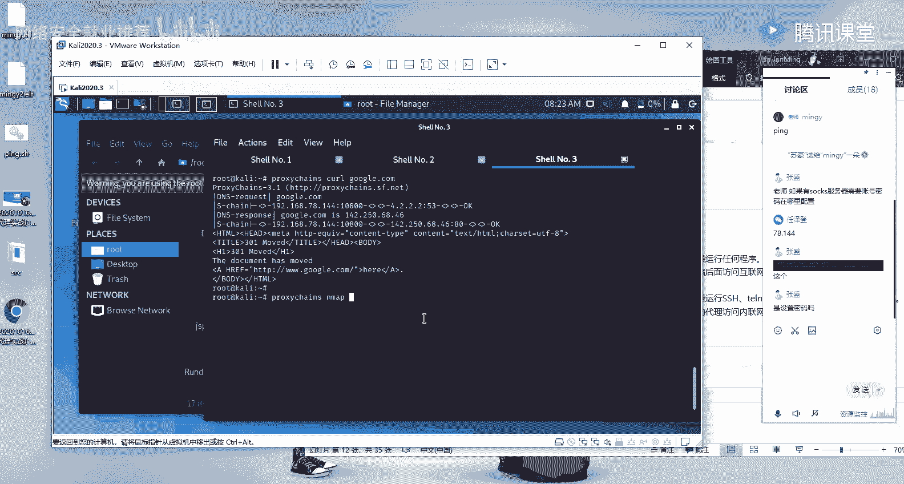

走我们的一个代理通道，然而还有的话就是其他的这样子的一些工具，像呃i e g o g这个的话再讲，后面讲那个htp代理的时候会跟大家去讲，以及还有这样子的两个，就是说呃。

跟前面类似的一个收视代理的一个工具，这个的话是windows上面的一个socks，的一个全局代理工具，大家可以去尝试使用一下，这个也是，而以上两张的一个量的话，大家应该没有什么问题吧。

啊这里的话你可以去试一下呃，看他的这样子的一个描述的话，应该是就是我刚刚说的，就是直接在那个端口后面加我们的一个，接我们的一个账号密码，然后他这边是支持hdp的一个代理，还有说是说不是五的一个代理的。

而前面的一二章内容大家有没有什么问题，应该没有什么疑问吧，因为前面的话就是一些理论的一个介绍啊，好没有问题发，那么我们继续第三章的一个内容，在这边的话就是这个第三方的话，就是我们今天主要的一个内容。

我们主要的一个时间也是给大家就是讲解，这边也就是呃soft 3元的一个实战，就是利用我们的一个msf，然后首先的话来了解一下，这样子的一个渗透场景，这边的一个这个渗透场景的话。

我这边是使用的就是在预期内内容当中，有给大家提供的这样子的一个靶场，这个cfs的一个商城靶场呃，这个靶场的话，这边的这个作者他单就这个t y six呃，这个团队吧，他们搭的这样的一个靶场。

然后呃我觉得他这个靶场的话，就是用来讲这个就是内网穿透的时候的话，是比较好用的，然后的话也便于大家去进行一个理解，以及就是主，其实主要的话就是他已经搭建好了对吧，我只要去用就可以了，就不用不需要我再去。

就是再去搭建这样子的一个环境，也便于大家自己去进行一个呃那个去搭建嘛，对吧，就不需要自己再去手工的去搭建，所以的话你直接去用它的这样子，那个靶场就可以了，我们主要是用它来去。

就是啊理解我们这边的一个内网穿透呃，呃关于这个靶场的一个详细的一个信息，大家可以去看他的就是这个作者他的这个文档，然后其实他在这边的话就有介绍了，他这个环境搭建嘛，以及怎么去进行一个攻击对吧。

那这边的话关于具体的一个攻击的话。

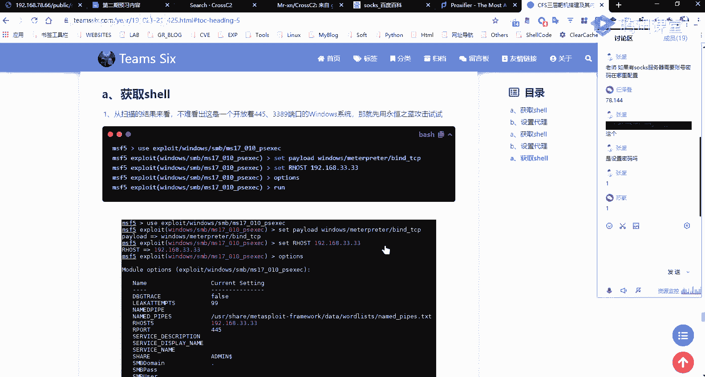

呃我我是这样计划的，就是具体的这样子的一个步骤的话，我在这节课上面会有讲，大概的就是我只会去大家可以去看，大家看我的一个操作是吧，然后的话我大概的过一下，然后的话再把在我讲完之后的话。

大家把这个靶场作为自己的一个课后作业，自己自己动手去呃，走一遍好吧，然后的话有问题再问我，就是你需要你需要你自己去进行一个尝试，你可以就是照着他的这样子的一个方法，但是你一定要自己去进行一个动手好吧。

或者就是说你可以通过它这个靶场去试，去尝试自己其他的这样子的一些利用的，一个方法是吧。

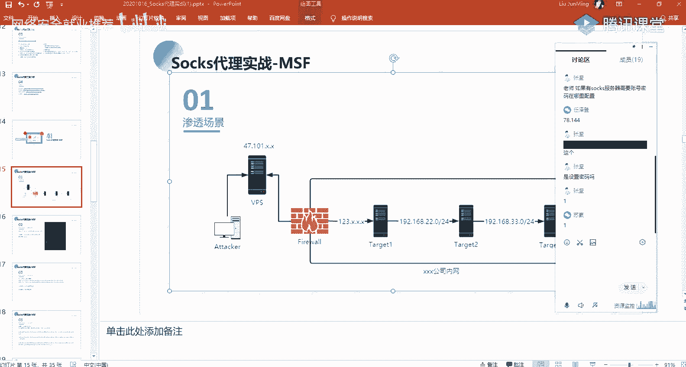

好啊，我这边的话，这个靶场的话是在我另外的这个机器上面，就是在这边的一个虚拟机嗯，就是这三个机器，首先的话呃这三个机器的话就是，这个机器，这个机的话就是作为我们的一个外网的。

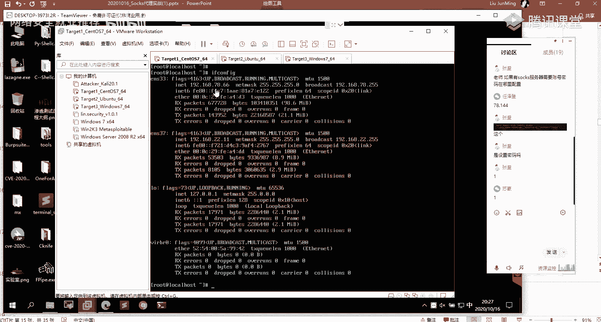

一个机器啊，就是呃这个78。66在这边的话，因为在之后的运动当中，会通常经常会去用到这样子的，这样子的一个i p，然后的话呃我们再来回过头来去看一下，这样子的一个场景，呃当然话这个场景这边的话看一下。

呃首先的话我们先来看一下，这边这边的这一部分，这边的这一部分的话呃，就是表示我这边的一个attack，就是我的一个攻击机器对吧，然后的话我这边的一个攻击机器的话，呃这边有一个v p s。

这个v p s的话就是我自己的一个v p s啊，然后的话我们已知一个官网的一个目标，就是我这边的一个，点78。66，当的话，我这边的话是一个内网的一个ip啊，因为我这边是在内网玩是吧。

就是你把它当成是一个公网的一个ip，就是公网ip，它有它的一个就是特性的话，大家应该就是大家再去理解这样这样子的一个，公网ip，内网ip的时候，你就呃以及再去拍这样子的一个靶场的时候吧。

就我们的一个公网ip，只要就是说我们是在不管是在内网还是在公网，我们都能够去访问到这个ip，是你要这样子去理解，然后在这边呢，我们把这个ip作为一个公网的一个ip，也就是我这边的一个攻击机器。

以及我这边的一个v p s都是能够去访问到的，呃当然的话在这边其实而，就实际的话在我这边的话是没有用到这个vp，就是如果说你要去进行一个呃，攻击外网的这样子的一个i p的话。

你是需要一个v p s做一个中转，因为你的一个攻击机，攻击机器是在你的一个内网是吧，然后的话如果说你想要去反弹shell的话，你除非是做这样子的一个，就是说做你的攻击机。

与与你那个v p s做这样子的一个呃，内网的一个穿透，也就是把反弹的一个，需要通过我们的一个公网的一个v p s来，就是带领到你的一个，而内在内网的这个机器上面的呃，比如说msf的某一个端口上面去对吧。

然后的话我们才能够去实现这样的一个反弹小，这样的话这样子的话就呃，稍微显得有点就是复杂，然后其实我们就只需要就是有一个vps对吧，然后的话如果说你要用msf的话，你在vps上面去装一个官网的vps的话。

这样子的话会显得简单一些，就是你的一个操作，以及你去理解这样子的一个操作的话，会比较简单一些，当然的话如果你没有，就是说你不想在官网app上面去搭，然后的话你对这样子的一些操作熟悉的话。

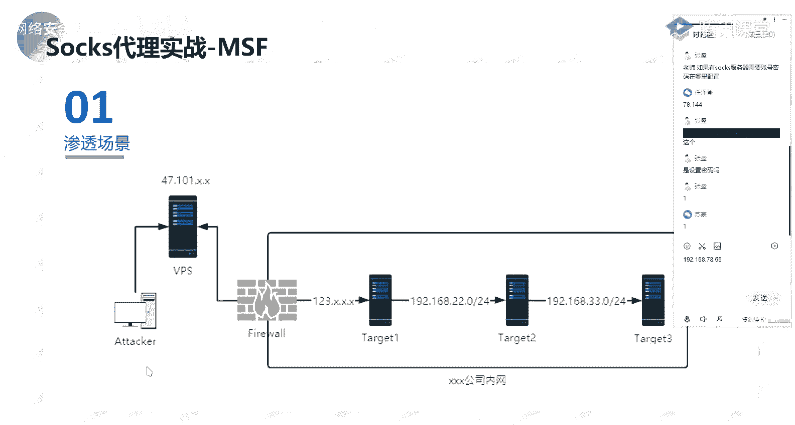

那么你可以直接在你的一个，就是说在你的一个内网，你只需要有一个公网ip就可以了，你可以在你的一个内网的一个。

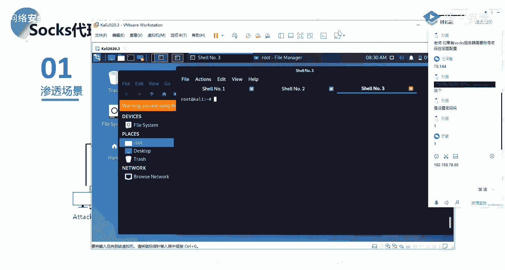

参与机器上面是吧，就你直接用你的一个内网来看，你去做，作为一个呃接受share的一个呃机器，然后的话就是在这边，这边的话就是某某公司的一个内容，然后这个内网的话有这样子的三台机器。

也就是我们的一个text 123这样子的三台机器，然后我就我们知道他就是我们那个官网，跟我们的呃，这边的话其实应该这边这个图有点问题的，就是我这边的话，其实这个防火墙应该是在，就是说在我们的一个官网。

跟我们的内网之间对吧，也就是我们在前面也有讲的，像这种dm这一区域的话，就是说我们的一个公网的一个vp，我们公网的一个服务器就是是一个公司，它的面向外网的这样子的一些服务的话，它会处在这个区。

然后在这个区域的话，是我们就说他在啊，是我们在外网能够直接访问到的，以及在内网的话也能够去访问到这样的一个机，器，好哦，这边的一个tag一的话，就是我们这边的这个ip所对应的一个机器。

也是对应的这样子的，有一个外网的一个ip，然后tag e tag 2之间的话，是一个22的一个网段，以及啊三三的一个网站，也就是在这边的话有这样子的，122层的一个网段，是两层的一个内网网段。

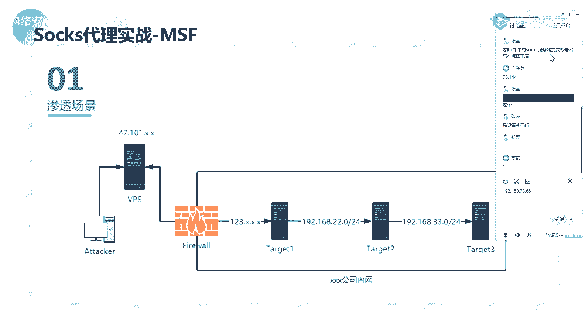

然而在这边的话就是这样子的一个场景啊。

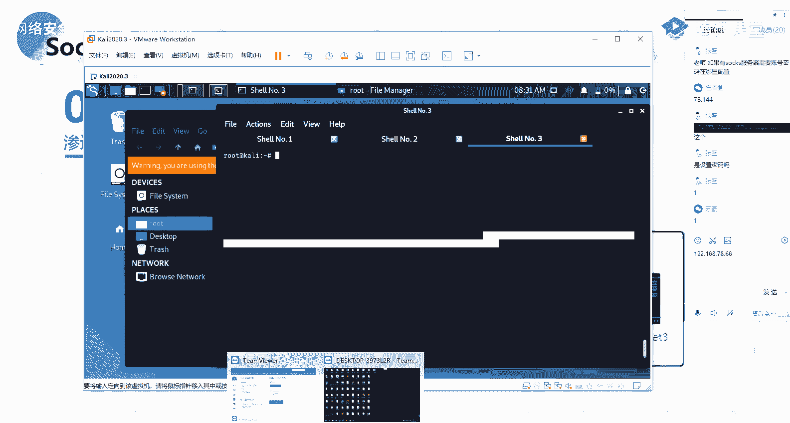

就是对应的一个机器的话是这边就tag里的话，这边的话就是呃，你把它当成是一个外网的一个web服务是吧，或者说外网的一个呃服服务器，然后这边的这两个机械化，就是它是处于一个内网，然后我们要做的话。

就是通过寻找这一个外网的这个web啊，这个服务器的一个漏洞是吧，通过拿下这一个外网的这个机器，然后的话拿下这个机器之后的话，我们以这个机器作为一个跳板，就作为一个中转做一个跳板机，好的话。

通过这个跳板机来去穿透来去攻击啊。

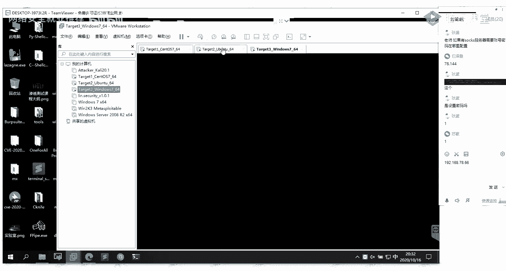

这一个内网的一些机器，好呃这边的话就是场景的一个介绍，下面的话我们具体来看一下呃，我这边的话，ppt里面的话其实已经写的比较详细了呀，其实其实已经很详细的给大家介绍，然而在这边的话。

就大家跟着我的一个思路走好吧，然后首先的话我们就说我这边已知的，这样子的一个ip对吧，我这边已知这样子的一个ip，然后我把这个ip给你，你要去对这个ip做一个渗透，做一个攻击的话。

你首先第一步你会去干什么，就说你首先想到的想到的第一步，你们去对这个ip干嘛，有同学回答一下吗，就是呃我记得之前的话在讲，那个是讲那个那晚机器收集的时候，有同有同学问我，就是呃就是在去那网线去。

我啊是我忘了是什么来着，就是，你得到了内网的一个得到了一个shell对吧，然后的话你知道他那个ip，那么你对这个ip你会去干嘛，然后其实在去做内网的一个信息收集的时候，跟外网的一个信息收集。

它的一个思路其实大同小异啊对吧，就是说你在内网的一个ip跟你在外网的一个ip，你对这个ip你需要去收集的信息是什么呢，就是说首先第一个就是端口就put嘛对吧，也就是拓展吧，为我们的一个端口的话。

大家能理解端口的这样子的一个概念吗，啊我们有每一个计算机的话，有65560 535，有这么多的一个端口对吧，好的话，这些端口的话就是说每一个端口，它你可以把它理解成就是一个门，就是理解成是一个门。

就是进计算机的一个门，然后的话每一个端口的话，就是一个金融计算机的一个门，那么我们要如何去知道，就说我们要去知道怎么去进入这一个计算机啊，去访问这个计算机的话，我们需要去通过这样子的一些门对吧。

也就是我们需要去知道知道它有哪一些门，也就是对应的我们需要去知道它有哪些端口，然后对应的每一个端口的话，每一个门后面的话它都有相应的一个呃服务，然后每一个端口呃，当然的话就是说如果你对应的一个端口。

它开放了，那么它开放的这个端口后面的话，它对应的会有一个服务的一个开放是吧，好的话，我们通过这样子的一个端口，就能够去访问到对应的一个服务，像比如说我们常见的一个8年的一个端口对吧，8年的端口的话。

它默认的话是一个web的一个服务，也就是我们通过访问web端口啊，不访问8年的这个端口的话，我们就能够去访问到这个web服务，然后呃大家可能会就是大家应该都知道吧，就我们的一个浏览器的话。

它就是呃默认的话你去访问，比如说你去访问一个ip，你没有加这样子的一个八零端口，它同就是说它默认的话，它是把它就是嗯，我这边的话以这个ip为例，就比如说我这边去访问这个呃，因为这个ip对吧。

然后这个ip的话我们直接去访问这个ip，我们后面没有接端口号的话，它默认的话就是我们的一个8年，8年的一个端口，这边的话大家应该都知道，然后这边呢这个端口的话，其实它对应的就是一个web服务嘛对吧。

就默认的一个外表服务，当然的话还有像像其他的，像比如说我们的tom cat的话，就是默认的是8080嘛对吧，而我们如果说这个机器，它对应的开放了一个tom cat，然后它的一个端口是8080。

那么我们去访问这个tom cat一个服务的话，我们就需要通过ip加这样的一个端口，来进行一个访问，嗯对吧，所以的话我们知道这个ip，那么我们需要去知道他这个服务器上面，它所对应的开放了哪些服务。

那么我们首先就去，就需要知道它开放了哪些端口是吧，然后的话我们再通过这些开放的一个端口，来去找到它对应的一个服务，而我们要去进行应用的一个点，其实就是根据它的开放的这些服务。

像比如说我们的一个web服务是吧，我们的一个web服务的话，也就是我们的一个web web服务的一个，漏洞的一个挖掘，然后还有的话就是像其他的像啊，比如说你的一个linux机器2224h对吧。

21ftp，还有3306等等的这样子的一些端口啊，在这边的话，关于这些端口，它所对应的一个默认服务。

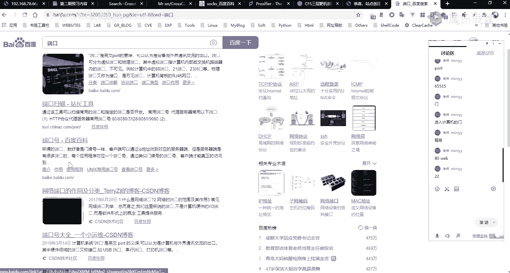

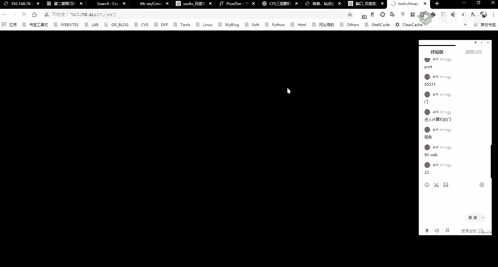

有一个我忘了是哪一个来着，一个端口，诶是有一个是战龙之家还是哪个网站来着，拼图，来看一下我这边吧，这边的话呃有这样子的一个表啊，这个表的话就是我们常见的这样子的一个端口，以及它所对应的一个服务。

然后像比如说我们53就残留用53端口，它所对应的一个呃服务的话就是我们的一个dns，比如说我们就一般的话，我们对啊，我们的一个机器，我们想要去访问访问域名的话，我们都需要有一个dns对吧。

也就是说都需要去访问我们的一个dns的，一个服务器，然后的话还有的话就是八零htb等等，还有其他的这样子的一些端口，在这的话我们可以去可以通过这样子的一个表，去做进一个进行一个检索对吧。

然后的话我们就这边的话就是我们针对常见的，我们这边的常见的这种端口号是，以及它对应的一个服务，我们可以去就是说有相有针对性的这样子的，一个攻击的一个入侵的一个方式，在这边的话有这样子的一个表啊。

像比如说我们那个22对吧，sc取得一个远程连接，我们可以对它进行一个爆破是吧，以及还有open sc取得一个漏洞呃，然后的话还有就是像我们的呃，就是说呃3306对吧，330的话就是数据库嘛，就包括注入。

还有3389等等的这样子的一些，像7001默认的啊，它是web logic，那么我们这个端口的话，我们就能够去访问这个端口，就能访问到对应那个weblogic的一个服务对吧。

然后的话去针对这一个web logic的一个服务区，进行一个攻击是吧，还有其他的这样子的一些和默认的一个端口号，以及它对应的一个入侵的一个方法，呃这是第一个对吧，我们对它做一个端口的一个扫描啊。

那么我们扫描端口的话，我们通常会去使用什么样的一个工具呢，啊就是我们通常是呃做这样的一个端口，扫描的话，一般会去使用相应map对吧，还有master skin对吧，以及还有其他的很多的这样的一些。

端口扫描的一个工具，当然的话呃最有名的就是这两个吧，应该应该是就是n map的话，就是它的一个这个这个工具的话，应该不用我多说，前面应该也假对吧，而max skin的话也是一个专门扫描的一个工具。

它的一个优点的话就是扫的特别快，然后map的话就是少的特别详细，就通常的话我们会去结合这两个工具，就是首先的话用max gain对吧，就是通过快速的对目标的一个端口去做一个呃。

存活的或者说开放的一个扫描对吧，然后的话再根据它开放的这样子的一些端口，用map来去做一个更详细的一个扫描，然后在这边的话，我们针对我们这边给定的这个ip对吧，我们我这边的话使用imap。

直接去对它做一个信息的一个收集，然后做一个信息收集的话，我这边使用的就是哦这样子的一个方法是吧，然后mf当中的话有自带这样子的一个script，也就是它的一个脚本呃，有一个这样子一个万能的一个脚本。

这个脚本里面的话，它有自带的这样子的一些常见的，就说一些漏洞的一个检测的一个呃，呃常见漏洞的一个检测对吧，然后我们可以去使用这样子的一个，去使用这样子的一个脚本，来去做一些基本漏洞的这样子的一个探测。

它的话探测出来的话，就是说这些漏洞可以看到在这边还有探出来，探测出来看到这种variable对吧，其实呃像这种的话，它的一个缺点的话就是比较老了，而且它那个准确性的话没有什么保证啊。

不然的话我我们可以使用这样的方式，就是能够去比较详细的去啊，列出来它的一个端口号，以及它所对应的这样子的一些服务对吧，最主要的话就用这个就是做一个突破的啊，初步的一个探测了。

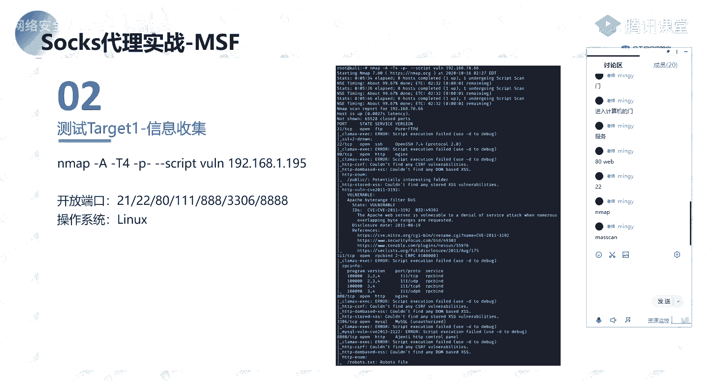

好我在这边的话，好在对话，因为我之前的话已经扫过了，而且扫这个的话可能会需要一点时间，因为我这边的话是少了一个全端口，就少的是一个全端口啊，我这边这个n mf的这样子的一个语句，还要我跟大家介绍一下吗。

就大概的说一下吧，9m不干a的话，就是就是比较一个综合的一个扫描，就干a的降大写的a啊，就它会显示就是呃对应开放的一个端口，以及它所呃开放的这样子的一些服务的一个，比较详细的一个信息啊。

以及你的一个系统的一个版本啊什么的是吧，就你的他要去探测你的一个os，然后的话呃干t4 的话，就是干t的话就是呃时间训练，就我们这边的一个t选项的话，有1~5是1~5吧，我没记错了。

1~5的这样子的一个梯度，然后就是你的一个数字越大的话，你的一个就是包括的一个，就是你去进行一个探测的数字的话就越快，当然的话你的一个速度越快的话，那么对应的一个准确准确准确性的话。

那么就肯定会相应的降低是吧，然后干p干的话就是少表示扫描全端口，扫描群端口是什么意思呢，也就是扫描1~6535的一个端口，就呃其实我看大家的话有在群里发发那个对吧，就是你去扫描端口的时候。

你扫描端口的话，你没有去加这个杠，p杠的话，那么你那么map它默认的话他是少，就是呃前1000个就是常见的一个端口，就少前1000个常见的一个端口，是1000个吧，1000个还是1万，1万 1万个人。

反正就是说你默认的话，他不会说去把所有的一个端口都做，都做这样子的一个汉子，他会取钱，前1000应该就是常见的这样子的一个端口号，去进行一个探测，是前一天还是前1万，应该是1万吧。

呃这个的话嗯好不用纠结啊，然后gank script script的话就是指定我们的一个脚本吗，我这边的话就是使用的这个官网的一个脚本，然后接我们的一个i p，然后在这边的话我们就扫。

就通过在这边呃能够得到它，得到这个ip，它所对应的一个开放的一个端口，以及它的一个服务对吧，等于说21f t p22 的话，s h以及它对应的这样子的一个，服务的一个版本对吧，还有808年的一个端口。

以及在这边八零端口的话，我们可以看到他在这边有有进行这样子的。

一个枚举啊，有枚举出了这样子的一个目录，就我们在这边的话，让我们在这边直接去访问，这个ip的一个八零端口，有的话就是这样子，就是这样子的一个，默认的就占点创建的一个页面是吧。

那么我们得到这样子的一个页面，没有其他多余的一个东西，大家通常的话会去首先做的，大家通常会去就是做什么，有同学回答一下吧，呃要不先休息一会儿吧，就50的时候我们再继续好吧。

然后的话呃大家思考一下这样的一个问题，就是我这边对吧，我这边知道了一个ip以及他这样子的一个页面，它是一个八零端口已经开放了，然后的话这个页面的话它没有多余的一个东西。

那么我们如何去对这样的一个八零的一个端口。

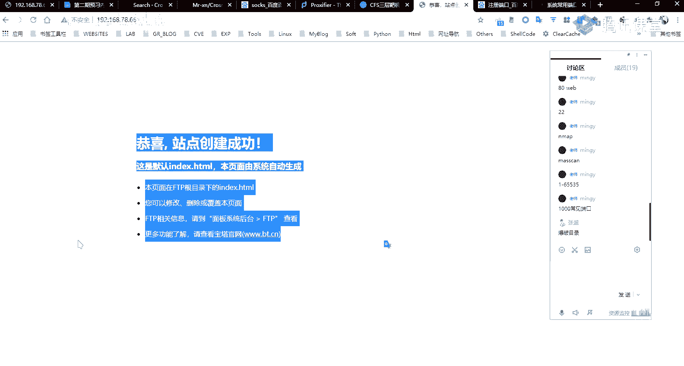

的一个web服务器做一个测试呢，好吧大家想一下。