# P66：第35天：HTTP代理隧道搭建-reGeorg的使用 - 网络安全就业推荐 - BV1Zu411s79i

声音里面有杂音的话，在讨论区扣个一，应该是都没问题啊，好没问题的话，那么我们正式开始我们今天的一个课程内容，我们今天主要给大家介绍这个http，还有电s以及sm t的代理的一个实战和ppt的话。

我已经发在群里了，然后大家可以先看一下bp以及那个呃，其实课上要讲的一些东西的话，我都在预习内容，这个文档里面都给了，像呃这边的话，是我自己的自己记的这样子的一些东西啊，就是写一些笔记吧，挺早之前写的。

然后还有其他的那几个都都有，好啊，我们本期的话主要的话就是针对这三块内容，给大家做一个讲解，这一块的话就是呃一个htp的一个代理，不是说htp的一个隧道，就是这个ig o r g的这样子的一个工具。

我们通过他的这个工具来去理解，或者说来去了解htp的这样子的一个代理，隧道的一个搭建，第二个的话就是这个dns cat 2，这个的话是呃就是tcp over电s，也就是我们的我们是通过啊。

把我们的一个tcp的一个能量，通过dns的这样子的一个协议把它给传传输出去，也就是我们呃通过dns的这样子的一个电s的，这样子的一个数据的传输来去啊，进b这样子的一个tcp的这样子的一个通道。

来去进行一个命令的一个控制，第三个的话就是这个pta，而是一个就基于我们的一个片，也就是我们的一个s m p协议的这样子的，一个带的一个工具，在这边的话主要是针对这三个工具的一个讲解，具体的一个使用。

然后的话呃，来去分别的去了解htp d s以及sm p的，这样子的一个代理隧道的一个搭建呃，呃第一个的话就是一个r e g o r g，这个r e g r g的话呃，他是这个ie duce的一个升级版。

然后大家可以去了解一下这个ie duce，这个这一个的话是比较老的，这样子的一个就是啊代理htp的啊，就是一个htp隧道的一个工具，然后的话这个的话是它的一个升级吧。

然后还有就是在后面这边的一个narrow，i e g o的话，它是对前面的这一个的一个重构，也就是对有一个就是就是增强吧，加强吧，然后这一个r e g o的话，它主要的功能是把我们的一个内网服务的端口。

的数据，通过我们那个htp，还有ht的这样子的一个隧道，然后转发到本机来去，实现基于hp通信h tp协议的一个通信，然后我们在这边的话，就是说我们的这个i e g的话。

我们可以建立这样子的一个hp的一个隧道，然后的话我们在这边可以看到，就是他会在本地去听听，我们可以去开启一个socks的一个代理，然后的话把呃来自这样子的一个hp的，这个涉及到的一个数据。

然后通过我们这边的一个代理端口，然后的话走这样子的一个代理的一个，hp的一个隧道，然后把它代理到目标机上面去，然后在这边的话，我们呃大概了解一下它的一个，一些参数的一个使用吧。

然后我这边的这边的话已经详细的列出来了，主要的话就用这像gl gl的话，就是呃指定我们默认的今天的一个地址，干p的话，就是指定我们今天的一个端口，就是我们再去使用这样子的一个脚本的时候。

它会呃就是说它会有一个代理的，一个，就是双子代理的一个今天的一个地址以及端口，我们可以通过这样子的参数来去设置，然后干u的话，就是包含隧道的一个脚本的一个url，也就是呃像这样子的一个呃url好。

我们来看一下，这个工具它长什么样，就是这样子，就这一个i g r g他就就在这些文件，然后主要的话它的一个服务端的话就是这个。

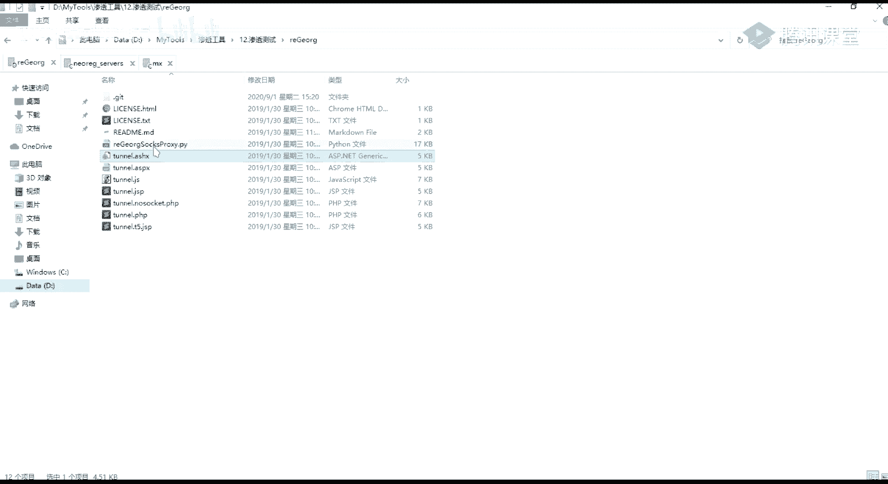

然后我们通过这样子的一个python脚本来去创建的，一个socks的一个代理通道。

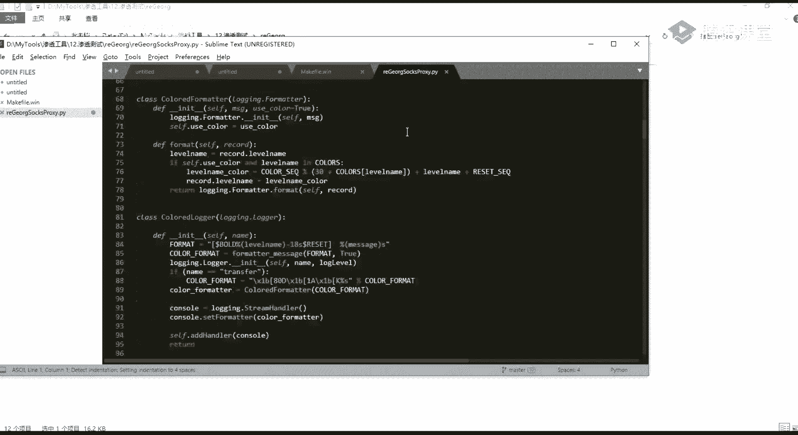

然而在这边的话它有提供这样子的一些脚本，像呃js p i p h p i，还有呃s i s p s s i s h x是吧等等，这些，它是针对在不同的这样子的一个呃。

脚本的一个解释环境下面来去进行一个使用的，然后的话呃现在这边的话，我们具体的一个使用的话，我们以这边的这个站点为例，就是啊我这边的这个就这个呃，我这边的一个i p line。

是这个其实呃就我这边使用的一个靶靶机的话，就是这边就是啊前面在讲玉的时候，给大家讲介绍的，这个就是让大家像刚才这样子的一个靶场，就就就这个这个嘛，这个的话它是呃有一个web的一个服务。

也就是这个啊这个roologic这个服，然后大家可以打开一下，打开之后的话你就能够去进行一个访问码，而且实际的话就是给这样子的一个i p嘛对吧，就是一个这一个ip给你，然后给这个ip的话。

我们就同样的就是思路的话，就是做信息收集嘛对吧，信息收集少端口对吧，少找出，好在这句话我就省略了前面的那些步骤对吧，我这的话扫出来有这样子的一个呃，这样子的一个7001的一个端口对吧。

然后我们访问这个701端口的话，发现是这样子的一个东西，这样子的一个页面对吧，然后大家看到这样子的一个页面的话，其实能够有大概的了解，就是你对于weblogic的这样子的一个应用，有相应的一个了解的话。

看到这个的话，你能够有一个基本的判断，如果你还判断不了的话对吧，你可以在后面加一个空手，然后加一个空手的话，他会去depo，也就是部署我们的这样子的一个应用程序，这一应用程序啊，就是这个控制台啊。

我们呃加这样子的一个空手的一个目录的话，它会自动的去部署，部署好之后的话，我们就能够去讨论了这样子的一个页面对吧，看到这个页面上，我们就能够知道它是一个呃，weblogic的一个server对吧。

以及在这边的话有它相应的一个版本，这个版本的话我们在后面会去用的，而这边的话我们知道了，就是说它是一个weblogic，那么我们怎么怎么去进行一个应用呢，对吧呃关于weblogic的话。

前面再讲就是就是突破口的时候就要给大家讲，就是work glogic相应的爆出来的一个漏洞，他爆出来的漏洞的话是比较多的，好啊，针对这样子的web logic的一些历史漏洞的话。

我们可以通过相应的一个脚本对吧，也就是，我们可以通过这个，apologic skin这样子的一个工具对吧，来去对它做一个扫描对吧，这个工具的一个使用的话，前面应该也介绍了是吧。

嗯看啊这里啊啊实际的一个效果的话，就是像这样子，就是就我我通过这样子的一个vlogic的，这样的一个扫描工具，来去对它做一个历史漏洞的一个扫描对吧，来去判断他当前的这个weblogic服务。

它是否有这样子的一个那个呃漏洞对吧，好这句话有扫出来，有这样子的一些这样子的嗯，两个对吧，然后我们在这里的话，使用的话是这个2019的2725，然后关于这个2725的一个应用脚本的话。

我们呃我这边的话推荐大家使用这个吧，就是这个，嗯就是这个，然后关于这个脚本的话，它是能够去直接的去就是执行命令，然后的话呃，能够去就是通过这个脚本来直接去执行命令，然后的话能够在这边返回结果。

以及能够去选秀，其实我们主要的话就是这两个功能嘛对吧，就主要去用的话，二是执行面的话就是判断我们这边对吧，判断它的这样子的一个就是他的这个服务，它是不是确定存在这样的一个漏洞对吧。

如果我们通过这样子的一个脚本，然后执行命令能返回结果，那么我们就能够去确定它是存在这样的漏洞的，那么我们确定之后的话，我们就可以去写入一个shell，写入写好之后的话，我们就能够去执行命令对吧。

好我在这边的话嗯。

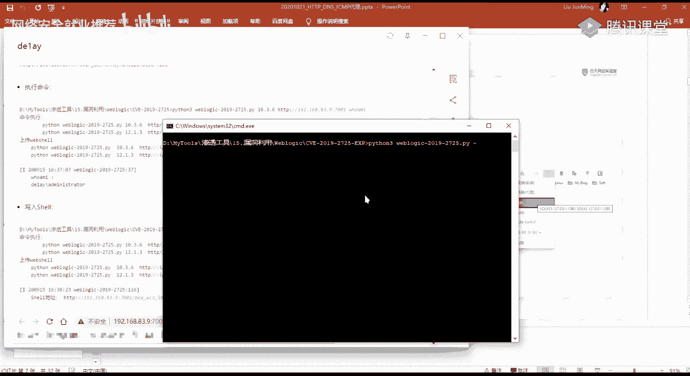

这边的话呃，这个脚本的一个使用的话大概演示一下吧，然后和它的一个使用的话，就是命令之前有上传web share，然后上传呃，首先的话我们先执行命令，然后他在这边的话，它需它是能够对这样的指的两个版本。

也就是他就存在这个漏洞的啊，weblogic的版本的话有这样子的两个，然后他都可以去支持，去进行这样子的一个操作。

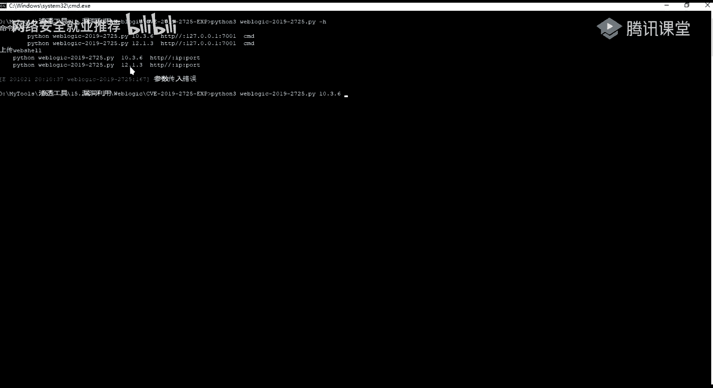

然后我们可以指定这里。

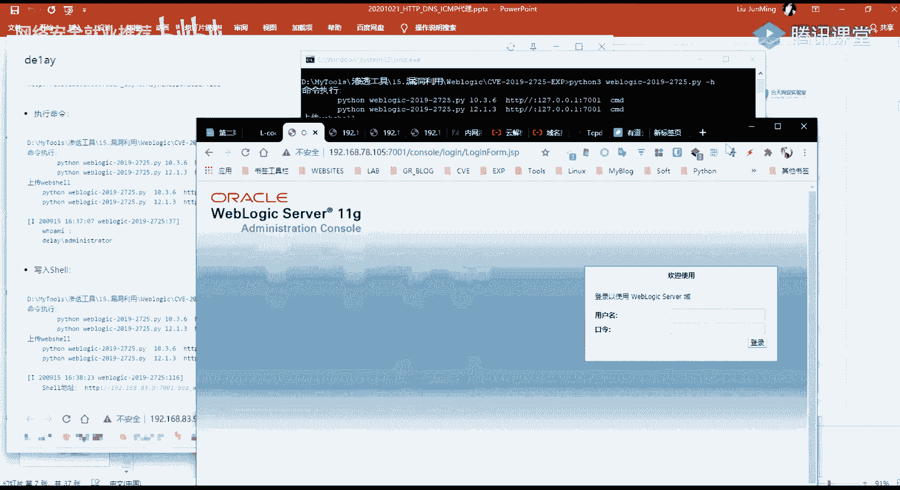

在你的那个就是ip地址，加这样子的一个端口即可，然后后面的话我们不需要加强了，然后在后面接我们的一个命令，可以看到我这边的话执行之后的话，他就返回了一个结果对吧，也就是这边的一个呃。

我们这边的一个外卖之前的一个命令的一个，结果啊，呃所以这里的话这里的一部分前面有讲吗。

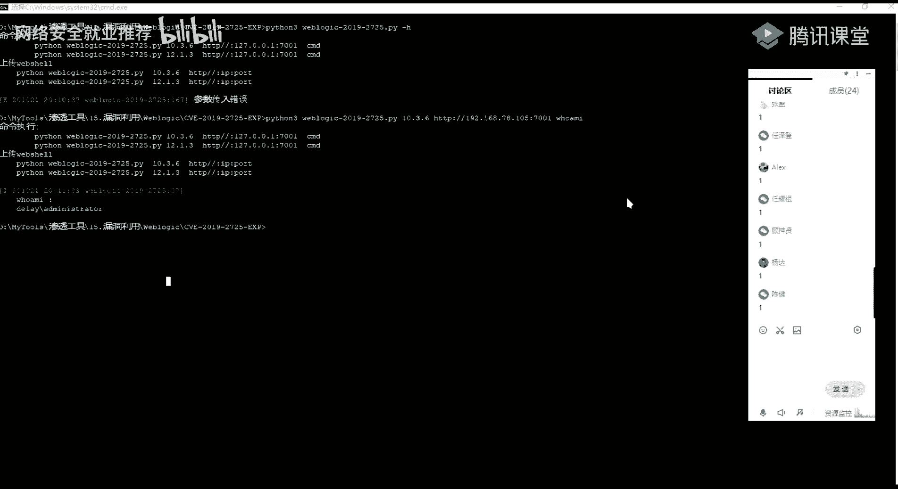

呃我看前面讲这个logic的话，应该是没有用这个脚本了是吧，呃我个人的话是觉得这个脚本是比较好用的，但还就还有挺多的这样子的一些脚本，然后我们这边的话，我们既然能够去呃，能够去执行命令。

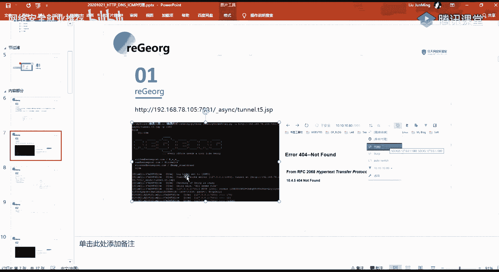

能够去利用这样子的一个漏洞的话，那么我们接下来的话就可以去做这样子的一个。

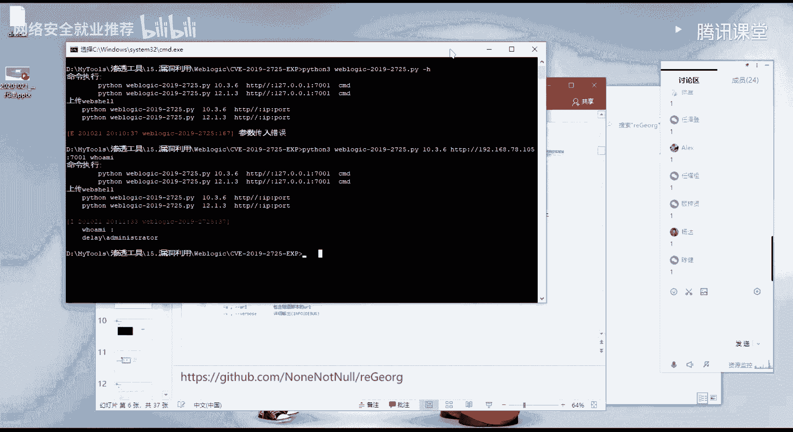

写shell对吧，然后我这边的话已经写进去了，写进去的shell的话就是像这样子的呃，那个，呃就是像这样子啊，就啊我们其实也可以通过，就直接通过它它这边去进行一个写入，然后写写shell的话。

就是你把后面的一个cmd命令去掉，就你不加的话，他就会去写一个shell，写了一个小小的一个地址，它就是像这样子的一个地址，他会去上传一个这样的一个demo，in jsp的这样子的一个文件。

他会写一个这样子的一个jsp的一个码，然后我们这些话就能够去执行命令，我这边他执行ip config是吧，关我们就能够去进行一个命令的一个执行，那么我们这边执行命令之后的话，呃，在这边的话。

我们知道它是一个windows的一个机器人是吧，而windows的一个机器的话，我们能够执行命令的话，我就想着要去反纳西尔嘛对吧。

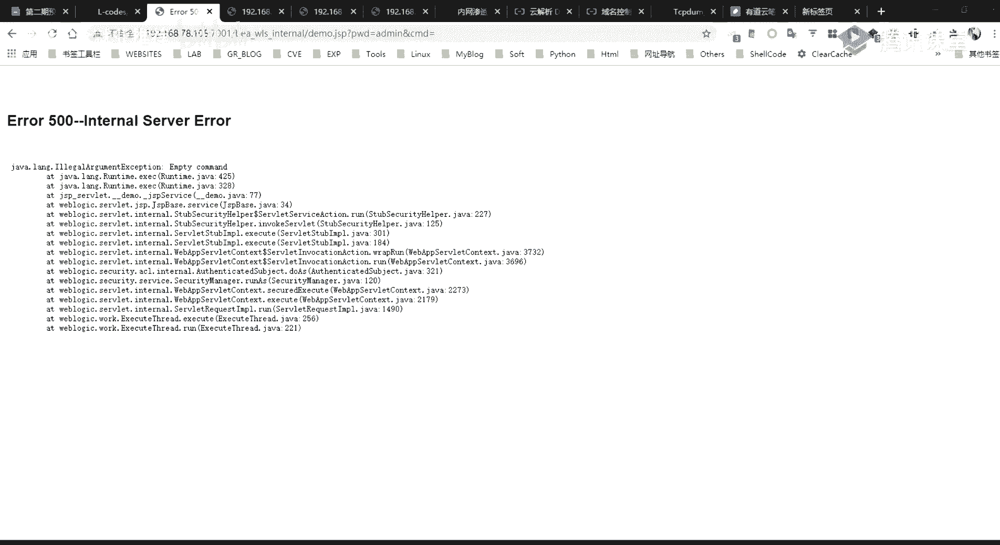

然后反弹shell的话，我这边的话呃通过反弹到4s上面去吧。

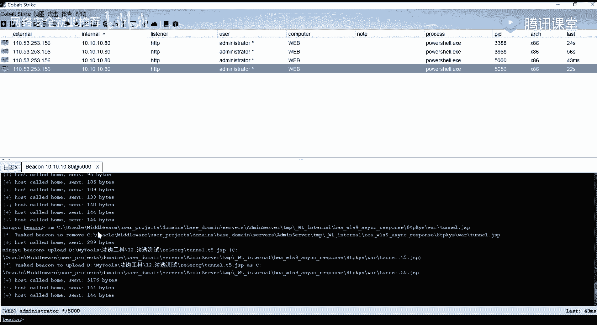

反弹到cs上面的话，我这边的话是通过这样子的一个方法，就是通过前面也会给大家讲的这个对吧，呃直接用mh啊，ta，也就是这样子，我们直接就是在cs上面去生成一个这样子的，一个文件。

就是一个那个hta的这样子的一个脚本文件，然后我们可以通过m s hta对吧，m s hta的话是windows下面，它自带的这样的一个文件，它能够去远程的去加载，我们这边的一个hta的一个脚本。

然后的话我们通过这样子的一个命令，因为他在这边的话能够去执行命令是吧，他执行命令的话，他把我们这边的一个脚本去做一个执行，也就会去进行一个啊解释，解释之前之后的话，我们这边的话就能够去得到一个像啊。

其实这边的话都是我这边得到的。

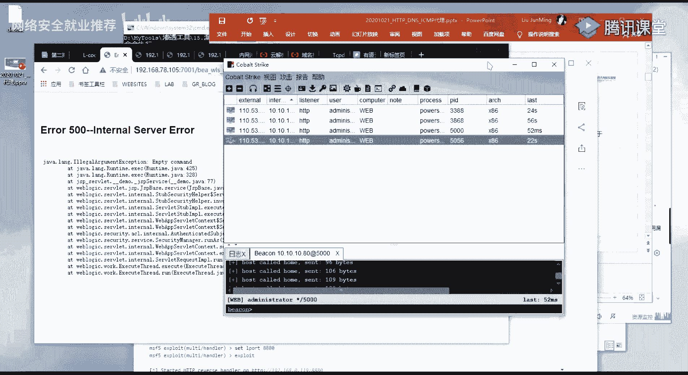

就是这一个这这这个机器的。

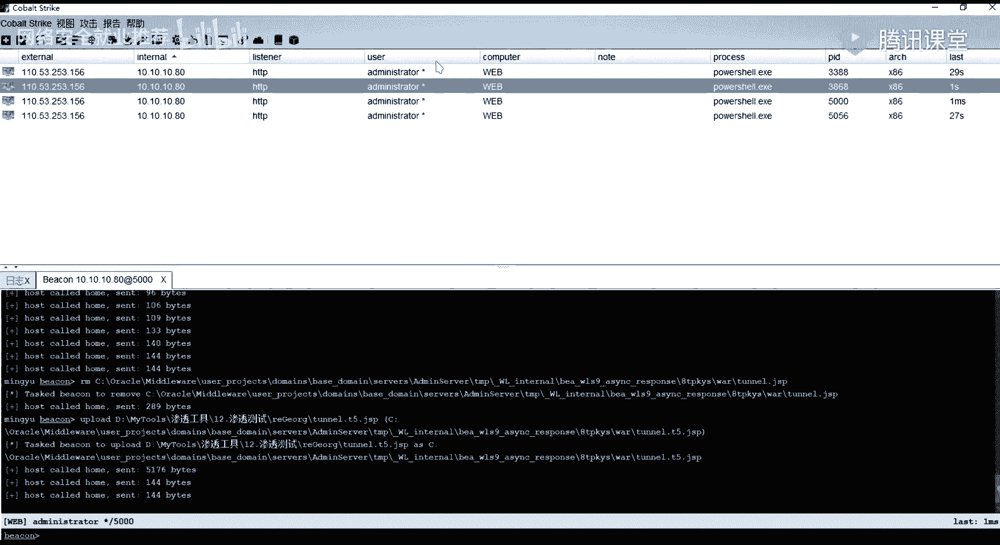

然后具体的一个效果我们可以来看一下，这脚本还是去找啊，有啊有利用漏洞的脚本呢，你get up上面去找嘛，肯定有的，然后还有就是呃其实这方面也会给大家介绍，就是就像weblogic的话。

你可以用他们形成的这种脚本嘛，然后还有的话就是呃有这样子的一个，就是带核显的e x p，我们可以用这样子的带核显的e x p，用dp啊，用v通过bp发包，发包的一个方式来去进行一个命令的执行。

像在这边的话，就是我们可以在这边对吧，我们可以把我们的一个呃通过这样子一个命令，把我们本地的这样子的一个啊jsp的一个文件，然后当然他在这边，他是呃，我这边是通过sm服务来，把我这边的这样子的一个需要。

把它给就是copy到了这边的一个目录下面，这个目录的话，就是这个weblogic的一个这个服务啊，它它会有这样子的一个目录，就是这边的这一个目录，然后我们去去那个去进行一个写写写写，写文件的时候。

你可能你就是在执行的时候，它其实是在这个bat的面目下面的，然后的话你实际要去写这个shell目录的话，是在这一个目录下面，就是它的一个呃绝对路径的话是这个注意，然后的话我们把它写到这个目录下面的话。

我们就能够去得到一个小单，我这边的话是写的一个冰，写的一个啊jsp的一个嘛是吧，然后我同样的能够去得到一个选。

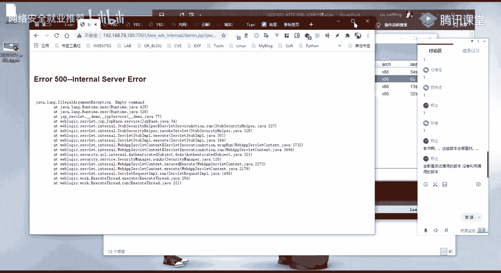

和在这里的话，我通过cs，我这边我再给大家演示一下。

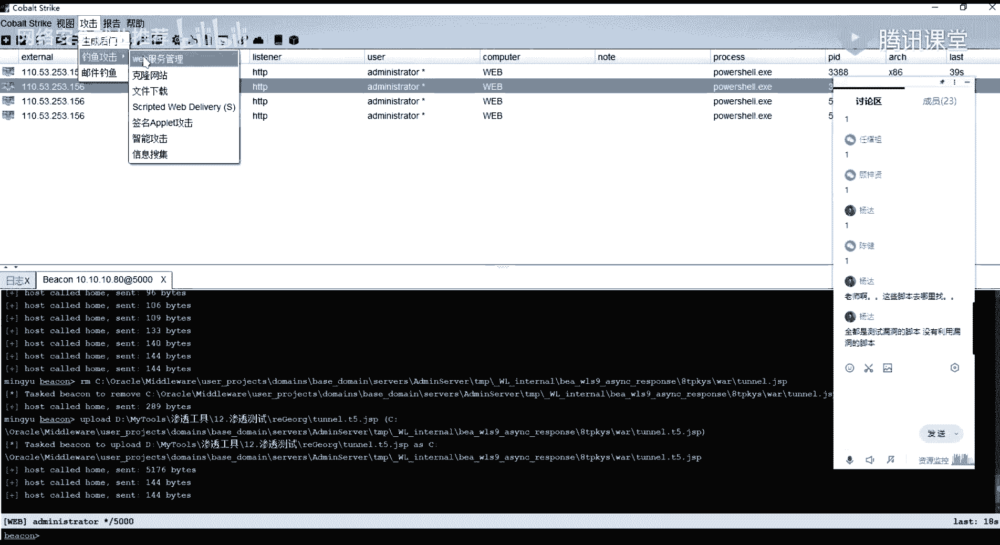

就是啊这个，然后我们可以在这边通过mp啊去执行，执行之后的话可以看到刚刚是四个对吧，然后立马又来了一个，就是这个对吧啊，这个的话应该应该就是这个吧，然后这个，对吧，我们可以啊，就直接的就得到些。

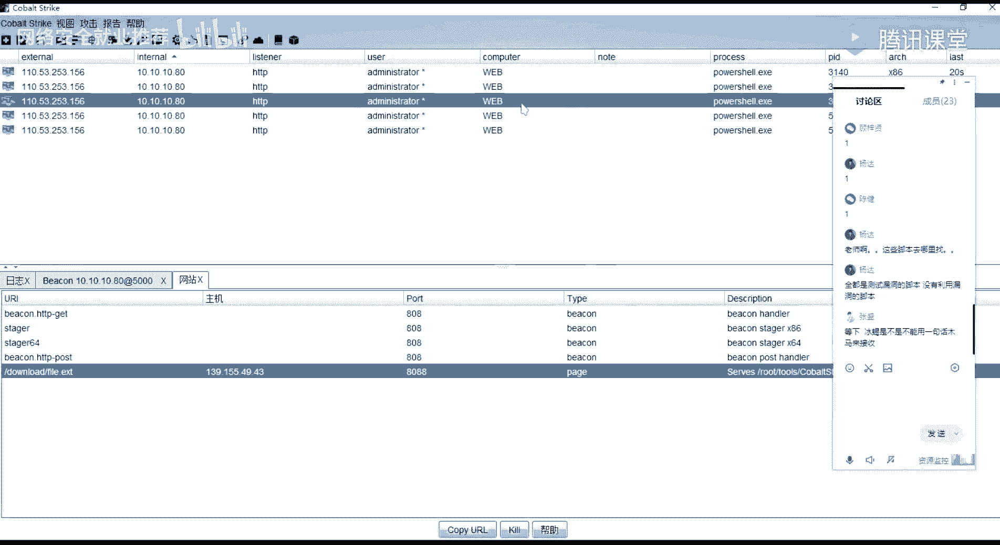

我这边的话就以我之前我已经尝试过的这个，我这边已经有相应的一个步骤对吧，我进进入这个back on之后对吧，进入back on之后的话。

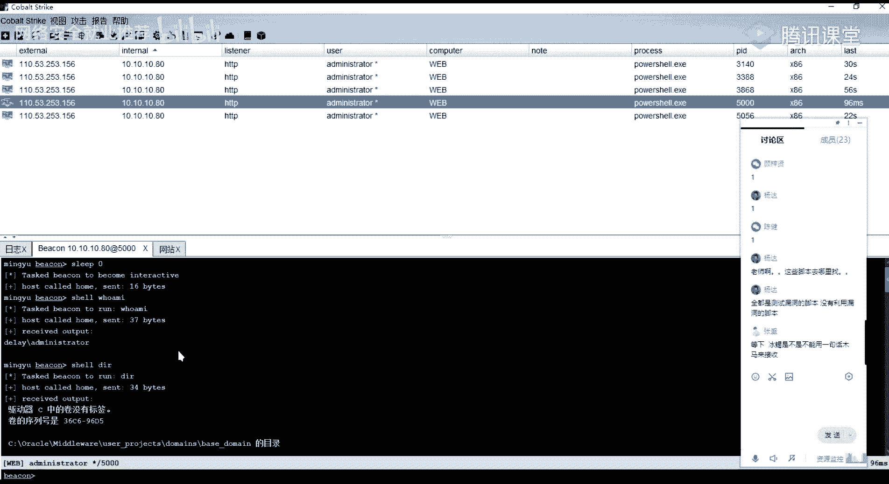

我可以去执行命令，也就是得到了这边的这个机器的一个渲染的好，我们这边得到需要之后的话，我们反常现有之后的话，我们想要去做这样子的一个代理，也就是把我们的在外外外网的这样子的一个。

流量或者一些工具的一个请求对吧，我们想要去利用这样子的啊自己的一些工具啊，去做做自己想要的一个事情的话，我们需要去做这样子的一个代理对吧，就其实就是又又回到了前面的这样子的一个经，历。

这样子的一个代理通道，然后这边的话建议大家通道的话，我们通过这边的htp的一个隧道，因为我们这边的话是得到的是一个这样子的，一个web服务器对吧，这个web服务器的话我们得到它一个share。

然后我们在这边的话，我们在这的话可以通过这个ig这个脚本，然后我们通过我这边得到这个shell，我把它上传上去是吧，可以通过文件管理把它给上传到这边的，把它给上传到这边的这一段录下面。

然后的话我们再去访问的时候的话，就是通过这样子的一个方法啊，我这边的话已经上传上去了，我这边的话去访问的话，就是通过这样子的一个方法，只需要在这样一个ip后面加这样子的gua，s y n c。

他就会去找到这样子的一个文件，然后这边的这个文件的话，其实因为它它它的一个漏洞的话，它就是这样子的，就是我们在这边的这样子的一个目录下面的话，然后我们只需要在后面加这样子的一个。

干s y n c的这样子的一个呃，这样子的一个目录，我们就能够去访问到这边，这个下面的这样子的一个呃脚本文件，因为他这边的话其实就是这个这个模块啊，这个模块它的一个漏洞。

好我这里的话就上传了这样子的一个cha。t，五点jsp的这样的一个脚本，这个脚本的话其实就是我这边的这个啊。

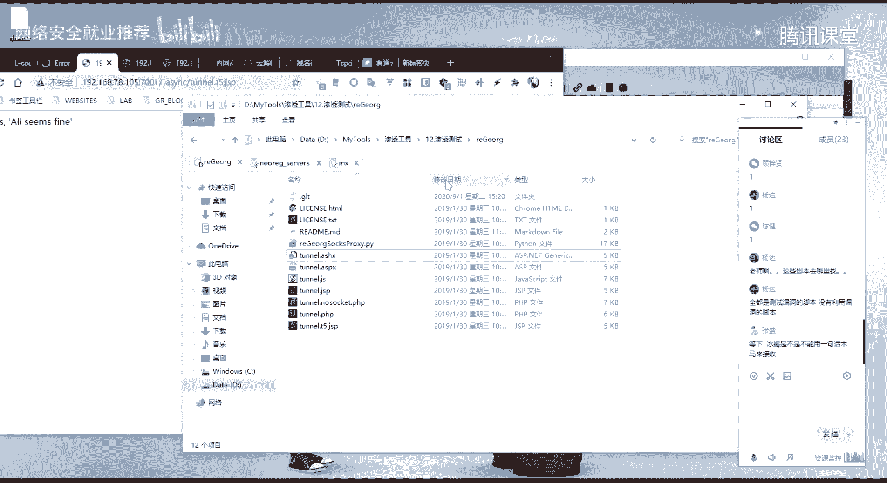

这边啊这用的这个脚本。

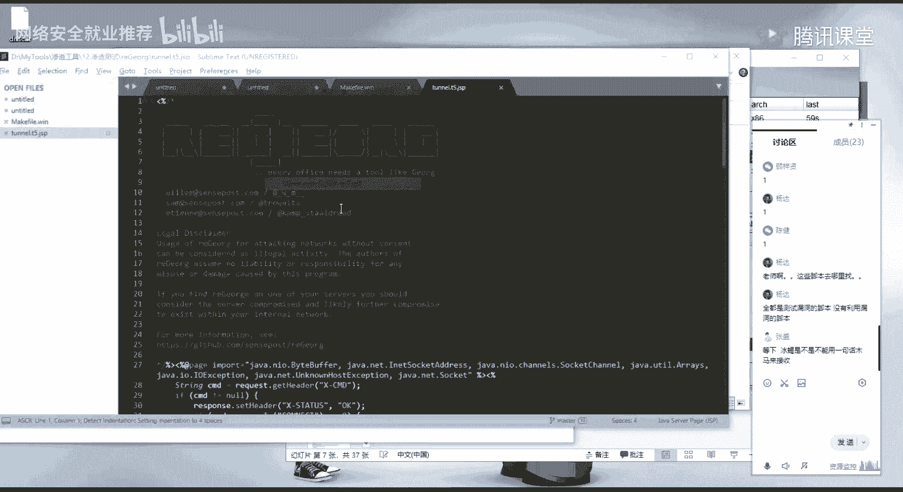

就是用的这个i g o r g的这个脚本，然后我们把它上传上去，上传上去之后的话，我在这边的话，冰鲜冰鲜的话，它是就是呃因为你编写的那个码的话，它是有做相应的一个加密的。

就是它里面的话它不是像这种一句话码这种，然后的话有他中间的话这种加密解密的话，你需要用它的那个工具，你才能够去做，才能够去接受，也就是你要去用兵线去去得到希尔的话，你就需要去用他的那个兵线里面的那个嘛。

当的话你知道他那个怎么写的话，你可以自己写一句话是不行的，他接不了一句话的，就是冰切的话，然后那个冰箱的那个马的话，也不能就是用其他的工具也接不了的，因为它它的这样子的，它的一个流量的话是有加密的。

然后它呃他是写写在了工具里面，已经写在了那个脚本里面了，它的一个实现的话，啊我这边的话就是上通过主要希尔对吧，我上传了这样的一个脚本，上传上传之后的话，我们怎么去进行一个使用呢。

使用的话就是在这我们在这边的话，主要的话是用到这个这个python的脚本，它是用这样子对一个python脚本来去进行一个呃，经济这样子的一个通道，然后我们可以通过。

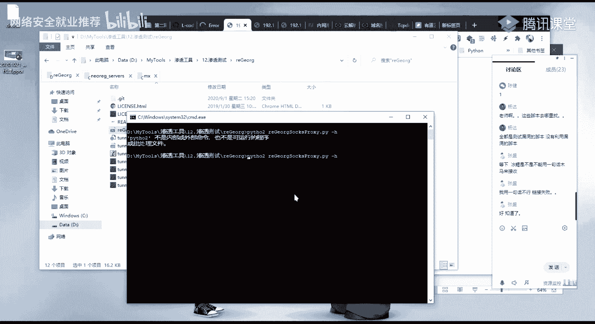

我们可以通过杠起来去查看它的具体的一个，一些参数。

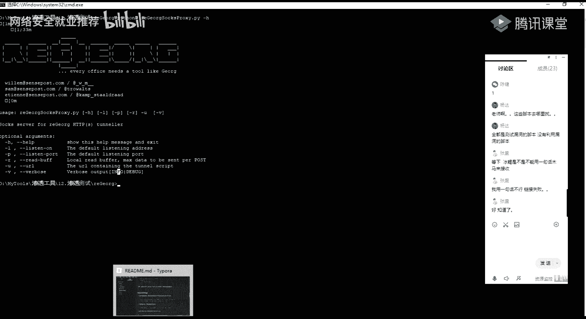

距离一个参数的话都在pp里面已经写了，我这个话我就不多说了。

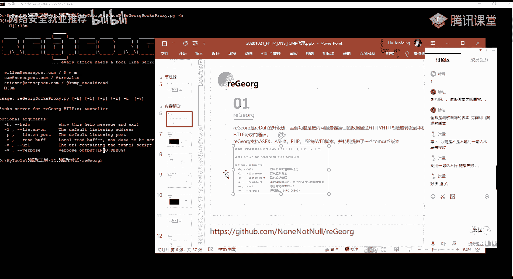

就都在ppt里面写了对吧，它的一个作用啊，我这边的话就直接直接嗯给大家看效果吧，我想当皮的话。

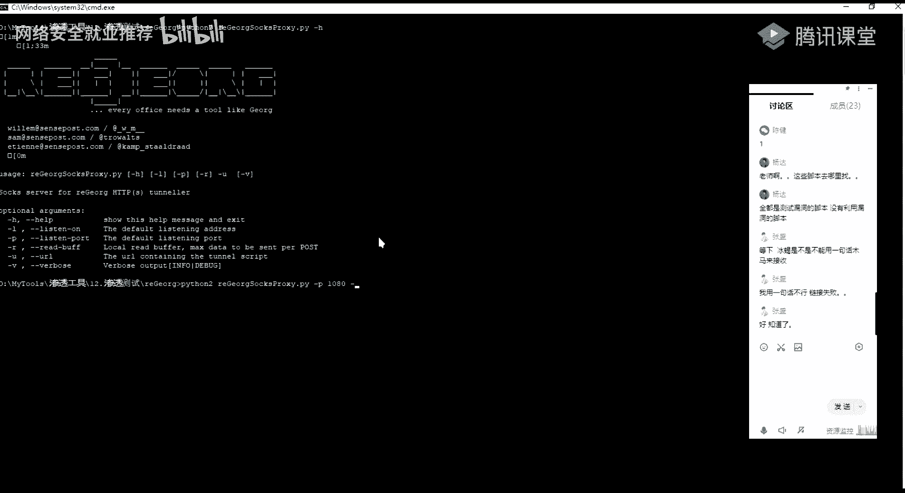

那其实呃在这边的话他的这个脚本对吧，我们能够去就是我们去判断它，能够能不能去执行解析的话，我们其实在这边能够去看到对吧，如果他能够去解析执行这个jsp脚本的话，我们在这边能够看到这样子的一个东西。

如果他解析解析执行不当的话。

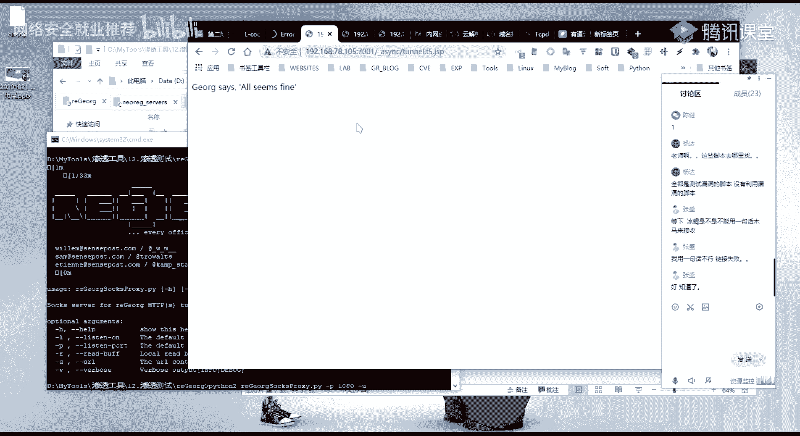

那么呃呃就是访问不到吗，会。

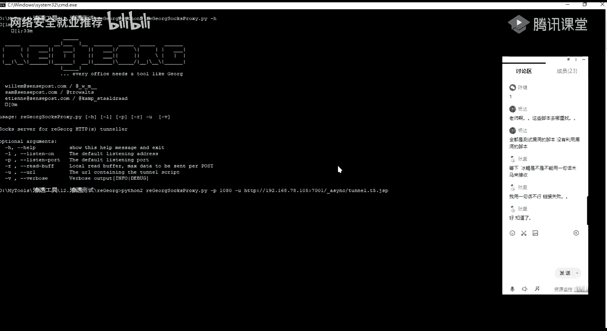

看起来就没这。

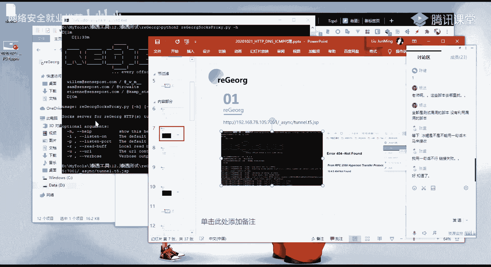

没错，然后我们这边啊执行执行之后的话，在这边的话，它就会有这样子的一个信息的一个法对吧。

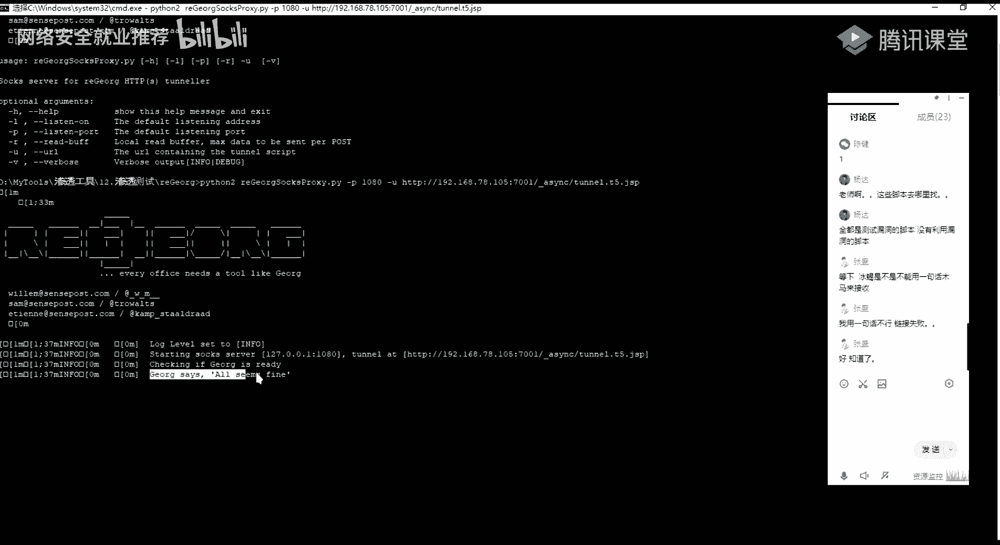

然后可以看到有这样的一个东西，那就说明我们这边的这个代理的话。

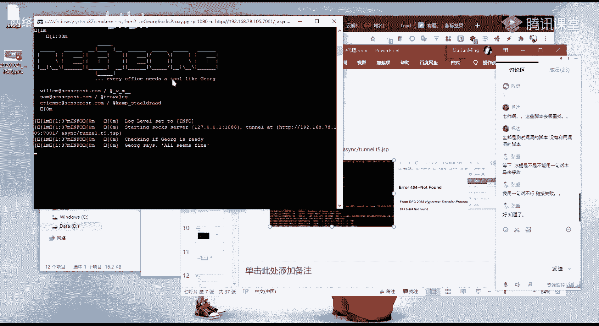

已经进去成功了，好我们这边建立了一个代言的话，我们可以看看一下我这边的一个命令，就干p加1080的话，就是我在本地，今天的这样子一个108年的一个端口，然后这个端口就是我们的一个代理的一个端口。

我们呃把我们的一个请求的话，就是呃就是通过这样子的一个端口，把它呃放到这样子的一个hp的一个隧道当中。

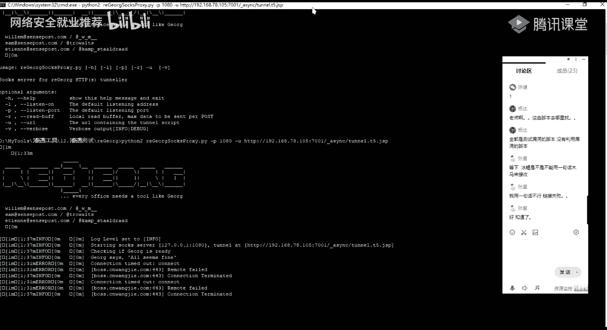

然后的话把它给转发到我们的一个目标机器，上面去呃，然后在这边的话我们可以看一下，我在另外开个浏览器，当前我在这边的话。

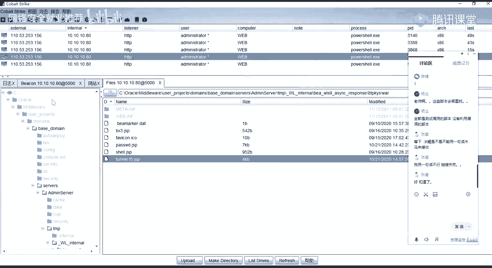

其实呃我们可以来验证一下了，我在这边的话，我可以执行一下mini，我看一下，它的一个网段对吧，这个网站的话可以看到它有这样一个内网网段，10。10。10。8的这样子的一个啊。

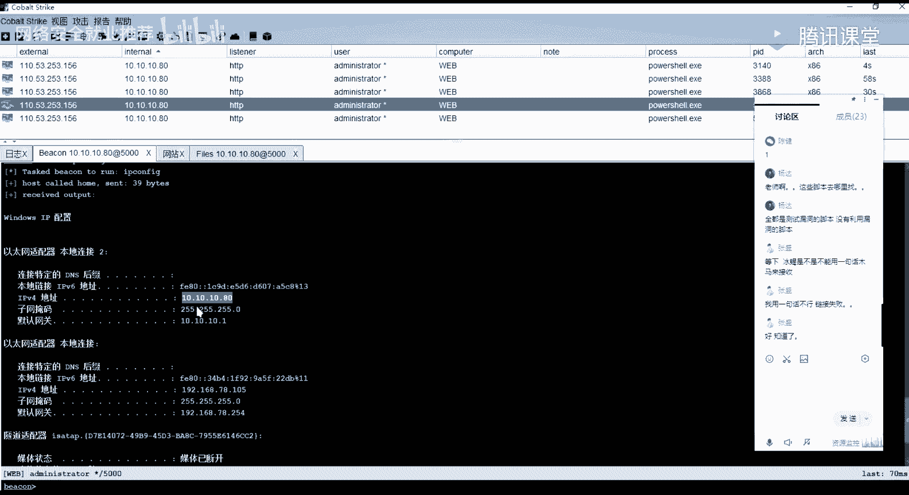

网卡是吧，然后这边的一个这个网站的话，我们是无法直接去访问到的对吧，就这个ip的话，我们是无法直接去访问到的吧，然后在这的话我们去验证一下，我这边的这个这边的这一个代理，它是否成功了。

代理的话就是啊本地的啊，ip加这个1080的一个端口对吧，没有问题，然后这边的话切出一个代理，可以看到，这边一定要开，这边执行对吧，可以看到在这的话。

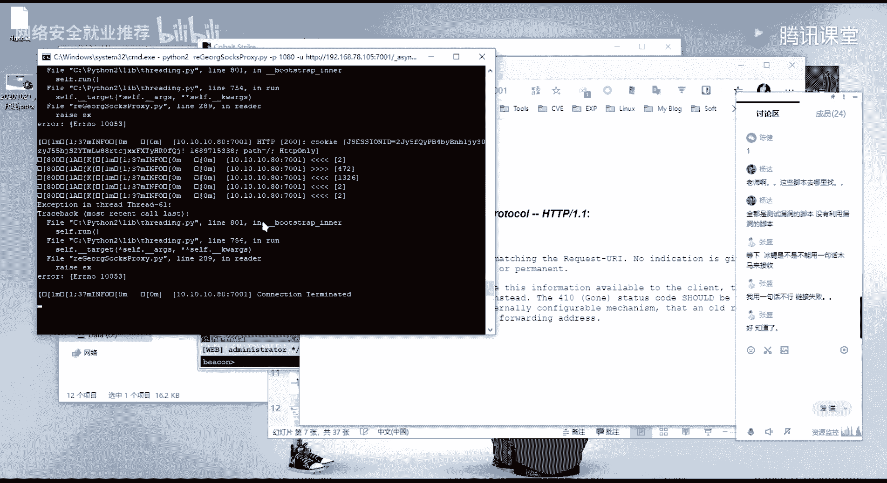

在这边他会有相应的一个流量对吧，然后有相应的一个请求，然后这边的话就能够去访问到这边啊，啊因为在这边的话就是访问了同样的，还是这个呃weblogic的一个符号，但是我们在这边使用的话。

不是使用了他的这样子的一个，外网的这个ip对吧，也就是我们在这边能够直接访问到的这个，能够去直接访问到的这个192。168。7，8。105的一个ip是吧，我这个话访问的是就是它的一个本地的这个ip。

就内内部内网的这样的一个i p，然后我通过内网，通过我这边的一个通道，通过这边的一个搜索的一个代理通道，然后的话把我这个流量代理进去了，然后的话访问的是这边的它的一个内网的ip，是原本我们访问不到的。

然后其实访问这边的一个i p吧，同样的还是访问到的是这个机器，它的一个本地的一个web logic的一个服务，因为呃其他的一个机器的话，就其他那个机的话没有，我这边没有开其他的一个服啊。

所以的话就是这一些其他的同一个网站的一个，主机的话，呃，就没有这样子的一个明显的一个效果，就是在这话主要就是给大家看一下，我这边的话是呃代理的话是经理成功了是吧，然后在这边使用的一个是用的这样子的。

一个脚本，就是通过这边的一个hdp的一个隧道，然后的话经历了这样子，这个收拾的一个代理通道，把我们的一个流量代理到了一个内容。

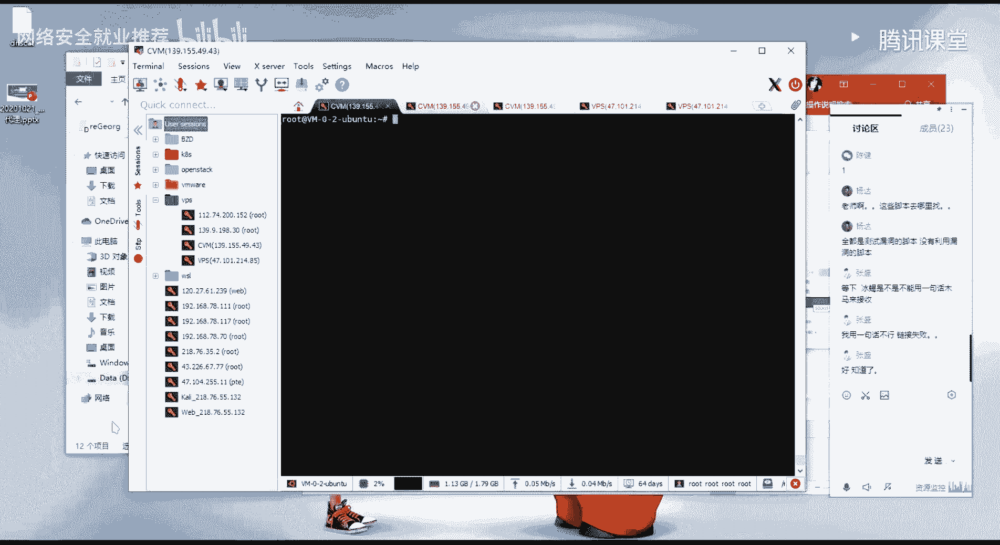

然后呃效果的话就是像这样子对吧，然后呃第二个的话就是这个n e o i e g o，这个的话这个的话比前面那个的话要就是呃，因为它是对前面的一个重构增强了对吧，它的一个功能以及它的一个呃安全性。

还有它的一个这种数据传输的一个保密性的话，要比比这一个的话要高很多，所以的话这一块的话，就相比于前面那个的话会好用一些呃，然后这一个工具它的一个呃，一些参数的一个使用的话，我这边也不不会多说了。

然后大家pp电话已经也给大家了是吧，大家自己去查看，我这边的话都已经给出来了是吧，好呃这个的一个使用的话，其实跟前面的这个i j，它的一个使用其实是呃类似的是吧，因为它本来就是基于前面的这个i g。

o r g的一个重构的吧，其它根本上的一个东西的话是没没没变的，但是的话他对前面的这一个呃，前面的这一个脚本的话，它有增强对吧，好下面的话我们来看一下我们在这边的话，同样的以这个机器啊。

方案呢以这一个机器作为一个啊势力，也就是呃我前面的话，通过这个weblogic的一个漏洞对吧，拿到了它的一个需要，然后的话我想要做一个代理，就把我这个流量代理到这样子的，代理到它的内容去。

那么我们在这边的话，在用这个工具的时候的话，首先第一步我们需要嗯，先来看一下这个呃这个工具它的一个样子吧，这边的话就是他的一个脚本，我们首先的话需要去把这个脚本下载下来嘛，对吧。

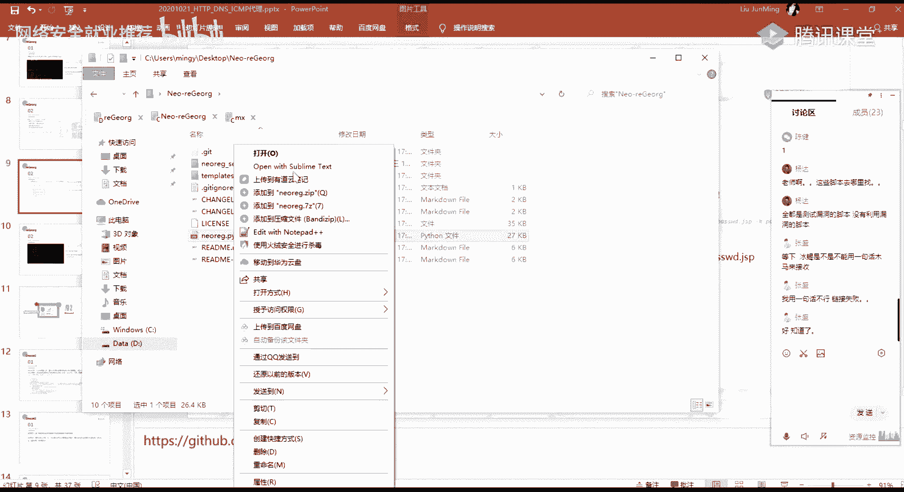

然后同样的它有这样子的一个python的一个脚本，就这一个就nee r n o r e g的这个脚本。

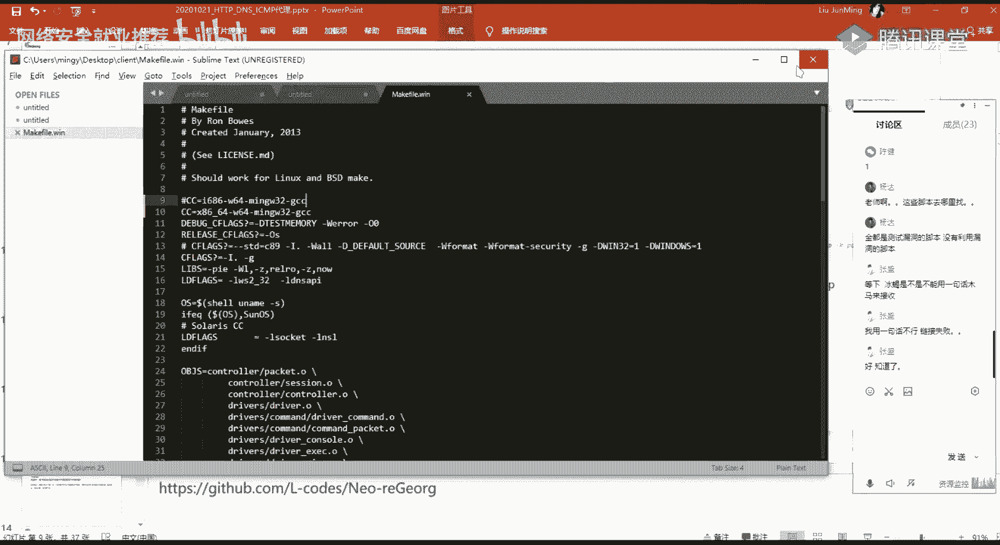

然后这个脚本的话就是我们用来去起服务的，去进行进行一个socks代理的一个呃脚本，然后在这边的话有这样子的一个目录，就是这个templates这个目录，这个目录的话。

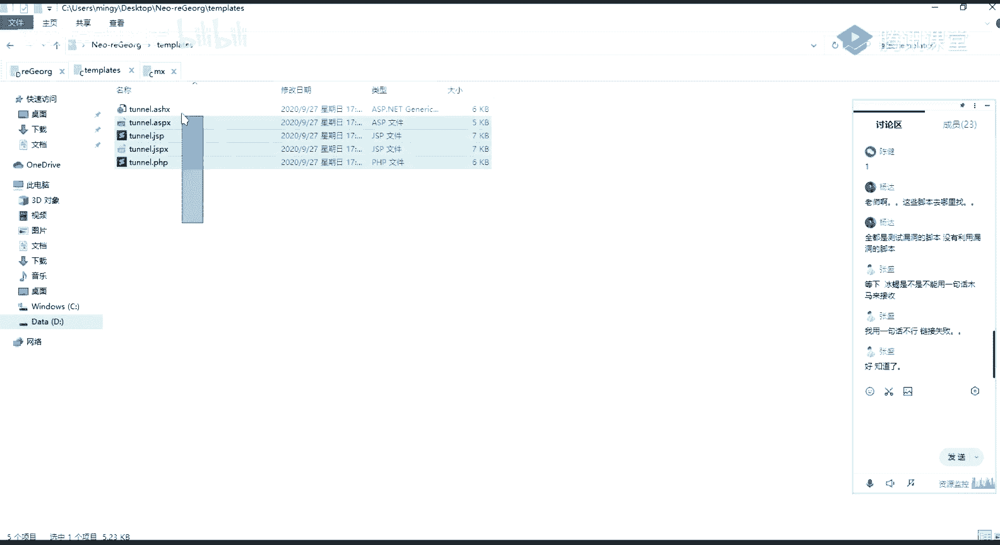

它存放的是它支持的这五种脚本的。

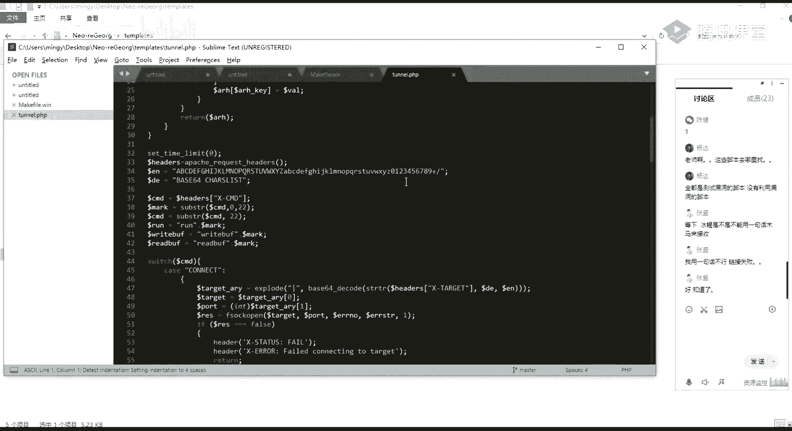

这样子的一个模板，就是这边的话它是注意的话是模板，也就是他在这边的一个模板的话，我们在这里首先第一步需要通过这一个脚本，然后的话基于这边的一个模板来去生成，对应的这样子的一个文件。

这边的文件的话可以看到n e o i g servers是吧，就这边的话就是我们的一个啊服务端，因为我们需要把我们这边的这个脚本文件对吧，去上传到目标的那个web服务上面去，然后的话上传上去的话。

我们通过这样子的hp的一个连接对吧，来进行一个隧道，然后再这样的话首先我们要去使用的话，第一步的话就是设置密码来去生成对应的，这样子的一个这五种脚本，然后的话上传到目标的一个web服务器上面去。

然后生成脚本的一个命令的话，就是这样子就有它有这样子的一个g n e r，a t e的这样子的一个参数，然后的话在后面接一个干k这个选项，我们在后面接我们的一个密码，这边的这个密码的话。

就是呃我们的这样的一个客户端，去连接这个服务端的时候，它会啊需要这样子的一个密码，来去进行一个验证是吧，就是不是啊，不是像之前这边前面这边的话，我们呃前面这边的话，我们只要知道他这个脚本对吧。

然后的话我通过这样子的一个，通过这个脚本就能够去进行一个代理的一个代，理，这样子的一个通道对吧，然后在这边的话，他就对他做了一个这样子的一个增强了，就它有它需要去验证这样子的一个密码啊。

就不是说你得到这样子的一个路径的话，你就能够去进行这样的一个通道，你你还要需要知道这个密码，就是啊在安全线上面的话就更更好了是吧，然后这句话他执行之后的话，他就会在当前目录下面。

在这边他会去生成这样子的一个文件夹，然后在这个文件下面。

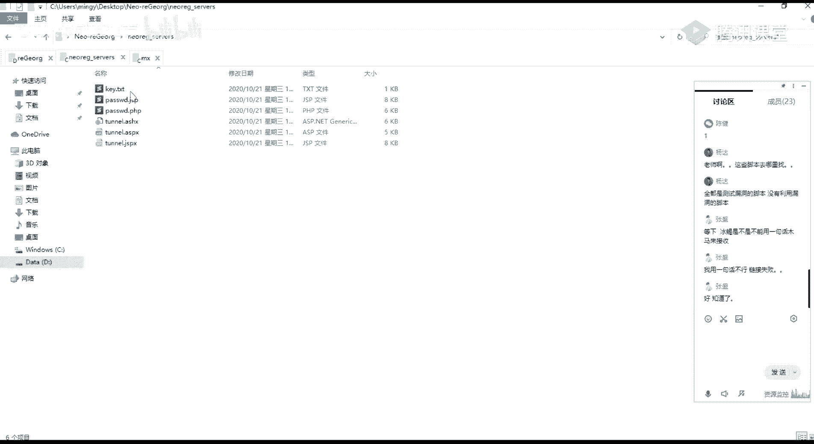

文件夹下面去写入这样子的一些脚本，然后这边的话有一个key，点单词的话就是这边的一个啊，就这边生成的我所使用的这样子的一个密码。

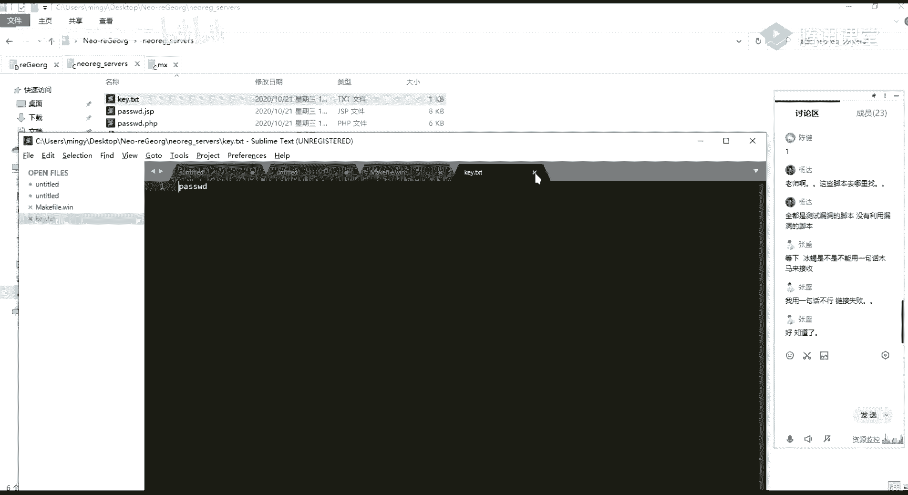

然后还有对应的这样的一个文件，我这边的话是把它改成了这样的一个password，in js p的这样的一个格式，然后我这边的话，同样的把它就是上传上传上去对吧，上去的话就是在这两好这个password。

点jsp的这个文件啊，我们可以来访问看一下，然后可以看到这边的话，没有其他的任何多余的这样子的一些东西啊，对吧，就是没有说访问不到，或者说没有报错的话，那么就表明我这边的这个jsp的一个脚本的话。

已经被正常的解析了，然后正常解析的话呃，我们也可以在这边去查看它的一个源代码，有这样子的一个一行的，然后这边呢这一行的话。

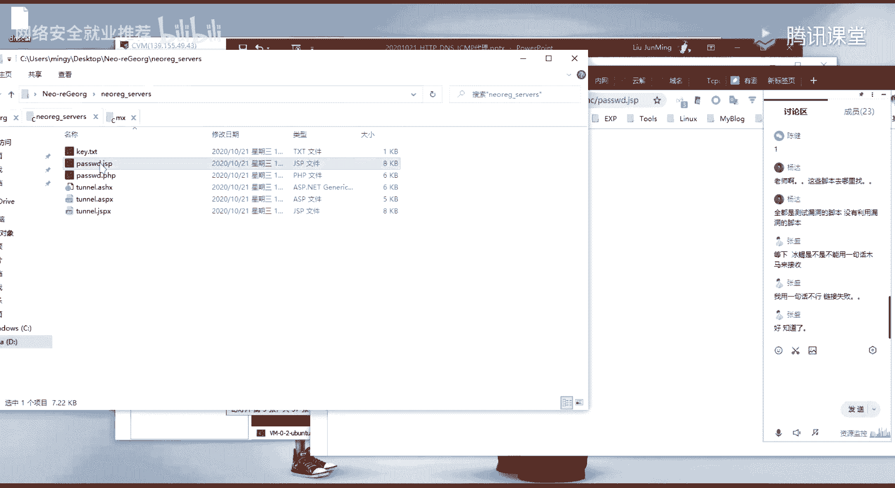

其实就是我们在这边这个脚本的最后的这一行，就是啊啊啊诶啊不是，就是这个我这边的这一个内容，对吧，它是跟这边对应的。

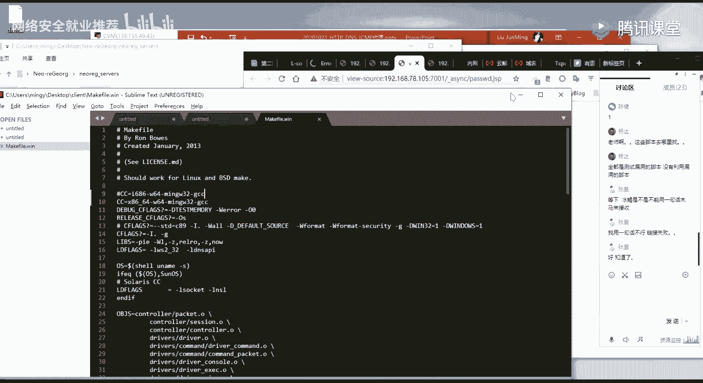

然后我们这边呃上传上去之后的话，我们同样的通过这个工具。

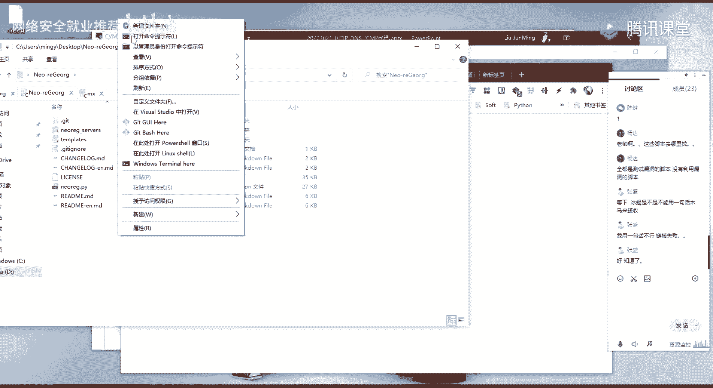

通过这个桥本来去建立这样一个通代理通道啊，在那个之前的话，我先把这边断掉，然后在这边我同样的使用108，1080的一个端口，然后他就这样子的一个进进去通道的话呃。

注意的话就是说他这边他是呃使用的是python 3号，开始二应该可以也可以吧，呃拍神二也是可以的，就是他这个的话他支持拍神二已经开始三，我这边他就用开神伤了啊，呃我们可以干h同样的杠。

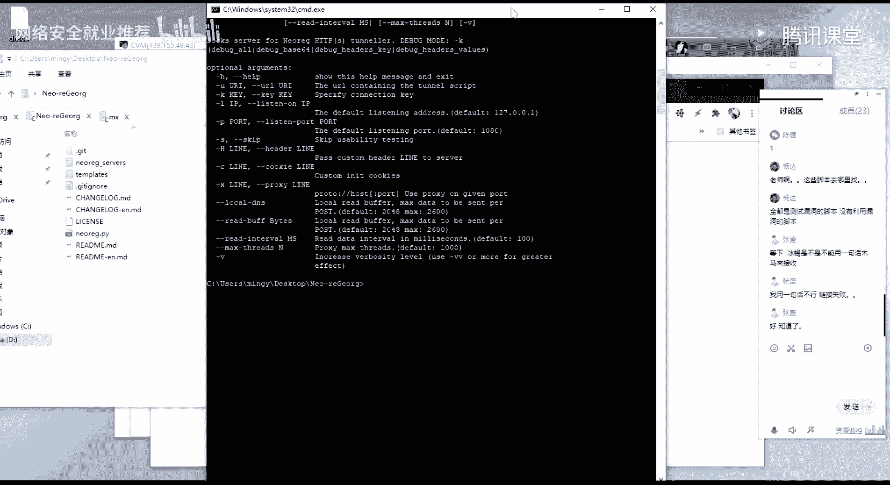

h来查看这个脚本上的一个，具体的一个使用的一个帮助信息对吧，然后这句话我们所需要的主要就是这几个参数。

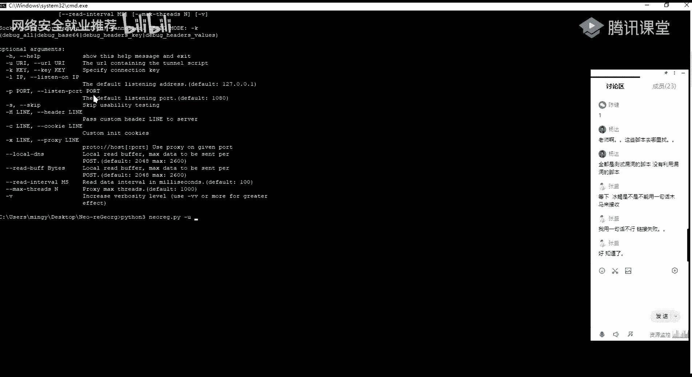

首先呢它就是干优弹药的话，就是指定我们这边的这个url，也就是我们的这一个上传的这个啊。

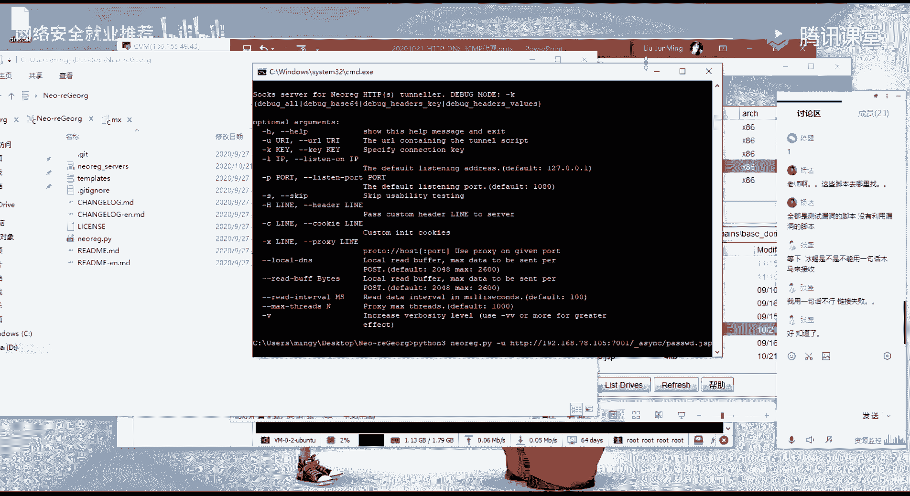

脚本就是隧道脚本好，第二个的话就是这个杠开杠开的话，我们需要去指定我们的一个t，也就是我们前面再去生成对应的，这样子的一些脚本的时候，我们所指定的这个password密密钥，然后这边的话就是我这边的话。

是生成了一个password是吧，然后的话还有就是gp就干p的话，就是啊今天端口嘛对吧，其实跟前面的那个ig它是一样的，就是在本地去进行一个代理的一个端口，我这话就是1080，然后执行之后的话。

执行之后的话就是这样子的一个结果，然后可以看到它这边的话呃，就是他启动了这样子那个收拾的一个服务，就是在本地的一个1080的一个端口，然后呃这边的一个套啊，隧道的一个hp的一个隧道的一个地址的话。

就是这个吧。

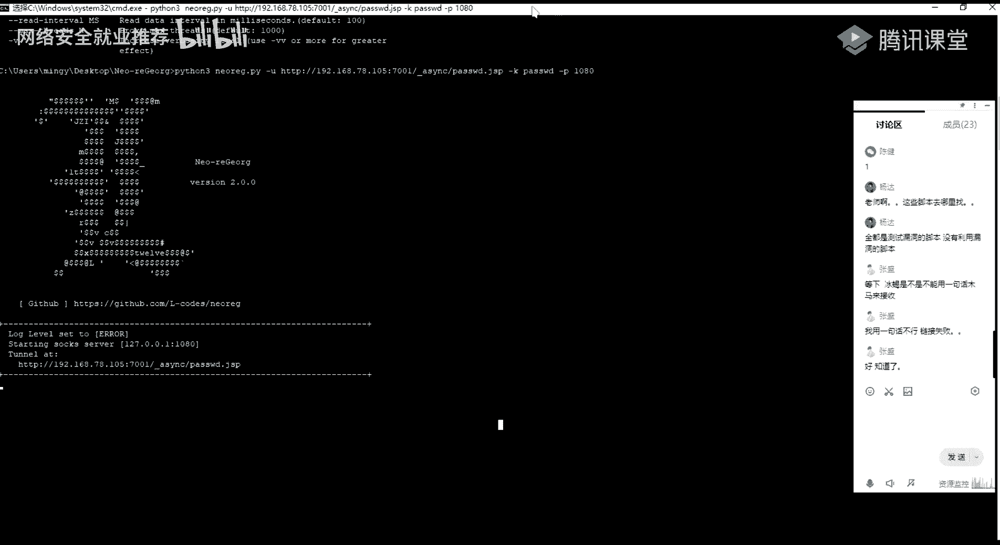

其实就是我这边的这个好，在这边的话我们尽力成功之后的话，我们同样的来去验证一下是吧，验证的话我同样的通过前面的这个这个啊啊，我这边的一个代理的话，还是跟前面是一样的对吧，因为我同样的是代理。

在本地的一个1080的一个端口上面，那我在这边请也是能够同样的，没有问题的去访问对吧，对吧哦哦不是不是，这个是8000，它的一个内网ip对吧，主要是能够正常的访问，也就是说明我们这边的。

间接的这个代理通道的话是没有问题的，好呃，然后的话我们就通过这样子的一个方法呃，又成功的建立了这样的一个带你通道，是啊，其实这边的话他它的一个原理的话，都是使用的这样子的一个hp的一个隧道。

来去做这样子的一个流量的一个转发，这两个工具的话呃，就是它的一个用法都是一样的，就没没有太大的一个差别啊，啊呃第二个的话就是第二部分呢，就是这个点cat dd cat 2，呃。

这个的话是就是呃我记得在第一期的时候，就是在开第一期课的时候，呃，没有讲这个没有讲，就是htp的啊，隧道以及电有这边的，就本节课内容的话，第一期的时候的话是没有给大家介绍。

然后呃那会儿也是有有人问我这个，然后的话呃，我这段话是给了给了这边我写的这个比较呃，这个是我老早之前的一个比较挺久的了，然而这个笔记的话大家可以去看一下吧，啊当然话因为当时写的话，当时写的话没有。

就呃怎么说呢，就是不是很认真吧，就是写的比较随便，然后的话比较可能稍微稍微有点杂乱，然后呃当然的话就是具体的运动的话，我在今天会给大家去讲，然后详细的细致的这样的一些点的话，在这边的话呃都都有都有写。

然后的话，然后还有就是我这边有参考的这样的一些文章，其实呃就是参考的别人的啊，就基于别人说这样子的一些已经做了一个总结，我这边的话就是把它给记下来，然后作为我自己的一个东西嘛。

好我下次我再去用的时候对吧，就比如说我要是之前我不做这个的话对吧，我不做这个笔记的话，就是可能你们在你们再来去问我，这个东西的时候，是，我可能就是会拿一个别人的一个东西给你是吧。

但是如果我这边我自己做了，我自己做了，有相应的一个东西，我自己有尝试的，那么我可以把我自己的这样的一个，总结给你是吧，这样子的话就呃可能会好一些吧，正，好那他这边的话就是，呃说了一点闲话。

而我们正是我们正式开始这一部分内容，的一个介绍，然后首先的话就是对这个工具的一个简介，这个dcat 2的话它是一个dns的一个隧道工具，它的一个主要作用的话，就是我们可以通过d的一个协议来去创建。

这样子的一个加密的一个命令，还有控制的一个通道，然后的话就是说呃就是说它的一个特色的话，就是我们可以在服务端啊，可以去进行一个命令的一个控制，也就是cnc嘛是吧，就是command contro。

然后的话我们在服务端的话，就能够得到这样的一个面具控制台，能够去啊执行下一个命令，也就是得到目标机器的一个需要，然后再讲这个电呃，再讲后面的一个内容的时候的话，在这边大概的就是提一下。

就d的一个解析的类型，就常见的有这样子的一些，然后我这边的话呃，有总结的，总结了这样子的一个它的一个类型是吧，然后在这边的话主要的话就是给大家介绍，和a大写的这个a就是表示的话，我们域名的一个ip地址。

就我们再去配置我们的一个解析的时候对吧，我们想我我这边的话有一个公网的ip地址对吧，比如说我这个，跟我的再加一个地址对吧，然后我这边买了一个域名对吧，呃，然后你看我的一个域名。

我想要把我这边的一个呃机器，就是啊把他给绑到这个玉米，就是把这个玉，把这个域名的一个解析的一个i p地址，把它给把它念成我这边的这一个是吧，好我再我再去做一个啊，配置的时候。

就选择我们的一个dx的一个解释类型的话，就是为a就是一个a记录，这个记录的话，它对应的是我们的一个域名的一个ip地址，然后呃还有的话就是这里的ns as的话，就是我们的一个电s的一个解析啊。

就是我们可以通过这个ns的一个记录，来去指定我们的一个域名服务器，也就是我们因为我们知道，我们要去解析这样的一个域名，比如说点com这个域名对吧，好，这个运营的话，我们首先去解析的话。

首先就是从我们本地的一个local啊，那个host文件当中去找到对吧，如果没有的话，他就会去找最近的我们啊运营商的这样子的，一个dns的一个公共的这样这个服务器，然后如果还没有找到的话。

他就会去我们的一个dx域名的，这个根服务器上面去找，然后的话它会有这样子的一个迭代的查询，就一层一层的去找对吧，然后直到找到我们这边的一个域名，而我们在这边的话可以去指定。

就是说我们再去解析这个域名的时候，去指定我们是，而指定啊，有哪一个域名服务器来去进行一个解析，就通过这个ns的一个记录呃，其他的话在这话我就呃我不多说了，大家自己去进行一个好了解好吧。

因为主要的内容不是这一块，然而下面的话就是而对这个dsk的这个工具，它的两种模式的一个介绍，就一个呃，首先第一个它就是个指令模式，指令模式的话就是我们的一个客户端。

直接向指定那个指定ip的一个i e d服务器，发起我们那个电解析请求，然后第二个的话就是这个中介模式，中介模式呢就像我们平常去上网对吧，去做一个去访问一个域名的时候，他的一个域名它去进行一个解析的时候。

他会去啊，通过我刚刚所讲的那样子的一个域名，解析的一个步骤，他会去进行一个迭代的一个查询，然后直到找到我们的这样子的，ie的一个dns服务器，然后相比前面的话，就因为他直接是通过ip嘛对吧。

就直接通过ip它没有电解析的这样子的一个呃，就是d s这个域名解析，去查找这样子的一个域名，服务器的这样子的一个过程，所以的话他会比较啊慢一点对吧，它会比前面这一段要慢一点，但是的话它是更安全。

因为它它有这样子的一个解析的一个过程，以及我们在待会待会再去看那个，就是说他在用这样子的dcat，他做这样子的一个呃，做这样子的一个反弹shell的时候，它的它的一个电源时的一个请求的话，它是会啊。

就是不是默认的一个，就是他的一个默认的一个请求的话，它还会有这样的一个t cat的一个后缀，因为它是写在他的个啊工具当中的，当然的话如果你懂代码的话，你可以自己去改掉的，而我们如果说通过这样子的一个。

中继的一个模式，也就是通过我们自己的这样一个电s的一个，域名的解析的话，那么它里面记录的是我们的一个预言，然后的话呃我们一起来看一下，就是它的一个安装这个dcat的一个安装的话，挺容易出错的，应该啊。

我今天发在装的时候，因为我这边他是又重新的又弄了一遍，虽呃虽然我笔记上面有，但是那个他是老早之前的那个服务器啊，而且还是用的那个center los的一个机器，我这边的话是用的那个微光图的。

有的话我又重新又发了一遍呃，在这边的话，这句话我是装在了安装在了这一个机器上面嗯，找到这个工具。

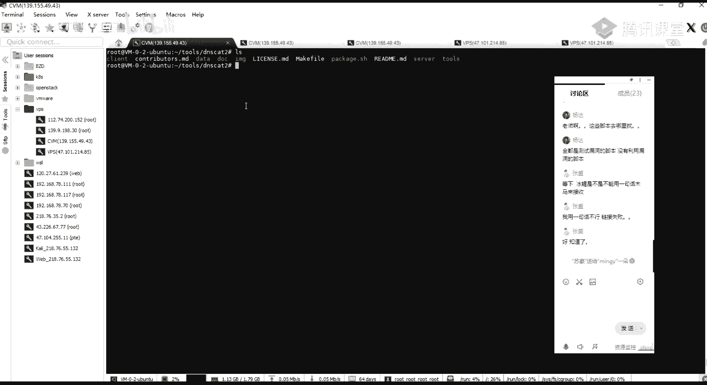

在这边，而这里的这个工具的话嗯，就首先你通过这样子的一个方法嘛对吧，再去通过这样的一个get方式，把他的一个代码克隆下，克隆下来之后的话，他的一个代码还不能像这样子，像这样子的一个东西。

然后我们主要的就是这两个目录，就是client excel这两个目录，这个seven路的话就是我们的一个dsp的一个服务，呃启动这个dx cat服务的一个脚本的话，就在这个目录下面。

也就是这个dcat点规范，然后要注意的话，他的这个工具盘，它是用通用rebuy这样子的一个脚本原编写的，然后还有的话就是一个plant，plant的话就是我们的一个客户端吧对吧。

然后这边的一个客户端的话，我们需要通过make去进行一个编译，来去生成这样的这个呃，生成一个这样子的一个，可执行的一个二进制文件，然后再去进行一个呃安装的时候的话，我们需要去安装它的一个服务。

在安装之前的话，我们需要去呃安装相应的这样子的一些啊，依赖以及组件以及一些应用程序啊，我这句话都已经写了，像呃你需要有revive revive一个环境，因为它是用rev脚本写的嘛是吧。

你需要去用reb解析，还有就是这个预报点dv的话，是它的一些那个啊依赖扩展，然后还有git，就是我们在这边要去用这个beat，我们也要去安装码，开源的话就是mac。

mac的话是linux下面的一个编译器啊，就我们去兵役啊，定义我们那个c代码的时候，我们通过这样子的一个mac编译器，去编译成我们的一个可执行文件，以前还有g加加，也就是我们需要的这样的这个环境。

呃以及这一个binder，binder的话，就是我们在这边去安装这个服务的时候，会去用到这个bstore，然后呃安装一个过程的话，就是我这边的一个截图啊，我这边我就不多说了。

就是你这边的这些组件连安装完成之后，你把呃你进入到这样子的一个筛网目录，然后的话执行这个binder in store，它就会去安装对应的这样子的一些组件，安装完成之后的话啊。

我们就能够去进行一个启动服务，然后启动服务的话呃，在启动服务之前的话，我们还需要去编译我们的一个客户端了，那我们服务端有了我们客户端，我们也也需要对吧，还有b客户端的话，就是进入到这个client。

我们直接执行一这个mac来去编译一个可dsk的，一个可执行二进二进制文件，啊我们呃服务端客户端都有了是吧，那么我们需要去进行一个启动我们的服务端，啊启动服务端的一个命令的话，就是这样子。

通过rebi来去直接去执行我们这边的一个dns cat，二点r b的这样子一个脚本执行之后的话，它就会有这样子的一个呃，这样子的一个信息返回啊，先休息五分钟吧。

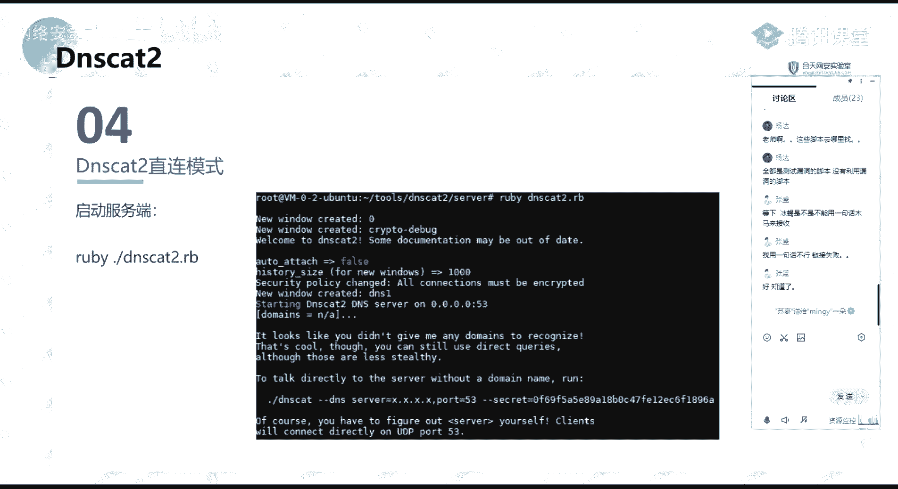

啊50的时候的话。