# P69：第38天：权限提升-Windows服务漏洞提权、Windows注册表 - 网络安全就业推荐 - BV1Zu411s79i

最基本的一个思路就这样，还有就是在web share下面执行命令的，这样子的一个呃工具，这边的话就是介绍这两个就是这个i know，i know six，他们的这样子的一个就是基于这个思路。

新手的一个修改吧，就用于在web share下面去执行命令，就是说我们可以就说如果我们得到了web share，我们可以通过这样子的一个工具，我们直接在web share下面去执行之后的话。

能够去得到它的一个啊c什么的一个权限，那比如说呃这边的话是它的一个用法嘛，就是直接执行对吧，我们可以直接去以system的一个权限去执行啊，那么我们能够就是说能够，通过这样的一个工具去提取的话。

那么他能够去执行命令，然后的话我们就可以去反弹一个这样子的一个，system的权限的一个share嘛对吧，比如说我们上传一个，比如说msf生成的一个可执行程序对吧，然后的话通过他的这一个提前工具去执行。

然后执行之后的话，它是以一个system的权限执行的嘛，然后的话我们就能够去得到一个system的一个share嘛，还有呃其他的话我就啊不介绍了，这个的话大家自己就是其实就是一些工具嗯。

就收集这些工具嘛，就是以备不时之需嘛，然后他就是介绍介绍这些工具，我们在什么样子的一个情况下面可以去使用，嗯现在50了呀，我这边的话呃大家应该没有什么问题啊，有我这边的话呃，断一下，啊。

呃咱们就不休息了吧好吧，因为后面的内容的话还是有挺多的呀，呃可能的话就是因为时间关系的话，可能，呃其实我ppt的话已经写的很详细了呀，好吧，然后具体的一个操作的话，可能我在这节课的话。

就不会详细的一个去操作了，啊呃第三个它就是windows的一个内核漏洞，的一个齐全，问的是内核漏洞，提权的话，我们通常的话就是首先这样子的这些命令的话，其实呃前面也介绍了对吧。

那首先的话我们会去检查windows的一个版本，它是否有任何已知的这样的一个漏洞，那么我们如何去找，就是他是否有了，首先第一个我们通常的话去找它的一个，就是它的一个系统对吧，它的一个系统的一个版本。

然后的话这一些系统的一个版本，它对应的是否呃就是有现成的，或者说有爆出过对应的这样的一个，能够去提前的一个漏洞是吧，然后的话就是通过去查找对应的一个补丁号，就是确定这样子的一个系统版本，下面它呃。

是否有打对应的这样子的一些补丁对吧，如果他没有打某一个提前漏洞的一个补丁，那么我们正好可以去利用他去进行一个提醒，对吧，然后的话还有就是通过抛shi的一个方式，来去列出所有的一个补丁啊，呃这边的话。

这边的话就是通过这样子的一个方法，就是通过这个get w mi object，这一个的话就呃前面应该也有介绍吧，就是这个get remi object的话，类似于就是这个w m i c。

那他同样的能够去啊，对我们的这样子的一些去进行一个，这样子的一个操作，就是跟这一个w i m i c的功能是一样的，然后这边的话它是通过就是说呃，他同样的是去查找这样的一个host fire。

host fixed fixed idea啊，就查找我们的一个补丁号嘛，然后他这边的话是查找了一个方法的话，他是从啊windows下面的这一个就是这个api当中，尤其是他在这边的话。

有像我们的一个sql注啊，不sql语句一样的对吧，就select的一个方式，从这样子的一个啊，从这边去进行了一个查找，然后这边的一个查找的话，它其实就是查找对应的啊。

从这个api当中去查找对应的一个信息，然后的话来去找到我们这边的一个补丁号啊，然后执行一下吧。

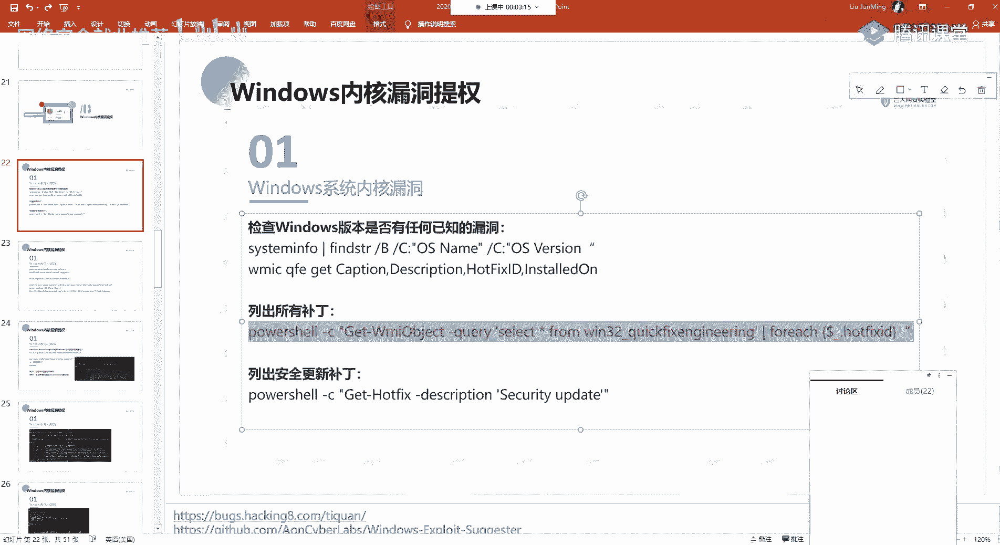

没看到啊，结果它就效果它就像这样子。

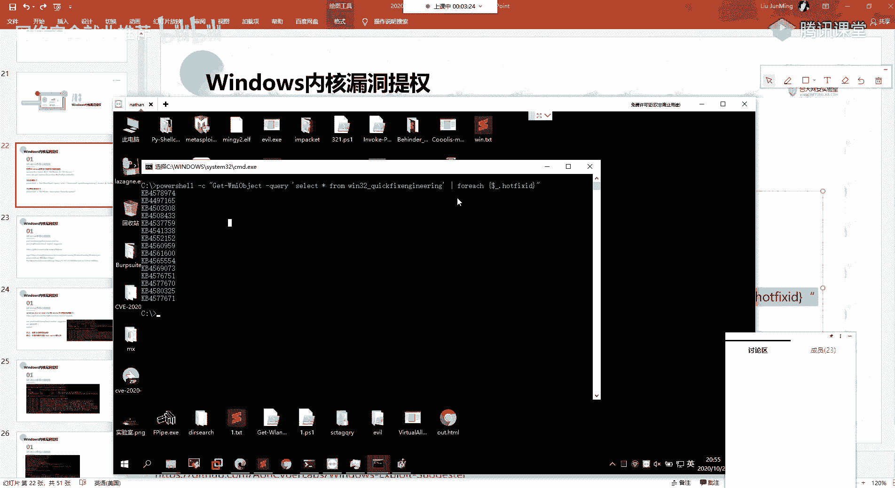

呃而他列出安安全的一个更新补丁，这边的话跟上面是一样的，呃，呃下第二个的话，就是介绍两个这样子的一个模块，这两个模块那就是在msf下面的两个模块呃，呃第一个号就是innpatches。

其实就是列出当前就是列出windows系统下面的，这样子的一些补丁，就说他有打的一些补丁，我们可以通过这样子的一个模块，来进行一个枚举，然后呃第二个的话就是一个啊。

windows windows系统下面的一个，就是本地提权的这样子的一个模块，这个模块的话他要去探测，他要去检测你的一个目标系统下面，它是否有存在，就是说啊已知的这样子的一些提前的一个漏洞。

然后的话他会给出建议，就是给出对应的一个建议，他的一个建议的话，其实就是这个，就是这边的这个模块就我们在这边执行之后，是执行之后的话，他会去啊，以当前我们已经得到这样子的一个。

msf的一个shell对吧，然后的话去探测，然后它探测到如果说存在有对应的一个提升，就可以去利用的一个漏洞的话，它会有给出对应的一个模块，就我们可以直接用msf里面。

它给出了这样子的一些模块来去进行尝试，去进行一个提取，嗯还有就是这个咱们连a t sone wet son，这个的话也是就是一个比较比较好用的，一个就提权信息收集的一个工具，就是我们直接看效果。

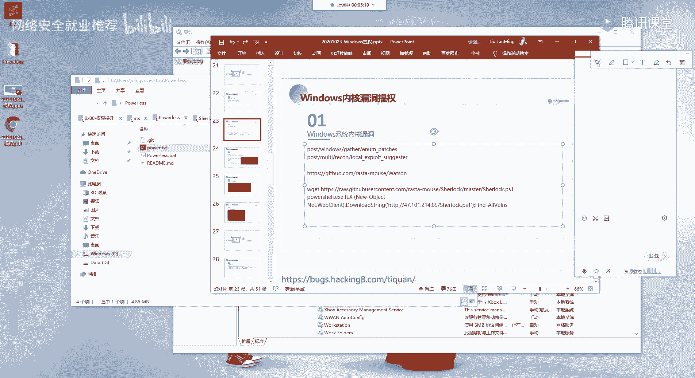

这个，这个的话就是呃执行之后对吧，执行之后的话他也会去探测，就是给出这样的一个建议，就是建议就是说他可能觉得就是他会去，因为他这个脚本工具里面的话，他已经有集成了，对应的就是呃探测对应漏洞的这样子的。

一个呃一些脚本啊，然后的话他会去探测你当前系统，它会通过它收集的一些信息对吧，然后的话去进行一个判断，其实就是一个供你参考的这样子的一个呃，一些可可能存在的这样子的一些漏洞。

像比如说这边cv 120191064对吧，它判断是可能存在的，当然的话这边啊，这边他给出了这样子的一些东西的话，就是作为一个参考吧，就是你可以去尝试，当然的话你尝试之后的话就是不一定能成。

也就是说他这边的话就是仅供参考吧，然后还有对应的话就是有对应的呃，相对应的漏洞的一些脚本的一个信息，以及他利用的一个啊，就关于这个漏洞的，在油管上面的一个视频啊对吧，以及还有对应的一个脚本。

然而他这边的话它就是列出来的这样子的一些，cv的一个漏洞都是比较新的，我这边的话这个工具没有更新啊，应该就是这个工具的话应该是一直在更新的，这个的话是就上一期讲课的时候。

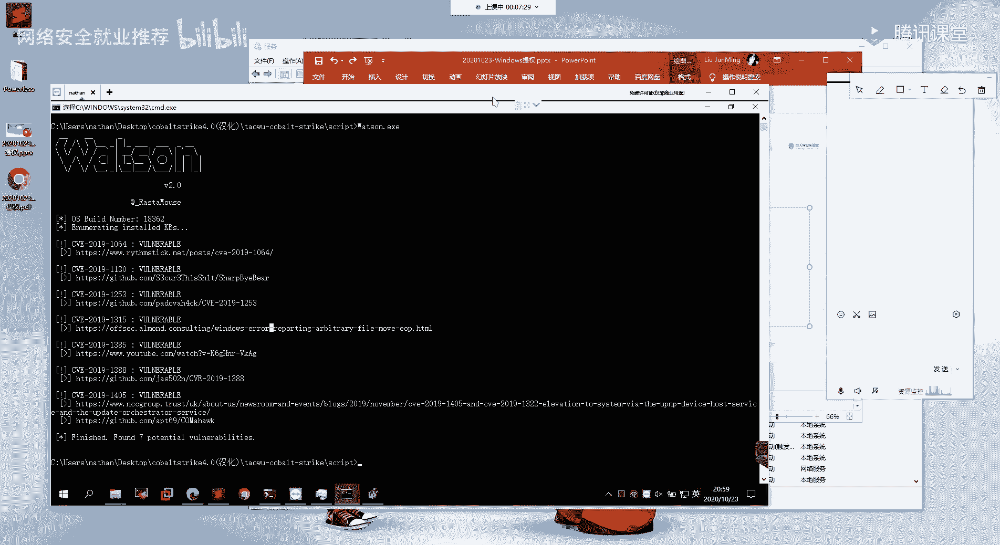

那个的，然后大家可以去那个github上面自己去找，找到最新版本的，然后的话去进行一个尝试，然而第二下面这个的话就是通posher，脚本的一个方法方式啊，就是这个啊。

sherlock这样子的一个抛弃的一个脚本，它同样的就是已经他会去探测，已经就是已经写好的这样子的一些可能存在的，这样子的一些提前的一个漏洞。

我这边的话。

这边我在这边执行了就执行执行了呃，当然我这个号我是直接在本地加载的，然后同样的我们可以去远程加载嘛是吧，然后在这边的话呃，我们导入这个模块，然后的话用这个方的oa variance。

然后的话他就会去枚举去枚举这一个系统当中，它可能存在着这样子的一些漏洞，然后的话他在这边的话，像no valuable，也就是说他没有发现这样子的一个，然后其实在这边的话。

因为我这个号是win 10的一个系统嘛，然后他这边给的这样子的一些啊，提前的一个漏洞，wx的一个提前录的话都是比较老的，所以的话都没有发现是吧。

啊其实这样子的一些这些工具啊，其实都是仅供大家参考，就是啊那大家就是说通过他的一些脚本，它通过对应的一些信息的，就它已经整合了一些信息对吧，然后它通过它整合的这些信息来去判断，你的一个系统当中。

是否可能会存在这样子的一些提取的洞。

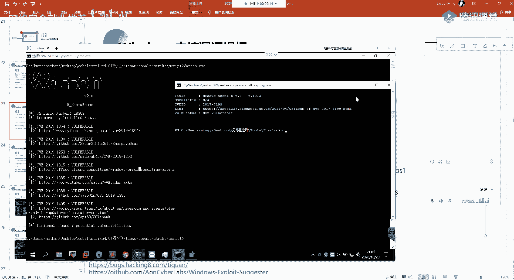

那么我们就可以去尝试去进行一个利用了对吧，然后的话就是这个windows下面的一个平台的一个，提权漏洞的一个集合。

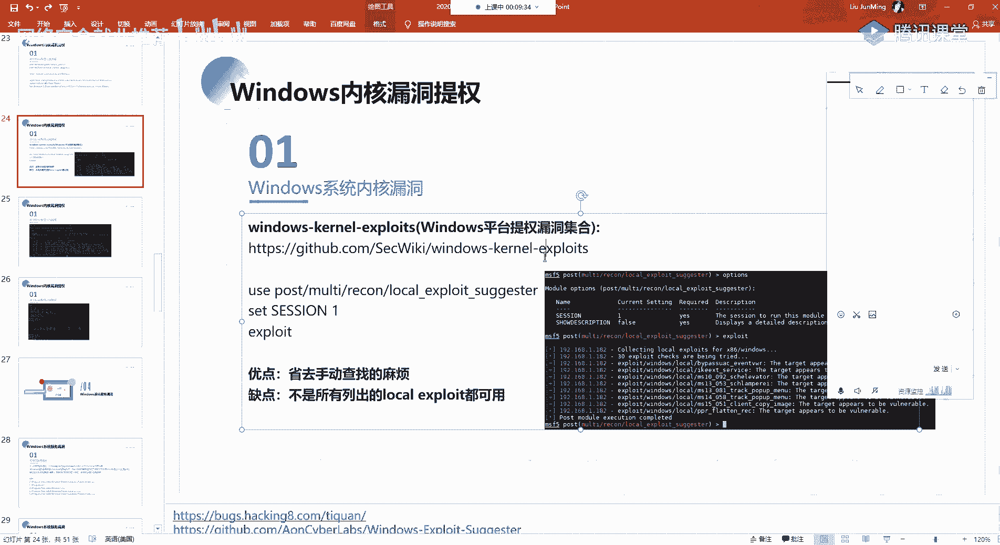

关于这个的话大家可以看一下这个链接。

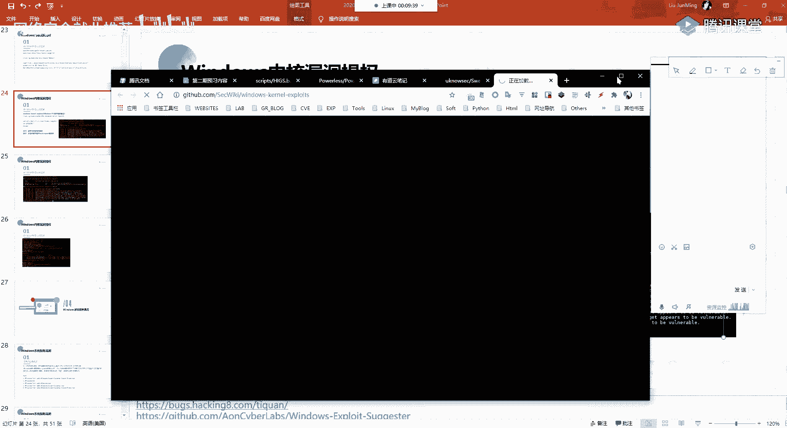

就github上面的这个链接这个网址，然后他这边的话就是收集了，就是windows系统下面的啊，所有的这样子的一些，就是内核的一个提前的一个脚本，就一叉p，那比如说我们以这个m416034 为例对吧。

然后他在这边的话就给出了这样的一个脚本，它是一个c c加加的一个脚本嘛对吧，然后我们可以去定义它，编译的话可以去编译成一个可执行文件嘛，然后的话执行，还有的话就是有已经编译好的这样子的，对应的啊。

windows下面的一些内核的一个提权漏洞，的一个利用脚本。

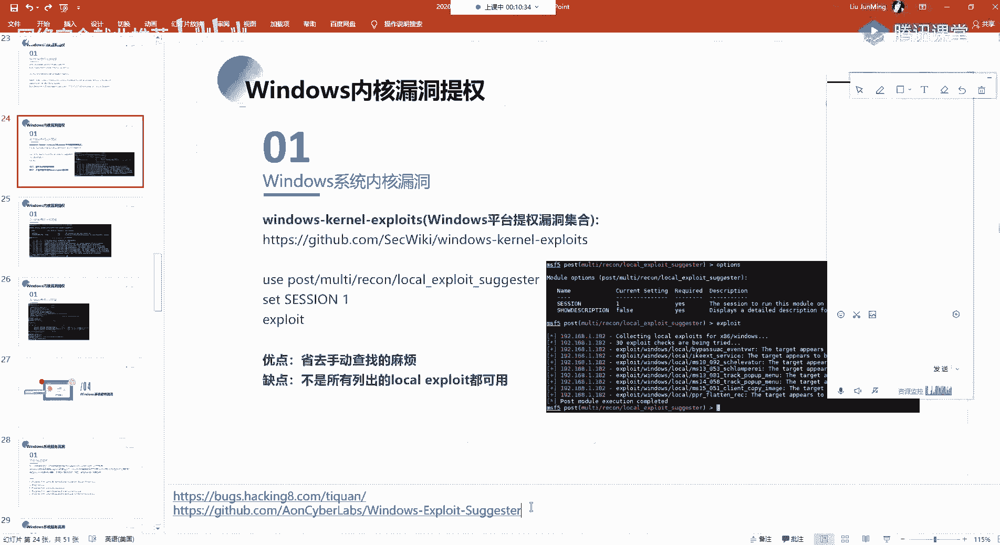

以及在这边的话就是。

介绍一个网站吧，就是这一个就这一个就是一个windows提升的一个，辅助工具，就是我们在这边的话，他的这个辅助工具的一个原理的话，其实就是他呃，我们把我们的一个system info的一个信息。

因为我们的一个sim sim info的一个信息里面的话，就包含它的一个补丁号码是吧，好的话，我们粘贴进来，粘贴进来之后，我们就可以去查询，像比如说啊未修补的一个漏洞，已修补的一个漏洞是吧。

好我们查询查询之后的话，像比如说我在这边。

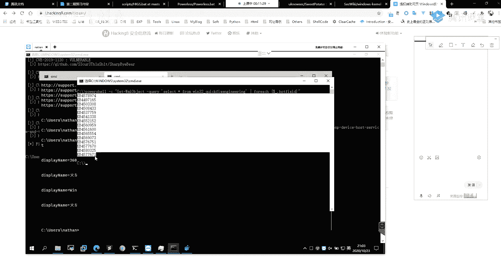

啊这边的话我就不尝试了，就是他这边的话，你把视频info的一个那个补丁号啊。

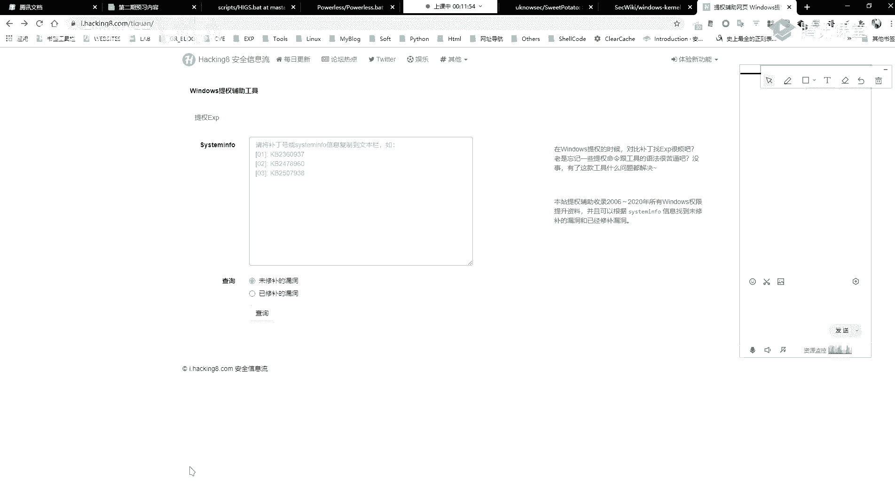

把它给扣到这边来呃，他要他要是这样子的一个格式啊。

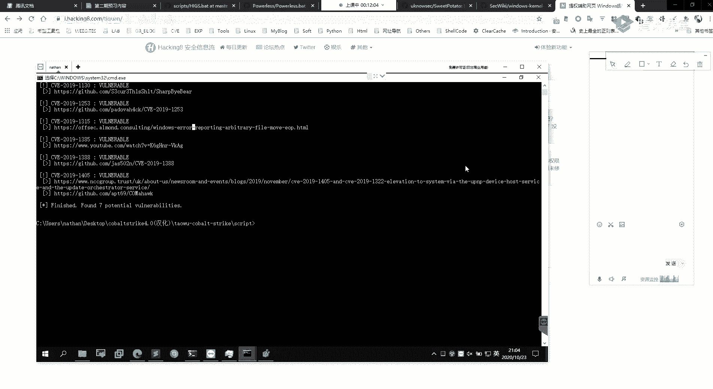

就是要是这样子的一个格式，第一个第二个第三个对吧，它是这样子的一个格式，然后的话查询查询之后的话，他会有返回一个结果，看下他用他的这个，反正这一个结果他还是像这样子。

然后他就是他为你找到这样子的一些e x p嘛，这些e x p，它就是就是你的提供了这样子的一些补丁号，当中的话，就是没有包括的这样子的一些可以去利用的，这样子的一些e x p的一个漏洞是吧。

好像比如说我们以这个为例是好，这边的话有一个补丁编号，我们右键就是啊我们跳转到这个链接之后的话，它其实就是到了我们这边，刚刚的这个windows的一个啊内核漏洞的这样子的，一个github的一个页面。

然后在这边的话就有对应的，就是说对应的这一个呃，提前漏洞的这样子的一个应用的一个脚本对吧，然后以及它的一个用法，就这边的话像在这边就他的这个题目的话，我们执行执行他的一个脚本之后的话。

直接得到了一个sem的一个权限对吧，呃还有其他的话，这边的话我都放在预习内容当中，我就不记得带大家看了，好吧好呃，在这边的话就是这个msf的这个local exploiters。

suggest的这个模块，它的一个效果的话就是像这样子，然而我们执行之后的话，他会有给出这样的一个建议，就是我们可以尝试用这样子的一些模块，进行一个提前，然后的话，以及我们使用其中的一个集权模块对吧。

能够成功的去得到一个system的一个权限，这边呃当前这边的话是一个普通用户对吧，我们得到一个shell的话是一个普通用户，然后的话我们通过这个脚本，它执行执行之后的话。

他得到了他会重新得到这样的一个筛选a对吧，能够成功的去得到一个system的一个权限，那个呃当前这边的话是一个普通用户对吧，我们得到一个shell的话是一个普通用户，然后的话我们通过这个脚本。

它执行执行之后的话，他得到了，他会重新得到这样的一个筛选，这边呢有一个筛选四生成了，对吧好，我们进入这个筛选四之后的话，我们可以直接通过get system来去得到它的，一个system的权限。

就其实我们当前这边的话，其实是一个普通用户的一个选项，它不是一个admin的权限，然后我们通过这样的get system的话，如果说你是一个普通用户权限的话，去执行这个get system的话。

你会报错，就是你要去得到它的一个系统的权限的话，你需要有一个admin的一个权限，这样的话就是啊也有可能就是存在，存在这样子一个情况，就是你直接执行的话，你普通用户也能得到些什么的一个权限。

就是上一期的话有呃，有同学是这样的一个情况，当然的话如果你能够直接的去得到的话，那更好了，然后其实实际的话实际的一个情况的话。

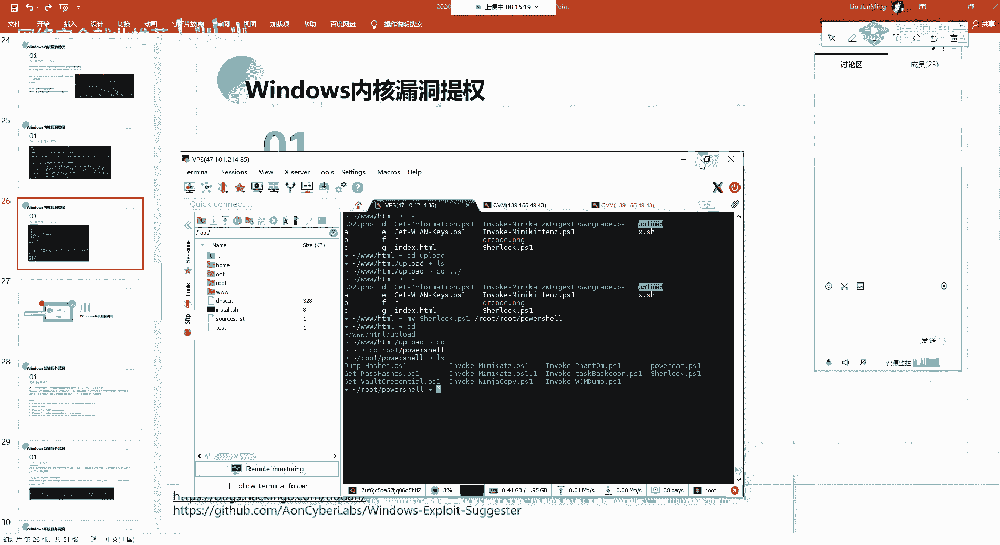

可能会是像这样子，就是像这样子是吧，我当前的话是一个这样子一个普通的，然后我给你some get set，什么话，还会去尝试用这样子的一些方法，来去进行一个提前，然后的话他有点端倪了。

然后我们是普通用户的话，我们无法直接的去get system。

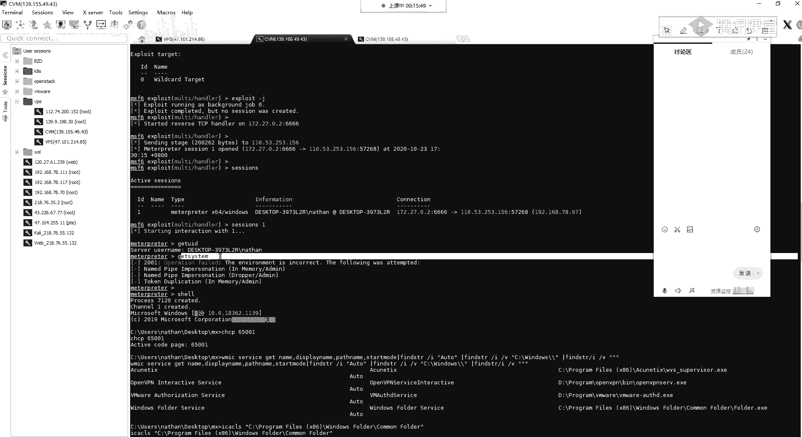

去得到它一个system的权限，然后在这边可以的话，是因为我们执行这个脚本中的话，它其实有它其实已经做了相应的一个，权限的一个提升，然后的话我们直接通过这个get get session。

就能够去得到它的一个c system的权限，呃，前面的一个内容的话，大家应该没有什么疑问吧，大家有没有什么问题呢，应该都能听得懂吧，啊这前面的话这些内容的话，就是啊介绍了一些工具对吧，介绍了一些工具。

以及我们常用的一些信息设计的一个命令，以及就是结合这些信息，我们呃可以去使用对应的这样子的一些工具，来进行一个提前，然而下面的话，下面的话就是呃，我们的最后一部分内容。

就是windows系统的一个服务漏洞的一个集权，首先第一个它就是这个可信任的一个服务路径，这个可信任服务路径的话，它的，它的一个呃特点，或者说我们能够去进行一个利用的一个点。

就在于它是有这样子的一个特性，就它存在缺陷的这种服务程序，就是利用属于可执行文件的一个文件，文件夹权限，然后的话windows服务，通常它会以一个system的权限去运行，所以的话在系统。

他在他在去解析这样子的一个服务，的一个二进制文件，它对应的一个文件路径空格的时候，它也会与系统的一个权限去进行一个解析，然后的话它的这个漏洞的话，就是用的这个特性来去进行，进行了一个全线提升呃。

大家可能看这一段文字的话，可能不是很很很好理解，我这边的话，以这样子一个例子给大家做一个解释，就是呃在这边的话，在这里的话就是呃它是这样子的一个服务对吧，然后这边呢这个嗯。

这边这个服务是他所去执行的一个程序的话，就是这个这个程序，然后这一个程序它的对应的一个路径的话，就是这样子的一个路径是吧，然后他起这个服务的话，它是就一般的我们的一个系统的一个服务。

它所执行执行的一个权限的话，它都是一个系统的一个权限去进行啊，以一个system的一个权限去进行一个运行的，然后在这边的话他再去启动这个服务的时候，它同样的也是一个系统的一个全新去运行对吧。

然后在这边它有一个问题的话，就是他再去解析，他再去找到找到这样子的一个服务，它所对应的一个可执行文件的时候，它会经历这样的一个过程，就是它的这一个可执行程序文件的一个啊。

所在的一个路径是这样子的一个路径是吧，然后他会对这边的这个路径的每一个空格，他会去尝试去寻找，呃其实就其实就在这边，我这边的这一句话就是他会去尝试寻找，然后的话执行名字与空格前的一个名字相匹。

配的一个程序，也就是说他再去查找这个服务，它对应的一个可执行程序的这个，路径的时候对吧，他首先会找这个就是找到c盘下面的这个program，对这边的一个program file的话。

它中间是有空格的对吧，然后他去查找的时候，他会找到这个c program这个程序啊，找到这个路径下面，看它是否有这样子的一个program点，ex一的这样的一个可执行程序对吧，如果说有的话。

那么它就会以一个system的权限去执行它，然后如果没有的话，那么它就会继续往下找，然后找到像比如说在这边windows project对吧，这边同样有空格，他会在这一个目录下面，还要找。

是否有这样一个windows 0 x16 个可执行程序，如果有，他也会以c什么一个权限执行，没有的话，他继续找是吧，直到找到最最终的这样的一个程序，然而在这边的话。

那么我们针对他的这样子的一个就是这个缺陷，我们如何去进行一个利用呢，其实我在这边的话，其实呃我们来一起看一下，就是通过前面的一个讲解，我们能够大概的理解对吧，就是它的这样子的一个。

就是它的一个解析的一个机制，然后那么我们去进行一个利用的话，因为他会去一就一个一个目录的去查找，就是说它空格前面他是否有对应的，这样子的一个可执行程序的，然后的话去以c的权限去进行一个执行。

那么我们就是说首先的话我们去请去检查，我们的一个呃，不是就是说我们首先的话就要想对吧，我们不会去进一个利用，那么就比如说我想要去得到，就是说我想要去得到它的一个cm的权限是吧。

我们要去利用这样的一个权限去得到它的话，那么我们呃他会去进行这样的一个检索对吧，他会去有这样子的一个步骤去执行，解析这样子的一个ex一的一个程序对吧，那么我们是否可以去尝试去生成这样子的一个。

像比如说在他的一个路径是这个对吧，我们知道他的一个路径是这样子，那么我们是不是可以去生成一个，像比如说program 0 x1 ，把它放到我们的一个c盘的一个根部下面是吧，然后的话在这个服务它去他去啊。

加载的时候对吧，他去启动启动的时候，他就会去找，然后的话他找到这边的话，他就会去找到我们这边所生成的，这样子的一个呃可执行程序，然后这个可执行程序的话，又就是我们的一个反弹shell的一个码对吧。

那么他去执行它解释执行解释执行的话，它是一个系统的一个权限距执行的，那么我们他执行这边的一个我们的一个码的话，我们就能够去得到它的一个设计什么的，一个权限对吧，然后同理的话就是呃其他的一个目录。

我们同样的也要去，我们也可以去尝试对吧，然后我们要去呃达到这样子一个目的的话，就有这样子的一个条件对吧，首先第一个的话就是我们要去向这个目录，去上传这样子的一个我们生存的一个码对吧。

那么这一个目录像c盘的这种目录下面的话，我们如果说是一个普通用的话，我们无法去向这个目录去写，去写这样子的一个文件的对吧，以及啊c盘的这种其他的这样子的文件夹，下面的话我们也有可我们也可能就是无法去写。

去上传我们这样子的一个文件，因为我们没有权限嘛是吧，那么在这边的话就是有一个问题，就是我们需要去找到一个这样子的，就是就是以这样子的一个形式，它中间是有这种空格的这种服务对吧，以及它的这样子的一个。

他的这一个去检索的这样子的一个路径，这一个目录，下面的话是有一个我们能够去写文件的，这样子的一个目录，就是说我们有权限去向这一个目录去写一个，这样子的一个dx一个可执行程序文件对吧，所以的话在这边的话。

第一步我们需要去做的话，就是检查目标主机它是否可能存在漏洞啊，在这边的话就是去通过这样子的一个呃脚本，就w m i c来呃去啊，service的话就是去查找啊，与服务相关的这样的一些信息嘛。

然后他的名字啊，他展示的名字对吧，呃路径对吧，等等的这样子的一些信息，然后我们对它做一个输出，然后其实在这边的话他查找的一个方法，那就是呃他查找这种服务，他的一个路径当中，他是否有这种空格对吧。

因为我们前面它的一个特性的话，它就是去他会去解析空格前面的这样子的一个，呃文件嘛对吧，然后第二个的话就是如果说我们找到了，像比如说在这边我找到了这样子的一个服务，对吧，它是符合我们这边第一个要求。

然后下面的话我们还需要去去找到，就是说它的这个服务径，它是否有一个我们是否有一个写入的权限，就通过这个i c a c l s这个命令，来去进行一个检索，然后结果的话就是像这样子。

我们检索到检索这个目录啊，当然这个目的话是呃，就是其实不是一个真实存在，系统上面的一个目录，我这边还是为了就是做这样子的一个，就是给大家讲课嘛对吧，就是啊做了这样子的一个目录，以及做了这样的一个服务。

好，我们在这边的话，我们去检索这一个目录，检索到它的一个权，它的这样子的一个权限，关于这边的话，我们主要就是看这边f的话就表示完全控制，以及呃在这边前面的话，首先的话就是你的一个用户，然后后面的话冒号。

后面的话接的就是权限各各类的一个权限是吧，我们主要关注的话，就是这个f的话就是完全控制，也就是说这边的这个前面的这个用户，他对这个不是有一个完全控制的一个权限，也就是它能有对这个目录下面去进行一个解读。

等等的这样子的一些操作对吧，然后在这边的话就是有一个特殊的一个权限，就是这个everyone，然后我们可以看到这边every every one的话，它同样的有这样子的一个完全控制的一个权限。

也就是什么意思呢，也就是啊，任何用户，他都有对这一个目录有这样子的一个啊，可以去写文件，可以去读取，可以去进行啊这样子的一些操作的一个权限，那么我们确定了这样子的，我们通过这样子的方法。

确定了这样子的啊一个服务，以及他存在这样子的一个可以去写的，这样子的一个文件，那么我们下面的话就可以去尝试去生成，这样子的一个po的对啊，我们在这边的话是找到了是这个windows fragile。

这个目录对吧，那么我们要去生成的这样子的一个可能性，程序的一个文件名的话，就是我们可以看一下这边是是这个目录可以写，那么我们要去生成的一个文件，这个可执行程序文件的话，就是这个common dx 1。

因为他在去解析到这个目录的时候，他会去解析这边空格前面的这个common，这个可执行程序对吧，如果他有紧锁的话，他就会去以一个cm的一个权限执行嘛对吧，那我们向这个可写目录下面去上传一个生成的。

这个啊反弹希尔的一个码，我们上传上去，然后这个服务它重启的时候，他就会去加载它，这边的话就是呃生成了一个步骤，这部分的话呃应该大家都很熟悉了，我就我就不多说了，好的话。

上传到我们的一个目标的一个啊目录下面对吧，上传上去，上传上去之后的话，我们需要去重启服务，因为呃我们在这边，我们把我们的呃这种这个可执行程序，我们上传到目录下面去了对吧，但是他上传上去这么大。

他不会去自己主动的去执行对吧，他是需要去等这个服务它再重启，也就是说他是会他是在这个服务，它重新启动的时候啊，系统它才会去啊，以我们前面这边的一个方法来去进行一个解析，执行来去进行这样子的一个方法啊。

这样子的一个步骤去进行一个呃紧锁是吧。

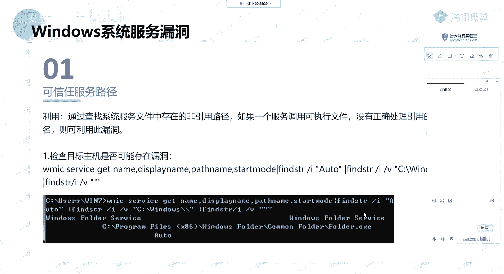

所以的话在这边我们还需要，就是说他的这个服务的话，我们需要去对它做一个重启，首先的话就是呃，我们可以通过sc的这个命令行程序对吧，因为我们知道这个程序的话，我们可以去进行一个啊服务的一个控制，紧锁对吧。

然后qc的话就是去进行一个查找，去查找我们这边指定的这个服务，它的一个相关的信息，就是像在这边，像比如呃它的一个启动的一个状态，启动的一个类型就是art type，就我们那个服务启动类型的话。

就是有启动禁止啊，不是有那个就是。

那就启动类型的话有手动自动嘛，然后禁用对吧，然而在这边的话就是auto start的话，就是表示它是一个自启动的，也就是说它会随着系统启动而启动，这样子的一个服务，然后呃在这边的话。

就是我们呃会有这样子的一个问题啊，就是我们因为我们当前得到这个权限的话，是一个普通用户的权限，对我们没有权限去去启动这样子的一个服务，因为它的一个服务的话。

它其实是一个system的一个圈圈去执行去去启动的，所以的话我们普通用户是没有权限的，也就是我们无法去对这样子的一个服务区，进行一个启停止以及启动，在这样的一个操作，就像这边啊，我这边截图所示啊对吧。

就access is denied，也就是它是不允许你去进行这样子的，一个操作的，所以的话呃我们可能就需要去等待，这样等待下一个服务器去重启，然后他去执行这一个可执行程序，当然的话简单粗暴一点的话。

就是我们直接消动，就把它的一个主机继续去进行一个关机，当然的话这个的话不是呃比较敬业，就是说everyone的话，它就是表示所有的一个用户嘛，就是说你是一个普通用户。

也也也有权限去对这个啊文件去做一个啊写入，去上传我们的这样子的一个程序嘛，不是说呃你是要有everyone，然后的话你还需要有对这一个目录有一个呃，完全控制的一个权限。

当然的话如果说你是一个就是你是一个admin的话，那么你你就有权限去对它做这样子的一，个操作嘛，所以这边的话它是有有条件的呀，注意的话是有条件的，就我前面这边讲的啊，我我首先的话需要有这样子的一个目录。

来看一下吧。

就呃其实我这边已经有执行了啊，就看我这边的话，我这边已经有啊。

重新走运了。

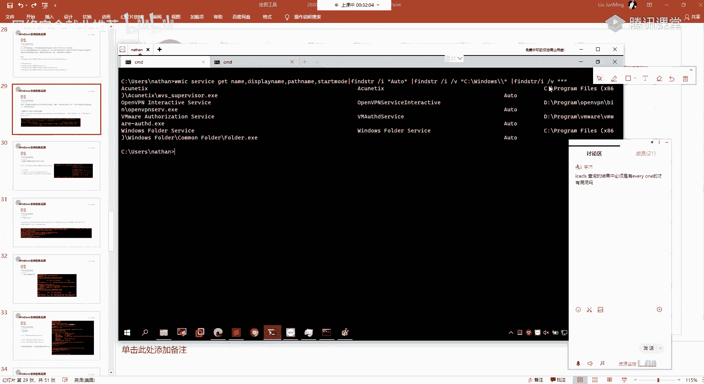

执行之后的话，在这边他有找到这样子的呃，1234个服务对吧，这四个服务的话是满足我们的地点要求，就是它的这样子的一个路径当中对吧，它是有这样子的一个空格是吧，像比如说这边的一个这个。

然后的话还有就这个服务对吧。

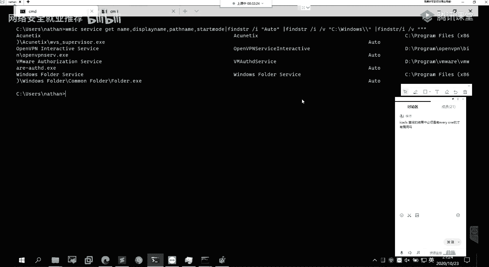

这是第一个，然后第二个的话，我们还需要去一的去通过这个命令。

去检索它的一个目录，它就是说我们是否是能够去进行一个上传文件，或者就是有写入文件的这样的一个权限，就是通过这个嗯嗯，哦比如说这一个，这个不行，这个就这一个目录的话，就是说它的一个空格的话，就在这边对吧。

所以的话你是要去c c盘的一个目，那么c盘目的话，我们普通用户的话肯定是没有权限的，我这边就以这个为例，好呃，这个的话其实就是我们要去找到的这个目录，就是它是有它是everyone。

它每个就是任何用户都有一个，f的一个权限是吧，然后还有对应的就是说有权限去对这一个目录，有f控制权限的话，就是像这个trusted installer，这个的话，它是就是系统内置的这样子的一个呃。

比较高的一个选项，呃这个第一个是我们等会有的这个。

啊不是，就是还有像这种beauty in，就是内置的这样子的一个管理员用户对吧，还有其他的这样内置的，这样子的一些用户它是有权限的对吧，然后在这边的话，因为我们没有这样子的一些权限嘛对吧。

所以的话我们一个普通用的话，我们只能是就是说这个目录它是一个everyone，都有一个控制权限的，那么这个目录的话正好符合符合我们的要求。

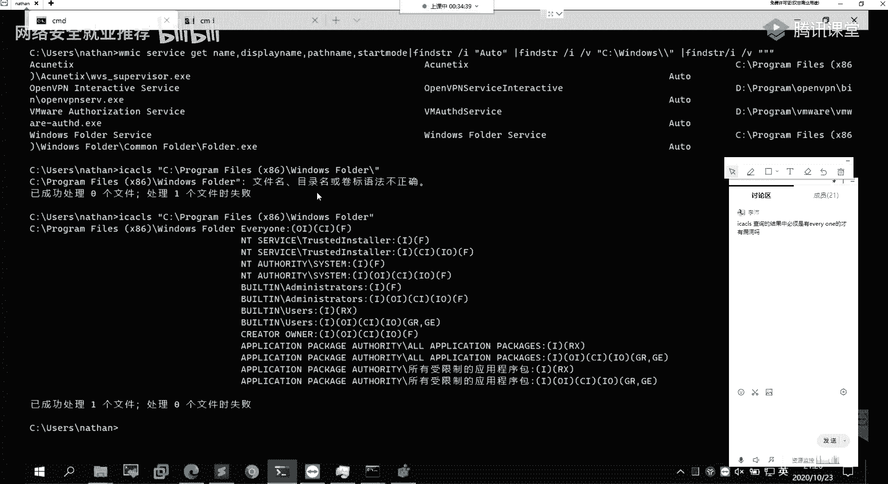

所以的话我们可以去查，可以就是呃像这一个目录去和上传，我们的生成了一个码。

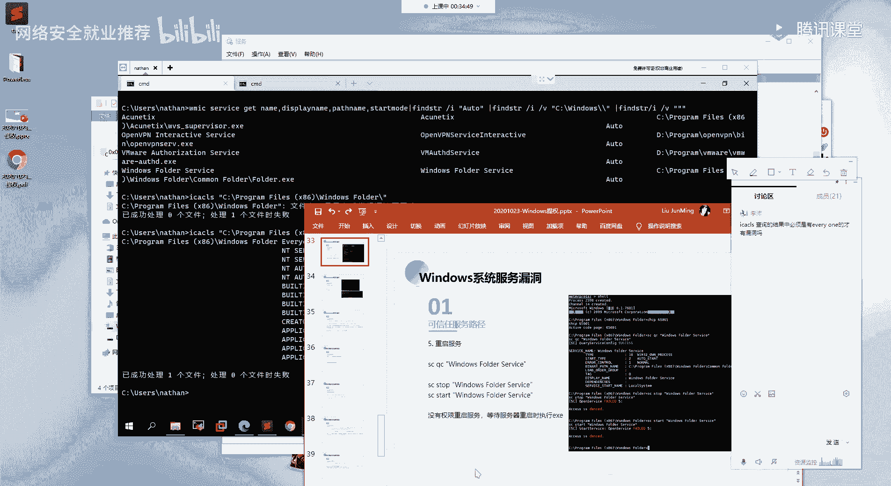

好我在这边的话还有一个要注意的一个点，就是这一个就我们在这边，我们把我们重启它的一个机器对吧，就假设我们把它一个机器重启了，重启之后的话，他会去加载我们这边的一个码，然后的话以色列成文的一个权限执行。

然后执行之后的话，我们在这边的话就能够去得到这样一个shell嘛，对吧，得到这样子的一个需要，对吧，但是的话呃你会你自己去尝试之后的话，你会发现它有一个问题啊，就是你得到这一个码的话呃。

就是它弹回了这样子的一个连接之后的话，它立马会断掉，就是这边的话你断掉之后的断掉的话，它是因为就是说它这边有这样子的一个机制，就是当服务它在windows系统中启动后，它必须要取调和。

windows系统下面有一个服务控制管理器，它需要与它去做一个通信，但是我们生成了一个码的话，只是一个就是反弹shell嘛，来与我们msf的这边的一个服务器做一个零件。

是所以的话他无法去与它去进行一个通向，因为它不是一个服啊，所以的话他会去，就是说他这个关系他会认为是出现了错误，然后把这个进程他会终止掉，所以在这边的话我们需要做这样的一个操作。

就是在他得到需要之后对吧，他执行之后，我们这边接收到了他的一个绘画，接收到了他一个连接，连接建立之后的话，我们立马去做这样子的一个进城迁移，然后把我们当前所得到的这个权限的话，把它迁移到另一个进程当中。

然后迁移到进程当中之后的话，我们就能够去得到一个稳定的一个绘画，得到一个稳定的一个筛选，然后在这边的话，我们可以看到我们得到一个筛选的话，是一个c什么的一个权限，呃这边的话我们可以来尝试一下好吧。

我这边的话以，啊我这边max断掉了。

重新重新弄一下。

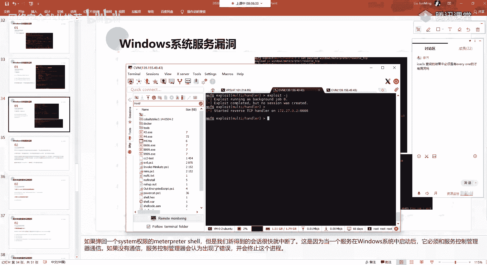

这话我起了一个m4 f的一个服务的，起了一个监听，然后呃，在这的话我模拟一下。

得到一个需要。

只是得到了这样子的普通的一个shell。

肯定卡。

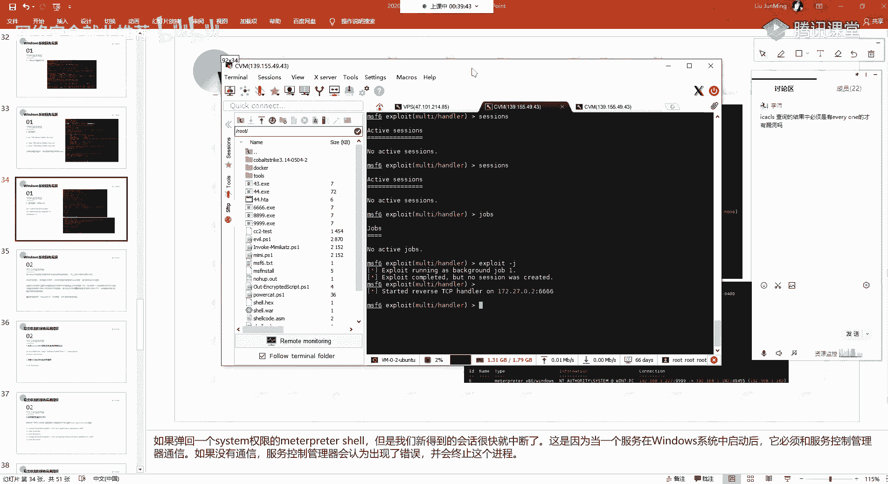

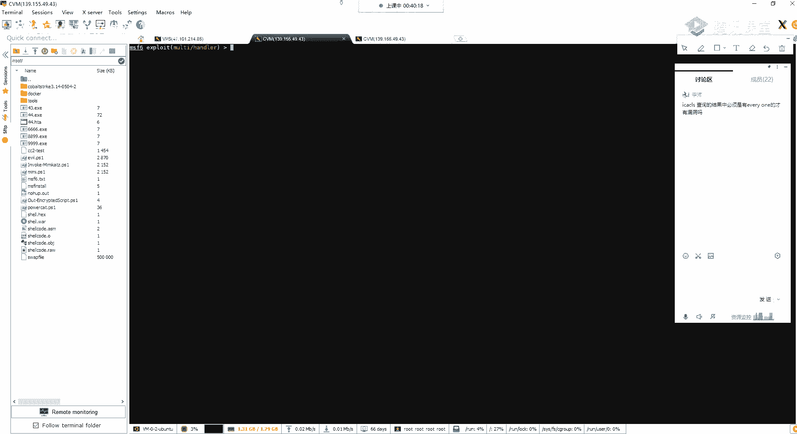

哎呦这po的，拜拜拜拜，我们当起了当前的话得到这样子的一个。

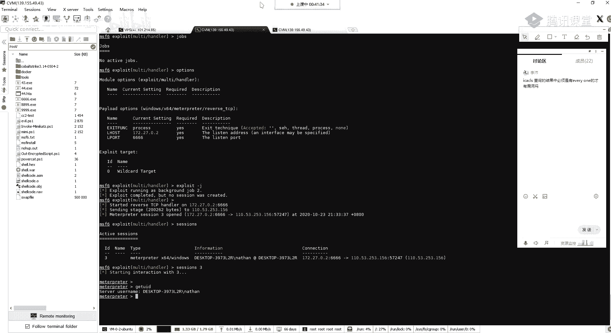

普通用户的一个渲染，就是我这边的话就是模拟，已经得到了一个渲染嘛对吧，我反弹了一个shell，反弹到我们msf上面去了，对反弹上去之后的话，我想要去进行这样子的一个，就是去查找我这边得到一个机器。

它的它是否存在这样的一个漏洞对吧。

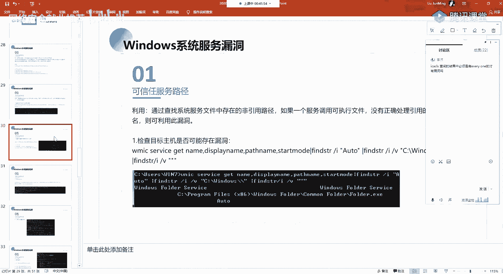

那么首先我第一步的话就是去检查它，通过通过这样子的一个命令，对吧，我去执行，执行之后的话，找找到这样的一个找到这样子的一个服务路径，还是，咳咳，输入键的话就是，背一个对，然后的话判断它的一个权限对吧。

发现它是符合我们的要求的，而这个时候的话我们就可以去尝试去啊，上传我们的一个码啊。

我这边的话，我这边的话，嗯我这边的话还是以这边的这个吧，就是我就不我就不重新生成了，我就以这个我这边之前已经生成了这个。

就是这样子的一个路径对吧，呃我把它copy，我把它copy到这一个目录下面去，就是嗯那个，嗯嗯好，这样的话现在的话已经copy copy copy过去了，对吧啊，我们可以查看一下这个目录，咳咳。

大家要注意的话，就是呃就是这种中间有空格的，这种中间有空格的话，你需要用引号去做一个包裹，就这边的话是他出错的一个原因啊，然后可以看到我这边的话已经扣过去了对吧，好call过去之后的话。

呃啊我这边其实还要改一下名字，就是我们要改成这个common 0 x一对吧，好现在的话已经改改改。

改成了对吧，改成了之后的话，我们下一步的话，我们下一步下一步动就是需要去重启服务的，但是重启服务的话。

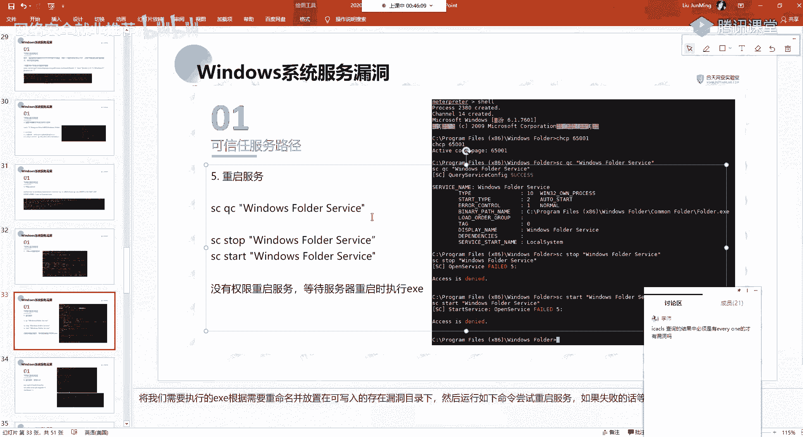

我们可以来看一下这个服务啊，我们可以通过这个命令去查看对吧，查看的话他的这个服务的一个路径是吧，然后的话我们在这边的话，我们想要去通过sc去啊，比如说我要stop掉，我要去填子这一个。

然后呢你会发现的话。

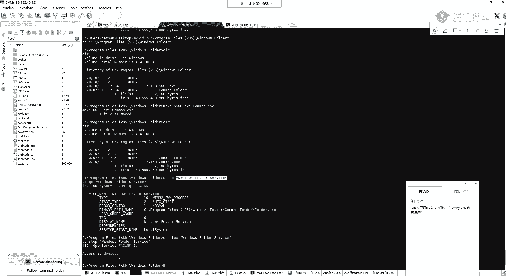

他这边是没有权限去那个的对吧。

呃其实。

好我下面的话我为了演示，就是我我就不重启我这边的这个机器了啊，然后我这边的话我就通过这样子的一个方法，我去用一个管理员的一个账号去模拟，就是重启这个服对啊，就是你需要去等这个服务。

你要以那个你要去等他去进行一个重启，你重启服务，你只有他它的一个服务重启之后，你才他才会按照我们前面的那个特性，去进一个加载对吧，当然你也可以说就是你让他系统，因为我们前面看的话，它是一个自启动的对吧。

那么你可以重启它的一个系统，让他的一个系统去进行一个支持，然后的话它系统自启的话，那么我们它的服务它也会趋近一个支持对吧，好这句话，我们。

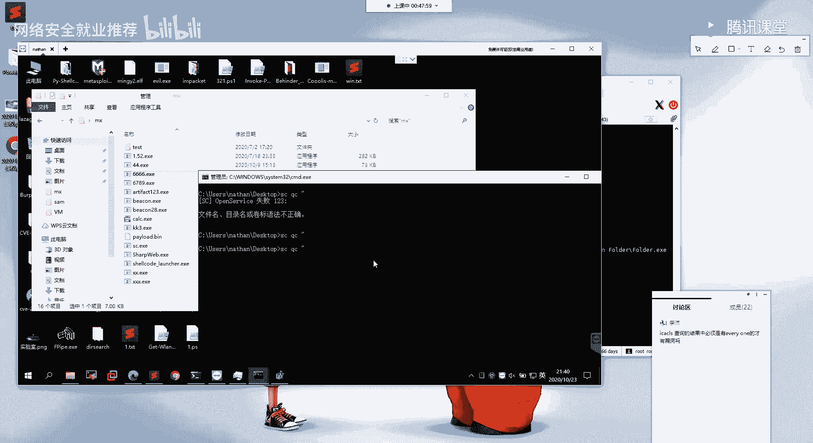

呃我这边的话要我先退一下，哎我这边的话没有尽力的那个jb，是我这边还需要再再去，再去进行一个jobs对啊，这边的话，因为我刚刚就是我没有去设置那个选项，在这边也说一下，就是呃你这边的话。

前面我们这边对吧，我们建立了这样子一个监听，用这个handle模块建立监听，建立监听之后的话，建立监听之后的话，它等待我们的一个pyl的链接对吧，我们那个网连接连接之后的话，他这个job它就会断掉。

也就是他建立连接之后的话，这个任务的话就已经完成了对吧，然后其实我们可以在这个，在这边有个高级选项，就是这个这个把它改为改为force，也就是他这边他尽力筛选之后的话，他不会退掉，就是这边的一个job。

我这边还没有那个没有去设置这个选项，所以的话呃尽力筛选之后的话。

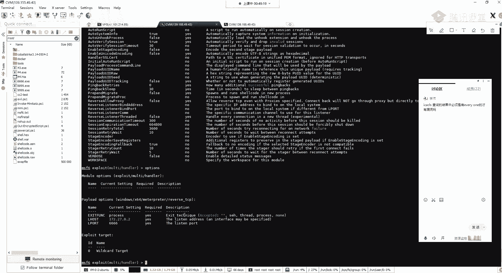

他这边就会断掉，我不是他会那个job就没有，然后我这边还需要去啊，今天一个，然后的话，我这边的话就模拟我这边的一个服务区，进行一个重启嗯。

哭了。

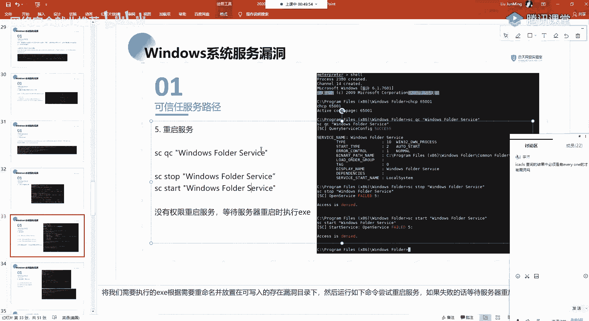

就这一个服对吧，然后我当前的话我去做一个stop停止调查，我去停止这个符是吧，然后停止之后的话，我再去启动它，so start。

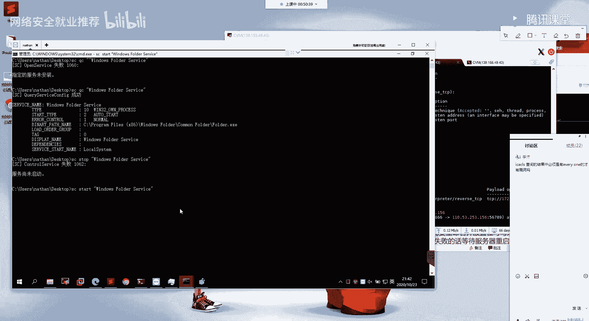

然后我这边启动之后的话，你会发现对吧，我这边的话立马就得到了这样子的一个筛选，筛选四，然后我这边切到这个筛选四，你会发现的话，他这边得到一个权限，是一个system的权限对吧。

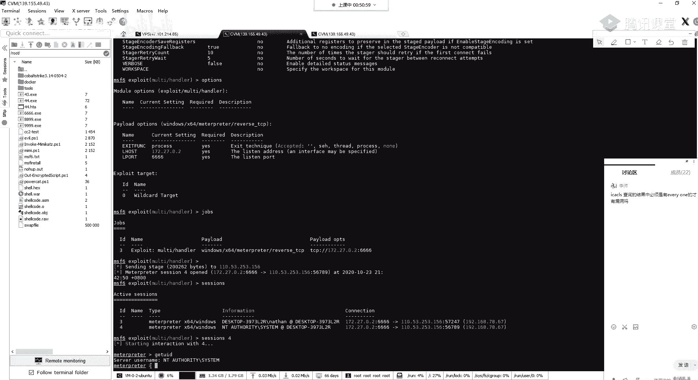

就是一个system的一个权限，然后我这边的话，谁放的没关系啊。

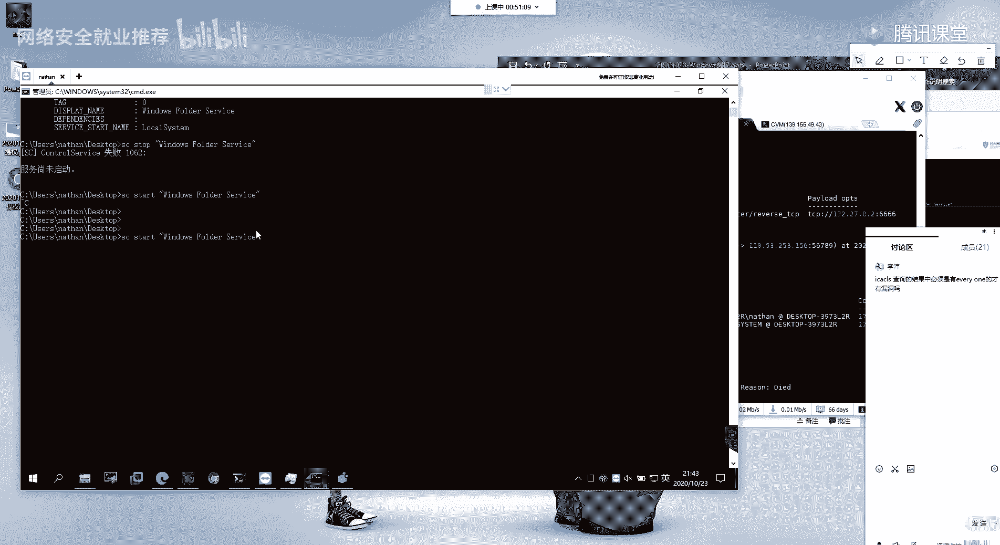

然后你会发现，就是这边的话它呃我这边执行之后的话对吧，我这边的一个绘画的话立马就断掉。

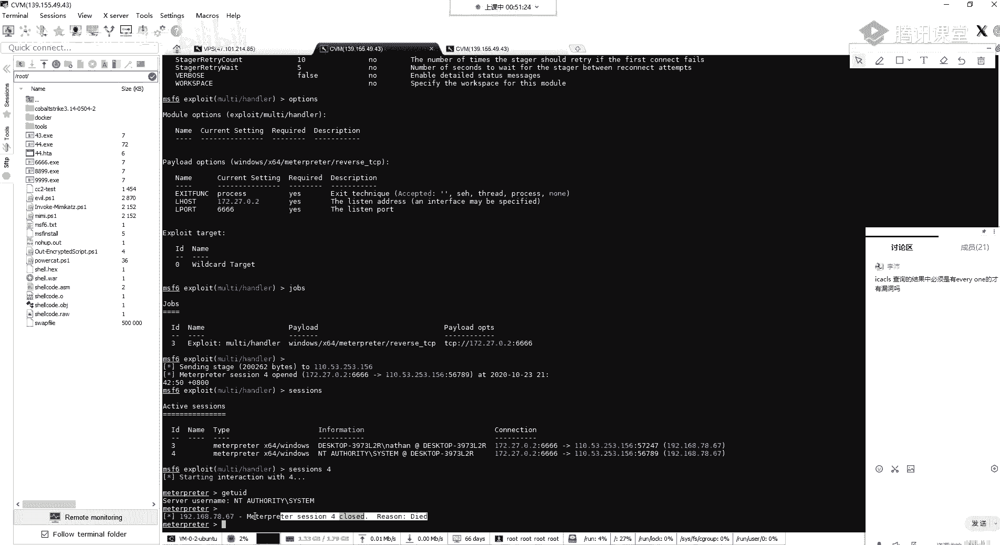

断掉的话它的一个原因的话，就是我们这边的这个机子，就这边前面所讲的那个呃那个机制，我这边还会断掉，就是因为我们这边的执行的这个common 0 x一的话，它其实不是一个服务。

然后的话他会就这个服务控制管理器的话，它会终止掉这个进程，所以的话我们需要再去精听的时候，去做一个这样的一个设置，就是在得到这个绘画的话，它会立，它会自动的立马再去执行这样的一个迁移进程。

就把我们当前的一个漫画迁移到它的一个系统，上面的一个啊，其他的一个进程，然后的话我们就算我们这边的这一个啊，筛选断掉了，那么我们迁移到那个进程的那个绘画，还是会一直存在的对吧，只要那个进程它不断掉。

然后我这边话我就不设置了，我就不重新那个了啊，然后在这的话我们看我这边的一个截图，就是他会在这边对吧，他得到这个绘画之后是选id 6，然后它会自动的去做这样子的一个，migrate gf。

也就是它会自动的去迁移到一个进程当中，然后的话他会得到这样子的一个呃绘画。

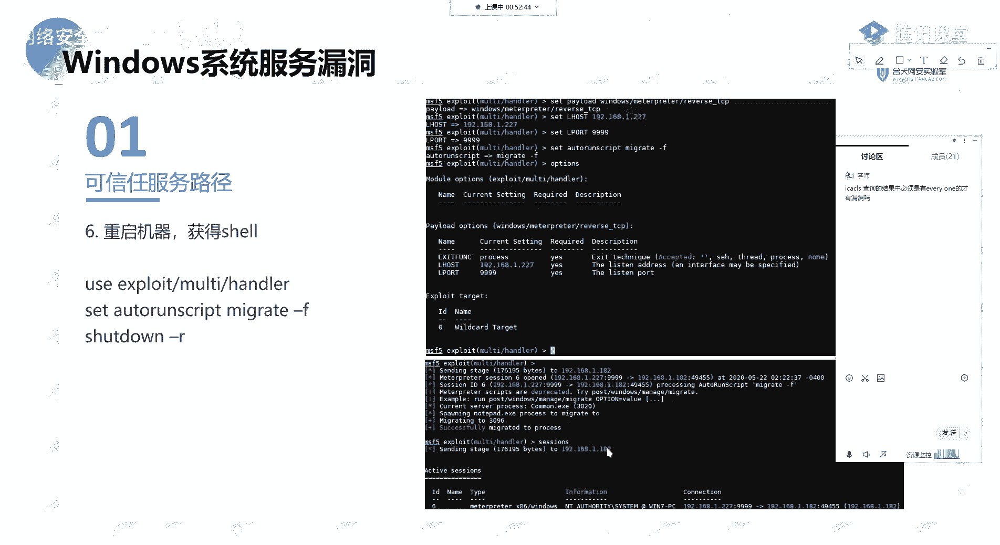

这是一个就是呃去利用这样子的一个可信，服务路径的这样子的一个漏洞，来去进行一个提前好呃，第二个的话就是这个不安全的服务权限，呃关于这个不安全的服务权限的话，这个的话呃我这边用文字做了一个解释。

我们主要的话就是看这边就看这里，就是说我们的这样子的一些啊，像比如说我的一个java的一个升级程序，像这种程序的话，它的它是它的一个系统服务程序，它在加载的时候，都是运行在我们的一个系统权限上面的。

然后呃像这一类的这些程序的话。

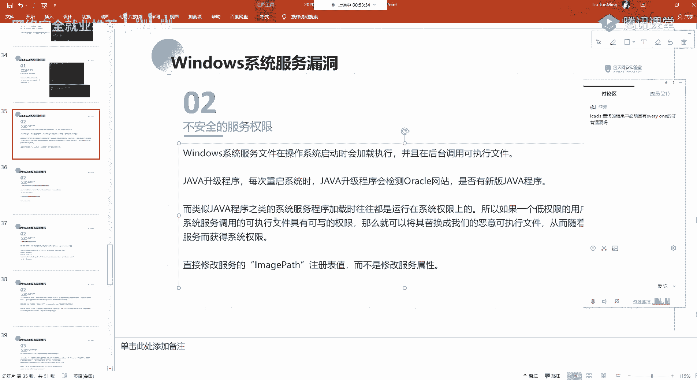

他以一个系统的一个权限去进行一个运行对吧，那么如果我们一个t权限的一个用户。

然后对于这类的这种系统服务，调用的这种可执行文件，具有一个可写的一个权限，那么我们可以将其替换成我们自己的一个，2e的可执行文件，然后的话它就能够去随着系统的启动，然后的话来得到它的一个系统的一个权限。

然后在这边的话，我们是通过直接去修改服务的这样子的一个啊，image path的一个注册表值，而不是去修改它的一个服务属性，就其实呃，我们具体来看一下这样子的一个步骤吧，首先的话第一个就是第一步的话。

我们利用这样子的一个工具来去检查，易受到攻击的这样子的一些服务啊，这一个工具的话就是它的一个呃，它是那个windows系统的一个啊工具套件里面的，然后在这些工具的话，它都是windows系统啊。

不都是温微软，微软的这种官方的这样子的一些工具，它是对啊，一些就是对我们windows系统下面的一个，就是作为一个工具箱吧，做一个工具箱，它提供了就是一些啊，其他的一些啊，呃就是怎么说呢，看。

啊预习内容里面有，就是这个一个工具套件，我是瞎的，就是这个这个的话它是嗯就是一些应用程序啊，它的一个应用程序的话，它是就是呃用于他每一个工具的话，它有对应的这样子的一个功能，然后它的这个功能的话。

它是用于就是啊解决啊，windows系统上面的一些问题的这样子的一些工具啊，就这种故障排除工具，然后的话它汇总到了这个套件当中，这个套件当中的话，它有存在，有很多的这种可执行的一个呃应用程序。

就是像这样子，这这边的话就是它的一个核心程序的一个套件，然后它每一个程序的话它都有对应的一个功能，然后在这边的话就是我们用到的话，就是它的这个我们用它的这个工具来去检查啊。

就是容易受到我们这边的这一个啊攻击的，这样子的一个服务，然后这边的话嗯来看一下，我这样的话我就不去，我直接在这个系统上面去做这样的一个操作，就其实际的话，我们首先第一步的话需要把这个工具对吧。

通过我们这边得了这个绘画，我们这边得到快画，把它上传到他的个，上传到这边的一个系统当中对吧，然后的话我们再去进行一个执行。

我这边的话为了就是搞快一点。

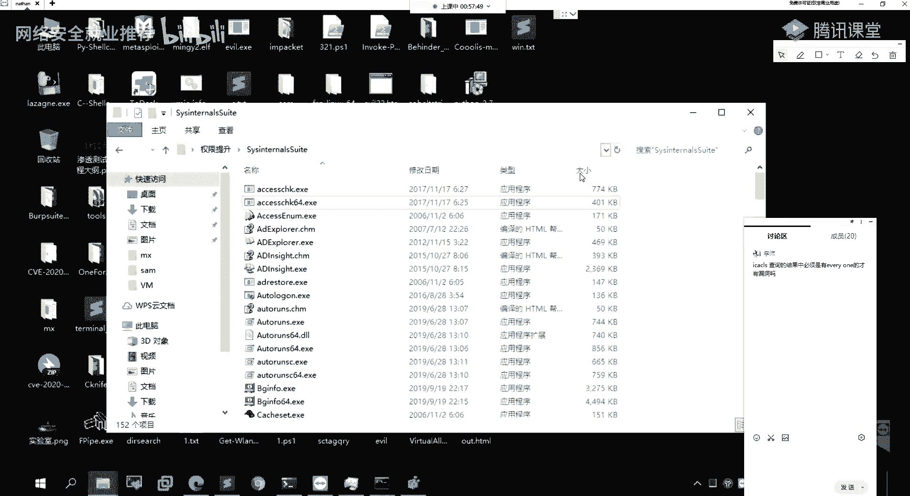

我直接在这边执行对吧，然后执行之后的话，他会有这样的一个信息，这些信息的话，其实我们主要找的话就是这一个。

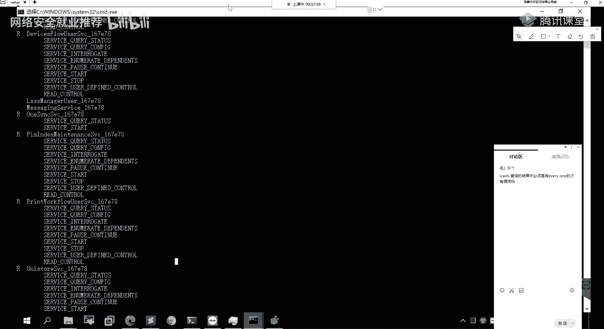

就这一个service or excess，就是这样子的一个属性。

然后其实在这边的话，它也列出了这样子的这么多的这一些啊，这些服务对吧，它对应的这样子的一些啊权限，像比如说seventh query state等等的这样子的一些啊，stop start。

然后在这的话我们主要要找的就是这个service or x。

关于这个的话就是，这边的这一个啊，这里这里这边的这个service ox的话，它意思就是我们对啊，我们的这个服务它的一个属性，它拥有一个完全的一个控制权，然后还有就是呃，还有就是这个order啊。

这个oc选题的user它是指纹的，是系统当中所有的一个用户名密码，这一个就是账户。

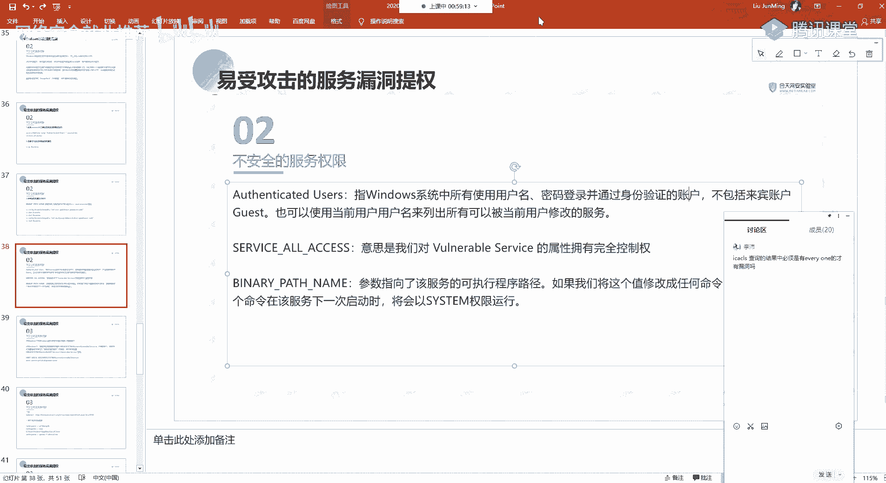

这有点多，然后还有第三个。

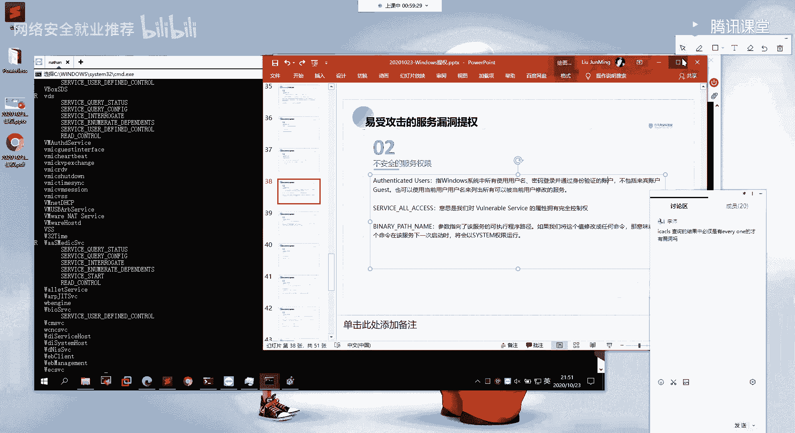

第三个的话就是这个binary path name，这个的话就是这个参数，它是指向该服务的一个可执行程序的一个路径，然后我们在这边的话，就需要去知道它的一个这样子的一个路径。

然后的话我们在这边其实就是要改的话，就是改的这边的这个binary space name，就是我们将它的这样子的一个属性，把它更改成任意的一个命令，然的话我们再去启动这一个服务的时候，他就会去启动，它。

会去找到这边的这个bba name，就原本的话它是一个可执行程序的一个路径，它会去啊启动它对吧，然后在这边的话，如果我们把它改成命令之后的话，他服务启动的话，它就会去执行我们的一个命令。

而且它是一个session的一个权限去进行一个执行的，然而在这边的话，我以这边的这个就是我以这边的这个a c e n，e t i t x的这个为例，就这个的话是呃a w vs的这样子的一个服务网。

服务名。

而我通过啊s c q c就是来去查看，来去通过这样子的命令去查找这个啊，a单流院士这个服务对吧，他的这样子的一些信息，那前面其实也有说了对吧。

像他的一个set type就是what is that就自启动的，它是随着系统启动而启动的啊，啊主要的话就是关注这边的一个binary pathname，这个的话，这边的话就是表示。

是我们这边的一个可执行程序，它的一个路径，就其实这边的这个呃这个服务啊，这个服务它的一个好执行的一个程序的话，是这个也就是执行这个程序的话，它会有它会启启动为这样子的一个服务，然后呃这边的这个程序路径。

就是这个启动的一个文件名是这个对吧，然后我们在这边的话。

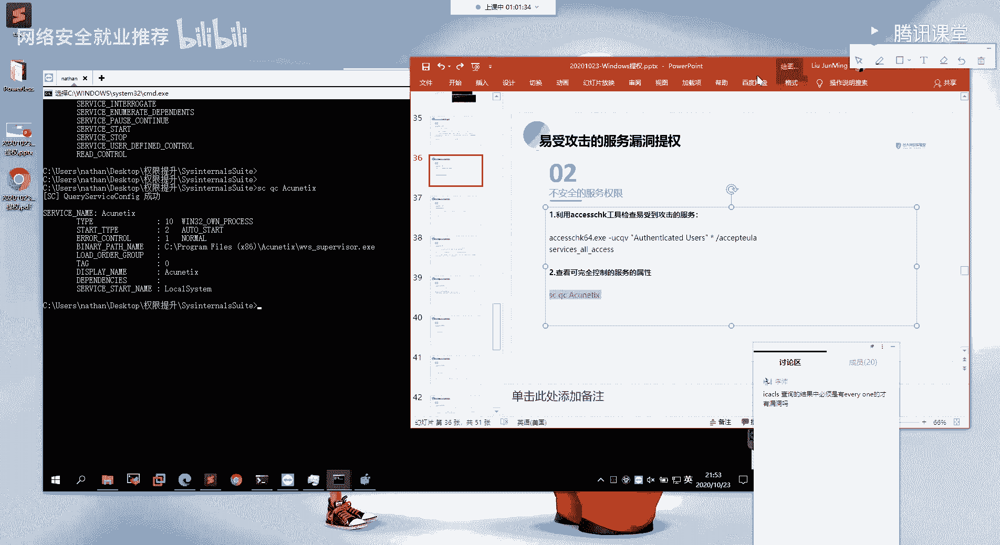

就是说如果我们找到了这样子的一个啊，找到了这样的一个服务，就是比如说就是这个服务，然后的话所有的一个service box，也就是它有这样子的一个属性，那么它有这样子的一个属性的话。

那么我们就能够去对这个服务的一个属性，拥有一个完全的一个控制权，也就是我们当前是一个普通用户对吧，我一个普通用户，我也可以去更改它的这样子的一个属性，也就是这边所列出来的这样子的一些属性。

然后在这边的话它还有就是一个地方的话，就是刚刚说的对吧，我们改这边的这个值的话，这个参数的话我们可以把它改成命令，任何的一个命令，它启动服务的时候，它会去进行一个执行，那么实际的我们实际的一个利用的话。

我们实际的一个命令的话，就是我们可以把更改它的这个服务配置，然后的话去进行一个命令的一个执行对吧，原本的话它是指向的这个程序的对吧，我们在这边通过sc来去对它做一个配置。

又更改这个服务它的一个being pass，注意的话这边的一个bin pass的话，它是其实就是指向的，就是这边的这一个，finally pace name，它的这个参数它所对应的那一个纸的话。

就是这边就这一个being pass，好，我们把它更改成像，比如说在这边更更改成为一个net y，来去添加这样子的一个update user的，这样子的一个用户对吧，然后的话对它做一个启动。

就是给它做一个服务的一个重启，然后这边的一个服务重启跟前面也是一样的，就是我们就是你普通用户的话，他没有权限去进行这样的一个操作，所以的话你需要去呃等待这个服务的一个重启，或者是呃重启它的一个系统数据。

因为它的一个服务，它是随着系统的启动启动的，呃当然的话，其实像这边去添加这样的一个用户的话，是比较繁琐的对吧，好，我们其实实际的话可以，就是我们前面的话已经上传了，上传了一个那个可执行的一个程序对吧。

然后我们其实可以在这边把它，把我们的一个命令改改为，就是启动那一个，我们的那个木马的那个文件对吧，那么他重启服务的时候对吧，他就会去启动我们的那个码，找到我们的那个码去执行。

而且是一个系统的权限去执行的，然而在这边的话呃。

所以这个为例啊，主要的话就是两个演示一下吧好吧，然后我这边的话已经更改成功了对吧，然后注意的话我当前是以管理员用户去那个的，就是呃我中间的话我就因为我这边的话，这个服务的话，它其实是假设。

他假设它是存在这样子的一个漏洞的对吧，因为实际的话它其实是没有的，呃，为了给大家演示嘛，就是，然后我这边的话就以管理员的权限去更改它，然后更改之后的话，我在这边去啊进行一个重启，就是啊。

首先的话net user去查看一下，我这边的话是这些用户对吧，然后我去通过sc去，他说我先停止掉这个符，我只要这一个，啊已经停止掉了，然后的话呃我再来去启动啊，启动之后的话，他有这样子的显示失败了呀。

我们可以通过nt柚子来去查看一下，然后其实我们的那一个就是就跟前，其实前面一样的一个意思嘛，因为我们这边的话更改了他的这个bin path，也就是更改了这边的这一个属性，然后他是这样子一个命令。

而不是我们的那个可执行程序的一个路径了，对吧，所以的话在这边的话。

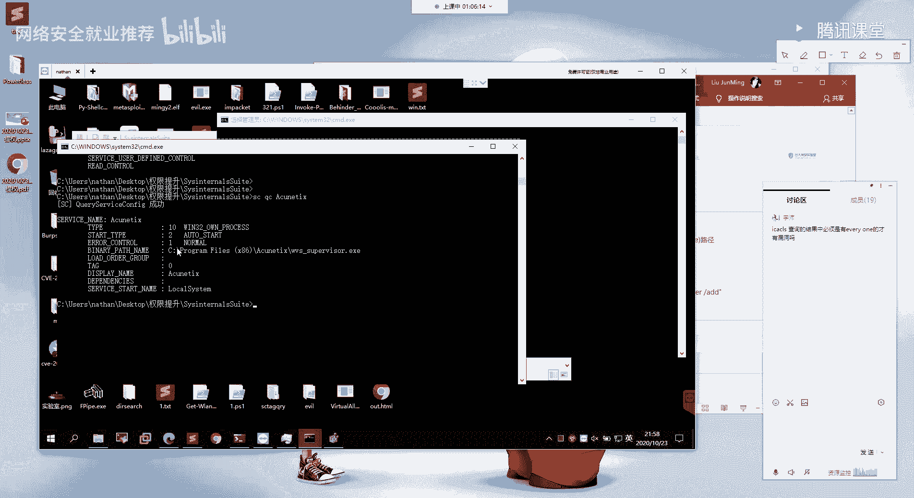

而不是这一个对吧，这边记一下。

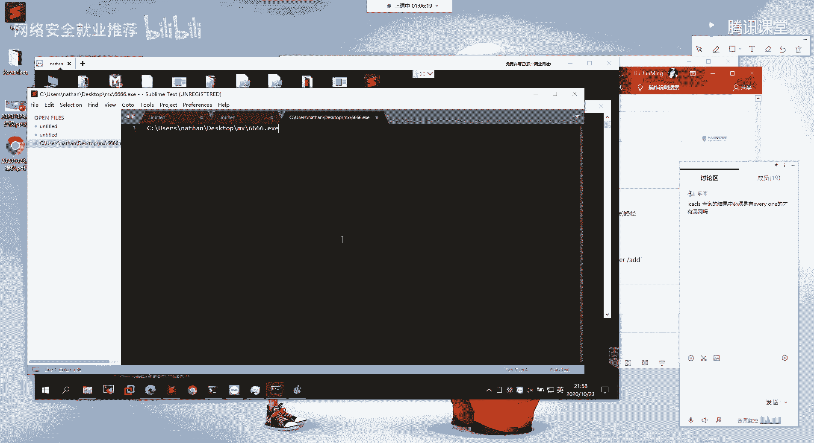

所以的话他在这边的话，它会与去控服务，他没有去响应启动啊，控制的一个请求，也就是没有与我们的那个控制管理器，去进行一个那个嘛，但是实际的话它其实是已经执行了，我们这边的一个命令对吧。

还添加了这样子的一个用户，对吧。

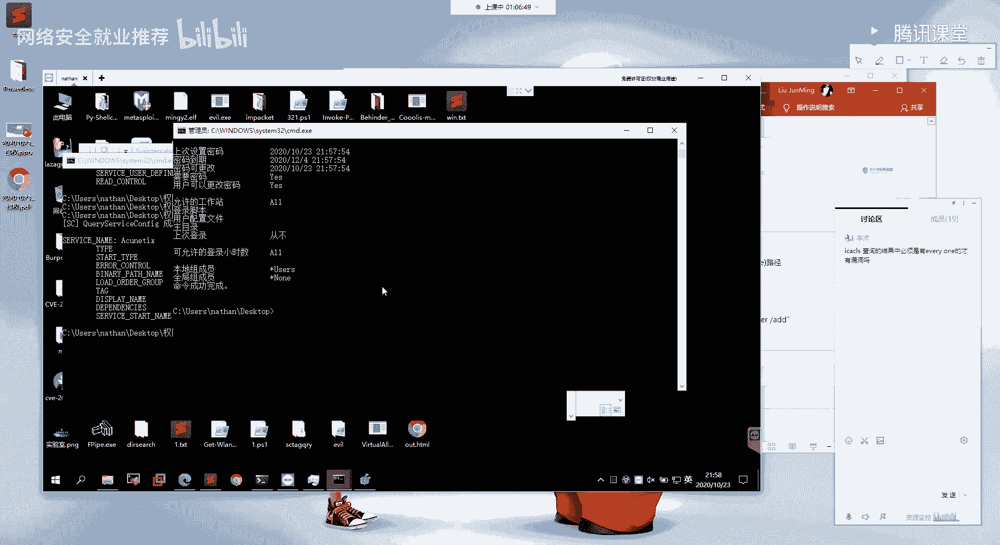

然后的话，我们可以把它添加为一个管理员的用户，这边的话我就不再操作了，好，以及我们可以就是把它改成又启动我们的那个，启动我们这边上传的这个码对吧，然后的话我们就能够去在msf里面去得到一个。

sm的一个需要，这是第二个，第三个的话就是不安全的一个注册表权限，关于注册表的话，大家呃了解吗，然后的话如果大家不了解注册表是什么的话，呃这边的一个预期内容里面给了这几个链接，大家去看一下。

这边的话他详细的介绍的就是注册表的一个，大概的一个信息，就注册表的话它是呃它是windows系统，windows系统里面的一个核心，就是你可以把它理解成一个数据库，而这个数据库里面的话。

它就是包括了有这么多的一些信息，就是你windows系统里面记录这种，你呃软件的一个安装对吧，硬件硬件的一些设备的一个信息对吧，软件信息，还有你的一些管理的一些配置信息，网络设置等等的这样子的一些信息。

他都记录在这样子的一个注册表当中，也就是这样子的一个数据库当中，他他的这样子的一些比如说呃设备硬件，设备的这种说明啊，状态信息数据是吧等等，这些信息他都记录在这个注册表当中。

然后注册表当中的话有这样子的啊，分支分支结构，然后呃其实注册表的话大家可以呃温加，然后ig beat it，打开这样子的一个注册表的一个编辑器啊，然后我们在这边的话就能够去看到。

所有的这样子的一些注册表的一个分支，在这边的话总共的话有这样子的五个分支对吧，跟这边的话是一对应的，然后这五个分支它分别对应的一个作用，在这的话我就不多说了，大家自己了解一下好吧。

然后以其他的一个注册表的一个，存储的一个方式啊，呃主要的话就是，嗯它的一个结构吧，在这边的话了解一下注册表的一个数据结构，首先第一个它就是根茎，主要就是五个，其实就是我们前面说的五个那个分子。

它的一个名字就是它是一个跟进，就是这边这五个是五个跟腱是吧，然后的话只见直径的话有多个子键，还有净值项，就像一个目录当中有多个子目，还有多个文件对吧，我们随便打开一个跟进。

它下面的话有这么多的一个指向直径对吧，比如说这个这个直径下面有这一些对吧，就相当于就是这个目录下面有这些目录嘛对吧，然后的话静静直向，进直向的话就是我们的这一个键键，比如说我这一个键对吧。

他这一个键下面的话就有这样子的一些进直向，就是他由这样子的三个部分组成，名称类型数据对吧，这就是禁止向，然后的话我们大概的了解了什么是注册表，之后的话，我们来看一下，就是在windows当中。

与我们服务相关的这样子的一些信息，它都是存储在这样子的一个注册表象当中的，就是这个，然而在这边的话，还要就是说一下这个这边的这个l k l m对吧，然后这边的一个l k m的话，它其实我们可以看到。

我刚刚的话是直接复制的对吧，呃复制的这样子的一个那个，然后其实你回车之后的话，他其实跳转到的是这个hk logo啊，match是吧，就其实他的这个l k m的话，就等于这边的这个这个跟腱。

就这个这个跟腱，然后他的这个写法的话，它就是hk的话就是h key嘛，然后的话local就是取得l以及lm以及m对吧，就取代它的一个首字母，就表示这样子的一个跟腱，然后我们在这边的话呃。

可以看到就是在这一个指向指针下面，那这一个service这个指令下面对吧，他有这么多的一些呃，这样这么多的一些直径对吧，然后在这边的话它存储的信息的话，它其实就是我们的这样子的一些服务，服务的一个信息。

就是我们这边的这些服务的一个信息，像比如说我们找到那个呃，我们刚刚的那个，啊我这边没有，现在在我这边，就是啊你同样的还是以这个对吧，我们找到这个符，然后这个服务的话它的这个直径对吧。

它的一个净值静止的话就是这一些禁止项，然后我们可以看到这边的这一个对应的，一个信息，它其实跟我们前面通过sc coc去查找了一个信息，他其实对应的是吧，然后在这边的话。

我们可以看到有这样子的一个image path，这个image pass的话，其实我们前面的话改的就是这边对吧，我们改的这样子的一个那个属性，它的一个参数的话，它的一个值的话。

它存储在了这一个image path的这个名称，就是名称为image pass，它的一个它的一个值的话就写到了这边了，对吧啊，其实我们重启这个服务的话，它就是它会去执行这样子的一个命令，然后的话其实呃。

就是我们可以在这在这个注册表当中去查找，这样子的一些服务的一个信息是吧，然后的话如果呃，就是说如果他他的这样子的一个注册表的，这一个呃，这边的这一个，就是说他的这个注册表。

我们是有权限去进行一个更改的对吧，就其实像比如说在这边，我们其实刚刚改的这个东西，它其实也存在了注册表当中对吧，我们更改了这个binary pay，binary p对吧，然后的话它改的这个值。

它同样都是存储在这个注册表当中，那么我们如果说有对这个有对这个服务，它的这个注册表，这些净值向有操作了一个权限对吧，那我们可以直接更改这边的这个image path对吧，我们可以直接去更改它。

更改这边的一个呃它的一个数据更改，我们为我们想要的这样子的一个命令对吧，那我们同样的能够去实现前面的那个啊操作，所以的话在这边的话我们需要去找到，就说我们要能够去对这样子的一个呃，某一个服务。

它的这个这个注册表，它的一个净值的话是有权限去做一个修改的，是，所以的话我们需要去找到对应的，这样子的一个权限，就有权限去操作了这样子的一个服，然后这边的话我们需要去啊，经常就会用到这样子的一个工具。

就这个subur，a s l的这个工具，s u b s l的一个工具，这个工具的话它它是能够去呃紧锁，就是说服务啊，它是能够去检查我们的一个注册表的，这样子的一个权限，通过这样子的一个工具。

能够去检查注册表现的一个权限，如果对注册表象我们有写入权限的话，那么我们可以直接去编辑这个image page的一个值，来去更改服务的一个可执行路径，然后注意的话在这边其实在这边啊。

这一个不安全的注册表权限，跟前面的这个不安全的服务权限，其实大家要分开啊，就我这边的话，其实有特意给了这样子的一句话是吧，呃这边的话说反了吧，这边的话应该是就是说我们这边修改的话。

是他的修改的一个服务的一个属性是吧，这个应该是在后面的，应该放在这边，就是我们这边的话是呃，直接通过修改服务的这个，image path的一个注册表值吧，就我们找到我们有这个权限均一个修改。

然后呃不是去修改服务的一个属性，就是前面这边的话，是我们找到这样子的一个服务，他这个服务的话，我们有对它的一个属性，有一个完全控制的一个权限，所以的话我们可以去修改它的这样子的一个啊。

服务的一个属性对吧，然后在这边的话就是说我们找到这样子的一个，能，我们普通用户能够有权限去进行一个，对他的一个注册表去进行一个编辑的，这样子的一个权限，也就是一个写入的权限。

然后的话找到它对应的这样子的一个服务，那么我们就能够去修改它的这个image path的一个值，来去达到跟前面一样的一个效果的一个操作，然后具体的一个方法，首先的话我们通过这个工具嘛。

我们需要去查找他的这样的一个权权限嘛对吧，然后其实查找的话就是这一个啊服务下面的，这样这样子的一些服务的一个权限对吧，然后其实在这边的话，我这边还是以一个variable service。

就是表示呃能够被利用的这样子的一个符啊，其实我们要查找的话，就是要去查找，这边的这个service这个直径下面对吧，这个指针下面所有的这些服务，它它的一个权限，然后的话如果我们找到了这样子的话。

我们就能够去进行一个啊更改，然后更改的话我们可以通过i g a的，就是说在命令行下面的话，我们可以通过这个方法来去进行一个，注册表的一个修改，然后的话呃在这边的话，我同样的以这个为例。

就是我通过啊修改这一个a c a c u n，这个a w vs这个服务它的这一个净值，呃我们来看一下这个完整的一个命令，就是这样子的啊，我这边的话是通过这样子的一个方法，就是首先msf生成一个au。

这样的一个可执行文件，当然你也可以生，可以生成一个反弹shell，是然后的话上传到目标区上面，这个生成的这个a的柚子的话，它的一个功能其实就是一个单一的一个功能，它的一个功能的话就是呃添加一个。

就说他执行之后的话，他会在本地添加一个账号，添加一个我们这边生成的时候，指定的这样的一个账号，然后的话呃，我们这边的这个命令的一个意思啊，我们来看一下，首先这个杠t的一个选项。

就是表示我们的这边的这个啊type，因为其实前面的话我们有说了，就是净值项的话，它有三个部分对吧，就是它的一个类型，它的名称以及它的一个啊，参一个那个就是它的一个数值对吧，数据。

然后在这边的话就是杠七的话，就表示它的一个类型，我们可以来在这边来看一下，啊就是类型，我们可以看一下这个image past，它的一个类型就是这个对吧，我们可以看一下，就这个。

然后我们指定的一个类型的话，就是这个因为我们要改的话，就是这个image pace嘛，就名称为这个的，就干预的话就指定我们的一个名称，干低的话就是指定我们的一个数据，就我们这边的一个这边这边的一个数据。

然后我这边的一个数据的一个值的话，就更改为了，我们这边所上传的这边的这个a的柚子的这个，可执行程序的一个路径对吧，然后我们通过这样子的一个，因为我们以普通用户也能够去更改它的，这样子的一个注册表对吧。

那我们这一个命令的话是可以去执行的，然后的话更改为了它的一个image path，为我们这边的一个木马，然后当这个服务它去进行一个重启的时候，他就会去，就是说它会进行这样子的一个啊加载。

它会去加载我们这边的这一个，重启之后的话呃，我们的这个程序，它会以一个系统的一个权限执行，就同理的话生成反弹需要的一个po的话呃，要注意去设置自动的一个清理进程，呃这边的话这个我就不不去操作了好吧。

然后呃第三个啊，还有的话就是一些特殊的一个注册表的一个，像啊一些键值呃，在这的话就是这个auto run out to run的话就是自启动，就其实呃就其实大家可以啊，右键这边的一个任务管理器对吧。

然后在这边有一个启动启动，这边的话就记录了有这样子的一些东西，在这边的话就是我的这个当前计算机的一个呃，自启动的一些像，然后这边的这些项的话，它其实就记录了，记录在了我们的这一个这些的注册表当中。

那比如说这边，我们打开这边打开这边的话，可以看到在这边有这样子的一些呃静止，像对吧，有这样子的一些禁止，好像比如说everything，还有我的这样子的这个程序啊对吧，它是一个自启的，就它记录在了这边。

然后记录在这个注册表象下面的话，有什么作用呢，就是说它会随着我们的一个系统的启动而启动，然后的话所以我们，如果说我们能够去像这样子的一个镜子下面，去写一个这样子的一个程序对吧。

那么我们就能够去在它的一个起程序，它在它的系统每次启动的时候，他都会去执行执行一遍，我们的那个呃呃我们的那个可执行程序对吧，那我们就能够去得到对应的一个权限，好像在注册表当中的这种自启动项的话。

我们也通常用来做一个权限的一个位置对吧，然后还有呃第四个的话就是不安全的一个文件，文件夹的一个权限，呃关于这个的话，这个跟前面那个就是啊，就是不安全的一个服务器的话是比较相似的。

它的一个就是我们同样的就是，就是说我们利用的是他的这个服务，它的这个呃可执行程序所在所在的一个路径，我们是啊有这样子的一个权限的对吧，我们可以去做一个修改，那么我们可以尝试直接替换，它的这个可执行程序。

就比如我们可以简单的用这样子，这个反向pd来替换我们这边的这个路径，下面的这个可执行程序文件是吧，然后的话它启动服务之后的话，我们就能够有一个system的权限，这边的话跟前面类似啊。

就是啊我们要检索的这个文件夹的一个目录，它就是这个对吧，就是这一个可执行程序路径所在的这一个目录，下面我们可以尝试去把它的一个核心文件，把它替换成我们的一个，把它写了一个payload，好啊。

以及第五个呃，也是最后一个了，第五个的话就是这个always in store vt，在这边的这一个呃提前的一个利用的话，它是就是说利用的这个利用的这样子的，一个权限。

就是任意用户以这样子的一个nt system的权限，去安装这个msi，当然的话呃前提的话就是你开启了这样子的，就是说你的一个目标系统，它是开启了这样子的一个权限，开启了这样子的一个策略。

就这个always install vt，如果说开启了这样子的一个策略设置的话，那么就是说在windows系统下面，我们通过这个msi好不好。

通过这一个windows的音installer去安装这样子的一个啊，msi的这种文件的时候，他就会去啊，以一个system的一个权限去进行一个执行，所以的话如果我们发现了，有这样的一个设置的话。

我们可以就是使用这样子的一个方法，就我们直接用msf去生成一个这样子的一个，msi的一个文件，然后的话我们来去进行一个执行，我们以普通用户的，我们以普通用户去执行这样的一个msi，那么他再去安装的时候。

它会以一个啊系统，一个系统的那个权限来去安装，然后的话我们生成这个msi的话，开呃包含我们的一个啊木马木马后门对吧，那么我们的一个木马的话，它就会以一个系统的一个权限来确定一个执行。

关于这个策略设置的话，就是我们可以通过这样的一个方法来去判断，就是我们通过i g curry来去，主要的话就是查看它的一个注册表，现在这里，它的一个呃名字是这个。

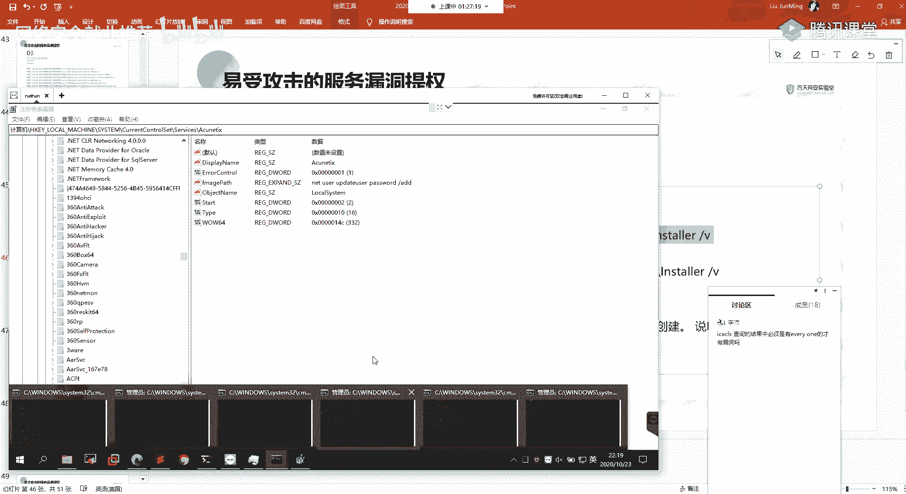

然后的话呃我们这边执行之后的话，他在这边的话有这样子的一些返回返回值对吧，在这的话，其实它返回的话，就是我们的一个那三三个部分对吧，我们的一个名字，我们的一个类型，我们的一个额数据。

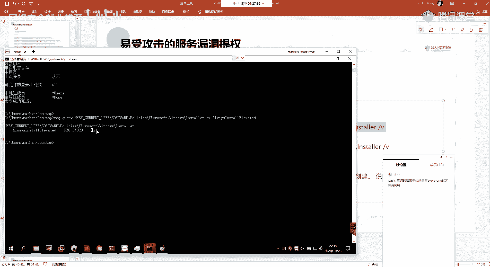

如果说数据是这个0x一的话，就表明这边的话是开启了，就说明我们的这一个策略的话，它是已经启用了，如果说是错误系统，无法找到这样的一个注册表现的话，那么就是这个注册表象其它没有创建。

也就是它的这个策略它是没有启用的，就是说如果你启用了这个策略的话，它就会有这样的一个注册表的一个值啊，啊我们也可以，我们可以通过这样的方法去进行一个启用，而具体的一个应用的一个方法的话。

就是呃生成这样子一个msi的一个ai程序嘛，然后的话呃上传到目标机上面去进行一个执行，执行的话，我们就能够去得到相应的一个设置的一个权限，而在生成这样子的一个呃msi的程序的时候的话。

呃跟前面的话稍微有点不一样，就是在这边的话，我们首先需要去生成一个执行payload的一个反弹，需要的一个payload，就我这边是这样子一个e一个程序，以及这样的一个程序包。

就这样一个msi的一个程序包好，首先的话我们先生成这个payload是吧，然后生成了这个payload的话，我们还要去生成一个，就是说生成一个2a的一个msi，生成一个这样生成一个二一的一个msi。

然后生成了一个方法，那就是像这样子gf指定我们的一个msi，就是生成一个mc的一个格式嘛，然后我们的一个po的话，就是这一个windows的一个e x1 ，然后这个po的话它的意思的话。

他就是呃如果你执行了这个msi，他就会去呃调用，我们这边他会去执行我们这边的一个命令，我们这边执行一个命令的话，就是我们这边的一个payload，也就是我们前面所生成的这个po的，然后我们需要把。

然后的话我们需要把这两个文件都，上传到我们的一个目标机器上面去了，然后的话我们再通过啊这样子的一个方法，msi e x e c来去执行，我们这边的一个msi的一个程序，然后执行这个mi程序的话。

它一执行对吧，执行之后的话，如果说启用的那个策略设置，它就会以一个system的权限去执行，我们这边的一个payload，因为他的这边的这一个安装程序的话，它的一个他的一个目的的话。

就是去执行我们这边的一个pdd，然后的话是一个system的权限去执行，呃然后还有的话，其实我们可以通过这样子一个方法，就是更简单的，就是我们直接啊，先用这样子一个a的柚子的一个po的。

来生成一个就是创建一个账号的一个啊，这样子的一个msi的一个po的，然后的话他在这边执行之后的话啊，在这边执行之后对吧，执行之后的话，它就会一个csm权限，去创建一个这样子的一个账号，而在这边的话。

这边的话就是它的一个呃，分别的一个执行程序的一个方法，以及在这边的话呃给了这样子的三个参数，这三个参数的话主要的话就是呃，呃大家自己看吧，好吧，就是不使用gi的话，就表示啊我们在这边去安装的时候。

他没有这样子，没有一个g i的一个宽，就是没有这种界面嘛，然后按q的话就是静默的去安装嘛，就是没有，不会像我们就如果我们执行对吧，我们执行的话，它会有相应的一些信息，它会显示出来。

然后刚才的话就是指定我们那个安装程序嗯，嗯呃以上的话就是我们本节课的所有内容，就是呃内容的话，呃其实说多也不是很多，但是其实也还是有点多的，然后我这边的话其实讲的也是呃稍微有点快，我怕这边的话讲不完。

然而大家我看大家有没有什么反馈啊，大家有没有什么疑问啊，当然的话，这边的话其实也是需要大家自己去动手做的，就你可能你现在的话可能也是没有什么，没有什么问题吧，应该，呃还在吗，诶，哦还有人在听吗。

呃中间的话我没有啊，我没有去问大家有没有什么疑问，就呃我觉得这边的话，其实我觉得我应该不用讲这么细了，就我这边ppt的话，其实已经已经写好了，当时的话呃想着还是还是给大家讲一下吧。

然而后面的这一些操作的话，这边的话我就没有我没有去一的去尝试的呀，没有给大家去做一个演示了，呃有问题的扣一，没问题的扣二，然后呃自己课后做的扣三吧好吧，这还是老样子，我怎么感觉现在有18个人呃。

除了这两位同学，其他同学是不是都都没在啊，是不是就电脑挂着，然后没没在听啊，给我一点反馈，有人在吗，还可，还是这两位同学是呃，是大家有点懵了。

听懵了吗。

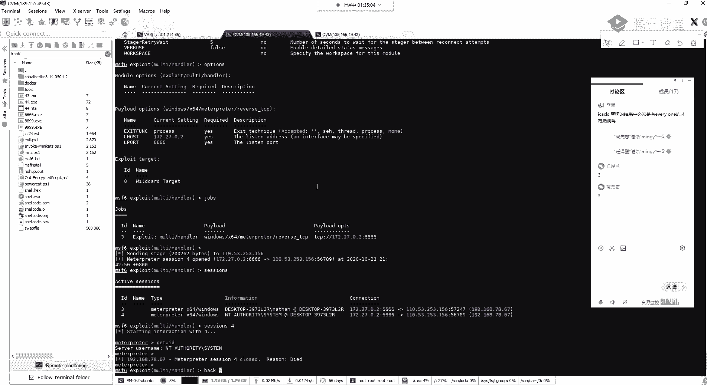

呃好吧呃大家没大家没什么反馈的话，那么我就默认大家是没有问题了好吧，反正有问题的话，有问题的话还是老样子啊，找我问就行了好吧，然后等大家自己课后去操作吧，然后作业的话也还是老样子。

就是把我课上讲的东西自己动手去操作一下，好吧，自己去啊操作一遍，然后自己去理解好，我们本节课，这样的话就到这边结束了，呃大家早点休息吧。

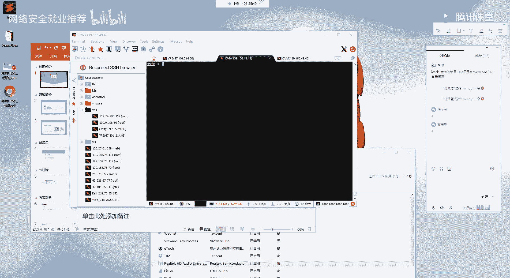