# P7：第5天：XSS漏洞-XSS基础概述及利用 - 网络安全就业推荐 - BV1Zu411s79i

我去就是自己写一下啊什么的，好没人回答我，那应该就是没有好吧，我希望大家还是就去看了作业嗯，那大家就是看作业，看那个就是预习的那个网址是吗，感觉怎么样呢，好一开始不知会前几d的没啥问题，后面就不会了。

一脸懵逼，在dv大队什么事了，是，行可能大部分就是同学可能还是有一点问题，那今天的话就来给大家进行一个系统的讲解，然后今天的话就只是进入我们这个跨站脚本，攻击漏洞的一个讲解，你先把这个都行啊。

嗯今天我们要讲的就是跨站脚本攻击，漏洞的一个基础篇，那首先来看一下这一节课的一个目录，首先第一部分，第一个部分的话就是这个漏洞的一个概述，第二个部分就是这个漏洞的类型，以及它的利用场景。

第三个的话就是我们的一个实操，那首先我们来看一下这个漏洞的概述，嗯同样有一个就是在这里提出了一个问题，就是什么是跨站脚本攻击，跨站脚本攻击的话，他是攻击者通过网站注入点注入客户端。

可执行解析的payload，这个po的话的意思就是脚本代码，当我们的用户这儿的话，可能就是受害者去访问我们的网页时，就是注入了我们有害代码，就是的网页时，他恶意的pload就会自动加载加载并执行。

以达到攻击者目的，那攻击者他写在这个代码里面的呃，逻辑可能会是为了实现一个窃取cookie，或者是对它进行一个恶意传播，或者是钓鱼欺骗等等，那有一个地方，就是为了避免与html语言中的css相混淆。

因为它的首字母提取出来就是cs嘛，所以我们通常称它为xs，这个网站注入点是需要攻击者自己去找的，不是啊，每一个地方都有，我们要去找哪里，我们能进行一个注入，那注入到客户端，可执行解析的这个脚本代码的话。

就可能在我们这个xs s里面，就是我们的js代码嗯，我们接下来来看一下，就，它有哪一些的危害，首先第一点的话，可能就是能够获取我们的用户信息，比如说是我们的浏览器信息，或者是我们用户就是受害者。

他的真实的ip地址，或者是我们的cookie信息，前面我们也说过，如果得到了他的一个cookie信息的话，就可以实现一个无密码登录，我们就能进入到它的一个账号啊里面，就能窃取到他的一些个人信息等等。

第二个的话就是钓鱼，我们可以利用xss漏洞构造出一个登录框，然后骗取用户的账户和密码，这个怎么实现呢，我们可以可能可以提示我们，现在当前的你的这个登录已经过期了，然后我们用js代码模拟一个网站的登录框。

将用户名和密码发送到我们的攻击者服务器，这样的话我今天下午稍微弄了一下，可以给大家，演示一下，这有一个我写了一个简单的html代码，在这的话可以输入我们的名字，但是因为它这里就是过滤不严格。

所以我可以在这直接插入一个，我们上一节课有说我们可以插入一个，就是这这种就是以screamed开头的，就是以我们插入的一个javascript代码嘛，然后这个s r c里面填入我们的一个。

外部的js脚本的路径对吧，在这里的话，我这已经写好了，嗯我暂时这的话只是给大家看一个效果，接下来我会具体讲它是怎么实现的，嗯在这的话它有一个用户登录过期请重新登录。

当然我这写的这个就是比较的界面比较简单，但是它的基本功能都是一样的，然后我们在就是他这输入之后，刚才我们输入这个之后提交提交，我们可以把这一串，这一串url发送给我们的受害者，他打开之后。

就比如说ctrl c，我用另外一个浏览器打开，模拟我们的一个受害者，嗯它打开之后，这儿还有一个账户登录，过期重新进行一个登录，这样的话他可能就会输入我们的一个用户名，密码，登录之后。

我这就就显示了一个空白，如果你还想做的逼真一点，我们就可以直接跳到他自己的一个页面里面去，那在这的话，其实我在这个data。html里面就记录了哦。

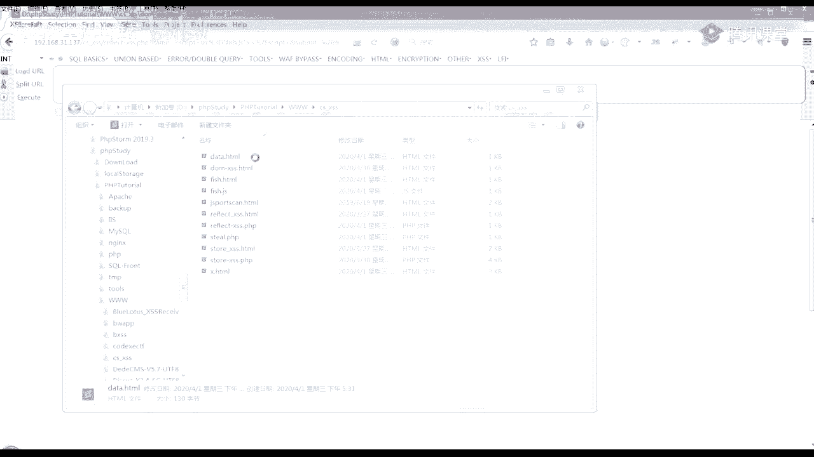

我先把这些删掉。

这里输入的话，我们输入123123，然后登录，这是一个空白。

但是在我们攻击者这一边的话，他这其实已经记录了他刚才输入的这个aleine，123，123就是显示给我们了。

那这个到底是怎么实现的，我们接下来可以来看一下，这是一个简单的一个例子，这是第二种危害，就是一个钓鱼，利用我们的一个xss漏洞构造了一个登录框，第三个的话就是注入我们的木马，或者是广告链接。

有些它是在主站注入非法网站的一个链接，这这样的话可能对主站那个公司的声誉，就会造成一定的影响，再一个可能会有一个后台增删改，网络数据等操作，这个的话可能需要配合，我们后面需要学习的一个漏洞。

就是cs rf漏洞骗取用户点击，然后利用我们的js，这个js的话就是javascript的缩写，然后模拟浏览器发包，最后一个可能就是xss蠕虫，比如说微博蠕虫，只要看过某人的微博。

我们就可以自动关注那个人嗯，还有一个就是贴吧蠕虫，就是看过某个帖子就自动回复这个帖子嗯，这些都是xs s能够做到的，以及它的一些危害，那接下来我们具体来看一下这个漏洞的类型，以及利用场景，它分为三种。

第一种的话就是反射型xss，第二种是存储型，第三种是dom型xss，内反射型的话，它主要是用于钓鱼，刚才我们那个其实就是利用了一个，反射型的xs或者是引流，或者是配合其他的一个漏洞。

比如说csf内存储形成ss的话，他可能就会攻击范围比较广，流量传播就会大，那为什么它会攻击范围比较广，传播流量大，就等会大家就会知道，就是等会儿会给大家详细的介绍，它也可以配合其他的一个漏洞。

然后dom型xs s的话，它也可以配合其他的漏洞，而且它是属于客户端的一个xs，然后它的长度大小是不受限制的，那么我们接下来来看一下，具体的每一个类型的xss，首先我们介绍这个反射型xss。

它的特点是只会执行一次非持久型，这个非持球型其实是对应于后面的一个存储型，xss来说的，存储型xss它是一个持久型，然后它也可以叫做这个反射型，xss，也可以叫做参数型的一个快扩展脚本。

它主要存在于攻击者，将恶意脚本附加到url的参数中，发送给受害者，服务端，未经严格过滤处理而输出在用户浏览器中，导致浏览器可以执行一个代码，数据可以看右边的一个攻击流程。

首先是攻击者发现存在嗯反射形态s的ui，然后根据输出点的环境构造，我们xs的代码就是构造能够触发嗯，我们trs执行的一个代码进行编码，对我们的那个url进行编码，或者是对它进行一个缩短。

我们可以去一些网站对网址进行啊缩短等等，这个这一步是可有可无的，仅仅是为了增加一个迷惑性，然后我们就可以把这个构造的这个url，发送给我们的受害者，受害者点击链，点开链接之后。

我们的xs s代码就会执行，然后完成攻击者的代码功能内，在右边这张图的话，可以看到攻击者这边他是通过email，就是邮件的方式把我们这一个恶意的链接，xs的恶意链接发送给我们的受害者。

然后受害者点击之后，他就会去请求去请求去这个3w。test，请求这个search。p h p，然后问号key等于啊，这里有个双引号，尖括号可能是闭合前面的一个标签，然后后面这个后面这个大家应该看懂。

就是这个squint alert s，然后闭合掉前面的这个screamed，然后他会给我们服务端没有做严格的过滤的话，它会嗯给我们进行一个响应，然后它就会在受害者的浏览器中弹出一个嗯，警告框。

警告的内容就是xss，这是一个反射型，它大概的一个嗯流程，一个过程，反射型xss的，过程，那我们来看一下反射型xss的一个利用场景，我们如何去找xs s就可以是嗯。

我们看见有一些输入框或者是uri l参数中，我们就可以去尝试着修改，输入框这些东西里面就插入我们的一个js代码，看看能不能进行一个，注入，那我们来看一下一个，利用的代码，那在这的话我要写一个。

这有一个输入框，他这是请输入你的一个名字，所以我在这就输入一个hello，提交之后，他在这里的话会有一个welcome hello，这个hello，我们输入的这个hello，它会回血给我们。

就是在页面中，在这个地方它回响给我们，我们可以查看一下网页源代码，可以看到它就是在这个地方会献给我们的，那我们可不可以，就是根据上一节课的那个内容的话，我们是不是可以进行一个尝试。

比如说我在这输入h1 ，大家还记得吗，这个就是一个标题吗，一级标题在这里再加上这个hello的话，我们看一下它的字体会不会变粗变大，嗯在这里的话，他这个hello后面这一串都会变成这个一级标题。

我们可以看一下它的一个网页源代码，那在这的话可以看到，他把这一个部分都变成了一个一级标题，这个地方的颜色也变了，就是它原本我们可以看到这边，它原本都是这种黑色的，但是我们直接在这边输入了一个嗯尖括号。

h一之后，我们查看源代码之后，它是它变成了这种紫色对吧，就说明浏览器已经把我们输入的这个标签，当成了我们输入的这个h一左右肩，左肩挂号h一右键括号，把它当成了一个标签进行了一个解析。

同时把我们的这个hello新号变成了一个一级标题，那这样的话，其实就可以证明，他这个网站是没有进行过多的一个过滤的，因为它可以输入我们的左右尖括号，那这样的话，我们是不是可以尝试进行插入一些嗯。

我们之前前面的一个square enja ascript代码，比如说这个嗯，我们以这个squt标签开头，然后加上一个，比如说弹出一个alert 1，然后再闭合，我们看一下会不会弹窗，你们觉得它会弹窗吗。

大家都说会，那我们来试一下，就提交试一下，对他这确实就是会弹窗，我们可以右键查看一下它的源代码，可以看到在这个地方的话对吧，他直接把我们的输入的那个，输入的这一个完整的输出在了我们的这个html中。

没有进行一个过滤，然后这里也变成这种标签的一种颜色，就是这种紫色，而不是这种黑色对吧，我这么说大家能听得懂吗，就是关于这一个以及前面的那些内容，如果听得懂的话就打一。

如果听不懂有哪些地方听不懂的话就打个二，行嗯大家都能接受。

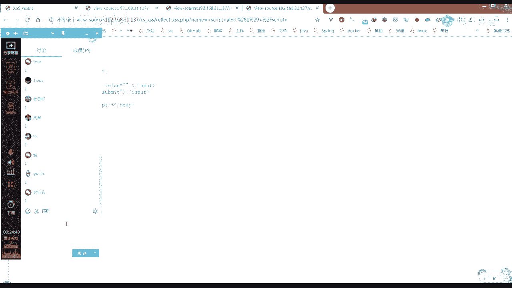

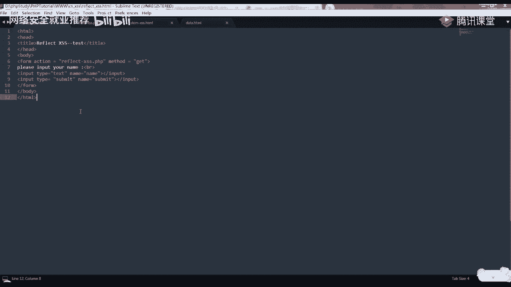

我们来看一下它的一个后台的一个源代码吧。

就是能够帮助我们更好的去进行一个理解，那在这的话，我们是首先到来到我们的这个reflect gun xs，s。html中，然后在这的话有一个表格之前，第一节课也有跟大家说过对吧。

然后输入有两个input标签，在这个action，这样的话就是有一个我们的处理的文件，这样的话就是这个reflect gun xs s。p h p，那我们去这个这个里面看一下。

在这的话我们直接看它里面的这个菲律宾代码，在这个里面的话，他直接就去找这个request的话，就是去啊这个这个request就是嗯去进行一个判断，这个数这个是数组里面是否存在这个lab。

它这个里面是否存在这个lamb值，并且他的这个lamb值是不为空的，那这个lamb是在哪儿传过来的呢，在我们这个html里面就是这个lamb，这就是输入的名字名称这传入过来的。

那如果它存在这个lab以及，并且它们它的值不为空的话，我就把它取出来，取出来放到我们这个lab这个变量里面，然后直接输出一个welcome，然后信号中间直接加上了我们这个，赋值的这个lamb值。

所以说所以说他直接一口进去了，他并没有对我们输入的。

就是我们这儿提交了这个lab值进行一个过滤，可以看到它其实这是以get形式提交了，他直接在这个url中显示进来了。

那如果我们要对这种进行防范的话，那可能就可以对这个lab这个它传入进来的。

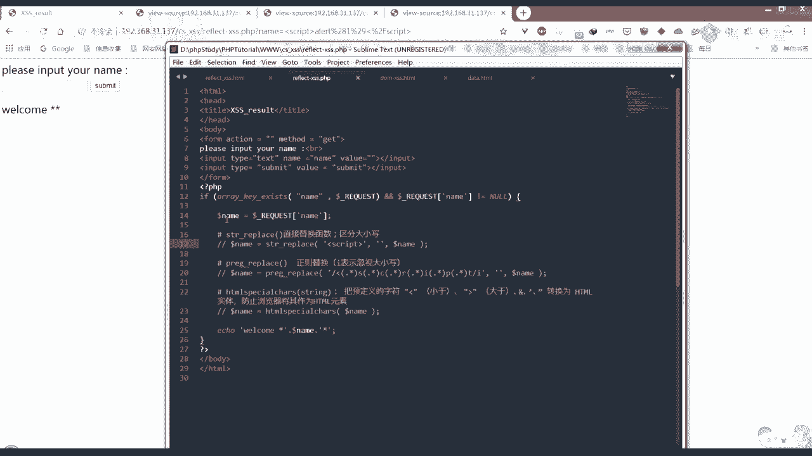

这个值。

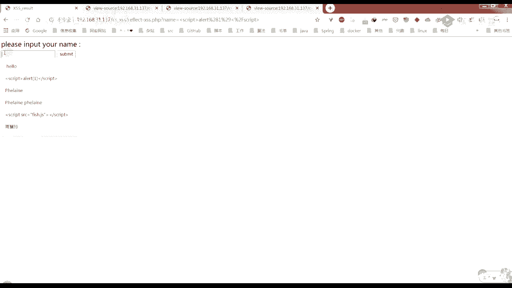

就是我们这个标签里面传入进来的，这个进行一些过滤对吧，在我们后台，这比如说他有就有几种，一种的话，就是我们直接去将他的这个cript标签，替换为空，这个函数的话就是直接替换，然后区分大小写替换为空。

那我们将它保存一下。

来看一下我们前面的那个就是尝试的，这个插入的叉叉js代码，能不能还能不能进行弹出那个警告框，这样的话就不可以了，而且他的那个，可以查看一下源代码，你可以看到它其实后面这个还是有一个输出。

就是还是就是没有被过滤，只是前面因为它后台代码它只是匹配了这一个。

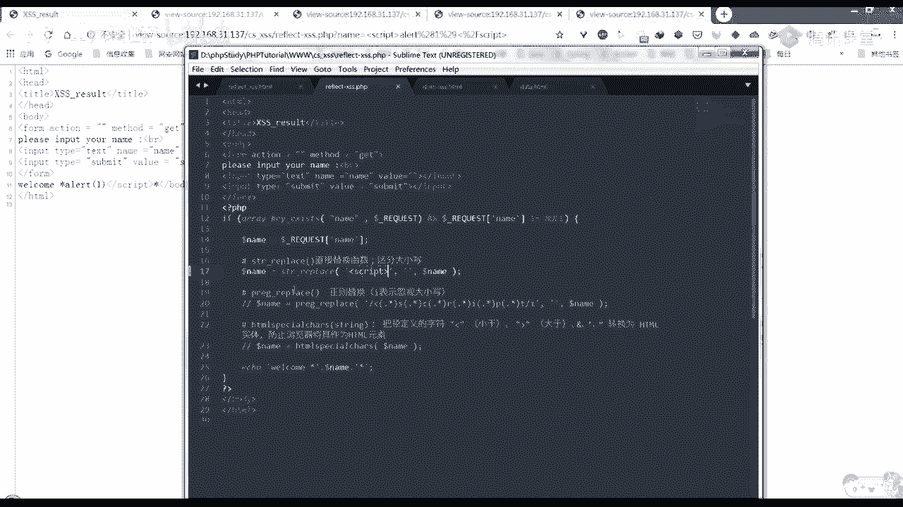

所以的话他在这里就被替换为空了，然后它就不能进行一个解析了，因为它不能识别为一个cript标签，没有他没有以ascript标签开头嘛，所以他并不知道这是一个javascript代码。

所以就不能进行解析了，内战的话其实绕过也比较简单，这我们可以直接输入大小写，这个s是大写的，嗯这样的话它也是可以进行一个弹窗的，对吧，他这也是变成了这种紫色，而且他变成了，它变成了空的话。

还有一种方式就是，我们直接在这个cript里面，这个里面再嵌一个secret，因为它它会匹配到这个中间的这个，我把屏幕放大一点，因为它会匹配到这个吗，这个会匹配为空。

那这样的话剩下的左边这个加上右边这个，那是不是就正好是一个squint标签了对吧，我们来尝试一下，然后进行一个提交，你们觉得他会不会进行一个弹窗，嗯会，是的，它同样会进行一个弹窗。

然后我们看一下它的后台的一个源代码，可以看到，他这样的话就正好变成了一个squt标签，因为它会把中间这个匹配掉。

就是匹配为空，我们后台的逻辑是这么写的吗。

匹配为空嘛，所以他在这儿的话就相当于把它去掉了，然后前后拼起来正好是一个squ，这样的话它就能够进行一个识别，识别这个alert一为一个jazz的代码。

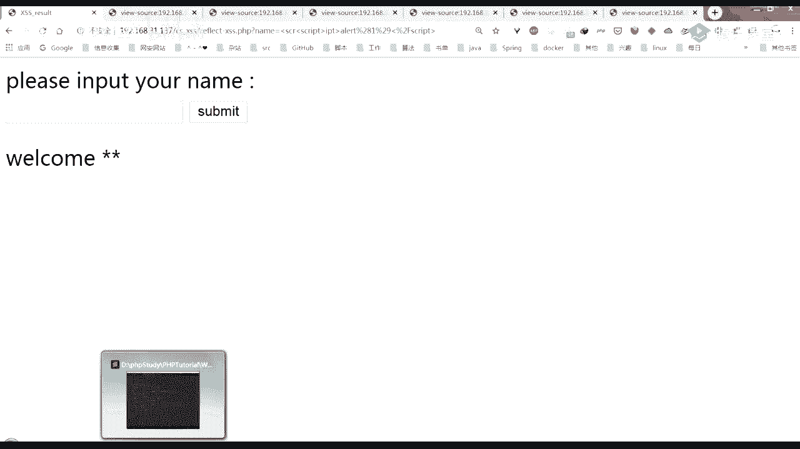

除了这一种过滤之外，这种过滤就比较的鸡肋吗，可能下面这种过滤这个的话，这个函数就表示是使用一个正则匹配的方式，将我们的lab值里面的这个squt，中间有很多新号，就表示你中间无论差就是典型。

这种就是正则匹配吗，无论你中间插入一些其他的一些字符，只要你这个里面有一个左尖括号，s c r i p t这样的一个字符的话，它都会把它匹配为空，然后这里有一个i的话是忽略大小写。

这个i是忽略大小写，那这样的话我们可以来看一下，刚才的我们那种方式是不是可以，还能不能使用。

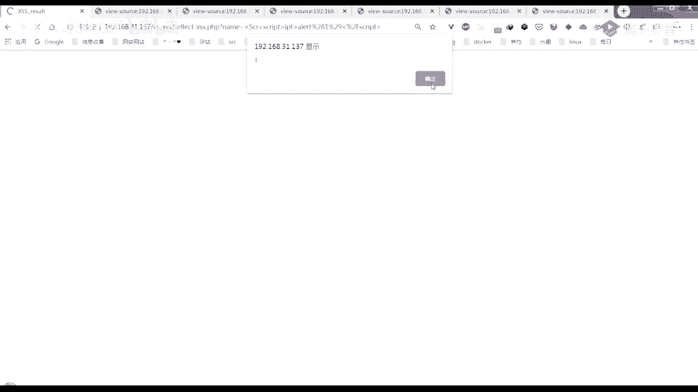

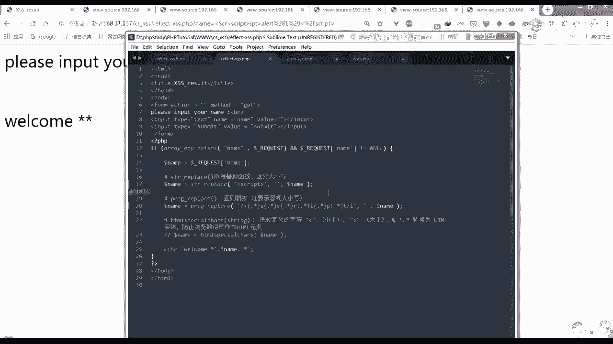

哦我这没有保存，这种方式对吧，嗯可以看到它在这的话就只有一个右键，括号输出给我们了，你们可以看一下他后面是不是就全替换为了空。

因为在这的话它会把中间的那些东西都匹配掉。

匹配为空对吧。

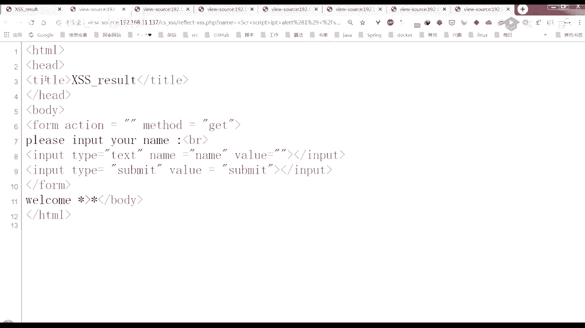

这个大家能听懂吗，嗯行，那我再把最后一行给注释掉，这个其实好像之前有跟大家提过吗。

这个函数如果没有提过的话，等会就提，那大家来猜一猜，这样的话使用这个函数的话，我们。

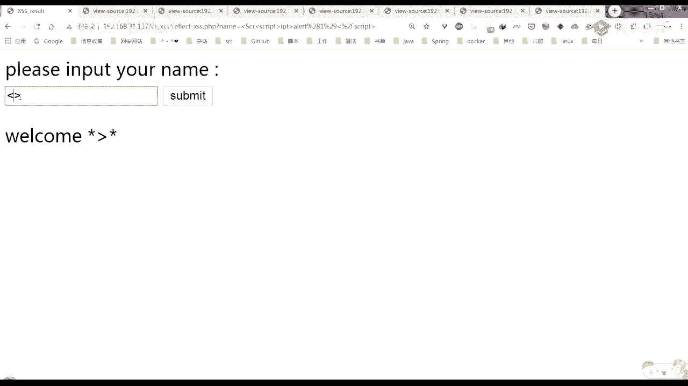

还能不能进行一个，哦刚才还没有，对不起，刚才还没有进行一个绕过，像这个其实也是可以绕过的，因为它只是对我们这个sc这个标签。

进行一个过滤嘛对吧，那我们其实还有其他的一些方式，来执行我们的一个js代码，之前我们有说过是吧，一种就是直接在页面里面插入这个嗯squam，第二种的话是使用外联的一个，就是这个src等于什么什么js。

后面加一个js的一个路径，它就会去那个路径去访问那个js代码，然后嵌入到我们页面中，就是这是两种，还有一种就是可以使用一些事件对吧。

这两种前面两种话都是不可以使用的。

因为他已经把这个cript标签给过滤的，比较严格了，那这样的话我们是不是可以使用一个，就是利用它里面的一个事件来进行嗯注入呢，一个xs s的注入呢，因为他这只是过滤了我们的这个嗯。

匹配了我们这个squint嘛，它左右兼顾号并没有进行一个过滤，所以我们可以输入一些其他的标签，比如说，image标签，然后src等于一，这个的话就是他的一个路径嘛，这个路径不存在的话。

是不是就会报一个错误，如果他就有一个事件，如果他报错的话，就一个on erro，就会等于这个，后面你就可以写我们这个以n开头的那些事件，是不是后面可以写我们的js代码olent 1。

我们这样看一下是它是不是会进行一个弹窗嗯，可以看到它在这里确实就进行了一个弹窗，然后这里有一个图片，但是它的路径因为唯一是找不到的，所以它会触发那个on euro。

然后on ea里面又是我们的一个js代码，就是alert 1。

嗯这个是第二种的一个绕过内地三种，这种方式就是使用这个函数，它会把预定义的一些字符转换为html实体。

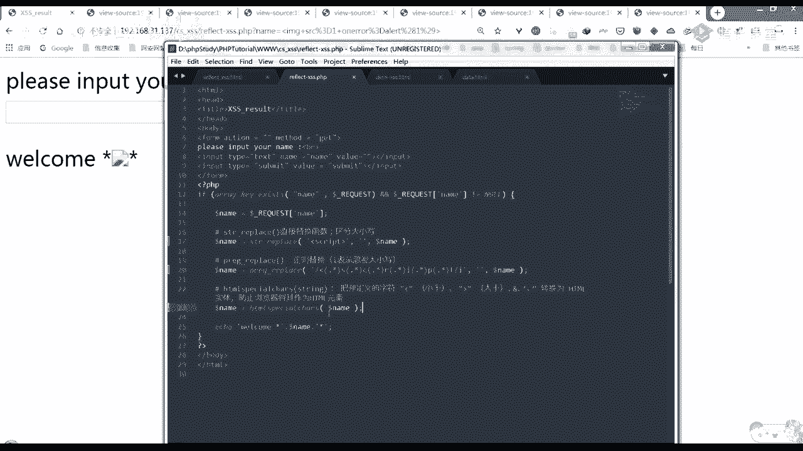

防止嗯浏览器将其作为html的一个元素，大家可以，就是你们觉得现在的话还能进行一个猪肉吗，这种方式还能进行一个，但是让我写就不行了，你等会就会写了，写payload很简单的。

大家觉得这种方式它还会进行一个弹窗吗，就是会因为这里路径也是不存在的嘛，然后会触发这个on erro等于一，它会弹出一个一的一个请告框吗，应该不能，不能解析陈子户试题了，不行，对这位同学讲的很好。

就是他其实是我们可以提交来看一下，我记得第一节课的时候有给你们说过，如果说我们要在页面里面正常的显示这种嗯，特殊符号的话，我们是不是可以使用一个字符实体，大家还记得吗，就是那个我们看一下源代码。

就知道你可以看到在这儿对吧，大家记得这个吗，这个就是左右，左键括号以及右键括号的一个字符编码，在这的话你可以看到它已经变成这种黑色了，就不是我们之前的这种嗯，紫色，这是我们的一个就是一个防御的手段。

我们可以使用这个函数来进行一个，防御，这个大家应该都听得懂吧。

就是也能理解他是怎么怎么，就是整个过程是怎么样的，他为什么会进会有一个弹窗，然后为什么又最后又不能进行一个弹窗了，他最开始在这边从我们的这个html传入到这边。

它主要是嗯可能是你在这边输入你的名字，提交之后，我有一个欢迎的页面给你们。

就是给大家有一个欢迎的页面，但是他在这里welcome，然后这个lab的时候，他如果没有进行一个严格的过滤的话，他直接他刚开始的时候，就直接把我们这个lab输出到了。

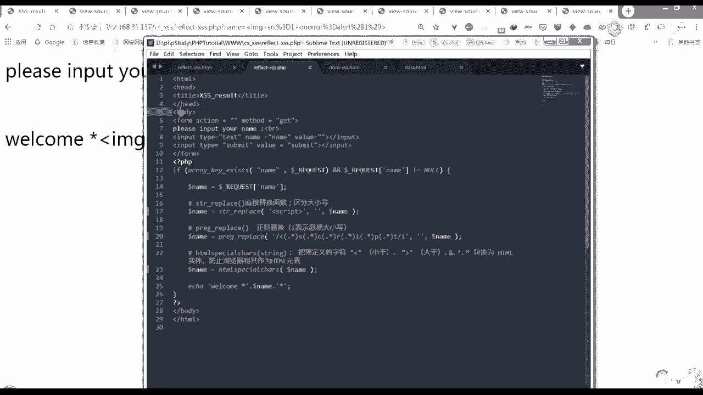

我们这个页面中吗，那这样的话，我们在这里输入的这种这种特殊符号，就可能会被它解析为一个html的标签，从而执行一些嗯我们这儿输入的这些嗯代码，那这样的话就可能造成一个xs s，因为我们后期。

既然我们能这样进行一个执行的话，我们可以就在，可以在这个后面写一些我们的js代码，进行更深入的一个利用，所以我们这儿弹出一个警告框的话，就是为了证明他有这个xss漏洞。

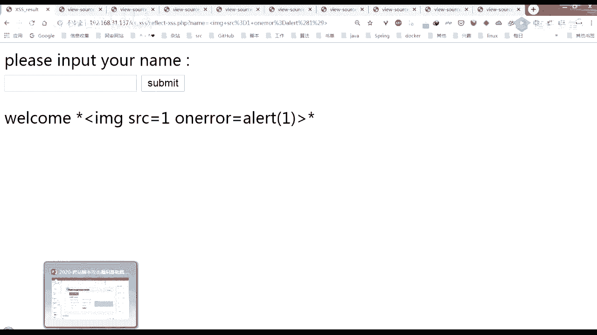

那如果我们想要把它进行一个防范的话，就是防护的话，就是需要我们在这个输出的地方，对用户输入进来的数据进行输出的地方，我们要对它进行一个严格的过滤，前面两种这种前面这两种过滤的方式。

都是可以进行一个绕过的，第三种方式的话，在这里是可以有效的进行防护的，因为它在这只是通过这个equ，然后只有这一个输出点嘛，所以他在这儿是有一个很好的过滤，放过滤效果的。

那可能就我这只是写了一个就是这种小型的。

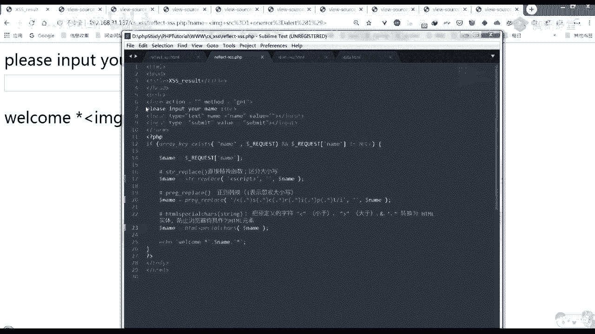

只有一个页面。

就是你输入一个你的llamb，然后提交之后，然后传入到我们的菲律宾里面，然后在菲律宾这它会进行一个过滤，那如果是我们一个大型的项目的话，他可能就会把这些xs s的一个防范，他会专门放到一个嗯文件里面。

然后你每一次请求之前，我都会去先去先去进入到那个文件里面，对你的输入的数据进行一个处理，过滤掉一些嗯字符，然后避免出现xs s之后，再去进行一个我们用户逻辑的一个处理，这可能是就是比较大的一个项目的。

一个处理方法，大家这个能听得懂吗，怎么还是不是替换成镂空吗，你是说什么意思，你是说在这个的时候吗，这样的时候吗，对啊，他是说他都替换成了空呀，对呀，他都替换成了空呀。

但是他没有对这个image进行一个匹配啊，他只是匹配了这一个呀，screamed，他并没有匹配这个image，对。

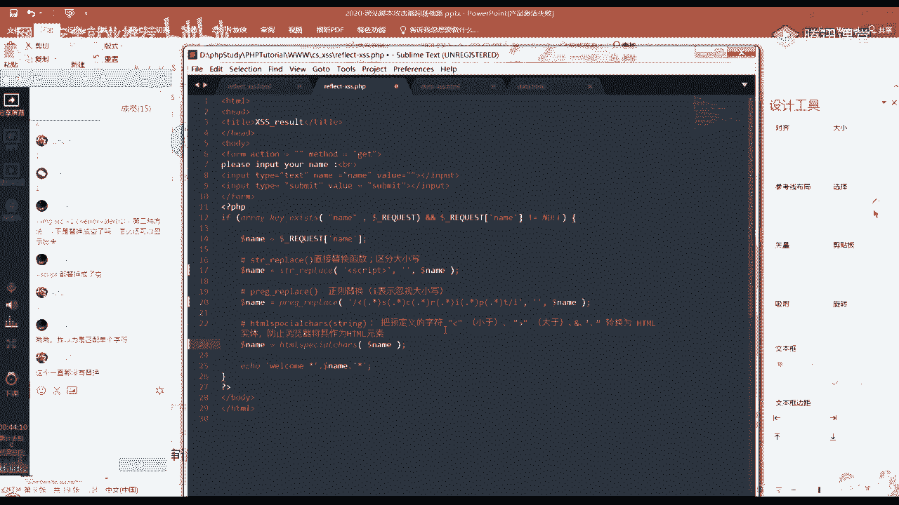

大家应该没有什么疑问了吧，就是对于这个反射型xs s就是用户提交之后，然后服务端没有做严格过滤，然后有一个输出回显给我们，在这个输出的地方它没有过滤，所以他就可能会被当成是一个标签。

然后嗯能执行我们的一个js代码，这个大家应该都了解了吧，如果了解的话，大家打个一，我们接着往下走，嗯s是有替换吗，你可以去，你可以课后课后去找一下正则匹配，你可以课后去搜一下正则匹配它的一个规律啊。

现在就不要先不要想这个了，嗯我们接下来往下走，嗯可以看到这个就是一个实例，算是一个实例吧，在我们这个它其实出现的地方是在这个搜索框，这在这个搜索框，这的话我们直接输入的是这一个。

输的是这个m a n n这后面这一串，那在后面我们去右键查看源代码的时候，我们去进行一个搜索，搜索这个m a n n就会找到这儿，它是直接把我们的这个这一串，放到了这个地方。

他并没有对我们这个on click进行一个过滤，因为我们它是放在这个input标签里面，input标签里面的话，它也可以有一个事件，就是这个on click事件嘛。

然后这个前面mn这个双引号就闭合了这个value，这的这个前面的这个双引号，然后再加上我们的这个onclick，这里的这个20%，就是进行了一个ul编码，就是空格，20%就是空格。

然后on click等于prompt，一prompt也是就是弹出一个确认框嘛，然后空格之后这这后面还有一个双引号，这个双引号其实就是闭合后面这个双引号，它我们原本输入的是。

这个正好插在了这个value这一对双引号里面，所以我们要b和前面和后面，然后插入这个onclick，它点击之后就有就会有一个一弹出给我们，第二个的话，这个也算是一个实例吧，然后也是在他的这个搜索框。

这搜索框，这我是直接加了这个双引号尖括号，这个双引号尖括号的话，也是为了闭合前面的一个标签，因为你前面标签不结束的话，我后面的这些内容都相当于在那个标签里面嘛，所以说我们需要进行一个闭合前面的标签之后。

才能进行一个后面这个标签，它才能一个有一个正常的解析，不知道大家这个，内在这个后面的话又插入了一个image标签，然后它的source是等于123，这个123是不存在的。

所以在这个后面有一个on error，这个后面的这个代码会被触发，当成是一个js代码触发，然后这个evil就是把后面这一串，去进行一个执行，那这一串内容他其实就是去有一个他它的内容。

就是这个我们去new了一个image，然后它的source是等于这个的，这个的话是我自己，因为是但是我本地写的一个接收的一个cookie的嗯，p h b代码，然后它的代码就是这个样子的。

然后m s j等于encode u r i document，点cookie，这个的话就是把我们的cookie传入到我们这个，i i e c v gun cookies，点p h p里面。

然后进行一个处理，那在这的话我在这个receive cookies点菲律宾里面，在第四行的时候进行了一个接收，就是通过get msj，这里传入的是msj，所以我们这写的也是msj。

传入了之后进行一个url解码，因为我们在这对它进行了一个ur l的编码，所以就在这里进行了一个解码，然后将我们的这个他的document。cookie，存入到我们这个cookies。txt里面去。

这样的话我们可以去进行一个，就是我们后受害者去点击了这个链接之后，它的一个cookie就会接收到我们自己的这个呃平台，来，这个大家是先暂时看不懂，没关系，就是我们课程后面实操的时候。

有一个实验会对这个进行一个详细的讲解，大家做实验的时候，做作业的时候可以认真的去了解一下，去想一下它是怎么实现的，为什么可以这样做，如果出现问题的话，就可以和我交流，这个就是一个反射型的xs。

那接下来我们往下走，就是一个存储型的xs，存储型的xs s的话就相比较于反射型xss，它就有一个特点，就是它比较的它是属于持久型的一个xss，因为它这中间有一个数据库的一个介入。

它主要是存在于攻击者将恶意代为脚本，存储到了服务器的数据库中，当用户访问包含恶意相关数据的页面的时候，服务端未经严格过滤处理，而输出在用户浏览器中，导致浏览器执行代码数据，我们来看一下，嗯这有一个。

有一个页面，其实我们这个存储型的xs，它比较常见的地方就是在这种评论留言，个人信息，这种地方，因为这种地方的话，可能才会需要数据库的一个存在，那在这我们直接也输入一个，就是自己随便写一下。

看看它的功能是什么，test test添加留言添加，这有一个添加成功，嗯这有我之前的，添加成功好，这他会回钱给我们，就是我们输入的test test，然后message这他会回钱给我们。

内在这的话试一下，这样的话会不会进行一个弹框呢，你们觉得他会进行一个弹簧吗，你们啥也不穿那行，我们来添加一个留言，试一下，添加成功，嗯是啊，确实就有了一个弹窗，我们可以右键查看源代码，看一下，这。

你直接找一下这个alert 2嘛，我们刚才输入的是lt 2对吧，可以看到在这边的话，这有一个test test，然后我们是这个咱们之后，这他直接也把我们的这个，变为了一个嗯cript标签来进行解析。

那这样的话我们进行一个刷新，你们觉得它还会有一个弹窗显示给我们吗，就是前面的，这个的话这个reflect，点pp它是没有弹窗的，那这种的话我们如果刷新一下，它会不会有一个弹窗给我们，还有我看你们都懂啊。

会吧嗯那我们刷新试一下嗯，它还是会有的，这是为什么呢，因为他会把我们的这个数据，存储到我们的一个数据库中内，在这的话，他这数据展示又是从数据库中取出来的，所以你存入数据库的时候。

你没有对它进行一个严格的过滤，你取出来也没有对它进行一个过滤，那这样的话它就有一个弹窗给我们，然后你刷无论刷新多少遍，它都是会有一个弹窗的，因为它都是从一个数据库中进行一个读取。

然后你都没有嗯进行一个过滤，对吧。

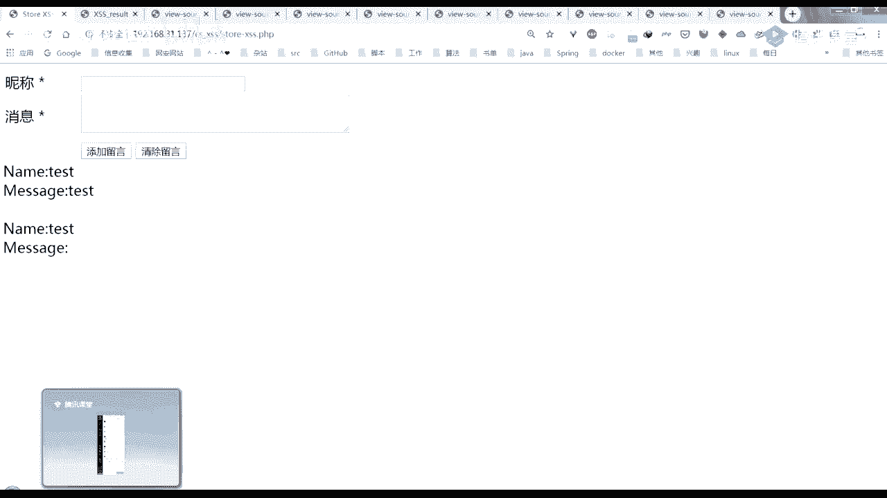

那我们来看一下它的一个后后台源代码，是怎么实现的，这的话就是我们前台的一个代码，嗯这里的话输入我们的昵称，然后输入我们的一个消息，然后输入消息之后，有一个添加留言以及清除留言。

这个on click jr的话有一个进行一个判断，判断是在这昵称不能为空，消息内容不能为空，然后这个清除内容，留言的话，它有一个嗯提示框，确认要清除所有的留言吗，这些都不是很重要。

我们来看一下它进行一个处理，就是这个action，这处理的这个菲律宾文件到底是怎样写的，嗯这些的话就是一个连接数据库的一个操作，然后这里的话是清除的一个，处理过程，这个是添加添加留言的一个过程。

可以看到我们重点是看这个这个里面这个衣服，这，在这儿他首先进行了一个判断，这个btn sign，btn sign的话就是这个嘛，这个就是我们这个是否进行了一个设置，是不是就是你提交了。

然后将我们的这两个这个昵称以及消息，把它取出来，对吧，通过poster取出来，我们是post的进去的，然后这个stream的话就是去除我们嗯提交的数据，两边的一个空格以及与定义的一些字符。

这个是嗯主要是去除一个空格的，接下来的话在这个这一行，这这个的话是一个数据库的操作的一个语句，in certain to guebook，然后message lamb values什么以及什么。

就是将我们的这个这里面的这个message这个变量，就是这传入进来的，这个以及这个lab这个变量，存入到我们这个gas book，这张表的message以及lab字段里面去，然后。

有一个提示就是alert添加成功，我们来看一下，我们选择的是这个这个数据库吗，p h p h s test，对吧，然后我们来看一下数据库。

在这的话我们有输入两条记录，第一条的话就是这个test test，第二条的话就是我们刚才输入的这个test，然后sprint alert 2，对吧，这两条数据，这是两条数据。

就是我们可以重新来进行一个写一下，比如说我现在昵称说这个，嗯他这泥船还有长度限制，但是这个长长度限制应该是前端的，它最大的长度是十，我把它改成比较大，这样的话就可以输入比较多的一个字符，嗯然后添加留言。

我们来看一下它存储，嗯我们每次刷新它，这都会有一个我们刷新一下，就在这的话，它就会把我们提交的这个，我们用户提交的这个信息，存储到我们数据库里面去，这是他一个存储的一个过程，那你光存了，你不拿出来用。

那肯定也是不会有一个xs的弹框的一个过程。

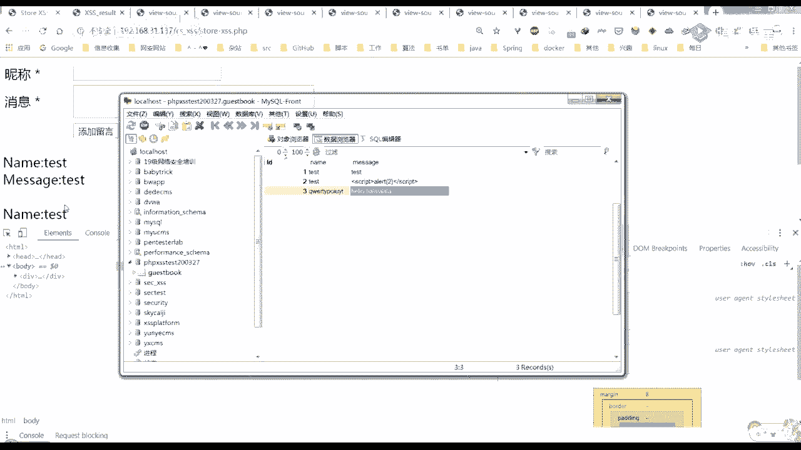

对吧，你只存了，你又不用它，那肯定不会造成什么影响。

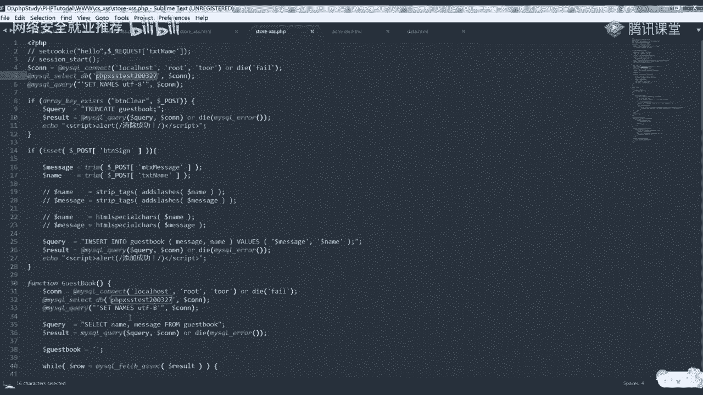

那他用的地方在哪呢，就是其实就是我们在这个展示的这对吧，你要展示这些你输入的这些留言什么什么的。

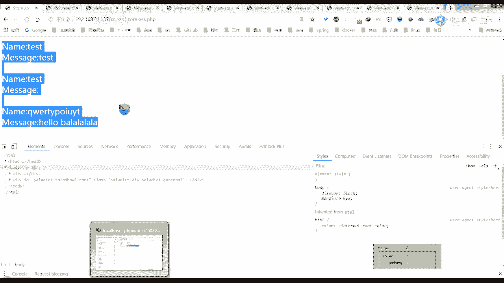

你是不是就要从数据库里面，把这些数据给取出来，你在这里的话，我就是通过这个geebook这个函数，来进行一个取出来，首先这个select的话也是一个sol的语句，就是从我们这个geebook。

就是从这一张表里面取出数据，就是取出它的lamb以及message，它的这些数据都取出来，然后接下来在这个地方的话就进行一个便利，便利输出，在这里一口，这样的话是将我们这个嗯查找出来的。

这个结果进行一个读取，取出来嘛，取到我们这个lab变量里面来，然后在这个eco这就进行了一个输出，所以说你从存盗取的过程中，就是我存的时候就去除了空格，而去除了一个它两边的一个预定义字符。

把这两个字段就是你提交过来的，你在这儿就是在前端写的这个啊昵称消息，这些东西就通过他的这个insert这一条语句，然后插入到我们数据库中，接下来你要进行展示的话，你就直接在这里直接eco的一个。

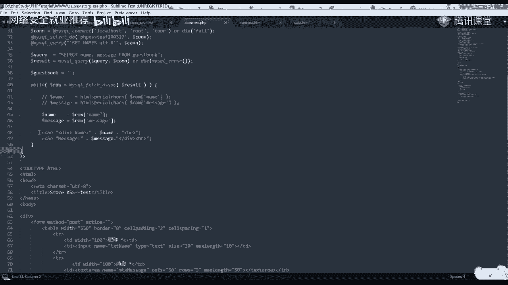

我们的把它的一个数据取出来，直接一口出来了，所以说他这为什么会出现一个xss的注，注入xss漏洞，是不是大家也可以就是清楚了，其实跟我们的反射型，xss其实是就是它的形成原理是一样的。

只不过它在这里有一个数据存储的过程，它涉及到了我们的一个数据库，所以说他每一次你去刷新页面，无论是我这个用户去刷新这个页面，还是别的用户，就比如说，我们切换一个浏览器，去访问这个页面的话。

它都会有一个弹窗显示给我们，因为它这里它要显示这些数据出来，它也是要从那个数据库里面去取数据的，所以说这就是我最开始说它的传播嗯，范围广，就是可能每个人去访问这个页面的话，他都会受到一个影响。

内在这儿如果要进行防护，大家有什么想法吗，我刚才说的，大家有听明白吗，如果听明白的话，大家就打个一，如果没有听明白的话，就打个二，行，我们来看一下就是怎样进行一个防护板，首先第一种是这个。

我把它们的函数的意思告诉大家，这个的话是添加一个反斜杠，这个可能就是为了你插入到数据库里面的时候，就有些字符前面，比如说单引号前面它就会加一个反斜杠，这个rip tags的话就是会去除我们的一个我在。

好吧，这个就是去除字符串中的html，xml以及ph的一个标签，这个意思的话就相当于我们前面的那些标签，它就不能用了。

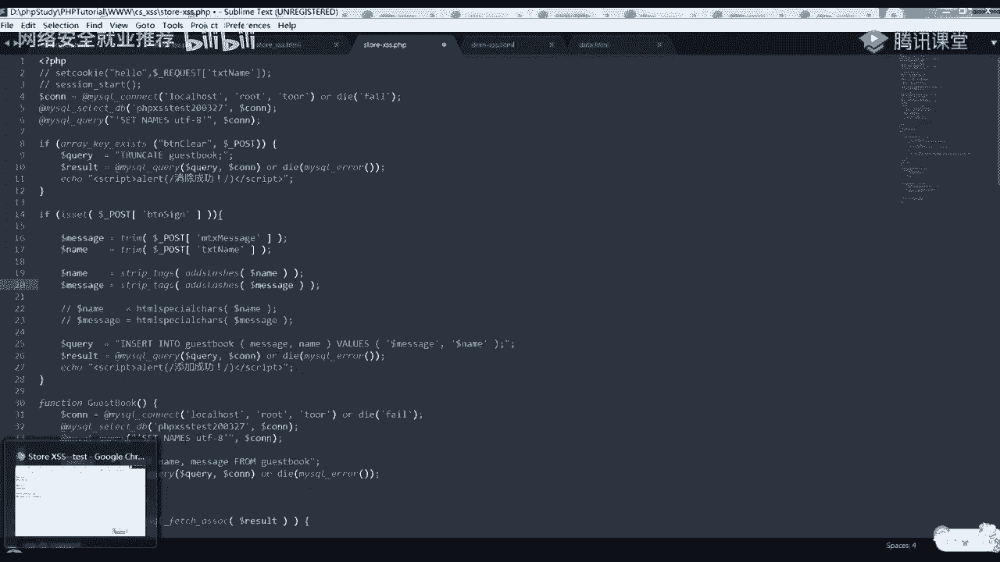

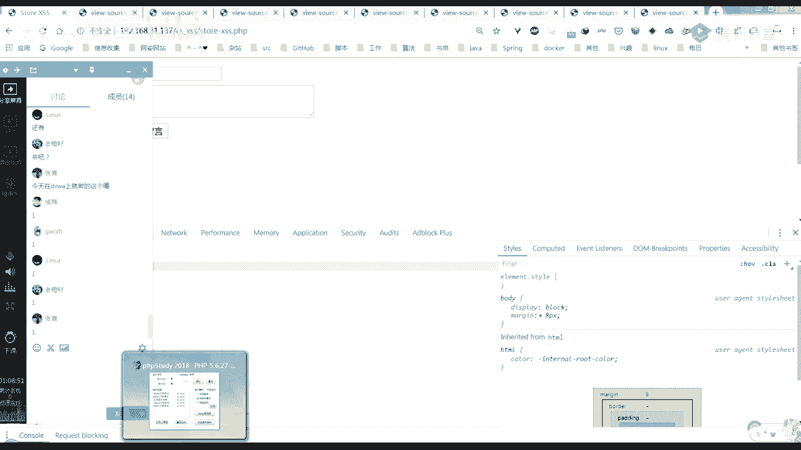

大家觉得这样能进行一个有效的防护防范吗，我们先指就是只过只对这个lab进行一个，这样的话其实就可以对，我们在message这我们可以看一下。

其实可以来看一下这个效果，先保存一下，这个test，然后这输入我们的这个前面使用的这个image src，等于一，bro就等于，一，添加留言试一下哦，他原本这的还是会有，我们查看一下源代码。

那在这的话可以看到其实是在这个地方，这个message。

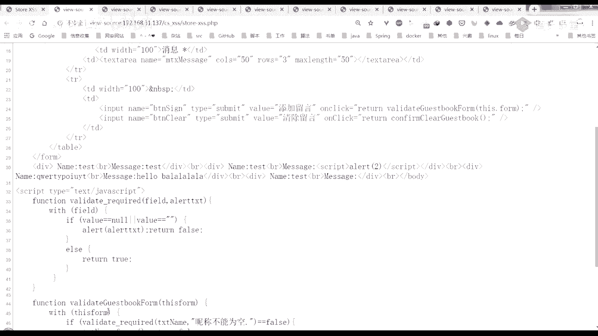

这它后面就没有东西了，他是为什么呢，其实就是因为，你在就是它存入数据库之前。

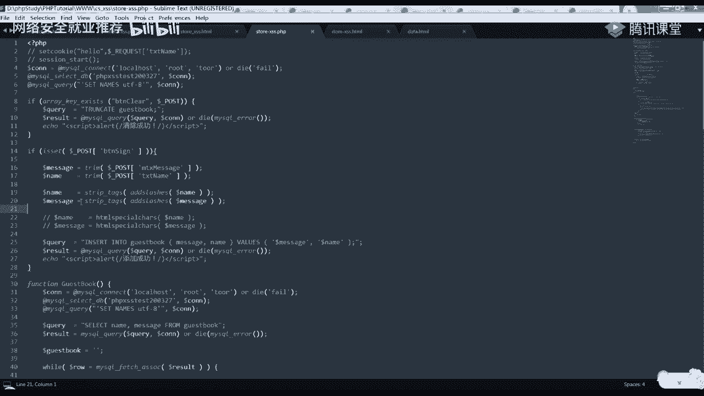

就把它的通过这个rip tx，将它的一个嗯那个html标签给去除掉了，我们可以看一下数据库中它的一个可以看到，这就干脆是为空的，就没有存储任何的一个数据，因为它之前我们刚才输入的是一个。

这个嘛image src等于一on erro，他就会直接把这一整行，因为它就是一个嗯image的一个标签，它就会把整个都去掉，所以说这样的话，能是能进行一个有效的一个防范的。

如果是使用这两个的话，就是我对他们两个输入的lab以及message，进行一个html special chance。

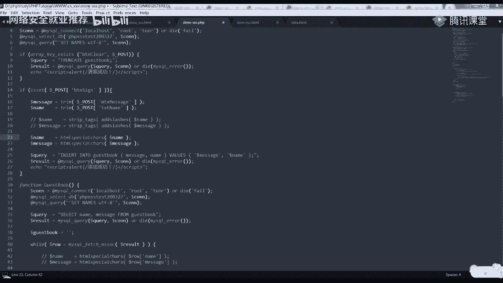

将它们编就是弄成一个字符，实体内能进行一个，执行吗，就是会能执行我们的一个插入的xss代码吗，嗯对其实它就不会弹窗了，我们来尝试一下，这个二是前面的吗。

嗯他为什么只有一个的呢，是因为。

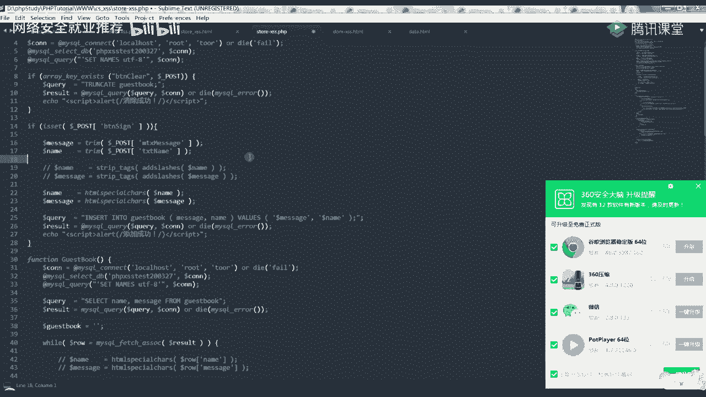

我这没保存啊，这个点点还在，就是没保存，我又那就保存了。

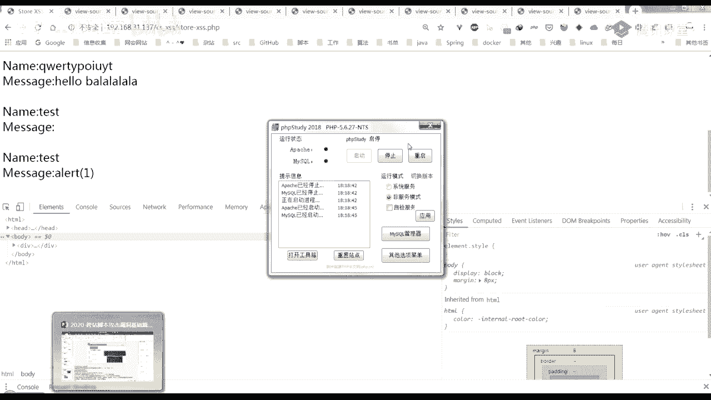

然后他会先把我们这个因为我刚才没保存的话，它是他其实刚才是这样子的，先把它去除掉，它的标签之后，然后再对它进行一个实体编码，然后存入到数据库，从数据库中再取出来，展示给我们这样的一个过程。

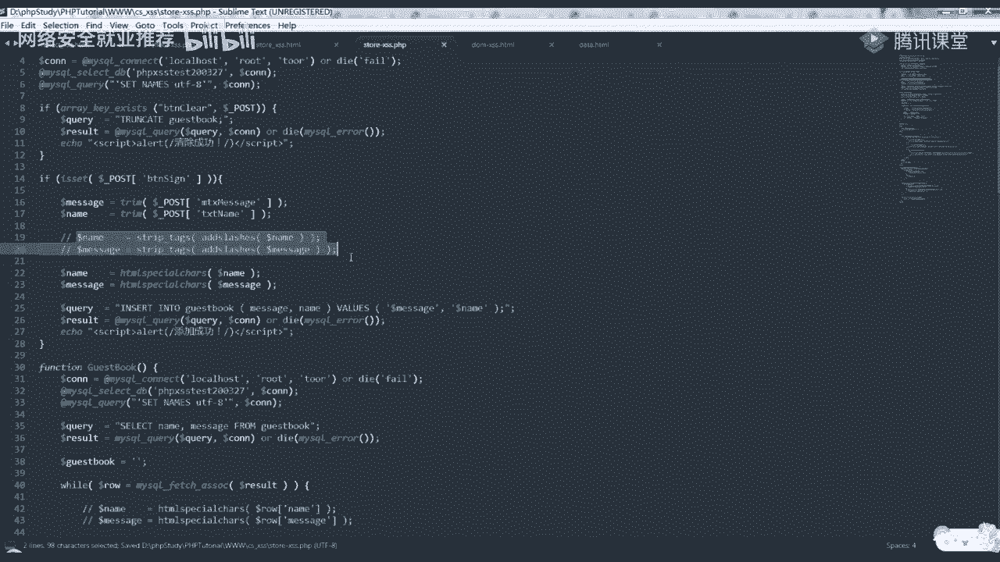

那我现在把线这一行注释掉，嗯这样的话他就会把这个完整的显示给我们，那我们去看一下他数据库中是怎么存取的，可以看到它在这边存入的话，就是存入了我们的一个字符实体了对吧。

所有兼顾号都是使用这种字符，实体的形式存入的，所以在这边如果你进行读取的话，取取的时候它也是以这种形式取出来的，就直接将我们这个message这个取出来。

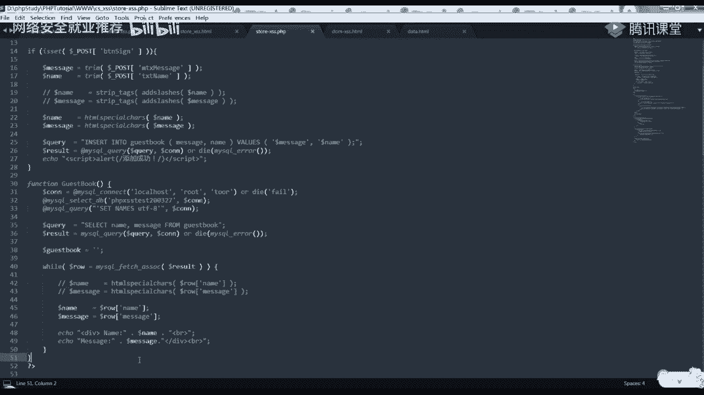

然后一口出来。

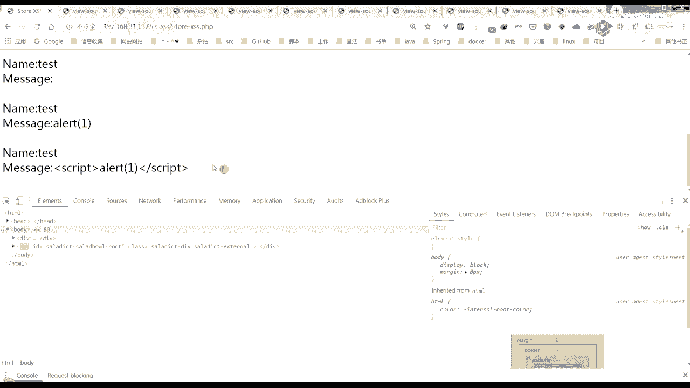

这样的话就展示给我们这个样子的，这是一种方式来进行一个防范，就是在数据输入钱就是存入数据库之前，我就对它进行一个过滤，使我们的数据库里面的一个数据，是是绝对安全的，还有一种方式就是在数据输出的时候。

就是在这个地方我们要把这些数据取出来，用的时候，展示的时候对它进行一个过滤，在这的话可以使用这两个吗，就我对，我对这两个取出来的这两个lamb以及message，进行一个实体编码。

即使你前面不进行这些过滤。

我可以先注释掉，先把它清除，然后在这里的话test，然后有一个，alert，添加留言，然后在这儿展示的时候，他就是一个字符实体的形式展示给我们的，直接查找一下ellent一对吧。

在这那它其实存入到数据库里面，是不是还是一个有害的一个信息，你看我们前面存入的时候，如果对它进行一个实体编码，存入之后，它是这样子的，那我们刷新来试一下，它其实存入的还是一个有。

就是如果不进行提输出的时候。

不进行过滤的话，它还是可以进行一个弹窗的对吧，因为他这并没有进行一个过滤啊，但是他在这儿进行一个输出的时候。

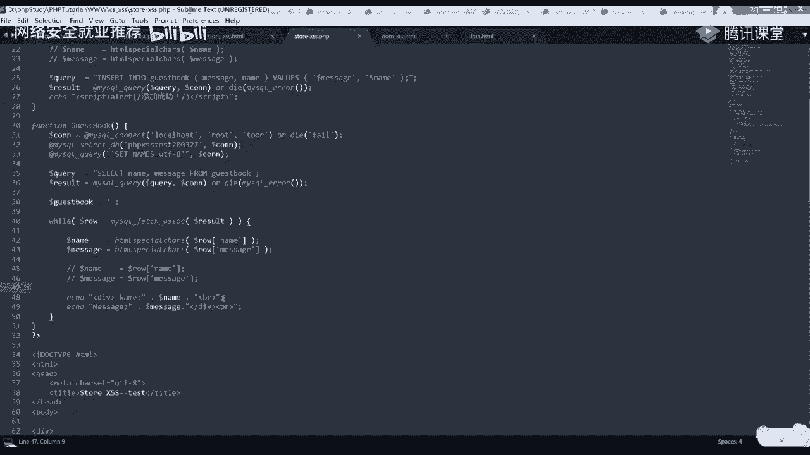

就进行了一个过滤，所以说它这个就不起作用了，这是这两种方式，大家有听懂吗，嗯大家应该没有问题吧，这个存储型的xss大家有什么问题吗，它其实和反射型xss其实原理是差不多的。

但主要就是它会把数据存入到数据库里面去，从而它的一个影响以及嗯传播的范围就更广了，为我们，接下来往下往下，这也是一个存储型xss的利用场景，它是在一个节目管理，这它能一个有一个创造创建名称。

就是你这个节目的名称，他会把这个名称存入到数据库里面去，我这里直接输入了这个这个一一杠，就是为了闭合这个这个变量嘛，然后配合前面这个script，然后接上一个alert 1，它就会有一个弹窗。

这是一个简单的一个利用，那接下来我们往下走，就是最后一个一种xss的类型，就是doom型的一个xss，它的特点是可以通过，javascript操作我们的一个document，实现dom数的重构。

主要存在于用户能修改页面的dom，造成客户端plod在浏览器中执行，我们来看一下，他这有一个welcome to our website，就是欢迎，但是它这就是我们可以通过嗯，就是谷歌浏览器自带的嗯。

这个开发者工具nf 12，这它可以显示它的这个squint代码，就是draw ascript代码，在这的话，大家看得清吗，你可以看到在这个body里面，他有一个这个，它有一个squt标签。

然后在这个swim标签里面，他会用这个document。u i l，这个document。url是什么呢，我们可以来document。url，就是他的这个就是他的这个，访问的一个地址，index of。

index of的话就是嗯判断我们这个url中的一个lamb，等于它的一个索引值，就是它的位置在第几个，然后它返回的是一个整数类型，然后加5+5是为什么呢，待会再给大家说。

然后这个eva的话就是进行一个执行嘛，然后中间这里的话，同样是对这个进行一个substring，substring的话就是截取字符串pose的位置，截取到document。url。length。

就是截取到最后它整个的一个，我们访问的这个url的长度，嗯所以说我们在这儿直接就加一个lab，等于因为他这直接会进行一个执行嘛，所以那这里的话，我是不是可以直接插入一个alert 1。

它会有一个什么效果呢，就会有一个弹窗给我们，为什么呢，其实就是因为在这的话，它会将我们的字符串截取下来，他首先会去进行这个pose的话，会去找到lamb等于五，它的这个位置找到这个地方。

它在lab等于五找了，等a lab等于这个这个字符串找到之后加五，他找到的那个索引值是在这个地方，我鼠标点的这个地方，下午的意思是2345就把它移到了这个地方，就正好是lamb等于后面就是取它值。

下午社区它后面的一个直的，一个最开始的一个位置，就是这个地方，在这里的话，它这个后面截取字符串，又是从这个地方到它，最后整到他最后的这个位置，就是length的话，就是到它长度嘛。

它的长度就是最后这个位置嘛，我们可以，点url。lens就是55嘛，这样的话就是到55，就是从这个地方到55，55是不是就是最后了，然后进行一个evil进行一个执行。

所以的话他这样的话就会有一个弹窗显示给我，有一个一的警告框显示给我们，那这个doom和前面两个有什么区别呢，其实区别其实就在，它整个的过程是在我们客户端进行一个完成的，他没有进行一个后台的一个逻辑处理。

直接是通过我们这个嗯squint里面是这样的，进行一个处理进行，而有一个就是有一个xss漏洞的，他并没有经过，并没有交给我们后面，你看这都是这种点html前端的一个页面，不像我们前面的时候。

我们还交到了嗯，storm杠xs，点p h p就是到psp p代码里面去进行一个处理，之前那个reflect也是，你看都交到了，我们的后台p h p去进行一个处理，但是在这里的话，dom型的话。

它是直接就在我们前端客户端进行一个执行的，因为客户端的一些他的逻辑错误，这种而导致的一种漏洞，这个就是他们几个主要的一个区别，嗯这个刚才这个大家有听懂吗，9。20了，这个是一个dom型xss的利用场景。

嗯这个可能有点复杂，大家嗯我稍微讲一下吧，嗯嗯他这里的话主要是出现在这个f type，这个后面，还是用这个document。image，是就是取我们当前文档里面的一个嗯图片，图片为零。

这个下标就是取这个图片，这个嗯德德cms会员中心这个图片，让他的s r c，它的路径是等于我们这个嗯，burp里面的一个路径，加上当前这个document。cooki。

所以说我们去如果他进行一个访问了的话，可以看到在我们的这个bp里面有，他就会在后面这个地方就直接问号这个后面，至于我画橙色的这一串，就是它的一个cookie，当前页面的一个cookie值嗯。

他就会带着这个cookie来访问我们的一个嗯，攻击者设置的一个网址，第三个部分的话就是跨站脚本攻击，漏洞的一个实操，实操的话给大家的是我们嗯实验室的一个实验，这个实验嗯我觉得设计的挺好的。

大家一定要去做一下，就是xss跨站脚本攻击原理与实践，那首先我们前面进行测试的话，是不是最开始也是可以使用一些经典的嗯，xs s po了，或者是去测试一下这个网站过滤了哪些字符，然后进行了怎样的防护。

然后我们查看网页的源代码，看他如何去闭合属性，以及闭合它的一个标签，怎么样去进行一个闭合，然后进构造我们的一个tas plo，嗯我前面讲的，其实到这的话就已经完成了，大家可以去做一下这个，这个实验。

这是留给大家的课后作业，我前面讲的大家有没有听懂的吗，发一下链接这个链接吗，还有下面那个，其实我今天测试的话，主要还是使用了一些比较经典的嗯，这种squaman 1。

大家可以去这个快乐的大全里面去看一下，其他的一些就是姿势吧，今天讲的内容大家有什么没有听懂的吗，三种类型大家都有一定的了解，和他以及他怎么进行防护的，为什么会触发等等，这些逻辑大家清楚了吗。

更新xss怎么进行防护，内在这的话，其实我这儿写的这一个这个，这一个代码主要就是给大家演示，他怎么进行一个弹窗的，其实它真正的作用是嗯，我可能写的不太好吧，其实如果你要进行防护的话。

你就直接可以这个这种evo，这种危险函数就可以直接去掉呀，对因为我这个scream，我写的这个代码，主要就是为了给大家演示一下，它是怎么进行一个触发的，所以说他这个cript的话。

主要就是来进行一个这样的一个功能的，但是其实它并没有什么实际的含义，如果你要进行防护的话，就是你在这边这个嗯前端的这些啊script脚本，这就是要注意一下。

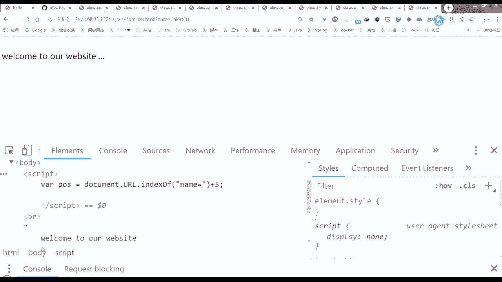

或者说，你刚才如果说是要是想要把它取出来的话，你就可以不使用这个e v a l进行一个执行，我可以把它复制给一个变量，然后你要对这个变量进行一个怎样的处理，然后我在这个cript标签里面进行一个处理。

而不是直接就进行一个执行了，这么说你懂吗，就是比如说我就直接把它复制给一个变量，而不是在这边进行一个，就会等于他的这一串，他截取的这一串，然后你接下来要干什么，或者是怎么怎么样。

你是嗯要输出一个什么什么东西啊，你就要对它进怎么，或者是你想要欢迎什么什么的，你就在这个后面进行一个写他的一个逻辑嗯。

这是一个问句还是怎么着，其实这个多米巡查ss的话，也不好说吧，大家还有什么问题吗，大家一定要去做一下这个实验，这个课后作业，这，如果没有什么问题的话，我们今天就下课啦，如果没有什么问题的话。

大家就打个一吧，像如果大家对今天这节课有什么建议的话，可以把建议发给我们的班主任，然后班班主任会反馈给我，如果有什么嗯，哪个地方没讲好，或者是怎么样可以跟班主任进行一个反馈，那今天的课程就到这了。

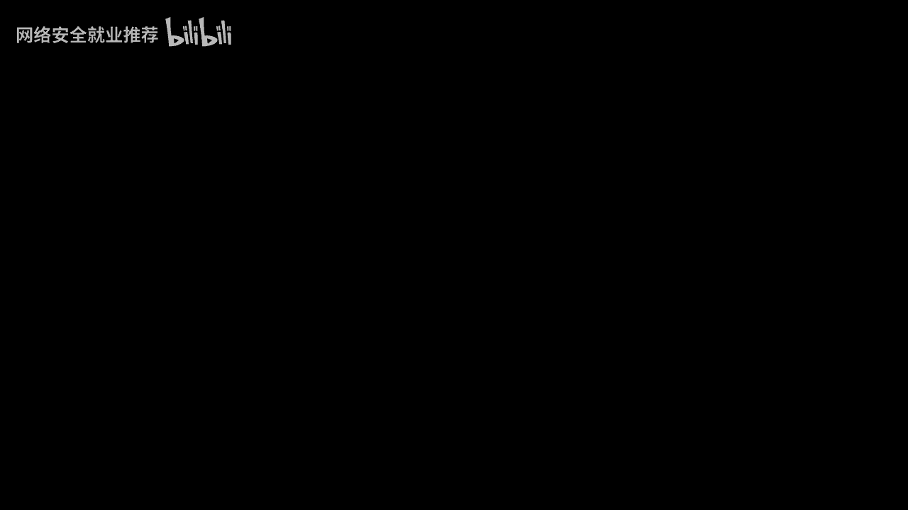