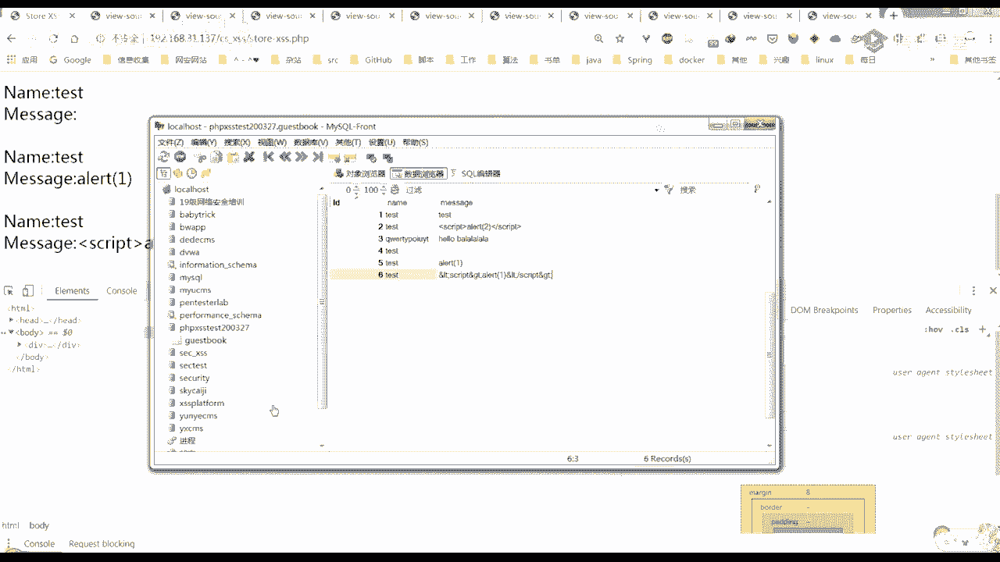

# 课程P7：第5天：XSS漏洞 - XSS基础概述及利用 🛡️

在本节课中，我们将要学习跨站脚本攻击的基础知识。我们将了解XSS漏洞的定义、危害、主要类型以及其利用的基本原理。课程内容将结合概念讲解与简单的代码示例，帮助初学者建立清晰的认识。

## 漏洞概述


跨站脚本攻击是指攻击者通过网站的注入点，注入客户端可执行解析的恶意脚本代码。当受害者访问被注入了有害代码的网页时，这些恶意负载会自动加载并执行，以达到攻击者的目的。

攻击者写入代码的逻辑可能是为了窃取Cookie、进行恶意传播或实施钓鱼欺骗等。为了避免与HTML中的CSS混淆，其英文缩写通常被称为XSS。

**核心概念**：`恶意脚本` + `网站注入点` -> `受害者浏览器执行` -> `达成攻击目的`

## XSS的危害

以下是XSS攻击可能造成的主要危害：


1.  **获取用户信息**：攻击者可以窃取受害者的浏览器信息、真实IP地址或Cookie。获取Cookie后，可能实现无密码登录，进而窃取账号内的个人信息。
2.  **钓鱼攻击**：利用XSS漏洞可以构造虚假的登录框，诱骗用户输入账户名和密码，并将其发送到攻击者控制的服务器。
3.  **注入木马或广告**：在主流网站中注入非法网站的链接，影响网站声誉。
4.  **配合其他漏洞进行后台操作**：例如，配合CSRF漏洞，利用JavaScript模拟浏览器发送数据包，进行增删改等操作。
5.  **XSS蠕虫**：实现自动传播，例如微博蠕虫（自动关注某人）或贴吧蠕虫（自动回复某个帖子）。


上一节我们介绍了XSS的基本概念和危害，本节中我们来看看XSS漏洞的主要类型。


## 漏洞类型及利用场景


XSS漏洞主要分为三种类型：反射型、存储型和DOM型。


### 反射型XSS


反射型XSS是非持久化的，攻击只执行一次。它也被称为参数型XSS。攻击者将恶意脚本附加到URL的参数中发送给受害者。服务器端未经严格过滤便将参数输出到页面，导致浏览器执行其中的代码。


**攻击流程**：
1.  攻击者发现存在反射型XSS的URL。
2.  根据输出点环境构造能触发XSS的代码。
3.  （可选）对恶意URL进行编码或缩短以增加迷惑性。
4.  将构造好的URL发送给受害者。
5.  受害者点击链接，XSS代码在其浏览器中执行。


**利用场景与示例**：
常见于搜索框、URL参数等输入点。例如，一个页面将用户输入的名字直接回显在页面上。


```html
<!-- 前端表单 -->
<form action="reflect_xss.php" method="GET">
    <input type="text" name="name">
    <input type="submit" value="提交">
</form>
```


```php
// 后端PHP代码 (reflect_xss.php)
$name = $_GET['name'];
echo "Welcome, " . $name; // 危险：未对$name进行过滤
```


如果攻击者输入`<script>alert(1)</script>`并提交，页面将弹出警告框，证明存在XSS漏洞。

**简单的防护与绕过**：
*   **防护**：使用`htmlspecialchars()`函数对输出进行HTML实体编码。
    ```php
    echo "Welcome, " . htmlspecialchars($name);
    ```
*   **绕过尝试**：如果防护代码只是简单替换`<script>`字符串为空，攻击者可以尝试大小写混合（如`<ScRiPt>`）或嵌套标签（如`<scr<script>ipt>`）进行绕过。

### 存储型XSS

存储型XSS是持久化的。攻击者将恶意脚本提交并存储到网站的数据库（如留言、评论、个人信息字段）。当其他用户访问包含这些恶意数据的页面时，脚本从数据库中被读取并输出执行，造成持续性的影响。

**特点**：攻击范围广，所有访问受影响页面的用户都可能中招。


**利用场景与示例**：
常见于留言板、评论系统、用户昵称等会保存数据并展示给其他用户的功能。

```php
// 存储留言的后端代码 (存储时未过滤)
$message = $_POST['message'];
$sql = "INSERT INTO guestbook (message) VALUES ('$message')";
// ... 执行SQL语句存入数据库


// 展示留言的后端代码 (输出时未过滤)
$result = // ... 从数据库读取留言
while($row = // ... 遍历结果) {
    echo $row['message']; // 危险：直接输出数据库内容
}
```


如果攻击者在留言中提交`<script>alert(2)</script>`，那么所有访问留言板的用户都会弹窗。


**防护思路**：
防护可以在数据**存储前**或**输出时**进行，但更推荐在输出时进行统一的过滤处理。
```php
// 输出时进行防护
echo htmlspecialchars($row['message']);
```


### DOM型XSS


DOM型XSS的攻击过程完全在客户端浏览器中完成，不涉及与服务器端的数据交互。漏洞成因是页面的JavaScript代码逻辑不安全，**不当地操作了DOM**（文档对象模型），将用户可控的数据当成了可执行的JavaScript代码。




**特点**：属于客户端的XSS，Payload长度可能不受URL限制。


**利用场景与示例**：
例如，一段JavaScript代码从当前页面的URL中提取参数，并直接用于动态修改页面内容。


```html
<script>
    var pos = document.URL.indexOf("name=") + 5; // 找到"name="参数值开始的位置
    var userInput = document.URL.substring(pos, document.URL.length); // 截取参数值
    document.write(userInput); // 危险：直接将用户输入写入DOM
</script>
```

如果用户访问的URL是`page.html#name=<script>alert(3)</script>`，那么`userInput`变量的值就是恶意脚本，`document.write()`会将其作为HTML解析执行，导致弹窗。

**与反射型的区别**：虽然触发点都在URL，但DOM型XSS的恶意数据**没有经过服务器**处理，是前端的JS代码直接将其写入了页面。

## 漏洞实操与总结

本节课我们一起学习了跨站脚本攻击的基础知识。我们了解了XSS漏洞的原理是攻击者注入恶意脚本，并在受害者浏览器中执行。我们详细探讨了三种主要的XSS类型：
*   **反射型XSS**：通过URL参数一次性触发，需要诱导用户点击。
*   **存储型XSS**：恶意代码存储在服务器数据库，影响所有访问者，危害更大。
*   **DOM型XSS**：由不安全的客户端JavaScript代码导致，攻击在浏览器端完成。


**核心防护原则**：**永远不要信任用户的输入**。对所有来自外部的、用户可控的数据，在**输出到HTML页面**时，都必须进行适当的过滤或编码（如使用`htmlspecialchars()`函数）。


建议通过相关的在线实验平台（例如，搜索“XSS跨站脚本攻击原理与实践”实验）进行动手练习，以加深对XSS漏洞发现、利用和防护的理解。