# P72：第41天：权限提升-Linux系统内核漏洞提权 - 网络安全就业推荐 - BV1Zu411s79i

能听到我声音的以及呃我的一个声音的话，应该是没有杂音的吧，如果呃能听到我声音，以及我的声音没有杂音的话，大家在讨论区扣个一，好的应该是没有问题啊，没问题的话，那么我们正式开始我们今天的一个课程内容。

我们今天的话主要给大家介绍一下linux，下面的linux系统，下面的一个提全，呃本节课的话主要的话有这四块内容，首先的话就是第一块linux的一个提权信息收集。

第二块的话就是linux系统内核漏洞的一个提前的，相关的一个介绍，以及以及利用的一些方法，第三个的话就是linux环境变量的提前，第四个的话就是密码哈，希我们通过密码哈。

希的啊一个方法来去进行一个呃提权，以及最后一部分的，哎呀不好意思啊，哎最近这几天喉咙喉咙之间有点有点废了呀，直接哑了讲哎给你们讲课，讲的喉咙有点受不了，然后还有点咳嗽，所以说中间可能会就是呃。

突然会就是我讲话的话，可能突然会卡一下，有可能讲着讲着突然喉咙就卡住了，这个的话呃大家见谅一下，好吧，好啊，最后一句话就是提前实验，就是我们实验室里面的两个提前的一个实验，大家给大家做一个课后作业，啊。

首先的话我们先来看一下第一块的一个，linux提权的一个信息收集啊，就跟我们前面在讲windows提权的时候，其实也是一样的对吧，我们windows信息，我们windows下面的一些提前的话。

我们的第一步，同样的也是去进行一个信息的一个收集，然后这边的这些收集的一个信息的话，其实就是为我们后面去做一个题，全是作为一个准备的，就我们前前面前期收集到的这些信息的话，我们用来寻找。

就是说作为我们去进行一个提前的一个呃依据，我们通过相应的一个信息收集的一个呃方法，收集到各方面的一些信息，然后再通过这些信息从这些信息当中去筛选出，我们能够去进行一个利用，也就是能够去进行一个提前的。

这样子的一些方法好呃，其实前面的话在讲linux啊信息收集的时候，其实这些话都已经呃已经介绍过了对吧，就是呃前面的话就已经给大家，就是呃比较详细的介绍，就是说我们通过什么样子的一些命令对吧。

在linux下面，我们通过什么样子的一些命令，去收集对应的一个信息啊，比如说它的一个发行版本啊，就是linux的一个版本以及内核版本，就我们再去进一个呃，linux的一个内核的一个漏洞，提权的话。

我们肯定需要去知道它的一个内核版本的，然后的话我们再去根据他的一个内核版本，来去寻找对应的呃，可能存在着这样子的一些提前的一个漏洞，然后环境变量，环境变量的话在呃待会儿就是后面的话会讲。

就是呃一个环境变量的一个提权，就是我们利用的就是它的一个环境变量，然后我们可以通过相应的这样子一些呃命令，就呃能够去查找到对应的环境变量的一个配置，然后还有就是网络信息对吧，网络信息的话。

我们需要去知道我们的目标机器上面，它的一个呃网卡，它有哪些网卡对吧，然后还有就是一些应用程序，一些呃应用程序服务，就是我们针对某一些服务，就是对他的一个服务的一个信息做一个收集。

就是呃我们前面其实在讲那个提权的时候对吧，就有讲就是嗯就是啊系统的一个提权，以及应用程序的一个提取是吧，以及在windows下面的话，就是相应的一个啊服务的一个漏洞对吧。

那么他的就是说系统上面的这种应用程序，它的一个版本对吧，以及它所运行的这样子的一个服务，那么如果说我们通过这样子的一些信息的话，找到了其中正好有事，正好对应的它运行的这个服务的一个版本。

它有这样的一个提前漏洞，那么我们就能够去作为一个突破口，去进行一个提前啊，以及还有就是啊运行的一些服务，在这的话就是特指的一个root用户，就说我们要去进一个提权，在我们linux下面的话。

就是从一个普通用户去提取到一个root用户对吧，那么我们在呃寻找的一个目标的话，其实就是呃针对这些服务，就说利用他的服务的一些配置的一个缺陷，然后的话他的这些服务的话，又是一个root用户去运行的话。

那么我们可以通过这样子的一个服务来去，把它提前到一个root用户，啊等等的，还有计划任务的，计划任务相关的这样子的一些信息，在下节课的话会讲计划任务的一个提前，而在这边的话。

就是我不会去把这些命令详细的做一个介绍，这个的话大家可以接受吧，就是这些命令的话，大家自己课后去哦了解呃，应该不需要我一个一个去讲吧，就前面呃前面也有提到，好的话就是相应的一些服务的一个配置。

像服务配置的话，像我们的hd p的http的这样子的一些配置对吧，他的一些配置啊错误，以及我们从这样子的一些啊，web服务的这样子的一些配置文件当中，能够去找到对应的这样子的一些，敏感的一些信息。

呃等等，还有其他的这一些，这边的话我就不一一的去说了呀，嗯这边的话大家自己看一下吧，pp的话已经发给大家了，我这边的话就不一的去搜了好吧，然后这边的话就是linux的一个提前的，一个信息收集。

就我们前面已经有介绍了这么多的一些啊，收集的这样子的一些信息对吧，但是我们实际的话去进行一个啊，对目标主机去进行这样做，这样子的一个信息收集的话，你不可能一个一个命令对吧。

你照着我这边的这样子的p p t对吧，这一点你去呃查找他的一个信息，这一点你再去查找对应的一个信息，那么这样子的话其实是没没有效率的对吧，所以的话我们通常的话会去用这样子的。

就是相应的一个信息收集的一个脚本，就是我们直接执行这个脚本，它就能够去批量的获取，我们所想要的这样的一些信息对吧，然后的话其实我们前面讲这一些，讲这些，分别去讲这样子的一些命令。

来去做对应的一个信息收集的话，其实就是让大家去了解对吧，让大家心里知道，就是说我这个脚本它收集到的是哪些信息，以及对应的这些信息，我们可以去干嘛是吧，然后在这边的话呃，我这边的话有给这样子一个脚本。

就是这个linux的一个集群的一个信息，收集的一个脚本，呜呃这边的话是在github上面的一个，就是提前的一个信息的提前性收集的一个脚本，他这边的话是一个shell脚本。

它里面写了很多的这样子的一些啊就是内容啊，这些内容的话，它就是针对的去做一个啊信息的一个收集啊，关于这里面的一个内容的话，大家想了解可以去看一下，但是呃我们在这边的话，你只只要知道。

就说他我们执行这个脚本之后，得到的一个结果对吧，就是那个结果他才是我们想所需要的，好在这边的话我们看一下。

我这边的话已经有直线了，因为他的一个脚本的话比较多呃，直线的话还是需要一点时间的呃，我这边的话已经提前的啊执行了，就是这个就是这样子的一个嗯，就这样子的一个脚本呃。

呃你们可以通过通过ppt上面的直接一个cl来去，就是获取下载它的这个脚本，然后的话给s h去执行吧，就是通过s h来去执行这样子的一个需要脚本。

之前的话，它就会呃进入到这边。

进入到这边的话，下面这些的话就是它的一个分别的呃，他那个脚本执行之后所收集到的一个信息，也就是返回给我们的一个信息，那么这些信息的话就是我们所需要的，在这边的话，我大概呢就是呃提一下对应的。

对应的它收集了这样子的一些信息，啊其实大家执行之后的话，通过这个脚本这边也能够很清晰的知道，首先第一个就是basic information对吧，就是基本的一个信息。

也就是我们的一个基本的一个信息信息收集，然后他这边的话就是收集我们常就是常用的，也是经常常见的这样子的一个，系统的一个版本对吧，其实这边的这一句话就是我们通过your name。

your name ga对吧，用name刚来执行之后，执行之后的一个结果对吧，就是放在了这边，其实你要会去写这样子的一个脚本的话，然后的话你又知道你，你了解了我这边讲的这样子的一些东西的话。

你自己也可以去写这样子的，对应的一个脚本对吧，就是他这边的话就是执行用那么干之后的一个，输出嘛对吧，然后在这边的话就是你当前的一个用户嘛，就是比如说你当前的用户，执行id这边返回的一个结果是吧。

然后当前的一个公司的话是bob是吧，以及host name啊等等的这样子的一些呃，还有的话就是啊writable frog，也就是可写的一个目录，也就是在这个目录的话，我当前的这个用户。

这个普通用户可以往这里面去写东西对吧，然后写东西的话就说明我如果说我们要去写入，写入一个这样子的一些脚本什么的，我们可以写入到这个目录对吧啊，以及还有的话这边有列出了两个命令，就是两个常用的一个命令。

ping以及nc，然后他这边有列出这两个命令，它是干嘛的对吧，像p的话，我们可以啊用来做这样子的一个网络发现，还有nc，就说它的这一个，而linux系统下面的话，有装有安装这样子的一个nc的一个命令。

那么我们就可以直接去使用对吧，它能够去进行一个端口的一个扫描啊，还有网络的一个发现对吧，他这边的话呃其实都写得很清楚了对吧，还有的话下面的话就是系统的一些信息，其实就是我们的啊。

这边的话就是那个在乌班图下面的话，就是那个lsb干release，执行这个命令之后的一个结果啊，然后还有就是so do so do的一个版本，在我们后面的话，在我们下节课的话会讲。

就是收do的一个权限的一个滥用，就是说它收do的话，它的一个权限他没有做好的一个控制，然后的话我们就可以利用它来去做一个提前，嗯以及还有pass pass的话就是我们的一个环境面。

就待会的话会呃讲就是这样子的一个目录啊，然后待会的话再给大家讲，就是环境变量它的一个作用，其实环境变量的话，就是跟我们windows下面的那个环境变量一样嘛，对吧。

你在windows下面你去配置那样子的一个环境变量。

然后的话你把你想要去执行的这样子的，一个程序，把它给添加到这样子的一个环境变量当中。

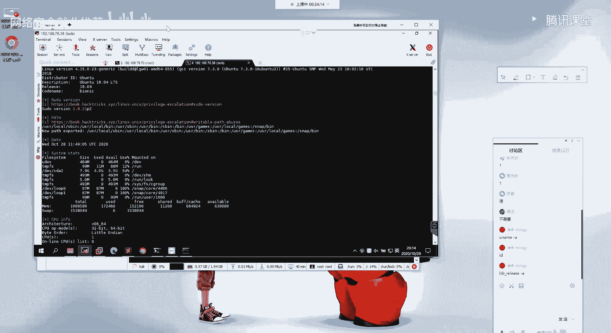

那么你在cmd下面，你去执行对应的一个命令的话，他就不会说报not fund对吧，就是找不到那样子的一个面，因为你配置到环境变量，当中的话它就会去环境变量当中，你所配置的那个目录当中。

他去查找是否有这样子的一个程序，如果有的话，他就可以去直接的执行，就linux的话跟windows上面的话呃也是类似的，就是你在linux上面去执行相应的命令，他们去在这个环境变量当中去查找啊。

是否有对应的这样子的一个啊，你执行了一个命令的一个程序，如果有的话，他就会去执行它，然后的话返回结果给我们对吧，以及还有时间啊，还有呃系统的这样子的，这边的话就是一些磁盘cpu等等的。

我这边的话我就不一一的去那个了，然后他这边的话，它所输出的一个信息是相当丰富的，还有现在这边utiful soft software，也就是呃我们可以去执行的，或者说而他的一个目标，这边的这个机器上面。

它能够去啊，我们能够去执行的这样子的一些命令，像比如说nc啊，对吧啊，we get cl这些命令我们都是有权限去执行的，还有ping以及gcc，make这样子的一些编译的一个环境对吧等等的。

还有python 3，还有这样子的一些脚本，呃以及嗯这样子，后面的话就是我们要去收集的这样子的一些，服务的一个信息，就是我们的一个定时任务，我们的一个进程，我们所就是系统当中的一些服务对吧。

这边的话就是呃进程的一些信息，以及这边啊电池任务对吧，在，呃这边电池任务，然后在这边的话，你可以看到这边他有这样子的一个定时任务啊，就其实这边的话呃我们下节课的话会讲。

就是我们通过发现他这边电视任务的这样子的，一个呃这个程序啊，就他每隔一分钟执行的这样的一个程序，因为它是一个note用户去执行的，所以的话我们可以去查找到对应的它这个程序，它的一个作用。

然后的话如果我们可以去分析它的一个行为，如果他能够去进行，就是说我们可以利用他的这样子的一些一个，呃权限的一个配置的一个错误，能够去进行一个提权，当然的话就是呃后面给大家介绍了啊。

以及后面的还有很多的这样子的一些东西的话，其实就是对应的我们前面分别去讲的这样子的，一些，在linux上面执行的，这样的一些信息收集的一个命令，我这边的话我就不一的去说了，好吧啊。

这边的话应该可以带大家大概的看了一下，他这边的话有很多的这样子的一些信息啊，好我们可以根据这边得到这些信息对吧，能够去有针对性的去分析它。

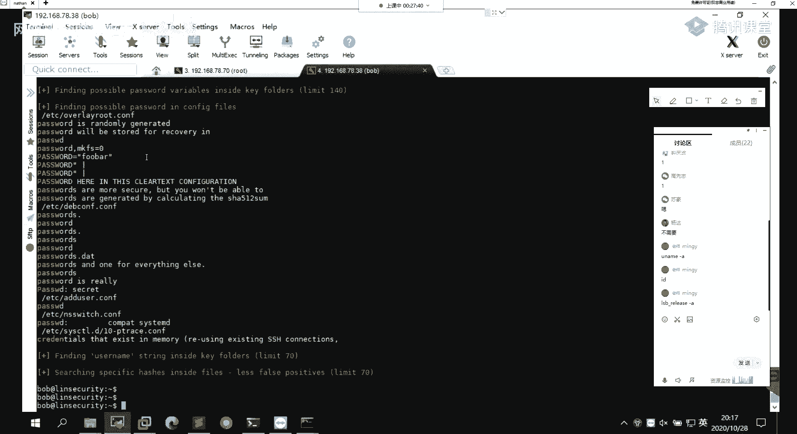

呃这边的话就是这个信息收集的，就是提前的一个信息收集的一个，脚本的一个使用啊，以及对应的这样子的一些收集到的一个，信息的一个介绍，呃上面的话就是一些信息收集的这样子的，一些啊一个方法。

然后还有的话就是这边准备还有查找利用代码，就我们前面在讲提权的时候，就也有说有一个条件对吧，就是你要能够去提权的话，你首先要有对应的这样的一个提权漏洞，好的话，你有这个漏洞的话。

你还需要有对应的一个利用的一个代码对吧，如果你没有对应的利用代码，那么，那么你也利用不了这样子的一个漏洞是吧，然后的话有对应的一个利用代码的话，我们知道就是说利用代码的话，有像这个这样子的一个像c啊。

c加加对吧，然后还有像python的，还有像v by的等等的这样子的一些环境，就说通过这样子的一些呃脚本语言所编写的，对这样子的一些应用的一个代码对吧，那么对应的你要去在对应的。

他的一个目标机器上面去执行的话，你就需要去知道它的一个目标机器，它支持什么样子的一些啊语言环境对吧，像比如说你要去执行一个python的一个脚本，那么如果目标机上面，它没有python这样子的一个环境。

那么你怎么去执行呢，你执行不了，以及对应的你要去做一个，就是编译你的一个c代码的话，你需要有gcc这样子的一个编译的一个环境，对吧，以及呃就是上传文件的一个环境，就我们去做一个在那上面去进行一个。

文件上传嘛，就我们前面在文件传输的时候，其实也介绍了就是那个上面的一些方法，然而最后的这一个的话就是呃查找利用代码，就我们前面对吧，相应的一个信息的话，我们已经收集完了，收集完了对应的一个信息。

我们分析，我们分析之后的话呃，查找就是说通过对分，对信息的这样子的一个整合对吧，我可能就是发现了，其中有对应的这样子的一个漏洞，那么我知道了，他有这样子的可能存在着这样一个集群漏洞。

我想要去查找对应的一个利用的一个代码对吧，那我们通常的话会去哪里去寻找呢，就你可能会说你直接百度对吧，你百度的话你可能就是你的一个针对性不强，而且呃你百度的话就是你看别人那个文章的话。

可能呃千奇百怪啊对吧，然后在这边的话就是呃给大家介绍一下，就是一些常用的这样子的一些，我们去查找利用代码的这样子的一些网站啊，包括国内外的这样子的一些网站，就我们再去。

比如说我们最近去爆发了这样子的一个呃，就是爆发了这样的一个漏洞对吧，然后的话它的利用代码啊爆出来了，那我们去哪里去找呢，首先第一句话就是这个exploit db啊，这个的话就是一个漏洞信息库。

然后我们在这里的话，我们能够去查找到，就是说你呃就是说能够去查找到，已经爆出来的这样子的一些漏洞，它的一个应用代码，比如说嗯，就这一个吧嗯，比如说就这一个吧，这个的话正好符合我们的一个。

今天的一个课程内容，就是一个本地本地的一个提权，就本地提权的一个漏洞，然后我们在这的话，我们就可以去找到它的这样子过洞，它是在一个blue ma，他这个版本他小于2。1。4的这个版本的话。

它存在这样的一个本地提权的一个漏洞对吧，然后在这边的话就能够去找到他的一个e x p，就他的呃，有它详细的关于这个漏洞的一个信息对吧，然后的话以及它的一个new的一个方法，然后我们在这边的话也可以去。

去下载看到这样子的一个e x p啊，然后的话去进行一个使用，这是一个。

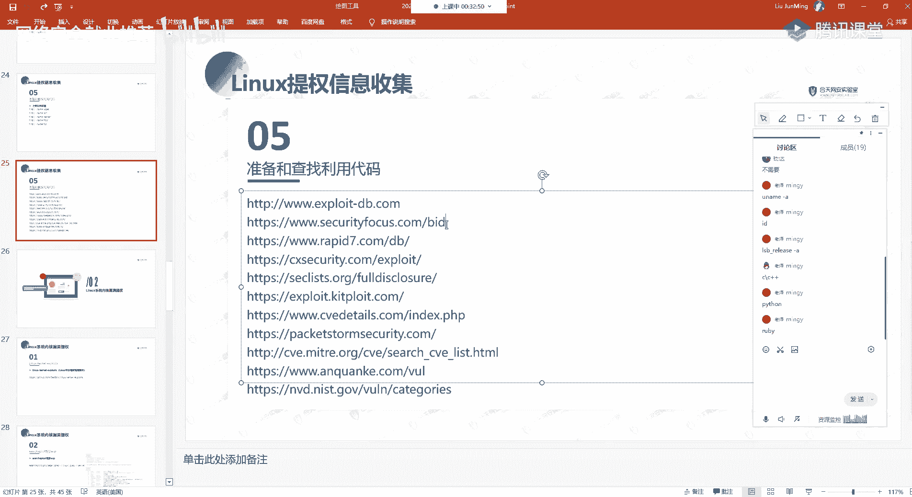

啊咳咳有点咳嗽啊，我这然后还有的话第二个的话就这个security fox，这个的话也是呃比较好的这样子的一个网站，就是你要去做，比如说你要去，你要去对某一个就是已经爆发的一个漏洞，做一个复线对吧。

然后的话你做漏洞复现的话，你要去了解它的，就这个漏洞它比较多的相关的这样的一些信息，就不仅仅是你的一个利用脚本对吧，还有其他的这样子的信息一些信息，那我们就可以在这边去做一个查找，好像在这边的话。

他呃我们通过cv的一个编号能够去搜索，我这边话我就呃就以这个为例吧，我在这边就不说了，就是这个jack的这样子的一个cv的一个漏洞，好，我们在这里的话，就是找到对应的这样子的一个页面对吧。

在这边的话它就有关于这个漏洞，它的一个详细的信息，那比如说它能够他就是它影响了一个版本，就存在漏洞的这样子的一个版本，以及它的这个漏洞发现的一个时间对吧，以及它的一个cv的一个编号，然后还有的话。

呃这个没有，然后还有的话就是这边exploit，就是我们的一个e x p嘛对吧，然后他这边的话它没有列的话，就说明呃在这边他没有啊，我们找一个看有的，加上一，嘿嘿，没有了，看下能不能找到一个有的呀。

就是啊在这边一叉p这边我们就能够去查找到，对应的，就是在这边exploit db，或者说其他的一个地方的这样子的一个呃，利用的一个脚本啊，这个没有没有的话就算了，然后呃还有，就是说在这边的话。

我们能够去查找到对应的一个信息，以及在这边有一个reference，不要粉丝的话就是引用嘛，就说他的这样子的信息，他是从哪边获取到的，然后这些引用的话我们就可以去查找到对应的。

现在这边的话就是这个x map的，它的这样的一个漏洞对吧，这是它的一个官网，以及在这边的话有对这样子的一个漏洞的一个，详细的一个分析对吧，如果你想要去复现这个漏洞，你就可以去参考他的这样子的一个文章。

然后去去对它做一个分析，对吧，这种话是一个xss的一个漏洞。

这是一个呃，还有的话我我这边的话。

我就不一的去那个去说呀，我这边列举几个就常用的，就这些的话呃，这边我列的这些网站的话，都是就大家去找对应的这样子一些漏洞的一个，信息的话，呃反正是我我这边要去找的话，我通常会去这样子的一些网站去查找好。

这句话就是这个rap的七rap 7的话，呃如果大家就是这个的话，大家应该都听过吧，都知道吧，就是我们的一个msf的这样子的一个框架的话，就是这个公司的一个产品，就msf的话是啊这个公司的一个产品。

然后的话是由他们在做的一个呃维护对吧，然后在这边的话就是呃，它这边它有对应的这样子的一个，就是漏洞利用的一个数据库啊，然后在这边同样的就是有对应的这样子的一些，呃，对应的这样子的一些呃。

e x p以及对应的这样的一个信一些信息对吧，像比如说这样子的这一个cv的一个漏洞，它的一个呃描述，以它的一个解决方法，这个应该有，以及呃这个话是另外一个网站，就在这边的话，它有列出了。

就是呃他的一个信息啊。

也是。

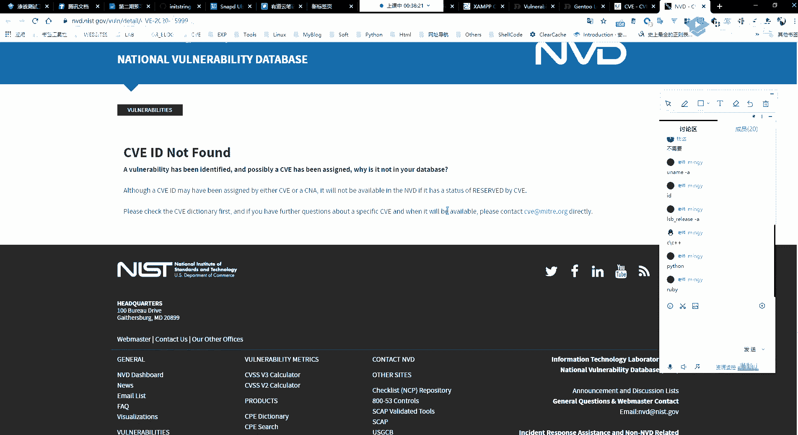

然后这边的话就不翻了，就是我们通过这样子的一些网站，它所就收集的一些信息嘛，去查找我们想要的这样子的一些呃，我们想要的这样子的一些内容，然后还有呃像在这边的话有。

model model这边的话就是你可以翻一下，嗯model这边的话就是我们msf当中，不是有集成很多的这样子的一些漏洞，利用的一些模块嘛对吧，那些模块的话其实就是啊，就是漏洞爆出来之后的话。

就有对应的一些安全研究人员对吧，他针对这样的一个漏洞，他会去啊写这样子的一个就通，就写这样子的一个漏洞利用的一个模块对吧，然后的话把这个模块集成到我们那个，m m sf当中是吧。

好在这边的话就有对应的就是这样子的，就关于这一个漏洞，他的这样子的一个啊利用的一个模块是，就这样子的这个漏洞，它的一个s1 ，然后关于这一个漏洞，它的这样子的一个啊模块的一些选项对吧。

在这边的话我们都能够去看到，就是啊，然后的话这边的话都是就是最新爆出来的，这样子的一些漏洞嘛对吧，然后我们在这边的话就也能够去，就实时的去查找到，就是说它最新的这样子的一些漏洞是吧。

然后这边的话就是一些呃查找漏洞，利用代码的这样子的一些网站啊，还有像就国内的话就是这个呃这个安全课对吧，安全课这个的话应该也是，大家就是常经常会去看的对吧，他这边的话也有去就是实时的在更新。

就是最新爆出来这样的一个漏洞，然后我们可以在这边去查找到它对应的，这样子的关于这个漏洞的一个信息对吧，那大家再去就大家如果从事安全这个行业的话，你就必须要去实时的去关注这样子的一些，最新的一个漏洞对吧。

然后你最新漏洞你报出来的话，你需要去你需要去研究它对吧，然后去复现它，那么你要去复现它的话，你就需要去知道这个漏洞，它的一个详细的一些信息对吧，所以的话你就需要去查找到，对应的这样的一些信息。

我们可以通过这样子的一些网站，因为这些网站的话，他已经把我们想要的这样的信息，都已经就是呃囊括进去了，我们只需要去做一个简单的一个检索，就能够去找到了，啊以上的话就是我们的一个linux下面的一个。

提取信息的一个收集的一部分，第二部分的话就是linux系统的一个内核漏洞，的一个提权，就是讲到讲到系统的这种提前漏洞，就是内核的这种提前漏洞的话，都是就是很常见的，而且就是内核这种漏洞的话。

也是我们就是最常去进行一个呃，尝试利用的对吧，诶你的一个内核漏洞的话，你去利用的话，我们就比较简单，直接是吧，我找到对应的一个代码，利用代码，然后的话我直接就能够去进行一个提群，然后在这边的话就是啊。

给大家介绍这个linux平的一个，提权漏洞的一个集合，这个的话跟我们上节课讲的，windows下面的一个提群漏洞集合的话，其实是对应的，就是说那边的话他那个话就是windows下面的对吧。

然后这一个的话就是另linux下面的这样子的一个，就是啊都是这一个six y，他的总结的，这个就是他把呃，历史上面呃爆出来的这样子的一些集群相关的，这样子的一些，而不是提权相关。

就与内核相关的这样子的一些漏洞，然后的话他做了一个这样子的一个集合，然后在这个集合当中的话，比如说我们找一个最新的这个，2018年的这个对吧，就这这样子的一个漏洞，然后在这的话就有对应的这个漏洞。

它的一个呃介绍对吧，以及呃与这个漏洞相关的这样子的一些链接，以及这边的一个能够去做一个权限提升，这个的话是这个gleb c的一个权限，提升的一个漏洞是吧，然后这个漏洞这边的话就是它的一个呃。

他的一个e x p，也就是它的一个利用代码对吧，它是一个c语言所编写的，所以的话我们只需要去，而通过gcc把这样子的一个代码做一个编译，我们就能够去进行，就能够去得到对应的这样子的一个啊。

利用这个提取漏洞的一个可执行程序对吧，然后还有其他的这边，这个的话就是其实这些的话，就是你没必要去一个一个的都去看啊，当然的话你想要去那个去研究的话，你可以去看看看这里啊，呃其实，这边这一个。

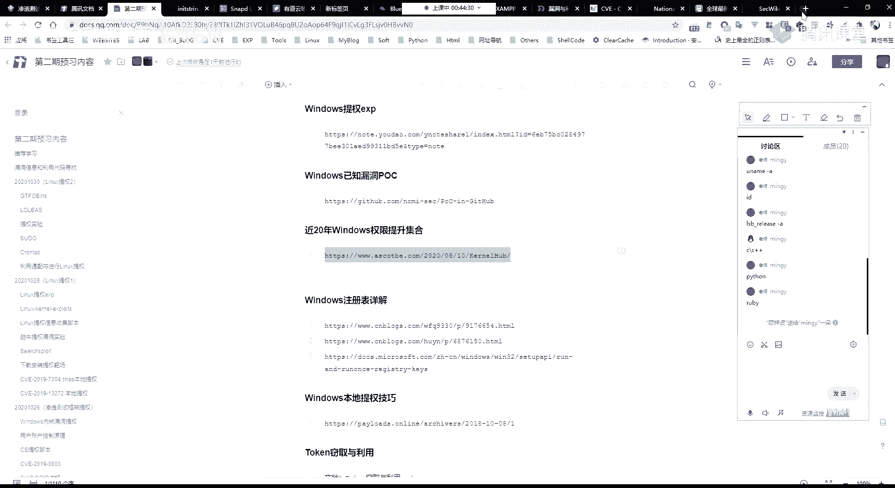

所以如果你对这一些东西感兴趣的话。

你可以像像他一样对吧，像他这边就啊像他这边一样，他做了一个这样子的。

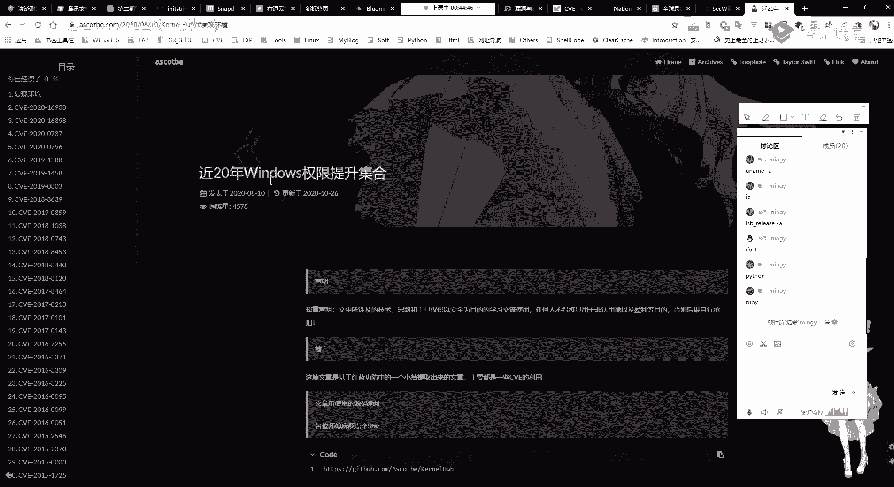

也就是windows下面的一个20年来，windows权限提升的一个集合，然后其实这边的这个集合，其实就是他的他对这样子的一些提取漏洞，它的一个信息的一个汇总对吧，然后的话他去对这样子的一些漏洞。

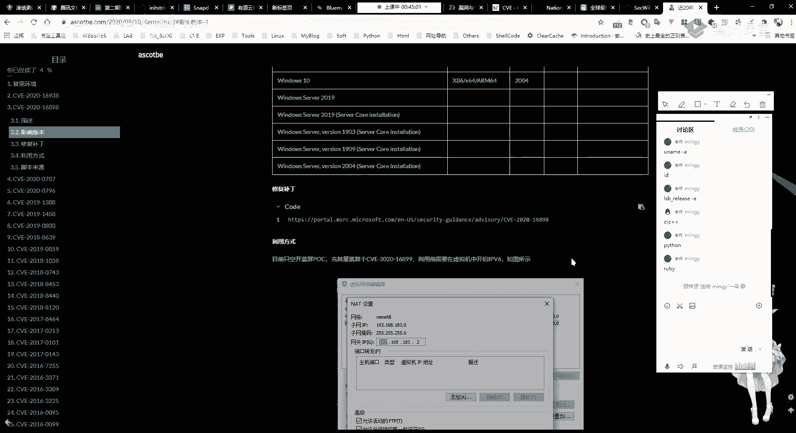

他自己去做一个研究，去做一个尝试，然后的话做下来一个笔记对吧，而其实大家自己去做这样子的一个，安全研究的话，然后呃一定要去一定要就是说做好笔记啊，就是说你的这样子的一些内容的话，你说这样子的一些内容。

你你自己去做过了，你自己去做过了，然后你把它记下来对吧。

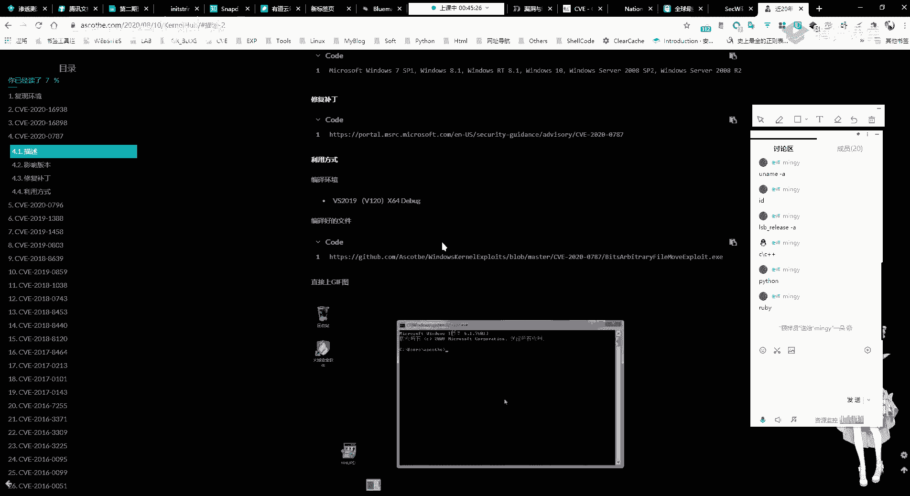

记下来的话你写到笔记当中，就是你之后的话笔记你之后的话你再去看对吧。

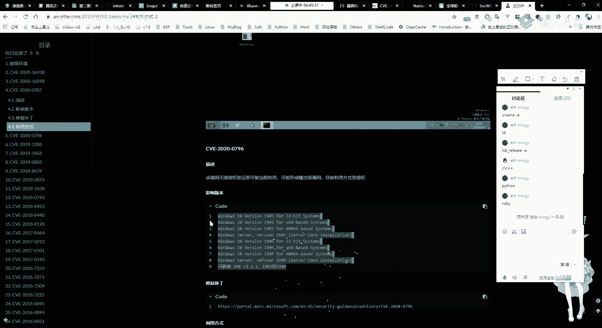

然后的话你也可以把它分享出来对吧，就像像他这样子对吧，他把对应的这样子的一些提权漏洞。

它做了一个汇总，然后的话你下次你去那个的话。

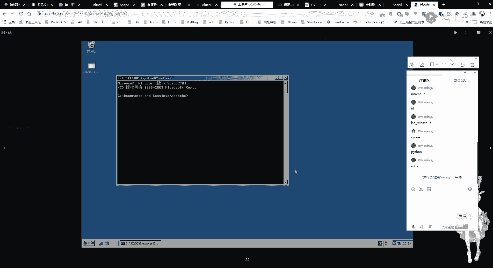

你可能就是说因为这些东西的话，其实你都自己有尝试过对吧，你尝试过了他的这样子的一些东西，你已经学过了，但是你学过了的话，你说不定忘了呢是吧。

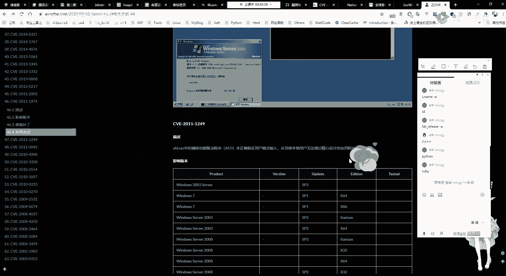

然后在这的话，你就可以在你自己的这个笔记当。

中去做一个检索嘛，就不不不用说你再去啊，那样子的一些网站当中去进行一个检索。

啊其实我这边要说的话，其实就是让大家做好笔记啊，然后的话就是你去做做这样子的一个研究的话，呃，就其实就多分享吧，就其实我这边的话，其实我这边的话，我的笔记都是在有有在在我这边。

就是当时的话我没有说去总得很没有去纵横的，就是去做一个很好的一个总结吧，然后他就比较零散，就可能就自己要用的时候对吧，就去搜一下，然后看一下，就是啊，然后这边的话就是linux平台的一个。

提权漏洞的一个集合，就是我们再去要去用到的时候对吧，我们通过前面的一些信息收集对吧，我们知道它可能存在这样子的一个呃，cv的一个漏洞对吧，那么我们可以在这边去查找对应的一个，利用代码对吧。

他这边的话都已经就是已经把它放做成了，一个集合嘛对吧，我们只需要知道一个cpu编号，我们就能够去找到对应的一个应用代码，就能够也能够去啊减少自己的很多的一个时间，好第二个的话就是这个啊。

sequit搜索e x p，就我们，就我们前面的话是通过这样子的一个网站对吧，去紧所对应的这样子的一个漏洞，他的一个e x p，但是的话我们在这边的话，如果说我只知道。

就是说我只知道它是一个linux的一个系统对吧，然后的话我知道它的内核的一个版本，那么我那么我去进行一个检索的话，我需要在这样子的一些网站，我去我要去一个一个关键词，就去进行一个搜索对吧。

然后在这边的话，在这边的话有这样子的一个search for的一个工具，这个工具的话就是用来去紧锁，我们的一个可用的这样的一个e x p的，然后它的这个工具的话。

它是依托于那个我们的这个exploit db，就是这个依托于这个exploit db，就是它里面所检索的出来的一个数据，它其实是从这个expd b呃，从这个网站它的一个数据当中获取的。

然后的话这边的话就是它的这个工具，它的一个呃详细的一个使用，我这边的话已经啊贴贴出来了，然后这边的话是我的一个笔记啊，就是总结了这样子的一个东西，就关于这个such p，关于这，个话介绍了它的一个安装。

就是呃我们因为他的一个数据库的话，就是说他去检索的一个数据库，你再看里面的话，它是自带的，然后的话如果你不再看里面的话，你需要有对应的这样子的一个数据库，然后呃在看你里面，其实大家可以直接打开看你啊。

打开看你的话，因为直接输一个cg boy，他就能够去啊执行，然后这边的话在卡里里面，他其实呃有已经有存储了，就是我们常用的这样子的，就是说在excel在这边exploit db这边对吧。

比如说我要去下载这个e x p啊，就是像这样子的一个文件对吧，就是这一个49489630tt，这样子一个文件，就这一个文件的话，嗯哼哼哼，呃呃其实对应的这样子的一个文件的话。

其实在呃我们的一个search point，就是说在我们的一个卡里面的话，它已经存在了。

就是它已经保存在了，我们那个看你计算当中，然后的话我们在sequit这边的话，我们可以直接去检索到对应的这样子的，像比如说我去检索一个linux对吧，我这边搜索这样子的一个linux搜索之后的话。

在这边他就有六出了，就与linux相关的这样子的一些e x p是吧，以及在这边的话就是它的这个文件的一个路径，呃这个文件路径的话是，这个文件路径我忘了在哪，就在这边，就是，就我们在这一个目录当中的话。

我们就能够去查找到就是这个脚本对吧，就是这个47292点c的这样子的一个，c c语言的一个脚本，然后它是存放在我们看你里面的，这样子的一个目录啊，其实对应的这边的话，其实就是这边的这个信息啊。

其实就是这里的这个嘛对吧好，我们可以到这个目录里面去看一下，它里面的话有存的，存储着很多的这样子的一一些脚本对吧，像比如说我要的是linux的对吧，然后我cd到linux的根目录。

然后他在这边的话就有列出了这样子的一些c，然后对应的这边有这么多的一些目录的话，它同样的都存在有多个这样子的一个呃。

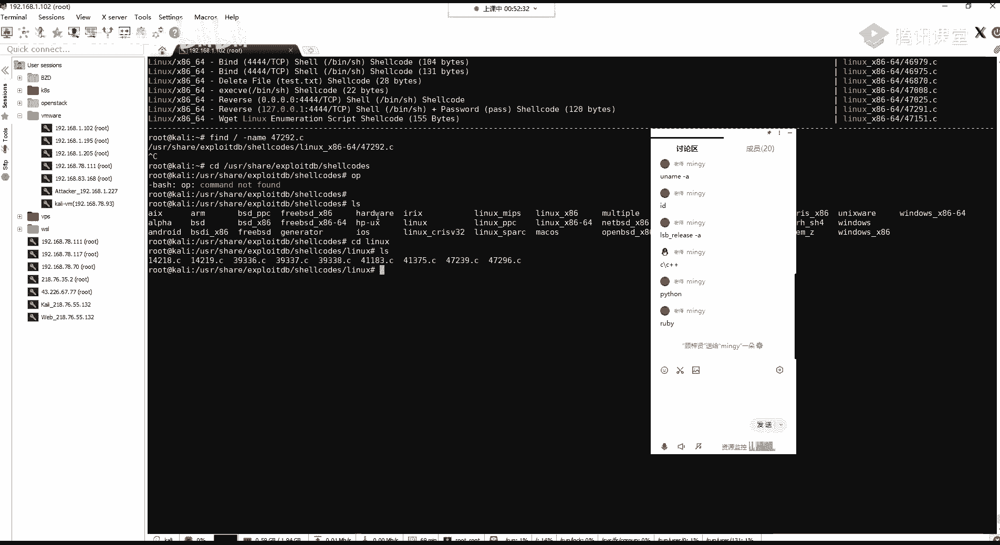

e x p的这样子的一个，这样子的一个脚本，然后的话呃关于这一个工具它的一个使用的话，大家看我这边的一个笔记吧，好吧呃，就在用之前的话，我们可以通过sch fit干u来去做一个更新。

就是更新我这边的这样子的一个数据库嘛，对吧嗯。

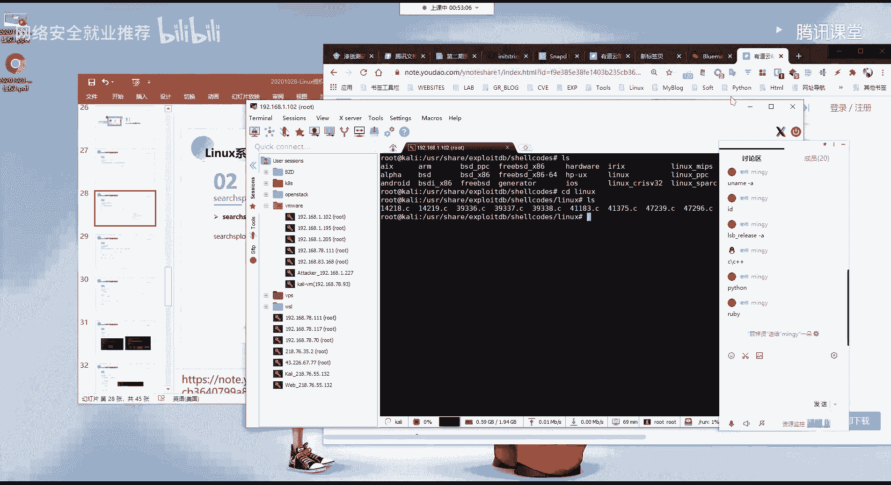

然后其实sex boy话，他也可以就是在线的去进行一个查找。

就是他查找的一个数据的话，去查找，去紧所对应的一个信息，嗯所以说还是甘油，而他在这边的话，它就会自动的去更新啊，去更新我们这边的一个呃。

e x p的这样子的一个数据库，然后我们更新完之后的话，它就能够去获取到，就我们在这块就能够获取到，最新的这样子的一些呃e x p对吧，然而关于它的一个使用这边的话呃，我们以一个实际的一个例子。

我这边以一个实际的一个例子，给大家做一个介绍，我这话我就不会去一的去那个呃，这边的话我已经就写的应该比较详细了对吧。

在这边的话我以一个例子就是，以以我这边的这个机器啊，啊这个以我这边的这一个机器吧，这个乌班图的一个机器为例啊，我这边的话是一个无关图的一个机器，18。04的啊，我当前的一个版本，我的一个内核版本。

我的一个内核版本，他就是这个4。104。1。5对吧，4。15的这样子的一个内核版本，然后的话我我想要去检索，就是说我想要去检索，就是说紧锁能够去在这样子的一个系统当中，去进行一个利用的。

这样子的提成的一个漏洞对吧，然后的话我们可以通过嗯，我这边的话哇这么多，那不更新了呀，我这话呃可以通过这个session for来去进行一个检索，就首先的话我这边的话我要去检索的话。

就是呃我当前方是一个linux的一个系统对吧。

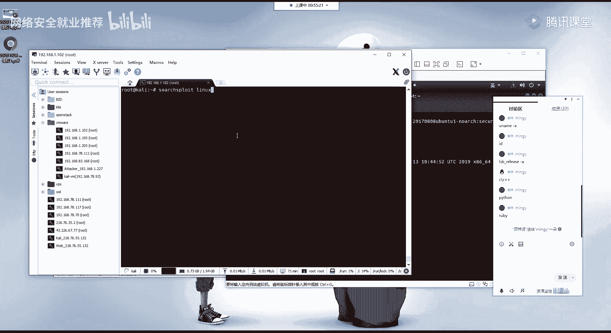

所以的话我要去获得一个新型的，就是linux下面相关的这样子的一些e x p对吧，好，这句话它也列出了有这么多的这样子的一些，对吧，然后这里的话现在这边的一台p的话。

这边就有其实他是这样子去做的一个构成，就是这边的话是你的一个linux的这样子的，一个呃架构对吧，像呃arm的，还有的话残留式的这样子的，然后中间的话就是关于这样子的，关于这一个漏洞的一个介绍。

然后呃最后最后面的话这边的话就是peace，也就是路径，就是这边的这个漏洞所对应的这样的一个，e x p所存放的一个路径，就是在我们刚刚的那个目录下面嘛对吧，然后这边的话它的一个信息的话是比较多的。

对吧，就是我们还需要去做一个进一步的一个筛选，然后在这块我想要去利用的话，就是我想要去检索这个系统，它是不是有一个而内核的这样子的一个。

提群漏洞对吧，那么我们可以加这样子的一个关键词，channel就是啊k i n e l，这个话就是内核的一个意思。

这个内核核心内核是吧，然后的话呃在这里的话，它同样的也要有列出来这样子的，这么多的一些信息对吧，然后在这边的这些信息的话，我们就就比较直观了，也算就是linux呃内核对吧。

然后后面的话这边的话就是内核的这样子的，一些版本对吧，以及这个漏洞它的一个呃名字介绍对吧，然后在这句话有对应的，它的这些信息都已经列出来了，然后我这边要去查找到的话，就是我这边的这个系统，它的一个内核。

我看一下是这个4。15是吧，然后我这边我再去加这样子的一个呃条件，现在的话，现在的话就是返回了这样的一些信息的话，就明显少了很多对吧，然后的话在这边的话就是呃它返回的这样子，这些信息的话。

就是我们的这边linux系统下面的一个4。5，就是4。5版本就是满足啊，你的一个内核版本是4。5，这样子的一个呃系统，它所就是存在的，就是说已经被爆出来的这样子的一些漏洞。

以及它对应的这样子的一个可以去利用的，这样子的一些e x p的一个路径对吧，然后在这的话呃我们就可以去查找对应的呃，我们想要去进行一个尝试的，这样子的一些题型的一个e x p对吧，我这边的话是一个4。

15，然后再找到这边的一个就是一个提权，好，找到提权的话，就是我们的像我们这边的这个就是local priorge，对吧，这这这这边的这一个三个单词的意思，就是本地特权提升，就是本地的一个权限的一个。

这个是逃脱嘛，其实就是逃脱本地的这样的一个权限嘛，也就是权限的一个提升，然后在这的话，我们就呃有找到他的这样子的一个描述，这边对吧，是这个这个是可以去进一个利用的，他这边的这个内核版本的话。

就是就是说你的一个系统是处于，这一个4。10~5。1。17的这样子，一个版本的一个内核的话，你就可以去尝试，就有可能存在这样子的一个，本地特权提升的一个漏洞对吧。

然后这边的话对应的这样子的一个e x p，它就是这个对啊。

然后在这里的话我们可以通过search sp，加加一个杠p就指定一个路径，指定我们的一个pass pass的话，就是这边吧这边所显示的。

然后我们在干p参数，加我们的一个pass的话，就能够去显示这个漏洞利用的一个完整路径，我来，执行一下，执行之后的话，在这边的话就显示了关于这一个e x p的，对应的这样子的一个详细的一个信息是吧。

这边的话是关于这一个，就是内核版本的这样子的一个呃。