# P76：第45天：权限提升-Mysql数据库提权 - 网络安全就业推荐 - BV1Zu411s79i

大家晚上好不好。

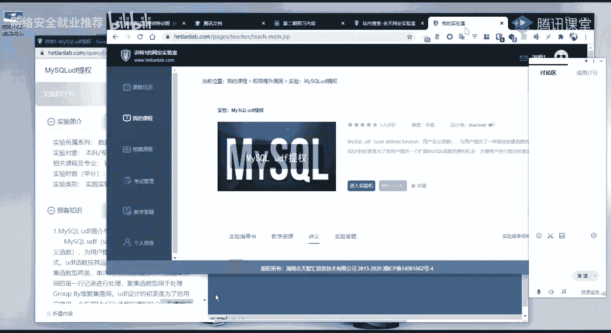

能听到我声音以及我的声音没有杂音的，在讨论去扣个一，嗯好的，应该是没有什么问题啊，呃那么就正式开始我们今天的一个主要内容，我们今天的话主要给大家介绍一下，数据库的一个应用题全啊。

这前面的课程的话都是给大家介绍了，就是说windows精进下面这种系统的这种题选对吧，然后的话像我们的常见的这种呃，数据库的一个应用，提前的话，前面没有介绍的，然后本节课的话主要的话就是介绍这一期。

就因为我们呃经常的话对吧，我们通过这样子的一个web的一个应用，而你一个web应用的话，那么他肯定会有由于这样子的一个数据库的，这样子的一个交互对吧，以及我们常见的这样子的一个。

sql注入的这种漏洞对吧，它都是啊有这样子的一个数据库的，那么当我们在拿到这样子的一个，比如说拿到一个web share对吧，然后的话拿到这个web shell之后的话，它里面的话有这样子的一个数据库。

而这个数据库的话我们可以利用它来干什么呢，然后在本节课的话，我们就给大家介绍一下，利用了这样子的一个数据库的这样的一个应用，来去进行一个提前来去得到啊，这个呃服务器的一个缺陷。

就是说原本的话我们得到的是呃，我们得到了一个web share对吧，然后的话呃对应的这样子的一个数据库，我们可以通通过它来去进行一个，权限的一个提升，然而本节课的话就是呃关于数据库的一个应用，题。

全的话，我这边呃主要的话分为了三块内容，然后本节课的话就是给大家主要介绍，mysql的一个提取，以及mysql server的这样子的一个提取，然后关于这个power correcycle的话。

我放在后面的那一节课给大家做一个介绍，因为我放了一节课的话讲不完，就所以的话本节课主要给大家介绍呃，mysql的一个提权以及sel，sel的一个提前的一些详细的一个操作，呃。

第一部分呢就是这个mysql的提权，就关于mysql数据库的话，大家应该都是比较熟悉了对吧，就是啊也是我们经常见到以及经常使用的，这样子的一个呃，数据库的一个这样子的一个呃引擎是吧。

然后的话呃再去了解什么，是再去了解mysql提权之前的话，我们先来了解一下就是什么是u d f，也就是我们本期的话会去使用到的这样子的，一个ud f的用户定义函数，然后这个呃udf的话。

就是这个user defined function的一个景显，就是用户定义函数，它的一个作用就是为用户提供了一个，高效创建函数的一个方式啊，呃具体的一个创建函数的一个方法，是通过这样子的。

就是说我们可以去编写一个这样子的一个，调用系统，cmd命令的这样一个，ud f d l o l的一个文件，然后的话这个del文件的话呃，关于这个dl前面应该有介绍吧，就是呃一个动态链接库对吧。

第二就是专门呃domink lia，这样子的一个动态链接库是吧，然后在windows下面的话，这个dl的话它的一个作用的话，它就是呃用来去，怎么说啊，前面有给大家介绍这个吗，呃我忘了呃。

第一第一期的话是有介绍，我忘了这这一期有没有介绍，就是呃这边的话啊，我先我们先来一起看一下这个吧。

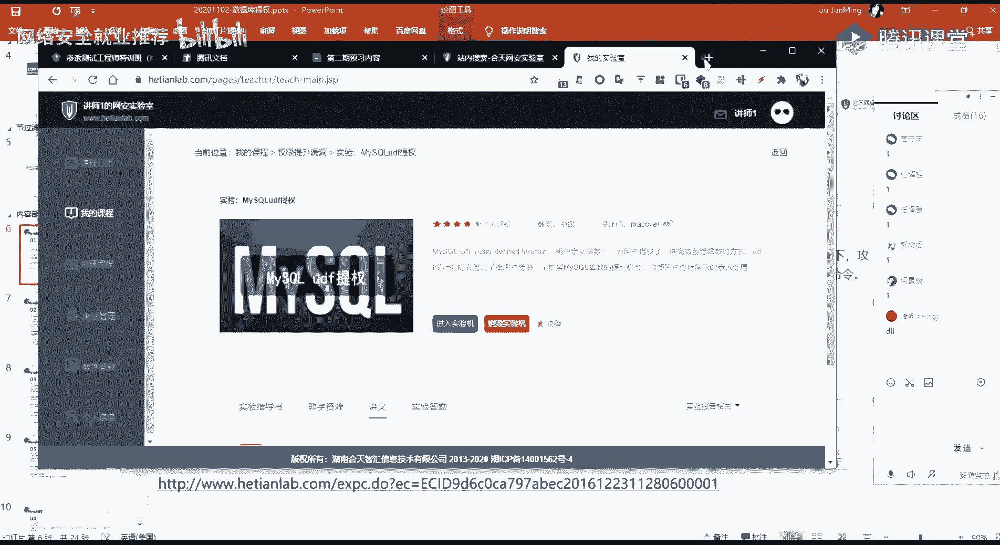

dl就是这样子的一个动态链接库，然后他这dl呢它的一个作用的话，就是它呃它的这个库当中的话，它存放在我们的这样子的一个呃，共享的一个数据，然后这一个dl当中，就我们脑脑海当中有这样子的一个概念。

就是呃我们windows系统下面它的各种程序对吧，它各种程序的话，他需要去调用相应的这样子的一些啊，程序的一个代码以及对应的一个数据对吧，或者说我们的这样的一个函数。

这个函数它是能够被多个这样这样子的一个，程序去进行一个调用是吧，那么我们不可能说在呃每一个呃，就是为了我们不可能说在每一个程序，它去调用的时候的话，他都写一个这样子的一个函数对吧，或者说写一个呃。

写一份这样子的一个代码或者数据对吧，那么我们那个dl的话它是一个就是共享的，然后的话它里面存放的这样的一个数据的话，是能够允许多个这样子的一个程序来去调用它，来去获取它的一个数据是吧。

所以的话我们在多个程序，它去使用同样的这样子的一些数据的时候，我们可以用这样一个dl的一个呃动态链接库，然后的话这样子的一个动态链接库的话，它同样就是它的一个作用的话，它里面它其实实际的话。

它里面是一个函数的一个方法，去进行一个书写的，就是说它我们去调用里面的一个数据，它是通过对应的一个函数，就是一个方程函数，然后的话呃我们再去调用的时候的话，是通过函数的一个方法去调用。

所以的话我们可以通过这样子的一个调，来去创建对应的这样子的一个函数，来去实现对应的一个功能，呃关于更详细的这一些的话，大家自己去百度1下好吧，那么在这边的话，我们就是利用的这这样子的一个用户定义函数。

就说在mysql当中的话，它支持我们用户去自己去定义，这样子的一个函数，那么在windows系统下面的话，因为我们的这样子的一个呃windows系统下面的话，我们要去。

我们要去创建一个自定义的一个函数的话，我们可以通过呃，去编写一个这样子的一个点文件，然后这个del文件的话是呃，里面就包含我们自己创建的这样子的一个，u d f的一个函数。

而我们只需要有这样子的一个调的一个文件，我们就能够利用它来去创建一个用户，自定义的一个函数，在这块也是一个方选为理，然后的话这个函数它的一个功能的话，就是用来去调用我们的一个系统，在cmd的一个命令啊。

linux，linux上面的话，就相当于是调用我们的一个shell的一个命令，所以的话他的这个函数它的一个作用，就是去执行命令是吧，那么我们在每再去数据库当中去查询的，去查询的时候。

我们可以通过这样子的一个方群的一个函数，来去执行啊系统的一个命令，从而来达到一个提前的一个目的，好在这里的话要注意的话，就是呃在而不同的一个版本下面的话，它是这样子的一个电r函数。

它所存放的一个位置它是不一样的，就是在windows server 2003下面的话是啊，在c盘下面的一个windows目录下面，然后mysql 5。1版本之后的话，就我们现在的一个mysql版本。

它都是5。1版本号是吧，然后它所存放的一个library啊，这样子的一个调文件存放的目录，是在它的一个安装目录下面的，libr下面有一个plugin，这样子的一个目录下面，就说这样子的一个目录。

它是有什么作用呢，就我们的这样子一个del文件，需要放在指定的这样子的一个目录下面，像比如说mysql 5点多的一个版本对吧，你需要把这样的一个调文件，放到这样子的一个目录下面呃。

安装目录下面的lil pgg，这个目前面你放到这个目线面之后的话，你才能够在我们的一个啊，mysql数据库当中来去调用它，对他再去调用这样子的一个deal呃。

再去调用这样子的一个deal的一个文件的时候，还会去在这个目录下面去找，去查找到对应的这样子的一个文件，然后的话利用它来去创建这样子的一个function函数。

然后关于这样子的一个呃mysql的一个提取的话，我们本节课的话主要是通过这样子的一个实验。

通过这个mysql u d f t群，那这样子的一个实验，来给大家做一个详细的一个讲解，然后呃这个实验的话，大家可以就是在电脑面前的话可以打开。

现在的话先创建这个虚拟机，然后的话可以。

待会的话可以跟着我一起去做操作好吧，我要一步一步的带大家来，去进行一个相应的操作呃，然后第二部分呢就是这个nt f s的一个a abs流，创建目录以及创建文件呃，就是在我们这边的这个uf提取的话。

我们会去用到这样子的一个ntf的一个a aba，abs流来去创建一个对应的一个目录，就为什么会去用到这个呢，啊就是在我们的一个mysql的一个5。1之后的，这种环境下面的话。

我们只有去将这样一个del文件，导出到这样子的一个目录下面，就是导出到这个mac口的一个安装目录，得这个moon hy，然后的话我们才能够去进行一个啊，这样子的一个去使用这样子的一个，用户定义函数。

当时的话很多时候的话，我们的一个s mysql下面的话，安装目录它不存在这样子的一个lib，对不，然后的话，如果说它不存在这样一个lib目录的话，那么我们就算有这样一个del文件对吧。

我们也无法导入到这样一个lib，下面的一个plug目录下，所以的话我们呃，而且的话我们mysql的一个文件操作，并不能够去直接的去创建物，就在我们的mysql的mysql下面的话。

我们可以通过我们的一个select in trout file对吧，我们可以通过这样这样子的一个，intro fire的这样子的一个方法，拿去把我们数据库当中的一个数据，把它给导出到我们的一个呃。

系统的一个指定目录下面对吧，但是的话你导出的话只是成为一个稳定，而不能够说去直接的去创建目录是吧，所以的话在这边的话，我们就需要去利用他的这样子的个方法，这个ttf 22的一个a abs流。

来去创建一个这样子的一个目录，然后关于这个a abs流的话，它是一个全称是这个就是交换数据流，然后它是我们nt f s文件系统的一个特性，它的一个格式是这样子的，就是呃文件名加我们的一个流明。

加我们的一个牛的一个种类，然后这边的话流明的话我们可以省略，就是我们的一个，而我们去把我们的一个数据，存储到这样子的一个呃数据流当中的时候，我们可以通过这样子的一个牛来去呃。

就是来标识这样子的一个数据流的一个呃名字，然后有种类的话，就是我们这边的一个strive stream type，好stream type的话我们可以设置为这个，就是我们在这边上。

通常的话就是这边的一个stream time type的话，通常看到的一个文件的话，就是这个date流也就是我们的一个数据，就比如说我们的一个文本文件，它就是这样子的一个数据流，data流。

然后他的其他的种数据流的话，它是处于一个隐藏的一个状态，然后还有的话还有一个的话就是这一个，当我们的这个牛牛种类为这个时候，index options有当它为这个的时候，就表明这个数据流的一个数组。

它是一个文件夹，所以的话，我们在这边的话，我们可以通过mysql的一个导出数据，导出到这样子的一个文件，来去创建一个这样子的一个路，这边的话怎么去理解呢，就我们刚刚的话有介绍。

我们可以通过这样的一个方法来去导出，我们的一个数据库当中数据是吧，然后的话导出数据的话，它是一个文件的一个形式，其实就是我们的一个背景流a data数据对吧，就data里的一个形式。

然后的话我们是创建文件，所以的话是data，那么我们要去想要去创建一个目录的话，我们就可以使用这样子的一个这一个牛，index alog lotion，这样子的一个牛，然后这里的这个流类型的话。

就表示我们前面的这个数据流的一个数组，注意的话这边是数组，也就是我们这边的一个文件夹啊，就是我们这边的这个文件夹，它是一个数组，然后后面的话是流民，就是我们的这个交换数据流的一个名字。

然后我们设置了是这样子的，就我们创建了这样子的一个文件，那么它实际的话它会创建一个文件夹，文件夹的一个名字的话，就是这这边都是一个文件名的一个名字，就是会创建一个是一个directory pass的。

这样子的一个文件夹的一个目录，我这边的话可能我这样子刚说的话，大家不是很理解对吧，我这边的话我，大家可以呃跟我一起操作，我这个号创建了这样一个文件夹对吧，然后我这边打开一个命令提示符。

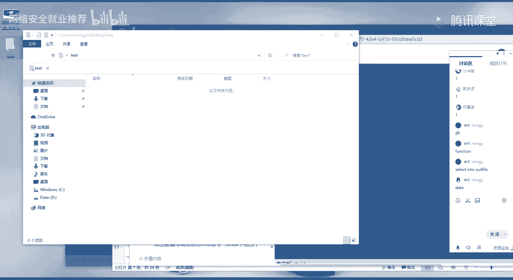

然后，我们创建一个文件对吧，我们常见的话就是我们可以通过leo来去创建。

一个比如说电商的tt这样的一个文件对吧。

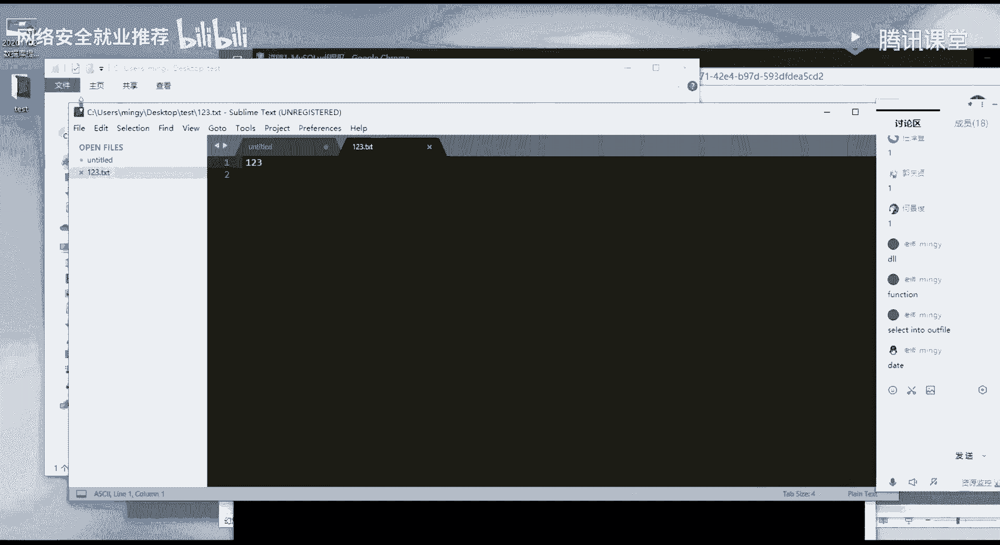

好这个话就是一个正常的一个文件对吧。

好的话，如果说我们想要去创建一个流文件的，可以通过这样子的一个方法嗯，比如说我输入一个，stream file，然后，比如说1234点tx，好哦，这边的话是文件名对吧，然后后面的话接我们的一个牛名。

比如说，就就一下三四吧，然后的话接我们的一个呃牛的一个类型，我们的一个牛的类型的话，注意的话是有这样子的，一个多了符号开头，而我们的话是一个date流啊，就是一个date的一个数据流呃。

一四，这200。

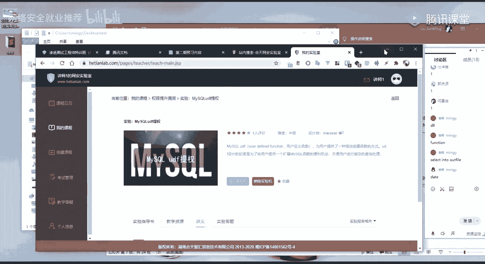

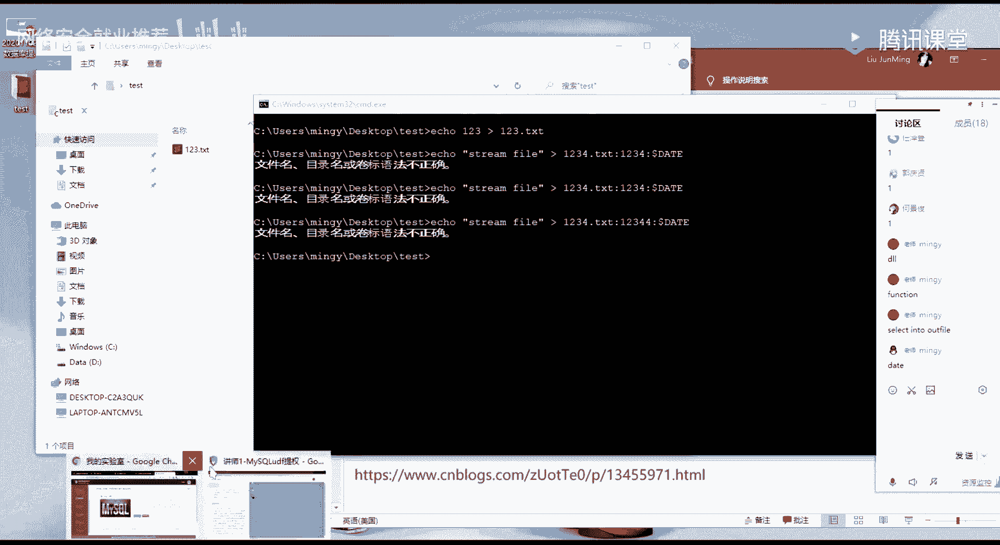

好在这边的话运行的运行内容，这边我给了一个链接，就是关于这个备用数据流的一个比较详细的，一个那个，没错。

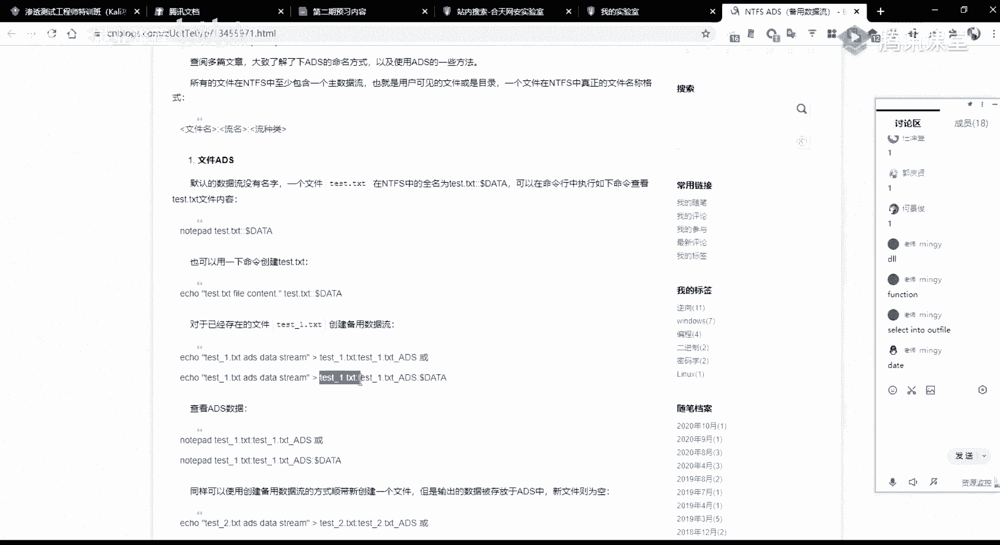

好这边我写错了，不是d a t e啊，bt的话数据的话是d a t a l是这一段b，就数据的话是d a t a对吧。

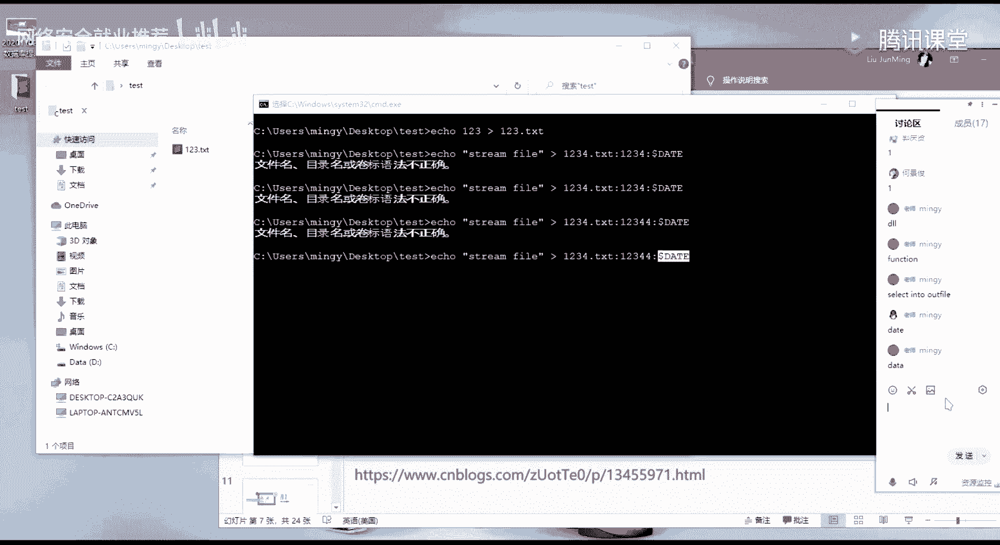

时间的话是bt是吧，bt是时间。

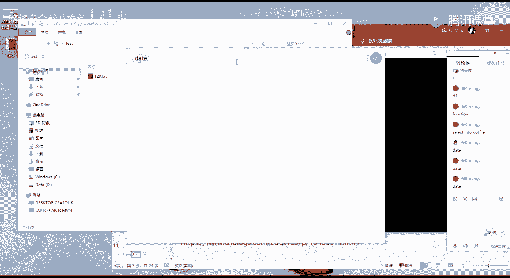

我这边写错了呀，对啊，这个是data话是使劲d a t a才是数据，因为我这边的话是大写的a l是这样的啊，你会发现的话，在这边呃，我通过创建了这样子的一个，就是我其实实际上是创建了这样子的一个文件。

是然后在这边的话。

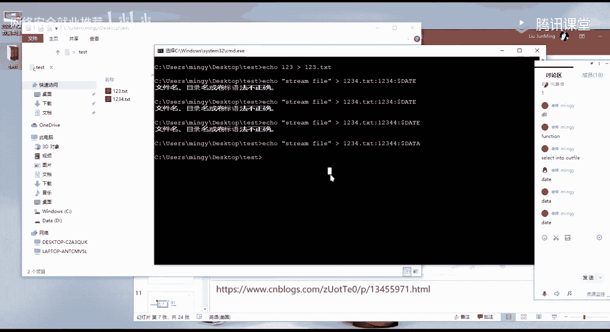

我是向这个文件当中写入了这样的内容，但是实际保存到我们windows机器上面的话。

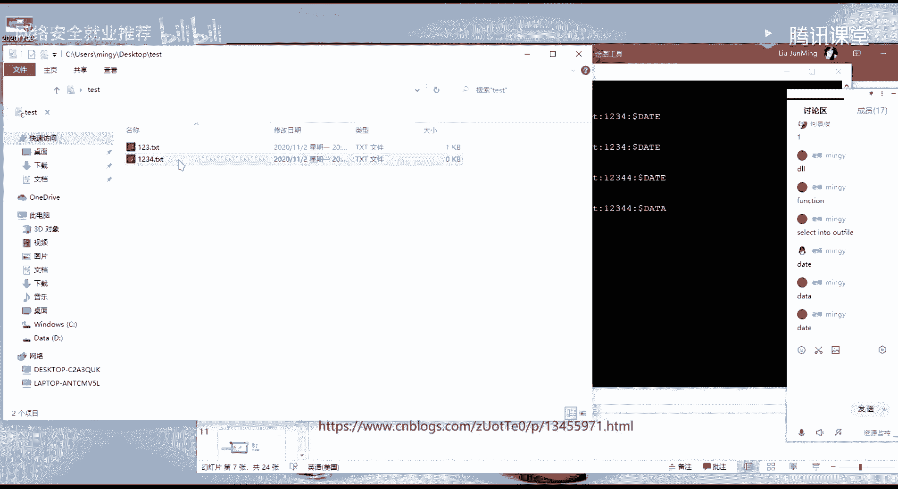

你会发现的话是这样子的，一个1231234点tt的，这样子的一个文件对吧，但是在你的这个文件里面的话，你会发现它里面没有内容，我们可以看一下，我这边通过echo。

像这一个文件当中去写入了这样子的一个stream，file这样子的一个字符字符串是吧，但是我实际打开的话，它这里面是没有内容，那么为什么呢，我们可以通过这样子的一个dr tr，来去进行一个查看。

就是你在这边的话，你会查看到有这样子的一个文件，这个的话就是它的一个流文件，然后这个文件它的一个数组的话，就是这个就是1234点text，也就是我们像这一个这样子的一个文件名当中，去写入一个内容的话。

它会创建一个这样子的一个文件，就是1234点test的这样的一个文件，然后的话这个流文件的话，它是呃是这个文件的一个就是备份牛呃，交换数据流的一个文件，然后如果你把这个文件删除掉的话。

这个文件它也会没有，然后在这边的话，我们通过可以通过notepad，就文本编辑器嘛，我们可以来打开这样子的一个文件，打开之后的话，在这边你会发现我这边打开之后的话，它这里面就存储着我们想要的一个内容。

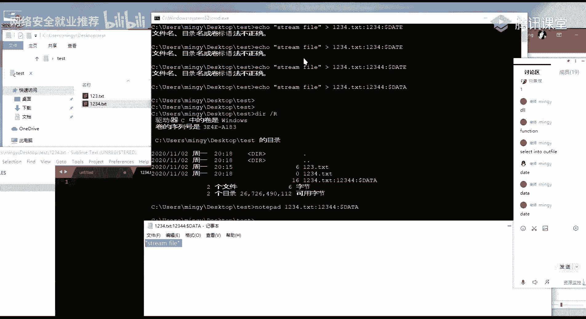

就是我们刚刚通过app输入进去的一个内容对吧，大家有有在跟我操作吗。

大家可以就是可以跟着我，就是我边讲，然后大家可以边跟着我去操作，好的话，在这边的话，但是这样这样子的一个牛文件的话，我们在这样的一个文件系统当中，你是无法直接看到的，是。

然后我们需要通过这样的一个dr杠二来去查看，然后这边来干大写的r的话，就是显示文件的一个备用数据流，也就是显示我们这边创建的这个文件，然后呃，然后讲到这边的话，我再就是呃在做点补充，就是啊。

就我们再去进行一个文件上传的时候是吧，就是在web安全的，就是web安全的那些课程的话会讲这一下，然后渗透测试这边的话应该是没有奖励，因为这些话应该算是比较基础的一些。

就是你在一个文件上传的时候，我们再去文件上传，去进行一个相应的一个logo的时候，你会发现的话呃，就是比如说你看别人的文章对吧。

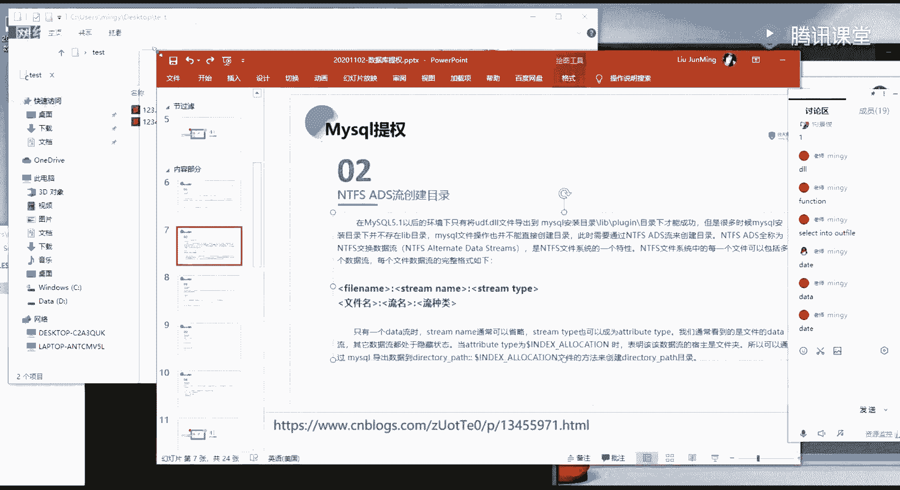

你看别人的文章或者是说文件上传绕过的这种，别人总结这种方式的话。

就会有这样子的一个a abs流的这样子的一个方，式，就这个，然后他的话就是他会去就说呃，文件上传的那一个点，他对呃，他在对我们的一个文件名有趣做的呀，文件的一个扩展，没有去做这样子的一个性质以及过滤的。

过滤的话对吧，然后的话它那个机器它在中的时机上面的话，我们就可以使用这样子的一个，a d s流的一个方式来进行一个logo，就我们再去创建的这样子的一个呃，我们上传一个文件对吧，就比如说，还得我们想要。

我们想要上传一个这样子的一个热点，三要三点菲律宾的这样的一个文件对吧，然后的话pp这种后缀的话，那么肯定他是不会允许你去直接去上海的对吧，那么我们呃你会发现的话，会有这样子的一个方法。

就是我们可以通过这样子的一个，在后面接一个这样子的一个嗯，直接切去把你的一个上传文件名的话，写成这样子，好的话，如果你的一个目标机器的话，它是一个windows的一个机器。

那么你实际去上传了一个文件名对吧，他去警察，在他的一个后缀的时候，他是这样子，它是这样子的一个后缀，嗯应该是要加一点点，对吧，他是这样子的一个文件名，那么这个文件名的话，它没有了这样子的一个呃。

就是菲律宾的这种敏感的，这种就不允许上传的这样的那个文件后缀是，然后实际的话就是我们可以去绕过他的，这样子的一个检测，然后实际的话在windows系统上面，我们去写入这样子的一个文件的时候。

是就我们在windows系统上面我们去上传一个文件，我们把我们的一个内容，把它写入到这个文件的时候。

他在win系统上面他会去他做处理的时候，他会去生成这样子的一个牛文件，然后他实际的话它会生成一个，就是说在当前目录它会生成一个这样子的一个，比如说。

对吧，你实际的话他再去写入的时候，它会就是你windows现，他去写入这样子的一个文件的时候。

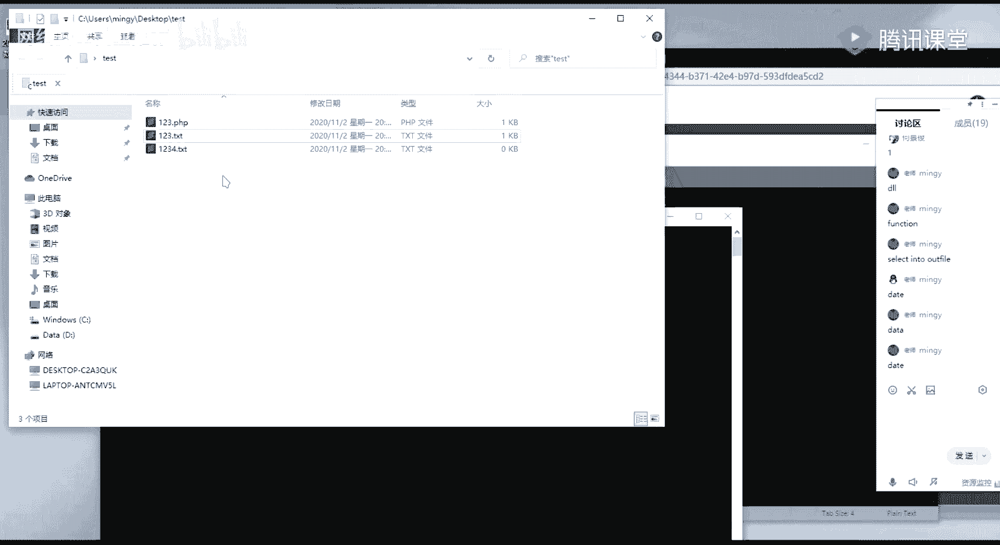

他会在他的一个目下面，它会生成一个这样子的，123点p h p的一个文件。

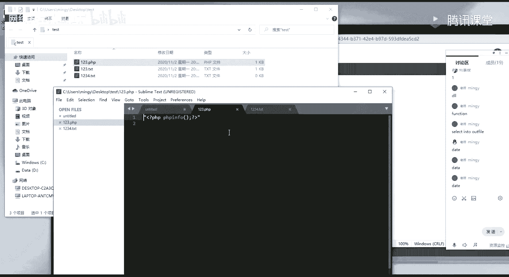

然后这个时候的话，你会发现这里面的一个内容的话，其实就是我们想要的一个内容，对啊，我们这样子的，在这里的话就是一个p p p的代码，我们而且它的一个文件后缀的话就是123点。

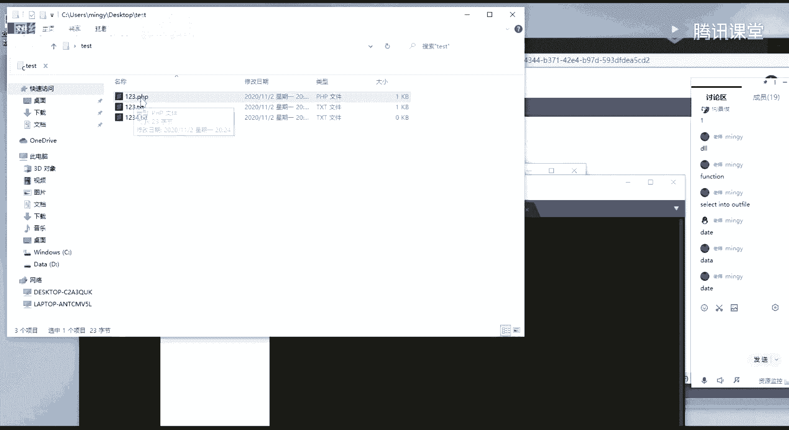

菲律宾对吧，那么我们就能够去写这样子的一句话，来去绕过他这样子一个文件上传的一个性质。

通过这样子的一个a abs流的一个方法，啊这是一个啊就是讲到这边的话。

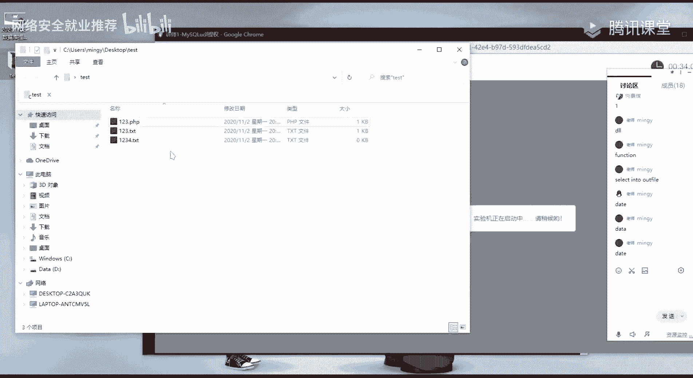

就是给大家提一下，就是他这边的话，它的一个logo方法，就是利用的利用了这一个a abs牛啊。

好了的话，我们回回来回过头来再去看，我们，p p t上面的一个内容。

那我们上面它是创建了一个date的一个文件对吧，然后下面的话我们想要去创建一个目录的话，我们通过什么方法呢，有通过创建目录的话，其实跟我们这边创建文件的话类似，然后在这边的话。

我们比如说我想要去创建一个，插刀插的这样子的一个文件夹是吧，嗯aa的一个文件夹。

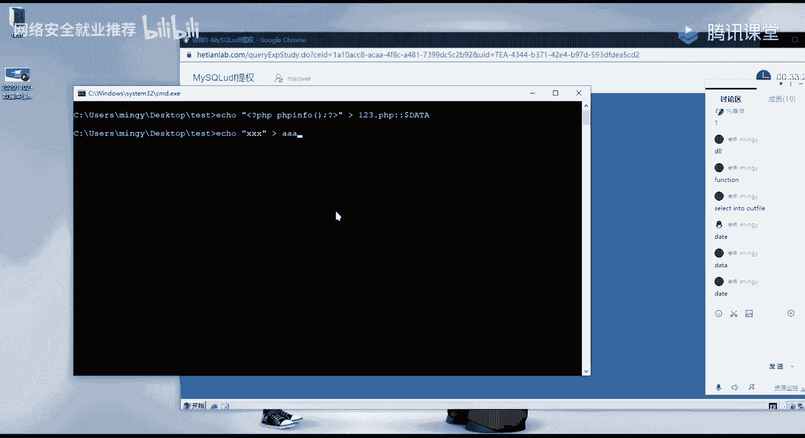

然后的话我们在后面的话接这样子。

一个就这样子的一个牛的一个类型，我这边它直接复制，还有点长，其实这样子的一个流类型就是这个index location，然后呃下面的话我们注意看这表，注意看这边，然后我这边执行，执行之后的话。

他虽然这边说系统找不到指定的一个文件，也报了这样的错，但是你在这边的话，你会发现，你会发现在这边我们就创建了这样子，一个aa的一个文件夹是吧，那我们，对吧，就是这样子的一个嗯嗯啊呃。

这边的这个流文件的话，你是无法直接看到的。

然后，然后这边这边这边这篇文章的话，有详细的介绍了这一个东西啊，就是关于它的创建文件夹以及创建创建文件。

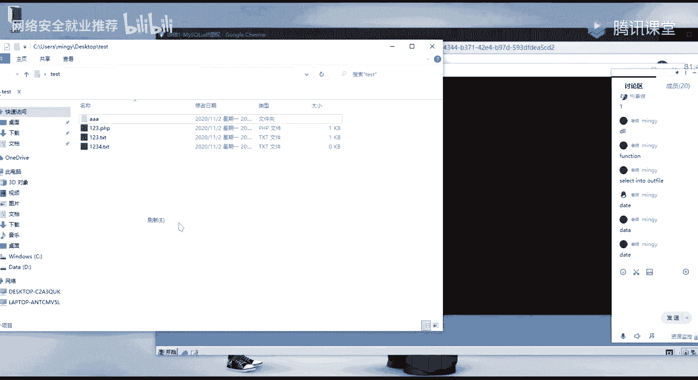

这边的话我就呃就给他大家演示到这边，更详细的这种东西的话。

大家去看一下那篇文章，然后自己去操作一下，所以的话我们通过这样子一个方法，他就创创建了这样子的一个文件夹对吧，然后嗯，下面的话就是mysql提权的第一种的一个方法，或者说第一个场景，而这边的话嗯。

场景的话主要的话就是大家看这一个实验，有实验指导书，这边的话已经写的很详细了，就关于这个mysql的一个u d f提取，以及它的一个简介对吧，大家可以详细的看一下，这边这边的这一个呃内容，然而。

然后在讲这个实验的时候的话，我们先来看一下ppp的一个内容啊，就是我这边ppt的一个内容的话，其实就是一个流程，一个过程就是给大家做了一个总结。

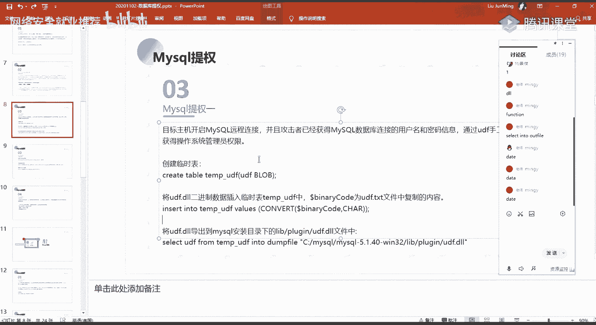

总结了这样子的一个期权的一个过程，然后实际的一个内容的话就是呃就是更详细，更多的话大家做这个实验。

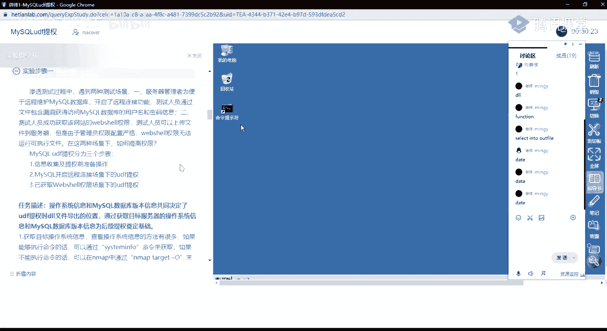

在实验这边的话有详细的一个介绍，然后等会的话我也会带大家就是一起来做一下。

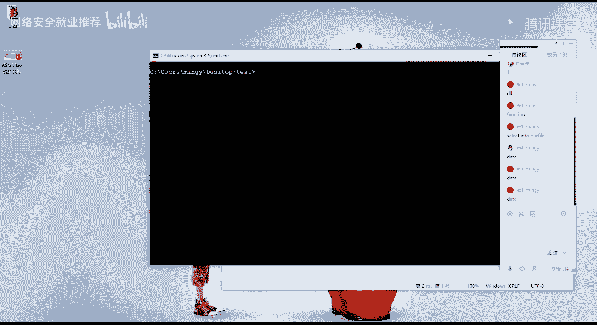

就是啊，我也亲就是亲自带大家去做一下。

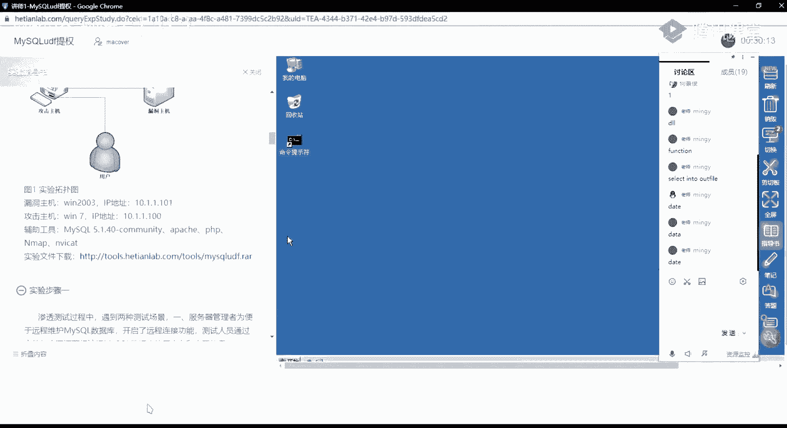

这样子的一个实验，然后在做实验之前的话，我们先来呃过一下这样子的一个流程，就是呃首先的话是第一个场景，第一个场景的话就是我们的一个目标主题，它开启了这样子的一个mysql的一个远程文件。

而我们工具的获得了这样子的一个数据库的，一个民间的一个用户名，还有密码信息，好，我们可以通过这样的一个udf的一个，手工提取，来去获得操作系统的一个管理员的权限，好呃这边的这个场景怎么去理解呢。

就是呃首先它有一个前提，就是目标主机它开启了一个mysql的一个远程文件，然后的话就是说我们就是目标的一个机器，它我们可以在远程去连接这样子的一个，mysql的一个数据库，阿尔法。

我们已经获得了他的一个mysql数据库的，用户名及密码对吧，关于这个用户名密码信息的话对吧啊，用户名嘛，密码信息的话，就比如说，我们通过就是说某一个漏洞对吧，通过某一个漏洞得到了他的一个。

或者得到了他的一个管理后台对吧，得到了某一个网站的管理后台，然后的话在他的后台当中的话有呃，查看到对应的一个数据库的一个信息，或者说你得到了这个机器的一个web share。

当时的话这个web shell的话呃，他对你执行了这样子个命令，就是你在他的你得到这个web share的一个环境下面，你比如说你用菜刀对吧，或者说用已经这样子一个web share工具连接之后。

我们可以去得到一个虚拟终端是吧，但是他这个虚拟终端，他再去执行相应的一个命令的时候，他是有对应的就是有限制的，就他因为你去执行系统性的话，你是同样的，是需要去调用它的一个系统的一个函数来去呃。

执行我们的一个命令对吧，那么他有禁用这样的一些系统函数的话，你的一个shell的话，你是无法去执行对应的一些命令的对吧，那么在这种情况我们得到vip之后，我们可以去查看他的这样子的一些文件是吧。

就是比如去翻他的一些配置文件，然后的话正好翻到了他的一个数据库的一个，用户名称以及密码的这样子的一个，配置文件的一些信息，那么这个时候的话我们可以利用呃，就是我们得到了一个shell。

我们可以通得到它的用户名密码，我们可以连接到这个mysql的数据库当中，然后的话连接到它的一个数据库当中，之后的话，我们可以通过这样子的一个udf的一个群，来去尝试得到它的一个管理员的权限。

然后具体的一个方法的话就是呃，首先第一个创建一个临时角，就创建了这个表的话就是用于存放我们前面啊，用于存放我们的这样子的一个，前面所说的这样子的一个调文件是吧，因为我们现在的话是能够去对它的一个数据库。

做相应的一个操作对吧，但是的话我们的一个操作的话，只只只限于它的一个数据库对吧，我们无法去操作它的一个系统，好在这个时候的话，我们可以用这个u d f，提前就把我们自己写的这样子的。

自己编写的这样子的一个ud f的一个调文件，把它插入到这样子的一个表中，插入到我们这边创建的一个临时表当中，插入进去之后的话，我们再去通过这样子的一个呃音区，通过这样子的一个方法。

把我们这边所插入到的一个数据，把它导出到我们的这样子的一个呃目录当中，就是把我们这边的一个ud f d l文件，把它给导入到我们这边所创建的这样子的一个，呃文件夹设当中，然后在这边的话就会有一个问题。

就是如果说这边他没有对应的这样的一个，文件夹对吧，那我们就需要去用到这边的这个a abs流，而去创建这样子的一个，lib以及plug的这两个目录，好注意的话是在这样子的一个目录。

这个目录的话就是它的一个mysql的安装目录，关于mysql的安装目录的话，我们可以通过selector呃，data base di来去查看它的目录网，然后呃我们这边导入进去之后的话。

等于就是我们的一个dl文件，已经导入到了他的一个，发给到一个文件目录下面去对吧，然后我们就可以通过利用这个udf的一个，dl文件，就通过这个点文件来去创建，一个这样子的一个function。

这边的一个翻译，取名字的话就是和sam d share创建这样的一个函数，然后的话我们就可以用这个函数来去执行，我们的一个系统的一个命令，好在这边的话就是创建了，就通过啊执行这样子的一个。

添加管理员用户的一个mini，来去创建一个管理员用户，然后的话我们就能够去啊，得到这样子的一个管理员的权限对吧。

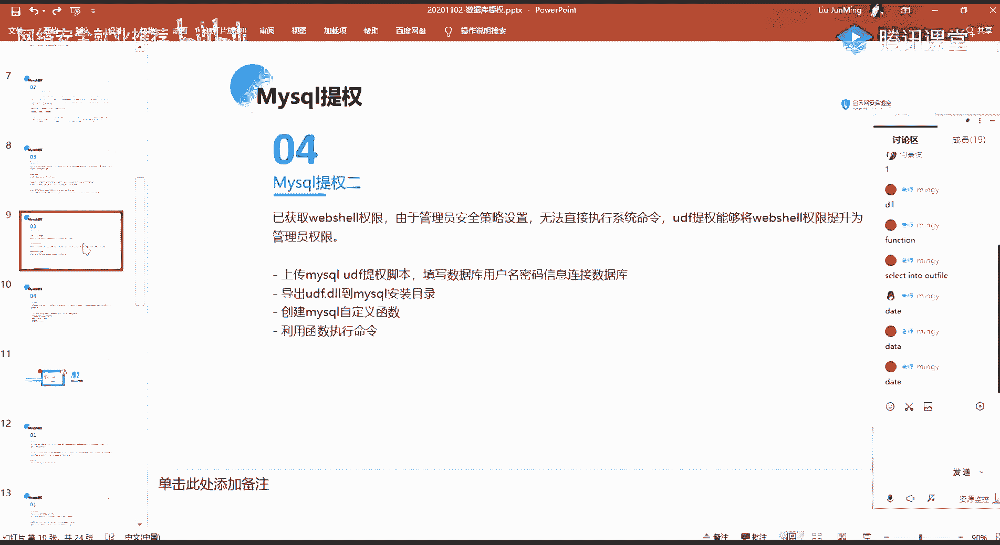

呃大体的一个思路的话就是这样子，我们来具体的来看一下这个实验，呃关于这个实验的话，呃，大家应该就是前面的话有相应的一个，就是相应的一个实验对吧，就是有涉及到实验室的这样子的一些内容。

就是给大家做课后作业是吧，大家应该对我们实验室的这样子的一些操作，他应该比较熟悉了吧，就是呃关于这些操作，应该应该算是比较熟悉了吧对吧，就是指导书这些东西应该都是看得懂了是吧，知道书这边的话很相像呃。

呃呃熟悉好，那么我就不再去介绍，就是说怎么去做这些东西了是吧，我这边的话就是呃会挑一些内容，就比如说这边的这种实验环境对吧，你首先的话你就先去看一下吧，然后的话在这边的话注意就是有两个机器啊。

就是我们这边有一个用户以及漏洞主机对吧，我们这边还可以去做一个切换的，就切换到这两个主机上面去操作，以及就是实验文件的一个下载对吧，就这边他有给一个和下载地址，注意的话。

这个地址是你只能在我们的这个机器上面，在我们的这样子的一个机器上面，你才能够去呃下载到，而不是说你在外网，你在而不是说你在你自己的一个浏览器当中，你去打开这一个链接，你是访问不到的。

因为没有这样子的一个资源，就是这个资源你要访问的话是在内网去访问的，然而在这边的话实验的话，他呃有列举了这样子的1234个步骤，三个步骤，然后每一个步骤的话，它就是提供了一个任务，就是作为一个任务。

你是就你跟着他一个步骤来来去进行一个完成，然后首先第一个它就是介绍了这样子的一个产，两种测两种测试场景，就是在碰到这样子的两种场景下面的话，我们逻辑进行一个提前。

然而以及也介绍了就是夜店舞提前的三个步骤，就是信息收集，信息收集的话就是收集你的一个目标，你你的一个目标的一个像这种呃，你的一个数据库的一个呃类型对吧，如果说你的一个数据库你是mysql。

那么你就用mysql mysql的一个提取码，如果你是sex sel，那么你就用sex seven以及的话呃，当然他在这边的话就是udf的话，就是mysql以前的话，还有就是收集你的一个就mysql。

数据库的一些版本对吧，你的一个版本信息，就版本的话就是如果说你的一个版本，你低于这样子的一个版本对吧，你在这个以及你的一个系统版本，是这样子的一个版本，那么你这个掉文件里。

是要放到这样子的一个目录下面去了，当然的话现在的话就是呃，应该是不存在这样子的一一个机器人，低于这个样子的一个版本的一个mysql了，然后的话就是呃，两两种场景的两种场景下面的一个提前。

就是在这边的话总总结了这个实验的三个步骤，分别的一个内容，它是什么，第一个步骤啊，就是信息的一个收集，就是我们我们得到了这样子的一个呃，那效果数据库的这样子的一个。

操作的一个权限，我们这边的话嗯，在这边的话是能直接在目标机上面去执行的，这边的话，因为其实我们我们得到的话，得到了这样的一个数据库的这样子的一个，连接的一个就是连接到它的数据库，对数据库做一个操作对吧。

当然的话呃直接执行这样一个system info的话，是在目标机器上面去执行，那么我们已经得到了他的目标机器的一个，这样子的一个能够去直接去执行命令的话，那么我何必要去提升。

所以在这边的话就是其实就是是告诉大家，就是我们可以通过这样一个命令来去收集到，我们的一个服务器的一个信息，然后其实我们通常就是通关map嘛是吧，通过map去扫他的一个服务器的这样的一个信息。

扫他的一个服务器的一个版本，以及mysql服务的这样的一些版本的一个信息是吧，啊，呃再对话他通过这样子的一个mysql加杠v，我们可以来查看到它的一个，那下面的一个版本啊。

然后的话我们可以通过select gression，来去查询它的一个版本，当然在这边直行是max，执行这样子的一个slack的话，我们只需要在连接到它那个mysql的数据库当中，才能够去执行，好。

直接这样子在呃，在mysql当中是直接sla vision在这边的这个wah的话，它是mysql内置的这样子的一个呃，这样子的一个函数，这样子的一个方法好，我等会再讲那个succel的时候。

就是用这样子的一个art art venture，来去查看它的一个呃版本，也是它内置的这样子的一个，因为它内置的有这样子的一个语句啊，这话我们就能够去查看到他的一个mysql的版本，是5。1。

4的这样的一个版本对吧，那么从这边的一个信息，我们就知道它的一个level的一个目录啊对吧，它的一个level入的话，是在他的mysql数据库的安装目录下面的一个level，lag planet是吧。

然后的话我们还需要去知道，这是它的一个数据库的一个安装目录，安装过的话，就是这个我们可以在mysql当中通过base编，来去查看到当前的这一个数据库，它的一个所在的一个目录。

就这个这个的话其实就是它的一个安装目录，好，我们可以呃，因为我是在直接连着本地的对吧，我可以直接在这边来查看一下，看看是不是对吧，就这边的这一个mysql的这边的话，就它一个安装路。

以及在这块有这样一个level，以及发展的这样的一个目录，而他这边的话是已经有了这样子的一个目录，所以的话就可以省略我们前面的一个操作，那话如果没有的话，就需要我们通过a d s6 去创建，好在这里话。

我们呃尝试通过这样的一个方法对吧，来去演示一下，来来去演示一下创建单子的一个a abs的画像，比如说我我们可以通过，就是这样子一个方法，而在这个话我直接通过snet。

select into onfire这样子一个方法，然后这边的话select的话，这这里的一部分呢就是我们的一个数据是吧，就嗯这边的话随随便填啊，就是其实就是我select这样的一个数据吧，对吧嗯。

呃大家带有对mysql数据库了解嘛，就是大家自己有去玩过吗，像比如说对吧，我这边直接select这样子的一个，随便的一个数据的话，它就会输出这样子的一个数据对吧。

然后其实在这个话其实就是我select这个数据，就是这个数据就是我要去导出来的，然后导出来到这样子的一个，到这样子的一个目录下面去是吧，然后呃是要导出到这个目录下面去。

然后我这边的话就先看一下这样子的一个例子，我这边的话就找出一个就是导出一个文件，比如说123这样子的一个文件，我把我的一个内容，然后要注意的话，就是在windows下面。

用p要用一个反斜带来去做一个早一个样子的。

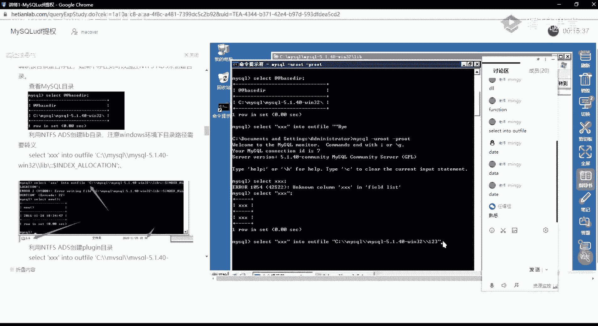

一个反斜杠，才能够去，才能够去执行呃，这边的一个就是把我们的一个数据，写到这样子的一个对应的一个目录，然后你可以看到，就我这边的话是通过这样的方法select行，然的话导出到了这一幕下面的。

一个123的这个文件当中是吧，你会发现他在这边，原本应该原本的话是没有这个文件的，我们这边可以打开看一下。

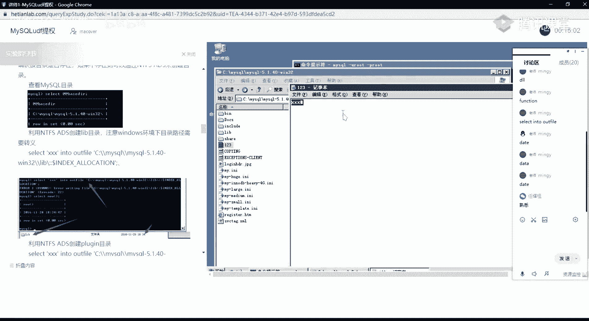

这里面的一个内容的话，就是刚刚所写进去的这样子的，三个叉的一个内容对吧，那么我们也可以通过就是这样子的一个，创建文件流的一个号，比如说345，dt比如说我要去创建这样子的一个，一三点tx。

用3400太值了，这样子的一个文件，咳咳，那么我可以通过这样的一个方法，然后呃大家看这里注意。

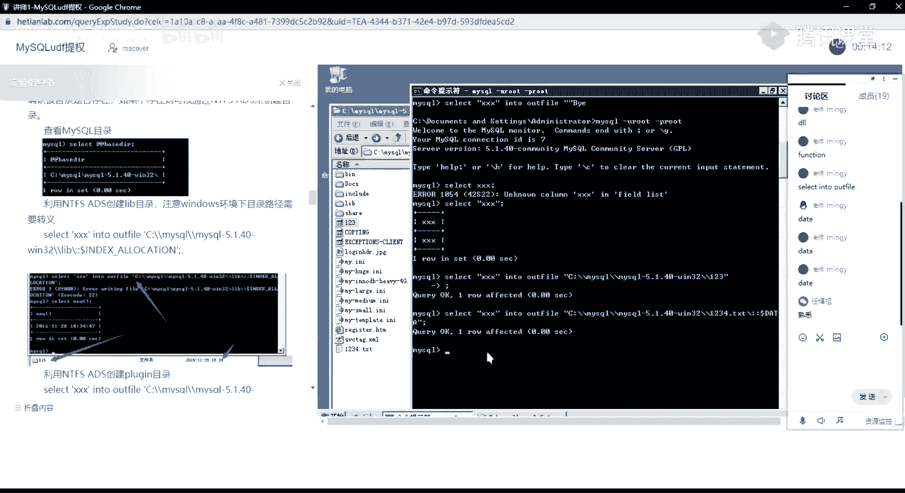

对吧，我这边执行之后的话，在这边它就生成了这样子的一个文件，就这一个1234点text里面那个内容的话。

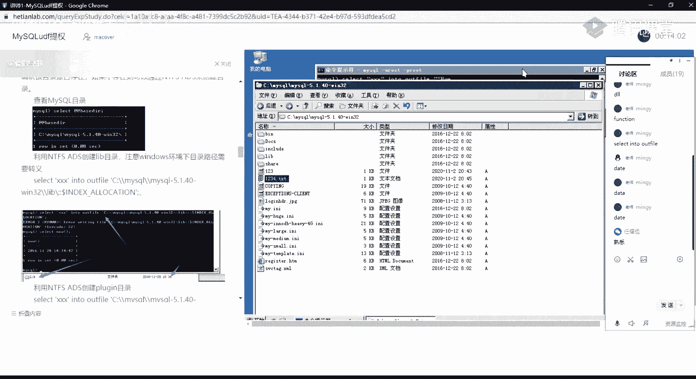

同样的也是尴尬的一个内容对吧，这就是创建了一个这样子的一个文件，那么我们要去，我们实际的话要去创建这样的一个文件夹对吧，就没有这个lib文件夹的话，因为这边有的话，我就以另外一个文件夹为例啊。

我就比如说我要去创建一个1234，1234的这样子一个文件夹，比如说aa的一个文件夹，好我们需要去，指定的一个牛牛的一个类型是这个index dunlocation，呃呃中间的这个牛的一个名字的话。

我们可以省略，省略的话就是视为空嘛，就等于就是两个两个冒号，这两个冒号然的话执行执行之后的话，执行之后的话，虽然在这边他会有这样的一个报错啊对吧，就是他说every writing fire是吧。

然后就其实就跟我们在这边cd上面，刚刚说就是找不到那个文件对吧，他也会有这样挖成，但是实际话它的一个内容的话。

它是已经就是我们的一个文件夹，它其实已经创建好了对吧。

你会发现在这边就多了一个这样子的感，aaa的一个文件夹，也就是我们这边所写的，比如说我再创一个，我在aa目下面我再创一个，换一个bbb，换个bbb的这样子一个文件夹，就是这样子对吧。

你会发现这边他就加了一个bb，就其实呃我们要去创建这样子的一个lib，plugin的话，就是我首先创建一个lib文件夹是吧。

然后我再在那个文件夹下面，再去创一个party的一个文件夹。

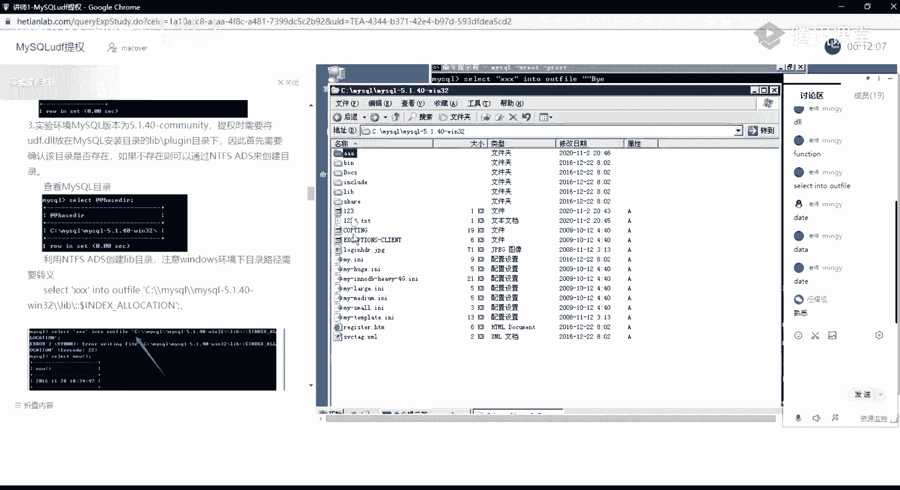

就通过这样子的一个方法，aa目录下面的话有了一个bbb的一个目录，就是这样子的一个方法，这边的话他也呃语句的话已经都已经给出来了，好呃这边要注意啊，这边这边没有这一个这个这个这个叫顿号啊，没有这个顿号。

就如果你复制粘贴的话，你注意把这个顿号去掉，就你不要你不要直接就复制这一块，复制这一块，然后的话直接粘贴啊，然后还有的话就建议大家自己多去手敲，就人不复制的话就不复制，就像这一些代码的话。

应该不是很长对吧，然后的话你手敲的话，你会对这个语句会比较熟悉，以及你能够去了解它的这样子的一个结构吧，嗯我们先休息两分钟吧，好吧，50的话再继续，好我们继续啊，呃刚刚的话给大家就是实际的讲解。

就已经操作了，我们的话通过这样的a d s流，来去创建这样的一个目录，对吧啊，呃下面的话就是我们的一个第二步，第二步的话它就是第一种场景，就是我们的一个目标主机。

开启了这样的一个mysql的一个远程连接，而我们通过相应的一个方法得到了他的数据库，用户名密码对吧，然后我们可以通过udf的一个手工提权，来去获得操作系统管理的一个权限，好我在这边上实验。

这边的话是有有两个主机对吧，这个leak的话就是我们的一个，就是我们攻击的一个主机，就是我们的一个靶机，然后这边的一个tag的话，就是我们的一个呃攻击的一个机器。

就我们实际操作的话是在这个机器上面去操作，然后我们来去攻击这个远程的这个主机是，然后呃在这边的话就是实验的话，这里给的就比较人性化，这边给的就是如何去开启目标主力的mysql，远程零件。

就说这一个场景的话，它的一个前提的话就是目标主机，它开启了一个mysql的一个远程连接，也就是说我们能够去远程的去呃，登录这样子的一个mysql数据库，然后的话进入到他一个数据库，去做这样子的一些操作。

对吧，呃，呃在这边的话就是开启他的一个隐形的一个方，法，是这样子的，然后呃首先的话就是柚子这样的一个mysql数据库，就是进入到这样一个mysql的一个，系统数据库当中啊。

update来去更新这样子的一个优质的一个数据啊，其实我们可以通过新闻查看一下selector，比如说host user，from the，从这个，从这个优质表当中我们查看一下，就是它的一个现象。

就是主机线下要用户名密码的一个信息，我们可以通过这个语句来去查看对吧，然后在这边的话就是呃，我们要去更新它的这样的一个信息，因为他这边的一个host，就表示它的一个数据库的话。

它只允许就是说它只允许在本地，也就是通过log house的一个方法，来去用root方式来去登录这个数据库，所以的话我们想要去远程的去登录的话，我们就需要把这个host的把它做一个更改。

然后给你改了一个方法，就是update，就是呃update user ser 22等于一，等于这样子的一个百分号，百分号的话就表示就是啊，任何的一个这样子的一个组件。

它都能够去通过这样子的一个note的一个用户，以及其以及它的一个密码，还去登录我的这样子的一个数据库，然后这边影响了一行对吧，然后我们再去查看的话，你会发现这边host就改成了2%对吧。

而我们更改之后的话，这个时候的话，我们就能够去做一个这样子的一个登录了，然后在这边还要还需要去给一个这样子的，一个权限，给给权限的话，就是给这样子的一个，就是呃给来自note的用root用户。

就是来自任何主机的这样的一个root用户啊，的一个账号来去登录这样子的一个数据库，我这边画粘贴一下吧，就保存就不少打啊，因为有点长啊，这边如果我这边的话，就用这边，他就是表示你要去设置一个密码。

就我这个号就是个肉啥，就嗯，执行执行之后的话，然后的话刷新一下权限，就fresh privages，也就是刷新权限，就是我们这个在数据库表当中去做了这样的，一些操作的话。

我们需要去通过这个来去刷新它的一个权限，因为我们这边的话通过grant来去呃，更改了他的一个权限嘛对吧，所以的话我们在这边需要通过，就是通过这个语句立即的去刷新它的权限，然后就是能够去立即生效。

呃呃然后在这边的话。

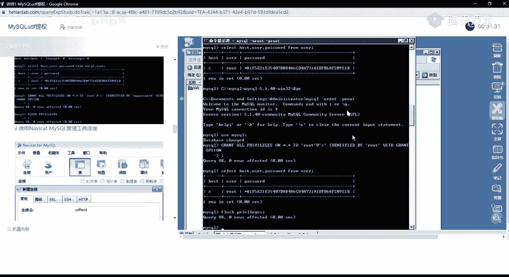

我们切换到这个攻击机上面。

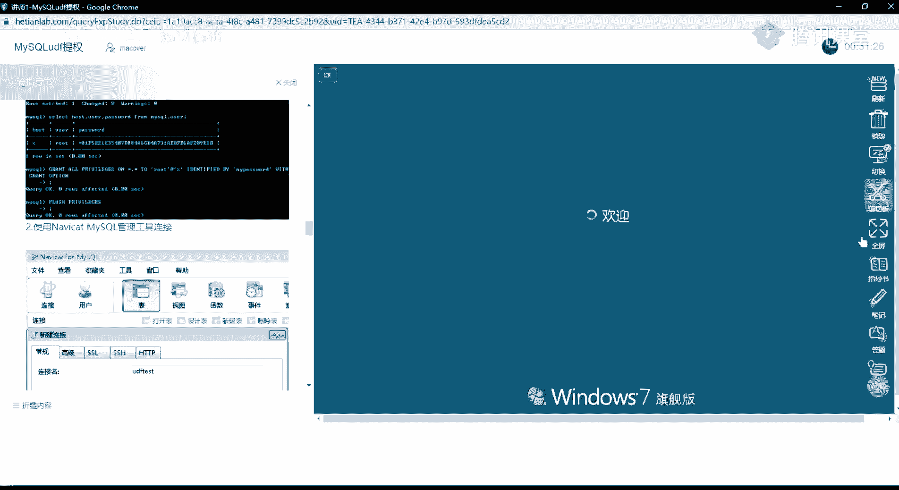

就是其实这个话就是，才是我们实际要去操作的一个机器人。

就前面这边的话就是实验指导书，这边是告诉你，我们要去在我们那个目标机上面去，通过这样的方法能够去开启这样的远程攻击，然后我这边的话我们通过访问那个，访问这个网址对吧，我们这个网址。

然后的话下载我们所需要的这样子的一个工具，以及代码，然后就是在这边我这边把它拖到桌面解压，解说的话，在这边有这样子的一个mv cat，这样子的一个数据库的一个连接工具，我们可以通过这个工具来去连接。

我们的这样的一个远程的一个数据库，好啊，我们这边零件名的话，就比如说kdf吧，然后嗯主机名的话，就是这边的这个呃leak的这个主机啊，就是这边i p的话，就是这个，等1等1等1对啊。

然后呃密码的话是note note也是我们已知的对吧，就我们要去连接这样的数字化，我们就需要知道它的一个额账号密码了对吧，好我们尝试连接在这的话，可以看到这边的话已经连接成功了对吧。

我们能够去访问到他的这样子的一些数据，连接到它的一个数据库啊，呃大家自己在做梦的时候，可以，就是你可以先在这边一些尝试去去连接一下，因为呃，你前面的话没有去配置这样的一个权限的话。

你是不能够去远程的去连接的，你需要去配置这样子的一个，允许它的一个远程连接之后，你才能够通过这样的一个方法，去远程的连接这样一个mysql的一个呃服务器，对啊啊啊啊，连接连接服务器之后的话。

我们在这边的话，就我们可以直接去超过他的一个数据表对吧，然后这话我们可以通过这样子的一个方法，就是新建查询呃，在这里啊，就是你连接之后，这个这个工具大家应该经常用吧，就我们点这边查询对吧。

查询这边我们新建一个查询，新建一个查询之后的话，在这边的话我们就可以去呃，输入我们的这样子的一个查询的一个语句，就比如说，sexting from，你没表，嗯比如说我修的base啊。

我在这边的话就能过去啊，执行我们的这样子的一个，mysql的一个查询的一个语句对吧，然后大家要注意的话，在这边的话，因为你是在这个test表上面去查询的，所以的话你当前的一个操作的话，是在这个表现表啊。

如果说你在这边，比如说你mysql这个表现面对吧，你去新建一个查询的话，你就在mysql表现面，然后这边的话我们可以通过the tables，来去查看，就在这个数据库当中的所有的一个表是吧。

然而前面的这两个表的话就是mysql的一个系统表，然后在这边的话，我们就以这一个test的表，在这个表当中去创建这样子的一个临时表，然后呃我们通过这样子的一个语句。

我们首先的话我们当前的是在这样子的一个，test的一个数据库当中对吧，然后可以通过create来去创建这样子的一个table，创建一个tables，然后table的一个名字的话，我就跟他这边的一样。

以及这边的一个表的一个类型，tp就为了等会就是不会那么难区分了，然后在这边的话就是创建了这个表，下面的话创建了这样子的一个字段，就是这个u d f的这个字段好，我们来运行一下，诶我错了呢。

啊不是tles，是create table，然后执行之后的话，在这边的话就，可以看到这边他没有没有报错的话，就说明我们这边语句的话直接成功了，然后我们这边可以没有，通过show tables。

你去查看一下，可以看到这句话就进进入了，经历了这样子的一个temper，优点f的这个表对吧，嗯嗯嗯可以看到，在这边的话就建立了这样子的一个temp，udf的一个表是吧。

然后我们可以通过select section form这样子的一个temp，01：20，在这个表当中去查询啊，然后查询的话，在这边你可以看到有这样的ud f的一个字段，对吧，但是在这个字段下面的话。

因为我们没有插入数据，所以的话他这边是call啊，就是那对吧，说实话我们这边创建的这个表的话，已经创建成功了，就创建了这样一个临时表，这个临时表的话就是用于我们写入我们的啊，这边的一个dl的一个数据。

那么下面的话就是我们需要去将我们这边的，一个一定有文件的一个二进制的一个数据，插入到这个表当中，然而在这边的话嗯，这个dl的话已经这边已经给出来了，就是在a，这里这个话给的这样的一个文档对吧。

这个文档的话，就是我们这个ud f d l的一个数据，他这话是一个16进制的一个数据，就是他把我们的一个这样子的一个dl文件，一个二进制的一个文件，把它给转成了16进制，转成16进制的这样一个格式对吧。

因为呃转成实际建设的话，这样子的一个是我们能够去这样子的一串代码，对吧，是我们能够去直接的去呃查看到的，不然的话，你平常比如说你要去打开一个，像这种可执行文件对吧，这二进制的这种文件的话。

你打开的话它是一个乱码的对吧，好在这边的话，我们复制这个这一串代码，然后我们通过这样子的一个方法，把它给插入进去，就是通过inside这样子的一个语句，inside in true的话就是插入数据嘛。

就是像我们这边的这个表当中，去插入我们的一个数据库了，再点进去查不到这个tank pdf的这个表当中对吧，然后值的话嗯，值的话为这边这边要注意的话，这边comment的话就是把我们这边的这个镜子。

把它做一个转换，就把它转换转换成原来的这样子的，一个二进制的这样子的一个数据，设问，是有问combat，用这个combat的一个函数来做一个转换，然后转换的话，前面这一部分呢，就是我们刚刚所复制的那个。

随时定制的一个代码，然后这句话我一看，就是我们要去转换的一个类型，然后这边的话把我们这边复制的这一串代码，诶这个可，为什么我的，这么快就进行了。

哇，这边碰了，他不能乱用啊，怎么不能用快捷键了，刚刚还可以用吗。

怎么全选，我这的话呃，复制这边所有的一个数据，把它给拖到这边了，粘贴把它粘贴过来，粘贴过来之后的话就是这样子的一个语句啊，就比较长很长的这样子的一个语句，然后他的一个作用就是把这边的这个数据。

它会把它转成一个啊恰的一个格式，刀的话存存到这边来，好我们运行运行之后的话，在这边发现就受影响的是一行，就是你看到这样子的一个结果，就说明我们这边的一个语句的话，它执行执行成功了，也是没有错误的。

然后关注了你，我也会有一种游戏，那我刚刚没写错吧，然后呃在这里的话，我们可以通过查询它里面的一个内容啊，可以看到在这边的话，我们的一个内容其实已经写进去了，写入到了这样子的一个啊对吧。

这边的话就是这边的话其实就是啊，我们正常的在，比如说在我们windows系统上面，去打开这样的一个调文件的话，是会显示这样的一个乱码是吧，你可以发现在这边它是一个调的一个文件，然后显示这样子的一个结果。

那就说明我们这边的话呃，是把我这一个内容已经写进去了对吧，然后写进去之后的话，下一步就是我们需要去把它导出来，导出来的话在这边就用到这个jp file，intrudp file。

那我这样的话直接复制粘贴吧，有点长，就不打了，是个，就是这样子的一个语句啊，就是从就select udf嘛，就从我们这边的一个test数据库当中对查，就是把u d f这个字段当中的一个内容对吧。

从这个表当中查询出来，查询出来的话，导出导出到这样子的一个目录下面，保存为这样的ud f0 dl的一个文件，好在这边的话我们来执行一下，执行之后的话发现执行成功了啊，执行成功之后的话，我们在这边的话。

因为我单纯是在攻击机对吧。

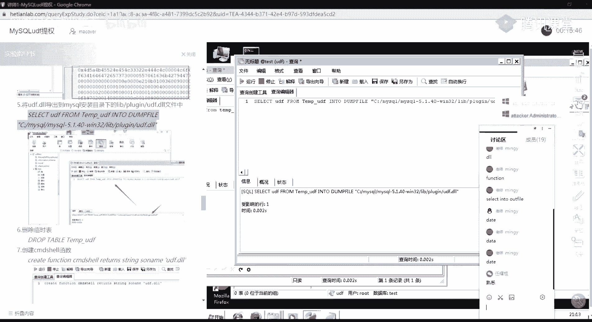

我们可以就切换到我们的这个马车上面。

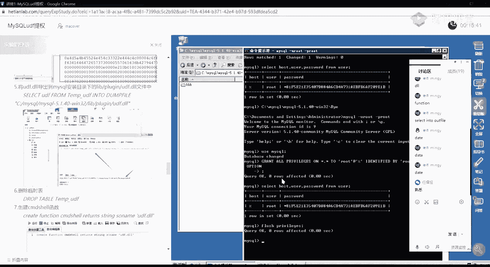

去查看一下是吧，去验证一下啊，这个话只是为了验证我们可以在这个lib下面，paragon，你会发现他在这边就多了这样子的一个，dl的一个文件对吧，比如说我们用记事本打开，你会发现他就是这种乱码的对吧。

其实就是看看我们的这样子的一个内容，已经写入到这个文件当中对吧，那么我们的一个调文件，已经成功的，就是上传到了我们的一个目标的一个，指定目录下面去了对吧，那么下一步的话。

就是我们要去利用它这个del文件来去创建，我们自己的一个啊，定义的就是用户自定义的这样子的一个函数，然后在你的这一个自定义的函数的话，就呃创建在这个sb share的一个函数，它的一个作用的话。

就是用了可以去调用，我们的一个系统的一个命令，是啊，他这个语句话就像这样子就是create function，创建这样的一个函数，这样子的一个函数，它那个函数名还是savage sh。

然后的话后面的话就是他去调用这样子的一个，呃del文件的一个语法，就是通过这样子的一个方法好，我们执行执行之后的话，发现呃没有报错对吧，就说明我们的一个面的话执行成功了，执行成功之后的话。

我们在这边的话，我们就可以去啊，利用它来去进行一个执行系统的一个命令，比如说我们可以通过啊select sd share来去执行，比如说我这边进行一个ip cb的，运行运行之后的话。

在这边是它的一个结果，它的一个结果虽然是显示这样子，但其实它的一个内容的话呃，是能够我们可以通过这样的一个方法，能够去查看这边右键右键这个内存报表后defile，然后把它保存到我们的一个。

本地的一个计算机上面去，比如说我应该算，123保存成这样子的一个123的一个文件，那我们在这边打开。

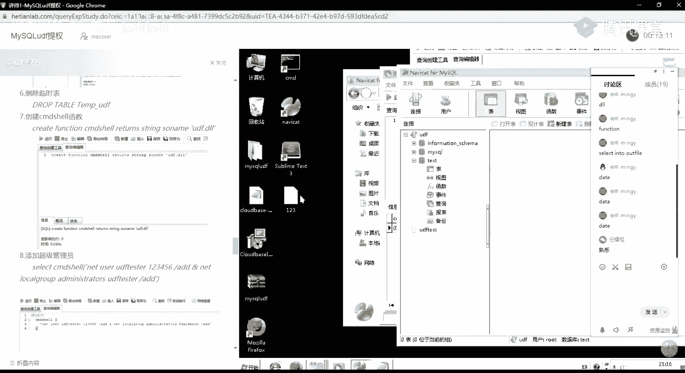

打开之后的话，在这边的话就是他的一个直线的一个结果，是我们可以看到这边的话，就是他直接ip configure之后的话，他这个内容就是这里的这一部分，他这个机器的ip是这个对吧。

以及我们还可以去执行其他的系统的一个面，比如说呃拉伸腰的对啊，我们运行。

保存为31522，对啊，这个就是我这边之前那它要走之后的电量，然后这个话是乱码的话，就是它是中文的嘛，它编码的一个格式的一个问题，这边的话其实无所谓的是吧，我们只需要这些内容就ok了。

这个话就是它的一个呃目标机上面，它的一个用户名对吧，也就是我们现在的话就能够去执行，我们的一个系统的一个命令，以及外卖查看我，查看我当前的一个权限，然后在这边的话我们可以看到。

直接就得到了他的system的权限，然后呃就是等于说我单纯，我去执行这种命令的话，我是一个系统的一个群去执行的，所以的话我这边的话得到的是它的一个。

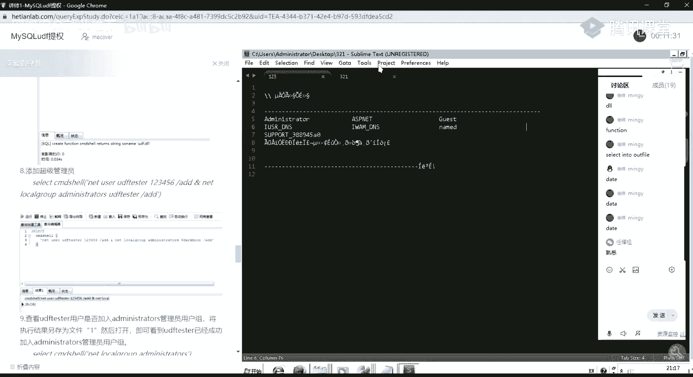

最高的一个选项对啊，但是现在的话我这边还是只能通过这边的一个，mysql的命令去执行对吧，那么我想要去进入到它的一个系统是吧，那么我可以通过这样子的一个命令的一个执行。

来去添加一个系统的一个管理员账号是吧，然后的话我直接再通过远程的一个登录登，通过这个管理员账号来登录到，我的一个目标的一个机器对吧，然后这边的话我就不再演示了，就是添加如何去添加这样的这个用户。

这个的话应该是大家应该都比较熟了，啊这边的话就是第一个场景，然后第二个场景的话就是在已经获得web shell权限，然后的话我们的一个测试人员，可以上传这种片区脚本，但是的话我们无法去执行这样子的一个。

操作系统的一个命令，然后的话呃同样的我们可以用这个udf提取，像我们的一个web share的一个选项，提升到管理员权限，而其在这边的话，就是他啊这边是介绍的一个脚本，就通过这个脚本的话。

这个脚本上已经就是把我们前面的这个优点，很提前的这样的一个步骤，已经就是把它集成到这个脚本上去了对吧，然后我们得到了一个worship，我们可以通过呃上传这个片区的一个脚本。

然后的话来去进行一个这样的一个呃提取啊，当然而上一步的话，其实就是说我这一个场景的话是有假设是吧，是有假设他得到了一个version啊，但是如果你没有得到一个version。

你只知道它的一个mysql的一个啊数据库是吧，就比如说你在内网，你通过呃某一个机器，你得到其他的机器的一个mysql，数据库的一个这样的一个用户名，密码的一个信息对吧，然后你能够去远程连接到它。

那么你就可以去尝试用这样的一个连接上去，之后的话，尝试用这样的一个u d f提取的一个方法，来去进行一个权限的一个提升，然后在这的话就是你得到web share。

然后你就是其实就是我刚刚所说的一个场景嘛，是吧，你可以去上传，上传我们的一个这样子的一个脚本，当时的话你去执行啊系统的一个命令的话，他是受限的，所以的话就其实你得到这个需要，你不能够去执行命令的话。

那么你这个需要的话，相当于是就没有什么太大作用的对吧，你只能够去上传文件，下载文件吧，那么在这边的话，我们就可以通过商城这样的一个文件上传，上传到我们的一个目标机上面去，然后的话他这边的一个脚本的话。

它的一个作用，就是用这个udf提取的一个方法呃，具体的一个，操作的话就是呃我们这边的话，嗯我们这边的话就是试验机的话，已经把这个脚本，已经就是上传到了这个目标机器上面去了，就是他这边的话没有模拟。

说没有去模拟，没有去模拟，就是我们得到web share，然后的话把它上传到这个上面，就省去了中间中间的这一步，然后我们直接从就是我们上传到这个，上传了这个脚本之后对吧，我们怎么去利用它，然后在这的话。

我们同样的需要去知道他这个数据库的一个，账号密码，然后我们提交提交之后的话，在这边就已经登录上了，我们那个目标的一个机器对吧，然后登录的是呃，这样这样子的一个test的一个数据库。

好呃在这边的话呃这边的这个东西的话，我们可以在这边去上传文件，就是有这个脚本的话，我们可以在这边去上传文件，上传到指定的目录下面去啊，呃还有的话就是呃，这边的话是它的一个web的一个目录。

然后在这边下面，这个话就是我们的一个mysql的安装目录，而他这边已经就是已经填好了，这边的一个就是目录下面呃，这个u d f顶尖l的一个呃路径啊，然后我们只需要点点击这个导出的df。

它就会导出到我们的这一个目录下面，那些前面的话我们已经就是有导出了，这个有点回复标，所以的话他这边说已经存在了是吧，这边还是正常的，然后导出之后的话，我们在这边我们就可以去创建sam d share。

以及添加管理，超级管理运用用户是吧，反弹shell等等的这样的一个操作，我们这边的话就以这个创建圣尼希尔为例呃，因为前面同样的也已经创建了是吧，所以的话他这边快报了这样子的。

就是说这一个cbci的一个函数已经存在了，好，这句话我们就直接通过select来去调用，这样子的一个function，来去执行我们的一个系统的一个命令对吧，比如说可，嗯我们执行执行之后的话。

它的一个结果的话就显示到了这边对吧，以及，开麦，对这边的话就是显示它的一个结果，这是这个脚本的一个使用啊，啊这边的话应该就原理的话，就是我们前面讲的这这两个这边的这个操作。

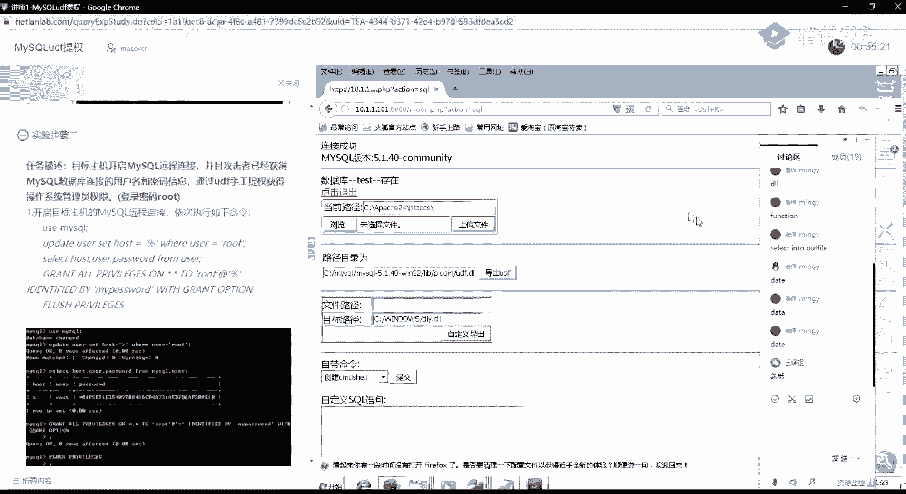

只是他这个脚本的话已经集成了，然后其实你可以打开他的这个脚本。

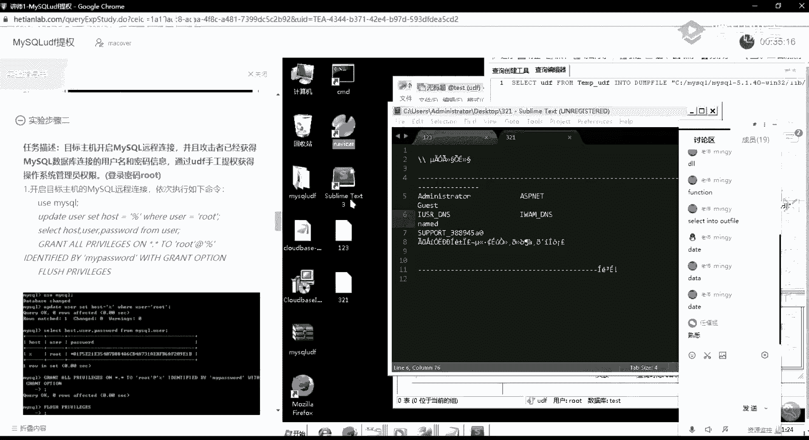

查看它里面的一个内容，就是这个。

对吧，就这一正面的应用，它的应用的话比较多啊，然后呃其实它的一个，就其实啊，我们刚刚不是有一个导出ud f的那个操作嘛，其实他的这个文件里面的话，他就已经把那个ud f的一个内容。

已经就是写到了这个文件当中嗯，啊这样的话我就不找了，因为你可以往这边拉，有好多，因为他那个和udf文件的那个，字符串的话比较长，大家可以去看一下，去找一下，然后这个脚本上其实就是集成了。

我们刚刚那个操作原理的话都是一样的。

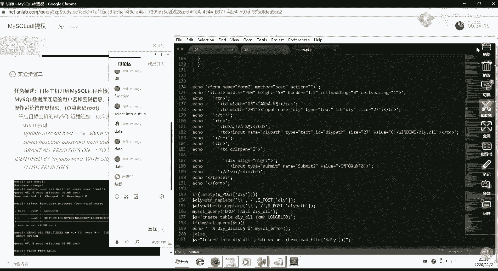

只要知道怎么去用就ok了，呃这边的话就是这个mysql的一个udf，提权的一个实验以及详细的一个步骤。

就大家有没有什么疑问。

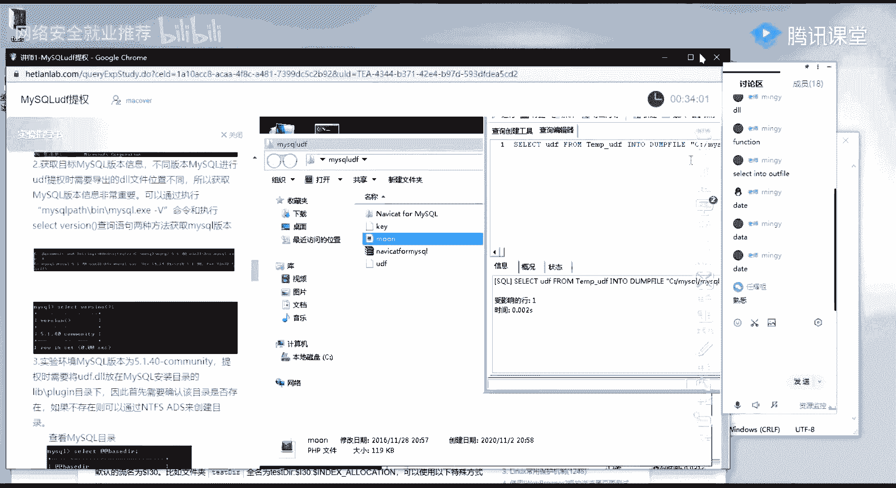

可以现在提，大家有问题吗，有问题的扣一，没问题的扣二，就一位同学吗，两位。

三位同学，其他的呢。

其他同学有问题吗，这有18个人，怎么怎么就三个同学回我了。

行吧，大家不是很喜欢，不是很喜欢跟我互动了，我发现那应该应该我就默认大家没有什么问题，好吧，好我们继续我们的一个内容上面，前面的话就是给大家介绍了，就是mysql提权的这样子的两个情景。

下面的一个详细的一个方法，我这里p p t的一个内容的话，就是呃给大家介绍了这样子的一个过程是吧，就梳理了这样的过程，详细的一个内容的话，大家去看那个实验室对吧，好吧好啊。

下面他就是介绍一下这个sex cel的一个提前，就succel的话跟mysql同样，都是我们经常去使用到的，这样的两种数据库对吧，然后呃mysql的话。

它是在windows以及linux产品都能够去使用的，而cccl的话它是windows windows server，windows服务器上面的，就是就是专用的这样子的一个数据库的，这样子的一个数据库。

然后的话呃讲这个这是我的一个齐全的话，我们首先要去了解一下这样子的一个xp，cd shell的这个呃这个扩展存储过程，就是你可以把它理解成一个这样子的，一个组件啊，就这这个这个组件的话。

它可以就是按系统管理员，以操作系统命令行解释器的一个方式，执行给定的一个命令字符串，然后它并以文本行的一个方式，返回任何一个输出，就这句话怎么理解呢，就是说我们就是我们的一个系统管理员。

可以用这一个呃扩展存储过程，来去执行我们给定的一个命令，然后给定的这个命令的话，它会是在它的一个就是操作系统上面，去进行一个解释执行，也就是能够在系统上面，在我们的一个目标系统上面去执行。

我们给定的一个命令，然后的话它会友好的返回输出给我们，啊呃在这边的话就是由于这个xxcm的需要，它的呃，还他可以去执行任何的这种，操作系统的一个命令，所以的话呃它是有一定，它是有很大的一个危害的。

就是如果说我们那个succel的一个管理员账号，就是sa嘛，如果他们获得了他的一个管理员账号，我们连接到这个数据库之后的话，我们就可以利用这个xp cmd c来去执行，操作系统的一个命令。

来得到操作系统的一个权限，所以的话针对这个xp cmd shell的话，在这边后面的话，它会有就是有这样子的一个限制，就是在sex server 2000当中的话，它默认是开启的。

但是2005以上的这种版本的话，它的这个是默认是关闭的，呃呃就是新版本的三个cel的话，它是啊这个xp sm d shell还是默认关闭，所以的话我们无法去直接的去使用它，对啊，如果我们执行。

就是如果说这一个组件它关闭的话，我们执行就通过这个sap sam bp去执行命令的话，他会有报这样的一个错误，这个话就是让大家了解一下，就如果你啊发现报了这样这样的一个错误。

那么就表示这边的一个xp cmd shell的话，它是没有开启的啊，呃这边的话就是如何去利用这个，tcb shell的一个语法，就是通过这样子的一个方法，就ex e c执行这样子的一个呃。

xp cmd的一个小的一个扩展过程，然后后面的话接我们的一个要去执行的一个，mean的一个字符串，就dos命令吧，啊前面的话有介绍，就是说在新版的sql server它是默认关闭的对吧。

那么它默认关闭我们是不是就不能用了呢，其实不是的，就是啊他虽然阻止了对这个xp cm mcl组件的啊，这样子的一个反问，但是的话我们呃可以通过这样子的一个方法，sp configure来去启用它。

当当的话在这边的话要注意，就是是只有系统管理员，他才能够去通过这个方法来去启用它，所以的话就我们要去进行这样的一个期权的，一个前提条件是，你要有你要去得到的这样子的一个啊，管理员的一个账号的一个权限。

或者说你能够去以这样子的一个管理员的权限，来去执行这样子的一个命令，这边的话大家要去注意要注意的一个点，然后呃如何去启用这样子的一个xp cb线呢，就是通过这样子的一个方法。

呃就是使用这个sp的一个config h，首先的话使用这个，然后的话呃，率config的话就是我们这边使用的这一个呃，设置为一，它就是表示启用，启用之后的话，他会去重新配置。

也就是就跟我们前面刷新我们的配置一样的嘛，对吧，然后的话在他再去使用这样的一个xp，cmd的一个shell，然后的话刷新配置之后的话，我们这边的话就启用了，然后我们就能够去去调用它。

来去执行我们的一个系统的一个命令呃。

呃关于这个succel的一个提前的话，在这边通过这个实验。

这个sex cel就是micro。

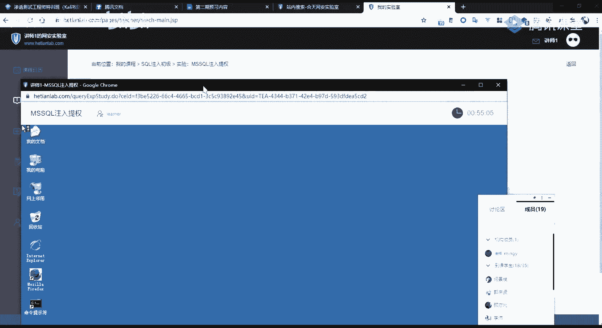

sex sever的这样子的一个注入提权，的就是通过这个实验，然后这个实验的话嗯，指导书的话同样的也很详细啊，就是详细的介绍了他的一个过程呃，在这边的话这个实验的话，它是首先它是通过一个注入点。

就通过一个cp server的一个注入点，然后这个注入点的话，我们因为我们知道我们的一个sql注入的一个，应用方法呢，就是啊或者说它的一个漏洞的话，就是我们可以去啊，注入我们自己的一个sql的一个语句。

然后的话把它带入到目标机器，目标的一个circle的一个服务器上面去执行对吧，所以说在这边的话，我们找到这样子的一个sql注入点，那么他可以去就是执行我们这边注入的。

额外的这样子的一个恶意的一个sql语句是吧，然后的话带入到他的一个sl服务器上面去执，行，执行之后的话来返回相应的一个结果，就是，然后首先的话就是就是呃，有这样子的一个注入点，就是这边的这个实验。

就他这边已经呃提前给了这样子的一个注入点，对我们利用这个注入点来去进行一个，这样子的一个提权，访问访问之后的话，就是这样子的一个相当简单的一个页面，就是呃就是啊欢迎欢迎，就是抱抱对吧。

然而他的一个ur的话就像这样子，然后通过他的一个ur这边，其实我们就能够，就是大家对收购入比较熟悉的话，就看他这样子的一个参数，我们就能够去基本的去判断对吧，就一般的话搜狗注入的这种点的话。

它是会就是有对应的这样的一个参数对吧，然后这个参数的话，它是从数据库当中去获取数据的，就是说他有与数据库去做这样子的，一个数据交互，那么我在这边的话就能够去利用它。

就如果说它存在这样的一个社会注入漏洞的话，我们可以利用它的这一个参数来去注入，我们自己的一个社会的一个语句是吧，好这句话就是他i d等于一对吧，那么我们尝试一下i d等于二，就等于二的话。

他这边没有数据是吧，三，都是没有数据，那说明的话他这边只有一有数据是吧，或者说他是没有这样子的一个id值是吧，那么呃测试sl注入的一个点的话，就我们常用的一个号就是加一个单引号对吧，就是加一个单引号。

原本的话正常人是这样的页面，我们这边加一个单引号，他这边的话就有了这样的一个报错，然后有这样的一个报错的话，我们也能够去有一个基本的一个判断，判断它存在这样子的，比如他很很有可能存在这样子的一个。

生活中的一个漏洞，就为什么他我们通过这样的一个单引号，能够去做这样的一个判断呢，就是呃大家如果对sql语句比较了解的话，就是我们的这样子的一个这样子一个页面对吧，这个页面我们像这个页面传递的这样子。

就等于一的一个参数对吧，然后这个参数的话，它其实会传递到我们的一个sql数据库，呃，传递到就就是这有一个页面它能够去处理，就说他能够去处理这样子，我们传递的在这样子的一个呃id值对吧。

然后他处理这一个id值的话，它会把我们的一个sql的一个语句，它会传到我们的一个circle server，的一个服务器上面去执行对吧，执行之后的话，他会查询这样的一个结果，然后反馈给我们。

那么其实我们通过这样子的页面，我们也能够去基本的就是能够去呃，猜测它的一个后台的，就是基本的这种sql语句的结构对吧，像比如说在这边的话，我们可以就是假设它是呃这样子的一个，sql的一个语句吧，比如说。

比如说我这边select name对吧，就是这边显示它的一个name值吗，或者说还有一段话就是time是吧，这样的话这边我这边是假设就是假，因为我们从这个页面的一个数据嘛对吧。

就是bob还有这一个这边的这个时间，然后其他的这一个这一个的话，它它都是固定的一个值嘛对吧。

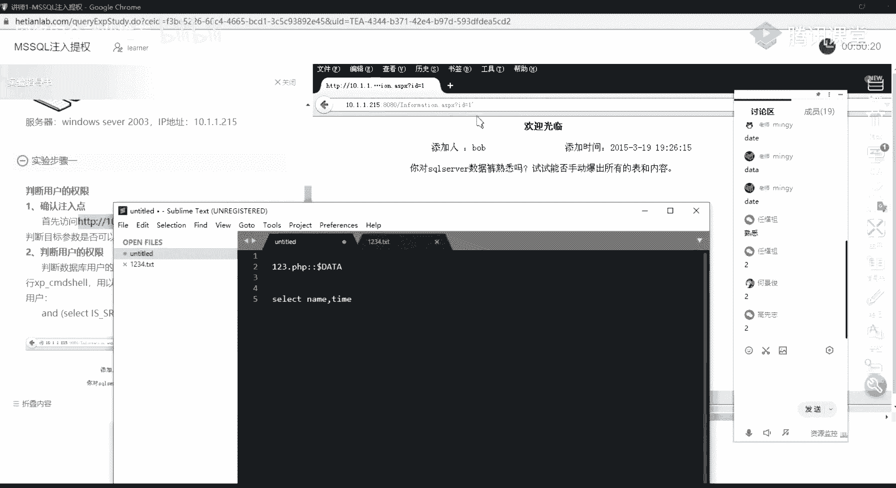

比如说我这边二对吧，它都是不变的。

变的话就是他这边后面的这个数据，那我们是不是可以大胆猜测一下，它的一个sql语句，就是select name或者说time对吧，就是大概也就意思嘛对吧，然后是form这样子的一个u的表当中对吧。

然后while i d等于多就，不把id等于多少，就是这个优质表当中的话呃，我们假设它就就我们从这个方能够去确定它呃，大概有这样子的三个字段是吧，就id id字段，name字段，time字段是吧。

其他的话我们也不知道是吧，就我们也不用管，我们就假设它的一个sql语句，我们猜测它是这样子的是吧，那么它的一个语句的话就是当id等一的时候，他会去这个优质表当中，或者说某个表当中去查询他的一个名字。

以及时间对吧。

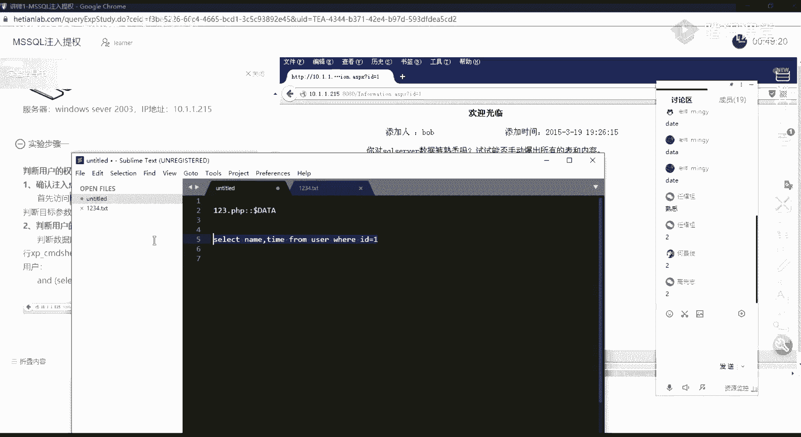

那么我们在这的话，我们如何去注入我们的一个语句呢，哈首先在这的话我们需要去判断一下，就是说我们常见的这种sl的一个柱对吧，它有像这种字符型，数字型对吧，我们的一个方，我们需要去判断它的一个这种类型的。

就我们从这边也能够去从这这边的话，也能够去基本判断它应该是一个数字写，那么我们首先在这边呃出了一个单引号对吧，单引号之后的话，它报错，报错的话，他这边是表示呃字符串后的一个引号不完整。

就是我们这边引号是多的对吧，那么我们把这边id等于一单以后。

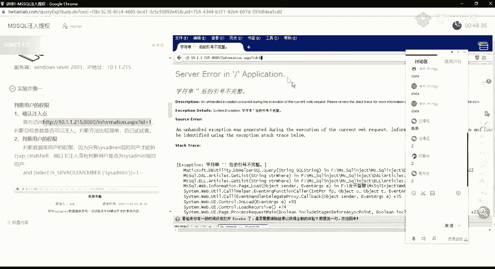

我们把它带入到我这边的这个sql语句，就就像这对吧，i g等于一这样子的一个数据，那么它实际它如果他没有对我这边做一个过滤，对吧，没有对我这边的ip只做一个工具，它会把我这边的一个这个语句。

把它带入到sql数据库当中去查询，然后他查询的话，他查询这边一单引号，这个值就是在数据库当中，是不可能存在这样子的一个单引号的一个值的，所以的话那么他肯定查找不到这个值，所以的话他就会报错。

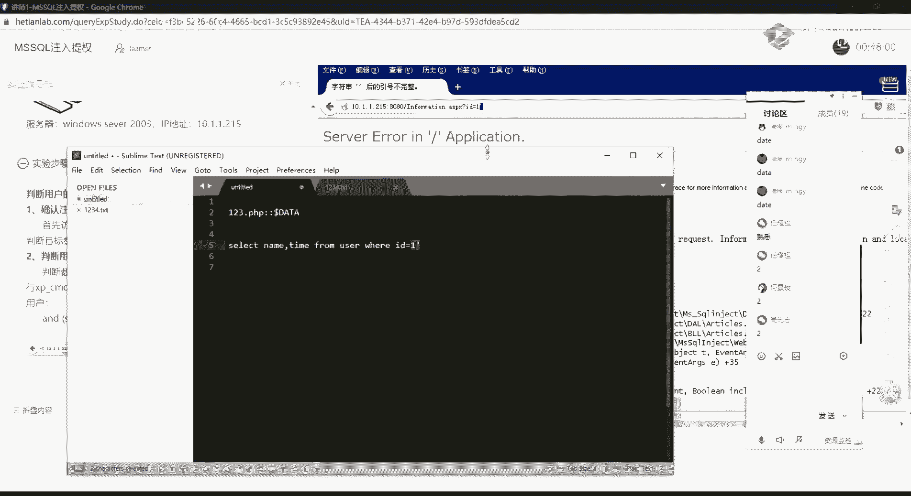

当然的话呃如果说就是你加一个单引号对吧。

你没有报错，那么可能是就是说它有对我们这边的一个，传递的这个参数有做相应的一个过滤。

然后在这的话他有这种报错对吧，那么说明他有把我这边的一个单引号的，这个字符代入到了数据库当中去查询，因为他找不到这样的一个数据嘛，所以的话他会报错嘛对吧，好啊，大家还可能说就是有可能是字符型的对吧。

那字符型的话我们来测试一下对吧，就是字符型的话，我们知道它的一个i d值话，它会被这样子的一个单引号做一个包裹是吧，所以话我们在这边的话，其实我们在这边加一个单引号。

然后我们在后面加一个这样子的一个杠杆，刚刚空格，刚刚空格的话，就是在mysql下面的这样子的一个注释符啊，就是他可以忽略后面的这样子的一个字符。

就是实际的话，就比如说如果说他的一个id是像这样子的一个，字符型对吧，它会有这样的一个单引号，它的一个数据的话，它会传到这边来，那么我这边i d等于一，它传到这边来对吧，就是这样子的一个语句。

那么我这边加一个单引号的话，他就是成了这样子对吧，等于的话就是他这边它它它查询的一个值的话，就是i d等于一的这一部分，但是在这边的话它多了一个单引号对吧，所以的话他去查找这个。

所以在这边的话他会有报错。

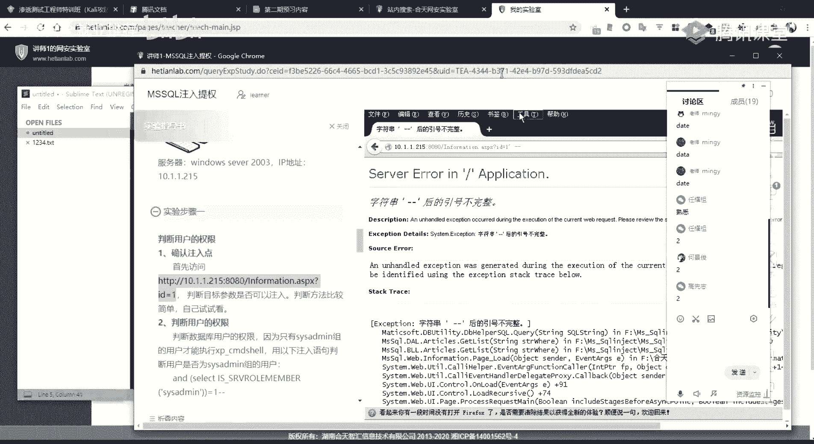

他说后面的这个引号不完整啊，其实实际的一个语句是这样子的，所以点点干啊，好如果说就是它是一个字符型的话对吧，那么我这边点点干，后面干干空格，后面的话他会把这边注释掉对吧，也就是实际的一个语句。

他其实是这样子的，也就是他这个r一等于一的话，它有这个值，那么它他这边的话就不会有这种报错啊。

然后他这边不是说字符串后面的一个引号。

不完整，也就是我这边加了这样子的一个引号对吧，就是加了这个引号之后，他说后面没有一个引号，因为它没有闭合这边的这个引号，所以的话他说这边不完整对吧，也就是说他其实是这样子的一个这样子的。

一个这样子的一个语句啊，是吧好，我们也可以通过像，比如说通过这样的一个语句嘛来去判断你的，通过这样子的一个方法对吧，如果说它是一个字符型的话，我们在这边的话，通过闭合它的这样子的一个。

就通过闭合它的这样子的一个单引号啊。

来去判断，就比如说它是字符型，他这样子的话，我们嗯，等于一点是这样子的话，那么我们团传进去的一个数值的话，就是这一部分对吧，是这一部分，那么我们在这边的话，如果说它是一个字符型。

那么我这边藏着这个数据化，我通过单引号做了一个闭合对吧，就是这一部分这一部分的话，i d等于一的话是有直的，那么它会返回返回值对吧，因为n一等于一，这边的话他肯定是相等的，也就是为真，然后n德的话是。

很多的话就是两两就是前面的这一部分为针，以及后面的这一部为真，它才会就是为针对吧，也就是他不会报错。

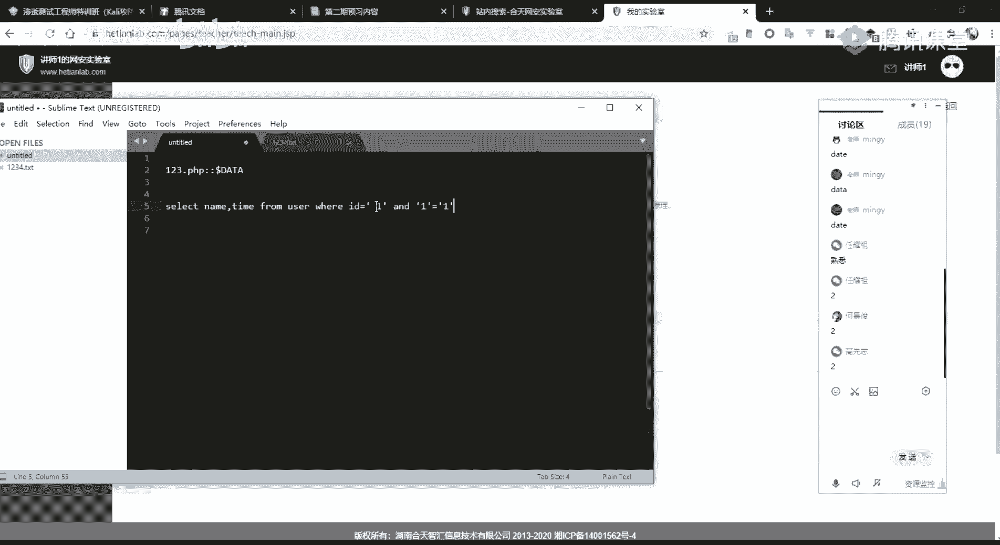

然后这边的话啊扯远了，给大家讲讲师口注入去了啊，就是这其实也是这就是可能有些同学不知道，但当时的话小狗注入的话，应该这个话应该大家都是很熟悉的，我这句话就是正好到这边，我就介绍一下呃。

呃呃前面其实前面课程的话应该也要讲对吧，假sql注，所以原理的话都是差不多的就好啊，其他的不说了，就是我这边的话，就是我判断了他这边存在存在这样子的一个，sl输入对吧，那么我在这边的话。

我们就可以去插入我们想要的这样子的一个，sql的一个语句啊，去做一个查询对吧，然后在这边的话，同样去进行一个这样子的一个提前的话，我们首先需要去判断用户的一个权限。

就是因为只有这样子的一个c s y s i的，命组的一个用户，他才能够去执行这个插线的去选，就是在这个组的一个用户的话，它是一个就是数据库的一个管理员，然后的话我们可以通过这样子的一个语句，来去判断。

好我们我们这边执行执行之后的话，你会发现啊，他这边是没有没有变化的对吧，没有变化的话，那么就说明我们这边的这个语句，它是执行正确的，也就是说也就是说我们这边的这一个select啊。

已知就是这个server member，然后的话判断当前的这个就当前的用户，他是不是在这个s y s i的面的这个组啊，他的这个sql语句它是执行了，而且他的一个执行的话是正确的。

就执行正确是什么意思呢，就是我当前的这一个呃，当前的这个数据库的一个用户，它是属于这个sy s它的面的这个组的，所以的话我这边的话它是没有报错的，因为d等于一，它是为真的对吧，好n的话就是两针才回升吧。

这边为一，它是就是这边为真，然后这边后面的话它同样的也为正，所以的话，我们这边的话是能够正常的去得到结果的对吧，然后我们这边可以就是呃随便改一个对吧，然后我们执行执行之后的话，你会发现他这边没有结果。

因为我们这边的话这边写错了是吧，它它不是就当前用的，他不是这个s y s d m i n这个组，而是admin这个组是吧，说明的话我们这边的话，之前的一个结果它是呃正确的，也就是当前的一个用户。

它是一个管理的一个用户啊，然后的话我们还需要去判断数据库当中，它是否存在这样的一个xp cm的线，好我们先讲实验的时候，我们先看一下我ppt里面的一个内容，就是呃这边的话也练了，就是常见的就是csol。

注入的一个系统的一个函数啊，像user user name就是获取当前的一个用户，然后呃db name就当前数据库的一个名字，然后host name，然后我选数据库的一个版本等等。

以及这一个判断用户是否属于管理员组，啊，这个话都是就是它的一个一些系统的一个函数，就是它已经内置了，我们可以直接通过select来去查询去使用，是啊呃然后的话就是判断用户的权限。

就通过这样子的一个语句好，下一步就是判断是否存在这样的一个x p3 ，p c，就是呃判断这个数据库当中，它是否存在x p cv下，就是呃这边的一个xp cd share，呃，要注意啊。

就是我们前面的话是呃，我们前面的话是有说就说这个type c m d区，它默认它是关闭的对吧，但是的话它关闭的话，就说明它有存在这个type c m d区，而只是被关闭了，对吧。

当时的话如果你的这个sql数据库当中，他没有这样的xp cm d cl的这个组件的话，那么我们肯定是用不了的对吧，我们因为它没有我们怎么去尝试开启来了，所以的话我们可以在这边。

可以通过这样子的一个方法去做一个判断，就是他会在这样子的一个系统的一个，数据库当中去查找，查找它的一个类型是这个啊，名字是这个texcel就行，如果有的话，就说明它是存在这样子的一个组件的。

然后存在这个组件的话，我们就可以利用这个组件去执行命令的，如果说执行命令的时候报错了，就报我们前面的这边所说的这个错误，那么就说明我的这个插件是cd c，它是没有开启的对吧，那么没有开启的话。

我们就可以尝试使用这一个sp config来去开启它，然后的话来去啊，利用它来执行我们的一个系统的一个命令，就大体的一个思路就是这样子，然后具体的话在这边的话，我们来到实验这边来看一下呃。

判断它是否存在这个组件啊，我这边的话，因为呃时间关系以及就是这个的话比较长啊，我这话我就不敲了，敲的话敲的话是可以敲，但是比较浪费时间啊，就呃当然大家的话就是不赶时间的话，不赶时间的话。

我建议大家还是自己手动的去敲一下，就是你敲的话其实长也不是很长对吧，然后这边的话我们执行执行之后的话，发现没有没有没有报错对吧，或者说没有，就是它有内容返回，也就是说我们这边执行的这个语句的话。

它是就是他已经执行了，然后的话他是执行正确的，就表明的话我这边的啊，这个super server的那个服务器的话，它是有存在这样子的一个xp cd shell这个组件的，然后的话呃。

我们确定了它存在这一个组件存在对吧，那么我们还需要去确定它是否启用，你确定它是否启用的话，我们可以直接就就直接去执行，这样子的一个语句对吧，就是利用这个time smisha来去执行语句嘛。

如果说他不存在对吧，那么它就会报错，如果说它存在的话，那么他就会执行我们的一个语句，不会报错对吧，这条就这样，然后这边的话之前的一个语句话，就是就用我们前面的去调用这个txcm，必须要的一个语法。

就ex e c加这样子的一个，然后的话去执行这样子的一个nude name，password a的这一个一句话，就是添加这样子的一个name用户密码，它是password对吧，好好好卡着呢。

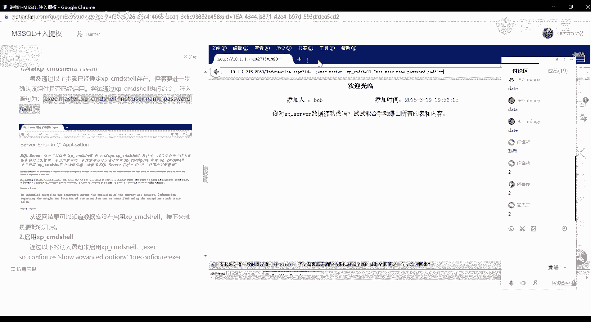

这边的话是呃杆的话是卡的，然后这边的话我们执行执行之后的话，可以发现这边的话他报错了，就是有报错对吧，然后其实这边的一个报错的话，就已经写出来了对吧。

他说这边sex server它阻止了对这一个组件的一个，这样子的一个访问，就是用这个呃过程来去执行，我们的一个系统命令吧，它阻止了，然后，就是这个组件它是呃作为了服务器去配置的，一个呃一部分啊。

所以的话他这边的话是把这个xx sb线的一个，组件关闭了对吧，那么关闭之后的话我们无法去直接的一个使用，但是的话它关闭了我们，因为我们前面的话已经判断了，我当前的一个数据库的一个权限的话。

是一个管理那个权限对吧，也就是说就是说啊什么意思呢，就是说我这边虽然没有去得到这个sa，或者说得到它的管理用户的一个密码对吧，但是的话我当前的话我当前的一个数据库，它是一个管理的一个数据库的一个用户。

那么我当前我这边通过sql注入的一个，通过sql注入的一个攻击对吧，我这边插入的注入的这样子的，一个sql的一个语句，它同样的是一个还原的一个用户去执行的，这里大家能理解吧。

所以的话我这边其实是一个管理的一个权限，那么我这边管理的权限的话，我就可以通过这边所说的，呃通过这边所说的，通过sp config来去启用这边的啊，一个xp cmd需要的一个组件。

然后呃方法的话就是我这边复制一下，就是啊这样子的一个语句，执行，而执行之后的话都没有没有就是就是有内容的，就说明我们这我们这边的话，这个语句已经执行成功了对吧，执行成功之后的话。

我们再来尝试第二种这个差距项目继续，来去执行一下这边的一个命令，执行的话还是执行了刚刚的这个，添加一个内容或者一个密码，然后我们回车回车，执行之后的话，他这边也没有，就是没有问题对吧。

就说明我们的一个语句执行成功了，然后在这的话我们验证一下，因为当前的这个机器这个服务的话，但是就只在当前的这个板子上面，就是他不是，因为就你在当前的这个机器上面去操作的嘛。

就是你在一个cf server的一个服务器，同样的也是在这个机器，它是部署在这个机器上面的，也就是我这边通过sex server去执行的一个系统命令，也就也是在当前的这个主机上面啊。

这边的话是一个实验的一个环境，是这样的好，我们这边通过nt os来去查看一下，在这边可以看到就多了这样子，一个name的一个用户好，我们可以，换一个呃电子面纱对吧。

所以呢。

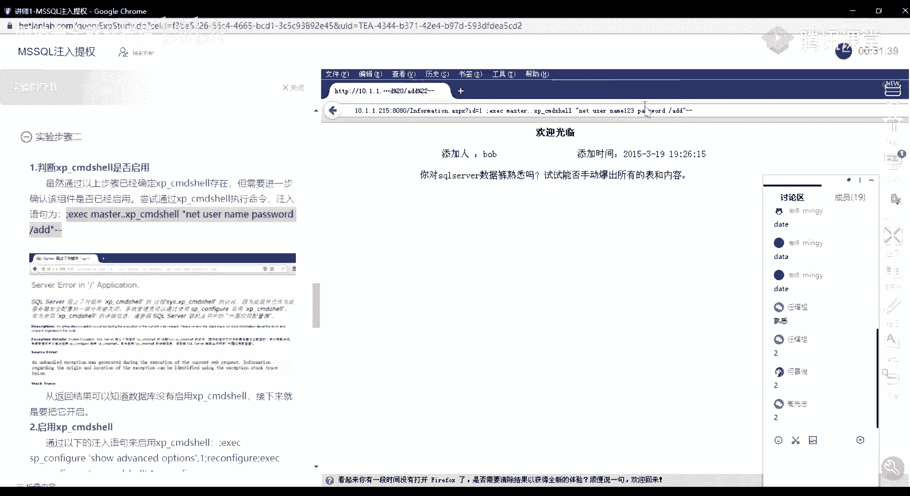

这边的话呃添加一个name，要三个这样的用户对吧，然后在这边它是没有这样子的一个用户的对吧，我们在这边执行一下，执行之后的话，我们再来查看一下，你会发现的话在这边已经添加了一个内容，二三的一个用户。

也就是说我这边的话，通过通过他的这样子的一个注入点。

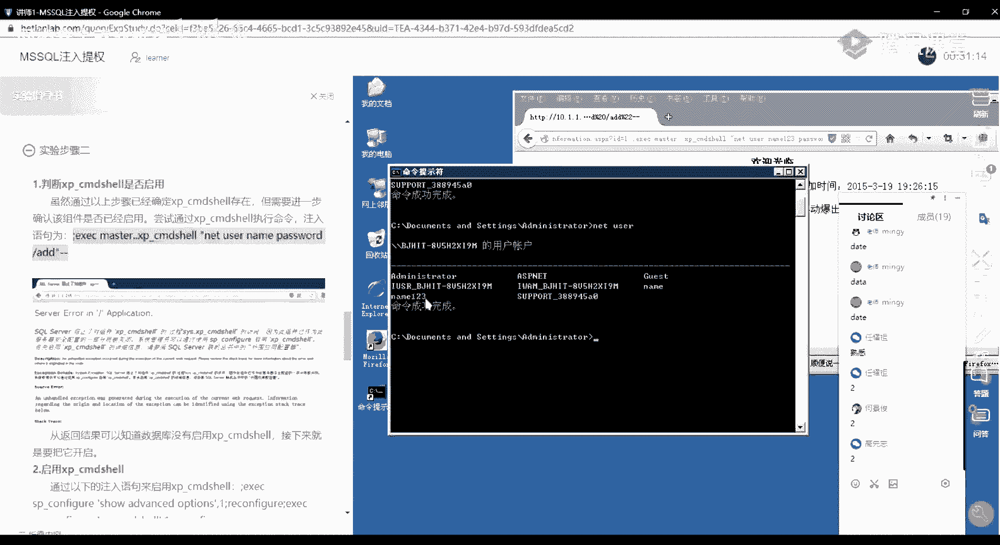

好的话呃，调用这个xp sm t shell的这个组件，成功地执行了一个系统的一个命令，那么现在的话，我们就你你就能够去调用这个组件，来去执行我们想要的一个系统运动是吧，那么提前的一个思路的话就是呃。

那我们现在能够能够执行命令了嘛对吧，那么我们就能够去添加这样子的一个管理员，用户对吧，然后的话把它添加到管理员组，也就是能够去得到它的一个管理员的用户嘛，那么自然的就得到了它的一个管理员。

用户的一个权限，呃呃这边添加用户的话，就添加到管理员组，这边的话我就不操作了是吧，然后这边添加用户的话是没有问题的，然后呃第七个的话，这边的话就是介绍一下这个就是sp的这个oa create。

就是说在x p sm share被删除，或者说出错的一个情况下，可以充分利用这个来训练一个题型，也就是我们前面就如果说这个xp cmd shell，这个组件它没有了是吧，然后的话或者说我们出错了。

也就是我们就是无法去使用这个组件，来去执行系统命令的时候，我们可以尝试使用这个使用这个来去呃，来去进行一个齐全，在这边的话就是这样子的一个步骤，然后具体的关于这个的话，大家可以去看一下这篇文章。

这边的话他介绍了很多的这样的一个方法，就我们可以通过这样子的一个呃配置，来去打开对应的一个组件，然后然后的话再利用这样的一个组件，就是利用的一个方法，就是像这样子，像呃他这边可以嗯家用户对吧。

然后的话粘贴进的一个替换，还有床码，还有鞋布，鞋控脚本等等的一个方法，我们可以使用这个组件来去达到目的，就就比如说这样子，比如通过这一通过执行这样子的一个命令，就如果说这一个组件我们开启了之后的。

我们可以通过呃这个组件来去执行命令，然后只选了一个命令的话，就是像这样子，就其实就是在这边啊执行，通过cmd来执行一个换麦，然后的话把它输出到我们的，指定的一个文件当中，好在这边要注意的话。

就是你用这个组件你去执行命令的话，他是没有输出的，也就是你看不到它的一个输出，所以的话我们需要去通过这样子的一个重建，相应的一个方法，就是输出到我们的一个文件当中，然后的话因为我们就。

就需要通过这样的一个方法来去呃，从定向到指定的一个文件那种，然后的话才才能够去查看，啊以上的话就是我们本节课的一个内容呃，第三部分的这个postgresql的话，这个的话嗯课程安排里面的话是有说要讲。

然后其实我这边的话，拜拜就是有这样的一个比较，就是已经很详细的介绍了，这一个呃persorcycle的这样的一个期权，就是我们利用他的这个pole，persorcycle的一个呃数据库。

然后的话呃用它来去写一个呃，写一个s o的这样子的一个文件，就是说在linux里面的话，我们就是要去调用它的，就是要去调用系统的这样子的一个，sol的一个文件。

然后其实类似于我们的一个就是我们的一个mysql，的一个优点回来一个提取啊，但是的话他这边的话是利用它的一个数据库，的一个特性来去写入到我们的目标机上面去，然后的话再把它组合成一个文件。

然后再用这个文件来去创建，我们的一个可执行的一个呃，就是执行命令的这样子的一个函数啊，然后他再利用这个呃创建这样子的一个对象，然后利用这个对象来去呃，执行我们的一个系统的一个命令，像比如说在这里。

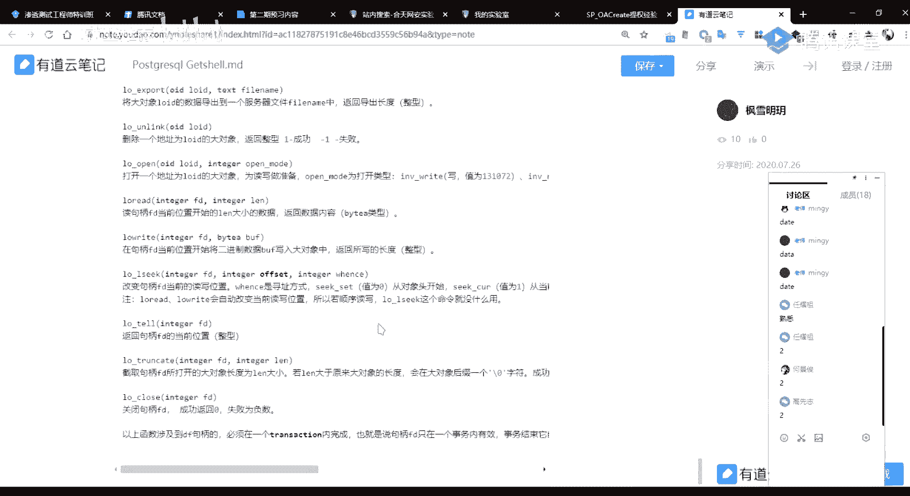

就我这边这一篇笔记的话，应该是写的很详细的。

然后下节课的话再给大家去介绍这个吧，因为一节课的话讲不了这么多好呃，大家先去看吧，然后下节课的时候的话，上课之前的话，我再问大家，就是看大家有没有必要去给大家讲一下，这个好吧。

呃呃大家对今天课程的一个内容，有没有什么疑问，有问题的扣一，没问题的扣二，大家都能能能跟得上我吧，能能听得懂吧，其他同学呢怎么每次都是这这这这这三位同学，还有这四位，其他其他同学是不是在挂机呀。

没没没有在没有在听我讲吗，就大家就大家觉得我这样只去这样子，去给大家讲课，然后的话呃大家能能不能能不能接受，如果不能接受的话，你可以提出来，所以你觉得你觉得就是要怎样子。

那个你才能够去比较好的一个接受对吧，我这边的话可以就是根据大小的一个需求，做相应的一个调整好吧，哎行吧，大家还是大家还是不喜欢跟我互动了，已经很细了，ok ok那那就，能主要还是要大家能听懂啊。

那那应该是没有什么其他问题了，应该就大家不回的话，我就默认默认大家都，都都都能听懂啊，然后呃，然后的话呃，然后的话我这边就是哎这边就是中间讲课的话，有这种咳嗽的这种声音，就是大家可能就是，希望大家能够。

希望大家能够不要介意啊好吧，就我这边实在有点控制不了，就是讲课讲的喉咙有点难受，然后的话加加上咳嗽的话，就是一说话的话，就是给大家讲的时候的话就有点咳好吧，就希望大家不要介意，就是忽略我的咳嗽声好吧。

就大家听我就是讲的一个内容，然后的话中间就是就可能最近讲课的话，都会有这样子的一个情况，就是就说声抱歉吧好吧，好没有其他没有其他的一个位诶，没有其他的一个问题的话，那么我们本节课的话就呃到这边就结束了。

好这边ppt忘记给大家。

