# P78：第48天：内置工具横向移动 - 网络安全就业推荐 - BV1Zu411s79i

现在这边的话我们得到这样的一个，matter part的一个session，对啊，我们就可以去用到我们前面的一个，就是用它自带的这样的该系统的一个提示哦，我这边他是已经提过了，就是已经好，我这边不发了。

就已经有执行了这样子的一个操作，所以的话我这边是一个system的权限，就之前的话是一个管理员的权限，然后通过get system得到了这样子的一个，得到了这样子的一个system的权限。

那么我当前得到这个需要对吧，我们还我们可以去进行相应的一个信息收集，信息收集的一个东西的话，呃我这边话就不多说了，然后还有就是呃我们前面有说到的，获取当前主机的这样的一个哈希对吧，比如说然后的话。

根据这个哈希来去做一个解密对吧，放到解密网站去解密它，那么我们就能够去得到这样子的一个管理的，这个知道密码对吧，那么如果说我们存在上面所前面所讲的，这样一种情况对吧，他这边的这个管理员的账号密码。

也能够去登录到同一个网站的其他机器，那么我们就能够去通过我这边的这个机器的需，要，所得到的这个管理员的一个账号密码，来去登录到其他的一个机器对吧，那么自然的就能够去得到其他机器的，这样的一个shell。

以前还有其他这样的一个用户对吧，然后在这边的话是哈希尔呃，在后面的话还要去捡，就是呃通过我们这边得到一个哈希，来去进行一个横向移动，然后我在这边的话，我们，我们这边哈希dk得到的是它的一个哈希值，对吧。

如果说这个哈希值，我们呃就是我们这个哈希值的话，我们暂时对吧，暂时我们利用不了对吧，当然的话其实实际是可以去利用的，在后面的话去等，然后我们当前的话，我们就假设我们还利用两个，因为还没学嘛。

然后我们在这话，我们可以，啊这个的话我这边mini cat的话已经加载了，就是我们知道了呃，npc下面的话呃，有集成有这样子的一个mini cut的这样的模块对吧，然后的话我们在对话有这样子的一些命令。

可以去进行一个使用这些命令的话，我们可以利用它来去得到呃，当前主机的这样子的一个铭文的一个密码，像比如说我们进行一个第一个cabas，我们这边执行之后的话，你可以看到这边就是它返回了一些信息对吧。

然后这边的这些信息的话，我们可以看一下，就是呃在这边有dorm user，还有password，然后这话有像web的web的这样子的一个dm，然后的话优质的话是administrate。

然后密码的话是这样子的一个密码，就可以看到它是一个明文的密码对吧，然后还有的话就是像这样子一个delay域，dele的话，他这边的话有这样子的呃，1233个用户名对吧，然后这三个用户名它的一个名为密码。

我们在这边的话呃，直接通过这样的方法得到了，以及还有的话，大家可以去尝试其他的这样的一个命令，比如说这个没有得到对吧，那么我们可以尝试一下嗯，有时m s v m s，那么sv对吧，呃没有那么s s p。

然后在这的话得到了这样子的一个，管理账号的一个密码对吧，还有七了，还有呃这个y w d i g s的这样的一个命令，对吧，同样的跟前面的一个效果是一样的，那么我们在这边的话。

通过他的一个密码的一个获取对吧，我们得到了这样子的一个管理员账号的一个呃，用户名及密码，以及在这里的话，我们可以看到它是这样子的一个delay这个域啊，也就是说啊我们可以执行。

我们可以执行一下net view，然后呃以及前面的话，在这边net view的话就是列出当前的啊，在当前这个域下面有哪一些主机对吧，还有这边的d c p c web这三台主机对吧，那么。

我们在这的话我们能够去确定啊，就是我当前得到了这个机器，它是处于这个d类这个域当中的对吧，那么在这个域当中的话，它的一个管理员的一个呃，administry的这个用户有登录这个机器啊。

呃就是说这个d类域的这个管理的一个用户，我们知道呃，在这一个用户的话，我们他是预控预控上面的这样子的，一个用户是吧，然后这个预控上面的这个管理员的用户的话，他能够去登录到啊。

这一个域当中的其他的任何的一个主机，我们可以用通过这样子的一个啊账号密码，来去登录到这个预算中的其他的一个主机，以及包括预控，然后在这的话就是呃我们为我们在这边，为什么能够去获取到这个用户。

它的一个这样子的一个账号密码，账号密码呢就是说他的，就是说预控的，预控的这个管理员的一个用户，有趣登录到这个机器，有登录到这个机器的话，那么在这个机器当中的话，它就会有存储到。

有存储在这样子的一个账号密码，我们就能够去呃，获取到它的一个登录的一个凭证，那么在这边的话，我们得到了它的一个管理的一个账号密码对吧，也就是呃，满足了我们前面的这样子的一个条件对吧。

呃这一个对吧。

需要目标机器的一个管理那个账密码，因为我们当前所得到这个机器的啊，当然我这边是以这个啊这个域的这个用户对吧，那么呃其他的这样子的一些用户的话，我们也同样的也可以去啊进行一个呃登录对吧。

然后的话还有就是呃要开放这样子的两个端口，以及开启这样子的一个文件共享服务是吧，然后关于这一端口的一个开放的话，像windows 7的话，一般的话它默认它会开放这样的一个端口。

以及这样子的一个文件共享服务啊，然后如果你不确定的话，你可以通过就是端口扫描的话去去扫描，就是开放这样子的端口的呃机器对吧，然后的话在针对这些机器去进行这样子的一个，i p c的一个连接对吧。

那么在这边的话呃，我这边得到这个线，以及我在这边，我去通过一个内网的一个主机的一个存活对吧，主机存活的一个探测呃，前面同样的也介绍了。

然后的话我们在这边通过这个shell，进行内网主机存放的一个探测，探测到了有这样子的一个机器对吧。

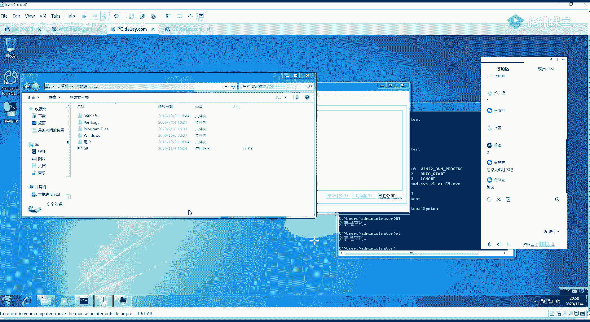

就这一个机器，就是啊在同网段的这个呃，10。201的这一个机器对吧，那么在这个在这里的话，我们就可以尝试用这样子的一个i pc的一个，连接去呃，就是用我们前面所得到的一个管理那个账号，密码去进行。

去建立这样的一个i p c的一个连接。

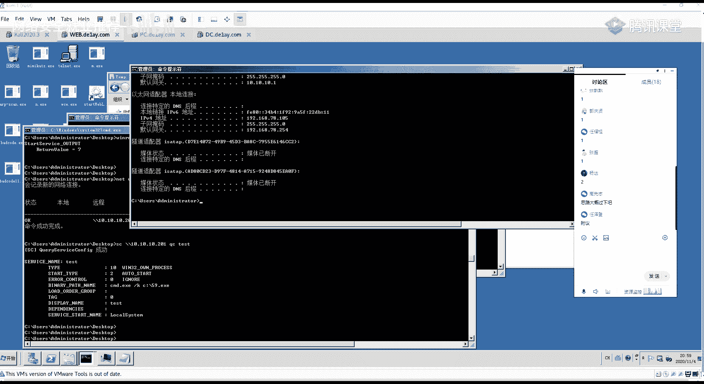

嗯在这里我们先进入，需要对，好的，我们可以通过net来查看到当前的这样子的一个，i p c的一个零件，这边的话我之前有连接过好，这边它的一个状态是disconnect，也就是已经断开了。

也就是说明我这边的这个连接的话，已经就是已经断掉，那么我这边的话呃，首先需要把这个连接把它给delete掉，也是把它把这个连接上，啊这边原来这个连接做一个删除，因为呃就是说对同一个主机的话。

对同一个主机的一个i p c0 件的话，只能存在一个，然后这边呃delete这套的话我们net查看一下，已经没有了对吧，然后的话下面的话我们就可以通过net ar来去与，我们前面通过主机存活。

所探测到这个存活的一个主机对吧，来去进行一个零基，然后的话呃连接的一个方法就是。

就是这样子对。

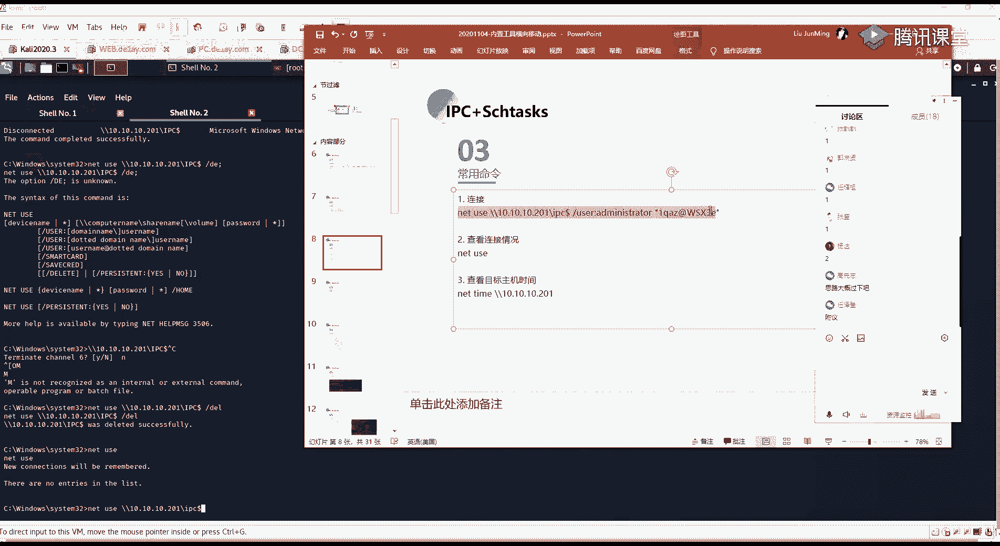

干扰者加我们的一个用户名，然后的话后面的话接我们的一个密码，密码的话，就是我们前面所得到的这样子的一个啊，密码对吧，然后这边的话可以看到这边他说呃，我们的一个命令的话已经执行成功。

也就说明我们这边的一个零件它已经进去了，它的一个状态是ok的，比如说我们这边进行了这样的一个，i p c的一个连接，那么我们这边建立ipc连接之后的话，我们可以去啊，对远程的这个机器去做相应的一个呃。

去进行数据的交换，以及进行一个呃远程的一个访问是吧啊，远程访问的话就是我们，一般的话我们可以通过这样子的一个，像比如说电压来去访问远程主机的，这样子的一个呃c盘对吧，然后要去访问远程主机的这个c盘的话。

加了一个共享名的话，就这个c加啊c多了符号，然后我们回车回车之后的话，它返回的一个内容就是这边的呃，这个远程主机的一个c盘的一个内容啊，我们可以来在可以来这边确认一下对吧，就是我当前这个啊。

当前这一个这个盘的一个内容对吧，就是这边的这个机器啊，以及的话我们可以去进行一个呃，文件的一个上传以及下载啊，我们电上传下载的话，我们在这边可以说通过copy这一个命令，然后接我们的一个秉承的一个零件。

啊，这边的话我们是要去进行一个文件的一个上传，呃，我看一下，我这边的话就以这个呃，我这块就以这个b。text这个文件为逆转，然后我把这个文件把它给py到，我们的一个呃远程的一个主机上面。

具远程主机的一个c盘，下面的呃，就就就c盘吧，对吧啊，然后的话我们这边的话可以看到，它显示的就是已经有一个文件，已经被复制过去了是吧，然后我们可以来确认一下，你看到这句话，就有了这样子的一个b。

text的一个文件，以及的话我们想要去进行一个文件的一个下载，就是说把远程的这个机器上面的一个文件，把它给啊下载到我们的一个本地对吧，我们可以通过copy接我们的一个远程连接，c盘的c盘下面的。

这个五点ex一这个文件是吧，然后把它托给到我的当前的一个c盘好，可以看到这边的话呃，就是已经copy成功了，也就是我在当前的这个磁盘的话，就能够去找到，有这样子的一个59。1x一的一个文件是吧，啊。

原来的话它是没有的对吧，然后这边的这个590x的话，是我从远程的这个t上面呃，copy下来的，也就是下载下来的对吧，这个话就是进行这个ipc。

共享连接的一个使用了，以及的话我们可以查看目标主机的一个实践。

也可以通过next time，在这边的话它的一个这个主机，它的一个时时间是九点过五分啊。

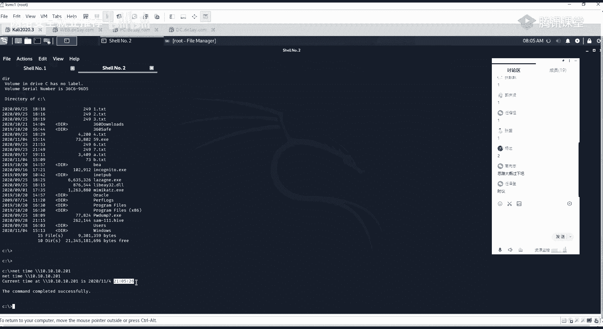

九点钟呀，可以看到是这个对吧，怎么又又没有又没有同学提醒一下我呢，我这边话先下。

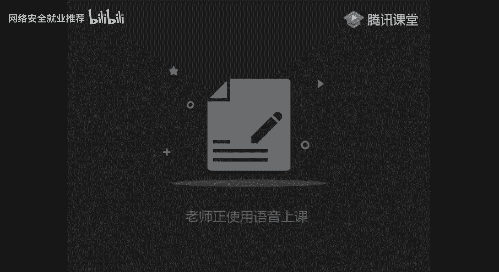

呃总休息的时间已经过了，那么中间它就不休息了，好吧，就i就大家看到的话，就是你看到，因为我这边讲到的话，我讲着讲着我不会注意持久对吧，大家可以提前一下，我好吧，我一般的话我这边讨论区这边的话。

我放在这边，我会我会看这边，我就是看大家会有没有什么问题啊，就是大家到了点的话，就是提前下好吧，就中间可以休息一会啊，我们继续吧，就。

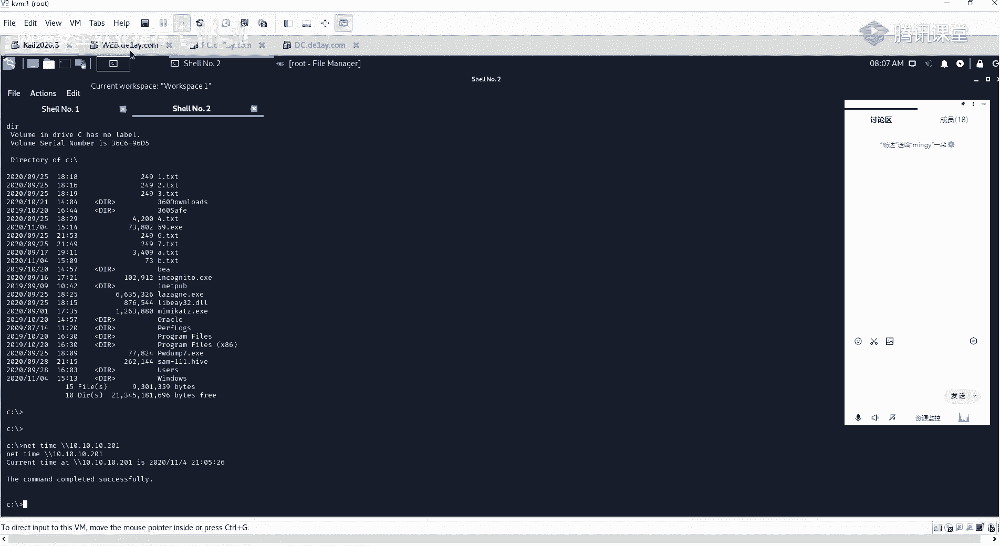

前面我们这边的话对吧，我们可以去查看它的时间，通过这个next time是吧。

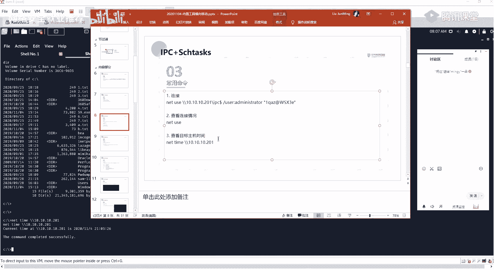

那么这边呢这个next time查看它的一个时间的话，在我们待会去讲那个mc的一个eight的时候，就是用这个editor a命令来去进行一个创建，定时任务的时候会去用吧，就是我们创建电池任的话。

我们需要去知道它的一个时间对吧，就是我们创建的这个电池任务，就是肯定是越短越好是吧，就是呃我们创建之后对吧，他到了到达那个时间，他就去执行了对吧，像比如说我这边才看到他的一个机器是呃，21。05对吧。

那么我就让他零六的时候，我就去执行他的这样子的一个，我的一个定时任务对吧，那么它执行了一个电池动画，就是执行到我的一个啊木马的，我，我就我这个号就能够去密码的，去接收到他的一个系统。

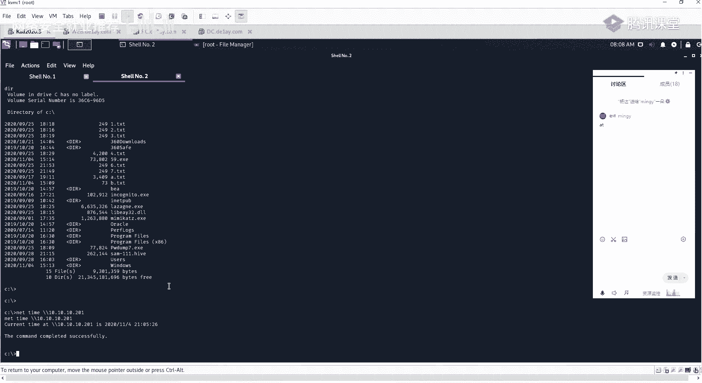

呃这边的话就是关于这个ib c连接的一个使用，然后下面的话就是呃给大家介绍一下，这一个s c h tasks，这个s c h text的话，它的一个作用就是允许管理去创建呃，删除查询修改。

然后的话运行我们本地或者远程系统上面的，这样的一个计划任务，就它一个作用就是呃创建计划任务，然后的话能够去运行的，而且的话他是能够去在远程的一个系统上面，去进行这样的一个操作，然后在这的话我们要去呃。

访问远程的系统上面的，这样去对远程系统上面的这样子的一个啊，电池任务做做相应的一个操作的话，我们就需要通过前面这边经营的这个，ip 4的连接，我们才能够去访问到远程的一个系统上面的，这个啊这个机器。

然后在这里它就是常用的这样子的一个命令，所以我们谈论的话就create，就是创建一个新的一个计划任务，然后以及delete就是删除，就是我们创建完之后的，以及他执行之后的话。

我们把我们的一个痕迹做一个删除啊，然后的话还有就是查询计划任务是吧，呃下面的话就是实际的我们呃结合就是ipc啊，就结合我们今年的这个ipc的一个远程连接，而去建立这样子的一个。

就是说在远程的一个机器上面，去建立这样的一个定时任务，然后的话呃，首先的话我们先通过这样的方法对吧，去建立这样的一个远程连接，呃，这边的话我们已经建立建立好了对吧。

我这边的话我就不操作了，清理完毕之后的话。

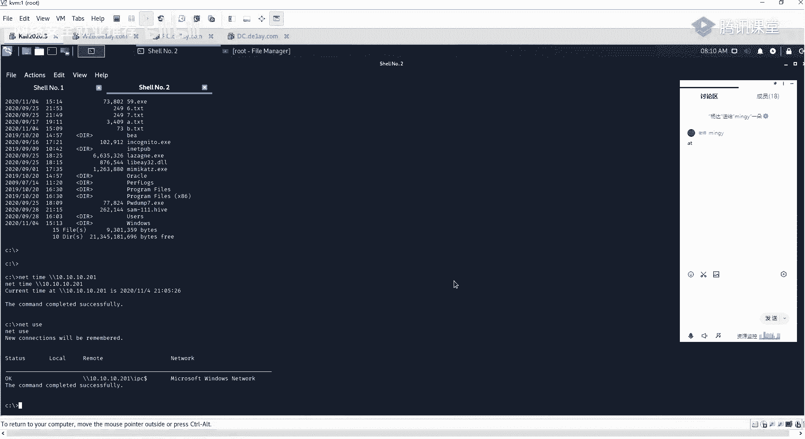

我们可以通过这样子的一个方法对吧。

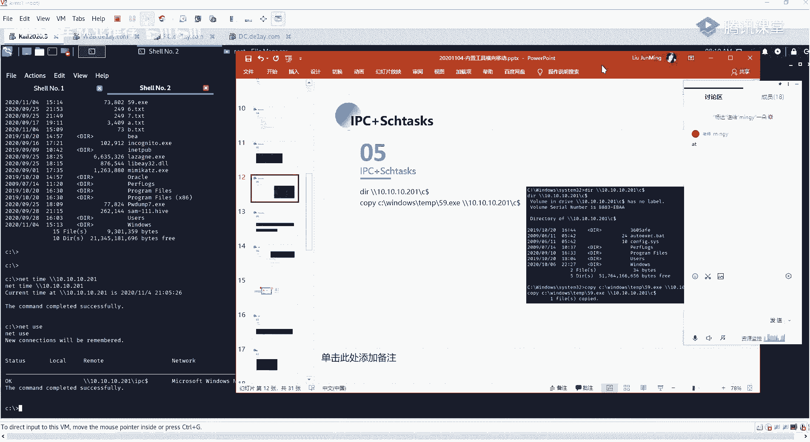

去进行一个文件的一个写入啊，在这边文件的一个写入的话，我通过这个copy力量，把当前的这个机器上面的这个呃，我生成了一个后门，把它给copy到远程区上面的这个c盘的中轴下面，然后在这边的话。

我中间这边省略了相应的一个步骤。

就是说我当前的话，这个是一个msf服务器所在的一个机器对吧，然后的话我得到这个筛选绘画是这一个啊。

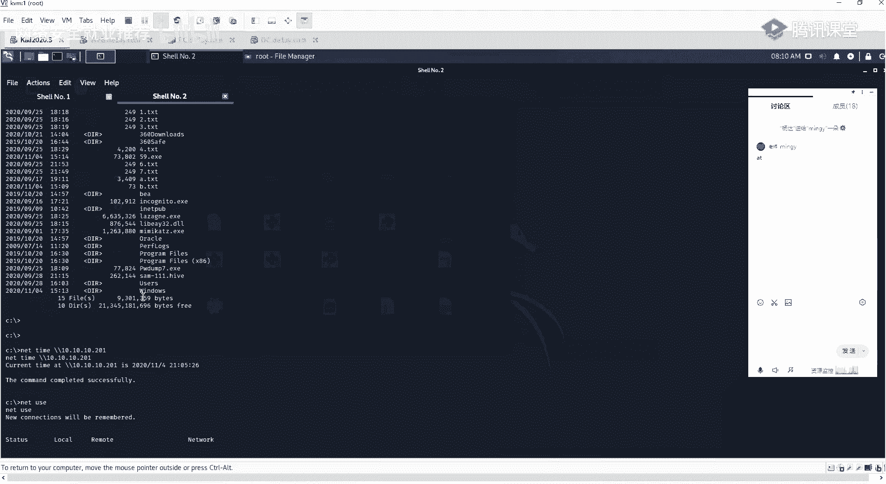

跳板机是这个跳板机的这个线对吧，然后的话我是我在这边去进行一个横向移动的。

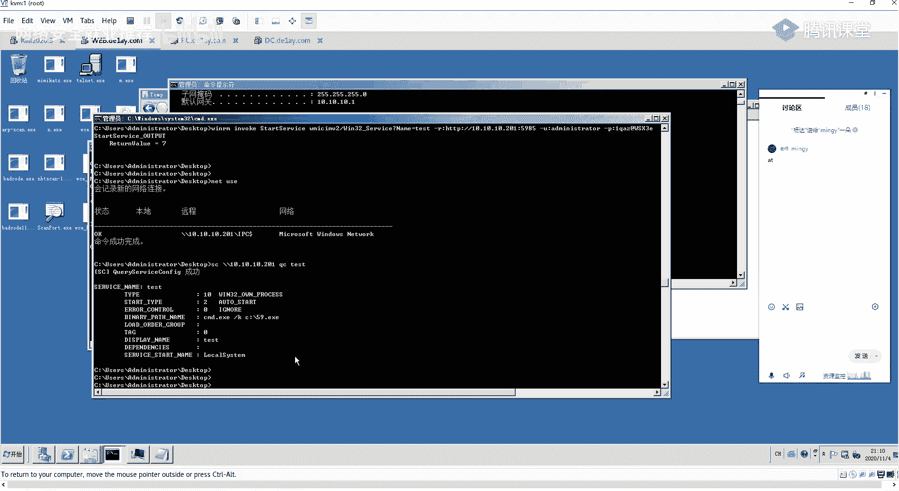

话，是基于这个跳板机去进行一个移动的是吧。

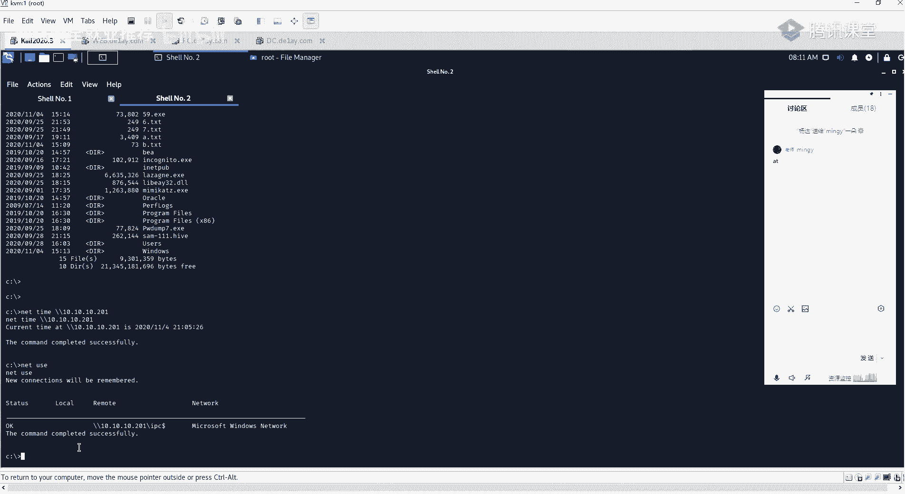

那么我在这边的话，我在这边的话，我已经就是说能够去通过这个i p c的一个。

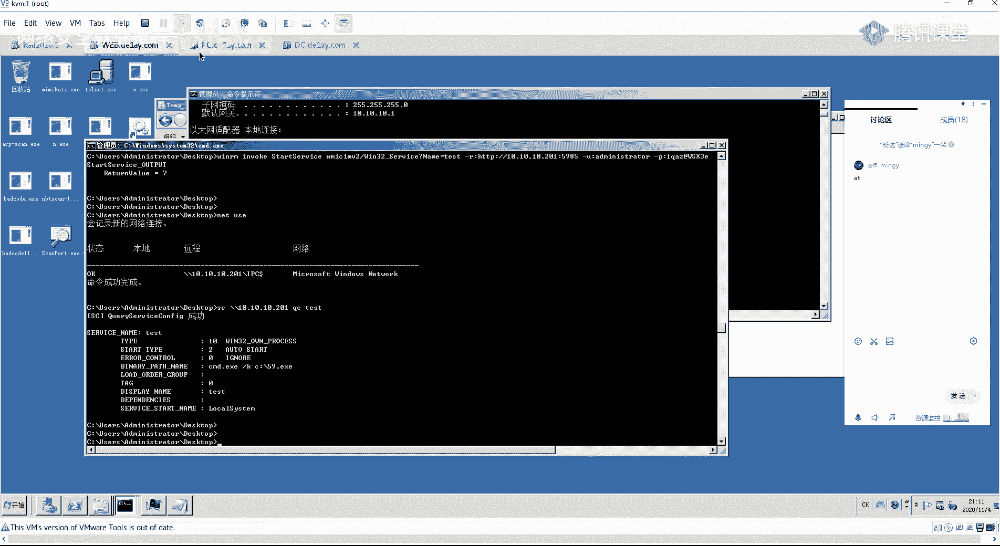

连接来去连接到这个机器对吧，那么我现在要去进行一个啊copy我的一个后门，copy到他的这样子的一个目录下面去对吧，那么我当前的话，我是在这边这个机器上面去操作对吧。

我这边是在他的这个机器的一个需要上面，所以的话我生成了这样子的一个呃马的话。

我需首先需要去上传到这个机器上面去，因为我这边所经历的这一个net user的一个文件。

共享的话是这一个机器，就是说我这边得到这个shell的这个windows机器。

与这个机器的一个建立的一个零件对吧。

也就是我这边要去啊，把我的一个码上传到这个机器上面。

然后的话再通过这边进行了一个共享连接，把啊我的一个马再把它上传到这个机器下面去。

然后所以的话在这边的话我中间有省略了，就是这样子的一个upload的一个操作对吧，就在metaverse下面的话，我们可以upload我们的一个文件对吧。

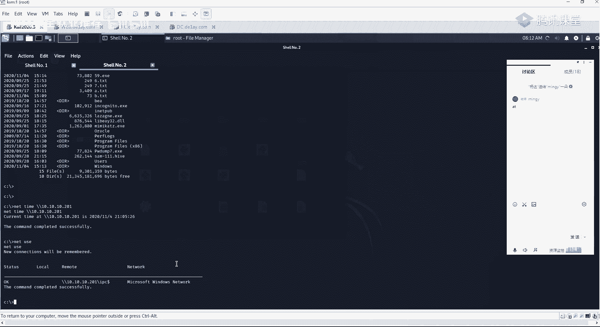

把它给上传到指定的一个目录下面去，然后我这话就是上传到这边的这个。

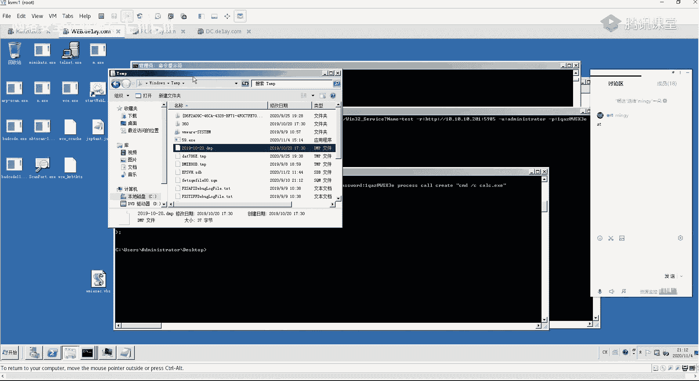

windows的一个探讨布，下面上传了这个59。1x一的这个样子的，一个后门，然后上传上去之后的话。

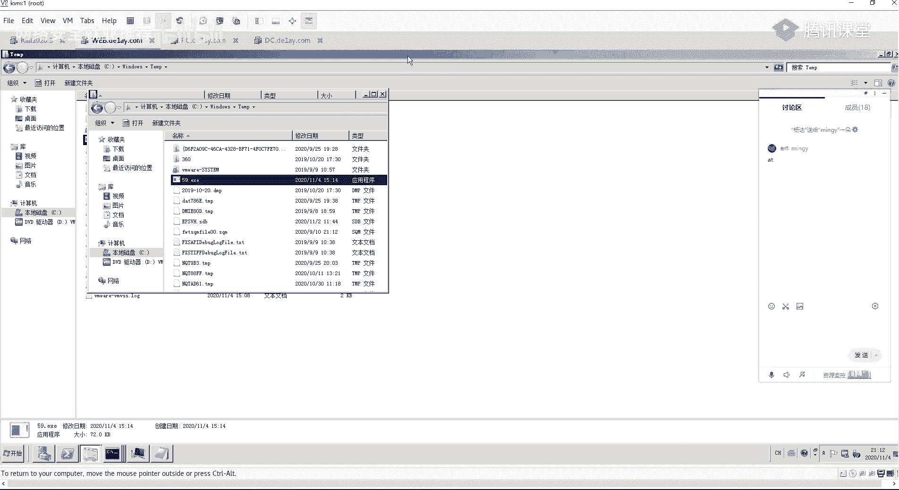

我再通过这边进行的一个t os来去进行，一个来去进行一个，呃后门的一个上传，然后我这边的话通过copy mini，把我这边的得到希尔的这个机器上面的，五九点x一这个后面把它上传到呃。

我要去横向移动的这一个201，这个机器的一个c盘目录下面，命拒绝一个命令的话，就像这样子啊，我们执行呃。

这边的话是因为我这边已经有了对吧，所以的话它提示我这边是不是要覆盖，override的话，就是复习对吧，我这边的话选择ps就是覆盖它，呃这边的话他报错了，这边的话是我这个复制化是没有成功。

就说他这边的话，我这边要去覆盖的这个程序，这个程序啊，它已经有被其他的一个进程所使用的，也就是他这个程序被占用了，那么他这边被占用的话，我在这边的话是删不掉的对吧。

可以看到就是说因为他已经被打开了嘛，所以的话我这边删不掉，也就是我这边覆盖了一个操作，覆盖不了是吧，他这边被占用的话，其实是因为这对话有运行，就我之前的一些需要，我这边把它给解除到，好我们再删删除对吧。

现在的话就已经可以删除了，然后其实实际的话其实实际操作的话就是。

我这边通过这个ping命令对吧，然的话我可以，传一个新的传上去，传上去之后的话，如果说他目标机器上面，他有这样的一个文件的话对吧。

而且他没有被占用的话，我就可以通过这样子的一个方法。

然后的话可以去进行一个覆盖对吧，比如说我yes对吧，可以去进行一个覆盖，也就是说我这边的话已经上传成功了。

上传到这个幕下面，那么我这边的这个码上传到了，你这个pc的这个机器上面去。

我们下一步的话要怎么做。

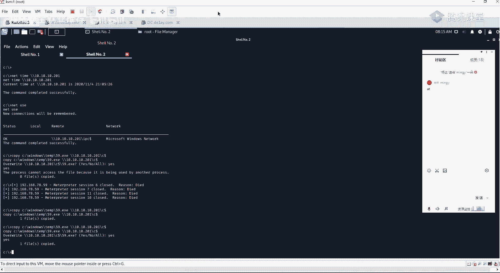

下一步的话就是通过我们这边鉴定这个零件。

来去进行一个呃电池任务的一个，来去进行一个定时任务的这样子的一个呃，安装以及开启了，然后具体的一个面的话，就是在这这里，就是通过这一个s c h task这个命令，然后的话create规则加边。

这边的话后面的一个选项的话呃，具体的这样子的一个电视logo的这个选项的话，大家可以去看一下这篇文，我今天忘记把预习内容加进去了，呃客户的话我再就整理一下，然后补充进去了，大家可以去看一下这篇文章。

以及其实你直接。

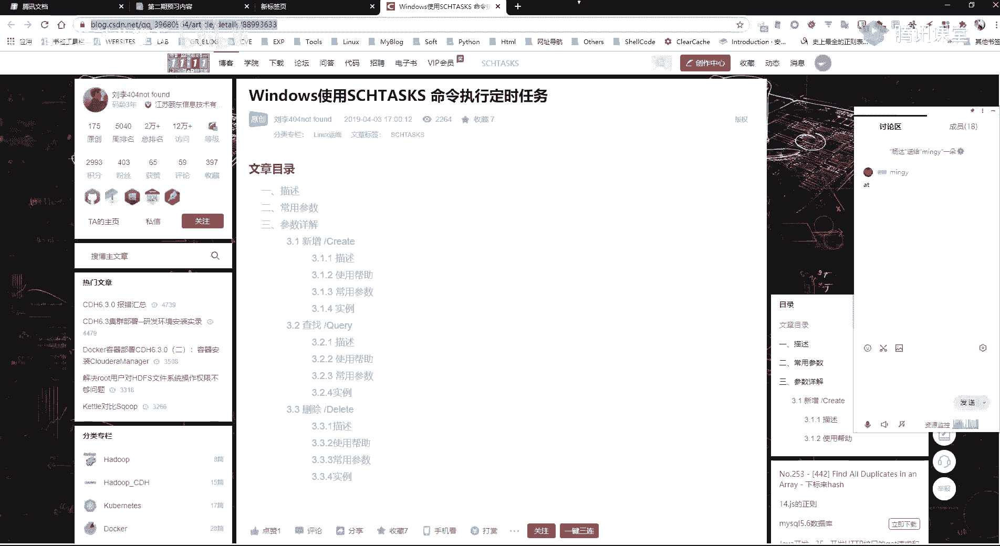

呃这边的话是，应该是我之前经历的一个电池的话，可以看到呃，他这边的话，我这边其实前面的话。

这个筛选的话已经都断掉了是吧，然后你可以看到这边又加了一个五九点x，因为我这边的话有我之前尝试的话，有添加了这样子的一个电池的话，然后他执行的一个程序的话，就是这个我所上传的这样子的一个目。

好在这句话只要报了一个时间。

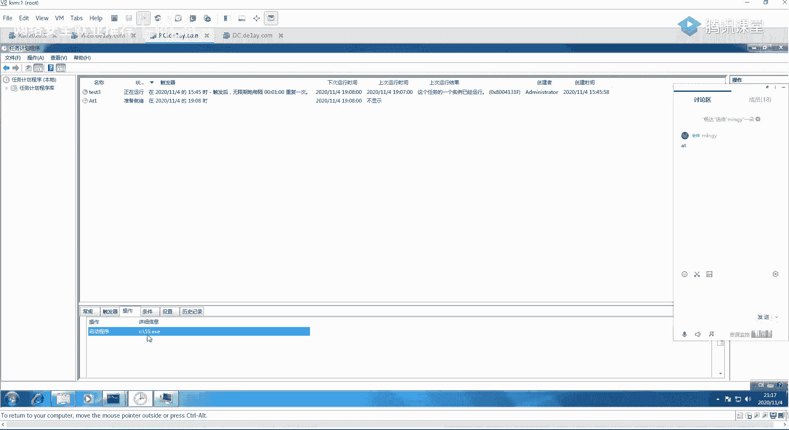

我这边就能够去得到它的一个shell是吧，呃。

然后的话呃就是，刚刚说到了这个命令对吧，这个命令的一个具体的一个使用的话，大家可以就是找一个windows机器，然后你直接在。

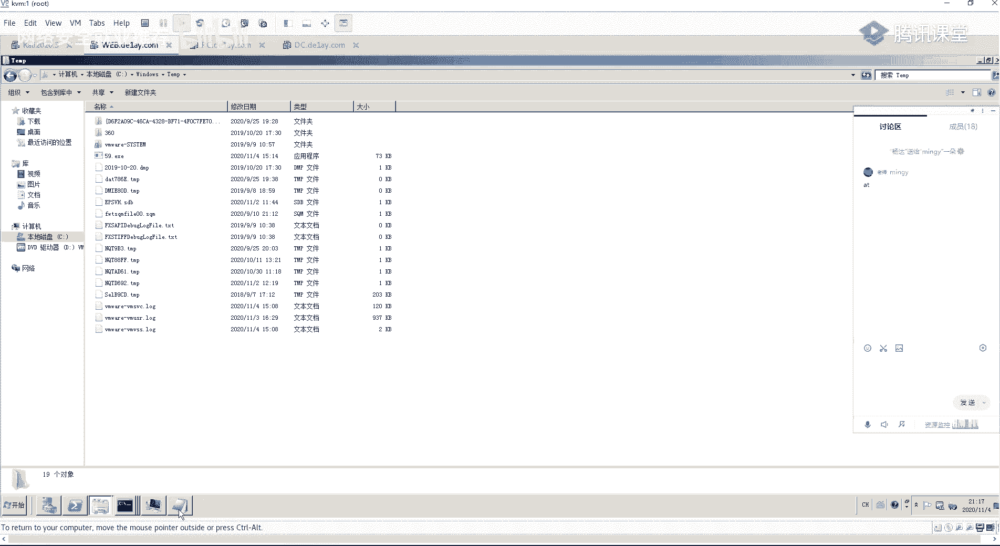

在这个机器下面去查看它的一个具体的一个十，啊对吧，然后我这边的话我就不一的去介绍了。

我只介绍这边的我所用到的这样子的一个命令，好吧，好在这边的话呃，杠s的话就是连接我们的一个服务端嘛对吧，就是连接我们的一个远程的一个服务器，这个话就停我那个ip干掉的话，就加我们那个用户名。

然后干p的话注意的话就是这个用户名的话，如果是你是在域内的话，那么你就需要去加一个域名，然后干p的话就是ji我们的一个密码，然后干s c s c这边的话就是设置这边sc的话，有多个这样子的一个选项。

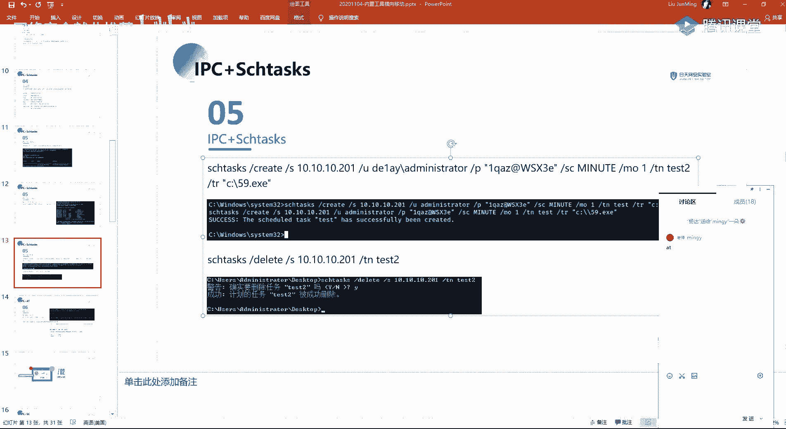

像比如说在这边的话嗯，诶，s 11，呃就是这边干sc的话就是设置我们的一个诶，这边怎么没有啊，啊算了，我知道了。

这边sc的话就是设置我们这边的一个，就是这个电池任务的一个间隔，就是有minute，minute的话就是分钟对吧，然后他这边的话就是表示频率就是每一分钟，好啊，以及还有的话有dai。

就是有daily有hours对吧，就是小时有有听对吧，就有隔多少天，以及隔多少分钟来去执行，我这边的一个电池任务对吧，干切的话就是我们的一个电池任务的一个名字，然后干tr的话就是我们要去啊。

就是定时之后的话，就是到了这个时间之后的话，我们要去执行的一个操作，我在这块就是到了这个时间的话，就每隔一分钟就去执行我这边的一个c啊，这边的一个59。11的这个程序啊。

嗯怎么复制。

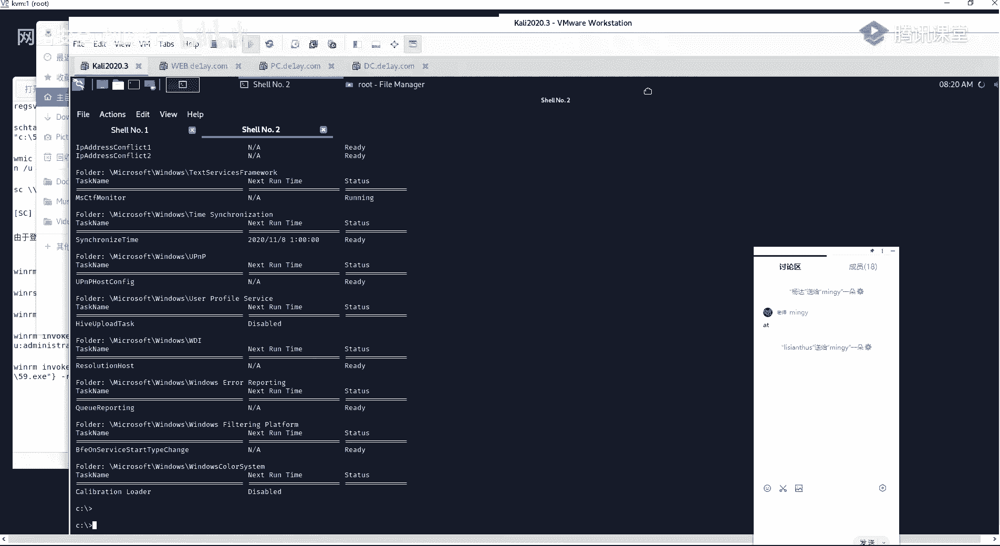

呃命令的话就是像这样子，然后回车回车的话，呃，因为我这边的话，这边要等一下。

因为我这边的话，是在靶机里面对吧，就是我这边可以直接去查看，就并且大家好理解我这句话，我直接在这边查看，然后这边的话它创建的话，它需要一定的一个时间啊。

就是呃他这边去进行一个远程连接，去执行这样的操作的话，它其实有一个这样的一个过程啊，就是有一个认证的一个过程，就我们这样子的一个远程的这种操作的话，因为我们是在域内，它会有这样子的一个。

就是呃我们去访问这样子的去建立，远程零件的话，它会有这样子的一个呃一个认证啊对吧，呃域内的那个认证还没给大家讲啊，唉就是呃我们在域内的话，它是一个k格式的一个协议对吧，然后的话你域内的这个主机。

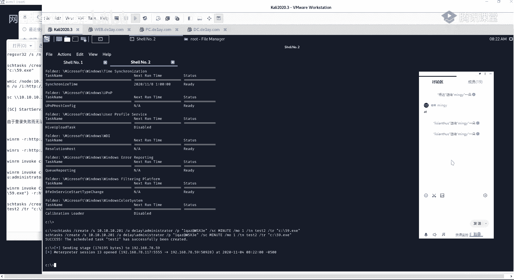

你要去互相的去远程的一个访问的话，它是需要啊，它是会通过这个cp的一个协议。

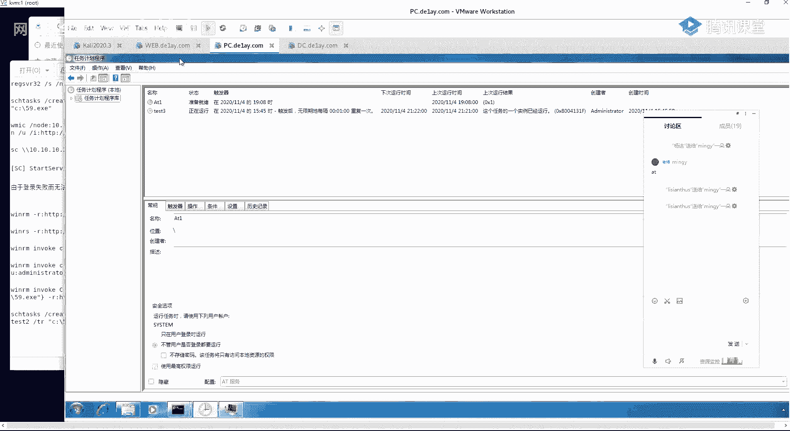

去进行一个访问是吧，那么这个cp协议的话，他呃，后面后面会给大家讲，后面，关于这个就是caps这个协议的话比较复杂，然后呃我这话就大概说一下，就是我这边其实前面也有书啊，就是也有题。

就可能大家话对这个没有什么概念的话，可能印象不深了，就我这边我这边的这个机器。

要去认证这个机器对吧，那我这边还是通过账号密码的一个。

方式去登录的，那么他是在域内，他域内的这种认证的话。

他首先会去向这个预控的这个服务器，发送一个发送请求。

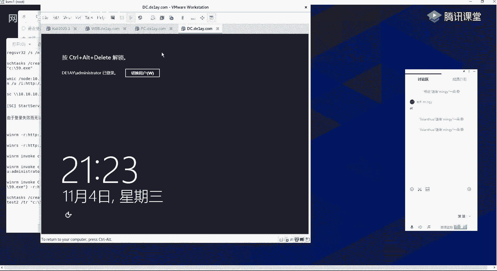

它的一个请求的话，就是认证我这边的一个就是呃，认证我这边的这个账号密码对吧，能不能去以及能不能去访问到这个机器。

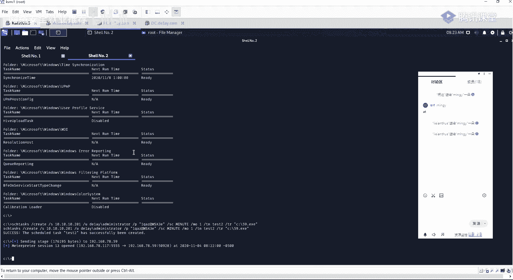

然后的话因为我们知道域内的所有的这个主机，它的一个用户密码的话。

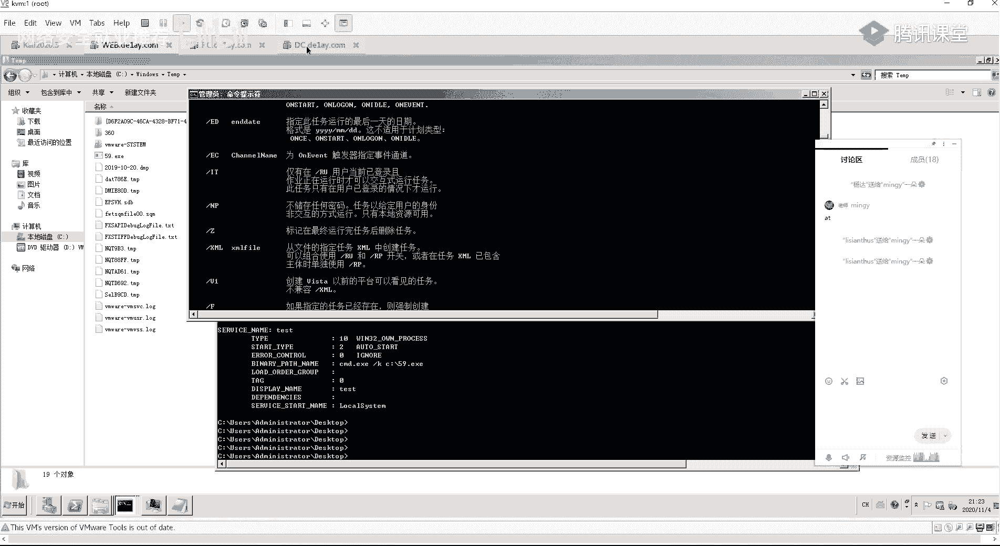

它都是存放在我们的一个预控的，这个机器上面的对吧，那么你要去访问其他的一个机器，你的一个用户密码的一个认证的话，它是需要在域控上面去完成的对吧，他完成的就是说我这边的一个账号密码，我发送到预控当中。

然后的话告诉预控我要去访问哪一个机器，那么他会在那个数据库当中去查找到啊，这这访问这个机器的账号密码对吧，然后的话它会有这样子的一个匹配，如果匹配成功的话，就说明你可以去访问到。

就你能够去访问到这边的这个。

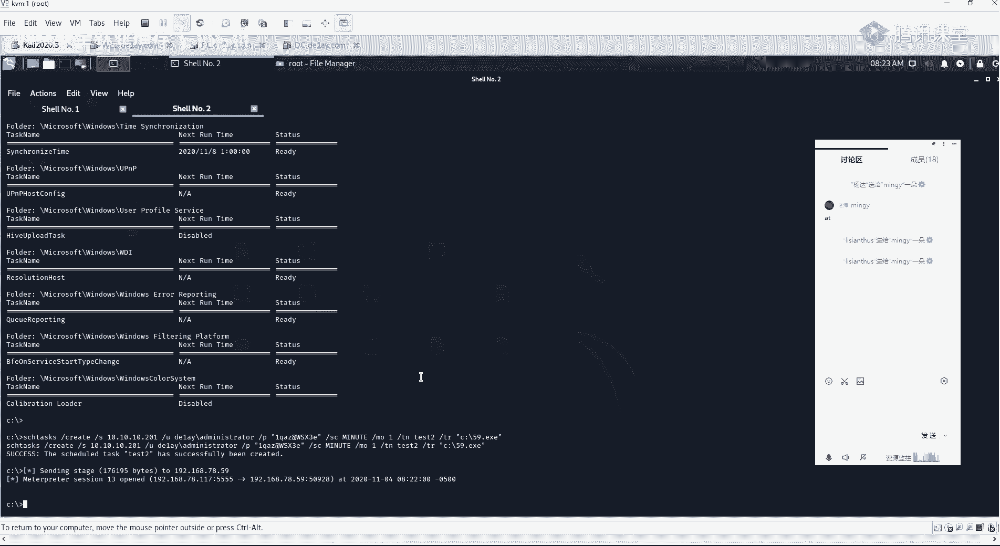

远程的一个机器对吧，然后在这里的话可以看到，我这边已经创建了这样子的一个text 2对，以及我在这边我创建完之后的话。

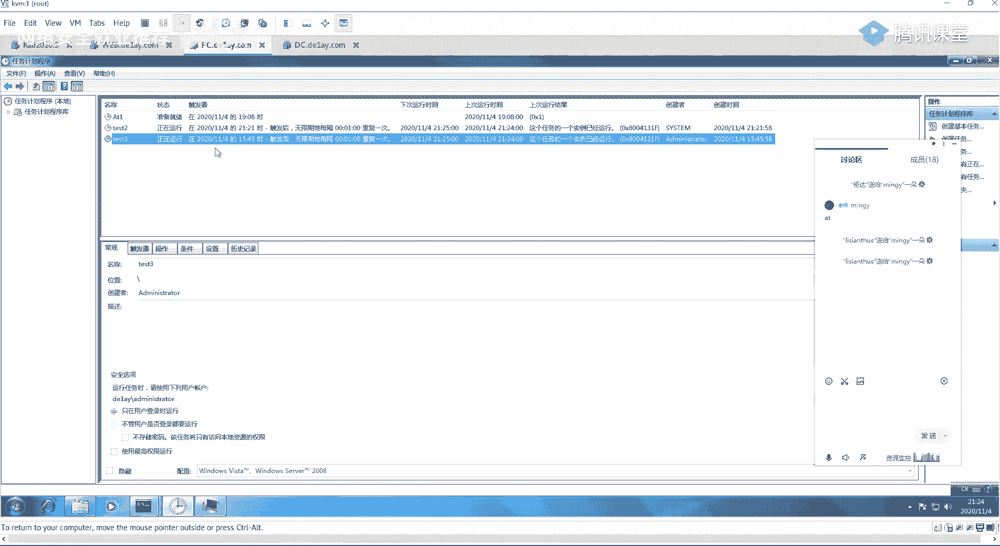

你可以看到在这边就得到了一个筛选，筛选13对吧。

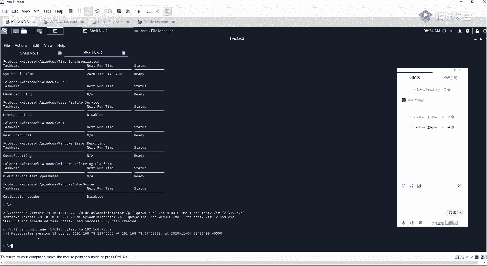

是这个78。59的一个机器，也就是我这边的这个机器啊，对78。59的这个机器。

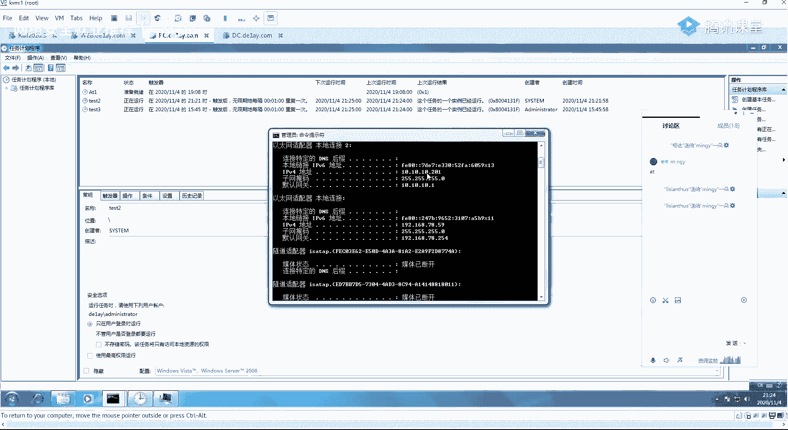

这个的话就是通过这个。

s c h tasks这个定时任务，然后我们这边建立这个定时任务的话，我们可以通过这样的一个命令去做一个删除。

对吧，就是我这边我电池任务，我是通过电池任务我去得了这个绘画的对吧，那我这个号我已经得到了，我这个定时问号，我可以去通过这样的方法删除掉，然后呃在这边需要去指定的话，就是delete这个选项。

也就是删除嘛，然后干签的话就是指定我们要去删除的一个，电池任务，然后这边的话是创建了一个，呃啊这边搞错了，这边是，这句话是通过杠时这个选项来去，指定我们的一个隐藏的这个机器啊，没写错啊，第。

怎么拒绝访问呢。

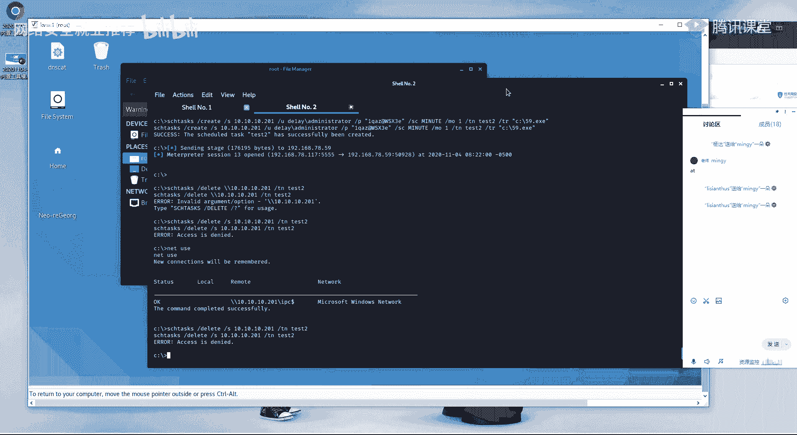

然后在这的话可以看到可以被删除的，就是可以删除的一个test。

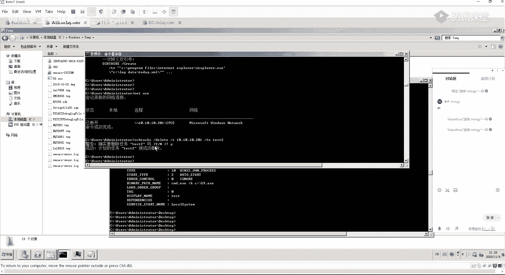

然后这边的话应该是，啊这不是本来的名字，啊这边的话这边我不是的，这边我还要去鉴定一个连接。

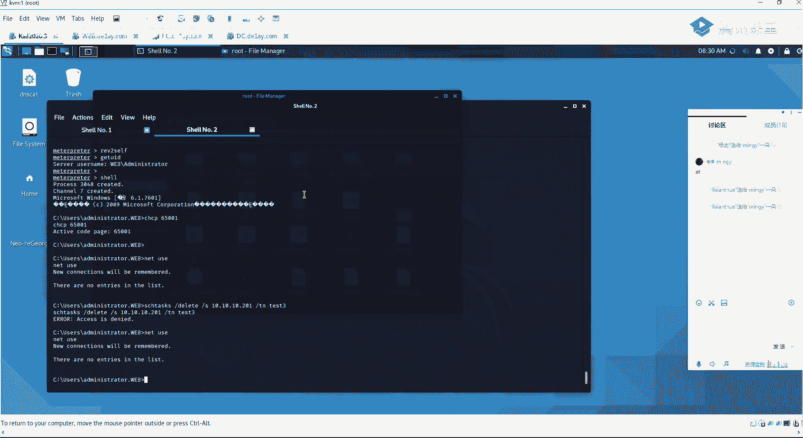

就是这边的话可以去正常的删除的好啊。

我这边的话应该是就是说权限的一个问题，就是我这边我这边得到了他的一个那个那个shell。

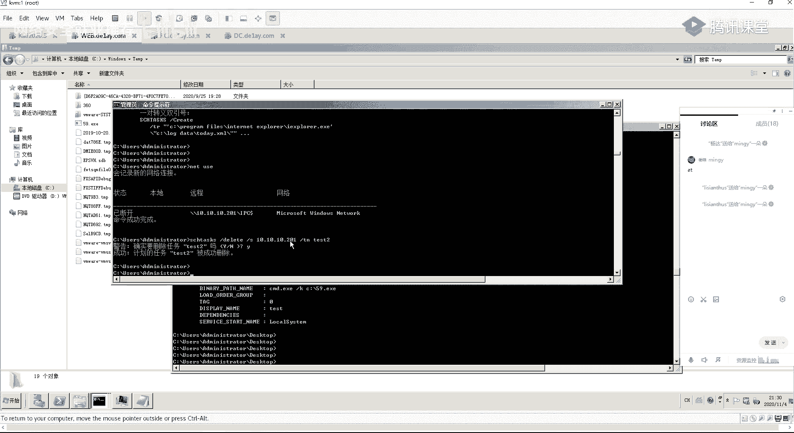

它是一个system嘛是吧，然后的话呃在这边的话。

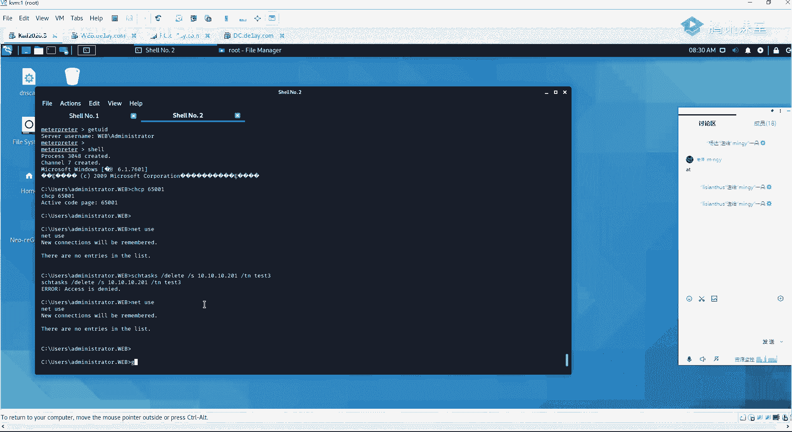

这个的话，用这个用这个在域内的这样子的一个用户，去进行这样的一个操作。

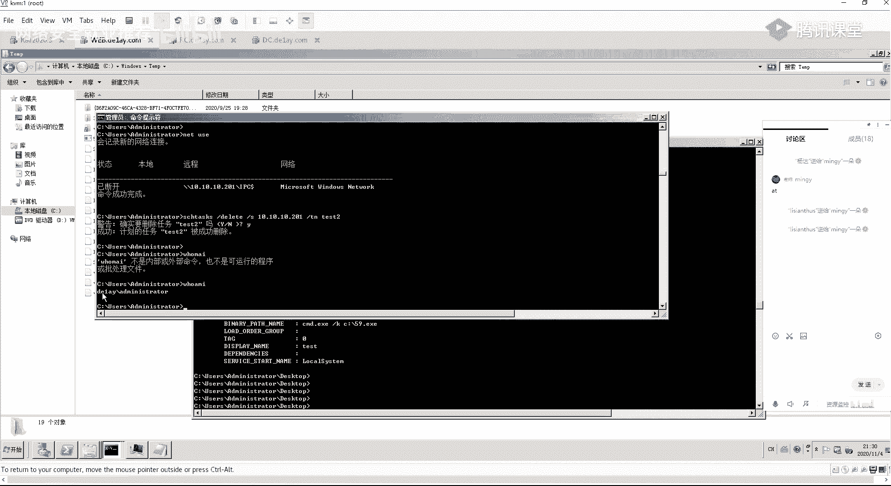

应该是没有问题的，就是不会有包这种权限，然后呃我这个话是因为我刚刚又退掉了，然后那个nt os那个连接断掉了，所以的话我再去进行这样的一个操作的话。

他这边就说access is dline就是不允许去访问，好正好我就，我就不理解了。

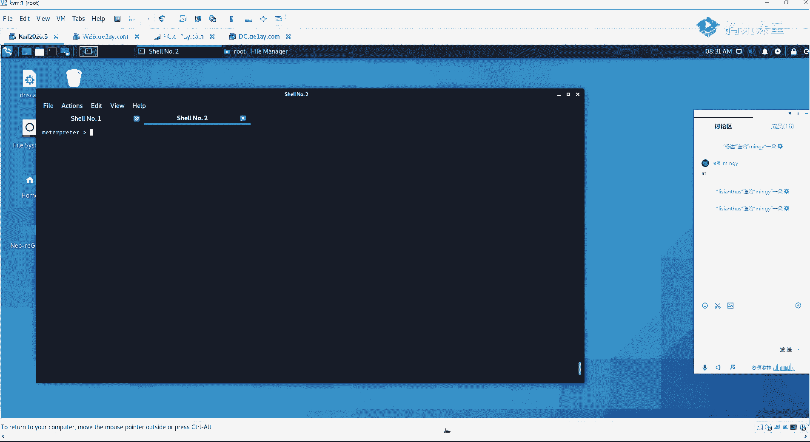

然后这边的话就是这个i p c加这个s c h，tasks好呃，第六个的话就是这个t就是前面也有说了，就是t跟这个s h task的话，它是同样的去管理我们的一个电池任务的对吧，那么在它的一个区别的话。

就是呃a t这个命令，它在windows server，2012等等，这种新版那个系统当中已经被弃用了，就是他不能够去使用这个at的一个命令。

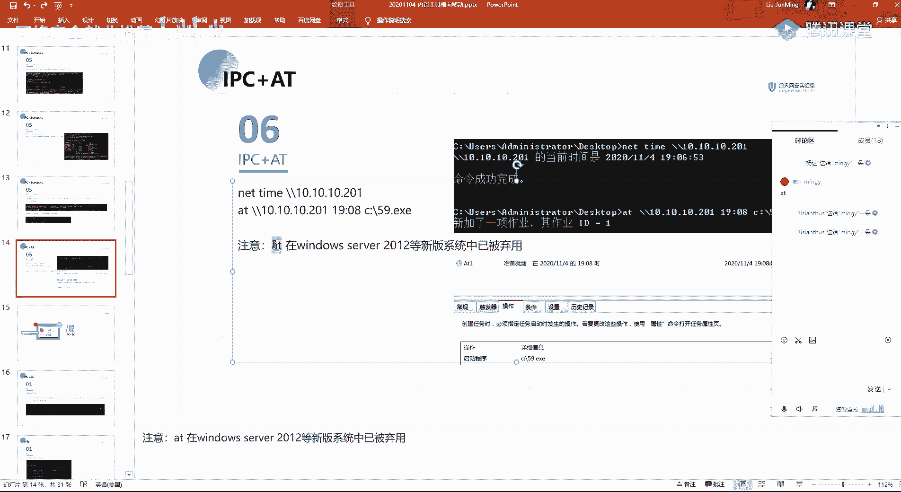

然后我这边的话呃，我这边的话是没有问题的，因为它是一个2008的一个版本的一个windows server。

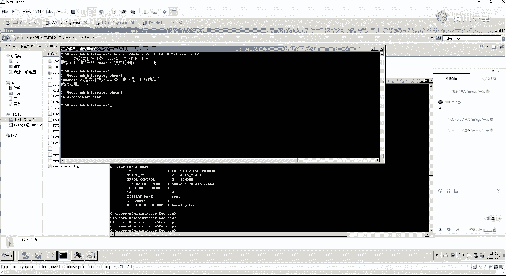

这个话是一个嗯，这个是win 7的一个机器，就是它使用nt这个命令的话是没有问题的，所以的话我们在这边，我们同样的也可以通过这个t的一个命令，去创建一个这样子的一个，去创建一个这样子的一个定时任务。

而这个的话就是我前面所创建的，这个就是a t e，然后他那个启动的一个程序，就是启动这个c的一个五九，然后他的个操作的一个，mini的话就像这样子啊，就是就这两条mini。

首先的话首先这句话就是next time，就是查看远程机器上面的一个实践是吧，然后你确定他远程机器上面的一个时间，我在这边我创建这个t定时任务的时候，我在这边设置时间的话，就设置离他最近的嘛对吧。

我需要立马去能够就能够得到一个呃，立马就能够去执行我这边的一个五九对吧，5900x一这个后门，然后得到他的一个系等的话，我这边，所以我这边的话就是加了一个时间的话，就是19。08对吧。

因为现在的话这边是19。07了，快对吧，就隔一分钟左右的时间，他就可以去执行我这边的一个电池任务，啊就是像这样子的一个效果，我这边电池创建了一个电池的话，它会在这样子的一个呃，07：08的时候去执行。

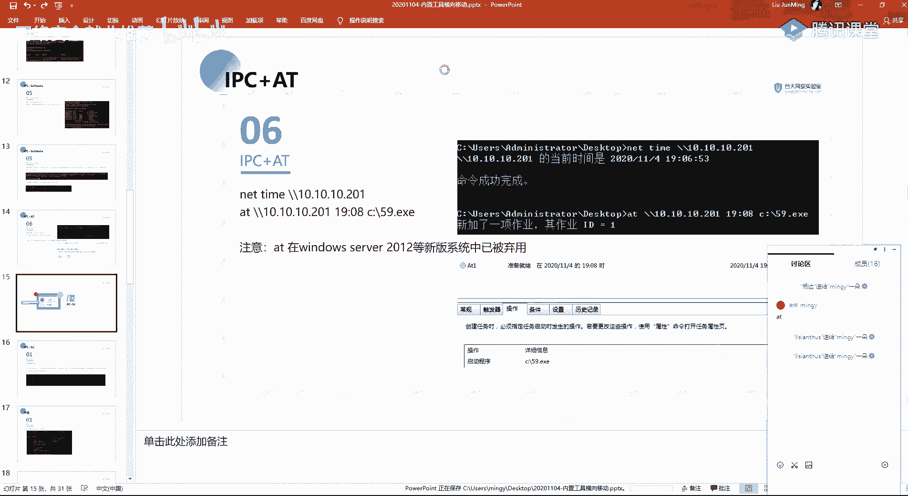

嗯我这边我就不我就不操作了。

因为我还要去建立这样的一个连接，哎还是操作一下吧。

啊已经进了这样子的一个那里啊，我这边的话。

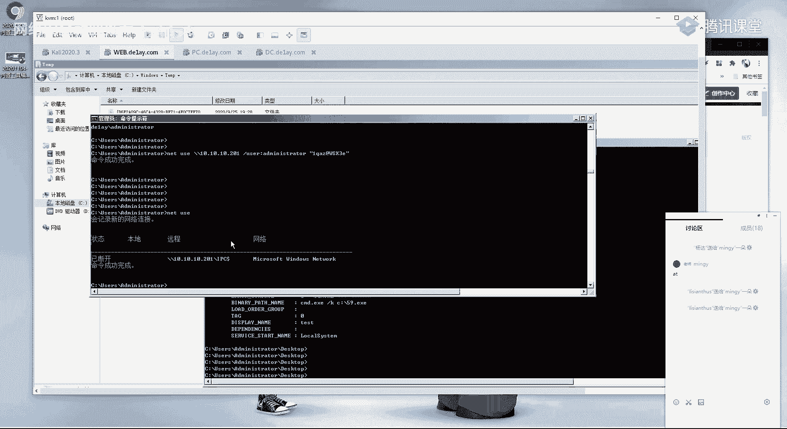

我就我就没有在这一个mac下面去操作，我直接在这边吧，哎这边的话方便一点对吧。

然后其实呃在这边跟这边操作化是一样的是吧。

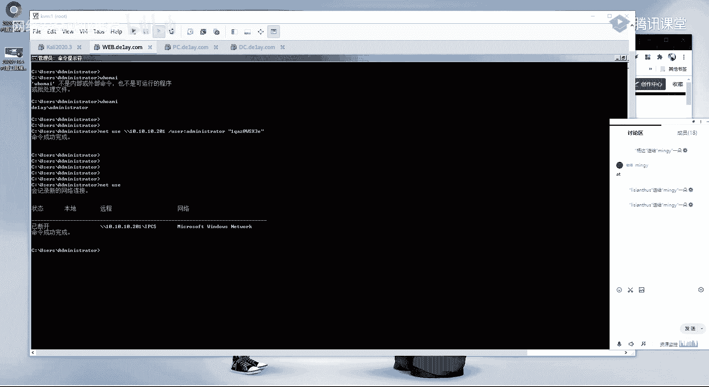

啊哈那诶，然后它的一个时间的话是2。34对吧，我这边的话就是336，然后可以看到在这边的话呃，又添加了这样子的a t2 对吧，他在9。36的时候，他会去执行，然后执行执行的一个程序的话。

就是这边这一个c一点五九。

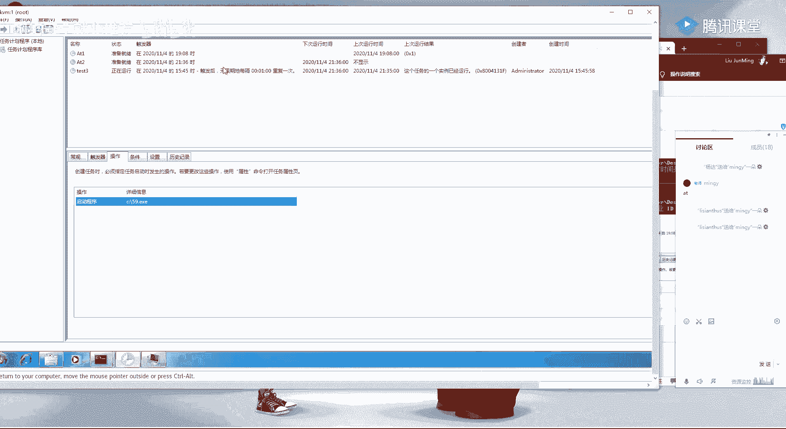

那么我在这边的话可以看到对吧。

呃这个的话应该是到时间了对吧，整准点就是呃9。36的话，他这边的话，他就立马执行了这样子的一个电生物对吧，然后的话他准点执行之后的话。

我之前就能够去直接得到它的一个筛选规划，就这个筛选14。

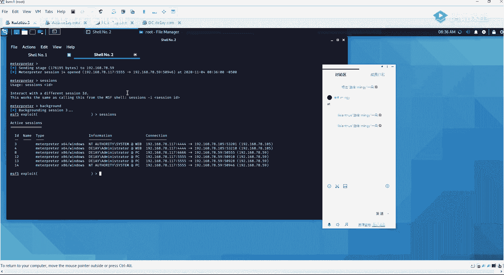

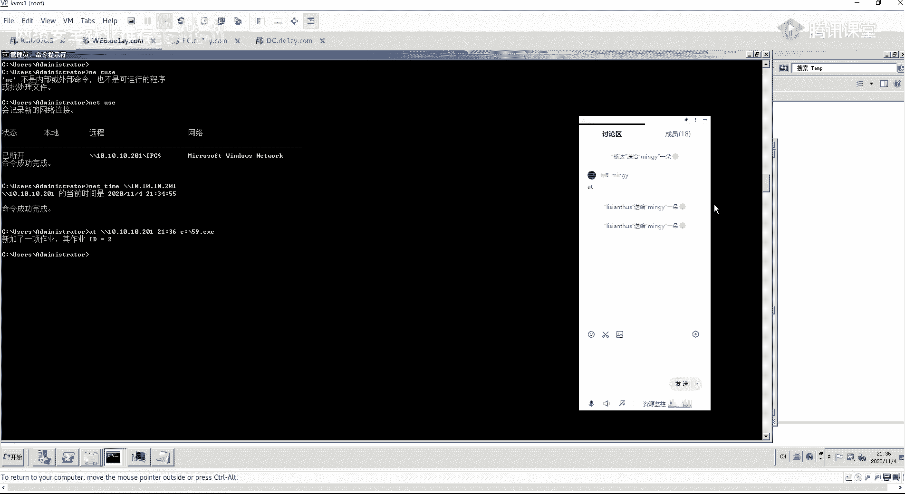

这边的话是呃，这个i p c接加在这一个s c h task，加这个t啊，就是利用电池任务的一个方法，来去进行这样子的一个横向移动，好啊，我们就我们横向移动的一个目的对吧。

我们横向移动的一个目的就是去得到，就说在这一个同网段下面的，其他机器的一个需要绘画对吧，我们通过这样的一个操作的话，就呃达到了我们想要的一个目的是，然后第二的话就是i d c加这个sc sc的话。

前面我们有介绍的话，就是我们可以用它来去管理，我们的一个系统上面的一个服务是吧，能够去创建，能够去启动停止它的一个服务，然后这个s c v的话，它同样的支持远程的一个啊。

就是能够去控制我们远程机器上面的，这样子的一个服务，也就是说我们可以通过sc命令，就是说通过我们创建的这样子的一个呃，i p c的一个连接，然后的话我们可以通过sc命令，在远程的这个主机上面去呃。

创建这样的一个服务，然后的话再去启动它，因为我们得到的是就是我们这边得到的话，它是一个管理员的账号密码对吧，那么我们对应的得到它的一个权限的话，也是一个管理员的权限。

所以的话我们就能够有权限去执行这样子的，去启动这样子的一个test的一个服务，就不会说存在我们前面再去进行一个提前的时，候，我们一个普通用户的一个权限对吧，我们是没有权限去执行这样子的一个去重启。

这样的这样子的一个服务的啊，然后的话我们这句话，我们就能够去通过这样的一个方法啊，成功的去添加这样的一个test的一个服务，以及我们也可以通过就是sc，像我们这边的一个远程连接，然后qc来去查询去查。

去显示这边的指令服务的一个信息，比如说它的一个启动的一个类型对吧，以及它执行的一个呃这边的一个binary pathname是吧，这边的这个pathname的话。

其实就是我们这边所设置的这个啊bin path对吧，啊这个的话我就呃这个话比较简单，我就不演示了，好呃第三个的话就是这个w mc，当mc的话前面也有介绍的吧，就这个工具它的一个这个工具的话。

它同样的也能够去管理我们远程的，比如说去配置我们远程的这样子的一个服，然后呃具体的一个使用，就是说我们用这个w m i c去进行一个，横向移动的话，我们的一个思路的话就像这样子。

好在这边的话就是嗯这边w i m i c mini好干node，后面的话接我们的一个要去连接的这个主机，连接了一个远程主机，然后干user加我们的一段账号啊，刚password提我们的个密码对吧。

然后的话重点的话就是后面这一块就process called create，就说w m i c的话，他可以去进行一个进程的一个创建对吧，我们可以在命令当中啊，我们可以在命令行当中呃。

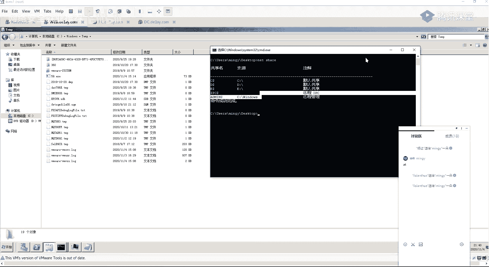

嗯是，对吧，我们在这边的话，我们可以通过这个process来去进行，就是通过w m i c来对process，也就是这个进程去进行一个管理，那么它进程管理的话，在这里我们可以去通过这样子的一个方法。

core来去创建一个进程，这边create的话就是呃创建一个进程了，现在这里的话可以接我们那个common common line，也就是我们的命令行的一个字符是吧，以及啊这边是输入，然后的话输出的话。

它会输出这样子的一个进程的一个id，也就是我们在这边执行对吧。

我们在这边可以看到，执行之后的话，它可以输出这样的proxx的id就在这里，也就是我们这边创建的一个啊，通过这样子的一个命令，在远程的这个机器上面创建了这样的一个进程，它的一个进程id 4。

这个1504对吧，那么在这边创建的这个进程的话，我们可以就前面好，就通过他的一个命令选项对吧，我们知道我们在这边是可以接，我们的一个命令行的，就comment line，然后的话这边的一个命令的话。

我们就说我们这边，它是会通过进程的一个方式对吧，我们创建就是我们执行一个命令的话，它它就会去生成一个进程对吧，那么我们在这边创建进程的话，其实就是相当于我们在这边，他会去执行这样的一个命令。

然后执行呢这个命令的话它会创建一个进程，那么在这边的话可以看到，我这边的话是通过这样的一个方法，就是呃通过web web deliver所生成的，这样子的一个windows下面的。

用windows下面的一个i t server，三二的一个反弹线的一个方法对吧，通过这样这样子的一个windows法，它需要的一个方法，好的话呃，执行执行之后的话，它会在我们的一个远程机上面。

它会执行这样的一个这边的这个命令对吧，那么这边的这个命令的话，他执行之后的话，他就会去呃反弹一个线，反弹到我这边的一个，msf的一个机器上面去对吧。

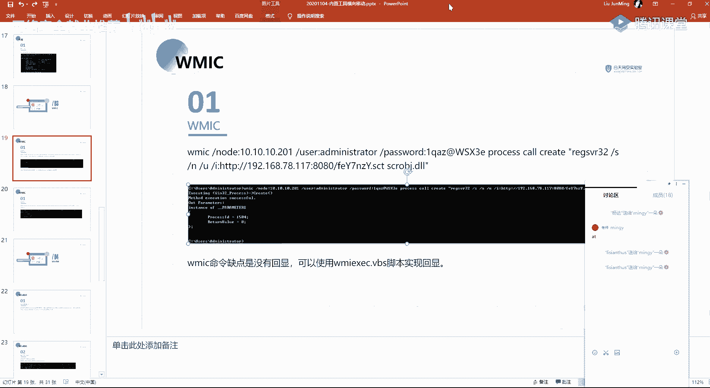

呃在这边的话，我说的话再重新再生成一个这样子的一个po的，好我们复制复制之后的话呃，再到我们就是说我们通过前面的那个，max的一个shell对吧，然后的话再去执行。

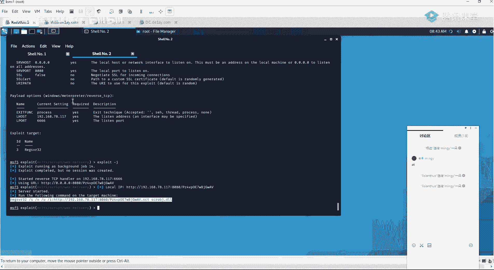

我这边的话我直接在这个机器上面就呃，就实际操作的话。

是我们进入到这样的matt的筛选对吧，进入到我们前面得到的这个筛选，然后他在通过这个跳板机来去进行。

一个这样子的一个呃横向移动是吧，啊我这边的话直接在这个机上面操作。

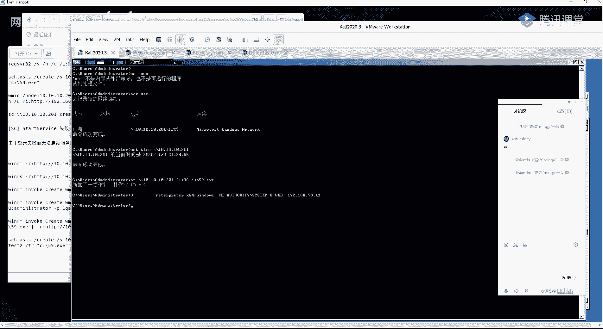

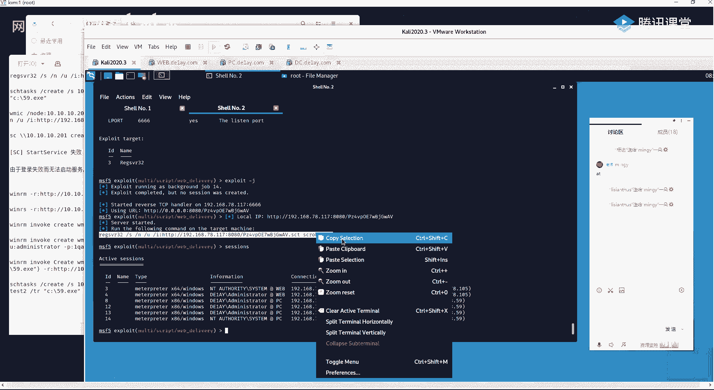

可以扣他们附近。

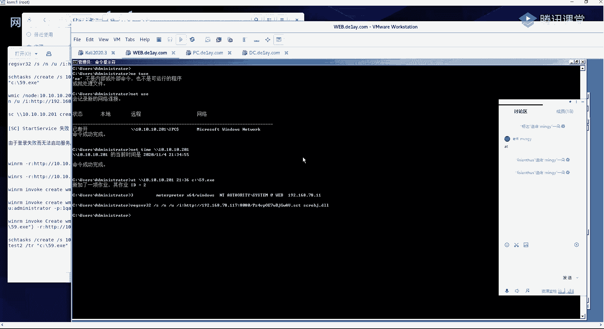

等下先把它复制出来，然后的话我这因为命令的话比较长，我这边就不敲了，这边直接复制粘贴啊。

好吧，让我们装修过来。

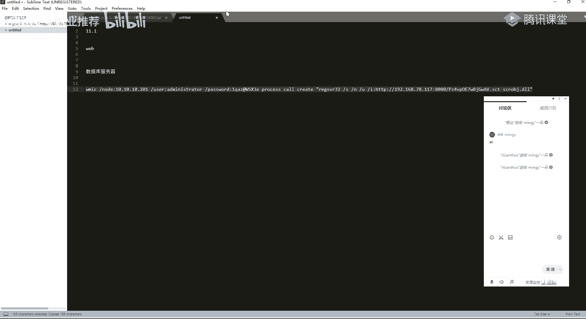

然后我这边的话粘贴过来，粘贴过来的话，我在这边去呃。

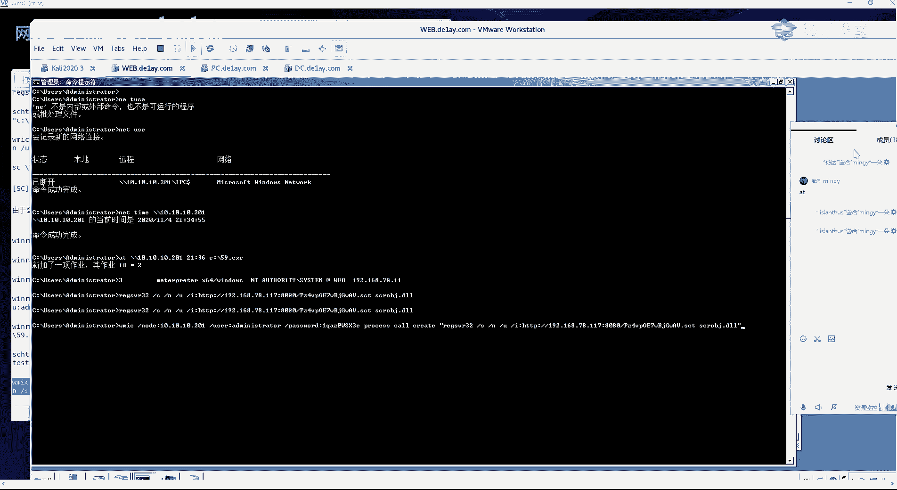

今天是星，之前的话，在这边他会在呃这个远程主机上面。

他会去创建这样子的一个进程，然后创建了这个进程的话，它就会是执行这样的一个命令，然后他那个进程就是2408对吧。

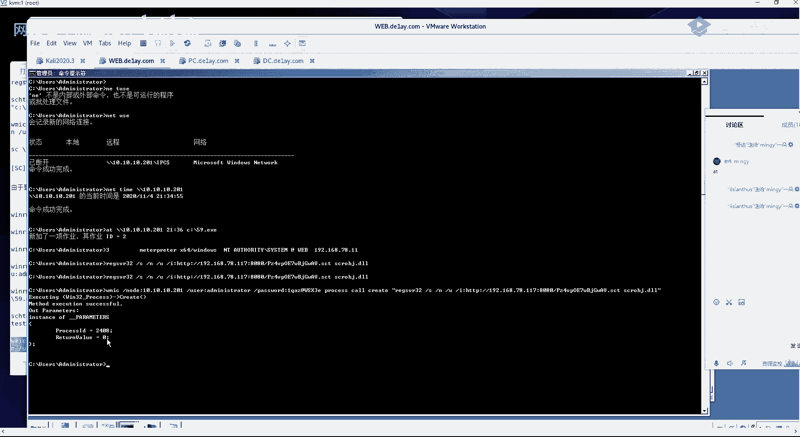

然后以及在这边的话，我我就能够去得到它的一个筛选是吧，就筛选15，这个筛选15的话，就是呃通过这样的一个方法得到的。

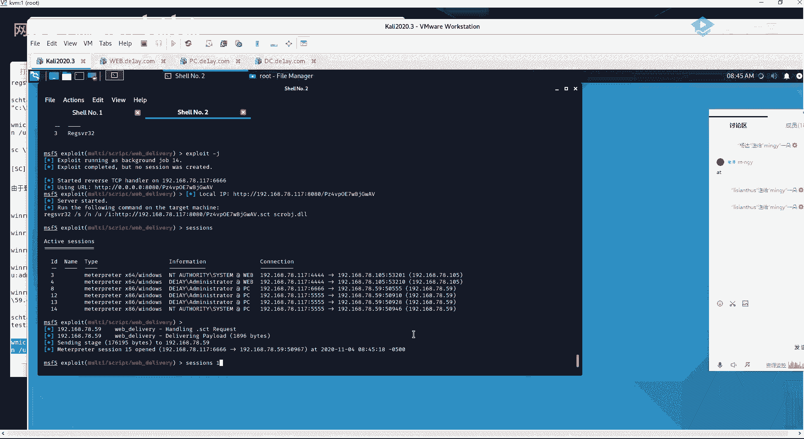

以及就是说在这边的话，就core user，就这边corate去创建进程的话，这边执行的这种而命令，你不要就是局限于我这边所念的这一种是吧，就我们前面所讲的这样子的一些呃。

讲的这样子的一些，windows下面去反射下来的一个方法，我们就我们都可以套到，套到这边来去进行一个使用对吧，那比如说用posher的一个方法，我们可以通过生成一个posher的一个payload。

来去进行一个加载对吧，也是一样的，以及的话我们也可以就结合，要结合前面的一个i p c的一个连接对吧，我们把我们生成了一个码，我们把它给copy到我们的远程机上面去。

然后的话我们再通过这个w m i c，来去create这样的一个进程对吧，就像就像这样子对吧，我们可以通过啊create这样的一个进程，这边执行一个命的话，就是cmd杠c。

就是在cmd窗口下面执行这样子的cl，cl c的一个程序对吧，就是打开一个呃计算器嘛。

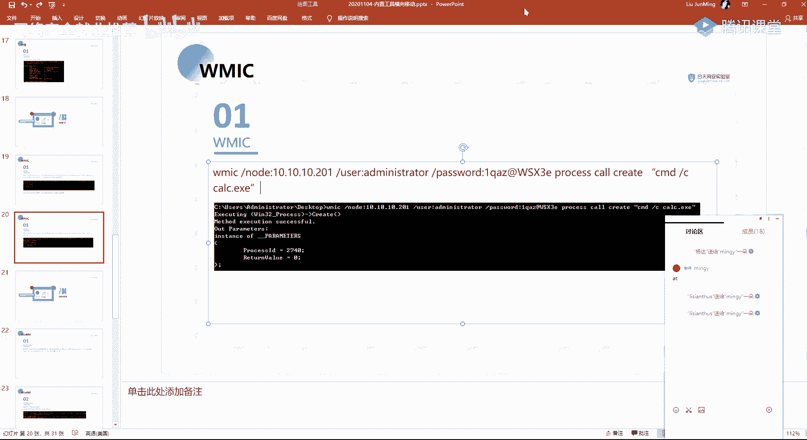

然后同理的话，我们在这边就是可以把这个cl s对吧，把它给替替换成我们的一个，希望我们的一个呃说我们copy到这个机器上面的。

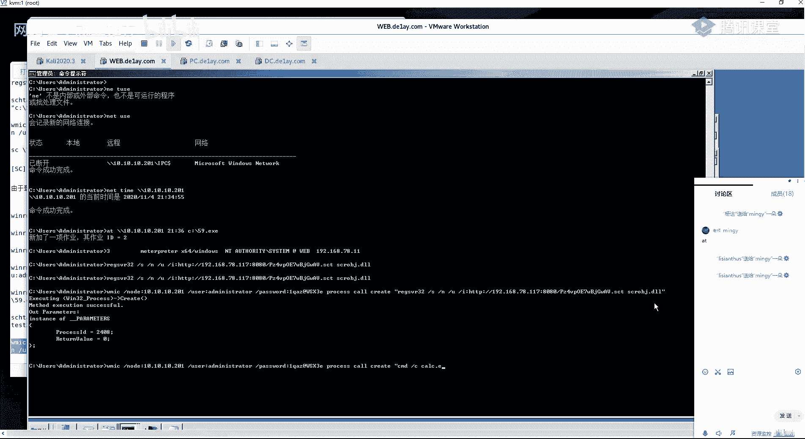

这样子的一个码对吧嗯，这边的话，这边的话没有没有cl c c一个进程对吧，我们在这边执行一下，执行之后的话，它就会在这边呃，起个cl clc的一个进程。

对直线成功的对吧。

在这的话就多了这样的一个clc的，一个计算机的一个进程对吧。

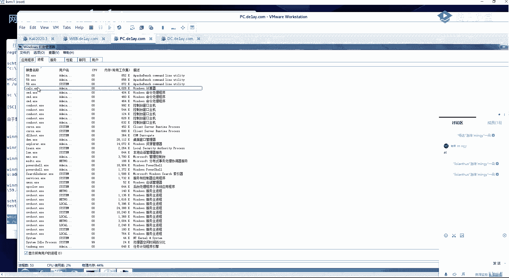

然后这边的一个进程，他那个id是这边3092，然后通过前面的这样子的两个操作，然后你会发现的话。

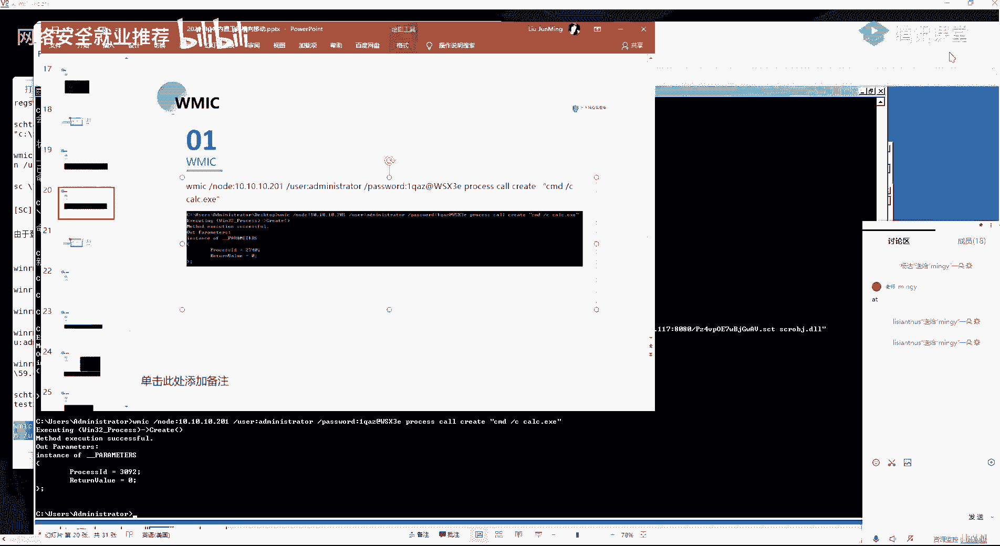

其实是一个用这个单位把m i c去进行啊，这样子的一个操作的话，它有一个缺点，就是呃我们这边执行那个命令，它是没有回形对吧，也就是说我们这边执行的话，他只回形了这样子一个进程id，是我们。

比如说我们想要去执行它这个系统命令的话，我们是不知道，就比如说我们在cmd下面执行换外，等着这种命令的，它是没有回血的，我们无法去得到它的一个回血的一个结果，然后在呃明天的呃，在下一节课的话。

就是在讲外部的这种工具的话，可以介绍到这样子的一个w m s一的这样子，一个vbs的脚本，我们可以用这样子的一个脚本来去实现，这样子的一个回血，也就是他这个脚本的话，就是利用的这样子的一个。

当当年m i c去连接远程的经历，这样子的一个远程连接的一个方法，奥特曼来去呃，执行命令，就在远程机上面执行命令，然后的话获取它的一个回血，然而因为本地话是讲内置的这种工具啊。

就是啊windows系统下面它已经呃，以及内置，有的我们可以直接去使用的这样子的一些工具，来去进行一个横向移动啊，以及本节课的第四部分啊，忘了问大家，就说大家前面的这一些三部分的一个内容。

大家有没有什么问题的，大家能理解吗，大家能理解吗，就有没有什么问题，呃理解的扣一，不理解的扣二好啊，课后做的扣三，ok ok应该呃那应该都是大家自己课后去做，其实这些内容的话。

其实呃难度的话也没有什么难度啊对吧，而且理解的话应该是很好理解的是吧，然后大家自己课后去做，大家课后自己去做的话，应该是没没有没有什么问题的啊，第四部分的话就是这个wi m，然而这个wm的话。

它是一个windows下面的一个远程管理服务，然后我们可以通过程连接这样子的一个模块，来去操作我们的一个windows的命令行，它默认的一个今天端口是啊，这样子一个5985的这样的一个端口。

然后htp的话它是一个5985，如果是htp的话是5986，然后他的这个服务它是在2012级以后的话，它默认是开启的，也就是他在新版那种三管的服务端啊，这种server的一个机器上面的话。

它是默认开启的，我们可以直接去进行一个使用，然后呃我这边的靶机的话，它是就是呃默认的话他是没有开启的。

就是比较老版本的这样子的，就windows server 2008，还有这边的话是一个win 7的这样的一个机器。

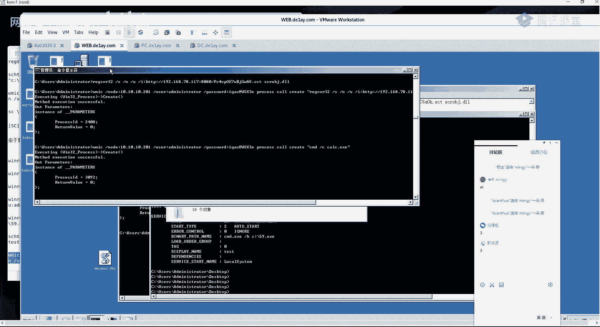

是他摸的话它是没有开启这样的一个windom的。

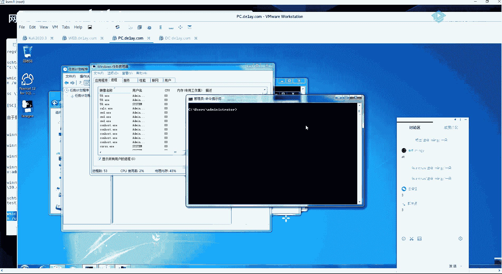

就是这个靶机啊，然后大家自己课后去做的话，我这边有写了。

ppt里有写了，如何去开启这样的wm，就是啊，大家自己扣去印证的话，可以通过这样的方法进行一个开启，首先的话我们可以通过啊这样子的一条命令，来去判断，来去判断目标机器上面，就是说我当前的这个机器上面。

他有没有去开启这样子的vn m的一个服务，就这样子，好如果说没有开启的话，他会呃报这样子的一个信息啊，就是他呃他在这边的话也会有显示，就是说呃目标在目标上面运行下面的一个命令，来配置这样一个温暖的服务。

也就是说我当前这个机器上面的话，它没有配置，所以的话我们可以通过这样的一个win m quick config，这样的一个命令来去配置这样的一个服务，就是开启这样子的一个win m的一个服务。

然后开启服务的话，在这边像这样子呃，选选择yes就行了，就是启动这个服务，然后的话更改它的一个配置，而且启动完之后的话，在这边我们再去执行这样子的一个呃，执行这边的这个语句的话。

会发现他在这边的话就是呃，有显示这样的一个内容对吧，然后显示这边的一个内容的话，你会发现他这边就是它默认的一个端口啊，是一个5985的一个端口，然后要注意的话，这个服务的话它是通过htp的一个方法。

通过htp的一个协议去进行一个访问的，如果说是hd p s的话，它是一个5986的一个端口，这边要注意，然后呃，我们这边开启了他的一个服装的话，我们还需要去设置这样子的一个，就是允许远程主机访问。

以及我们去访问远程主机的这样子的一个啊，命令，就是通过啊设置设置我们的一个客户端，然后的话设置它的一个trust host，维新，也是代表所有的一个主机都能够去呃，远程的去连接我这边的一个机器。

以及我能够去通过这个nm，来去连接其他的一个机器，好的话，你两个机器之间的话，两个字，两个机器之间要去互相的去进行一个连接的话，你需要在两个机器上面都要去开启，这样子的一个呃访问了，好像在这边。

靶机这边的话就是两个机器，它都是一个低版本的对吧，所以都没有开启，所以都需要去执行一下这边的这个操作，去开启它，开启之后的话，我们就能够去利用它来去执行我们的一个命令，呃在这的话呃。

我们首先利用这个win rs来去执行命令，在这边就是这个vs这个命的话，它是利用的我们这边的一个wm的一个服务，然后他的一个具体的一个使用的话，就是像这样杠r加我们的一个呃链接，这边的。

这注意的话就是说我们关于我们这个服务，它是通过htp的一个协议对吧，那么我们就是htp协议的话，就像这样子嘛对吧，然后接我们的一个ip加我们的一个端口好干，u的话。

就接我们的一个用户名杠p接我们的一个密码，你在最后面的话接我们的一个命令，就是我们在这边去建议呃，通过这个方法我们建立连接之后对吧，建立连接之后的话，我这个命令的话，它会就是因为他的一个vm。

它是可以操作我们的一个windows的一个，命令行的对吧，那么我这边的一个命令的话，他会在windows的命令行下面，注意是在这个远程的一个机器上面的，一个命令行下面去执行，然后我这边执行的一个结果。

就是像这样子，对吧，我们可以看到我这边之前ip通figure的话，0。201的这个机器的一个ip的一个信息，对吧，这边的话。

呃这个，然后我们直接执行做的话。

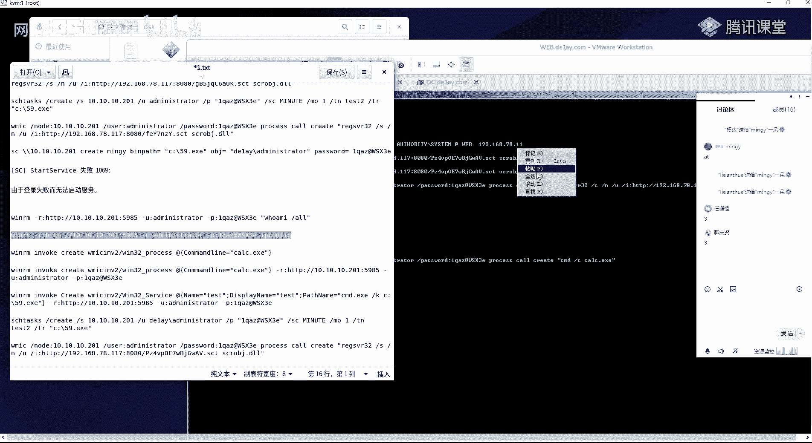

这边的话就是它那个之前的一个结果，然后可以对比一下，我在当前的一个主机上面对吧，当前主机上面的话，它的ip是这个，然后这边的话是获取到了一个远程主机的一个，ip的一个config的一个配置命令的。

那么他在这块就执行了这个i p中，p101 个命令对吧，以及额外卖对吧，还有等等的其他一个面，也就是我们在这块，我们就能够通过这个vs来去执行，我们的一个命令，然后的话呃。

就是利用这个vmh进行一个横向移动呃，利用它的一个横向移动端的话，主要就是利用了它的一个参数选项当中的，这个invoke的这个参数，就利用这个参数来对目标对象去执行，特定的一个方法。

就是说这个参数它的一个作用的话，就是能够去对目标对象去执行特定能力，特定的一个方法，那么在这边去具体的一个使用的话，就是用这个invoke这个minion这个参数来去调用。

这边啊windows w mi当中的这个啊类啊，这个win 32 process类的一个create方法，然后其实这边的一个意思的话，就是我们这我们从这个它的一个类的一个名字。

也能够知道它是一个就是进程对吧，就与进程相关的这样的一个类，然后这个类当中的话它有这样的create方法，这个create方法就是创建进程是吧，那么在这边的话。

就是呃用这个vm的这个invoke的一个参数，来去创建一个进程，创建的这个进程的话，就在这边啊，借我们那个command line，也就是我这边的话，以这个呃clc为例，就是这一个面临的一个意思的话。

就是它会在远程的这一个，而不是远程，就是在当前的一个机上面去调用啊，创建进程类，创建呃这个prox类的一个，去咳咳调用这个poke类当中的这个create方法，来去创建一个进程，创建这个进程。

就是这个执行这个cl c的的一个进程。

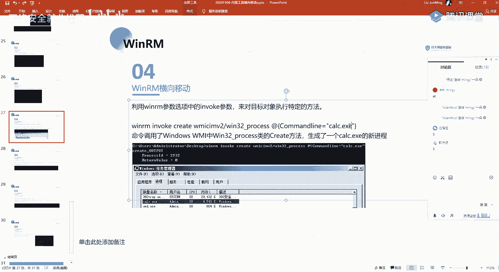

呃这个，嗯嗯因为，因为命令的话都比较长，我这边的话我就不死，好吧好，这边的话，就而他同样的返回了这样子的一个进程id对吧，你你会发现跟前面跟前面我们用w m i，第一个方法就是呃创建进程的一个方法。

它返回那个结果类似对吧，因为它同样的它是调用的这样子的一个，就是windows的一个w mi当中的这个内容。

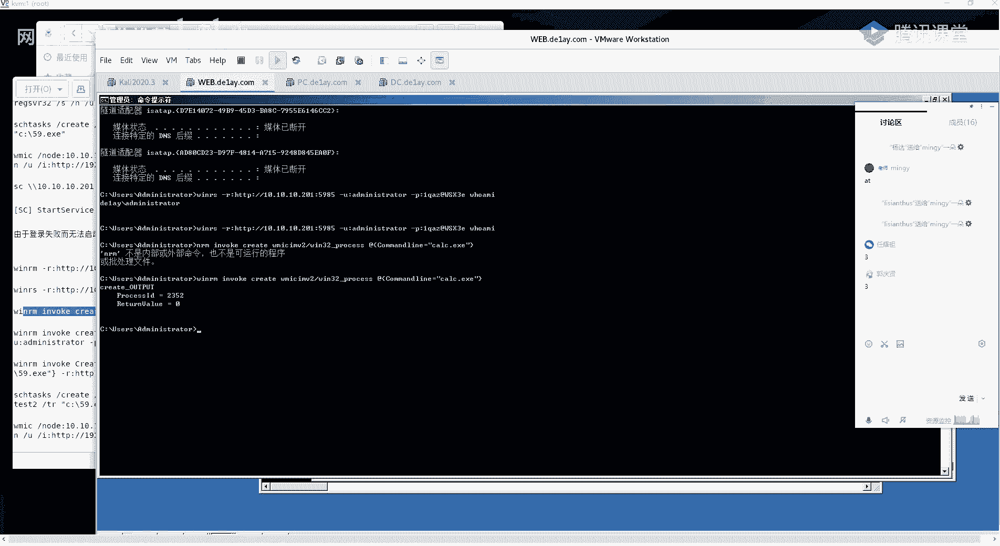

有的话效果都是效果是一样的。

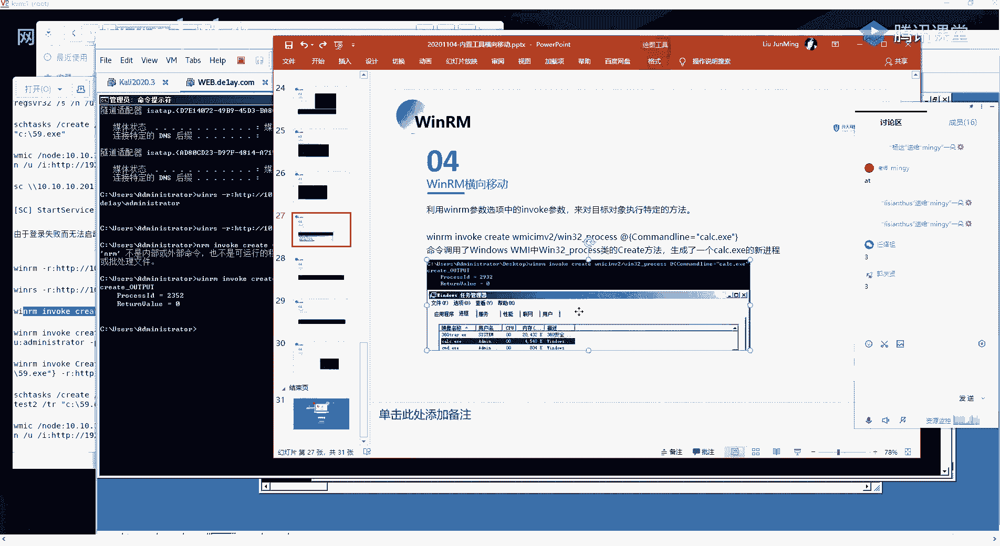

然后在这边的话，在这边的话注意的话是在本地啊，它是在本地区创建的，我这边还是做一个演示呃，我们在这边的话，任务管理器这边，我们就能够去找到这样子的一个嗯，有两个，先把大家给把这个cl是一个一个进程。

把它给删掉，然后再这边再提一个对吧，在这的话可以看到这边的话就多了，这又多了一个clc的一个进程，他那个pi他那个进场ig的话，就是这个四九啊对吧，那么我们在这边的话，我们在这边执行的一个操作的话。

它只是在我当前的一个本本机上面，去创建这一个键盘是吧，那我们是不是可以去在远程主机上面去，创建一个进程的，答案的话是可以的。

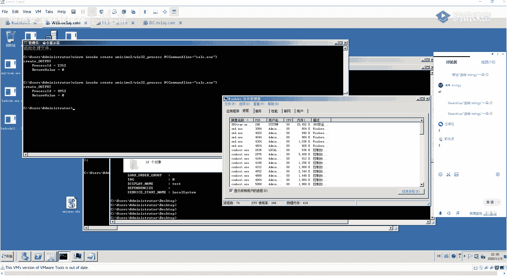

具体的一个方法的话，就是通过这样子，就是结合我们的这个wm的一个呃，温按摩的一个远程的一个零件，来去，在远程主机上面去创建一个这样子的一个进程，那么在这边的话呃，在这里前面的话就是我们前面呃。

就是这边的一个mini对吧，这边的这个命令的话跟前面是一样的，就是创建这样的一个进程，c l l c的一个进程对吧，然后不同的一个地方就是在这边的话，我们是在远程的这个呃，201的这个机器上面。

去创建一个这样子的一个进程。

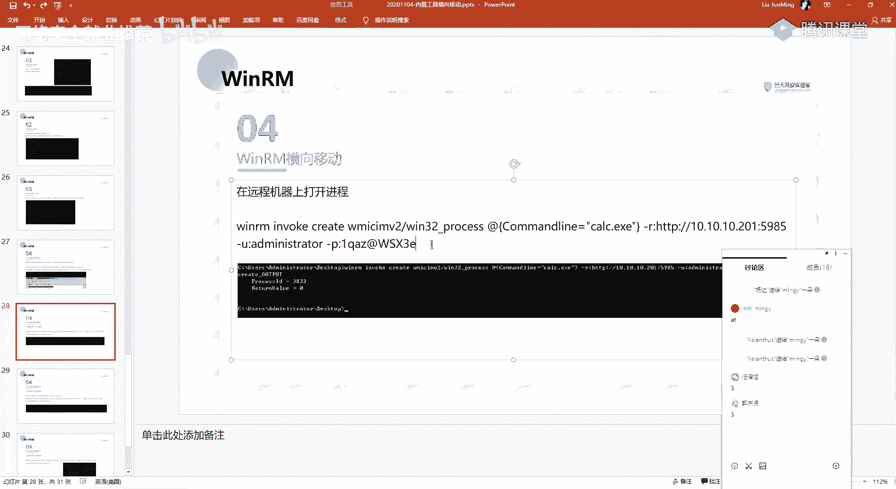

我们来看这边的话。

其他都可以，结束了。

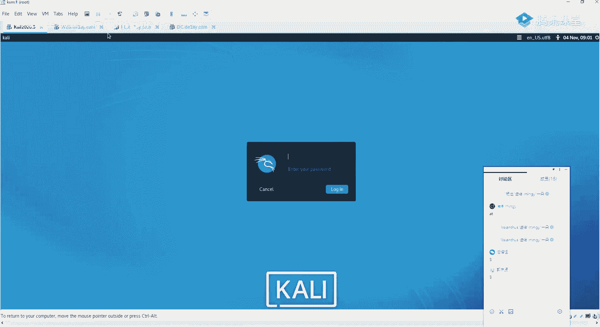

就这一个。

好我们这边在这边的话执行，首先这样的话，这边他创建了一个1276的一个镜子是吧，那么我们在这边的话来验证一下。

可以看到在这边，可以看到在这边的话呃，同样的生成了这样一个进程，id 1276的一个cl c的一个进程，对吧啊，其实这边的话他就是，那就是启动了一个在远程的这个主机上面。

启动了这样的一个呃c l c对吧。

那么我们能够去在远程主机上面去创建，建成的话，那么同样的我们就跟前面我们的一个w m m i，c这个方法对吧，是一样的，是我们可以通过这样的一个方法，在远程的主机上面去执行我们想要的一个命令。

来去反弹shell是吧。

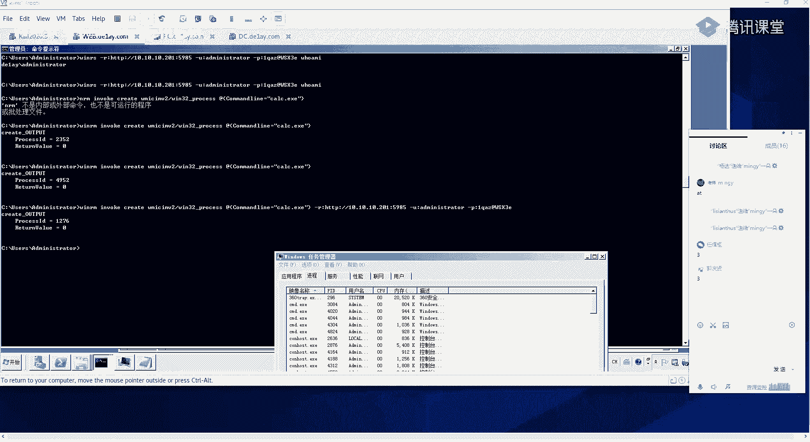

呃以及的话我们还可以通过它来去创建一个服，就在这边的话它的一个创建服务的话，呃，你可以把理解成就是跟我们前面sc的一个方法，就是我们知道r s c，它同样的也是去创建一个服务端，然后在这边的话。

它是通过啊这个invoke来去调用，这边的一个win 32的一个service的这个layer，调用它这个类的一个create方法，就是这边的这一个类的话，它是跟服务相关的。

他的这个方法就是能够去创建这样的一个服务，然后这边的呃这边的这个概念的话，就是与服务相关的一个一些信息，首先name的话就是我们的一个服务名，distant name的话就是我们展示的一个名字。

然后呃pass name的话就是我们呃我们要去就执行的，可是我们要去执行的一个程序所在的一个目录，或者说我们要去执行的一个命令，就是当这个服务端启动的话，他就会去找到这个pass name的这个值。

而去进行一个执行，也就是我这边的话就是通过cmd啊，这边是钢丝，要，来去执行这样子的一个，呃，拿去执行，我们已经上传到目标机器上面的，一个五九的这样子的一个木马后门，然后他那个之前那个结果的话。

就像这样子执行之后的话，他这边的话它没有其他的一个输出，就只有这样的一个呃return v n v vl，然后咳咳下面这个的话就是我们通过这个start service。

就是同样的是这个service类的这个呃，start service的一个方法来去启动这样子的一个呃服务，名为test任的这样子的一个服务，然后我们在这边启动这个服务之后的话。

他就会去启动我这边的这个呃可执行程序对吧，然的话反弹一个shell给我们。

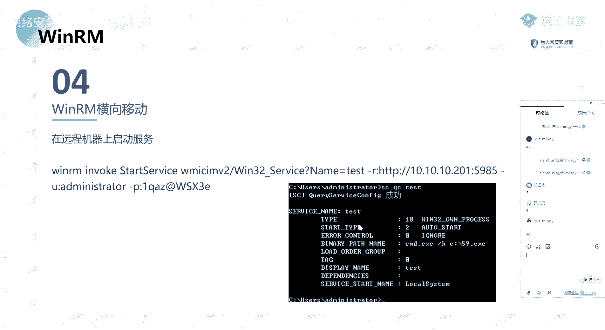

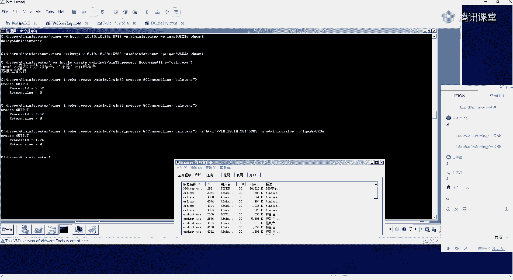

同样的在这边的话。

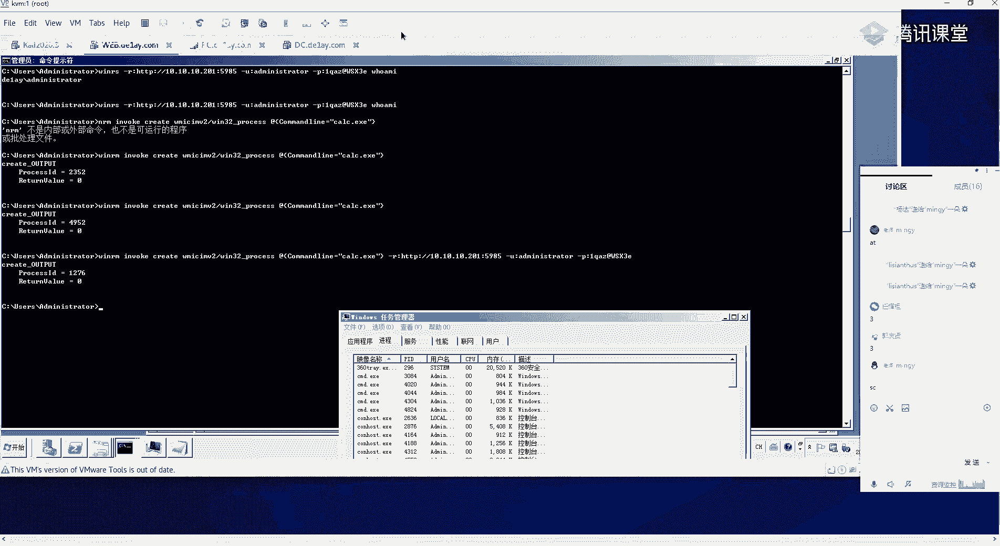

我复制一下，就是呃这个，兄弟。

执行那个面的话就是像这样子啊。

那我们呃看一下这边有没有他手机的服务。

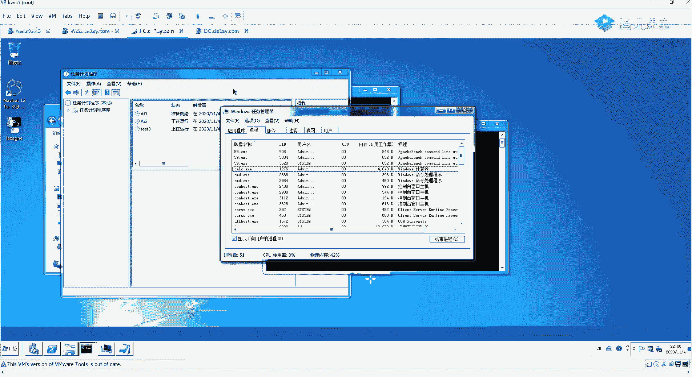

呃已经有了这个符啊，我这边的话删掉吧，扫描的东西，然后这边直线执行之后的话，在这边的话他没有返回其他的一个东西，只返回了这一串对吧，然后实际的话就是在这边的话呃，你可以通过，这个还可以。

然后我们想要在远程的，就是说去查看远程主机上面的这样子的一个，服务的一个状态，我们可以通过这样子的一个sc，然后接远程的一个主机，然后qc加我们的一个服务员，我们就能去查看到好呃。

啊这边的话这边还没启动啊，就是我这边的话。

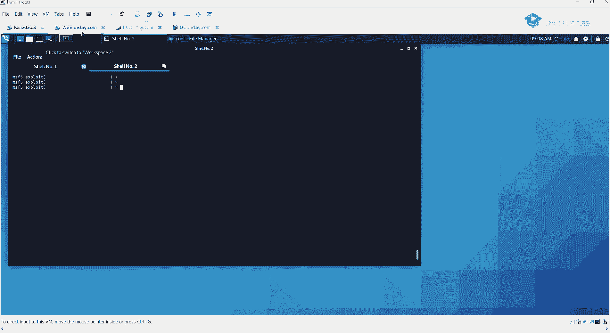

服务的话已经呃创建成功了对吧，创建完创建成功服务中的话，我们还要去启动这样子的一个服务，启动服务的话，面的话是这样子，启动服务的话，它就是调用的这个啊win 32的一个service类的。

这个service的一个方法是吧，然后启动的一个服务名的话就是这个test，然后他是在远程的这个主机，上面去进行一个启动，然后我们执行执行之后的话。

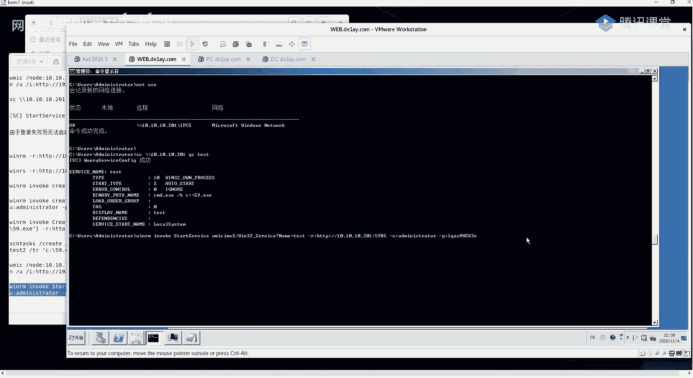

在这边你会发现这边的话就得到了一个筛选，绘画，对吧，筛选16，然后呃因为在这边执行的话。

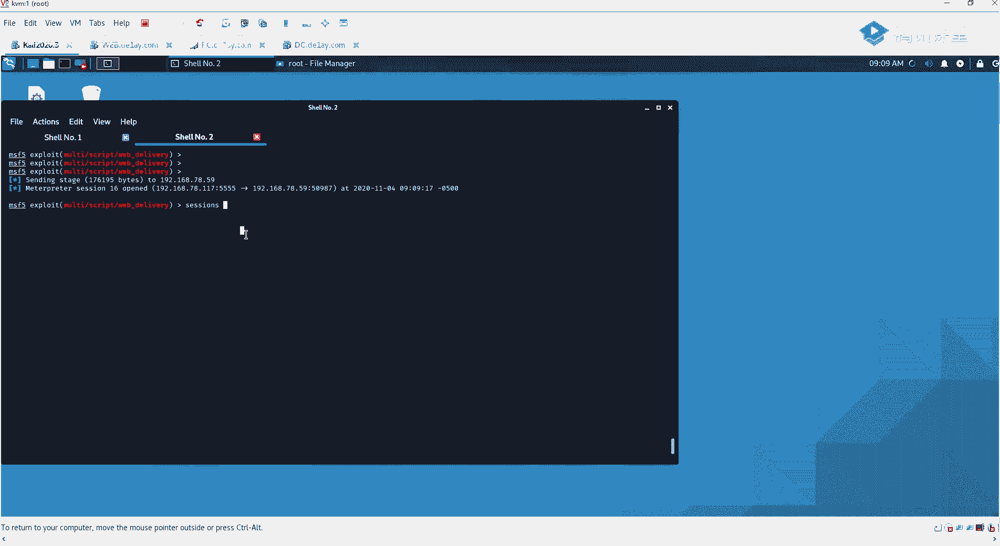

我这边创建了这个服务对吧。

我这边创建这个服务，它的一个in binary pathname，也就是他会去执行的一个命令，它是这一个命令，他执行这个面的话，就是在cmd下面，他会执行我这边所已经上传了这个呃后门对吧。

这个木马这个反弹需要的一个木马，然后的话我这边只要它的一个服务启动，服务启动的话，它就会去执行这个命令，也就是我在这边的话，我远程的去启动这样子的一个服务，那么我这边的话他就会去执行。

我这边的这个反射线的一个木板，然后的话我这边就能够去得到它的一个摄取。

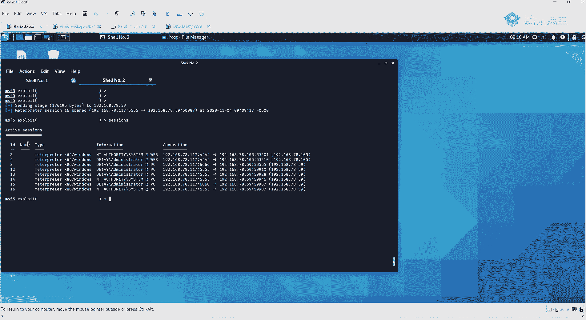

这句话就是通过呃，在远程主机上面去创建这样子的一个服务，然后的话呃启动它，启动它之后的话来去进行一个反弹，需来达到一个横向移动的一个目的，呃以上的话就是我们本节课的一个所有内容啊，大家有没有什么疑问啊。

没有没有什么问题的话，我们本期的话就到这边就结束了。

好啊，有问题的扣一，没问题的扣二，还有同学在吗，喂能大家能听到我声音吗，有问题的扣一，没问题的扣二，我感觉是不是有有有个半分钟的延迟啊，都都没问题了对吧，其他没回答，我就默认是没问题了，好吧好。

那么呃pv的话也已经发给大家了。

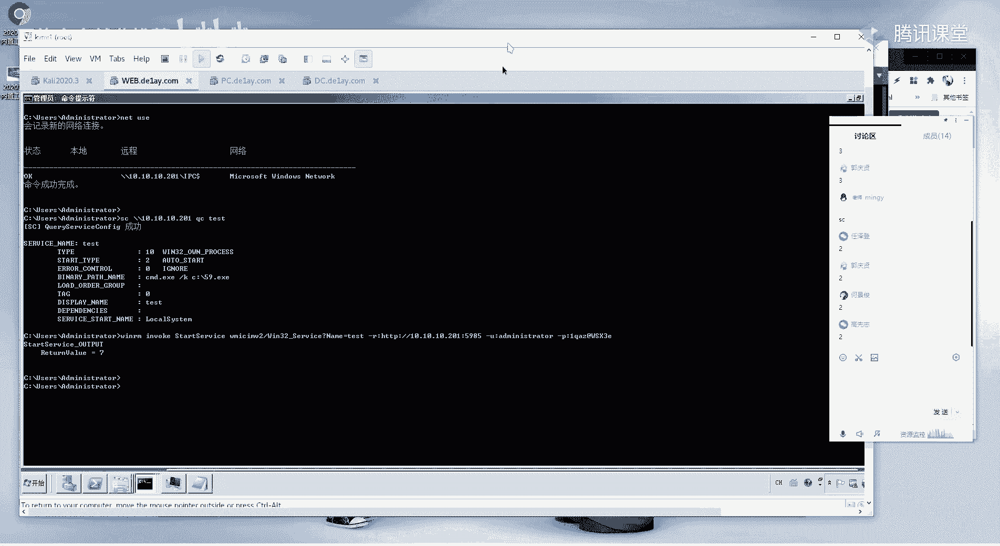

然后呃，内容的话都在ppt里面，然后大家自己课后去啊，自己去操作一遍，然后课后作业的话就是还是老样子，就是ppt的一个内容，大家自己动手，课后动手去操作好吧。

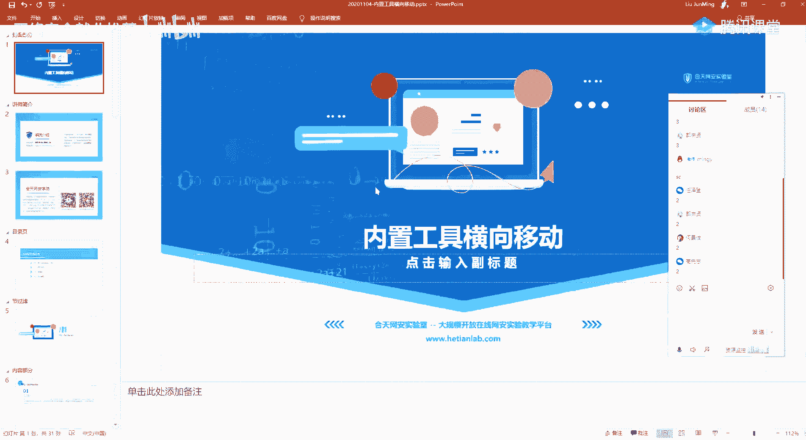

那么呃大家，那么大家早点休息。

