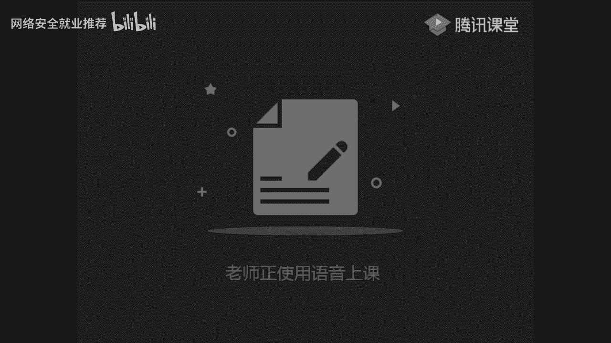
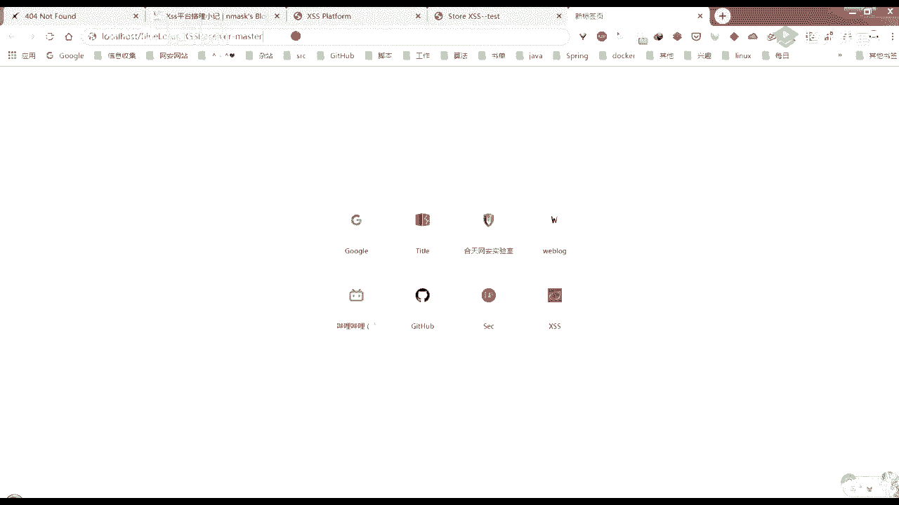
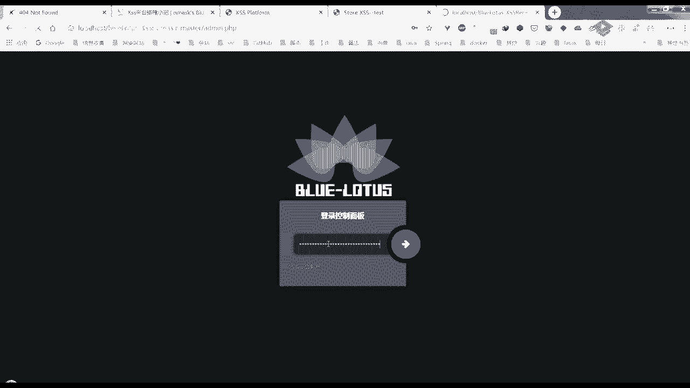
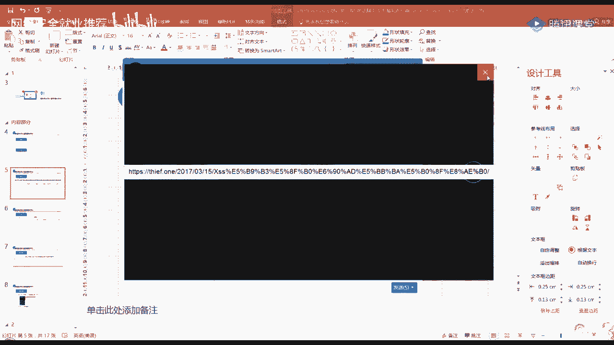
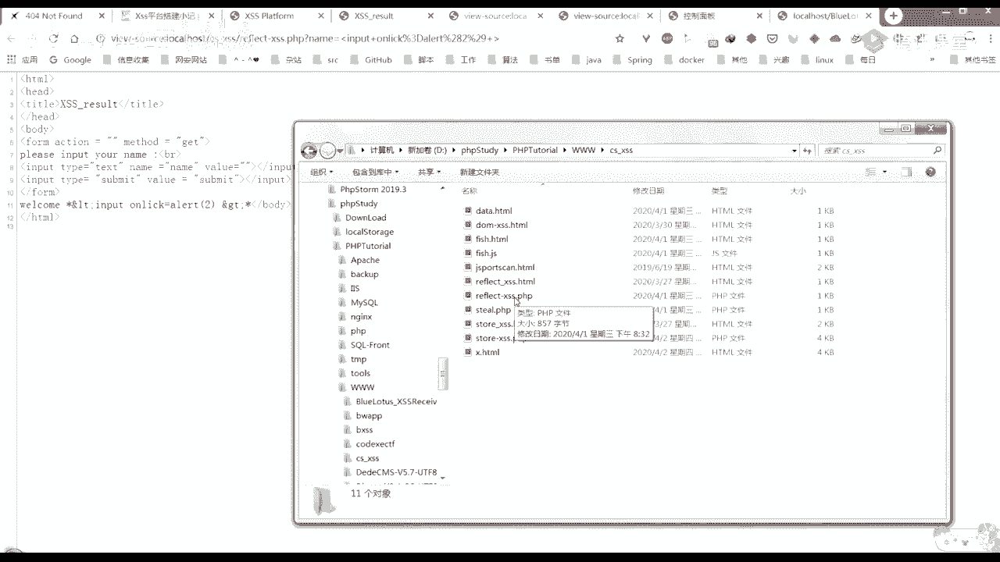
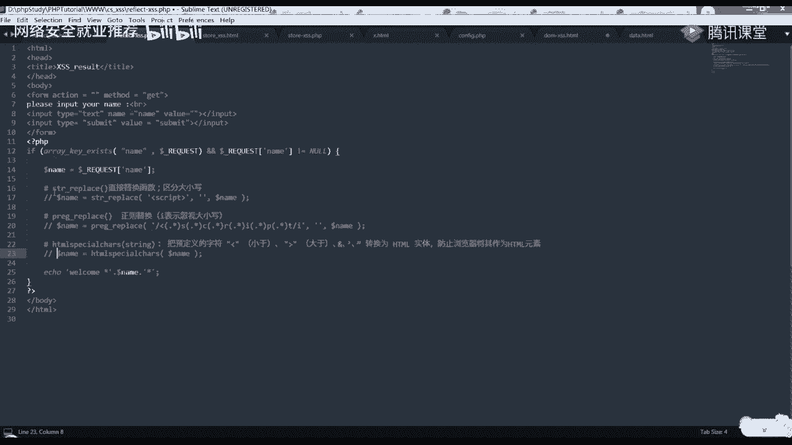
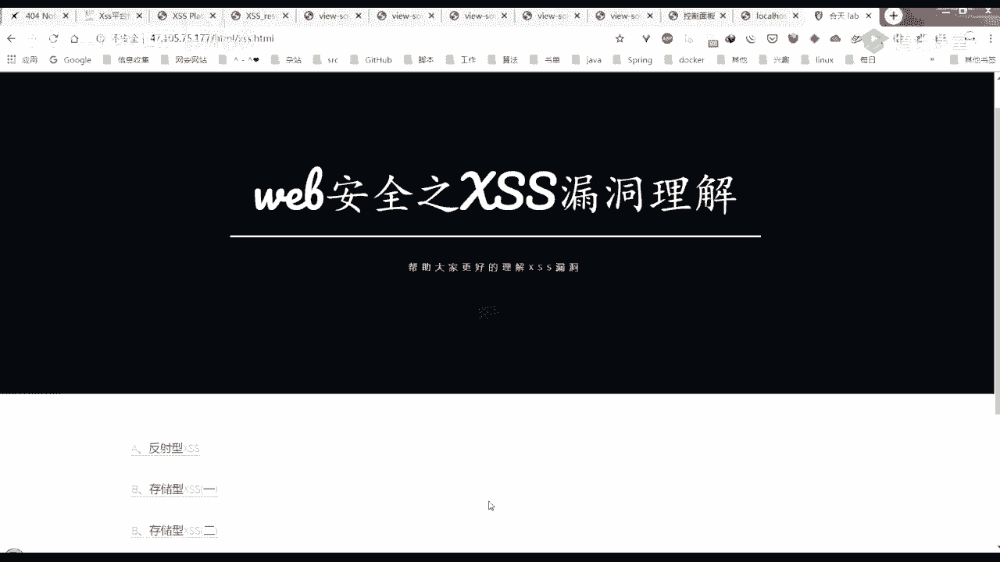
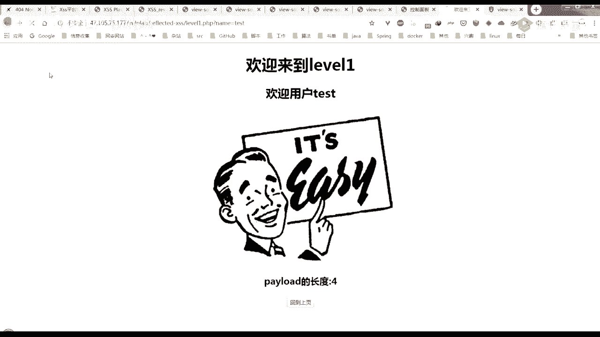
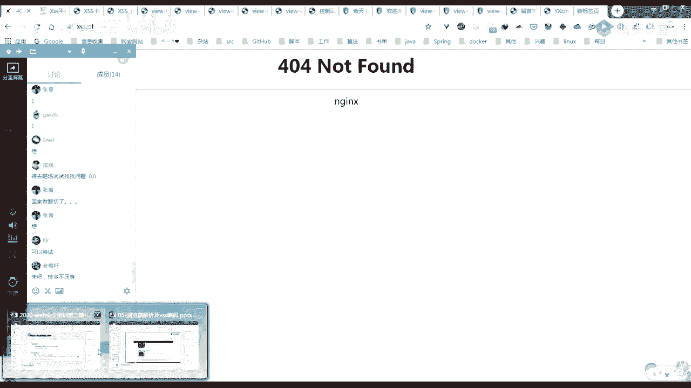

# P8：第6天：XSS漏洞-xss平台搭建与打cookie - 网络安全就业推荐 - BV1Zu411s79i

大家能看得到我屏幕吗，嗯好的嗯，昨天晚上，昨天晚上有给大家就布置了一个课后作业，那个实验大家做了吗，如果做了的话，打个一，没做的话，打个二，为什么为什么没有去做呢，1。5还有1。5万就没做完是吧嗯。

上了一天的课，所以吧，今天是不是还有同学没有过来呀，嗯现在8。01了，如果大家没有去做的话，先不讲吧，等明天一起，嗯那个实验我其实没有打算讲的，就留给你们自己课后去做的，然后实验指导书都写的很清楚。

如果有什么问题的话，就来问我，嗯那就，那就开始讲今天的一个内容吧，今天讲是跨越脚本工具漏洞的一个进阶篇，这节课的话主要是分为三个部分，第一个部分的话就是讲一下我们这个漏洞。

它的一个接收平台的搭建以及如何去利用，第二个的话是讲他的一个绕过以及一些防御，第三个的话就是我们漏洞的一个实操，首先我们来看一下这个接收平台，嗯这我给大家推荐了两个，第一个是xs s e r。

一个是蓝莲花，大家可以去这两个网址上面去进行一个下载，还有一个网址就是这个，还有一个这个，这个的话嗯，嗯它有点不稳定，有时候就是它其实就是一个在线的线上的一个，他已经给你搭建好了。

一个xs s e r的一个品牌，但是他现在变成404lophone的，嗯其实还有其他的一些接收了一些平台，这的话我就只给大家列举出这一个，但是正好他又变成404了，嗯那就先不管他。

嗯大家可以去这两个网址上面去进行一个下载，我课后再把链接发给你们吧，还是你们现在就要下载吗，好没人理我，下载好了，班主任发过了哦，可以装一把吗，哦你可以只装一个，因为它们的功能是一样的。

就是在配置环境里搞不定嗯，这个xs s e r的话，大家可以去看一下这个链接，这里有一个xs平台的搭建笔记，我们可以去下载一个修改版的，然后按照他的步骤一步步来，这个的话比较比较多步骤啊，步骤比较多。

大家可以课后的时候再去进行一个嗯，就是安装在这儿的话，我就不进行一个安装了，如果大家有什么问题的话，就可以问我这的话，它有一个比较需要注意的地方，就是在这个如果我们不把，因为它这里是有一部。

把他的这个3w目录改成3w目录目录下的，这个xs，那我这没有改的话，你在这个静态，这个它的这个映射网站映射的时候，你在这个前面也要就是在这个index。p h p，前面也要加上你在这里的这个地址。

就是这个tos s e r这个地址就加进来，每个都要这么加进来啊，这个就不给大家演示了，我给大家打开看一下，嗯这个就是它的一个页面，就是我们搭建好之后，我们去访问他的这个地址，然后的他的一个界面。

那这个东西是怎么用的呢，我们就可以在这边我的项目这，点击创建，这随便输入一个名字，比如说test，你这个描述可写可不写，在这里的话我们直接选默认模块，然后是这个无keep session，然后点下一步。

嗯这里这里的话它就会给出一些网址，或者是直接的一个po的这种，再或者是他，你只要在任何想要的地方，插入这一这一个这一串网址，比如说我们昨天搭建的那个哦，昨天嗯测试的那个，我们在这儿写一个。

写一个什么写一个这个网址，就直接插入一个srt标签，啊这他没有复制，全要是因为它在这的话，它限制了我们的长度，把它的最大程度改得蛮大的，再来，复制一遍，然后添加留言，在这边的话我们可以返回去看一下。

这个test 2转它的内容是数，就是4月2号，就是今天嘛，他这就变成了一个一，然后这里面就有我们的一个cookie，然后接受的内容location就是从哪个网址过来的嗯。

然后这边的话有一个我们就是访问的一个user agent，这里的话就给我们显示出来了，这是这一个接受平台的使用，大家就是，你在linux下还是不得行，你你们之前不是已经装好那个w a m p。

或者是这个菲律宾study了吗，你们不是已经装好了吗，装好了，装好了之后，就按照这个文档里面，就是首先下载888，然后，打开它的配置，这个如果想改的话就改，不想改的话就不改，但是如果你不改的话。

你后面每一个就是那种index的地方，都要加上你的那个文件前缀，那在这的话我就是这个xs s e r，因为我的代码是这个，所以我在所有地方都要加这个xs s r，这是教大家如何使用这个接收平台。

我这儿也给出了一个步骤，就是首先是我的项目里面，你首先创建一个名字怎么怎么的，第二张就是这张图的话，我截的其实是那个嗯htp s x s s。p t，那个就是我刚才说的这个上面的一张图。

就是官网上面的一个平台，但是他现在还是打过牌，还是打不开就算了，它的界面就是这个的界面，其实是和我们这个本地搭的这个界面是一样的，嗯接下来这个的话刚才也有给大家演示，如果大家没有装好的话。

装好这个xs s e r的话，我和大家一起来装一下这个蓝莲花吧，因为这个相对比较简单，就是装的步骤比较简单，我先把我自己的给删掉，然后去进行一个下载，那我这儿的话好像已经下载完成了。

嗯就直接在这进行一个解压，解压之后把它放到我们的3w目录下，就是我们的根目录下吗，放到这来之后，我们到浏览器里面来进行一个访问，我这儿已经开启了菲律宾四大d了，已经开始已经启动起来了，然后我在这儿输入。

然后加上我刚才，存入的这一个就是在这边的这一个目录名字吗。

回车，这样的话它就有一个install。p h p提示啊，有一个提示的过程，我们就点这个安装，这里有第一部后台的登录密码，是就是这个blue letters蓝莲花，然后接下来其实这下面都可以不用更改。

然后直接进行提交，你只要记住这个这个后台登录密码就行，提交，然后进行一个登录，登录的话，这里的密码就是刚才的blue letters啊。

这样子的话就相当于是已经安装成功了，这个是不是很简单，把搭建步骤的网址发一下行，你要那个xs s e r的吗，我发群里面嘛，这样的话你们课后也可以找得到啊，啊这个发出来是这种图片。

那我先先复制到这边，怎么这个也是，复制，粘贴，然后再把这个复制出来，发到我们群里，这个是那个xs s e r的，然后蓝莲花的话，如果你是在windows下面，然后用这种集成软件的话。

就是我刚才的那种直接解压，放到我们3w目录下，然后去进行一个访问，就访问这个目录名之后，按照它提示安装就可以了，那如果你是linux linux下安装的话，你也可以参照这个网址进行一个安装，还是图片。

你们现在在装吗，如果再装的话，就打个一，如果不再装的话，就打个二，如果不再装，我就接着往下讲，嗯好的，那我就接着往下讲吧，到这里的话，这个这个蓝莲花的这个接收平台就搭建完毕了，这个一人是404啊，算了。

那怎么使用呢，其实就是在我的js这首先输入一个模板名，你随便输入就是test one，在这里的话我们可以选择一个它，这个里面已经写好了一些js模板内，在这的话我们插入这个默认的js。

然后点击这个插入模板，在这儿的话，他就会把他的那个代码贴出来，我们这儿需要改一个地方，就是这个地方这个网站地址，我们要改成自己的这一个地址，嗯然后点新增生成po的，这的话我们直接复制去看一下。

是不是能够进行一个访问，这样的话这就出现了我们这个js的一个代码，然后我们可以将就是你生成po的这个这个po的，或者是中间这个网址，就是这个js的一个地址，插入到可能存在嗯xss漏洞的一个地方。

它就有一个，在这边接收面板，这它就会有那边传输过来的数据，这个是他接收到内容之后的一个图，嗯比如说他是他是什么时候来的，他的ip地址是什么，这我测试的是局域网，因为就是我本机就是自己发的客户端的话。

就是win 7，然后谷歌浏览器它是以get请求get的数据是什么，然后这儿的话有它的一个location，然后cookie等等都会传给我们，就是使用这种接触平台的话，就更方便我们进行一个接收。

嗯这应该是这个index，我们来测试一下是不是能使用网，同样在这里，全拍到的，复制，嗯然后直接在这边插入来试一下，是不是已经配置好了，嗯这种前端的控制我们都可以在这个f 12，这，然后你可以随便修改。

所以说有些前端的一些限制的话，对我们的你光靠前端来进行限制的话，对程序肯定是不好的，不安全的，因为我们客户端就可以对它进行一个修改嘛，你可以看到在这这个地方，它就有显示收到一封消息。

我们可以到这里来看一下，嗯可以看到在这的话它就有一个cookie，然后是从哪里来的，到现在的话，大家有什么听不懂的吗，嗯没有是吧，应该都讲的比较清楚，如果，就是大家不太知道的话，也可以。

就是后面再去参照我的这个ppt，这边点击生成po的就可以了，这他为什么会接收到我们的一个cookie，和和一些其他的这种信息，这种location什么的，这种信息，其实是因为你在这里选择这个js这一段。

function里面的那它的一个内容就是用来接收cookie，这，接收他的一个cookie，然后top location，location嗯等等，所以你在这儿接收面板，这他就有这些信息给我们。

嗯到这里的话大家应该都能接受吧，如果就是能接受的话，我们接着往下讲，嗯好，那就接着往下讲，这个就是它的一个接收平台，我们之后可能就是做是练习的时候，可能就会让大家不光是弹出他一个弹框，或者是怎么样。

就是更希望大家利用这种接收平台，然后能够接收到他的一个cookie，然后如果能接收到他的一个cookie的话，就，就危害就比较大嘛，那我们进入下一个就是跨站脚本攻击，漏洞的一个绕过。

以及我们如何进行一个防御，首先来讲一个绕过第一种情况，我这只举了一些例子，第一种情况就是左右尖括号被过滤的情况下，假如我们的那个输出的地方，就是我们不是会注入一些xss代码进去吗。

他不是在一个地方要回钱给我们吗，比如说，在这个reflag，我们在这输入hello的话，他是不是会把这个hello回钱给我们，在这个如果这个hello它输出的地方这边查看右键，查看源代码的时候。

这他直接是输出在了我们的body里面，那如果它是输出在了我们的一个特殊的标签中，比如说input标签，我直接在这儿插入一个input，然后那input的话它就有一个事件。

on click事件等于learnt，它当然它不止一个事件，比如说这个enquake事件，然后提交之后，啊我这好像是把它进行了一个过滤，就把他的代码给改一下。

比如说在这输入一个input on click，这提交之后，我们点击这个它就会有一个弹窗出来，这个是什么意思呢，这个左右尖括号被过滤掉的情况是什么，然后说他有一些事件被扣处罚是什么意思呢。

其实就是比如说它这里的我们输出的这个地方，正好在这个input标签里面，就不是说直接输出在我们这个body里面，没有包裹在标签里，比如说我们输入的内容，是可以是在这个input标签里面的。

就是我这标蓝的一个地方，他输用户输入的地方，最终输出在了一个标签里面，这样的话我们就可以构造一些事件，比如说在这里的话，就是一个这个on click事件，我们点击之后，它就有一个弹窗给我们。

这是第一种情况，就是这个前面这个双引号就可能是为了闭合它，可能input标签不是还有其他的一些属性嘛，比如说我们上一次写的时候就是他的type啊，以及嗯line吗，我们如果它输出的话。

肯定是在一个属性属性里面嘛，比如说它的value值是什么呀，然后他就可能是用一个双引号包裹起来的，那这样的话我们输入的内容，是不是就要把前面他原本在这个程序里面的，这个我来排一下吧，他有可能我的意思是。

他有可能它的源代码就是这个样子的，然后我们输入的内容是保存在这个value里面的，所以说他在这的话可能就需要有一个双引号，闭合掉前面的那个双引号，再加上我们的一个on focus这种。

这个就是聚焦的一个事件，当它聚焦的时候就弹一个一的一个警告框，这个auto focus的话，它的意思就是当页面加载的时候，它就自动聚焦在你现在这个标签上面，然后当它聚焦的时候，它又会触发这一个事件。

所以说整个这两个连起来，就是我打开的时候就会触发这个alert，一就会弹出一个一的一个警告框，因为这有一个自动聚焦，然后这里的话有一个如果聚焦的话，它就有一个事件的一个写了一个事件，在这儿。

这是第一种情况，第二种情况就是clean alert被过滤掉的情况下，就可以使用编码的形式，或者我们使用这个prompt和confirm，也可以进行一个弹窗，比如说在这的话就有一个a标签。

a标签里面有一个这个h r e f属性，在这的话我们输入一个date冒号tt，然后中html这里的话有一个base 64分号，后面有个base 64，就说明我后面的这一串是用base 64。

进行一个加密的，这种形式的话，它在谷歌浏览器下面是不可以进行弹窗的，我们可以来试一下，嗯它是没有一个效果的，但是如果我们把这个链接在谷歌浏览器里面，去进行一个打开的话，它就有一个弹窗显示给我们。

当我们点击之后，可以来看一下这个这一串到底是什么意思，嗯这里的话就是弹出一个三这个的警告框，所以说从这个也可以发现，有时候，因为浏览器它自己本身的一个策略的问题，有些时候它这个浏览器能是能进行弹窗的。

但是另外一个浏览器它就不行嗯，除了这种编码的形式，可以看到第二种就是使用这个s vg这个标签，然后有一个它有一个unload，我们可以使用这个prompt一再，然后就是也是这个a标签里面。

他对他其实是可以来看一下，啊这里边看不到这弹窗，它有一个13的弹窗，嗯嗯在这里它其实就是javasquette的一个伪协议，在这个javasquetter冒号后面。

输入了我们这个javascript代码，这里的话就是弹出一个13的一个警告框，这些都是一些例子，然后肯定是不止这么多例子的，第三个的话，如果是我们的这种on事件被过滤掉的情况下。

我们可以使用怎样的一种形式来进行一个绕过，第一种的话，还是使用刚才的这个javascript，只是在这大家记得这个东西吗，这个就是一个字符实体吗，对吧，但是为什么他在这儿就能进行，对它进行一个编码呢。

其实刚才在前面这个零二的时候，这里是不是其实也是一个进行了一个字符，实体的一个编码，这个就是aj a v a这两个都是a，只不过这个加了一个x的话，它是表示它是16进制的j a v i squaed。

然后冒号这又一个a alert 13，这样子把它拼起来了，所以说如果你单纯只是后端对javascript，进行一个识别的话，那它在这的话就不是能够一个不能够匹配得到，从而有一个绕过的一个效果吗。

嗯这也是一样的，这个就是一个冒号，但是他这里的话是使用一个名称，不是那种数字，不是十进制来表示了，第二个的话也是使用一个伪协议，javascript伪协议，第三个的话它是使用一个style标签。

里面有一个这个snow yle属性，里面有一个这个expression，然后在这个expression里面，在这个括号里面输入我们的这个js代码，但是这种现在只能在ie 6以下，才能进行一个弹窗。

其他的基本上这个已经不怎么使用了，下面这一个的话就是这个x link冒号h r e f，也是使用这个来进行一个弹窗，那这种的话它只是在火狐上面，火狐浏览器上面可以弹窗，在谷歌浏览器下也是不能够弹窗的。

其他一些可以执行js的属性的话，还有这几个，第四个的话就是标签和属性之间，并不是只能出现空格，比如说这个image我也可以用这个斜杠代替空格，这个后面的这个空格我也可以用斜杠来代替，第二个的话。

有时候并不需要一个合法的标签，比如说在这我就直接有一个m，那我点击这个m之后，它也是有一个警告框弹出给我们的，我们来尝试一下，同样在这里进行一个输入，点击之后这里就有一个一，我们写的是ella吗。

它就在这儿有一个弹框给我们，这是简单的列举了几种，方式，接下来我们来介绍一下它的一个防御，大防御的话可能是有两个部分，第一个部分的话就是阻止恶意代码进行注入，第二个部分的话就是阻止恶意操作的执行内。

不管是反射型xss还是存储型xss，都能通过服务端过滤进行防御，因为他们都是要交给服务端进行处理的，那服务端的话可能就有两种方式，一种是黑名单，就是过滤掉某些特殊字符，特殊符号以及字符。

在这里的话就列举出了这一些白名单的话，就只允许特定的类型或者是符号，白名单和黑名单相比较而言，肯定是白名单更更好一点，因为黑名单总有一些标签，总有一些事件什么的，你没有想到会漏掉，那白白名单的话。

你就只限制在那几个里面，肯定会比黑名单要好一点，白名单的话它是只允许特定的类型或者是符号，根据输入的数据特征限制使用的类型，比如说年纪年龄，我就只限制为数字类型，输入类型为字符型。

我就只让它能使用大小写的26个字母，以及数字，以及这个连接符号以及下划线，其他的就把它一律的禁止这种，还可以的话，我们就是进行一个编码以及转移输出，在标签和属性中的话，我们就就进行一个html编码输出。

在ascript标签或者是事件中，我们就进行一个javascript编码，然后输出在url中就进行一个url编码，再一个就是这个cookie中，我们可以设置这个http only，然后，怎么设置。

这就是这个通过这个set coach cookie，将这个hpony的选项设置为true，它就能防范我们的这种cookie劫持，就不能通过我们那种接受平台，接收到他的这个这个cookie了。

再一个的话就是要确保我们执行的脚本，来源可信，之前我们这种插入就是我们在这儿，就是在这里，不是插入了我们接收平台的这种链接吗，所以说你在程序里面就可以规定，哪一些外部资源是可以加载和执行的。

其他的我们都一律不让它进行一个加载，这样的话就能一个有一个比较好的一个防范，下一个的话就是不使用有缺陷的第三方库，因为你有缺陷的第三方库加载到页面来的话，它也是能够有一定的影响的。

嗯这个这几个是不同的语言，它使用嗯对一些防范xss的函数，那在这儿有一个需要注意的地方，就是这个ph p里面的这个html special chars，它默认配置是不过滤掉单引号的。

只有将这个这个选项设置为这个这个后面，这个它才会过滤我们的一个单引号，所以有时候嗯，我们的开发人员疏忽掉了这一点的话，我们就可以来进行一个利用，接下来的话就又给大家留几个实操的一个练习。

大家可以去练习一下，有三个实验就是xss进阶123，接下来时间大家，我可以来看一下那个，之前给大家发的那个网址，就是让大家去预习的那个，你们有做吗，如果做的话，可以打个一给我看一下。

让我看一下有多少人做了。

那你很棒哟，嗯大家都都知道，都就是会吗。

反射型xss，我们先来看一下常规考察，就只有三位同学做了是吗，那你们做到第几关了，还是已经都通关了，能做到反射，反射已经做完了吗，这几个接收平台如何使用，大家应该知道了吧，就是应该就懂了吧。

要不都讲一遍，就是这个都讲一遍吗，我可以带着大家先来看几道题，我来带着大家看几道题可以吗，如果可以的话，就打个一，如果觉得要多讲一遍的话，就打个二，我还是先讲几道吧，因为给你们留一点自己思考的时间，二。

讲一半吧，那首先就是比较简单的，那在这的话可以看到，我们可以看到来到这个level一就是第一关，他这在这个url中明显的有一个参数，这个lab等于，那这样的话我们是不是可以就是尝试一下，在这输入一个。

在这个后面输入一个经典的，嗯这样的话他就有一个弹窗回信给我们，可以查看一下网页源代码，可以看到它其实是插入到了这个地方，就是欢迎用户，这刚才我们它原本不是有一个test吗，这对吧。

那我们刚才直接把它后面的这个test，改成squint lt一的话，它就直接插入到了这个地方，这是第一关，简单吧，其他人我也不知道其他人去哪了，是不是还就是还蛮简单的。

然后我们回到首页，回到上野来看一下第二关。

第二关，这有一个input，就是这儿有一个这种输入框内，在这的话我们直接简单输入一个双引号，这种这种尖括号可能是进行一个闭合，前面的一个标签，然后再加上一个srt lt，一来尝试一下，搜索哦。

他这就直接给我弹出来了，我们来看一下，就是右键查看网页源代码，嗯可以看到它其实输出的地方，我们可以ctrl f来找一下l输出的地方，其实有两个，第一个的话是在这个地方，这是我们刚才输入的对吧。

但是他进行了一个实体编码，还有一个就是在这个地方，这是我们输入的，就是我们刚才输入的，然后它原本的意思是我们将哦，我们我刚才输入这个test，它原本的意思是，我们将这个我们输入在在这边输入的内容。

直接插到这个value里面，但是这的话我们直接有一个双引号，对他前面进行一个闭合了，然后又使用了一个右键，括号闭合的这个input标签，接下来的话就又开启了另一个新的标签，这就是这个scream的标签。

然后它就会有一个弹窗显示给我们，这个是不是也很简单，伪协议注入一般出现在哪里呢，一般出现在哪里，嗯这个的话你不应该说是它出现在哪里，你是要根据他就是他这边过滤掉了哪些字符。

然后我可能会使用这个伪协议来进行一个弹窗，嗯这个是一个第二关，是不是也很也很简单，你们觉得就是这么做下来有难度吗，这样的话又有一个输入框，我们随便输入一点东西，啊这个再加上这个还是输入跟之前一样的。

看看能不能也行，搜索这就没有一个弹窗了，那我们来看一下它的一个网页源代码，嗯他是对我们的这个都进行了一个实体编码，这两个输出的位置都进行了一个实体编码内，怎么来进行一个绕过呢。

我们可以看到它在这里闭合的话，是使用一个单引号，那单引号的话我们是不是可以去尝试一下，或许他就没有写那个参数呢，这里然后这个的话肯定这种右尖括号，左右尖括号都被实体化了嘛，我这就不写了，然后就利用。

是不是之前有说过这个input标签的话，它也是可以有一些事件的，focus，等于alert 1，然后给大家尝试试一下那个auto focus，可以看一下它的作用，后面还要加一个单引号，是闭合调。

后面那个单引号，对吧，这就直接他就会一直弹出来，因为他一直就是自动聚焦，所以它一直会有，我就回退吧，我们查看一下他的哦，就把这个auto focus给去掉，然后来查看一下它的源代码嗯。

这样的话我们只有自己鼠标，把它的焦点聚焦在这个输入框的时候，它才会有这个弹窗嗯，哦我鼠标要移开，但是我但是我现在一直在转，好吧换一个吧，因为我们现在查看源代码的话，也还是之前那个alone一的。

on click吗，睡的话只有点击才会有，刚才on focus的话，因为我这这个点之后点确定它又直接，它的焦点也是在这，所以它也会一直有这个弹窗，我们可以看一下，我们刚才输入的话是中间这一段。

就是这个test单引号，on click等于alert 1，然后后面有个单引号，前面这个单引号是b和前面的，后面这个单引号是b和后面的，中间正好多出来，这一个部分就是我们能够触发js代码的这一段。

这一部分我这么说，大家听着吃力吗，还行不吃，那我就接着往下讲好吧，这这个靶场大家可以去做一下吧，嗯后面的还需要我讲吗，还是你们自己去尝试做一下，到时候我会发一个拍漏的出来行吗。

就是整个这一个这几关的一个的牌楼的，你们也可以自己先尝试吧对吧，我觉得还是要先自己做一下，不然你们没有一个可能看着老师做比较容易，但是如果自己做的话，可能会有一些没注意到的地方，只有自己去做一下。

才能就是体会得到那个过程，然后你们自己学的也更多，到时候我就把整个这个的一个嗯太low了，可以给你们，然后也不一定就是我那样子的，你可以写出你们自己的，如果有不同意见的话。

就可以同样可以进行一个弹窗的话，你就可以分享在群里面嗯，这个是这个靶场，今天我就不拖堂了，然后你们今天的内容有什么疑问吗，哦对这个我还要给你们讲一下这个编码吧，我给你们稍微过一下，你们想听吗。

就是这个这种编码，因为我之前自己在学的时候，可以类型我给你们讲一下，我之前自己在学的时候可能就会有疑问，为什么可以对他进行这样编码，对这种情况，所以说我就去研究了一下，然后也写了一个ppt。

那嗯这里有个经验，就是问题源头脚本是如何变成页面的啊，这个可以不用看，这个是我之前写的，第二个就是主要就是这个xs配露了，它是如何进行编码，而且它能够正常的进行一个弹窗，我之前就有点不太懂嗯。

那在这的话我直接从这开始介绍吧，就是它其实是有三种编码的，一种是html编码，第二种是url编码，第三种的话就是这个javascript编码，我到时候把这个ppt发给大家。

就是这个啊编码的ppt发给大家，然后大家可以去看一下，这描述的就是这个html编码的话，就是我们前面提到的那个字符实体嗯，它的格式是这个样子的，大家应该之前有接触到了对吧，这个是它的一个实体名称。

这是它的实体编号，然后在php中防护xs的话，经常就使用这个，就是把预定义的字符转化为html实体，哪些情况下，哪些情况下它会进行一个html解码，刚才我们就是在这个ppt里面进行绕过的时候。

就是这种地方为什么他可以写这种实体编码，而且能够被解析呢，其实就是因为在这种情况下，它是可以进行一个html解码的，第一种是数据状态下的字符引用，这个字符引用就是刚才说的那个字符实体。

就是那种字符实体的形式，数据状态下的字符实体，第二个的话就是这个状态中的一个字符，是字符实体，第三个的话就是属性值状态的一个字符实体，那在刚才的这个ppt里面的话，其实就是一个属性值嘛。

是这个h r e f的一个属性值里面，所以它会对我们这个进行一个解码，然后输出到页面中的话，就是java冒号alan 13，刚才也看了对吧，第二种的话是一个url编码。

url的话就是这种百分号加上字符的阿斯卡码，对应的二位的一个16进制数字，比如说这个斜杠它对应的url编码就是百分之rf，这种的话就是这个斜杠的一个url编码，然后这儿有一个需要注意的地方。

就是不能对协议类型进行任何的编码操作，否则url解析器会认为它是类型，就比如说我们去访问一个百度点com，这个前面如果用这个它编码的内容，就是http冒号双斜杠，如果你去进行这样一个编码，再去访问。

就是把这一串写入到我们这个浏览器的地址栏，去进行回车访问的话，它是不能够访问到我们百度的一个资源的，他只有在这个后面你可以看到这有一个a标签，h e f，这前面这一段是进行了一个html编码。

然后中间这个冒号它是没有进行编码的，因为它不能对协议类型进行任何的编码嘛，所以你不能对前面这一段javascript进行编码，然后对这个后面这个alert 2进行了一个编码，所以你点击之后。

它会有一个警告框弹出给我们，第三种的话就是这个javascript的编码，是不是我这么想，大家不太听得懂，但是我先给大家讲着吧，之后你们可能就是在就有这个认识吧，就如也知道这个ppt里面有写。

所以你们之后如果不懂的话，也可以来翻一下这个ppt，我给大家大致的讲一下，然后在这个第三种的话，就是这个rose quint编码嗯，它有四种编码策略，第一种的话就是三个八进制数字，这这种。

然后是两个16进制数字，就是只有一种，第三种的话就是四个16进制数字，那就是这种比较常见的话就是第三种形式，然后对于一些控制字符的话，就是用特殊的c类型的转移风格，这种就是回车换行。

然后会触发这个jascript解析器的地方，其实就是在调用cript代码的时候，能就是能引用我们的javascript代码的时候，它就会触发这个javascript的解析器。

你比如说你直接嵌入到ascript代码块，中的一个代码，是不是就是一个javascript代码，它就会触发他的一个解析器，对它进行一个解码，然后通过这个s r c加载到外部文件中。

就是你加载的那个文件中也可以进行一个编码，这个js编码，然后这个的话就是这个嗯javascript伪协议，然后是cs的一个exception，就是刚才，嗯这个怎么变成，就是这个这种也是会触发的。

第三种的话最啊啊，不是第三种，第五种的话就是这个事件处理器，然后是种定时器，然后吃这个dio调用的时候，这里有几个需要注意的地方，第一个就是squint标签里面的html字符实体，不会被解析以及解码。

就是你这个中间这个sequence里面的这些代码，这些html字符实体不会解析为我们的那个，就是这个括号这种控制字符它不会产生意义，就相当于进行了实体编码嘛，它只是一个符号了，也只是一个字符串了，字。

它就不具备那种包裹啊，闭合这种功能了，就是这个意思，第二个的话就是不能当圆括号，单双引号的控制字符对，就是这个控制字符使用javascript编码，如果对控制字符进行javascript编码的话。

解析时会将其解析为字符串，文本不能起到闭合的作用，所以说你在这儿如果对这个单引号，就是这个一后面的这个单引号，它的js编码的话就是反斜杠u0021 ，嗯如果你对它进行了一个编码的话。

它是不会进行一个触发的，就是你如果把这一条输入进去的话，它不会有一个一的一个弹窗给我们，嗯再然后就是这个转移序列，只有在标识符名称里面的编编码字符，才能够被正常的解析，这个只是给大家做一个扩展。

大家如果听不懂的话，没关系，下面是一些实例，大家可以把这些实例嗯，到时候输出输出到就是你们直接写一个html文档，把这个粘贴进去，你看一下它到底能不能弹窗，然后去想一下为什么能弹窗，它是怎么进行解析的。

如果不想想也没关系，嗯这个也是一个比较复杂的，你也可以去看一下，把这条书就是粘贴进我们的html文档里面去，然后看一下他能不能有一个vs代码的触发，这个是一个实例，就是在这里的话。

我是对它进行了一个url编码，然后这个click me就是在这儿的click me之后，它就有一个弹窗，到时候我会把这个ppt发给大家，嗯今天的课程其实主要还是最前面的这些，这个刚才讲的只是做一个扩展。

那大家今天讲的内容有没有听懂的吗，没有听懂的问题的话，可以提出来，大家有问题吗，得去报靶场试试，回家做题，切了哦，对明天是不是要讲那个题目啊，嗯大家课后今天的课后练习作业的话。

大家可以去做这一个这个靶场里面的一个练习，然后还有一个的话，其实还给大家准备了一个，嗯大家可以去做这a b b，这几个选项里面的内容，还有一个的话是一个cm里面的，我可以给大家看一下。

给大家留留两个作业吧行吗，嗯就是这样的一个c m c m s是什么意思呢，c m s就是可能一些嗯，它是一个内容框架，我可以哦，可能百度比我讲的清楚一点，内容管理系统，怎么说呢，其实他可能简单一点。

就是说它是一个模板吧，你可以如果是特定的用户，你可以去下载这个开源的这种cms，然后如果你是一个什么别的公司，你就把这个图标给替换掉，这种功能的体嗯，什么东西给替换掉，但是大体的框架就是使用它整个逻辑。

或者是其他的，就是使用这个，比如说这里的话就是这个y x cm，它整个就是套在这个里面，只是把它里面的这些图片啊，文字啊这种这种东西改一下而已，嗯这就是一个cm s，你也可以把它想象成就是一个网站吧。

嗯只不过它可以复用，这个比较通用，所以有时候你如果挖到了一个，cm的一个漏洞的话，你可以去找别的公司，它如果使用了这个cm的话，他可能也会出现这个漏洞，因为他们都是复用的一套代码嘛。

后台代码嘛处理都是一样的，那出现漏洞的话也都是一样的，那在这的话这个地方这个cm s的话，它主要出现xs s的地方，就是在这个留言本的这个地方，这里有一个留言内容。

在这儿的话大家可以去尝试注入一些xss代码，然后它的后台页面的话，是这个admin，嗯这是它的一个后台页面，在这个结构管理这儿，这儿有一个留言本，大家可以在这儿注入一些嗯xss代码。

哦你在这儿注入xss代码，然后在这去尝试看，或者是你在这里用f 12，这边有一个留言的区域展示，你可以在这里看一下，然后如果能够就是通过我们利用这个接收平台，我们的刚才搭建的这种接受品牌。

能够接收到他的cookie的话，是最好的，大家这个想做吗，就是这个这个cm里面的这个地方，大家想去尝试一下吗，嗯想的话我就把这个cm发给发给大家，它安装的话其实也比较简，单，就，你就，哦我也不记得。

我待会找一下那个压缩包被我放哪里去了，你把它解压之后，直接放到这个3w目录下，3w目录下之后，你直接在这边去进行一个访问，他就会给你引导你怎样去进行一个安装，其实跟刚才安装那个蓝莲花是一样的。

然后接下来安装完成之后，他就有两个页面，一个是这种普通用户的，一个是这种后台管理的，那你在后台，这样的话，就可以看到他这边输入了一些什么东西，嗯然后你们去进行一个尝试，这个为什么不行呢。

嗯他还是不行好吧，那我待会儿的话会把这个cm s，以及刚才那个ppt给发给大家，那今天的内容大家还有什么问题吗。

如果没有什么问题的话，我就下课了，你现在没有好的，那你们之后如果有什么问题的话，可以过来问我好吗，那今天的课程就到这儿，大家嗯自己去进行一个练习，那下课大家再见。

