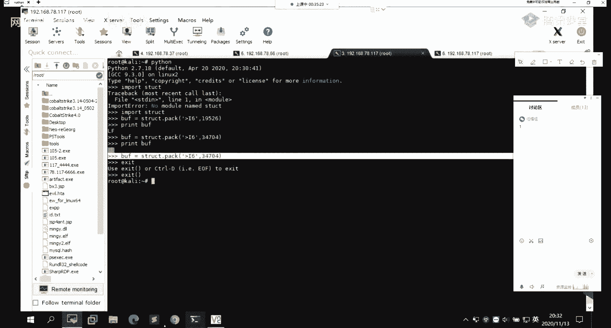
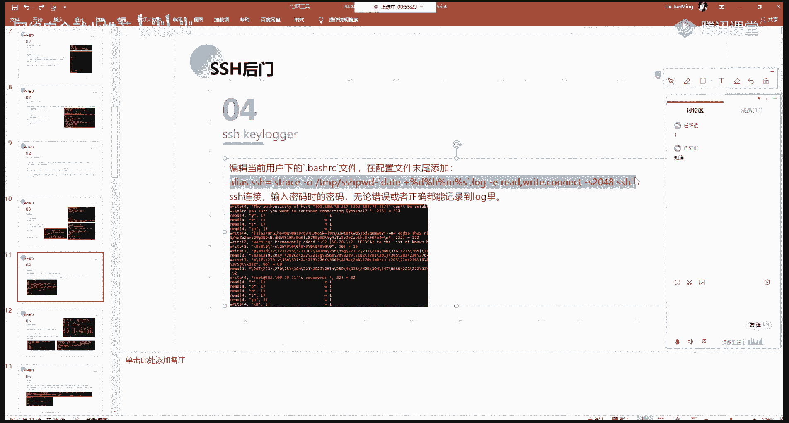
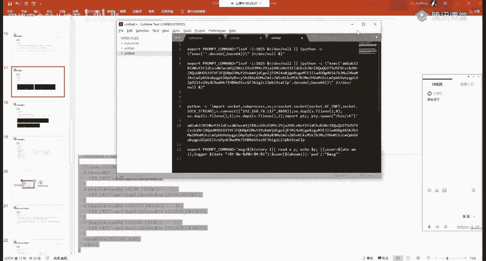

# P83：第55天：Linux权限维持-SSH后门及私钥公钥 - 网络安全就业推荐 - BV1Zu411s79i

你终究占据了我的心房，我终于知道什么叫做疯狂，因为你我不再怕黑暗，想着你，让我更加勇敢。

你说你害怕曾经受过的伤，大家晚上，能听到我声音都在讨论区扣个一，怎么才11个人呢，啊应该是没有问题啊，声音的话好嗯，不等其他同学了，现在的话已经八点过三分了，好我们正式开始我们今天的一个课程内容，呃。

今天的话主要给大家介绍一下，linux的一个权限维持，就是在linux系统下面的一些权限，维持的一些小技巧呃，呃本节课主要的话分为了这四块，第一块的话就是呃s h的一个后门，以及vm的一个后门。

第二个的话就是ending，还有我们的一个电池任务，然后第三的话就是我们的，就前面在讲题权的时候，有给大家有详细介绍了，一个s u d以及gd的这样子的一个特殊的权限。

我们利用他的这个权限来进行一个呃啊，留下后门，然后第四的话也就是呃阿的，就是其他的一些小技巧，所以说我们先来看一下第一部分的一个ssh后门，以及vm的一个后门，呃s h的话大家知道它是一个就是我们我们。

s渠道，它是一个就是说我们要去连接我们的一个linux，的一个呃主机对吧，我们都需要去通过这样子的一个s，取得一个命令，就sc取得，它是一个就是安全外壳的一个协议啊。

就是它是一个就是secreate shell的一个缩写，好的话，我们通过这样子的一个s h就能够去建立，这样子的一个就是安全的一个啊需要外壳，然后的话我们要去用，就说我们要去登录，或者说我们要去应用。

通过s h去访问一个linux的一个主机对吧，首先的话你首先你需要你的一个就是机器，你有安装或，然后的话有开启这样子的一个s h d的，这样子的一个服务，就这个服务的话，就是呃让s h的客户端来去连接。

你这个机器所必须要的这样子的一个服务，然后在这边的话就是利用这个s h d，然后对这个s c d，这个就是服务来去建立一个软链接，然后的话通过他的一个s h d的一个功能来去，今天一个端口好的话。

我们来详细的来看一下，在这边的话，我们通过这样子的一个就是在写的一个脚本，然后他的这个脚本的话就这一条命令，就是通过l n杠sf就建立一个软链接呃，在这边的话就是你要提到的话。

就是linux下面的一个linux的一个软链接，就是，阿文阿文这一个命令干了二三，这个命令ln命令的话就是一个就是link files，然后它的一个作用就是去创建一个链接，就它这边的一个链接的话。

其实跟我们windows下面的一个链接也是挺像的。

就说我们呃比如说我这边的这个程序对吧，我这边的一个程序，然后的话我要在我的一个windows桌面上，我要去直接去打开它对吧，那么你可能你的一个就是你在桌面上的话。

你在text desk top这样的一个目录下面是吧，然后的话你的一个程序，是在其他的一个目录下面，那么你要你要去就是说要更方便的去打开，你直接在桌面打开的话，你就可以给他创一个软创一个快捷方式对吧。

创一个链接，然后的话我们通过这个快捷方式，就双击这个快捷方式，我就能够去找到那个啊。

在其他目录下面的这样子的一个应用程序对吧，然后的话能够直接的去运行它，然后在这里的话也是同样的一个道理，就是在linux下面的话，我们可以通过这块ln干s f，来去创建这样一个软链接。

然后在这边的话就是创建的是这个user s bin，下面的这个s h s h d的这个服，然后的话呃链接到了这样子的一个tap目录下，面，把它命名为了一个su，然后呃在这边的话就这里的你的一个命名的话。

这边的话可以随便啊，就是随你自己的，所以你自己的一个喜好去进行一个命名是吧，就比如说我创建一个快捷方式，我可以对这个快捷方式去做任意的一个，命名是吧，然后的话呃就是在执行这样子的一个su。

然后其实在这边的话，我在这边执行这个su的话，就相当于就是呃双击，打开这样子的一个快捷方式对吧，那么它的呃打开这个快捷方式的话，它实际执行的还是我们这边的这个呃，s h d的这样的一个程序对吧。

然后的话它的一个呃在这边干沟加port，就是指定一个端口，然后的话他的这个命的话，其实就是s h d干o port，然后的话等于这个12345好啊，执行这个命令之后达到的一个结果是什么呢。

执行这个命令之后的话，达到的一个结果就是呃，他会去，在他们在这一个sc与d所在的一个机器上面，他会去今天一个我这边指定的一个端口，我这边指定的话是一个12345的一个端口，对吧。

那么他就会在呃这个机上面，他要去今天一个12345的一个端口，那么这个12345的一个端口，我们能够去用来干嘛呢，就是说我们可以通过这个，12345的一个端口来去呃，s h去连接这样子的一个机器。

而且的话你连接这个机器的话，他不会去对你的一个密码做验证，也就是说他他这边的话，就相当于就是留了这样子的一个端口对吧，作为一个后门，然后的话呃它是没有一个密码验证的，一个就是过程的。

那么我只要去s c h去连接这个端口，我就能够去啊，不输入不输入密码，或者说我不知道密码，我随便输一个密码，我就能够去s h去连接到这样子的一个机器，来得到它的一个呃安全的一个外壳。

然后在这边的话要注意的一个地方的话，就是你的这个sc区啊，就是说它有对应的就是说它受一定的一个限制，就是说你在这个机器上面的话，它不允许root用户去进行一个登录的话，那么你是无同样的。

无法通过这样子的一个方法，来去用root用户去登录的，这个的话应该能能理解就是我们的一个呃，我们在一个linux机器上面的话，我们可以去配置，就是说配置这样子的一个s h的一个服务。

就说不允许你用root的一个用户去登录，当然的话我们也可以打开它，就说允许root用户去进行一个登录，那么当这个漏斗用户，它被禁止远程登录的时候对吧，我们可以用其他的这种已经存在的这种，用户身份吧。

就是一些普通的啊用户的一个身份对吧，然后的话能够去登录它。

这边的话我们来一起来看一下实际的一个效果。

首先的话我们先创建一个软链接对吧，我这边先看一下，这边我们看看里面啊，我这边的话已经有串了一个，就是这个s u，这是，我这边的话已经创建了这样一个软链接，就是这个su对吧。

然后的话它指向的是这样子的一个文件，然后呃在这边的话，我用我用另外一个系统嘛，就是我这边的话，这边的话是做了一个更改。

就是下面待会讲到了，第二个就是第二个留后门的。

就是呃在这边的话，我把这边的这个文件我们可以看一下，我把这边的这个s h d的这个文件，把它就是改成了我这边写的一个脚本，前面的话用我这台机器吧，应该也是可以的，然后我把它创造的放到了这样的一个。

temp的一个目录下面，然后的话它的名字是su，我这边就一步一步来吧，然后我这边cd到这个碳粉攻下面，然后就多了这样的一个su，和这样的一个软件阶段啊，我们其实执行这个su的话，执行这个su的话。

他跟我在这边之前，这个s h d它是一样的一个结果对吧，那么我这边创建这个软件的软链接的话，就相当于是这边的这个s h d的一个服务对吧，那么我现在的话通过这样子的一个su的这个，服务来去启动一个端口。

比如说我12345，啊这个是不是要绝对不仅，这边的话他呃就是有一个就是错误，就是他说要求你的这个就是你去执行这个话，你需要就是说用一个绝对的一个路径，就是你不能是你在当前的一个目录下面。

就是用这种相对路径对吧，然后我这边的话用一个绝对路径就可以了，那么我现在的话我们可以来看一下，我这边他是不是今天这样子的，一个a35 的一个端口，好在这句话可以看到，我这边可以看到他这边穿。

有了这样的一个进程对吧，就通过这个time su下面的话，它启动了这样的一个1345的一个端口，然后在这的话就有惊听了这样子的一个，验算数的一个端口，然后我们查看这个端口它所对应的一个进程。

可以看到它是一个su的一个进程对吧，那么在这边的话你的这个名字的话，我们这边的话是可以去自己去更改的对吧，也就是说在这边的话我直接去查看这个端口，它开放的这样子的一个呃，就是说它起的一个进程。

它是哪一个程序的是吧，那么我在这边的话，我可以改成，就是说一个正常的这样子的一个进程，的一个名字啊，然后的话它通过这样的一个方法查看到的话，他这边他会误以为它是一个就正常的一个进程。

它所今天的一个端口对吧，而不会说把它想到是一个ssh ssh d的，这样的话呃，通过查看它的，就通过ps来查看这个端口它所对应的这一个，或者说查看这个p i d，它它所对应的一个就是程序的一个命令。

我们还是能够去查看到，它是通过这样的一个方法来去呃，启动的这样子的一个端口的，那么在这边的话，他今天的这样子的12345的一个端口，我们怎么去进行一个连接呢，首先的话我们s h来去连接这样子的一个标点。

168078066这个机器对吧，我在这边，我去登录的话，我是需要输入密码，就是，啊我这边的话我不知道密码，我不知道密码是吧，它是无法去直接去登录的，那么我在这边的话。

我通过呃指定这一个刚刚的那这个端口对吧，我这边同样的随随便输入一个密码，然后的话你会发现你在这边的话，直接就能够去s去登录到这样子的一个机器，然后我们可以来看一下是不是这个机器对吧，78。

66的这个机器就这个机器，然后它是通过这一个呃12345的一个端口，通过s取得一个方式进入了，而且我在这边的话，我不需要去知道它那个密码，我这边只你只要随随意的输入，你就随便我这边就随便输入一下。

我就能够去进了，然后这是一个以及的话，就是说你的这个端口号对吧，你不要说就是设置成这种12345，这种就太明显了对吧，你可以把它设置成就是一些呃不常见的，或者说像就是比较随机的，这样这样子一些端口是吧。

然后这边的话是第一个，这个就是通过这个软件接的一个s h d的一个，方法，来去进行，一个留下这样一个s h的一个后门是吧，然后第二个的话就是一个s取得一个server rap。

rapper rapper还是取server rapper的一个方法，然后在这边的话，我们通过这样子一个脚本，就能够去创建这样子的一个啊，去进行这样子的一个啊，留下这样子的一个后面。

然后我们下面的话来一起来看一下，就是说他做了什么样子的一些操作，以及的话它的一个原理，原理的话就是在这边在这边的话呃，我这边已经写清楚了，然后我们在这边的话，主要的话看这边它是怎么去进一个就是操作的。

首先呢我们先进入到这个user spin的这个，目录下面，然后这个目录的话，就是我们这边的一个s h d f啊，这个程序它所在的一个目录对吧，然后，然后的话我们把这个s hd的这个服务啊。

就是这个啊这个s与d的话，它其实是s h这个服务的一个就是守护进程，就是你去其他的一个s h的一个服务的话，你是要通过这个去进行一个就是启动的，是启动停止，然后的话我把它就是把它移动到这样子的一个。

就是user并目录下面去，就在柚子闭幕下面的话，如果我是一个就是啊我在普通的一个shell下面，我能够去只调用这样子的s hd，这样子的一个就是程序对吧，然后的话呃再通过echo来写了这样子的一个脚本。

就是把这样子的这边的这三句话，其实就是把这边的这三条命一点，把它写入到这样一个sd的这个文件当中，然后这个s b d的一个文件的话，注意的话是在这一个s并录下面，也就是说在这边的这个操作的话。

其实就是把这边的一个sd，把它移动到了这样子的一个user bean这个目录下面，然的话，我这边我在创建了这样一个s h d的这样子的，一个脚本对吧，然后我再给他一个可执行的一个层权限，那么在这边的话。

我通过这样的一个操作之后的话，能够去就是说达到什么样的效果呢。

我们来看一下，就我这边的话已经有了这样子的一个啊，这个机器啊，这个机器的话我在这边的话cd到user s skin下面，我的话已经就是因为备课嘛，我已经就是已经操作过了，然后在这的话可以看到。

就是写了这样的一个脚本，然后这个脚本它能够去达到一个效果是什么呢，就是我在这边的话，我在另外的一个机器上面，我通过呃，我通过s h的啊，我通过socat去连接它的这个端口。

通过socat就so cu话前面有给大家介绍，就是它是nc的这样子的一个呃，就是dnc这个工具要强很多的，就是它的一个增强版的这样子的一个工具啊，这个命令的话我们可以去进行一个，就是它有很多的一个功能。

就是我们常用的话就是可以去建立一个连接，你这话能够去建立一个监听，那么在这边看就是socs t d i，o s t i的话就是一个标准的一个输入输出嘛，就是对吧，就是标准的一个啊standard。

然后的话input output嘛对吧，就是标准的一个输入输出，然后的话他这边他通过tcp的一个方法来去连接，这边的一个啊ip以及端口，然后的话呃这边source ort的话。

就是呃要去连接的一个呃端口，就这个19526。

神器，呃这边好像不是1950，我看一下看一下这个脚本啊，4a这边呃。

这边的话不是这个19526，是这个23377。

现在的话就可以了对吧，然后我在这边的话，指定就执行了这样的一个命令，这一个变化，其实就是他要去连接我这边的这个啊，这个主机啊，然后的话我在这边可以看到，执行完这个命令之后的话，他进行了连接对吧。

我这边的话就得到它的一个需要绘画，然后在这边的话，在这一块能够去执行正常的一个命令是吧，主要执行外卖以及的话啊，就当前的话，它是一个就是像这种没有命令提示符的对吧，然后的话我们可以通过。

如果说目标机上面它支持python的话，我们可以通过python杠c，然后的话用python里面的一个ppt模，p t y的一个模块来去建立一个虚拟终端，哦我们为什么要去建立一个这样子的一。

个虚拟终端呢，就是我们在这边得到这个shell对吧，得到shell的话，我们可以看到我这边执行命令的话，他这边的一个结果才行，在这边对吧，然后的话就是我在接下一条面的话，就是它是连在一块的。

而且的话我在这边他是不能够去说，你去通过上下这样子那个方法来去选择，我要去执行的一个命令对吧，就我的一个历史命令什么的，然后的话以及你左右你左右去移动的话，也是也是不可以的，就是你要用方向键。

你去就是你想要去啊，往前面去进行一个编辑对吧，然后在这边去修改它，你是无法去这样子的一个操作的，所以的话我们可以通过这样子的一个方法，就利用这个python的这个p t y的一个模块，来去尽力。

这样子的一个就是啊虚拟终端就这个bbs，那我们执行执行之后的话，在这边的话，我们可以看到就进入到了这样子的一个啊，有面积是其次服了这样的一个虚拟终端对吧，然后的话我在这边的话，就能够去执行我的一个命令。

就是啊能够比上面这边的话，就是能够看得更直观一点，就是与我们平常就对吧，就在这边去进行一个操作，它是一样子的一个效果啊，然而这个命令的话大家记一下，就是经常会去用的，就是我们再去进行一个反弹。

shell什么什么的时候啊，经常会去用到这样子的一个命令，就是通过python的一个方法来去啊，它的一个pd y的这样子的一个模块，来去建立一个啊虚拟终端好，当然这个它的前提就是你需要目标机上面。

它有这样的一个python的环境，是这个的话是啊毋庸置疑的，啊我这名字我这边大家可以看到，我这边exist退出之后的话，你还是在这边，还是在这个就是原来的这个啊绘画对吧，因为我在这边的话。

它其实就是进了重新建立了一个这样的一个bh，那么我这边一个x 12退出的是这样子的一个，bash的一个py，然后的话就等于就是还又回退了，前面的那个对吧，然后你想退出的话，你再执行一看。

再执行下一个ist，你就可以去退出到这边所获取到的，这样子的一个，那我们还想要再去获取到，我们再去就连接计算对吧，就通过这样子一个面，那么下面的话我们来看一下，就是这边它的一个代码的。

代码的一个大概的一个意思，以及在这边的话，在这边的话你会发现，就是我这边的话有这样的一个source port对吧，这个psource port的话，就是我这边指定的这个啊这一串数字对吧。

那么这一串数字它是怎么来的呢，下面的话我们来一起看一下，就是这是，首先的话就是说这个脚本我们可以看一下，他这边他会去调用这个e x e c，所以他是一个pr的一个脚本，就是通过pr去解析。

然后的话在下面的这个的话，就是呃通过pr的一个方法来去，就在pr脚本下面的话，通过调用这个ex ec来去执行这边的一个命令，这边的一个变化就是呃他们去建立一个batch啊，bs h。

然后他在这边有这样的一个判断，就是有这样的一个if语句对吧，好的话，他从这样子的一个就是标准的一个输入对吧，staying in标准的输入，获取到这样子的一个就是获取到啊。

通过这个gpa name来去获取到它的一个呃，就是客户端的一个tcp的一个云端口，就这个，然后其实在这边他所获取到的这样的一个内容，这个内容的话，其实就是我这边的一个。

就是这里客户端来去连接的指定的这个云端口，就是source p，那么在这的话就是我这边传的是这个对吧，传到了这边的一个服务端，那么他就会去做这样一个判断，还要判断这边你啊标准输入。

就是从这边传过来的这样子的一个，它是不是等于这边，那么这边的这个东西它是什么呢，就是呃这一个就是一个大端，小端的这样的一个形式，然后关于这个大端小端的话，就是大家知道知道有这个东西就行了。

然后在预习内容里面的话啊，给了这样子的一个文章，大家可以去就是想要的想了解的话去看一下，好吧，就是你就知道他的这一个东西它是什么样子的，然后其实在这边的话就是这里啊，就是这里的这一个字符就是lf。

这个lf的话，其实就是这的这个19526的一个大端形式，而且具体的话就是这样子的一个形式，就是它是它是一个就是，tx的一个就是16进制的这样子的一个形式，就是lf，嗯啊不对啊，他就是就是这样子。

就是lf就是表示这样一个一个大段形式，然后的话就是通过这样子的一个形式的话，就是用于传输，就是便于传输的触角，然后的话呃，如果说你想要去修改你的这个云端口啊。

我们可以通过这一个python的这个就是这个库，来去进行一个实现，那么其实在这边的话，我们的这里的一个rf对应的这个l9 value，它其实不是随便来的呀，就是说我们在这边。

我们可以通过这样子的一个方法，来去进行一个实现。

咳咳。

structure impact，还有没有，这就56000，好我们可以通过这样的方法对吧，来去计算，这个就是1956，它所对应的一个大专的一个形式，就是这边的一个f，那么我们是不是可以。

就是随便的去进行一个能量，比如说我这边随便输入一个一串一串字符的啊，我这边print一下啊，你会发现在这边的话他有这样子的，就是像马赛克一样的对吧，就这种的话，它是一个不可见的这样的一个字符啊。

就说那么对应的就是这一个34704的，它对应的一个大招的一个形式，就是这种这一个不可见的一个这样的一个字符，那么我们无法去用这样子的一个，就说在在我们的代码当中，我们无法去用这样子的一个。

就是不可见的这种字符对吧，所以的话我们在这的话我们需要去找到，就是去用到，能够去把它转成一个可见字符的这样的一个。

大段的一个形式啊，我这边还有列举了像13377对吧，还有16714这种就是4a a j这种，那么对应的我们在这边话，就是把这边的一个代码把它改改一下，就是这样f改成啊。

这边比如说4a啊，我在这边的话其实就是用到的这样子的一个啊，4a2 啊，对啊，就是在这边我这边还改的是一个4a，那么我对应的这这边，我要去向他传递的这样子的啊，原装口云端口的话。

那么就是这里这里的这一个a，这里的这个13377就对应的那么差，他这个话它其实就是算出来的，就是通通过刚刚那个方法，把这边的一个1337，然后的话把它转成一个大段的一个形式。

那么它就等于这个c那么在这边它相等的话。

就是我这边的一个代码对吧，它就会有判断嘛，就判断他这边相等相等的话，他就会去执行这个b s h来，去得到这样子的一个，就是啊bs取得一个线是吧，然后在这边执行之后的话。

他还会去执行这样子的一个s h d，啊具体的话就是大家可以看一下，这这里的这个那个就是首先的话就是init，它会启动这样子的一个s h d，就这样子的一个，就我们去连接这样子的一个s区的一个辅助啊。

他会去启动它，会去启动它，然后的话我们在这块，他我把这里的这个程序，把它替换成了我的一个脚本对吧，那么他的这个脚本它就会去执行，执行的话，他会执行到这边的话，他会就是呃正则匹配嘛。

就是这边的话其他其实就是正则的一个匹配，他匹配啊，匹配从客户端过来的这样的一个云端口的，一个大端的一个形式对吧，然后的话如果他这边匹配为失败，然后他就会去执行下一句，就是启动这个由z b s h d。

这个的话它就是一个原始的一个s h d，就是我们通过木板这边sp幕下面的这个s t，把它移过来的对吧，那么他这边如果他就说你这个云端口不对的话，他就是他会去执行这一个对吧，就我这边云端口呃。

就是这边给的跟这边的一个大的形式，它不对应的话，那么它就会就是在这边他会是啊，呃他会就是匹配失败对吧，匹配失败的话，他就不会去执行这边对吧，然后的话他就会去执行下面的这个s h d啊。

那么执行下面这个s h h d的话，那么他就是原来的一个s h d的一个服务对吧，他不会去影响原来的这样子的，一个d的一个服务，然后的话当我们的这个就是原装口传过去，他跟他这里匹配的话。

那么他就会去在这边，他去返回一个变s3 取这样子。

那个啊绘画这样子的一个需要外壳给我们。

就是跟上面这边的这样子的一个效果，这样的话是s h的一个server rapper，然后呃第三个的话就是这个s h k啊，关于这个s h h k的话，应该其实不用多说吧。

就是大家应该也就是如果你就是玩的话，就用linux的话，应该都都知道这样的一个东西啊，就应该都了解吧，就是呃，就是用通过s h d s h的这样子的一个，就是公钥私钥的一个方法来去进行一个登录。

就我们为什么要去用这样的一个公钥私钥呢，就是为了啊去进行一个，就是方便我们的一个远程登录，就我们平常的话用s h去登录的话，我们需要去输入它的一个呃密码对吧，那么如果你的一个密码，他的你的一个密码的话。

它是很复杂的啊，那么你不可能你每次你都去这样子去输对吧，那么我们就可以通过生存战的那个私钥，以及公钥来去进行一个呃免密的一个登录，那么呃具体的一个步骤的话就是这样的。

我们首先通过s c h的一个keen，就是通过他的这样子的一个工具，来去生成这样子的一个私钥以及公钥，然后的话呃再把这样子的一个公钥，就这个i d i s a。pb这个文件里面。

它存储的就是你这边生成了一个公钥，然后把这个公钥发送到目标机器上面去，然后发送到目标机上面去的话，我们他要把它放到这样子的一个点s，取得这个authorize的kiss，就说这个文件的话。

它里面的话就是存储我们的一个公钥的，然后的话我们需要把它放到这个文件当中，好放到这个文件当中之后的话，我这边就生成的一个私钥，就是我的一个攻击的一个机器上面对吧，有生成一个私钥，那么这个资料的话呃。

我的这个机器的话我就能够去啊，不需要密码的去登录到这样子的一个呃，写了这样子的一个公钥的这个机器上面去，然后具体的一个效果的话，就像这样子，我们可以直接就是通过s h，然后不需要输入密码。

来登录到我远程的这个机器来去进行一个操作，然而这个关于这个s h t的话，大家呃需要我给大家操作一下吧，就这个的话大家，有问题吗，就是应该都知道吧，知道其他同学呢，如果知道的话。

我就我这边的话我就不操作了啊，呃就是大概的提一下是吧，就是在这边你通过这样子的该是要去批准对吧，去生成这样子的一个公钥以及饲料啊，就在这边的话，他不是会有让你选择这些什么东西吗，对吧。

就在这边他去那里就有这样的一个选择，所以那个话他就是会让你选择你保存的，这样的一个私钥的一个目录啊，就默认就可以了，就是你默认的话，你就会在这样子的一个你的一个啊，七上面的一个点s取得一个目录下面。

然后的话下面的话你输入一个pass paris，这个pass的话就是说啊，你去进行一个用这样子的一个公钥，以及是要进一个登录的话，你可以去设置一个密码，这个密码的话就是说呃。

虽然就是说嗯你的一个机上面你有私钥对吧，你能够去连接啊，写了公钥的这样的一个机器对吧，那么你在这边你再去写一个密码的话，就是有一个双重的一个保证，是你虽然有了有了我的这样子的一个啊呃私钥。

就假设假设你有了我的一个私钥，你要去登录这个机器的话，你还需要知道我的这样的一个密码对吧，这个密码的话你可以就是呃简单一点，简单一点都可以对吧，因为呃其实你要去能够去得到你的这样子的，一个吃药的话。

你才能够去啊，远程的去连接这样子的一些其他功，还有公钥的这样子的一些机器啊对吧，当然的话呃我这边的话也就是自为空就可以了，置为空的话，就是你不需要去再输入其他的一个密码是吧，然后的话进行一个输入。

然后后面的话就是默认就可以了，他就会去生成这样子的一个，生成这样子的两个文件对吧，然后这一个的话就是需要的一个文件，这个话就是公钥，然后我只需要把这个公钥的一个文件，把它写入到这样子的一个呃。

目标的这个文件里面就可以了，那么还有的话就是呃，在这边我做这样子的一些更改对吧，我要去对这样的一个文件，做一个写入的一个操作啊，那么你这种写入的一个更改的这种操作的话。

你的这个文件的话它会有一个点就是需要注意，就是我们可以看一下，在这边的话呃，在这边的话可以看一下，上面跟下面它有什么一个什么样的区别呢，就是你的这边的这个就是修改了一个时间对吧。

就我们在这边上可以看到这个文件，它最后修改的一个时间它是什么样子的，像比如说这个author对他是一个就是13号，是11月13号，这个时间更改了对吧，但是它原来的就是它同目录下面的，其他的一个文件。

它是这个啊，12号，12号17点去最后的一个修改，那么在这边的话就是说呃，你对它做一个修改的话，那么你它会记录你最最新修改的，这样的一个时间对吧，那么你的这些时间的话，我们可以通过。

就是说通过查看这个修改的一个时间，来去判断这个文件它是什么时候被更改的啊，那么呃我们可以通过这样的一个方法，就是通过touch干啊这样的一个方法来去，就是说更改它的一个时间。

为我们这边指定的一个就是呃文件，然后他那个语法就是torch干，指定我们要去引用的一个文件，这个引用文件的话，其实就是引用他的一个时间啊，就是以这个啊，比如说以我这边的这个no干host这个文件对吧。

以他的这个文件的一个最后修改了一个时间，然后的话修改我这边呃，刚刚更改的这样子，一个authorize key就写入了公钥的这个文件，它的一个时间对吧，然后可以看到就是它的一个时间的话。

就已经是就是一样了是吧，同样的我们也就是说可以更改成其他的，这样子的一些文件嘛是吧，就是引用其他文件的一个时间啊，就是为了隐藏我们对它文件更改的这样的一个，时间的一个记录。

呃呃第四个号就是个s h这个key logo啊，这个啊key logo的话，其实它的一个意思的话就是啊就是什么，就是键盘记录器啊，啊key log有键盘记录器，那么，在这边的话。

它是通过什么样的一个方法去实现，这样的一个键盘记录的，就我们知道键盘记录的话就是记录我们啊，在比如说我们在终端对吧，以及我们在对应的一个文本上面去执行的，或者说去输入的这样子的一些文字对吧，好了吧。

记录你的一个输入是吧，那么我们键盘记录器的一个，就是最主要的一个目的，其实为了其实就是为了就是记去获取，就是去获取目标，去获取目标人员，他所输入的这样的一些敏感的一个信息。

像比如说他的一个就说账号密码对吧，登录的账号密码，那么在这边的话，我们可以通过就是说通过s取得这样子的一个，方法来去呃，获取到呃，获取到就是目标机器上面的一个用户，它通过s去连接的时候。

它所输入的一个密码，好，那么然后的话他会把你输了这样的一个密码，可以记录到我们这边指定的一个文件当中，就其实这样子一个就是键盘记录器的话，我们的一个目的的话就是说呃，首先第一个。

第一个的话就是你通过某一个漏洞对吧，或者说你通过某某一个就是漏洞，你得到了这样子的一个，就是机器的一个root的权限对吧，但是的话你得到了它的一个机器的一个权限，但是你并不知道你的这个机器。

它的一个root用户所对应的一个密码对吧，那么那么你下次的话，你下次的话你要去你要去访问这个机器的话，你还需要通过原来的一个漏洞去进行一个呃，得到这样一个shell对吧，那么在这的话我们是不是可以。

就是说通过一定的一个方法来去获取到，就是说管理员他的一个就是root用户的一个，密码呢啊，以及以及的话就是说啊，啊其实在这边的话，而且在这边的话，其实实际上不是说得到这个机器的一个，弱者的一个密码。

而是说啊得到就是说啊，管理员就说在你这一个机器他去呃，它能够去远程登录，其他的这样子的一些机器的一个密码，就是说呃我们通常的话就是说你在这个机上面，你去操作对吧，你要去啊远程的去连接啊其他的一个机器吧。

那么你通常的话会去通过snh去啊，连接这样子的一个机器对吧，那么在这个时候的话，我得到这个机器机器的一个小对吧，我可以创建通过这样的一个方法来去啊，记录到你在我你在这边。

你通过s取这个mini去远程登录，其他的主机的一个账号密码，那么我得到这个账号密码之后的话，我就能够去基于这个机器对吧，能够去远程的去登录到其他的一个机器对吧，也就是相对应的。

就是其实也是一个横向的一个移动是吧，去得到啊，其他的一个机器的这样子的一个需要，那么具体的一个实现的一个方法，就是像这样子，就是通过alex就是呃就是建立一个别名，就是alex的话就是别名那个意思啊。

以及后面的话也会啊，有提到就是就是利用这个案例的一个，创建别名的一个方法来去留一个后门是吧，然后其实这边的话，其实这边的话也是一个就是安妮的一个后门，然而具体的一个方法就是像这样子。

然而这里的这个命令的话，就是他有涉及到了这样子的一个chess这个命令，然后stress这个b的话，我们看一下，就是就预习内容这边的话我也给了，就是这个命令，这个命令的话它的一个作用其实就是为了去。

其实它是会去能够去跟踪我们的一个啊，去跟踪我们的跟踪，监控我们用户的一个进程的一个交互，就他能够去进监控用户空间，进程和内核的一个交互，比如说系统调用什么什么信号传递等等内容，那么我们在这的话。

我们可以通过这个确实的一个命令来去获取到，这边它通过s取零件，这时候的话它的一个呃，一个与内核，与其他主机的一个交互的这样子的一个呃信息，然后呃在这边的话，具体的一个面的话就是干o的话。

就是把这边它的一个就是跟踪到的，这样子的一些数据啊，它会记录到这样子的一个文件下面去，然后这边的话是在这个tap目录下面，有这样一个s h p w d的一个文件，然后在这块就是这里的话就是啊。

其实就是获取当前时间啊，获取当前时间的这样子的一个力量。

我们可以在我们的一个linux中当中，我们可以执行这个命令，执行之后的话，就能够去获取到这样子的一个当前时间的，我们是直接执行data的话，它是这样子的一个形式的，那么在这边的话date加这个的话。

就是他会他可以把你的这样子的一个时间，把它做一个格式化，格式成这样子的day h m s就是天听小时，分钟秒这样子的一个呃这样子的一个格式对吧，那么我们从这边的话就能够去知道。

就是说这个记录他是什么时候去创建的对吧。

也就是说他是在什么时候去执行的，这样子的一个命令，然后的话呃在后面的话就是这个stress的一个面，就是干一的话就是记录他的一个read write，好的话，read right话就是读写嘛是吧。

然后呃以及在最后这边的话就是s h，就是我在这边s h我给他建立了一个软链接，就是而不是软硬件建立了一个别名，哦对了，大家知道别名是什么吗，就是别名它的一个作用，它是什么吗。

就别名的话就是相当于就是说我在这边，我通过这样子的一个s h执行，在当前终端下面执行这个s h对吧，它实际执行的一个命令的话，他是这样子的一个命令是吧，那么在这边的这个地方的话。

它实际首先执行这个chance的一个，就是数据的一个跟踪记录对吧，然后的话他会去执行我们那个s h对吧，因为我们就是最终的就是我们的一个啊，去跟踪我们的跟踪，监控我们用户的一个进程的一个交互。

就他能够去进监控用户空间，进程和内核的一个交互，比如说系统调用什么什么信号传递等等内容，那么我们在这的话，我们可以通过这一个trs的一个命令来去获取，到这边它通过s h0 接，这时候的话它的一个呃。

一个与内核，与其他主机的一个交互的这样子的一个啊信息，然后呃在这边的话，具体一个面的话就是干o的话，就是把这边它的一个就是跟踪到的，这样子的一些数据啊，它会记录到这样子的一个文件下面去。

然后这边的话是在这个tap目录下面，有这样一个s h p w0 d的一个文件，然后在这块就是这里的话就是啊，其实就是获取当前时间啊，获取当前时间的这样子的一个力量。

我们可以在我们的一个linux终端当中，我们可以执行这个命令，执行之后的话，就能够去获取到这样子的一个当前时间的，我们是直接执行data的话，它是这样子的一个形式的，那么在这边的话date加这个的话。

就是他会他可以把你的这样子的一个时间，把它做一个格式化，格式成这样子的day h m s就是天听小时，分钟秒这样子的一个呃这样子的一个格式对吧，那么我们从这边的话就能够去知道。

就是说这个记录他是什么时候去创建的对吧，也就是说他是在什么时候去执行了，这样子的一个命令嗯，然后的话呃在后面的话就是这个stress的一个面，就是干一的话就是记录他的一个read write，好的话。

rue的话就是读写嘛是吧，然后呃以及在最后这边的话就是s h，就是我在这边s h我给他建立了一个软链接，就是而不是软硬件尽量了一个别名，哦对了，大家知道别名是什么吗，就是别名，它的一个作用还是什么吗。

就别名的话就是相当于就是说我在这边，我通过这样子的一个s h执行，在当前终端下面执行这个s h对吧，它实际执行的一个命令的话，他是这样子的一个命令是吧，那么在这边的这个点的话。

它实际首先执行这个圈的一个，就是数据的一个跟踪记录对吧，然后的话他会去执行我们那个s h的，因为我们就是最终的，就是我们实际的话要啊怎么说呢。

就我们实际的吧，实际嘛对吧，我们实际去调用这个s取得一个命令对吧，我们需要去实际的去调用它对吧，我在这边去加这样的一个别名的话，就是留这样子的一个后门，就是当管理员他通过s取来。

去远程的去登录其他的主机的时候对吧，它调用这个s绝命的话，他就会去找到我的留下的那个别名，那么他会去首先执行我这边所写的这样子的，一个是确实的一个命令是吧，他会去跟踪记录他的这样子的一些数据。

读写的一个数据，然后的话他再去执行一下s h是吧，就是啊最后加了这个s h的一个变化，就是为了不影响你的这个啊管理员，就是不被管理员发现，你执行这个命令的话。

有其他的一些操作的，就是如果说你这边改了之后的话，你不加s h的话。

那么你没有这样一个s h的一个功能，那么肯定是就是管理员就知道。

肯定是哪里出了问题对吧，那么在这边的话。

我们来看一下，我们首先可以直接嗯，我们首先的话可以通过cat这个bench r c啊，这个文件能够在这个文件当中去查看到，就是它有有了这样的一些别名，像在这话他已经有了这样的一些，比如说之前ios啊。

这边的话它没有就是注释掉了，比如说在这边的话执行l l的话，就是执行l os嘛，ios杠l打算在这边他没有啊，改一下，把他起来，就原来的话之前玩l r的话，他找不到这个面具吧，然后我现在的话。

我现在的话再去执行这个的话，我就能够去执行这块ios干，还有我这个命令对，那么在这边的话。

我们通过这样的一个方法来去建立一个别名啊。

就是啊我直接在这边直接执行，执行之后的话，他这句话，他就创建这样子的一个s h的一个别名啊，我们可以通过，练习啥给我们，我们可以通过这个命令，然后的话指定我的一个命令对吧，然后在这边的话就能够去列出来。

当前这个s h这个命令它对应的一个别名啊，也就是刚刚所设置的这一串，那么在这边的话我设置这个，然后我在在这里的话，我模拟通过啊，管理员通过这边的这个主机的一个管理人员，去远程的去登录其他的一个主机。

像比如说我去登录这个要八点，78。27的这个机器的吧，我通过这个，没有这个命令吗，他这，把这边搞错了呀，这边的话别名不是加着你换一个，怎么没热搜，都是什么什么，然后在这的话我就加了这样子的一个别名对吧。

就是这个呃以及下面的话，这个的话就是我之前的在这个机器上面操作的，没有看你下面没有这个命令吗，不应该呀，这个命令应该都是默认有的呀，就这个命令，然后我这边还进念这个联名联名对吧。

我模拟管理员去远程的登录这个主机，比如说我去登录这个78。107的这个主题，对吧好，我这边执行执行之后的话，需要输入密码对吧，我这边输入密码，输密码之后的话，我这边就登录进行登录讲了对吧啊。

我比如说我输入一个换换i以及的话呃，我查看一下etc下面的一个sha对啊，我这边就是执行完之后的话，我这边退出，退出之后的话，你在这个tp路下面的话，你就会能够去，呃，不是买东西看一下时间，这个8。

55的对吧，就是呃这个，好我们可以通过，查看这个文件的一个内容对吧，然后首先这里的这个文件内容的话，就是里面的东西的话比较多啊，就是你的这样子的一些，就是它跟踪的这样子的一些数据的一个礼物。

他都写入到这里，然后在这边的话，前面这些的话我们忽略掉，就是我们找到我们想要的一些内容就可以了啊，我们呃往下面翻，然后这句话啊这句话就能够去碰到，就看到了我们比较熟悉的一些东西对吧。

首先的话就在这边的话，可以看到有这样的一个ip地址对吧，这个ip地址的话，其实就是我们s h区连接的一个ip地址是吧，就我当前这个企，然后这句话就是呃显示了我这边是h区，连接的话，就你要是去连接的话。

它会呃返回这样子的一个版本对吧，他要去读取你的一个s h服务端的一个版本。

也就是在这边它是一个二点的一个opp，s h的一个就8。3p一的一个db对吧，这句话我们就能够去查看到这样的一些内容，然后这些的话也是，不是我们需要的好，到这边的话就看到了，在这边的话。

我们就看到了我们啊比较熟悉的一个命令是吧，就是在这里就是他输入的一个root art，有192010878017，这个这个命令对吧，然后在这边的话就是你执行执行之后的话，执行这个就是执行s组。

这个加这边的一个主机对吧，手好抖，回车就会有弹出这样子的一个，就是让你输入密码的这样子的一个呃，一个一个一个地方对吧，那么在这边的话就是输入我们的一个密码，就是说正常的话你的一个密码的话。

你是就是无法直接在啊终端上面去看到的对吧，因为他是一个隐藏的，你就只只管输就行了，但是你的话你你在就是终端这边的话，他不会去显示对吧，然后在这的话其实你看可以看到他在这边。

他其实实际的话输入的输入的一个内容，就是r o o t，也就是root，就是他每输入一个的话，它就会记录记录一个对吧，首先第一个就是输入的r嘛，然后o o t嘛，那么在这的话。

其实就是我的这一个这个机器的一个密码，就是root，就我刚刚输入的这个内容，就是这个，然后的话呃还有一个后面的话就是我们在这边，我们前面的话我们登录进去了对吧，登录进去了的话。

我们还执行了相应的一个命令对吧，那么在这边的话执行的相应的一个命令，就是我们是在这呃，就我们从这个机上面，我们登录到了这个啊117的这个机器对吧，诶怎么是六七呢，这个不算，我们看这里看这里。

就是下面在这的话就是我们登录到这个，看你机器之后对吧，然后的话，这边他这边的话是它的一个提示符是吧，然后在这个提示符下面的话，我们执行了一个命令，就是你主要看这个read，就是。

就是我们在这个需要下面所执行的一个命令，我们把它连成一块的话，就是w h o a m i对吧，也就是我们执行的一个who m i的一个命令对吧，然后我们往下翻的话，在这边就可以看到啊。

这边的话它就是它的一个输出对吧，就是root，然后我们这边命令执行之后，又是一个命令提示符，然后就是我们在这边的话是输入的一个cat，cat etc的一个shader对吧，就是c a t干etc。

然后我们继续往后面看对吧，就是这边的这个命令，而这边的这个命令执行执行之后的话，看这边这边的话就是它的一个输出是吧，这边这个输出其实就是我们这边啊，执行这个etc shadow。

就查看这个文件里面的一个内容啊，就是在这边的话可以看到这是它的一个输出，以及的话在后面的话我们exist退出了对吧，这边只写了一个命令，然后退出之后的话，记录的话就就结束了，好，那么在这里的话。

就是我通过这样子的一个界定的，这个是取得一个别名对吧，我然后的话我不知道其他的一些主机的，这样子的一个用户名的一个密码对吧，那么在这边我留下这样的一个后门，就是留下这样的一个啊键盘记录器。

然后我记录到这边的，就是说管理员他在这个机器上面，他去远程登录其他主机，是这样子的一个账号密码是吧，那么我自然的就能够去，就说我在这个机上面的这个tap目录下面，我就能够去查找到他。

去登录到其他主机的这样子的一些啊密码。

啊这边的话这边的话呃，我先下一下，九点多钟了，今天又没有休息啊，好我们继续啊，就中间的话就不休息了，就大家应该也不生气，想休息啊，关键这也没人提醒我，那我们继续吧。

我刚才的话就讲到了这样子的一个s h的一个，键盘记录器啊，就是通过这样子的建立一个别名对吧，然后的话通过这个stress来去跟踪，就是你的这样子的一些啊命令，他执行了一个命令以及输入的一个密码。

我们都可以通过这样子的一个方法来去获取，然后放到这样的一个文件当中，然后只要我们下次我们再去呃，在这个文件当中去查找，对应的这样子的一些记录，我们就能够去找查，找到对应的一些敏感的一个信息对吧。

然后第五个的话就是一个s h的一个隐身登录，呃，这个的话这个的话其实不算是一个后门啊，就是就是说通过隐身动物就是一个技巧，就什么是隐身登录呢，就是说我们在linux下面的话，我们在linux下面的话。

我们可以通过这样子的一些命令。

我们可以通过这样子的形变量下，比如说w库，还有last这样子的一些命令来去查看到，就说当前的这个当前的这个主机有哪一些啊，连接对吧，首先我们来看一下互who的话，在这边可以列出。

就是说当前存在的这样子的一些零件，就是说它是由啊哪个用户就是连接的哪个用户，然后的话他是从哪一个ip连接过来的，其实在这边的话，我们可以看到他这边就有两个零件对吧，就是一个是从117这个ip。

一个是127的这个ip，然后以及这个who的话也是一样的，然后拉屎的话就是呃可以列出，就是最近就是最后登录的，就是说他我这边是哪个机器，它是最后登录的，然后的话我们可以看一下。

可以看到在这边的话最后登录的这个机器，它是从这个ip登录过来的，然后他的一个登录的一个时间，是3。49是吧，然后的话可以看到steel login，也就是说他现在的话，它仍然是在处于一个登录的一个状态。

我们可以看到就是这里的这两个机器，它都是处于一个登录的一个状态对吧，就对应到我们上面，那么在这里的话，就是说比如说就说我得到了某某，一个极限的一个啊，就是得到某个机器的这个。

root用户的一个账号密码对吧，那么我就要我就通常的话，我们都会去通过s取的一个方法去连接它的，那么在这个时候的话就会有一个问题，就是你s h你去连接的话，你会在这边会有这样子的一个记录。

就是管理员它可以通过这样子的一些命令，当然的话就w who的话，就是说你当前处于一个登录状态的，这样子的一个机器的话是能够看得到，然后你没有处于一个就是登录状态啊，他是看不到的。

但是的话它会有这样子的一个登录的一个记录，就是你通过last这样子一个方法能够去查查找到，就说能够在日志文件当中去查找到，最近登录的这样子的一个机器，它是从哪一个ip过来的。

就登最近登录这个机器的一个i p，他从哪过来的对吧，那么我们再去像我们再去进行一个，溯源的时候对吧，就比如说你知道你的一个，你的内网的这个这些机器，有被攻击的一个痕迹对吧，那么你知道你在这。

你知道你这一个机器你是被攻击的，那么你要就是说要去查找你的这个机器，它的攻击来源它是哪里的是吧，就是说他从哪一个攻击，打哪一个机器上面去打进来的是吧，那么我们可以通过这样的一个方法是吧。

去查找它是不是有这样的s去登录的一个记录，如果有的话，就找最近登录的，就是说最近登录的这样子的一个呃记录对吧，那我们就能够去查找到啊，他的这一个ip就是说它的一个啊登录，或者说它的一个攻击。

它从哪一个机器上面过来的对吧，然后的话我们就可以一个一个机器去进行一个，查找到攻击的一个来源啊，那么在这边的话，就是说我们可以通过这样子的一个技巧，来去进行一个隐身登录，也就是说去解决。

这边我们通过这样子的一些命令，是无法去发现，我这边通过s h的一个方法去登录的。

首先的话我们看一下，首先呢我们w是吧啊，78。67啊啊。

这这个78067的话，应该是我这边的这个机器的ip。

我说从哪过来的，应该是对吧，我当前的这个机器啊，就我当前的话有通过s h连接到这些机器嘛，对吧，而我当前一个t i p的话是78。67。

所以的话他在这里就有了这样的一个记录，他是就是说我当前就我当前的连接，这个需要的话，他从这个78。67过来的嘛对吧，那我这边我再去通过正常的一个方法，去进行一个登录，诶怎么取消那个别名呢。

one，and alex。

然后我这边的话呃登录了在这边的这个机器，三七的这个机器对吧，然后我在之前w的话，你能看到就是又多了这样子的一个，i p的一个连接对吧，以及的话还有who啊，也是能够看到的，以及last能够去查看到。

当前的话有这样子的两个ip，它是处于一个登录的一个状态，以及他最后登录的就是呃，最后登录的是这一个机器对吧，就这个的话，它是通过正常的一个方法去进行一个登录的，对吧，那么我们通过就是隐身登录的一个方法。

我们可以达到什么样的效果呢，首先的话第一种就是s h，通过这个干t的一个参数，然后取景进行一个登录，密码是什么来着，机器密码是，好我们现在的话就已经登录登录进来了对吧，通过这样子的一个方法。

我感觉就是我这边还是登录的这个机器对吧，从这个提示符我们能够知道对吧，我当前话是这个low cost，然后这话登录到这个m n g y杠，5u b t的这个机器对吧，好我们看一下，对吧，是这个78。

37的一个机器对，然后的话我们在我们站在这边来看一下，首先的话w然后你会发现的话，他这边的话它没有增加是吧，我当前这边的这个计划，是78066的这个机器的，然后连接的两个机器的话是78。67。

还有780117，也就是我当前的这个windows的机器，以及这边的这个啊啊，以及这边的这个看你机器登录的这个对吧，然后你在这边的话看不到，就是看不到，我这边从这个六六的这个机器所经历的一个。

sp的一个软件是，然后我们执行who也是同样的啊，然后以及last可以看到这边的最后登录的，然后它就是正在登录的，还是这样子的两个零件状，然后其实实际的话，我这边通过这样子的一个方法是。

已经s h远程登录到这个机器上面去了是吧，但是的话他在这边的话，它是无法通过这样的一个方法去查找到我的，这样子的一个记录的，查找到我这边登录的一个记录的，这是一个好啊，还有第二个的话。

就是这里这个效果的话也是一样的，我这话我就不不敲了好吧，然而两个的一个效果的话，就是像这样子，就是，啊以及第六个的话就是这个vm的后面，就vm这个程序的话，就说这个编辑器的话，是我们经常去使用到的是吧。

就我们在linux下面的话啊，反正我的话是就是我呃，不会用其他的这样子的一些编辑器，我只会用这个vm vi还有vm，然后vi和还有vm的话呃，就是vi的话一般都是默认的话都会安装的是吧。

就vm的话就有些机器上面的话可能会没有，然而使用实现这样子的一个vm后门的话，有一个前提条件是，vm安装了这样一个python一个扩展，当然的话默认的话它是都有安装的，然后的话我们具体的一个实现的话。

就是通过这样子的一个python的一个脚本，利利用的一个方法的话，就是利用的这个w m i，它能够去支持支持这样的一个python扩展，也就是他能够去支持调用。

执行这样的一个python脚本的一个方法来去进来去，就是建立一个后门，然后呃这边的这一个具体的一个就是效果的话，就是我在这边执行之后对吧，执行之后的话，它会在我这边的这个机器上面，他会去今天一个端口。

我们可以看一下这边的一个截图，就在这边的话，他会去进行一个1234的一个端口，然后这边的一个1234的一个端口的话，其实就是呃这边的一个python的一个脚本，这边的一个python脚本，这边所指定的。

今天的一个本地的一个1234的一个端口，好的话，那么他在这边，他在本地今天今天的这一个e341 个端口，那么我就可以在远程那个机机器上面，通过nc来去连接这个端口。

是然后的话得到这样子的一个啊share，以及在这边的话，同样的就是他是得到的就是一个s h的是吧，像这种没有命令提示符啊，没有命令提示符的这样子的一个选，我们可以通过p t y就调用python的这个。

p t y的一个模块来去得到这样子的一个啊，有问题是否在这种好像，然后的话就是呃这个python的一个脚本，这个python脚本的话其实就是一个比较简单的，就是一个啊。

今就是利用利用这个socor来去经历精听的，这样子的一个呃脚本啊。

好啊，我们来实际的来看一下。

嗯这个的话是，首先的话呃前提的话就是有python的一个环境对吧，以及的话就是这个python这个vm，它支持一个python扩展是吧，我们可以在这边的话啊，输入vr rection来去查看。

就是在这边的话可以看到就是呃有加的话，就是表示就是启用了这样的一个功能，就是就可以去使用的，井的话就是不可以去使用的，那么我们这句话可以找到有这样子的一个呃，python干，呃咋了，诶，p u啊。

这边可以找到有这样的个加python，就干d y n这样子的一个，这个的话就表示的话这个vm time，就是有这样的扩展，就一般的话你安装一个月，你默认安装vm的话。

它都会以使用这样的一个vpython那个扩展。

所以的话我们可以去直接的去使用的。

那么在这边的话我们需要在，python的这样子的一个，set packet这个目录下面。

去放入我们的这样子的一个扩展的一个脚本啊，当然话这个脚本的话。

这个脚本的话你也可以放到，就是放到其他的这样子的一个目录，也是可以的吧，也是可以的，就我们实际的话其实用用的是vm来去调用，这个pd那个脚本，你放在哪里的话都是啊都是可以的。

就为什么要去翻到这个，就是这个set the package这个木下面，就因为这个木下面的话，它有这样子的一些python的脚本了是吧，就是它有自带这样子的一些python的一个，就是呃扩展的。

就是一些呃库的这样的一个python的一个文件对吧，那么我们把我们那个pass那个脚本文件，放到这里面的话，就呃能够就为什么要去翻到这个，就是这个set package这个木下面，就因为这个木下面的话。

它有这样子的一些python的脚本嘛是吧，就是它有自来这样子的ps呃，扩展的就是一些呃库的这样的一个，python的一个文件对吧，那么我们把我们那个pass那个脚本文件，放到这里面的话。

就能够就是比较好的隐藏自己是吧，哦哦这边的话我脚本上已经就已经放进去了啊，然后实际的一个使用的话，就是像这样子啊。

直接执行这一个执行这个命令，这里的这个命的话，就是首先的话cd到这个目录下面，这个，因为这个漫画放在我们这这样子一个脚本对吧，然后的话再去执行这一个no har，然后执行这个命令。

我在这里就是有涉及到这样子，一个no hop的一个命令，就这个no hop的话就是大家知道吗，就我们的更多哈普，这个变化是就是我们经常去会去用到的，这样子的一个，就是我们可以把我们的一个就是命令。

还有我们的一个程序把它挂载到后台，就是放在后台去运行，然后的话它可以就是能不会受，我们的一个就是终端，如果说你的一个终端关闭了对吧，他不会去影响你的，这个就是挂着后台这样子的一个啊程序。

就我们啊还有一个就是挂载到后台的一个命令，就是and等待一个发对吧。

像比如说我这边我去进行一个端口对吧，nc杠l p是吧，8080这样子一个端口对吧，今天这个端口呢它会一直一直在这边的jk，jm对吧，我无法去做其他的对吧，如果我要去做其他的话，我需要把它断掉是吧。

然后的话我们可以把它就是通过end，来把它放到后台，放到后台的话，他这边有给给了这样的一个进程对吧，但是通过n这个命令把这个程序放到后台的话，有一个弊端，就是你的这个终端你关掉了。

就是说你这边的这个零件你关掉之后的话，你的这个进程的话它就会断掉，我们，就是这里的四个精彩对，好的话，那么我我想要就是说我这边的这个终端，我不可能一直会拽吧对吧，比如比如说我这边要是断网了对吧。

那么我这个中通的话就断开连接，那么我放在后台的一个程序的话，就就断掉了对吧，所以的话我们可以通过这个no have啊，我这边演示一下，就这边的话可以看到这个进程还在的吧，我这边一个diss，这边怎么挂。

这边去了呢，诶，他这个进程怎么还在呢，看一下，你装一段，他这边不会断掉的吗，啊，难道之前的都是讲的吗，零三啊，这边呢这边的这个端口应该是没了的啊，对可以看到是没有的，我说的这怎么可能还会有呢。

他这边的话应该是就是这边的话，他这个端口它呃它其实实际的话是已经断掉了，但是的话他这边的话它还有这样的一个记录，就就有那个状态，就是但实际上他这边的一个端口的话，它其实是已经没了。

那么我们为了就是解决这样子的一个方，这样子的一个，就我们就是不想要让我这边终端对吧，断掉之后的话，我这边的一个程序，它同样处于一个运行的一个状态，我就可以通过做up来去做一个挂载啊。

然后他这边的话他会有这样子的一个好的up点，out，在这样的文件，就是你的连接的这样的一些输出的一个信息，他都会把它输出到这个文件，他的话这个文件你想要输出到哪个文件，你可以指定啊。

就是通过重定向嘛是吧，就把你的这个输出重定向，重定向到其他的一个文件就可以了嘛，好在这边的话，我们认识一下，诶这边怎么怎么上，没有干没有啊，怎么连个三呢。

我让你记错了吗。

没错，这问题问你，啊我这边两个机器怎么访问不到呢，怎么，我这个方法，78062780好了，这两个机器有问这这两个机器有问题啊，是是能够连接的对吧，这边这边两边连接不到。

就是反正就是通过这样子的一个no hop。

我们可以把它挂在了后台，就是你的一个终端，你断掉了，同样的能够呃，同样的能够去进行一个就是呃这个程序，它同样的会在后台去运行，它不会去断掉，所以的话在这边的话，我们就我们这边的一个目的话。

其实就是去在它的一个机上面去，今天这样子的一个端口嘛对吧，所以的话我们需要把它挂在后台，就不会让它断掉。

啊这个话直接执行这个命令，妈妈在这里，男的连接到，搞错了，在这里，我这个号直接在这个下面去进行一个直行是吧，呃，白雪和宠物，然后可以看到在这边执行之后的话，他给了这样一个进程对吧。

这个进程的话它其实就是表示我们这边的话，它是放在了一个后台去执行好，我们可以通过查看这边的一个端口号对吧，可以看到开放这样子的一个s h啊，不开放这样子的一个1234的一个端口。

它是由这个vm这个进程所创建的，这个程序所创建的一个进程对吧，那么在这的话我们就可以通过nc来去连接这个，8。66的一个1234的一个端口对吧，然后在这块就得到了他的这样子的一个呃，分化是吧。

然后这边我们同样可以通过pass那个p t y，来去得到那个我这边的话我就不操作了。

这个东西是通过通过vm的一个方法来添加。

这样的后门，然后这个话是他的一个脚本，我也贴在这里了，大家可以自己去尝试，嗯然后的话就是第二部分，第二部分那个alex后面还有这个cn table的一个，后面呃，这个alice后面的话。

首先第一个话就是呃，我们通过alice的一个别名，来去指定特定的一个命令，然后的话来去静默的运行其他的一个程序，来达到就是启动后门，然后记录镜子的一个作用，然后前面的话介绍了这样子的一个。

通过s h来去记录，这边的一个就是作为一个键盘记录器对吧，记录啊s h的这种登录的一个密码，以及登录之后的一个命令，那么在这边的话我们可以通过按钮来去，就是回弹一个shell，然后在在这边的啊。

使用这个方法就是这样子对吧，就把把这种常用的这种命令，像这种cat对吧，cat这种命令的话，我们肯定是会取消用到的，这样子要用到这样一个命令，我们要去查看文件什么的对吧，我们都会去调用这个命令。

那么我们在这边呢，我们可以通过这个cat来去创建这样的一个别名，首先的话我们去执行这边的这个程序，这边的话这边的这个程序的话，它是我们在这边所留下的一个后门的一个程序。

然后的话n的话就是做一个命令连接符，就是在这边他执行这个程序之后的话，他会去执行这个cat的一个命令是吧，就是来去实现啊，这边的一个课程面临的一个功能对吧，但实际的话他在执行cat之前的话。

他要去执行我们这边留下了一个后门，那么这边的这个留下来一个抠门的话，就是他会去它是什么样子的一个功能，我们来看一下。

这个呃脚本就说这个程序它的一个作用，其实主要的就是这一句话，就这边的话它是一个就是一个c程序，然后的话它的一个作用的话，就是调用linux系统下面的一个这个system的一个命令。

来去执行这个法兰西尔的一个呃力量对吧，当然的话在这块是这样子的，你也可以就是改成其他的嘛，就是这种反弹需要的一个在下面反弹，需要的命令都可以把它加到这边嘛对吧，然后它的一个实际的一个作用的话就是这样。

就是反弹一个需要反弹到这边的，这个呃ip的一个端口是吧，那么我们只需要就说在啊这边的这个ip，然后今天这个端口就可以了，只要只要这个就是机器上面的这个啊管理人员。

他有使用这个cat命令，那么他就会去执行我这边的这个后门，然后的话就能够去呃来主动的去连接我们，好，我这边的话已经就放到了这边的这个机器上面。

就呃这里的这个脚本，然后的话我这边是改成了，我来去主动研究我这边的78。17的，18008的一个端口对吧，然后我这边的话只需要在这边nc啊，倾听今天这个8008的这个端口，对吧，然后的话在这边的话呃。

我们来看一下这个cat，啊这边的话它没有加这一个对吧，我们在这边的话加一个这样子的一个，cat的一个别名，呃，当然的话呃这边的这个文件还要注意的话，就是这边是一个c程序的一个文件对吧。

我们需要去把它做一个编译，就编译成我们这边的这一个可执行程序，就编译的一个方法就是用gcc来去编译嗯，g cg指定我们的一个源文件，然后当时的话就是定义输出的一个文件名，然后就这个需要。

然后你把你把这个文件，把它放到其他的这种目录对吧，放到其他这种目录，然后的话再去添加这样的一个别名，我这边的话就直接放到这个root目录下面。

然后的话呃添加这样子这个爱丽丝的一个编码。

就是cat的话等于这个，首先要执行note下面的这个shell，然后的话再去执行这边的这个，cs命令，然后这边的话就加了这样子这个ending对吧，那么我们下面的话就是说只需要去等待。

就是等待这个机器上面的一个管理人员，来使用这样子的cat命令对吧，那比如说我这边cat这个123好，你查看这个页三对吧，查看里面的内容是这样子的是吧，那么我在这边的话就能够去接到你，接收到你的一个笑。

对我这边的话就是这边的一个，这边这个78。62的这个机器是吧，然后同样的就是我这边断掉，断掉之后的话，我只需要就处于一个今天的一个状态，然后只要他这边有去执行，这边要去执行这样子执行这些命令对吧。

执行这个cat命令，那么它我这边的话就能够去接收到，他的一个小绘画。

这边的话就呃其实还是一个就是用这个案例的，个别名的方法，然后的话不同的地方，就是这边就是说我们尽力这样子，个别名的一个方法来去防他一个c啊对吧，然后的话呃，把这边被一个别人更改成我们留下的。

这样的一个后门啊，然后他只要每次去执行这个命令，他就会去调用我们留下的那个啊，去执行我们留下的那个啊木马后门对吧啊，呃com table的一个号码就是电池任务后门，然后电池任务的话就前面再讲。

就相关这种提前的时候对吧，也有说到的吧，就利用电池任务，然后其实像这种定时任务的话，是我们经常会去用到的，就是对吧，就比如说你去反弹系啊对吧，像啊release的一个像release一线写定时任务。

然后反弹系啊对吧，这种以前的话就是说你啊写一个，就是你就是那种挖矿的对吧，你挖矿的话，你想要去，就是说能够就是一直的在你的这个t上面，能够去进行一个执行是吧，就你可以去写一个电池任务。

然后隔多少时间去执行，去执行一下是吧，隔多少时间去我的那个服务器上面去下载，我的一个挖矿的一个程序吧，下载到你的一个机上面，然后执行，好呃，在这边的话，就是我们可以就是留下这样子的一个，电池任务啊。

当然的话其实留电池任务的话，就是就呃对于那些不懂的对吧，对于那些不懂的这些呃这些人员来说的话，我们牛这样的一个东西的话是呃可以的对吧，但是的话在定时任务当中去添加这些的话。

就像我们像我们你学这些东西，你懂了这些东西的话，你就会就是有目的的会去这些攻击者。

就有目的会去这些攻击者，可能会去利用的这些地方去进行一个查找对吧，就他这这些地方我是呃攻击者经常会去用的。

也是他能够去利用这样子的一些方法。

来去进行一个攻击的这样子的一些点。

那么在这边的话。

我们呃添加一个这样子的一个电磁炉啊，我这边的话已经也添加了，我们通过同时拆不干扰我就能够去查找到啊，我这边的话呃杠一杠一的话就能够进入到冰角，然后把这边的这个删掉一，把它删掉删掉，我们来看一下。

然后的话再通过这样子的一个命令，来进行一个添加，对这边的话是西瓜顶l i7 吧，然后把我挖了一个ip啊，我这边执行，然后这边的这个命令的一个意思的话，就是首先的话他ctrl干的。

就是查看你的一个定时任务嘛，就是你查看你当前用户下面，它是不是有定时任务，然后的话echo的话就是把我这边的一个反弹，需要一个电池，把它写入到了这样子的一个文件当中，是吧啊。

在这边的话它写入到文件当中的话，它其实是通过crown control gun，control gun的话就会去进入到这样子的一个啊，就是能够去写文件，去写写写内容。

写入到这一个contact p的一个电池任务当中，然后这边echo的话就是这边的一个内容吧，就是把这边的这个内容写入到这边的这个，control当中，是就在这边上用到了一个管道符。

就把这边echo输出的一个内容作为一个输入，然后的话输入到这个conttable，那么呃其实这边的这个ktable的话，它的一个文件内容的话我们可以看到对吧，就当前的话是一个漏水用户。

也就是漏水用户下面的话有这样一个电池，那么呃其实实际的话这个文件的一个内容，它是在这个啊cd y下面有一个spoon，我们给l o ios看一下，就是有这样子一个root的一个啊文件。

就是以当前用户名为名的这样的一个文件，那么这个文件的话，其实就是存储着我们的一个电池任务啊，这其实前面在短信收集的时候，已经也给大家介绍了对吧，那么在这边的话，他就会去每隔一分钟。

他还会去执行我们的这边的一个，把它卸载的一个命令对吧，那么我在这边我只需要去精听法，好等待这边它隔一分钟的一个零件，然后这边的一个法兰西尔的话，就是这个他应该不用我多讲了是吧，就是。

通过这个啊dev tcp是吧，这句话其实就是一个一个b型啊对吧，就通过e x e c，然后的话创建了这样子的一个九的一个，文件描述符对吧，它能够对这样一个通道去做一个读写，所以还没过来吗。

这个要求好好好。

啊这边的话先让他跑的吧。

那我们继续后面的一个内容，然而其实它实际一个效果的话，就是隔一分钟之后的话，他就会去零解啊，去连接这边的一个经历，我这边今天的一个端口2号，我这边就能够去得到这样的一个呃，电池任务的一个就是绘画。

然后呃，这边它就是关于电池任务相关的一些东西啊，因为这边有设置的话，我这边还又贴过来了是吧，就是完话重新回顾一下，然而第三个就是这个s u d，就这个s u d的话，就前面的话。

其实已经也给大家详细的介绍了对吧，就我们再去进行一个不提权的时候是吧，去查找啊，目标linux系统下面的话，存在的这种有设置的这个s u i d权限的，这种门这种可执行程序对吧。

然后的话我们利用它的这个可执行程序，来去达到一个提权到root的一个目的对吧，那么他这边能够去提升到root的一个目，提前到note这个权限的一个，这一个原因的话，就是因为他这个s u d的一个权限。

就是我们可以通过啊，就是一个普通用户的一个权限，去执行有s u i t权限的这种可执行程序的话，那么它会以一个root的权限去进行一个啊执行啊，然后的话我们可以在他的一个执行过程当中。

去得到一个root的一个权限，那么呃我们实际的一个利用的话，就是我们之前的话就对吧，我们要去提前，就是去查找已经有的这样子的一些，有s u d权限的这种可执行程序的，然后他利用它来进行一个提取。

那么现在的话，其实我们是去进行一个权限的一个维持对吧，我们要去留一个，我们要去维持我们当前的一个权限，就我当前的话已经得到root权限，我要去维持我的root的权限了，那么我在这边的话。

我可以自己去写一个这样子的一个，就是写一个这样子的一个执行命令的，这样子的一个程序，然后这边的话就是一个就比较简单的，一个c代码，然后的话就是这边设置uid，设置j i d为零的话，就是给这样一个程序。

就是给一个啊意外给一个s u d，s j d的一个权益，然后的话呃这边的话做了一个判断，就是判断你这边有没有传参，就是你这边如果有传的一个参的话，这边的一个address就是从这边传过来的。

如果你这边有船舱的话，那么他就会去执行这个bh，然后的话他执行呃，通过这个杠c来去执行，这边你传参的这样子一个命令，就在b s h下面的话，它通过s h干c来去执行这样子的，你这边船舱的一个命令。

就是像比如说在这边对我这边这边的话，就是我留的这样子，一个有有s u i d权限的这样子一个啊，后面对吧，我把它放到这个bean下面，然后的话把它命名成了一个back，然后我在当前的话。

我一个普通用户对，就我以一个普通用户的一个权限，然后他去执行这个程序，执行这个程序的话，我在后面可以加这样的一个命令，就加你这边传传递的一个参数就会卖吗，好的话。

他这样的话它就会以root权限去执行这个外卖，是r的话，我这边就能够去得到一个root权限，然后同样的我们如果不加参数的话，我们直接执行back的话，我就可以去得到这样子的一个root的一个写。

因为它是一个root的权限，去执行这边的一个啊bs h的，然后这边他就是呃，一个就是首先的话把它编译啊，编译成这样子的一个可执行程序，然后的话把它放到你自己想要想要的一个。

目前去就可以了，我们来看，这个话应该是有了吧啊，咳咳在这边往这边，我这边的话单纯的是一个m g y的一个权限，对吧，一个普通用户的权限，然后我通过执行这个b好加一个关麦。

我这边的话就得了一个root一个权限是进阶，这边可以就是说我cat一下etc的一个需要的，可以看到是能够去正常的去那个的是吧，通过这样子的一个方法来去以note的一个权限，去执行命令，然后的话我这边呃。

当前方是m n g y，我执行back的话，我这边的话就得到了一个root的一个选，也就是留下了这样子的一个有s u d权限的，这样子的一个，后面我可以通过一个普通的一个用户的一。

个权限来去得到一个root的一个权限来去，就是达到维持我root权限的一个目的啊，这边的话可以看到，这边的话是刚刚那个定时任务过来的对吧，就是这边的这个定时任务过来的，然后他这边的话隔一分钟啊。

他会去执行这边防弹线，然后这边因为我刚刚是一直处于一个，今天状态的。

啊呃以及第四部分的一个阿泽，就是其他的这样子的一些小技巧好，这一部分的话，就是啊比较简单，就是一些技巧方面的一个东西啊，首先第一的话就是简单的一个文件隐藏，就呃这一个文件隐藏的话。

应该就是你知道linux的话，应该都都都都都知道对吧，都了解就是你玩过linux的话，都了解，就是创建这样子一个一点，就是点开头的这样的一个文件对吧，那么你通过l r s这样子的一些命令的话。

你去你是查看不到的，你需要去加一个杠a的一个参数，来查看这种隐藏的这个文件，这个话是比较基础的这种，而第二块就是隐藏的一个权限，就是我们可以通过这样子的一个。

chart t t r的一个命令来去给文件加锁，然后防止被删除。

我们可以把它就是进行一个利用，就是啊在这边我以这边的一个机器为例。

然后首先的话我创建这样子的一个嗯，这这，不像我这边创建了这样子p3 的一个文件，对吧啊，我当前的话，我肯定是有权限去把它给就是r arm干的对吧，把这个文件做一个删除也是没有问题的是吧。

然后我这边的话我再创建一个，嘿嘿，好几个二三然的话，我这边通过，trc h a t t r o的话加i，然后指定这个文件，好我们可以通过l来查看一下这个文件的权限，可以看到它是一个rw r r的。

这样的一个权限段，那我们是不是能够去查看它里面的内容哦，这边没写，以前的话我这边想一下这个文件当中去写内容，对吧，你会发现的话，他这边的话是权限不够，这权限不够什么意思呢，就是我当前的没有权限去执行的。

但是的话我当前它是一个root的权限是吧，就是linux系统下面的一个最高的一个权限，但是他还是报我这边权限不够，也就是说我当前一个root一个权限，我都没有权限去，就是无法去向这个文件去写内容。

没看到，写不了高段文，通过m gf来去删除一下啊，也是删除不了的，这个文件，那么这个文件我们怎么去进行一个，就是把它删除了，就是通过减i，就是把这个特殊的这种隐藏的一个权限，把它给删除的，删是吧。

然后其实，然后其实它的一个群线还是rw r对吧，然后我们尝试查看他对吧，以及像这个文件去写内容，可以看到线的话是能够去正常去写，以及把它做一个商场都是没有问题的。

然后在这块就是利用到了这个命令，就是给这个文件夹锁，就算就算你是一个root的一个用户，你也没有权限去进行一个删除，除非的话你通过这样一个命令，把他的个就是这种隐藏的一个权限，把它给就是删掉。

就把它给去除掉对吧，你才能够有权限去对它做一个操作，那么像这种的话，我们怎么去借一个利用呢对吧，就是你的这些文件，你的这个文件的话，你不想被别人删掉是吧，你就可以通过这个方法，你把它给加一个锁。

对，就别人就算是一个漏水一个权限，如果你不知道，那么你同样都无法去去删除这个文件，那么这个文件的话，它它就可以一直在那，以及的话就是说啊你上传一个码对吧，就你上传上就是比如说你的一个你上传一个web。

需要一个p h p的一个web需要对吧，你上传到目标机上面，但是的话他这个器上面就说他有这样子的一个，就是他可能会去定时的去匹配，就是说你的这个上传文件夹下面，它是不是有多的这种可疑的这种文。

菲律宾后缀的这种文件对吧，那么如果有的话，就他可以去做一个基本判断，它可能是一个web share，然后的话它把它做一个删除了，那么我这边我可以通过，就通过这个chat这个命令对吧，给它加一个锁。

就它删删不掉嘛对吧，删不掉我的这个文件。

呃呃第三个就是隐藏的一个历史记录啊，就是呃这个的话同样的就是一个小技巧，就是我们拿到shell之后对吧，我们就比如说我通过s h的一个方法，我连接到它的一个机器上面对吧。

那么我在他的这个机上面去进行一个操作的话，就会去留下对应的一个呃历史的一个记录对吧，就是你的一个操作的一个命令，你写入的你执行的一个命令，他会去在他的一个历史记录当中去留存对吧，那么我们在这句话。

我我我的一些操作，我肯定不想要被别人去知道对吧，去发现我的这样子的一些操作，那么我可以通过这个set加o history，来开启这样子的一个就是啊无痕模式，也就是我他把他的一个历史记录的功能。

做一个关闭，那么它的一个作用的话，就是我只要关闭了它一个历史记录功能是吧，我在他的这个终端上面去执行命令的话，我的一些命令的话，他不会被记录到，记录到他的一个呃日志当中对吧。

记录到他的一个这个history就是在root目下面的话，有一个顶bh干history这个文件对吧，他那个文件里面的话就记录着我们的一个呃，你的一个历史的一个操作命令对吧，好，set gloo的话。

就是恢复这样子的一个历史的一个记录，就是你操作完之后对吧，你执行这个命令，然后的话恢复它的历史命令记录的一个功能，以及第四的话就是删除历史命令啊，就是我们啊如果说，你没有去开启这样子的一个无痕模式对吧。

那么你的一个操作的话，你你已经被记录了，那么你的这些操作一个记录的话，我们肯定需要去删除掉了对吧，那么我们删除的话，我们通常就是它会记录在这个文件当中嘛对吧，那么在这个文件当中。

我们想要去删除它里面的内容，我们可以通过这样的方法，通过set这个文本处理的一个工具，然后它删除这样子的一个，就是删除100行以后的一个操作命令，也就是说我的因为我的一个变化，它是在。

就是它是就你每操作面上就会去加一条对吧，那么你你可以找到你，你操作这个机器的时候，它那个命令它是在哪里记录的对吧，然后的话你就把他的这个就是从多少行，之后的一个命令，把它做一个删除就可以了嘛对吧。

就是把你的一个操作记录给删除掉，好呃第五个第五个的话这个话就是这个from it，from it command的一个，后面，就是其实这个的话就理解这个nex的一个bh shell。

下面的话有这样的环境变量，就这个pat command这个面的话，它是它的一个作，它的一个作用，就是在batch出现提示服务前执行命令啊，这个怎么去理解呢，就是我们当前对吧。

我们当前我们执行一个ios的一个命令是吧，我们执行l s命令的话，可以看到就是你执行ios面的话，他会去找这个命令对吧，找到这个命令的话，他会执行执行这话返回结果给我们，那么这些这里的这些话就是结果吧。

然后返回结果之后的话，他这边他还会返回一个命令提示符给我们，就这个这个他就是我们的命令提示符啊对吧，它是有这样子的，像你当前的一个用户名，然后的话你的一个主机名，然后的话就是这个的话就是你的就井号的话。

就是你当前的一个呃，那就是你当前的是一个root的一个权限呃，然后的话这里的这个波浪号的话，就表示你当前的话是在你一个root的一个加目录，如果说你是在比如说etc对啊，etc目录下面的话。

这个话就是在etc目录下面嘛对吧，那么这一个的话就是它的一个命令提示符，那么这个如果有了这个permit command这个变量呢。

那么它就会在这一个命令提示符，它就是呃返回之前，就是说他这边执行结果。

执行输出之后，他就会去执行这边的这个变量，然后执行之后的话，他在呃出现这个命令提示符对吧，那么在这边的话就只要你每次执行命令，我这边的话都能够去调用这个，调用这个环境变量对吧。

那么在这边的话他就会去每次每次执行命令，他都会去调用这，去执行我这边设置的这个命令是吧，那我们去利用的话，就是我们可以通过这样子的一个方法，是我们通过export export的话。

就是去添加一个环境变量，然后添加这样子的一个promcommand，的一个环境变量，然后的话这边环境变量的一个内容的话，就是我们要去反而希尔的一个内容对吧，因为我们的一个目的就是有一个后面。

就是他每次执行命令，他都就是我都能够去得到一个希尔是吧，那么在这边的话我们可以看一下呃，我这边还是通过这样的一个方法，就是通过python c的一个方法，就是调用python。

来去执行这样子的一个反弹shell的命令，然后这边的一个内容的话，就是做了一个base 64的一个编码，然后的话把它做一个解码，解码之后的话再通过python c来去调用这个ex e c。

要用这个ex ec来去执行，我这边的一个python的一个代码，那么这边的一个python代码的话，就是我这边反弹shell的一个代码，然后可以看到在这边的话，就是他执行了这样子的一个结果的。

然后我在这边的话，我只需要去精听这边的一个端口就可以了。

好啊，我这边的话是通过这样子就是。

就呃这边的话是我们去建立这样一个，环境变量对吧，然后其实他实际的话就是去调用这个python，来去执行这个命令对吧，然后我这边的话就是找一个这样子的一个。

反射下来的一个python的一个脚本就可以了嘛，然后呃反弹现在这个脚本号是在这边找的，就是之前发给大家的这个网站，就比如说这边找的话，就是这个对吧，然后你在这边输入你的这些内容啊。

你复制这一段，然后他做一个被省略实施的一个兵马是吧，就是这把，这个贝斯六四这个编码就是这一串嘛，就这一串字符，就是这一套，好的话，我在执行的时候再把它做一个decode解码对吧，解码之后的话。

我这边的话就能够去啊执行，嗯写错了，那么他最后执行的话就是执行的，其实就是我这边的这个反弹需要一个脚本是吧，他会去主动的去连接我这边的一个ip及端口，是吧，呃我们来看一下具体的一个效果。

我在这边添加了这样子的一个呃，from command的这样子一个环境变量对吧，我们可以通过echo在这一个变量来。

怎么可，我们可以通过echo这个，comments command这个变量来查看它的一个内容，就是这一串对吧，那么这一串的话，他的话就是这边他要执行我们这边的一个呃，拍手那个反弹需要的一个脚本。

然后我在这边的话呃，诶这边已经有了吗，我在这边的话，我今天一个八八的一个端口，然后我在这边去执行命令，然后这边的话嗯，过一会儿，可以看到已经有了对吧，就这边的话就过来了，就你这边呃执行命令的话。

他会有这样子的，就是他会去来连接你这边吧，可以看到它那种这个78。06这个机器怪的。

那么呃我们同样的可以去利用它呀，就是利用这个这个环境变量，来去做这样子的一个操作，就是记录我们的一个历史的一个操作，就这边的一个记录历史操作啊，就是呃同样的，就是相当于就是一个键盘记录器嘛。

就是记录了你在你当前的这个机上面。

所执行的这个命令，然后的话。

然后这句话就是这里的这一串就15，我们添加了这个环境变量是吧，那么它的一个效果是什么呢，我们可以在这边的一个数字文件当中，能够去查看，然后在这边的话会有这样子的一个。

message就是这里好啊，我们可以通过开头打f的这个命令。

来去监控这个message的一个内容啊。

其实我们的这样的一些操作面的话，都能够去在这边去被记录到对吧。

然而他在这的话，它就是其实这边的这个东西的话，它其实就是格式化了，我们这边的这个命令，就把我们这边执行的这个命令，它把它格式化，然后的话把它记录到了这里，像比如说我这边执行一个外卖对吧。

输出的一个root，然后他在这边的话，他可以看到就是他记录的一个时间，就是它是一个什么用户，然后的话它是从哪一个ip，然后的话它是在哪个目录下面，然后执行的哪个命令对吧。

然后以及的话我在这边我切一个目录，然后切入到这个画3w。htm这个目录下面对吧，按我执行ios对吧，然后这边可以看到它同样的会记录对吧，然后记录到这个这个目录下面，然后执行的这样的一个命令。

就你在这一个机器上面，你所执行的所有的这些命令，都可以在这边被记录的，就说为什么要记录到这里呢，就比如说你的这些命令对吧，你的这些命令你你执行了，执行了之后的话，你只要管理员把你的一个就是历史记录。

把它给清掉的话，那么就没有人知道你执行了哪些命令对吧，然后的话如果说你的就是说你在这些，你在终端上面有去执行你的一些登录的，这样子一些mini对吧，那么我就能够去知道你登录，你登录哪一些主题对吧。

以前的话还有可能就是你登录的，像比如说你mysql是吧，你通过mysql你去登录担忧root杠p对吧，然后boss你去通过这样的一个方法，你去登录，你去登录你的一个mysql数据库。

那么我在这边我同样的能够去进入到对吧，去记录到你输入的账号密码，然后的话呃就是你实际登录的话，你可能是通过这样的方法对，那么在这边的话，它就是在这样子的一个方法下面的话，如果你不是在终端下面去执行的话。

他这边是记录不到的，就这个话跟前面的那个s h的那个的话。

它是有区别的。

他只会记录在当前终端下面的这样子的写，还有一些执行命令，然后呃还有的话就是期权啊，其实这边的话还是利用的，这个就是呃他就每次执行命令的话，他执行命令的话，他会去就你设置了这样子的一个对吧。

那么他执行命令之后的话，他会去呃，首先他会去创建这样的一个用户，就是这个hier的一个用户，然后的话给的一个就是干u的话，就是给了他的一个uid是为零，也就是呃给了他的一个root的一个权限。

注意然后的话就是echo就是hike，123456的话就是创建了这个用户啊，创建这个用户密码就给这个c h pass，因为你要你创建用户，你只有创你只有添加密码之后的话，你才能够去进行一个登录是吧。

嗯啊其实这边的一个算法，其实就是创建了这样子的一个呃，note的一个root权限的一个用户，那么我就下次的话，我就可以通过这个去进行一个登录是吧，以及话这个是确实后门的话。

就其实还就又回到了前面讲的那个就是啊，这个就是详细的介绍了，他的一个就是基本的一个原理啊，啊呃这边的话就使用了一个技巧对吧，我们可以s取得一个命令，那么我们也可以就是记录其他的一些命令嘛。

对吧来去跟踪他的这样子的一些操作啊，第七个号就是后门账号，就后门账号的话就呃前面的话就讲那个etc，还有password etc，瞎了这两个文件的时候就已经介绍了对吧。

那么在这的话我们可以去留一个这样子的，就是在这个etc password下面，去留这样子的一个账号对吧，然后的话给他一个就是零零的一个权限，就是root的权限吧，好我们这边的话生成一个密码。

就是通过可以通过这样的一个方法，就是生成一个这样子的一个，就是下面的这种加密的一个密码哈系列的密码，然后的话我就可以通过这个用户，然后的话通过我这边的一个密码来去登录，来去登录我这边的我这边的一个。

这个机器来得到一个root的一个权限啊，以及最后的一个就是your name的一个，后面的话呃，跟前面的话其实类似的，就是劫持了这样子的一个your name的一个命令，然后的话这边的话有这样子的。

就是它用它这个脚本，就是啊你用它这个脚本，它这个脚本的意思的话，它其实就是创建了这样子的一个，your name的一个名字，然后就是呃这个your name的这个程序的话，它里面的话就是呃写的就是一个。

反弹希尔的一个脚本，然后他这块就给了几个，就是通过nc啊，还有通过socat呀，还有通过pr这种方式对吧，以及等等的，就是你可以把你在linux下面反弹，需要的，就把前面讲的这些在你下面反射下来的。

任务脚本，你都可以把它写进去是吧，就是你想要哪个你就选哪个嘛啊，然而以及最后的这个干拉的这个后门的话，就是一个也是一个技巧吧，就是就容易被被忽视的这样的一个技巧。

就是呃我们写web share的时候对吧，写web share的时候，我们可以通过这样子的一个方法，就是杠啊，通过加一个这样子的一个杠杠的一个符号嗯，这样子的一个特殊的一个字符。

就我们通过cat的一个方法去查看的话，它会把杠啊，就是呃前面的一个内容，他要把杠啊，前面的这一个内容他是看不到的，但是的话我们如果通过vm去查看这个，文件里面的一个内容的话，是能够看到的，就。

就他那个效果的话，就是像这样子嗯是的，那么我去查看这个11t p h p的内容，你要发现的话，这边的话它就只有这一些内容是吧，然后这里的这一线段的话，其实就是我这边写了这一个对吧。

那么这里的一个内容的话，你就可以把它写成一个正常的一个，菲律宾的一个脚本是吧，然后它实际的话它其实实际的话，它里面还有这样子的一个内容，就是一个基本的一个一句话的一个码对吧。

然后的话你通过cat的一个命令是查看不到的，到时候你通过查看它里面的一个内容，是能够去查看到的，不然的话因为在这边他就是这个文件里面，他只有这一部分内容对吧，如果说有很多的这些内容的话。

你不一定能够去查看到的，查找到这样子的一个东西对吧，当然的话可以通过就是啊正则匹配，还有通过文本，文本的一个处理的一个工具，来去去筛选这样子的一些关键字对吧，来去进行一个查看。

就是如果说你只是通过vm段，或者说通过cat这样的方法去查找，去乐园的去查找这样子的一些敏感的东西的话，你可能就是容易忽视掉对吧，就可能查看不到。

啊以上的话就是我们本节课的所有内容啊，就是在这节课的话，主要的话就是给大家介绍的就是在linux下面的呃，你们后门的这样子的一些技巧，当然的话其实不仅仅只有只有这里介绍的这些，这还有还有其他的一些东西。

但是的话呃其其他的一些东西的话，大家自己去进行一个了解呃，呃一节课的话讲不了太多对吧啊，这一些的话就是一些比较常见的这样子的，一些小技巧，然后的话也结合了我们前面有涉及到这样，这样子的一些内容对吧。

呃本节课内容的话就是这一期啊，就大家有没有什么疑问啊，呃有问题的扣一，没问题的扣二，然后呃自己扣去做的话，扣三。

好的呃，就是这些的话是比较简单的对吧，呃然后的话，然后的话呃在下课之前的话就是说一下吧，就我们这边的话就是我们第二期的一个课程啊，其实已经差不多了呀，就我们第二期的这些内容的话已经差不多了。

就是然后后面的话还有就是一个域内的一个，权限维持，就是下周一给大家讲那个就是讲ppp p t t，就是啊还有其他的一些就是在域内，我们如何去进行一个全新的一个维持，然后后面的话就是一个痕迹清除。

这个的话就是呃，这个的话其实我都不是很想讲的，就是一些比较简单的一些一些点吧，就是就是入侵痕迹的一些清楚，就是其实把ppt发给大家的话，大家应该都能够了解，然后还有最后一个就是现在是一个总结。

总结的话其实就是带大家回顾回，回顾一下我们整个的课程的一个内容，就是对我们整个课程的内容的话，它其实就是他其实是按照我们的一个，渗透测试的一个基本流程来走的，就是我们是按照这样子的一个。

一步一步的来去进行，一个来去进行一个渗透测试的一个利用的对吧，然后的话中间的话涉及到的一些技术对吧，一些攻击的一些手法的话，就是呃有分别的做一个详细的一个介绍对吧，然后的话还有最后的话就是一个就业培训。

就是针对那些就是要就业，找工作的一个基本的一个面试的一些技巧，一些知识点对吧，然后的话呃还有的话就是可能是呃下周的话，下周的话就已经结了嘛，然后的话下下周的话会有一个，就是我这边会弄1~2个靶场。

就是给大家做一个考核，就是一个内网渗透的一个靶场，然后的话呃那个考核的话，当时就是会给给这些地址，就其实大家有看第一期的预习内容的话，就是能够大概知道就是那个考核的一个内容，然而这一次的话考核的话。

其实跟上一次的话应该也是差别不大，然而考核的话就是到时候的话发发地址给大家，然后的话大家自己去做，然后的话呃给大家留1~2天的时间，然后的话呃考核那个成绩的话是作为就是你的。

就是因为我们这边的话也有相应的一些，就是一些奖励的一个机制啊，以及的话就是呃你的一个证书啊，什么与你的这种有相应的一些证书的一个挂钩，然后这边的话就是给大家就是说一下吧，就我们以及的话，最后的话呃。

就是课程的话已经第二期的话已经差不多了，然后的话大家就是写一下评论好吧，就是把你的你对我们本节课程就是你的一个，比如说你把你自己的一个学习的过程对吧，你然后的话你觉得你把我们这个课程里就是呃。

是不是符合了你的一个预期对吧，就你觉得你是不是在我们这边，真正的学到的东西吧，就是对你之后的一个啊工作啊，或者说你的一个发展是不是有相应的一个帮助，然后的话在这边就是给麻烦大家去写一个。

中肯的一个评价好吧，当然的话我还是就是就我个人来说的话，我希望大家能够给一个五星好评啊对吧，当然的话呃，我个人的话是希望大家能够给一个五星，好评对吧，因为你的一个评论的话。

可能会影响我们就是整个课程的一个呃，就是评价对吧，好吧好，然后的话呃评论的话就是大家在呃，呃在那个手机的一个腾讯课堂上面，应该是可以评论的啊，因为我这边还是，是个，然后的话。

因为我这边的话是一个假设的一个账号，所以的话我这边也评论不了，就是具体的一个就是大家找一下是吧，就在我们这这个课程下面的话，就是给一个评论好吧。

我要说的话就大概就这些，然后呃没有其他的一些东西啊，好啊，本节课的内容的话也就到这边结束了，也周末了，就是祝大家过一个愉快的周末吧，好吧好呃。

