# P84：第57天：域内权限维持-PPT黄金票据伪造 - 网络安全就业推荐 - BV1Zu411s79i

大家晚上能听到我声音，都在讨论区扣个一，应该今天能来的，应该都来的。

好的应该是没有问题啊，应该是都能听得到的对吧。

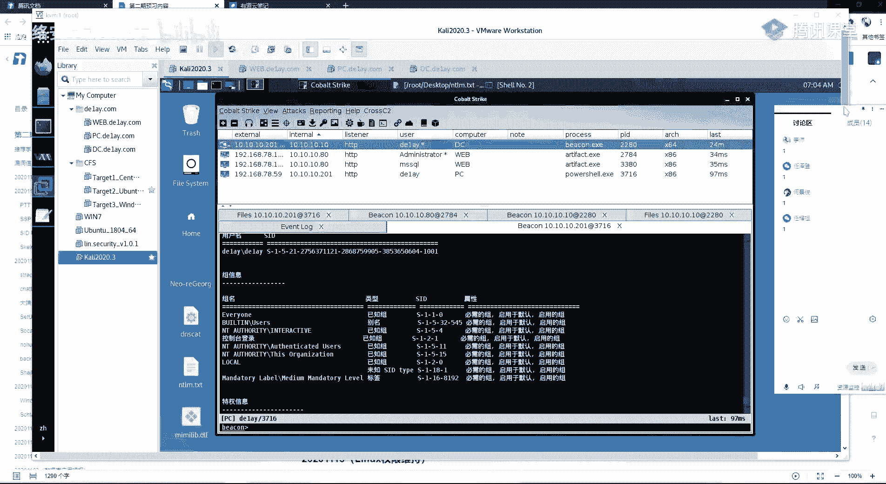

好那么正式开始我们今天的一个课程是吧，我们今天的话我给大家介绍一下，域内的一个权限维持呃，前两天的话给大家分别介绍，就是windows系统以及硬实系统，下面的一个权限为止对吧。

然后的话呃前面的这种windows的话，就是呃权限维持的话，它是针对于的是一个工作组的一个环节，就是我们平常的这种啊不是在域内的，而是一个就是普通的一个工作组的这样子的，一些群体的一个位置。

而且针对的话是只是单一的这样子的，一个机器对吧，那么我们的一个域内的一个权限维持的话，它的一个特点就是就是域的一个特点是吧，就是你的一个域呃，我们知道就是说你的一个玉的话。

他呃最重要的一个点就是说最重要的一个地方，就是在这一个区域内的话有一个预控对吧，然后的话这个预控的这个机器的话，就是我们要去渗透这样子的一个预的话，预环境的话，我们的一个最终目的就是去拿到预控对吧。

啊前面的话前面的这些内容的话，像横向移动啊，还有的话啊等等的一些，就是呃权限的一个呃提升等等对吧，好的话，在主要的话就是前面的一个横向移动的时候，以及的话呃，域内的这种密码的哈希的一个获取等等。

这些东西对吧，我们其实已经能够去得到了，就是说前面已经有介绍了，就是得到预控的这样的一个权限是吧，那么我们在这边，我们得到了预控的一个权限对吧，那么我就得到了整个域的，就说能够去对这一个域内当中的。

所有的一个主机都去进行相应的一个操作对吧，那么我得到了预控的一个权限，我就能够去得到预这一个整个月的一个权限，那么我们要去维持的一个权限的话，就是说要去维持你在预控的一个权限对吧。

因为只有在预控的一个权限的话，才才是最高的，或者说就是最大的一个权限是吧，也是最有意义的一个权限，那么我们本节课在讲预期内的一个权限，维持的话，主要给大家介绍这四点，就第一点的话就是这个p p t。

然后的话在本地官方会给大家介绍，就是说我们的一个黄金票据的一个伪造，就说再去进行一个域内的一个权限维持的时候，好的话，第二个的话就是s s p，而第三个是这个character p啊。

第四个是s i d history，当然的话其实在域内的一个权限维持的话，我这边只是列举了这四个，就是我们常常用也是常见的这样子的，当然它不仅仅只有这一项，就是因为，因为内容的一个原因对吧。

我不可能把所有的东西都给你讲全，就讲不全的，就是说说实话，就是说包括前面的很多的一些内容，都不是说很全的，大家大家要理解，就是因为我们就说我们的一个课程的话，就呃我们的一个课时的话就是囊括呢。

就是说呃有很多的一个内容了，就完了的话，要在这样子的一个课程当中的话，就把这些东西都给大家去讲清楚的话，就是呃必不可少的话，就是内容的话不会很全，当然的话就是呃最常见的也是最常用的。

而且而且的话就是你必须要去掌握的，这些东西的话，其实我们在呃本在课程当中的话，都有给大家去介绍的好，首先呢我们先来看一下，第一个就是这个ppt t p t t的话。

它的一个意思的话就是pass the ticket，也就是呃传递我们的一个票据，然后说到这个票据的话，就是呃我们再来回过头来，就是回回看一下这样子的，一个在前面讲的这样子的一个。

windows的一个认证的一个机制对吧，然后的话涉及到了这样的一个预认证，那么在预认证当中的话，就有这样子的一个ticket的一个票据对吧，这个票据的话它是呃，这个票据的话。

它是网络对象互相访问的一个凭证，也就是我们要去在域内去访问到，其他的这样子的一些网络的一个服务的话对吧，我们需要有这样子的一个票据对吧，就用我上次给大家上课，给大家举了一个例子是吧，这个tick的话。

就相当于就是你去坐高铁的一个票对吧，你需要持有这个票，你才能够去呃上才能够去呃上上高铁对吧，那么这这一个票据，如果说我们能够去伪造他对吧，去伪造他的这个票据对吧，就说我原本的话不是这一个人。

就是说但是的话我通过伪造，伪造它的一个票据吧，比如说把他这个就是票据的一个信息什么的，对吧，我把它更改成我自己的对吧，那么我就能够去实现，就是呃我没有去买票对吧，但是我伪造了这个票，伪造了这个票的话。

我同样的能够去呃上上这样子的一个高铁对吧，然后在这在这里的话就是在这里的话，就是我们的这样子一个票据，他是去一个访问的一个凭证对吧，那么我们在这边去伪造这样的个额票据，其实的话是伪造这个t gt。

就是说我们的一个这边要去介绍的这个呃，黄金票据就是去伪造一个tgt，那么这边的一个伪造777的话，我们来看一下七七的话，它是用来生成一个7k的一个票据对吧，那么我们伪造了这样子的一个。

就是说生成这个票据的这一个票据，那么我就想生成什么票据去，就生成什么票据对吧，就相当于就是说你的这个票是吧，我就嗯就我控制了是吧，我控制了就是那个买票的那个机器是吧。

那么那个机器它是用来去生成我的一个票据，生成我的一个就是高铁票的对吧，那么我控制了那个机器的话，我就能够去想生什么，想生想生成什么票，想生成谁的票。

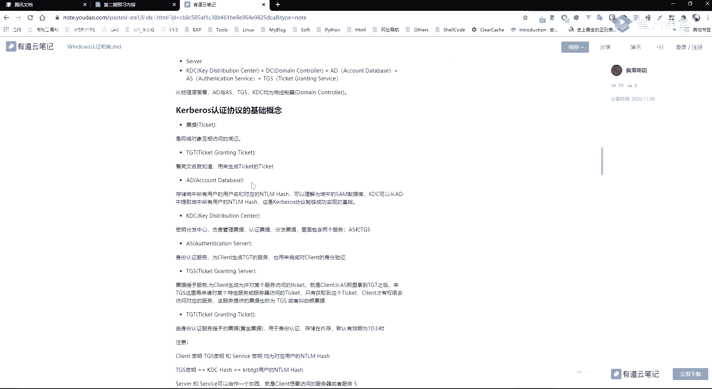

或者说想生成什么时间的一个票，都是可以的对吧。

然后的话呃我们来看一下，就是这个黄金票据它的一个伪造的一个原理，而在这边的话要去进行这样子，一个黄金票据伪造的话，主要的话就是在呃前前面讲这个windows认证的时候，和这边的一个2。2的一个步骤。

就是第二步，第二步呢，这边的话有一个as确认client端，登录者的一个用户身份，然后呃在这边的话我们来看一下，就是这边的这一个步骤，就呃再重新回回看一下这样的一个步骤，好吧，呃在说之前的话。

我问一下大家，就是可，我问一下大家，就是大家对这个windows认证的这一个，就我这篇文章大家看懂了吗，就理解了吧，有大概的一个就是印象没有，理解了理解了有印象的，扣一扣个二。

就理解了这边的这一篇文章里面的一个内容，以及就是啊理解了这样子的一个预认证，它的一个基本的一个过程的话，在讨论区扣个二好吧，我看有多少同学就是理解了这个，n t m了解一下tm这个的话。

应该这个的话是最好理解的呀对吧，就他的n t m的这种认证的话，cp的话，不太了解，就我前面的第前呃，前几节课的话不是详细的给大家讲的嘛，就是大家在课后的话还是不理解吗。

这个caps认证流程有没有去看我的，就是跟着我的那个回放，就大家看回放的话，可以就是加快一下速度嘛是吧，就是我可能就是因为平常讲课的话，可能呃思维的话，因为你要去想嘛对吧，所以的话语速什么的话。

可能会稍微会慢一点是吧，但是大家看回放的话可以加快一下速度的话，这样子的话听起来感觉会好一些，就就就一位同学吗，对啊，所以的话它才是一个就是比较难的一个点吧，就是难点吧，好吧呃。

这个的话大家大家自己再去，就是多去看一下我这篇文章吧，然后的话我跟着回放的，我的一个讲讲解去理解好吧，然后在这边的话我们来就是重点看一下，本节课要去涉及到这一个就2。2的这个as。

确认client端的一个登录者用户身份，然而在这边的话就在这一步前面的话，就是去请求身份认证对吧，那么首先的话，第一步的话就是用户的一个登录是吧，有用户登录的话，需要输入用户密码的一个信息。

然后的话输入用户密码信息之后的话，他在客户端它会把我们那个密码，它会生成一个ntm的一个哈希对吧，然后的话这个哈希的话，其实就是我们的一个开源怎么样，那么这个卡client密钥的话。

其实是我们输入的一个密码对吧，它所计算生成的一个题目那个哈希是吧，然后的话呃它生存这个密码之后的话，他会客户端它会向a s就是我们的这个as，就是身份认证的这个服务对吧，去进行一个认证的一个请求。

去认证我的这样子的一个用户，它用户它是否存在对吧，就如果说它不存在这个用户的话，那么我这边的一个请求，肯定是就是就我这边的这个访问的一个请求，肯定是访问不到的是吧，那么他这边确定了有这样子的一个用户。

之后的话，他就会去呃，确认客户端的一个登录者的一个用户身份，他首先是会确认呃，他客户端说就这边的客户端的话，其实就是我们输入的这样的一个用户名对吧，他首先会去确认我们这边输入的一个用户名。

他是否在就是说在我们的一个k dc，或者说在我们的一个ad当中，他是否有这样的记录是吧，如果有的话，就说明我们有这样子的一个用户，那么有这样的一个用户的话，它就对应的有这样子的一个密钥的一个信息，对吧。

然后在这边的话这个这一个步骤步骤的时候，他并没有发送我们的一个密码，就是没有把我们这边的一个client密钥，发送到我们的一个s3 s区，然后的话下面的话就是as，他会去确认。

我们那个客户端的登录者的身份对吧，那么他在在这边确认，就是他收到我们的一个这个认证请求之后，他会把我们的这个用户名的一个信息，他会去在他那个d数据库当中去查找的，然后查找到对应的这样子的一个用户名的。

一个nt m的一个哈希对吧，然后的话再根据这一个呃，ntm就是对应就是用户输入这个用户名，他在这个数据库当中所找到的，这个n t m的卡西，而去生成这样子的一个client meal。

就这边的这个client密钥的话，跟我们前面的这边client密钥的话，它其实是不一样的，就是说如果说他的一个用户名以及密码正确的，那么它的这个client密钥肯定是一样的对吧，如果说不一样的话。

就说你的一个密码输入错误了，那么这边的一个密钥的话肯定是不一样的，然后他通过这样子的一个client密钥的一个，就是呃这样子的一个方法，就来去确认你的这样子的一个呃密码，就说你客户端的这样子的一个密码。

是不是呃正确的，那么在这边的话，它会呃会client去响应这样子的一个消息，就是message i ge message b，首先message a的话它会用我这边的这个client meal。

它所生成的就是呃在s上面生成的这个克莱因，怎么样来去加密我们这边的这个筛选key，然后的话他这边用这样的一个课程，怎么样加密这个社群，qq的话，它发送到客户端对吧，然后的话因为在客户端的话。

他同样的有这样子的一个client层必要，所以的话，如果说你的一个输入的一个用户名，与他的一个ad数据库当中的，一个用户名的一个密码它是一样的，那么这两个科研成要它肯定是一样的。

也就是说我这边呢这个在客户端能够去解密，这边用呃，用这边在s上面生成的这个client一来去解密，得到里面的一个筛选key，然后的话呃还有一个message b，message message b的话。

它是使用我们的t g s的一个密钥来加密的，一个t gt，这个t g的话就是用来去生成密钥的，这样子生成啊，不是生成一个就是生成ticket的这样子的一个，ticket对吧。

然后的话他这边message b的话，他会去使用这个tg s的一个面，就tg s的这个面的话，也可以就是呃等于一个k dc的一个面，以及等于这个呃cabas用户的这样子的，一个nt m的哈希值对吧。

这个的话前面呃有给大家强调了，强调了好几遍是吧，然后的话他在这边的话，他用这个就是cabcabs，这个用户生成了这个t g s的一个密钥，去加密这个t g t对吧，然后的话客户端它会发送到客户端。

但是客户端的话他没有这样子的一个呃，就是k dc的这个n t m哈希也是这个cap呃，就是k r b t g t这个用户的一个ntm哈希，他没有这样子的一个对吧，因为这个哈希的话它只存储在这样子的一个。

就是在kd c上面，也是存存储在我们的一个月控上面，只有在域控上面，它才有这样子的一个特殊的一个，k r b t gt的这个用户啊，那么在这边的话，就是说他在这边他会有这样子的，就是很关键的一个点。

是就我们这边的这个七七的一个作用，就是去生成一个额票据，这个票据的话就是去访问我们的一个呃，网络对象的是吧，那么就像我前面给大家举了一个例子，我伪造它的这个t gt，那么我就能够去伪造。

就是我觉得能够去伪造啊，所有的这样子的一个ticket，一个票据是吧，那么在这边的一个黄金票据的话，也就是这边的这个ttt啊，就是，伪造的这个777，也就是伪造了这样一个环境票据。

就我们通常的话会说是会把它说成一个黄金票，价，就是呃golden ticket，golden ticket这样子的一个东西啊，好呃，这边的话他就是一个就黄金票据，伪造的一个原点。

其实就是我们刚刚有给大家说的对吧，呃首先的话就是这个kdc，它会返回一个message b对吧，然后这个message b的话，他是用这个t g s的一个密钥去加密的，这样子的一个筛选t的是吧。

还加密这样子的一个t g t的，我们，在这边的一个message b对吧，message b它是用这个t g s的密钥，来加密这个t g t的，而这个t g t当中的话，有包含有这样的一些信息是吧。

就包括了筛选key是吧，然后的话呃，当我们就是说当我们攻击者获取到这个k i v，t t t这个用户的一个n gm哈希之后的话，我们就可以主动的用这个用户的一个哈希。

来去呃，作为一个t js的密码对吧，就我们这边的话。

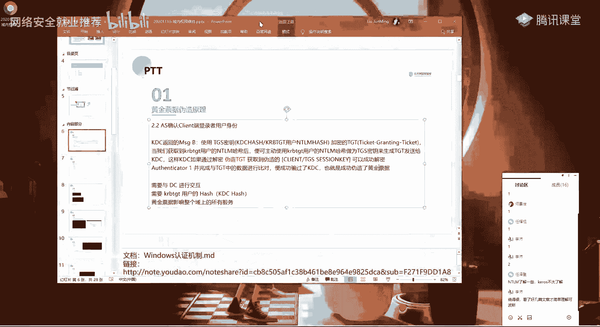

它是用t g s的一个力量，来去加密这个t t t的对吧，那么我在这边的话，我通得到了这个这个k i b t t t，这个用户的一个n t m哈希，那么我就可以用这个哈希来去生成。

我想要的一个t t t t t对吧。

因为他确认他去认证的话，就他会去认证这个t js会必要嘛，就是在后面的这个步骤的时候。

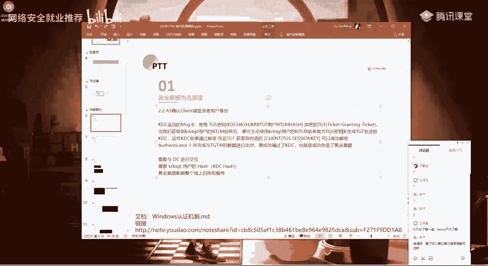

在他把在客户端它会像我们的一个，这个，这边它是呃s确认客户端，然后的话客户端向t g s发送这个服务，的一个授权请求对吧，在这边的话它会有这样的一个，就是你需要因为在客户端呢。

它无法去解密这个777是吧，因为他没有tj s的密钥，所以的话他的这个内容的话，他会把他带入到这样子的一个请求当中，他会就是代入到像t g s请求这个服务授权的，这样子的一个呃请求当中。

然后的话他在这边的话就会有这样子的一个，就是用这个t g s的一个密钥所加密的，这样子一个t7 t对吧，那么在这边的话这个t9 s的话，我们获取到了他的一个t g s，与他这边的这个t js的密钥的话。

肯定是一样的对吧，所以的话我这边通过这个7g s的获取到的，这个七七，什么样来去生成我想要的一个7g t是吧，然后的话把它再去做一个加密加密之后的话，把它的一个内容发送到这个t g s上面去对吧。

那么他在t几s上面的话，它就能够去解密，我这边用t g s所加密的这个数据，然后的话得到我这边伪造的这样的一个七，七七是吧，那么他得到这个我伪造了一个契机之后的话。

他会去就是生成这样子的一个七品的票据对吧，然后的话发送到客户端，然后的话再由客户端向我们的一个就是服务发，发起请求对吧，好我们通过这样子的去解密，这个就通过t g s这个密码来解密它来。

然后他来伪造这样的筛选，t又伪造这一个七七的一个数据，然后伪造成之后的话，我们就能够去骗过这样的一个k dc的，一个就是认证对吧，然后的话也就是成功了伪造了一个环境票据，然后这边的一个黄金票据。

他伪造的话有这样子的，就三个三个点，第一点的话就是需要与dc去进行一个交互，也是也就是需要与我们的一个预控，去进行一个交互对吧，因为我们这边的话伪造这个t gt伪造之后的话。

我们需要去发送到他的一个tg上面去对吧，呃发送到dc上面的那个tg s，因为t g s的话它是票据收益服务嘛，它是用来去生成它的，一个就是生成那个呃票据的对吧，生成一个ticket的，那么在这边的话。

他就需要去dc去定一个交互的吧，去把我们伪造了这个7g t，就是我们把我们获取到这个t t s的一个密钥，然后伪造的一个t tt发送到tg s上面去，然后话再访得到他的。

就是访问其他服务的这样的一个tip对吧，然后的话第二个的话就是需要这个k i d，t g t用户的一个哈希，也就是这个k dc的一个哈希，就是我们的也可以，就是说是一个t g s的一个密码。

t t s mia，然后第三个话就是黄金票据的话，它是影响整个预算的所有福啊，就因为呃这个的话应该能理解吧，就是影响整个预算的所有服务，因为我们在这的话我们得到了这个用户，就是在域内的计算机。

它的这样子的一个服务的一个访问对吧，他都会去育空去进行一个一个一个交互，然后的话在域域内的这样子的一个，预认证的一个过程当中的话，就是他会去呃，他会去用这样的一个tg s的一个密钥，来去生成呃。

来去加密我们这边的一个t7 t，来去生成我们的一个ticket是吧，那么我们我在这边的话能够去伪造这个七七，也就是我能够去伪造就伪造生存去访，就是去访问遇上的所有的这种其他服务的，这样子的一个票据吧。

我那么我就能够去访问，遇上的所有的这种服务是吧，啊呃黄金票据伪造的一个条件，呃主要的就是这四点，首先第一个的话就是你要获取它，获取到它的一个域名称，第二个的话就是遇到一个s d值。

第三个话是遇到这个k i b t，g t账户的一个密码哈，希然后第四个就是伪造了一个用户名，这个用户名的话你可以是任意的，就是你可以围绕任意用户的用户名，是这样的一个呃票据。

然后具体的一个步骤的话就是这样子，首先的话呃我们第一个方法，第一步的话就获取我们的一个域名称对吧，那么获取域名称的话，我们怎么去获取呢，大家直接就直接执行外卖对吧，你直接执行外卖之后的话。

就有这样子的一个dna dna对吧，啊其实前面这个话就是我们的一个域域名对吧，后面的话就是我的一个在玉的，就运用运用户名是吧，在域内的这样子的一个delay的用户名。

那么它的一个域名称的话就是这个delay。com，就是要加一个点com，就大家如果有自己去搭建这样子的一个，预环境的话，你再去进行一个配置的时候对吧，你要去填这样子的一个域名对吧，就是啊低了一点。

com，好的话，第二个的话就是usd，就usd的话我们可以通过humi干过来去得到，就是说当前的，而当前的用户的详细的一个信息是吧，那么我当前在域内的话，我执行这个面的话，它会有这样子的一串。

就是我可以看一下，当前的是这个delay的这个用户对吧，然后他的这个delay的御用户的话，他那个s i d是这样子的，好在最后面的话有这个1001对吧，这个1001的话是那个ie。

就我们前面在讲那个就是windows的，在前面讲windows的那个凭证获取的时候对吧，有有给大家介绍的吧，就是你的这样子的一个呃s d值，就是在这个s d值的话。

就是每一个用户都有一个这样子的一个s d值，都有一个这样子的唯一的一个s d值，在后面讲这个s i d history的时候会有介绍，就是每个用户都有自己的s i d。

然后这个sd的一个主要作用是用来跟踪我们的，一个就是呃，控制用户连接资源时候的一个访问权限，也就是我这边的一个sd的话，代表了我能够去访问临界资源时候的一个权限，对吧。

那么我这边像在这边呢一个sd k思维的话，就是我通过在我的一个用户当中，加上这个history的一个sid，那么我把我把我就是admin的这个用户的一个，s i d把它加入到我的一个psv当中。

那么他在去访问这样子的一个域的时候，他会用它会具有一个admin的这样子的一个权限，就是呃现在可以看到这边对吧，那这样的话就是我这边的话已经就是，而且把这样子的一个灯面的这个，用户的一个sd是吧。

我们可以看到add面的应该s的话是500，就是他的id是500是吧，然后的话我把他的这个admin的这个管理的，一个用户的一个s i d，把它就是加入到这个history当中。

它实际的个s i d它其实是这样子的，好的话我们就能够去就是啊能够去得到，就说就当前的这个用户，能够去得到这样子的一个admin的这样的一个群像，在呃待会的话再给大家细讲，然后在这边的话就是呃。

我们把这个id就是把后面的这一个1001，就这个一类用户的这个i d1001 ，把它给去掉，那么前面的这一部分就是遇到一个s i d，然而第三步的话就是遇到这个kr v t t t，账户的一个n9 吧。

哈西，或者说他一个a e s的一个，256的一个词是吧，就是这个的话是我们必须要的，就是必须就是必要的这样的一个条件对吧，你只有有了这样一个用户的这个ngm的卡西。

你才能够去伪造我们的一个c g t对吧，那么我们如何去获取这一个啊，我们如何去获取这个t k r b t t t t，这个账户的一个哈希值，我们可以通过mini cut的这个啊dc s y n c。

就这样子的一个功能来，去获取到指定的这个用户的一个按键，的一个哈希，然后的话，好的话在这边的话要注意的话，就是你的这个就是你啊，在获取这个k i p t t t t的这个账户的时候，获取这一个账户。

开一个前排还行的时候，要注意的话，就是你的一个权限，就是你的这个要获取它的这个哈希值的话，你首先的话你的这个用户权限的话，你首先需要是在域内，就是说你是一个御用户，然后的话就是说你的这个你用过的话。

你需要有一个就是管理员的权限，就是它是在那个呃admin的一个组当中，然后所以的话就说所以的话就我这边的话，我们都这样子的一个啊p t t，就是去进一个黄金票据的话，其实它是一个就是域内的一个权限。

维持的一个手段，就我只我只要知道就是说这样子的一个kb t t，就通过这样的一个方法获取到这个用户，它的哈希值，我就能够去伪造我我的一个票据对吧，然后的话只要他的这个k p t gt给一个用户。

它这个nt那个哈希值它不更，他不更新，他不修改，那么我就能够去一直的去得到这样子的，一个预的，就是他的一个访问的一个权限是吧，这里的话应该能理解吧，唉我的因为这样子的一个就是说它的一个票据。

它是影响整个预算的所有服务是吧，啊呃我们可以通过这样子的一个方法。

来去进行一个获取。

我们来看一下。

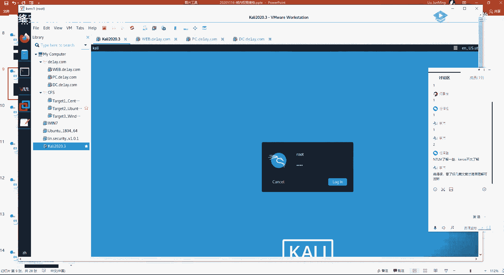

呃首先的话在这边的话，行。

我们可以通过这样子的一个linu，然后我们这句话来就是，我们在这边的话我们来看一下，就是我通过这样的一个命令，我就能够去得到它的这样的这个k i b t t t，这个用户的一个哈希值，就这里好。

在这边的话就我单琴的话是一个呃delay，就玉就是这个delay域下面的，这个delay的这个用户，就一个预用户，然后的话我通过我得到这样子的一个，用户的一个权限。

然后我之前这样子的一个呃mini cf，就其实呃我我在这边的话，就是说我只是你得到了这样子的一个，就是只得到这样子的一个用户，就是这个delay这个用户它的一个群像，就其实际的话我们去权限维持的话。

我们是就是说已经得到了他的一个，最高的一个权限是吧，就其实就已经得到了预控的一个权限啊，那么在这里的话，我是就假设我只得到这样子的一个delay，这个用户他的一个权限是吧，然后的话我在这边的话。

我可以通过这样子的就是这个域内的一个用户，然后的话通过呃，这边的一个票据的一个传递来去得到，就是说访问预控的这样的一个权限。

然后的话再通过相应的一个方法来得到，预控的一个呃shell。

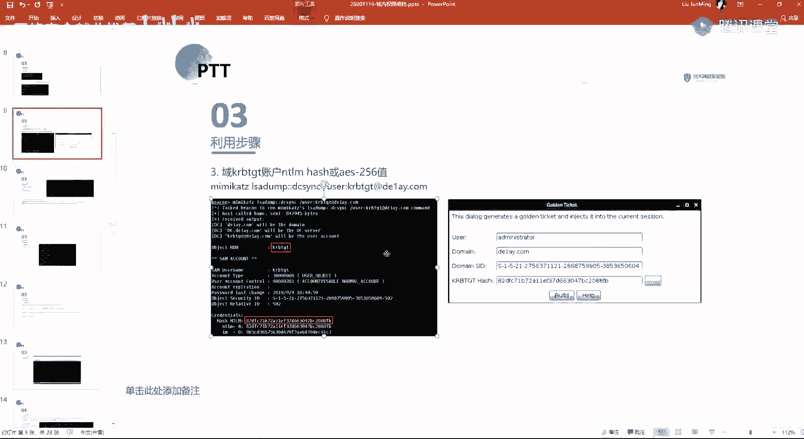

就我这边的话，以这样子的一个例子来给大家就是呃演示好，在这边的话，我们来看一下这个命令它的一个构成。

就这里这个命令的话就其实就包括了刚刚，呃这个面的话我们来看一下，就是用到这个lsgp，然后使用的是这个dcs y n c的这个模块是吧，然后的话这边干u的话，指定我们要去获取的这个用户好啊。

从后面指定我们的一个域名针，好在后面的话指定我们的一个域名称对吧，就表示我在这个域内当中去获取这个用户，它的一个mm的一个哈希，而其实在这边的话就是说这个dcs y c的话。

它同样的也能够获取到其他的这样子的一个，用户的一个提瓦系，就是我们可以在这边，就是改成我们想要去获取的一个用户。

然后的话单独获取到他的一个ntm的一个，哈希值。

好在这的话我们可以看到我这边的话，已经获取了他一个nt m哈希是吧，就这这一串就这一串就是他那个哈希值，然后的话我们在这边获取到它，一开机子之后的话，我们可以去进行一个就伪造。

我们的一个就是黄金票据对吧，那么在这边去伪造黄金票据的话，我们通过什么样的方法呢，我们可以就是说我这个话是在cs当中，就cs当中的话，它已经有了这样子的一个功能，就你可以右键好，右键选择这个x。

然后选择这个golden ticke，这话就是我们的一个就是黄金票据啊，the golden ticket的话就是我们的环境配置，然后在这的话我们就可以去选择，而不是去填写我们的一个信息。

就填写我们要去伪造一个信息，首先的话就是我们要去伪造的一个用户，是我的话就伪造的是一个mini选择的一个用户，然后的话你可以伪造任意的一个用户，然后dm的话就是这边看指定我们的一个域名称。

然后第三个这个dom s i的话，就是我们这个域的一个s i d，也就是我们前面就我们在这边可以通过，首先的话就换麦对吧，得到我当前的一个域名称对吧，delay com就在这个域后面的话。

域名后面的话接我们那个点com，就是我们那个域名称嘛对吧，好的话，我要去得到我的当前的一个sd 9 shell外卖，就得到当前的一个预预的一个s，就这一部分是吧，就这一部分就是我们的一个u s i d。

然后的话每一个运用户的话，他的这个i d的话它是不一样的是吧，那前面的这一部分的话，它其实是一样的，就是表示的是我们那个域的一个sd，然后我这边的话只需要copy的对吧，把它放到这边来，对吧。

然后的话我们那个k r b t t e的一个哈，希然这边的一个这个用户的哈，希的话，我们刚刚其实已经通过这样子的一个，就是通过我们的呃，那个d c s y n c的一个模块对吧，已经获取了他的韩信。

然后的话我们可以在这边直接去选择，就是在cs当中的话，它会记录啊，那记录我们这样子的，就是通过相应的一些方法获取到这些哈，希值都会记录到这里，然后我们可以选择一个对吧，我们选择选择一个啊哈希啊。

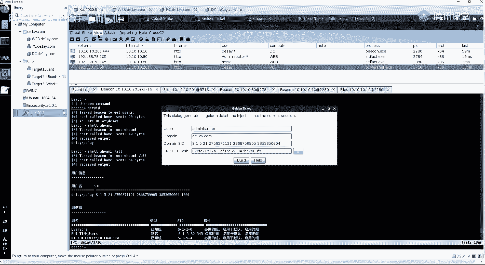

呃我们的一个就好，所有的这样子一些用户凭证，都在这个credi这里，就是我们可以在这边能够去查看到，所有的这种用户凭证是吧，以及的话这些凭证，它是从通过什么样的方法获取的对吧。

包括mini cut啊啊这边是dcs y n c的，然后hash jump等等，我们这的话就能够去查看所有的这样子的一些，用户凭证对吧。

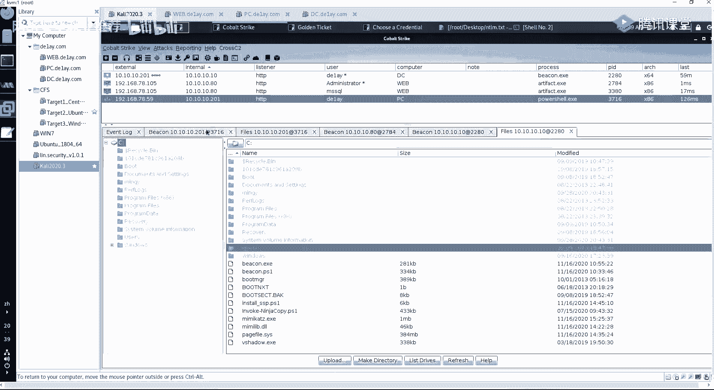

那么在这边的话嗯，我们，build直接build build之后的话，他在这的话我们可以看一下，它会返回这样的一个信息啊，就其实他这边他执行了一个命令的话，其实就是这条命令，然后他的这条命的话。

它其实是用的就是cs当中已经内置的这样子的，mini cat的这个功能，这个模块来去进行一个就是caps的一个呃，黄金票据的一个传递对吧，然后他在这边的话，他呃执行成功之后的话。

它会返回这样子的一个信息啊对吧，呃然后我们主要看这边对吧，就是我们的一个环境票据，为这个我这边创建这个minister的一个用户，它是在这个delay com的一个域下面，就已经successful了。

已经成功了对吧，那么我们在这块我们可以通过mini cat的这个k i，b k r b b r cp的这样子的一个啊list，通过这样的一个命令来去查看到，就我们这边伪造的这样的一个票据对吧。

可以看到就他的这个seven name还是这个cover对吧，我的一个客户端的一个名称是这个administr。

然后在这的话，我们就已经就伪造了这样的一个票据是吧，好啊，我们再来看一下，就是，我们先来看一下ppt的性能，就前面的话呃，介绍了在cs当中的这样的一个方法对吧，然后我们填好这样的数据。

然后build build之后的话，他就会去执行这样的一个面是吧，那么执行的这个变化其实就是这两，就是他mini cat的话，他会伪造这样子的一个指定用户的一个票据，然后的话把它注入到内存上面。

就它会注入到内存当中，然后的话我当前的这个用户的话，就有了这样的一个票据的吧，然后的话我就可以通过呃，然后的话我就可以通过对应的一个方法嗯，就我这边得到这个票据对吧，得到这个黄金票据啊。

然后的话我的一个客户端我去访问预控的话，他是没有问题的是吧，就访问他的预控的这样的一个服务，像比如说我去访问预控的，他的一个这个i p c对吧，去访问他的一个c盘的一个目录，下面它是是可以去访问的。

好呃，清理票据的话，就是说我们再去生成这个票据的时候的话，就最好的话先就是清理一下票据，就是你可能原来的话他这个呃系统当中的话，它已经有存储了对应的一些票据是吧，好的我们可以通过就是这样的。

这个pog pog来去就是清理掉所有的这种票据，然后清除之后的话，我们再去通过他的这样子的一个方法来去伪造，来把这样子的票据把它注入到内存，那么这个命令的话，我们来看一下它的一个就是详细的一个使用的。

一个方法对吧，就是它的一个构成，首先第一个的话就是更优者指定我们的一个呃，要伪造的一个用户名对吧，这句话是我的一个admin administrator这个用户，然后dm的话就指定我们的域名域名称好。

干s i d的话就指定我们这个u s i d，然后其实这边的这些内容的话，都是我们前面通过对应的这样子的一些方法，就是我们这边要去围绕这个票据所必要的，这样的一些条件对吧。

然后的话呃干k r b t g t的话，后面他就接我们的这样子的一个呃，这个用户他的一个n t m的一个哈希对吧，然后的话后面的话将干ppt ppt t嗯，就是呃调用它这个ppt的一个模块，呃。

中间的这一部分的话可以就是可要可不要，然后这边的话是你在cs当中的话，你通过这边的这个方法伪造这个票据的话，它会啊有它是这样子的一个命令，呃就是这一些，然后还有一个就是干ticket的这样的一个选项。

就是我们在后面的话会讲，就是把它就生成一个文件，因为我们在这块是通过把，直接把它输入到内存当中对吧，就是把他的个啊票据直接注入到内存当中，然后的话我在当前的这个客户端。

我就有了这样的一个777的一个票据对吧，那么我就能够去访问到在域内的这样子的，在域内的其他用户的，或者其他机器的这样子的对应的一些服务对吧，好呃，我们在这边伪造成空中的话。

我们可以通过这个cp就cp是list来去查看到啊。

我这边伪造的这样的一些票卷。

好的话，我们来看一下，就是具体的一个应用new，我这边的话得到了他一个票据，然后我可以通过就是dr r r a t c，来去就是能够去访问到这样子的一个，预控了是吧，这边的话这边他就是dc好啊。

加我们的一个域名嘛，就这边dc的话是这个域的，就是这个域名的这样子的一个啊主机名对吧，啊这边的一个就主机名的话，要就是根据不同的环境，那个我们前面的话讲，那个域内的一个信息收集的话。

有就是有详细的介绍是吧，有详细的一个命令，我们可以通过net view啊等等的，还有next time吗，这样子的一个东西能够去查查找到，就说我的一个预控的一个主机名对吧，然后这句话我能够去访问到。

就说它的一个预控的这样子的一个，就是啊c盘的这样子的一个东西对吧，那么我这边的话，是不是能够去去把我的一个文件。

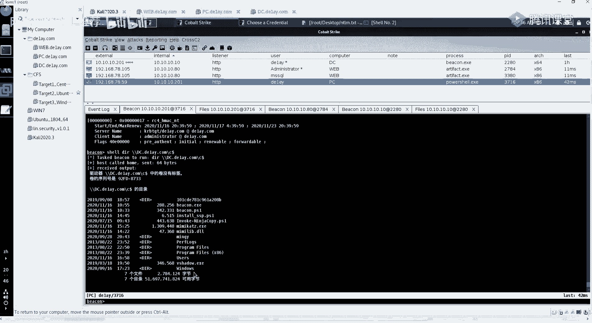

把它给就上传上去了，这答案的话肯定是可以的是吧，我这边能够去访问到他，那么我这边话就能够去对它做一个操作，那么我这边得到它的一个预控，希尔的一个方法的话，就是通过这样子。

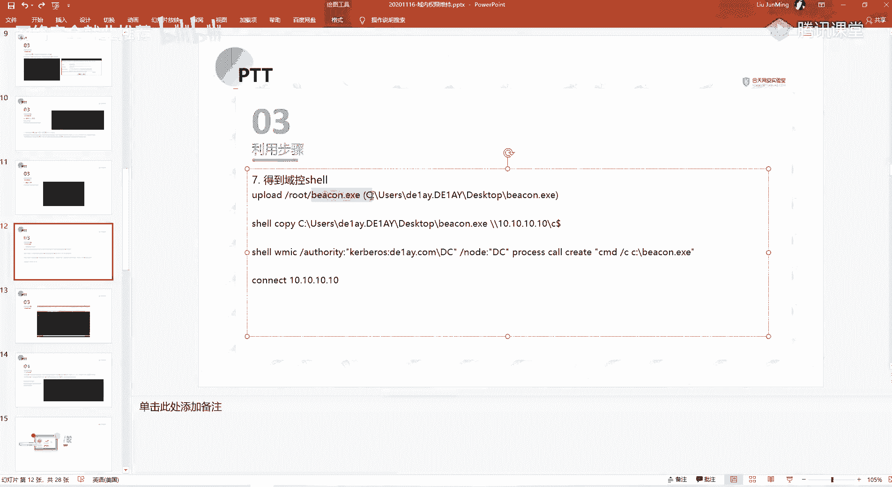

我首先的话生成了这样的一个back on x1 ，然后呃，因为在这边呢，它是一个就是内网的这样的一个预环境对吧，然后预控的话他是在内网的这样的一个网站啊，我当前这边得到的这个主机的话。

它是就是好一个跳板机对吧，然后我们通过这个机器能够去访问到域控，然后在cs当中的话，我们想要去，就是说进行一个就得到其他的同一个网站，一个主机的话就呃，在前面在讲那个内网渗透的时候对吧。

就同样的也有说就是你在内网的话，你他这边访出不了外网，就访问不到我的一个cs，就在官网的cs服务服务器的话对吧，我们无法去使用这样的一个就是啊反弹，反弹谢尔的这样的一个方法吧，有在内网的话。

我们都是通常的话都是会使用这样的一个，就是半的，就是正向的这样子的一个零件是吧，那么在cs当中，我们怎么去进行一个这样子的一个操作呢。

呃首先的话，我们先建立这样一个监听器，就是这边listen，我们我这边已经就已经尽力了，就尽力了，这样子一个监听器了，然后的话选择这样子的一个tcb，就back in tsv，然后选择一个名字。

然后呃在这边的话就是他们啊，这边的话是一个端口，这个端口的话其实就是这个back on，它所今天的一个端口就默认的话是44，然后的话你也可以把它改成其他的对吧，那我这个号已经创建了好。

这边的话创建这个惊天弃之后的话，我们可以去生成一个这样子的一个马，生成这样子的一个马嗯，然后我们选择这个选择这个监听器短，然后选择一个，就是因为我是windows吗，我选择一个windows ex一对。

他是一个64位的，那我就选64位的，不是60的话，我就不选，拿到我生成生成这样子的一个掰掰，肯定x一是吧，然后我这边的话已经生成了，就是在，嗯就是在我当前的这个目录这边的，有一个band的x1 c对吧。

然后他的一个今天的一个端口的话，就是我这边的一个444。

那么我这边生成了这个back on之后的话，我可以通过我这边建立了一个零件是吧，就我可以通过，就我当前的话是有权限去访问他对吧，就相当于就是我这边已经建立了一个，就是i p c的一个连接对吧。

就是然后的话，我就因为其实你鉴定i p c连接的话，其实就是去认证对吧，去认证你有没有权限去访问其他的这个对吧，那么你通过你进的这个ipc的一个连接，我们可以就是回想一下，就是建立ip 40件的话。

我们需要去指定我们的一个用户名及密码对吧，然后的话经济成功之后的话，我们就可以通过这个ipc连接去访问对吧，那么在这一块我这边有了对应的一个票据对吧，我可以去访问到对应的这样子的一个服务对吧。

那么其实他这边的话，中间的这个认证的一个过程的话，其实就啊已经就是已经呃省略了对吧啊，当然不是省略了，就是你中间的这个认证的一个过程的话，其实他已经认证了是吧，因为你有了这样的一个票据啊。

所以的话你可以去访问他，那么我这句话我直接可以通过这边的呃，这样的一个方法来去操纵。

我预控上面的这样的一个内容对吧，那么我这边的话我可以通过啊。

这样的一个方法是吧，我把我这边的这个生成的这个back on。

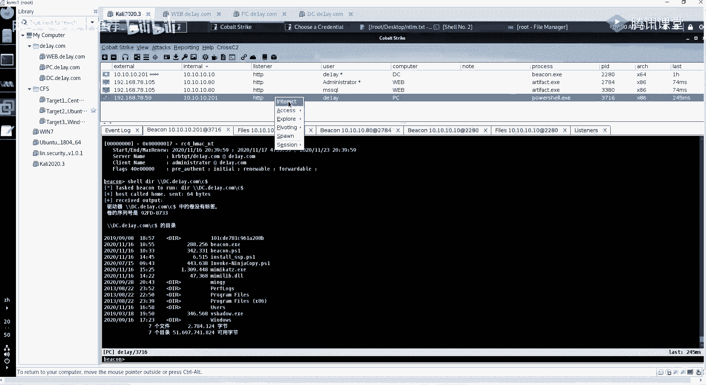

我首先的话通过，317，这个通过通过我这我这边是以cs为例对吧，我通过cs这边我上传上去对吧，上传到他的一个指定那个目录下面去，然后的话生成这样子那个back文件。

那么然后的话我这边上传到这个跳板机对吧，然后的话我就可以通过这边的一个呃，经历了一个零件是吧，而不是渐渐的一个连接，就是通过我这边的一个能够去访问，预控的这个c盘的一个目录对吧。

来去呃，把我的这个bin把它给copy到他的c盘下面去是吧。

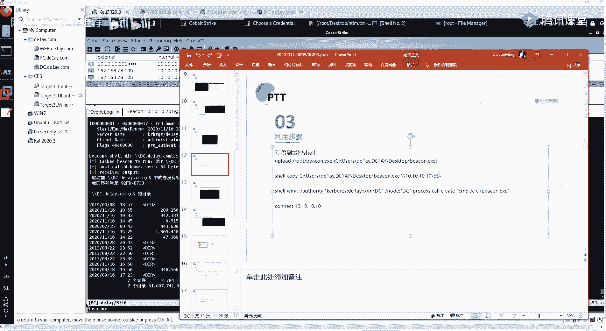

就是像这样，然后我这边的话我就呃我就不操作了对吧，那我给大家大家因为我这个号已经操作过了，大家自己课后去那个就照着ppt这边抄。

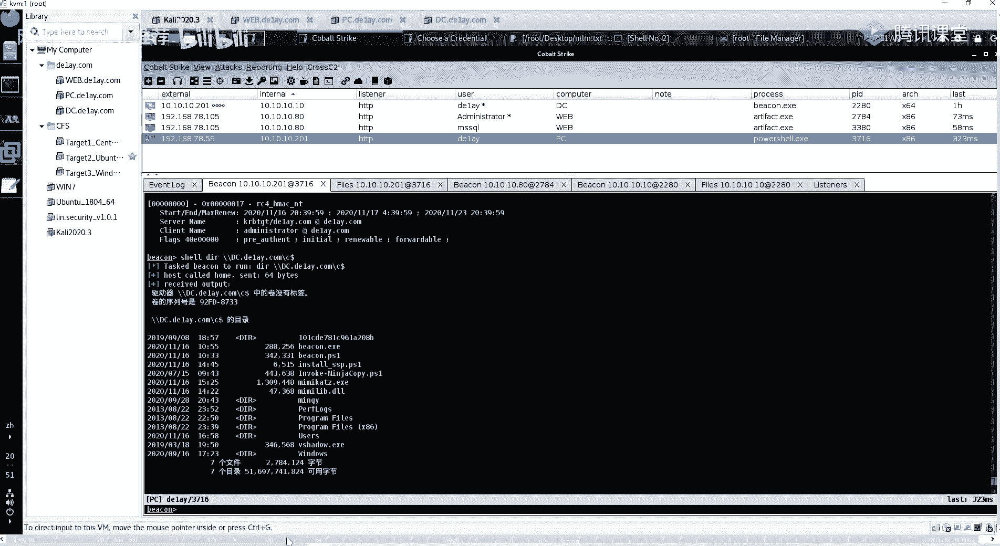

这边敲就行了，好我们先休息一下，我这边先下一下一下课。

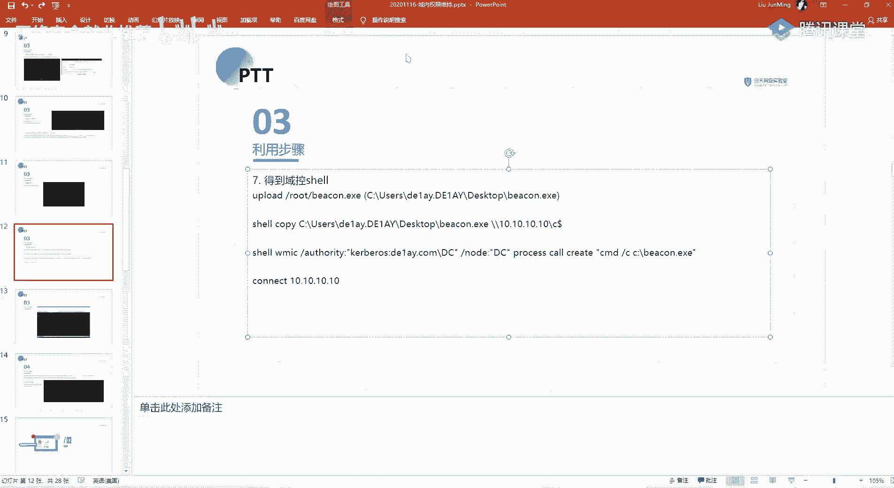

好我们继续，然而在这边的话我把我的这个back on对吧，生成的这个bin把它给上传上去，上传上去之后的话，我可以通过呃前面所用到的对吧，前面已经给大家介绍过这样子的一个。

横向移动的这样子的一个方法是吧，就我们在这边传的这样的一个文件，我可以我这边以这个以w m i c为例对吧。

我可以通过w m m i c，然后的话通过这样的一个方法来去进行一个啊，执行，就创建这样的一个进程，这个进程的话就是执行这个程序了。

去执行我这边上传的这个back对吧，那么他在这边执行之后的话，它就会呃在嗯这边执行一下吧，啊这个要调。

啊我这边的话我就不在那个不在那个重新操作，那个就是再把它copy上去，因为我这边已经起了一个，就已经起了一个bug，我们来看一下，就这边这边这个back on。

这边这个back on的话，其实就是，我这边就通过这样子一个方法所得到的。

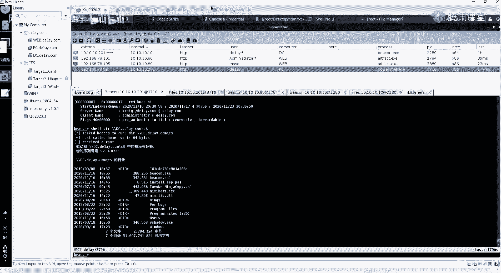

然而我这边的话因为已经有了，我这边我不把它，不把它ko掉，我这边我把它掰，肯重新变一下零。

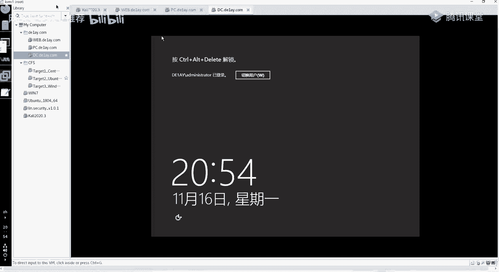

a一对吧，然后的话我在这边那个其实际的操作的话，就是你再重新上传一个这样的拜肯尼嘛，然后我这个号我就直接直接改改一下名字，然后的话通过这样的一个方法。

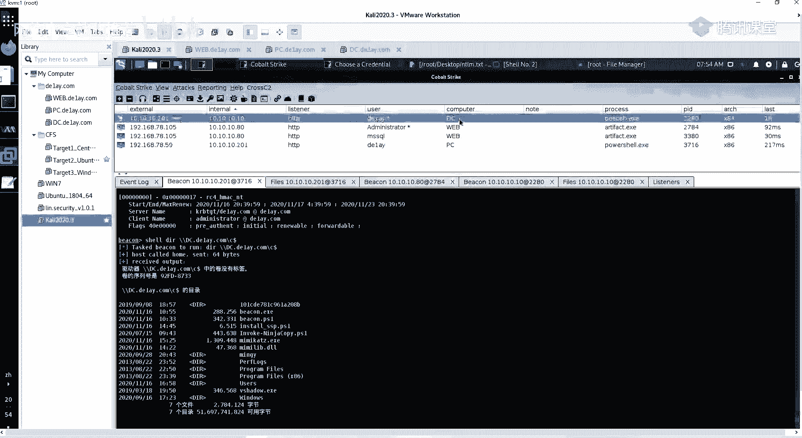

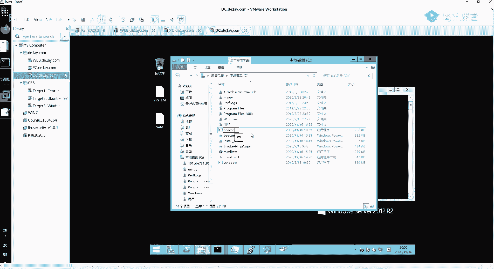

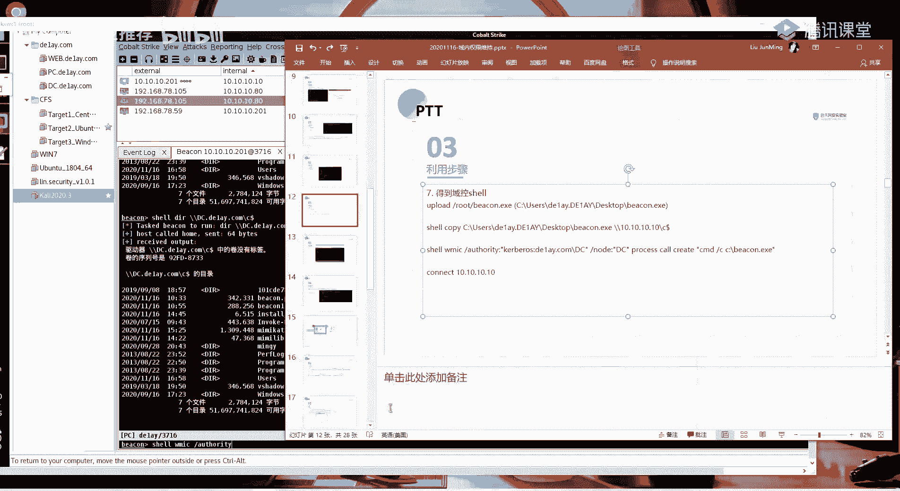

大家大家再去进行这样的一个操作的时候，就是一定要注意就是一个命令，那你要注意你这个命令你自己检查一下，就是能减少很多的一个错误啊，执行执行之后的话，我们可以看到这边的话就是我们熟悉的。

就是前面通过w mi这样的一个方法，来去进行一个啊横向移动的时候对吧，常见的它会输出返回这样子的一个proxd对吧，也就是这边这个back in一它执行之后的话，它返回了一个进程id，那么在这的话呃。

在在的话我们可以通过这个bug，呃这句话。

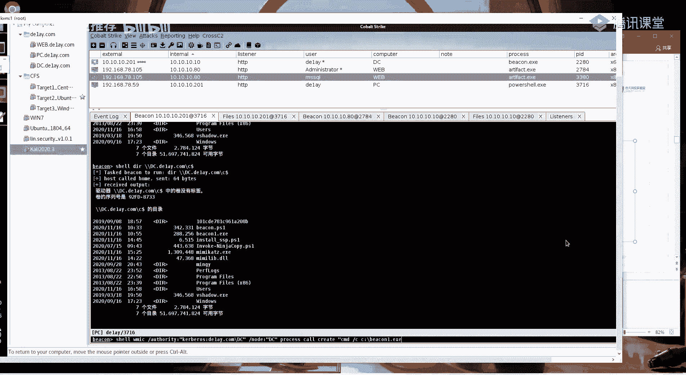

我在预控这边的话来看一下，就是看他是不是有了这样的一个back，肯定要。

1550。

没之前。

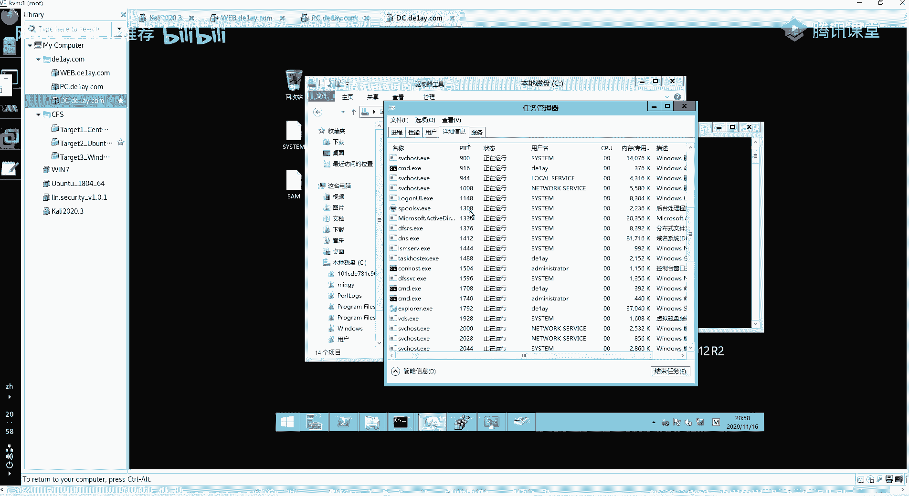

啊这边我知道。

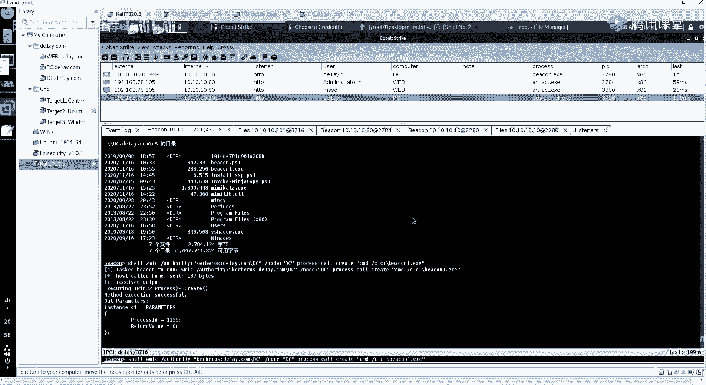

就是呃，因为我这边的话这个bacon啊，这个bacon它今天的一个端口啊，它是从这个所的话，我这边前面已经，它这边会有冲突，我们可以看一下，这边的话，就是它是进行了一个四四的一个状态是吧。

他是这个2512这个技能就是这个back，那么我这边的话我同样的一个back on，我去启动的话，那同样的是今天这个端口是吧，那么它的这个端口占用的话，那么你这个的话它其实没有起来呀。

我这边还把它给和解除掉吧。

我这边先把它截出来，然后再执行一下，哪里错了。

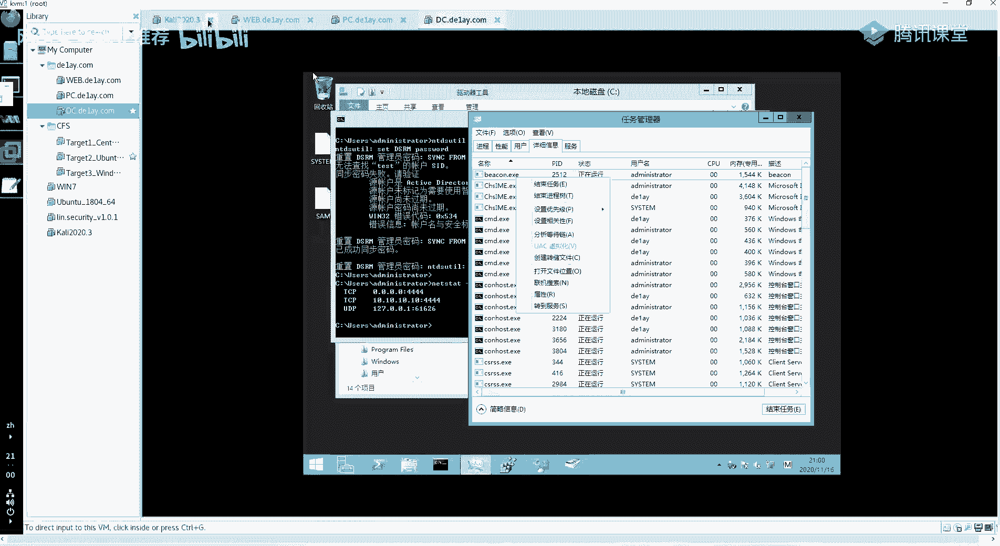

啊这个不是。

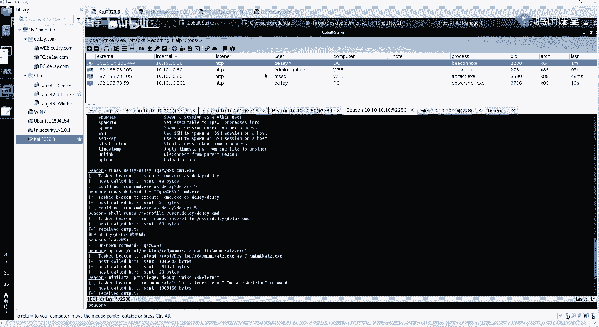

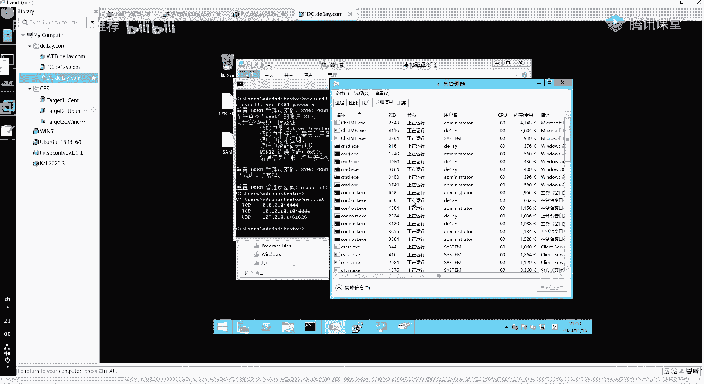

曲子翻成掉了。

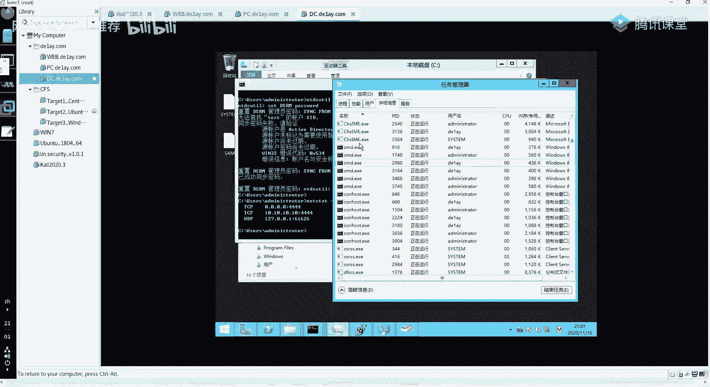

这是在哪呢，这个号稍微等一下，就我这边的这个bon突然掉了，好我们先看ppt吧，这边要等一分钟，然后我这边执行之后的话，执行之后的话，它会在我的一个就是预控上面对吧，因为我攻击是预控。

他会在预控上面的话，他会去进行这样的一个444的一个端口，就我这边生成这个bon的搜索，选定了一个今天七拉4444对吧，好的话，他今天的这样这个端口值的话，我们可以在我们那个跳板机上面。

通过connect这个命令还去连接它的，这样子的就是预判的呃，444的一个端口，然后它默认的话它是连接444，然后如果说你的一个端口的话是五五的话，你就通过这样的方法connect。

然后加预判的一个ip，然后他加我们的一个就是精听器的一个端口。

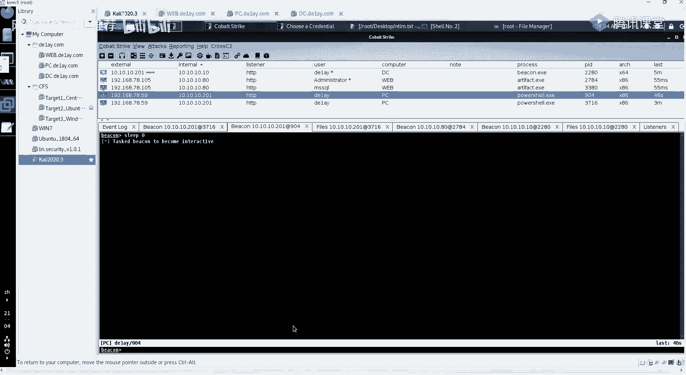

然后我们再从头再走一遍吧，先呃注入这样的一个票据是吧，输入票据之后的话，我们，对没有问题，然后的话我们把这样的一个back in传上去，上上去之后的话，我们，通过呃。

w mc的这样的一个横向移动的一个方法，来去执行我们这边的这个back盈利对吧。

然后执行成功之后的话，我们可以看到对吧，在这边的话就有了这样的一个back一样，当然其实正常的话就是正常的话就是会这样子，啊对吧，就我们他会去起这样的一个进程，然后其实际上我们这句话就是看。

主要就是看它这个它返回这个值，对它有没有返回这样的s i d就啊p i d，然后要注意的就是你的这个bin，就要是说就是说你的第一次，你生成这个back on对吧，你传啊传上去，然后你执行执行之后的话。

你的这个beat里面有exist叫，就你没有你没有退掉是吧，你没有退掉的话，那么你的这个back的话，它还在后台运行，而且的话就是没有，就是你的这个bat里面有关掉，没有断掉话。

他会去进行一个试试的一个端口对吧，而这个时候的话。

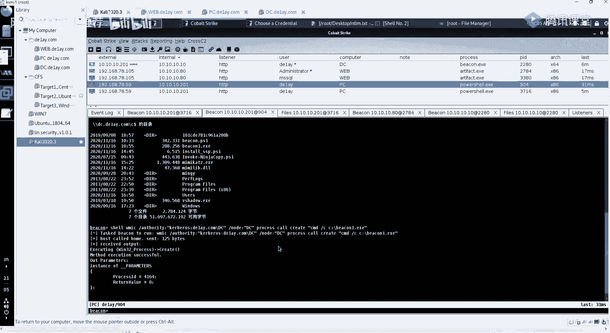

你要你还要，你要再去启动这样的一个四四的一个端口的话，它就会呃就是起不来对吧，就你重新你再起这个banana也起不来，所以的话这个时候你可以就是呃，重新再指定一个listen吧。

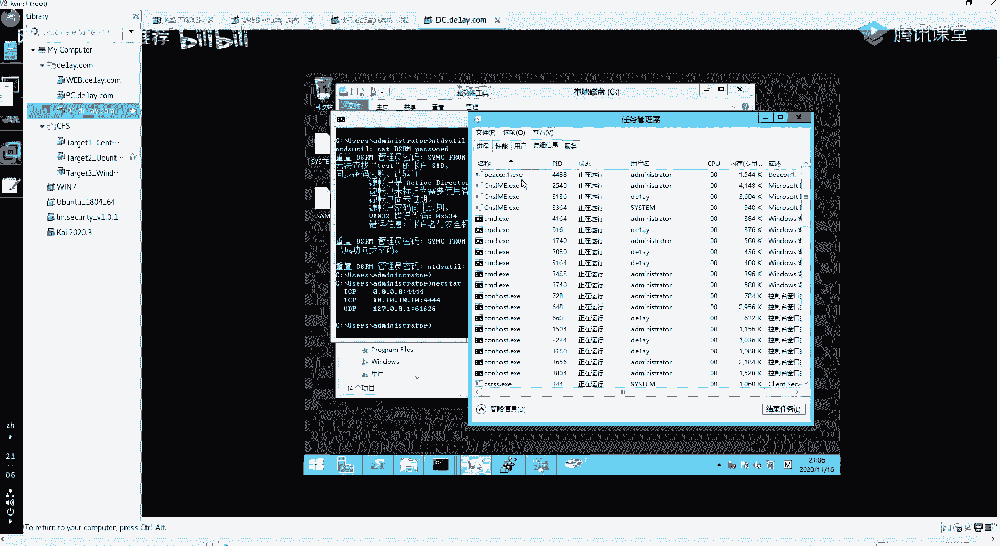

就是今天的一个端口是吧，改一个端口，然后的话你再去生成这个bend传上去，然后的话执行，那么在这边的话，他就会去今天这样的一个端口是吧，我们可以在这边来查看对啊，他就是今天这样的一个444的一个端口。

它的进程id 44488，然后的话，我们这样的话就可以通过这个connect，大家注意看看看看上面对，然后这边connect之后的话，在这边的话就看这个event log对吧。

他这话就来了这样的一个back，就来自这一个dc这个用户的一个administrate，好呃，就是这个对吧，就是这个，而且它是一个就是admin administra在这样的一个权限。

一个管理员的一个权限。

然后我们可以通过在这边需要会卖对吧，然后我这边他就得到了他的一个预控的。

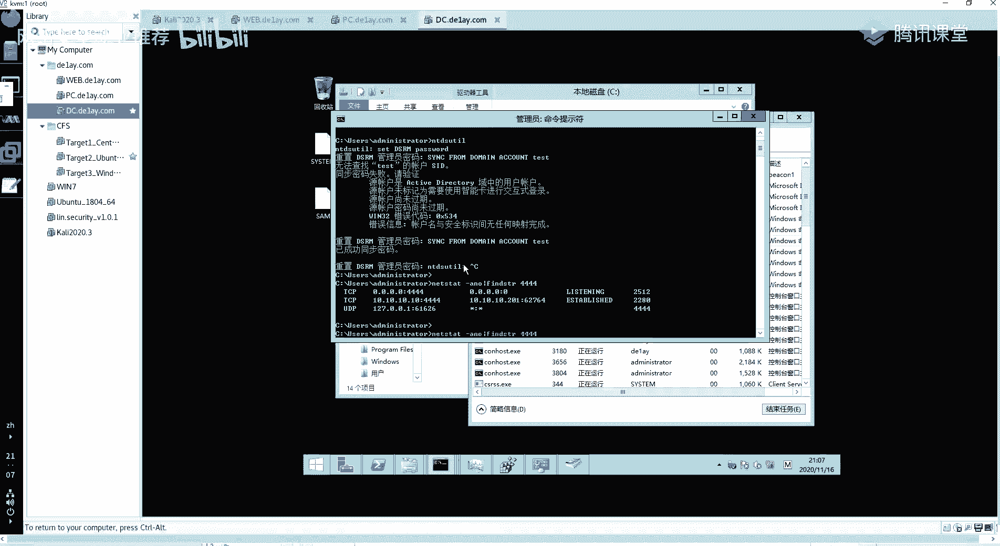

这样的一个权限，然后其实实际的话就是我们前面的话讲的，这些东西也是可以通过对应的去拿到预控对吧，就呃比如说我们的一个横向移动对吧，我已经得到了，就是我在呃其他的这样子的一些，就域内的这些主机当中对吧。

呃我拿过我拿到的这些运动的一个主机，然后的话通过获取他的一个密码哈，希然后的话而得到了预预用户的或者预预管啊，就是预控的一个管理员，用户的它的一个账号密码对吧，那么我有他的一个账号密码。

我就可以通过横向移动的一个方法是吧，来去得到预控的一个需要权限对吧，然后这边它是以这样子的一个例子啊，就是来去得到它的一个预判的一个权限，然后现在这边横向移动那个的话，就不仅仅是用w m i c对吧。

就又回到了我们前面的一个介绍的一个内容啊。

啊呃具体的一个过程就像这样的对吧。

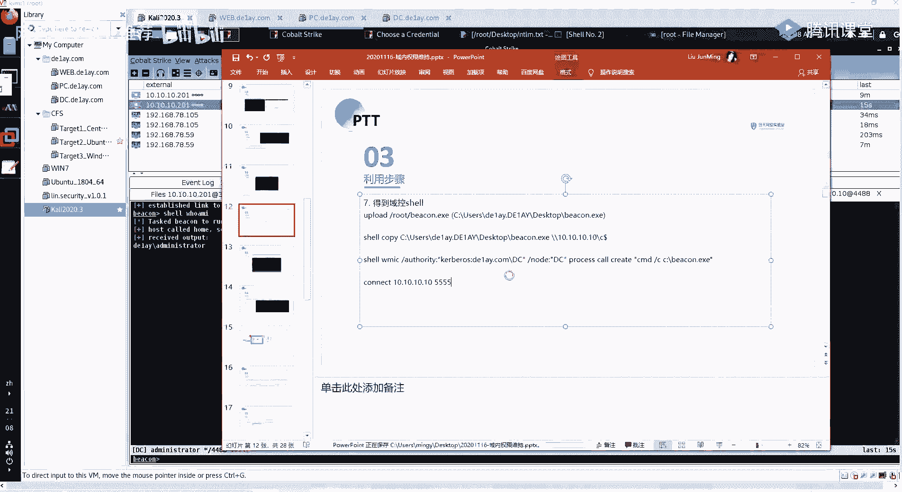

我通过这样的一个方法啊，得到了这样子的就是预控的它的一个希尔啊，以及的话我们前面的这样子的一个步骤的话，是把我们那个票据注入到内存当中对吧，然后的话我们直接通过这样子的一个命令，就能够去实现是吧。

然后还有的话，就是我们可以通过这样的一个方法，就是指定这个ticket的一个参数，然后的话指定我们这边要去生成的，这个pg的一个文件名，就是这边的这个句子话跟前面其实是一样的。

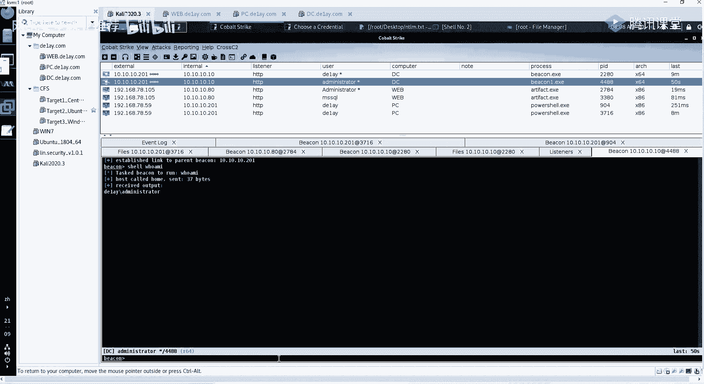

就不同的一个地方的话，他不是他没有用这个p p t，直接去把它注入到内存当中是吧，然后他这边还是用这个tikt来去指定，我们把我们的一个票据，把它保存到这个文件当中，然后的话我们再通过啊。

mini cards的这样子的一个啊p t t就这边写错了，用mini cut这个cp是ppt的一个模块，然后的话来去加的，我们这边的一个保存了一个票据，就其实我们有了这样的一个票据文件对吧。

那么我就能够去达到去进行这样的一个，域内的一个权限为止是吧，就我只是我只要通过mini cars的这个p p t，把我的这个票据把它注入到内存当中对吧，我就能够去啊进行一个权限的一个维持。

得到预控的一个权限，以及域内的其他主机的一个呃，访问的一个权限是吧，这是第一个呃黄金票据的一个伪造好，第二个的话就是一个s s p。

s s p的话就是这边就是secret support the private，就是他那个作用的话就是用于身份验证，然后它是一个dl文件，就是它是一个自定呃，不是它是一个系统的一个dl。

然后的话它的主要作用是用于身份验证，然后他的一个身份验证的话，就是他在系统启动的时候，我们的这个s s p啊，也是这个点，它会被加载到这个进程当中，就这个进程的话应该大家很熟悉了是吧。

就我们去进行一个呃，去进行一个用户认证的时候对吧，我们的一个铭文那个密码，他会首先把它读取到这个进程当中，然后的话在这个进程当中做一个n t m的一个，哈希的一个加密对吧，那么在这个进程中的话。

它其实有存储的，我们的一个就是登录的用户的这样子的一个，铭文的一个密码是吧，然后的话呃，由于这一个iosa它是一个可可扩展的，就是我们可以在它的一个系统启动的时候，加载一个自定的一个点。

就是它在这个进程就是它系统启动的时候，它会把这个地方加载到基层当中，表就这个s s p，那么我们可以通过就加载一个自定义的一个点，就把我们自己的一点把它加载到这个进程，那么那么这个dl的一个作用的话。

就是用于记录所有登录到当前系统的，一个铭文账号密码的一个点，就这个怎么理解呢，就是我的这个进程当中，有了这样的一个deal对吧，那么这个del它是用于记录我的一个系统的一个，铭文账号的。

就因为我们再去进行一个，就是登录系统的时候对吧，我们首先会把我们的一个就是输入的一个，就是用户登录的时候输入的一个密码好吧，铭文的一个账号密码，它会读取到这个进程当中对吧，读取到这个进程的一进程当中。

然后的话在这个进程当中去建一个操作的，那么我这边你这个调的话，我就可以去劫持他的，这样子的一个就是获取到它，就是把铭文的一个账密码读取到这个进程当中，时候的一个值，把它给获取下来是吧。

然后的话在这句话就是利用这个mini cs当中，这个mini live in dl的一个文件，就大家在那个就是下载mini cut的时候，不是有这样子的两个嘛对吧，然后这边的话有这样子的一个mi。

mi libin gl的一个文件，这个文件的话就是用于我们这边的这个啊，s p的一个全限维持呃，呃具体的一个步骤的话，就是我们家这边的这个调文件，把它给放到系统的一个system，32的一个目录下面。

然后注意的话就是你的一个点的个位数，要有windows的个位数相，就是你是64的话，你就在这一个64的这个啊目录下面对吧，你是32的话，你就在这边啊，这边有一个win 32是吧，以及有个参数式为三二。

这边的话就是32位的吧，它同样的有这样子的一个mi mi la对吧，然后的话将这个del的一个文件，把它添加到注册表，那么就添加到注册表当中，它就是它在系统启动的时候，他会去找到这个dio文件对吧。

然后的话把它加载到这个进程当中，所以的话呃这个用这个方法，那就是系统重启，它不会去影响我们那个持久化的效果，就是它重启之后的话，同样的他就是它重启之后的话，我们的这个点对吧，他只要没有去把它给删掉。

那么它系统启动的时候，它就它就会去加载我们这个调，加载到这个进程的，然后的话他在去进行用户的登录的时候，我们就能够获取到他的铭文的一个密码啊，具体这个应用的步骤的话就是这样子。

首先的话我们先把这个叫文件对吧，我把它就是上传到呃指定的这个目录下面，就把它放到这个sem 32的一个目录下面，然后的话修改我们的一个注册表呃，修改的一个注册表的一个呃。

值的话就是这个就h k l l m m，然后system，然后current control set，然后ctrl，然后这边有个lsa，然后在这个lc下面的话，有这样子的一个像有这样子的一个值。

就security pocket，然后的话我们在这个下面的话，我们去把它，这个就是添加一个这样的一个mi mi la，然而，我们来具体的来看一下，我的话直接在预控上面操作啊，就是，在注册表当中是吧。

注册表当中的话，找到这一个ioc，就是这个在这边llc这边的话，我们添加一个这个啊，这边原本的话就是有这样的一个security的一个package，就是他已经有了这个，然后我们把它做一个修改。

修改它就在这边加我们的，把我们的一个mi这个lil这个调文件，把它给添加到这边来就可以了，然后然后的话，如果他里面还有其他的一个内容的话，大家不用管，就是你把你的这个东西添加进去，然后呃。

在这边的话是通过有注册表的一个编辑器对吧，那么我们正面内行的话就是通过这个ig嘛，就通过i g a的来去添加这样的一个，注册表的一个词是吧。

然后把它添加到这里面去添加，添加进去之后的话，就像这样子的，然后的话添加进去之后的话，在这边的话就用这个s s p的话，它有这样子的一个前提的一个条件，就是你添加之后的话，你要就说这个计算机要重启对吧。

要重启之后的话，你的这个del文件你才会去生效对吧，因为你的这个呃就是iosa，ios a s s d e x一这个进程的话，它只在系统启动的时候，它会去加载这个叫文件对吧。

那么在这边的话它已经启动之后的话，它就不会再去加的啊，他只有在系统启动的时候，它会去加的，那么在这边的话，我们的自己的这个表的一个文件，就把它加载进去的话，就需要让这个计算机去重启。

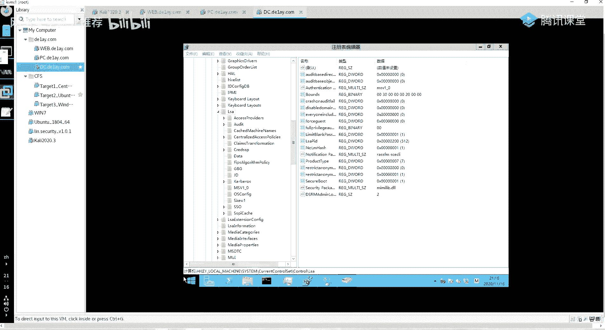

就只有在计算机重启之后的话，我们这个调才能加载进去嘛对吧，然后加载进去之后的话，就是如果有用户它登录到当前的一个系统当中，就会在这样的一个目录下面，它会生成一个用于记录，登录账号密码的一个文件。

就这个文件，那么在这这个文件的话，我们就存储了，就是说它的一个就是登录这个登，登录这个预控这个机器的，所有的这样子的一个账号密码，而且还是铭文的，就是说不管就是说不管你的这样子的一个，你的一个预控对吧。

你的预控它的一个账号密码更改成了什么对吧，我们都可以，就是说就只要你登的这个机器，他就会去记录在这个文件当中，而且还是一个明明文的对吧，那么我们只需要去获取到这个文件，我就知道了他预控的一个而ip。

而不是ip它的一个账号铭文的一个账号密码，然后具体的一个方法的话就是这样子，所以同样的是使用的一个mini cut，啊不是这是好意思说错了，这是第二种，第二种方法，就第一种的话是我们通过这个调文件的。

然后把这个第二文件把它放进去，然后第二种的话就是呃，通过内存的加载的一个方法，就是这这种了，因为前面的话是需要去进行一个重启的对吧，那么在这边的话，就是说我们直接通过就mini cut它的一个模块。

直接把我这边的一个s sp加载到内存，也就是我这边还可以就不用重启啊，要不不重启的话，那么他会在这边的这个目录下面，那里去生成这个mi mi sa的一个logo的一个文件。

然后它里面它就记录在我登录这个预控的，一个呃名额，一个账号密码。

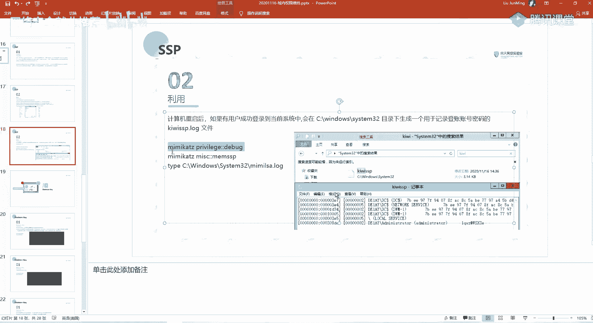

我们来呃，我这边的话不操作了吧，就是这边的话要重启，然后我这边的话就是看一下具体一个效果，首先的话我们我这边还在预控上面，我操作对吧，找到这个cm 32，然后的话在下面的话就会有这样子的文件。

首先的话是嗯这个，这个的话ki w s p的话就是，没就这一个就是前面的这一个对吧，生成它这样子的一个文件，我们打开打开之后的话，在这边的话就它记录了，就是每次用户登录的时候，它的一个密码对吧。

然后我们在这边呃，我把它给删掉吧。

把这个文件删了吧，然后把这个文件删除掉了，删除掉之后的话，我这边我来模拟登录一下，贴一下用户，比如说呃，哇登登这样子的一个预控的一个用户对吧，我输入密码，输入密码之后的话，好有了对吧。

就是刚刚的话它是没有的，干的话我直接把它删除掉了对吧，然后现在的话我这边登录之后的话，可以看到这边的话就又多了这样的一个文件，它会自动的去生存，然后这里的一个量的话，就记录了我登录这个预控的时候。

所的一个铭文的一个密码对吧，就是啊一个还有的话就是通过mini cut，就我们可以通过。

通过mini cars就是呃，这边有个仓库来看看记录。

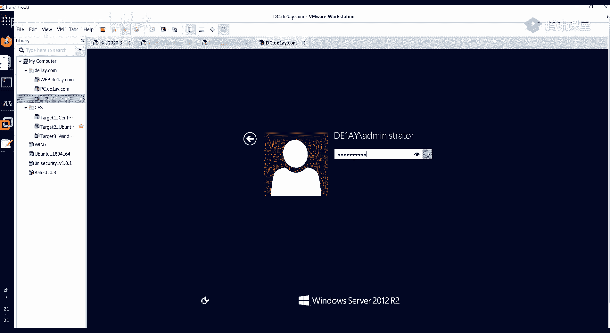

呃我这边上不就不操作了，就是给大家说一下，然后大家自己课后去操作，就通过这样的方法呃，当然的话就是就这边的一个命令cut的话，它其实也是就跟前面其实也是一样的，就前面的一个步骤，前面的一个步骤是一样的。

就你同样的也需要把这个调文件，把那个放到c盘那个目录下面，然后还要加这样子的个注册表，然后的话在这句话就是通过这样的一个方法，就mei s s p就是加载到内存当中来去启用它。

然后的话我们这句话他会有这样子的一个mi。

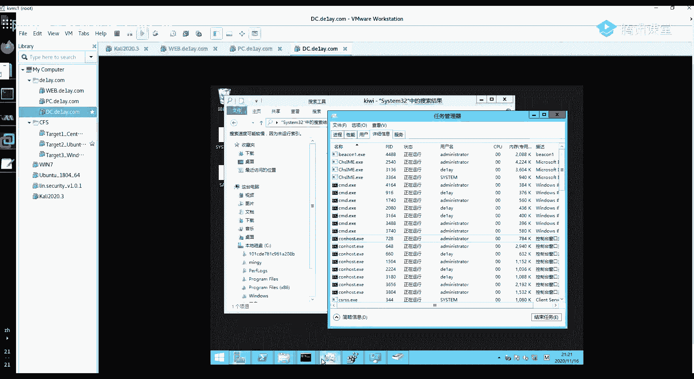

mi的这个呃，还有另外的一个文件，就这一个，就用这两种方法的话，它的就是生成的这个文件里面它是不一样的，要注意。

这个话就是那个吊的一个文件，啊这边的话是第二种啊，下面的话我们来看一下第三种，第三种的话就是这个as scut是怎么读啊，skeleton，skeleton就这一个key啊，skeleton key啊。

然后它的这个key的一个作用的话，就是呃我们不需要预控重启才能生效的。

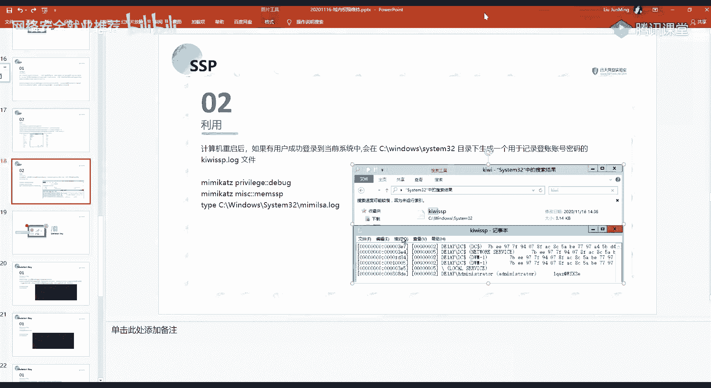

这样子的一个维持预控权限的一个方法，然后他的这个key的话，它是被安装在64位的一个预控制，预控服务器上面，这边要注意啊，就是64位的一个预控服务器上面。

然后的话它支持是windows 2003~15的，2。12r好，然后他的这个key的话。

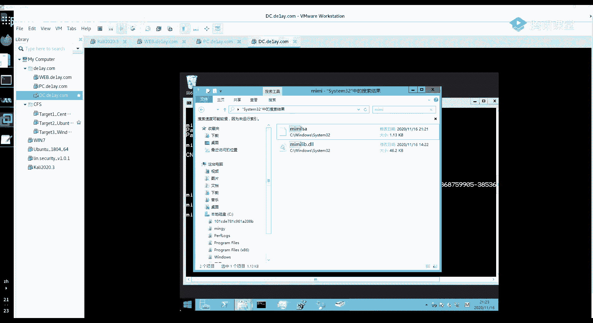

就是能够让所有的御用户使用同一个万能密码，来去进行一个登录，然后的话现现有的所有的运用户使用原密码，能仍然能够继续登，然后的话要注意的就是，你得到这个，就是用这个万能密码登录的一个权限。

它不能够去更改用户群权限，而且的话就是说你通过这样子的一个key啊，就是安装了这个key，然后得到了这个用得到这个one的密码，它在系统重启之后的话就会失效。

然后呃具体的一个使用方法就是通过mini cut，就通过这两条面积就可以了，首先的话就是debug嘛，进入debug模式，然后的话执行这个mi s c，然后sk of totune。

这这里的一个命令的一个意思的话，就是安装这样子的一个p，那我们可以看一下，就这边的话是它的一个步骤，就它的一个结果，他执行之后返回了一个结果，就这样子，然后这边返回这样子一个结构的话。

就说明我们这边安装成功了，安装成功之后的话，这边ppt长了，啊这边ppt重复了，我删了，呃呃就在域控上面安装这样子一个key对吧，安装之后的话，我们域内的一个主机。

就能够去使用这样子的一个啊key来去登录预控，然后mini cut的话，默认的话它的一个key它是设置为了这样一个mini，也就是我们可以通过这个mini cut的这个密码，来去登录预控，好，注意的话。

只是去他是无法去更改账户的一个权限的，然后具体一个用法的问题就是像这样子，我们啊做了这做了这个key之后的话，我们在其他的一个机器上面对吧，我就可以通过这个mini cat这个密码是吧。

然后的话来去连接预控，来去进行这样这样子的ip是一个连接是吧，那么进行ipc连接之后的话，就是横向移动的一个用法，那我就同样的你会去得到预控的一个权限是吧，就是啊这个as palet。

啊我们这边来看一下，你看到我这边的话啊，执行成功了，因为我之前的话已经就是在这边有执行过的。

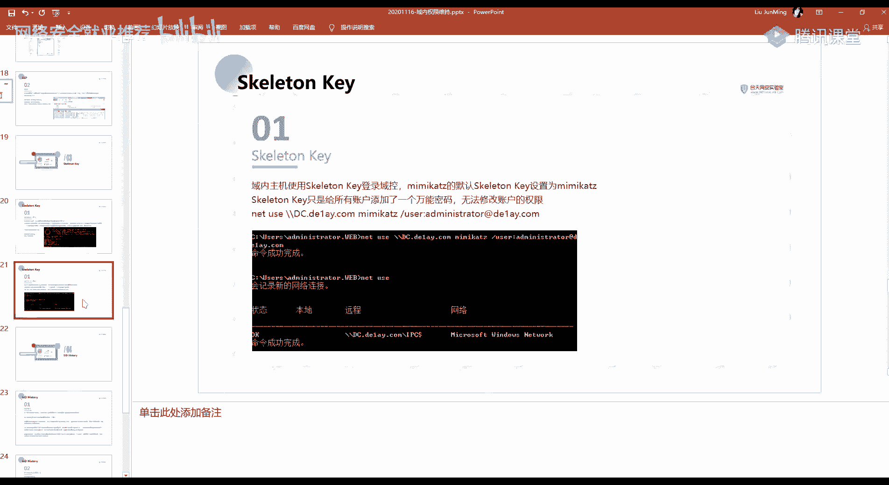

这是，啊这两就我这边的话已经有执行过了，然后执行之后的话，我在这边的话就在另外的这个机器，我当前的话是一个呃就是web的，就是在这个web机器上面的这个管理的一个用户，它不是一个御用户。

然后我这边的话通过这样子的一个啊，这个current，来进行一个这样这样的一个i p c的一个零件，然后的话我在这边的话就能够通过这一块连接，来去访问到啊预控的一个内容对吧。

那么我们自然的话就能够通过这个ipc理解，来得到预控的一个权限呃，第四个话就是这个sd的一个history。

好忘记，欢迎大家，因为这边的话。

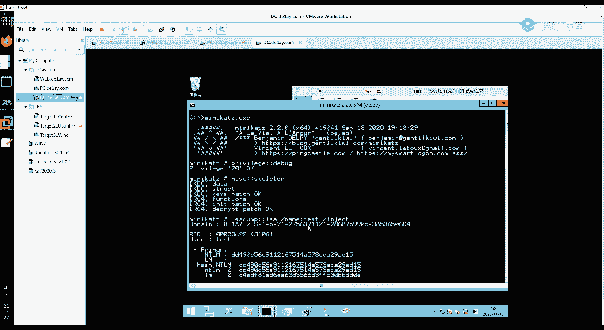

这边的话呢，这个东西放在这挡了我这边的这个东西，所以话就没办法固定了，然后我去看大家的一个问题啊，大于的话，大于这个的话应该也是可以的，我没有，我没有一个一个去试啊，就是我们有一个一个系统去试。

就应该是就是不能低于2003吧，你202012都可以啊，那那么为什么2016不可以。

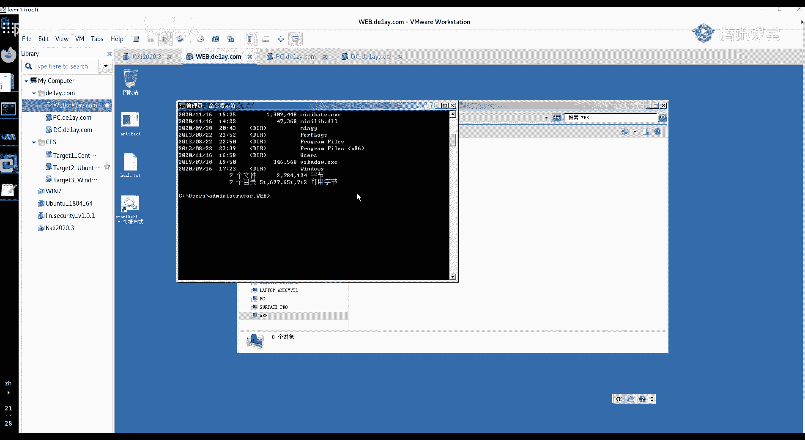

呃这个的话我没有，我没有去验证，就是呃大家可以去验证一下好吧，然后还有还有问题吗，前面的一个内容，啊应该是没有问题啊，那我们继续啊，呃第四个的话就是一个sd的cos，就是用到了这边的一个用户的一个sd。

就每个用户都有一个这样的一个字节的，一个s i d来去标识，我们的一个就访问资源时候的，一个访问权限是吧，好像我们那个管理员的话，他应该si的话就是500，那么在这边的话。

我们就会去用到这样的一个管理员的一个sid，好，以及的话这边的一个s i d que history，它的一个就是介绍就它的一个原理，就是呃这个sdp指的话，它是在预期移过程当中。

需要去使用到的一个属性，就是如果将au当中的一个用户迁移到b域当中，那么就在b域当中的话，这个用户的一个s i d会随之改变，就是我们再去做玉的一个迁移的时候，然后的话你想要去将a域当中的一个用户。

迁移到b迁移到b域当中是吧，那么在b域当中，他的个s i t定会变的，就是像比如说你的你的一个sp方，它其实是它是唯一的对吧，那么如果说你两个你两个域当中的话，它有对应的这样子的一个呃。

有相同的这样子一个sd是吧，那么你再去迁移的时候，那么它就会有相同的这是吧，那么肯定的话要去解决的话，就是你的你在迁移的时候，你au当中的一个si的话肯定要去改变的对吧。

那么在这边去改变了这个sd之后的话，他就会去影响到清移之后的一个，用户的一个权限对吧，因为你s2 i i d改变之后的话，你对应的权限的话你就不一样了是吧。

所以的话这个s i d history的一个作用，就是在预期营的一个过程过程当中，来去保持我们运用户的访问权限，也就是我的这边的一个au当中的某个用户，他清一次过后的话，它的一个s i d改变了。

但是的话他有这样的s d的一个history的一个属性，在这一个属性当中的话就包括了，就是在ae当中的这样子一个sd的一个值，那么他这边迁移过后之后的话，它同样的就是能够去。

就是以原有的一个权限来去访问到，原来可以去访问的一个资源，就是以原来的这样子的sid的这个权限，来去访问到原来可以去访问的资源嗯，那么在这边的话，我们可以通过mini cut。

来将这样的一个tess的一个属性，来添加到域当中的任意用户的一个，sid的一个属性当中，就是实战的话，我们可以就如果我们获得了一环节的一个权限，对吧，我们可以通过这样的方法来去实现一个持久化。

就是把这边的一个预览的一个sid的一个history啊，就是把预管那个s i d啊，把它给添加到我的一个，就是创建了一个用户对吧，或者说添加到呃，我已经拿下了这样子的一个用户的一个呃。

s i b history属性当中对吧，那么这个用户的话它就具备了，就是啊访问这一个，就是他原本就能够去访问的，这些资源的权限是吧，也就是能够去得到一个管理员的权限，那么具体的一个操作的一个步骤的话。

就是呃mini cut，通过mini cut来去添加，这样子的一个s i d t边的home啊，然后方法就是首先sd干patch，就patch这边的话就是来去就是来做。

就把我们的这样子的一个服务去做一个，就是检查就检查我的这边的一个图像，比如说这边的一个nt d s的那个符，它是不是啊就是启动了对吧，然后检查它就如果不检查的话，你可能就是无法去通。

去执行下面的这样的一个操作，来把我们的这样子的一个就sd，把它给写入到这边的这个n t d s当中，然后的话呃在这边的话，通过sid aid来去添加这样子的一个。

就是administrate的一个s i d，然后把它添加到我这边的，创建了这个mi g的这个用户，然后语法的话就像这样子，干sam指定我这边要我这边要去，就是添加sid history里的这个用户名。

然后干new的话就是指定我这边要去啊，把哪一个用户的一个sd，把它添加到我的这边的，这个用户的一个i p属性当中啊，呃执行的一个效果的话就像这样子，我们把这边的这一个呃啊。

这边的话因为我这边截图没截全啊，就是在在环境这边的话，它的一个项目这个宽的话比较小，所以的话有一部分内容没截到，就是在这话他会有一个ok在后面，就是把这边的新的这个sd，这个si的话。

其实是这个administrator这个用户的一个sd，然后的话他会把它添加到他的这个sid，history这个属性当中，然后添加添加成功之后的话，我们可以通过这样的方法去查看。

就通过pasha的这个啊，首先import就加载这样子的一个ad的一个模块，active directory的这样的一个模块，然后通过调用这个模块里面的，这个get a柚子的一个方法。

来获取到我这边指定的这个用户的一个权限，就这边指定的话指定获取的一个属性，这个property tex的话就是属性的一个意思嘛，然后的话指定的是这个sii history，那么在这个话我们可以看一下。

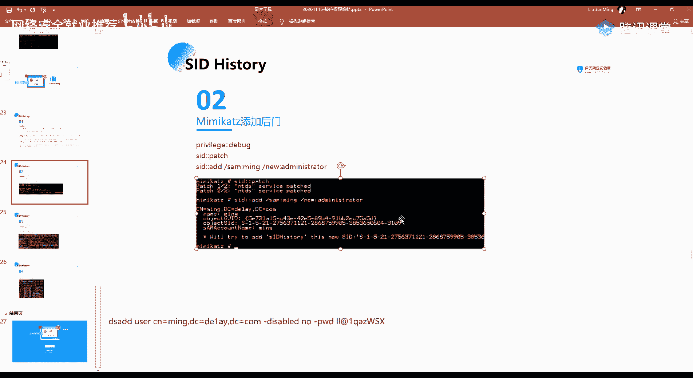

可以看到当前的这个用户是一个mg的。

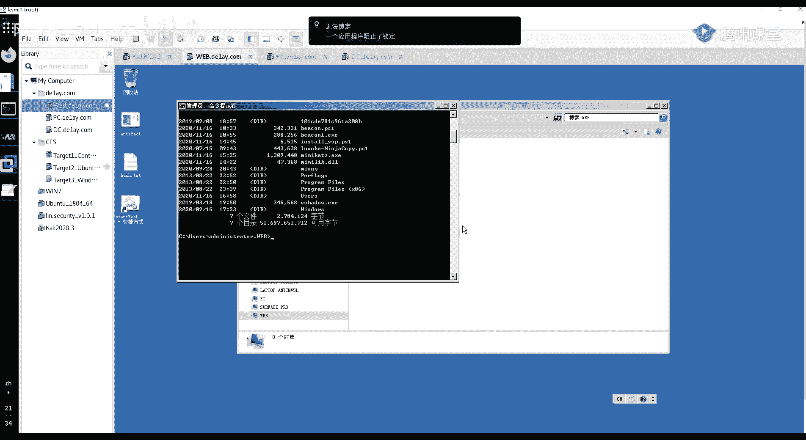

这样的一个用户对吧好，它是一个delay，delay encom这样子的一个域名，然后他那个s i d的话是这样子就预id啊，域名称加这样的id嘛，就是3109，然后的话还有个i d history。

就是预id加这样的id为500的那个，就是管理员的这样子那个s i d，那么在这边的话我就可以通过，就是说我给这一个m i g这个用户，给了这样子一个s i d的一个history的话。

那么我在就说我通过这样子的一个mg的这个，御用户就能够去得到，就是说能够去访问，原来就是预感能够去访问的一个资源是吧，这其实就是能够去得到这样一个，administrator的权限。

比如说在这边我单纯划是一个啊，delete，delete下面的一个m i n g的这样的一个用户对吧，然后的话我可以直接的去访问预控的一个资源，呃以上的话就是本节课的所有的一个内容啊。

大家有没有什么疑问，就是嗯能理解吗，然而本节课的一个内容的话，其实我这边的话有添加到了预习内容当中，就是这边的话给了这样子的啊五个链接，然后这五个链接的话就是分别对这里的，就我本节课所讲的内容的一个呃。

一些知识点啊是吧，当然话我这边p t里面的话，就是比较概括的一个东西啊，然后更详细的一些东西的话，你可以去啊阅读一下这几篇文章，就分别是在这四个啊域内的一个权限，维持方法的一个啊介绍的一个文章。

呃大家有没有什么要问的问题，呃有问题的扣一，没问题的扣二吧，好客户自己去做的话扣三，三这一位同学们，其他同学呢，对玉的话就是windows独有的会有的，我记得是之前是有有有有有有哪位同学问我。

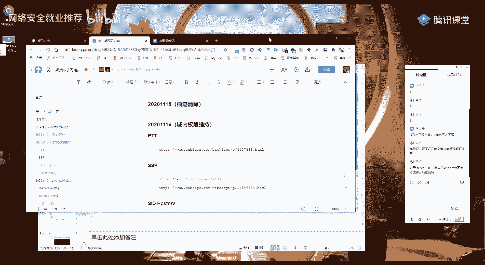

linux下面有没有对应的这种东西啊，就这个的话是windows下面才有的，就预的话，就玉玉的话它是就是为了就是更就是更统一的。

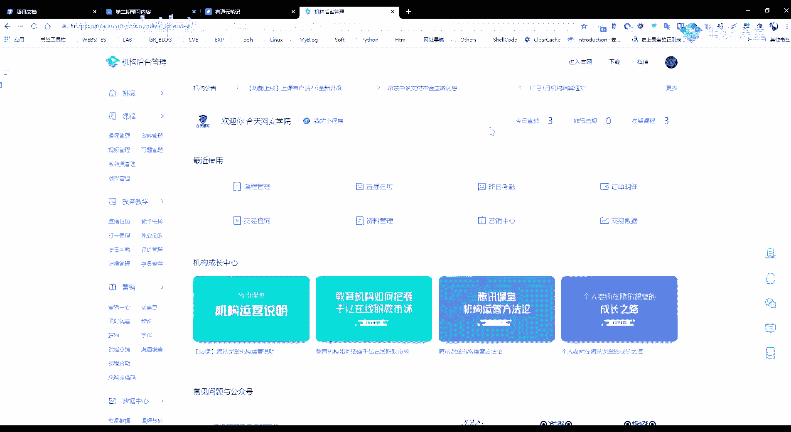

就是说去管理就是多台主机嘛是吧。

就如果说你的你的一个啊，你的一个windows的一个机器太多了吧，你又你有没有一个统一的管理的一个东西，而去管理这样子的，成成百上千的这样子的一个windows的机器是吧。

那么你要去管理他这些机械化是很难的是吧。

所以的话就有了这样子的一个玉的，这样的一个干什么，就前面在讲玉还有工作组的一个呃区别的时候，应该给大家详细的介绍了对吧，好吧呃其他同学的话，就这这三位同学应该是代表了是吧，就代表了其他同学的意见了。

应该是没有什么问题啊，就是大家自己抠去做吧，好吧，然后的话。

然后的话这边的话呃说一下，就是啊今天的话今天这节课，这节课应该是我给大家讲的，就是这一期啊，第二期的最后一节课了，呃后面的这两个的话呃，就是比较简单的这些东西啊。

就是呃有另外的一个老师给大家介绍，在哪边的话，然后的话我之前说的之前说的一个考核，因为呃因为这边的话就是公司方的地方，就是换了地方，然后的话这边的一个靶场的一个平台的话，就是还没还没弄好。

所以的话可能就是考核的话，这边的话会就是有相应的一个推迟好吧，那到时候的话会给大家呃给大家一点时间，然后给1~2天的一个时间给大家去做，然后呃会放到官网上面去啊，放到官网上面去。

然后环境它是在我这边的一个，我我这边的一个服务器上面选，好以及的话就是最后的话再说一下，就是这篇课的话差不多结了啊，还没有去就还没有去，评论的话，去给一个评论，而这个话是加了两个吧。

加了两个还是加了两个屏吧，好吧，啊会的会的，就是会有一个就是啊，就是会把第一期的那个呃榜，第一期的那个也是会那个的话就不会再搭了，就是工作组的这样子的一个多层的一个内网的，一个就是渗透嘛。

然后的话还有一个的话，就是会有一个遇到一个渗透。

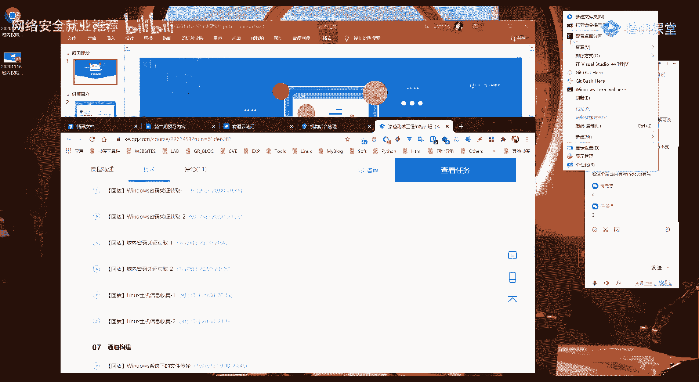

就是在域内的这样子的一个，就是1l到了这样的一个靶场。

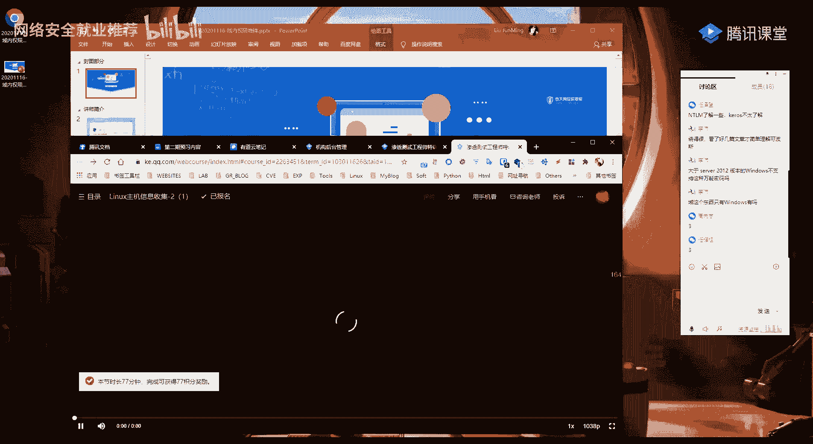

复杂点的话呃，复杂点的话其实都差不多吧，都你你把课上的这些东西的话，你都有自己的去操作，有自己的去理解的话，其实做这些东西的话，应该都是没有太大的一个问题了。

然后靶场的话，因为就我个人这边的话，其实哎我这边没有，因为时间的话都给大家讲课了，就是已经连续讲了快两个月的课了，给大家就是而后面的这些东西的话，就就后面的这些课程的话，都是由我给大家去介绍的吧。

就包括第三期的话，我这边都没得休息啊，然后像呃之前跟大家说的，像呃工具包，工具包这种的话，这个的话我这边抄一点，就是有在慢慢的去搞，到时候的话搞好的话就把甚至说是相关的。

还有的话就我觉得好用的这样的一些工具的话，到时候打包都发给大家，就是以及的话就是靶场环境的话，就是呃你之前的话有说，就是好多搞点这种马场环境，但是实在没时间是真的没时间去弄这种，然后的话其实靶场的话。

这种的话好像那个van van stack的那那些法掌的话，他们当做的好吧，就大家要去做的话，就是我们我们这边讲课的话，用的这个靶场也是用到它的，这个对啊，就是呃，红日红狼群的他们做的这个拔草是吧。

就在哪，他这个话有有一直在更新啊，就是更多的这种靶场的话，大家可以自己去做一下好吧，然后的话就其实呃靶场的话，就是就其实就是一个靶场嘛，但是的话你再去利用他的那个靶场来去好做，做这种东西的时候。

就是你要把你自己你知道吧，就是你要把你自己在我们这种课程上面。

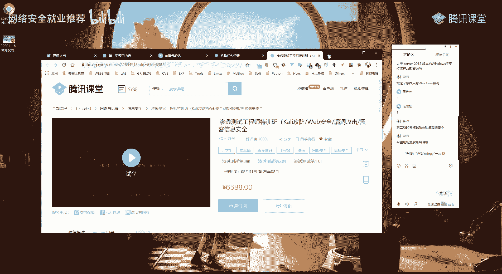

所学的那些东西啊对吧，你要把它都就是利用在这样的一个东西上面，就是利用他这个靶场来去印证你的，来去印证你的这样的一些操作是吧，这才是你的一个目的，又不是说单纯的把这个靶场能力。

你按照这样子的一些东西把它给做一遍，就可以了对吧，你要去思考，就是说你要去思考这样子的一个方法对吧，我可以用什么样的一些方法来去进行，跟它相同的这样子一个操作对吧，以及的话像比如说你横向移动对吧。

横向移动的话，这边的话是呃，通过对应的这样的一些web服务对吧。

那么在横向移动的时候啊，你就可以就是利用了课上有讲的对吧，对应的这样子的一些人，像移动这样子的一些方法，来去进行一个验证对吧，就其实这样子的，就是我们这个课程的一个内容的话。

其实更多的都是要去让自己去进行一个操作，而且的话因为我们这个话是新上的这种课程，就新上的这种课程的话，它的一个b端的话就是不能够去精度里面去呃，精度里面就是实时的精度里面，去做这样的一个东西啊对吧。

就是我这边看pv的一个内容对吧，然后的话我如果是如果是线下的话对吧，我就可以就是我经过你对吧，进步，每个人就是你每个人，你都需要把我这边pd的一个内容，你自己都要去动手做一遍是吧，那时候他姓相信三的话。

这种的话就是完全靠你的一个自觉啊是吧，所以的话呃你学东西的话，这种东西的话也是靠你的一个资源是吧，我这边的话就只能是说就我们这种培训对吧，培训这种东西，其实只能是说把你带入到这样子的一个门当中。

而不是说你从你从我们这种培训，包括其他这种培训，你就能够去把你你的之后这种事，要一个发展的一个内容都能够学到，这不可能的，这就我们的这样子的内容呢，是把你就是领悟到这样子的一个就带了。

把你们把大家带入到这样子的一个门对吧，然后的话呃那你们就是门槛不会太低是吧，就这些内容的话，其实呃就是应该算是比较多的一个内容了，但是的话就是你想要有更好的一种发展，而更多的一个发展。

你还需要去不断的去学习，所以的话就是大家的一个就是学习的一个方法，以及你学习的积极性，这种你都要就是说你要自己去进行一个呃，自己去进行一个总结掌握，啊像比如说你的一个学习方法是吧。

你碰到问题的一个解决的一个思路，以及你去碰到相应的一个问题，你是想着怎么去解决，像现在的话就是你碰到一碰到问题的话，你可以问我对吧，但是的话你你不可能就是说一直到一直有机会，或者说一一直能够去问别人的。

所以的话很多时候要靠自己去解决，去解决相应的一个问题。

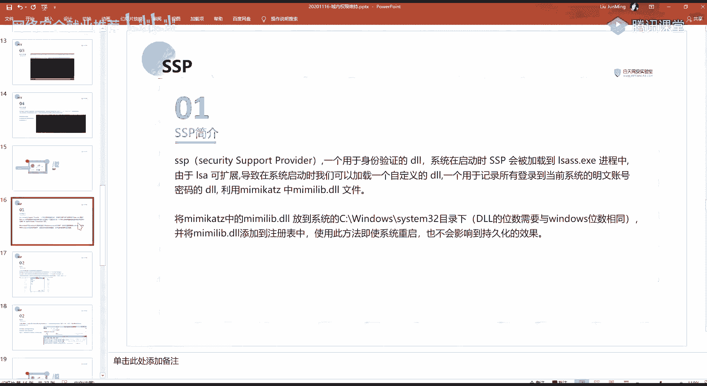

就解决问题的一个能力决定了，就是说你去你学这个东西。

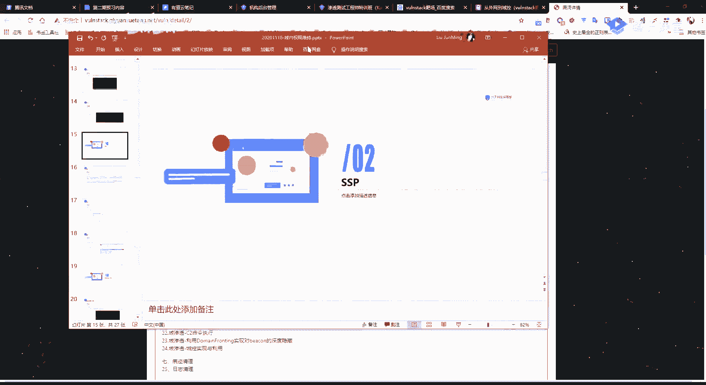

你能够去呃学的就是学的有多好多深了对吧。

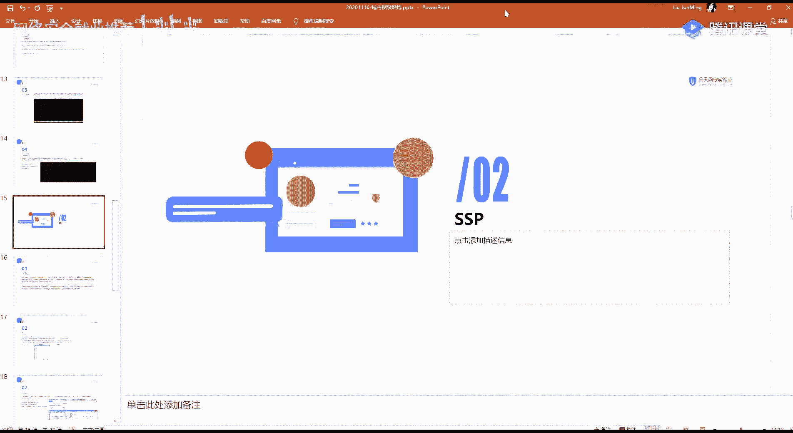

那你学东西的话，你肯定避避避免不了，没有问题是吧，你没有问题，那么你就是最大的一个问题，然后的话有问题的话，你解决了问题，那么你才能够有对他有印象。

你才能够说呃你呃知道了他的对吧，然后下次再碰到这个问题，你就能够去解决，好呃这边的话给大家就闲聊了一款是吧，说了点闲话，就是其实还是就是就是让大家就是告诉大家，就是，你之后的话，不管是你的一个。

不管是你之后的一个学习还是生活什么的，都其实很多时候都是要靠自己是吧，好吧呃大家没有什么其他问题的话，我们的一个课程的话就到这边就结束了，好吧，本节课的话，好啊没有，那大家早点休息吧。

