# P85：第59天：Windows&Linux痕迹清除 - 网络安全就业推荐 - BV1Zu411s79i

也就是对我们渗透测试所留下的日志文件，进行一个清楚，那大家呢还是要知道，大家在课后的时候，还是不要忘记要把这些命令都敲一遍，形成一个自己的文档啊，保存下来。

以便日后的复习，还有使用，首先呢我们还是先来了解一下如何，为什么要进行一个分析清楚，就是因为呢我们在渗透测试的过程中，我们所做的这些操作啊，比如说呃前面的课程所讲过的这些远程登录，你去添加用户。

执行这些敏感的命令，即使你获取这个密码，来调用了这些系统的进程和服务，都会在操作系统上留下日志啊，前提是这个操作系统啊，已经开启了这个日志服务啊，一般的windows server呢是已经开启日服了。

那你这些敏感操作他会留下日志，那别人的管理员就可以利用这个日志呢，把你给抓到，所以呢我们在渗透测试的最后一步，都就需要对windows和linux，操作系统的日志进行一个清楚啊，当然了。

现在的一些公司的这个网络呢，它是有专门的日志一个服务器啊，包括一些流控，那这些呢我们是没有办法，没有权限去登录到他们的日志系统上去，给清楚的，那我们在避免在日志上面留下我们的痕迹啊。

最简单的方法呢就是挂代理，别的话，我们是没有办法去操控它这个日志的硬件，这个东西的，那我们这里呢就是讲如何从系统的方面来清除，系统的这个日志文件，首先呢我们来看啊。

windows那windows的一个日志大家应该如何查看，就是右键我们的windows可以查看到一个事件管理器，在这里面呢就有我们的windows日志，或者是你输入运行。

然后运行我们的invent vivo，也就是我们的事件查看者，事件查看器，点msc这个文件呢，同样能够打开我们的事件查看器。

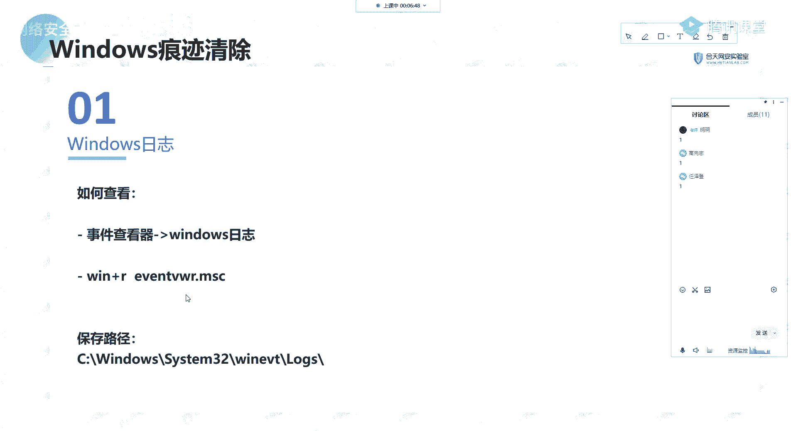

我们来看一下这里我使用的靶机，还是我们最一开始安装的这个dm control dc，这个windows 2012，我们去右键我们可以看到事件查看器。

然后呢，windows日志，这里就可以看到我们windows所保存的日志信息，或者我们使用windows下下二输入我们的in b，是1v n e t啊，这个msc，啊也可以进行这个操作啊，是一模一样的。

那windows它的一个日志，windows保存文件的两个地方呢，第一种就是保存在我们本地的文件，那第二种呢就是保存在注注册表里面，那这里呢它的日志信息是保存在我们windows。

安装路径下面的w i n n e v t log，这个目录里面，你可以去打开，看它呢就是保存了我们这些日志信息，那通常呢windows server默认它这个日志是没有被开启的，那我们应该如何去开启呢。

可以在我们的管理工具里面啊，点击我们的本地安全策略，然后这里大家可以看到啊，本地策略里面有个审核策略，那审核策略呢就是对我们这个日志审核，进行一个开启和关闭，比如说我们审核登录事件。

那我们在这里呢就可以进行操作，是审核是否登录成败成功或者登录失败啊，进行确定，它默认的话是全关的啊。

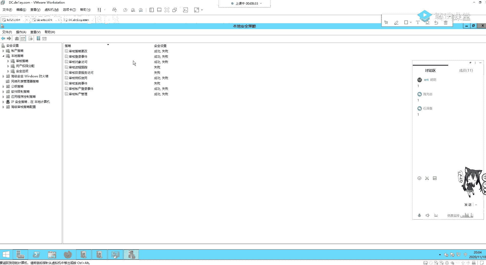

默认的话是全关的，那我们可以在这里开启。

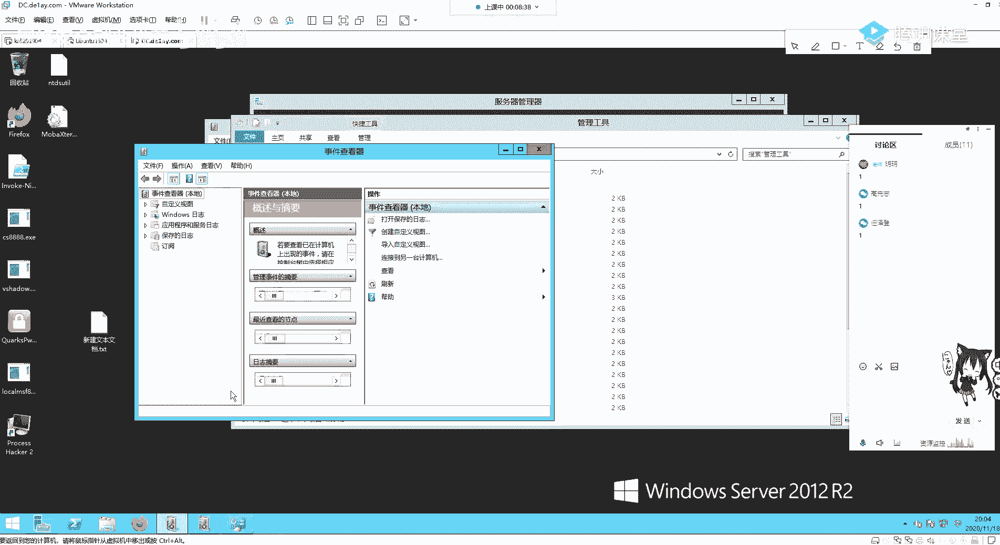

并且呢我们可以在这边的windows日志啊，对它进行一个操作，比如我们的安全日志，我们可以点击它的属性去查看，ok我们默认的这个windows server 2012的安全日志呢。

它保存的是128mb的这个大小，那我们通常的windows操作系统呢一般是20mb，这里大家都可以进行更改，也可以看到它保存的一个日志路径，那我们接下来继续来看windows日志。

那windows日志呢主要是包含五个大类，分别是应用程序，application，安全security，还有set up系统system，还有转发事件，我们的forward events这个五大类。

那这五大类呢我们首先在渗透测试过程中，关注的呢可能会留下日志的，一般呢就这三大点，第一种system，那system呢主要是记录系统组件所产生的事件，就包括我们的驱动程序。

系统的应用软件崩溃或者是数据丢失错误，都会记录在我们的system日志里面，那application就是应用程序日志，这里我就不多讲了，就是主要记录我们城市运行方面的事件，那第三点呢就是安全日志。

也是我们在渗透测试中啊，在这个管理员去取证调查中最常用到的日志，security安全日志，它包括了我们用户的一个登录对象，访问进程的一个开启和关闭，包括特权使用啊，账号管理，还有你的本地策略变更。

都会去写到我们的security日志里面，那我们首先呢需要关注如何删除这个security，这个日志，ok删除它分非常简单，我们只需要使用一个windows自带的工具。

叫做啊w e v啊t u t这个工具，那这个工具呢是用于检索，事件日志和发布者信息，也就是说，你可以简单理解为是一个事件查看器的命令行，我们可以通过这个工具呢进行一个删除，查看检索。

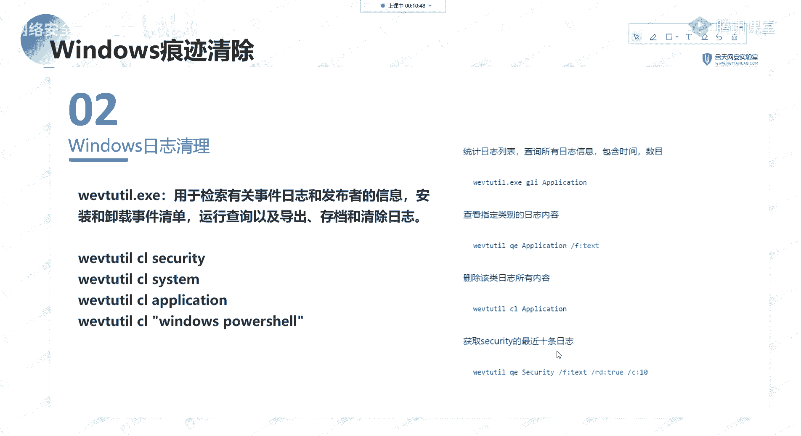

还有导出我们的日志，那它的使用方法也非常简单。

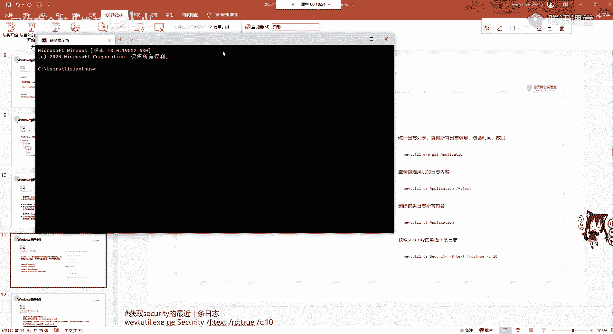

我们只需要在这个我们的cmd里面，输入这条这个可执行文件，它就会输出它的一个帮助文档，那它常用的一个命令呢也就包括我们的gl，他都告诉l，他告诉你的是列出我们的日志名称，去获取日志的配置信息啊。

发布者信息或导出清楚日志。

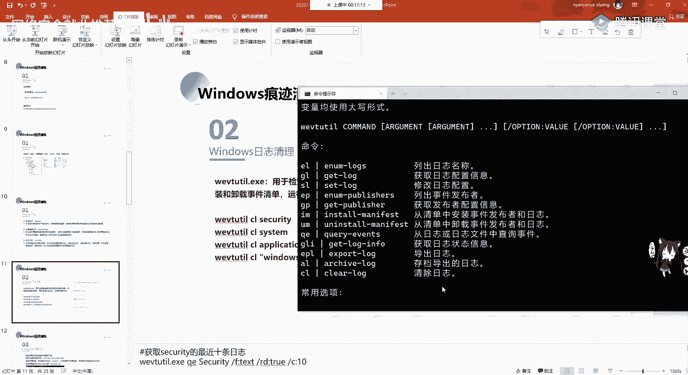

那下面呢也有几条常用的命令，大家可以大致了解一下，首先呢就是qe security security，大家应该还知道，就是我们最重要的这个什么这个安全日志，最重要的是安全日志。

然后f呢杠f在这边都有一个解释，我们先看q e啊，q e呢就是从日志或日志文件中进行查询事件，那杠f呢他没有讲，他们这里没有讲，那gf呢其实就是format，大家使用那么多参数一定也都知道了。

也就是使用test的格式呢进行一个日志的输出，然后呢进行一个也这句话的意思，意思呢就是过去我们的security日志，安全日志的最近十条，那你想获取前十条呢就不加这个r d true。

它的意思呢就是获取最近的以时间为排序，那获取最一开始的前十条呢，就把这个给去掉，然后c呢就是grow嗯，chrome就是那个列的意思啊，获取几条是数据，然后然后呢我们可以使用默认的视图。

默认的视图呢它使用xml进行查看的，也就是我们的test视图呢并不会输出我们的事件，rd这个事件i d是什么呢，在我们在这边你会看到都有一个事件。

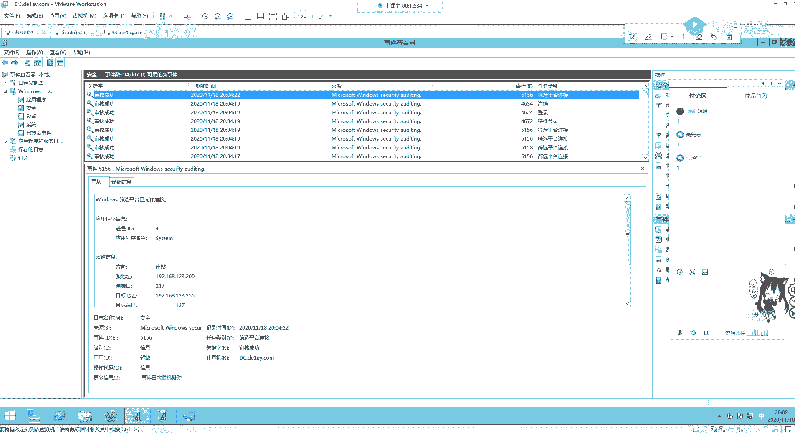

ok我在这边放大放放大一下。

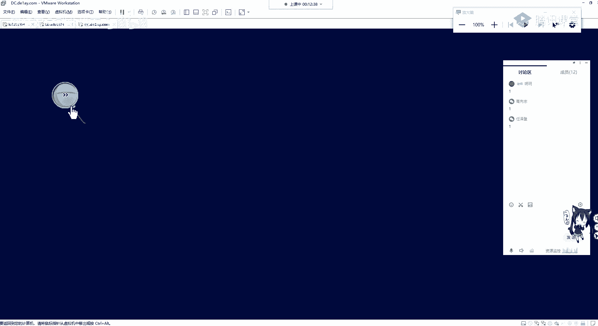

这不是使用这个放大，大家应该能够看到吧，这个事件rd，那事件id呢就标注了，我们这个事件到底是属于什么一个类型，ok那我们在这边。

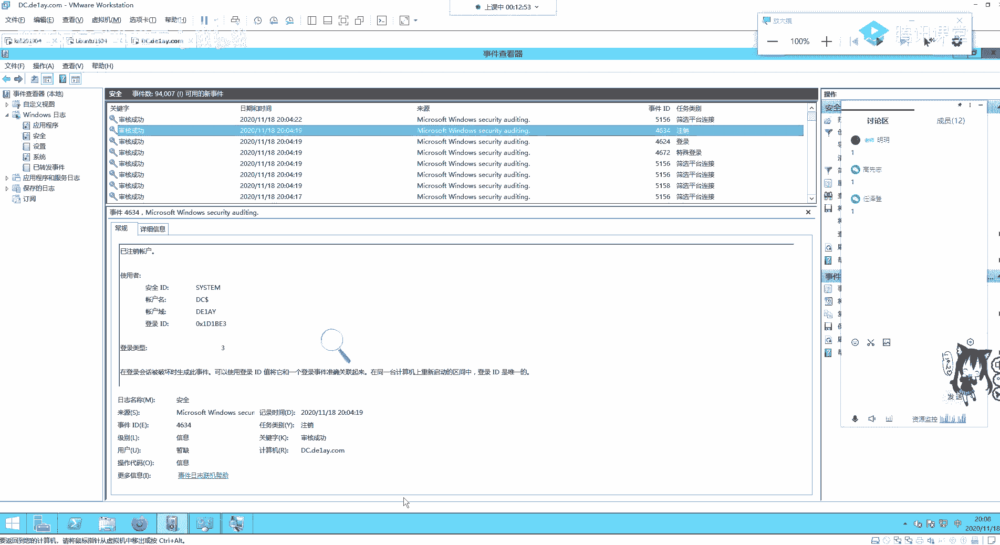

这个放大镜。

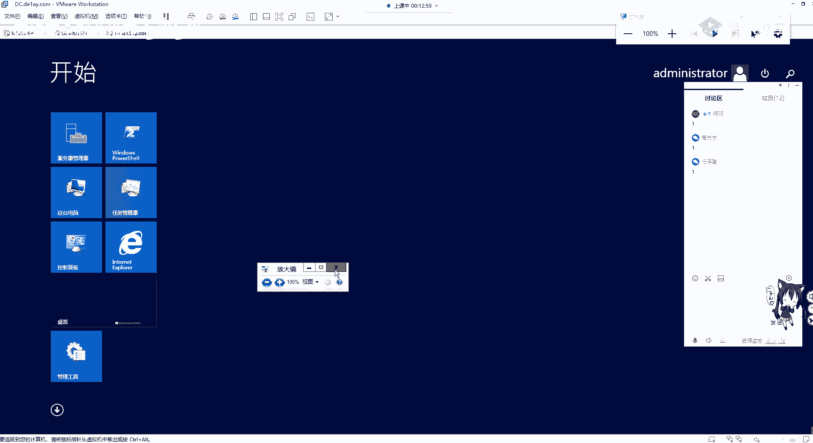

ok那我们在这边呢，默认的视图是使用xml进行查看，也可以使用下面一个参数叫e p l，把security这个日志，安全日制的全部导出到我们的一个1。1，v px这个文件里面。

那我们就可以把这个文件呢拖到其他的机器上，进行一个日志分析，那这些参数呢大家都不需要进行记忆，英文的帮助文档已经讲的非常清楚了，这个e p l呢就是我们的export log导出日志。

那么接下来来看我们最需要用到的就是cl cl哦。

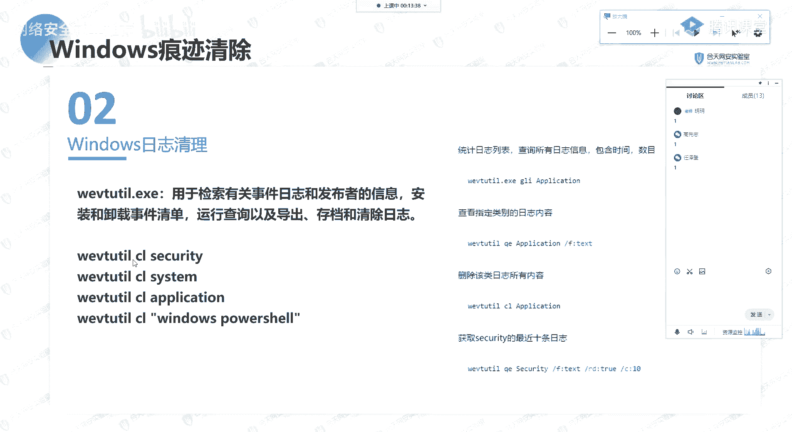

这个是clear，ok这个cl的意思是清除日志。

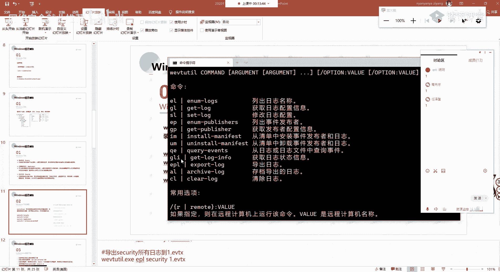

那我们可以zl加上我们所需清除日志的，这个类别，进行一个自动化的清除，比如我清除security我们安全日志，system系统日志，应用程序程序日志，包括我们的windows power shell。

大家都知道呢，windows的一个日志呢不仅仅是包含这五大类，大家可以到这个嗯e v w t，然后到这个路径下去查看，你会发现呢，有很多的这个日志文件进行一个自动化的删除，这个大家应该没有什么问题吧。

就是使用一个自带的一个工具，那下面一个呢就是我们在讲msf的时候，已经给大家提到过了，也就是我们的matter create go，渗透环节就有一个非常重要的命令叫做clear ev。

是呢清除我们的安全日志，系统日志和应用程序日志，这三个，也就是我们最开始讲的这三个最重要的日志，只要使用我们的clear ev就可以自动化删除，但大家要记住啊，我们删除这个日志呢就需要一个管理员权限。

如果我们是一个普通用户的权限，就是没有办法去删除我们的安全日志，系统日志等等，ok，那在我们获取到这个对靶机呢进行，完整的渗透之后呢，我们首先因为在渗透过程中，有可能会添加一个账号。

那首先呢我们需要把这个账号给删除，使用net user，user name杠d e l delete进行一个删除用户，那这里我就不多讲了，然后呢需要删除在渗透测试中所使用的工具，包括你上传的这个后门啊。

上传这个木马都需要进行一个删除，而第三点呢就是关闭我们所有的metaphor连接，使用sessions gu，大k大k呢就是我们的刚关关闭所有q啊，关闭所有的metaph链接，那为什么要关闭所有的呢。

因为我们的mea prison在真正的这个靶机上面呢，是开启了一个应用程序，也开启了一个进程，和我们的msf所在的这个攻击机进行连接的，那我们为了避免发现呢，我们需要把这个session呢给关掉。

ok那matter create呢，还有两个就是可以删除我们的事件日志，这个删除的事件日志呢，和我们的clear ev是相同的，我们可以run event manager，就是查看我们的什么。

我们的事件，我们管理器杠i呢，就是可以查看我们的事件日志，删除日期，实验日志上，就使用我们的杠c命令进行一个自动化的删除，ok那这里呢他会告诉你啊，比如说这里他会告诉你。

clear application也是clear我们的ie浏览器的一个记录，包括clear security and clear system，还有clear，我们的这个power shell。

都是和我们之前的这个命令，执行的是完全一样的，这个操作大家就是任意选择一个即可啊，也不需要进行一个记忆，也不需要进行记忆，好matter bro，你不会的话，直接打个问号或者出个help。

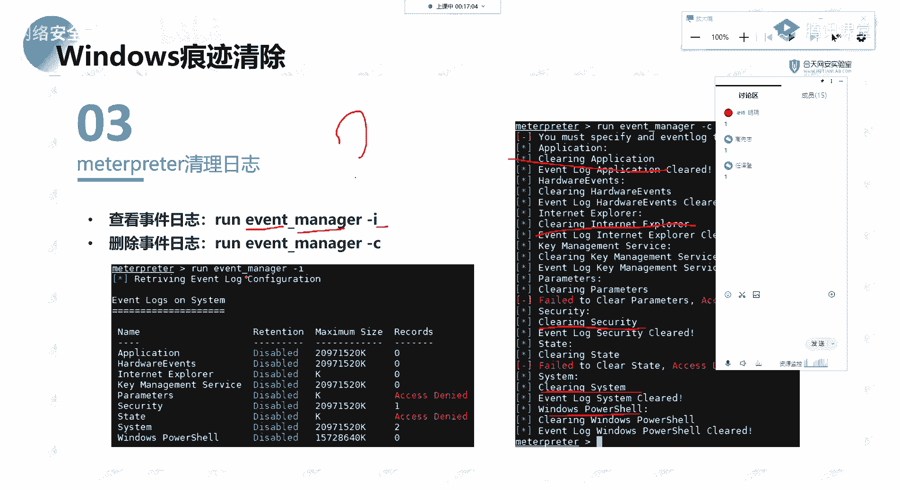

他都可以输出这些指令，大家应该都非常清楚了，那么下面来看呢，如何使用这个powershell脚本进行一个分析，分析清楚，那我们想让他清楚痕迹，前面的这条指令都是什么，把这个整个的日志给清除掉。

我一条都不留，那这种方法呢就很容易被发现，比如被发现之后呢，他通过其他的设备去观察你的ip啊，把你给抓到，那这里呢我们就可以使用power shell脚本，或者是手动的给它关闭，把这个日志服务呢关闭。

首先呢这个powershell脚本呢就是使用的啊，用book这个p h i n t什么00m这个power shell脚本，他在我们的这个github上面，你可以去看一下，ok可以直接把它给下载下来。

并且呢这有一个使用方法，使用方法非常简单，那这里的使用方法呢，就是我们在前面内容讲过的，就是一个本地导入，我们将这个pashell脚本上传到我们的法基，然后进行一个本地的一个导入。

后面呢我们这个使用的呢就是一个远程加载，power shell的一个指令，那远程加载的一个好处就是加载到内存执行，而杀软呢并不会对内存进行检测，那就可以很好的这个越过我们的杀毒软件，那这里我就不多讲了。

它如何进行一个远程导入，首先呢我们需要在vps上，将这个power shell脚本给上传上去，ok我把这个链接发到我们的讨论讨论区，首先呢我们需要上传上去，我已经上传好了。

在我们的在我自己的v p s下面的tools文件夹，ok在这个地方，在这个地方，那我们就需要使用python进行，开启一个8000端口的临时的http服务，ok开启之后我们就可以运行这条命令。

大家在运行的时候还是要提醒大家这个ip啊，不要使用这个，因为这是我自己的vps的ip，大家需要更换为自己的，然后将它直接运行过来，在运行之前呢，我首先给大家看一下，那记录事件的这个进程是属于哪一个呢。

我们可以在任务管理器看到，点击详细信息，对这个机器比较卡呀，ok这是详细信息呢有s v c h o s t，它呢就是属于我们windows服务的一个进程，它里面运行着我们一些服务，比如说登录服啊。

日志记录服务，那我们可以点击服务这里去查看vlog，也就是我们的日志记录，我们可以点击转到详细信息，或者记录他的p i d为932，在这边的详细进行进行寻找，我们可以转到详细信息啊，932932。

那这里为了给大家演示效果呢，我就是使用的per这个进程，hk这个工具呢进行一个演示，ok我们找到我们的932进程，去点开去查看它的线程，大家会发现呢有三个四五个。

三四个线程的是执行了我们的一个日志记录啊，surprise，也就是我们的日志记录呢，其实是有四五个线程在跑的，那我们将这个脚本，将这个指令呢给复制过来，我们运行一下，看它会不会关掉。

ok那么在这边呢需要使用打理，需要使用我这个管理员进行一个运行啊，需要使用管理员，不然的话我们关不掉它，ok我们右键粘贴来进行回车，来查看这边的vlog会不会进行关掉，那这边我们来查看是否会有请求过来。

啊那这个我这个靶机比较卡，因为我开启了这个放大镜台，就一直很卡，我来看一下，ok这边呢是已经接收到了这个请求，稍等稍等一下啊，前面的这个大家应该没什么问题吧，如果有问题的话，可以在讨论区和我交流。

那等待一下它的运行，那这里呢也有另外一种方法，那我们先讲吧，那第二种方法呢，就是在服务里面直接将我们这个进程给结束掉，也就是blog，它所对应的这个p i d这个进程给结束掉。

那你千万不要去接触其他的一个进程啊，因为其他进程呢它下面是有线程，运行着其他的服务的啊，千万不要去啊，这个盲目的进行结束，我们可以在这边进行看一下，ok这个结束大家应该都会吧。

就是任务管理器来点击我们的服务啊，这个把932这个直接给q掉，使用我们的test you，ok那这边呢大家应该刚刚应该看到了，他把我们这些线程都关掉了，并且呢。

这边ok这边的invent log的线程也都关闭了，也都关闭了，那是不是就没有办法去记录我们的日志了。

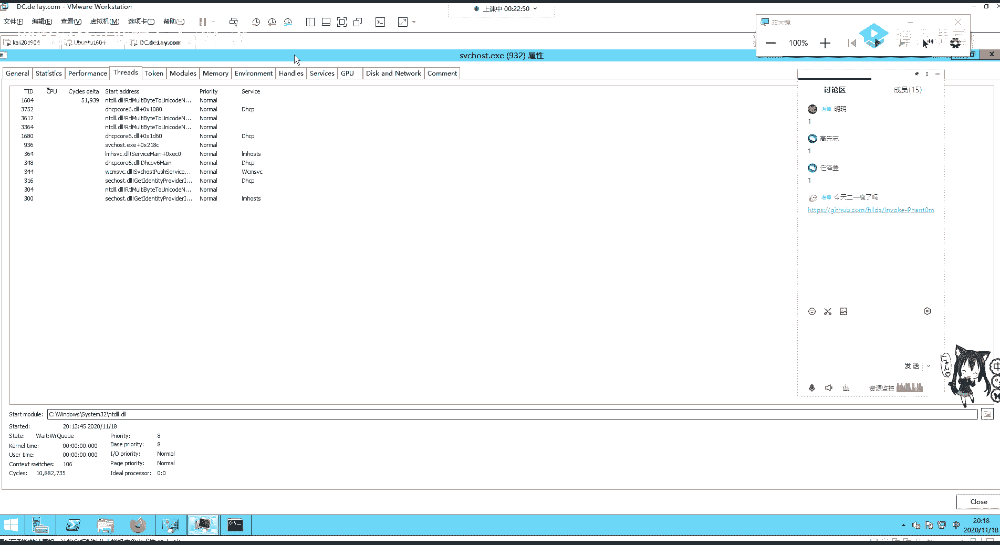

它确实是确实是这样，那我们可以进行一个查看，ok我们可以在这边进行一个查看，点击我们的事件查看器，ok这个靶机有点卡呀，我我将它重启一下吧，重启的话，那个日志又会打开，ok在事件查看器里面。

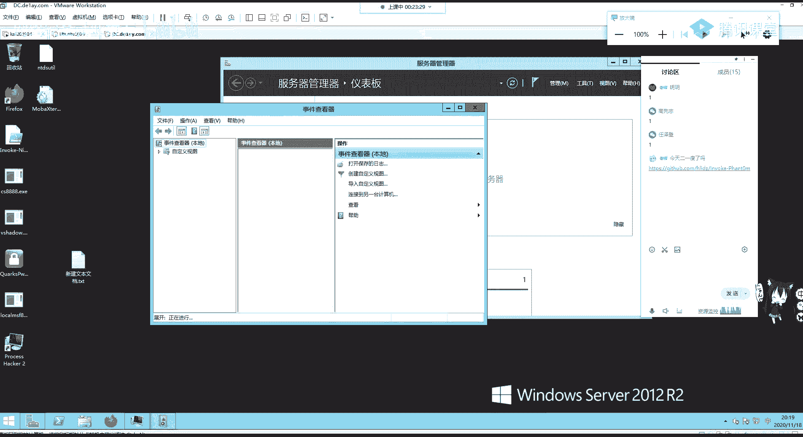

我们找到我们windows的一个日志，找到安全，然后呢我在这边进行一个新建一个用户，大家来进行观察一下，可以这个已经非常卡了，是，比如使用我们的，比如使用我们的nuser，ok我将它重启一下吧。

这个已经没有办法用了，那我们待会儿再给大家看，ok那我们先继续啊继续，那这个将这个进程结束，大家应该没有什么问题，刚刚已经讲过了，那下面我们就来看如何把linux的一个痕迹清楚。

那linux首先我们要清楚什么东西呢，最重要的就是我们的登录日志，也就是使用ssh进行远程都日产生的日志，再讲linux各自基础的话，大家应该还记得我们when linux的日志保存在哪。

保存在我们vr下面的log目录，那log目录下就有我们各种应用程序，或者是服务的这个日志，我们可以去看一下，啊比如说就我这个v p s来来说，这个v p s我们可以cd到v a r log下面去查看。

ok那这里就是有这些服务的一个日志情况，包括http，也就是我们的web日志，那首先呢我们需要看几个指令，这个命令last last呢就是查看我们的log，下面的w t m p这个日志文件。

这个日志文件是显示了，我们所有成功登录或登出的一个历史记录，那last b呢就是调用了我们所有失败的尝试记录，那last log呢就是打印我们的登录记录，那who呢也就是我们当前登录的一个信息。

大家应该都对这些命令都有所了解，那么大家给大家看一下就行，可这里比如说我们输入我们的log last，也就是我们这个登录的一个历史记录，登出登录的一个历史记录，那么输入lb呢。

就可以查看一个失败的尝试记录，那大家在自己的v p s上输入lab，如果你没有去更改这个入口号的话。

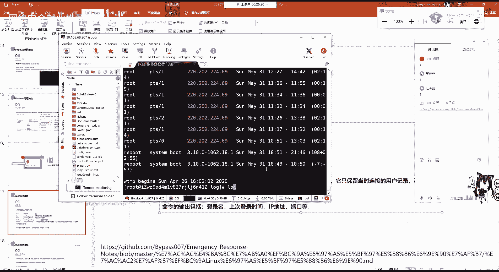

你会看到呢会有很多进行了一个爆破，ok那这边给大家看一下lab，大家会发现这些ip我并不知道是未知的ip，并且呢他使用的一个用户名，也就是我们常见的这个管理员用户名，也就是呢别人使用这个公网的机器。

对公网目标进行一个批量的爆破，ok进行一个批批量的爆破，如果想避免这种被爆破进来的话，有两种方法，第一种呢就是更改我们的弱密码，就不要使用弱密码，那第二种方法呢就是更改我们的22端口啊，改成大端口。

大家都知道在使用nmap扫描的话，我们一般不会扫描全端口，因为扫描是非常慢的，并且呢他在公网上，你这个网络环境有可能不同，扫描得非常慢，那这里呢我们可以把22更改为一个大端口，那就比如说12345都行。

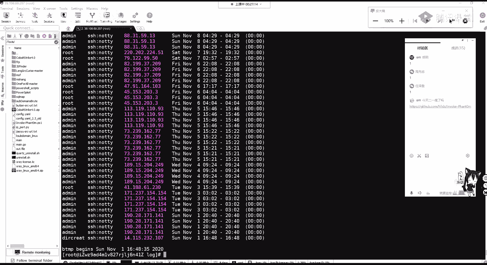

就可以避免这个爆破攻击。

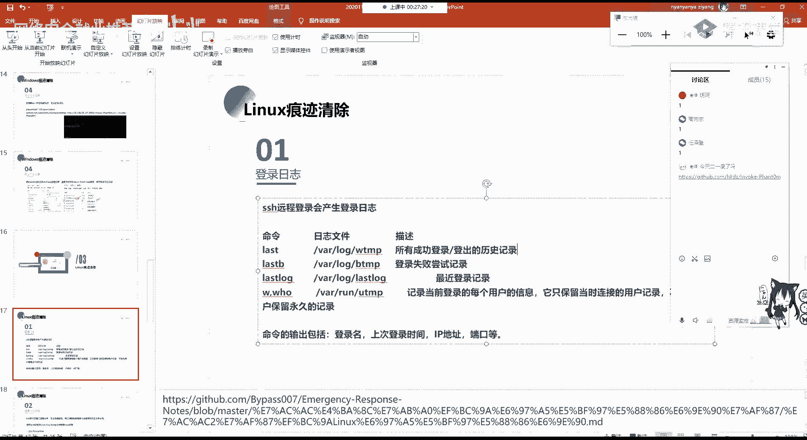

ok那拉丝log也是同样的一个内容，就可以看到这个登陆的一个情况，那这些有些东路呢，比如说我们3w刚刚带他这个阿帕奇的用户，或者是f t p，这些用户呢是linux 4自带的这些用户。

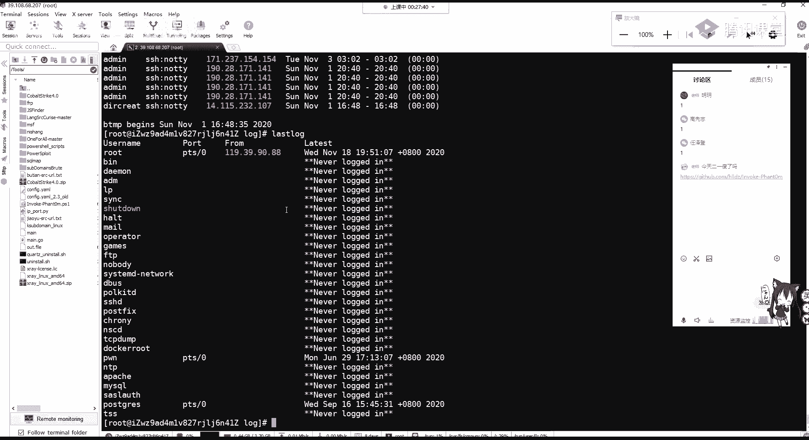

它是不具有一个登录权限的，大家应该知道啊，在etc password都能看到是no log。

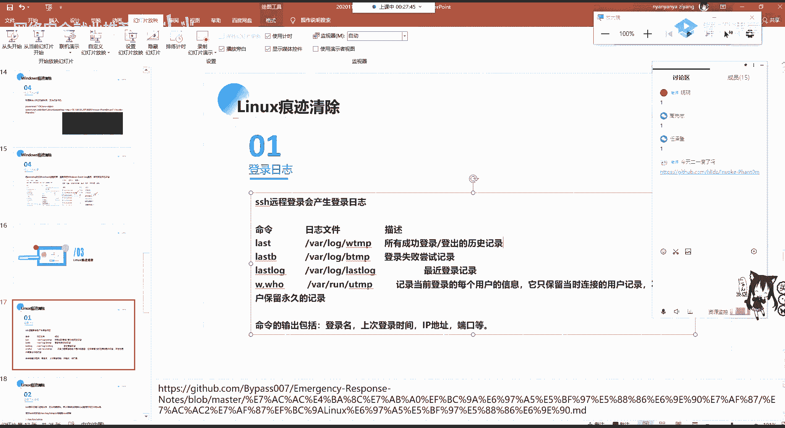

也就是不允许登录的，那who和w呢就是查看当前登录的一个情况，那这里的话，我当前就是使用我们的s s h进行一个登录的。

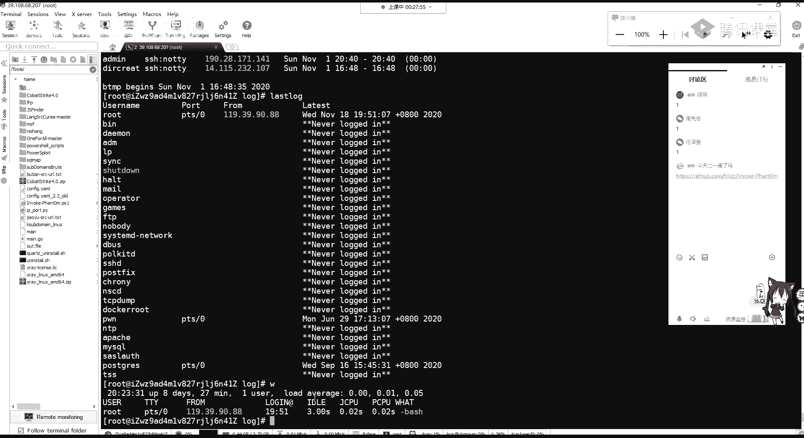

所以呢我们看到的只有一个记录，下面我们继续来看，ok这个已经讲过了，这已经讲过了，那清理呢我们的last的是一个二进制文件，并不是一个t s d文档，我们没有办法直接修改，所以呢我们只能清空日记文件。

清空日志文件本身，那所清空我们的last b或者是last，这些文件呢就需要一个管理员权限，大家要记住，你所清除日志都需要管理员权限和这是必须的，那我们可以把vr log w t m p把它替换为空。

或者直接把它给删掉啊，都是没有问题的，下面一个web日志，那web日志呢就是我们在访问网站的时候，会在这个阿帕奇或nginx，或其他的web中间件上所留下的这些日志信息，那我们需要把它给清除。

如果你不是清楚的话，比如你上传了一个web shell，他的名字呢叫shell。p h p啊，shell。p p，那你现在去用e键啊，去连他，你是不是就是发送了一个get请求或者是post请求。

那你就会在这个log日志里面留下这个请求信息，那这里呢就会被管理员发现，因为你不仅留下了你的请求信息，还留下了你的一个呃，这个投信息包括ip地址信息，那我们平常web日志保存在哪里呢。

就保存在我们的vr log下面的h t t p d，这个i c c e s s。log，或者是阿帕奇二这个log文件，那这两个呢分别是，一般呢是使用我们的阿帕奇i o i m p，来进行一个保存。

如果你使用的是其他的中间中间件，比如nginx，那它保存的呢就是我们的vr log，下面nginx这个电脑和文件，我们可以去看一下，ok这里呢我就看我本地这个卡里里面的这个。

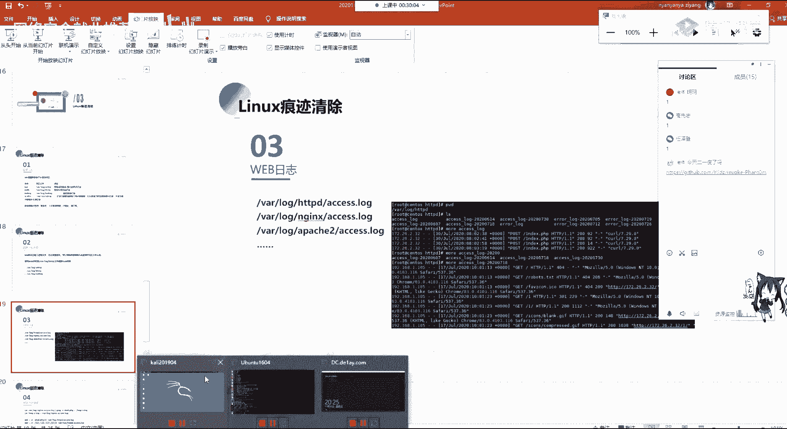

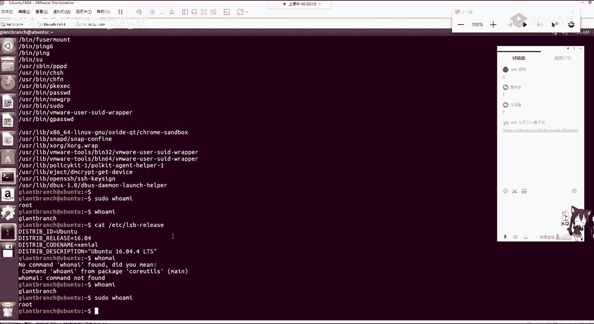

ok我们可以在这边，去查看一下cd到我们的vr log，你就会发现呢这是有阿帕奇二的阿帕奇二，那么cd的阿帕奇二可以看到它的一个访问日志，ok这里我是没有访问制的，那我们可以进行一个简单的演示啊。

比如说我先把阿帕奇二这个服务给开启，我们将它开启之后呢。

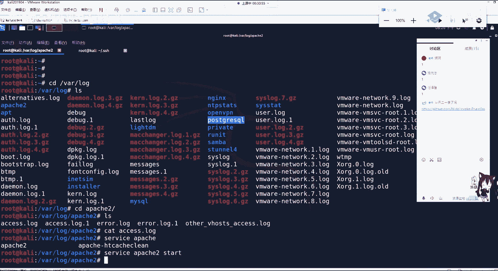

可以进行一个访问啊，访问我们这个ip，啊进行访问一下，那我们再去看它的一个log，可以看到呢，我们是不是访问了他的一个robot p i t。

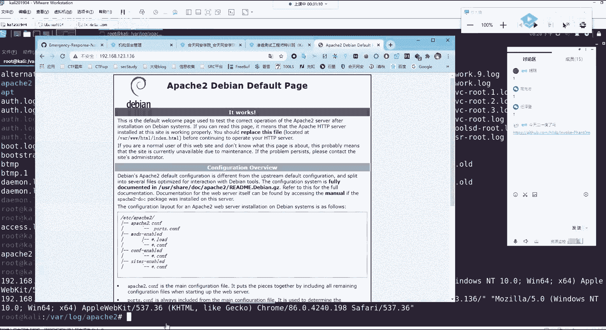

包括它的这个小图标，ok这个小图标都访问到了，包括呢这里使用ea使用的是本机，那么显示的就是vmnet 8网卡的一个地址，那nginx呢保存的就是nginx目录，大家应该没有什么问题。

那么如何将它删除呢，就是使用这几条命令，首先呢我们这里并不需要可以对你，第一种方法呢，就是可以对整个的这个log文件进行了删除，那你如果只想删除你自己留下的，这些敏感的日志。

就可以使用我们的gr 1 p加上杠v，那杠v是什么意思呢，就是我们的g r e p的反向查找参数啊，这个反向查找也就是查找什么，查找除有shell。p h p。

就是查找除下午点p h p所在的所有的信息，那么查找之后呢，再把这个信息去再次写入到我们的temp i d log，是不是就可以把我们的这个shell点菲律宾给剔除，那gr 1 p杠v大家有可能不清楚。

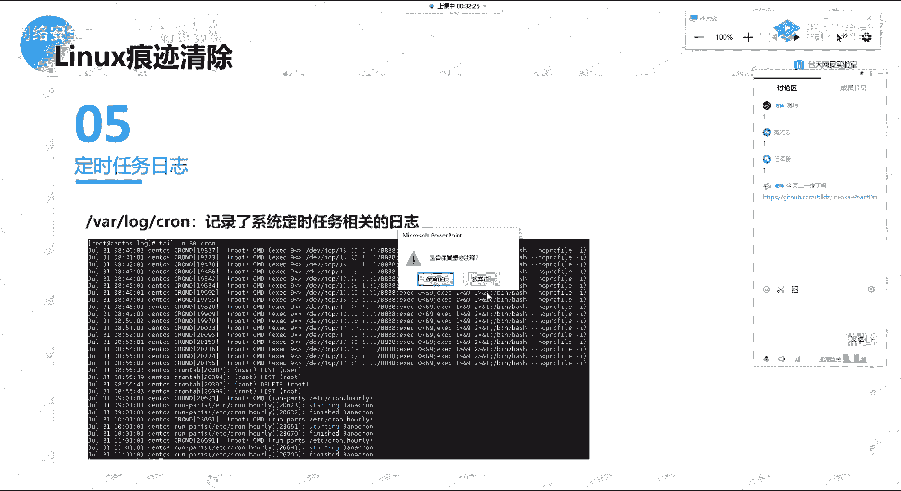

那我给大家简单做一个演示，ok比如说这里呢我进行一个呃touch啊，比如说touch一个a。t i t，然后进行啊设设置一下，写几行东西，我们象征性的写几样东西啊，比如说hello world。

好下面比如说啊去写个team啊，jobs ok再写一个t t t给我们保存下来，然后我们将什么，我们cat i。t t很简单，就是查找它，那么将cat i。t t加上我们的gp杠v，我们想剔除。

比如剔除jobs这一行，ok我们再去查看，那它显示了一个危险的结果啊，就是除去我们指定的这一行，其他的学校行显示出来，那我们就可以使用重定位符，给他写到另外一个文件里面，比如b。t i s t。

那么可以cat b。t t，那这里呢就成功的把我们的jb给踢出去了，那同样的我们把shell。pvp使用gp杠v呢，就可以把shell。pvp，这条日志记录给从我们的log里面给踢出去。

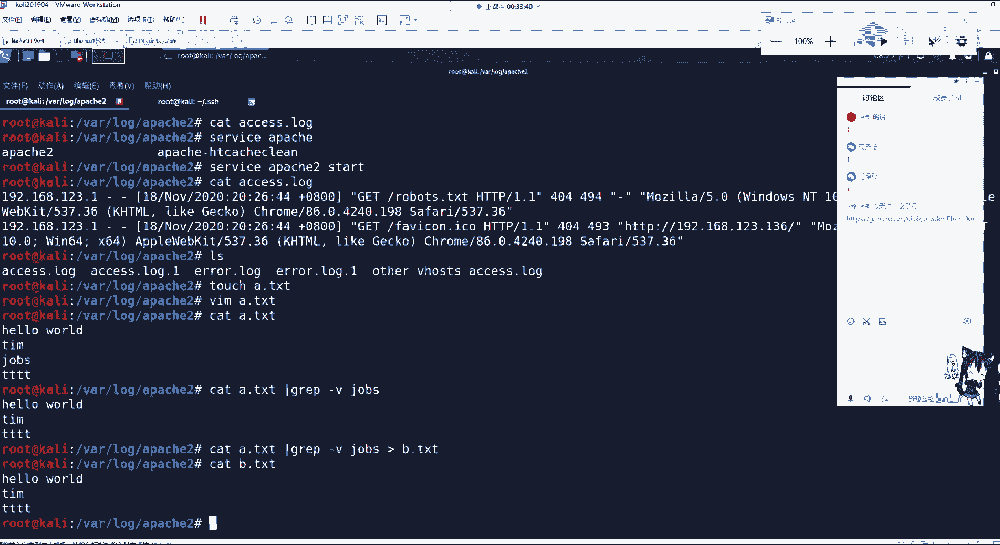

ok那么再继续来看那下面一条命令吗，就是我们的啊，一是一样的，这个cat tap就i。dog，就是先写写入之后呢，再把我们这个t log，写入到我们的这个ngx的log里面。

那下面就是使用我们的send命令，send命令sgi，杠i也是什么，就是去匹配好，去匹配，我看你记不清的话，可以去查看一个文档，我们来看一下，在这里我也记不太清这个怎么是翻译，send命令。

ok send命令的杠i参数，那杠i参数呢就是我们的编辑文件，insert啊，编辑文件，那编辑文件我们来查看，我们先讲一下这些参数，第一章编辑文件，杠一呢是指定了我们可以在这一条列行命令哈。

去执行多个指令，那这里呢大家可以不需要关注，然后shell点菲律宾啊，这个正则匹配符，他就是在我们这一个文件里面去匹配shell，点菲律宾匹配到之后呢，使用我们的d也就是delight。

将这个shell shell的pp所在的行记录给它删除掉，从我们的http日志里面删除掉，ok这里我给大家简单做一个演示。

嗯比如说我这里呢已经留下了这些日志，我现在想要把哪一个呢，想要把我们的robots这个t i s t给删除掉，就使我们的sin杠二和杠一，然后加上什么，加上我们的一个正则。

一个匹配的好匹配这个f i v i c o n，然后呢加个d，再加上我们当前路径的，这ok这时候呢我们再去看查看一下，这个可以看到我们第一条访问robot。t t的，这个日式呢已经被成功的清楚了。

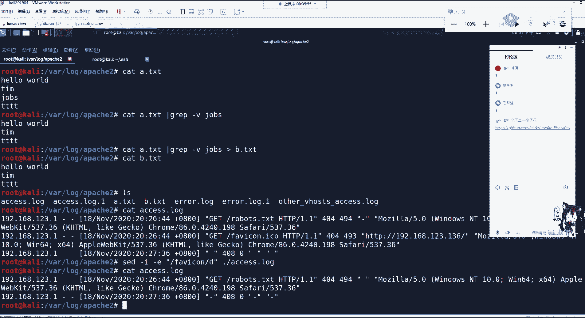

就使用这条指令，那下面这个也是一样的，它的意思呢就是清除包含123，123123的这个字符串，那这个123呢就是我们自己的i p，你需要进行更改，比如说你在这个网站上进行渗透。

那你留下的呢肯定都是自己的ip，你将包含于自己ip的这些日志给清除，就可以合理的去隐藏自己，那它使用的呢也是同样的一个指令，也就是三加上i杠i和杠一，那这里大家一定要记住这个点啊，你需要加一个反斜杠。

进行一个转移和进行一个转移，ok这里大家应该没有问题，然后did that还是一样的内容。

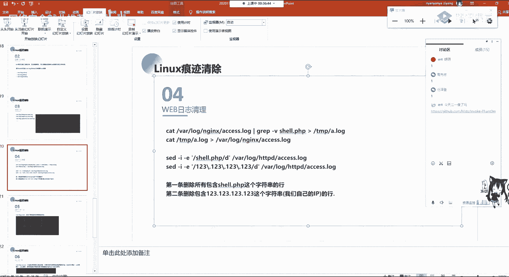

那这里我再做一个简单的演示，这里比如说我们想把1212，192168123。1，它的一个记录呢都给删除掉，我们可以使用三杠，二杠一，加上我们的，192。168。123。1。

那这里呢我们需要对每个点呢进行一个转移，转移之后我们再进行一个这样，ok怎么是哦，我们需要加上一个d是代表我们的delete，这时候我们再去cat啊，很显然它已经进行一个完全删除。

因为我们有两剩下的两条。

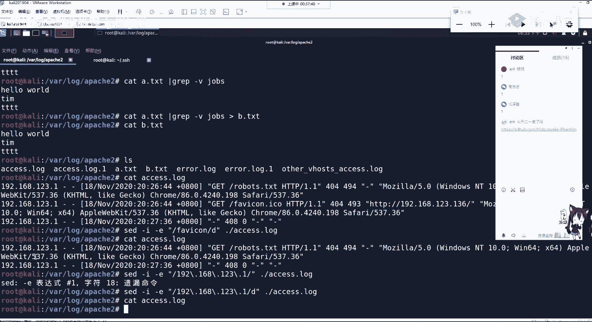

这个日志呢都是192168123。1，这个进行访问的，进行访问的，那么接下来继续来看，啊这个vlog c o r n，那c o r n tab呢就是我们的定时任务，在一开始讲这个linux主机信息收集。

包括在redis去写定时任务的时候，大家应该都有了解到，那我们可以在呢这个日志里面，就可以查看我们定时任务的一个相关的日志，执行日志，那比如说呢我们可以直接cut加cat它。

或者使用我们的t i r l杠n。

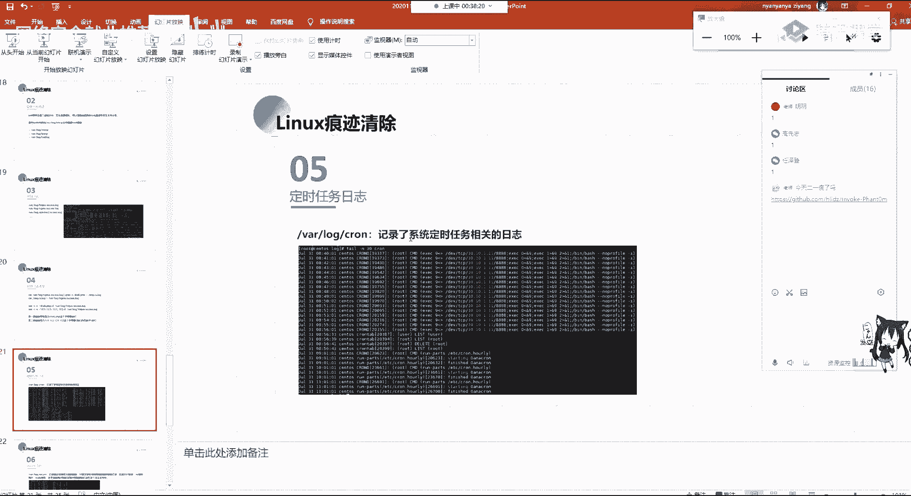

指定我们想要查看的一个函数。

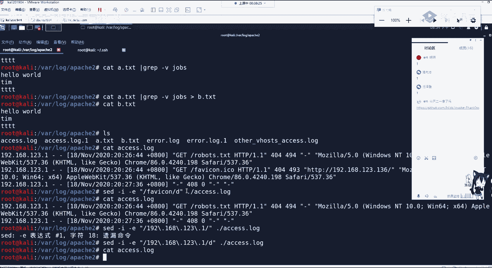

你可以在写作上个目录去查看，ok那我这里并没有啊，就我这里并没，有，因为我这个卡里呢并没有开启一个嗯，定时任务相关的日志，并没有一个定时任务，那大家呢如果就是在这个定时。

比如说你在定时任务里面啊写了一个呃木马，写了一个后门，那你就可以把这个定时任务的相关，日志给删除掉，不然的话定时任务呢你就可以暴露自己，比如说执行了一个反弹shell指令，那它就会每一次执行呢。

都会记录到我们这一个日志里面，你需要把它删除，那删除的方法也非常简单，你就可以使用我们的sin这个命令，a set这个命令，比如说呢你使用我们的s ok杠i啊，杠一。

然后里面加上什么加上比如说你进行反弹shell啊，你调用了我们的batch，将含有batch的呢都给它删掉，再加上我们的d，然后再加上我们文件的相对路径或者绝对路径，即可。

就把那把我们调用到bh的这个嗯，定时任务的计划，任务的这个日志呢都给删掉了，下面啊，secure也是这个linux操作系统的一个安全日志，这个日志呢是记录我们验证和授权方面的信息。

也就是我们对用户进行操作呢，都可以在这里记录着记录到，比如说我们的嗯s s h，登录我们的icu进行切换，用户速度受有权，或者是我们添加用户修改用户密码，那都会保存在这个日志里面。

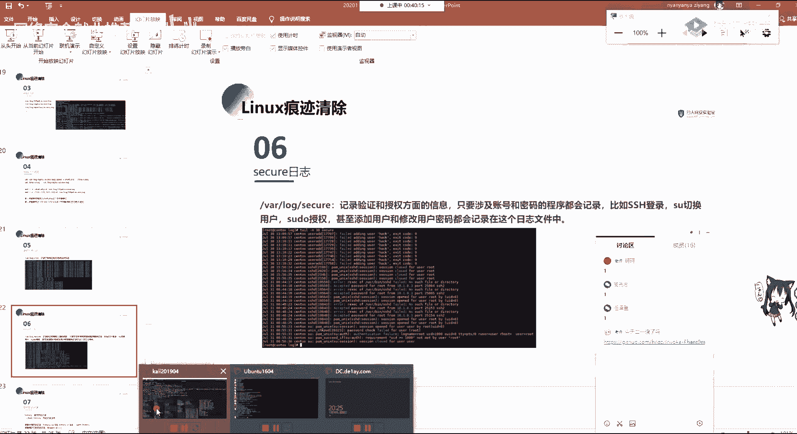

都会保存在日志里面，啊大家可以自己去尝试查看，那这里呢大家如果就是可以把这个log啊，全部删除，如果你什么都不怕的话，就把这个log给它删除掉，logo下面我们可以看一下它里面有哪些日志。

比如说我们的app，那在i p p里面，你是不是就能看到我们的一些i p t get，安装记录，比如说我看到我们的history，ok就可以判断了，我在这些时间中安装了这些软件包，好。

下面呢就是我们的postgresql或者sa的一些记录，或者是mi sol，我们可以cd到mi sol里面，进行一个查看。

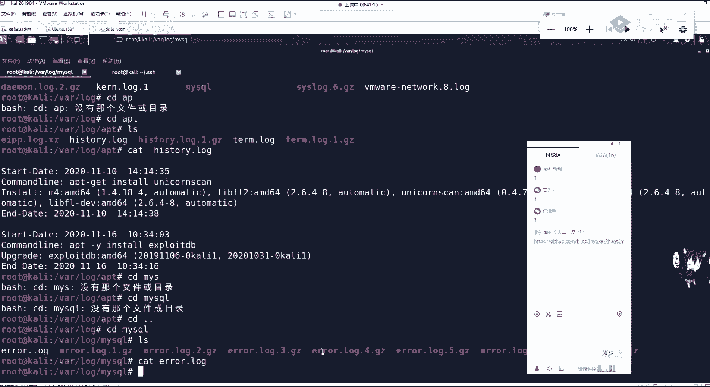

ok这里是有错误日志的保存在这里，因为我这里并没有开启码sql，所以他是看不到这些日志的，ok那下面最后一个日志清楚的就是我们的history，history是用于显示我们操作的ash历史记录。

那history呢它的一个用处非常大，比如说你在拿到一个靶机之后，你就需要查看他的history，就可以看到他的管理员呢，执行了哪些历史的命令，那这些命令呢有可能包含一些敏感的操作啊。

比如说啊去设置一个数据库，比如说呢给某个文件去配置权限，去设置某个文件，ok这都是有这一个历史操作的，那我们如果去打比赛，就打c t f或a w a w d比赛，你去拿到这个服务器的一个权限之后。

你通过history，有可能就会发现这些比赛方所设置的，一些提示内容啊，比如说一些敏感的操作和一些提示，在history里面呢都能看到，那history呢是通过一个定时呢，写到我们的一个文件里面的。

因为linux操作系统万物基于文件，那history也有一个文件去保存它，它在哪呢，就在我们当前执行并biss这个程序的，当前用户下面的一个隐藏文件。

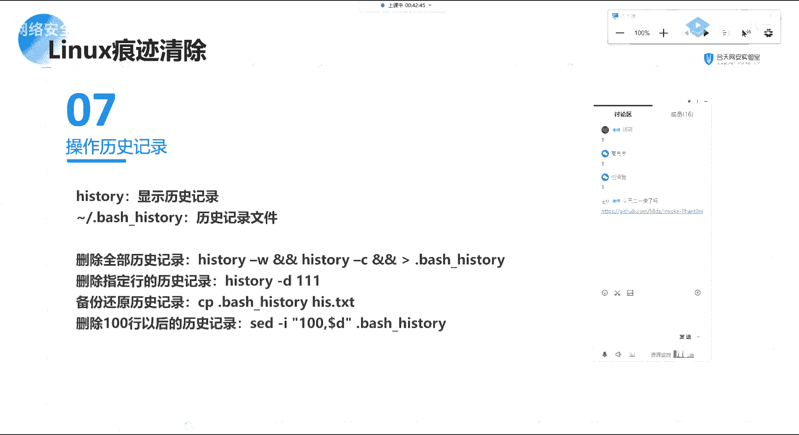

但是history里面，那我们简单来看一下这两个文件，比如说呢我这里先执行我们的history，可以看到ok这些指令大家应该没有问题，那我们cd到我们的当前目录，也就是root用户的一个目录。

然后进行ios杠i会发现呢它有一个啊隐藏文件，叫做batch history，我们可以简单的cat一下，ok这里呢也是我们去看到的，这个batch的历史命令记录，那么在渗透测试结束之前呢。

需要把这个历史记录，也就我们完全退出靶机之前呢，需要把这个历史记录做一个清空，那大家细心的同学会发现，那我history所看到的和batch history是不是不一样呀，是不是不一样。

那我们要怎么办呢，比如说这里我先执行一个啊，who am i，那么在history里面是可以看到的，那么在bh会server里面呢是看不到，看不到，我们可以让它写入强行的执行指令。

让它写入也要使用我们的history杠w，让我们再去查看一下batch history，ok这时候呢就进行一个写入操作，大家如果对history其他的一个参数了解呢。

也可以到这个linux的一个文档上面，进行了查找和history，可以看到它的一个命令杠c，清空当前的历史命令记录，杠i呢是将我们缓冲区的一个嗯命令，写入到历史命令文件中，那这两个杠i呢和。

那杠i呢和杠w做的是同样的一件事，ok我们可以看一下它的一个嗯使用方法。

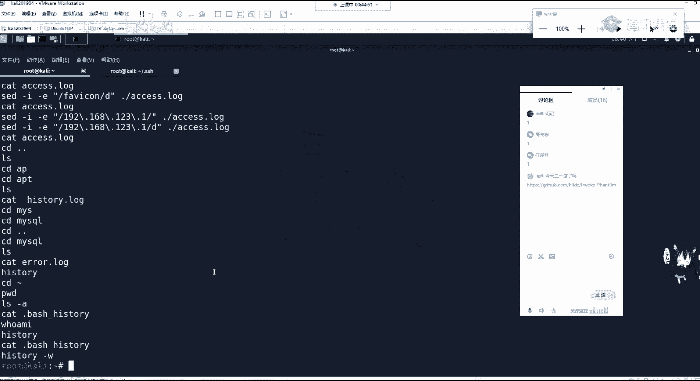

那大家要记住我们使用一个删除history。

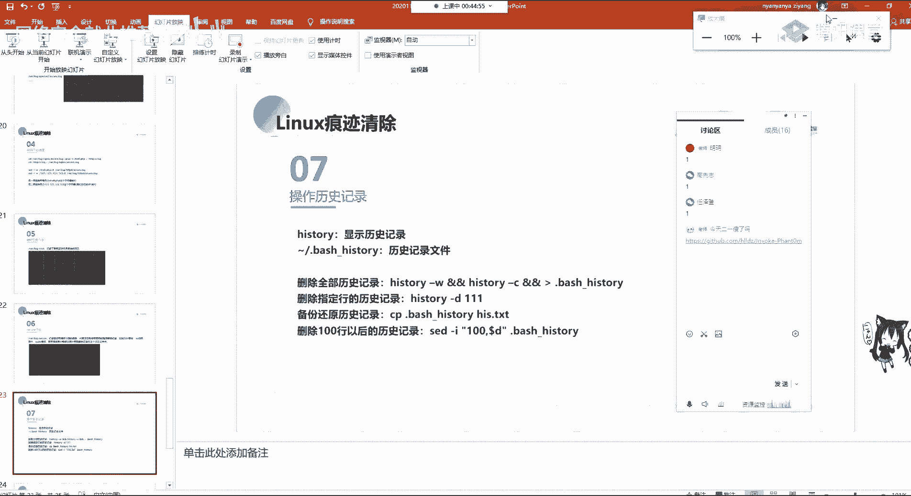

就是使用什么我们的history杠c，这时候我们在输入history，你看到这个时候呢，就是显示的呢只有我们刚刚所执行的这条命令，但是这样要记住是没有办法完整的删除history的。

因为我们只是删删除了在缓存中的，可以作为历史记录，那这时候呢我们bt可以作为里面的这个命令呢，并没有被删除，我们可以cat一下。

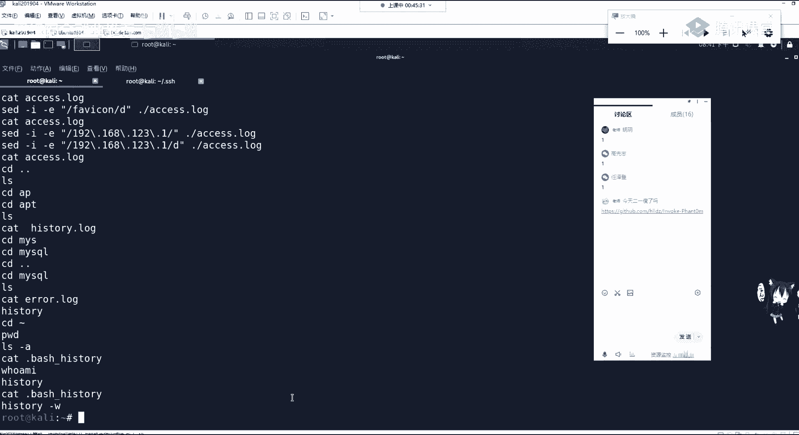

ok它是并没有被删除的，那所以呢我们可以使用下面的这个方法进行删，除，这种方法直接将我们的bt history文件制空，或者是呢使用我们的history杠w history杠c，这个是什么意思啊。

是不是写入第一个是写入我们的bbt history，第二个呢是清空，清空之后，history是不是没有了缓冲区，那我们再把这个缓存区里面的内容写到batch history，也就是相当于把它清空了。

可以我们可以执行一下。

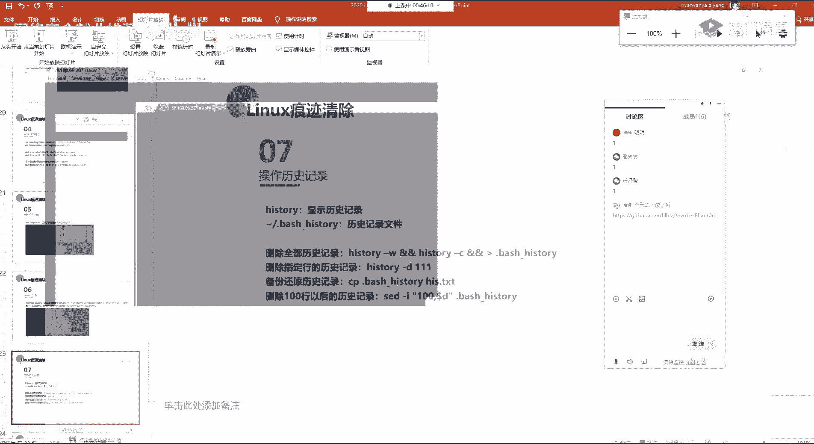

也就是我们的ok我们在这里执行吧，history杠w，然后暗暗的福大家应该知道吧，ok可story杠c是清空，然后呢再按去导入到我们的ph，history里面。

那这时候我们输入history可以发现了被清空了，然后再cat我们的家目录下面的batch history。

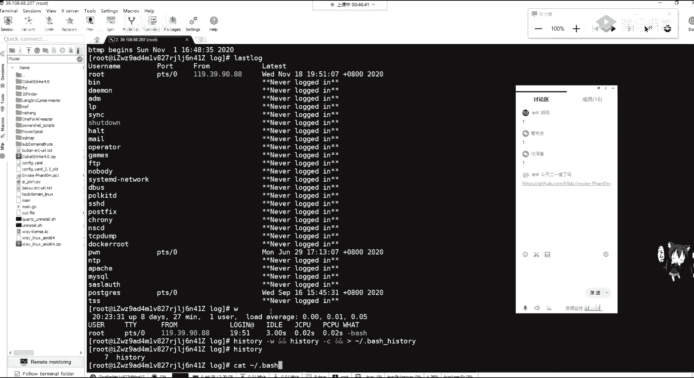

也是被清空了，ok就这一条命令，当然了，我们也可以，如果不想删除那么多，也可以去删除指定行的一个历史记录，比如说我们使用杠d加上，删除所在的一个航目录，那我们去备份的话也非常简单。

直接把这个best history去备份到这里，这里记就行了，那我们也可以使用我们刚刚所说的三杠r e，去删除特定的batch history啊，比如说我们现在对进行一个操作啊操作。

比如说运行我们的msf的一个脚本，比如说运行一个我们的shell这个文件，那么这是不是就可以使用三杠二杠一，然后去匹配我们的shell，将我们匹配到shell所在的所有的行当都给删除掉。

那我们也可以使用杠i，然后100杠到了d，它的意思呢，就是将100行以后的这个历史记录呢，使用我们的delight，将batch history指定行删除的指定，我们这里就是这里不会啊。

这里我们删除的还是缓存的地方，删除之后batch history是不会改变的，也需要对应的一个删除，也需要对应的删除，那这里呢黑si它是在我们的环缓存区啊。

不是缓冲区缓存区的那batch history呢它是一个文件，那我们在history里会经过一段时间之后，去备份到我们的best history里面，也可以使用杠w进行一个强制备份。

ok那这里呢我们也可以进行一个隐藏历史记录，也就是我们俗称的无痕模式，那无痕模式呢只需要禁用我们的历史记录功能，即可使用我们的set设置加o，然后加上我们的history就可以呢。

把我们的历史记录功能给关掉，那这里大家去操作啊，进行一个敏感操作，如果你不想后期删除，那你可以在进行敏感操作之前呢，把history这个历史记录功能先给它关掉，然后呢再给它进行恢复。

就是使用这两条简单的命令，那我这里就不做演示了，就不做演示了，那我刚刚呢还是给大家再看一下这个这个地方。

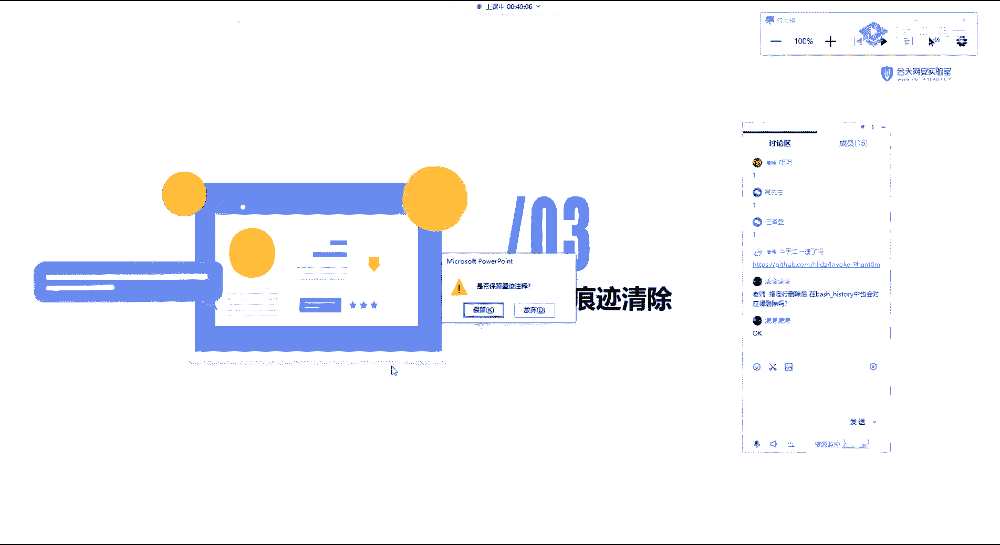

这个地方啊，我们如何把它给关掉，再给大家看一下，这边机器已经写好了。

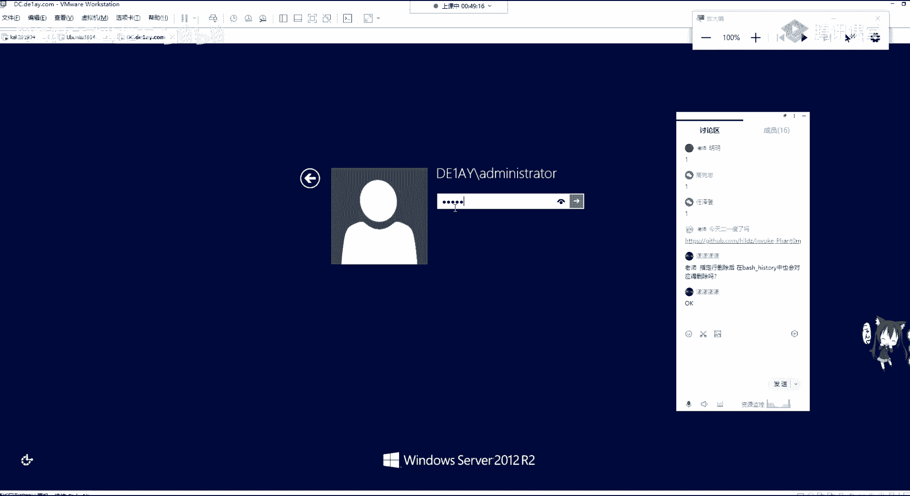

ok在我们这个命令起好，在这个windows server起好之后呢，它的一般log是默认是打开的，我们可以在任务管理器里面去查看一下，在我们的服务可以看到，这个ok在这看着呢。

932我们在这里找到932，把它给杀掉，或者是呢我们在这边呢可以找到932。

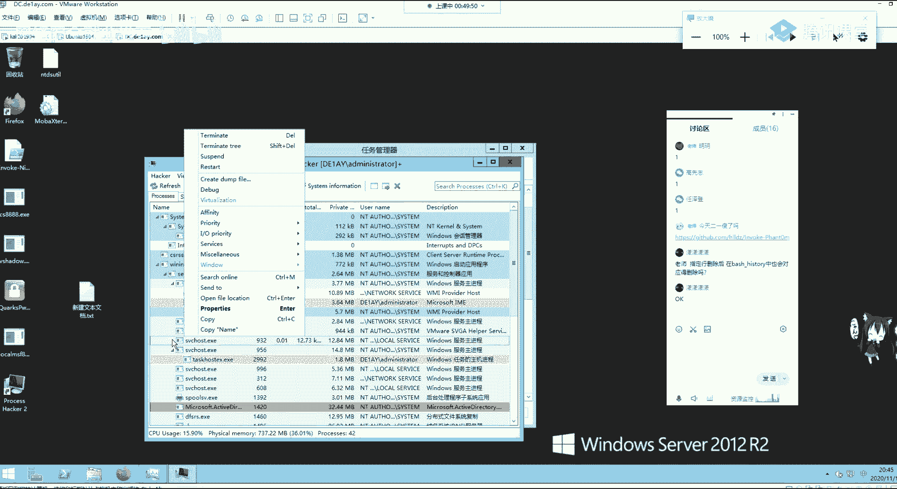

看到它的一个线程，是由我们的e vlog正在记录的，那么进行一个重复的操作，把我刚刚这个这一期开起来。

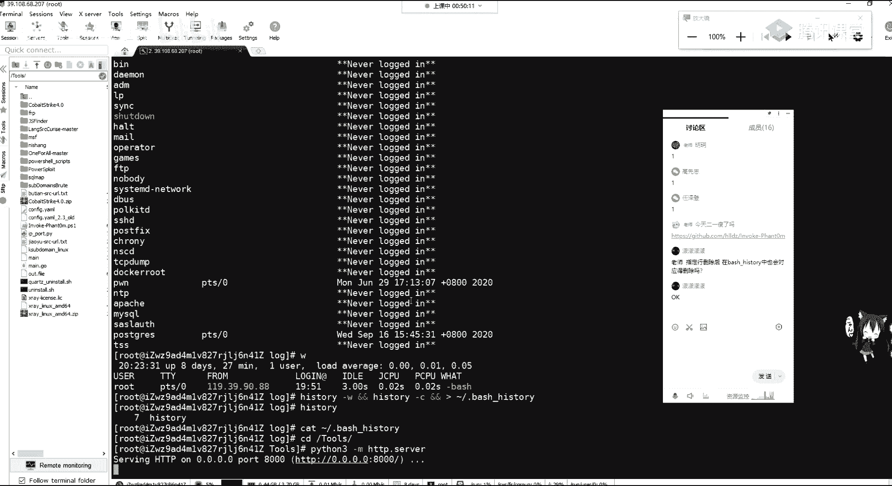

开起来之后呢，我们用管理员权限去运行这条命令。

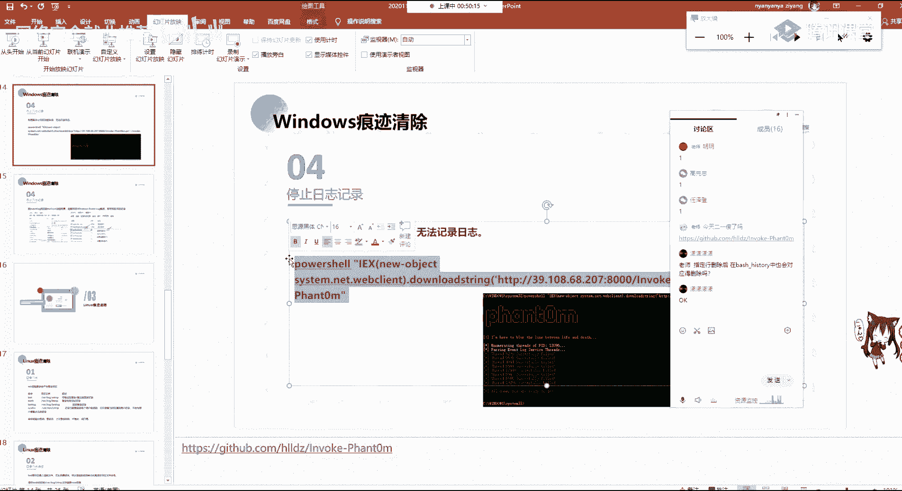

ok我们来查看这边。

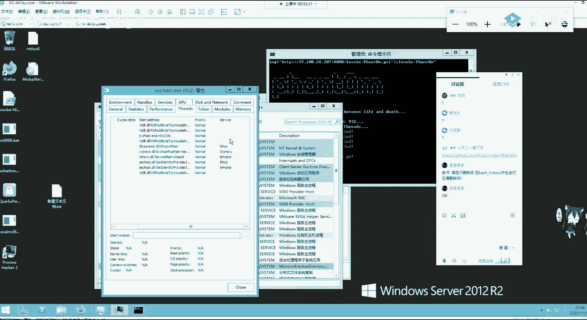

ok我们来看它已经消失了，那这个命令呢。

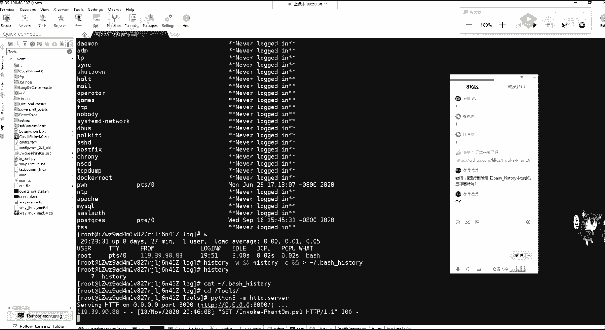

就可以将我们的这个日志记录给关闭给关闭了，关闭了之后，我们下面再进行一个查看日志，我们来看它是否会记录了。

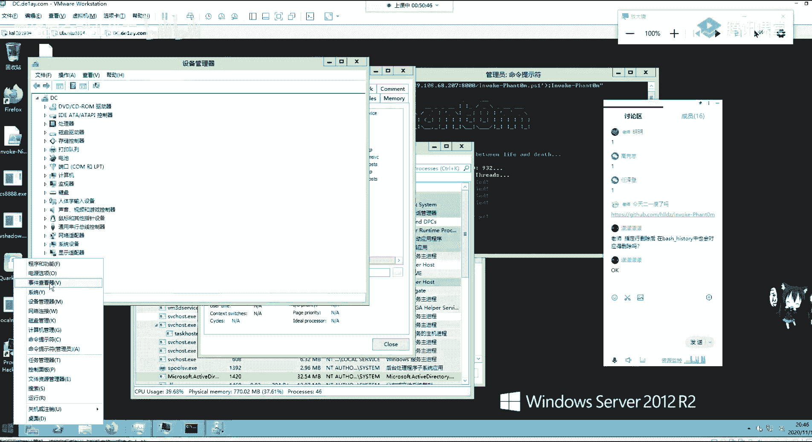

这里我们打开我们的事件管理，事件查看器，点击我们的日志，那大家应该还记得安全日志是做什么，是做的我们的用户操作啊，这个用户操作，包括我们刚刚啊这个权限策略更改，包括一些登录操作呢。

都会在这里进行一个词性，都会在这里进行一个记录，啊我们来看一下，现在他最后记录的是我们08：46，也就是刚刚这个时候记录的，我们可以刷新一下，不是我在这里创建一个新的用户，是我们的net use。

net user，然后加上我们的，比如说我创建一个叫jeep用户啊，加加上他的一个密码，然后呢点击我们的dd进行一个添添加，ok我们添加过一个借口用户之后，如果你没有去关闭这个日志的话，在这一开始呢。

它就会告诉你一个很敏感，一个适用，ok正在去开启了一个我们的日志记录，它就会在这里显示，那么将它关闭之后。

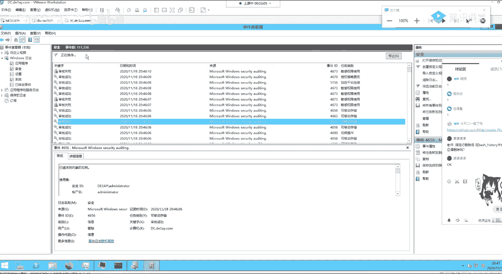

那很显然的这个日志记录已经被我们关闭了，他就不会再记录日志了。

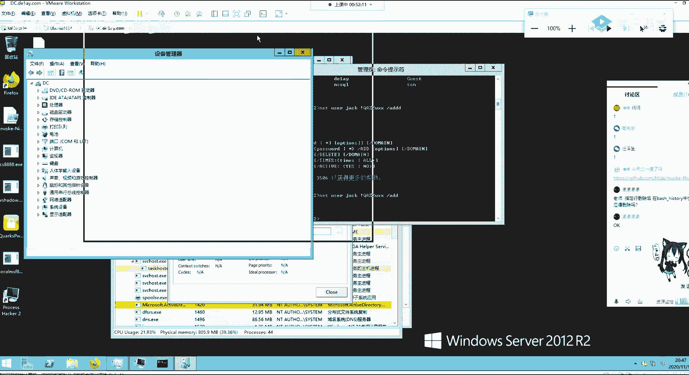

那就免得在我们需要去花时间把它删除掉了，ok这里大家应该都理解吧，那今天的内容呢就到这里就结束了啊，今天是只有一节课，那关于这个痕迹的清楚呢也非常简单，就这些命令你把它给也不需要进行一个记忆。

把它总结并且运行一下，去理解它的一个意思就行了啊，大家关于这节课有没有什么疑问，可以在讨论区提问，可以应该都没有问题吧，那听懂听没听懂的同学可以扣个二好，听懂的话就不用扣了，还是那句话。

如果他在这个公司呢，它是有日志的，大家如果是做过运维，应该知道你是有一个日志，一个机器的这个东西我们就没有办法去改了，除非你把他的日志给它打穿，那我们又没有办法改，还是那个就是使用代理。

使用代理多层代理或者使用隧道啊，都可以进行一个呃隐藏自己，那没有办法删除他的一个日志，我们是没有权限的，ok那本节课大家如果没有什么问题的话，那到这里就结束了啊，我们渗透测试的一个整个的流程呢。

也都给大家就是到这里就讲完了，就是技术技术成片的，那在周五呢就会给大家讲一下，再次理一下我们在渗透测试的一个整个过程，也就是我们在生存测试中整个需要做什么，在真正的工作中会做什么，然后呢会告诉大家。

在今后的日子中，当然这这些日子也去学习生存测试，你千万不要说啊，你已经学会了或者精通了，那接下来在工作中你要学到的是更多，你既然选择了这一行，那就是要做到活到老学到老啊，除非你35岁被裁员了。

不然的话就是一直在学习学习新的技术，那下节课呢就会告诉你在之后的工作中，应该如何进行学习，去提高自己的技术，以及在面试的时候你需要注意哪些点，就是面试官有可能hr会问到底哪些东西。

那这里呢我们会在周五的时候，用一节课的时间来做一个总结，ok那本节课的内容到这里就结束了，大家早点休息。

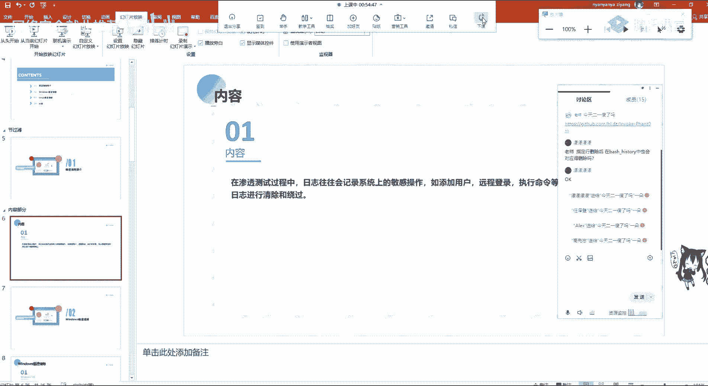