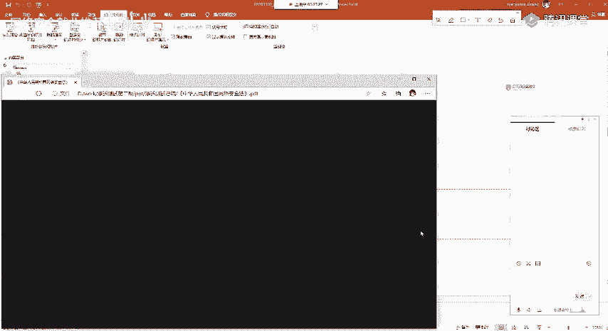
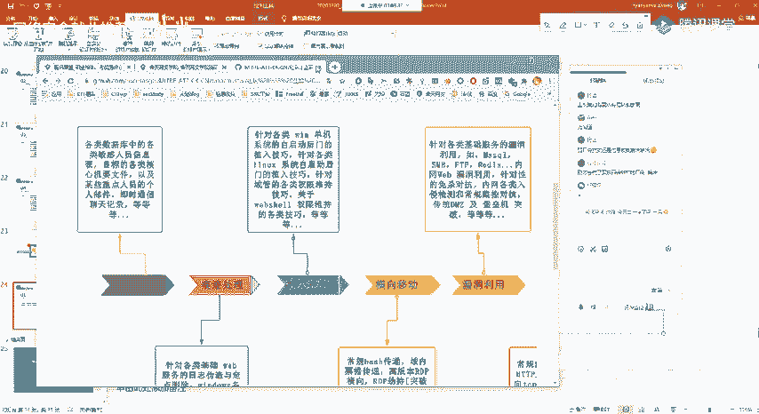
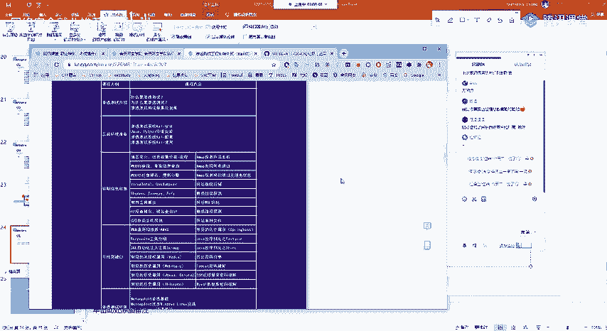
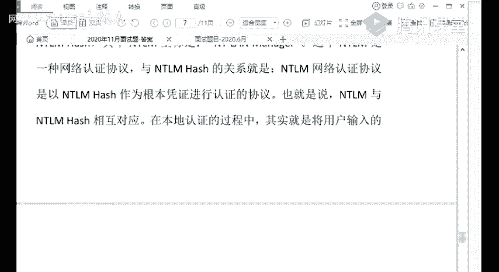

# 📚 课程P86：渗透测试课程总结与就业指导 🎯

在本节课中，我们将对渗透测试课程进行全面的总结，并探讨如何在未来的工作中持续学习，以及面试时可能遇到的问题。课程分为两个主要部分：第一部分由技术讲师讲解渗透测试的流程、风险、法律合规及后续学习建议；第二部分由就业指导老师讲解简历制作与面试技巧。

## 🛡️ 第一部分：渗透测试回顾与职业发展

上一节我们结束了技术性课程的学习。本节中，我们首先对渗透测试工作本身进行再次了解。

渗透测试是指安全专家根据已掌握的漏洞信息，模拟黑客的真实攻击方法，对系统和网络进行攻击测试。其核心是模拟黑客的攻击手段，找出客户信息系统中存在的缺陷和漏洞，提交报告并提供修复建议。黑客利用网络弱点进行入侵，渗透测试则模拟这一过程，使用攻击工具辅助，目标是发现安全问题并提供解决方案，而非进行非法获利。

### ⚠️ 渗透测试中的风险

在工作中，包括挖掘SRC时，需要关注以下风险：

1.  **工具测试可能影响运行系统**：例如，使用`AWVS`等扫描器时，其高线程和流量可能将防护薄弱或维护不善的网站扫崩溃，从而影响客户正常业务，需承担相应责任。
2.  **敏感信息泄露**：恶意泄露客户的网络拓扑、IP地址、业务流程、核心代码或个人隐私信息，将给客户造成经济损失，并需承担法律责任。
3.  **对测评结果的争议**：挖掘的漏洞可能不被测试单位认可，产生争议。

以下是风险规避的方法：

*   签署渗透测试协议和保密协议。
*   实施过程讲究规范化。
*   与甲方保持及时沟通与交流。

### ⚖️ 网络安全法须知

《网络安全法》已正式颁布实施。作为渗透测试工程师，属于依法负有网络安全监督管理职责的人员。在工作中知悉的个人信息、隐私和商业秘密必须严格保密，不得泄露、出售或非法向他人提供。违反相关规定将面临警告、高额罚款，甚至拘留、有期徒刑等法律处罚。务必谨记，即使获得授权，也不能为所欲为。

### 🔄 渗透测试整体流程回顾

整个课程已概括了渗透测试的完整流程，我们再来回顾一下：

1.  **前期交互**：通常由销售或安全运营与甲方沟通协调，确定测试范围（如指定域名、IP、内网或外网测试）、渗透程度（能否提权、上传文件、进行内网渗透）、渗透时间（可能需在夜间进行以避免影响业务）、风险规避等。工程师只需简单了解。
2.  **信息收集**：渗透测试成功的保障。信息收集的多少直接决定成功率。
3.  **漏洞探测**：使用扫描器或手动方式探测系统漏洞、Web漏洞、中间件漏洞、端口服务漏洞、业务逻辑漏洞等。
4.  **渗透攻击**：对发现的漏洞进行整理、验证，寻找攻击路径，尝试获取权限并扩大影响。
5.  **后渗透阶段**：获取权限后，进行内网信息收集、横向移动、权限维持，并在测试结束后清理痕迹。
6.  **信息整理与报告编写**：整理渗透过程、收集到的信息、漏洞详情（利用点、危害），形成渗透测试报告。报告需描述清晰，提供加固建议，让非技术人员也能看懂。

### 🎯 面试常见技术问题

面试通常由HR和技术人员参与。技术面试可能涵盖以下方面：

*   **信息收集**：这是基础，回答不好可能直接导致面试失败。
*   **工具使用**：如`AWVS`、`SQLMap`等基础工具，以及是否会用Python编写工具或爬虫。
*   **技术深度**：对中间件、框架（如PHP）、漏洞原理（如反序列化）的了解。
*   **实战经验**：是否有CTF比赛经验、SRC挖掘经历及排名。
*   **内网渗透**：反弹Shell、提权方法、横向移动、域概念及`Mimikatz`、`PowerShell`等工具的理解与使用。

对于在校学生，如果不急于实习，建议通过挖掘SRC和参加CTF比赛来积累实战经验，以赛代练。

### 🏢 厂商渗透测试服务流程参考

不同安全公司的渗透测试服务流程大同小异，以长亭科技为例：

1.  确定测试范围与签订授权。
2.  信息收集（主机发现、端口扫描、系统识别等）。
3.  制定测试方案，寻找并利用漏洞（中低危漏洞联合利用，高危漏洞直接深入）。
4.  获取系统权限，记录过程，清除痕迹。
5.  输出渗透测试报告，进行报告陈述与验收。

服务内容通常包括Web应用安全检测（OWASP Top 10）、服务安全检测、内网渗透测试、安全意识检测（如钓鱼演练），大型厂商还可能涉及移动安全、IoT安全检测及红蓝对抗演练。

### 📚 后续学习建议

技术更新迅速，必须坚持学习：

1.  **善用搜索引擎**：推荐使用Google，对技术人员更友好。
2.  **常看技术论坛**：推荐先知社区、FreeBuf。二进制方向可关注看雪、52破解。吐司论坛干货多但注册严格。
3.  **钻研漏洞原理**：在会利用的基础上，尝试理解漏洞产生原理，这需要一定的代码基础。
4.  **不要放弃编程**：至少掌握Python，用于编写自动化脚本、理解网络协议（爬虫、Socket编程）。逻辑思维和脚本能力至关重要。学习资源推荐菜鸟教程、慕课网等。
5.  **坚持实战**：通过挖掘SRC和打CTF比赛来保持和提升技术敏锐度。

---

## 📝 第二部分：简历制作与面试技巧

上一部分我们回顾了技术要点，本节我们来看看如何准备求职，重点是简历制作和面试技巧。

### ✍️ 简历制作准则

简历的目标是：**拒绝做路人、扬长避短、把握黄金十秒**（HR筛选一份简历的平均时间）。

*   **版式**：
    *   结构：从左到右，自上而下。
    *   篇幅：控制在一页纸内。
    *   字体：统一使用宋体，避免多种字体、斜体或下划线。
    *   突出重点：用加粗强调关键信息。
    *   留白：适当留白，不要写得太满。
*   **内容**：
    *   **个人信息（必填）**：姓名、学历、电话（**务必准确**）、现住址、籍贯。
    *   **求职意向**：明确且有针对性。若海投，可写“网络安全等相关岗位”。
    *   **教育背景**：学校、专业、学历、相关培训。
    *   **实习/项目经历**：按时间倒序排列，突出内容与成果，优先写与网络安全相关的经历。
    *   **专业技能**：分点阐述，使用“熟悉”、“掌握”、“了解”等词汇。例如：“熟悉常见Web漏洞原理与利用”、“熟练使用AWVS、SQLMap等渗透测试工具”。
    *   **奖励情况**：行业相关比赛、证书，即使未获奖，参与经历也可写上。
    *   **自我评价**：结合职位特点，突出耐心、执着、学习能力等。

### 🛠️ 如何弥补简历劣势

*   **成绩不好**：突出相关高分课程、实习经历、实践动手能力。
*   **无实习经历**：突出社团/学生会经历、专业技能培训、快速学习能力和吃苦精神。
*   **专业不对口**：突出兴趣、外语能力、个人技能及相关学习实践经历。

### 🎯 简历的针对性

针对心仪岗位的职位描述（JD）来调整简历，使技能点与JD要求高度匹配，这是最有效的优化方法。

### 📧 投递注意事项

*   **邮件命名**：姓名+应聘岗位。
*   **邮箱**：建议使用QQ邮箱以外的专业邮箱。
*   **附件**：简历文件命名与邮件标题一致。
*   **正文**：简短自我介绍，说明与职位的匹配度。
*   **投递时间**：建议在早上8点前投递，更容易被HR第一时间看到。

### 💼 面试技巧

*   **面试准备**：
    *   了解公司基本情况（行业、业务）。
    *   准备可能被问及的问题，尤其是简历上的每段经历。
    *   保持平常心，双向选择。
*   **面试中**：
    *   注意礼貌，姿态端正，避免小动作，与面试官自然对视。
    *   自我介绍不要照念简历，简洁扼要。
    *   回答“优点/适合岗位”时，结合事实，紧扣职位要求。
    *   回答“缺点”时，谈一个真实的、但正在克服或已改善的缺点。
    *   **职业规划**：围绕公司业务和岗位设定切实可行的短期目标。
    *   **谈薪资**：
        *   提前在招聘网站查询该岗位的薪资范围。
        *   不必主动给出具体数字，也不必主动打听。
        *   被问及时，可根据薪资范围和个人期望，给出一个区间（如范围是6-10K，可报7-8K），留有谈判空间。

### 📄 常见面试问题举例

技术面试官可能从简历出发提问，常见问题包括：

1.  描述渗透测试的完整流程。
2.  文件上传漏洞的绕过思路有哪些？
3.  简述内网渗透的基本步骤。
4.  谈谈你对免杀新思路的理解。
5.  Linux应急响应常用的命令有哪些？

---

## 🎓 课程总结

在本节课中，我们一起学习了以下内容：

1.  **渗透测试核心**：回顾了渗透测试的定义、流程、伴随的风险及重要的法律合规要求。
2.  **持续学习路径**：明确了在快速迭代的安全领域，必须通过坚持复现漏洞、阅读技术论坛、钻研原理、掌握编程（特别是Python）以及参与SRC和CTF来保持竞争力。
3.  **求职准备**：系统掌握了简历制作的准则、内容要点和优化方法，以及面试前后各个环节的实用技巧，包括如何应对常见问题和进行薪资谈判。

技术之路，贵在坚持。祝愿大家都能找到心仪的工作，在网络安全领域不断精进，实现自己的职业目标。