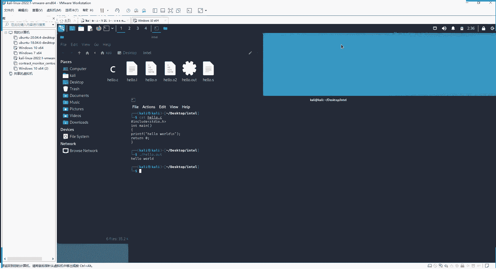
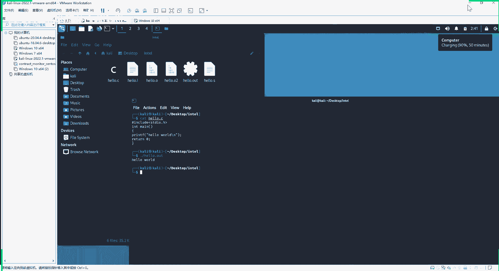
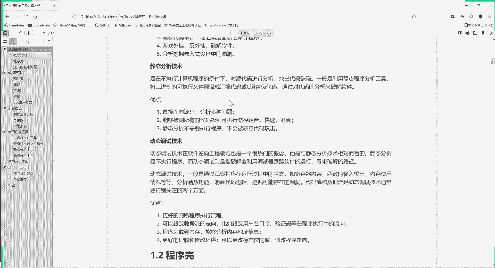
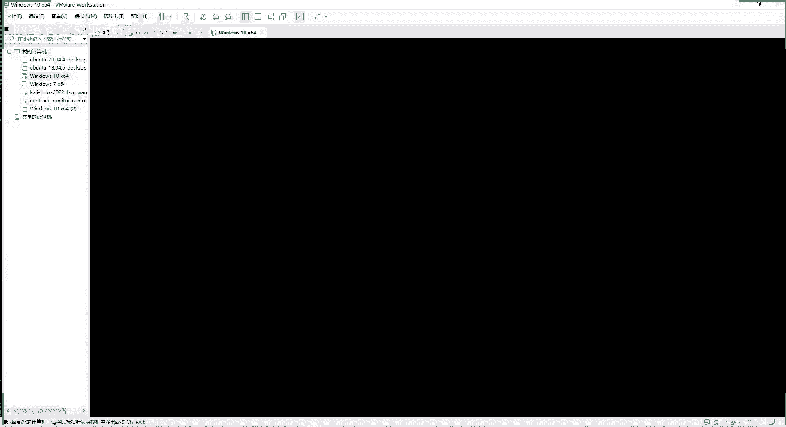
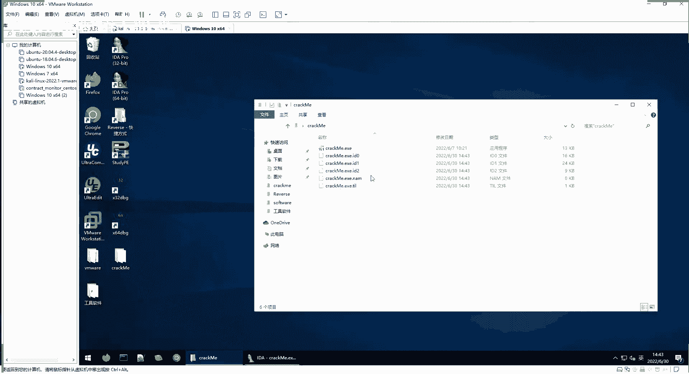
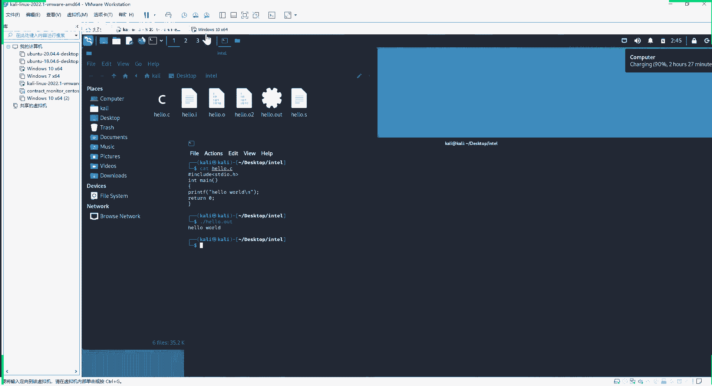

# P87：逆向工程--认识逆向工程 - 网络安全就业推荐 - BV1Zu411s79i

新来的同学可以先看一下我们本次课程的目录，好的同学们好，现在是两点半了，我们正式开始上课，后面进来的同学，老师这个声音和画面都正常吗，啊有问题的话请发在讨论区，就聊天里面，啊没有问题。

我们就正式开始上课，首先介绍一下我们这次课程，我们这这次是一个逆向工程的一个培训课，时间是两点半到五点半，分为三节课，我们是上课时间是50分钟每节课，然后会休息十分钟。

然后大家如果在上课的过程中有什么疑问，可以把你们的疑问，你们想问的问题发在聊天里面，然后下一节课上课之前呢，我会回答大家的问题，然后在我们三节课，最后也会集中抽出十到10 15分钟的时间吧。

集中回答大家的问题，所以问题都先发在我们聊天里面，后面会逐个的给大家解答，然后我们今天讲这个逆向工程，这是我们的上课的目录，首先带大家认识一些概念，介绍一下逆向工程，然后我们看一下编译原理啊。

怎么从一个大家学过c语言，从一个c语言代码到我们可执行程序，然后给大家介绍一下汇编语言，因为我们逆向的一个核心就是这个汇编语言，如果不懂汇编语言的话，那么那就根本看不懂逆向了，无从做起，然后第四部分呢。

给大家介绍一下常用的逆向工具啊，第五部分是一个实战练习，我们带大家过一遍这个整个的一个逆向的过程，怎么破解一个软件，然后第六部分是一些逆向建议和书籍推荐，然后第七部分的作业，好的。

我们学习第一部分认识逆向工程，首先是一些概念，我们说的逆向工程呢又称软件反向工程，才知道software reverse，大家看到这个reverse就知道是说的逆向，它是指从可运行的程序系统出发。

运用解密反汇编系统分析程序，算法理解等多种计算机技术，对软件的结构流程，代码等进行逆向拆解和分析，从而推导出日产品的源代码设计原理，结构算法或者是一些特征，通常呢我们把这个软件进行反向分析的。

整个过程称作软件逆向工程，在整个过程中用的技术，都是叫软件逆向工程技术，说的啊只简单一点，就是逆向工程呢就是反向着来啊，有我们的一个可执行程序，把它反着拆解，拆解出它的源代码。

通过这个反向拆解的过程中呢，分析出他的一些系统特征，啊比如说这里随便给大家打开一个我们的软件，先给大家打开，我发给大家的这个crack me这个软件，这是一个可执行程序，我们点击直接执行它。

他会给我们报啊一些执行的结果，不管是报错还是发正常执行，总之有一些结果，但是如果这样呢，我们并不清楚我们点击之后，这个程序进行了什么操作，然后我们逆向工程呢，就是通过反汇编等方法子来查看一下这个程序。

你点击运行它，它到底进行了什么操作，然后再给大家看一下，我们cctf竞赛中对逆向的一个定义，它是涉及到要windows linux安卓平台的多种编程技术，所以这个逆向它就有平台之分。

你是逆向windows的程序还是linux，还是安卓这种移动平台的程序，他要求利用常用的工具，对源代码以及二进制文件进行逆向分析，好掌握安卓移动应用apk文件的逆向分析，掌握加解密内核编程算法。

反调式和代码混淆技术，啊这里加解密啊，这些内内核的一些调试算法，这是一个软件，它设计的时候需要用到的一些功能，然后这个反调适合代码混淆呢，就是这个软件，它开发者他知道这个有一个逆向工程。

但是他不想他开发出来的软件被别人进行逆向，所以他加了一些反调式和代码混淆的一些代码，然后让我们的逆向，或者让我们的调试变得更加困难，然后逆向工程都有什么用途呢，首先逆向工程逆向分析。

它可以通过分析已经编译好的软件，来用高级语言重现高级语言就说c语言。

这里给大家看一个啊我们虚拟机里面的例子，比如说我们先查看hello。c，这是个c语言文件，非常简单的c语言文件，就是应该是大家学的第一个啊，c语言的自己编的第一个c语言代码。

print f hello world，那么它编译好之后成为二进制文件，就得到了hello。out，这个二进制文件执行这个文件呢就是hello，hello，word软件逆向的一个功能。

就是很多时候我们只有这个二进制文件，可执行文件，但是需要有这个可学性文件来反推出，它的高级源代码是什么，这是逆向工程的一个作用。

然后逆向工程第二个作用就是可以分析病毒，就像刚才给大家说的，你执行一个程序的时候，并不知道这个程序在背后真正进行了什么操作，他有可能在里面嵌入了木马，但是它不显示出来，对于普通用户来说就感受不到。

那我们逆向工程呢就可以分析病毒，从中提取出特征码，然后开发杀毒程序，这里就是像一些360杀毒，它为什么能够检测出你这个安装了恶意的，下载了一个恶意的文件，咱们进行逆向工程的时候，经常会这样。

你下载一个文件，然后你的杀毒软件会告诉你，这是个恶意文件，它就是这些软件，它们存储了病毒的特征码，它就能识别这是恶意的文件，然后第三个作用就是进行高级代码审计，所谓高级代码审计呢。

就是说我们一般的代码审计就是审计源代码，比如说审计c语言的代码，p h p的代码，python的代码，因为这些是高级语言，比较好理解，然后呢一项工程可以进行这个代码审计，是在汇编层面进行代码审计。

这个门槛就更高，因为汇编语言嘛，大家知道肯定是比c语言这些更难理解的，但是有时候就能审计出，你通过高级语言所看不到的内容，这也是一种审计的方法，然后第四个作用呢就是既可以制作游戏外，游戏外挂。

在别的游戏里面附加一段程序，或者跳过游戏的一些参数的限制，当然也可以反外挂，也可以用来破解软件，所谓软件它要你输入用户名口令，会要你输入这个激活码，他就是把你输入的激活码进行一个计算。

然后和软件里面存储的值进行匹配，那么如果说你会这个逆向工程，你找到它匹配的地方进行修改，那么就可以在没有激活码的情况下使用软件，这是一个破解软件，实际上大家在网上下的很多破解软件，都是用这种方法来制作。

然后第五个作用呢，就是可以分析挖掘嵌入式设备中的漏洞啊，嵌入式设备它不像我们的一个windows操作系统，和linux操作系统，有一种大家很容易操作的，这种对用户友好的界面。

嵌入设备里面只有一些简单的程序，而且随着物联网的发展的，嵌入式设备是越来越多的，这种里面的这种嵌入式设备的漏洞，在网络安全中也是越来越重要，通过逆向工程呢，可以分析这些嵌入式设备里面的程序。

然后挖掘他们的漏洞，这是逆向工程的一个用途，然后我们在进行逆向工程的时候呢，主要是涉及到一个静态和一个动态分析，我们分别来看一下静态分析技术，就是在不执行计算机程序的条件下，对代码进行分析。

找出代码缺陷，具体来说呢一般是利用静态分析工具，将二进制的可执行文件翻译成汇编代码，或者是c语言的伪代码，那你为什么说伪代码呢，因为大家可以再看这个我们这个例子。

我们心理经典这个例子，你由这个啊c语言的代码编译成了可执行文件，当然可执行文件里进行反汇编就得到汇编代码，但是由这个汇编代码，在反推到这个c语言代码的时候，它不是唯一的。

你同样是输出hello world，不一定非得要这么写，是不是你不一定要用print f，你可以用别的函数，也不一定要return，是不是还有void的man也可以，它有多种不同的写法。

所以说你返回通过汇编代码再反过来的，这个源代码，它只能说是伪代码，它不是它不一定是你编译程序，就是正向得到这个可执行程序所使用的代码。

但是它们的功能是一致的，所以叫c语言伪代码，这是伪代码，这是第一层含义，第二层含义呢就是所翻译，这里看是翻译成的c语言代码，翻译是由谁来翻译，是由静态分析，静态程序分析工具，这些分析工具。

它也是按照一定的规则进行翻译的，所以说也不是百分之百是正确的，所以虽然就是我们一般用i d啊，它在绝大多数情况下都是正确的，但是也不是一定的，有的情况下我们看这个c语言，c语言为代码还是解不了题。

发现一直有问题，这时候可以我们自己看一看汇编代码，因为他这个翻译的过程中可能存在一个错误，这是一个静态分析，静态分析优点是什么呢，能够直接分析这个源代码。

分析多种问题，我们啊再给大家看一下，我们后面要用给大家演示的一个例子。

就是这个correct me，这个程序我们用ida pro来打开它。

在桌面上。

我们打开它，就是原来的一个看起来啊。

没有什么办法的一个可执行程序，它的细节就被我们知道了，它里面是会执行一些什么操作，这都是汇编语的命令，move on push啊，它的一个流程是什么，就被我们知道了，这是一个静态分析的方法。

第二个呢它是能够检测所有代码级别，可执行路径的组合，快速准确，就像我们刚才看到的，它有各种可能性，这一块代码执行完之后，它有可能跳到这里，有可能跳到这里，他根据你这个程序运行时输入的参数。

或者是环境的不同而进行不同的跳转，还有多个的跳转，这样我们能从总体上把握它一个程序的情况，然后呢第三个优点呢就是静态分析，不需要执行程序，它不会被恶意代码攻击，就是我们要分析的程序。

它很很多时候就是可能带有那种病毒程序，比如说我们要分析一个病毒的特征的时候，那你如果直接执行病毒的话，那你的计算机可能就会受到攻击，然后使用我们的静态分析呢，它是不执行程序的，它只是解析这个程序。

但是对这个程序进行那个反汇编，让我们看到它的汇编代码是什么，这样的话就不会被恶意代码攻击，所以这里也给大家提醒一下大家。

做这个网络安全与做逆向分析。

最好使用一个虚拟机，好像我用的是这个vv，这里面通过边缘vr可以搭台搭建多台虚拟机，然后在虚拟机里面进行操作，这样即使你的这个系统受到攻击，它也只是虚拟机受到攻击，而虚拟机呢还可以保存快照。

如果受到攻击呢，我可以返回到之前未受到攻击的一个状态，这样会给大家省很多麻烦，如果你在主机上直接受到攻击的，有时有些病毒它是很顽固的，它隐藏很深，你想要把它找出来是非常麻烦的，这是一个静态分析技术。

然后我们看一下动态调试技术，动态调试呢也是在软件逆向工程中，很热门的一个概念，也是一个主流的一个逆向的方法，它是以静态相对而言的，静态呢是不执行程序，那么动态调试呢就是执行程序，它是破解者。

利用调试器跟踪软件或者程序的运行，寻找这个破解的路线，动态调试技术，主要是观察程序在运行过程中的状态，比如说寄存器的内容，函数的输入输出，然后内存的使用情况，内存的值通过这样来分析函数的功能。

明确代码逻辑，所以说我们动态调试技术呢，最重要的就是关注动态，动态就是流，要关注两个流，代码流就是代码，它是按照什么样的方式，什么流向来执行的，还有数据流，代码里就是，看这个程序correct me。

这个程序它是有很多块的，它会进行跳转，有的有的代码它是不会被执行的，如果你动态运行，比如它从这儿如果跳转到这，那这一块就不会被执行，然后继续下载，跳转到这又在跳转，它有些代码就不会被执行。

所以你通过动态运行，可以判断它真正执行的代码流是什么，真正执行的代码的顺序是什么，这是一个我们要关注的点，然后第二个点我们要关注的是数据流，我们这个程序软件它有输入，它输入的数据。

在程序执行中是一个怎么样的扭动方式，它是先到哪一块代码，然后进行什么样的运算，然后又到哪一个函数，又进行什么样的运算，把运算结果再进行后续的什么操作，这是一个数据流，重点关注这个代码流和数据流。

把这两个弄清楚，这个软件它的功能也是基本上分析清楚，那么动态调试也有它的优点，就是说它可以更好地判定程序执行的流程，因为程序要执行吗，他总是要选择在分支的时候，总是要选择去执行哪一块。

分支可以跟踪数据流的流向，比如说跟踪那个用户名口令，我们经常使用一个软件就要进行登录，比如说玩一个游戏，他要你购买账号，账号用户名和口令，然后你登录了才让你玩，那这种软件如何破解呢。

就是跟踪用户名和口令，你要你动态调试这个程序，然后你输入用户名和口令，看你输入的用户名和口令，在程序里面是怎样流动的，然后最后这用户名额口令是经过怎样的处理，然后和什么值进行比对。

那么你是不是可以自己编写一个计算的程序，这里给大家举个，大家都是这个啊警察学院的学生，是我们国家安全的保卫者，这里可以给大家讲一个例子，因为之前我也是在这种啊，保卫我们国家安全的一些部门工作的。

有时候我们需要啊破解一个系统，但是我们并不知道它的用户名和口令怎么办，这个时候就可以用逆向分析的方法，我们输入用户名和口令，比如说我们输入admin admin，然后我们根据这跟踪。

通过动态调试跟踪我们输入的用户名和口令，在程序中的操作，它可能进行了，比如说啊100次md 5计算，又进行了ae s计算，啊又进行了一个什么编码，经过一系列操作之后得到一串哈希值。

他验证你用户名和口令输入的正确与否呢，就是验证这个哈希值和它原来存在的哈，希值是不是相等，那么这种情况下，如何破解这个系统呢，在不知道用户密码肯定情况下，我们就要澄清楚中中间这个计算的过程。

如果我们澄清的计算过程，那么我们就可以进行爆破了，口令爆破，就是我用口令绕口令和用户名和密码，的字典，然后不断地进行这个计算，把这个过程本来是我们要分析的程序，它内部进行计算的，但是我把它放逆向公权。

我把它源代码给逆向出了，那么我就能自己进行计算，不断的计算，直到它的值等于它里面这个程序，最后要校验的这个哈希值，那么说明我这个用户名和密码是正确的，这样就对这个软件或系统进行了破译，这是个动态调试。

它的一个作用，好，第一部分是母婴软软件，逆向工程的一些基本的概念，然后呢再给大家介绍一下我们的一个程序壳，之前在c给大家介绍c t f的这个逆向概念时，是不是讲到要掌握这个反调式和代码混淆技术。

程序壳呢就是一个反调式的一个技术，所谓的壳儿就是在一个程序外面包裹一层代码，就像动物的壳一样，或者人穿的衣服一样包裹一层代码，会员买了一个商品，它上面外面打了一层包装。

它的目的是保护里面的代码不被正确的反编译，或者是非法修改，它就是来阻挠我们进行逆向分析的，它加载到内存的时候呢，一般是先于程序运行，拿到控制权，然后再加载程序，实际上就是这样一个过程。

本来这是一个ex e文件，没加壳的，加壳之后是怎样呢，加贺就是把这ex e文件压缩压缩，再在它的头部再加上一个node壳，就引导程序，如果说你没加壳的话，就ex e文件直接就放在内存里执行了。

加壳之后就怎么样呢，把这个放在内存里面，先执行这个node壳，先执行它的外壳部分，然后外壳部分进行什么操作呢，在内存里面把这个原来压缩的文件解压缩，解压缩得到原来exe文件，然后再进行执行。

这样对用户的效果来说都是直接点击执行，它不会有感觉差别，但是对于我们逆向分析来说呢，原来你可以直接分析，直接返回编，现在你就不能直接放汇编了，因为这不是他最后要执行的文件，这是note壳和压缩文件。

所谓夹克呢就是利用特殊的算法，对这个e x e或dl这个动态链接库，你的资源来进行压缩，就像windows压缩winzip一样的效果，然后压缩压缩之后呢，要执行的时候就通过这个壳来进行解压。

不过解压的过程是完全隐蔽的，是在内存中完成的，对于普通的用户是没有感知的，这就是我们最常见的一种压缩壳，这壳的分类，然后呢，现在啊这个矛和盾都在不断的进化，你有加壳的工具，也有雀壳的工具。

现在又发展出了一种加密，可它就不是进行压缩了，而是对这个程序进行加密，这这这个就是技术难度更大一些，但人防护的效果也更好一些，这是一个壳的概念，主要是反调式和反跟踪的一个工具。

然后我们看一下进在进行逆向分析的时候，一个基本的流程，首先呢我们要使用这个study p这种工具，或类似的工具，初步了解程序的信息，s t p e这个怎么了解程序的信息呢，比如说这里给大家看一下。

我们打开stutp这个软件，把要分析的程序拖入进来，这样他就告诉我们这个程序一些基本的信息，它是32位p文件，它的md 5值是什么，它文件类型这些。

通过这个初步了解这个程序的特点，然后呢就可以进行静态分析，使用ida或者ida pro，都是一个一个东西来静态的分析查看，然后这里面有些不懂的，要进行谷歌搜索，其实这里的谷歌搜索主要是不是说啊。

某个汇编语句不懂，而是说你在遇到一些算法的时候，你感觉到这是一个大的算法，但是它是具体什么算法呢，你不知道，这时候你可以进行谷歌或者在github上搜索，根据这个算法特征进行搜索搜索。

你很可能就能直接找到这个套法是什么，然后这个算法的源代码是什么，这样就能大大有助于你的分析，因为现在的加密算法都是非常复杂的，你如果直接逆向从零分析的话，那是非常难的，一般我们分析呢就是通过逆向分析。

看出这个算法有什么特征，然后再在谷歌里面搜索，看这个算法这个特征是属于一个什么算法，把这个算法的源代码直接找出来，那么这一整块就直接分析出来了，这是第二步静态分析，第三步呢我们要绕过它的保护机制。

它的保护机制有什么代码混淆，它会加入一些干扰我们分析的代码，还有一些保护壳，刚才给大家讲了，以及反调试技术，反调试技术是什么呢，就是一个程序，它运行的时候，它有个检测运行时间。

比如说你如果正常的运行一个程序，你每你每一步指令之间的时间，是基本上可以忽略不计的，因为cpu运行是非常快的，但是我们进行调试的时候呢，我们会把它暂停在某一步，然后在这一步查看寄存器的内容啊。

内存的内容啊，那么在这一步停留的时间就会非常长，这个时候，反调设计时就会直接强制关闭这个程序，或者是把后面的代码给加密或者混淆掉，他一旦发现你有调试的行为，它就会进行干扰，这就叫反调试。

当然就是还是给大家讲的，这个网络安全就是一个矛和盾，不管你没有说啊，什么方法是绝对天下无敌的，也没有说什么防护的措施是绝对安全的，都是一个博弈的过程，有保护机制就有绕过的方法，有绕过的方法。

就有防止绕过的办法，然后第四步呢就是要定位出关键的代码，因为一个程序里面它的代码是非常多的，我们刚才给大家看的是一个非常小的程序，其实就有可能有上千行的代码，如果说稍微大一点的程序，几万行。

十几万行代码啊，那个分析就非常难了，所以我们要定位出关键的代码，进行关键计算的代码，或者是进行关键跳转的一个代码，不可能每一每一句每个命令都分析，然后第五步呢是要进行动态分析。

使用动态调试工具运行这个目标程序，要验证自己的猜想，因为前面这些关键代码呀，他的一些运行的机制啊，都是你静态分析出来的，你看出来的，那么我们第五步呢就动态执行一下，看一下它具体的效果是什么。

是不是和之前自己认为的功能一致，当然这也是个循环的过程，如果说你发现有什么运行的过程中，超出自己理解的，或者是自己诶还没有弄懂的地方，你可以在静态的分析中再仔细看，也可以在动态执行，这是一个反复的过程。

在这样通过这样反复的过程中，来澄清程序的功能，然后针对程序的功能写出第六步，写出对应的脚本或者工作报告，完成逆向分析的目的，这里就要看你逆向分析的目的是什么，有的人他是为了破解软件。

那你就要编写一个脚本来破解这个软件，或者是你有的是为了澄清一个病毒的一个机制，那你要写一个报告，这个报告说这病毒有什么特征，它是怎么攻击我们的啊，这个工作报告大家后面相信也是用得着的。

因为大家都是我们警察学院的学生啊，不知道大家看过那个了解过那个新闻没有，如果美国有方程式组织，他会陷入大他陷入了美国对我们进行网络攻，击了大量的代码，啊方程式组，它里面陷入了大量的一些国外吧，说原简介。

国外攻击我们的一些恶意程序，也就是网络攻击的武器，那么面对这些恶意程序，我们进行大家可能就会接到这样的工作任务，就分析这些恶意程序，它是怎么对我们进行攻击的，他是呃破坏我们的系统。

还是说把我们国家的一些重要部门的敏感数据，悄悄地发送出去，等等你进行逆向分析之后，就要写一个工作报告，如果说是做cctf题的话，那么c t f嘛就是夺旗，叫获取flag。

flag呢就藏在这个逆向分析的程序当中，你要通根据每道题的不同来获取这个flag，这是我们进行一个逆向分析的啊，一个流程，好这是我们第一章就是认识逆向工程。

