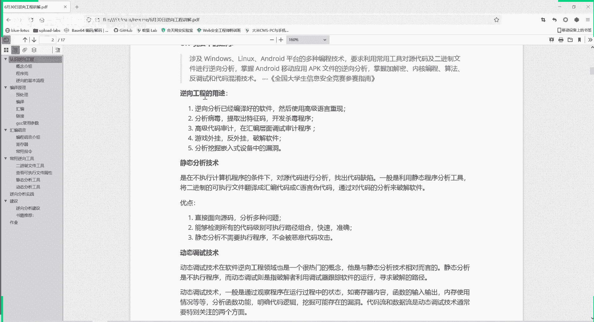

# 逆向工程入门教程（P87）🔍

## 概述
在本节课中，我们将学习逆向工程的基本概念、用途、常用技术以及基本分析流程。逆向工程是网络安全领域的重要技能，通过分析已编译的程序，理解其工作原理、发现漏洞或进行软件破解。

---

## 第一部分：认识逆向工程 🧩

逆向工程，又称软件反向工程（Software Reverse Engineering），是指从可运行的程序系统出发，运用解密、反汇编、系统分析、程序理解等多种计算机技术，对软件的结构、流程、代码等进行逆向拆解和分析，从而推导出软件产品的源代码、设计原理、结构、算法或特征。

通常，将软件进行反向分析的整个过程称作软件逆向工程。在整个过程中使用的技术，都称为软件逆向工程技术。

简单来说，逆向工程就是反向进行。从一个可执行程序出发，将其反向拆解，拆解出它的源代码。通过这个反向拆解的过程，分析出它的一些系统特征。

例如，打开一个可执行程序，点击执行后，程序会输出一些结果。但仅通过执行，我们并不清楚程序背后进行了什么操作。逆向工程就是通过反汇编等方法，来查看程序运行时到底执行了什么操作。

在CTF竞赛中，逆向工程涉及Windows、Linux、Android平台的多种编程技术。它要求利用常用工具，对源代码及二进制文件进行逆向分析，掌握加解密、内核编程、算法、反调试和代码混淆等技术。

加解密、内核编程、算法是软件设计时需要用到的功能。反调试和代码混淆则是软件开发者为了防止软件被逆向分析而加入的代码，目的是让逆向或调试变得更加困难。

---

## 第二部分：逆向工程的用途 🛠️

逆向工程主要有以下几个用途：

1.  **重现高级语言代码**：通过分析已编译好的软件，用高级语言（如C语言）重现其源代码。很多时候我们只有二进制可执行文件，但需要反推出其高级源代码，这是逆向工程的一个重要作用。
    *   **示例**：一个简单的C语言文件 `hello.c`，内容为 `printf("hello world");`。编译后得到二进制文件 `hello.out`。逆向工程可以从 `hello.out` 反推出类似功能的C语言代码。

2.  **分析病毒**：分析恶意程序，从中提取特征码，用于开发杀毒程序。例如，杀毒软件能识别恶意文件，就是因为它存储了病毒的特征码。

3.  **进行高级代码审计**：在汇编层面进行代码审计。虽然汇编语言比高级语言更难理解，但有时能审计出通过高级语言看不到的安全问题。

4.  **制作或反制游戏外挂 / 破解软件**：可以制作游戏外挂，绕过游戏限制；也可以用于反外挂。同时，常用于破解软件，例如找到软件验证激活码的逻辑并进行修改，从而在没有激活码的情况下使用软件。

5.  **分析挖掘嵌入式设备漏洞**：随着物联网发展，嵌入式设备越来越多。通过逆向工程可以分析这些设备中的程序，挖掘其中的安全漏洞。

---

## 第三部分：逆向分析技术 🔬

逆向分析主要涉及静态分析和动态调试两种技术。

### 静态分析技术

静态分析是在不执行计算机程序的条件下，对代码进行分析，找出代码缺陷。

具体来说，一般是利用静态分析工具，将二进制的可执行文件翻译成汇编代码或C语言的伪代码。

*   **伪代码的含义**：
    1.  从汇编代码反推C语言源代码不是唯一的。实现同一功能可能有多种不同的C语言写法，因此反推得到的代码称为“伪代码”。
    2.  静态分析工具按照一定规则进行翻译，其结果并非百分之百准确。虽然工具（如IDA Pro）在多数情况下正确，但有时仍需直接查看汇编代码以验证。

*   **静态分析的优点**：
    1.  **直接分析源代码**：能够清晰地展示程序内部的汇编指令和执行流程。
    2.  **覆盖所有执行路径**：能够检测所有代码级别、可执行路径的组合，快速准确地从总体上把握程序结构。
    3.  **安全性高**：不需要执行程序，因此不会被恶意代码攻击。**建议在虚拟机环境中进行逆向分析**，以保护主机安全。

### 动态调试技术

动态调试与静态分析相对，是指在程序运行过程中进行跟踪和分析。

动态调试技术主要是观察程序运行过程中的状态，如寄存器内容、函数输入输出、内存使用情况等，通过这样来分析函数功能，明确代码逻辑。

进行动态调试时，需要重点关注两个“流”：
*   **代码流**：程序按照什么顺序、什么分支来执行代码。动态运行可以判断真正执行的代码顺序。
*   **数据流**：输入的数据在程序中如何流动、经过哪些运算和函数处理。

*   **动态调试的优点**：
    1.  **清晰判定执行流程**：可以跟踪程序在分支处的实际选择，明确代码执行路径。
    2.  **跟踪数据流向**：例如，在破解需要用户名和密码的软件时，可以跟踪输入的用户名和密码在程序中的处理过程，分析其验证逻辑，从而找到破解方法。

---

## 第四部分：程序壳的概念 🐚

程序壳是一种反调试和代码混淆技术，用于保护软件不被轻易逆向分析。

所谓的“壳”，就是在程序外面包裹一层代码，就像动物的壳或商品的包装。其目的是保护内部代码不被正确反编译或非法修改，阻挠逆向分析。

加壳程序加载到内存时，通常是外壳部分先于原程序运行，取得控制权，然后对外壳内部压缩或加密的原程序进行解压或解密，最后再执行原程序。这个过程对用户是透明的。

*   **壳的分类**：
    *   **压缩壳**：利用特殊算法对可执行文件进行压缩，执行时在内存中解压。如UPX、ASPack等。
    *   **加密壳**：对程序进行加密，技术难度和防护效果都更强。如VMProtect、Themida等。

加壳与脱壳是矛与盾的关系，两者技术都在不断进化。

---

## 第五部分：逆向分析基本流程 📋

进行逆向分析时，通常遵循以下基本流程：

1.  **初步信息收集**：使用 `StudyPE` 或类似工具，初步了解程序的基本信息，如位数（32/64位）、MD5值、文件类型、是否加壳等。

2.  **静态分析**：使用 IDA Pro 等工具进行静态反汇编分析，查看程序结构和关键代码。遇到不熟悉的算法时，可根据其特征在互联网（如谷歌、GitHub）上搜索，以快速识别算法类型。

3.  **绕过保护机制**：程序可能采用代码混淆、保护壳、反调试等技术进行保护。需要找到相应的方法绕过这些机制。例如，反调试技术会检测程序是否被调试（如通过检测运行时间），一旦发现则可能终止程序或混淆代码。

4.  **定位关键代码**：程序代码量可能很大，需要定位到进行核心计算、关键验证或重要跳转的代码区域，进行重点分析。

5.  **动态分析验证**：使用调试器（如 x64dbg, OllyDbg）动态运行程序，验证静态分析得出的猜想，并观察代码流和数据流的实际变化。这是一个与静态分析反复迭代、相互印证的过程。

6.  **输出结果**：根据逆向分析的目的，输出相应成果。可能是编写破解脚本、生成病毒分析报告，或是在CTF比赛中获取隐藏的Flag。

---

## 总结 🎯

本节课我们一起学习了逆向工程的基础知识。我们了解了逆向工程的定义、主要用途（代码重现、病毒分析、漏洞挖掘、软件破解等），以及核心的静态分析与动态调试技术。我们还认识了程序壳这种常见的保护手段，并梳理了进行逆向分析时从信息收集、静态分析、动态调试到最终输出的标准流程。

逆向工程是网络安全中一项实践性很强的技能，需要不断练习和积累经验。在接下来的课程中，我们将深入编译原理和汇编语言，为后续的实战分析打下坚实基础。