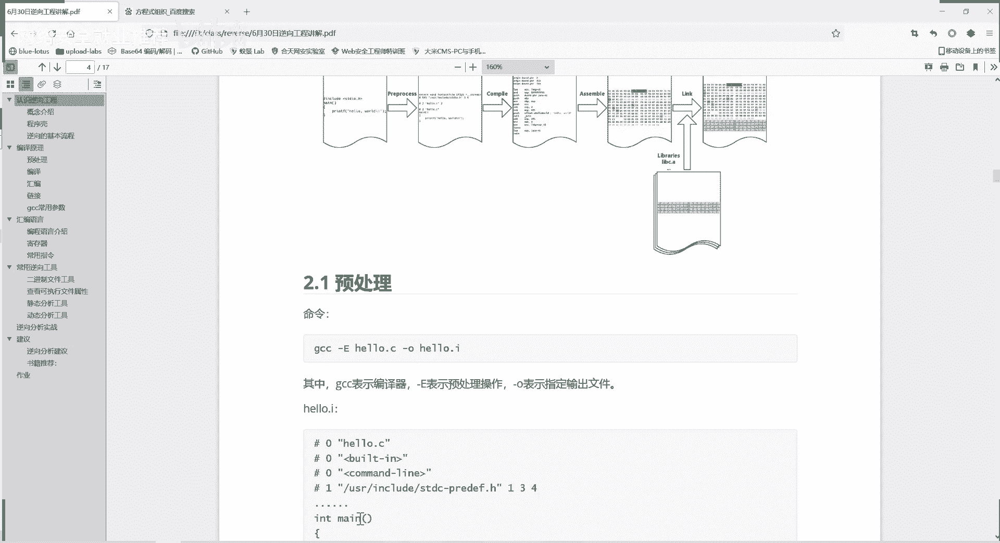
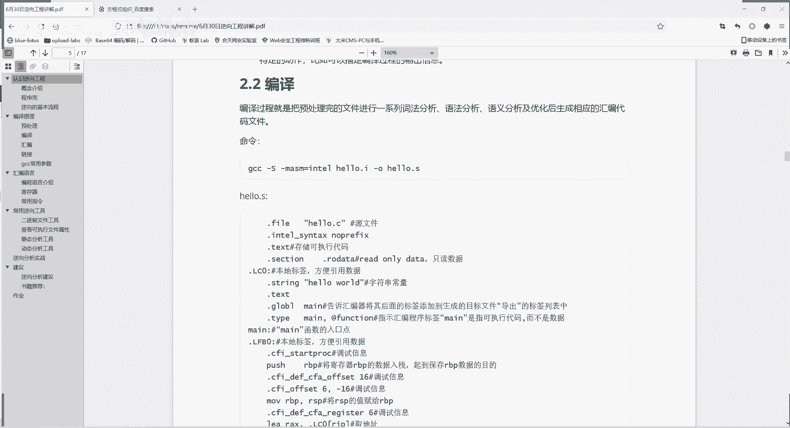
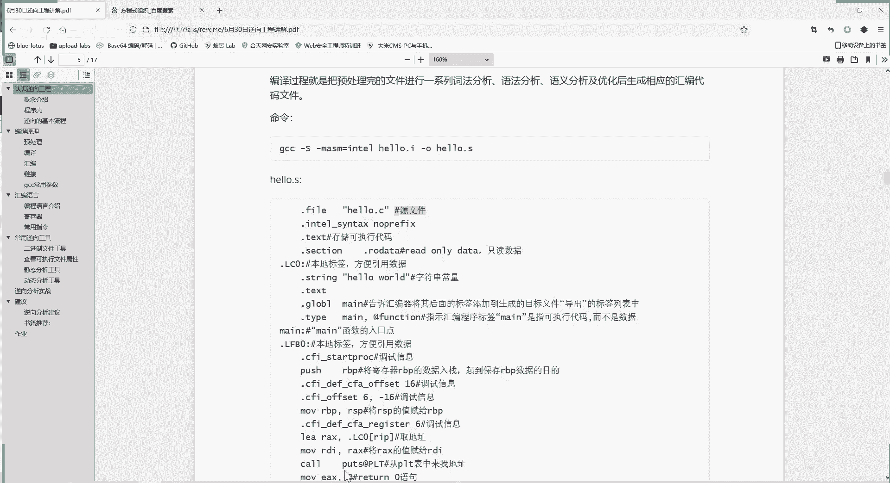
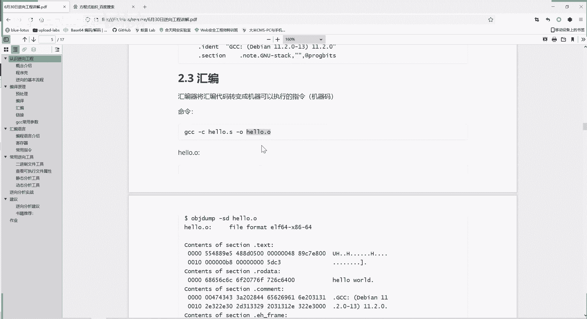
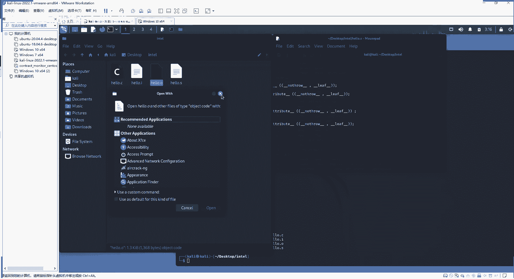
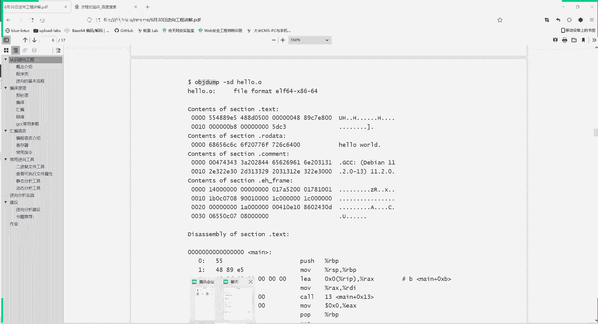
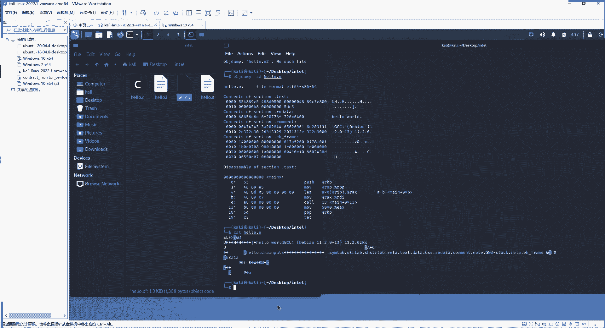
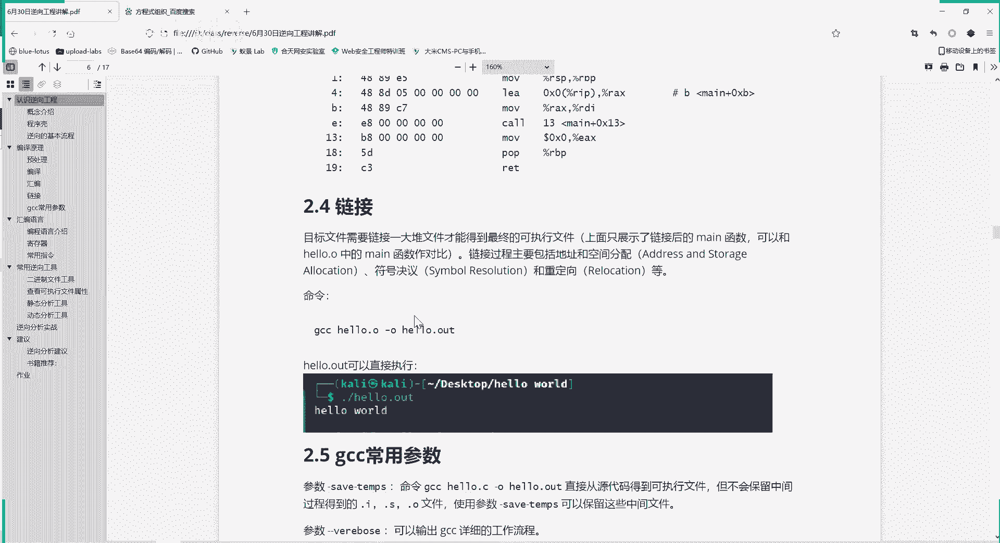
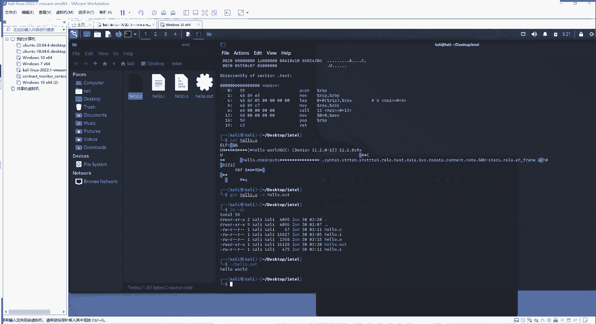

# P88：逆向工程--编译原理 - 网络安全就业推荐 - BV1Zu411s79i

这一章就给大家讲如何从一个普通的大家写，就是平常大家用的c语言的一个源代码，得到一个可执行程序，我们在进行c语言的学习啊，编写的过程中，是不是我们每次编好了c语言，要点击一个编译链接。

它才会我们上课的时候是不是会弹出一个黑框，上面是我们输出的结果，或者是我们计算的一个结果，因为这个c语言这个源代码，它是不能直接执行的，这些源代码呢是一些啊英文的字符，它是不被计算机理解的。

计算机是一个二基于二进制的，它能理解的就是零和一再通，再底层一点，他能理解的就是高电平，低电平，所以任何程序要执行呢，任何我们编写的代码要得到执行呢，都要转换成一个二进制的一个程序。

只有二进制的才能被计算机理解，才能被cpu理解，cpu才知道自己要干什么，那么像这样的一个简单的代码，简单的c语言代码就是print hello world，print f hello world。

他们怎么有这个啊，英文字符转化到计算机，可以理解的一个二进制文件呢，它这个转化过程需要进行四步，分别是预处理，编译，汇编和链接，我们先每一步看一下，后面再回回过头来看这个图，首先第一步是预处理，预处理。

大家这个也可以自己在这个电脑上执行，我觉得你是在linux系统下，使用这个gcc编译器进行编译的。

啊这就是我编译的结果。

第一步呢我们先写好这个c语言文件，就hello。c。

嗯这里我这里我再给大家操作一遍吧，把这些先把这些文件都删了，现在这个目录下只有一个文件，好了点，c就是我们写的一个c语言的程序，如何让它转换成可执行文件了，当然你直接用gcc编译是可以的。

它直接编译他也是经过这四步，我们就不直接跳到最后了，我们看一下每一步的过程，详细了解一下它的工作过程，第一步呢就是gcc，使用杠e参数进行一个预处理，guo呢是输出输出文件的名字叫hello。i。

那我们进行处理就得到了这个hello。i这个文件，我们看一下hello。i的内容是什么，你看他就是多了很多内容，是不是和我们原来的hello。c，相比就多了很多了很多的内容，但是最后的部分呢。

这些关键的代码呢也都还在。

这是第一步，预处理，预处理具体是做什么工作呢，这里主要是做这五项内容，第一项头文件的包含，你看我们这个c语言里面是不是有个头文件，include井号，include 3，这是标准输入输出。

把这个库包含起来，头文件包含就是处理刚开始的井号，include指令将被包含的指令，被包含的文件内容呢插入到相应的位置，看你包含哪个文件，你包含三点i3 d i o点进去，他就把这个标准输入。

输出的这个库文件可以加入进来，第二步操作了，就有经能红的替换，我们在编写c语言的时候，是不是可以定义一个红，比如说我们可以定义它是3。1415926，那么他在进行预处理呢。

就把你程序里面所有写到写到这个pad的地方，全部替换成3。1415926，它就进行这个替换，然后再把这个宏定义给删除，就不需要再用到红了，因为他已经进行了全部的替换，第三个就是处理条件，编译指令。

条件编译，大家在学习c语言的时候学过，我们就是我c语言，它可以写很很多行代码，很多块，我根据输入的不同来调用不同的块，这个时候编译呢就可以用条件编译，我根据输入的不同，我只编译相应块的代码。

别的代码不进行编译，第一步预处理就要处理这个条件编译处理，然后第四个呢是删除所有的注释，注释是我们程序开发者，这就是写代码的人，说白了他自己方便自己后面读代码写的注释，那么我们在进行编译的过程中呢。

就不需要这个注释了，它会预处理阶段会删除所有的注释，然后第五步呢，就是保留这个帕格玛这个编译器质指令，这是设定编译器编译器，我们这里用的编译器呢就是gcc，gcc就是编译器边线器嘛，就是工具。

就是编译的工具啊，大家这样理解，这是prema是设定编译器的一个状态的一些函数，我们平常一个指令，我们平常进行这个代码编写的时候，其实不用管它，所以我们最后就是包含进的一些图文件，一些信息。

那么最后得到的就是这些，大家可以试一试，如果说你自己在这个c语言里面，加了一些注释信息，你再进行第一步预测，你看注释信息还在不在，可以记住自己啊，进行一个测试，啊这是第一步，预处理，然后第二步呢是编译。

编译的过程呢，就是把预处理完的文件与上一步得到的结果，进行一系列词法语法语义分析，然后生成相应的汇编代码，前面看到的还是我们人类理解的这个语言，是不是，然后这说白了这也是高级语言的形式，然后呢。

这第二编译，就是把这高级语言转换成这样的一个c语言的，那个汇编语言的过程，这里也给大家都把这个文件复制出来了，这个第二步的命令是什么，杠s参数，这里加上一个杠m a s m等于英特尔上。

是让他用英特尔的汇编代码的格式来进行编译，还有除了英特尔还有什么，还有nt t n t，这也是美国的一个大公司，他们俩的汇编语言的格式是不一样的，然后我们要处理的文件呢就是hello，点hello。

点i就是我们上一步得到的文件，然后输出文件的名称呢还能点s，啊我们这里。

再操作一遍gcc编译器，杠s就是进行编译命令，然后我们选择英特尔这个汇编代码的模式，这也是用的最多的，下一步得到了好友点i，然后这一步输出高额输出，输出文件名就叫好点s，这样我们就得到好多点s。

这个文件大家可以看一下啊。

这个还有点s这个文件呢我也把它复制出来了，放在这里面，这个井号后面的注释内容啊。

原文件是没有的，是我给大家加的注释，你看原文件是这是没有注释的。

那么这个文件我们怎么看懂呢，我让大家看懂，我对它的每一行代码呢就进行了注释，比如说第一部分file hello，点c就只是我现在这个编译它的源文件是什么，我们是由hello。c这个文件进行编译的。

这是源头，然后这里大家能理解英特尔的语法吗，因为我们这里是加了英特尔了点，test呢是代码段存储可执行代码，这里section还有这个段，r o date roo是什么意思啊，就是read only。

只读数据，就是常量不能更改的，只读数据是什么呢，这本来只读数据就是这个hello world，就是我们要输出的这个字符，还是个常量，设为只读数据，这前面再加个点lcd，这是一个本地标签的意思。

标签就是说这个位置是什么，那我以后要引用这个字符串常量，我只要引用这个点lc 0就行了，相当于给我字符串常量的位置做一个标签，这global man呢就是告诉汇编器，将后面的标签添加到生成的目标文件。

导出标签列表中啊，这个大家可能暂时还不太理解，就是你可以说就是保留一个标签信息吧，就这么简单，就这么理解，这个type man呢，还有at function，这里后面给大家讲一下这些知识。

这一部分是一个可执行代码，而不是一个数据，这个men是函数，不是数据，这hello word是数据，是字符串常量，后面这里men冒号，这是我们的main函数的入口点，这里才真正进入我们的main函数。

main函数就是我们写hello world里面int main括号，print f那个main函数，这里又是一个标签，他们俩都是标签，只是标签的名称不一样，以不同的标签肯定要进行不同的命名。

这个cfi是一个调试信息，push，这里就开始进入了一个汇编语言，我们下一章再具体讲这个汇编语言的意思，汇编语言也就是指令就进行一些指令，然后指令完执行完了，ret返回函数返回啊，这是得到的。

这是编译得到一个汇编代码，汇编代码是更贴近于这个计算机理解语言，更贴近于二进制的，但是呢他还不是二进制，你看我们的货品，这命令push mo，这也不是二进制，这是贴近于二进制的汇编语言。

那么这个时候第二步完成，就要进入到第三步，第三步呢就是一个汇编，将上面的汇编代码转化成机器可以执行的指令，也就是机器码，机器码就是零一训练，二进制是程序所真正能够理解的。

第三步的命令呢就是gcc杠c小写的c，然后我们上一步得到的hello。s，然后输出呢杠额输出名称，这输出名称大家可以自己定义。

好了，这里就用的还有点o，我们站在这里看一下gcc杠c，hello。s这里我就直接tab了，因为之前我已经输入过这些命令，还有命令的历史记录，这样就得到了这个hello。o这个文件，hello。

o这个文件，这个大家可以看一下，看到没，hello，点o这个文件呢，它还是没有执行权限，它是不能执行的，我们打开看一下，看提示，我们它不是一个文本文件。

它是一个二进制文件，这个时候呢事实上得到的是一个二进制文件，它不是像我们前面的这些文本文件，因为他把前面的文本文件，这里面的二进制，这这里面的一些汇编的代码，他已经翻译成了机器码，翻译成二进制。

这个时候我们不不能直接双击打开了，那就是乱码了，这时候我们可以用这个o b j dump这个命令，来查看这种二进制文件的一个内容。

我们把之前的文件关了，我们输入ob j dump，这就是给我们显示的信息，就是这个二进制文件的给我们显示出来的信息，这不是它文件的直接形式，o b a dump显示这种信息。

就是为了让我们更好地理解这个文件的内容，如果我们直接cat这个hello。o，你看这是二进制文件夹，它大量的是乱码，是不显示，我们看不懂的，所以说要以这种形式来进行显示。

我们在课件里面看，你们把这些内容都放到课件里面了，大家看这是read only字段部分存储的值是什么，hello world，这是实际上是这个o b a dump给我们翻译过来。

是hello world，他这一块真正的信息呢，就是这些000068656c，这都是16进制的文件，16进制就是一个二进制的一个简单表示，因为你想这个是输输这么多，01201把谁都会看晕。

所以就用16进制来表示二进制，因为他们的内容是一一对应的，在想是不是你二进制的内容和16进制的内容，是一一对应的，完全可逆的，这里指示呢是我们使用gcc，这个编译器来进行编译的。

这comment就是大家可以理解为计算机的注释信息，还是要帮助计算机里它不是真正执行程序的，然后下面是真正执行的代码，这左边呢是机器码，机器码就是二进制，真实存在的内容，只不过是以16进制来显示的。

这边呢是翻译，翻译成这个机器语言，翻译成那个汇编语言，事实上，print f hello world，然后return我们这两句话对对应的汇编语言，就是这个操作，啊这是一个编译的过程。

最后就是链接链接呢，我们编译得到的这个文件叫目标文件，目标文件，它还需要链接一大堆文件，才能得到最终可执行文件，为什么，因为你目标文件就是你编写源代码的时候呢，用到了一些库函数。

还有别的一些你这个工程里面其他的一些文件，你都进行了调用，还有一些动态链接库的文件，你现在只把你本身这个c c hello，点c里面的内容给翻译成机器码了，你还没把那些链接文件链接过来。

所以为了让这个程序最终得到这些呢，还要进行第四步，就是一个链接，链接，这样就是gcc，hello，我们上一步的hello，点o杠o输出电好了，点out输出的内容输出文件名。

大家可以自行进，让输出输出之后呢，就得到了一个可执行文件，我们再来看一下这个hello，点out呢是直接具有执行权限的，可以直接运行的，运行结果呢就是输出hello world。

这就是一个从c代码到这个最终可执行文件，的一个整个过程，好的，我们先休息十分钟，我们三点半开始上课，然后大家有什么问题呢，可以发在我们聊天里面。

