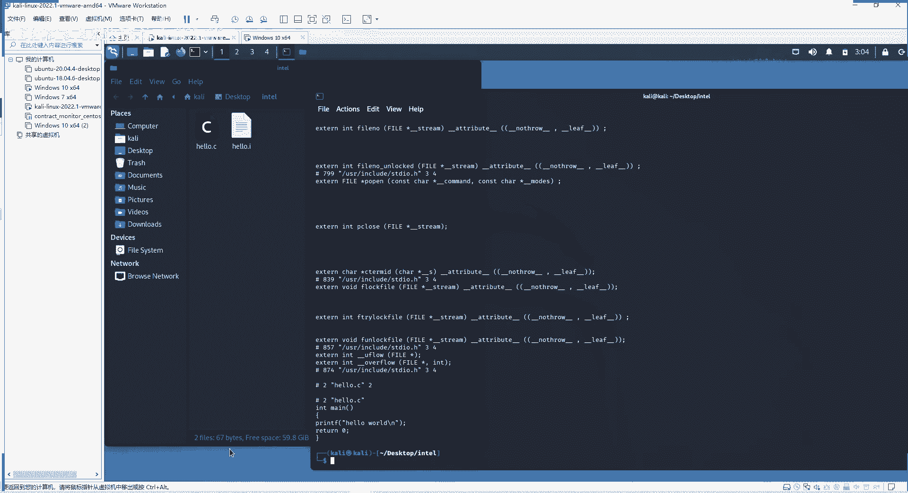
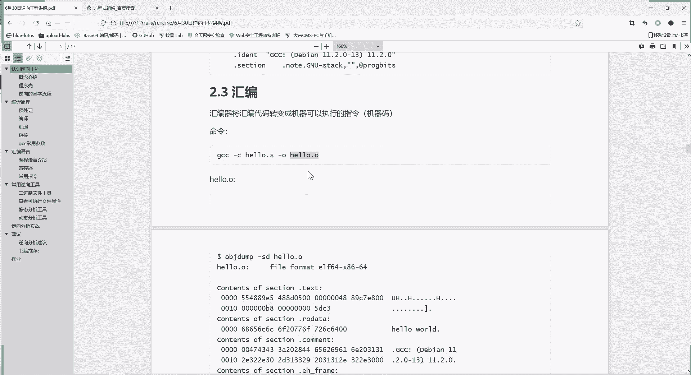
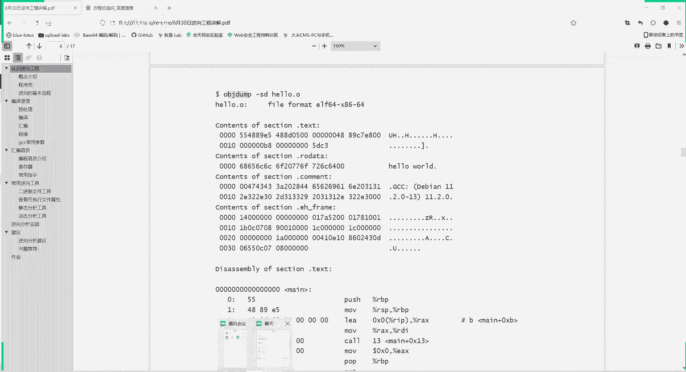
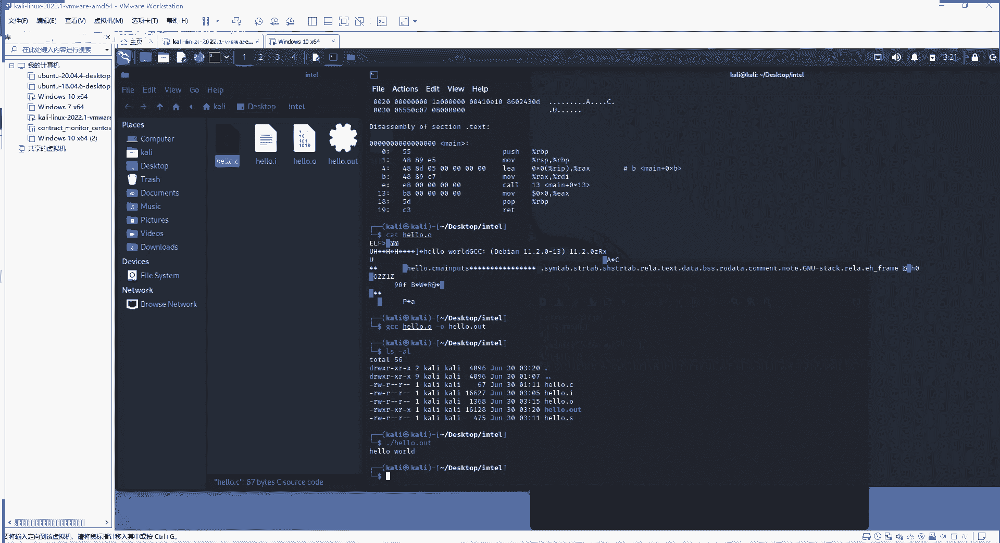

# 课程 P88：逆向工程 - 编译原理 🛠️

在本节课中，我们将学习 C 语言源代码是如何一步步转换为计算机可以执行的二进制程序的。这个过程是理解软件运行和逆向工程的基础。

## 概述 📖


我们编写的 C 语言源代码（如 `printf("Hello World")`）无法被计算机直接执行。计算机只能理解二进制指令。因此，源代码需要通过一系列步骤转换为可执行文件。这个过程主要分为四步：**预处理**、**编译**、**汇编**和**链接**。


---

## 第一步：预处理



上一节我们概述了编译的四个步骤，本节中我们首先来看第一步：预处理。预处理是编译过程的前期工作，主要处理源代码中的预处理指令。

在 Linux 系统下，我们可以使用 `gcc` 编译器进行演示。假设我们有一个名为 `hello.c` 的源文件。

使用以下命令进行预处理：
```bash
gcc -E hello.c -o hello.i
```
命令执行后，会生成一个 `hello.i` 文件。与原始的 `hello.c` 相比，这个文件内容变多了，但核心代码依然保留。

预处理具体完成以下五项工作：

以下是预处理阶段执行的主要任务：
1.  **头文件包含**：处理 `#include` 指令，将被包含文件（如 `stdio.h`）的内容插入到源代码的相应位置。
2.  **宏替换**：将代码中所有定义的宏（例如 `#define PI 3.1415926`）替换为其代表的值，并删除宏定义。
3.  **处理条件编译**：根据条件编译指令（如 `#ifdef`, `#ifndef`），决定编译哪些代码块。
4.  **删除注释**：移除源代码中所有的注释，因为注释对程序的执行没有作用。
5.  **保留 `#pragma` 指令**：保留编译器指令，用于设定编译器的特定状态或行为。

经过预处理，我们得到了一个展开所有头文件、替换了宏、删除了注释的中间文件 `hello.i`。

---

## 第二步：编译


预处理完成后，接下来进入编译阶段。编译的任务是将预处理后的高级语言代码转换为更低级的汇编语言代码。


使用以下命令进行编译：
```bash
gcc -S hello.i -o hello.s -masm=intel
```
其中 `-masm=intel` 参数指定生成 Intel 格式的汇编代码（另一种常见格式是 AT&T）。执行后，会生成 `hello.s` 汇编文件。


编译过程对 `hello.i` 文件进行词法、语法和语义分析，最终生成对应的汇编代码。汇编代码比 C 语言更接近机器指令，但仍然是人类可读的文本形式。

例如，生成的 `hello.s` 文件内容可能包含以下部分：
```assembly
    .section    .rodata
.LC0:
    .string "Hello World"
    .text
    .globl  main
    .type   main, @function
main:
    push    rbp
    mov     rbp, rsp
    ...
    ret
```
*   `.section .rodata` 定义只读数据段，存储字符串常量 `"Hello World"`。
*   `.text` 段存储可执行的代码。
*   `main:` 标签是主函数的入口点。
*   后续的 `push`, `mov` 等是具体的汇编指令。

至此，我们得到了汇编语言文件 `hello.s`。

---

## 第三步：汇编

编译阶段生成了汇编代码，但计算机 CPU 最终执行的是二进制机器码。汇编阶段就是将汇编代码翻译成机器码。

使用以下命令进行汇编：
```bash
gcc -c hello.s -o hello.o
```
命令执行后，生成 `hello.o` 文件，这是一个**目标文件**。此时，文件内容已经是二进制格式，无法用文本编辑器正常查看。



我们可以使用 `objdump` 工具来查看其内容：
```bash
objdump -s -d hello.o
```
`objdump` 会将二进制内容以十六进制和反汇编的汇编指令形式显示出来，便于我们理解。

例如，输出中会显示：
```
Contents of section .rodata:
 0000 48656c6c 6f20576f 726c6400        Hello World.
...
Disassembly of section .text:
0000000000000000 <main>:
   0:   55                      push   %rbp
   1:   48 89 e5                mov    %rsp,%rbp
   ...
```
左边是机器码（十六进制表示），右边是对应的汇编指令。此时，`printf("Hello World")` 和 `return 0` 这两句 C 代码已经被翻译成了具体的机器指令。


---



## 第四步：链接


汇编阶段生成的目标文件（`.o` 文件）还不能独立运行。因为我们的程序通常调用了库函数（如 `printf`）或其他模块的代码。链接阶段的任务就是将多个目标文件以及所需的库文件合并，生成最终的可执行文件。

使用以下命令进行链接：
```bash
gcc hello.o -o hello.out
```
命令执行后，生成 `hello.out` 文件。这个文件拥有了可执行权限。

运行该程序：
```bash
./hello.out
```
终端将输出：
```
Hello World
```
至此，我们成功地将一个简单的 C 语言源代码 `hello.c` 转换成了可以执行的程序 `hello.out`。

---

## 总结 🎯

本节课我们一起学习了 C 语言程序从源代码到可执行文件的完整编译过程。这个过程包含四个核心步骤：


1.  **预处理**：处理头文件、宏、条件编译和注释，生成 `.i` 文件。
2.  **编译**：将预处理后的高级语言代码转换为汇编代码，生成 `.s` 文件。
3.  **汇编**：将汇编代码转换为机器码，生成目标文件 `.o`。
4.  **链接**：将目标文件与所需的库文件链接，生成最终的可执行文件。




理解这个过程是学习逆向工程、程序分析和系统安全的重要基础。通过手动执行每一步，我们可以更深入地洞察程序的构建原理。