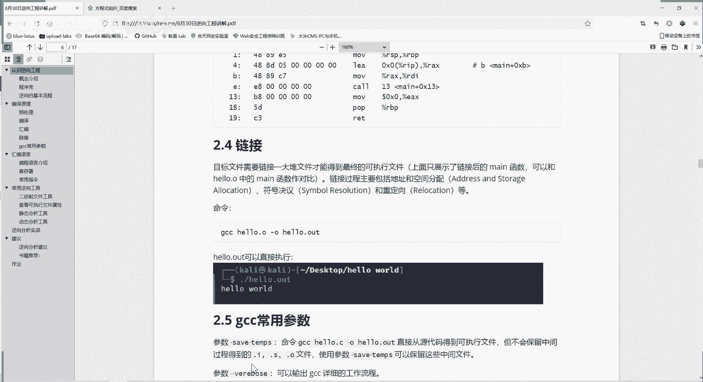
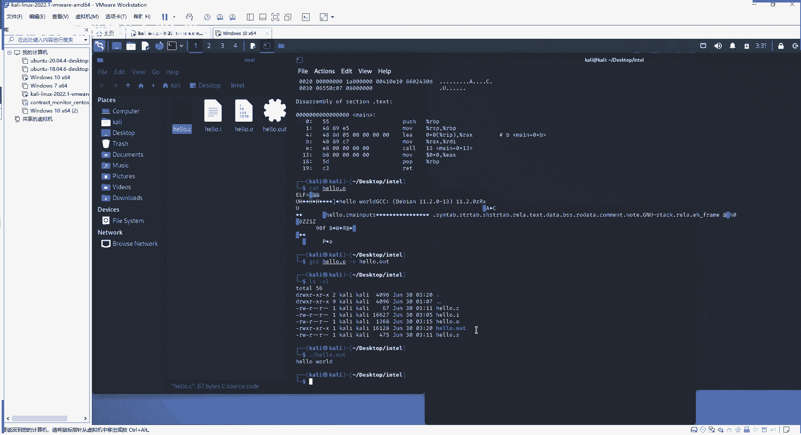
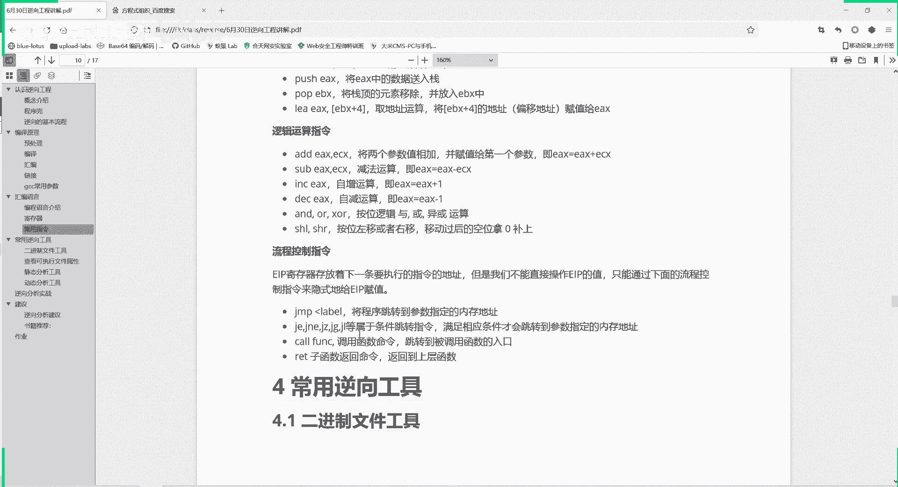

# 逆向工程课程 P89：汇编语言基础 🧠

在本节课中，我们将学习计算机程序的编译全过程，并深入理解汇编语言的核心概念。汇编语言是连接高级语言与机器硬件的桥梁，掌握它对于理解程序底层运行机制至关重要。

---

## 编译过程详解 🔄

上一节我们介绍了逆向工程的基本概念，本节中我们来看看一个C语言程序是如何一步步变成计算机可执行的文件的。

整个编译过程可以分为四个主要步骤。

以下是编译过程的四个步骤：
1.  **预处理**：处理源代码中的宏定义、条件编译指令和注释，生成一个`.i`文件。
2.  **编译**：将预处理后的文件翻译成汇编代码，生成一个`.s`文件。
3.  **汇编**：将汇编代码翻译成机器可以识别的二进制指令（目标文件），生成一个`.o`文件。
4.  **链接**：将目标文件与所需的库文件进行链接，解决外部引用，最终生成可执行文件（如`.out`或`.exe`）。

使用GCC编译器时，可以通过`gcc -save-temps`参数保留所有中间文件，方便分析学习。使用`gcc --verbose`参数可以输出详细的编译流程信息。

理解编译过程是理解计算机程序本质的基础，也是进行逆向分析的前提。

---

## 三种编程语言 🗣️

理解了程序如何生成后，我们需要了解计算机能理解的“语言”。编程语言主要分为三个层次。

以下是三种编程语言及其特点：
*   **机器语言**：由二进制`0`和`1`组成的指令，直接控制硬件电路的高低电平。它是计算机唯一能直接执行的语言，但极难阅读和编写。
*   **汇编语言**：用助记符（如`MOV`, `ADD`）代替二进制操作码的**低级语言**。它比机器语言友好，但仍与特定的CPU架构（如x86, ARM）紧密相关。公式表示为：`汇编指令 = 操作码助记符 + 操作数`。
*   **高级语言**：如C、Python、Java，语法接近人类自然语言或数学语言，**与硬件平台无关**。它们通过编译器或解释器转换为底层语言后执行，极大地提高了开发效率和程序可移植性。

这三种语言的关系是：越高级的语言对人类越友好，开发效率越高，但执行效率相对越低（需要更多转换步骤）；越低级的语言对机器越直接，执行效率越高，但开发难度越大。

---

## 汇编语言核心：寄存器 💾

汇编语言操作的核心对象是寄存器。寄存器是CPU内部的高速存储单元，访问速度远快于内存和硬盘。

寄存器主要分为以下几类。

以下是主要的寄存器类型及其功能：
1.  **通用寄存器**：用于算术运算、逻辑运算和数据传输。
    *   **数据寄存器**：`EAX`（累加器）、`EBX`（基址寄存器）、`ECX`（计数器）、`EDX`（数据寄存器）。它们可以按32位、16位或8位来使用。
    *   **指针变址寄存器**：用于寻址。
        *   `EBP`（基址指针）：指向当前栈帧的底部。
        *   `ESP`（栈指针）：指向当前栈帧的顶部。
        *   `ESI`（源变址寄存器）和`EDI`（目的变址寄存器）：常用于内存数据块传输。
2.  **段寄存器**：如`CS`（代码段）、`DS`（数据段）、`SS`（堆栈段），在内存寻址中用于确定段的基地址。
3.  **指令指针寄存器**：`EIP`，存储**下一条将要执行指令的内存地址**。程序顺序执行就是`EIP`自动增加；跳转、循环、函数调用等操作本质上就是修改`EIP`的值。
4.  **标志寄存器**：`EFLAGS`，存储上一条指令执行后的状态信息（如是否为0、是否溢出、是否进位等）。条件跳转指令（如`JE`, `JNE`）就是通过检查这些标志位来决定是否跳转。

寄存器的层次关系是：**CPU -> 寄存器 -> 内存 -> 硬盘**，速度递减，容量递增。

---

## 常见汇编指令集 📜

了解了存储数据的寄存器后，我们来看看操作它们的指令。汇编指令是控制程序流程和数据处理的基本命令。

以下是几类常见的汇编指令：
*   **数据传送指令**
    *   `MOV dest, src`：将数据从源操作数复制到目的操作数。例如：`MOV EAX, EBX`。
    *   `PUSH reg`：将寄存器数据压入堆栈。
    *   `POP reg`：从堆栈弹出数据到寄存器。
    *   `LEA dest, [src]`：将源操作数的有效地址加载到目的寄存器。
*   **算术与逻辑运算指令**
    *   `ADD dest, src`：加法。`ADD EAX, ECX` 等价于 `EAX = EAX + ECX`。
    *   `SUB dest, src`：减法。
    *   `INC reg` / `DEC reg`：自增/自减。
    *   `AND`/`OR`/`XOR dest, src`：按位与、或、异或运算。
    *   `SHL`/`SHR dest, count`：按位左移/右移。左移一位相当于乘以2。
*   **流程控制指令**
    *   `JMP label`：无条件跳转到指定标签地址。
    *   `CALL function`：调用函数。会将下一条指令地址压栈，然后跳转到函数入口。
    *   `RET`：从函数返回。从栈中弹出返回地址并跳转。
    *   `JE`/`JNE`/`JG`/`JL`...：条件跳转指令。根据标志寄存器的状态决定是否跳转。

---

## 总结 📝

本节课中我们一起学习了程序编译的四个步骤（预处理、编译、汇编、链接），认识了三种编程语言（机器语言、汇编语言、高级语言）的特点与关系。我们深入探讨了汇编语言的核心——**寄存器**，包括通用寄存器、段寄存器、指令指针寄存器和标志寄存器的作用。最后，我们列举了数据传送、算术逻辑运算和流程控制这三类常见的汇编指令。

掌握这些基础知识，是阅读、分析和编写汇编代码，进而深入理解软件底层运行逻辑和进行逆向工程分析的关键第一步。