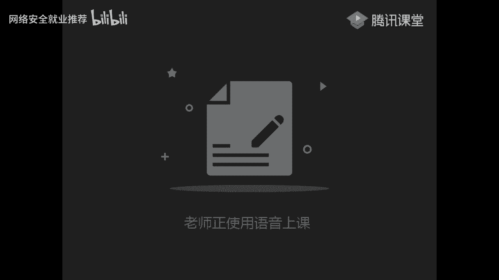
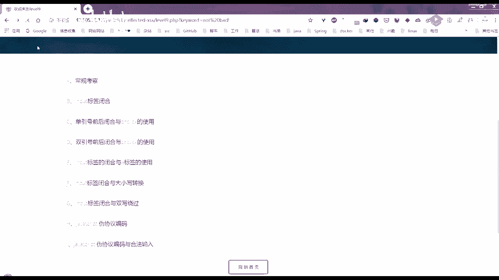
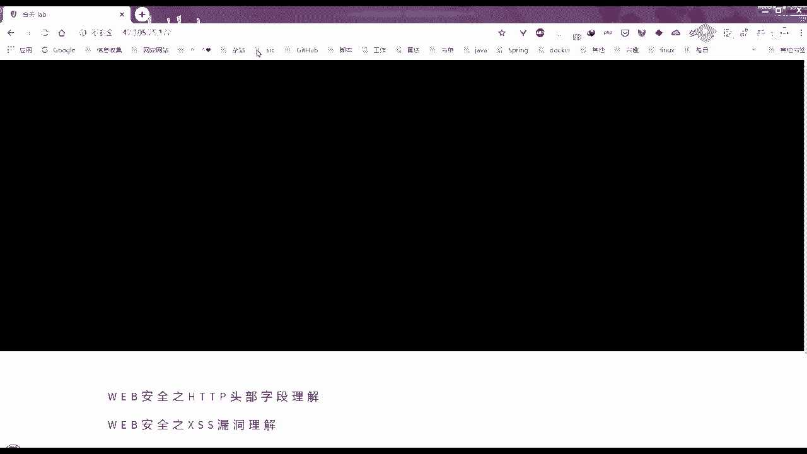
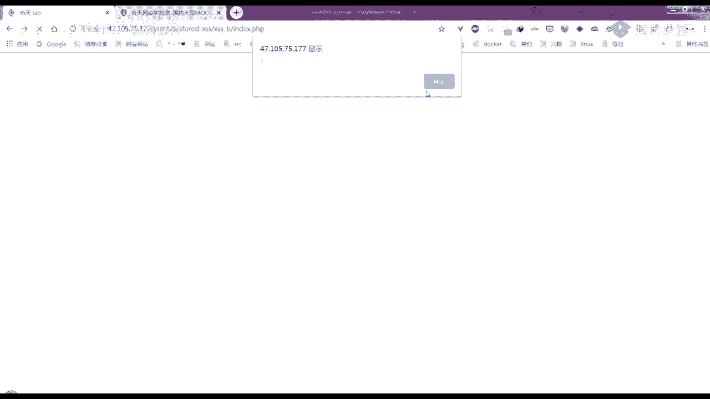
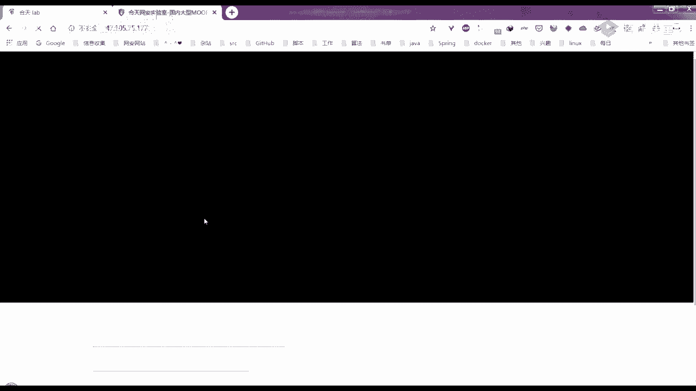
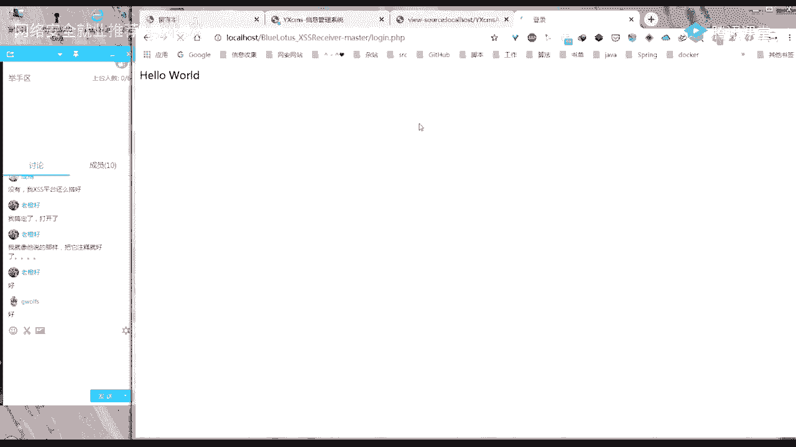
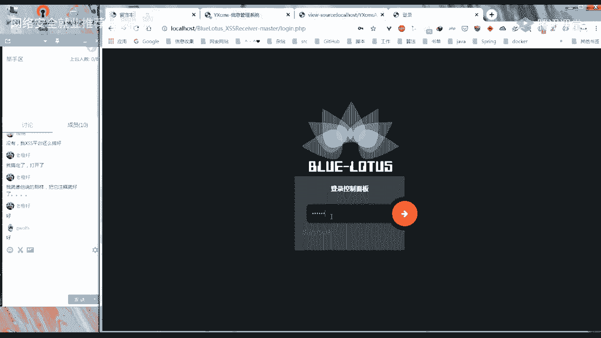
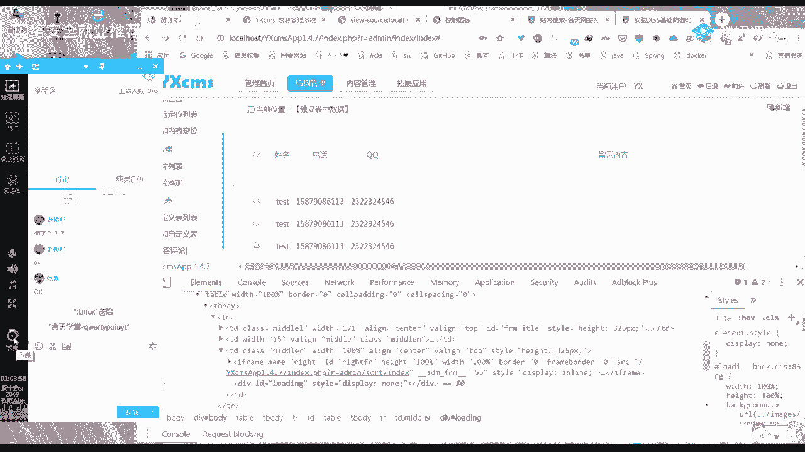

# 🛡️ 课程P9：第7天 - XSS漏洞实战与绕过技巧解析





在本节课中，我们将深入解析XSS（跨站脚本攻击）靶场中的几道关键题目，并讲解一个实战留言板XSS漏洞的利用过程。我们将重点关注反射型XSS的绕过技巧以及存储型XSS的实战利用方法，帮助初学者理解漏洞原理和攻击思路。





## 📝 课程概述

本节课将围绕一个XSS靶场的解题过程展开。我们将首先回顾反射型XSS最后两道难题的解法，然后分析一个实战中的留言板存储型XSS漏洞，探讨多种注入和绕过方法。核心在于理解不同上下文（如HTML属性、JavaScript伪协议）下的编码与解码行为，以及如何构造有效载荷（Payload）来绕过简单的过滤机制。

---

## 🔍 反射型XSS进阶挑战解析

上一节我们介绍了XSS的基本概念，本节中我们来看看靶场中反射型XSS的进阶挑战。

### 关卡H（第8关）解法：HTML实体编码绕过

此关卡的关键在于输出点位于 `<a>` 标签的 `href` 属性中，并且后台会对 `script` 等关键字进行过滤。

**核心思路**：利用HTML属性值会自动对实体编码进行解码的特性。我们构造的JavaScript代码需要先被编码，这样在服务端过滤时不会被识别，但在浏览器渲染`href`属性时又会被正常解码执行。

以下是构造Payload的步骤：

1.  准备基础的JavaScript代码：`javascript:alert(1)`
2.  对关键字符（如 `script`）进行HTML实体编码。例如，字母‘t’的实体编码是 `&#116;`。
3.  构造最终Payload。例如，将 `javascript:alert(1)` 中的 ‘t’ 和 ‘:’ 编码后得到类似 `javascri&#116;&#58;alert(1)` 的字符串。
4.  在靶场输入此Payload，添加为“友情链接”。
5.  点击该链接时，`href` 属性中的实体编码会被浏览器解码，从而执行 `javascript:alert(1)`，成功弹窗。

**代码示例**：
原始代码：`javascript:alert(1)`
编码后Payload：`javascri&#116;&#58;alert(1)`

### 关卡I（第9关）解法：字符串检测与拼接绕过

此关卡在上一关的基础上，增加了对输入合法性的判断。如果输入不包含类似“http://”的字符串，则会提示“链接不合法”。

**解题思路**：我们需要让Payload既能通过合法链接的检测，又能执行JavaScript代码。可以通过在可执行的JavaScript伪协议Payload后拼接一个“http://”字符串来实现。

以下是具体步骤：

1.  分析发现，输入内容必须包含“http://”才会被正常放入 `href` 属性。
2.  构造Payload，将可执行代码与“http://”进行拼接。例如：`javascript:alert(1)//http://`。这里 `//` 是JavaScript中的单行注释符，用于注释掉后面的“http://”，防止其影响代码执行。
3.  同时，仍需对 `script` 等关键字进行编码绕过过滤（同第8关方法）。
4.  最终的有效Payload可能形如：`javascri&#116;&#58;alert(1)//http://`。
5.  提交后，该字符串因包含“http://”而被接受，并输出到 `href` 属性中。点击链接时，执行 `javascript:alert(1)`，而 `//http://` 被当作注释忽略。

---

## 🗃️ 存储型XSS实战：留言板漏洞利用

在解决了靶场问题后，我们来看一个更接近实战的场景——一个存在存储型XSS漏洞的留言板系统。

### 漏洞初探与简单利用

留言板前台提交留言，内容会存入数据库。管理员在后台查看留言列表时，留言内容会被渲染到页面上。

**初步测试**：
1.  提交简单Payload `<script>alert(1)</script>`，发现提交后查看页面源码，`script` 标签中间被插入了`<x>`，例如变成 `<sc<x>ript>`，导致标签失效。
2.  尝试使用其他标签，如 ``。提交后发现 `onerror` 事件属性中间也被插入了`<x>`。





**意外发现**：
然而，当管理员点击某条留言的“编辑查看”按钮时，进入详情页，发现之前被插入的`<x>`消失了，`onerror=alert(1)` 被正常解析，从而触发了弹窗。这说明后台的过滤逻辑可能存在不一致性。

### 进阶利用：窃取Cookie

我们的目标不仅仅是弹窗，而是在管理员访问留言列表页（无需点击编辑）时，就能自动触发攻击，窃取其Cookie。

**利用思路**：
既然在“编辑查看”页过滤被解除，我们可以构造一个Payload，使其在详情页执行时，能向我们的攻击服务器发送管理员的Cookie。

以下是构造复杂Payload的步骤：

1.  准备一个接收Cookie的远程服务器（例如使用蓝莲花XSS平台）。
2.  构造一个利用图片加载错误触发、并动态创建`<script>`标签的Payload。
3.  由于后台过滤`script`字符串，我们使用JavaScript的字符串拼接来绕过：`'scr'+'ipt'`。
4.  最终Payload示例：
    ```html
    
    ```
5.  提交此留言后，当管理员在后台点击这条留言的“编辑查看”时，`onerror` 中的代码执行。它会创建一个新的`<script>`标签，其`src`指向我们准备好的恶意JS文件，该文件会将页面Cookie发送到我们的服务器。

### 绕过过滤的另一种技巧：反斜杠分隔

我们还尝试了不依赖“编辑查看”页面的直接绕过方法。目标是让Payload在留言列表页就能触发。

**发现**：在某些情况下，在事件处理函数名（如 `onerror`）中间插入一个反斜杠`\`，可以分隔字符串以绕过简单的关键字匹配，同时浏览器仍能正确识别该事件。

**示例Payload**：
``
这里，`o\nerror` 对于简单的字符串匹配来说不是 `onerror`，因此可能不被插入`<x>`。但浏览器在解析HTML时，会将其正确识别为 `onerror` 事件，从而在图片加载失败时执行 `alert(1)`。

---

## 💎 课程总结

本节课中我们一起学习了XSS攻击中较为深入的绕过技巧。

1.  **反射型XSS绕过**：我们掌握了利用HTML实体编码在属性值中解码执行的特性，以及通过拼接合法字符串（如`http://`）来绕过基础检测的方法。
2.  **存储型XSS实战**：我们分析了一个留言板漏洞，从简单测试到复杂利用，学习了如何利用后台过滤逻辑的不一致性，并构造能够窃取Cookie的恶意Payload。同时，也了解了使用反斜杠分隔事件名这类细微的绕过技巧。



关键要点在于，防御XSS需要全面且一致的处理策略，任何输出上下文（HTML体、属性、JavaScript代码）的疏忽或过滤逻辑的不统一，都可能成为被攻击者利用的突破口。对于学习者而言，积累各种Payload构造技巧和绕过方法，并理解其背后的原理，至关重要。