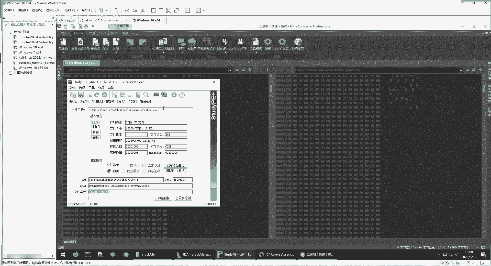

# 逆向工程课程 P90：常用逆向工具介绍 🔧

在本节课中，我们将学习逆向工程中常用的一些工具。这些工具可以帮助我们查看、分析和修改二进制文件，是进行软件安全分析的基础。

---

上一节我们介绍了汇编语言的基础知识，本节中我们来看看在实际逆向分析中会用到哪些工具。

## 1. 二进制文件查看与编辑工具

首先介绍的是用于查看和编辑二进制文件的工具。二进制文件通常以十六进制形式显示，因为十六进制比二进制（0101）更便于人类阅读和理解。

以下是几种常见的二进制工具：

*   **WinHex / HxD**：十六进制查看与编辑工具。
*   **010 Editor**：功能强大的专业十六进制编辑器，支持文件对比和脚本编写。

我们可以用这些工具打开一个程序文件。例如，打开一个名为 `crackme` 的程序，工具会显示其十六进制内容。左侧是十六进制数值，右侧是对应的ASCII字符。其中可读的字符串是程序中的数据，而无法显示的“乱码”通常是CPU要执行的机器指令。在这些工具中，我们可以直接修改十六进制数值，例如将 `70` 改为 `71`。

此外，这类工具通常附带文件比较功能（如 `UltraCompare`）。我们可以选择“二进制比较”模式来对比两个相似的文件，工具会高亮显示它们之间的差异，这对于分析软件补丁或不同版本非常有用。

## 2. 可执行文件属性分析工具

接下来，我们学习如何查看可执行文件的结构和属性。不同的操作系统有不同的可执行文件格式。

*   **Windows 平台 - PE 文件**：Windows下的可执行文件（如 `.exe`, `.dll`）都是 **PE** 格式。我们可以使用 **StudyPE** 或类似工具进行分析。打开一个 `crackme.exe` 文件，工具会显示其是否为32/64位程序、哈希值（MD5, SHA1）、是否加壳等信息。例如，文件类型显示为 `TASM / MASM`，表明这是一个由汇编语言编译且未加壳的程序，便于直接分析。
*   **Linux 平台 - ELF 文件**：Linux下的可执行文件是 **ELF** 格式。我们可以使用 `readelf` 命令来查看其属性。在终端中输入命令 `readelf -a hello.out`，即可查看该ELF文件的全部信息，包括编译平台、版本、段信息等。

## 3. 静态反汇编利器：IDA Pro

现在，我们进入核心工具部分。**IDA Pro** 是目前功能最强大、最流行的**静态反汇编**软件，是安全分析的必备工具。

IDA 是免安装的绿色软件，解压后即可使用。其中 `ida.exe` 用于分析32位程序，`ida64.exe` 用于分析64位程序。

使用 IDA 打开一个程序后，它会自动进行反汇编分析。其界面主要分为以下几个窗口：

1.  **函数窗口**：位于左侧，列出了IDA分析出的所有函数。
2.  **主窗口**：位于中央，显示反汇编后的汇编代码或程序控制流图。
3.  **导航栏**：位于主窗口下方，用不同颜色块标识不同的代码段（如代码、数据），点击可快速跳转。
4.  **结构体/枚举窗口**：显示分析出的数据结构。
5.  **导入/导出表窗口**：显示程序调用了哪些外部函数（导入）以及提供了哪些函数（导出）。
6.  **脚本输出窗口**：支持Python脚本进行自动化分析，并显示输出信息。

IDA 的常用快捷键对于提高分析效率至关重要：

*   **F5**：将汇编代码转换为更易读的**伪代码**（C语言风格）。
*   **F2**：在指定地址设置或取消**断点**（用于动态调试）。
*   **F7**：**单步步入**，遇到函数调用会进入函数内部。
*   **F8**：**单步步过**，将函数调用作为一个整体执行，不进入内部。
*   **F9**：**运行程序**，直到遇到断点或程序结束。
*   **ESC**：返回到上一个视图位置。

## 4. 动态调试工具

动态调试是指在程序运行时进行分析。我们介绍两款经典的动态调试器。

*   **OllyDbg**：主要用于调试32位Windows程序。
*   **x64dbg**：支持64位和32位Windows程序的调试。

它们的界面布局相似，通常包含以下几个核心窗口：

1.  **反汇编窗口**：显示正在执行的汇编指令。
2.  **寄存器窗口**：实时显示CPU各寄存器（如EAX, EBX, EIP, ESP）的值。
3.  **数据窗口**：查看或修改指定内存地址的数据。
4.  **堆栈窗口**：显示当前线程的调用堆栈信息。
5.  **信息/日志窗口**：显示调试过程中的输出信息。

通过结合使用断点、单步执行等功能，我们可以观察程序在运行时的具体行为，例如寄存器值的变化、内存数据的读写，从而理解其逻辑或定位关键代码。

---

本节课中我们一起学习了逆向工程的常用工具。我们首先了解了用于直接查看和编辑二进制文件的十六进制编辑器，然后学习了分析可执行文件格式的工具。接着，我们深入介绍了功能强大的静态分析工具 IDA Pro 及其界面和快捷键。最后，我们预览了用于动态分析的调试器，如 OllyDbg 和 x64dbg。掌握这些工具是进行后续实战逆向分析的基础。