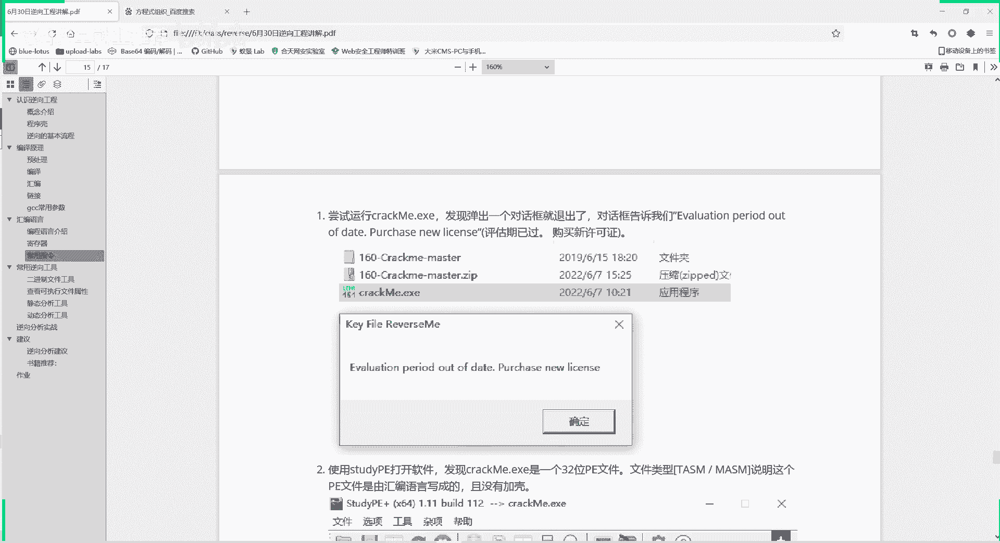
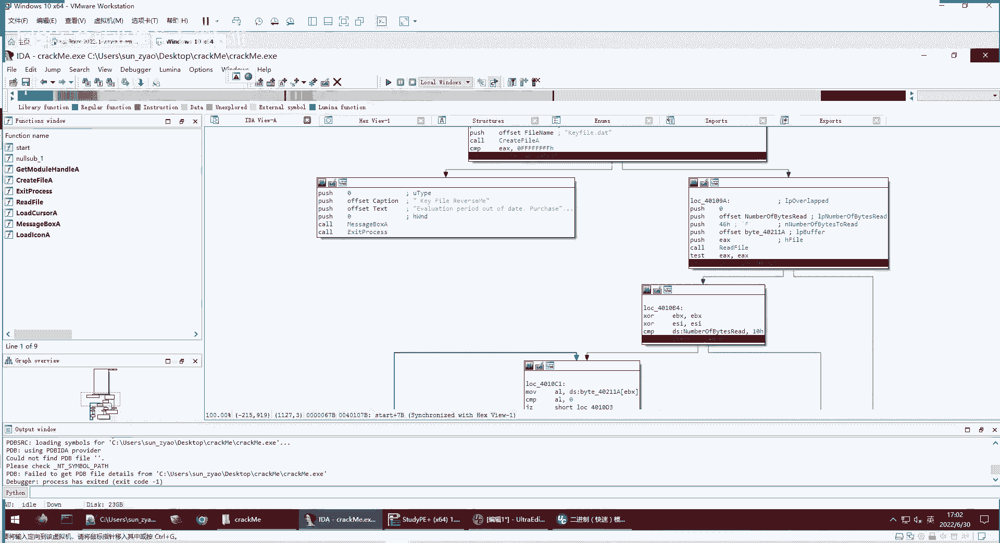
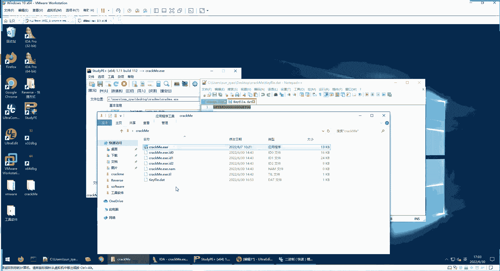

# P91：逆向工程--逆向分析实战（一） - 网络安全就业推荐 - BV1Zu411s79i

就是我们给大家举个例子，这correct me这个软件它的md 5值是这么多，这md 5值是为了保证咱们用的是同一个软件，他们破解的是一个同一个软件，这个软件的名称是可以随便重命名的。

但是它的md 5值是固定的，我们这节课呢就也就带大家一起做一遍啊，这个程序呢之前是已经发送给大家的，就quick me，这个点击x e，我们所用的工具呢也发给大家了啊，大家下载了的同学。

我们今天现在就一起把这个题目做一遍，首先我们把这个工具都放在我们的虚拟机里面。

进行操作，这样我们就不怕中病毒，在虚拟机在虚拟机里面我们直接运行这个程序，它会感冒啊，已经过期了，out of date，让我们购买这个凭证，大家在使用软件的时候，经常会遇到这个问题。

就是需要输入序列号什么的，这是第一步，然后第二步呢我们用study pee这个软件打开，看一下，看一下它的信息啊，这你刚才也给大家看过，发现它是32位的，然后没有加壳这两个最重要的信息。

那么它是32位的，没有加壳那行，那现在分析就比较简单了，直接用ida 32打开这个这个程序。

这里我们之前已经打开了，打开这个程序呢就看到，这样一个，等一下看到这样的一个显示结果，这里是它的一个程序代码，i d a呢会把入口点自动命名为start，那我们就点击start就进入了。

他到这儿就这里呢就是程序执行的起点啊，这个程序啊大家不要产生误会，不是我之前给大家演示的编译的程序，print hello world，这不是，这是一个相对复杂一点的程序，那是个最简单程，这是不一样的。

现在我们就要弄清楚这个程序的机制，然后破解它，这是我们这节课的一个目的，怎么破解，怎么破解呢，看这里是不是有很多程序的分支，我们先总体来看啊，不要一开始就一句话一句话看，你这样你陷入了细节当中了。

你就很迷茫，你根本不知道这每个命令是要干啥，我们需要先从总体上把握这个函数这个程序，然后再分积分到几大类，然后每个函数，然后对重点的函数，我们再进去逐步逐步的看它的语句，不要一开始就看具体的语句。

看每个句句的，看你这样就陷到细节里面了，你就很迷茫，根本搞不清楚要干什么，那么我们可以看一下它，就它首先在这里会遇到一个分支，进入这两种，然后呢如果说进入这个分支。

大家看看这里面有什么什么字符可以firefers me，你会吗，valuation period out of time，purchase new license，是不是，这是不是我们刚才显示的信息。

我们直接运行就显示这个信息，如果说它不跳转到这儿，它跳转到这里的话，我们可以拖过来看一下，然后下面又会进行一线的跳转，那最终呢最终有两种，一种是跳转到这儿说kefile is not value。

这是无效的，要么就跳转到这，you really did it congratulate，恭喜，那么这个程序的大概的情况，我们是不是就已经把握了，要么刚开始就错了，在这告诉你，out of date。

要你购买这个凭证，要么在这一步成功了，然后后面的时候又可能出现一个错，出现错了，就是说这个k f无效的错误，如果这两种错误都避免了，那么就会进入到一个正确的结果，就是做对了，因为这是一道题。

所以说会显示这样正确的信息，如果说是一个普通软件的话，就是说你你已激活啊，您可以正常使用，或者是它让你登录成功进入，看登录成功之后的东西，这是一个这个函数的整体情况，我们进行了一个把握。

那么我们看首先看第一种错误，是不是我们直接打开运行就会遇到报这个错误，那说明在这里面进行跳转的时候，如果说直接运行的话，它会是不是就会跳转到这里，因此我们就要分期这个跳转这附近相关的代码。

看它什么时候跳转，什么墙体条件下进行一个跳转，我们看这个附近的，也不也别从从头开始看，那代码量太多了，然后很容易看云，我们就看这附近的，我们可以看到这这一段前面的有个kefile，reverse me。

这个kefile是什么，我们现在还不知道，然后我们再往上看一点，发现这里有一个push offset file name，push就是入站啊，file name入站，file name是什么值。

这个id已经帮我们识别出来了，是一个字符串，就叫k fire。date，然后括括号去调用函数create file，他就调用这个create file，这是个识别的函数，系统识别出来的函数，然后。

产后再进行一个比较，这个aa 1 ax和这个比较，如果说jz不等于零的话，它就跳转到这里的，40109a这里note 40109，这是个标签，就跳转到这，那说明等于零的话就跳转到这，说白了这是什么意思。

他就是要看有没有这个k file这个文件，如果有的话，它就跳转到这里之前，如果没有的话，他这里就会给你报没有这个文件，因此呢我们可以创立一个kefile。date，这样的文件。

我们在这crack me这里面，我们新建一个文本文件，这个文本文件就叫kefile。d，我们看一下这个名称是不是和这里的，识别出来字符一致，k f2。6的是一致的，那那么我们再执行一下。

他就报kefile is not valid sorry，这说明什么，他已经过了这一步，它进入了这里，就前面这一段都是正确的，进入到这里之后呢，他没有跑跑到最终正确的地方，他是跳转到了一个这里的错误。

kefile is not very，他到这里是哪种情况呢，大家可以从这个箭头，可能有好几种情况都会到这，要么是这里跳转了，这里也可能跳转，然后这里也可以跳转，说明多种错误都会导致这个kefile无效。

其实这里也好理解了，因为我们建立了这个kpi了，它里面是没有内容的，就是这个时候就可以自然而然想到，它需要识别这个kefile里面的内容，是不是，那么我们现在就要通过这个程序来判断出。

这里面的内容必须是什么，才能通过它的检测，我随便说个内容试试看一下效果，他果然说这个k file是无效的，说明是不能随便输入的，那么具体有什么要求呢，从这里有多个箭头指向，这说明它有多个要求。

你不符合哪一个要求，它就会导向，这是不是你都符合了，它就会导向，最后这里成功，那我们再一个一个的看，先到正，他现在已经跳转到这里了，他肯定是到这儿嘛，要不然他不会爆他，要不然他到不了。

到不了这个最后是不是，所以前面这一步我们已经成功了，不用管了，到这里从这里从这个框开始看，从这框呢它就看它有两个分支，就两个分支，如果是这个分支的话，跳到右边这个分支必然导致错误。

如果说跳到左边的分支的话，有可能会正确，也有可能错误，说明这个跳转它就是一个验证条件，如果这个条件符合，他再进行下一步的验证，如果这个条件不符合，直接就报错，那么我们看这个条件是什么。

这个框里面只有啊七八行语句，含义是比较简单的，我们可以逐条语句看一下，用push把站压进去，这些，嗯然后这里有个谱写4646h。

这是16进制的46，这是什么意思呢，我们，我们在ae里面看小f是66，那那这里如果说是输入四六呢，你看大f它对应的16进制编码，16进制字符就是四六，是不是这点可以理解，16进制就是四位。

因为以一位是一表示两种嘛，零一吗，16x2的四次方，那两个16进制这个数字，这是一个八位，八位就是一个字节，一个英文字符就占一个字节，所以一个英文字符就用两个16进制数字，来表示。

这里i da也把我们识别出来了，就是f然后这lp buffer buffer是什么意思，下一步是就是一个指针，说白了就是这个意思，或者说一个句柄，就是后面来操作这个函数啊，或者操作这个地址。

然后push ex ex数据入账，然后coread file refer，你从这个名字就可以知道他读文件，他这里已经要读我们刚才的kefile这个文件了，是不是，然后它比较什么ex和看ex是不是零。

如果说不等于零的话，就跳转，这里它实际上比较的是什么，test，就是，验证它这两个是不是相等，这里实际上的啊，实际上的意思呢，这是什么，就是验证这个f，uf它是15的意思。

它就是要读取这个句柄处的15个字节，然后看它读取成不成功，如果读取成功的话，在ea x就不是零，如果读取不到15个字节，ex就是零，那么test ex它的结果就是零，然后就会跳转到这里，就为假。

实际上这个我们先这么理解，然后后面再进行一个动态执行，大家就更好理解，说明他这里面对我们的我们这个k da，对这个文件它的数量，它里面的字符的个数有要求，所以我们要多输入一些啊字符。

他就不会不会跳转到这儿了，他又会进入这里，进入这里呢，这里又会进行一个比较，你看number of beast read，它读到的字符个数，它会和谁比较，和10h比较，10h什么16g h代表16进制。

10h是多大，就是16，是不是十进去的话，就是10 16进去他就16，它会和16进行比较，如果说这g l l是nice，如果说你小于这个十的话，它又会跳转到这儿，如果说大于这个是不是不小于这个一零。

h就是大于等于16个字符的话，它就会跳取到这，这是第二个验证，第二条线，然后第三跳到这儿了，仍然有可能跳到这儿，我们看一下，如果说到这里面之后，但是他有可能跳到正确的，有可能跳到错误，那关键是什么呢。

我们看分叉的点是在这个框是不是，那我们在这里看它是比较什么e si和八，cm p就比较，那说明它要比较某个值是不是八，然后gl就nice是小于八还是大于八，小于八还是大于等于八，如果是小于八的话。

js就跳转到这这个4010f7 ，这个地址处就会报not valid，如果是大于等于八的话，就跳转到这个401205，也就这里啊，这里他就会最后报你成功了，顺着执行是不是。

所以我们就知道这个e s i的值要大于等于八，这是我们的目标，怎样才能让它大于等于八呢，我们前面已经到这了，我们继续看这里，从这一步到这儿是必然的，这里啊到这是一个一个判断，是不是它判断是什么。

我们常面从这到这，你看整体结构还要么到这里，要么在这边，在这边呢又会回来，说明这是一个循环的结构，我们看它循环的一个内容是什么，循环的这是什么呢，到这一步，他是，ccmp就是还是进行了一个比较。

他是把什么比较出来，它实际上就是把这个b x就是和放到a l当中，然后和a l比较，就是判断是说白了这个意思就是他在读文件，看你文件是不是到头了，文件是不是到最后了，他如果事到最后了，就跳到这里，没事。

到最后就继续读，继续读，读的是什么呢，他把读的结果是a l，这个零就表示这个文件的结尾吗，他如果不是这个零的话，到这里就比较和47h，47h就是g和g这个字符进行比较，看他读写字符。

比如说我们这里是不是有d r h什么呢，他跟读的字符是是不是这个大g，如果说是的话，就是比较为真，那么这个这里看一inc上节课讲过是不是自增，i n c就增加一，要否的话i n c就不增加一。

然后进行执行，所以这个区别关键就在于i e s i，它是不是自增，而这里呢是要判断e si的值是八，要大于等于八，是不是，所以我们就希望他能够每次就经过自尊的这啊，不要跳过它，这是我们的目的。

我们需要程序执行到这之后，到这里面，然后每次都能够自身自身的阅读越好，这样你把文件读完之后，那你判断usi就大于八了，是不是要使得字字呢，就要使这个字符等于记，那么我们这个时候就可以在这里面输入。

尽可能多的大g多输入几个吗，那这样的话这时候再判断e s i，等着循环组完再判断e s i，那就大于等于八了，那跳转到这最后就可以报你执行成功了，我们现在在执行一下，我们已经把这个全部输成g了。

前面有判断一个10h h 16，我们这肯定是多于16个了，所以都可以，这些绕过这些条件，我们都满足了，我们再执行一遍，看一下执行的结果，现在就可以执行情况。

you really did it congratulate，那么这个程序他就被我们破解完了，他所需要的条件就是需要一个kefile，点d e t这个文件文件名是不能改的，然后它里面的字符需要很多个g。

但是现在只是粗浅点，具体的需要多少个g呢，具体需要八个g，就这里面要含有八个g，它实际上是一个什么过程呢，就是读这里面的文件，然后读了就判断这里面从第一个字符开始，是不是g是的话，e s i加一。

不是的话，再读下一个，然后一直读到文件的最后，他这里是实际上只读16个，读前16个字符，看看是不是大g然后e si是保存的数量，最后记保存下有多少个大g，然后这里再进行验证。

如果说你的g的数量有八个或八个以上，那就执行成功，否则执行失败，验证是验证失败，啊这就是这个程序运行的一个过程，那我们这里在动态的看一下，动态来看一下，我们为了有一个动态的效果啊。

我们这里就不全输入g的，随便都要输一些，但是g的数量也要是够的，假设现在开发data是这样，那我们动态曲线看是它怎样的一个过程，我们还是先假设没有这个kpl啊，一步一步的，比如说我把这个ky名称改了。

然后我执行执行的时候，他会在这里就会报错，是不是，所以我要在这里是不是在这里下一个断点，add breakpoint，可以下一个断点，然后我来调试它用i d a，我说了，这本来是一个静态分析的软件。

但是它现在功能越来齐全，它也可以动态分析，而且动态分析能力也是很强的，我们就直接用r a进行动态分析，因为这样动静态一起看，非常的方便，你用那个温度debug啊，x x86 debug。

那都都可以选择分析器，就因为这是windows的程序，我们就选择一个local windows debug，然后我们点击执行，yes，它就会直接运行到我们下端点的地方了。

而且他这里会大家看到没有一个跳这个闪烁，闪烁就表示就表示他告诉我们，下一步要跳转到这里了，我们可以点击，单步执行诶，这里快捷键，我们可以点击单不值f7 或者f8 ，f其实不仅进入子函数。

f8 不进入子函数都在这里都可以，我的这个f7 怎么是把旁边的界面给调出来，这里啊到这里呢之后呢，我们也可以看一下，这是这些技术这个站，然后还有这个县城，我们先不用管这，他使用的模块先不用管。

然后各个寄存器里面的值是可以到运行状态中，只有我们是可以随时来读取的，哦我看一下这个，快捷键这里，f7 f8 都是可以的，他现在就跳转到这一步了，诶这，我的这个快捷键去哪了。

啊那我们就在debug里面看也可以，然后我们继续下一步，是不是他已经到这里了，那么后面就会继续报错，这种直接运行结束，它就会给我们弹出一个out of date，所以这是第一次试验，那没关系。

这次我们就通过动态执行也可以发现，他需要一个kefile date这个文件，那我们就把这个文件，现在放上这个文件，我们再进行执行，这时候大家看他跳跃的是右边这个箭头，说明他现在不会进入到左边了。

他下一步要到右边这里，我们决定关键的地方，我们在这里下一个断点，然后我们继续运行，大家看，因为我们的这个qfii里面是有文件内容的，就会跳转到左边，如果没有文件内容，就会直接到右边，然后报错，是不是。

然后我们还是跳在关键的地方下断点，大家跳转的地方我们点击运行，你点击运行，它会直接运行到你下断点的地方，如果没有下载的地方，它会直接运行到程序结束，是不是他这时候他实际上检测的字符有没有。

10h课就是16个，因为我们的字符比较多，大家在下课后可以自己做一做测试，自己拿这个k file做一下测试，当你这里面字符比较少的时候，你看它是不是会跳转过来，会跳转到这里，因为现在我们字符是比较多的。

符合16个的要求，它会跳转到这是不是，然后我们在关键的地方再下一个端点，这里跳转这里是验证什么意思，这里就是看文读取结束了没有，还没读，读到最后一个字符，所以它在这边读。

然后再决定这个e s i是增加还是不增加，大家可以看到现在e s i是等于零的，yes i的指示在这他决定看你这个等于几，大几还不等于大几，来决定是否增加，那么在这个地方再下个端点。

看读到第一个字符是等于大g的，因为我们这个第一个字符是g，那他就要进行到这里就要增加，那我们继续看，因为这是个循环啊，我们继续执行，它又到这儿，这还没有结束，又到这里面，我们下一步唉。

第二步看它是跳过了我们前面一步，增加1e si已经等于一了，因为我们第二个字符它不是大g，是大h和那个大g不相等，所以他进行他跳过一三，这样e si就不增加，他就这样一步步执行，最后独立完之后。

判断e si是大于八还是等于八，e si就g的个数在后面的啊，大家应该都会，那我们就把这个断点取消掉，我们已经搞清楚，这个过程就不需要下这么多断点了，我把这个带点删除掉，然后直接让它进入到这里的时候。

我们在下一个在这个地方下一个断点，把这里的断点也取消掉，这样我们就不会在循环里面一直在运行，他就这个整个循环过程就运行完了，然后到这里他判断usi的值，usi的值是bb就是多少，a就是十。

因为这是16进制b91 ，那还有11个81个g那就比八大，所以它跳转到这里，跳转到这里就是啊，另外一个同学有什么问题的话，就在聊天里面提出来啊，不要那个打开语音，要影响到其他同学上课。

看这里有个就闪烁的告诉我们，下一步需要调整到这里，因为它已经大于八了，然后就会继续跳转到这之后，boss执行成功，后面就是说大家推荐大家把这个kefile。data，这里面进行各种的输入。

来验证他会走什么样的一个程序，这个流程程序的流程是会怎样跳转。

然后我们把它结束掉，那么通过刚才这样的一个过程呢，就这个本来是我们是没有这个license，没有使用权限的一个程序，我们就构造出了它的一个验证了一个文件，文件名，文件内容我们都构造出来了。

那么就可以正常的使用这个程序了，这是一种软件破解的方法，就是你要附带上这个文件。

那么我们还有一种软件破解方法，就是有个软件是破解版。