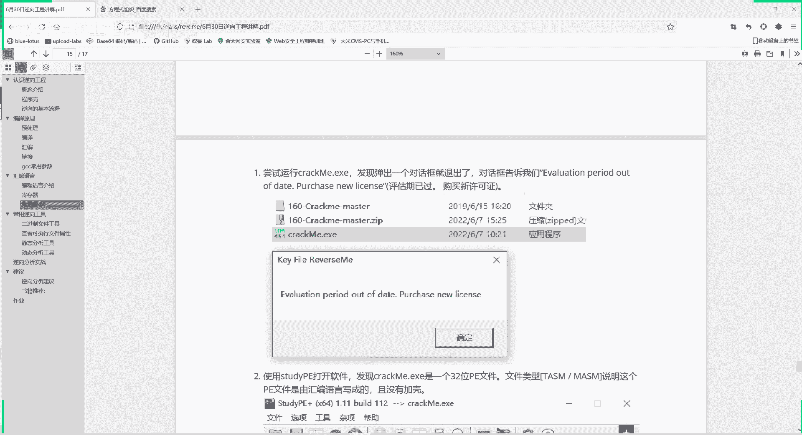
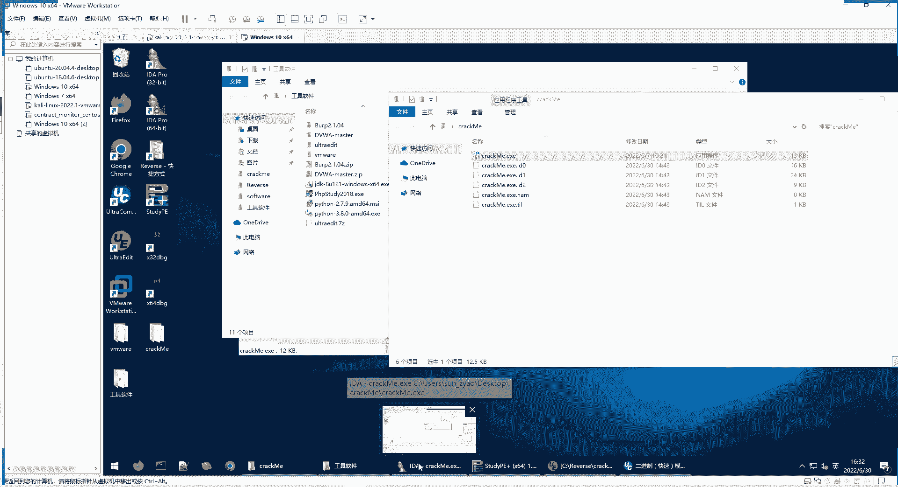
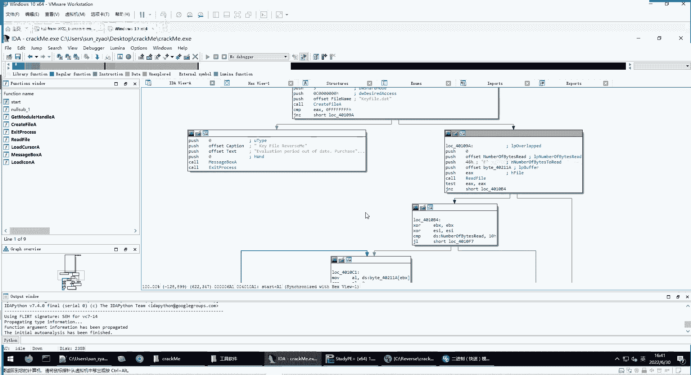
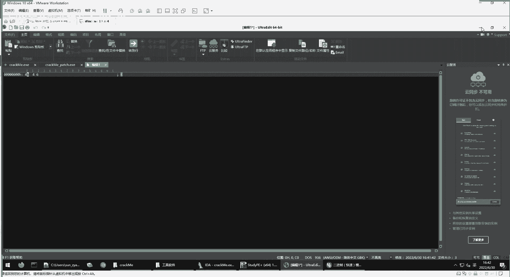
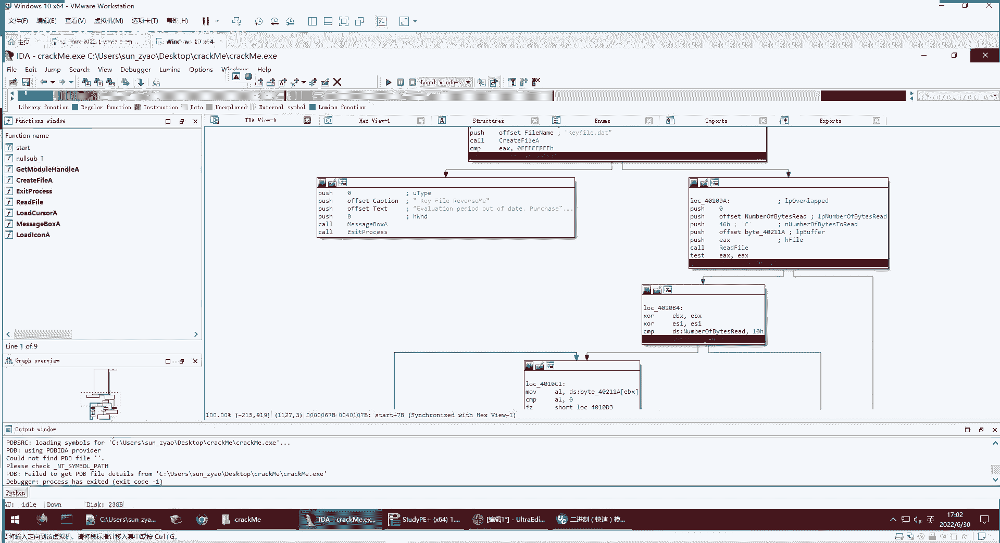
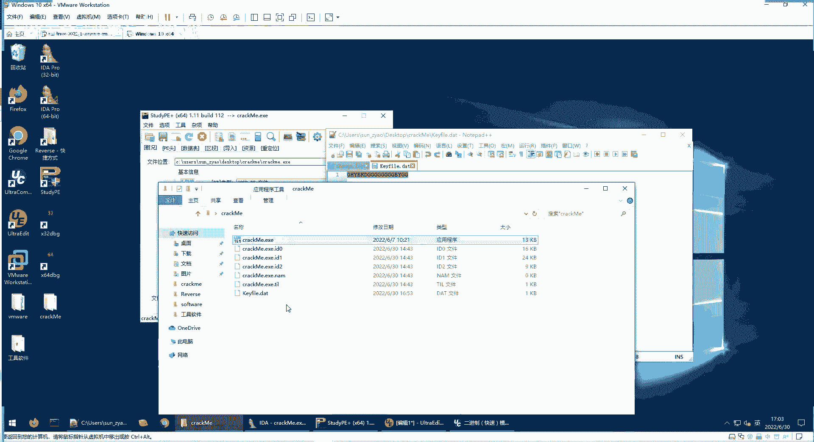

# 逆向工程实战（一）课程：破解CrackMe程序 🛠️

在本节课中，我们将学习如何对一个名为“CrackMe”的简单程序进行逆向分析与破解。我们将通过静态分析与动态调试相结合的方式，理解程序的验证逻辑，并最终绕过其保护机制。

---

## 概述与准备 📋

我们以“CrackMe”程序为例。其MD5值为固定值，用于确保大家使用的是同一个待破解程序。程序名称可以随意重命名，但MD5值不变。本节课将带领大家一步步完成破解。

**所需工具与文件**：
*   `CrackMe` 程序（已提供）
*   `StudyPE` 等分析工具（已提供）

**操作环境**：建议在虚拟机中操作，以避免潜在风险。

首先，在虚拟机中直接运行程序。程序会提示“Out of date”，要求购买凭证。这是典型的软件序列号验证场景。

---

## 第一步：程序初步分析 🔍

上一节我们运行了程序并看到了验证提示。本节中，我们来看看程序的基本信息。

使用 `StudyPE` 工具打开程序，查看其信息。关键信息如下：
*   程序为 **32位**。
*   程序 **未加壳**。

这两个信息意味着我们可以直接使用反汇编工具进行分析。

---

## 第二步：使用IDA进行静态分析 📖

由于程序是32位且未加壳，我们使用 **IDA 32位版本** 打开它。

IDA加载后，会自动定位到程序的入口点，并命名为 `start`。点击 `start` 即可进入程序执行的起点。

**注意**：这不是一个简单的“Hello World”程序，而是一个包含验证逻辑的相对复杂的程序。我们的目标是弄清其机制并破解它。

### 把握程序整体流程

分析时，不应立即陷入每行代码的细节。首先需要从整体上把握函数的执行流程。

观察反汇编代码，可以发现程序存在多个分支。总体来看，程序可能走向以下几个关键输出：
1.  提示“Valuation period out of time, purchase new license.”（即直接运行程序时看到的错误）。
2.  提示“Kefile is not valid, sorry.”。
3.  提示“You really did it, congratulate!”（即成功破解）。

由此，我们把握了程序的基本逻辑：它首先检查某种条件，失败则报错1；通过后，再进行文件验证，失败则报错2；全部通过则成功。

---

## 第三步：分析第一个验证条件（文件存在性） 📁

程序直接运行时提示过期错误，说明它首先执行了错误分支1。我们需要分析该跳转附近的代码。

观察代码发现，在跳转前，程序调用了 `CreateFile` 函数，文件名是 `kefile.date`。随后进行比较判断（`jz` 跳转）。其逻辑是：检查当前目录下是否存在 `kefile.date` 文件。如果不存在，则跳转到错误分支1。

**验证**：在程序目录下新建一个名为 `kefile.date` 的文本文件。再次运行程序，错误提示变为“Kefile is not valid”。这说明我们已绕过第一个验证。

---

## 第四步：分析第二个验证条件（文件内容） ✏️

现在程序进入了第二个验证阶段。我们需要弄清楚 `kefile.date` 文件内容的具体要求。

从反汇编图可以看到，有多个箭头指向“Kefile is not valid”错误，说明文件内容需满足多个条件。

### 条件一：文件长度要求

程序会读取文件。关键代码分析如下：
1.  `push 0Fh`：表示尝试读取 `15` 个字节。
2.  读取后，检查实际读取的字节数（`NumberOfBytesRead`）。
3.  与 `10h`（即十进制的 `16`）进行比较。如果小于 `16`，则跳转到错误分支。

**结论**：文件内容至少需要 **16个字节**。

### 条件二：特定字符计数要求

满足长度要求后，程序进入一个循环结构，读取文件内容（实际只读前16个字节）。核心逻辑如下：
*   循环读取每个字符。
*   将读到的字符与 `47h`（即大写字母 **‘G’** 的ASCII码）进行比较。
*   如果字符等于 **‘G’**，则寄存器 `esi` 的值增加 `1`（`inc esi`）。
*   循环结束后，检查 `esi` 的值。
*   如果 `esi >= 8`，则跳向成功分支；否则跳向失败分支。

**结论**：文件的前16个字符中，至少需要包含 **8个大写字母‘G’**。

---

## 第五步：构造破解文件并验证 ✅

根据以上分析，我们可以构造出能通过验证的 `kefile.date` 文件。

**文件要求总结**：
1.  **文件名**：必须为 `kefile.date`。
2.  **文件内容**：至少包含16个字符，且其中至少前16个字符里要有8个是大写字母 **‘G’**。

**示例内容**：`GGGGGGGGXXXXXXXX` （前8个是G，后8个是任意字符，总长度16）。

将构造好的文件放入程序目录，再次运行。程序显示“You really did it, congratulate!”，破解成功。

---

## 第六步：动态调试加深理解 🐛

静态分析得出的结论，可以通过动态调试来直观验证。我们使用IDA的调试功能。

**调试过程简述**：
1.  在IDA中加载程序，在关键跳转处（如文件存在性检查、字符比较循环处）设置断点（Breakpoint）。
2.  选择 `Local Windows debugger` 启动调试。
3.  按 `F7`（步入）或 `F8`（步过）单步执行，观察程序流程和寄存器（如 `esi`）值的变化。
4.  可以修改 `kefile.date` 的内容（例如，减少‘G’的数量），然后重新调试，观察程序如何走向不同的错误分支。

通过动态跟踪，可以清晰地看到：
*   文件不存在时，如何跳转到“过期”错误。
*   文件长度不足时，如何跳转。
*   循环中，每个字符被比较，`esi` 计数器如何根据字符是否为‘G’而增加。
*   最终 `esi` 的值如何决定跳转到成功或失败路径。

动态调试让静态分析的结果变得生动可视，是逆向工程中至关重要的技能。

---

## 课程总结 🎯

本节课中，我们一起学习并完成了一个简单的CrackMe程序破解实战。我们掌握了以下核心技能：

1.  **信息收集**：使用工具检查程序位数与加壳情况。
2.  **静态分析**：使用IDA从整体到局部分析程序流程，理解关键跳转和验证逻辑。
    *   核心逻辑通过**反汇编代码**呈现。
3.  **逻辑推导**：通过分析代码，推导出破解所需的条件：
    *   需要特定名称的文件（`kefile.date`）。
    *   文件内容需满足**长度要求（>=16字节）**和**字符要求（至少8个‘G’）**。
4.  **动态调试**：利用IDA的调试器验证静态分析结果，直观观察程序执行流程和寄存器状态变化。
5.  **破解实现**：根据分析结果构造正确的验证文件，成功绕过程序保护。

这是一种常见的软件破解思路——通过逆向分析找到合法的验证数据（如文件、注册码）并构造它。另一种常见思路是直接修改程序的跳转指令（称为“打补丁”），这将在后续课程中介绍。

**课后练习**：尝试修改 `kefile.date` 文件的内容（例如，只放7个‘G’），然后使用动态调试器跟踪，观察程序是如何检测并跳转到错误提示的。这能极大地帮助你巩固对程序逻辑的理解。