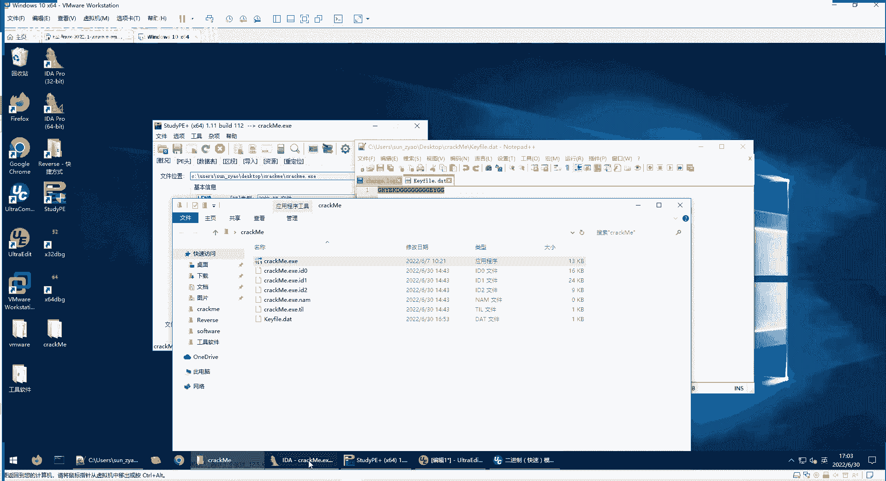
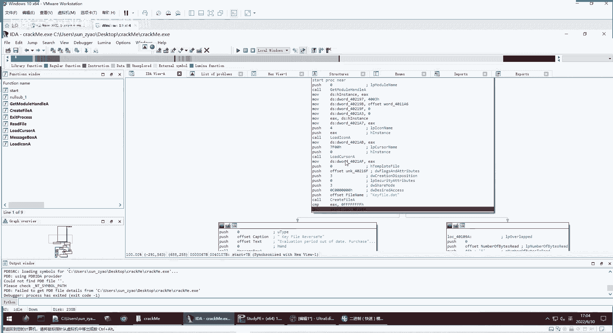
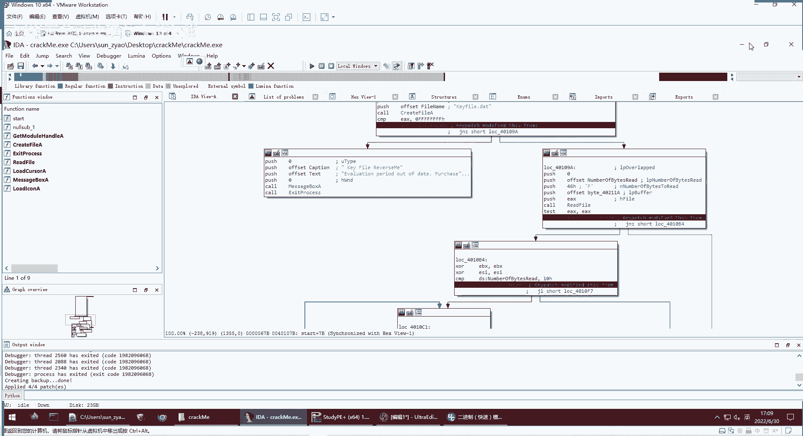
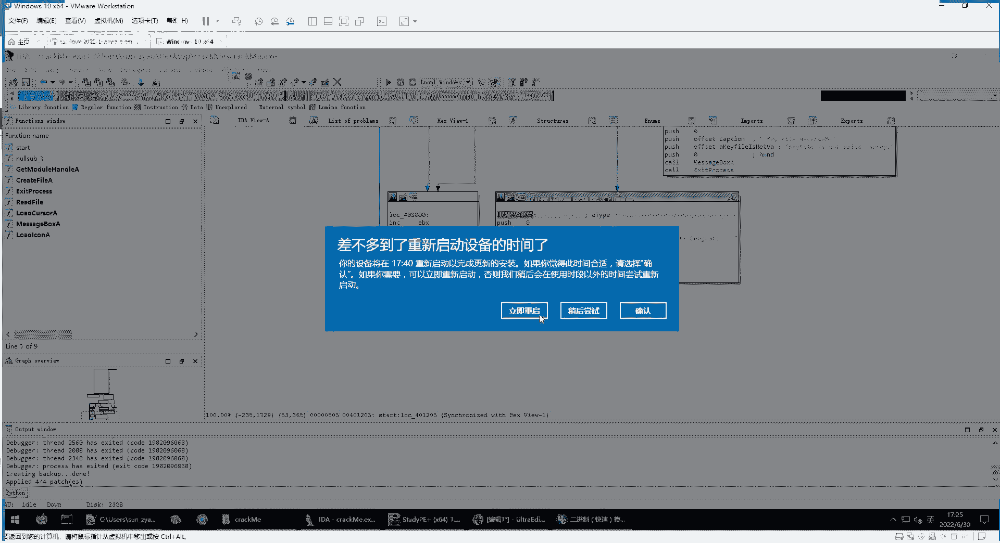
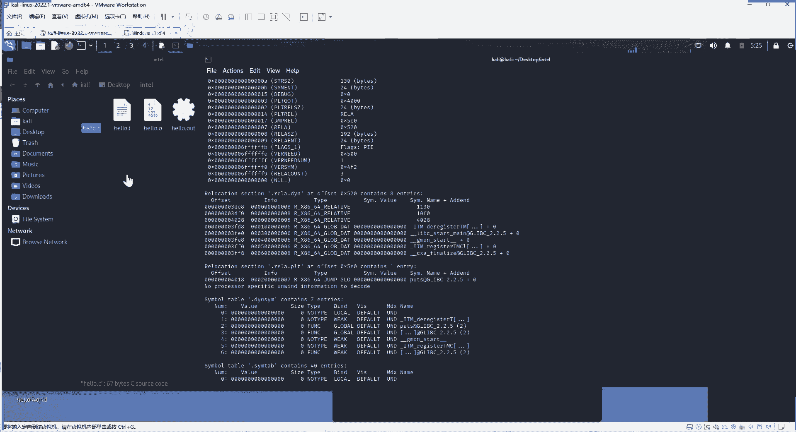
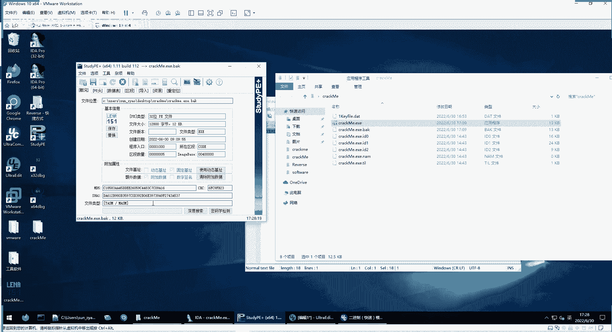

# P92：逆向工程--逆向分析实战（二） - 网络安全就业推荐 - BV1Zu411s79i

你直接用它就可以了，这种是怎么做到的呢，这里，给大家推荐一个插件，在我们的，在我们的edit里面有一个kp，大家使用这个插件可以修改这个程序，所以修改程序呢，就是程序本来是这些二进制文件嘛。

我把这里面的字符进行一些修改，那么程序就进行修改了，现在我就要实现我能正常使用这个程序，但是他不要进行一些验证，就是像刚才一样，不要验证有没有规范，也不要验证那个g的个数是不是大于等于八，我就想直接用。

不需要他必须配合一个kefile文件才能用。

这个是怎么做到的，这个我们就要进行一些验证，比如说我们现在，先把这个kpi文件重命名。

相当于现在没有kpi文件了，当然你以为只有这个correct me exe这个文件，那怎么做呢，我们还是让它执行，他第一步到这儿，是不是因为我们现在没有开发文件，它会跳到这儿，他会报错。

怎么让它不跳到这里面呢，我们可以对这个命令是接n z n就是not，就是非，那么可以对这个命令进行修改，对整个key patch，可以配起大家定期这个patch，这里面就有这个指令。

大家可以把jn z改成jz，那么它现在跳转的方向是不是就和原来相反了，然后点击一个patch，就你现在就变成了jz了，他就不会再跳转到这儿了，是不是，你看他现在尽管没有k file文件。

它还跳转到这里面来，跳转到这了之后，你看现在又有一个问题，他要通过这里来跳转，跳转到这儿直接报错，同样的道理，我也不希望他进行这样跳转，这里是因为我们没有这个文件内容。

我们这里是读取k f里面的文件内容，我们没有他就要跳转件报错，这同样的我们选择这条命令，然后右键，然后k fk patch，然后进行patch ph就是修改打补丁的意思，你要把它的判定条件进行修改。

在这里改了之后，它就自动的进行了相应的二进制文件修改，不需要我们改二进制，就不需要我们记住jz是一个二进制命令，是什么，jn z2 进制命令是什么，就不需要我们直接这样修改，后面这个不用管。

那么这条命令是不是进行了修改了，我们再点击运行，它就不会跳转爆头，它会跳转到这儿，跳成这，它如果不修改的话，它跳转到哪去呢，跳转到这儿还是报错，那么怎么办，同样的道理，我们进行了一个修改。

这里进行一个patch，改变它的跳转，就是说他g n z你敢接z吗，jz就g n z吗，你就加个c就行了，有有飞的你就去掉，没有的你就增加，这样你就改变了它的跳转的方向了，然后因为这里面我们下到你。

所以我们不怕它直接执行完，我们直接运行，你看它就不跳到转到原来在这儿了，才跳转到这儿，到这儿呢，它是比较这个ei是不是等于八，e s i肯定是不等于八的，因为我们的这个文件都没有。

当然也不可能读出8g的个数大于等于八，这是不可能读出来的，那么这时候他还是会报错，怎么办，还是进行修改，同样的方法，同样的方法进行一个修改，那么我们啊，他现在应该就会跳转到这里面。

我们在这里下个断点看一下，是不是现在就到这里面，然后下一步就正常执行，就正常结束就可以了，执行完了就会给我们报，你成功了，这就是我们对文件进行修改。

然后我们再点击这里这个啊editor里面有个patch program，我们应用把刚才的修改应用一下，然后这里注意点击一个crack back back up，其实相当于把我们修改后的程序保存一份方案。

修改之前的程序也保存一下，这个修改后的就叫crack me，点e x c e，修改前的这个备份呢就后面加个点b a k备份。

我们点击ok，那我们现在这k file这个相当于还是没有啊，因为它叫1k file，是不是我们现在直接运行这个程序，是不是直接就可以用，我们把它复制出来，卧室移动我们要复制，是不是就可以直接用。

然而它原来的修改之前的备份是在这里，我们又，这个studp打开这个备份，是不是md 5值和之前的一样，这就是两种破解软件的一个方法，一种呢把它条件找出来，第二种呢我修改它的判定条件，这两种方法各有优劣。

第一种呢你找出他的条件，优势就是你没有改变他程序原有的执行路径，这样程序的功能发挥是很正常的。

缺点就是你要精确的找出这个条件，它的花费的功夫大一些，然后像我们第二种方法呢就是修改判定条件，优点就是比较简单，你可以修改它的判定的走向，你想让它走向哪里，修改到哪，缺点呢就是对一些复杂的程序。

这样做的话，会使程序无法正常运行，因为你前面比如说前面这里要读kefile，这个文件，你没读到，它会报错，你虽然可以跳过报错，但是他如果后面一些正常的功能，需要使用这个文件里的数据。

那这个正常的功能就没法发挥了，啊这是两种方式，各有优劣，这个详细的过程呢也是给大家写在这个，我们这个第五章里面，让大家回顾一下，第一步呢就是，尝试运行，然后发现他会要到我们这个证书已经过期了。

让我们重新购买这个license，第二步呢，使用stp发现它这是一个32位的文件，然后没加壳了，然后我们就根据他这个32位，我们选择ida 32打开这个软件，还有64位的pe文件。

就用ida 64打开这个软件，然后进行静态分析，入口点呢i da会命名为start，通过start呢就可以看到程序的控制流图图，就是我们刚才看到各种跳转的框，这是一个程序的控制流图。

然后就发现在第一个分支处，实际上尝试打开k放点date这个文件，那我们就创建这个文件，再次打开的时候，它会报这个错误，然后找到这个错误的位置，然后看有哪几条路径会导向这个错误，然后我们就进行。

在每个路径导向这个错误条件处，我们就发现它真正要验证的是什么，要读取15个字节，然后验证这里后面一个下读取16个字节，这里是一个略微的差异，因为有一个是验证的是f，有个验证是10h，包含16个字符。

然后呢他发现包含16个字符满足之后，它就会进入这个循环，在这个循环里面判断这个g的数量，然后保存在这个ei容器当中，然后跳出循环之后比较e si寄存器，这个寄存器是否为八，或者是否是大于八还是小于八。

还是大于等于八，如果是大于等于八的话，就会跳转到执行成功的这一个对话框，所以总结起来这个破解correct me的条件就是啊，这也是条件，在同目录下存在这样一个kefile。data这个文件。

这个文件呢第二个条件就至少包含16个字符，第三个条件呢，这个字符中至少要有八个是这个大g这个字符，满足所有条件的k file。date就可以被他认证成功，实际上别的程序来认证那个序列号。

也是通过这种方式来认证的，类似的方式，这样就破解了这个quick me的验证，然后这是第一种方法啊，后面给大家讲了一种，相当于比较投机取巧的一个方法，第一种方法是正统的，最完善的。

把这个程序搞得最清楚的，第二种方法就是我直接跳转，这种话比较简单，比较巧，但是它也有它的作用，直接跳转有时候就能直接达到我们的目的，甚至有时候做c t f提的时候，比如说他就让你显示最后的这个。

把这个弹框显出来，那可怎么办，中间这个程序太多了，我搞不清楚，直接在这里修改，这里不是j j z吗，它跳转我不像他进行这样的跳转，跳转到这个，他这个结论是判断，要不要跳转到这个40109a。

这我直接不进行判断，直接接mp直接降p到哪，降不到这401205站也可以，这就相当于一个投机取巧这一另一种思路，这两种思路啊都有用，都适用于一个不同的一个场景，这个实战破解就是这样。

大家下课后自己去操作一下，不管你没理解，都要自己去操作，就是理解的要自己操作，这样子自己做过，你才能熟悉，才能真正的理解，如果说美女有什么问题的话，也可以在群里面，我们不是有qq群吗。

也可以在群里面提问，这是一个实战破解，然后最后定，然后第六部分就是一个逆向的一个建议，逆向分析的时候，第一个逆向分析建议要注意一个编码的风格，最好大家有一些编程的经验，你知道开发者怎么编程。

你在逆向的时候，你知道就是你知道正向是怎么样的，你在立项的时候，你就更容易理解程序，第二个是集中原则，就是程序员在开发程序的时候，往往将公民相关的代码或数据写在同一个地方。

所以说这一块地方这一句话你不理解，你看看相关的，它这一块地方可能具有相同的功能，相似的功能，第三个特点呢是一个代码复用，在编写程序，代码复用是很普遍的，这种其实总体思路就是。

大家知道开发人员是怎么开发的，编程的人是怎么编程的，那我们进行第项的时候，就更容易猜测出，判断出这个程序的功能，所以说七分逆向，三分才满，这逆向它必须举有一定的猜测，但也不是瞎猜，你要根据经验。

根据他的语句进行猜测，猜测之后还要进行验证，还要区分代码，就是说拿到返回页面代码，你要能区分哪些代码是人为编写，哪些是编译器自动附加的，就像刚才说的id很强大，但是他也不是百分之百正确的。

最后一点要有耐心，因为逆向的话确实它有一定的难度，尤其是刚开始大家对这个印象的流程呢，还有汇编的语言啊，不太熟悉的时候，可能做一个简单的题都要几个小时都有可能，这是很正常的，让大家坚持去做。

这就是一个熟练熟悉的过程，然后大家学习相关的一些书籍，也给大家推荐一下这个c和指针，这是讲c语言里面指针的，因为指针可以说是c语言的精髓，指针在汇编里面它就叫寻址，寻址也是汇编语言的核心内容。

然后就是汇编语言，第三版就是清华出版社出的吧，我不知道现在有没有更新啊，我以前看的第三版，这个时候讲汇编也要讲得非常好的，然后还有恶意分恶意代码分析实战，给我们讲了非常多的方法工具，深入理解计算机系统。

c加加这些加密解密安卓的啊，这些书不是说大家啊一天两天要看完，大家闲下来有时间学习时可以看看这位数，然后最后呢就是我们的一个作业，作业呢就是三个题，就是我们和天王实验室立项游乐园的1~3关。

我们可以看一下这个这个作业，给大家准备的还是比较好的，大家可以登录之后可以创建实验机，这个和电玩实验室灯大家应该都会用吧，啊不会用的话也可以在群里提出来，都会教的，大家可以创建实验机。

实验机就给大家准备好的模拟环境，题目和工具都在这个实验机里面，实验机就是个虚拟机吗，然后这里面实验简介，预备的知识，还有实验目的，实验步骤都有给大家讲的还非常详细的，这不是为了考导大家。

主要是为了让大家练习这个逆向，啊这是第一关，第二关，第三关也是类似的，大家去做就行了，呃今天课程的主要内容呢就这么多，我看到刚才有人有同学举手，是想问问题还是点错了，想问问题的话，就是就把问题问出来。

你发在聊天里面，我能看到，大家是大家应该是能发信息的，之前有同学不是发了一吗，可以，有什么疑问都可以问，包括今天讲的课程内容啊，这个后面作业啊都可以问，这个课件呢后面也可以给大家。

然后大家那个下课后自己再消化吸收一下，大家都没什么问题吗，为什么我在啊别的地方讲课的时候，他们都有很多问题，而且都是，这很珍惜这个体育问题的时间，基本上下课了，还会一直在问，可能问个一一小时，一小时多。

那都是有可能的，大家是觉得这个内容是太难了还是太简单了，因为我理解就没有问题的话，就要不要太简单了，啥都会，所以没有问题，要不就太难了，什么也没听懂，哎如果这些东西如果掌握了，那很好，如果没掌握。

也没什么可怕的，你们不是刚才上大学吗，还没多久，比较年轻，年轻就是资本，这些都逆向工程，是我们网络安全中最难的一块，和胖是相关性很大吧，是胖和逆向就相关很大，相关性很大，是最难的，就是处理二进制。

用二进制它就是多少有点反人类的，不那么直观，所以说其实现在有些什么不理解的，那也是很正常的，没啥问题，多练习，多学习就可以了，这是最难的一块，这一块花的时间要多一些，但是这也是非常强大的。

也可以说最强大的一款，门槛是最高的，当然大家学会之后，作用也有最大，有什么问题都可以提啊，然后群文件里面呢有个da da pro的软件，大家想需要的可以下id app，是我们进行逆向分析的核心的工具。

逆向分析还是很强大的，他连操作系统都可以调。

还有很多进阶的内容，比如说嗯那个多机调试。

我们现在调试的啊，这个程序就是在本机上。

就是在本机上，但它也可以，比如说这个卡里虚拟机里面有个程序，我也可以在这里面，在windows这个机器上来调远程调试，甚至调试卡，你这个操作系统都是可以的，嗯暂时有些地方可能没理解。

反正先把工具保存着啊，先把课件保存着，以后想用啊，想学的时候都可以拿出来看，拿出来用，怎么看有没有加壳，就是，这是我们要分析的程序，你把你要分析程序，通过这个比如study p。

当然有别的查看工具可以看，你能看得出来这里面有一个文件类型。

像这个就是一个汇编的，没有加可的文件类型，你可以在百度里面搜一下这个文件类型，他这个加壳是壳也是分很多类的，有加压缩壳。

加密的壳，还有很多细分的，也就是从这个studp的文件类型的结果，你放在百度里面看，你就知道每一种文件类型代表什么，是加密加壳的，其实你分析的时候也可以分析出来，因为加壳呢它程序的你静态看。

你看不出什么内容，因为它是前面是壳，后面是压缩的内容，你看不到真正执行的程序。

放到id里面，有很多分支很复杂，怎么找到突破点，后来d里面就是i d a，它会生成这个程序的入口，你首先要看程序的入口在哪，然后这个程序的这个流程或者流程图分支，是可以这个放大缩小的，要从总体上把握。

你看你最终想要到到达什么地方，没有我最重要的，这这是成果，那只有这条路线，在这这里啊，这里有个分支，正向看，反向看都可以，所以说这个做逆向分析需要一个耐心，比如说一下子能看出来你正向看它，这有两个分支。

这两个分支代表什么呢，因为这个题比较简单的，这里直接就没有了报错了，所以这个分支肯定是一个走向报错的分值，那我就要尽量避免逃到这儿，我要让程序走向这了，你正向反向结合的看，然后再花一些时间。

你就能把正向反向走通了啊，你就知道到这儿看到这儿，他这里还会报错，所以要到这里来，到这里来，这里还报错，要到左边来这样一部分，你就知道正确的流程是什么，正确的分支是什么，或者说有些太复杂了，没关系。

你执行一遍嘛，你可以动态调试，我还是推荐大家就用ida来进行动态调试，ida真的很强的，尤其是大家后面学到要调试一些操作系统，操试系统内核的时候，用i d远程调试这个remote。

远程调试可以调试系统内核，这样比如说别人装的那个木马，它是放在隐藏在系统里面的，这样都能找出来，嗯大家还有什么问题，没关系，大家尽管问，不要怕耽误我的时间，大家有问题就问。

那如果说大家就是暂时没什么问题呢，那就先下课了，然后把课件也会放到群文件里面，大家自己在看课件，然后有问题就在群里面提出来，那我们今天的课程就到这里，就不给大家拖堂了，好的，那就下课了。

