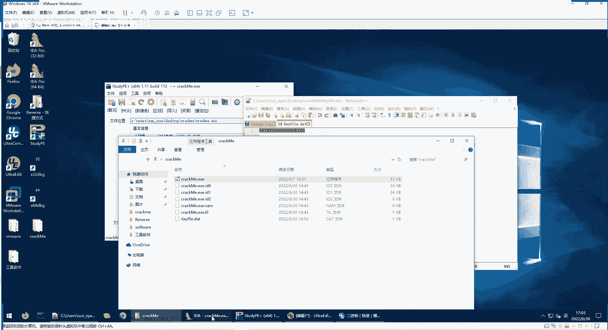

# 逆向工程实战（二）🔍 - 课程P92

在本节课中，我们将学习两种破解软件验证的实战方法：一种是正统的“条件分析”法，另一种是“修改判定条件”的取巧法。我们将通过一个具体的 `crackme` 程序，演示如何分析其验证逻辑，并使用工具修改其执行流程，最终实现无需验证文件即可运行。

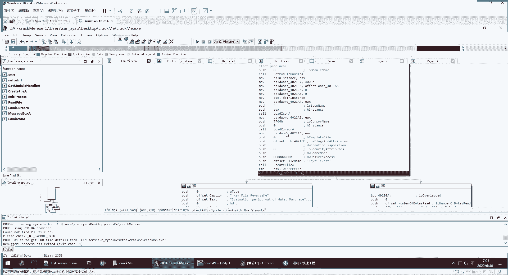

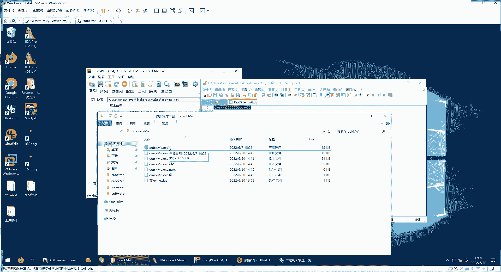

---

## 1. 破解方法一：修改程序跳转指令 🔧

上一节我们介绍了如何通过分析找到程序的验证条件。本节中，我们来看看如何通过直接修改程序的二进制指令来绕过验证。

### 1.1 目标与思路
我们的目标是让 `crackme.exe` 程序在缺少 `kfile.data` 验证文件的情况下也能正常运行。程序原本会检查该文件是否存在及内容是否合规，我们可以通过修改其关键跳转指令，改变程序的执行路径。

### 1.2 操作步骤
以下是使用 `x64dbg` 及其 `Keypatch` 插件修改程序的具体步骤。

1.  **重命名验证文件**
    首先，将 `kfile.data` 文件重命名，模拟其不存在的环境。此时运行程序会报错。

2.  **修改第一个跳转指令**
    程序首先会检查文件是否存在。我们找到对应的 `jnz`（非零则跳转）指令，它会在文件不存在时跳转到错误处理流程。
    *   使用 `Keypatch` 插件，将该指令修改为 `jz`（为零则跳转）。这样，即使文件不存在，程序也不会跳向报错分支。
    *   点击 **Patch** 应用修改。

3.  **修改后续跳转指令**
    程序接着会尝试读取文件内容并进行验证。我们找到读取失败或验证失败时的跳转指令（同样是 `jnz` 或类似条件跳转）。
    *   使用同样的方法，将这些指令修改为相反的条件（如 `jnz` 改为 `jz`），使其跳过报错流程。
    *   核心操作是：**右键点击目标指令 -> Keypatch -> Patch**。

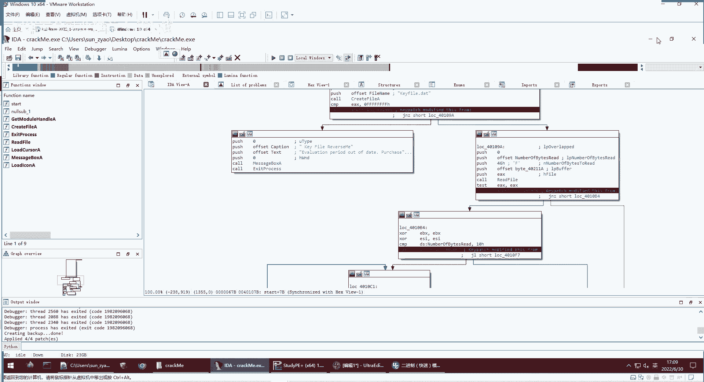

4.  **应用所有修改**
    完成所有指令修改后，在 `x64dbg` 的 **Edit** 菜单中，选择 **Patch program** -> **Apply patches to input file**。
    *   建议勾选 **Create backup**，这样会生成一个修改后的可执行文件（如 `crackme_cracked.exe`）和一个原始文件的备份（如 `crackme.exe.bak`）。

5.  **验证结果**
    运行修改后的 `crackme_cracked.exe`，即使没有 `kfile.data` 文件，程序也能顺利执行并显示成功提示。

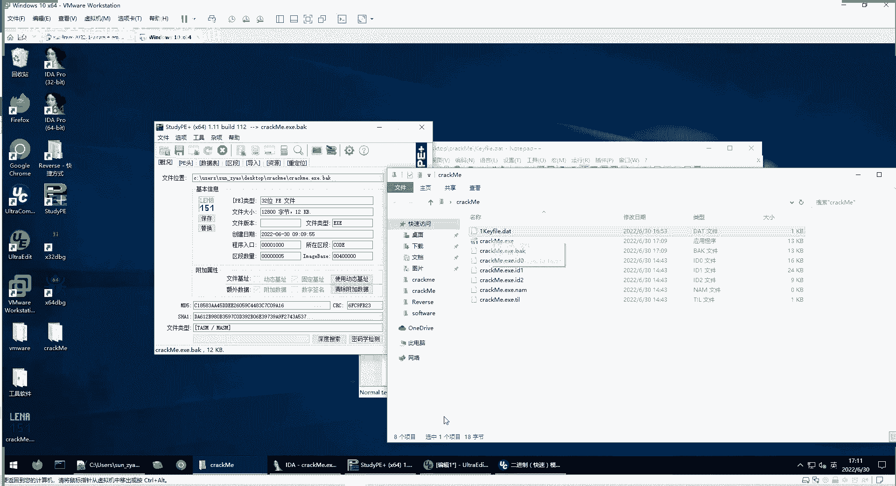

**核心概念（修改跳转）：**
```assembly
; 原指令：如果条件不满足（例如文件不存在），则跳转到错误处理（0x401000）
jnz 0x401000

; 修改后：如果条件不满足，则**不**跳转，继续执行正常流程
jz 0x401000  ; 或者直接改为 nop (无操作) 或 jmp 到成功地址
```

---

## 2. 两种破解方法的对比 ⚖️

上一节我们通过分析找到了验证条件，本节我们通过修改指令绕过了验证。现在我们来总结一下这两种方法的优劣。

以下是两种方法的对比：

*   **方法一：条件分析（正统）**
    *   **优点**：完全理解程序逻辑，不改变原有执行路径，程序功能能正常发挥。
    *   **缺点**：需要花费较多功夫进行精确的静态与动态分析。

*   **方法二：修改判定（取巧）**
    *   **优点**：操作简单直接，能快速达到绕过验证的目的。
    *   **缺点**：对于复杂程序，盲目修改跳转可能导致程序后续功能异常（例如，后续代码需要用到被跳过的初始化数据）。

**应用场景**：
*   **CTF竞赛**或快速破解简单验证时，方法二非常有效。
*   需要对程序进行深入分析、破解或编写注册机时，必须使用方法一。

---

## 3. 逆向分析实战流程回顾 📝

让我们系统性地回顾一下破解这个 `crackme` 程序的完整流程。

1.  **尝试运行**：运行程序，发现它需要 `kfile.data` 文件，否则提示证书过期。
2.  **查壳与定位**：使用 `StudyPE` 等工具检查，确认是32位未加壳的PE文件。用 `IDA Pro 32-bit` 打开进行静态分析。
3.  **静态分析**：IDA 会自动识别程序入口点（通常命名为 `start`）。通过查看控制流图，发现第一个分支尝试打开 `kfile.data` 文件。
4.  **动态调试与条件定位**：
    *   创建 `kfile.data` 文件，用 `x64dbg` 附加调试。
    *   定位到错误提示出现的位置。
    *   逆向分析所有可能导向该错误的分支，找出真正的验证逻辑：
        *   条件1：文件必须存在。
        *   条件2：文件内容至少包含 **16个字节**（`0x10`）。
        *   条件3：文件内容中，大写字母 **‘G’** 的数量必须 **大于等于8个**（`esi >= 8`）。
5.  **构造有效载荷**：根据以上条件，创建一个满足要求的 `kfile.data` 文件（例如，包含至少8个‘G’且总长度≥16字节的字符串）。
6.  **验证成功**：使用构造的文件，程序验证通过，显示成功对话框。

**破解条件总结（代码描述）：**
```python
# 伪代码描述 crackme 的验证逻辑
def validate_kfile(file_path):
    if not os.path.exists(file_path):
        return False
    with open(file_path, 'rb') as f:
        data = f.read()
    if len(data) < 16: # 0x10 字节
        return False
    if data.count(b'G') < 8:
        return False
    return True
```

---

## 4. 给初学者的逆向工程建议 💡

逆向工程是一门需要耐心和经验的技艺。以下是给初学者的一些核心建议：

*   **具备编程基础**：了解开发者如何编程（编码风格、常见模式），能极大帮助你在逆向时理解程序结构。
*   **关注代码集中性**：功能相关的代码或数据往往被放在相邻位置。理解一块代码时，可查看其上下文。
*   **理解代码复用**：程序员会复用代码。识别出重复或相似的模式，能帮助你快速理解程序模块。
*   **七分逆向，三分猜测**：逆向需要基于经验和代码上下文进行合理推测，但推测后必须通过动态调试等方式进行验证。
*   **区分代码**：学会区分程序核心逻辑与编译器生成的启动代码、库函数代码等。
*   **保持耐心**：逆向分析，尤其是初期，可能进展缓慢。遇到复杂程序花费数小时是正常的，坚持练习是提升的关键。

**推荐学习资料**：
*   《C和指针》：深入理解C语言核心，其指针概念与汇编寻址紧密相关。
*   《汇编语言（第3版）》：王爽著，经典的汇编入门教材。
*   《恶意代码分析实战》：学习分析方法和工具集。
*   《深入理解计算机系统》：从底层理解程序如何运行。
*   《加密与解密》：专注于软件保护与逆向分析。

---

## 5. 课后作业与练习 🏆

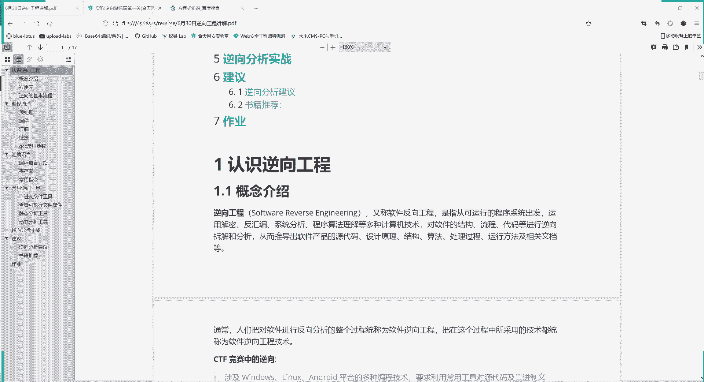

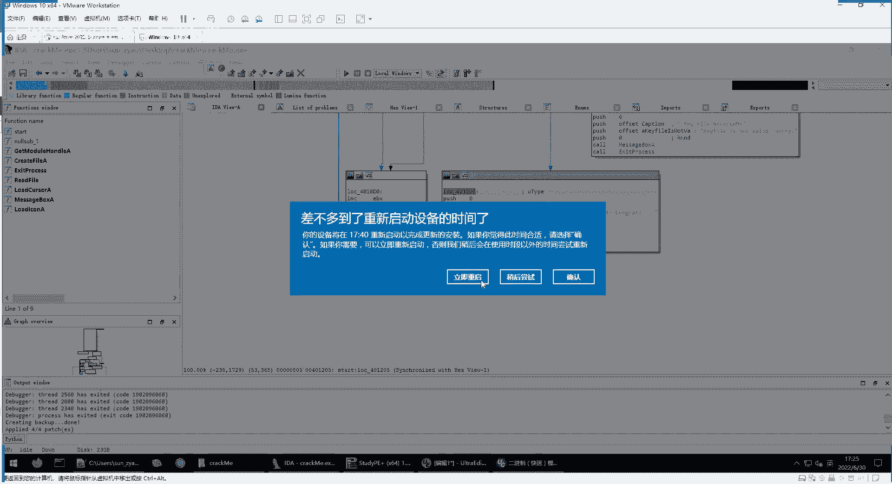

为了巩固本节课的知识，请完成以下练习：

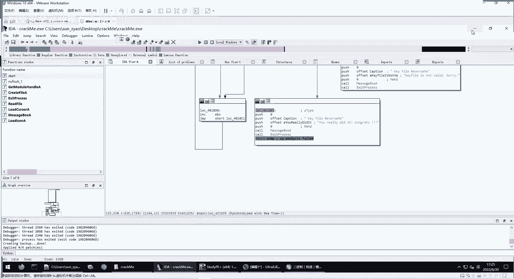

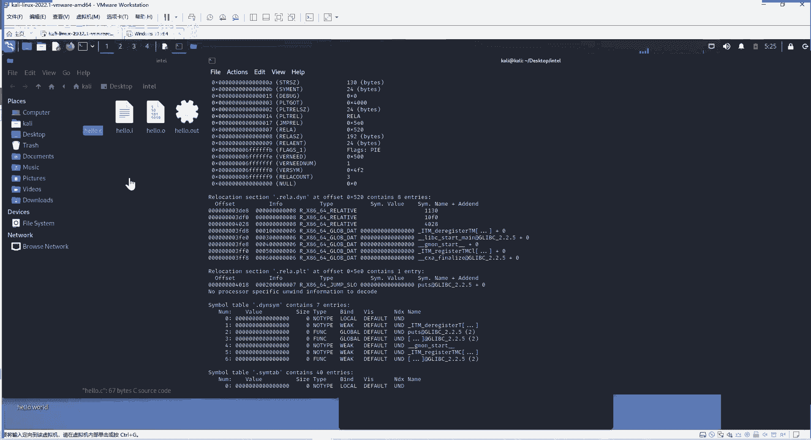

**作业**：完成“合天网安实验室”逆向游乐场的第1关至第3关。
*   **平台**：登录“合天网安实验室”或类似CTF平台。
*   **方式**：创建实验机（预置环境的虚拟机），按照实验指导的步骤进行分析和破解。
*   **目的**：这三关的设计能很好地练习文件检查、简单算法逆向和条件修改等基础技能。

**工具准备**：课程群文件中提供了 `IDA Pro` 等核心逆向工具，请自行下载安装以备使用。

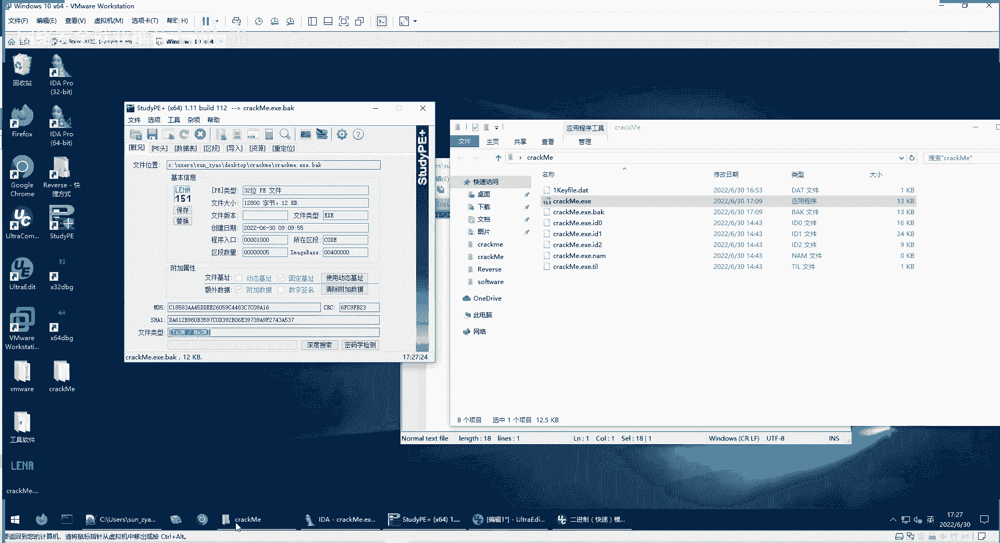

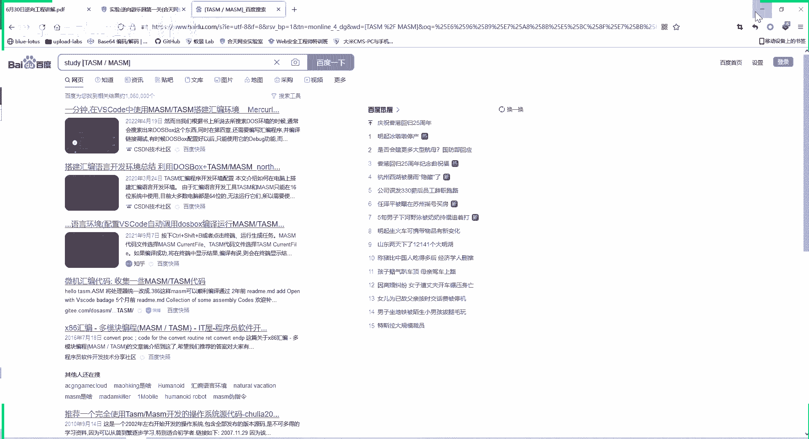

---

## 6. 常见问题答疑 ❓


*   **Q：如何判断一个程序是否加壳？**
    A：使用 `StudyPE`、`PEiD` 或 `Exeinfo PE` 等工具查看程序的文件类型信息。将显示的类型在搜索引擎中查询，即可知是何种编译器生成或何种壳保护。未加壳的程序静态分析时逻辑清晰，加壳程序入口点代码通常混乱且复杂。

*   **Q：在IDA中面对复杂的控制流图，如何找到突破口？**
    A：1) 始终从程序入口点（`start`）开始。2) 结合动态调试，运行程序并观察其实际执行路径。3) 明确你的目标（例如，找到成功提示的代码位置），然后从目标点反向追踪，分析哪些条件会导致程序到达这里。4) 善用IDA的图形视图缩放功能，先从整体把握程序结构，再深入细节。

*   **Q：逆向工程很难，学不会怎么办？**
    A：逆向工程确实是网络安全中门槛较高的领域，因为它直接处理不直观的二进制代码。初期感到困难非常正常。关键在于 **多实践、多调试、多总结**。从简单的 `crackme` 开始，逐步增加难度。年轻是最大的资本，只要持续投入时间练习，一定能掌握这项强大的技能。

---

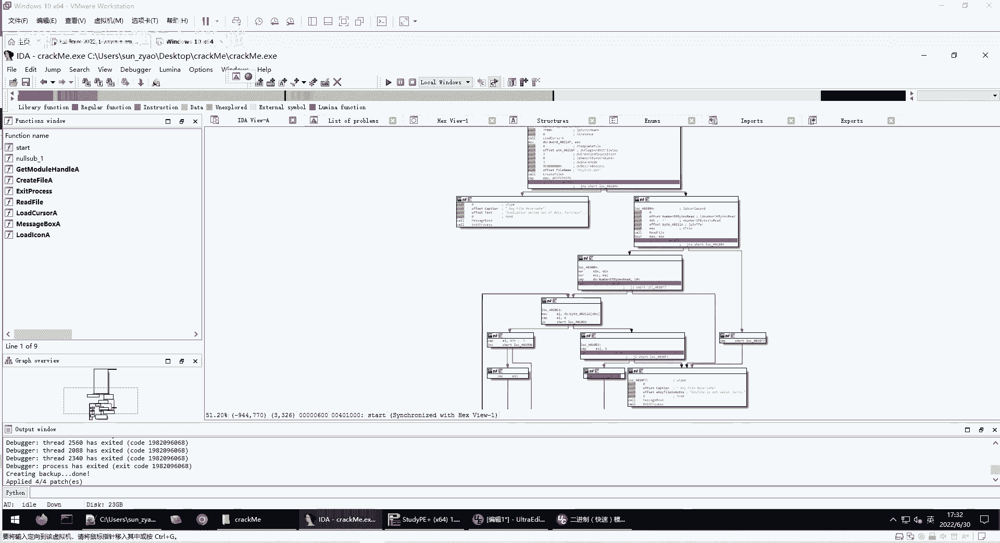

本节课中我们一起学习了两种实用的软件破解方法，回顾了完整的逆向分析流程，并探讨了给初学者的学习建议。逆向工程的核心在于“大胆猜测，小心求证”，并结合动静态分析工具反复实践。请大家务必完成课后作业，在实践中深化理解。如有任何问题，欢迎在课程群中提出讨论。