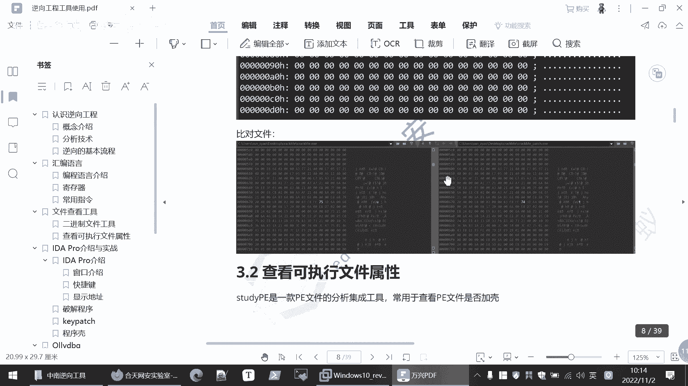
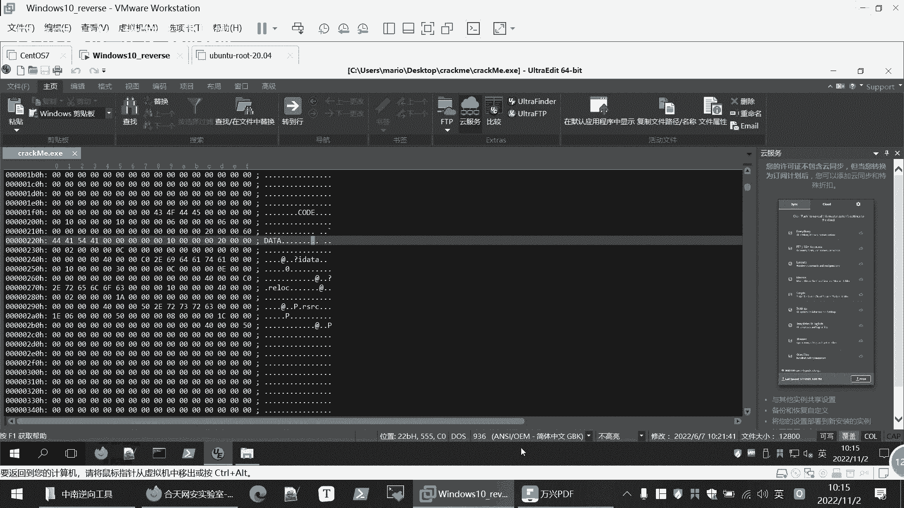

# 逆向工程课程 P93：基础逆向工具使用指南 🔍

在本节课中，我们将学习逆向工程分析的第一步：如何查看和分析目标文件的基本信息。我们将介绍两款核心工具，并讲解在安全环境下进行分析的重要性。

## 文件基本信息查看 🔎


上一节我们介绍了逆向工程的基本概念，本节中我们来看看如何开始分析一个具体的程序文件。首先，我们需要了解文件的基本情况。



可以使用十六进制查看和修改工具来完成这一任务，例如 **UltraEdit (UE)**。


UltraEdit 这款工具可以查看文件的十六进制内容，并允许进行修改。


它也可以用于比对两个文件的差异。我们的演示是在虚拟机中进行的。在进行逆向分析时，最好也在虚拟机环境中操作，因为你分析的程序很可能带有后门或恶意代码。如果在主机上进行分析，一旦中招，清理会非常麻烦。因此，建议专门准备一个虚拟机用于逆向分析。


这是我们打开的 UltraEdit 程序界面。接下来，我们将用它来分析今天的目标程序。


首先清除之前的编辑内容。这是今天要分析的程序，我们可以在 UE 中打开它。


通过十六进制视图可以查看文件内容，理论上也能进行修改。但在当前阶段，我们不了解程序机制，无法确定修改何处。




相信大家对这些基础工具的使用已有所了解，因此不再赘述。UE 还包含一个 **UE Compare** 功能，用于比对两个文件。当你修改程序后，可以用它来查看具体修改了哪些部分。红色高亮区域即表示存在差异。

## PE 文件分析工具 📁

接下来，我们介绍另一个重要工具：**Stud_PE**。它是一款专门用于分析 Windows PE（Portable Executable）文件格式的工具。

我们打开 Stud_PE，并加载要分析的程序文件。

从这里可以看到，它明确告诉我们这是一个 **32位的PE文件**。这个信息至关重要。例如，在使用反汇编工具 IDA 时，你需要根据程序位数选择对应的版本：
*   32位程序使用 **IDA** 打开。
*   64位程序使用 **IDA64** 打开。

如果这里是64位，你就知道应该用 IDA64 来打开它。

下方还显示了文件类型等信息。有些文件可能被加壳（如 UPX），这里会显示“无加壳”。通过 Stud_PE，你可以查看 PE 文件的文件头、各个节（Section）等详细信息。


这是 Stud_PE 工具的主界面。

## Linux 平台下的对应工具 🐧


在 Linux 系统中，可以使用 **readelf** 命令来查看 ELF（Executable and Linkable Format）文件的属性。

例如，分析一个简单的 `a.out` 文件（一个打印 “Hello World” 的程序）：
```bash
readelf -a a.out
```
因为 Linux 平台的可执行文件格式是 ELF。刚才介绍的 Stud_PE 是 Windows 平台下的工具。`readelf` 命令会输出类似“ELF 64-bit”等信息以及其他文件细节。


以上内容简单介绍了逆向分析初期需要了解的文件相关基本情况。

## 总结 📝


本节课中我们一起学习了逆向工程分析的基础准备工作：
1.  **环境安全**：强调在虚拟机中进行逆向分析以保障主机安全。
2.  **基础查看**：使用 **UltraEdit** 进行十六进制查看和文件比对。
3.  **文件格式分析**：
    *   在 Windows 下，使用 **Stud_PE** 分析 PE 文件的位数、加壳情况等关键信息，为后续使用 IDA 等工具做好准备。
    *   在 Linux 下，使用 **readelf** 命令分析 ELF 文件。

掌握这些工具和步骤，是开启任何逆向分析任务的第一步。