# 逆向工程课程 P94：IDA Pro 介绍及实战 🛠️

在本节课中，我们将学习逆向工程中一款核心工具——IDA Pro。课程将分为两部分：首先介绍IDA Pro的基本概念、界面和常用功能；随后，我们将通过一个实际的破解程序案例，演示如何运用IDA Pro进行静态与动态分析，以理解程序逻辑并找到关键破解点。

## IDA Pro 简介

上一节我们明确了课程目标，本节中我们来看看IDA Pro是什么。

IDA Pro是一款交互式反汇编器（Interactive Disassembler），是目前功能最强大、应用最广泛的静态反汇编软件。该软件为商业软件，但存在激活方法。其核心功能是分析二进制程序，将其机器码转换为人类可读的汇编代码，并尝试识别其中的函数、库和数据结构。

## IDA Pro 界面与窗口

使用IDA打开一个程序后，软件会自动进行分析，并将分析结果呈现在多个窗口中。下面我们通过实际操作来认识这些窗口。

我们使用IDA打开一个32位、未加壳的示例程序。打开后，主界面如下：

以下是主要的窗口及其功能：

*   **反汇编窗口（IDA View）**：这是主要的分析区域，以流程图或列表形式显示程序的汇编代码。图中箭头表示程序执行的可能跳转路径。
*   **函数窗口（Functions Window）**：列出IDA分析出的所有函数，包括程序自身的函数（如`start`）和导入的Windows API函数。点击函数名可快速定位到其代码。
*   **流程缩略图（Overview）**：当程序流程非常复杂时，可以在此缩略图中拖动，快速定位到需要查看的代码区域。
*   **信息输出窗口（Output Window）**：显示IDA的操作日志、错误信息等。
*   **Python脚本窗口（Python Script）**：IDA支持Python脚本扩展，可以在此执行Python命令或脚本。

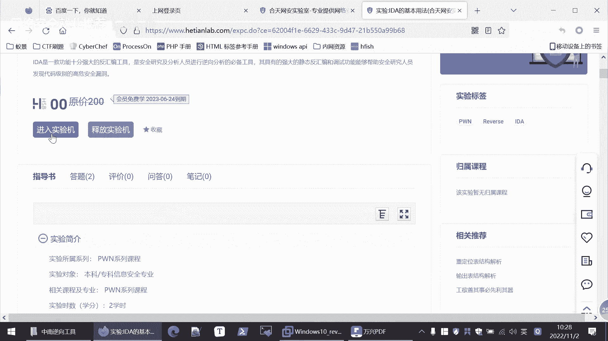

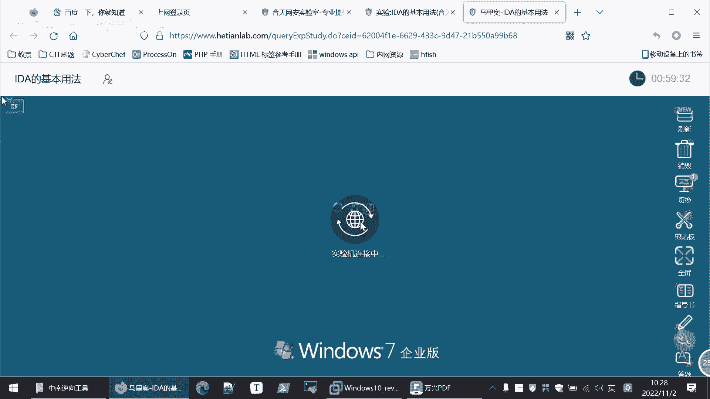

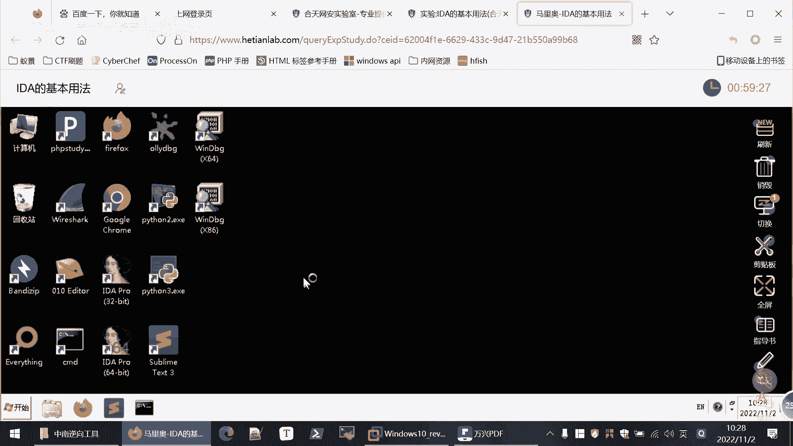

除了默认窗口，用户可以根据需要打开或关闭其他窗口。例如，在`View` -> `Open subviews`菜单中可以打开`Strings`窗口，该窗口会提取并列出程序中出现的所有字符串常量，这在逆向分析中非常有用。

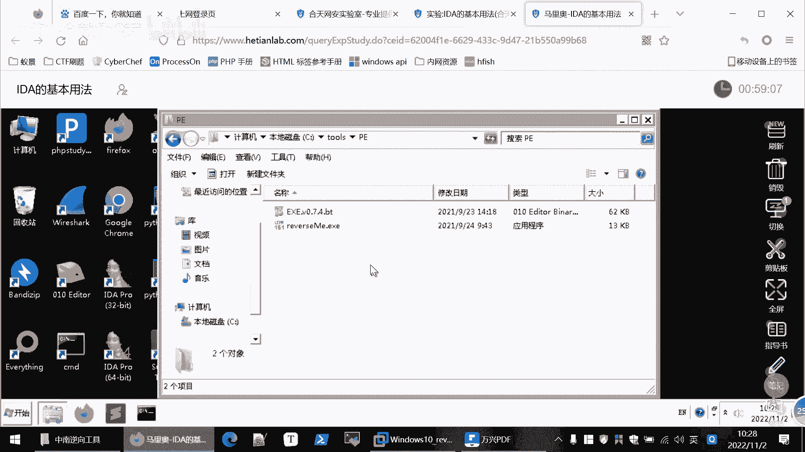

## 常用快捷键

熟练使用快捷键能极大提升分析效率。IDA与后续将学习的OllyDbg等调试器有许多通用快捷键。

以下是核心的快捷键列表：

*   **F2**：在光标所在行设置或取消断点。
*   **F7（Step into）**：单步执行。如果当前指令是函数调用（`call`），则会进入该函数内部。
*   **F8（Step over）**：单步执行。与F7的区别在于，遇到函数调用时，会将整个函数当作一条指令执行，不会进入函数内部。
*   **F5**：将当前函数的汇编代码转换为更易读的C语言伪代码。
*   **F9**：运行程序。如果遇到断点则会暂停，否则运行到程序结束。
*   **ESC**：返回到上一个查看的位置。

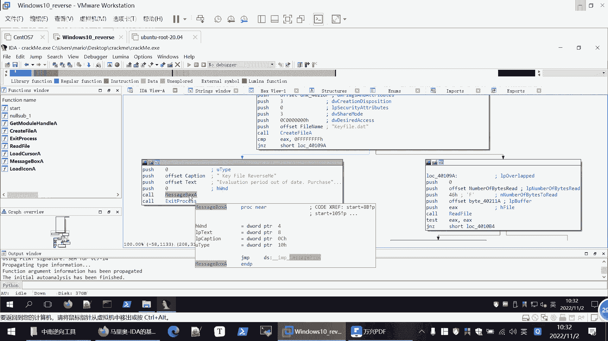

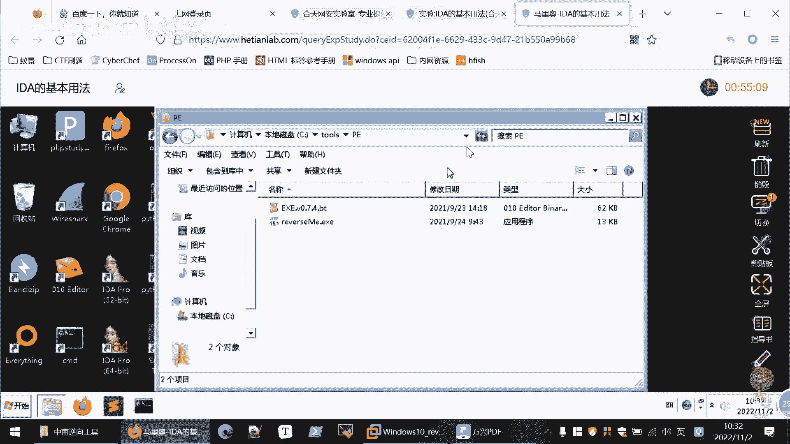

掌握工具的最佳方式是在实践中反复使用，无需死记硬背。

## 显示代码地址

默认情况下，反汇编窗口可能不显示每条指令的地址。为了方便定位和协作，我们需要将其显示出来。

设置方法为：`Options` -> `General`，在对话框中勾选`Line prefixes (graph)`选项。勾选后，每条汇编指令前都会显示其内存地址。

## 实战：破解一个演示程序

前面我们介绍了IDA Pro的基本情况，下面我们通过一个实际案例来体验其强大功能。本次实战的目标程序是一个简单的许可证检查程序，运行时会提示“valuation period out of date”。我们的目标是在不购买许可证的情况下使其正常运行。

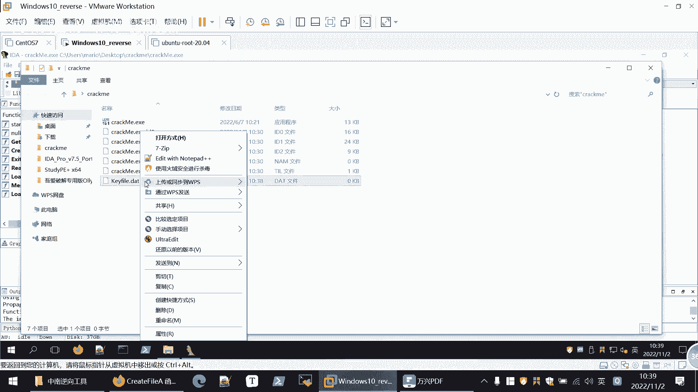

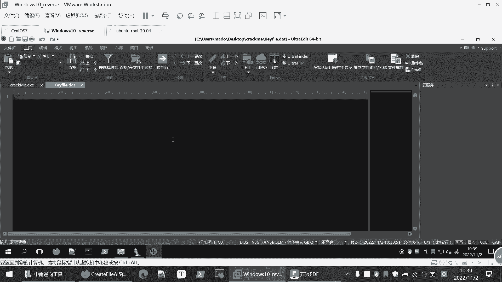

> **实验环境**：本案例可在“和丰实验室”在线实验平台完成。课后同学们可以自行登录平台进行练习。为演示流畅，此处使用本地环境。

### 第一步：初步分析与运行

首先，我们运行目标程序，确认其行为是弹出过期提示。然后使用查壳工具（如`Stud_PE`）确认其为32位程序且未加壳，这意味着我们可以直接使用IDA进行静态分析。

### 第二步：静态分析定位关键字符串

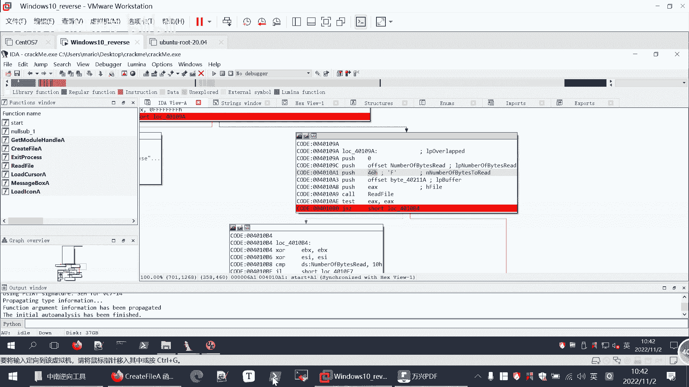

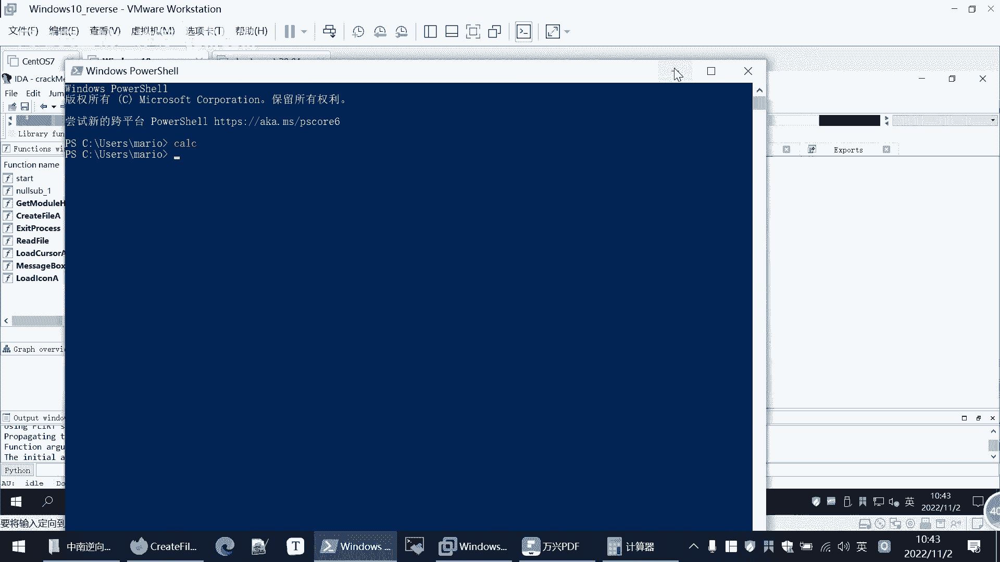

我们使用32位IDA打开程序。面对一个陌生程序，一个高效的切入点是查找程序中的字符串。

1.  打开`Strings`窗口（`View` -> `Open subviews` -> `Strings`）。
2.  在字符串列表中，我们发现了目标字符串“valuation period out of date”。
3.  在该字符串上按`Ctrl+X`，可以查看所有引用该字符串的代码位置。我们跳转过去，发现它在一个显示消息框的函数（`MessageBoxA`）调用之前。这证实了错误提示由此产生。
4.  观察上下文，发现程序执行流在此处有一个关键跳转（`jnz`）。如果跳转到左侧分支，就会执行`MessageBoxA`显示错误；反之，则可能走向正常流程。因此，我们的目标是让程序执行右侧分支。

### 第三步：动态调试验证猜想

我们分析跳转条件上方的代码。发现程序调用了`CreateFileA`函数，尝试打开一个名为`keyfile.dat`的文件。如果文件不存在或打开失败，函数返回值（通常存储在`EAX`寄存器）会是一个特殊值（如`-1`，即`0xFFFFFFFF`），导致后续比较（`cmp eax, 0FFFFFFFFh`）不相等（`jnz`），从而跳向错误分支。

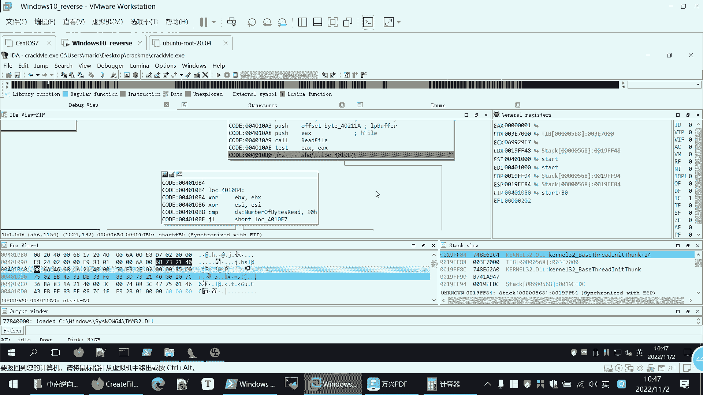

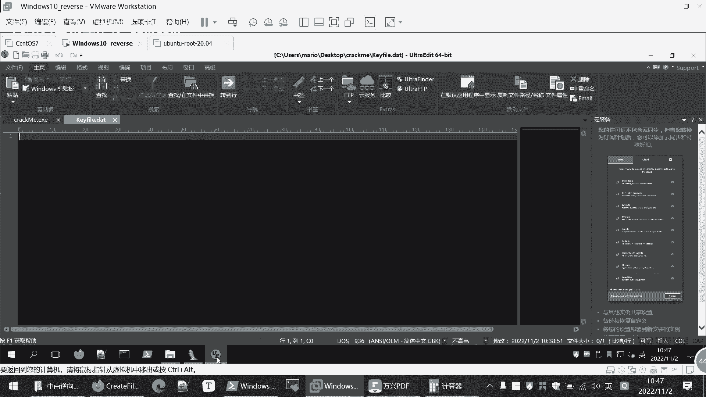

为了验证，我们在程序目录下创建一个空的`keyfile.dat`文件，然后重新运行程序。此时错误提示变为“keyfile is not valid!”，说明程序执行流发生了变化，我们的分析方向正确。

### 第四步：深入分析验证逻辑

我们继续用同样的方法，在`Strings`窗口找到“keyfile is not valid!”字符串，并定位到其引用代码处。在此处设置断点。

分析附近代码，发现程序会读取`keyfile.dat`文件的内容（`ReadFile`），并检查读取的字节数。关键判断指令为：
```assembly
cmp     [ebp+NumberOfBytesRead], 10h
jl      short loc_4010F7 ; 如果读取字节数 < 16，则跳转到失败分支
```
这意味着，`keyfile.dat`文件的内容必须**不少于16个字节**，程序才会继续向下执行，否则将提示无效。

我们向`keyfile.dat`文件中填入超过16个字节的任意内容（例如一串“A”），再次运行程序。使用IDA的调试功能（`Debugger` -> `Select debugger` -> `Local Windows debugger`，然后按`F9`运行），程序会在我们设置的断点处暂停。观察流程图的箭头闪烁提示，确认程序跳向了“有效”分支，绕过了“keyfile is not valid!”的提示。

### 第五步：定位最终校验逻辑

程序继续执行后，进入一个循环结构。在循环结束后，存在另一个关键跳转，决定最终是显示成功信息（“You really did it!”）还是失败信息。我们在此处设置断点进行分析。

动态调试运行到此处，观察寄存器状态和判断条件。例如，判断可能涉及对文件内容特定位置的校验（如比较`ESI`寄存器的值与某个常数）。通过修改`keyfile.dat`文件的内容，并观察程序执行路径的变化，我们可以推断出最终的校验逻辑，从而构造出能通过所有检查的合法`keyfile.dat`文件，完成破解。

---

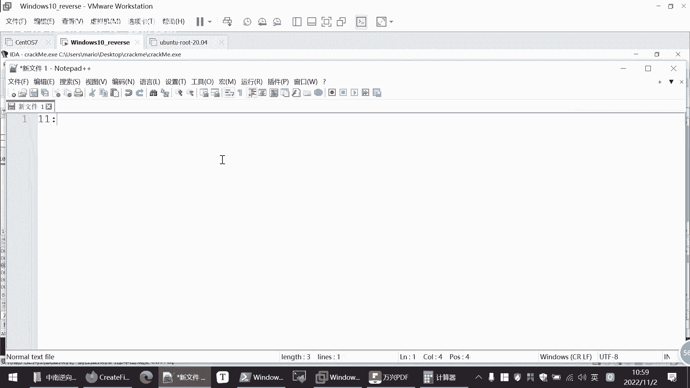

本节课中我们一起学习了IDA Pro的基础知识，包括其界面、常用快捷键和核心的静态分析功能。更重要的是，我们通过一个完整的实战案例，演练了逆向工程的基本思路：**运行观察 -> 静态分析定位关键点 -> 动态调试验证假设 -> 逐步深入理解程序逻辑**。掌握这个流程，并熟练运用IDA Pro这样的强大工具，是迈向网络安全逆向工程领域的重要一步。课后请务必在实验平台上亲自完成整个练习，以巩固所学知识。