# 逆向工程：IDA Pro实战（二）🔍

在本节课中，我们将继续学习使用IDA Pro进行逆向工程分析。我们将通过一个具体的实例，深入理解程序如何验证外部文件，并学习如何通过分析汇编代码来找到正确的验证条件。

---

## 概述

上节课我们介绍了逆向工程的基本概念和IDA Pro的初步使用。本节中，我们将通过一个实际的程序，分析其文件验证逻辑。我们将重点关注一个循环结构，理解它如何读取文件内容并进行判断，最终找出使程序验证通过的关键条件。

## 分析验证逻辑

上一节我们介绍了程序的关键跳转点，即比较`ESI`寄存器的值与数字8。本节中我们来看看`ESI`的值是如何被确定的。

程序的关键在于一个循环结构。该循环负责读取文件`kfile.data`的内容，并根据内容计算`ESI`的值。我们的目标是让`ESI`大于或等于8，从而使程序走向成功的分支。

以下是循环内部的核心操作步骤：

1.  **读取文件内容**：程序从文件地址`0x40211a`读取一个字节到`AL`寄存器中。
2.  **检查循环结束**：比较`AL`的值是否等于0。如果等于0，则退出循环。
3.  **关键比较**：比较`AL`的值是否等于`0x47`（即十进制71，对应ASCII字符‘G’）。
4.  **条件跳转与计数**：
    *   如果`AL`不等于`0x47`，程序会跳转（`JNZ`）并**跳过**下一条`INC ESI`指令。
    *   如果`AL`等于`0x47`，程序**不跳转**，顺序执行`INC ESI`指令，使`ESI`的值增加1。

因此，`ESI`的值实际上就是文件中字符‘G’（`0x47`）的个数。

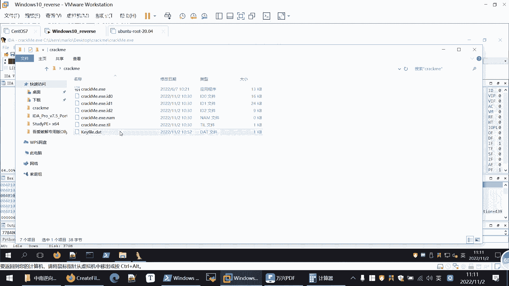

## 动态调试验证

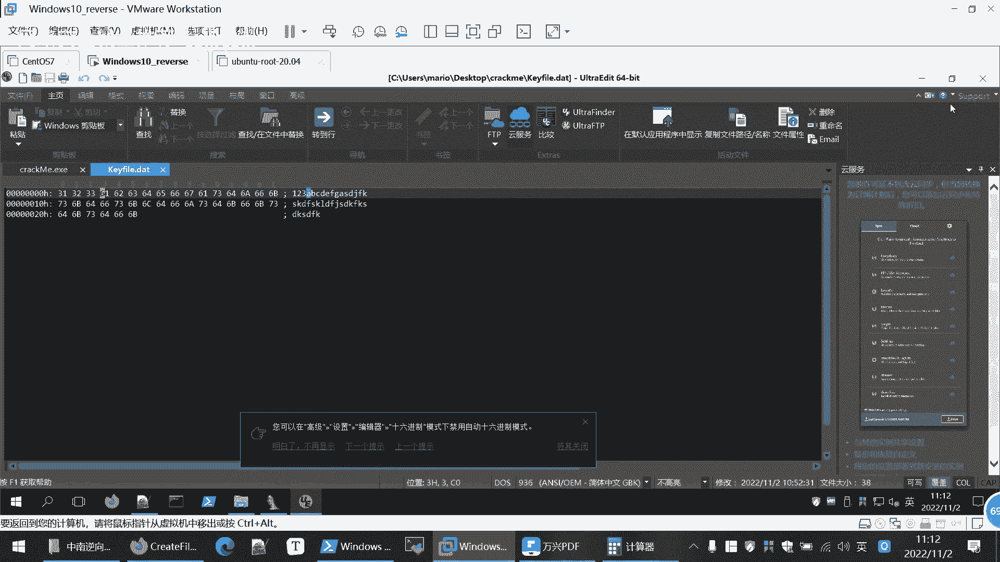

为了更直观地理解这个过程，我们使用IDA Pro的调试器逐步执行。

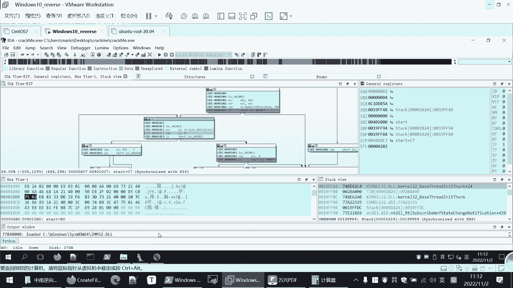

1.  在循环开始处设置断点，并启动调试。
2.  按`F8`键单步执行。观察`AL`寄存器的值，它依次变为`0x31`, `0x32`, `0x33`, `0x61`... 这对应了文件内容“123a...”的十六进制值。
3.  当`AL`的值（例如`0x31`）与`0x47`比较时，由于不相等，程序发生跳转，`ESI`不会增加。
4.  我们可以手动修改内存中的文件数据。将当前字节（例如`0x62`）改为`0x47`。
5.  继续执行，此时`AL`等于`0x47`，程序不跳转，执行`INC ESI`指令，`ESI`从0变为1。

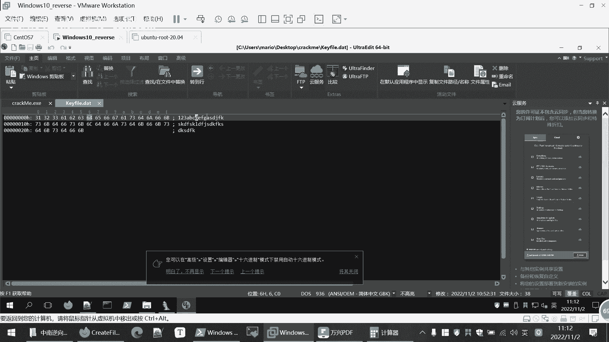

通过这个动态过程，我们确认了之前的分析：**程序通过循环统计文件中字符‘G’的数量，并将其存储在`ESI`寄存器中。**

## 构造有效文件并破解

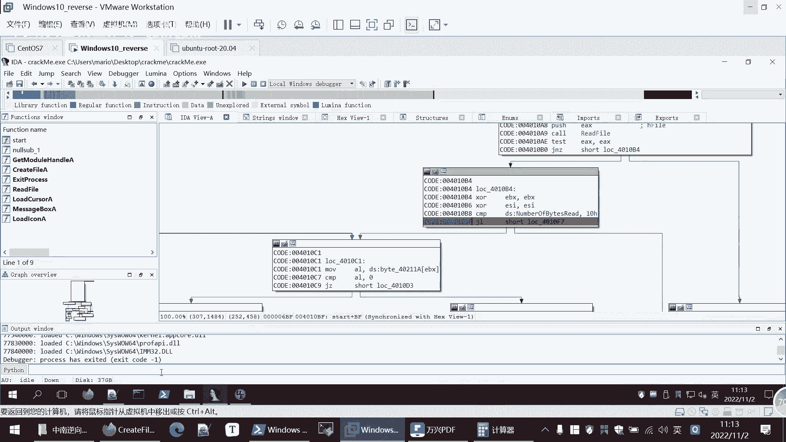

根据以上分析，要使程序验证通过，我们需要满足两个条件：

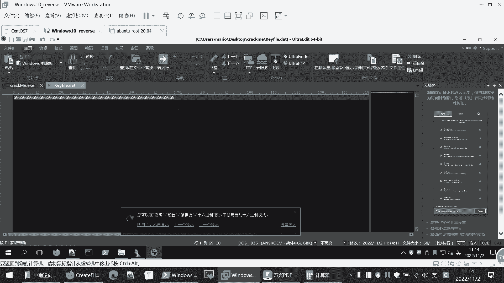

1.  文件长度至少为16个字节（根据上节课分析）。
2.  文件中至少包含8个字符‘G’（大写字母G）。

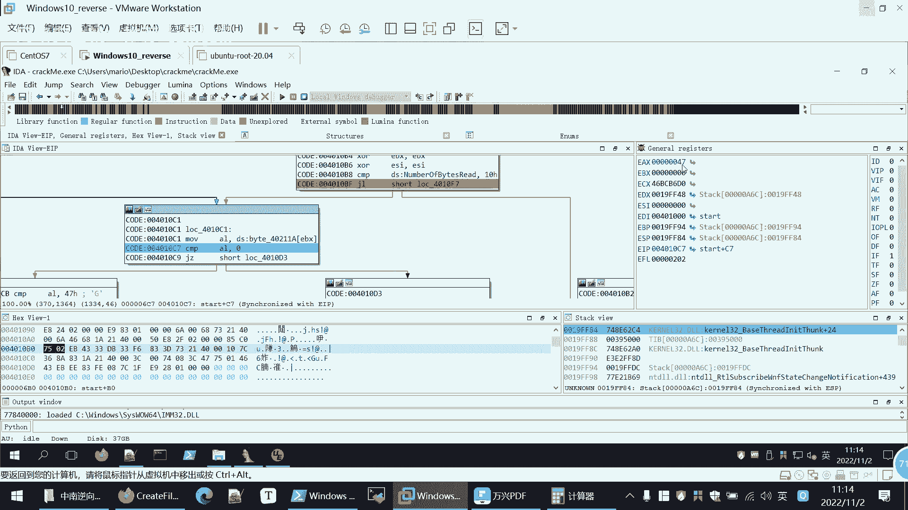

以下是创建有效验证文件的步骤：

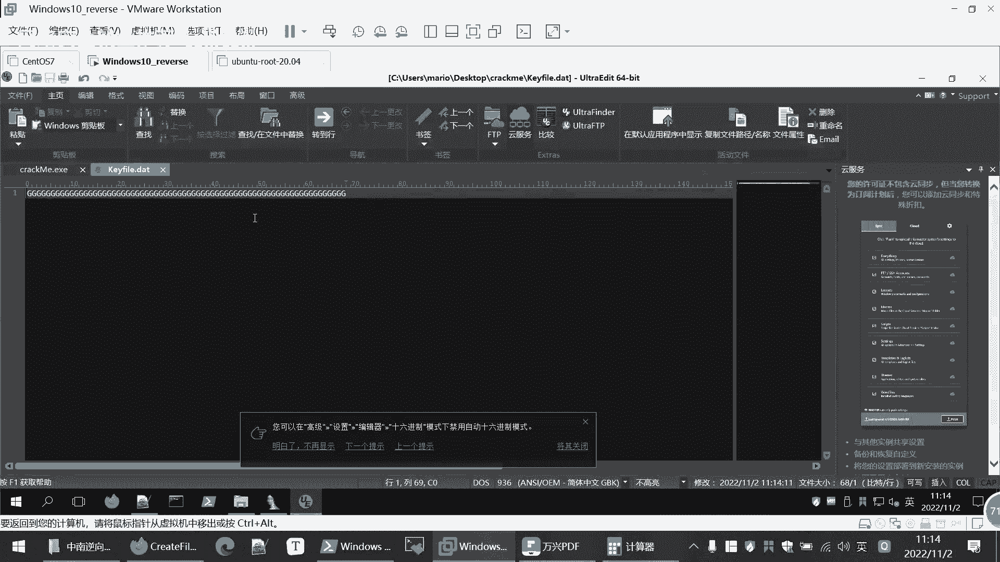

1.  创建一个名为`kfile.data`的新文件。
2.  在文件中输入至少16个字符，其中至少包含8个‘G’。例如，内容可以是“GGGGGGGGxxxxxxxx”（x代表任意其他字符）。
3.  保存文件。

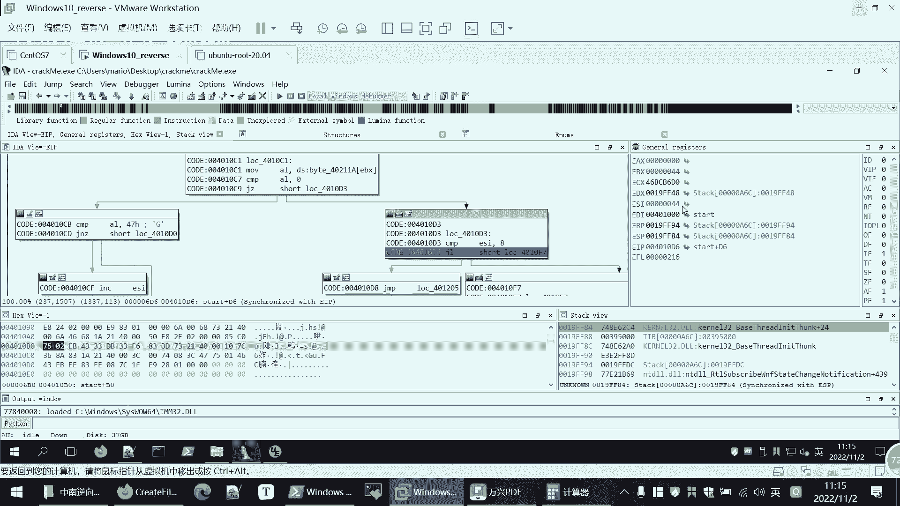

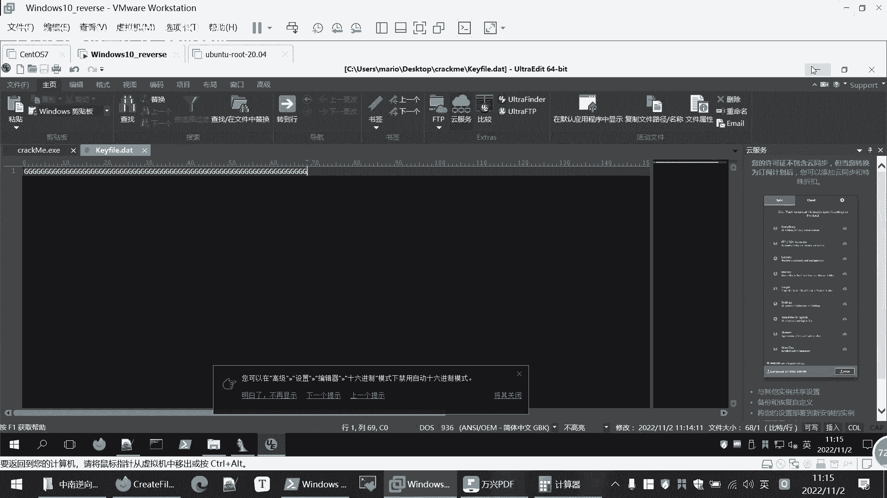

现在运行目标程序，程序将成功读取`kfile.data`文件。在循环中，每当读到‘G’时，`ESI`就会加1。循环结束后，`ESI`的值将大于等于8。

程序随后比较`ESI`与8，条件成立，执行流跳转到成功分支（例如弹出一个显示“Success”的窗口），从而完成了破解。

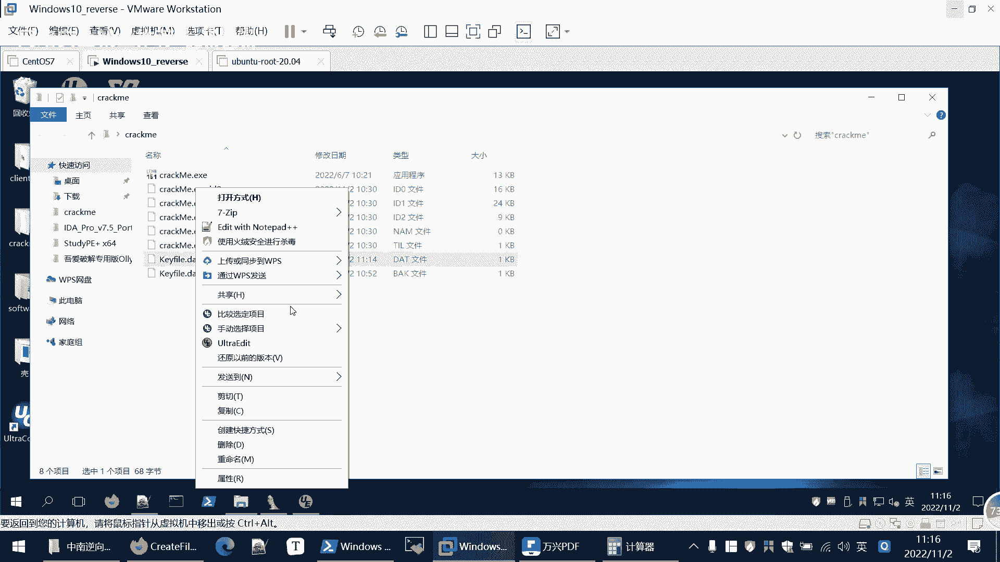

## 总结

本节课中我们一起学习了如何深入分析一个程序的验证逻辑。我们通过IDA Pro的静态分析与动态调试相结合，揭示了一个基于文件内容计数的验证机制。核心发现是：**程序通过统计文件中特定字符（‘G’）的数量来决定验证是否通过**。

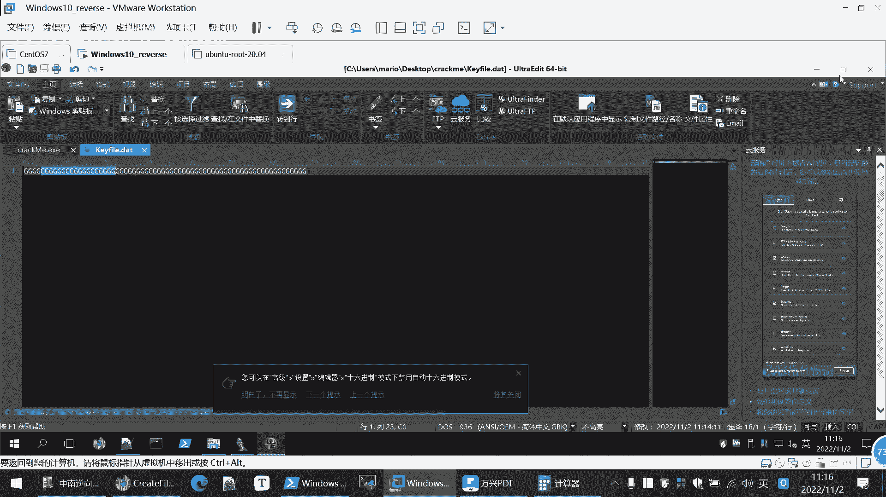

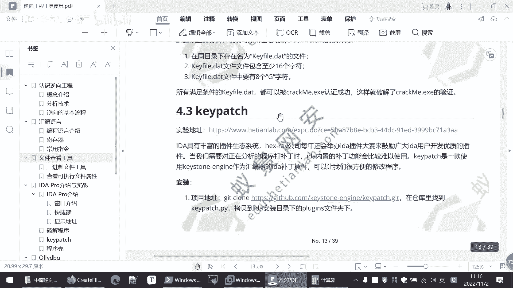

这个实例展示了软件验证的一种常见模式：程序读取用户输入（或文件），经过一系列运算后与预期值进行比较。逆向工程的任务就是解读这些运算和比较的逻辑。掌握这种方法，是理解和应对更复杂软件保护机制的基础。