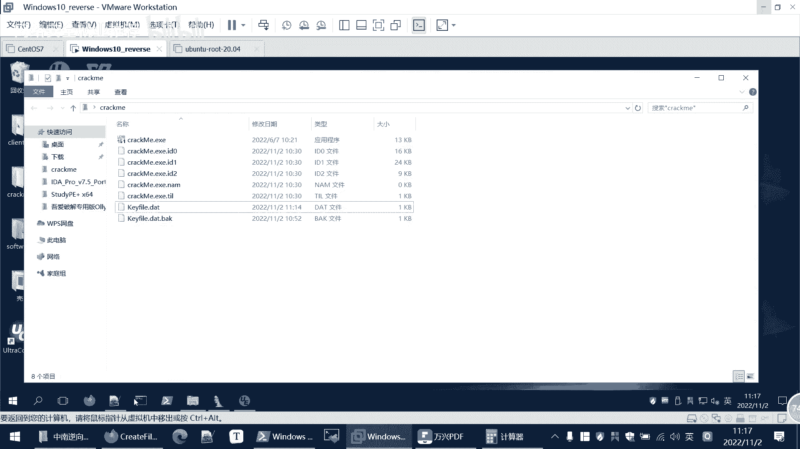
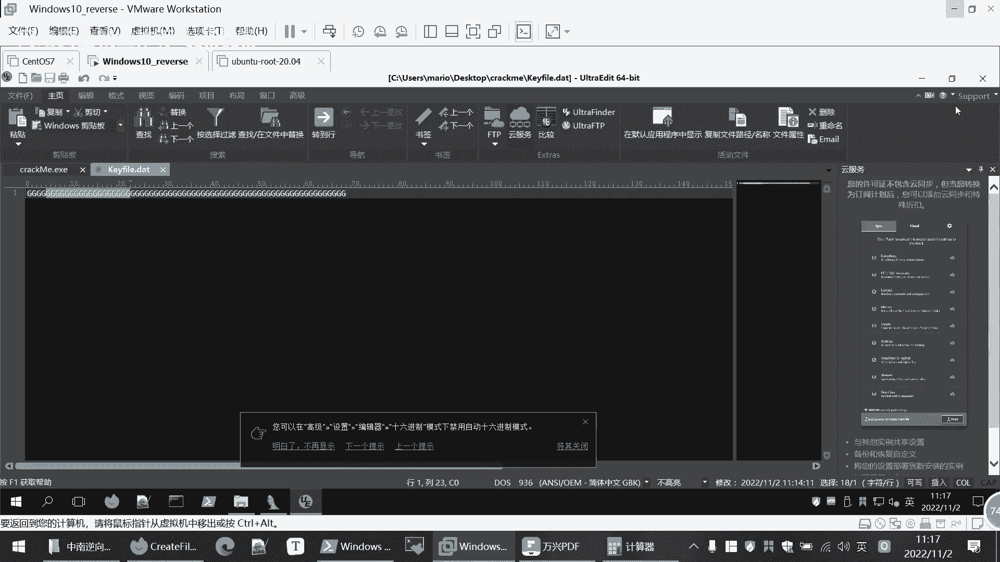
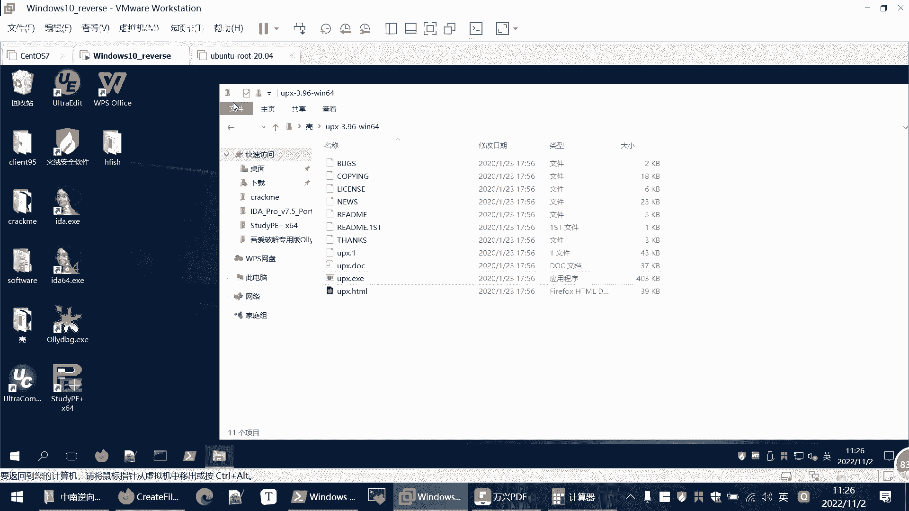
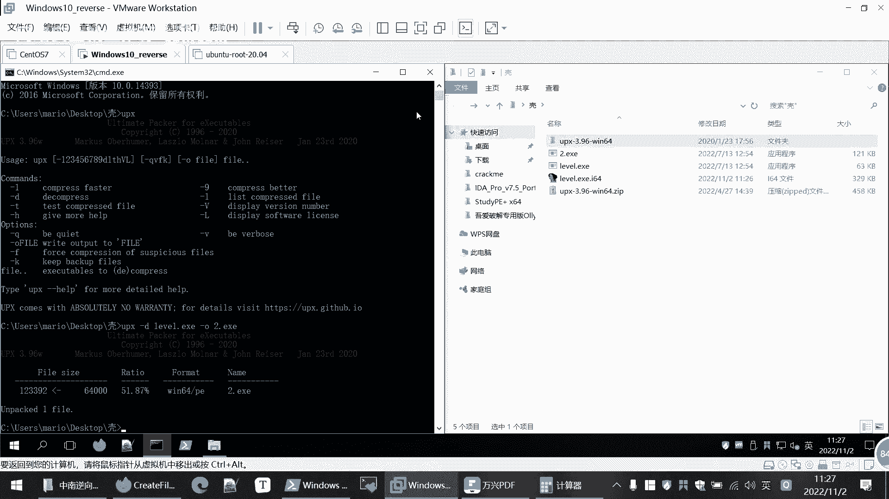
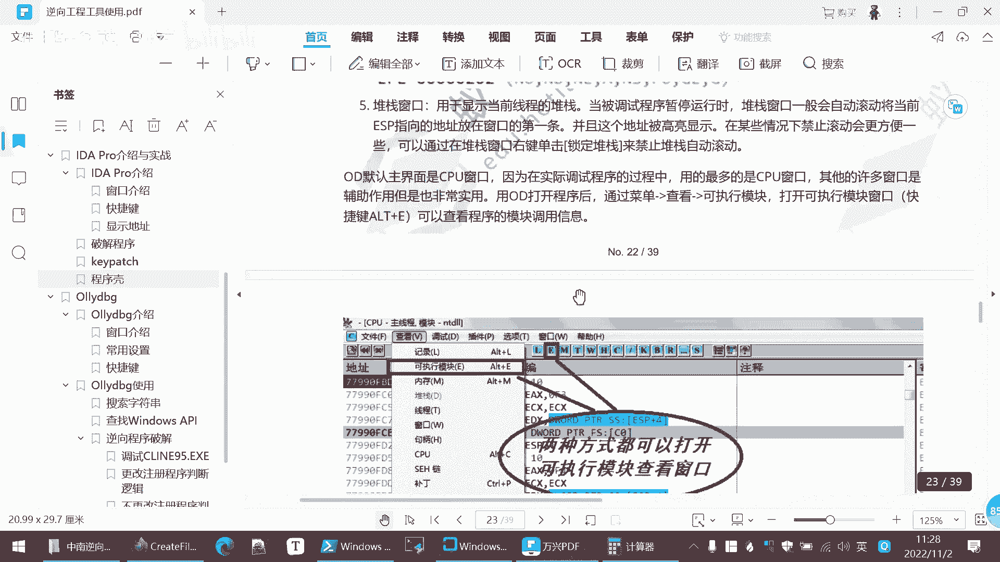

# 逆向工程课程 P96：Keypatch 插件使用与程序脱壳 🛠️

在本节课中，我们将学习如何修改程序逻辑以绕过文件依赖，并介绍如何为加壳程序进行脱壳分析。我们将使用 IDA 的 Keypatch 插件来直接修改二进制指令，并利用 UPX 工具处理常见的压缩壳。

---

## Keypatch 插件安装与使用



上一节我们分析了程序对 `kf.data` 文件的依赖逻辑。本节中，我们来看看如何通过修改程序本身来移除这种依赖。



Keypatch 是一个用于给程序打补丁的 IDA 插件。以下是安装步骤：

1.  在 Keypatch 的项目仓库中找到 `keypatch.py` 文件。
2.  将该文件拷贝到 IDA 安装目录的 `plugins` 文件夹下。
3.  重新启动 IDA，插件即可生效。

插件安装完成后，即可开始使用。我们将演示如何修改程序，使其无需 `kf.data` 文件也能运行到期望的代码段。


首先关闭当前分析窗口。


我们为程序添加一个副本。现在，程序在没有 `kf.data` 文件的情况下直接运行，这是我们希望改变的初始状态。

我们的目标是修改程序，让它不读取 `kf.data` 文件也能执行到最终的成功逻辑。根据之前的分析，我们知道第一步会检查文件是否存在，并通过 `jnz` 指令决定跳转方向。

如果我们将 `jnz`（非零则跳转）改为 `jz`（为零则跳转），就能逆转判定条件。原本跳转到左侧失败分支的路径，就会转向右侧的成功路径。

以下是修改单条指令的步骤：

1.  右键点击目标 `jnz` 指令。
2.  在右键菜单中选择 `Keypatch` -> `Patch`。
3.  在弹出的对话框中，将 `jnz` 修改为 `jz`。
4.  点击 `Patch`。插件可能会询问是否修改后续指令，选择取消，我们仅修改当前这一条。

修改后运行测试，发现并未成功。这是因为修改仅作用于 IDA 的数据库，并未实际保存到程序文件中。我们需要完成所有修改后统一保存。

同理，程序中还有其他几处依赖文件内容的判定需要修改。例如，将 `jl`（小于则跳转）改为 `jge`（大于等于则跳转），这可以通过在指令前添加 `n`（否定）前缀来实现。

以下是需要修改的关键指令列表：
*   将检查文件是否存在的 `jnz` 跳转改为 `jz`。
*   将检查文件内容长度的 `jl` 跳转改为 `jge`。
*   将验证内容是否有效的条件跳转进行反向修改。

每次修改时，在弹出提示中只应用当前指令的修改，不修改后续指令。

所有指令修改完毕后，需要将更改保存到程序文件。在 IDA 菜单栏选择 `Edit` -> `Patch program` -> `Apply patches to input file`。此时可以创建原始程序的备份。

现在，我们得到了修改后的程序。运行新程序，尽管没有 `kf.data` 文件，它也不会输出 “out of date”，这说明我们的修改生效了。如果未能到达最终成功提示，说明仍有判定点需要修改，可以动态调试并重复上述步骤进行修正。

最终，我们得到了一个无需任何外部条件即可直接运行到成功逻辑的修改版程序。

综上所述，我们掌握了两种绕过验证的方法：一是分析验证逻辑并构造符合条件的数据文件；二是直接使用 Keypatch 插件修改程序二进制代码。

---

## 程序加壳与脱壳分析

在 IDA 分析中，常会遇到加壳的程序。加壳是指在原始可执行文件（EXE）外包裹一层代码，对内部代码进行压缩或加密。程序执行时，由壳代码将原始程序解密并加载到内存中运行，这增加了直接静态分析的难度。

最常用的压缩壳之一是 UPX。下面我们通过一个实例来演示脱壳过程。

这是一个来自 CTF 比赛的题目。首先用查壳工具检查，发现它是 64 位文件，但文件类型显示为 `unknown`。

在区段信息中，我们注意到多个包含 `UPX` 字样的区段，这表明它使用了 UPX 压缩壳。如果直接用 IDA 分析加壳后的文件，主逻辑看起来非常简单，通常只调用一个复杂的解密函数，分析将难以进行。



我们需要先使用 UPX 脱壳工具进行脱壳。请确保 `upx` 命令已添加到系统环境变量中。

在命令行中，使用以下命令进行脱壳：
```bash
upx -d [加壳文件] -o [脱壳输出文件]
```
例如：
```bash
upx -d packed.exe -o unpacked.exe
```




脱壳完成后，使用 IDA 打开生成的 `unpacked.exe` 文件。此时，程序逻辑变得清晰可读，可以正常进行逆向分析，并找到类似 `flag` 的关键字符串。



这是一个简单的脱壳示例。掌握脱壳是分析此类保护程序的前提。详细的步骤也已包含在课程资料中。


---

## 课程总结 🎯

本节课中，我们一起学习了两个重要的逆向工程技能：
1.  **使用 Keypatch 插件修改程序**：通过直接修改二进制指令（如将 `jnz` 改为 `jz`），我们能够改变程序执行流程，绕过特定的条件检查。
2.  **识别与脱去 UPX 压缩壳**：我们了解了程序加壳的概念，并实践了使用 `upx -d` 命令对常见的 UPX 壳进行脱壳，为后续的静态分析扫清障碍。


掌握这些技能，能够帮助你更灵活地处理和分析各类经过保护或修改的二进制程序。