# P97：逆向工程--Ollydbg介绍及实战 - 网络安全就业推荐 - BV1Zu411s79i

wd 8简称o d呢，是windows rt 3级的一个持续调试利器，三级就是用户级嗯。

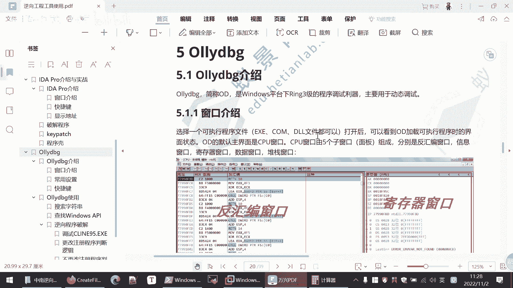

嗯它主要是用于进行一个动态调试，嗯我们这里把，把d关，把d关掉，然后我们打开这个功能debug，这是他的一个窗口好的界面，然后我们可以打开一个文件进行一个分析，我打开就打开，这个可能刚刚的九五为。

喂啊打开这个看看九五进行分析，就是它的它的一个界面。

就，这里诶，喂喂，电量极为为这个显示电量机啊，那我们来加快一点，那我就声音大一点，大家如果听不到的话，就是可以给我反馈，因为这个话筒呢它不太稳定，咳咳那我们选择一个可执行可执行文件。

然后我们打开打开之后呢，就是它的一些窗口，这里是来反馈别人窗口，然后这些寄存器的窗口，这一些信息数据对战这些窗口的，就是我们主要看的信息，就会反汇编窗口的，就是地址那个汇编代那个机器码，然后汇编代码。

然后寄存器窗口的就是查看寄存器的信息，那么刚才在a d a里面呢，也是经常需要看寄存器里面的值，这是显示这些信息的，这数据呢就是我们可以跟踪内存地址，就这一段内存，它当前的数据是什么啊，这是堆栈堆栈。

因为程序的调用啊，都需要程序的参数，都需要用到对战这些信息的。

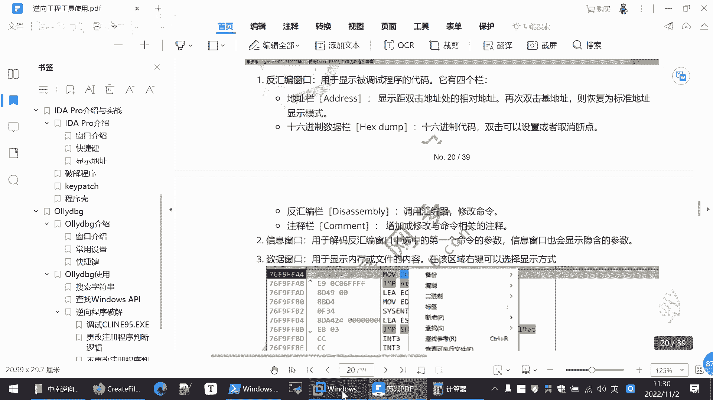

嗯我们就直接看着这是他地址，然后这是它的收集数据，也就机器码嘛，然后这是返回编出来的结果，然后我们双击一下就可以给这里加上一个断点，你按f2 也可以，f2 可以加，按断点取消断点，加断点取消断点。

然后这里再返回位，这里按一下空格，或者你双击一下，它就可以进行一个修改，比如说我们刚才的命令是吧，我们刚才改的gnz啊，这些命令都可以进行一个修改，然后这第三栏内注释你可以加一个注释。

就是这句话这一段命令是什么意思，你可以住在这注释，这它不会影响你学习执行，但是有助于我们的一个分析，啊这是寄存器，嗯这些寄存器，这里的寄存器的值呢也是能够进行修改的，因为我们可以通过改这些寄存器的值。

来修改程序的一个执行逻辑，就像刚才a d a里面那样，还有不同的跳转，我们通过它有的跳远，是通过判断寄存器的值来进行跳转的，我们可以修改，这里是一个内存当中的一些数据。

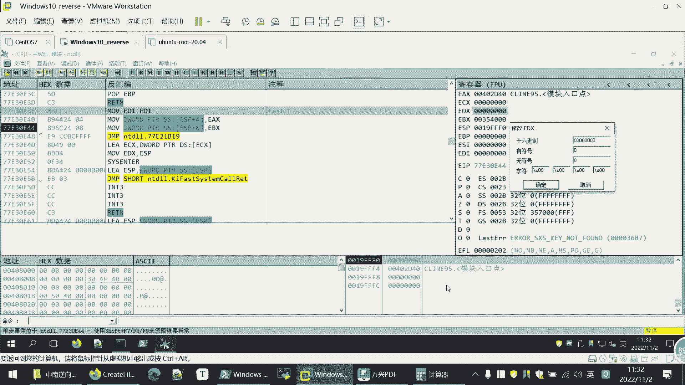

这是对战的一些情况，这些详细的啊信息都是我们看到都写了，大家课件回头会发给大家，然后大家可以在对这个课件自己再操作一下，这个设置主要就是在界面里面设置一个，u d d的目录或者插件的目录。

有时候要用到一些插件，然后快捷键呢其实这说的比较多了，常见的也就是i d里面那些f2 嘛下单点，然后呢f7 单步步入，f8 单步步入，跟id里面的逻辑是一样的，f9 是运行。

然后它的使用呢我们有两个实验，大家可以访问一下我们实验室，然后在实验室里面做实验，就像刚才a d a那样，创建新创建实验机来进行实验，第一个时间呢是给大家讲这个搜索字符串，以及如何搜索api的。

这个呢重点大家自己去操作一下我们的课程的，我们课程的时间比较紧张，这个这一部分就不给大家逐个的操作的过程，写的是很详细的，大家照着操作就行了，我们重点看一下后面的实战啊。

因为我觉得给大家讲这些操作没有实战的话，大家也记不住，重点讲的，这是实战实战中大家操作或者说有些不会的，再回过头来看一下怎么搜索字符串，这样大家会记得比较清楚一些。

然后我们的实战呢就是调试这个count 95，这个程序，我们我们看一下怎么调这个client 95 dc这个程序。

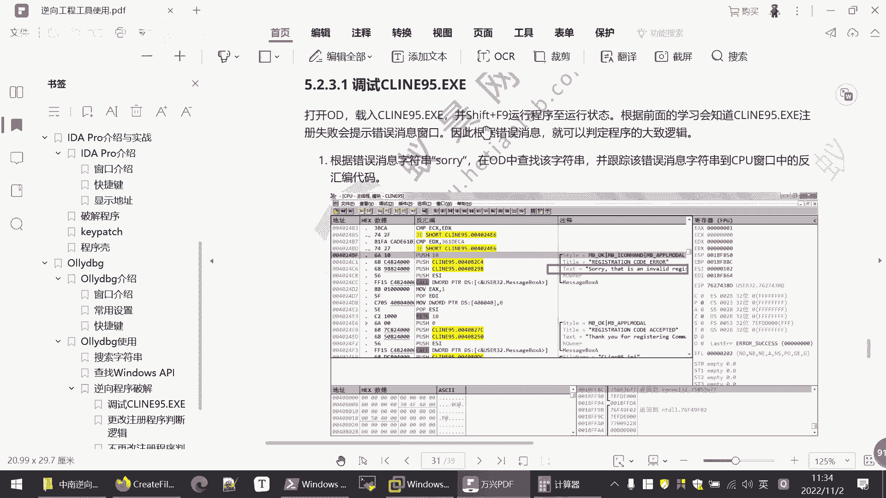

嗯这个程序是我看一下，放在这儿，这个程序呢打开是这样，让我们进行一个注册，我们随便进行注册，name 1234，随便输入一些，然后告诉我们这个registration code注册码是无效的。

invending吗，无效，那说明要验证我们的注册码，但这个注册码的验证的可能也会跟用到这个内，因为不同的人应该是有不同的注册码，这是根据我们一个经验进行判断，我们把它退出，那么现在呢。

我们就是想怎样知道他这个注册的名称。

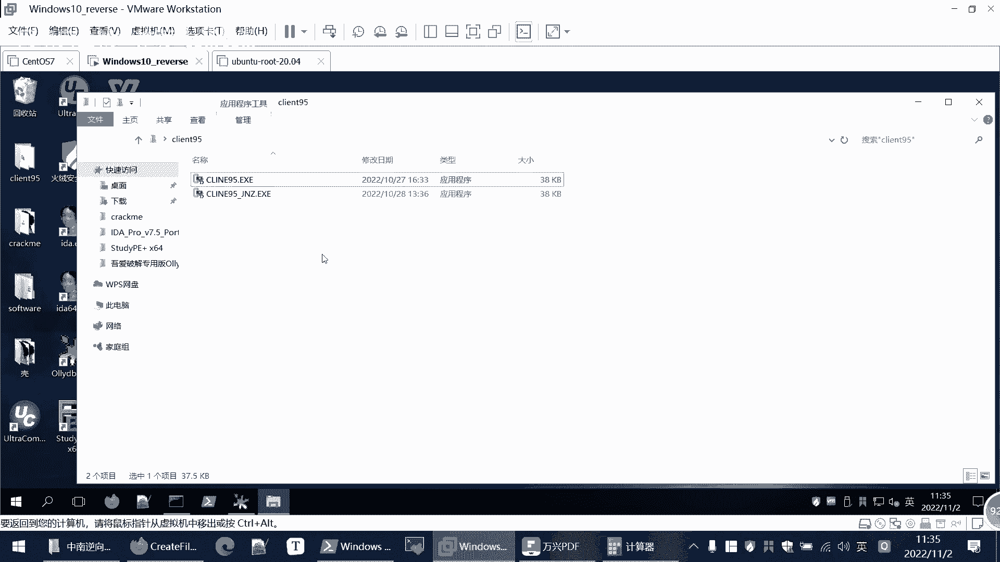

和这个注册码之间的关系，我只要找到一个正确的注册码，我们执行，因为刚才这个这个逻辑其实跟id有点像，刚才显示是什么，这不是一个有效的一个注册码，是不是啊，我们再运行一遍嗯，随便输啊，这不是一个有效的。

sorry，不是有它的注册码，我们呢在这个楼梯里面也可以搜索这个字符串，我们点击右键，在这个cpu窗口这里点击右键，然后查找查找里面呢有一个所有参考文本，这里是所有的一些字符串常量。

我们在这里面点击右键，有个查找文本查找，我们可以点击一个，sorry，我们就不区分大小写，模糊匹配，喂没找到，我看一下，这里是指没找到合人，大家想为什么会出现这个问题，明明我们在运行的时候。

它就是会弹出这个字符串，但是我为什么在程序里没找到呢，大家注意到，这时候我们，我们回到cpu窗口，回到这里，这时候我们的线线程模块是在哪，nt d啊，就是windows的进程。

就是我们还没有进入client 95这个进程里面，所以我们现在找的并不是我们当前要分析的，这个程序的数据，我们可以直接按f9 进行一个运行啊，他现在就进入到我们client 95里面的。

追到这里的一个变化，然后我们在这里面再进行一个搜索，还是查找文本，sorry，然后哎这时候就找到了，我们按ctrl可以找下一条，就是你搜索的文本可能有多多条，它可能多个地方，比如说cnet 95啊。

就就多个地方，你按ctrl就搜索下一条，那么现在这里只有一条，我们直接剪辑进去，那么就定位到这里了，这就是所有出现的地方，那这一段是什么意思呢，其实这都是汇编代码，只不过这是o d识别的时候。

汇编代码根本上你和ida识别，这汇编代码其实是差不多的，这里面呢就是参数嘛，push几个参数进去，然后呢调用这个函数，这里面他也帮我们识别出来这些参数是什么啊，其中第四这个参数就是这个文本，sorry。

这是无效的注册码，然后调用这个message box a这个函数，也就是弹框，那么可以在这弹框点下个断点，前面这个测试断点我们取消，我们取消掉，在这里面双击呢是显示这个相对距离，这是绝对地址。

这是相对相对于我目标的地址加2+4，a就是十嘛，这是绝对地址，b3 和b5 ，这相差二这个意思，这个遇到这种不熟悉的系统函数，同样的也是去查，那么这里就不重复查了，这里面就是弹框要输入这个内容，是不是。

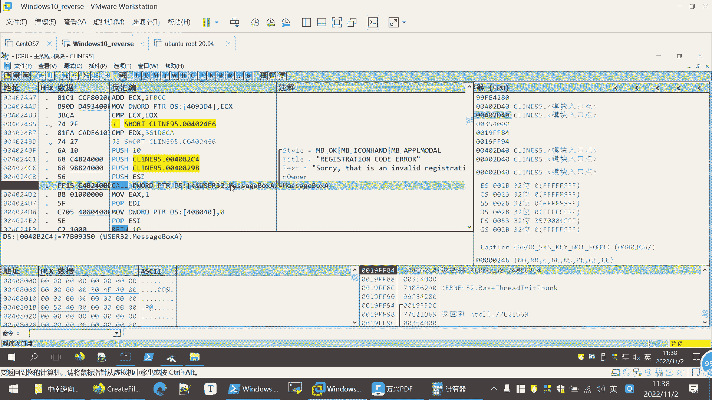

那我们首先看一下，有没有哪个地方是引用这个函数的，这个课件当中也给大家写，我们到这个函数的开始处。

点击右键查找选d命令，就可以看有没有代码跳转到这里，我们操作一下，因为进入的函数就是给它传参数，这是进入函数的这个起点，我们点击这里一下，查找参考选定命令，发现没有别的地方跳转到这里，那么做个相对应的。

我们看一下有跳转，这是一个跳转的，跳转到哪里，跳转到这儿，我们在这里点击右键查找参考选择命令，就会看到啊，有两个地方是跳转到这里，那么现在这里呢它是没有地方跳转过来的，说明他是顺序执行到这儿了，是不是。

那么就要看一下它上面几行的一个代码，这里是发现上面的几行有点怕，接e就是结就是降频嘛，e就是e口相等，就降频就跳转，那么我们可以分析一下这两个地方，跳转是跳转了，这里面有个箭头可以收起。

打开他就会指示你我跳到哪儿去，跳转到都是跳转到这儿，我们这里做一个标识，然后下面这个呢你看他们跳转的命令是一样的，跳转的目的地都是一样的，都是跳转到这，那说明程序执行到这的时候，这么顺序执行。

如果它跳转了，就不会弹出这个无效的注册吗，没跳远继续执行，在这里又再进行一次可能要跳转的判断，如果不跳转就执行这个错误弹窗，相当于，因此呢这两个跳转是不是我们研究的一个关键，如果说他跳转走了。

那就不会报这个无效的一个注册码，是不是科技堂主也给他写。

那么跳转它是根据什么跳转的，这里我们看一下第一个跳转，它判定条件是什么，它的判定还在上面，它就比较我们放大一点嗯，比较这个ecx和e d x的值，相等的话，则跳转下面呢是比较e d x和这个361d。

e c这个值是否相等，说明这e c s e d x，它是决定我们注册码是否有效的一个关键，或者说他判定中筹码是否有效。

就是经过一系列操作，然后把值放在e4 x e d x里面来进行比较，程序的逻辑呢就这样，那么遇到这种情况呢，同样呢也是两种方法，第一种呢好就是我不更改它的判断逻辑，就是我修改程序，就像d那样。

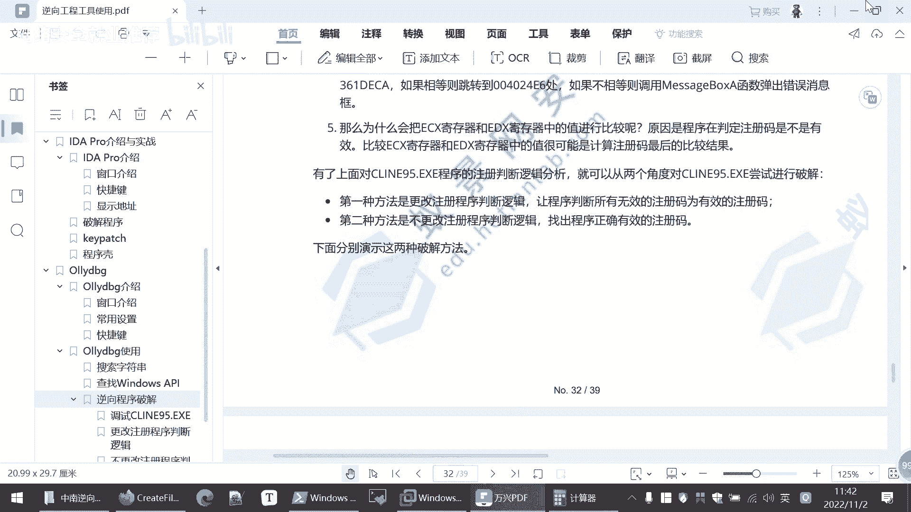

我把那个判定条件改了，这里是跳转吗，我搞成不跳转，接e接n e进行一个，命令的修改是不是就像i da一样可以。

第二种呢就是找出他的判断逻辑，它是怎样进行验证的，要找出正确的验证码，我们来分别看一下。

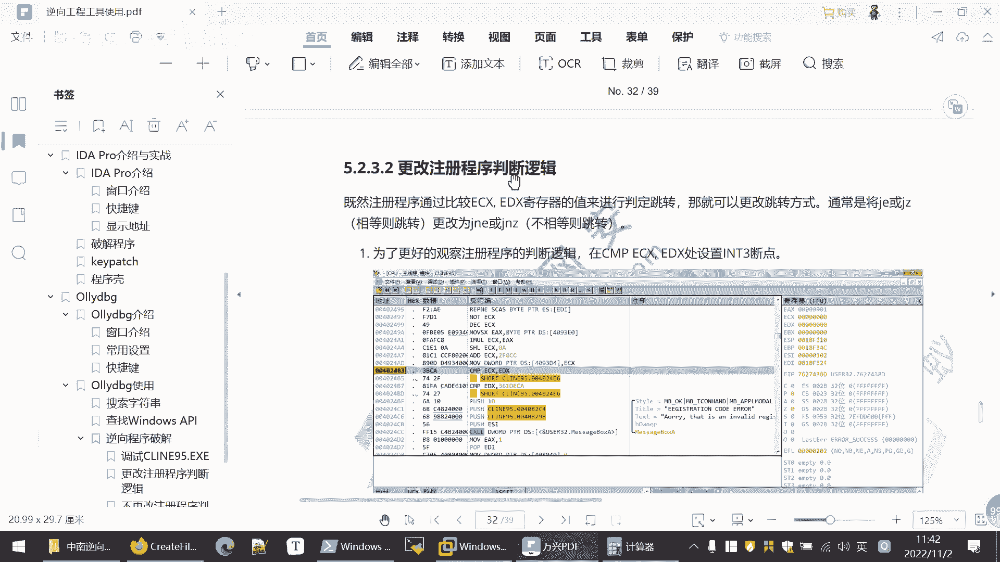

然第一种就是更改程序的判断逻辑，也就是修改程序，修改程序呢，我们这里的就是他不是这里ec s e d s吗，我们先嗯先在这里下上断点，然后先直接运行一下，看一下结果是什么。

我们先把这个关了。

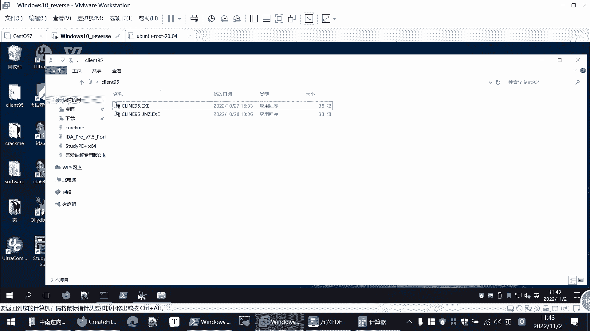

嗯我们重新开始调试。

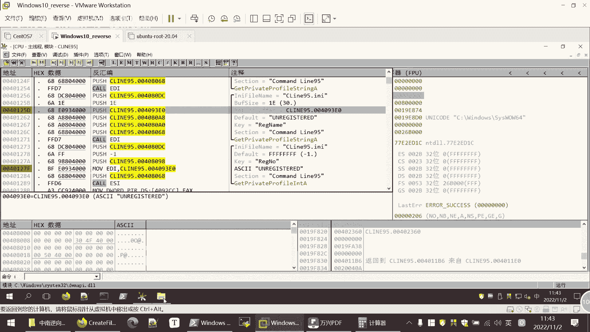

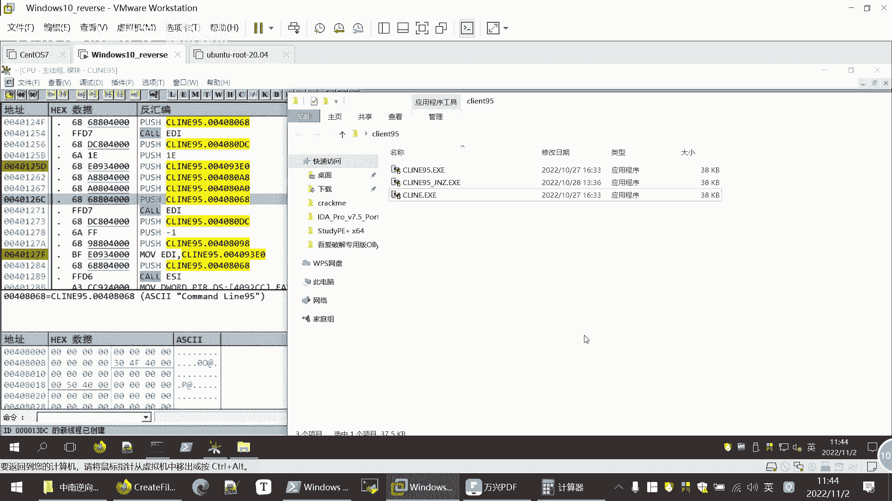

因为我之前分析过，这样就不是从头开始分析，对大家有一定的干扰。

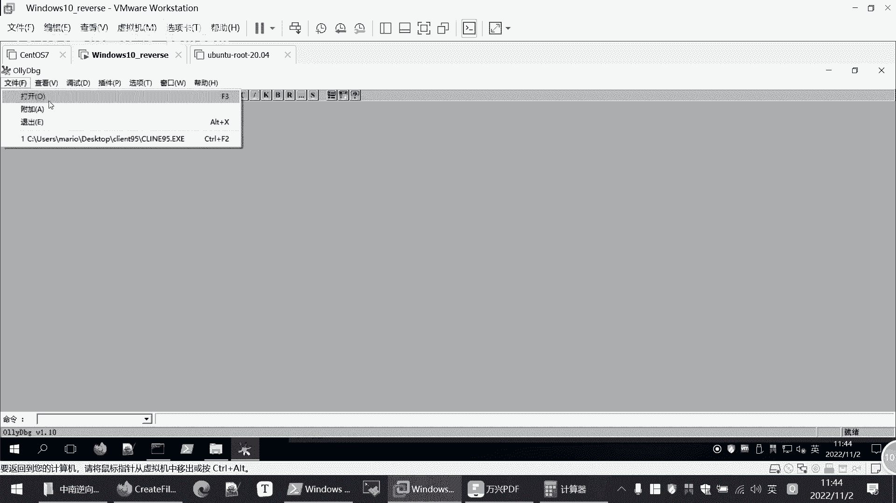

所以说现在重新把这个文件复制一下，然后我们打开这个刚复制的client这个文件，在这里进行一个分析，这样就是一个从头开始的分析吧，然后呢我们进入到content这个线程里面，然后查找文本。

在这里面下降站点，然后到相关这个前面两个判断处理下个断点，然后我们继续运行。

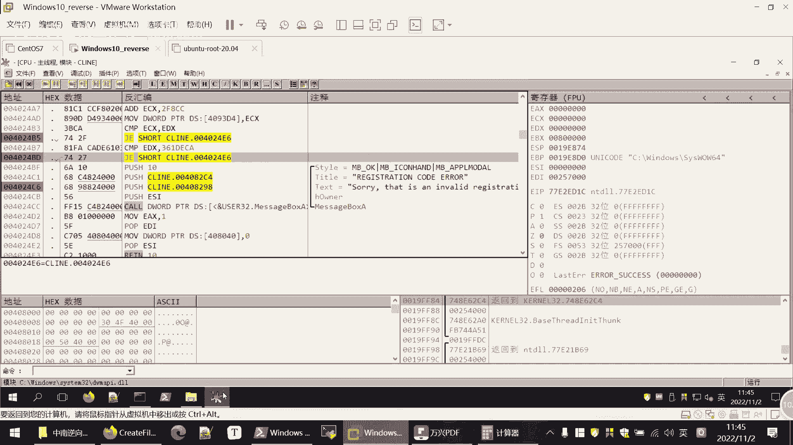

然后他会给我们弹出这个框，你程序运行到这里，需要注册信息的，我们这里随便输入123123。

然后呢，ok，我们看程序运行到这里，黑色的是程序正在运行的，那么他刚刚进行判断什么e4 x e d s，e c x呢是这个e d x，这他们明显是不相等，所以它不会进行跳转。

我们下一步要比较e d x和这个361t，e d s，那明显不能三天又要d，那这样就会弹出这个错误的一个框。

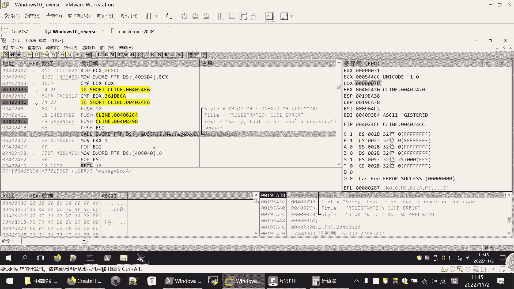

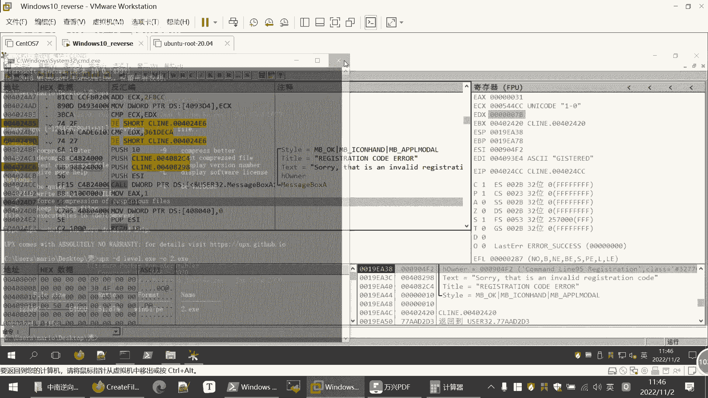

这个弹窗，这样就会到这个报错这里面，this is an inven，是不是，这有点卡了，把它关了，再重新，那我们刚才运行到这里呢，它是会报这个无效的注册码，所以这里我们可以尝试改一下它的这个命令。

修改程序写n e，然后点击汇编就填充，后面的也不要继续填充了，那么这里就改了，然后我们继续执行，发现他就进行了一个跳转，是不是他不再执行这个，不再报这个没有无效的验证码这个问题了。

我们继续执行直接f9 ，那现在就很棒，你已经注册成功了，说明我们只要改这个判定就可以注册成功。

也就是更改注册逻辑，当我们更改后呢，这是只是在我们o d里面进行改，同样的也需要进行一个保存，保存的方法就是在我们，这后面给大家写在我们文件当中，选择保存文件就可以了，这是一种方法。

然后呢第二种呢就是不更改程序判断逻辑的，控制一下时间，全是对象的事情嗯，那我们就是后面的，那就是不是给大家实操的，我们看一下课件就行了，我们加快一下进度，这是就是更改程序。

但是我现在还不知道他是怎么样验证注册码，是不是我直接改它的判定条件，相对于它本来是判定你就是一个无效的注册码，这是有效的一个注册，这是一种结局，破解程序的方法，第二种方法呢。

就是我把它的程序的判断逻辑弄清楚，这个其实难度更大一些，在很多时候更有效一些，因为很多时候没法改这个程序的一个代码，只能搞清楚它的一个运行逻辑，我们就可以啊，继续进，像在刚才的地方进行判定的地方，继续。

然后我们执行的时候呢也是继续调试嘛，然后输入我们这里呢给大家输入的是find me，123，然后注册码是123456，之前讲了，这逆向的时候，我们就要根据这个数据流跟踪数据流。

那么这个范的me 123和123456啊，就是我们需要跟踪的数据流，我们就要在内存中跟踪它，然后继续运行，运行呢我们在文本窗口中要进行一个搜索，搜索find me 123。

然后呢我们再出现find me，123的地方都向上断点，这是第五步吗，向上断点，然后下单点之后再继续执行，就那么在相当一点的地方就会暂停，是不是，暂停了，因为这些地方都会用到final b23 。

我们就看一下它怎么用到fb 3的，就是怎样用到我们输入的一个注册名，然后大家运气的话，就会在这个402461这个地方端下来，那这个地方是怎么用的注册名单，那还是用了这个函数，这个函数的作用。

就是从我们的窗口中获取注册名，所以这里面就是获取我们的fb e s，获取之后呢，他后面要进行一个计算，后面关计算的关键代码，就这一块还是怎么样进行计算的呢，就算关代码给大家摘出来。

它是首先要读取他把这个啊用户名注册码，他先把注册码传到一点x寄存器当中保存下来，然后呢把用户名就是ftp 123放在e4 x当中，然后计算它的值，那么e4 x当中呢，就是用户名字符串的一个长度。

然后呢他再取到这里是取bt就是取字节，取这个用户输入的用户名的第一个字节，我们这里是f，然后他对这个f这个字节进行一系列的计算，有这个相乘啊，左移啊，这些运算运算之后呢，就会得到一个注册码。

然后呢他将e c，所以这个时候e c x存的，就是根据用户名计算得到了一个注册码，那么e d x呢就是我们输入的一个注册码，他在比较这两个注册码是否相等，如果相等的话，那么我们输入的注册码就是有效的。

否则就是无效的，这就验证逻辑，所以这个时候我们只要从e4 x中读，去除这个注册码，然后我们再进行注册的时候，我们填的注册码，就是我们刚刚读取出来注册码就可以了。

然后我们从e4 s中我们输入final me 123，从ecs中读到的注册码是多少呢，是0x115 ，零cc要用5g cc，这是16进制，然后我们输入的值是十进制，因此呢，我们可以在计算机里面。

把这个16进制转换成一个十进制，1150cc它的十进制的就是1134796，所以这个时候，如果说你输入的用户名是方便面123的话，那么你对应的注册码就是这个1134796。

这样就知道你不管你输入什么别的用户名，你都都可以跟踪跟踪，在记录下这个时候e4 x的值，然后把这个值，寄存器的值以16进制形式转换成十进制形式，然后输入就可以注册成功，这里面给大家说几点，第一点了。

注册成功之后，会在我们本地产生一个ccd 950 ii的配置文件，如果说大家想重复进行测试的话，要删除这个配置文件，这个配置文件一般在c windows目录，或者是你用户名下面的一个这个目录当中。

在这讲目录当中都有可能就是你做过一遍，想重复做，你得把这个文件删除掉才行，要不然他说你已经注册过了，不然你再注册，第二个呢，我们就可以发现这个client 95呢是只用到了。

我们用后面的第一个字字符来进行计算的，所以说你只要用户面的第一个字符相同，它的注册码都是相同的，第二个呢这个程序是有隐藏后门的，因为在比较的时候比较了两个地方，一个是e比较两次嘛。

e4 s和e d s是否相等，第二个一dx和这个31361d，e c a是不是相等，这是一个隐藏的后门儿，所以说我们家要输入的验证码，是这个0x361 d e c a的十进制值，就是56745674。

那么你不管说什么用户名都是可以注册成功的，那么对于o d呢就给大家简单介绍这么多，这些实，这些实操呢，大家都可以去我们和天文实验室上做这个链接，也是发给大家的，就是在课程当中后面都会给大家的。

然后总结一下逆向分析的建议，就是首先大家要了解一个编码的风格，大家要有自己要有一些编码的经验，然后集中原则就是往往这个代码段是在一起，然后数据是在一块，然后代码复用就是一个人编写这个程序的时候。

会大量用到带相同的代码，他很多时候也会用到一些开源的代码，可以在github中进行搜索，然后七分力量三分差，我们的逆向之前说了，不是说能够有固定的公式推第一步就确定，第二步很多时候要根据经验要进行猜测。

那猜测之后呢，你要验证要运行一下验证，来测试你的猜测是否正确，还有就是第五点，区分代码，我们要区分哪些是这个开发者写的代码，哪些是使用的一个库函数等等，库函数就不要进去分析了，就啊库函数就直接在搜索。

在这里面搜索这块是什么作用，然后就是要有耐心，因为我们的立项都是比较复杂的，那么今天课程的主要内容就这么高啊，大家有什么疑问可以提出来，然后没有疑问就不耽误大家了，我们下课。

