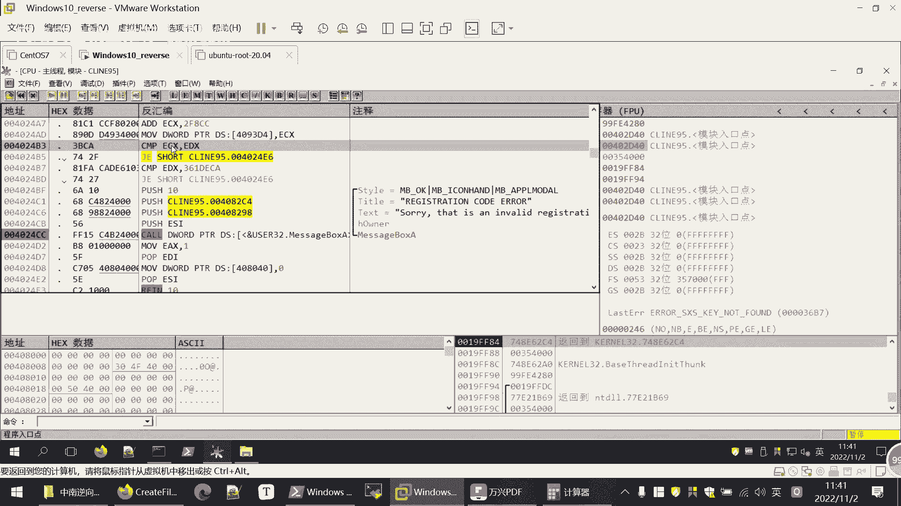
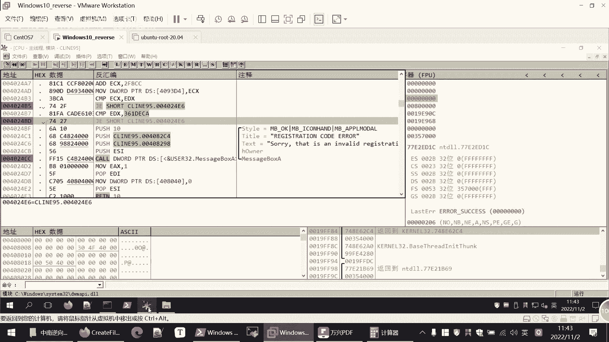

# 逆向工程课程 P97：Ollydbg 介绍及实战 🛠️

在本节课中，我们将学习一款强大的 Windows 用户级动态调试工具——Ollydbg（简称 OD）。我们将了解其基本界面与功能，并通过一个实战案例，学习如何使用它来分析和破解一个简单的软件注册验证逻辑。


---

## Ollydbg 界面与基本功能


上一节我们提到了 Ollydbg 是一款动态调试利器。本节中，我们来看看它的主要界面窗口和基本操作。


打开 Ollydbg 后，可以通过菜单栏的 `File` -> `Open` 加载一个可执行文件进行分析。其主界面主要包含以下几个关键窗口：


以下是各窗口功能的简要说明：
*   **反汇编窗口**：显示程序的机器码和对应的汇编指令。这是分析代码逻辑的核心区域。
*   **寄存器窗口**：实时显示 CPU 各寄存器的值。在分析时，我们经常需要查看和修改寄存器的值来改变程序执行流程。
*   **数据窗口**：用于查看和跟踪特定内存地址中的数据。
*   **堆栈窗口**：显示当前的堆栈信息。函数调用、参数传递等都依赖于堆栈。

在反汇编窗口中，我们可以进行以下关键操作：
*   按 `F2` 键或双击地址左侧区域，可以**设置或取消断点**。
*   双击汇编指令或按空格键，可以**修改该处的汇编代码**。
*   在注释栏可以为指令添加说明，这有助于分析，但不会影响程序执行。

寄存器窗口和数据窗口中的值也支持直接修改，这为我们动态调试和测试猜想提供了便利。


---

## 常用快捷键与基本设置


熟悉了界面后，高效的调试离不开快捷键。Ollydbg 的快捷键逻辑与许多调试器类似。

以下是几个最常用的快捷键：
*   `F2`：在当前位置设置或取消断点。
*   `F7`：单步步入（Step Into）。遇到函数调用时会进入函数内部。
*   `F8`：单步步过（Step Over）。遇到函数调用时，将整个函数作为一步执行。
*   `F9`：运行程序，直到遇到断点或程序结束。

关于设置，通常需要在 `Options` -> `Interface` 中指定 UDD（用户数据）和插件的目录，以便保存调试数据和加载功能插件。

---

## 实战：破解 CrackMe 程序

理论学习之后，我们通过一个名为 “CrackMe95” 的实战程序来应用所学知识。我们的目标是分析其注册验证逻辑。

### 程序行为观察


首先运行目标程序 `CrackMe95.exe`。


程序界面要求输入 `Name`（用户名）和 `Registration Code`（注册码）。我们随意输入，例如 `Name: 1234`, `Code: 1111`，点击 `OK`。


程序会弹窗提示 “Sorry, this is an invalid registration code.”。这表明程序对我们的输入进行了验证。


### 定位关键字符串


我们的思路是，在程序中搜索这个错误提示字符串，从而定位到验证逻辑所在的代码区域。



1.  用 Ollydbg 载入 `CrackMe95.exe`。
2.  **确保程序已运行**：载入后，当前模块可能显示为系统模块（如 `ntdll`）。按 `F9` 让程序运行起来，使其进入 `CrackMe95` 自身的代码空间。
3.  在反汇编窗口点击右键，选择 `Search for` -> `All referenced text strings`。
4.  在弹出的字符串列表窗口中再次点击右键，选择 `Search for text`，输入 “Sorry”。


5.  找到字符串后，双击它，OD 会跳转到引用该字符串的代码位置。





### 分析验证逻辑


我们定位到了显示错误信息的代码块。可以看到，在弹窗函数 `MessageBoxA` 之前，有两个条件跳转指令（`JE`）。


程序逻辑是：如果这两个跳转条件**任何一个**成立，程序就会跳走，从而**跳过**错误弹窗。只有两个条件都不成立时，才会顺序执行到弹窗代码。因此，这两个跳转是验证是否成功的关键。


向上查看代码，找到决定跳转的条件：


*   **第一个跳转**：取决于 `ECX` 和 `EDX` 两个寄存器的值是否相等。
    ```assembly
    CMP ECX, EDX
    JE ... (跳转到成功流程)
    ```
*   **第二个跳转**：取决于 `EDX` 是否等于一个固定值 `0x361DECA`。
    ```assembly
    CMP EDX, 361DECA
    JE ... (跳转到成功流程)
    ```

由此可知，`ECX` 和 `EDX` 寄存器中存储的值是验证的核心。`ECX` 很可能是程序根据我们输入的 `Name` 计算出的“正确注册码”，而 `EDX` 是我们输入的“待验证注册码”。


### 方法一：修改程序逻辑（爆破）

这是一种直接的方法：我们不让程序进行复杂的比较，而是直接修改指令，强制让它跳转到成功分支。

1.  在第一个跳转指令 `JE` 处按 `F2` 下断点。
2.  按 `F9` 运行程序，在弹出的程序窗口中随意输入 `Name` 和 `Code`，点击 `OK`。
3.  程序会在断点处暂停。观察寄存器窗口，此时 `ECX` 和 `EDX` 的值通常不相等，所以第一个跳转不会发生。
4.  双击这个 `JE` 指令，将其修改为 `JNE`（不相等则跳转），或者直接改为无条件跳转 `JMP`。


5.  按 `F9` 继续运行。程序将跳转到成功流程，弹出注册成功的提示。


**保存修改**：在菜单栏选择 `File` -> `Save file`，可以将修改后的程序保存到新文件。

### 方法二：分析算法，获取真码

这种方法旨在弄清程序计算正确注册码的算法。

1.  重新载入原始程序，在验证代码段下断点。
2.  运行程序，输入一个特定的用户名进行测试，例如 `Name: findme123`, `Code: 123456`。
3.  程序断下后，我们**跟踪数据流**。在内存中搜索字符串 “findme123”，并在所有引用它的代码上下断点。
4.  重新运行并跟踪，会发现程序调用函数获取用户名后，进入一段计算代码。


分析这段计算代码（课件中已提取关键部分）：
*   程序读取用户名的第一个字符（‘f’ 的 ASCII 码）。
*   对该值进行一系列**乘法、移位**等运算。
*   最终结果存放在 `ECX` 寄存器中，这就是针对用户名 `findme123` 计算出的正确注册码（十六进制）。
*   程序随后比较 `ECX`（计算值）和 `EDX`（输入值）。

5.  当程序运行到比较指令时，从寄存器窗口直接读取 `ECX` 的值。例如，得到 `0x1150CC`。
6.  使用计算器，将其转换为十进制：`1134796`。
7.  重新运行程序，输入 `Name: findme123`, `Code: 1134796`，即可注册成功。

**额外发现**：
*   该程序只使用了用户名的**第一个字符**进行计算，因此只要首字母相同，注册码就相同。
*   第二个比较 (`EDX == 0x361DECA`) 是一个**后门**。无论用户名是什么，只要输入十进制 `56745674`（`0x361DECA` 的十进制），都能注册成功。

---

## 逆向工程分析建议 📝

在本节课的最后，我们总结一些逆向分析的通用建议：
*   **具备编码基础**：了解常见的程序结构和编码风格，对逆向分析大有裨益。
*   **代码与数据分离**：程序通常将代码段和数据段分开存放，分析时注意区分。
*   **善用代码复用**：开发者会复用代码或使用开源库。遇到似曾相识的代码块，可以尝试在互联网或代码库中搜索。
*   **大胆假设，小心验证**：逆向没有固定公式，常需要根据经验猜测程序逻辑，然后通过调试去验证猜测。
*   **区分自有代码与库函数**：集中精力分析程序自身的业务逻辑，对于系统或第三方库函数，了解其功能即可，不必深入其内部。
*   **保持耐心**：逆向分析是一个细致且耗时的过程，需要耐心和坚持。

---


本节课中，我们一起学习了 Ollydbg 调试工具的基本使用方法，并通过一个 CrackMe 程序的实战，掌握了两种基本的软件逆向分析思路：**修改程序逻辑**和**分析验证算法**。希望大家通过实验进一步巩固这些技能。