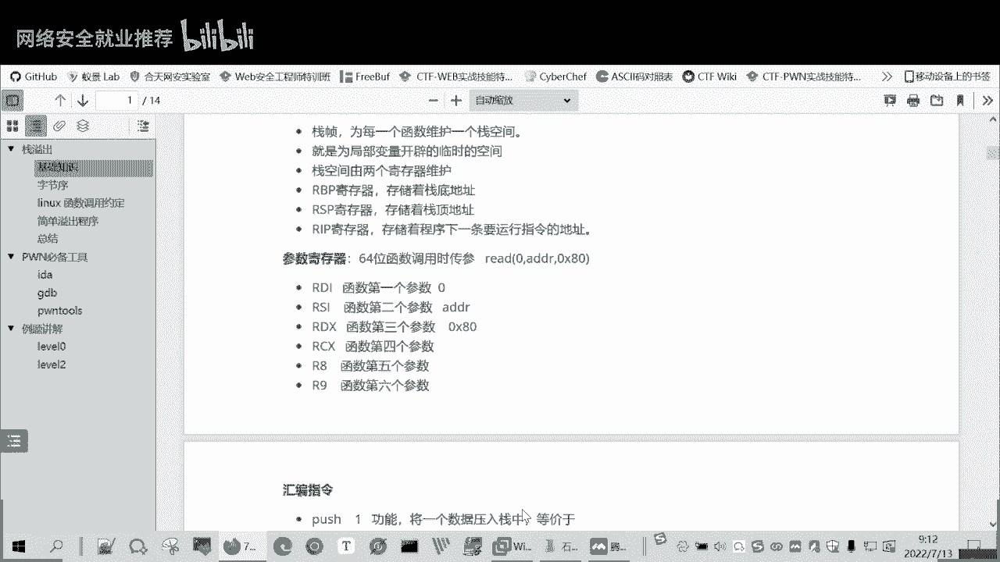
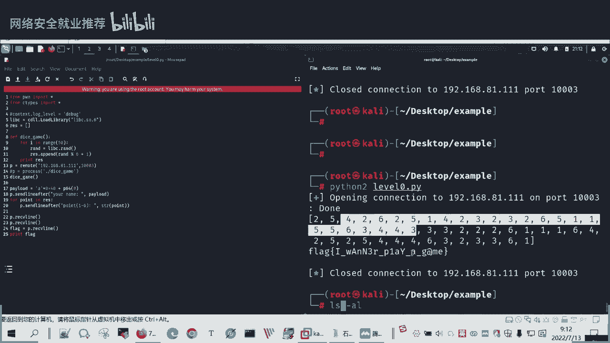

# P98：CTF-PWN-栈溢出-栈环境集参数寄存器 - 网络安全就业推荐 - BV1Zu411s79i

今天呢就是你学习这个cctf胖嗯，今天内容呢就是分为三部分，主要上午会是分为三部分，下午是说要进行一个小测验，要做几道题，然后我们再讲一讲一下这几道题，下午的安排长，上午呢就是讲三部分。

一部分战役出的一些概念知识，然后呢就是胖的一些工具的使用，这i d昨天介绍过，主要还有另外两种工具，然后再就是两个例题，那我们看第一部分就是战役出的一些概念，我们说的我们说的这个胖呢。

就是其实是一个本来是一个谜语，但是现在也是一个规范用法了，就是在cctf比赛中代表溢出类的题目，主要考研都全对漏洞利用能力，所以溢出呢这里还先给大家讲，看一下后面的一个图，然后大家更好地理解这个溢出。

所以溢出呢就是说本来我给这个输入，或者是我给啊一个一段参数啊，不管是什么，我给他分配一段空间，它本来是应该在0x80 ，就是800h那个就是16进制吧，本来是应该在这个空间内活动的。

但是你现在输入的数据太多了，超过打开分配的空间，他就把别人的空间给挤占了，比如下面的是一个占地的一个地址，在下面是一个返回函数的，它函数返回的一个地址，那你如果说输入的数据太多了，就叫溢出了。

超出它原有范，然后把下面的占地址给占了，那么这几个程序就会报错，那如果说你不想让它报错，那你就可以设计这个输入，你使它超出的部分是你所构造的一个配套的，你构造的一个地址。

那么它就会它本来是返回到一个正常的函数，它就会返回到你所指定的一个位置，那么就造成了一个漏洞的利用，这是溢出，然后胖呢就是就是考察这个溢出类的题目，这里一些相关的概念就是站环境。

因为我们的溢出主要是站那堆，就在这这里面，溢出的，战争呢就是说为每一个函数维护的一个占空间，因为一个函数它要有一个输入，这个输入呢是放在这个战争里面的，它是会局部变量开辟的临时工业。

我这个函数你写完之后返回的时候，那么我这个函数的战争，我这个函数的站环境也就清除了，那么这个占空间是有两个寄存器维护的，就是r b p r s p这64位的，32位的就是e b p e s p。

昨天也介绍过这个计算器这个而bp的b就是base，它是栈底，它是个基数，然后s呢就是占地，战警的机制，这里还给大家提到一个题，说一下这个r i p寄存器ip的，就是存放着下一条要运行的指令的地址。

那么我们进行溢出利用的时候，实际上就要想方法，能够把我们下一条要运行的指令，修改成我们想要执行的指令，而不是他程序原本正常执行的一个指令，就通过溢出来改变这个ip的值。

然后这还有一个参数寄存器给大家说一下，就是函数在传参数的时候是用了什么寄存器，比如说我们有个read函数，就是读还有三个参数，它第一个参数就会放在r d i g存器里面，九零这个零是代表标准输入。

就是我们linux里面0121是标准输出，二是error，标准输入就是从我们的命令行输入。

你你在这这里输入这标准。

输入，然后第二个他第二个参数呢就是一个地址，是放在rsi这个计算机相中地址，就说那我读读数据，这个数据的地址是放在哪，我从哪获取这个数据，然后第三个第三个参数放在r d x里面，这里是0x80 。

接着说我读取数据是读多少个数据，如果有第四个参数的话，就放在r c x里面，第五个是r8 r9 ，然后在后面第六个之后的第七个，第八个就要放到站里面了，而32位的寄存器的。

32位的函数呢是直接放在栈里面的，这是他们的一个区别，我们后面会在啊举个例子实操一下。

看它的参数怎么传递的。