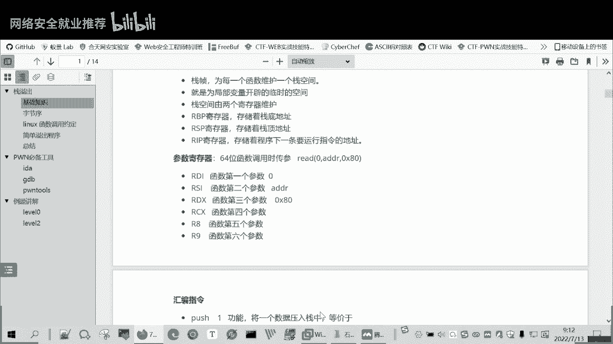
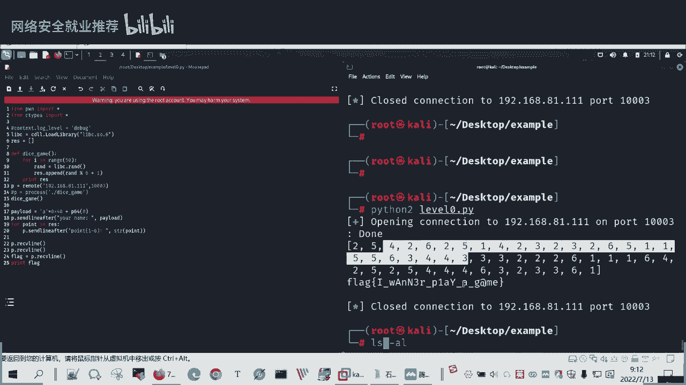
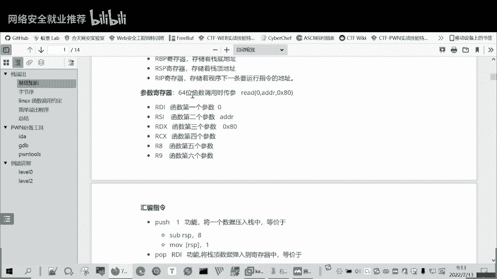

# P98：CTF-PWN-栈溢出-栈环境与参数寄存器 🧠💻

在本节课中，我们将要学习CTF-PWN中栈溢出的核心概念，包括栈环境的基本结构和函数调用时参数传递的规则。理解这些基础知识是后续进行漏洞利用的前提。

## 栈溢出概念介绍

上一节我们介绍了PWN的基本含义，本节中我们来看看“溢出”的具体概念。

我们所说的PWN，在CTF比赛中特指溢出类题目，主要考察对漏洞的利用能力。溢出是指：程序为输入数据或参数分配了一段固定空间，但实际提供的数据量超过了这个空间。例如，一个缓冲区本应在`0x80`（十六进制）的空间内活动，但输入数据过多，就会侵占相邻的内存空间。

在栈结构中，如果输入数据过多，超出了为其分配的缓冲区范围，就可能覆盖下方的栈地址，例如函数返回地址。这通常会导致程序报错。但如果精心构造输入数据，使超出的部分包含一个我们预先设定好的地址，那么程序在返回时，就会跳转到我们指定的位置执行代码，这就实现了漏洞利用。PWN题目主要就是考察这类溢出漏洞的利用。

## 栈环境与关键寄存器

理解了溢出的基本概念后，我们来看看实现溢出的关键战场——栈环境。

栈环境是为每个函数调用维护的一块内存空间，用于存放函数的局部变量和临时数据。函数执行完毕后，其栈空间会被清除。在64位系统中，主要由两个寄存器维护栈空间：
*   **RBP**：栈基址指针（Base Pointer），指向当前栈帧的底部。
*   **RSP**：栈顶指针（Stack Pointer），指向当前栈帧的顶部。

在32位系统中，对应的寄存器是**EBP**和**ESP**。

此外，还有一个至关重要的寄存器：
*   **RIP**：指令指针寄存器，存放着下一条将要执行的指令的地址。

进行栈溢出利用的核心目标，就是通过覆盖栈上的数据，最终改变**RIP**寄存器的值，使其指向我们想要执行的指令，而非程序原定的指令。

## 函数参数传递规则

在掌握了栈和寄存器的基本作用后，我们来看看函数调用时参数是如何传递的，这对于构造利用链至关重要。

函数调用时，参数传递的规则因系统架构而异。以下是64位Linux系统下的常见规则：

以下是参数传递顺序：
1.  前六个参数依次放入以下寄存器：**RDI**, **RSI**, **RDX**, **RCX**, **R8**, **R9**。
2.  如果参数超过六个，从第七个开始，将被压入栈中传递。

以一个常见的`read`函数为例，其原型为`read(int fd, void *buf, size_t count)`：
*   第一个参数`fd`（文件描述符，如0代表标准输入）放入**RDI**。
*   第二个参数`buf`（存储读取数据的缓冲区地址）放入**RSI**。
*   第三个参数`count`（要读取的字节数，如`0x80`）放入**RDX**。

而在32位系统中，所有参数通常都通过栈来传递。

（图示：标准输入、输出、错误流的关系）

（图示：函数调用时栈与寄存器的状态示例）

（图示：参数在寄存器和栈中的传递示意）

---

本节课中我们一起学习了栈溢出的基本原理、维护栈环境的关键寄存器（RBP/RSP/RIP）以及64位与32位系统下函数参数传递的不同规则。理解这些概念是分析漏洞和构造利用载荷的基础。在接下来的课程中，我们将运用这些知识，结合工具进行实际操作。